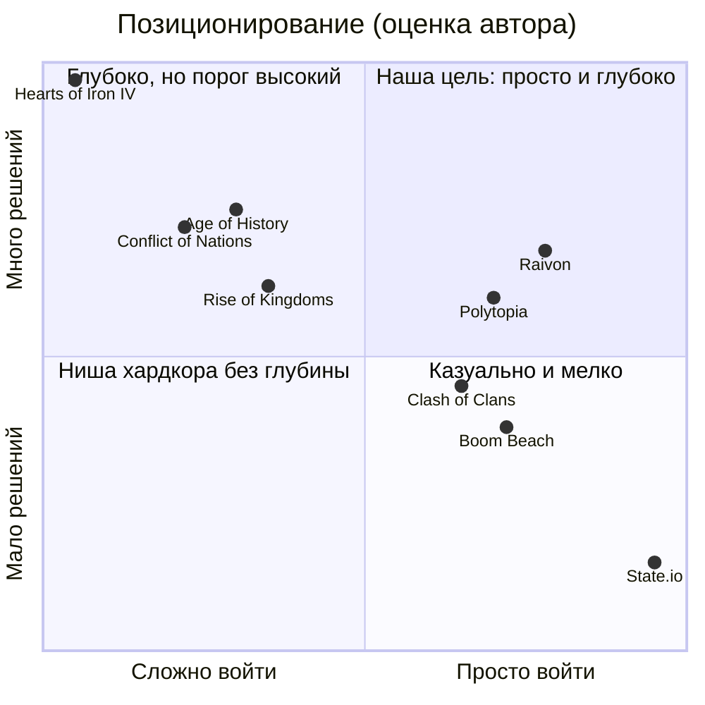
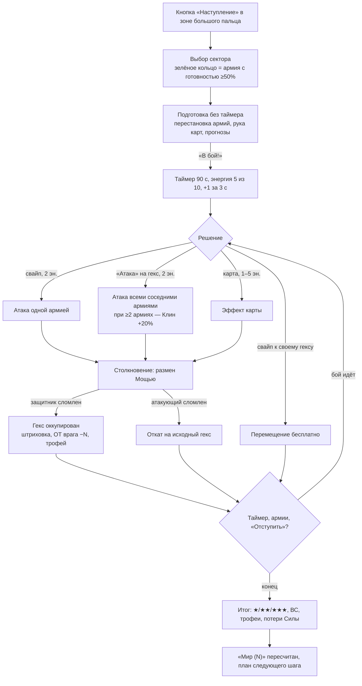
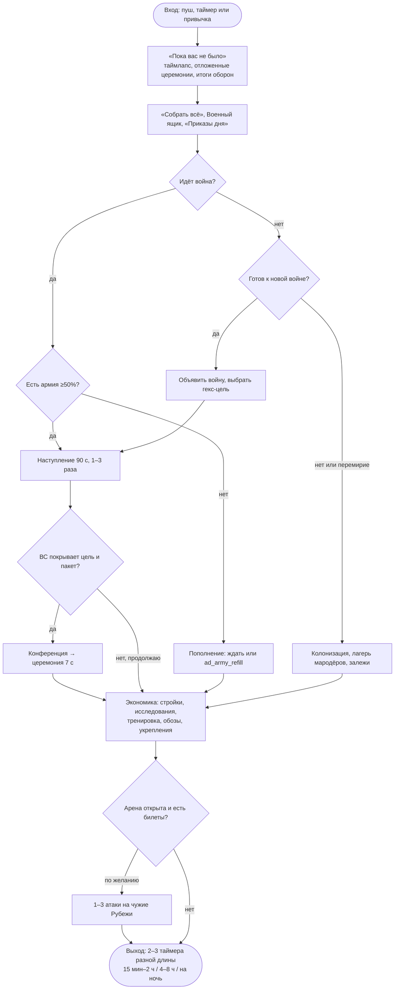
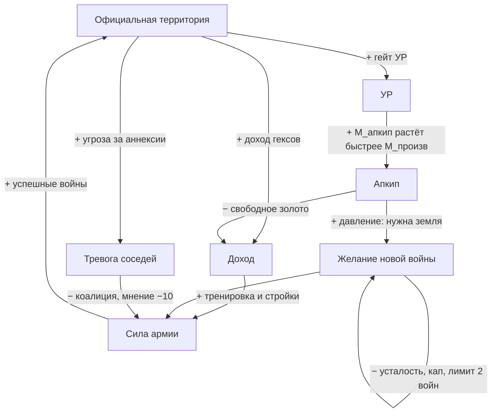
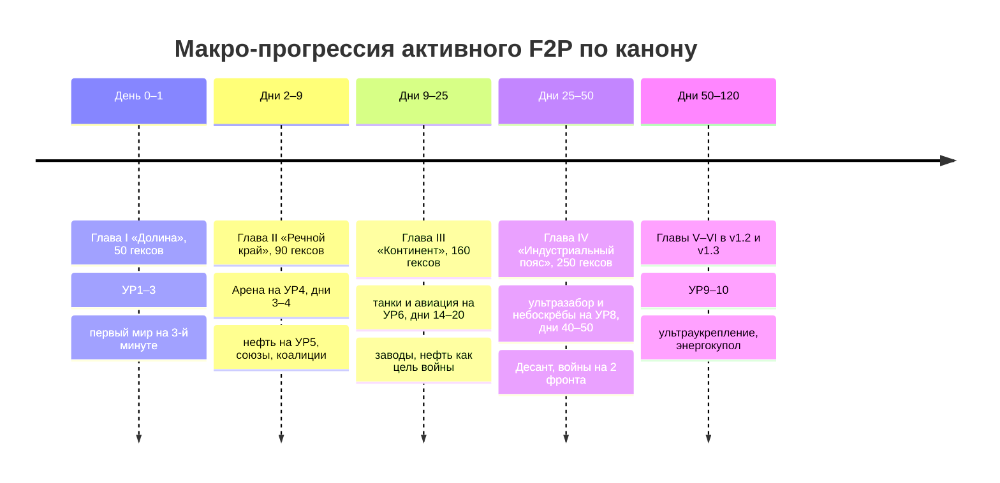
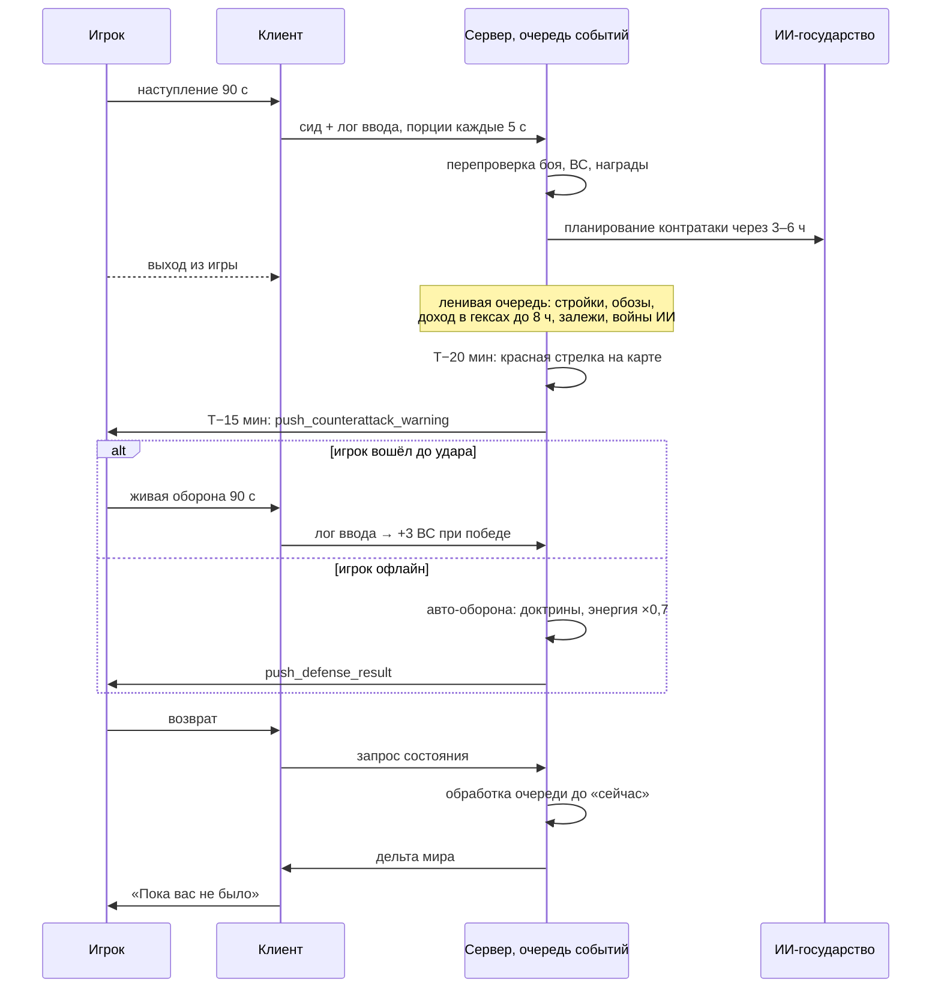
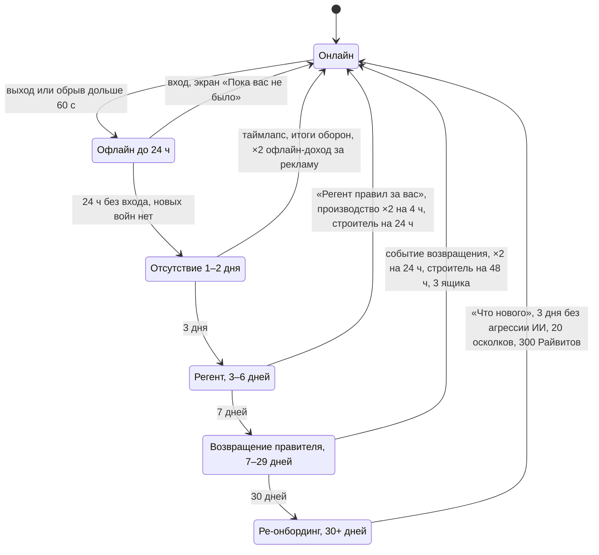
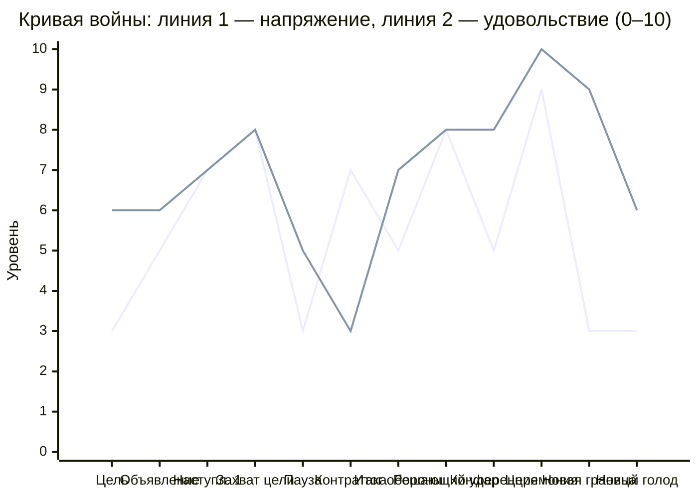
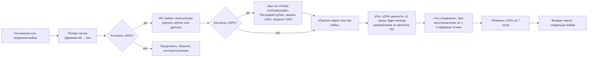

# 1. Видение и кор-луп

> **Назначение.** Этот файл задаёт, *зачем* существует каждая механика Raivon: видение, пять столпов с проверяемыми критериями, аудиторию и персоны, позиционирование, кор-луп на трёх уровнях, ритм сессий (онлайн и офлайн), «день из жизни» игрока, эмоциональную кривую войны, маппинг 9 концептов брифа, анти-цели и тексты для сторов.
> **Опирается на § канона:** 1 (суть, столпы, ЦА, референсы, USP, маппинг), 2 (решения владельца), 14.1–14.8 (удержание, ритм, FTUE, крючки, возврат); числа берутся из §6, 9.1–9.4, 9.11–9.15, 10.3, 12.1, 13, 15.2, 17.
> **Связанные файлы:** `02_map_territory.md`, `03_war_combat.md`, `04_units_army.md`, `05_economy_buildings.md`, `06_diplomacy_peace.md`, `07_progression_meta.md`, `08_retention_liveops.md`, `09_monetization.md`, `10_ui_ux_art.md`, `11_balance_numbers.md`, `12_tech_analytics_roadmap.md`.
> **Граница зоны:** здесь нет чисел баланса и правил боя. Числа ниже цитируются из канона. Значения, которых в каноне нет, помечены «(предложение автора)».

---

## 1.1. Видение

### 1.1.1. Формула продукта

**Маленькое синее государство превращается в огромную державу. Для этого не нужна тотальная война: хватает коротких умных войн, выгодных мирных договоров и эволюции от халуп до небоскрёбов, и всё это на одной живой карте.**

Главное удовольствие игры — видеть, как **синий цвет шаг за шагом занимает карту** (бриф). Мы даём этому удовольствию:
- **ритм Clash of Clans**: таймеры, строители, сессии по ~6 минут, 5 раз в день;
- **понятность State.io**: свайп «от своего к чужому» и одно число Силы на фигурке;
- **смысл глобальных стратегий**: оккупация отделена от границы, есть военный счёт, мирная конференция, котлы и коалиции.

Сложности глобальных стратегий и PvP-стресса в Raivon нет.

### 1.1.2. Фантазия игрока

> Ты правитель хутора на 7 гексов. Кремнёвые Бароны сожгли твою пограничную мельницу. На третьей минуте ты прижимаешь сургучную печать, и толстая граница твоей страны перетекает на отбитые гексы. Через неделю у тебя порт, союз с Речной Лигой и первая нефть. Через месяц по твоим дорогам идут танки, а в городах растут стеклянные башни. Через два месяца на ключевых рубежах стоит ультразабор, в каждом городе стоят небоскрёбы, а треть континента синяя. Соседи шепчутся о коалиции.

### 1.1.3. Целевые ощущения по масштабам времени

| Масштаб | Ощущение (одной фразой игрока) | Чем создаём | Признак, что работает |
|---|---|---|---|
| 90 секунд | «Я продавил фронт» | свайп, прогноз мечей до решения, Клин/Окружение/Коридор, захват гекса на глазах | игрок запускает второе наступление в той же сессии |
| Сессия (~6 мин) | «Я продвинулся» | видимый прирост синего, закрытые и новые таймеры | столп 1, критерий P1.1 |
| Война (часы) | «Я перехитрил» | военный счёт, котлы, мир в выгодный момент | столп 3, критерии P3.2–P3.4 |
| Неделя | «Моя держава взрослеет» | повышение УР, новая глава, новая техника и облик | столп 5, критерий P5.3 |
| Месяц | «Я построил империю» | доля карты в %, «Таймлапс державы», ультразабор на «Дороге державы» | D30 ≥7%, шеринг таймлапса |

### 1.1.4. Тон и сеттинг

- **Мир Райвон вымышленный.** Государства, лидеры и гербы процедурные (канон §10.4, §16.3). **Реальных стран, флагов, исторических лиц и узнаваемой идеологической символики нет** (предложение автора: это снимает региональные риски глобального запуска 12+).
- **Стиль — «настольная диорама»** (канон §16.4): low-poly модели, тёплый свет, тактильные фигурки. Война выглядит как игра солдатиками на столе, а не как военная хроника.
- **Насилие на уровне 12+.** Крови нет. Побеждённые фигурки опрокидываются в облачко и уходят с белым флагом. Ядерного оружия нет.
- **Юмор и характер.** Бельё на верёвке у халуп. ИИ-лидеры с характером: Волк, Лис, Черепаха, Ворон, Сова. Короткие реплики, например: «Кремнёвые Бароны готовят удар по Медной шахте».
- **Эволюция вместо эпох.** Один мир проходит путь от плетня до энергокупола (10 УР, канон §6.1). Это не исторические эпохи, а взросление *твоей* державы.

### 1.1.5. Инварианты видения (решения владельца)

Эти пункты не обсуждаются ни одной фичей. Строка таблицы показывает, как решение ощущается игроком.

| Решение | Что это значит для опыта | Детализация |
|---|---|---|
| PvE-основа, PvP только в отдельном режиме (1, 9) | На державу в кампании нападает только ИИ и только по объявленным правилам. «Арена Рубежей» включается по желанию и не трогает карту | `03`, `07` |
| Сквозная эволюция с растущим апкипом (2) | Каждый УР меняет облик всего: от заборов до ультразаборов, от халуп до небоскрёбов. Большая держава стоит дорого | `05`, `07`, `10` |
| Реальное время, как в CoC (3) | Таймеры, строители и войны тянутся между сессиями | `03`, `05` |
| Только онлайн (4) | Без сети игры нет. Сервер — судья экономики и наград | `12` |
| 12+, весь мир сразу (5) | Мультяшный конфликт, 12 языков, одинаковые правила для всех | `08`, `10` |
| Разработчик — ИИ-агент (6, 10) | Весь контент в YAML и коде, арт процедурный (Blender), вместо QA — автотесты | `12` |
| Кейсы, лутбоксы, паки и косметика обязательны и **одинаковы во всех странах, включая платное открытие** (7, 13) | Раскрытие шансов и гарант только **дополняют** кейсы. Гео-замен и отключений нет | `09` |
| Государство нельзя потерять; поражение = часть земли и грабёж 30–60%, в обе стороны (8, 12) | Поражение болезненно, но обратимо. Игрок грабит ИИ теми же правилами | `03`, `06` |
| Инфраструктура $100/мес на старте (14) | Мир игрока симулируется лениво, бой считается на клиенте и перепроверяется сервером | `12` |

### 1.1.6. Фильтр решений (порядок приоритетов)

При конфликте целей авторы и ИИ-разработчик проверяют фичу сверху вниз. Порядок — **предложение автора**.

1. **Инварианты (§1.1.5).** Нарушение — фичу отклоняем без обсуждения.
2. **Столп 2 «Понятно за 30 секунд» и столп 1 «Синий растёт»** — равный высший приоритет. Отклоняем фичу, если она требует обучения дольше одного жеста или прерывает рост синего, особенно церемонию.
3. **Столп 3 «Ограниченная война»** важнее столпа 4 «Цена гекса». Глубина формы фронта не должна делать тотальную войну выгоднее короткой.
4. **Столп 4** важнее столпа 5 «Держава стоит денег». Апкип давит на расширение, но не заставляет воевать за любой гекс.
5. **Монетизация и удержание** подчиняются всему выше: запреты канона §14.10 действуют безусловно.

**Чек-лист новой фичи** (5 вопросов, «нет» на любой — на доработку):
1. Делает ли она рост синего заметнее или быстрее понятным?
2. Понятна ли она новичку без текста за ≤30 секунд, или её можно спрятать до УР, на котором она нужна?
3. Не делает ли она длинную тотальную войну выгоднее короткой?
4. Работает ли она через ценность конкретных гексов и форму фронта, а не через абстрактный бонус?
5. Можно ли сделать её строкой YAML и процедурным ассетом, без ручного арта и ручных скриптов?

---

## 1.2. Пять столпов и проверяемые критерии

Столпы — канон §1.1. Ниже к каждому даны правила для авторов и критерии, которые проверяются автотестом (CI), экономическим или боевым симулятором (SIM), закрытым тестом (CBT, вопрос Q17) или аналитикой после запуска (LIVE). Названия событий аналитики и способ их сбора задаёт `12_tech_analytics_roadmap.md`.

### 1.2.1. Столп 1 «Синий растёт»

**Суть.** Каждый заход в игру двигает синий по карте. Пик удовольствия — церемония мира (канон §10.3), её ничто не прерывает.

**Правила для авторов:**
- «Шаг синего» — любое из событий: завершённая колонизация, новая оккупация, подписанный мир с аннексией, обмен территориями с приростом, «Мир расширяется». Оккупация (штриховка) и официальный рост (контур) различимы визуально, но **оба считаются ростом**.
- Если в сессии шаг синего невозможен (все соседи в перемирии, диких земель нет), он хотя бы **запускается**: колонизация или марш армии к фронту с таймером, видимым прямо на гексе.
- Церемония мира (7 с), повышение УР (6 с) и «Мир расширяется» (последнее — предложение автора, вопрос В7) — **защищённые состояния**. В них заблокированы реклама, офферы, пуши, системные окна игры и всплывашки достижений.
- **Ни одно изменение облика державы не проходит без зрителя** (предложение автора). Если мир по капу, завершение колонизации, повышение УР или «Регент» сработали офлайн, на экране «Пока вас не было» проигрывается отложенная церемония: контур перетекает, гексы делают «поп». Одно событие играется целиком, несколько — сокращённо (§1.7.7).
- Доля карты главы в % видна на главном экране и в счётчиках церемонии («Карта главы 34% → 42%»).

| ID | Критерий | Как проверяем | Порог | Источник |
|---|---|---|---|---|
| P1.1 | Доля сессий ≥3 мин, в которых был шаг синего или запуск шага с таймером на гексе | LIVE | ≥85% | предложение автора |
| P1.2 | Реклама, офферы и пуши в защищённых состояниях | CI: state-guard тест на все UI-переходы | 0 нарушений, блокер релиза | канон §14.10; способ проверки — предложение автора |
| P1.3 | Изменения границы и облика, случившиеся офлайн, проигрываются при возврате | CI: сценарный тест «офлайн-мир по капу → вход» | 100% | предложение автора |
| P1.4 | Время от установки до первого расширения контура | CI: headless FTUE; LIVE | ≤3 мин (мир 1 на 1:30–2:30) | канон §14.3 |
| P1.5 | Подписали первый мир | LIVE | ≥92% (минимум 85%) | канон §17 |
| P1.6 | Доля игроков D7, которые досматривают церемонию мира без ускорения ×3 хотя бы раз в день | LIVE | ≥50% | предложение автора |

**Анти-пример.** Стартовый оффер появляется поверх церемонии. Или граница «тихо» меняется ночью, и утром игрок не понимает, откуда у него новые гексы.

### 1.2.2. Столп 2 «Понятно за 30 секунд»

**Суть.** Новичок без текста за 30 секунд захватывает гекс и видит рост границы. Глубина открывается слоями по УР.

**Правила для авторов:**
- **Один жест — одно действие** (канон §9.3). Новый жест в игру не добавляется.
- **У армии одно число — Сила.** Атаки, HP и брони для игрока не существует.
- **Прогноз до решения.** Пока игрок тянет приказ, на цели видны мечи (зелёные/жёлтые/красные), коэффициент и значок формы.
- **На экране боя не больше 5 типов игровых сущностей:** гекс, армия, укрепление, карта, шкала контроля. Трактовка автора: гарнизон — это число на гексе, башня относится к укреплениям, контур котла и стрелка подкреплений — разметка гекса. Полоса энергии, таймер, кнопки «Мир (N)» и «Отступить» — интерфейс, а не сущности.
- Механика объясняется иконкой, цветом и анимацией. Текст — только подпись **≤40 символов** (предложение автора; лимит длины строк проверяется скриншот-тестом локализации, канон §16.4).
- После FTUE в первые 7 дней — **не больше одной новой механики за сессию**. Исключение — новые карты руки: они показываются в фазе подготовки наступления (предложение автора).

| ID | Критерий | Как проверяем | Порог | Источник |
|---|---|---|---|---|
| P2.1 | Тест «30 секунд без текста»: захват гекса и рост границы | CI: headless FTUE на каждом билде | проходит, блокер релиза | канон §1.1, §16.5 |
| P2.2 | Новички без подсказок захватывают первый гекс за ≤30 с | CBT: запись первых сессий | ≥80% | предложение автора |
| P2.3 | Типов игровых сущностей на экране боя | CI: линтер сцены и скриншот-тест | ≤5 | канон §1.1 |
| P2.4 | Атакующий приказ подтверждён без показанного прогноза | CI: UI-тест | 0 случаев | канон §1.1, §9.3 |
| P2.5 | Прошли 10 минут FTUE | LIVE | ≥85% (минимум 75%) | канон §17 |
| P2.6 | Длина обучающей подписи | CI: линтер `localization/*` | ≤40 символов (EN/RU) | предложение автора |

**Анти-пример.** Тап-меню с выбором «тип атаки / построение / приоритет цели». Или отдельные числа атаки и защиты на фигурке.

### 1.2.3. Столп 3 «Ограниченная война — умная война»

**Суть.** Короткая точная война выгоднее тотальной. Военный счёт превращается в условия мира. Решение «когда остановиться» всегда на виду.

**Правила для авторов:**
- Кнопка «Мир (N)» с живым превью пакета есть на экране войны **во всех состояниях**: подготовка, бой, карта, итоги.
- Принятие мира детерминированное: требования ≤ ВС — ИИ согласен (канон §10.1).
- Против затягивания работают кап войны, усталость от войны (−5% за 12 ч после 24 ч), угроза за аннексии, контратаки ИИ и лимит 2 войн (канон §9.1, §10.8). Новые механики **не должны** награждать длительность войны саму по себе.
- Советник подсвечивает «момент мира», когда ВС покрывает цель войны плюс рекомендованный пакет (предложение автора; визуал — `10_ui_ux_art.md`).

| ID | Критерий | Как проверяем | Порог | Источник |
|---|---|---|---|---|
| P3.1 | Кнопка «Мир (N)» видна на экране войны | CI: UI-тест по всем состояниям войны | 100% | канон §1.1 |
| P3.2 | «Ценность договора на одно наступление»: короткая война (≤3 наступлений, цель взята) против тотальной (≥8 наступлений) | SIM: бот-прогоны глав II–IV | короткая ≥1,2× тотальной | предложение автора |
| P3.3 | Медиана длительности войн по главам | LIVE | в коридоре «типичная война» §9.1 (II: 3–12 ч; III+: 8–36 ч) | канон §9.1 |
| P3.4 | Доля побед, подписанных игроком до капа войны | LIVE | ≥60% | предложение автора |
| P3.5 | Доля войн, закрытых по капу | LIVE | ≤20% | предложение автора |

**Анти-пример.** Награда «уничтожь государство целиком» дороже суммы ограниченных войн. Или ВС, который растёт просто от времени.

### 1.2.4. Столп 4 «У каждого гекса своя цена»

**Суть.** Ценность гексов разная: обычный — 1, столица — 10. У войны есть цель — конкретный гекс. Форма фронта и снабжение меняют исход.

**Правила для авторов:**
- Война объявляется **только с целью** — одним вражеским гексом. Интерфейс рекомендует 3 самых ценных гекса у границы (канон §9.1).
- Тип гекса читается по силуэту постройки без зума. Ценность показывается долгим нажатием.
- Формы фронта (Клин, Окружение, Коридор, Выступ) определяются автоматически и видны при прицеливании. Котлы обводятся пульсирующим пунктиром с подписью «Котёл: N».
- Генератор карт гарантирует в каждом кольце «вкусные» гексы у границы и возможности для котлов и выступов (валидатор карты, канон §16.3).

| ID | Критерий | Как проверяем | Порог | Источник |
|---|---|---|---|---|
| P4.1 | Доля войн игрока с целью ценностью ≥2 | LIVE | ≥70% | предложение автора |
| P4.2 | Доля наступлений глав II+ хотя бы с одной формой (Клин, Окружение, Коридор) | LIVE | ≥40% | предложение автора |
| P4.3 | Доля войн глав II–IV хотя бы с одним котлом | LIVE | ≥30% | предложение автора |
| P4.4 | В каждом кольце есть особые гексы у границы и места для котлов | CI: валидатор карты на 20 сидах | 100% сидов | канон §16.3 |

**Анти-пример.** Карта, где все гексы одинаковы и выгоднее всего просто «красить» ближайшие.

### 1.2.5. Столп 5 «Держава эволюционирует и стоит денег»

**Суть.** 10 УР — это 10 визуальных ступеней всего: построек, укреплений и войск. Апкип растёт быстрее дохода, поэтому держава всё время хочет новой земли.

**Правила для авторов:**
- Повышение УР — вторая по силе церемония (6 с): столица перестраивается волной от центра.
- «Дорога державы» с силуэтами ультразабора и небоскрёбов доступна с первого дня. Тизер «Однажды здесь…» показывается в FTUE.
- Апкип ощутим, но **ничего не разрушает**: «Казна пуста» снижает производство на 25%. Консервация — легальный инструмент экономии.
- Внутри одного УР облик меняется по уровням построек и укреплений: этажи, флаги, огни (канон §7).

| ID | Критерий | Как проверяем | Порог | Источник |
|---|---|---|---|---|
| P5.1 | 10 ступеней облика различимы по силуэту на 48 px | CI: скриншот-тест силуэтов | 100% пар соседних УР различимы | канон §16.5 |
| P5.2 | Доля апкипа в валовом доходе по УР | SIM: 90 дней × 5 архетипов | цель §6.2 ±3 п.п. | цель — канон; допуск — предложение автора |
| P5.3 | Активный F2P видит смену облика (УР, уровень укрепления или декор постройки) | SIM | не реже раза в 3 дня | предложение автора |
| P5.4 | Открыли «Дорогу державы» в первые 24 ч | LIVE | ≥60% | предложение автора |
| P5.5 | Попадали в «Казну пуста» хотя бы раз за 7 дней | LIVE | ≤15% игроков | предложение автора |

**Анти-пример.** Повышение уровня меняет только цифры. Или апкип так высок, что игрок вынужден распускать армию.

---

## 1.3. Целевая аудитория

### 1.3.1. Сегменты

Доли, возраст и базовые мотивации — канон §1.2. Колонки «Отталкивает», «Сессии», «Реклама», «IAP» и «KPI-фокус» — предложение автора.

| Сегмент | Доля | Возраст | Ядро мотивации | Отталкивает | Ключевые фичи | Сессии | Реклама | IAP | KPI-фокус |
|---|---|---|---|---|---|---|---|---|---|
| **«Покрасчики карт»** | 35% | 16–40 | видеть, как цвет заливает карту; эстетика карты | долгие таймеры без видимого роста, микроменеджмент | церемония мира, доля карты, колонизация, «Таймлапс державы», чернила границы | 5–7 × 4–6 мин | охотно rewarded (`ad_double_trophies`, `ad_speedup`) | косметика церемонии, пасс | D7, шеринг таймлапса |
| **«Строители»** (из CoC, Boom Beach, RoK, устали от PvP-стресса) | 35% | 18–40 | прогресс, таймеры, оборона, коллекция | PvP-грабёж, потеря прогресса, таймеры по 14 дней | эволюция УР, укрепления, строители, исследования, журнал обороны, Арена по желанию | 4–6 × 6 мин | ускорения, пополнение | строители, подписка, пасс, паки эпох | D30, ARPPU |
| **«Тактики без времени»** (HoI, EU, Conflict of Nations) | 15% | 22–45 | решения, оптимизация, «перехитрить» | сила за деньги, рандом в бою, рутина | котлы, снабжение, формы фронта, меню требований, коалиции | 2–3 × 10–15 мин | умеренно | пасс, подписка (комфорт), печати | наступлений в день, доля войн с котлом |
| **«Казуалы»** (State.io, idle-игры) | 15% | 12–25 и 30–50 (таргетинг — вопрос В4) | быстрые бои одним пальцем, спокойный рост | стресс, сложность, потери | автобой, «Быстрый итог», колонизация, тихие часы, «Собрать всё» | 6–8 × 2–4 мин | много rewarded | редкие малые покупки: «Набор новобранца», «Паёк державы» | D1, rewarded на DAU |

**Общие параметры** (канон §1.2): пол ~70/30 (м/ж); установки Android 70% / iOS 30%; DAU по гео T1 ~25% (основная выручка IAP), T2 ~35%, T3 ~40% (основной объём рекламы).

### 1.3.2. Мотивации и фичи

Матрица показывает, какие фичи кормят какую мотивацию: ● — главный источник, ○ — вторичный.

| Фича | Покраска карты | Прогресс и коллекция | Стратегия | Спокойствие | Статус и шеринг |
|---|---|---|---|---|---|
| Церемония мира, «Мир расширяется» | ● | ○ | | | ● |
| Наступление 90 с, формы фронта | ○ | | ● | | |
| Котлы, снабжение, меню требований | ○ | | ● | | |
| УР и «Дорога державы» | ○ | ● | | | ○ |
| Колонизация, «Собрать всё», залежи | ● | ○ | | ● | |
| Укрепления, авто-оборона, тихие часы | | ● | ○ | ● | |
| Командиры, косметика, кейсы | | ● | | | ● |
| Арена Рубежей (по желанию) | | ○ | ● | | ● |
| Таймлапс, рейтинги по ОТ, друзья | ● | | | | ● |

### 1.3.3. Персоны

Четыре персоны покрывают четыре сегмента, три гео-тира и обе платформы. Персоны — предложение автора, сегменты — канон.

#### Персона А. Лукас Феррейра — «Покрасчик карт»

| Поле | Значение |
|---|---|
| Возраст, место, тир | 19 лет, Кампинас, Бразилия (T2), язык PT-BR |
| Жизнь | первокурсник IT, подрабатывает в доставке, ездит на автобусе |
| Устройство | Samsung Galaxy A15, Android 14, 4 ГБ RAM; мобильный интернет 4G, дома Wi-Fi |
| Игровой фон | смотрит на YouTube ролики с анимацией карт («что если…»), играл в State.io и Age of History II |
| Мотивация | «Хочу, чтобы к концу месяца пол-континента было моим синим» |
| Как и когда играет | 5–7 сессий по 4–8 мин: автобус 07:30, перерыв между парами 10:00, обед 13:00, вечер 18:00–19:00, кровать 22:30. Тихие часы по умолчанию (23:00–07:00) |
| Что любит | церемонию мира (никогда не ускоряет), долю карты в %, «Таймлапс державы» (шлёт в WhatsApp), чернила границы |
| Деньги и реклама | F2P: 5–8 rewarded в день, interstitial терпит. Первая покупка вероятна ради чернил сезона в премиум-пассе |
| Риск оттока | «застрял»: все соседи в перемирии, диких земель нет, впереди долгий таймер УР без видимого роста |
| Роль в документе | главный герой «дня из жизни» (§1.8) |

#### Персона Б. Дэниел Брукс — «Строитель»

| Поле | Значение |
|---|---|
| Возраст, место, тир | 34 года, Колумбус, Огайо, США (T1), язык EN |
| Жизнь | диспетчер логистики, женат, сыну 4 года; свободное время урывками |
| Устройство | iPhone 14, iOS 26, всегда Wi-Fi или 5G |
| Игровой фон | 6 лет в Clash of Clans (ратуша 13), ушёл из-за ночных рейдов и клановых войн по расписанию; потом Boom Beach |
| Мотивация | «Мне нравится строить, а не терять всё за ночь» |
| Как и когда играет | 4–6 сессий: кофе 06:45 (4 мин), обед 12:15 (6 мин), парковка 17:30 (3 мин), диван 21:00 (10–15 мин), 22:30 (2 мин) |
| Что любит | строителей и очереди, дерево исследований, укрепления на изгибах фронта, автосбор, журнал обороны на Арене |
| Деньги и реклама | «Державный патент» ($7,99) + премиум-пасс ($7,99) ≈ $16 в месяц, «Пакет прораба» ($4,99). Rewarded-награды получает мгновенно, без просмотра: это даёт подписка (вопрос Q23) |
| Риск оттока | ощущение «плати или проиграешь», навязчивые офферы, ночные потери |

#### Персона В. Йонас Келлер — «Тактик без времени»

| Поле | Значение |
|---|---|
| Возраст, место, тир | 41 год, Лейпциг, Германия (T1), язык DE |
| Жизнь | инженер-проектировщик, двое детей; ПК-стратегии забросил |
| Устройство | Google Pixel 8, Android 16 |
| Игровой фон | 1 500 часов в Hearts of Iron IV, Europa Universalis IV; пробовал Conflict of Nations, бросил из-за PvP-доната |
| Мотивация | «Дайте мне окружить три армии — и я счастлив до утра» |
| Как и когда играет | 2–3 сессии: 07:10 (3 мин, проверить отчёты), обед 12:40 (5 мин), вечер 21:30–21:50 (основная: все наступления дня, котлы, конференция) |
| Что любит | котлы и снабжение, меню требований, детерминированный мир, коалиции, прозрачные шансы кейсов (читает «i» до покупки) |
| Деньги и реклама | премиум-пасс каждый сезон, раз в квартал печать мира; rewarded — только `ad_start_energy` и `ad_army_refill` |
| Риск оттока | автобой решает лучше человека, рандом в бою, бессмысленный выбор |

#### Персона Г. Деви Ратнасари — «Казуал»

| Поле | Значение |
|---|---|
| Возраст, место, тир | 29 лет, Сурабая, Индонезия (T3), язык ID |
| Жизнь | администратор в клинике, ездит на мототакси |
| Устройство | Xiaomi Redmi 13C, Android 14, 4 ГБ RAM, нестабильный 4G — близко к нижней планке клиента (Android 2 ГБ, 30 fps, канон §16.1) |
| Игровой фон | State.io, Royal Match, idle-игры |
| Мотивация | «Люблю, когда всё растёт само, а я только нажимаю "Собрать всё"» |
| Как и когда играет | 6–8 коротких сессий по 2–4 мин: 07:00, перерывы 10:00 и 15:00, вечер 20:00–21:00 параллельно с сериалом |
| Что любит | колонизацию, автонаступление и «Быстрый итог», тихие часы, то, что на неё не нападают живые игроки |
| Деньги и реклама | 8–12 rewarded в день (до мягкого капа 20). Купила «Паёк державы» ($4,99 по локальной цене) на втором месяце |
| Риск оттока | ультиматум ИИ воспринимает как стресс, первое поражение может стать последним; плохая сеть (только онлайн) |

**Что персоны требуют от продукта** (сводка для авторов):
- **Лукас:** шаг синего каждую сессию (столп 1), отсутствие тупиков (§1.6.7).
- **Дэниел:** честный офлайн (§1.7.4), строители и длинные цели (`05`, `07`).
- **Йонас:** глубина без рандома (`03`, `06`), анти-P2W (`09`).
- **Деви:** автобой, мягкое поражение и утешение (`03`), лёгкий клиент и устойчивость к обрывам связи (`12`).

### 1.3.4. Гео, платформы, устройства

| Параметр | Значение | Следствие для дизайна |
|---|---|---|
| Глобальный запуск, 12 языков (канон §12.7) | EN, ES, PT-BR, FR, DE, IT, RU, TR, ID, JA, KO, ZH-Hant | Иконки вместо текста (столп 2). Подписи ≤40 символов (P2.6) |
| Android 70% / iOS 30% | минимум Android 2 ГБ RAM, 30 fps | Карта и бой читаются на дешёвых экранах. Гекс ≥52 pt (канон §9.3) |
| Слабые сети (T3) | только онлайн; лог боя ~2 КБ, порции каждые 5 с | Бой переживает обрыв до 60 с, дальше доигрывает автопилот (канон §9.16) |
| Часовые пояса | ежедневный сброс в 04:00 местного времени, тихие часы по выбору | Ритм сессий привязан к местному дню (§1.7.2) |

---

## 1.4. Референсы и позиционирование

### 1.4.1. Референсы

Колонки «Берём» и «Не берём» — канон §1.3. Колонка «Чем отличаемся» и визуальные референсы — предложение автора.

| Игра | Берём | Не берём | Чем отличаемся в итоге |
|---|---|---|---|
| Clash of Clans | строители, таймеры, ратуша как ворота прогресса (у нас Резиденция = УР), журнал обороны, асинхронный PvP, звёзды за бой | таймеры по 14 дней, постоянный PvP-грабёж, свободная расстановка базы | «база» — это укрепления на гексах фронта, а враг — объявленный ИИ, не живой рейдер |
| Clash Royale | восполняемая энергия, карты за 1–5, ускорение энергии в финале | цикл колоды, синхронные дуэли | рука фиксирована (все инструменты на виду), бой против ИИ на стратегической карте |
| State.io | жест «потяни от своего к чужому», число Силы на фигурке | абстрактность | у гекса есть тип, ценность и роль в договоре |
| Polytopia | читаемость гекса, минимум статов | пошаговость | реальное время и таймеры, держава живёт между сессиями |
| Boom Beach | PvE-карта ИИ-баз, контратаки ИИ | отдельный экран боя | бой идёт прямо на карте державы |
| Rise of Kingdoms | видимые марши и обозы, залежи, бесплатное ускорение коротких таймеров | экономика из 5+ ресурсов, P2W в PvP | 3+1 ресурса, лиговый стандарт в PvP |
| Age of History / EU4 / HoI | оккупация, военный счёт, мирная конференция, коалиции, котлы и снабжение | глубина дивизий, логистика по дорогам, реальный масштаб времени | одно число Силы, мир за 1–3 минуты, война за часы, а не за месяцы игры |
| *Townscaper* (визуал) | процедурная «игрушечная» тактильность построек | — | эволюция облика по УР — это процедурные параметры кита |
| *Bad North* (визуал) | читаемые low-poly армии на маленьком острове | — | силуэты семейств узнаются на 48 px (канон §16.5) |

### 1.4.2. Карта позиционирования

Оценка автора: ось X — простота входа, ось Y — стратегическая глубина.



**Свободная ниша.** «Покраска карты» (State.io, Age of History) сегодня либо мелкая, либо сложная. CoC-подобные игры глубоки в прогрессе, но держат игрока PvP-стрессом. Raivon занимает квадрант «просто и глубоко» в PvE и с CoC-ритмом.

---

## 1.5. USP

Пять USP — канон §1.4. Для каждого ниже: обещание, доказательство в первые минуты, подача в сторе, почему его сложно скопировать, риск и страховка.

| # | Обещание игроку | Когда игрок это видит | Как показать в сторе | Почему сложно скопировать | Риск → страховка |
|---|---|---|---|---|---|
| 1 | **Война прямо на стратегической карте в реальном времени.** Синий расползается по той же карте, где стоит держава | 0:15 FTUE, первое наступление | видео 9:16: свайп, гексы перекрашиваются, камера не меняет сцену | связка «сектор 61 гекс + 90 с + детерминированный `sim` на клиенте и сервере» | перегруз экрана → ≤5 типов сущностей (P2.3) |
| 2 | **Оккупация и граница — разные вещи; мир перетягивает контур** | 1:30–2:30 FTUE, мир 1 | скриншот «до/после»: штриховка → чернильное перетекание контура | церемония — синхронный шейдер, звук и вибрация, и она кастомизируется косметикой | приедается → вариации (город, столица, Поглощение), ускорение ×3 после первого раза |
| 3 | **Ограниченные войны:** отхватить шахту за 20 минут и уйти с прибылью | 6:00–9:30 FTUE, война за Медную шахту | скриншот пергамента: «+3 гекса, +1 город, +5 000 золота, Контроль фронта 62%» | ВС нормирован к ценности врага, принятие детерминированное | тотальная война выгоднее → P3.2 в SIM |
| 4 | **Сквозная эволюция державы:** 10 визуальных ступеней всего; «Ультразабор» и «Небоскрёбы» видны как цель с первого дня | 3:30–5:00 FTUE, УР2 и тизер «Однажды здесь…» | коллаж «плетень → ультразабор», «халупы → небоскрёбы» | процедурные Blender-киты: ступень УР = набор параметров (канон §16.4) | ступени похожи → P5.1 в CI |
| 5 | **Государство нельзя потерять:** поражение болезненно, но не обнуляет | первое поражение (обычно глава II), экран «Что сохранено» | строка описания «Ядро вашей державы неприкосновенно» | правило Ядра и лимиты на договор (канон §9.14) | поражения «пресные» → разграбление 30–60%, разорение, повреждения зданий |

---

## 1.6. Кор-луп

### 1.6.1. Три уровня

| Уровень | Длительность | Вопрос игрока | Глаголы | Выход | Кормит |
|---|---|---|---|---|---|
| **Микро** | 90 с (наступление) | «Куда ударить и чем?» | свайп, карта на гекс, перестановка, «Отступить» | оккупированные гексы, ★, очки ВС, трофеи, потери Силы | мезо: меняются цифра «Мир (N)» и план сессии |
| **Мезо** | 4–10 мин, медиана 6 (сессия) | «Что успеть до следующего захода?» | собрать, наступать, подписать мир, строить, тренировать, отправить обоз, колонизировать | шаг синего, 2–3 новых таймера | макро: копятся территория, ресурсы и УР |
| **Макро** | дни–недели | «Какую войну, за какой гекс и когда остановиться?» | выбрать цель, объявить войну, заключить мир, повысить УР, расширить мир, дружить и пугать соседей | официальная территория, УР, глава, коллекция | микро: сильнее армии, новые карты, новые формы фронта |

### 1.6.2. Микро-луп: наступление (90 с)

Правила наступления — `03_war_combat.md` (канон §9.2–9.9). Здесь только структура опыта.



**Ритм 90 секунд** (структура — канон, целевые ощущения — предложение автора):

| Секунды | Что происходит | Целевое ощущение |
|---|---|---|
| подготовка (без таймера) | перестановка армий, выбор руки, мечи-прогнозы; rewarded `ad_start_energy` (+3, только PvE) | контроль: «я всё вижу заранее» |
| 0–5 | первое действие: стартовых 5 энергии хватает на «Атаку» и ещё одну карту | мгновенный отклик |
| 5–30 | первые столкновения длиной 3–8 с, первый захват | азарт, «я продавил» |
| 30 и 60 | с края сектора могут подойти вражеские подкрепления, красная стрелка видна за 5 с | вызов: перехватить, перерезать «Диверсией» |
| 70–90 | «Финальный рывок»: +1 энергии за 1,5 с | кульминация, всё в бой |
| 90 | итог: звёзды, ВС, трофеи | награда, решение «ещё одно наступление или мир?» |

- За бой набирается ≈41 энергии, это 12–16 действий (канон §9.4).
- **Целевое ощущение успешного наступления** (★★): 3–6 захватов, первый — в первые 15 секунд (предложение автора; проверяется в SIM и CBT, числа в `11_balance_numbers.md`).

**Варианты микро-лупа** (тот же движок `sim`):

| Вариант | Длительность | Когда | Отличие от наступления | Детали |
|---|---|---|---|---|
| Наступление | 90 с | война, армия ≥50% | — | `03` |
| Первое наступление FTUE | 60 с | 0:15–1:30 | скрипт, рука-призрак | `08` |
| Живая оборона | 90 с | контратака ИИ, игрок онлайн | атакует ИИ; победа +3 ВС | `03` |
| Лагерь мародёров | 60 с | дикие земли, до 3 наград в день | без войны; награда — 1 ч производства, открывает колонизацию | `02`, `03` |
| Атака на Арене | 90 с | УР4+, есть билет | лиговый стандарт, без rewarded-энергии | `03`, `07` |
| Событие «Блицкриг» | 60 с | `evt_blitz` | энергия ×1,5 | `08` |

**Мирный микро-луп (≤10 с).** Короткие действия без боя, из которых строится «хозяйственная» сессия:
- «Собрать всё» — 1 тап;
- отправка обоза — тап по залежи, затем тап по обозу;
- колонизация — тап по серому гексу и подтверждение;
- постановка улучшения — тап по постройке и «Улучшить».

У каждого действия мгновенный визуальный ответ: монеты летят в HUD, тачка выезжает, на гексе появляется кольцо таймера.

### 1.6.3. Мезо-луп: сессия (медиана 6 мин)



**Бюджет военной сессии на 6 минут** (предложение автора; служит ориентиром для UX и аналитики):

| Шаг | Секунды | Комментарий |
|---|---|---|
| Тёплый старт клиента | ≤10 | холодный старт ≤15 с (канон §14.3); тёплый — предложение автора |
| «Пока вас не было» | 10–20 | пропускается тапом |
| Сбор, ящик, задания | 15 | «Собрать всё» — 1 тап |
| Наступление 1 | ~120 | подготовка 20 с + бой 90 с + итог 10 с |
| Наступление 2 | ~120 | при готовой второй армии |
| Конференция и церемония | 30–45 | рекомендованный пакет заполнен заранее, церемония 7 с |
| Экономика | 30–45 | 2–4 тапа по очередям |
| Итого | ≈360 | |

**Правило выхода** (канон §14.1, п. 2): к концу сессии у игрока 2–3 открытых таймера разной длины: 15 мин – 2 ч, 4–8 ч и «на ночь». Если открыт ≤1 таймер, на главном экране загорается бейдж простоя: «Строители отдыхают», «Обозы свободны» (предложение автора; визуал — `10`).

**Лента «Дальше»** (предложение автора). Узкая строка над нижней панелью показывает 3 ближайших события: «2-я армия готова · 40 мин», «Военный ящик · 3 ч 10 мин», «Исследование · к 07:30». Игрок уходит, уже зная, когда вернуться. Это прямая реализация столпа удержания «всегда есть следующий таймер» (канон §14.1).

### 1.6.4. Макро-луп: дни и недели

Главный цикл брифа в механиках канона:

```mermaid
flowchart LR
    E1["1. Развитие экономики<br/>сбор, стройки, колонизация"] --> E2["2. Усиление армии<br/>тренировка, исследования, командиры"]
    E2 --> E3["3. Выбор цели<br/>гекс-цель: город, шахта, нефть, жила"]
    E3 --> E4["4. Объявление войны<br/>или ультиматум ИИ"]
    E4 --> E5["5. Наступления по 90 с<br/>формы фронта, котлы"]
    E5 --> E6["6. Оккупация<br/>штриховка, ВС растёт"]
    E6 --> E7["7. Мирная конференция<br/>требования ≤ ВС, разграбление"]
    E7 --> E8["8. Церемония<br/>граница перетекает"]
    E8 --> E9["9. Новые гексы<br/>доход, апкип и угроза растут"]
    E9 --> E1
    E6 -. "контратаки ИИ через 3–6 ч" .-> E5
    E9 -. "минимум гексов для УР" .-> U["Повышение УР<br/>новый облик всего"]
    U -. "апкип × М_апкип" .-> E9
    E9 -. "цель главы" .-> CH["«Мир расширяется»<br/>новое кольцо, новые соседи"]
    CH -.-> E3
```



**Петли обратной связи макро-уровня:**



| Петля | Тип | Механика (канон) | Смысл для опыта |
|---|---|---|---|
| Земля → доход → армия → земля | положительная (рост) | доход гексов §5, тренировка §8 | снежный ком «синий растёт» |
| УР → апкип → нужна земля | давление (мотор войны) | М_апкип от ×1 до ×27 на УР8 против М_произв ×12,5 (§6.2) | держава «голодна», войне всегда есть повод |
| Аннексии → угроза → коалиция | отрицательная (тормоз снежного кома) | угроза §10.8, порог 60 (гл. II) / 50 (гл. III+) | сильное расширение объединяет соседей против игрока (бриф) |
| Длительность войны → усталость, кап | отрицательная | §9.1 | короткая война выгоднее (столп 3) |
| Поражение → щит, реванш | восстановление | §9.14 | поражение — крючок, а не выход из игры |

**Цикл кампании** (одна война с окрестностями; длительности фаз — предложение автора, выведено из канона §9.1, §9.15):

| Фаза | Глава II | Глава III+ | Что делает игрок | Что делает мир |
|---|---|---|---|---|
| Освоение | перемирие 8 ч | перемирие 24 ч | укрепления на новой границе, колонизация, перестройка экономики | ИИ колонизируют (1 гекс за 3 ч), идут войны ИИ против ИИ |
| Подготовка | 1–6 ч | 2–12 ч | пополнение до 100%, тренировка, выбор цели, союз, подарки | ультиматумы (не чаще 1 войны ИИ в 48 ч), «Коалиция формируется» |
| Война | 3–12 ч, 2–4 наступления | 8–36 ч, 3–8 наступлений | наступления, живая оборона, решение о мире | контратака через 3–6 ч после наступления, предложения мира |
| Конференция | 1–3 мин | 1–3 мин | требования, уровень разграбления | — |
| **Полный цикл** | **≈0,5–1 сутки** | **≈1,5–3 суток** | | |

**Макро-прогрессия активного F2P** (канон §12.1, §14.4):



Поверх глав работают мета-ритмы (канон §14.5): сезон пасса и Арены — 28 дней, новый командир — каждые 2 недели, малое событие — вт–чт, большое — пт–пн.

### 1.6.5. Вспомогательные петли

| Петля | Период | Вход | Выход | Связь с кор-лупом | Детали |
|---|---|---|---|---|---|
| Колонизация | 1–30 мин на гекс | золото | официальный гекс без войны | шаг синего для казуалов; кончается вместе с дикими землями | `02`, `05` |
| Залежи и обозы | 15–120 мин | свободный обоз | ресурсы (Райвиты из россыпи) | топливо экономики; в войну обозы перехватываются | `02`, `05` |
| Укрепления и оборона | часы | металл, золото, апкип | авто-оборона отбивает 60–70% контратак | «база» в духе CoC на фронте | `03`, `05` |
| Исследования | 30 с – 36 ч | золото, время | +Сила, уровни карт, экономика | длинный таймер «на ночь» | `07` |
| Дипломатия и угроза | часы–дни | подарки, договоры | союзы, коалиции, обмены | регулятор темпа экспансии | `06` |
| Коллекция | недели | ящики, кейсы, пасс, события | командиры, косметика | статус и вариативность | `04`, `09` |
| Арена Рубежей | 2 ч на билет | билеты | медали, лиги | по желанию, PvE не трогает | `03`, `07` |
| Ежедневные циклы | сутки (сброс 04:00) | вход | «Приказы дня», календарь, ящики | привычка 5 сессий в день | `08` |

### 1.6.6. Где монетизация касается лупа

Полные правила — `09_monetization.md`. Здесь только карта касаний: где монетизация разрешена и где запрещена.

| Уровень | Разрешено | Запрещено (канон §14.10) |
|---|---|---|
| Микро | `ad_start_energy` в фазе подготовки (только PvE) | любая реклама и офферы во время боя |
| Мезо | `ad_army_refill`, `ad_speedup`, `ad_convoy_double`, `ad_free_crate`; `ad_double_trophies` на экране итогов мира; interstitial только в естественных паузах («Продолжить» после итогов, закрытие отчёта обороны) | реклама, офферы и пуши во время церемонии мира, повышения УР и FTUE; офферы 10 минут после поражения; >1 всплывающего оффера за сессию |
| Макро | пасс, подписка, паки эпохи (48 ч после УР), паки главы (48 ч после главы), кейсы, косметика церемонии | продажа территории, билетов Арены, ускорения войн, перемирий и щитов |

**Предложение автора.** Всплывающий оффер пака эпохи или главы показывается **в начале следующей сессии**, а не сразу после церемонии. Окно оффера (48 ч) от этого не меняется. Так пик удовольствия не «продаётся» в ту же секунду. «Мир расширяется» считается защищённым состоянием наравне с церемонией мира.

### 1.6.7. Тупики и ветвления лупа

| Ситуация | Что видит игрок | Куда уходит луп | Детали |
|---|---|---|---|
| Ни одной армии с готовностью ≥50% | на кнопке «Наступление» таймер готовности ближайшей армии и `ad_army_refill` (3 в день) | экономика, Арена, колонизация | `03`, `04` |
| Все соседи в перемирии, диких земель нет | советник показывает ближайшее окончание перемирия и прогресс главы | лагеря мародёров, залежи, укрепления, подготовка к войне, Арена | `02`, `06` |
| Уже идут 2 войны | «Объявить войну» серая с подписью «Не больше 2 войн» | наступления в текущих войнах | `03` |
| «Казна пуста» | производство −25%, доступны только экономические улучшения | сбор, консервация, мир с контрибуцией | `05` |
| Проиграна война | экран «Что сохранено», Щит восстановления 24 ч, «Реванш» на 7 суток | восстановление: ремонт, пополнение, лёгкая цель от советника | `03`, `06` |
| Цель главы выполнена, игрок не нажал «Мир расширяется» | кнопка пульсирует; ничего не сгорает | игрок сам выбирает момент (канон §12.1) | `07` |
| Обрыв связи в бою | бой продолжается до 60 с, дальше доигрывает автопилот | итог приходит при переподключении | `03`, `12` |
| Нет сети при входе | экран переподключения; таймеры идут на сервере | офлайн-режима нет (решение 4) | `12` |
| Кап войны истёк в отсутствие игрока | рекомендованный пакет, поражение или белый мир по правилам §9.13; при возврате — отложенная церемония или экран поражения | обычный луп | `03`, `06` |
| Пройден весь контент запуска (гл. IV, УР8) | цели «Летописи», Арена, события, тизер главы V | лайв-опс до v1.1–v1.2 | `07`, `08` |

---

## 1.7. Структура сессий

### 1.7.1. Архетипы сессий

| Архетип | Длительность | Повод входа | Содержание | Таймеры на выходе |
|---|---|---|---|---|
| **Утренний смотр** | 3–6 мин | конец тихих часов, сброс дня в 04:00 | «Пока вас не было», «Собрать всё» (доход за ночь ≤8 ч), ящики (до 2), календарь, «Приказы дня», новые очереди | стройка 1–4 ч, обоз |
| **Военная** | 6–10 мин | армия готова (`push_army_ready`), план войны | 1–3 наступления, конференция и церемония | пополнение армий 20–120 мин |
| **Пожарная** | 2–4 мин | срочный пуш: контратака, ультиматум, предложение мира | живая оборона 90 с, ответ на ультиматум, подписание | — |
| **Хозяйственная** | 3–5 мин | строители свободны, склад полон, залежь у границы | стройки, тренировка, обозы, колонизация, Рынок | 15 мин – 2 ч |
| **Арена** | 3–6 мин | накопились билеты (максимум 5, +1 за 2 ч) | 1–3 атаки, правка Рубежа | — |
| **Ночная закладка** | 2–4 мин | перед сном | длинное исследование или стройка, залежь L, доктрины армий | «на ночь»: 6–16 ч в средней и поздней игре, в ранней — залежь L (2 ч) |

Реальная сессия складывается из 1–3 архетипов. Типичный пример: утренний смотр + хозяйственная.

### 1.7.2. Суточный ритм (цель — 5 сессий по ~6 мин, канон §14.2)

| Окно (местное время) | Что «созрело» | Типичные архетипы | Длительность |
|---|---|---|---|
| Утро, 07:00–09:00 | ночные таймеры, доход за 8 ч, 2 ящика, новые «Приказы дня» | смотр + хозяйственная | 4–6 мин |
| Дорога, 08:00–10:00 | армии пополнены | военная | 6–8 мин |
| Обед, 12:00–14:00 | контратака после утреннего наступления (3–6 ч), обозы, билеты | пожарная, Арена | 4–6 мин |
| Вечер, 18:00–21:00 | решающее наступление, мир, большие стройки | военная + хозяйственная + Арена | 8–12 мин |
| Ночь, 22:00–23:00 | закладка длинных таймеров перед тихими часами | ночная закладка | 2–4 мин |

**Почему ритм работает** (наблюдение автора по канону):
- Задержка контратаки в 3–6 ч сама раскладывает войну по дню: утреннее наступление даёт обеденную контратаку, обеденное — вечернюю.
- Восьмичасовой лимит накопления дохода равен длине тихих часов. Игрок, собравший доход перед сном, ничего не теряет за ночь.
- Военный ящик (каждые 6 ч, хранится 2) копится с запасом 12 ч, билеты Арены (+1 за 2 ч, максимум 5) — с запасом 10 ч. При перерывах до 10 ч ничего не сгорает, и игрок с тремя сессиями в день не наказан.

**Сессии по сегментам** (предложение автора): Покрасчик — 5–7 × 5 мин; Строитель — 4–6 × 6 мин; Тактик — 2–3 × 12 мин; Казуал — 6–8 × 3 мин. Медиана — 6 мин, ~30 мин в день (канон §17).

### 1.7.3. Пока игрок не в игре

Мир каждого игрока — его собственный PvE-экземпляр. Сервер обрабатывает очередь событий лениво: при запросе игрока или ко времени пуша (канон §16.2). Ниже перечислено всё, что меняется без игрока.

| Процесс | Ритм и лимит (канон) | Что видит игрок при возврате | Пуш |
|---|---|---|---|
| Стройки, исследования, тренировка, колонизация | по таймерам; самый длинный — 48 ч | готовые очереди; новый гекс колонизации — отложенная анимация (P1.3) | `push_builders_idle` |
| Доход в гексах | копится до 8 ч, потом стоит | сумма «Собрать всё»; ×2 за `ad_offline_double` при отсутствии ≥4 ч | `push_storage_full` |
| Апкип | почасово | расход в отчёте «Пока вас не было»; см. вопрос В5 | — |
| Обозы и залежи | сбор 15/45/120 мин; залежь живёт 12 ч, респаун 30–90 мин | груз на складе, новые жёлтые контуры | `push_deposit_rich` |
| Пополнение армий | 20–120 мин до 100% | армии готовы | `push_army_ready` |
| Контратака ИИ (только во время войны) | через 3–6 ч после наступления; объявление за 20 мин, пуш за 15 мин; ≤2 авто-боя за офлайн-период, ≤4 в сутки; ≤2 гекса; Ядро никогда | отчёт и реплей (×2); при потере гекса — «Ответный удар» | `push_counterattack_warning`, `push_defense_result` |
| Ультиматум ИИ | 4 ч на ответ; без ответа — отказ, война через 1 ч; не чаще 1 войны ИИ в 48 ч | карточка с остатком времени или начатая война | `push_ultimatum` |
| Предложение мира от ИИ | действует 2 ч | сгорело или висит с таймером | `push_peace_offer` |
| Кап войны | 2 / 24 / 72 ч | итог по §9.13 и отложенная церемония или экран поражения | `push_peace_offer` (предложение автора: тот же канал) |
| Котлы | сдаются через 1 ч (≤3 гекса) или 4 ч (4–12 гексов) | котёл стал оккупацией | — |
| Без снабжения | армия −5% Силы в час (не ниже 40%), гарнизон −10% в час | ослабленные армии | — |
| Гарнизоны | +10% в час вне боя | — | — |
| Союзник в войне | каждые 2 ч при перевесе берёт 1–2 гекса общего врага | новые оккупации союзника | — |
| ИИ против ИИ | оценка пар раз в 6 ч, переходы гексов раз в 2 ч | лента «Бароны воюют с Лигой», «окно возможностей» | — |
| Колонизация ИИ | 1 гекс за 3 ч у каждого ИИ | серые гексы стали чужими | — |
| Угроза | убывает на 0,5 в час | шкала «Тревога соседей» ниже | — |
| Коалиция | формируется 12 ч с объявлением, не чаще раза в 5 суток | «Коалиция формируется: 2/3» | — |
| Ящики, билеты, жилы | ящик раз в 6 ч (хранится 2), билет раз в 2 ч (максимум 5), Райвитовая жила 2 за 12 ч (копится до 4) | полные счётчики | — |
| Арена (асинхронно) | другие игроки атакуют твой Рубеж | журнал обороны с реплеями, медали за успешные обороны | — |

### 1.7.4. Гарантии честного офлайна

Пока игрок офлайн, **никогда** не происходит:
1. **Потеря Ядра** (столица + 6 соседей) — ни в авто-обороне, ни по договору.
2. **Атаки, ультиматумы и несрочные пуши в тихие часы** (8 ч, по умолчанию 23:00–07:00). По §14.7 пушей в тихие часы нет вообще; расхождение — вопрос В1.
3. **Новые войны и ультиматумы, если игрок не заходил больше 24 ч.** Война, у которой истёк кап, а игрок не заходил последние 24 ч, закрывается белым миром.
4. **Больше 2 авто-боёв за один офлайн-период и 4 в сутки.** Одна контратака забирает не больше 2 гексов.
5. **Изменение официальной границы игрока без договора, колонизации или обмена.** ИИ только оккупирует (вопрос Q21).
6. **Потеря Райвитов, предметов и завершённых уровней технологий.**
7. **Разрушение построек из-за апкипа.** «Казна пуста» снижает производство, но ничего не ломает.

### 1.7.5. Последовательность «ушёл — вернулся»



### 1.7.6. Состояния присутствия



Подарки и тексты возврата — канон §14.8, детализация — `08_retention_liveops.md`.

### 1.7.7. Экран «Пока вас не было»: порядок показа

Предложение автора; визуал — `10_ui_ux_art.md`. Любой шаг пропускается тапом, весь экран — не дольше 20 секунд.

1. **Таймлапс карты** (5–8 с): все изменения контура и штриховки за отсутствие. Отложенные церемонии — мир по капу, повышение УР, «Регент», колонизация. Если такое событие одно, оно играется целиком. Если их несколько, каждое идёт в сокращённом виде по 2–3 с. Сначала хорошее.
2. **Итоги оборон**: «Отбито 1 из 2», кнопка реплея ×2. Потери показаны вместе с «Что сохранено» и кнопкой «Ответный удар».
3. **Собранное**: доход, обозы, ящики. Кнопка `ad_offline_double` при отсутствии ≥4 ч.
4. **Что требует решения**: ультиматум или предложение мира с остатком времени. Не модальное окно, а закреплённые карточки на карте.

---

## 1.8. День из жизни игрока

**Герой — Лукас** (персона А): активный F2P, смотрит rewarded. Время местное (Кампинас), тихие часы по умолчанию 23:00–07:00.
- **Договорённость о днях.** День N — это N-й календарный день от установки (день установки = день 1). Так совпадают ключевые дни календаря входа: день 2 — 3-й строитель, день 7 — Ирма Сталь.
- **Темп.** Лукас идёт немного быстрее графика «активного F2P» из канона §12.1, потому что смотрит рекламу (×1,15–1,25, канон §15.9).
- **Источник чисел.** Числа войн взяты из канона §9.12, §9.17 и §10.1. Названия гексов («Кремнёвый карьер», «Ржавый узел») — флейвор генератора имён.

### 1.8.1. D1 — день установки

Состояние на старте: 7 гексов, УР1, глава I «Долина» (50 гексов). Соседи — Кремнёвые Бароны (Волк, 14 гексов) и Вольные Хутора (Лис, 10 гексов).

| Время | Сессия | Что происходит | Итог и эмоция | На выходе |
|---|---|---|---|---|
| 12:40–12:52 | **1. FTUE**, 12 мин | Поминутно — канон §14.3 и `08`. Наступление 60 с: свайп, Клин, 3 гекса с Мельницей. **Мир 1**: печать, контур перетекает, 7 → 10 гексов. Название «Лукасия», флаг за 3 тапа. УР2: халупы → избы. Обоз на Золотую жилу. Плетень, налёт мародёров разбился о забор. Война за Медную шахту, котёл из 2 гексов. **Мир 2**: котёл и шахта, «Пощадить». Разрешил пуши | «Вау» на 3-й минуте, ощущение владения. «Глава I: 14/20» | стройка 15 мин, обоз 20 мин, Военный ящик через 1 ч, скриптовый ультиматум через ~2 ч |
| 13:20 | **2. Хозяйственная**, 7 мин | Всплывающий оффер «Набор новобранца» ($1,99, окно 72 ч) — единственный за сессию, закрыл. Лагерь мародёров (бой 60 с) открыл дикий гекс. 2 колонизации по 1 мин: 16/20. Резиденция → УР3 (15 мин), `ad_speedup` закрыл таймер целиком. **Церемония УР3** (6 с): каменные дома, мечники, катапульты; 3-я армия, 3-й обоз. Тренировка 3-й армии | «Я строю державу». Rewarded уже доступна: прошло больше 10 минут игры | тренировка ~9 мин, обоз на жилу M 45 мин, ящик через ~30 мин |
| 15:05 | **3. Пожарная**, 4 мин | В 14:55 пришёл `push_ultimatum`: «Кремнёвые Бароны требуют Ветряную гряду. 4 ч на ответ». Откуп Волк не принимает, Лукас отказал: война через 1 ч. Выбрал встречную цель «Кремнёвый карьер» (шахта, ценность 2; предложение автора, вопрос В3). Открыл первый ящик, расставил армии у границы (марш 20 с на гекс) | тревога и решимость: «Сами напросились» | начало войны в 16:05 |
| 16:10 | **4. Военная**, 9 мин | Наступление 1: Клин + «Прорыв» — 3 гекса, включая карьер (★★). Наступление 2: 1 гекс (★). «Мир (N)» → аннексия 4 гексов, разграбление «Лёгкое 30%» (+1 трофейный чертёж). **Церемония**: 20/20, цель главы. **«Мир расширяется»**: камера отъезжает, 50 → 90, туман рассеивается, проявляются Речная Лига и Орден Камня, на краю «Тёмное озеро». Наследие главы I: Капитан Лира + 200 Райвитов. `ad_double_trophies` | **двойной пик дня**. Офферов нет: «Мир расширяется» — защищённое состояние | перемирие с Баронами 30 мин, пополнение армий 40 мин |
| 19:30 | **5. Хозяйственная**, 6 мин | Оффер «Пак главы I» ($4,99, окно 48 ч) в начале сессии (предложение автора §1.6.6), закрыл. Колонизация в новом кольце (5 мин). 2 обоза к залежам, на один `ad_convoy_double`. Кварталы ур. 3. «Приказы дня» закрыты: Военный ящик + 10 Райвитов. Открыл «Дорогу державы» и увидел силуэт ультразабора | цель на месяц вперёд | колонизация 5 мин, стройка 15 мин, исследование 30 мин |
| 22:40 | **6. Ночная закладка**, 3 мин | «Собрать всё». Колонизация завершилась, гекс сделал «поп». Обоз на **залежь L** (сбор 120 мин) «на ночь». Новое исследование | спокойствие: тихие часы с 23:00 | залежь L 2 ч, исследование 30 мин |

**Итог D1:** 6 сессий, ~41 мин, 4 наступления + 1 бой с мародёрами, 3 мира, 6 церемоний (3 мира, УР2, УР3, «Мир расширяется»). Rewarded — 3, interstitial — 0 (они с 3-го дня), всплывающих офферов — 2 из 3 допустимых, пушей — 2 (ультиматум и «армия готова»).

**Крючок на D2:** утром календарь даёт **3-го строителя** (канон §14.4, §14.5).

### 1.8.2. D7 — неделя

Состояние: глава II «Речной край», УР4, 30 официальных гексов. С D6 союз с Речной Лигой (мнение 55). Арена — Серебро. Пасс — около 12-го уровня из 40 (канон §14.4).

| Время | Сессия | Что происходит | Итог и эмоция | На выходе |
|---|---|---|---|---|
| 07:25 | **1. Утренний смотр**, 5 мин | Ночью тихо (тихие часы). «Собрать всё» за 8 ч, 2 Военных ящика. День 7 календаря: **Ирма Сталь** (эпический командир, «Прорыв» +1 гекс), назначена на ударную армию. Новые «Приказы дня». Арена: 2 атаки из 5 накопленных билетов | «Новая игрушка — проверю сегодня» | исследование 3 ч, стройка 2 ч |
| 09:00 | **2. Военная**, 7 мин | Объявил войну Ордену Камня (Черепаха, официальная ценность 30), цель — **Гранитный рудник**. Призвать союзника нельзя: мнение Лиги 55 < 60. Наступление 1: 3 обычных гекса (★), ВС 11. 09:04, наступление 2: Клин с Ирмой берёт рудник (★★), **ВС 29,7**. Interstitial на «Продолжить» после итогов | азарт: «Рудник мой» | пополнение армий до 40 мин |
| 12:20–12:40 | *офлайн* | Красная стрелка в 12:20, в 12:25 `push_counterattack_warning`. Лукас на паре. В 12:40 авто-оборона проиграна, Орден отбил 1 оккупированный гекс у рудника: **ВС 24,3**. Пришёл `push_defense_result` | лёгкая досада; рудник (цель войны) удержан | — |
| 13:10 | **3. Пожарная**, 3 мин | Реплей ×2. «Ответный удар» (+10% на 3 ч) не использует — некогда. «Собрать всё», новое исследование | «Вечером закрою котёл» | — |
| 18:00 | **4. Военная**, 10 мин | Наступление 3: «Окружение» замыкает **котёл из 3 гексов** ценностью 4 (★★★): **ВС 40,7, контроль 70%**. 18:01 Орден сам предлагает мир (карточка в игре). 18:05 требования: 2 гекса (6,7) + рудник (6,7) + котёл (13,3 × 0,5 = 6,7) + Удобная граница (6,7) + контрибуция (5) + репарации (5) = **36,8 ≤ 40,7**, остаток 3,9 уходит в мнение. Разграбление «Лёгкое 30%». **Церемония**: 30 → 37 гексов. Серебряный трофейный сундук (ВС 30–59), `ad_double_trophies`. «Тревога соседей» +14 (9 за аннексию + 5 за грабёж). 37 ≥ 36 — цель главы II выполнена. 37 ≥ 32 — Резиденция → **УР5** (3 ч). Арена: 3 атаки | **триумф «я перехитрил»** | УР5 до 21:05, перемирие с Орденом 8 ч |
| 22:30 | **5. Ночная закладка + праздник**, 5 мин | Отложенная **церемония УР5** (P1.3): кирпичные фабрики, стрелки, броневики, гаубицы; **«Тёмные озёра» стали нефтью**. «Мир расширяется»: 90 → 160, появляются Альвария (Волк-гегемон), Сарен и Серая Стая. Наследие главы II: Полковник Фрей и чернила «Речные», сразу поставил их на контур. Заложил Нефтевышку, исследование на 4 ч, обоз на залежь L | гордость и предвкушение: «Там гегемон с танками?» | стройка ~3 ч, исследование 4 ч, залежь L 2 ч |

**Итог D7:** 5 сессий, ~30 мин, 3 наступления + 5 атак Арены, 1 мир, 3 церемонии (мир, УР5, «Мир расширяется»). Rewarded — ~5, interstitial — 2, всплывающих офферов — 0 (пак эпохи УР5 покажется утром D8), пушей — 3.

### 1.8.3. D30 — месяц

Состояние: глава IV «Индустриальный пояс» с ~23-го дня, УР7 с ~21-го дня, 66 официальных гексов, 7 командиров из 12. Первая коалиция разбита на ~17-й день. Арена — Золото. День 2 нового сезона пасса.
Идёт война с Вейлмарком (Ворон, официальная ценность 60) за **завод «Ржавый узел»** (ценность 4). Война объявлена в D29 в 18:30, два наступления: ★★ и ★. Контратака после них выпала на 23:30 и попала в тихие часы.

| Время | Сессия | Что происходит | Итог и эмоция | На выходе |
|---|---|---|---|---|
| 07:00–07:05 | *офлайн* | Тихие часы кончились. Перенесённая контратака объявлена: стрелка в 07:00, пуш в 07:05, удар в 07:20 (предложение автора, вопрос В1) | — | — |
| 07:17 | **1. Пожарная + смотр**, 7 мин | За 3 минуты до удара собрал руку с «Обороной» и подвёл резерв маршем к заводу. **Живая оборона** 90 с отбита: +3 ВС, ВС 24,3. «Собрать всё», 2 ящика, «Приказы дня», пасс сезона 2 | «Не сегодня, Вейлмарк» | — |
| 08:10 | **2. Военная**, 7 мин | Наступление 1: «Танковый прорыв» по коридору — 2 гекса (★). Наступление 2: Клин + «Авиаудар» (нефть списана на старте) по Оловянному руднику с башней (★★). **ВС 34, контроль 67%**: Вейлмарк предлагает мир, карточка действует 2 ч. Лукас отказывается: ему нужна **Райвитовая жила** за линией фронта. Interstitial после итогов | жадность и риск: «Синица или журавль?» | пополнение армий 90 мин |
| 11:20–11:40 | *офлайн* | Стрелка в 11:20, `push_counterattack_warning` в 11:25. Авто-оборона в 11:40 **отбита** (укрепление ур. 6 + «Держать»): +2 ВС, очки боёв упёрлись в потолок +10, и +30 мин дохода золотом. Пришёл `push_defense_result` | облегчение: «Забор окупился» | — |
| 12:35 | **3. Военная + мир**, 6 мин | Наступление 3: «Десант» из порта высаживает копию армии у жилы, с фронта «Атака» картой даёт Клин и Окружение — жила взята. **ВС 43,3, контроль 71,7%**. «Мир (43)»: завод (6,7) + жила (8,3) + 3 гекса (5,0) + рудник (3,3) + 2 пакета контрибуции (10) + репарации (5) = **38,3 ≤ 43,3**. Выбор разграбления: угроза 22 из порога 50 (44%), аннексия даст +11. «Тяжёлое» (+15) подняло бы тревогу до 96% рядом с гегемоном Стальным Конклавом. Лукас выбирает «Лёгкое 30%»: 76%. **Церемония**: +6 гексов, 66 → 72, «Карта главы 26% → 29%». `ad_double_trophies`, серебряный сундук | пик: «Жила моя, и коалиции не будет» | перемирие с Вейлмарком 24 ч |
| 18:45 | **4. Хозяйственная + Арена**, 8 мин | Апкип ~19% дохода (цель УР7 по §6.2), золото впритык. Законсервировал 3 тыловых укрепления (10% апкипа). Укрепление на границе с Конклавом — до ур. 7, стальная стена с турелями. Колонизация последнего дикого гекса (30 мин). Лагерь мародёров (60 с). Арена: 3 атаки (лиговый стандарт Золота — УР5) | «Держава дорогая — нужна новая земля» | укрепление ~5 ч, колонизация 30 мин |
| 22:45 | **5. Ночная закладка**, 4 мин | Колонизация завершилась: 73 гекса. «Дорога державы»: «Мегаполис — 73/80 гексов». Обоз на залежь L, исследование на 12 ч, Кварталы до ур. 14. Доктрина «Держать» на выступе с предупреждением «Уязвимый выступ» | цель близко: «7 гексов до небоскрёбов» | исследование 12 ч, Кварталы ~10 ч, залежь L 2 ч |

**Итог D30:** 5 сессий, ~32 мин, 3 наступления + живая оборона + бой с мародёрами + 3 атаки Арены, 1 мир. Rewarded — ~6 (`ad_double_trophies`, `ad_army_refill`, `ad_speedup` ×2, `ad_convoy_double`, `ad_free_crate`), interstitial — 2, пушей — 4.

### 1.8.4. Сверка дней с KPI канона

| Метрика (канон §17) | Цель запуска | D1 | D7 | D30 |
|---|---|---|---|---|
| Сессий в день | 5 (удержанные D7+) | 6 | 5 | 5 |
| Время в игре | 30 мин | ~41 | ~30 | ~32 |
| Наступлений в день | 4–6 (минимум 3) | 4 | 3 | 3 (+1 оборона) |
| Rewarded на смотрящего | ~6,3 | 3 | ~5 | ~6 |
| Interstitial (неплатящие, с D3) | ≤5 в день | 0 | 2 | 2 |
| Всплывающих офферов | ≤1 за сессию, ≤3 в сутки | 2 | 0 | 0 |
| Шагов синего | в каждой сессии ≥3 мин (P1.1) | 6 из 6 | 4 из 4 | 4 из 4 |

На D7 и D30 наступлений 3 — это нижняя граница KPI. В дни без войны «шаг синего» дают колонизация и запуск марша к фронту.

---

## 1.9. Эмоциональная кривая войны

Типичная война глав II–III: объявление → наступления → контратака → решающий удар → мир → расширение границы. Оценки по шкале 0–10 — предложение автора, проверяются на CBT опросом после войны и по поведенческим метрикам.



| Этап | Когда (гл. III) | Эмоция | Источник в механике | Что показываем | Чего не делаем | Метрика |
|---|---|---|---|---|---|---|
| **Выбор цели** | подготовка | предвкушение, жадность к конкретному гексу | ценность гекса, 3 рекомендации у границы | превью «что даст гекс», прогноз сил | не прячем силу ближайших армий (туман только дальше 2 гексов) | доля войн с целью ценностью ≥2 (P4.1) |
| **Объявление** | T0 | решимость, лёгкая тревога | кнопка «Объявить войну», цвет врага становится красным | смена геральдического цвета на `map_enemy`, барабан | не даём объявить вслепую: прогноз всегда виден | — |
| **Наступление 1** | T0 – T+10 мин | азарт, состояние потока | 90 с, энергия, формы фронта | мечи, «Клин +20%», штриховка | реклама и офферы в бою | второе наступление в той же сессии |
| **Захват цели** | первая сессия | мастерство, «я продавил» | +10 ВС за цель, ★★ | флажок цели перекрашивается, «Мир (N)» растёт | — | доля войн с целью, взятой в первой сессии |
| **Пауза** | T+0,5…3 ч | ожидание, планирование | пополнение армий, марши | лента «Дальше», таймеры армий | ложные таймеры, давление «зайди сейчас» | — |
| **Контратака** | T+3…6 ч | тревога, готовность | объявление за 20 мин, пуш за 15 мин | красная стрелка с отсчётом, цель удара | внезапные атаки; Ядро — никогда | доля живых оборон среди объявленных |
| **Итог обороны** | T+3…6 ч | облегчение и гордость или досада | авто-оборона отбивает 60–70% при разумных укреплениях | реплей ×2, при потере — «Ответный удар» | удар больше 2 гексов | доля отбитых авто-оборон |
| **Решающий удар** | следующая сессия | триумф, хитрость | котёл (в ВС как 100% оккупации), Окружение | «Котёл: 3», гарнизоны сдаются | — | доля войн с котлом (P4.3) |
| **Конференция** | 1–3 мин | власть, расчёт, моральный выбор | меню требований, детерминированное принятие, разграбление | зелёная кнопка «Подписать мир», шкала угрозы рядом с выбором грабежа | торг со случайным отказом | доля побед, подписанных до капа (P3.4) |
| **Церемония** | 7 с | **катарсис, главный пик игры** | §10.3: чернильное перетекание, «поп» с нотой гаммы | счётчики гексов и доли карты | любые прерывания (P1.2) | досмотр без ускорения (P1.6) |
| **Новая граница** | перемирие | удовлетворение, владение | новые гексы перестраиваются в твой УР, доход | флаги меняются, «ключи от города» | — | открытие экрана гекса после мира |
| **Новый голод** | часы спустя | лёгкая неудовлетворённость | апкип растёт, на «Дороге державы» следующий порог, соседняя шахта | «До УР8 — 8 гексов» | искусственный дефицит | время до следующей войны |

**Правила кривой** (предложение автора):
1. **Максимум удовольствия совпадает с максимумом напряжения только один раз — в церемонии.** Все остальные пики короче.
2. **Минимум удовольствия (контратака) всегда объявлен заранее, ограничен и обратим.** Игрок может отбить удар сам. Потеря — не больше 2 гексов, и отвечать на неё можно сразу.
3. **За каждым спадом идёт возможность действия:** «Ответный удар» после потери, «Реванш» после поражения, «Мир (N)» при любом счёте.
4. **«Новый голод» мягкий.** Апкип и цели тянут к следующей войне, но «Казна пуста» не разрушает державу. Игрок отдыхает, сколько хочет (тихие часы, отсутствие больше 24 ч без новых войн).

### 1.9.1. Ветка поражения



| Этап поражения | Эмоция | Как смягчаем | Детали |
|---|---|---|---|
| Потери | страх | «Последний рубеж» даёт шанс переломить ход; требования ИИ видны заранее | `03` |
| Итог | горечь | лимиты договора, «Склад сберёг 50 000 золота», завершённые технологии не теряются | `03`, `06` |
| Первые 10 минут | уязвимость | ни одного оффера; `ad_repair`, `ad_ruin_halve` и `ad_hide_treasury` — как помощь, а не как продажа | `09` |
| После 2 поражений подряд | риск оттока | агрессия ИИ −30% на 48 ч, советник предлагает лёгкую цель | `06` |
| Реванш | злость → мотивация | +15% к атаке против победителя, если объявить войну в течение 7 суток | `03` |

---

## 1.10. Маппинг 9 концептов брифа

| # | Концепт | Как реализован | Канон | Где детализировано | Первая встреча игрока | Релиз |
|---|---|---|---|---|---|---|
| 1 | **Frontline** — двигающийся фронт | реалтайм-наступления на секторе, оккупация штриховкой, захват столицы (+20 ВС), церемония расширения границы | §9.2, §9.12, §10.3 | `03` (наступление, фронт), `02` (оккупация, логика расширения границы), `06` (договор), `10` (раскадровка церемонии) | FTUE 0:15 и 1:30 | MVP |
| 2 | **Territory Gambit** — война ради условий | военный счёт превращается в меню требований; «Контроль фронта 62%», кнопка «Подписать мир» | §9.12, §10.1 | `03` (ВС, контроль фронта), `06` (требования, цены, разграбление), `10` (пергамент) | FTUE 8:30, мир 2 с выбором | MVP |
| 3 | **Six Hexes** — тактические формы | Клин +20% к атаке, Окружение +30% урона, Коридор (быстрый захват), Выступ −15% к защите | §9.8 | `03`, `10` (значки форм при прицеливании) | FTUE: Клин в 0:15, Окружение в 6:00; Коридор и Выступ — глава II | MVP |
| 4 | **War Economy** — каждый гекс важен | 14 типов гексов с ценностью 1–10 и доходом; нефть даёт +энергию; заводы ускоряют державу | §5, §9.4 | `02` (типы, ценность, размещение), `05` (производство, здания), `11` (числа) | FTUE: Мельница, Медная шахта | MVP |
| 5 | **Border Wars** — форма границы | снабжение, котлы (в ВС 100%, в договоре ×0,5), сдача гарнизонов через 1–4 ч | §9.7, §10.1 | `03` (снабжение), `06` (котёл в договоре), `02` (визуал котла) | FTUE 6:00, котёл из 2 гексов | MVP |
| 6 | **Kingmaker** — мир многих государств | 5 дипломатических кнопок, 5 архетипов ИИ + гегемон, коалиции, войны ИИ против ИИ | §10 | `06`, `07` (новые государства по главам) | глава II (дни 2–9): союзы, ультиматумы; первая коалиция — главы II–III | MVP |
| 7 | **Last Stand** — каждый гекс = жизнь | ОТ «Держава 88 (−4)», шкала контроля, «Вы на грани поражения!», «Последний рубеж» | §9.12, §9.13 | `03`, `10` (HUD шкал) | ОТ — с первой войны; «Последний рубеж» — в первой тяжёлой войне | MVP |
| 8 | **War Cards** — война через карты | энергия, 12 карт + «Союзный корпус»; стоимости концепта сохранены: Атака 2, Прорыв 3, Авиаудар 4, Окружение 3, Оборона 2 | §9.4, §9.9 | `03` (правила), `07` (уровни карт в Академии), `10` (рука), `11` (рост за уровень) | FTUE 0:15, «Атака» за 2 энергии | MVP |
| 9 | **World War** — от королевства к миру | один растущий мир: главы 50 / 90 / 160 / 250 / 360 / 500 гексов | §12.1 | `07` (главы), `02` (генерация колец), `12` (roadmap V–VI) | D1, «Мир расширяется» 50 → 90 | гл. I–IV — MVP, V — v1.2, VI — v1.3 |

**Прочие требования брифа:**

| Требование | Реализация (канон) | Детализация |
|---|---|---|
| Синие свои, красные противник, другие цвета у прочих, толстый внешний контур | `map_player`; `map_enemy` только у тех, с кем война идёт сейчас; `map_state_palette`; `official_border` 6 px | `02`, `10` |
| Жёлтый контур свободных ресурсов на земле | `map_deposit_outline`, залежи `dep_*`, обозы | `02`, `05` |
| Таймеры добычи и строительства | §13, самый длинный таймер — 48 ч | `05`, `11` |
| Юниты для боя, добычи и прочего | 4 боевых семейства, обоз, строитель | `04` |
| Удержание; монетизация 50/50 | §14, §15 | `08`, `09` |
| Android и iOS | Capacitor, сборки iOS на macOS владельца | `12` |
| «Быстрее и проще Hearts of Iron и Europa Universalis» | столп 2, анти-цели §1.11 | этот файл |
| Сильное расширение объединяет соседей | угроза и коалиции | `06` |

---

## 1.11. Анти-цели: чем Raivon НЕ является

| Raivon — не… | Почему | Что вместо | Красный флаг для авторов |
|---|---|---|---|
| **симулятор уровня HoI или EU** | бриф: «значительно быстрее и проще» | одно число Силы, мир за 1–3 минуты, война за часы | дивизии, логистика по дорогам, больше 4 ресурсов |
| **PvP-рейдилка** | решения 1 и 9 | на PvE-державу нападает только объявленный ИИ; Арена отдельно и по желанию | любой живой игрок влияет на чужую PvE-карту, склад или армию |
| **idle-кликер** | столп 3: решает выбор цели, места удара и момента мира | автобой есть, но с эффективностью энергии −15% и открывается после 3 ручных наступлений | прогресс без решений; автобой сильнее ручного |
| **pay-to-win** | канон §15.9 | УР требует территории; потолки уровней; лиговый стандарт в PvP; кит не быстрее ×2,5 | продажа территории, билетов Арены, ускорения войн и щитов |
| **игра, наказывающая отсутствие** | столп удержания «честный реалтайм» | Ядро, лимиты авто-обороны, тихие часы, после 24 ч без входа новых войн нет | внезапные атаки, потеря больше 2 гексов за удар, ночные потери |
| **тотальная война на уничтожение** | бриф: «не обязательно полное уничтожение» | ограниченные войны, ВС нормирован к ценности врага; государство игрока нельзя потерять | награды, которые делают тотальную войну выгоднее серии коротких |
| **бесконечные таймеры** | канон §2.2, п. 25 журнала решений | самый длинный таймер — 48 ч, последние 5 минут бесплатно | таймеры дольше 48 ч, ускорение военных таймеров |
| **MMO с общей картой** | бюджет $100/мес, PvE-основа | у каждого свой PvE-мир; социалка — друзья, рейтинги, таймлапс; альянсы в v1.1 | фича требует общего состояния карты между игроками |
| **игра с офлайн-режимом** | решение 4 | сервер авторитетен, бой перепроверяется | локальные сохранения прогресса |
| **реалистичная военная драма** | 12+, глобальный запуск | диорама, белые флаги, без крови и ядерного оружия, вымышленный мир | реальные страны, кровь, оружие массового поражения |
| **RTS на скорость пальцев** | столп 2 | один палец, фаза подготовки без таймера, прогноз до решения | действия, требующие больше 1 жеста за секунду |
| **коллекционная карточная игра** | канон §2.2, п. 7–8 журнала решений | фиксированная рука, карты открываются по УР, уровни в Академии | колоды, цикл, фрагменты и чертежи карт |
| **соцсеть со свободным чатом** | вопрос Q18 | быстрые фразы и эмоции | любые пользовательские тексты, видимые другим |
| **база-конструктор** | канон §1.3, §12.7 | «база» — это укрепления и башни на гексах фронта и Рубеж на Арене | свободная расстановка столицы |
| **игра с региональной монетизацией** | решения 7 и 13 | кейсы, лутбоксы, паки и косметика одинаковы во всех странах; шансы и гарант — только дополнения | гео-замены, отключение кейсов, «облегчённые» региональные версии |

---

## 1.12. Elevator pitch и тексты для сторов

### 1.12.1. Elevator pitch

**RU, одна фраза:** Raivon: Territory Wars — мобильная стратегия, в которой ты ведёшь короткие войны одним пальцем прямо на гекс-карте, диктуешь условия мира и смотришь, как граница твоей синей державы перетекает на новые земли: от хутора с плетнём до мегаполиса за ультразабором.

**EN, one sentence:** Raivon: Territory Wars is a mobile strategy game where you fight quick one-finger wars right on a hex map, dictate the peace terms, and watch your blue borders flow over new lands — from a farmstead behind a wattle fence to a megacity behind an ultra-wall.

**RU, 30 секунд (внутренний питч, с референсами):** Это ритм Clash of Clans — строители, таймеры, сессии по 6 минут — на карте в духе Age of History. Война идёт прямо на карте державы: 90-секундные наступления свайпом, как в State.io, карты тактик за энергию, как в Clash Royale. Захваченное только оккупировано. Граница меняется подписанием мира, и это самый приятный момент игры: контур перетекает, как чернила. Короткая точная война выгоднее тотальной, у каждого гекса своя цена, котлы решают. Держава эволюционирует от халуп до небоскрёбов, а растущее содержание гонит за новой землёй. PvE-основа, PvP только по желанию, государство нельзя потерять. Монетизация 50/50: rewarded-реклама и покупки, включая кейсы и косметику церемонии.

**EN, 30 seconds (internal):** It's the Clash of Clans rhythm — builders, timers, 6-minute sessions — on an Age of History–style map. War happens right on your realm's map: 90-second swipe offensives like State.io, energy-based tactic cards like Clash Royale. Captured land is only occupied; borders move when you sign peace, and that's the best moment in the game: the outline flows like ink. Short, precise wars beat total war, every hex has its price, pockets decide. Your realm evolves from shacks to skyscrapers, and rising upkeep pushes you toward new land. PvE at heart, PvP strictly optional, and you can never lose your state. Monetization is 50/50 rewarded ads and purchases, including cases and ceremony cosmetics.

**Слоган:** «Захвати. Подпиши. Расширь.» / "Conquer. Sign. Expand."

### 1.12.2. Короткие тексты

Все тексты сторов — предложение автора. В сторах не упоминаются названия чужих игр, и нет превосходных степеней («лучшая», «№1»).

| Поле | Лимит | RU | EN |
|---|---|---|---|
| Название | 30 | Raivon: Territory Wars | Raivon: Territory Wars |
| Подзаголовок App Store | 30 | Захвати гексы. Расширь границы | Conquer hexes. Redraw borders |
| Краткое описание Google Play | 80 | Захватывай гексы, диктуй мир и смотри, как растёт твоя синяя держава! | Conquer hexes, dictate peace and watch your blue empire grow across the map! |
| Промо-текст App Store | 170 | Короткие войны одним пальцем прямо на карте, мир на твоих условиях и граница, которая перетекает на новые земли. От халуп и плетня — до небоскрёбов и ультразабора. | Quick one-finger wars right on the map, peace on your terms, and borders that flow over new lands. Grow from shacks and wattle fences to skyscrapers and ultra-walls. |
| Ключевые слова App Store | 100 | стратегия,война,гексы,карта,империя,захват,территория,держава,армия,граница,оборона,танки | strategy,war,hex,map,empire,conquest,territory,army,borders,peace,defense,tanks,kingdom |

### 1.12.3. Длинное описание — RU

```text
Raivon: Territory Wars — стратегия о том, как крошечное государство становится огромной державой.

Ты начинаешь с 7 синих гексов, плетня вокруг хутора и ополченцев с вилами. Соседи-бароны уже сожгли твою мельницу. Пора отвечать.

ВОЮЙ ОДНИМ ПАЛЬЦЕМ
Проведи пальцем от своей армии к вражескому гексу — и фронт двинулся. Наступление длится 90 секунд и идёт прямо на карте твоей державы. Разыгрывай карты тактик: Прорыв, Окружение, Артобстрел, Авиаудар, Десант. Ещё до атаки видно, насколько она выгодна.

ОККУПАЦИЯ — ЕЩЁ НЕ ГРАНИЦА
Пока идёт война, захваченные земли заштрихованы. Граница меняется только миром. Чем лучше воюешь, тем больше можешь потребовать: города, шахты, нефть, золото, репарации. Прижми печать — и граница плавно перетекает на новые земли.

У КАЖДОГО ГЕКСА СВОЯ ЦЕНА
Города, фермы, шахты, порты, нефть, военные базы и редкие райвитовые жилы. Иногда один гекс стоит десяти. Начни войну ради конкретной шахты и уйди с прибылью.

ФОРМА ФРОНТА РЕШАЕТ
Клин, окружение, коридор, выступ. Перережь снабжение — и окружённые войска слабеют и сдаются. Котёл часто выгоднее лобовой атаки.

ОТ ХАЛУП ДО НЕБОСКРЁБОВ
Каждый уровень развития меняет облик всей державы: избы, замки, фабрики, стеклянные башни, небоскрёбы. Плетень становится каменной стеной, бастионом, ДОТом и, наконец, ультразабором. Но чем больше держава, тем дороже её содержать — и тем нужнее новые земли.

ДИПЛОМАТИЯ И СОСЕДИ С ХАРАКТЕРОМ
Заключай союзы, меняйся территориями, поддерживай чужие войны. Волк, Лис, Черепаха, Ворон и Сова ведут себя по-разному. Растёшь слишком быстро — соседи объединятся в коалицию.

МИР РАСТЁТ ВМЕСТЕ С ТОБОЙ
Долина на 50 гексов превращается в Речной край, Континент и Индустриальный пояс на 250 гексов. Новые главы приходят с обновлениями.

ГОСУДАРСТВО НЕЛЬЗЯ ПОТЕРЯТЬ
Поражение болезненно: можно лишиться части земель и ресурсов. Но ядро державы неприкосновенно, а в выбранные тобой тихие часы никто не нападает.

PVP — ТОЛЬКО ПО ЖЕЛАНИЮ
На Арене Рубежей штурмуй оборону других правителей и поднимайся по 8 лигам. На твою державу в кампании Арена не влияет.

Делись «Таймлапсом державы»: 15 секунд от первого гекса до империи.

Требуется подключение к интернету. Игра бесплатна, содержит рекламу и встроенные покупки, в том числе случайные предметы (кейсы). Шансы выпадения и гарант показаны в игре до покупки. Лимит трат можно задать в настройках.
```

### 1.12.4. Long description — EN

```text
Raivon: Territory Wars is a strategy game about turning a tiny state into a mighty empire.

You start with 7 blue hexes, a wattle fence around your farmstead and a militia armed with pitchforks. The neighboring barons have already burned your mill. Time to answer.

FIGHT WITH ONE FINGER
Swipe from your army to an enemy hex and the front moves. Each offensive lasts 90 seconds and plays out right on the map of your realm. Play tactic cards: Breakthrough, Encirclement, Barrage, Airstrike, Landing. You see the odds before you attack.

OCCUPATION IS NOT A BORDER
While the war goes on, captured land stays hatched. Only peace moves the border. The better you fight, the more you can demand: cities, mines, oil, gold, reparations. Press the seal and watch your border flow over new lands.

EVERY HEX HAS A PRICE
Cities, farms, mines, ports, oil, military bases and rare Raivite veins. Sometimes one hex is worth ten. Start a war for one specific mine and walk away with the profit.

THE SHAPE OF THE FRONT MATTERS
Wedges, encirclements, corridors, salients. Cut the supply lines and surrounded troops weaken and surrender. A pocket often beats a head-on assault.

FROM SHACKS TO SKYSCRAPERS
Every development level changes the look of your whole realm: huts, castles, factories, glass towers, skyscrapers. Your wattle fence becomes a stone wall, a bastion, a pillbox and finally an ultra-wall. But the bigger your empire, the more it costs to run — and the more it needs new land.

DIPLOMACY AND NEIGHBORS WITH CHARACTER
Form alliances, trade territory, back other nations' wars. Wolf, Fox, Turtle, Raven and Owl rulers all behave differently. Grow too fast and your neighbors will form a coalition.

THE WORLD GROWS WITH YOU
A 50-hex valley expands into the River Lands, the Continent and the 250-hex Industrial Belt. New chapters arrive with updates.

YOU CAN'T LOSE YOUR STATE
Defeat hurts: you can lose some land and resources. But the core of your realm is untouchable, and nobody attacks during the quiet hours you choose.

PVP ONLY IF YOU WANT IT
In the Frontier Arena, storm other rulers' defenses and climb 8 leagues. The Arena never affects your campaign realm.

Share your Realm Timelapse: 15 seconds from your first hex to an empire.

Requires an internet connection. Free to play; contains ads and in-app purchases, including random items (cases). Drop rates and pity guarantees are shown in the game before purchase. You can set a spending limit in the settings.
```

### 1.12.5. Правила стор-страницы

Предложение автора; производство ассетов — `10_ui_ux_art.md`, канон §16.4.
- **Скриншоты по порядку:**
  1. церемония мира «до/после» — штриховка, затем перетекание контура;
  2. наступление свайпом с мечами-прогнозом;
  3. пергамент мира с «Контроль фронта 62%»;
  4. эволюция «плетень → ультразабор» и «халупы → небоскрёбы»;
  5. карта главы с долей синего;
  6. дипломатия и коалиция;
  7. Арена.
- **Видео** 15–30 с, первые 3 секунды — церемония мира.
- **Весь ключевой арт** — рендеры Blender (вопрос Q25), никаких чужих ассетов.
- **Честность:** в описании нет обещаний контента после запуска как уже имеющегося. На запуске главы I–IV и УР 1–8, поэтому «10 уровней» и «6 глав» не упоминаются. Раскрытие случайных предметов и требование онлайна есть в каждой локали.

---

## 1.13. Открытые вопросы и предложения автора

### 1.13.1. Вопросы и пробелы канона

| # | Вопрос / пробел | Предложение автора | Кому решать |
|---|---|---|---|
| В1 | **Тихие часы и пуши.** §3.2 запрещает в тихие часы «несрочные пуши», §14.7 — все пуши. Контратака, перенесённая «на конец тихих часов» (§9.11), объявляется за 20 мин и пушится за 15 мин, то есть **внутри** тихих часов | В тихие часы никаких пушей. Перенесённый удар — в **конец тихих часов + 20 мин**: стрелка в конце тихих часов, пуш через 5 мин после него (так в §1.8.3) | владелец, `03`, `08` |
| В2 | **Ультиматум у границы тихих часов.** 4 ч на ответ + 1 ч до войны могут закончиться в тихие часы, а война ИИ «никогда не начинается в тихие часы» (§9.1). То же со стартом коалиции после 12 ч формирования | Ультиматумы выдаются только в окне от конца тихих часов до их начала минус 5 ч (по умолчанию 07:00–18:00). Коалиционная война, чей старт попал в тихие часы, начинается в их конце + 20 мин | `03`, `06` |
| В3 | **Цель войны в войне, начатой ИИ.** ВС даёт +10 за цель, но в войне после ультиматума у игрока цели нет. У ИИ при ультиматуме-дани нет «требуемого гекса» | При отказе игрок выбирает **встречную цель** из 3 рекомендованных (без выбора — самый ценный гекс у границы). При дани цель ИИ — самый ценный пограничный гекс игрока вне Ядра | `03`, `06` |
| В4 | **Возраст сегмента «Казуалы» 12–25** (§1.2) при целевой аудитории Play Console 13+ (§15.10). Таргетинг на 12-летних создаёт риск подпасть под Families Policy | Рекламный таргетинг и персоны — с 13 лет. Контент остаётся 12+ | владелец, `09` |
| В5 | **Апкип офлайн.** Апкип списывается со склада почасово, а доход копится в гексах до «Собрать всё». При долгом отсутствии склад может уйти в 0 («Казна пуста») при полных гексах | Апкип в первую очередь списывается из несобранного дохода гексов | `05`, `11` |
| В6 | **Мир при объявленной контратаке.** Отменяется ли удар, если мир подписан после объявления? | Да: мир снимает все объявленные контратаки этой войны | `03` |
| В7 | **Защищённые состояния.** §14.10 перечисляет бой, церемонию мира, повышение УР и FTUE, но не «Мир расширяется» и «Поглощение». Нет правила для церемоний, завершившихся офлайн | Добавить «Мир расширяется» и «Поглощение». Отложенные церемонии показывать на экране возврата (P1.3). Офферы паков — в начале следующей сессии (§1.6.6) | владелец, `08`, `09`, `10` |
| В8 | **Счётчик «Держава 31 → 38» в церемонии** (§10.3) противоречит определению ОТ как суммы ценности *подконтрольных* гексов (§3.2, §9.12). Оккупированные гексы уже входят в ОТ, поэтому при мире ОТ не меняется | В церемонии показывать прирост официальной ценности державы или явно ввести «официальную Державу» для счётчика | `03`, `10` |
| В9 | **Столп 1 буквально невыполним.** «Каждая сессия заканчивается видимым приростом синего» не работает для коротких входов и при перемирии со всеми соседями без диких земель | Измеримая формулировка P1.1: ≥85% сессий длиной ≥3 мин с шагом синего или его запуском | владелец |
| В10 | **Список «≤5 сущностей» на экране боя** (§1.1) не упоминает башни, гарнизоны, контуры котлов и стрелки подкреплений | Трактовка автора в §1.2.2: башня относится к укреплениям, гарнизон — число на гексе, разметка — часть гекса | `03`, `10` |
| В11 | **«На одну войну ожидает не больше одной контратаки»** (§9.11) — формулировка двусмысленна | Одновременно запланирована не больше одной; следующая планируется после разрешения предыдущей (так в §1.8.3) | `03` |

### 1.13.2. Значения и правила, введённые в этом файле

1. **Фильтр решений:** порядок приоритетов столпов и чек-лист новой фичи (§1.1.6).
2. **Вымышленный мир:** без реальных стран, флагов, исторических лиц и идеологической символики (§1.1.4).
3. **Пороги критериев столпов:** P1.1 ≥85%, P1.3 100%, P1.6 ≥50%, P2.2 ≥80%, P2.6 ≤40 символов, P3.2 ≥1,2×, P3.4 ≥60%, P3.5 ≤20%, P4.1 ≥70%, P4.2 ≥40%, P4.3 ≥30%, P5.2 ±3 п.п., P5.3 ≤3 дней, P5.4 ≥60%, P5.5 ≤15%. Способ проверки P1.2 — state-guard тест.
4. **Ввод механик:** не больше одной новой механики за сессию в первые 7 дней после FTUE.
5. **Сессия:** тёплый старт ≤10 с, бюджет военной сессии 6 мин (§1.6.3), бейдж простоя и лента «Дальше».
6. **Ощущение наступления:** успешное наступление — 3–6 захватов, первый в первые 15 с (числа подбирает `11`).
7. **Цикл кампании:** длительности фаз (§1.6.4).
8. **Отложенные церемонии** (P1.3) и порядок экрана «Пока вас не было» (§1.7.7).
9. **Канал пуша для мира по капу:** `push_peace_offer` в отсутствие игрока.
10. **Аудитория:** колонки сегментов «Отталкивает / Сессии / Реклама / IAP / KPI», 4 персоны, сессии по сегментам.
11. **Позиционирование:** визуальные референсы (Townscaper, Bad North) и оценки на карте позиционирования.
12. **Эмоциональная кривая:** оценки по этапам и 4 правила кривой (§1.9).
13. **Тексты сторов:** RU/EN, ключевые слова, порядок скриншотов. EN-названия до глоссария локализации: Frontier Arena, River Lands, Continent, Industrial Belt, Realm Timelapse, Raivite veins.
14. **Решения по пробелам канона:** встречная цель (В3), правила тихих часов (В1, В2), мир отменяет контратаку (В6), апкип из несобранного дохода (В5).

### 1.13.3. Вопросы владельцу

1. **Тихие часы:** запрет всех пушей и перенос удара на «конец тихих часов + 20 мин» (В1) — подтверждаете?
2. **Таргетинг:** рекламные кампании таргетируем с 13 лет при контенте 12+ (В4)?
3. **Порядок столпов:** «1 и 2 → 3 → 4 → 5 → монетизация» как правило разрешения конфликтов (§1.1.6)?
4. **Стор-описания:** в каждой локали явно пишем строку о случайных платных предметах (кейсах) и раскрытии шансов (§1.12)? Решения 7 и 13 этого не запрещают, а сторы и PEGI этого ждут.
