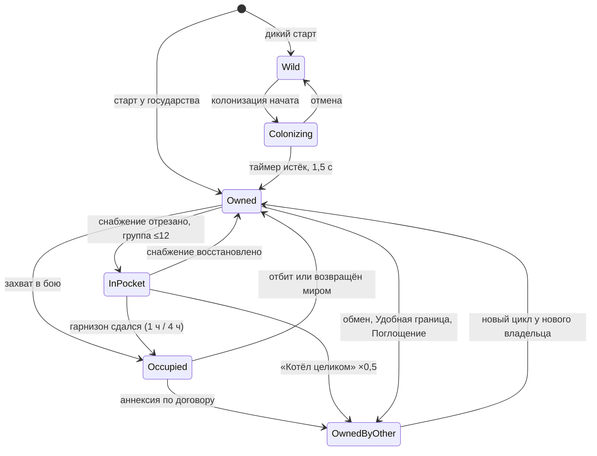
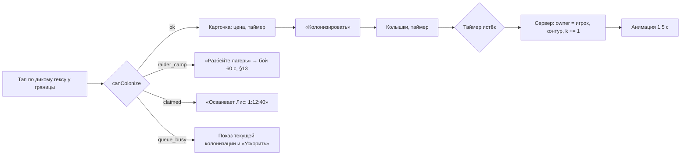
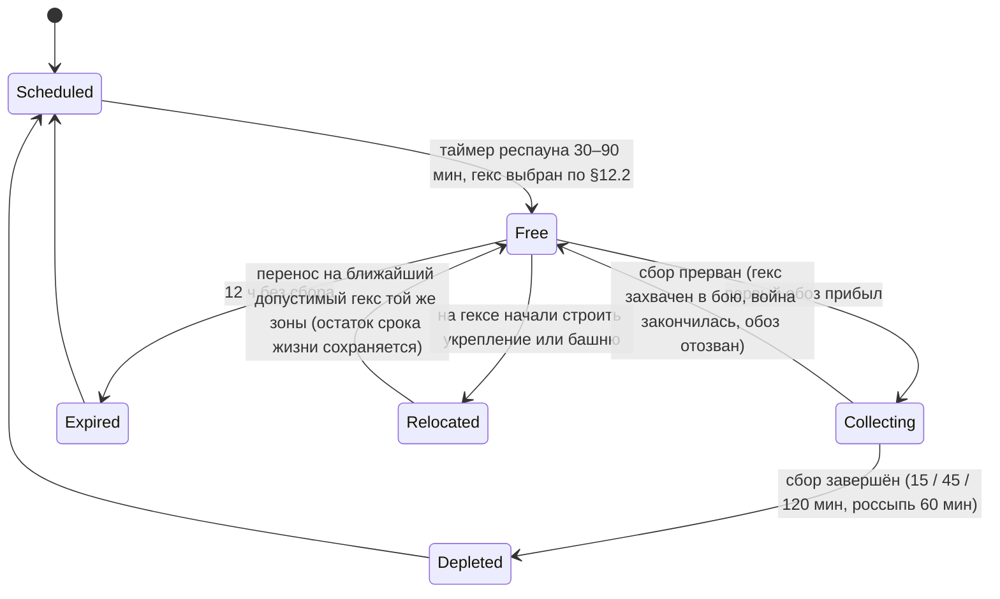
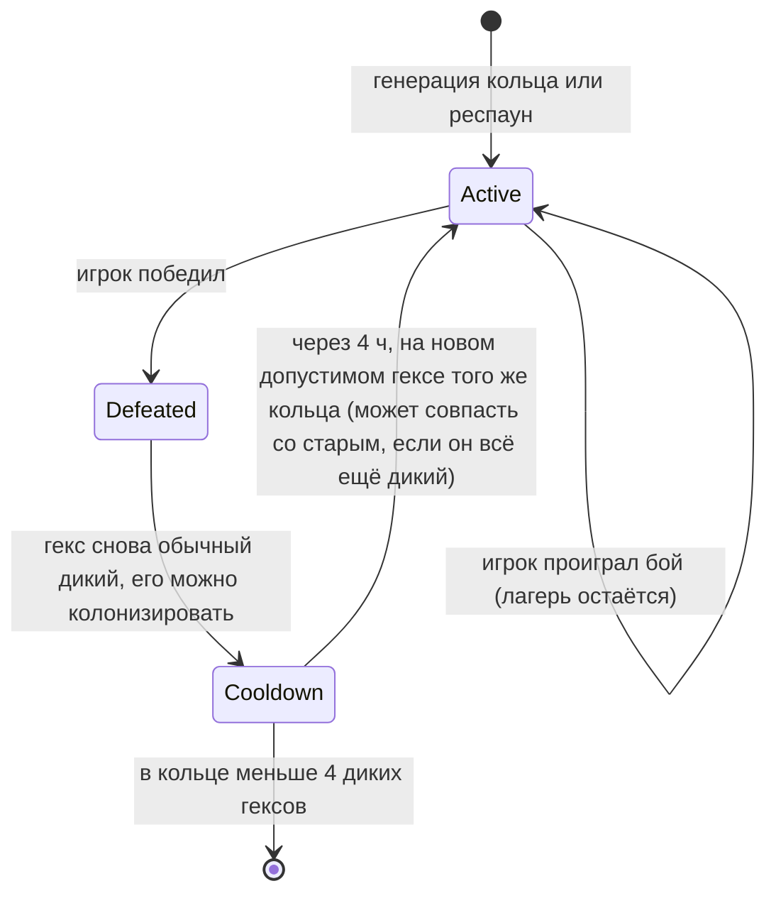
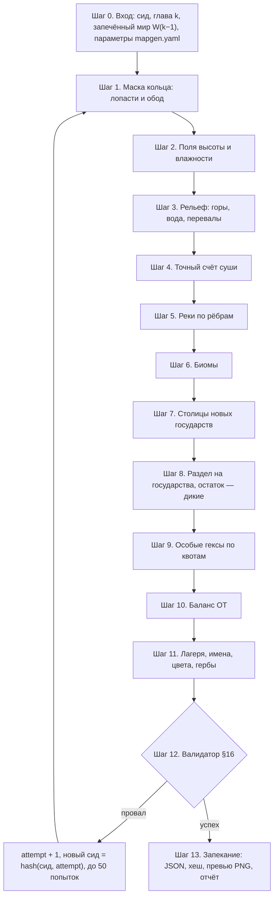

# 02. Карта и территория

> **Назначение.** Спецификация стратегической гекс-карты, достаточная для реализации: сетка и координаты, модель гекса, типы гексов и ценность, цвета и режим для дальтоников, слои рендера, контроль и официальная граница, оккупация, фронт, котлы и выступы, алгоритм толстого контура и анимации его роста, колонизация, обмен территориями (картографическая часть), жёлтые залежи (размещение, визуал, жизненный цикл), лагеря мародёров, туман войны, процедурная генерация и валидатор, главы-кольца и сиды, формат данных, камера, LOD и производительность.
> **Опирается на канон:** §3.1 (глоссарий карты), §5 (типы гексов, залежи), §6.1 (вид по УР), §7 (укрепление и башня на гексе), §9.7–9.8 (снабжение, котлы, формы — здесь только визуализация), §10.3 (церемония мира), §10.9 (обмен), §12.1 (главы, колонизация), §16.3–16.5 (генерация, арт, автотесты), §19.1 (экземпляр мира на игрока).
> **Связанные файлы:** `03_war_combat.md` (правила боя, снабжения, котлов, форм), `05_economy_buildings.md` (экономика залежей, доходы, постройки), `06_diplomacy_peace.md` (условия мира и обменов), `07_progression_meta.md` (цели глав, УР), `10_ui_ux_art.md` (HUD, экраны, раскадровка церемонии, VFX, звук), `11_balance_numbers.md` (кривые), `12_tech_analytics_roadmap.md` (хранение, сервер, аналитика).

---

## 1. Зона файла и инварианты карты

### 1.1. Что здесь и что не здесь

| Здесь (02) | Не здесь (ссылка) |
|---|---|
| геометрия сетки, координаты, примитивы (соседи, расстояние, диапазон, линия) | правила применения примитивов в бою (сектор, Прорыв, Артобстрел) — `03` |
| модель гекса, переходы владельца и контролёра, визуал каждого состояния | когда и почему меняется контроль в бою, сдача котлов — `03` |
| типы гексов: визуал, размещение, взаимодействия на карте | доходы, апкип, уровни построек — `05`, `11` |
| цвета, паттерны, слои, контур, анимации границы, тайминги карты в церемонии | экран пергамента, счётчики, звук, HUD — `06`, `10` |
| колонизация и обмен: допустимые гексы, конфликты, анимация | цена, условия согласия ИИ — канон §12.1, `06` |
| залежи и лагеря: размещение, визуал, жизненный цикл, доступ | объём груза, награды лагеря, лимиты — `05` |
| генератор, валидатор, кольца глав, сиды, формат карты | цели глав и награды — `07` |
| камера, зум, LOD, бюджеты рендера | архитектура сервера и БД — `12` |

### 1.2. Инварианты карты (каждый покрыт автотестом)

| # | Инвариант |
|---|---|
| I1 | Официальная граница меняется **только** мирным договором (включая Удобную границу, Столицу, Поглощение, передачу союзнику), колонизацией и обменом. Бой, сдача котла и авто-оборона меняют только контроль. |
| I2 | Синий `map_player` есть только у игрока. Красный `map_enemy` — только у государств, с которыми игрок воюет сейчас. Жёлтый — только контур свободной залежи. Жёлтая и золотая заливка государств запрещены. |
| I3 | Гексы Ядра (`core`) не меняют владельца ни при каком событии. |
| I4 | Открытие главы только добавляет клетки. Клетки прошлых глав не перегенерируются и не сдвигаются. |
| I5 | Статическая карта (рельеф, типы, реки, стартовые владельцы) детерминирована сидом и **запечена в JSON**. Генератор не запускается ни на устройстве, ни на игровом сервере. |
| I6 | Всё, что влияет на игру (соседи, расстояния, снабжение, котлы, видимость), считается в целых числах в `sim/`. Пиксельная геометрия с float есть только в `client/`. |
| I7 | У каждого игрока свой экземпляр мира (канон §19.1): статическая карта общая по сиду, динамическое состояние своё. |

---

## 2. Гекс-сетка

### 2.1. Ориентация: flat-top (плоская вершина)

| Критерий | Flat-top | Pointy-top |
|---|---|---|
| Сектор боя (диск радиуса 4, 61 гекс, 9 гексов в поперечнике) | 14R × 15,6R: вытянут **вертикально**, как экран | 15,6R × 14R: вытянут горизонтально |
| R на экране 390 pt, когда сектор целиком помещается | **26–27 pt** (диаметр 52–53 pt) | 25 pt (диаметр 50 pt) |
| Вертикальный свайп (главная ось большого пальца в портрете) | попадает точно в соседа С или Ю | попадает в угол между двумя соседями, нужна угловая эвристика |
| Место для флажка Силы над гексом и плашки ценности под ним | плоские рёбра сверху и снизу | вершины сверху и снизу |
| Горизонтальные подписи («Котёл: 5») | ширина гекса 2R больше высоты 1,73R | ширина 1,73R меньше высоты 2R |
| Мир, вытянутый вертикально | колонки вертикальны | ряды горизонтальны |
| Минус | горизонтальная линия гексов идёт зигзагом | вертикальная линия идёт зигзагом |

**Решение:** flat-top. Зигзаг горизонтального фронта не мешает и работает на образ «рваной линии фронта» (канон §3.1).

### 2.2. Системы координат

| Система | Где используется | Определение |
|---|---|---|
| **Axial (q, r)** | основная: данные, сервер, `sim/`, сеть | (0, 0) — столица игрока в центре мира главы I. Шаг (0, +1) ведёт на юг, (+1, 0) — на юго-восток |
| **Cube (q, r, s)** | алгоритмы: расстояние, линии, повороты | s = −q − r |
| **Odd-q offset (col, row)** | плотные массивы, текстуры полей (туман, чернила), чанки рендера | col = q; row = r + (q − (q & 1)) / 2. Обратно: r = row − (col − (col & 1)) / 2 |
| **cell_id** | компактные ссылки в состоянии мира, снимки границы | индекс клетки в запечённой карте (uint16), стабилен в пределах версии карты |

### 2.3. Направления, рёбра и углы

Угол k гекса лежит под углом 60°·k от центра. Экранная ось y смотрит вниз, поэтому k = 0 — восточный угол, k = 1 — нижний правый, дальше по часовой стрелке на экране.

| Индекс | Направление | Δ(q, r) | Ребро между углами | Противоположное |
|---|---|---|---|---|
| 0 | С (N) | (0, −1) | 4–5 | 3 |
| 1 | СВ (NE) | (+1, −1) | 5–0 | 4 |
| 2 | ЮВ (SE) | (+1, 0) | 0–1 | 5 |
| 3 | Ю (S) | (0, +1) | 1–2 | 0 |
| 4 | ЮЗ (SW) | (−1, +1) | 2–3 | 1 |
| 5 | СЗ (NW) | (−1, 0) | 3–4 | 2 |

**Каноническое ребро** (реки, укрепления, фронт): `(q, r, e)`, где e ∈ {0, 1, 2}. Рёбра 3, 4, 5 хранятся у соседа: (h, Ю) = (h+Ю, С), (h, ЮЗ) = (h+ЮЗ, СВ), (h, СЗ) = (h+СЗ, ЮВ).

**Канонический угол.** Каждый угол сетки — либо восточный (E) угол ровно одного гекса, либо западный (W) угол ровно одного гекса. Ключ угла — `(q, r, side)`:

| Угол k гекса h | Ключ |
|---|---|
| 0 (восток) | (h, E) |
| 1 (низ-право) | (h+ЮВ, W) |
| 2 (низ-лево) | (h+ЮЗ, E) |
| 3 (запад) | (h, W) |
| 4 (верх-лево) | (h+СЗ, E) |
| 5 (верх-право) | (h+СВ, W) |

Это свойство делает извлечение контура однозначным (§8.1). В каждом углу сходятся ровно 3 гекса, и все они попарно соседи. Поэтому любое подмножество «своих» гексов в углу связно, и у граничного угла всегда ровно одно входящее и одно исходящее ребро контура.

### 2.4. Формулы и примитивы

```ts
// sim/hex.ts — только целые числа
export const DIRS = [[0,-1],[1,-1],[1,0],[0,1],[-1,1],[-1,0]] as const; // N, NE, SE, S, SW, NW
export const neighbor = (q:number, r:number, d:number) => [q + DIRS[d][0], r + DIRS[d][1]];
export const distance = (aq:number, ar:number, bq:number, br:number) => {
  const dq = aq - bq, dr = ar - br;
  return (Math.abs(dq) + Math.abs(dr) + Math.abs(dq + dr)) / 2;
};
export function* range(cq:number, cr:number, n:number) {           // 3n(n+1)+1 клеток
  for (let dq = -n; dq <= n; dq++)
    for (let dr = Math.max(-n, -dq - n); dr <= Math.min(n, -dq + n); dr++) yield [cq + dq, cr + dr];
}
export function* ring(cq:number, cr:number, n:number) {            // 6n клеток, n ≥ 1
  let q = cq + DIRS[4][0] * n, r = cr + DIRS[4][1] * n;             // старт на ЮЗ
  for (let side = 0; side < 6; side++)
    for (let i = 0; i < n; i++) { yield [q, r]; [q, r] = neighbor(q, r, side); }
}
export const ray = (q:number, r:number, d:number, n:number) =>      // прямая по оси: Прорыв, Артобстрел
  Array.from({ length: n }, (_, i) => [q + DIRS[d][0] * (i + 1), r + DIRS[d][1] * (i + 1)]);

// Линия между произвольными гексами в sim: фиксированная точка ×1000, сдвиг +1 против «ничьих»
export function line(aq:number, ar:number, bq:number, br:number): [number, number][] {
  const n = distance(aq, ar, bq, br), out: [number, number][] = [];
  for (let i = 0; i <= n; i++) {
    const t = n === 0 ? 0 : Math.floor(i * 1000 / n);
    const fq = aq * 1000 + Math.floor((bq - aq) * t) + 1, fr = ar * 1000 + Math.floor((br - ar) * t) + 1;
    out.push(cubeRoundFixed(fq, fr));                                  // округление куба в ×1000
  }
  return out;
}
```

```ts
// client/hexGeom.ts — float разрешён
const SQ3 = Math.sqrt(3);
export const hexToPixel = (q:number, r:number, R:number) => ({ x: R * 1.5 * q, y: R * SQ3 * (r + q / 2) });
export const corner = (cx:number, cy:number, R:number, k:number) =>
  ({ x: cx + R * Math.cos(Math.PI / 3 * k), y: cy + R * Math.sin(Math.PI / 3 * k) });
export function pixelToHex(x:number, y:number, R:number) {
  const fq = (2 / 3) * x / R, fr = (-x / 3 + (SQ3 / 3) * y) / R;
  return cubeRound(fq, fr);
}
export function cubeRound(fq:number, fr:number) {
  const fs = -fq - fr; let q = Math.round(fq), r = Math.round(fr); const s = Math.round(fs);
  const dq = Math.abs(q - fq), dr = Math.abs(r - fr), ds = Math.abs(s - fs);
  if (dq > dr && dq > ds) q = -r - s; else if (dr > ds) r = -q - s;
  return { q, r };
}
```

| Величина (R — внешний радиус) | Значение |
|---|---|
| Ширина гекса (угол — угол) | 2R |
| Высота гекса (грань — грань) | √3·R ≈ 1,732R |
| Шаг колонок / шаг по вертикали в колонке | 1,5R / √3·R |
| Площадь гекса | 2,598R² |
| Диск радиуса n: ширина × высота | (3n + 2)R × (2n + 1)·√3·R; для n = 4: 14R × 15,59R |

### 2.5. Размер гекса на экране

«Гекс ≥52 pt» (канон §9.3) трактуется как **внешний диаметр 2R** (предложение автора). Боевая камера вписывает диск радиуса 4 целиком:

```
R_battle = clamp( min( (W − 2·8) / 14 , H_avail / 15,59 ), 22, 34 )     // pt
H_avail  = H − safe_top − safe_bottom − 64 (шкала контроля) − 28 (энергия) − 150 (рука и «Отступить»)
```

Высоты элементов интерфейса — допущение для расчёта, их задаёт `10_ui_ux_art.md`.

| Экран (pt) | Под сектор (Ш × В) | R | Диаметр 2R | Грань — грань | Видно (колонок × рядов) |
|---|---|---|---|---|---|
| 390 × 844 (iPhone 13–16) | 374 × 521 | 26,7 | 53 | 46 | 9 × 11 |
| 430 × 932 (iPhone Pro Max) | 414 × 597 | 29,6 | 59 | 51 | 9 × 11 |
| 375 × 667 (iPhone SE, 16:9) | 359 × 405 | 25,6 | 51 | 44 | 9 × 9 |
| 360 × 800 (Android 20:9) | 344 × 510 | 24,6 | 49 | 43 | 9 × 11 |
| 412 × 915 (Android) | 396 × 625 | 28,3 | 57 | 49 | 9 × 12 |

- Минимальная зона касания — расстояние грань — грань ≥43 pt. Это близко к 44 pt по Apple HIG.
- **Расхождение с каноном.** Диск радиуса 4 имеет 9 гексов в поперечнике, поэтому видимое окно боя — около **9 × 11**, а не «~7 × 11» (§9.3). На экранах уже 375 pt диаметр гекса 49–51 pt. Радиус сектора и число гексов (61) не меняются. Вынесено в открытые вопросы.

### 2.6. Проекция и наклон

- **Поле — вид строго сверху** (`board_tilt_ky = 1,0`): гекс на экране — правильный шестиугольник. Это даёт максимум вертикального места в портрете, простую проверку попадания касанием и точную геометрию контура.
- **Модели** (постройки, юниты, укрепления) рендерятся в Blender ортокамерой с наклоном ~30° от вертикали (канон §16.4) и ставятся на гекс по якорю основания (§4.6). Мягкая контактная тень под моделью связывает их с плоским полем.
- Тайлы рельефа рендерятся камерой строго сверху. Высоту гор и холмов передают тени и тун-шейдинг.
- Параметр `board_tilt_ky` вынесен в конфиг (диапазон 0,85–1,0) для A/B-проверки «диорамности» (предложение автора).

---

## 3. Модель гекса

### 3.1. Статические поля (запечённая карта, одинаковы для всех игроков с этим сидом)

| Поле | Тип | Значения | Примечание |
|---|---|---|---|
| `cell_id` | uint16 | 0…N−1 | индекс клетки |
| `q`, `r` | int16 | axial | (0, 0) — столица игрока |
| `ring` | uint8 | 1–6 | глава, с которой клетка открыта (`ch_1`…`ch_6`) |
| `terrain` | enum | `terrain_land`, `terrain_mountain`, `terrain_water` | код `terrain_land` (суша) — предложение автора; горы и вода — канон |
| `water_kind` | enum? | `sea`, `lake` | только для воды. Море — водоём ≥6 клеток или касающийся внешнего края кольца |
| `biome` | enum | 6 биомов (§4.2) | только визуал |
| `base_type` | enum | `hex_*` | стартовый тип суши |
| `rivers` | 3 бита | рёбра С, СВ, ЮВ | канонические рёбра (`terrain_river`) |
| `start_owner` | state_id? | — | null — дикий гекс |
| `name_key` | string? | `hex.name.<id>` | у именованных гексов: «Медная шахта», «Мельница» |
| `variant` | uint8 | 0–3 | вариант тайла или модели |
| `pins` | string[]? | `ftue_mill`, `ftue_copper_mine`… | якоря сценариев FTUE (только глава I) |

### 3.2. Динамические поля (своё состояние у каждого игрока)

| Поле | Тип | По умолчанию | Кто меняет | Визуал |
|---|---|---|---|---|
| `owner` | state_id? | `start_owner` | мир, колонизация, обмен | заливка, толстый контур |
| `controller` | state_id? | = `owner` | бой, сдача котла, авто-оборона, абстрактная война союзника или ИИ, мир (возврат) | штриховка и флажок оккупанта (§7.2) |
| `type` | enum `hex_*` | `base_type` | УР5 игрока (Тёмное озеро → Нефть, §4.4) | модель постройки |
| `fort_level` | 0–10 | 0 | строитель (`05`); Демилитаризация −1 (`06`); карты боя временно (`03`) | забор по рёбрам (§4.6) |
| `fort_mothballed` | bool | false | игрок (консервация) | обесцвеченный забор без огней |
| `tower_level` | 0–10 (0 — нет) | 0 | строитель | модель башни по своему уровню |
| `garrison` | int ×1000 | максимум | бой, восстановление 10%/ч, без снабжения −10%/ч (`03`) | щиток с числом в режиме войны |
| `deposit` | object? | null | планировщик залежей (§12) | жёлтый контур, значок |
| `camp` | object? | null | планировщик лагерей (§13) | шатры мародёров |
| `colonization` | object? | null | игрок или ИИ (§10) | межевые колышки и таймер |
| `damaged` | bool | false | разграбление (`05`, `06`) | дым, трещины, −50% выхода |
| `occupied_at` | timestamp? | null | смена контролёра | отчёты «Пока вас не было» |

Ценность (`hex_value`) отдельно не хранится: она выводится из `type` по `hexes.yaml` (§4.1).

### 3.3. Производные поля (пересчитываются, не хранятся)

| Поле | Определение | Когда пересчитывать |
|---|---|---|
| `value` | ценность по типу, 1–10 | смена `type` |
| `is_core` | `owner` = игрок, гекс — столица игрока или её сосед | смена владельца в радиусе 1 от столицы |
| `supplied` | путь по своим, оккупированным или союзным гексам до источника снабжения (правило — канон §9.7, `03`) | любая смена контролёра, союза, войны |
| `pocket_id` | номер котла, если гекс в котле (§7.4) | вместе с `supplied` |
| `salient` | свой гекс граничит с ≥4 гексами под контролем врага | смена контролёра в радиусе 1 |
| `chokepoint` | точка сочленения графа снабжения (§7.5) | вместе с `supplied` |
| `visible` | в зоне обзора игрока (§14) | смена контроля, марш армий, башни |
| `fence_mask` | 6 бит: рёбра, смотрящие на чужую сушу (§4.6) | смена владельца у соседей |

Все производные поля пересчитываются за O(V + E) по графу открытых клеток (≤ ~700 клеток к главе VI), меньше 1 мс (§20).

### 3.4. Переходы владельца и контролёра

| Событие | `owner` | `controller` | Анимация на карте |
|---|---|---|---|
| Старт главы | `start_owner` | = owner | — |
| Колонизация завершена | null → S | null → S | 1,5 с (§9.4) |
| Захват гекса в наступлении или контратаке | — | → атакующий | вход 1,5 с (`03`), штриховка проявляется за 0,3 с |
| Гекс отбит владельцем | — | → owner | штриховка тает за 0,3 с |
| Сдача котла (1 ч / 4 ч) | — | → окружившая сторона | полуштриховка уплотняется до полной за 0,5 с, белые флажки |
| Мир: аннексия, котёл, Удобная граница, Столица, Поглощение, передача союзнику | → получатель | → получатель | церемония (§9.2) |
| Мир: неистребованная оккупация, Белый мир | — | → owner | штриховка тает за 0,4 с |
| Обмен территориями | ↔ | ↔ | 1,5 с (§9.5) |
| Тик абстрактной войны союзника или войны ИИ против ИИ | — | → воюющий ИИ | штриховка (если гекс в кадре) |



---

## 4. Типы гексов и ценность

### 4.1. Сводная таблица (развёртка канона §5.1)

Числа ценности и доходов — канон. Визуал — ступени Blender-китов по УР **владельца** (§6.1 канона); у ИИ свой УР. Квоты генератора — §15.4.

| Тип (код) | Ценность | Визуал на карте (УР1 → УР8) | Размещение (генератор) | Взаимодействия на карте |
|---|---|---|---|---|
| Равнина `hex_plain` | 1 | луг с кустами и тропой, 4 варианта тайла на биом | заполнитель: всё, что осталось после особых | башня, укрепление, залежь, лагерь (если дикий), колонизация |
| Лес `hex_forest` | 1 | 3–5 low-poly деревьев, порода по биому | кластеры 2–5 по шуму влажности (верхние 25% внутри кольца) | +25% к защите (`03`), остальное как у равнины |
| Холмы `hex_hills` | 1 | 2–3 скруглённых холма с тенью | кластеры у гор: высота в 60–85-м перцентиле | +25% к защите, остальное как у равнины |
| Ферма `hex_farm` | 2 | поле и постройка `bld_farm`: огород с пугалом → вертикальная ферма | вес ×2 у реки и на равнинном шуме; у каждой столицы ≥1 в радиусе 3 | трофей 1 ч еды при захвате (`03`); на диких — «заброшенное поле» (§4.3) |
| Шахта `hex_mine` | 2 | `bld_mine`: ручная штольня → роботизированная шахта | вес ×2 рядом с холмами и горами; у каждой столицы ≥1 в радиусе 3 | трофей при захвате; на диких — «заброшенная штольня» |
| Город `hex_city` | 4 | 3–5 моделей `bld_quarters`: халупы с бельём → небоскрёбы; этажность и огни растут с уровнем Кварталов | расстояние ≥2 до другого города и столицы; не на диких; ≥1 у государства от 12 гексов | +25% к защите; трофей 2 ч золота; ≤1 город за договор против игрока; «ключи от города» в церемонии |
| Порт `hex_port` | 3 | `bld_port`: пристань → контейнерный терминал; 6 вариантов направления (причал к ребру с водой) | только суша у моря; ≥3 между портами; не на диких | источник снабжения; дальность «Десанта» 4 гекса (`03`) |
| Нефть `hex_oil` | 3 | `bld_oil_rig`: вышка-качалка → плазменный экстрактор. Пока у владельца УР < 5, вышка «спит»: без дыма и огней | с главы III; «нефтяные поля» по 2–3 гекса, 1–2 поля на кольцо | цель войн середины игры; +энергия в бою (`03`); доход с УР5 (`05`) |
| Тёмное озеро `hex_dark_lake` | 1 → 3 | чёрный глянцевый пруд с пузырями и значком «?» | 1–2 на кольцо глав I–II, не в стартовой державе | суша (проходима); на УР5 игрока превращается в Нефть (§4.4) |
| Завод `hex_factory` | 4 | `bld_factory`: кирпичный цех → роботизированный комбинат, дым из труб | с главы III; ≤2 от города | ускоряет всю державу (`05`) |
| Военная база `hex_military_base` | 3 | `bld_military_base`: лагерь с палатками → база с ангарами | не ближе 2 к своей столице; ≤1 на 12 гексов государства; не на диких | источник снабжения; гарнизон ×2; пополнение ×3 в радиусе 2 (`03`) |
| Райвитовая жила `hex_raivite_vein` | 5 | выход синих кристаллов с мерцанием и `bld_raivite_mine` (лоток старателя → буровая → кристаллический экстрактор) | 1 на кольцо глав I–IV, +1 в V и VI; только у ИИ, в 1–3 гексах от его границы, не рядом с его столицей | самая желанная цель войны; доход 2 Райвита каждые 12 ч (`05`) |
| Столица `hex_capital` | 10 | Резиденция по УР в кольце мелких домов, большой флаг с гербом | центр государства (§15.2, шаг 7) | Ядро у игрока; источник снабжения; +50% к защите; +20 ВС при оккупации |
| Лагерь мародёров `hex_raider_camp` | 1 (дикий) | серые шатры, частокол, дым костра, флажок с рваным полотнищем | только дикие гексы (§13) | бой 60 с; пока лагерь стоит, гекс нельзя колонизировать |

- **Где «стоит постройка».** Постройка есть у типов ферма, шахта, город, порт, нефть, завод, военная база, Райвитовая жила и столица, а также на любом гексе с укреплением или башней. Это важно для залежей (§12.2).
- **Лагерь мародёров** хранится как наложение `camp` на дикий гекс с базовым типом равнина, лес или холмы. Пока лагерь активен, эффективный тип — `hex_raider_camp`.

### 4.2. Рельеф, вода, реки, биомы

| Элемент | Код | Правила на карте | Визуал |
|---|---|---|---|
| Горы | `terrain_mountain` | непроходимы, нет владельца, нет заливки; в счёт гексов главы не входят | 1–3 скальных пика, снег на вершинах (кроме тропиков) |
| Вода | `terrain_water` | непроходима; пересекается только «Десантом» или через Порт (`03`); не входит в счёт | мелководье у берега, глубокая вода дальше; анимированный блик; пена по береговым рёбрам (процедурная линия) |
| Река | `terrain_river` | проходит **по ребру** между гексами; атака через неё −25% (`03`) | лента вдоль ребра: ширина 0,08R у истока → 0,18R в устье; течение анимировано UV-сдвигом |
| Побережье | — | суша, у которой хотя бы один сосед — вода | песчаная кромка на тайле суши |

- **Поглощённые непроходимые клетки.** Связная группа гор или озёр ≤6 клеток, не касающаяся края мира, у которой все соседи-суша принадлежат одному государству S, рисуется с заливкой S при α 0,25. Контур S не делает вокруг неё «дыру» (§8.1). Ход и счёт не меняются (предложение автора).
- **Биомы** (6, только визуал, предложение автора): `biome_meadow` (луга), `biome_steppe` (степь), `biome_taiga` (хвойный север), `biome_badlands` (рыжие скалы и карьеры), `biome_tropic` (острова и пальмы), `biome_snow` (снег и кристаллы). У каждого биома 7 типов тайлов (канон §16.4): равнина, лес, холмы, горы, мелководье, глубокая вода, «площадка» (утоптанная земля под постройками).

| Кольцо | Биомы |
|---|---|
| I «Долина» | луга |
| II «Речной край» | луга; на северной лопасти тайга |
| III «Континент» | степь на юге, тайга на севере (по y с шумом) |
| IV «Индустриальный пояс» | бедленды |
| V «Океаны» | тропики |
| VI «Мир Райвона» | снег и кристаллы, на стыке с V — тайга |

Граница биомов размывается шумом с шагом ~3 гекса, переходные тайлы не нужны: смена палитры идёт по клеткам.

### 4.3. Дикие земли и заброшенные гексы

- Дикий гекс (`wild_land`): `owner` = `controller` = null, заливка `map_wild`, контура нет.
- На диких бывают только равнина, лес, холмы, Тёмное озеро и, не больше чем по 1 на кольцо, **заброшенная ферма** и **заброшенная штольня** (предложение автора). У заброшенных гексов поросшая руина вместо постройки. После колонизации постройка «оживает» в УР игрока за 0,3 с в конце анимации колонизации.
- Города, порты, базы, заводы, нефть и Райвитовые жилы на диких землях не генерируются: это цели войны.

### 4.4. Тёмное озеро → Нефть

- Триггер: игрок достигает УР5 (канон §6.2). В этот момент **все** `hex_dark_lake` открытых глав (у любого владельца и дикие) становятся `hex_oil`, ценность 1 → 3.
- Визуал: в конце церемонии повышения УР камера облетает озёра в кадре. На каждом бьёт нефтяной фонтан 1,2 с, озеро сменяется вышкой УР владельца. Озёра вне кадра меняются мгновенно, на краю экрана появляется индикатор «Нефть: 3 новых месторождения».
- Последствия на карте: растёт официальная ценность владельцев (ОТ, цены мира, угроза). Знаменатель ВС в уже идущих войнах не меняется: он фиксирован на начало войны (канон §9.12).
- Озеро под оккупацией тоже превращается; оккупант получает 50% дохода (`05`).

### 4.5. Визуализация ценности

| Ценность | Знак | Где видно |
|---|---|---|
| 1 | нет | — |
| 2–5 | щиток с цифрой у нижнего ребра гекса | режим войны: гексы в 3 гексах от фронта и при выборе цели войны; зум «Деталь» (§19); долгое нажатие — всегда |
| 10 | корона с цифрой 10 | как выше |

- Щиток: белый, тёмная цифра, высота 0,32R, якорь (0; +0,72R).
- На цели войны щиток заменяется вымпелом цвета атакующего (`war_goal`). На гексе, который требует ИИ в ультиматуме, — красный вымпел.

### 4.6. Укрепления, башни, гарнизон и якоря моделей

**Укрепление** рисуется по рёбрам, смотрящим на чужую сушу (канон §7):

```
fence_mask(h) = { e ∈ 0..5 : n = neighbor(h, e); terrain(n) = terrain_land ∧ owner(n) ≠ owner(h) }
```

- Чужая суша включает дикие гексы. Рёбра к воде и горам забора не получают.
- Вид сегмента задаёт **уровень укрепления** (плетень ур. 1 … энергокупол ур. 10). Каждый уровень рендерится в 6 ориентациях ребра: 10 × 6 = 60 спрайтов плюс угловые столбы.
- Если `fence_mask` = 0 (укрепление в глубоком тылу), рисуются 6 угловых столбов и ворота по уровню (предложение автора).
- Законсервированное укрепление обесцвечено на 60%, без огней и анимации.
- При смене владельца соседа `fence_mask` пересчитывается, сегменты появляются или исчезают за 0,3 с.

**Башня** стоит в центре обычного гекса (на нём нет другой постройки). Вид — по уровню башни. Радиус обзора башни виден только при выборе башни: пунктирное кольцо.

**Гарнизон** не рисуется фигуркой. В режиме войны и по долгому нажатию над гексом показывается щиток с числом. Под туманом вместо числа «?» (§14).

| Объект | Якорь (доля R от центра, ось y вниз) | Масштаб спрайта |
|---|---|---|
| постройка, башня, Резиденция | (0; −0,18) | ширина 1,5R |
| армия (фигурка и флажок Силы) | (0; +0,20) | ширина 0,9R |
| значок залежи | (0; −0,12) | 0,7R |
| обоз на залежи | (+0,35; +0,25) | 0,55R |
| флажок оккупанта | (+0,50; −0,45) | 0,35R |
| щиток ценности | (0; +0,72) | 0,32R по высоте |
| колышки колонизации | 6 углов на 0,8R | 0,2R |

Глубина: внутри общего контейнера объектов спрайты сортируются по экранному y основания, при равенстве — постройка, затем обоз, затем армия.

---

## 5. Цвета и палитра

### 5.1. Палитра карты

Цвета заливки — канон §3.1. Цвет контура — RGB заливки × 0,6 («затемнённый цвет государства», предложение автора: формула вместо ручного подбора). Остальные столбцы — предложения автора.

| Код / слот | Заливка | Контур (×0,6) | α заливки (R ≥ 12 / R < 12) | Паттерн для дальтоников | Кому |
|---|---|---|---|---|---|
| `map_player` | #2E6BFF | #1C4099 | 0,55 / 0,75 | **нет (сплошная)** | только игрок |
| `map_enemy` | #E0393E | #862225 | 0,55 / 0,75 | мелкие крестики «×» | государства в войне с игроком сейчас |
| `map_state_palette` · green | #3FA34D | #26622E | 0,55 / 0,75 | точки | ИИ |
| · purple | #8E5BD0 | #55377D | 0,55 / 0,75 | вертикальные линии | ИИ |
| · orange | #F08A24 | #905316 | 0,55 / 0,75 | кольца | ИИ |
| · teal | #1FB5AD | #136D68 | 0,55 / 0,75 | треугольники | ИИ |
| · brown | #8B5A3C | #533624 | 0,55 / 0,75 | клетка | ИИ |
| · pink | #D16BB5 | #7D406D | 0,55 / 0,75 | шевроны | ИИ |
| `map_wild` | #B9B2A3 | — (контура нет) | 0,40 / 0,60 | нет; песочная фактура | дикие земли |
| `map_deposit_outline` | — | #FFD21F, 2 px, пульс 1,5 с | — | значок ресурса всегда виден | только свободная залежь |
| `map_ally_marker` | — | белый пунктир 2 px по внутреннему краю границы союзника | — | значок рукопожатия на столице | союзники игрока |

- **Светлая обводка контура** — 1 px, белый α 0,7, с внешней стороны полосы (§8.3).
- **Штриховка оккупации** — цвет оккупанта, α 0,9 (§7.2). Она идёт поверх заливки владельца и поэтому читается в обе стороны: синие полосы на красном и красные на синем.
- **Линия фронта** — тёплое белое ядро #FFF3D6, свечение с двух сторон в цветах сторон (§7.3).

### 5.2. Назначение цветов государствам

**Правила:**
1. Цвет назначается государству один раз, при создании (генерация кольца), и хранится как `color_slot`.
2. **Жёсткое ограничение:** у государств с общим ребром официальной территории слоты не совпадают.
3. **Мягкое:** слот по возможности не повторяется у государств на расстоянии ≤3 гексов.
4. Отображаемый цвет: `map_enemy`, если государство воюет с игроком (напрямую или в коалиции); иначе цвет слота. Синий и красный слотами не являются.
5. У канонических государств есть **предпочтительный слот** (предложение автора). Он используется, если не нарушает п. 2:

| Государство | Глава | Предпочтительный слот | Запасной |
|---|---|---|---|
| Кремнёвые Бароны | I | purple | brown |
| Вольные Хутора | I | green | teal |
| Речная Лига | II | teal | green |
| Орден Камня | II | brown | purple |
| Альвария (гегемон) | III | orange | pink |
| Сарен | III | pink | teal |
| Серая Стая | III | purple | brown |
| Стальной Конклав (гегемон) | IV | brown | orange |
| Вейлмарк | IV | green | pink |
| Республика Озёр | IV | teal | purple |
| процедурные (V–VI) | V–VI | — | алгоритм |

```ts
const SLOTS = ['green','purple','orange','teal','brown','pink'] as const;
function assignSlot(s: State, w: World): Slot {
  const hard  = new Set(w.edgeNeighbors(s).map(n => n.slot));            // общее ребро
  const soft  = new Set(w.statesWithin(s, 3).map(n => n.slot));          // ≤3 гексов
  const cand  = SLOTS.filter(c => !hard.has(c));
  if (s.preferred && cand.includes(s.preferred) && !soft.has(s.preferred)) return s.preferred;
  if (cand.length === 0) return w.fallbackShade(s);                       // §5.2, п. 7
  return minBy(cand, c => 10 * +soft.has(c) + w.usage(c) + 0.1 * SLOTS.indexOf(c));
}
```

6. **Перекраска.** После любой смены официальной территории между ИИ (мир ИИ против ИИ, колонизация ИИ, поражение игрока, обмен) проверяются новые пары соседей. Если у соседей совпали слоты, перекрашивается государство с меньшими ОТ: `assignSlot`, переход цвета 0,8 с в конце анимации границы. Во время войны с игроком перекраска откладывается: красный всё равно перекрывает слот.
7. **Запасной оттенок.** Если все 6 слотов заняты соседями (на планарной карте при стабильных цветах это возможно, но крайне редко), берётся наименее используемый слот со сдвигом светлоты −12% и паттерном с удвоенным шагом. Валидатор помечает такой случай предупреждением (§16).
8. **Смена статуса.** Объявлена война: слот → красный за 0,6 с. Мир: красный → слот за 0,6 с в фазе 4,0–4,6 с церемонии («красный остывает»).

### 5.3. Режим для дальтоников

- Переключатель «Узоры государств» в настройках доступности (`10`). Предлагается при первом запуске на экране доступности; по умолчанию выключен (предложение автора).
- Во включённом режиме у каждого слота свой паттерн (§5.1): α 0,22, шаг 0,45R, тёмный тон своего цвета. У игрока паттерна нет: **сплошная заливка — его отличительный признак**. У красного — крестики «×», поэтому статус войны читается без цвета.
- **Зарезервированные семейства паттернов:** диагональная штриховка (оккупация), точки, вертикальные линии, кольца, треугольники, клетка, шевроны, крестики. Косметический узор заливки игрока (`cos_fill_pattern`: Паркет, Соты, Мозаика, Карбон) не может использовать зарезервированные семейства: в `cosmetics.yaml` проверяется поле `pattern_family`.
- В режиме дальтоников штриховка оккупации получает белую разделительную линию 1 px между полосами, а пульс жёлтого контура залежи — дополнительное «дыхание» толщины 2 → 3 px.
- **Автотест** (канон §16.5, п. 6), предложение автора:

| Проверка | Порог |
|---|---|
| ΔE2000 между любыми двумя цветами из набора «синий игрока, красный врага, 6 слотов» при нормальном зрении | ≥15 |
| пары слотов с ΔE2000 < 10 при симуляции протанопии, дейтеранопии и тританопии (Machado 2009, тяжесть 1,0) | в режиме узоров у них разные паттерны (всегда) |
| контраст полосы контура с заливкой своей территории (поверх рельефа) | ≥2:1 |
| контраст светлой обводки с полосой контура | ≥3:1 |
| контур залежи: жёлтый #FFD21F или его тёмная окантовка (§12.3) против заливки под ним | ≥2,5:1 хотя бы у одного из двух тонов |
| скриншот главы IV в режиме узоров: каждое государство опознаётся по паттерну на 48 px | 100% |

### 5.4. Запреты

1. Никакое государство, косметика или событие не красит заливку в жёлтый или золотой (тон 40–60° при насыщенности >50%). Проверка в CI по `map_render.yaml` и `cosmetics.yaml`.
2. Узор заливки игрока — только в синей гамме (канон §15.5): тон 200–240°.
3. Чернила границы (`cos_border_ink`) меняют только полосу контура и эффекты церемонии, но не заливку.
4. Красный используется для **предупреждений** (пунктир котла, контур выступа, стрелка контратаки) только линиями и значками, никогда заливкой.

---

## 6. Слои рендера карты

Порядок снизу вверх. «Чанк» — кеш в RenderTexture блоками 8 × 8 гексов (odd-q) на текущем уровне LOD (§20).

| z | Код слоя | Содержимое | Кеш | Видимость по LOD (§19.2) |
|---|---|---|---|---|
| 1 | `map_layer_backdrop` | стол-диорама, океан за краем мира, виньетка | статично | все |
| 2 | `map_layer_terrain` | тайлы рельефа, деревья, горы | чанк | все (в «Атласе» — упрощённые тайлы) |
| 3 | `map_layer_water_fx` | блик воды, пена по береговым рёбрам | шейдер | R ≥ 12 |
| 4 | `map_layer_rivers` | реки по рёбрам | чанк + UV-анимация | все |
| 5 | `map_layer_fill` | заливка владельца (официальная) | чанк | все |
| 6 | `map_layer_pattern` | паттерны дальтоников, косметический узор игрока | чанк | все |
| 7 | `map_layer_grid` | тонкая сетка: чёрный α 0,08, внутри своей территории 0,05 | чанк | R ≥ 18 |
| 8 | `map_layer_hatch` | штриховка оккупации, полуштриховка котлов | живой меш + шейдер | все |
| 9 | `map_layer_border` | толстые контуры, союзная метка | живые меши | все |
| 10 | `map_layer_front` | линия фронта, мечи | шейдер свечения | все |
| 11 | `map_layer_alerts` | пунктир котлов, контур выступов, «узкие места», «ключ к котлу», значок «без снабжения» | живые | все (подписи с R ≥ 12) |
| 12 | `map_layer_deposit` | жёлтый контур, пунктир сборщика, кольцо прогресса | шейдер | все (в «Атласе» — жёлтая точка) |
| 13 | `map_layer_paths` | маршруты маршей и обозов по земле | живые | R ≥ 12 |
| 14 | `map_layer_objects` | постройки, укрепления, башни, лагеря, значки залежей, армии, обозы, строители, колышки (общая сортировка по y) | живые, атлас | §19.2 |
| 15 | `map_layer_fog` | затемнение α 0,12 и −15% насыщенности вне обзора | живой меш | все |
| 16 | `map_layer_clouds` | облака неоткрытых глав | шейдер | все |
| 17 | `map_layer_labels` | названия государств и гексов, щитки ценности, вымпелы целей, таймеры | BitmapText | §19.2 |
| 18 | `map_layer_markers` | стрелки контратак, индикаторы событий за краем экрана, всплывающие «−4» | живые | все |
| 19 | `map_layer_selection` | выделение, допустимые цели, контур сектора | живые | все |
| 20 | `map_layer_fx` | «поп» гексов, частицы, салют, фонтаны нефти | живые | все |
| — | HUD | вне карты (`10`) | — | — |

**Меш перехода** (церемония, колонизация, обмен) на время анимации подменяет слои 5, 6, 8 и 9 для затронутых гексов: рисуется в два прохода, на z = 5 (заливка) и на z = 9 (полосы контура) (§9.1).

---

## 7. Контроль против официальной границы

### 7.1. Матрица отображения

| Владелец (офиц.) | Контролёр | Заливка | Штриховка | Флажок | Контур |
|---|---|---|---|---|---|
| игрок | игрок | синий | — | — | синий контур вокруг |
| игрок | враг | синий | красная | красный флажок | синий контур **не меняется** |
| враг | враг | красный | — | — | контур врага |
| враг | игрок | красный | синяя | синий флажок | контур врага **не меняется** |
| враг | союзник игрока | красный | цвет союзника | флажок союзника | — |
| ИИ A (в мире с игроком) | ИИ B (война A–B) | слот A | слот B | флажок B | — |
| враг, в котле игрока (до сдачи) | враг | красный | синяя полуштриховка (α 0,35, шаг ×2) | — | + красный пунктир «Котёл: N» |
| игрок, в котле врага | игрок | синий | красная полуштриховка | — | + красный пунктир «Окружены: N» |
| дикий | — | серый | — | — | контура нет |

Полуштриховка означает «засчитано как оккупация в ВС» (канон §9.7), но гекс ещё не сдался.

### 7.2. Штриховка оккупации

- Полосы под 45° (снизу слева вверх направо), ширина 0,16R, период 0,40R. В «Атласе» (R < 12) — фиксированный период 6 px. Цвет оккупанта, α 0,9, тёмная кромка 1 px.
- Фаза полос привязана к мировым координатам: у соседних оккупированных гексов полосы сливаются в единое поле, без швов.
- Реализация: один меш на все оккупированные гексы одного оккупанта, шейдер `stripe(dot(worldPos, (0,7071; −0,7071)) / period)`. Перестраивается при смене контроля, <0,5 мс.
- Флажок оккупанта (якорь §4.6) появляется с «втыканием» 0,25 с.

### 7.3. Фронт

```
front_edges = { (h1, h2) : общее ребро, controller(h1) и controller(h2) воюют между собой }
```

- **Фронт игрока:** одна сторона — игрок или его союзник, другая — враг игрока. **Чужой фронт** — война ИИ против ИИ.
- Цепочки: рёбра соединяются в полилинии через углы, где сходятся ровно 2 фронтовых ребра. В углу с 3 фронтовыми рёбрами (три стороны воюют попарно) цепочка рвётся и начинаются три новых.
- Рваность: каждое ребро делится на 4 отрезка, вершины смещаются перпендикулярно на шум с амплитудой 0,07R. Шум сидируется ключом ребра, поэтому при пересчёте фронта линия не «дрожит».
- Стиль фронта игрока: ядро 2,5 px #FFF3D6; свечение 9 px аддитивно, со стороны каждого участника — в его отображаемом цвете; мерцание яркости ±15% с периодом 2 с. **Скрещённые мечи:** по одному на каждые ≤5 рёбер цепочки (минимум 1 на цепочку, не ближе 3R друг к другу) плюс пульсирующий маркер там, где идёт наступление или объявлена контратака.
- Стиль чужого фронта: 1,5 px #E8E4DA α 0,7, без свечения и мечей. В «Атласе» — один значок мечей в центре войны ИИ.
- Пересчёт при любой смене контроля или статуса войны: O(число рёбер), <0,5 мс.

### 7.4. Котлы

Правило котла задаёт канон §9.7 и `03`. Карта только находит и рисует его.

```ts
function findPockets(w: World, side: StateId): Pocket[] {
  // 1) снабжённые гексы стороны: BFS от её источников по её, оккупированным ею и союзным гексам
  const supplied = bfs(w.supplySources(side), h => w.passableForSupply(h, side));
  // 2) компоненты связности её гексов под её контролем без снабжения
  return components(w.controlledBy(side).filter(h => !supplied.has(h)))
    .filter(c => c.length <= 12 && w.isEnemyEncircled(c, side))   // окружён врагом, а не просто край мира
    .map(c => ({ hexes: c, size: c.length, surrenderAt: w.surrenderTime(c) }));
}
```

- **Визуал:** общий контур группы (алгоритм §8.1 без сглаживания) — красный пунктир 3 px (штрих 8 px, пробел 6 px). Бег штрихов 12 px/с, пульс α 0,6–1,0 с периодом 1,2 с.
- **Подпись** в «полюсе недоступности» группы: «Котёл: 5» (котёл врага) или «Окружены: 3» (свои гексы). Ниже — обратный отсчёт до сдачи гарнизонов: «сдача через 0:42:10» (1 ч при ≤3 гексах, 4 ч при 4–12, если внутри нет армии; канон §9.7).
- Группа больше 12 гексов без снабжения котлом не является. Её гексы получают только значок «без снабжения» (§7.6).

### 7.5. Выступы, узкие места, ключи к котлам

| Признак | Как вычисляется | Визуал | Когда виден |
|---|---|---|---|
| **Уязвимый выступ** (`form_salient`) | свой гекс граничит с ≥4 гексами под контролем врага | красный контур 2 px по внутреннему краю гекса, значок «!», подпись «Уязвимый выступ −15%» | только во время войны, только свои гексы |
| **Узкое место** (предложение автора) | точка сочленения графа «свои контролируемые и союзные гексы + суперисточник, связанный со всеми источниками снабжения». Её потеря отрежет ≥2 своих гексов или любую армию | значок «звено цепи» белым, при тапе — подсветка гексов, которые окажутся отрезаны | война, R ≥ 12 |
| **Ключ к котлу** (предложение автора) | точка сочленения графа снабжения врага, взятие которой отрежет группу врага из 2–12 гексов | значок «клещи» в цвете игрока и подпись «Котёл из 5» | война, гекс в 1 гексе от армии игрока, R ≥ 12 |

Точки сочленения ищутся алгоритмом Тарьяна за O(V + E) для каждой стороны. Пересчёт идёт вместе с `supplied`.

### 7.6. Без снабжения

- Свой гекс или армия без снабжения: значок «разорванная цепь» (0,3R) у верхнего ребра, заливка −20% насыщенности.
- У врага значок «без снабжения» показывается только в зоне обзора (§14).

### 7.7. Союзники и чужие войны

- Гексы, оккупированные союзником, штрихуются цветом союзника. При мире они достаются ему (канон §10.7).
- Войны ИИ против ИИ: штриховка цветами участников и чужой фронт. В ленту «Пока вас не было» попадают только смены официальной территории (`06`).

### 7.8. Краевые случаи

| # | Ситуация | Поведение карты |
|---|---|---|
| E1 | Враг оккупировал гекс игрока внутри синего контура | синяя заливка + красная штриховка; контур на месте; ОТ «−ценность» всплывает над гексом |
| E2 | Оккупация отрезала часть державы игрока | контур на месте; у отрезанных гексов значок «без снабжения»; если группа ≤12 и окружена — «Окружены: N» |
| E3 | Игрок оккупировал гекс врага, гекс находится в котле врага | штриховка игрока остаётся, у гекса «без снабжения»; котлом врага он не считается (котёл — гексы под контролем окружённой стороны) |
| E4 | Коалиция: два соседних врага оба красные | между ними видны две красные полосы контура; на столицах — флаги-гербы; подписи государств с пометкой «коалиция» |
| E5 | По договору у игрока появился эксклав | отдельный внешний контур (§8.1); в войне эксклав без своего источника снабжения получает «без снабжения» |
| E6 | Аннексия оставила внутри державы игрока гекс врага (анклав) | контур игрока получает «дыру», вокруг анклава — контур врага |
| E7 | Дикий гекс окружён синим | «дыра» в контуре; гекс доступен для колонизации (соседний) |
| E8 | ИИ поглощён целиком | его слот освобождается; флаг складывается (канон §10.3) |
| E9 | Война объявлена ИИ, у которого есть гексы, оккупированные третьим ИИ | штриховка третьего ИИ остаётся, заливка владельца становится красной |
| E10 | Мир при ВС > 0, у игрока были оккупированные врагом гексы | штриховка на них тает в фазе 0,8–1,6 с, гексы возвращаются игроку |

---

## 8. Толстый контур официальной границы

### 8.1. Извлечение контуров (внешние, дыры, эксклавы)

Вход — предикат `inside(h)`: `owner(h) = S` **или** h входит в поглощённую непроходимую группу S (§4.2). Неоткрытые клетки (за облаками) считаются «снаружи».

```ts
function extractLoops(S: StateId, w: World): Loop[] {
  const next = new Map<CornerKey, { to: CornerKey; h: Hex; e: number }>();
  for (const h of w.cellsOf(S)) for (let e = 0; e < 6; e++) {
    if (inside(w.neighbor(h, e))) continue;
    const a = cornerKey(h, (4 + e) % 6), b = cornerKey(h, (5 + e) % 6);   // §2.3
    next.set(a, { to: b, h, e });               // у граничного угла ровно одно исходящее ребро
  }
  const loops: Loop[] = [], seen = new Set<CornerKey>();
  for (const start of next.keys()) {
    if (seen.has(start)) continue;
    const pts: CornerKey[] = []; let c = start;
    do { seen.add(c); pts.push(c); c = next.get(c)!.to; } while (c !== start);
    const area = shoelace(pts.map(cornerPos));
    loops.push({ pts, kind: area > 0 ? 'outer' : 'hole' });
  }
  return loops;   // каждый 'outer' — отдельный кусок территории (материк или эксклав)
}
```

- **Почему однозначно:** §2.3. В каждом углу у «своих» гексов ровно одно входящее и одно исходящее граничное ребро, поэтому развилок нет. У квадратной сетки так не бывает.
- **Ориентация:** рёбра обходятся в порядке углов гекса (по часовой стрелке на экране при оси y вниз). Внешние контуры получают ту же ориентацию (площадь > 0), дыры — обратную.
- **Эксклав** — любой внешний контур, кроме самого большого по площади. Он рисуется тем же стилем.
- Сложность — O(длина границы). Для державы в 175 гексов это ~60–90 рёбер, <0,2 мс.

### 8.2. Отступ внутрь и сглаживание

Полоса контура лежит **целиком внутри** своей территории: у двух соседей видны две полосы рядом, без наложения.

1. **Отступ.** Каждая вершина сдвигается внутрь по биссектрисе на `d / sin(θ/2)`, где d = w/2 + rim. На гексовой границе угол поворота всегда ±60°, поэтому множитель 1/sin 60° ≈ 1,155 одинаков для выпуклых (внутренний угол 120°) и вогнутых (240°) вершин.
2. **Скругление** дугами: радиус 0,30R на выпуклых вершинах (4 сегмента дуги), 0,12R на вогнутых (2 сегмента). Эксклав из одного гекса превращается в скруглённый шестиугольник.
3. **Ширина полосы** в мировых единицах — w = 0,30R, на экране она ограничена 3–8 pt: R = 20 → 6 pt (канон: «6 px»), R = 10 → 3 pt, R ≥ 27 → 8 pt. Меши перестраиваются только при переходе через границы ограничения.
4. **Узкие места:** в коридоре шириной в 1 гекс (грань — грань 1,73R) две полосы занимают 0,6R + обводка. Остаётся ≥1,0R заливки.

### 8.3. Стиль и меш

- Меш — лента из треугольников с UV поперёк ширины (0 = внутренний край, 1 = внешний). Фрагментный шейдер:
  - полоса — цвет контура (заливка × 0,6) с лёгким градиентом: внутренний край ×0,9, внешний ×1,05;
  - внешний 1 px (по `fwidth`) — светлая обводка: белый α 0,7;
  - мягкая тень 2 px наружу (α 0,15) отделяет контур от соседней заливки.
- **Чернила границы** (`cos_border_ink`) у игрока подменяют фрагментный шейдер полосы параметрами из `cosmetics.yaml`: градиент, flow-шум, частицы, анимация (канон §16.4). Цвет по умолчанию — синий контур #1C4099.
- **Союзник:** поверх его полосы — белый пунктир 2 px (штрих 6, пробел 4) по внутреннему краю.

### 8.4. Когда перестраивается

Только при смене `owner` (мир, колонизация, обмен) или при открытии главы (клетки за облаками стали видимыми). Перестраиваются только затронутые государства, ≤1 мс на всё. Смена контроля контур не трогает (инвариант I1).

---

## 9. Анимации изменения границы

### 9.1. Общий механизм: поле чернил

Любой рост официальной территории государства A за счёт гексов D («домен перехода») анимируется одинаково: **чернила A растекаются по D от точек соприкосновения** со старой территорией A. Морфинг полигонов не используется: он ломается при смене топологии (дыры, эксклавы, слияния). Вместо него — геодезическое поле расстояний и порог по времени.

**Подготовка (один раз, ≤25 мс, при нажатии «Печать»):**

```ts
function buildInkField(A_old: Set<Hex>, D: Set<Hex>, R = 1, cellsPerR = 6): InkField {
  const bbox = bounds(A_old ∩ near(D, 2) ∪ D).expand(1);
  const g = new Grid(bbox, R / cellsPerR);                       // ~150×180 ячеек на зону войны
  for (const c of g) {
    const h = pixelToHex(c.center);
    c.domain = D.has(h); c.source = A_old.has(h) && touches(h, D);
    // ребро к третьим сторонам: сосед вне домена, не A и не прежний владелец этого гекса
    c.thirdEdge = c.domain && touchesCellOf(c, x => !D.has(x) && owner(x) !== A && owner(x) !== prevOwner(h));
  }
  // Геодезическое расстояние ВНУТРИ домена: алгоритм Диала, веса 5/7 (ортогональ/диагональ)
  const dist = dial(g, sources = cells(source), passable = cells(domain));
  // Эксклавы D, недостижимые из A_old: свой исток в ближайшей к A_old клетке
  for (const comp of unreachedComponents(g, dist)) {
    const seed = nearestTo(comp, A_old);
    const delayRings = Math.min(hexDistance(seed, A_old), 4);
    dialFrom(g, seed, initial = delayRings * RING, dist);         // RING = √3·R в единицах поля
  }
  // до будущей границы A: края домена, кроме стыка со старой территорией A (он станет внутренним)
  const edgeNew   = distanceTransform(g, from = cells(c => !c.domain && owner(c) !== A));
  const edgeThird = distanceTransform(g, from = cells(thirdEdge)); // до рёбер с третьими сторонами
  return pack(dist, edgeNew, edgeThird);                          // RGBA8: R,G = dist; B = edgeNew; A = edgeThird
}
```

**Скорость фронта:** `v = RING / 0,25 с` — одно кольцо гексов за 0,25 с (канон §10.3). Если `T = max(dist) / v` больше 2,2 с, то `v = max(dist) / 2,2 с`: заливка успевает к 3,8 с при любом размере домена.

**Шейдер меша перехода.** B — прежний владелец гекса; его цвет приходит вершинным атрибутом меша, поэтому домен может включать гексы нескольких прежних владельцев (коалиция).

```glsl
float d   = decodeDist(tex.rg);
float f   = uFront + fbm(vWorld * 1.6 + uTime * 0.4) * 0.15;  // «мокрый» край чернил, амплитуда 0,15R
float inA = 1.0 - smoothstep(f - aa, f + aa, d);               // 1 там, куда дошли чернила
vec3 fillB = withHatch(colorB, vWorld);                        // старая заливка и штриховка
vec3 fill  = mix(fillB, colorA, inA);
fill = mix(fill, colorA * 0.85, inA * (1.0 - smoothstep(0.0, 0.3, f - d)));   // тёмная кромка 0,3R за фронтом
// полоса A: за фронтом на ширину w и вдоль будущей границы A там, где чернила уже прошли
float bandA = inA * max(step(f - d, uW), step(tex.b, uW));
// полоса B: перед фронтом на ширину w и вдоль рёбер с третьими сторонами, куда чернила ещё не дошли
float bandB = (1.0 - inA) * max(step(d - f, uW), step(tex.a, uW));
```

**Порядок слоёв на время перехода:**
1. В момент t0 сегменты старого контура A, смотрящие на D, **отрываются**: исчезают из статического меша A и становятся фронтом чернил (при d = 0 полоса A совпадает со старым краем, поэтому разрыва нет).
2. Статический меш B заменяется новым, без гексов D. Его сегменты вдоль D скрыты и проявляются за 0,25 с, когда фронт доходит до их середины (`t = t0 + dist(midpoint) / v`).
3. В конце (≤3,8 с) новый статический меш A проявляется поверх полосы шейдера за 0,2 с, меш перехода удаляется, чанки заливки пересобираются.

**«Поп» гекса:** когда фронт доходит до центра гекса h (`t_pop = t0 + dist(center_h) / v`), гекс масштабируется 1,08 → 1,0 за 0,2 с, штриховка растворяется за 0,25 с, постройка перестраивается в УР нового владельца (облачко 0,3 с), флаг меняется (0,2 с).

### 9.2. Церемония мира: что делает карта (тайминги — канон §10.3)

| Время | Канон §10.3 | Карта |
|---|---|---|
| 0,0–0,8 с | удержание «Печати», сургуч | в первом кадре строится поле чернил (≤25 мс; при Поглощении ≤40 мс). Карта статична |
| 0,8–1,6 с | пергамент сворачивается, камера отъезжает | камера вписывает зону войны + 2 гекса (ease-in-out, 0,8 с), но не мельче R = 10 pt (§19.3). Штриховка неистребованных оккупаций тает с 1,2 до 1,6 с |
| 1,6–4,0 с | контур отрывается и перетекает чернилами, ~0,25 с на кольцо | t0 = 1,6 с. Отрыв старых сегментов за 0,15 с; чернила по §9.1; «поп» каждого гекса с нотой, которая повышается по мажорной гамме. Если гексов больше 16, нота звучит на каждое кольцо, а не на гекс. К 3,8 с заливка завершена, 3,8–4,0 с — проявление статического контура |
| 4,0–5,5 с | счётчики | красный цвет врага остывает до слота за 0,6 с (§5.2, п. 8); карта статична |
| 5,5–7,0 с | награды, кнопки | карта статична; камера возвращается после «Продолжить» за 0,6 с |

- **Вариации:** при аннексии города в момент его «попа» срабатывает VFX «ключи от города»; при аннексии столицы — салют над ней; при Поглощении заливка B гаснет до серого перед приходом чернил, флаг B складывается в момент «попа» его бывшей столицы.
- **Несколько очагов:** у каждой точки соприкосновения своя волна. Волны сливаются естественно, потому что поле одно.
- **Передача союзнику** (`dem_transfer_to_ally`): гексы союзника анимируются одновременно чернилами его цвета от его территории, без нот.
- **Ускорение ×3** (после первой церемонии): все тайминги делятся на 3, «попы» без нот, кроме последнего.
- **«Меньше анимации»:** вместо волны — перекрёстное затухание заливки и контура за 0,5 с.

### 9.3. Поражение: контур игрока сжимается

- Тот же механизм: чернила победителя растекаются по отданным гексам. Полоса B — это синий контур игрока, который отступает перед фронтом.
- Длительность 2,0 с (v подбирается под 2,0 с), «попов» нет, одна низкая нисходящая нота в конце. Камера показывает отданные гексы + 1 гекс.
- Церемонию поражения раскадровывают `06` и `10`. Карта гарантирует, что Ядро в домене не участвует никогда (инвариант I3).

### 9.4. Колонизация (1,5 с, канон §3.1)

| Время | Событие |
|---|---|
| 0,0–0,2 с | колышки по 6 углам «вбиваются» внутрь, звук деревянного стука |
| 0,2–1,1 с | чернила A растекаются от общих рёбер с официальной территорией (поле на 1 гекс, <1 мс) |
| 1,1–1,5 с | «поп» 1,08 → 1,0 и нота; заброшенная постройка «оживает» (§4.3); проявление статического контура |

### 9.5. Обмен территориями (1,5 с)

Два встречных домена анимируются одновременно: чернила игрока в полученных гексах, чернила ИИ в отданных. Тайминг как у колонизации; «поп» только у полученных гексов.

### 9.6. Отложенные анимации и «Пока вас не было»

- Колонизации ИИ, обмены ИИ и миры ИИ против ИИ, произошедшие вне кадра или офлайн, ставятся в очередь `pending_reveals`. Анимация проигрывается, когда участок впервые попадает в кадр при R ≥ 12, не больше 3 одновременно. Остальное применяется мгновенно.
- Офлайн-события игрока показывает экран «Пока вас не было» (`08`, `10`) по снимкам границы (§18.3) тем же механизмом чернил в ускоренном темпе.
- **Таймлапс державы** (`share_timelapse`): между соседними снимками границы игрока проигрывается §9.1 с длительностью `clamp(10 с / число снимков, 0,3, 1,5) с` на переход.

---

## 10. Колонизация (картографическая часть)

Цена и таймеры — канон §12.1: 50 золота × М_произв(УР) × (1 + 0,15 × k); 1 / 5 / 15 / 30 мин по главам; 1 гекс за раз; строитель не нужен.

### 10.1. Допустимые цели

```ts
function canColonize(h: Hex, p: Player, w: World): Verdict {
  if (w.terrain(h) !== 'terrain_land')        return 'impassable';
  if (w.ring(h) > w.openedChapter)            return 'behind_clouds';
  if (w.owner(h) !== null || w.controller(h) !== null) return 'not_wild';
  if (!w.neighbors(h).some(n => w.owner(n) === p.id)) return 'not_adjacent';  // соседство по ОФИЦИАЛЬНОЙ территории
  if (w.camp(h)?.state === 'active')          return 'raider_camp';            // сначала разбить лагерь
  if (w.colonization(h))                      return 'claimed';                // ИИ уже осваивает
  if (p.colonizationInProgress)               return 'queue_busy';             // 1 гекс за раз
  if (p.gold < cost(p))                        return 'no_gold';
  return 'ok';
}
```

- Соседство через оккупированные гексы не считается: оккупация не официальна.
- Колонизация разрешена и во время войны: дикие земли воюющим сторонам не принадлежат.
- Залежь на диком гексе колонизации не мешает и остаётся на месте: теперь она в зоне «своя территория» (§12.1).
- **Отмена** колонизации игроком возвращает 100% золота (предложение автора). Таймеры колонизации ускоряются по общим правилам (канон §13.1).

### 10.2. Колонизация ИИ

- Каждый ИИ ведёт не больше 1 процесса: 3 ч на гекс (канон: «1 гекс за 3 ч»). Следующий процесс начинается сразу после завершения, если есть цель.
- Выбор цели: дикий гекс, соседний с официальной территорией ИИ. Оценка = ценность × 2 + (заброшенная постройка ? 3 : 0) + (рядом залежь ? 1 : 0) − (соседство с официальной территорией игрока ? 2 : 0). При равенстве — по сиду.
- **Резерв:** гекс, который осваивает ИИ, недоступен игроку (`claimed`), и наоборот. Объявление войны этому ИИ отменяет его процессы колонизации.
- Визуал процесса ИИ: колышки цвета ИИ, таймер виден при R ≥ 18.

### 10.3. Состояния и визуал

| Состояние | Визуал |
|---|---|
| Режим колонизации (тап по кнопке «Колонизация» или по дикому соседнему гексу) | все допустимые гексы: синий пунктир 2 px по внутреннему краю, над каждым цена. Гексы с лагерем — значок шатра и подпись «Разбейте лагерь». Гексы `claimed` — флажок ИИ и таймер |
| Идёт колонизация | синие колышки в 6 углах, кольцо прогресса вокруг центра, таймер; гекс остаётся серым |
| Завершение | анимация §9.4; если игрок не на карте — `pending_reveals` |



Сервер авторитетен: при завершении он заново проверяет `owner = null`. Если гекс за это время стал недоступен, колонизация отменяется с полным возвратом золота.

---

## 11. Обмен территориями (картографическая часть)

Условия согласия ИИ, оценка и доплата — канон §10.9 и `06`. Карта проверяет допустимость пакета и анимирует результат.

| Проверка пакета | Правило |
|---|---|
| Свои гексы | официальные гексы отдающего, не под чужим контролем, не в котле |
| Ядро | гексы Ядра игрока в обмен не входят (инвариант I3, предложение автора: Ядро неприкосновенно и в добровольных сделках) |
| Столица ИИ | не входит |
| Война | стороны не воюют друг с другом |
| Связность | не требуется: обмен может создать эксклав или забрать анклав (это одна из его целей) |
| Колонизация в процессе | гекс с активной колонизацией (своей или чужой) в пакет не входит |
| Залежь на гексе | переходит вместе с гексом; обоз, собирающий её, завершает сбор (§12.7) |

После подписи: смена `owner` и `controller` у всех гексов пакета атомарно (одна транзакция на сервере), анимация §9.5, пересчёт `fence_mask`, снабжения и цветов (§5.2, п. 6). Угрозу обмен не даёт; ОТ меняются сразу.

---

## 12. Жёлтые залежи

Экономика залежей (объём груза, зависимость от дохода игрока, сбор, `ad_convoy_double`) — `05_economy_buildings.md`. Здесь — размещение, визуал, жизненный цикл, доступ и конкуренция.

### 12.1. Количество и зоны

```
N_dep = ⌈ гексов суши открытых глав / 8 ⌉       // канон: гл. I — 7, гл. IV — 32
own   = round(0,4 × N_dep)                         // своя территория игрока (безопасно)
free  = round(0,4 × N_dep)                         // дикие и нейтральные земли (конкуренция с ИИ)
enemy = N_dep − own − free                         // территория ИИ (доступна только в войне)
```

| Глава | Гексов | N_dep | Своя | Свободная | ИИ |
|---|---|---|---|---|---|
| I | 50 | 7 | 3 | 3 | 1 |
| II | 90 | 12 | 5 | 5 | 2 |
| III | 160 | 20 | 8 | 8 | 4 |
| IV | 250 | 32 | 13 | 13 | 6 |
| V | 360 | 45 | 18 | 18 | 9 |
| VI | 500 | 63 | 25 | 25 | 13 |

- **«Нейтральные земли»** (трактовка автора): дикие гексы и территория союзников игрока. Союзная территория проходима для обозов игрока, как и для армий (канон §10.7).
- **Запасной порядок, если в зоне не хватает допустимых гексов:** свободная зона → своя территория (приграничные гексы в 2 гексах от чужой суши) → ИИ. Зона ИИ → свободная. Своя → свободная. Так залежей всегда ровно N_dep (предложение автора).
- Райвитовая россыпь в N_dep не входит (§12.6).

### 12.2. Допустимые гексы и веса

Залежь появляется только на **гексе без постройки** (канон §5.2): тип равнина, лес или холмы, без укрепления, без башни, без лагеря.

| Условие | Правило |
|---|---|
| Рельеф | `terrain_land`, открытая глава |
| Тип | `hex_plain`, `hex_forest`, `hex_hills`; `fort_level` = 0; `tower_level` = 0; лагеря нет |
| Расстояние | ≥2 до другой залежи |
| Исключения | гекс в котле; гекс в секторе идущего наступления; гекс с колонизацией в процессе |
| Ядро | разрешено (Ядро тоже своя территория) |
| Вес в свободной зоне | ×3 на расстоянии 1–3 от официальной территории игрока, ×1 дальше |
| Вес в зоне ИИ | ×3 в 1–2 гексах от границы ИИ с игроком или его оккупацией, ×0,5 дальше |
| Вес в своей зоне | ×2 в 1–2 гексах от края державы, ×1 в глубине |

**Размеры** (предложение автора): S 50%, M 35%, L 15%. В своей зоне — S 40%, M 40%, L 20%, и если в своей зоне ≥2 залежей, хотя бы одна из них M или L (поддержка крючка «залежь L на ночь», канон §14.4). Залежь `dep_oil` появляется только с УР5 игрока (канон §5.2). Тип ресурса для S/M/L: золото, еда и металл поровну; с УР5 — по 25% на каждый из четырёх.

### 12.3. Жизненный цикл



| Состояние | Данные | Визуал |
|---|---|---|
| `scheduled` | `spawn_at` | ничего |
| `free` | `kind`, `size`, `remaining` = 1,0, `expires_at` | жёлтый контур 2 px с отступом 2 px от края гекса и тёмной окантовкой 1 px снаружи (#4A3B00, α 0,6; предложение автора, для контраста на светлых заливках); пульс α 0,55 → 1,0 и толщина 2 → 2,5 px за 1,5 с; значок ресурса и 1–3 точки размера; при остатке жизни <1 ч — таймер «исчезнет через 42 мин» |
| `collecting` | `collector` (обоз, сторона), `started_at`, `ends_at` | контур становится пунктиром цвета сборщика (канон), вокруг значка кольцо прогресса, обоз стоит на гексе (якорь §4.6) |
| `depleted` / `expired` | — | значок уменьшается, контур гаснет за 0,4 с |

- **Появление:** контур «прорисовывается» по часовой стрелке за 0,6 с, искры.
- **Срок жизни на время сбора замирает:** начатый сбор всегда можно закончить (предложение автора).
- **Прерванный сбор:** обоз уходит с долей груза, равной прогрессу; `remaining` уменьшается на эту долю; залежь снова `free` с прежним `expires_at`. Если срок уже истёк — `expired`. Пересчёт груза — `05`.

### 12.4. Доступ, конкуренция, перехват

| Где залежь | Обоз игрока | Обоз ИИ |
|---|---|---|
| своя территория игрока | да | **нет** (безопасно, канон) |
| дикие земли | да | да, кто первым прибыл |
| союзник игрока | да | только сам союзник |
| ИИ, с которым игрок **не** воюет | нет | только владелец |
| ИИ, с которым игрок воюет | да, если гекс залежи оккупирован игроком или граничит с гексом под контролем игрока, а путь идёт по своим, оккупированным, союзным или диким гексам | владелец |

- **Путь обоза** — кратчайший по времени: 10 с на гекс по своей официальной земле, не занятой врагом; 20 с по остальным разрешённым гексам (канон §8.2). Через воду и горы пути нет.
- **«Кто первым прибыл».** Отправка залежь не резервирует. Обоз, прибывший на занятую залежь, разворачивается домой с уведомлением «Залежь занята»; время пути не возвращается. Предпросмотр маршрута показывает чужой обоз, идущий к той же залежи, и его ETA: «Лис прибудет через 6:20».
- **Обозы ИИ видны на карте всегда** (они на экономическом слое; груз скрыт). Над залежью, к которой идёт обоз ИИ, висит флажок ИИ с ETA.
- **Перехват** (канон §5.2): во время войны армия на соседнем гексе забирает у вражеского обоза 50% груза. В предпросмотре маршрута гексы рядом с вражескими армиями помечены красным пунктиром «риск перехвата». Перехват — вспышка и «−50%» над обозом.

### 12.5. Детерминизм на сервере

- Спавн — событие в ленивой очереди игрока (канон §16.2). Параметры n-го спавна: `prng = xoshiro128**(hash(world_seed, player_id, 'deposit', n))`.
- Состояние карты на момент события восстанавливается обработкой очереди по времени, поэтому выбор гекса детерминирован при любом моменте запроса.
- Клиент получает только текущие `free` и `collecting` залежи в зоне открытых глав.

### 12.6. Райвитовая россыпь `dep_raivite`

- Не больше 1 в сутки на карту (канон). Раз в сутки после ежедневного сброса (04:00) идёт бросок: с шансом 70% россыпь появляется в случайный момент следующих 24 ч, вне тихих часов игрока (предложение автора).
- Зона: дикие земли (вес 60%) или территория ИИ в 1–2 гексах от границы с игроком (40%). На своей территории игрока не появляется: ИИ должен её оспаривать.
- Визуал: тот же жёлтый контур (это свободная залежь), синие кристаллы со вспышками, лучи света вверх при R < 18, чтобы россыпь была видна с дальнего зума. Пуш `push_deposit_rich`.
- Лис отправляет обоз в первые 10 мин после появления, остальные архетипы — в 20–60 мин (поведение — `06`).

### 12.7. Краевые случаи

| Случай | Поведение |
|---|---|
| Колонизирован дикий гекс с залежью | залежь остаётся, теперь безопасная; обоз ИИ, который её собирал, завершает сбор |
| Гекс со свободной залежью ушёл ИИ по договору | залежь остаётся у нового владельца, правила доступа пересчитываются |
| Гекс с залежью в процессе сбора перешёл мирно (обмен, колонизация) | сбор не прерывается и завершается; прерывают сбор только захват гекса в бою, конец войны и отзыв обоза |
| Война закончилась, обоз игрока собирает залежь ИИ | сбор прерывается, обоз уходит с долей груза (§12.3) |
| Обоз игрока разбит перехватом по пути на залежь | залежь не меняется |
| Глава открыта, N_dep вырос | недостающие залежи получают `spawn_at` = сейчас + 0–10 мин (быстрое наполнение нового кольца) |
| N_dep превышен (после обмена зоны «перекосились») | лишние не удаляются: они доживают срок, новые не спавнятся, пока счёт не придёт в норму |
| Нет ни одного допустимого гекса во всех зонах | событие спавна откладывается на 30 мин, метрика `deposit_spawn_starved` |

---

## 13. Лагеря мародёров

Бой 60 с и награды — `03` и `05` (канон: 1 ч производства случайного ресурса, до 3 наград в день, респаун 4 ч, 2–4 на дикие земли главы).

### 13.1. Размещение

- Только дикие гексы (равнина, лес, холмы; не заброшенные постройки, не Тёмное озеро), без залежи и без колонизации в процессе.
- ≥3 гекса между лагерями; ≥2 до любой столицы.
- **Цель по кольцу** (предложение автора): `camps_target(ring) = clamp(round(дикие гексы кольца / 5), 2, 4)`, пока в кольце ≥4 диких гексов; меньше 4 — 0. Всего на карте не больше 6 активных лагерей.
- Вес выбора гекса: ×3, если лагерь граничит с официальной территорией игрока (его можно атаковать сразу), ×1 иначе.
- Лагерь атакуем игроком, если граничит с гексом под контролем игрока. Иначе лагерь виден, но серый, с подписью «Подойдите границей».

| Кольцо | Диких гексов на старте | Лагерей на старте |
|---|---|---|
| I | 19 | 4 |
| II | 10 | 2 |
| III | 18 | 4 |
| IV | 23 | 4 |
| V | 28 | 4 |
| VI | 36 | 4 |

С учётом общего лимита 6 лагерей одновременно большая часть лагерей старых колец к моменту новых глав уже колонизирована.

### 13.2. Жизненный цикл



- Визуал `active`: серые шатры, частокол, дым костра, у входа фигурка мародёра с флажком Силы (туман — §14). `defeated`: дымящиеся обломки шатров на 30 мин, затем чистый дикий гекс.
- ИИ не атакует лагеря и не колонизирует гексы с ними (симметрия правила «сначала разбить лагерь»).

---

## 14. Туман войны

### 14.1. Тактический туман (`fog_of_war`)

Канон: «Сила вражеских армий дальше 2 гексов от твоей территории скрыта, рельеф и владельцы видны в пределах открытых глав».

```
visible(h) ⇔ ∃ s ∈ Sources : distance(h, s) ≤ radius(s)
Sources: гексы под контролем игрока (своя территория, не занятая врагом, и оккупированные им) — радиус 2;
         гекс с башней игрока — радиус 3 (обзор +1, канон §7);
         армии игрока — радиус 2, с командиром Следопыт Вик — 3;
         карта «Разведка» — весь сектор на время боя (`03`).
```

| Что | В обзоре | Вне обзора |
|---|---|---|
| рельеф, тип, владелец, контролёр, постройки, вид укрепления, башня | видно | видно |
| фигурка вражеской армии и её позиция | видно | видно |
| **Сила** вражеской армии, состав, командир | видно | «?» на флажке |
| число гарнизона, «без снабжения» у врага | видно | «?» / скрыто |
| обозы ИИ | видно | видно (груз скрыт всегда) |
| залежи, лагеря | видно | видно (Сила мародёров — «?») |

- Визуал гексов вне обзора: затемнение α 0,12 и −15% насыщенности (`map_layer_fog`). Граница обзора мягкая: переход на 0,3R.
- Видимость пересчитывается мультиисточниковым BFS радиусом ≤3, <0,5 мс.
- Сервер отдаёт клиенту Силу вражеских армий только в обзоре (античит, `12`).

### 14.2. Облака неоткрытых глав

- Клетки колец с `ring` > открытой главы скрыты слоем облаков (шейдер: два слоя flow-шума, медленный дрейф). Край облаков мягкий, заходит на 0,5R внутрь открытого мира и не перекрывает игровые элементы.
- За облаками ничего не взаимодействует. Динамическое состояние неоткрытых колец клиенту не отдаётся. Статические данные кольца II лежат в `world_ch12.json` в бандле, но клиент не рисует их до открытия главы.
- **Тизер** (предложение автора): у края облаков табличка «За облаками: +40 гексов, 2 государства» после выполнения 50% цели главы. При выполненной цели табличка меняется на кнопку «Мир расширяется» (`world_expansion`).

---

## 15. Процедурная генерация карт

### 15.1. Принципы

1. **Офлайн-запекание.** Генератор живёт в `tools/mapgen/` (TypeScript, Node). Он запускается агентом-разработчиком или в CI, а результат (JSON карты + PNG-превью + отчёт валидатора) коммитится в `content/maps/` и раздаётся через CDN. Устройства и игровой сервер генератор не запускают (инвариант I5).
2. **Детерминизм.** Один сид + одна версия генератора (`gen_version`) дают байт-в-байт один JSON. Это проверяется хешем SHA-256 в CI. Изменение генератора не меняет уже выданные карты: они запечены.
3. **Независимые потоки PRNG.** Каждый шаг берёт свой поток `xoshiro128**(hash(seed, ring, step_name))`. Правка одного шага (например, рек) не перетасовывает остальные.
4. **Кольцо генерируется поверх запечённого прошлого мира** и не меняет его клетки (инвариант I4).
5. **Шум — в мировых координатах** с сидом цепочки (§17.4), поэтому рельеф продолжается через границу колец без швов.

### 15.2. Пайплайн кольца



**Шаг 1. Маска кольца.** Равномерное кольцо вокруг мира из 50 гексов было бы толщиной ~1,5 гекса, и государства в нём получились бы лентами. Поэтому кольцо — **обод с лопастями**: тонкий обод (1 гекс, на нём часто горы, вода и дикие земли) замыкает мир, а в лопастях живут новые государства (по одной лопасти на государство). Только в кольце II (+40) обод может прерываться: полный обод вокруг мира главы I стоил бы ~30 клеток из ~50. Там обод покрывает ≥60% периметра (`rim_min` = 0), а разрывы закрывает кольцо III. С кольца III обод сплошной (`rim_min` = 1).

```ts
function ringMask(Wprev: CellSet, p: RingParams, rng: Rng): CellSet {
  const L = p.states;                                      // лопастей = новых государств
  const base = { 2: [90, 270], 3: [90, 210, 330], 4: [60, 120, 240, 300] }[L];   // градусы, 90 = север
  const lobes = base.map(a => deg2rad(a + rng.range(-20, 20)));
  const thick = (theta: number, A: number) => p.rimMin + lobes.reduce((s, c) =>     // rimMin: 0 (кольцо II) или 1
      s + A * verticalBias(c) * Math.exp(-((angDiff(theta, c) / p.sigma) ** 2)), 0);
  // verticalBias = 1 + 0,35·|sin c|: лопасти ближе к северу и югу толще (мир растёт вверх и вниз — под портрет)
  const pick = (A: number) => cellsOutside(Wprev, maxReach = 8).filter(c =>
      distToSet(c, Wprev) <= Math.max(p.rimMin, thick(angleFromCenter(c), A) + 0.8 * noise2(c, rng.stream('mask'))));  // обод не рвётся шумом
  const A = binarySearch(a => pick(a).length, p.newLand / (1 - p.nonLandShare)); // подбор амплитуды
  return pick(A);
}
```

**Шаг 2. Поля.** Высота: OpenSimplex fBm, 4 октавы, масштаб 1/6 гекса⁻¹, плюс «хребтовый» шум `1 − |n|` с весом 0,35 для цепочек гор. Влажность: отдельный fBm, 3 октавы, плюс близость к воде.

**Шаг 3. Рельеф.**
- Горы: клетки выше перцентиля `1 − mountain_share` внутри кольца. Одиночные горы (без соседей-гор) превращаются в холмы с шансом 70%: нужны хребты 3–6 клеток как естественные границы.
- Вода: озёра — локальные минимумы, заливка до 1–4 клеток. Море — от внешнего края кольца внутрь по низинам до доли `water_share` (главы II–IV: залив ≥6 клеток; глава V: 30–40% клеток кольца). Вода, касающаяся внешнего края кольца, продолжается в следующем кольце (затравка шага 3 следующей главы).
- Связность: если суша кольца распалась на части (без учёта мостов через порты), в разрезе ищется самая низкая гора и превращается в холмы («перевал»), пока суша не станет связной. Исключение — глава V: острова допустимы, если до них ≤4 клеток по воде от порта (§16, V15).

**Шаг 4. Точный счёт суши.** Если суши больше цели — с внешнего края снимаются клетки суши с наименьшей «лопастностью» (обод); если меньше — добавляются соседние клетки на краю лопастей. Число суши кольца равно канону **точно**: +40, +70, +90, +110, +140 (глава I — 50).

**Шаг 5. Реки.** Источник — угол сетки с высотой (среднее трёх клеток) в верхних 20% у гор. Река идёт по углам вниз по высоте с шумом, не пересекает себя и заканчивается в угле у воды или на внешнем крае кольца (продолжение в следующей главе). Рёбра реки — канонические (§2.3). Река короче 4 рёбер отбрасывается. Реки не идут по рёбрам Ядра игрока (там идёт обучение без лишних −25%).

**Шаг 6. Биомы** — по таблице §4.2 с шумом смешения.

**Шаг 7. Столицы.** Кандидаты — центры лопастей: клетки суши с расстоянием до W_k−1 ≥2 (кольцо II) или ≥3 (кольца III+) и ≥2 до внешнего края кольца, у которых ≥5 из 6 соседей — суша. Попарное расстояние между новыми столицами ≥5, до любой старой столицы ≥5. Подбор — Poisson-disc с отбрасыванием.

**Шаг 8. Раздел.** Одновременный рост государств от столиц: взвешенный BFS по суше (горы и вода непроходимы), стоимость шага 1, через реку 1,5. Каждое государство растёт до своего размера (§15.3), затем останавливается. Всё оставшееся — дикие земли; по построению они ложатся буфером между старым миром и новыми государствами и между самими государствами. Затем — **регуляризация формы**:
- государство связно;
- компактность `периметр² / (площадь·4π) ≤ 2,2` (в рёбрах и гексах);
- нет «усов» — гексов с единственным своим соседом длиной ≥2.

Нарушения исправляются обменом пограничных клеток с соседом или с дикими (до 200 итераций).

**Шаг 9. Особые гексы** — квоты §15.4 и ограничения честности §15.5. Порядок: Райвитовая жила → порты → нефтяные поля → города → заводы → базы → фермы и шахты → Тёмные озёра → лес и холмы по полям → остаток равнины. Каждый шаг выбирает гекс с максимальным весом среди допустимых, при равенстве — по сиду.

**Шаг 10. Баланс ОТ.** Официальная ценность каждого нового государства должна попасть в коридор ±12% от целевой. Целевая ценность = средняя по не-гегемонам кольца; у гегемона — 1,3–1,6 × средней. Если не попала — сначала обмен особого гекса между государствами (с сохранением ограничений), затем передача пограничного обычного гекса соседу или диким.

**Шаг 11.** Лагеря (§13.1), имена (слоговый генератор; у глав I–IV названия государств из канона, у именованных гексов шаблон «прилагательное + тип»: «Медная шахта», «Гранитный рудник», «Рыбный порт»; ключи локализации), цвета (§5.2), гербы (процедурная геральдика, канон §16.3).

### 15.3. Параметры колец

Размеры государств, доли гор и воды, число рек и портов — предложения автора. Числа гексов и государств — канон §12.1.

| Кольцо | Новой суши | Новые государства и размер (гексов) | Диких | Лопастей | Горы, % клеток | Вода, % клеток | Реки | Порты | Ширина × высота мира (колонок × рядов) |
|---|---|---|---|---|---|---|---|---|---|
| I | 50 (диск) | игрок 7; Кремнёвые Бароны 14; Вольные Хутора 10 | 19 | — | 6–10 | 0–3 (1 озеро) | 0 | 0 | ~9 × 9 |
| II | +40 | Речная Лига 16; Орден Камня 14 | 10 | 2 | 6–10 | 10–18 (залив + озёра) | 2–3 | 2 | ~10 × 15 |
| III | +70 | Альвария 22 (гегемон); Сарен 15; Серая Стая 15 | 18 | 3 | 6–10 | 8–15 | 2–3 | 3 | ~15 × 18 |
| IV | +90 | Стальной Конклав 26 (гегемон); Вейлмарк 20; Республика Озёр 21 | 23 | 3 | 8–12 | 8–15 | 3 | 4 | ~18 × 22 |
| V | +110 | 3 процедурных: 27, 27, 28 | 28 | 3 | 4–8 | 30–40 | 2–3 | 6 | ~22 × 27 |
| VI | +140 | 4 процедурных по 26 | 36 | 4 | 8–12 | 10–20 | 3–4 | 6 | ~27 × 32 |

Доля диких — ~25% новых колец, в главе I — 19 из 50 (канон §12.1).

### 15.4. Квоты особых гексов по кольцам

Квота = частота типа (канон §5.1) × новая суша, с округлением. В главах I–II нет Нефти и Заводов (они появляются с главы III); их доля уходит обычным гексам.

| Кольцо | Столицы | Райвит. жила | Тёмн. озеро | Ферма | Шахта | Город | Порт | Нефть | Завод | Воен. база | Обычные (равнина / лес / холмы) | Итого |
|---|---|---|---|---|---|---|---|---|---|---|---|---|
| I | 3 | 1 | 1 | 4 | 4 | 3 | 0 | 0 | 0 | 1 | 33 (20 / 7 / 6) | 50 |
| II | 2 | 1 | 1 | 3 | 3 | 2 | 2 | 0 | 0 | 1 | 25 (15 / 6 / 4) | 40 |
| III | 3 | 1 | 0 | 6 | 6 | 4 | 3 | 3 | 2 | 2 | 40 (24 / 9 / 7) | 70 |
| IV | 3 | 1 | 0 | 7 | 7 | 5 | 4 | 4 | 3 | 3 | 53 (32 / 12 / 9) | 90 |
| V | 3 | 1 | 0 | 9 | 9 | 7 | 6 | 4 | 3 | 3 | 65 (39 / 15 / 11) | 110 |
| VI | 4 | 1 | 0 | 11 | 11 | 8 | 6 | 6 | 4 | 4 | 85 (51 / 19 / 15) | 140 |

Отклонения от простого округления: в кольце I военная база 1 (а не 2: раскладка FTUE, §15.6); в кольце V портов 6 вместо 4 (глава «Океаны», морские сектора). Тёмных озёр по канону 1–2 на кольцо глав I–II. В таблице стоит 1; второе озеро генератор добавляет вместо обычного гекса с шансом 30%.

### 15.5. Ограничения честности

| # | Ограничение |
|---|---|
| F1 | Стартовая держава игрока — 7 гексов (столица + 6 соседей = Ядро), фиксированный состав: столица, ферма, шахта, 2 равнины, лес, холмы. Официальная ценность 18 |
| F2 | У каждой столицы (игрока и ИИ) в 3 гексах на своей территории есть ≥1 ферма и ≥1 шахта |
| F3 | Особые гексы распределены между государствами пропорционально размеру: отклонение от доли ≤1 гекса каждого типа |
| F4 | Райвитовая жила только у ИИ, в 1–3 гексах от его границы, не рядом с его столицей. Предпочтение — государству с наименьшими ОТ в кольце: жила должна быть достижима |
| F5 | У каждого нового государства есть ≥1 особый гекс (ценность ≥2) в 1 гексе от его границы, обращённой к старому миру или к диким землям (поддержка 01, P4.4: «вкусные» гексы у границы) |
| F6 | Новая столица не ближе 2 (кольцо II) или 3 (кольца III+) гексов к краю старого мира. Каждое новое государство касается клеток старого мира не больше чем 3 рёбрами: остальной стык — дикий буфер или непроходимый обод. В 2 гексах от Ядра игрока нет чужих особых гексов ценностью ≥4 (нет провокации у ворот) |
| F7 | Каждое новое государство достижимо для игрока: от края старого мира до его границы ≤2 диких гекса по суше |
| F8 | Порты — только у моря; у каждого водоёма с портом — ≥2 порта или цель «Десанта» в 4 клетках по воде |
| F9 | Нефтяные поля — в 2–5 гексах от границы своего государства (цель войны, а не глубокий тыл) |
| F10 | На диких землях — не больше 1 заброшенной фермы и 1 заброшенной штольни на кольцо, без городов, портов, баз, заводов, нефти и жил |

### 15.6. Глава I: закреплённые элементы (FTUE)

Глава I и кольцо II генерируются из **фиксированных сидов** (канон §12.1) с файлом закреплений `content/maps/ch1_pins.yaml`. Закрепления — это ограничения генератора, а не ручная правка результата. Карта глав I–II одна у всех игроков.

| Владелец | Гексов | Состав | Офиц. ценность |
|---|---|---|---|
| Игрок | 7 | столица, ферма, шахта, 2 равнины, лес, холмы | 18 |
| Кремнёвые Бароны (Волк), север | 14 | столица, 2 города, ферма «Мельница», шахта, военная база, Райвитовая жила, 7 обычных | 37 |
| Вольные Хутора (Лис), юг | 10 | столица, город, ферма, шахта «Медная шахта», 6 обычных | 24 |
| Дикие, запад и восток | 19 | заброшенная ферма, заброшенная штольня, Тёмное озеро, 16 обычных; 4 лагеря мародёров | — |

| Закрепление | Требование |
|---|---|
| `ftue_mill` | ферма Баронов на расстоянии 2 от столицы игрока, граничит с Ядром |
| `ftue_border_a`, `ftue_border_b` | обычные гексы Баронов рядом с «Мельницей» и Ядром: первое наступление (60 с) берёт 3 гекса (канон §14.3); после мира 1 у игрока 10 гексов |
| `ftue_copper_mine` | шахта Хуторов на расстоянии 2 от столицы игрока |
| `ftue_pocket_1`, `ftue_pocket_2` | 2 обычных гекса Хуторов за «Медной шахтой»: её взятие и карта «Окружение» отрезают их от столицы Хуторов (котёл из 2 гексов) |
| `ftue_extra` | ещё 1 гекс Хуторов, доступный в мире 2: итог «Глава I: 14/20» (канон §14.3) |
| `ftue_first_deposit` | обычный гекс своей территории для скриптовой «Золотой жилы» (обоз 15 с, сбор 30 с) |
| `ftue_fence_hex`, `ftue_raider_spawn` | пограничный гекс игрока у диких земель и дикий гекс в 2 гексах от него: скриптовый налёт мародёров разбивается о плетень |

Север — Бароны, юг — Хутора, по бокам — дикие земли: первый враг сверху, свайп вверх идёт точно по оси колонки (§2.1).

---

## 16. Валидатор карты

Запускается на каждом кольце каждого сида в CI (`tools/mapgen/validate.ts`). Блокирующий провал — сид не попадает в пул. Предупреждение — сид допускается, но отчёт помечается. Пороги — предложения автора, кроме отмеченных «канон».

| ID | Проверка | Порог | Уровень |
|---|---|---|---|
| V01 | Суша кольца и суша мира | точно +40 / +70 / +90 / +110 / +140; итог 50 / 90 / 160 / 250 / 360 / 500 (канон) | блок |
| V02 | Связность суши мира (без портов) | 100% в главах I–IV и VI; в V — острова только по V15 | блок |
| V03 | Связность каждого государства на старте | 100% | блок |
| V04 | Число государств и их размеры | по §15.3, отклонение размера ≤1 гекса | блок |
| V05 | Дикие земли кольца | 20–30% новой суши (глава I: ровно 19) | блок |
| V06 | Столицы и стык со старым миром | новые столицы между собой ≥5, до старых ≥5, до края старого мира ≥2 (кольцо II) / ≥3 (III+); контакт нового государства с клетками старого мира ≤3 рёбер (F6); глава I — по закреплениям §15.6 | блок |
| V07 | Баланс ОТ | не-гегемоны в ±12% от средней; гегемон 1,3–1,6 × средней | блок |
| V08 | Квоты особых гексов | точно по §15.4 (озёра 1–2) | блок |
| V09 | Еда и металл | фермы / шахты в кольце 0,8–1,25; у государств от 10 гексов ≥1 ферма и ≥1 шахта; F2 у каждой столицы | блок |
| V10 | Возможности для котлов | у каждого нового государства ≥1 «кандидат в котёл»: группа 2–12 его гексов, которую отрезает от всех его источников снабжения разрез из ≤3 гексов; в кольце ≥3 кандидатов | блок |
| V11 | Выступы и коридоры | у каждого нового государства ≥2 вогнутых участка границы (≥2 подряд поворота внутрь) | предупреждение |
| V12 | «Вкусные» гексы у границы (F5) | 100% новых государств | блок |
| V13 | Достижимость (F7) | 100% новых государств | блок |
| V14 | Горы и вода | доли по §15.3; ни одно государство не окружено непроходимым больше чем на 60% периметра | предупреждение |
| V15 | Порты и острова | каждый порт у моря; F8; каждый остров главы V в ≤4 клетках по воде от порта | блок |
| V16 | Реки | число по §15.3; длина ≥4 рёбер; конец у воды или на внешнем крае | предупреждение |
| V17 | Место для залежей | в каждой зоне допустимых гексов ≥2 × квоты зоны для N_dep главы | блок |
| V18 | Место для лагерей | ≥ `camps_target` допустимых гексов на диких землях кольца | блок |
| V19 | Форма мира под портрет | высота / ширина (в pt при одном R) 1,1–1,8; R вписывания всего мира ≥9 pt на экране 390 × 660 | блок |
| V20 | Цвета | у соседей разные слоты; запасной оттенок (§5.2, п. 7) | блок / предупреждение |
| V21 | Компактность государств | `периметр² / (площадь·4π)` ≤2,2; нет «усов» длиной ≥2 | блок |
| V22 | Закрепления FTUE (только глава I) | все пины из §15.6 выполнены | блок |
| V23 | Детерминизм | 2 прогона дают одинаковый SHA-256 | блок |
| V24 | Бот-прогон главы | 200 прогонов бота «F2P без рекламы» на `sim/` и экономическом симуляторе: цель главы достигается за дни из канона §12.1 ±30% в ≥95% прогонов; поражений ≤25% войн (канон §16.5) | блок |
| V25 | Регресс превью | PNG-превью кольца прикладывается к отчёту; агент-разработчик смотрит его при добавлении сида в пул | ручная отметка |

---

## 17. Главы как кольца мира

### 17.1. Открытие кольца

Цель главы и условие кнопки «Мир расширяется» (`world_expansion`) — `07_progression_meta.md`. Со стороны карты кнопка недоступна во время активной войны игрока и во время наступления. Подпись: «Завершите войну, чтобы открыть новые земли» (предложение автора: церемония не должна сталкиваться с фронтом и контратаками).

**Сервер (одна транзакция):**
1. `opened_chapter = k + 1`; клетки кольца k + 1 становятся активными в состоянии мира игрока.
2. Инициализация государств кольца: стартовые владельцы, УР ИИ по главе (рост +1 каждые 6 дней до потолка главы, канон §9.16), архетипы, мнение, таймеры ИИ (колонизация, войны ИИ против ИИ).
3. Пересчёт `N_dep`: недостающие залежи получают `spawn_at` в ближайшие 0–10 мин (§12.7).
4. Лагеря кольца (§13.1), туман, цвета новых государств (с учётом соседей из старого мира).
5. Событие для клиента: контур нового кольца, данные клеток, список новых государств.

**Клиент — церемония «Мир расширяется»** (предложение автора; в духе канона §12.1: камера отъезжает, туман по краям рассеивается, проявляются новые государства):

| Время | Событие |
|---|---|
| 0,0–1,0 с | камера отъезжает до вписывания нового мира (§19.3) |
| 1,0–3,5 с | облака расходятся от края старого мира наружу; радиальный порог шума, 0,8 гекса за 0,25 с |
| 2,0–4,5 с | новые государства проявляются по очереди: заливка 0,4 с, контур 0,3 с, флаг поднимается на столице, имя всплывает |
| 4,5–6,0 с | счётчики: «Мир: 50 → 90 гексов · +2 государства · Цель главы II: 36 гексов (у вас 21)» |
| 6,0–7,0 с | «Продолжить», камера возвращается к столице за 0,6 с |

Как и во время церемонии мира, в этой церемонии нет рекламы, офферов и пушей (предложение автора, расширение запрета канона §14.10, п. 1).

### 17.2. Как сохраняется держава

| Правило | Следствие |
|---|---|
| Клетки прошлых колец не меняются (I4) | держава игрока, его постройки, укрепления, оккупации и ИИ прошлых глав остаются как есть |
| Кольцо снаружи старого мира | столица игрока остаётся в центре; Ядро никогда не граничит с новым кольцом (в главе I столица в 4 гексах от края) |
| Каждое новое государство касается клеток старого мира не больше чем 3 рёбрами (F6, предложение автора) | открытие главы не создаёт «мгновенного фронта» по всей длине стыка; войны ИИ против игрока подчиняются лимитам канона §9.1 |
| Если игрок колонизировал край старого мира вплотную к облакам | на рёбрах к кольцу его контур перестраивается при открытии (§8.4); новые государства — за буфером диких гексов (шаг 8) |
| ИИ прошлых глав, граничащие с новым кольцом | получают право колонизировать дикие гексы кольца и попадают в оценку войн ИИ против ИИ (канон §10.10) |
| Поглощённые ИИ | не возрождаются; их слоты свободны для новых государств |

### 17.3. Карта в цифрах по главам

| Глава | Суша | Клеток всего (≈, с горами и водой) | N_dep | Лагерей на старте кольца | Государств ИИ всего (если никого не поглотили) | R вписывания мира (390 × 660 pt) |
|---|---|---|---|---|---|---|
| I | 50 | ~61 | 7 | 4 | 2 | ~26 |
| II | 90 | ~112 | 12 | 2 | 4 | ~24 |
| III | 160 | ~205 | 20 | 4 | 7 | ~17 |
| IV | 250 | ~320 | 32 | 4 | 10 | ~14 |
| V | 360 | ~500 | 45 | 4 | 13 | ~11,5 |
| VI | 500 | ~680 | 63 | 4 | 17 | ~9,5 |

### 17.4. Сиды

| Что | Правило |
|---|---|
| Главы I–II | один фиксированный мир на всех: `world_ch12` (сид `0x52A1_0001`, глава I с закреплениями §15.6, кольцо II поверх). Общие гайды и отточенный FTUE (канон §12.1) |
| Главы III+ | пул из **20 проверенных цепочек** `chain_01`…`chain_20`. Цепочка = сид цепочки + запечённые кольца III, IV (MVP), V (v1.2), VI (v1.3). Кольцо k цепочки генерируется с сидом `hash(chain_seed, k, attempt)` поверх кольца k − 1 этой же цепочки; при провале валидатора attempt растёт, итоговый attempt записывается в пул |
| Назначение цепочки | в момент открытия главы III: из 3 случайных активных цепочек выбирается наименее назначенная. `world_chain_id` сохраняется в профиле навсегда |
| Вывод из пула | статус `retired`: новым игрокам не выдаётся, у текущих остаётся |
| Исправления после релиза | `map_patches` — список правок клеток (`cell_id`, поле, было → стало) с версией. Правка не может менять владельца клеток, которые уже открыты у игрока; применяется к закрытым кольцам или к визуальным полям |
| Динамика | сид мира игрока `world_seed = hash(player_id, server_salt)` управляет только динамикой: спавном залежей, выбором ИИ, войнами ИИ против ИИ. Статическую карту он не меняет |
| Новые главы | при выходе главы V (VI) для каждой из 20 цепочек генерируется кольцо V (VI) поверх уже выданных колец. Если хоть одна цепочка не проходит валидатор за 50 попыток, это блокер релиза главы: правятся параметры или генератор кольца (новая `gen_version`), пока не пройдут все 20. Уже выданные кольца не меняются никогда |

### 17.5. Другие режимы того же генератора

- **Походы (v1.1):** режим `expedition` — одна карта на 120 гексов без колец (диск с лопастями по числу государств), 4–5 государств, своя еженедельная цепочка сидов (канон §12.7).
- **Арена Рубежей:** режим `arena_template` — диск радиуса 3 (37 гексов) для 6 процедурных шаблонов рельефа (канон §11). Правила Рубежа — `03`, `07`.

---

## 18. Формат данных карты

### 18.1. Файлы

| Файл | Содержимое | Кто читает |
|---|---|---|
| `content/hexes.yaml` | типы гексов: ценность, флаги «есть постройка», допустимость башни и залежи, визуальные киты по УР, правила размещения | `sim`, client, server, mapgen |
| `content/chapters.yaml` | главы: суша, государства, цели (`07`), ссылки на кольца | все |
| `content/deposits.yaml` | формула N_dep, зоны, размеры, веса (объёмы — `05`) | server, client |
| `content/mapgen.yaml` | параметры колец, квоты, ограничения честности, пороги валидатора | только `tools/` |
| `content/map_render.yaml` | палитра, паттерны, слои, ширины, анимации, зум, LOD | client |
| `content/map_seeds.yaml` | фиксированный мир, пул цепочек, статусы, `map_patches` | server, tools |
| `content/maps/ch1_pins.yaml` | закрепления FTUE (§15.6) | tools |
| `content/maps/world_ch12.json` | запечённые главы I–II | client (первый бандл), server |
| `content/maps/chains/chain_NN.json` | запечённые кольца III+ цепочки | client (догрузка при открытии главы III), server |

Все YAML и JSON валидируются JSON Schema в CI (канон §16.1).

### 18.2. Схема запечённой карты

Ниже — читаемая форма «массив объектов». Запекатель может выдавать компактную форму «структура массивов» (`q[]`, `r[]`, `terrain[]`…), обе проверяются одной схемой после преобразования.

```json
{
  "$schema": "https://json-schema.org/draft/2020-12/schema",
  "$id": "raivon/map.schema.json",
  "type": "object",
  "required": ["schema", "map_id", "gen_version", "seed", "orientation", "coords", "rings", "states", "cells", "hash"],
  "properties": {
    "schema":      { "const": "raivon.map/1" },
    "map_id":      { "type": "string", "pattern": "^(world_ch12|chain_[0-9]{2})$" },
    "parent":      { "type": ["string", "null"], "description": "map_id, поверх которого построены кольца" },
    "gen_version": { "type": "string", "pattern": "^mapgen-[0-9]+\\.[0-9]+\\.[0-9]+$" },
    "seed":        { "type": "string", "pattern": "^0x[0-9A-F_]+$" },
    "orientation": { "const": "flat" },
    "coords":      { "const": "axial" },
    "rings":  { "type": "array", "items": { "$ref": "#/$defs/ring" } },
    "states": { "type": "array", "items": { "$ref": "#/$defs/state" } },
    "cells":  { "type": "array", "items": { "$ref": "#/$defs/cell" }, "maxItems": 65535 },
    "rivers": { "type": "array", "items": { "$ref": "#/$defs/river" } },
    "hash":   { "type": "string", "pattern": "^[0-9a-f]{64}$" }
  },
  "$defs": {
    "cell": {
      "type": "object",
      "required": ["id", "q", "r", "ring", "terrain"],
      "properties": {
        "id":   { "type": "integer", "minimum": 0, "maximum": 65535 },
        "q":    { "type": "integer", "minimum": -64, "maximum": 64 },
        "r":    { "type": "integer", "minimum": -64, "maximum": 64 },
        "ring": { "type": "integer", "minimum": 1, "maximum": 6 },
        "terrain":    { "enum": ["terrain_land", "terrain_mountain", "terrain_water"] },
        "water_kind": { "enum": ["sea", "lake"] },
        "biome":      { "enum": ["biome_meadow", "biome_steppe", "biome_taiga", "biome_badlands", "biome_tropic", "biome_snow"] },
        "base_type":  { "enum": ["hex_plain", "hex_forest", "hex_hills", "hex_farm", "hex_mine", "hex_city", "hex_port",
                                 "hex_oil", "hex_dark_lake", "hex_factory", "hex_military_base", "hex_raivite_vein", "hex_capital"] },
        "abandoned":   { "type": "boolean", "description": "заброшенная ферма или штольня на диких землях" },
        "rivers":      { "type": "integer", "minimum": 0, "maximum": 7, "description": "биты рёбер С, СВ, ЮВ" },
        "start_owner": { "type": ["string", "null"] },
        "name_key":    { "type": "string" },
        "variant":     { "type": "integer", "minimum": 0, "maximum": 3 },
        "pins":        { "type": "array", "items": { "type": "string" } }
      },
      "allOf": [
        { "if": { "properties": { "terrain": { "const": "terrain_land" } } }, "then": { "required": ["base_type", "biome"] } },
        { "if": { "properties": { "terrain": { "const": "terrain_water" } } }, "then": { "required": ["water_kind"] } }
      ]
    },
    "state": {
      "type": "object",
      "required": ["id", "name_key", "archetype", "ring", "capital", "color_slot", "start_size"],
      "properties": {
        "id":         { "type": "string", "pattern": "^st_[a-z0-9_]+$" },
        "name_key":   { "type": "string" },
        "archetype":  { "enum": ["player", "ai_wolf", "ai_fox", "ai_turtle", "ai_raven", "ai_owl"] },
        "hegemon":    { "type": "boolean" },
        "ring":       { "type": "integer", "minimum": 1, "maximum": 6 },
        "capital":    { "type": "integer", "description": "cell id столицы" },
        "preferred_slot": { "enum": ["green", "purple", "orange", "teal", "brown", "pink", null] },
        "color_slot": { "enum": ["player", "green", "purple", "orange", "teal", "brown", "pink"] },
        "start_size": { "type": "integer" },
        "start_value": { "type": "integer" },
        "coat_of_arms_seed": { "type": "string" }
      }
    },
    "ring": {
      "type": "object",
      "required": ["chapter", "land_count", "attempt", "validator_report"],
      "properties": {
        "chapter":    { "type": "integer", "minimum": 1, "maximum": 6 },
        "land_count": { "type": "integer" },
        "attempt":    { "type": "integer", "minimum": 0, "maximum": 49 },
        "validator_report": { "type": "string", "description": "SHA-256 отчёта валидатора" }
      }
    },
    "river": {
      "type": "object",
      "required": ["id", "edges"],
      "properties": {
        "id": { "type": "string" },
        "edges": { "type": "array", "items": { "type": "array", "prefixItems": [
          { "type": "integer" }, { "type": "integer" }, { "enum": [0, 1, 2] } ], "minItems": 3, "maxItems": 3 }, "minItems": 4 }
      }
    }
  }
}
```

### 18.3. Динамическое состояние мира игрока

Логическая модель (хранение и сериализацию выбирает `12`):

```ts
interface WorldState {
  map_ids: string[];                 // ['world_ch12', 'chain_07']
  opened_chapter: 1 | 2 | 3 | 4 | 5 | 6;
  states: StateRuntime[];            // индекс в массиве = uint8-ссылка в клетках (0 = null)
  hex: {                             // структура массивов по cell_id
    owner: Uint8Array; controller: Uint8Array; type: Uint8Array;
    fort: Uint8Array;                // биты 0–3 уровень, бит 4 консервация
    tower: Uint8Array; garrison: Uint32Array /* ×1000 */; flags: Uint8Array /* бит 0 damaged */;
  };
  deposits: { cell: number; kind: 'dep_gold'|'dep_food'|'dep_metal'|'dep_oil'|'dep_raivite';
              size: 'S'|'M'|'L'|null; state: 'scheduled'|'free'|'collecting'; remaining: number;
              spawn_at: number; expires_at: number; collector?: { side: number; convoy_id: string; ends_at: number } }[];
  camps:    { cell: number; state: 'active'|'cooldown'; respawn_at?: number; ring: number }[];
  colonizations: { cell: number; side: number; started_at: number; ends_at: number }[];
  border_snapshots: { ts: number; cause: 'peace'|'colonization_day'|'swap'|'chapter'; bits: string /* base64 */ }[];
}
```

- Объём: ~8 байт на клетку → ~5,5 КБ на мир главы VI плюс разреженные списки (~1–3 КБ).
- **Снимки границы** для «Пока вас не было» и Таймлапса: битовая маска официальной территории игрока по `cell_id` (~88 байт на 700 клеток). Снимок делается при каждом мире, обмене, открытии главы и раз в сутки при колонизациях. Хранится не больше 500 снимков (~50 КБ).
- Клиент получает снимок мира при входе и дельты `hex_delta {cell_id, поля}` по WebSocket (`12`).

### 18.4. Примеры YAML

```yaml
# content/hexes.yaml (фрагмент)
hex_city:
  value: 4
  has_building: true
  tower_allowed: false
  deposit_allowed: false
  defense_bonus: 0.25            # канон §9.6; применяет sim (03)
  wild_allowed: false
  kit: bld_quarters               # Blender-кит, вид по УР владельца
  placement: { min_dist_city: 2, min_dist_capital: 2, min_state_size_for_one: 12 }
hex_plain:
  value: 1
  has_building: false
  tower_allowed: true
  deposit_allowed: true
  wild_allowed: true
  kit: tile_plain
hex_dark_lake:
  value: 1
  becomes: { type: hex_oil, trigger: player_dev_level, at: 5 }
  rings: [1, 2]
  per_ring: [1, 2]
```

```yaml
# content/mapgen.yaml (фрагмент)
rings:
  3:
    new_land: 70                  # канон §12.1
    states:
      - { id: st_alvaria, archetype: ai_wolf, hegemon: true, size: 22, preferred_slot: orange }
      - { id: st_saren,   archetype: ai_fox,  size: 15, preferred_slot: pink }
      - { id: st_grey_pack, archetype: ai_raven, size: 15, preferred_slot: purple }
    wild: 18
    rim_min: 1                    # кольцо II: 0 (обод может прерываться)
    lobe_sigma: 0.40
    mountain_share: [0.06, 0.10]
    water_share: [0.08, 0.15]
    rivers: [2, 3]
    quotas: { hex_capital: 3, hex_raivite_vein: 1, hex_farm: 6, hex_mine: 6, hex_city: 4, hex_port: 3,
              hex_oil: 3, hex_factory: 2, hex_military_base: 2, hex_plain: 24, hex_forest: 9, hex_hills: 7 }
validator:
  ot_balance_tolerance: 0.12
  hegemon_ratio: [1.3, 1.6]
  compactness_max: 2.2
  capital_dist: { new_new: 5, new_old: 5, to_old_edge: { ring_2: 2, default: 3 } }
  old_world_contact_edges_max: 3
  bot_runs: 200
  bot_days_tolerance: 0.30
```

```yaml
# content/map_render.yaml (фрагмент)
palette:
  map_player: { fill: "#2E6BFF", pattern: none }
  map_enemy:  { fill: "#E0393E", pattern: crosses }
  slots:
    green:  { fill: "#3FA34D", pattern: dots }
    purple: { fill: "#8E5BD0", pattern: vlines }
    orange: { fill: "#F08A24", pattern: rings }
    teal:   { fill: "#1FB5AD", pattern: triangles }
    brown:  { fill: "#8B5A3C", pattern: checker }
    pink:   { fill: "#D16BB5", pattern: chevrons }
  map_wild: { fill: "#B9B2A3", alpha: [0.40, 0.60] }
  map_deposit_outline: { color: "#FFD21F", width_px: 2, pulse_s: 1.5 }
  border_darken: 0.6
  fill_alpha: { normal: 0.55, atlas: 0.75 }
border: { width_world_R: 0.30, width_pt: [3, 8], rim_px: 1, fillet_R: { convex: 0.30, concave: 0.12 } }
hatch:  { angle_deg: 45, width_R: 0.16, period_R: 0.40, alpha: 0.9, pocket_alpha: 0.35 }
ink:    { s_per_ring: 0.25, max_fill_s: 2.2, cells_per_R: 6, noise_amp_R: 0.15, exclave_max_delay_rings: 4 }
zoom:
  levels: { world: fit, region: 14, realm: 20, detail: 32 }
  r_min_pt: 9
  r_max_pt: 40
  lod_bands: { atlas: [0, 12], map: [12, 18], realm: [18, 28], detail: [28, 99] }
  lod_hysteresis_pt: 1
board_tilt_ky: 1.0
```

---

## 19. Камера и навигация

### 19.1. Зум-уровни

| Уровень | Код | R (pt) | Видно на 390 × 660 pt (колонок × рядов) | Назначение |
|---|---|---|---|---|
| Мир | `world` | вписывание мира, ≥9 | весь мир | обзор, церемонии, выбор цели войны на большой карте |
| Регион | `region` | 14 | ~18 × 27 | два фронта, логистика обозов |
| Держава (по умолчанию) | `realm` | 20 | ~13 × 19 | основной экран |
| Деталь | `detail` | 32 | ~8 × 12 | стройка, осмотр гекса |
| Бой | — | R_battle (§2.5) | сектор целиком | наступление (камера неподвижна, канон §9.3) |

- Зум плавный (пинч) в пределах `R_min = max(9, min(R_вписывания_мира, 14))` … `R_max = 40`. Уровни — это опорные точки для кнопок и двойного тапа, а не принудительные ступени.
- В главе I весь мир помещается на экран уже при R ≈ 26, поэтому «Мир» и «Держава» почти совпадают. Можно отъехать до R = 14 и увидеть облака вокруг.

### 19.2. LOD: что видно на каждом зуме

Полосы LOD по R: «Атлас» < 12, «Карта» 12–18, «Держава» 18–28, «Деталь» ≥28; гистерезис ±1 pt.

| Элемент | Атлас | Карта | Держава | Деталь |
|---|---|---|---|---|
| Рельеф | плоские тайлы цвета биома | тайлы low | low или high по DPR | high |
| Заливка, α | 0,75 | 0,55 | 0,55 | 0,55 |
| Толстый контур | 3 pt | 3,6–5,4 pt | 5,4–8 pt | 8 pt |
| Сетка | — | — | ✓ | ✓ |
| Постройки | столицы (звезда), города (точка) | иконки 32 px по типу | модели, атлас low | модели, атлас high, декор уровня |
| Укрепления | — | линия по рёбрам, толщина 1–3 px по уровню | модели сегментов | модели сегментов |
| Башни | — | точка | модель | модель; радиус при выборе |
| Армии | цветная точка, у своих — номер армии | фигурка без числа | фигурка и флажок Силы | + портрет командира |
| Обозы | — | точка на маршруте | модель и таймер | + груз |
| Залежи | жёлтая точка с пульсом | контур и значок | контур, значок, размер | + таймер жизни |
| Фронт, котлы, выступы | линии без подписей | ✓ | ✓ | ✓ |
| Названия государств | крупно, в «полюсе недоступности» | средне | мелко у столиц | — |
| Названия гексов | — | — | именованные особые | все именованные |
| Щитки ценности | — | — | режим войны | режим войны; у особых — всегда |
| Таймеры строек и колонизации | — | значок «⏱» | свои и колонизация ИИ | все |
| Доход в гексах | — | — | общий значок «Собрать всё» | пузырь у каждого гекса |

### 19.3. Жесты и автокамера

| Действие | Поведение |
|---|---|
| Перетаскивание одним пальцем | панорама с инерцией (затухание 0,92 за кадр при 60 fps) |
| Пинч | зум вокруг середины между пальцами |
| Двойной тап | приблизить к следующему уровню (×1,6) вокруг точки |
| Тап двумя пальцами | отдалить к предыдущему уровню |
| Тап / долгое нажатие (0,4 с) | выбор / информация (`10`) |
| Кнопка «Столица» | центр на столице, уровень «Держава», 0,5 с |
| Кнопка «Фронт» | циклический переход по секторам фронта с готовыми армиями |
| Индикаторы у края экрана | стрелки к событиям вне кадра: контратака (красная), готовая армия (зелёная), значок залежи в белом круге (жёлтый цвет зарезервирован, I2) |

- **Границы панорамы:** прямоугольник открытого мира плюс 1,5 гекса. Если мир меньше экрана, он центрируется, панорама ограничена этим полем.
- **Автокамера только по действию игрока:** церемонии, «В бой», кнопки фокуса. Во время панорамы или пинча камера никогда не уводится автоматически.
- **Камера церемонии мира:** вписать все аннексированные и оккупированные гексы войны + 2 гекса. Если для этого нужно R < 10, камера центрируется на самом крупном кластере аннексии при R = 10.
- **Камера наступления:** тап по сектору → 0,6 с плавного наезда к R_battle с центром сектора; после боя — возврат к прежней позиции.
- **Возврат в игру:** камера восстанавливает последнюю позицию; если отсутствие было дольше 8 ч или есть отчёт «Пока вас не было», стартует от столицы.

---

## 20. Производительность

Цели канона §16.1: 60 fps, минимум 30 fps на Android с 2 ГБ RAM, первый бандл ≤60 МБ. Бюджеты — предложения автора.

| Метрика | Бюджет |
|---|---|
| Видимых гексов на уровне «Держава» | ≤350 |
| Спрайтов в кадре | ≤1 500 (типично 400–700) |
| Draw calls | ≤40 (типично 15–25) |
| CPU на логику карты за кадр | ≤4 мс (средний телефон), ≤8 мс (2 ГБ Android) |
| GPU-память текстур карты | ≤96 МБ; на устройствах ≤3 ГБ RAM ≤64 МБ (только атлас low) |
| Перерисовка чанков | ≤2 чанка 8 × 8 за кадр (остальные — в следующих кадрах) |
| Поле чернил | ≤25 мс один раз (Поглощение ≤40 мс) |
| Пересчёт производных полей (снабжение, котлы, выступы, обзор, сочленения) | ≤1 мс |
| Перестройка контуров всех государств | ≤1 мс |
| Размер карт | `world_ch12.json` ≤20 КБ gzip; цепочка ≤60 КБ gzip |

**Оценка нагрузки по зумам:**

| Зум | Глава IV: гексов / спрайтов / draw calls | Глава VI: гексов / спрайтов / draw calls |
|---|---|---|
| Мир | ~320 / ~180 / ~14 | ~680 / ~260 / ~16 |
| Регион | ~320 / ~450 / ~20 | ~480 / ~600 / ~24 |
| Держава | ~250 / ~550 / ~22 | ~250 / ~550 / ~22 |
| Деталь | ~100 / ~300 / ~18 | ~100 / ~300 / ~18 |
| Бой | ~100 в окне / ~250 / ~20 | то же |

**Приёмы:**
1. **Чанки.** Слои 2, 4, 5, 6, 7 (рельеф, реки, заливка, паттерны, сетка) запекаются в RenderTexture блоками 8 × 8 гексов на текущем LOD. Смена LOD или владельца помечает чанк «грязным».
2. **Шейдеры вместо перестроек:** пульс залежей, свечение фронта, бег пунктира котлов, штриховка, облака и чернила анимируются юниформами. Меши не перестраиваются каждый кадр.
3. **Атласы:** рельеф — по биому в двух разрешениях (96 и 192 px на ширину гекса, канон §16.4: «в 2 разрешениях»). Выбор по `R × DPR × 2 ≤ 120 px` → low. Постройки и юниты — атласы по ступеням УР, в памяти только ступени, которые есть на карте (УР игрока и ИИ), не больше 6 атласов.
4. **Отсечение** по AABB чанков; объекты в пулах; текст — BitmapText.
5. **Рендер по требованию:** если 2 с нет ввода и анимаций, кроме пульса залежей, карта рисуется с частотой 30 fps.
6. **Режим слабых устройств** (2 ГБ RAM или p95 кадра >33 мс 10 с подряд): без `water_fx`, свечение фронта в один проход, только атлас low, без частиц у россыпей.
7. **Перф-тест в CI** на эталонных устройствах (Android 2 ГБ, iPhone 11): сцена «Глава VI, 17 ИИ, 2 войны, 63 залежи, панорама и пинч 30 с». p95 кадра ≤33 мс (слабое) / ≤16,7 мс (среднее); пик памяти текстур ≤ бюджета.

**События аналитики карты** (передаются в `12`, предложение автора): `map_zoom_dwell` (время на каждом уровне), `colonization_start`, `colonization_complete`, `colonization_cancel`, `deposit_dispatch` (зона, расстояние, соперник), `deposit_lost_race`, `deposit_spawn_starved`, `world_expansion_open`, `ceremony_skip_x3`.

---

## 21. Открытые вопросы и предложения автора

### 21.1. Вопросы владельцу (пока нет ответа, действует вариант по умолчанию)

| # | Вопрос | Вариант по умолчанию |
|---|---|---|
| M1 | Сектор радиуса 4 (канон) имеет 9 гексов в поперечнике и не помещается в окно «~7 × 11» при гексе ≥52 pt. Оставляем радиус 4 с окном ≈9 × 11 (диаметр гекса 49–59 pt по устройствам)? | Да: радиус 4, flat-top, окно ≈9 × 11 |
| M2 | Карта глав I–II одна для всех игроков (общие гайды, отточенный FTUE). Нужны 3–5 вариантов ради разнообразия? | Одна карта |
| M3 | Блокировать «Мир расширяется» во время войны игрока? | Да |
| M4 | Когда дикие земли кончаются, свободная квота залежей уходит на приграничные гексы своей территории (безопаснее) или на территорию ИИ (больше поводов к войне)? | На свою приграничную территорию |
| M5 | Разрешить на диких землях заброшенные ферму и штольню (особый гекс без войны через колонизацию)? | Да, не больше 1 каждого на кольцо |

### 21.2. Предложения автора (сводка)

1. **Сетка:** flat-top; «≥52 pt» = внешний диаметр 2R; формула R_battle; видимое окно боя ≈9 × 11; `board_tilt_ky` = 1,0 (поле сверху, модели под 30°).
2. **Коды:** `terrain_land`; 6 биомов `biome_*`; 7 типов тайлов; слои `map_layer_*`; режимы генератора `expedition`, `arena_template`.
3. **Цвета:** контур = заливка × 0,6; α заливки 0,55 / 0,75, у диких 0,40 / 0,60; светлая обводка белым α 0,7; предпочтительные слоты канонических государств; алгоритм назначения и перекраски; запасной оттенок; «красный остывает» за 0,6 с.
4. **Доступность:** паттерн на каждый слот, сплошная заливка игрока, крестики у врага, зарезервированные семейства паттернов, пороги ΔE и контраста.
5. **Оккупация и фронт:** штриховка 45° (0,16R / 0,40R, α 0,9); полуштриховка котлов α 0,35; подпись «Окружены: N»; стиль фронта игрока и чужого фронта; правило расстановки мечей; индикаторы «узкое место» и «ключ к котлу».
6. **Контур:** отступ внутрь, скругление 0,30R / 0,12R, ширина 0,30R в пределах 3–8 pt, поглощённые непроходимые группы ≤6 клеток.
7. **Анимация:** поле чернил (геодезическое расстояние, алгоритм Диала, 6 ячеек на R), задержка эксклавов ≤4 колец, предел заливки 2,2 с, две полосы в шейдере, «поп» и ноты (на кольцо, если гексов >16); сжатие при поражении 2,0 с; колонизация 0,2 / 0,9 / 0,4 с; обмен 1,5 с в обе стороны; `pending_reveals`; длительность Таймлапса.
8. **Колонизация:** отмена с полным возвратом; процесс ИИ 3 ч виден колышками; взаимный резерв; объявление войны отменяет колонизацию ИИ; оценка цели ИИ; колонизация разрешена во время войны.
9. **Обмен:** Ядро игрока в обмен не входит; связность не требуется.
10. **Гексы:** заброшенные ферма и штольня на диких; столбы при укреплении без чужих рёбер; забор и у диких соседей; таблица якорей; щитки ценности в режиме войны.
11. **Залежи:** тёмная окантовка жёлтого контура 1 px; «нейтральные» = дикие + союзные; запасной порядок зон; размеры S/M/L 50/35/15 (своя зона 40/40/20 с гарантией M или L); доли типов; веса; минимум 2 гекса между залежами; срок жизни замирает при сборе; прерванный сбор; перенос при стройке; без резерва при отправке; обозы ИИ видны всегда; предпросмотр риска перехвата; россыпь — бросок 70% в сутки, зоны 60/40, не на своей территории, вне N_dep.
12. **Лагеря:** формула цели по кольцу, общий лимит 6, расстояния, атакуемость при соседстве, руины 30 мин, ИИ лагеря не трогает.
13. **Туман:** источники обзора — контролируемые гексы и армии; затемнение вне обзора; тизер у облаков после 50% цели главы.
14. **Генерация:** кольцо как обод с лопастями; параметры колец (размеры государств, горы, вода, реки, порты); квоты по кольцам; ограничения честности F1–F10; расстояния между столицами; компактность ≤2,2; состав стартовой державы; раскладка главы I и закрепления FTUE.
15. **Валидатор:** пороги V01–V25.
16. **Главы:** запрет открытия во время войны; тайминг церемонии «Мир расширяется»; без офферов в ней; контакт нового государства со старым миром ≤3 рёбер; прерывистый обод в кольце II.
17. **Сиды:** один мир `world_ch12`; выбор цепочки «наименее назначенная из 3 случайных»; `retired`; `map_patches`; `world_seed` только для динамики.
18. **Данные:** файлы `mapgen.yaml`, `map_render.yaml`, `map_seeds.yaml`, `ch1_pins.yaml`; JSON Schema карты; модель состояния и снимков границы.
19. **Камера и производительность:** R уровней 9+ / 14 / 20 / 32 / 40, полосы LOD, жесты, бюджеты кадра, памяти и размеров, перф-тест.

### 21.3. Замечания к канону (канон не менялся; принятая трактовка — в тексте раздела)

| # | Место канона | Замечание | Трактовка в 02 |
|---|---|---|---|
| K1 | §3.1 «Сектор», §9.3 | Диск радиуса 4 (61 гекс) имеет 9 гексов в поперечнике и не помещается в окно «~7 × 11» при гексе ≥52 pt; на экранах 360 pt диаметр выходит 49–51 pt | flat-top, окно ≈9 × 11, «52 pt» = внешний диаметр (§2.5, M1) |
| K2 | §9.12, пример | Официальная ценность Речной Лиги 70 недостижима на старте главы II: в кольце +40 гексов, на два государства ~30, у Лиги ~16 гексов ≈ 34–37 ценности. Пример верен как арифметика, но не как состояние генератора | генератор даёт Лиге ~35; 70 — только после роста |
| K3 | §5.2 | «Дикие и нейтральные земли» — не определено, что такое «нейтральные»; нет правила, когда дикие земли кончились | нейтральные = дикие + союзные; запасной порядок зон (§12.1, M4) |
| K4 | §5.2 | «Гекс без постройки» — неясно, считаются ли постройкой укрепление и башня | считаются (строгая трактовка, §12.2) |
| K5 | §3.1 «Туман войны» | «От твоей территории» — официальной или контролируемой | контролируемой + армии (§14.1) |
| K6 | §12.1 | Равномерное «кольцо» вокруг мира из 50 гексов толщиной ~1,5 гекса даёт государства-ленты | кольцо = обод с лопастями; в кольце II обод может прерываться (§15.2) |
| K7 | §16.4 | «Ортокамера ~30°» — не сказано, наклоняется ли само поле | поле сверху, модели под 30° (§2.6) |
| K8 | §5.1 | `hex_raider_camp` стоит в таблице типов, но определён как лагерь на диком гексе; место респауна не задано | наложение `camp` на дикий гекс; респаун в том же кольце (§13) |
| K9 | §3.1 «Котёл» | Нет визуала для своих гексов, окружённых врагом | тот же пунктир с подписью «Окружены: N» (§7.4) |
| K10 | §5.2 | Не сказано, входит ли Райвитовая россыпь в ⌈N/8⌉ | не входит (§12.6) |
| K11 | §7 | Укрепление без чужих рёбер не имеет визуала; не сказано, «чужая» ли дикая земля | столбы по углам; дикая земля — чужая (§4.6) |
| K12 | §5.1 | Частоты Нефти и Завода (7%) в главах I–II не перераспределены | уходят обычным гексам (§15.4) |
