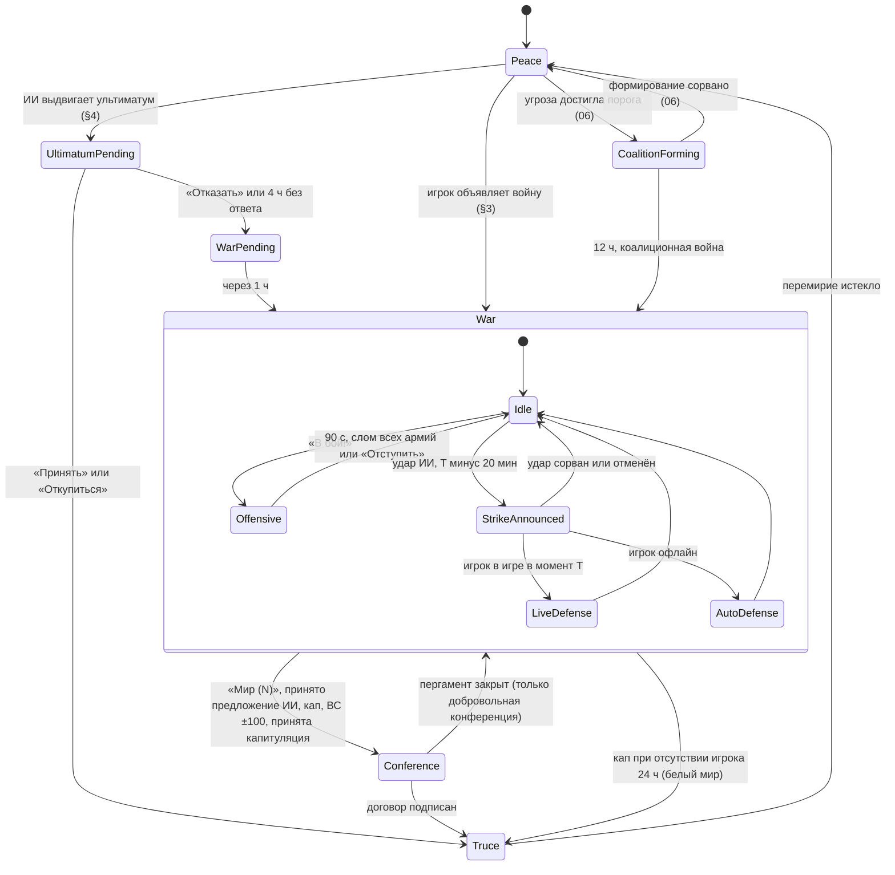
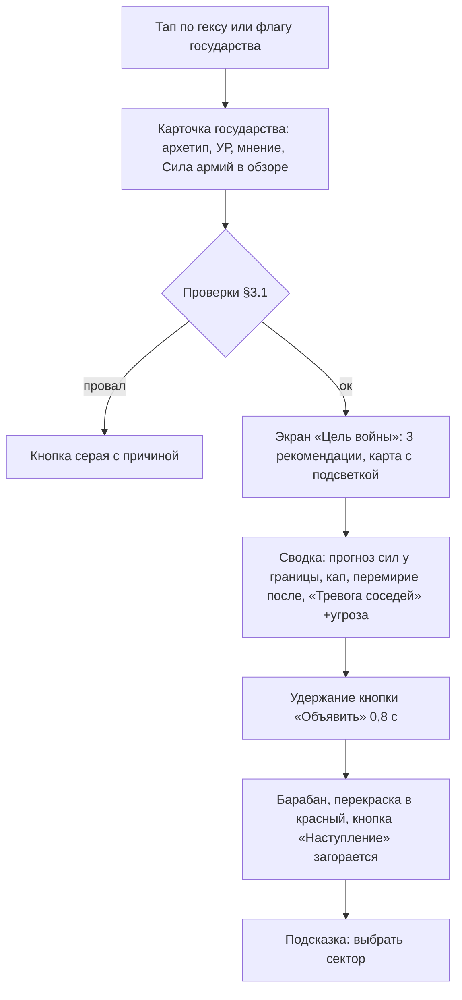
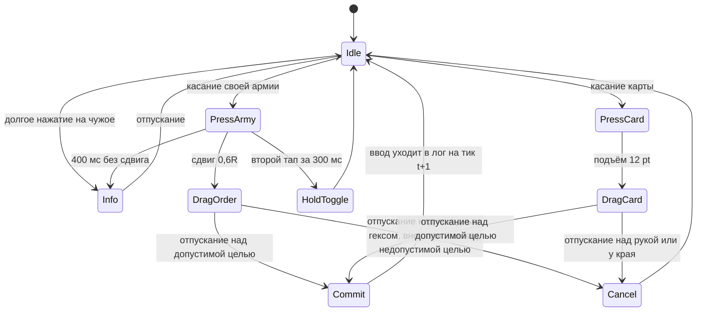
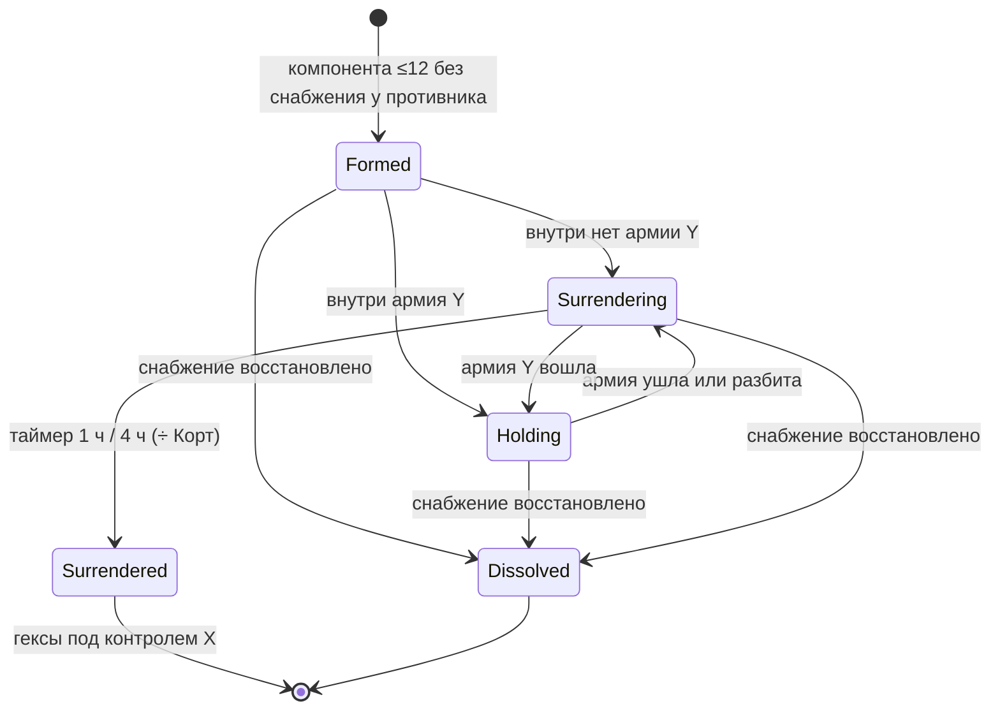
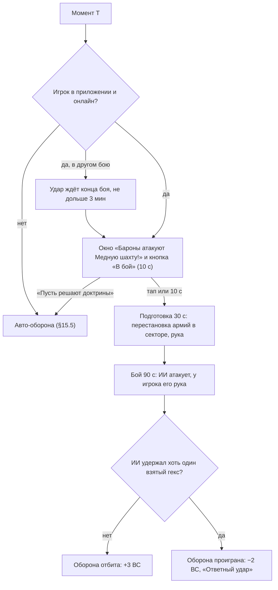
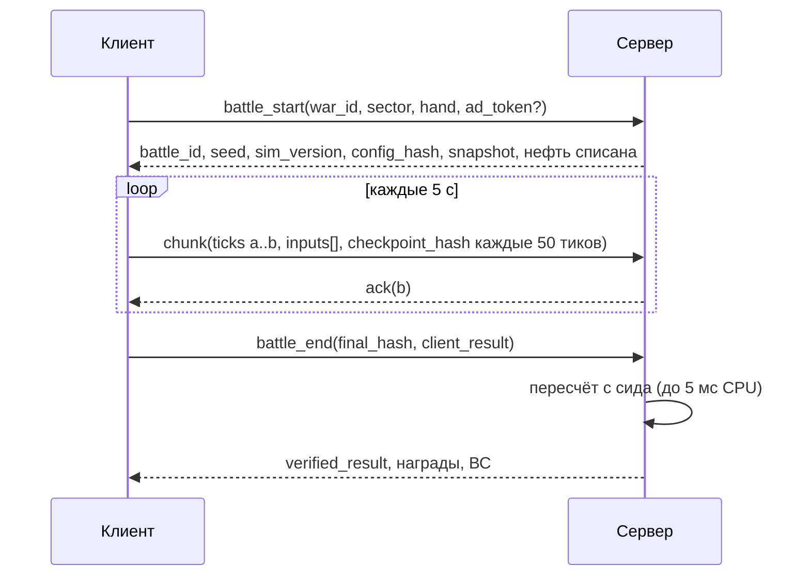

# 03. Война и бой

> **Назначение.** Исполняемая спецификация войны и боя Raivon: жизненный цикл войны (мир → ультиматум или объявление → война → наступления и офлайн-удары → конференция → перемирие), объявление и цели войны, ультиматумы ИИ, реалтайм-наступление на 90 с, управление одним пальцем, энергия, формула боя и порядок тика симуляции на 10 Гц в фиксированной точке, модификаторы и правила их сложения, снабжение и котлы, тактические формы, 12 + 1 карт войны, укрепления, башни и гарнизоны в бою, доктрины, контратаки ИИ и авто-оборона, очки территории и военный счёт, Последний рубеж, исходы войны, механика поражения и разграбления, ИИ в бою, автобой, обрыв связи и серверная перепроверка, боевые правила Арены Рубежей, полный пример войны и таблица edge cases.
> **Опирается на канон:** §2.1 (решения владельца 1, 3, 4, 8, 9, 12), §2.2 (журнал решений, п. 1–13, 27, 39, 40), §3.2 (глоссарий войны), §5.1 (ценность и защитные свойства гексов), §6.2 (М_силы, лимиты), §7 (укрепление, башня), §8.1 и §8.4 (Сила отрядов, черты, командиры — как входные данные), §9.1–9.17 (модель войны целиком), §10.1–10.2 и §10.4 (требования, архетипы — только то, что нужно бою), §10.8 (коалиционная война), §11 (Арена), §13 (таймеры), §14.10 (запреты), §16.1–16.2 (`sim`, перепроверка).
> **Связанные файлы:** `02_map_territory.md` (сетка, координаты, модель гекса, отрисовка фронта, котлов и выступов, туман), `04_units_army.md` (статы семейств, состав, командиры, тренировка и пополнение), `05_economy_buildings.md` (склад, доход, апкип, ремонт, разорение как экономический эффект), `06_diplomacy_peace.md` (меню мира и цены требований, выбор уровня грабежа, мнение, угроза, коалиции, союзы), `07_progression_meta.md` (лиги, кубки, сезоны Арены), `08_retention_liveops.md` (FTUE-сценарии, события, пуши), `09_monetization.md` (рекламные плейсменты), `10_ui_ux_art.md` (пиксели экрана боя, VFX, звук), `11_balance_numbers.md` (кривые, армии ИИ), `12_tech_analytics_roadmap.md` (сервер, античит, аналитика).
> **Граница зоны.** Здесь нет меню мира и цен требований (`06`), статов юнитов и командиров (`04`), лиг и сезонов (`07`). Числа канона цитируются как есть. Всё, чего в каноне нет, помечено «(предложение автора)» и собрано в §25.

---

## 1. Зона файла и инварианты

### 1.1. Что здесь и что не здесь

| Здесь (03) | Не здесь (ссылка) |
|---|---|
| когда и почему меняется контроль гекса (бой, сдача котла, авто-оборона) | как это выглядит на карте — `02` §3.4, §7 |
| Сила, Мощь, размен, слом, отступление, вход | Сила отряда по семейству и уровню, состав армии — `04` |
| черты армии и пассивки командиров **как модификаторы боя** | значения пассивок по уровням, добыча командиров — `04` |
| военный счёт, очки территории, исходы войны | цены требований, рекомендованный пакет, мнение и угроза — `06` |
| механика списания при разграблении (порядок, база, потолки) | выбор уровня грабежа игроком, дипломатические последствия — `06` |
| боевые правила Арены (рубеж в бою, оборонительная рука, звёзды, лиговый стандарт в бою) | лиги, кубки, сезоны, награды — `07` |
| что пишет лог боя и что перепроверяет сервер | схема БД, античит-пайплайн, аналитические события — `12` |

### 1.2. Инварианты боя (каждый покрыт автотестом)

| # | Инвариант |
|---|---|
| W1 | Бой меняет только **контроль** гекса. Официальная граница меняется только договором, колонизацией и обменом (`02` I1). |
| W2 | Гексы Ядра игрока (`core`) никогда не меняют контроль в пользу ИИ: ИИ не выбирает их целью ни в одном бою, они не сдаются в котле (предложение автора, усиливает журнал канона §2.2 п. 13 и Q21). |
| W3 | Один лог ввода + сид + версия `sim` + хэш конфига дают один результат на Node, Android WebView и iOS WKWebView (канон §16.5). |
| W4 | В `sim` нет float, `Date`, `Math.random`. Только целые числа и PRNG xoshiro128** (канон §16.1). |
| W5 | Таймеры войны, перемирия, ультиматумов, ударов ИИ и щитов не ускоряются ничем (канон §9.15). |
| W6 | Во время боя нет рекламы, офферов и пушей (канон §14.10). Единственная реклама вокруг боя — `ad_start_energy` в фазе подготовки PvE-наступления. |
| W7 | Сложность ИИ задаётся только множителем энергии и УР ИИ. Подкрутки под платящих нет (канон §9.16, §15.9). |
| W8 | Одна война — не больше одного запланированного удара ИИ одновременно (уточнение канона §9.11, как в `01` В11). |
| W9 | Удар ИИ забирает не больше 2 гексов, авто-боёв не больше 2 за офлайн-период и 4 за сутки (канон §9.11). |
| W10 | У каждой стороны армия на гексе не больше одной (канон §3.2). |

### 1.3. Обозначения и фиксированная точка

| Величина | Хранение в `sim` | Пример |
|---|---|---|
| Сила (армии, гарнизона) | целое, миллиединицы (×1000) | 395,6 → `395600` |
| Множители, бонусы | целое, промилле (×1000) | +25% → `250`; ×1,45 → `1450` |
| Энергия | целое, 1 энергия = 3000 ед. | старт 5 → `15000` |
| Время | тики по 100 мс; бой 90 с = 900 тиков | 1,5 с → 15 тиков |
| ВС, очки гекса | целое, десятые (×10) | 24,3 → `243` |
| Деление | `idiv(a, b)` — целочисленное деление с коррекцией ±1 (JS-числа точны до 2^53, но `a/b` в double может ошибиться на единицу у границы целого) | — |

Округление в `sim` — всегда вниз (`floor`), если не сказано иначе. ВС и очки гекса округляются до десятых «половина вверх» (как в примерах канона §9.12 и §9.17).

---

## 2. Жизненный цикл войны

### 2.1. Конечный автомат



Состояние описывает **пару** «игрок — государство (или коалиция)». У игрока одновременно не больше 2 пар в состоянии `War` (канон §9.1). Щит восстановления — состояние игрока, а не пары: он запрещает переходы `Peace → UltimatumPending` и `Peace → CoalitionForming` для всех ИИ.

### 2.2. Переходы

| Переход | Условие (guard) | Побочные эффекты |
|---|---|---|
| Peace → War (игрок) | §3.1 | цвет врага → `map_enemy`; мнение −50; угроза +5 при мнении ≥0 (вероломство, канон §10.6); фиксируются знаменатели ВС; цель ИИ выбирается автоматически (§3.2); снимается Щит восстановления игрока |
| Peace → UltimatumPending | §4.1 | карточка ультиматума, `push_ultimatum`, таймер 4 ч |
| UltimatumPending → Truce | ответ «Принять» / «Откупиться» | §4.3; перемирие 24 ч (канон §9.1) |
| UltimatumPending → WarPending | «Отказать» или истечение 4 ч | отсчёт 1 ч; игрок выбирает встречную цель (§4.4) |
| WarPending → War | прошёл 1 ч | как при объявлении, но без вероломства; ИИ планирует первый удар (§2.5) |
| War.Idle → Offensive | ≥1 армия игрока с готовностью ≥50% стоит у фронта сектора; другого боя нет | списание нефти за карты техники (§12.1); сид от сервера |
| War.Idle → StrikeAnnounced | наступило T − 20 мин запланированного удара | красная стрелка; через 5 мин `push_counterattack_warning` |
| StrikeAnnounced → Idle | мир, удар отменён, у ИИ нет готовых армий в секторе в момент T | §15.6 |
| War → Conference | см. §17.2 | экран пергамента (`06`) |
| Conference → Truce | подписан договор | применение договора; при поражении — §18; перемирие 30 мин / 8 ч / 24 ч по главе на момент мира |
| Truce → Peace | истёк таймер | цвет врага → геральдический |

### 2.3. Модель данных войны

```ts
// server/war/model.ts (сериализуется в профиль игрока)
interface War {
  id: string;
  enemyStates: StateId[];            // 1 государство или коалиция 2–4
  playerAllies: StateId[];           // союзники игрока, вступившие в войну
  initiator: 'player' | 'ai_ultimatum' | 'coalition';
  startedAt: Ts; capAt: Ts;          // capAt = startedAt + кап по главе на старте
  chapterAtStart: 1|2|3|4|5|6;
  officialValueAtStart: { player: number; enemy: number };   // знаменатели ВС
  goalPlayer: HexId; goalEnemy: HexId;
  battlesScore: number;              // десятые, насыщение в ±100 (= ±10,0)
  offensivesCount: number;
  strike?: {                         // не больше одного (W8)
    plannedAt: Ts; announceAt: Ts; targetHex: HexId; sectorCenter: HexId;
    state: 'planned'|'announced'|'resolving'|'resolved'|'cancelled';
  };
  autoBattlesThisOfflinePeriod: number;
  autoBattleLog24h: Ts[];
  lastPlayerOffensiveAt?: Ts;
  aiPeaceOffer?: { createdAt: Ts; expiresAt: Ts };
  capitulationDemand?: { createdAt: Ts; expiresAt: Ts };
  lastStand: boolean;
  exhaustionStage: 0|1|2|3;
  trophyHexesTaken: HexId[];          // трофей за гекс — один раз за войну (§5.6)
}
```

### 2.4. Таймеры войны по главам (`war_time_cap`, `truce`)

| Глава | Кап войны | Перемирие | Энергия ИИ | Удары ИИ (через сколько после наступления игрока) | Подкрепления ИИ в наступлении игрока |
|---|---|---|---|---|---|
| I | 2 ч | 30 мин | ×0,6 | только скриптовые (`08`) | одна волна, на 60 с (предложение автора) |
| II | 24 ч | 8 ч | ×0,8 | 4–6 ч, все архетипы | волны на 30 и 60 с |
| III+ | 72 ч | 24 ч | ×1,0 (гегемон ×1,1) | Волк 3–4 ч, Ворон 3–5 ч, остальные 4–6 ч | волны на 30 и 60 с |

Длительности главы берутся по главе **на момент старта войны**. Перемирие — по главе на момент мира (предложение автора: открытие новой главы посреди войны не меняет её кап).

### 2.5. Активность ИИ в войне

Канон планирует удары ИИ «после каждого наступления игрока» (§9.11). В войне, которую начал ИИ, это делает ИИ пассивным, если игрок не атакует. Дополнительные правила (предложение автора):

| Правило | Значение |
|---|---|
| **Первый удар** в войне, начатой ИИ (ультиматум, коалиция) | планируется на момент старта войны; объявление сразу при старте, удар через 20 мин |
| **Правило простоя** | если в войне нет наступлений игрока 6 ч и удар не запланирован, ИИ планирует удар на «сейчас + 20 мин» |
| Ограничения | все лимиты канона (W8, W9, тихие часы, Ядро) действуют и здесь; правило простоя не срабатывает, если игрок не заходил больше 24 ч (защита отсутствующего) |

---

## 3. Объявление войны игроком

### 3.1. Условия

Кнопка «Объявить войну» есть на карточке государства и в меню «Дипломатия». Проверки выполняются по порядку, первая проваленная показывает текст в кнопке:

| # | Проверка | Текст отказа |
|---|---|---|
| 1 | Во время FTUE объявляются только сценарные войны (`08`); после FTUE, в том числе в главе I, — свободно | «Сначала завершите обучение» |
| 2 | Общая граница: есть пара соседних гексов «официальный гекс игрока — официальный гекс цели» или «гекс союзника игрока — гекс цели» (канон §9.1) | «Нет общей границы» |
| 3 | Нет перемирия и пакта о ненападении с целью (перемирие и пакт нарушить нельзя никому — предложение автора для пакта по аналогии с каноном §9.15) | «Перемирие: 5:42:10» |
| 4 | Цель — не союзник игрока | «Сначала расторгните союз» |
| 5 | У игрока меньше 2 войн (коалиция = одна) | «Не больше двух войн одновременно» |
| 6 | Цель не участвует в коалиционной войне против игрока (она уже воюет с ним) | — |

Объявление войны участнику **формирующейся** коалиции разрешено: это «превентивный удар» (канон §10.8). Последствия для формирования — `06`.

### 3.2. Цель войны (`war_goal`)

**Рекомендация (3 гекса).** Кандидаты: официальные гексы врага под его контролем на расстоянии ≤2 от официальной территории игрока (или союзника, через которого граничим). Сортировка: ценность ↓, расстояние ↑, уровень укрепления ↑, `cell_id` ↑. Показываются первые 3 с превью «что даст гекс» (доход, тип, очко гекса). Игрок может выбрать любой официальный гекс врага, связный с фронтом по суше или достижимый «Десантом» (предложение автора).

**Цель ИИ в войне игрока** выбирается автоматически при объявлении (предложение автора; канон даёт ИИ цель только при ультиматуме): официальный гекс игрока вне Ядра, соседний с подконтрольной ИИ землёй, с максимальной ценностью; при равенстве — тот, что когда-то принадлежал ИИ, потом меньший уровень укрепления, потом `cell_id`. Цель ИИ видна игроку значком красного флажка.

**Правила цели:**
- +10 ВС стороне, пока она удерживает цель своей войны. «Удерживает» = контролирует гекс **или** гекс в её котле (котёл = оккупация в ВС, канон §9.7).
- Цель фиксирована на всю войну. Если гекс-цель перестал существовать как гекс врага (сепаратный мир в коалиции отдал его другому государству, обмен), сторона один раз выбирает новую цель из рекомендованных (у ИИ — автоматически).
- В коалиционной войне у игрока одна цель среди гексов всех участников, у коалиции одна цель (выбирает лидер).

### 3.3. Последствия объявления

| Эффект | Значение | Источник |
|---|---|---|
| Цвет врага | геральдический → `map_enemy` | канон §3.1 |
| Мнение врага | −50 | канон §10.5 |
| Угроза | +5, если мнение врага было ≥0 | канон §10.6 |
| Реванш | +15% к атаке против победителя, если война объявлена ему в течение 7 суток после проигранной | канон §3.2 |
| Союзники игрока | в оборонительной войне вступают сами; в наступательной — по «Призыву» при мнении ≥60 | канон §10.7, детали — `06` |
| Знаменатели ВС | фиксируются: официальная ценность врага и игрока на старт | канон §9.12 |
| Кап | `capAt` = старт + кап главы | §2.4 |

### 3.4. UX-поток объявления



Удержание 0,8 с повторяет жест «Печать» мира и защищает от случайного объявления (предложение автора).

---

## 4. Ультиматумы и войны, начатые ИИ

### 4.1. Когда ИИ может выдвинуть ультиматум

Раз в сутки для каждого ИИ, граничащего с игроком, сервер бросает шанс архетипа (канон §10.4: Волк 35%, Лис 10%, Черепаха 5%, Ворон 25% если игрок уже воюет, Сова 10%; гегемон +10 п.п.). Шанс применяется, только если ИИ «сильнее» (предложение автора):

```
P_mil(state) = Σ максимальной Силы всех армий государства
ИИ сильнее ⇔ P_mil(ИИ) ≥ 0,9 × P_mil(игрок)
Ворон: условие «игрок уже воюет» заменяет условие силы
```

**Запреты** (все из канона, плюс отмеченные):

| Запрет | Источник |
|---|---|
| не больше 1 войны ИИ против игрока в 48 ч | канон §9.1 |
| в главе I только скриптовые | канон §9.1 |
| ни во время тихих часов, ни во время Щита восстановления, ни если игрок не заходил больше 24 ч | канон §9.1 |
| у игрока уже 2 войны | канон §9.1 |
| между ИИ и игроком перемирие или пакт | канон §9.15, §10.8 |
| ультиматум выдаётся только в окне [конец тихих часов; начало тихих часов − 5 ч], по умолчанию 07:00–18:00, чтобы 4 ч + 1 ч не заканчивались в тихие часы | предложение автора (`01` В2) |
| после 2 поражений подряд шанс ×0,7 на 48 ч | канон §9.14 («агрессия −30%») |
| 3 дня после возврата игрока из отсутствия 30+ дней — шанс 0 | канон §14.8 |

Минута выдачи внутри окна выбирается сидированным PRNG мира игрока (`02` §17.4).

### 4.2. Что требует ИИ

**Тип требования** (предложение автора): Волк — гекс 80% / дань 20%; Ворон — 60/40; Лис — 30/70; Сова — 40/60; Черепаха — 20/80; гегемон всегда требует дань (канон §10.4 «требует дань»).

**Требуемый гекс:** официальный гекс игрока вне Ядра, соседний с землёй ИИ. Счёт: ценность × 10, ×2 если гекс раньше принадлежал этому ИИ, +5 если рядом с ним столица ИИ (≤2), −2 за уровень укрепления. Берётся максимум.

**Дань:** 8 ч производства золота игрока (канон §3.2).

**Эквивалент гекса в золоте** для «Откупиться» (предложение автора): `max(8, 4 × ценность) ч` производства золота игрока. Обычный гекс и ферма — 8 ч, порт 12 ч, город 16 ч, Райвитовая жила 20 ч.

### 4.3. Ответы

| Ответ | Что происходит | Мнение | Перемирие |
|---|---|---|---|
| **Принять** | гекс сразу переходит ИИ официально (уступка приравнена к договору; анимация контура 1,5 с, как у обмена — `02` §9.5) или списывается дань (со склада и несобранного дохода; если золота не хватает, кнопка неактивна и показывает «Собрать всё») | +20 | 24 ч |
| **Откупиться** | игрок платит долю требования (для гекса — от его эквивалента): Лис, Сова и Черепаха принимают ≥50%, Ворон ≥75%, Волк не принимает (кнопки нет). Черепаха в каноне не названа, её порог 50% — предложение автора | 0 (предложение автора) | 24 ч |
| **Отказать** | война через 1 ч (`WarPending`) | — | — |
| Нет ответа 4 ч | как «Отказать» | — | — |

Ползунок «Откупиться» начинается с минимального порога архетипа. Ультиматум, выданный при открытой войне с другим ИИ, на текущую войну не влияет.

### 4.4. Ожидание войны (1 ч) и встречная цель

- На карте отсчёт «Война через 0:59:12», граница с ИИ мигает.
- Игрок выбирает **встречную цель** из 3 рекомендованных (§3.2). Без выбора берётся первая (`01` В3).
- Цель ИИ = требуемый гекс; при требовании дани — его лучший гекс по счёту §4.2.
- Игрок может маршировать армиями, менять доктрины, расконсервировать укрепления (10 мин). Наступать до старта войны нельзя.
- При старте ИИ планирует первый удар (§2.5).

### 4.5. Коалиционная война: боевые особенности

- Формирование и состав коалиции — `06`. Если 12 ч формирования истекают в тихие часы, война стартует в конце тихих часов + 20 мин (`01` В2).
- Одна война: знаменатель «официальная ценность врага» — сумма ценности всех участников (канон §9.12). Каждый участник — отдельный «вражеский цвет» в бою, но для форм, снабжения и котлов все участники — **одна сторона** (их гексы союзны друг другу).
- Сепаратный мир с участником пересчитывает ВС (§16.4).
- Удары ИИ планирует лидер коалиции; лимит W8 — на всю коалиционную войну.

---

## 5. Наступление

### 5.1. Запуск и выбор сектора (`offensive`, `sector`)

1. Кнопка «Наступление» горит, пока у игрока есть хотя бы одна война.
2. Тап подсвечивает **сектора** — диски радиуса 4 (61 гекс, канон §3.1).
3. Алгоритм предложения секторов (предложение автора):

```ts
function proposeSectors(w: World, war: War): HexId[] {
  // армии у фронта: стоят на своём/оккупированном гексе, соседнем с гексом врага этой войны, готовность ≥50%
  const ready = w.playerArmies().filter(a => a.readiness >= 500 && w.adjacentEnemyOf(a.hex, war).length > 0);
  // сортировка: больше готовых армий в радиусе 3, потом выше максимальная ценность соседнего вражеского гекса
  ready.sort(by(a => -w.countReadyWithin(a.hex, 3), a => -w.maxAdjEnemyValue(a.hex, war), a => a.id));
  const centers: HexId[] = [];
  for (const a of ready) {
    if (centers.some(c => distance(c, a.hex) <= 3)) continue;
    centers.push(w.bestAdjEnemyHex(a.hex, war));   // центр — самый ценный соседний вражеский гекс
  }
  return centers.slice(0, 4);                       // не больше 4 зелёных колец на экране
}
```

4. Долгое нажатие на любой вражеский гекс у фронта создаёт свой сектор с центром в нём, если в радиусе 4 есть готовая армия (предложение автора).
5. **Две войны.** Наступление относится к войне, чей гекс в центре сектора. Гексы и армии другой войны внутри сектора серые и в бою не участвуют.

### 5.2. Фаза подготовки (без таймера)

| Действие | Правило |
|---|---|
| Переставить армию | перетаскивание на свой или оккупированный гекс сектора без своей армии; мгновенно и бесплатно (канон §9.2) |
| Собрать руку | «Атака» закреплена + 4 слота (с УР6 — 5) из открытых карт; у карт техники с УР6 видна цена в нефти (§12.1) |
| Поставить флажок наступления | по умолчанию — цель войны, если она в секторе и под контролем врага; иначе самый ценный вражеский гекс сектора (при равенстве — ближе к своей армии). Тап по вражескому гексу переносит флажок (предложение автора) |
| Доктрина «Держать» | двойной тап по армии |
| `ad_start_energy` | +3 стартовой энергии, 3 в день, только PvE-наступление (канон §15.2) |
| Прогнозы | долгое нажатие на вражеский гекс показывает прогноз «Атаки» всеми соседними армиями |

- Подготовка не останавливает мир. Если в это время наступил момент T удара ИИ, подготовка закрывается сообщением «Враг атакует!» и открывается оборона (§15.4).
- 10 мин бездействия в подготовке возвращают на карту (предложение автора).
- «В бой!» требует ответа сервера: `battle_id`, `seed`, `sim_version`, `config_hash`, снимок состояния сектора. Без сети кнопка неактивна (канон: только онлайн).

### 5.3. Таймлайн боя

| Время | Тик | Событие |
|---|---|---|
| 0,0 с | 0 | энергия = стартовая (§7); ИИ получает свою; все армии сектора, гарнизоны, укрепления и башни активны |
| 25,0 с | 250 | красная стрелка у точки входа 1-й волны подкреплений ИИ (если она будет) |
| 30,0 с | 300 | 1-я волна входит в сектор |
| 55,0 с | 550 | стрелка 2-й волны |
| 60,0 с | 600 | 2-я волна входит |
| 70,0 с | 700 | Финальный рывок: +1 энергии за 1,5 с (канон §9.4) |
| 90,0 с | 900 | конец; входы в гексы, начатые до 900, завершаются (≤ +15 тиков) |

Длительность и время волн — параметры конфига (`duration_ticks`, `wave_ticks`): событие «Блицкриг» ставит 60 с (канон §14.6), FTUE — 60 с (канон §14.3). При 60 с волна одна, на 30 с (предложение автора).

### 5.4. Подкрепления ИИ

| Правило | Значение (предложение автора, канон: «на 30-й и 60-й секунде могут подойти, видно за 5 с») |
|---|---|
| Кто может прийти | армия ИИ вне сектора на расстоянии ≤6 от центра (≤2 от края), снабжённая, не в другом бою, с готовностью ≥50% |
| Сколько | не больше 1 армии на волну; выбирается самая сильная |
| Точка входа | гекс ИИ на кольце радиуса 4 сектора, снабжённый, без армии, ближайший к армии; фиксируется в момент стрелки |
| Срыв волны | в момент входа точка не под контролем ИИ, не снабжена (например, «Диверсия» на ней или на её единственной связи) или занята → волна отменяется, армия остаётся на месте. Повторной попытки нет |
| После боя | пришедшая армия остаётся на точке входа |

### 5.5. Конец боя и разрешение

Конец наступает в первый тик, где выполнено одно из условий:
1. тик ≥ 900 и нет незавершённых входов;
2. **все армии игрока сломлены**: каждая не временная армия либо разбита, либо её Сила < 30% Силы на начало боя (предложение автора, уточнение канона §9.2);
3. ввод «Отступить» (удержание кнопки 0,5 с — защита от случайного нажатия, предложение автора).

**Разрешение конца:**

| Что было в момент конца | Итог |
|---|---|
| Столкновение идёт | отменяется без слома: атакующие остаются на своих гексах с текущей Силой, защитники — с текущей; гарнизон сохраняет остаток |
| Защитник сломлен, вход идёт | вход завершается, гекс взят |
| Временные армии («Подкрепление», «Десант», «Союзный корпус») | исчезают; гекс, взятый «Десантом», остаётся оккупированным с гарнизоном оккупанта |
| Временные эффекты карт | заканчиваются; снабжение и котлы пересчитываются |
| Разбитые армии | появляются в ближайшем снабжаемом своём официальном гексе без армии с 10% максимальной Силы (канон §8.1; выбор гекса — `04` §9.6) |
| Армии игрока | стоят там, где закончили бой, включая взятые гексы |

### 5.6. Итоги, звёзды (`offensive_stars`), трофеи

| Итог | Правило |
|---|---|
| Захваченные гексы | оккупированы, контур не меняется (канон §9.2) |
| Потери Силы | сохраняются, восполняет пополнение (`04`) |
| ★ | взят ≥1 гекс (захват, который удержан до конца боя) |
| ★★ | взят гекс с флажком наступления **или** к концу боя флажковый гекс оказался в котле игрока (предложение автора; так читается пример канона §9.17, наступление 3) |
| ★★★ | ★★ и ни одна не временная армия игрока не разбита |
| Без захвата | −1 в «Бои» (канон §9.12) |
| ВС | ★ +1, ★★ +2, ★★★ +3 в «Бои» (§16.2) |
| Трофей | захват гекса с постройкой (ферма, шахта, город, порт, нефть, завод, база): 1 ч производства этого гекса у владельца, у города 2 ч (канон §9.2). **Один раз за войну на гекс** — защита от фарма «отдал — отбил» (предложение автора). Райвитовая жила трофея не даёт (Райвиты не добываются боем, предложение автора) |
| Опыт пасса | за наступление (`09`) |
| Экран итогов | звёзды, гексы, ВС до → после, «Мир (N)», потери по армиям, кнопка «Продолжить» (после неё допустим interstitial по правилам канона §15.2) |

### 5.7. Бой с мародёрами (60 с)

Лагерь мародёров (`hex_raider_camp`) — PvE-бой без войны (размещение — `02` §13, награды — `05`). Правила боя (предложение автора, канон: «бой на 60 с»):

| Параметр | Значение |
|---|---|
| Сектор | радиус 4 вокруг лагеря |
| Защитники | `raider_garrison` = 0,6 × средняя максимальная Сила армий игрока × (1 + 0,2 × k), k — разбитых сегодня лагерей (0–2); укрепление ур. min(УР, 2) |
| ИИ | без карт и энергии, не атакует |
| Игрок | энергия по §7, Финальный рывок — последние 20 с |
| Победа | слом защитников: лагерь уничтожен, гекс снова дикий; армия в дикий гекс не входит |
| ВС, звёзды | нет |

---

## 6. Управление одним пальцем

### 6.1. Раскладка

Сверху вниз (канон §9.3): шкала «Контроль фронта» с таймером и кнопкой «Мир (N)» (в бою только превью, нажатие неактивно — предложение автора); сектор радиуса 4; полоса энергии из 10 сегментов (11 с УР9); рука и «Отступить». Пиксели, отступы и safe area — `10`; размер гекса — `02` §2.5.

### 6.2. Жесты

| Жест | Распознавание (предложение автора) | Действие |
|---|---|---|
| Свайп «армия → соседний вражеский гекс» | касание в своём гексе с армией, сдвиг ≥0,6R, отпускание над целью | атака этой армией, 2 энергии |
| Свайп «армия → свой гекс» | то же, цель — свой или оккупированный гекс сектора | перемещение по кратчайшему пути по своим гексам, 1,0–1,5 с/гекс по Натиску (`04` §3.2), бесплатно |
| Перетащить «Атаку» на вражеский гекс | подъём карты на ≥12 pt, отпускание над целью | атака всеми соседними с целью армиями, которые не в столкновении и не на «Держать»; 2 энергии на всех; при ≥2 армиях — Клин |
| Перетащить карту на гекс | то же | розыгрыш; допустимые цели подсвечены, недопустимые — красный контур |
| Вернуть карту в руку / к краю экрана | отпускание над рукой или в нижних 8% экрана | отмена без затрат |
| Долгое нажатие на армию или гекс | ≥400 мс без сдвига >10 pt | карточка: Сила, бонусы с разбивкой по строкам §9.1, состав, командир. Бой **не** ставится на паузу |
| Двойной тап по армии | два тапа ≤300 мс | «Держать позицию»: +10% к защите, армия не двигается и не участвует в «Атаке» картой. Повторный двойной тап или любой приказ снимает |
| Тап-тап (доступность) | тап по своей армии выделяет её и подсвечивает цели; тап по цели = свайп | то же, что свайп; отключается в настройках (предложение автора) |

**Попадание по гексу.** Точка отпускания переводится в гекс (`02` §2.4 `pixelToHex`). Если гекс недопустим, а допустимая цель есть в пределах 0,6R от точки, приказ «прилипает» к ней (предложение автора). Перетаскиваемая карта рисует прицел на 40 pt выше пальца, чтобы палец не закрывал гекс.

### 6.3. Автомат ввода



Допустимость цели проверяется **в тик применения** (t + 1). Если за это время цель стала недопустимой (гекс уже взят, армия вступила в бой), ввод отклоняется детерминированно и на клиенте, и на сервере, клиент показывает «Цель изменилась».

### 6.4. Прогноз (`forecast`)

- Пока палец тянет приказ, на цели видны мечи, коэффициент «×1,4» и значки форм («Клин +20%», «Окружение +30%», «Коридор»). Цвет по канону: зелёный при R ≥ 1,3, жёлтый при 0,9–1,3, красный при < 0,9 (§8.7 — оговорка о точности R).
- R считается теми же функциями `sim`, что и бой, на текущем тике: Сила × множители по §9.2, с учётом активных карт и форм. Башни и будущие волны не учитываются.
- Для «Атаки» картой суммируются все армии, которые пойдут; для «Прорыва» рисуется путь и точка остановки с R в ней; для «Десанта» — R высадки против гарнизона.
- Значок «⏱ не успеет», если оценка длительности столкновения (мини-симуляция изолированного размена ≤100 тиков) больше оставшегося времени боя (предложение автора).
- Красный контур «Уязвимый выступ −15%» на гексе назначения перемещения или атаки, если после входа гекс станет выступом.

### 6.5. Ошибки ввода

| Ситуация | Реакция |
|---|---|
| Свайп с пустого гекса или с вражеской армии | открывается карточка информации, приказа нет |
| Свайп на несоседний вражеский гекс | красный контур, подпись «Только соседний гекс», отмена |
| Свайп на вражеский гекс, энергии < 2 | полоса энергии мигает, лёгкая вибрация, отмена. Очереди приказов нет (предложение автора) |
| Свайп армией, которая уже атакует | новый приказ запрещён, кроме свайпа на свой гекс: это «Отозвать» — армия выходит из столкновения без слома (предложение автора) |
| Свайп армией, которая входит в гекс или отступает | запрещён до окончания движения |
| Свайп армией, которую атакуют (она защитник) | запрещён: защитник заперт в столкновении |
| Перетаскивание карты на перезарядке | карта затемнена с радиальным таймером, не поднимается |
| Карта техники без оплаченной нефти | карта серая с иконкой капли весь бой |
| Второй палец на экране | игнорируется; жест первого пальца продолжается |
| Касание «Отступить» без удержания | подсказка «Удерживайте», ничего не происходит |
| Сворачивание приложения | считается обрывом связи (§21) |

---

## 7. Энергия (`energy`, `final_rush`)

| Параметр | Значение | Источник |
|---|---|---|
| Старт | 5 | канон §9.4 |
| Максимум | 10, с УР9 — 11 | канон §9.4 |
| Восполнение | +1 за 3 с; в Финальном рывке +1 за 1,5 с | канон §9.4 |
| Набор за бой | 5 + 70/3 + 20/1,5 ≈ 41,7 | канон «≈41» |
| Перезарядка карт | 10 с у всех, кроме «Атаки» | канон §9.4 |
| Модификаторы старта | +1 за каждые 3 своих Нефтевышки (максимум +2); Леди Вэнс +1; `ad_start_energy` +3 (только PvE-наступление); исследование «Командование» +1 с УР7 | канон §9.4, §12.3 |
| Потолок старта | стартовая энергия не выше максимума (5 + 2 + 1 + 3 + 1 = 12 → 10) | предложение автора |
| Модификаторы скорости | Последний рубеж +25%; Император Рай +5…+10% | канон §9.4, §8.4 |

**Формула в `sim`** (1 энергия = 3000 ед., база 100 ед./тик):

```
rate = idiv(100 × (1000 + Σ бонусов скорости, ‰) × side_mult_‰, 1 000 000)
rate × 2 в Финальном рывке
E = min(E + rate, E_max × 3000)            // сверх максимума не копится
side_mult: ИИ в наступлении игрока и в ударе — по главе (600 / 800 / 1000 / 1100);
           авто-оборона игрока — 700 (канон §9.11);
           любой автоигрок за игрока (автонаступление, серверный автопилот, оборона Рубежа) — 850 (предложение автора, канон «−15%»);
           событие «Блицкриг» — ×1500 к любому множителю (канон «энергия ×1,5»)
Старт ИИ = floor(5 × side_mult) энергии (предложение автора)
```

Бонусы скорости складываются между собой, множители стороны перемножаются. Пример: игрок в Последнем рубеже с Императором Раем ур. 20: rate = 100 × 1,35 = 135 ед./тик → +1 энергия за 2,22 с, в Финальном рывке за 1,11 с.

---

## 8. Формула боя и симуляция (`sim`, 10 Гц)

### 8.1. Сущности симуляции

| Сущность | Поля (основные) |
|---|---|
| `Army` | `id`, `side`, `hex`, `maxS`, `S`, `battleStartS`, доли семейств (→ коэффициенты черт k), командир, `state` (`idle` / `moving` / `attacking` / `defending` / `entering` / `retreating` / `routed`), `hold`, `temp` (+ `expiresAt`), `drainedS` (накопленная потеря от снабжения), `healedS` (лечение госпиталем за бой) |
| `Hex` (боевой срез) | `controller`, `owner`, `type`, `value`, `terrain`, `fortLevel`, `fortReductions[]` (с тиком окончания), `fortMothballed`, `towerLevel`, `towerDisabledUntil`, `garrison`, `garrisonMax`, эффекты карт (`sabotagedUntil`, `encircledUntil`, `reconUntil`, `defenseUntil` + значение, `corridorPenaltyUntil`) |
| `Clash` | `id`, `target`, `attackers[{armyId, startS}]`, `defArmy?{armyId, startS}`, `garrisonIn`, `garrisonReserve`, `garrisonStartS`, `corridor` (фиксируется на старте) |
| `Side` | `energy`, `cooldowns[card]`, `hand`, `sideMult`, `regenBonus` |

**Черты армии** (канон §8.1): k = min(1, доля Силы семейства / порог). Пороги: Стойкость 50% пехоты, Натиск 30% штурма, Осада 20% артиллерии, Полевой госпиталь 15% поддержки. Доли считаются по максимальной Силе отрядов и в бою не меняются: урон распределяется по отрядам пропорционально (предложение автора). Формулы черт — `04` §3.2: ход в бою = 1,5 − 0,5 × k(Штурм) с/гекс с округлением до тика; Полевой госпиталь — вне столкновения +1% максимальной Силы в секунду × k, не выше максимума; действует в любом 90-секундном бою (наступление игрока, удар ИИ). Потолок лечения — не больше +25% максимальной Силы за бой (предложение автора, §25 К8; пример `04` — +24% за 40 с — в него укладывается).

### 8.2. Столкновение (`clash`, `might`)

```
Мощь_атаки  = Σ_i  S_i × m_att(i)                         // m_att — множитель армии i (§9.2)
Мощь_защиты = (S_армии + S_гарнизона_в_бою) × m_def        // один множитель на пул (канон §9.5)
За тик (0,1 с): защита теряет 0,015 × Мощь_атаки, атака теряет 0,015 × Мощь_защиты
Слом стороны:  Σ S текущих участников < 30% Σ S этих участников на их входе в столкновение
```

- Множитель **на каждую атакующую армию отдельно** (у армий разные черты, командиры и река на ребре). Для одинаковых армий это ровно формула канона.
- Модификаторы, которые дают армия-защитник (черты, командир, «Держать»), действуют **на весь пул** «армия + гарнизон» (канон: один множитель на пул; предложение автора — источник модификатора).
- Мощь пересчитывается **каждый тик** из текущей Силы и активных модификаторов: ланчестерский размен (журнал канона §2.2, п. 5).
- Армия, присоединившаяся к идущему столкновению, добавляет свою текущую Силу к «Силе на входе» своей стороны. Армия, вышедшая из столкновения («Отозвать», атака на её собственный гекс), уносит свой вклад.
- Оба слома в один тик → ломается атакующий (преимущество защитника, предложение автора). В изолированном размене при точном R = 1 и равной Силе это и происходит на 8,0 с.

### 8.3. Порядок обработки тика

```ts
// sim/battle/tick.ts — один и тот же код на клиенте и сервере
function tick(b: Battle): void {
  const t = ++b.tick;
  // 1. Ввод: сначала ввод игрока с этим тиком (в порядке лога), затем решения ИИ / автоигрока
  //    (ИИ решает на тиках t % 10 === 5 по состоянию конца тика t−1). Недопустимый ввод отбрасывается.
  const aiPlan = t % 10 === 5 ? b.aiSides.map(s => [s, decide(b, s)] as const) : [];  // решение по состоянию конца t−1
  for (const inp of b.inputsAt(t)) applyInput(b, inp);           // приказы, карты (мгновенный урон карт — здесь)
  for (const [side, d] of aiPlan) applyDecisions(b, side, d);    // ставшие недопустимыми после ввода игрока — отбрасываются
  // 2. Энергия, перезарядки, истечение временных эффектов (endTick === t)
  for (const s of b.sides) regenEnergy(b, s);
  tickCooldowns(b); const expired = expireEffects(b, t);
  // 3. Сценарные события: стрелки волн (250/550), вход волн (300/600), флаг Финального рывка (700)
  scriptedEvents(b, t);
  // 4. Движение: перемещения, входы, отступления; прибытия в порядке id армии; завершённый вход = захват
  const captures = advanceMovement(b);
  // 5. Новые столкновения по приказам атаки (армия свободна, цель допустима) и присоединения к идущим
  startOrJoinClashes(b);
  // 6. Кэш карты: снабжение, котлы, выступы — только если в шагах 2–5 менялся контроль или истекли эффекты снабжения
  if (captures.length || expired.affectsSupply) recomputeSupplyAndForms(b);
  // 7. Снимок Мощи: для каждого столкновения (по id) — формы, множители, Мощь из текущей Силы
  const snap = b.clashes.map(c => snapshotMight(b, c));
  // 8. Буфер урона: размен по снимку, башни, утечка без снабжения
  const dmg = new DamageBuffer();
  for (const s of snap) addClashDamage(dmg, s);
  addTowerDamage(b, dmg); addSupplyDrain(b, dmg);
  // 9. Одновременное применение урона, Сила не ниже 0
  dmg.apply(b);
  // 10. Полевой госпиталь у армий вне столкновения
  healSupportArmies(b);
  // 11. Проверка сломов (по id столкновения): отступление / разбитие / вход; откат атакующих
  for (const c of [...b.clashes]) resolveBreak(b, c);
  // 12. Если менялся контроль или котлы — пересчёт кэша и живого ВС (событие для HUD)
  if (b.dirty) { recomputeSupplyAndForms(b); emitLiveScore(b); }
  // 13. Проверка конца боя (§5.5)
  checkEnd(b, t);
  // 14. Каждые 50 тиков — хэш состояния (контрольная точка для сервера, §21)
  if (t % 50 === 0) b.checkpoints.push(hashState(b));
}
```

### 8.4. Распределение урона и округление

```ts
function distribute(loss: number, parts: {id: number; S: number}[]): void {
  const total = sum(parts.map(p => p.S));
  if (total === 0) return;
  let given = 0;
  for (const p of parts) { p.dS = idiv(loss * p.S, total); given += p.dS; }
  // остаток — по одной миллиединице, начиная с самой сильной части (равенство — меньший id)
  const order = [...parts].sort((a, b) => b.S - a.S || a.id - b.id);
  for (let i = 0; given < loss; i = (i + 1) % order.length, given++) order[i].dS += 1;
  for (const p of parts) p.S = Math.max(0, p.S - p.dS);
}
// loss = idiv(15 × Мощь_противника, 1000); Мощь = idiv(S × m, 1000); m в промилле, S в миллиединицах
```

- Урон по нескольким атакующим — пропорционально Силе (канон §9.5). Урон по пулу защиты (армия + гарнизон в бою) — тоже пропорционально Силе (предложение автора).
- Прямой урон (карты, башни, утечка без снабжения) множителями не умножается и защитой не режется. Он считается в слом, если цель в столкновении.

### 8.5. Слом (`break`), отступление, разбитие (`routed`), вход

```ts
function resolveBreak(b: Battle, c: Clash): void {
  const attBroken = 10 * sumS(c.attackers) < 3 * sumStart(c.attackers);
  const defBroken = 10 * sumS(c.defenders) < 3 * sumStart(c.defenders);
  if (attBroken) { endClash(c, 'attacker_broken'); return; }          // и при одновременном сломе
  if (!defBroken) return;
  c.target.garrison = 0;                                               // гарнизон уничтожен (канон)
  if (c.defArmy) {
    const noRetreat = c.encircledNow || b.inPocket(c.target) || isTemp(c.defArmy);
    const dest = noRetreat ? null : pickRetreatHex(b, c);
    if (dest) startMove(c.defArmy, dest, 15, 'retreating');            // 1,5 с, с остатком Силы
    else rout(b, c.defArmy);                                            // разбита
  }
  const enterer = maxBy(c.attackers, a => [a.S, -a.id]);               // входит самая сильная
  startMove(enterer, c.target, c.corridor ? 8 : 15, 'entering');       // 1,5 с, Коридор 0,75 с (≈8 тиков)
  reserveHex(c.target, enterer);                                       // враг не может войти в гекс, пока идёт вход
  endClash(c, 'defender_broken');
}
```

| Правило | Значение |
|---|---|
| Выбор гекса отступления | соседний гекс под контролем своей стороны, без своей армии, не в столкновении и не зарезервирован. Приоритет: снабжён > нет; выше эффективный уровень укрепления; дальше от ближайшей атакующей армии; меньший `cell_id` (предложение автора) |
| Разбита | армия немедленно уходит из боя (фигурки с белым флагом), в бою больше не участвует; после боя — ближайший снабжаемый официальный свой гекс без армии, 10% максимальной Силы (канон §3.2). Временная армия при разбитии просто исчезает |
| Слом атакующих | столкновение заканчивается, атакующие стоят на своих гексах с остатком Силы (канон: «откатываются на исходный гекс»; атака ведётся с соседнего гекса, визуально — выпад и возврат) |
| Вход | армия в движении 15 тиков (8 при Коридоре). Атаковать её до прибытия нельзя. При прибытии: контроль гекса переходит, гарнизон нового контролёра = 50% формулы (§8.6), трофей, пересчёт снабжения и ВС |
| Атакуемый собственный гекс атакующей армии | армия автоматически выходит из своей атаки без слома и становится защитником своего гекса (предложение автора) |
| После захвата | армия стоит на месте до следующего приказа. Исключения — «Прорыв» и доктрина «Контратаковать» (канон §9.3) |

### 8.6. Гарнизоны и башни

| Параметр | Значение | Источник |
|---|---|---|
| Гарнизон владельца (максимум) | 10 × ценность × М_силы(УР владельца); Военная база ×2 | канон §9.10, §5.1 |
| Гарнизон оккупанта (максимум) | 50% формулы с УР оккупанта, без ×2 базы | канон §9.5; без ×2 — предложение автора |
| Гарнизон при смене контроля в бою | 50% формулы нового контролёра. Для оккупанта это сразу его максимум; владелец, отбивший свой гекс, восстанавливает остальное со скоростью 10%/ч (предложение автора) | — |
| Восстановление вне боя | 10% максимума в час; без снабжения — потеря 10% в час | канон §9.7, §13 |
| В бою | не восстанавливается; при Коридоре участвует 50%, остальное — резерв; при сломе защиты гибнет весь, при сломе атаки гарнизон = резерв + остаток участвовавшей части | канон §9.8; механика резерва — предложение автора |
| Башня: урон | 1,5 × М_силы(ур. башни) Силы в секунду каждой вражеской армии в соседнем гексе, пока она в любом столкновении; в `sim` — `idiv(150 × Mсилы‰, 1000)` миллиединиц за тик | канон §7 |
| Башня: ПВО | с ур. 6: урон «Авиаудара» ×0,5 в гексах в радиусе 1 от башни | канон §7 |
| Башня на оккупированном гексе | не работает ни на кого до мира или возврата гекса (предложение автора) | — |
| Укрепление на оккупированном гексе | не работает ни на кого; после возврата владельцу работает с прежним уровнем, без повреждений (предложение автора) | — |
| Законсервированное укрепление | бонус 0; расконсервация 10 мин, в бою недоступна | канон §3.4 |

### 8.7. Длительность столкновения и точность прогноза

Изолированный размен (без башен и карт), смоделирован кодом `sim`:

| R | Равная Сила, разные множители: длительность / остаток победителя | Равные множители, разная Сила: длительность / остаток победителя |
|---|---|---|
| 0,6 | 5,8 с / защита 67% | 3,2 с / защита 82% |
| 0,9 | 7,1 с / защита 42% | 5,9 с / защита 51% |
| 1,0 | 8,0 с / ломается атакующий (оба на 30%) | 8,0 с / то же |
| 1,1 | 6,5 с / атака 41% | 6,1 с / атака 49% |
| 1,3 | 4,9 с / атака 54% | 4,5 с / атака 67% |
| 1,5 | 4,0 с / атака 62% | 3,6 с / атака 77% |
| 2,0 | 2,8 с / атака 73% | 2,6 с / атака 87% |
| 3,0 | 1,8 с / атака 83% | 1,7 с / атака 94% |

Канон («R = 1 ~8 с, R = 1,5 ~4 с, R = 2 ~3 с») подтверждается.

**Оговорка о R.** При размене «потеря ∝ Мощь противника» и сломе на 30% от своего старта победителя определяет не R, а **W = (m_a·S_a²) / (m_d·S_d²) = R × S_a / S_d** (закон квадратов Ланчестера): атака побеждает при W > 1. При равной Силе W = R, и цвета канона точны. При неравной Силе R ошибается: в примере 3 §9.3 прогноз красный (R = 0,76), а атака побеждает с остатком 53%. Канонический прогноз R сохранён (цвета, «×1,4»). Флаг `forecast_mode: canon_r | lanchester` с цветом по √W и теми же порогами вынесен владельцу (§25). ИИ всегда оценивает исход по W (§19).

Время до слома стороны в общем случае ≈ ln(1/0,3) × S_своя / (0,15 × Мощь_противника) с: высокие множители защиты при малой Силе дают короткий бой, даже при R ≈ 1 (пример 2 §9.3: 1,6 с).

### 8.8. Конфиг `combat.yaml`

```yaml
# content/combat.yaml — значения канона §9; помеченные author — предложения автора
tick_ms: 100
offensive: { duration_ticks: 900, final_rush_from_tick: 700, wave_ticks: [300, 600], wave_arrow_lead_ticks: 50 }
energy:
  units_per_energy: 3000
  base_rate_per_tick: 100          # +1 за 3 с
  final_rush_rate_mult: 2
  start: 5
  max: { default: 10, dl9: 11 }
  start_cap_is_max: true           # author
  card_cooldown_ticks: 100
clash:
  loss_per_tick_permille_of_enemy_might: 15
  break_threshold_permille: 300
  multiplier_floor_permille: 200
  tie_break: attacker_breaks       # author
  enter_ticks: 15
  enter_ticks_corridor: 8
  retreat_ticks: 15
  move_ticks_per_hex: { base: 15, assault_trait_reduction_at_k1: 5 }   # 15 − 5k, округление до тика (04)
  field_hospital_cap_permille_of_max: 250   # author
garrison:
  per_value: 10
  occupant_share_permille: 500
  on_capture_share_permille: 500   # author
  regen_permille_per_hour: 100
  unsupplied_loss_permille_per_hour: 100
  military_base_mult: 2
tower:
  dps_base_milli: 150              # 1,5 Силы/с × М_силы(ур. башни)
  aa_from_level: 6
  aa_airstrike_mult_permille: 500
  works_on_occupied: false         # author
supply:
  battle_penalty_permille: -200
  battle_drain_permille_per_tick: 5      # 0,5%/с от Силы на начало боя
  battle_drain_cap_permille: 400
  map_army_loss_permille_per_hour: 50
  map_army_floor_permille: 400
pocket:
  max_size: 12
  surrender_hours: { small_max_size: 3, small: 1, large: 4 }
stacking_mode: by_row              # author; альтернатива best_per_stat (§9.2)
forecast_mode: canon_r             # author; альтернатива lanchester (§8.7)
forecast_colors: { green_from: 1300, yellow_from: 900 }
```

---

## 9. Модификаторы и правила сложения

### 9.1. Реестр модификаторов

Строки соответствуют таблице канона §9.6; столбец «Стат» — канонический «вид» (атака / защита / урон).

| Строка | Код | Стат | Значение | Кто получает |
|---|---|---|---|---|
| Защитник | `mod_defender` | защита | +10% | пул защиты всегда |
| Укрепление | `mod_fort` | защита | +15% × N_эфф; N_эфф = max(0, N − снижения карт); Осада атакующих: × (1 − 0,5k) | пул защиты гекса владельца |
| Рельеф | `mod_terrain` | защита | +25% | `hex_forest`, `hex_hills` |
| Город / столица | `mod_settlement` | защита | +25% / +50% | `hex_city` / `hex_capital` |
| Река | `mod_river` | атака | −25% | армия, чьё ребро к цели — река |
| Клин | `mod_wedge` | атака | +20% + лучший бонус Генерала Веги среди участников + лучший бонус Императора Рая среди участников (`04`: «для всех участников») | каждая атакующая армия при ≥2 атакующих армиях в столкновении |
| Окружение | `mod_encircle` | урон | +30% + лучший бонус Рая среди атакующих | атакующие окружённой цели |
| Коридор | `mod_corridor` | особое | гарнизон цели −50% (с Раем у атакующей армии −(50 + Рай)%), вход 0,75 с; взятый гекс −30% к защите 20 с | §11 |
| Выступ | `mod_salient` | защита | −15%; если гекс защищает армия с Раем — −(15 − Рай)% (`04`: штраф Выступа его гекса −15 → −5%) | пул защиты гекса-выступа |
| Без снабжения | `mod_no_supply` | атака и защита | −20% | армия / пул защиты неснабжённого гекса |
| Черты | `mod_traits` | защита / атака / особое | Стойкость +25%·k; Натиск +25%·k; Осада: укрепление цели × (1 − 0,5k), армия −20%·k к защите | армия |
| Командир | `mod_commander` | по пассивке | ≤ +15% (значения — `04`) | армия с командиром |
| Последний рубеж | `mod_last_stand` | защита | +25% | все гексы под контролем игрока |
| Реванш / Ответный удар | `mod_revenge` (`revenge_buff`, `counter_strike_buff`) | атака | +15% / +10% | армии игрока (Реванш — против победителя; Ответный удар — в секторе) |
| Карты | `mod_cards` | по карте | Оборона +50% (+5%/ур.) к защите; Прорыв +50% (+3%/ур.) к атаке; Разведка +15% к урону | §12 |
| Держать позицию | `mod_hold` | защита | +10% | армия на «Держать» (жест или доктрина). В таблице канона §9.6 строки нет — отдельная строка (предложение автора) |

**Не модификаторы** (меняют вход формулы, а не множитель): Сила от командиров (Брам, Вик, Сейр, Вэнс) и гегемона (+20% армиям) — часть максимальной Силы; снижение уровня укрепления картами; Осада (часть «укрепления цели»); гарнизон −50% Коридора; прямой урон карт и башен; энергия.

**Пассивки командиров в бою** (классификация для сложения; значения — `04`):

| Командир | Как работает в `sim` |
|---|---|
| Брам, Вик, Вэнс, Сейр | Сила. Сейр — пока армия на гексе Порта или рядом с ним (`04`): в `sim` проверяется на старте боя и после каждого перемещения армии; при смене статуса текущая и максимальная Сила масштабируются пропорционально |
| Ольм | строка «Командир», урон, против цели с N_эфф ≥ 1 |
| Фрей | строка «Командир», защита, в официальных гексах игрока |
| Ирма Сталь | строка «Командир», атака; «Прорыв» +1 гекс |
| Вега, Рай | добавка к значению формы (строки Клин / Окружение / Коридор / Выступ), как в `04` §15.2 |
| Хоук | множитель урона «Авиаудара» |
| Корт | котлы врага: потеря Силы и таймер сдачи быстрее в 1,5–2 раза (§10.4) |
| Лира | вне боя (пополнение) |

### 9.2. Правило сложения

Канон: «бонусы складываются по видам (атака, защита, урон), внутри одного вида берётся лучший; штрафы — отрицательные слагаемые; итоговый множитель не ниже 0,2». Одновременно формула канона пишет «Σ бонусов», глоссарий — «сумма бонусов стороны», таблица §9.6 записывает «Защитника» такой же строкой вида «защита», как «Укрепление», а пример §9.5 их складывает (80 × 1,4 = 112).

**Трактовка, принятая в `sim`** (при ней сходятся формула, глоссарий, таблица и пример): «вид» — это строка таблицы модификаторов (источник). Внутри строки и стата берётся лучший положительный бонус. Строки между собой складываются. Атака и урон оба входят в множитель атакующего. Буквальное прочтение «лучший на стат» реализовано флагом `stacking_mode: best_per_stat` и вынесено владельцу (§25): оно обнуляет Клин у штурмовых армий (Натиск +25% > Клин +20%), Реванш, Последний рубеж и «Держать» на укреплённых гексах.

```ts
// sim/battle/modifiers.ts
type Mod = { row: RowId; stat: 'att'|'dmg'|'def'; v: number /* ‰, штраф < 0 */ };
function mult(mods: Mod[], stats: Array<Mod['stat']>, mode: StackingMode): number {
  let sum = 1000;
  const best = new Map<string, number>();
  for (const m of mods) {
    if (!stats.includes(m.stat)) continue;
    if (m.v < 0) { sum += m.v; continue; }                          // штрафы всегда складываются
    const key = mode === 'by_row' ? `${m.row}:${m.stat}` : m.stat;
    best.set(key, Math.max(best.get(key) ?? 0, m.v));
  }
  for (const v of best.values()) sum += v;
  return Math.max(200, sum);
}
// m_att(i) = mult(modsFor(army_i, clash), ['att','dmg']);   m_def = mult(modsFor(pool), ['def'])
```

### 9.3. Разобранные примеры

**Пример 1 — канон §9.5 по шагам.**

| | Атака | Защита |
|---|---|---|
| Сила | 2 армии, всего 100 | армия 60 + гарнизон 20 = 80 |
| Строки | Клин +20% | Защитник +10%, Укрепление ур. 2 +30% |
| Множитель | 1,20 | 1,40 |
| Мощь | 120 | 112 |
| R | 1,07 — жёлтые мечи | |
| После «Артобстрела» (ур. 2 → 0 на 20 с) | 120 | 80 × 1,10 = 88; R = 1,36 — зелёные |

Симуляция: без «Артобстрела» защита ломается на 4,2 с, у атаки остаётся 56 из 100; с ним — на 3,9 с, остаётся 68. Итого 2 + 3 = 5 энергии, как в каноне.

**Пример 2 — оборона города игрока против Клина гегемона (глава III).** Игрок УР6, город с укреплением ур. 4, на нём армия Б (2 пехоты, 1 штурм, 1 артиллерия, Сила 303,1), двойной тап «Держать», контроль 28% (Последний рубеж), разыграна «Оборона» ур. 3. Альвария (Волк-гегемон, УР6) атакует двумя армиями по 406,8 (339,0 × 1,2 гегемона; штурм 64% → Натиск k = 1; артиллерия 15,1% → Осада k = 0,757). Город окружён: 4 из 6 соседей у Альварии.

| Строка | Защита города | Атака (каждая армия) |
|---|---|---|
| Защитник | +10% | |
| Укрепление ур. 4: +60% × (1 − 0,5 × 0,757) | +37,3% | |
| Город | +25% | |
| Держать | +10% | |
| Черты Б: Стойкость (k = 0,95) / Осада Б (k = 0,85) | +23,7% / −16,9% | Натиск +25% |
| Последний рубеж | +25% | |
| Карты: Оборона ур. 3 | +60% | |
| Клин / Окружение | | +20% / +30% |
| **Множитель** | **2,741** | **1,75** |
| Сила × множитель | (303,1 + 116 гарнизон) × 2,741 = 1 148,6 | 813,6 × 1,75 = 1 423,8 |

R = 1,24 (жёлтые), но по закону квадратов W = 1,24 × 813,6 / 419,1 = 2,41: защита ломается за 1,6 с, у Альварии остаётся 78%. Без «Обороны» R = 1,59. Вывод для игрока: укрепление и карты не спасают от двукратного перевеса в Силе, а армия Б с артиллерией сама себе режет защиту (Осада −16,9%). В буквальном режиме `best_per_stat` защита была бы ×1,531, атака ×1,55, R = 1,97.

**Пример 3 — штрафы и их снятие.** Армия «Ударная» (395,6; Натиск k = 1; Ирма Сталь +5% атаки) атакует через реку, сама без снабжения, лесной гекс Сарена с укреплением ур. 2. Цель граничит ровно с одним гексом игрока (Коридор): из гарнизона 23,5 в бою 11,75. На гексе армия Сарена 221,8 (Стойкость k = 1).

| Шаг | Множитель атаки | Множитель защиты | R | Исход (sim) |
|---|---|---|---|---|
| База: Натиск +25, Ирма +5, река −25, без снабжения −20 / Защитник +10, лес +25, укрепление +30, Стойкость +25 | 0,85 | 1,90 | 0,76 красный | атака побеждает за 4,5 с, остаток 53% (W = 1,28) |
| + «Разведка» (урон +15%, строка «Карты») | 1,00 | 1,90 | 0,89 красный | 3,6 с, остаток 62% |
| + «Артобстрел» (укрепление −2 ур.) | 1,00 | 1,60 | 1,06 жёлтый | 3,4 с, остаток 70% |
| Вместо них «Окружение» картой (урон +30%, строка «Окружение»; цель без снабжения −20%) | 1,15 | 1,70 | 1,15 жёлтый | 2,9 с, остаток 72% |
| «Разведка» + «Окружение» | 1,30 | 1,70 | 1,29 жёлтый | 2,5 с, остаток 76% |

«Разведка» (урон, строка «Карты») и Окружение (урон, строка «Окружение») — разные строки, поэтому вместе дают +45% урона. Пример заодно показывает оговорку §8.7: при перевесе в Силе 1,7 : 1 даже красный прогноз выигрывает.

**Пример 4 — разные армии в одном Клине и общая строка.** Армия X (Натиск k = 1) и армия Y (без штурма, Ирма +10%) бьют одну цель, у игрока активны Реванш (+15%) и Ответный удар (+10%).

| Армия | Строки | m_att |
|---|---|---|
| X | Черты +25, Клин +20, Реванш/Ответный удар max(15; 10) = +15 | 1,60 |
| Y | Командир +10, Клин +20, Реванш +15 | 1,45 |

Реванш и Ответный удар — одна строка канона, поэтому берётся лучший (+15%), а не +25%.

**Пример 5 — пол множителя.** Свой гекс, взятый через Коридор 10 с назад (−30%), без снабжения (−20%), выступ (−15%), защищает армия из одной артиллерии (Осада k = 1: −20%): 1 + 0,10 − 0,30 − 0,20 − 0,15 − 0,20 = 0,25. Ещё один штраф опустил бы множитель до пола 0,20, но не ниже.

---

## 10. Снабжение (`supply`, `supply_source`) и окружение (`pocket`)

### 10.1. Правило и алгоритм

Гекс снабжён для стороны, если по гексам этой стороны (свои, оккупированные ею, союзные) есть путь до источника снабжения: Столицы, Военной базы, Порта. Длина пути не важна (канон §9.7).

```ts
// sim/supply.ts — O(V + E), V ≤ ~700 клеток к главе VI
function supplied(w: WorldView, side: SideId, t: Tick): Set<HexId> {
  const friendly = (h: HexId) => w.isLand(h) && w.sideOf(w.controller(h)) === side;   // сторона = государство + союзники (коалиция — одна сторона)
  const conducts = (h: HexId) => friendly(h) && !w.sabotagedFor(h, side, t);           // «Диверсия» врага
  const sources = w.hexes().filter(h =>
    conducts(h) && ['hex_capital', 'hex_military_base', 'hex_port'].includes(w.type(h)) &&
    w.owner(h) === w.controller(h));            // оккупированная база или порт источником не являются (предложение автора)
  const seen = new Set<HexId>(sources), q = [...sources];
  while (q.length) {
    const h = q.shift()!;
    for (const n of [...w.neighbors(h), ...w.seaLinks(h, side)])   // seaLinks — §10.5
      if (!seen.has(n) && conducts(n)) { seen.add(n); q.push(n); }
  }
  for (const h of w.encircleCardTargets(side, t)) seen.delete(h);    // карта «Окружение»: сам гекс без снабжения, но проводит
  return seen;
}
```

- Армия снабжена, если снабжён её гекс. Временные армии снабжены всегда, кроме «Десанта» (он подчиняется правилу как обычная армия).
- Дикие земли, горы, вода и гексы третьих государств снабжение не проводят.

### 10.2. Когда пересчитывается

| Событие | Где |
|---|---|
| смена контроля гекса (захват, вход, сдача котла, мир, абстрактный тик союзника, война ИИ против ИИ) | бой (шаг 6 и 12 тика) и карта |
| начало и конец «Диверсии», начало и конец «Окружения» картой | бой |
| вступление и выход союзника, смена состава коалиции, сепаратный мир | карта |
| начало и конец войны | карта |
| открытие главы | карта |

На стратегической карте пересчёт событийный; таймеры потерь «без снабжения» считаются лениво от `unsuppliedSince` при обработке очереди событий игрока (канон §16.2).

### 10.3. Эффекты отсутствия снабжения

| Где | Эффект | Источник |
|---|---|---|
| В бою | −20% к атаке и защите сразу (строка «Без снабжения»); армии теряют 0,5% Силы начала боя в секунду, суммарно не больше 40% за бой | канон §9.7 |
| В бою, гарнизон | только −20% к защите, без утечки | предложение автора |
| На карте, армия | −5% Силы в час, не ниже 40%; пополнение запрещено | канон §9.7 |
| На карте, гарнизон | −10% в час | канон §9.7 |
| Отступление | армия без снабжения отступает только на снабжённый гекс; если такого нет — на любой свой (§8.5) | предложение автора |

### 10.4. Котлы

**Определение** (канон §9.7 + уточнение автора): котёл стороны Y — связная компонента гексов **под контролем Y** без снабжения, размером ≤12, граничащая хотя бы с одним гексом под контролем противника Y по войне (или его союзника). Компонента больше 12 гексов — просто «без снабжения». Эксклав без своего источника становится котлом в момент начала войны, если граничит с противником.

```ts
function findPockets(w: WorldView, Y: SideId, X: SideId, t: Tick): Pocket[] {
  const sup = supplied(w, Y, t);
  return components(w.controlledBy(Y).filter(h => !sup.has(h)))
    .filter(c => c.length <= 12 && c.some(h => w.neighbors(h).some(n => w.sideOf(w.controller(n)) === X)))
    .map(c => ({ hexes: c, size: c.length, hasYArmy: c.some(h => w.armyOf(h, Y)) }));
}
```

| Правило | Значение |
|---|---|
| ВС | все гексы котла засчитываются окружившей стороне как оккупация (100%) с момента образования (канон) |
| Мир | «Котёл целиком» ×0,5 — `06` |
| Сдача гарнизонов | если внутри нет армии Y: через 1 ч (≤3 гексов) или 4 ч (4–12 гексов) все гексы переходят под контроль X (гексы, принадлежащие X и оккупированные Y, просто возвращаются X) |
| Таймер | стартует при образовании; при изменении размера порог берётся по новому размеру, прошедшее время сохраняется; при входе армии Y — пауза; при выходе или разбитии армии — продолжение (предложение автора) |
| Маршал Корт | у армии X с Кортом в войне таймер сдачи котлов Y ÷1,5…2 и потеря Силы армиями внутри ×1,5…2 |
| Армии внутри | слабеют на карте до 40% (−5%/ч, как без снабжения); в бою при сломе — разбиты, даже без формы Окружение (канон) |
| **Котёл игрока** | Ядро не сдаётся никогда (W2). Таймер сдачи стартует не раньше первого входа игрока после образования котла (честный реалтайм, `01` §1.9) (предложение автора) |
| Сдача во время боя | если таймер истёк, пока идёт бой с участием гексов котла, сдача применяется сразу после конца боя |
| Растворение | путь снабжения восстановлен (отбит гекс, кончилась «Диверсия») → котёл исчезает, ВС пересчитывается |



### 10.5. Морские связи (предложение автора)

Канон: «пересечь воду можно только Десантом или через Порт». Правило «через Порт»:
- два порта под контролем одной стороны (свои или союзные, не оккупированные) на расстоянии ≤4 через воду соединены морской связью;
- по ней проходит снабжение (`seaLinks`);
- армия переходит по ней маршем за 60 с (вне боя). В бою морских переходов нет, кроме «Десанта».

---

## 11. Тактические формы

Формы определяются автоматически и показываются значком при прицеливании (канон §9.8). Все проверки — по **контролю** гексов на текущем тике. «Твой» гекс — под контролем твоего государства (свой или оккупированный); союзные гексы в подсчёт соседей не входят (канон: «свои или оккупированные»). Горы и вода — не «твои» соседи.

Схемы ниже — гекс с плоской вершиной (`02` §2.1) и его 6 соседей:

```
           [ С ]
   [СЗ ]           [СВ ]
           [ Ц ]
   [ЮЗ ]           [ЮВ ]
           [ Ю ]
```

### 11.1. Клин (`form_wedge`)

**Условие:** в столкновении за цель в этот тик ≥2 атакующих армии одной стороны (у каждой свой гекс — W10). Временные армии считаются. **Эффект:** +20% к атаке каждой атакующей армии, пока условие выполняется. Если одна армия разбита или отозвана, Клин пропадает со следующего тика.

```
           [ R ]              B — армии игрока, R — гексы врага, Ц — цель
   [ B ]           [ R ]      2 армии с СЗ и ЮЗ: Клин +20%
           [ Ц ]
   [ B ]           [ R ]
           [ R ]
```

### 11.2. Окружение (`form_encirclement`)

**Условие (любое):** (а) ≥4 из 6 соседей цели — твои; (б) цель без снабжения для защитника; (в) на цели действует карта «Окружение». **Эффект:** +30% урона по цели; защитники не отступают и при сломе разбиты.

```
           [ B ]
   [ B ]           [ R ]      4 из 6 соседей синие (С, СЗ, ЮЗ, Ю): Окружение
           [ Ц ]              Если армия на Ц сломается — она разбита
   [ B ]           [ R ]
           [ B ]
```

Береговой гекс с двумя водными соседями окружается только по (а) из 4 сухопутных или по (б) и (в).

### 11.3. Коридор (`form_corridor`)

**Условие:** цель граничит ровно с 1 твоим гексом; проверяется **на старте столкновения** и фиксируется. **Эффект:** гарнизон цели участвует на 50%, вход 0,75 с; взятый гекс 20 с имеет −30% к защите (штраф для нового контролёра). На старте Клин и Коридор взаимоисключающи: с единственного своего соседа атакует одна армия. Если позже к столкновению присоединится армия с нового соседнего гекса (взятого по ходу боя), Коридор сохраняется, а Клин включается.

```
           [ R ]
   [ R ]           [ R ]      единственный синий сосед — Ю: Коридор
           [ Ц ]              гарнизон Ц ×0,5, вход 0,75 с
   [ R ]           [ R ]      взятый Ц 20 с: −30% к защите — его легко отбить
           [ B ]
```

### 11.4. Выступ (`form_salient`)

**Условие:** гекс под контролем стороны граничит с ≥4 гексами под контролем её противника. **Эффект:** −15% к защите пула этого гекса. Правило симметрично: выступы ИИ видны игроку как выгодные цели (значок «−15%» при прицеливании), свои — красным контуром «Уязвимый выступ».

```
           [ R ]
   [ R ]           [ R ]      синий гекс Ц среди 4+ красных: Выступ −15%
           [ Ц ]              если враг займёт ещё и Ю — вдобавок Окружение для его атаки
   [ B ]           [ R ]
           [ B ]
```

### 11.5. Сочетания

| Ситуация | Что действует |
|---|---|
| Клин двумя армиями на выступ врага, у которого 4 соседа твои | Клин +20% атаки, Окружение +30% урона, Выступ −15% защиты врага: все три строки складываются |
| Коридор в гекс, отрезающий группу врага | после входа группа становится котлом (§10.4), взятый гекс 20 с уязвим (−30%) |
| Своя армия в выступе, враг атакует с 4 сторон | для врага Окружение (+30%, твоя армия не отступает), для тебя Выступ (−15%). Худшее место на карте |
| Цель без снабжения из-за «Диверсии» | Окружение по (б): +30% урона, отступать нельзя, плюс −20% «Без снабжения» |


---

## 12. Карты войны (`card`, `hand`)

### 12.1. Общие правила

| Правило | Значение | Источник |
|---|---|---|
| Рука | «Атака» закреплена + 4 слота (с УР6 — 5); цикла колоды нет | канон §9.9 |
| «Союзный корпус» | появляется сверх слотов, если в войне участвует союзник игрока | канон §9.9 |
| Открытие | по УР, бесплатно | канон §9.9 |
| Уровень | 1–10, ≤ УР, исследуется в Академии (ветка «Тактика»); у «Атаки» и «Марш-броска» уровней нет | канон §9.9, §12.3 |
| Перезарядка | 10 с после розыгрыша, у «Атаки» нет | канон §9.4 |
| Когда разыгрывается | только в фазе боя, не в подготовке; цель — гекс внутри сектора | предложение автора |
| Нефть (с УР6) | Прорыв 50, Авиаудар 100, Десант 100, Ракетный удар 150 × М_произв(УР). В наступлении списывается на старте за каждую карту техники в руке, по порядку слотов слева направо; на что не хватило — карта неактивна весь бой; возврата нет. В обороне (живой и авто) списывается только при розыгрыше. На Арене нефть не тратится | канон §9.9; оборона и Арена — предложение автора |
| Один розыгрыш за тик на сторону | второй ввод в тот же тик переносится на следующий | предложение автора |
| Название и иллюстрация | меняются по УР, механика нет | канон §9.9 |

**Нефть по УР** (за карту в руке на старт наступления):

| УР | М_произв | Прорыв | Авиаудар | Десант | Ракетный удар |
|---|---|---|---|---|---|
| 6 | 6,5 | 325 | 650 | 650 | — |
| 7 | 9 | 450 | 900 | 900 | — |
| 8 | 12,5 | 625 | 1 250 | 1 250 | 1 875 |

### 12.2. Правила карт

| Карта | Код, энергия, открытие | Цель и допустимость | Точный эффект (ур. 1) | Взаимодействия и краевые случаи |
|---|---|---|---|---|
| **Атака** | `card_attack`, 2, УР1 | свайп: соседний с армией вражеский гекс; картой: вражеский гекс, у которого есть ≥1 своя соседняя армия, не в столкновении и не на «Держать» | приказ на атаку. Картой — все такие соседние армии одним вводом за 2 энергии; при ≥2 — Клин | армии, уже атакующие этот гекс, не дублируются; армии в движении не включаются; гекс в резерве входа врага — недопустим |
| **Оборона** | `card_defense`, 2, УР1 | свой гекс (под контролем игрока) | +50% к защите гекса на 15 с (строка «Карты»); армия на гексе сразу +10% максимальной Силы (не выше максимума) | повторная «Оборона» на тот же гекс обновляет таймер, значения не складываются; на гекс без армии — только защита гарнизона |
| **Окружение** | `card_encircle`, 3, УР2 | вражеский гекс | 12 с: гекс считается окружённым (+30% урона, отступать нельзя) и без снабжения (−20%; армия теряет 0,5%/с) | это условие (в) формы Окружение: со строкой формы не складывается; гекс продолжает проводить снабжение дальше (в отличие от «Диверсии») |
| **Разведка** | `card_recon`, 1, УР2 | любой гекс сектора | снимает туман в секторе до конца боя; вражеские гексы в радиусе 1 от цели 15 с получают +15% урона (строка «Карты», урон) | Следопыт Вик: −1 энергия один раз за бой (стоимость 0); со «Окружением» складывается (разные строки) |
| **Прорыв** | `card_breakthrough`, 3, УР3 | вражеский гекс, соседний со своей армией не в столкновении; армия — самая сильная из соседних (подсвечена при перетаскивании) | армия идёт по прямой (ось «армия → цель») до 3 гексов (Ирма +1) с +50% к атаке. Шаг: гарнизон эфф. ≤50% текущей Силы армии и нет армии и укрепления ур. ≥3 → гекс взят без столкновения за время хода армии (1,0–1,5 с по Натиску, `04`); вражеская армия или укрепление ур. ≥3 (эффективный) → остановка и столкновение с +50%; не вражеский или непроходимый гекс → остановка | «Артобстрел» до «Прорыва» опускает укрепление ниже 3 — армия проходит; бонус +50% действует и в завершающем столкновении; после — армия стоит на последнем гексе; взятые шагом гексы — обычные захваты (★, трофеи), Коридор к ним не применяется |
| **Артобстрел** | `card_barrage`, 3, УР3 | любой гекс сектора — центр линии из 3 гексов | на вражеских гексах линии: укрепления −2 уровня на 20 с, армии и гарнизоны −10% текущей Силы | ось линии: если палец отпущен дальше 0,5R от центра гекса — ось, ближайшая к направлению «центр → палец»; иначе ось с максимумом (Σ уровней укреплений × 10 + армий × 5); своих не задевает; снижения от разных карт складываются, уровень не ниже 0 |
| **Подкрепление** | `card_reinforce`, 3, УР4 | свой пустой гекс у фронта (соседний с вражеским) | временная армия без черт (`04`), Сила 25% средней максимальной Силы своих не временных армий сектора на старте боя; до конца боя | считается для Клина; не считается для ★★★ и конца боя по слому; при разбитии исчезает |
| **Марш-бросок** | `card_forced_march`, 1, УР4 | своя армия не в столкновении и не в движении → свой гекс без армии на расстоянии ≤2 по своим гексам | мгновенный перенос | через вражеские гексы не переносит; армия на «Держать» переносится и сохраняет «Держать» |
| **Диверсия** | `card_sabotage`, 3, УР5 | вражеский гекс | 25 с гекс не проводит снабжение врага и не является его источником; сразу пересчёт: отрезанные группы ≤12 — котлы (ВС в реальном времени) | срывает волну подкреплений, если точка входа отрезана; по окончании котёл растворяется, если путь восстановлен; если за 25 с игрок взял ключевой гекс — котёл остаётся |
| **Авиаудар** | `card_airstrike`, 4, УР6 | любой гекс сектора — центр | цель и 6 соседей: урон 20% **максимальной** Силы каждой вражеской армии и гарнизона; укрепления −1 уровень на 15 с | ПВО: гексы в радиусе 1 от вражеской башни ур. ≥6 получают ×0,5 урона; Хоук: урон × (1 + пассивка); своих не задевает |
| **Десант** | `card_landing`, 4, УР7 | вражеский гекс без армии с эффективным укреплением 0, на расстоянии ≤2 от гекса под контролем игрока или ≤4 от своего снабжённого порта | копия самой сильной своей армии сектора: тот же состав и черты, без командира (`04`), Сила 40% её максимальной; через 1,5 с высадки — столкновение с гарнизоном гекса (копия атакует, Коридор и Клин не действуют, если нет других атакующих). Победа — гекс взят сразу; поражение — копия исчезает | Адмирал Сейр: −1 энергия; копия до конца боя, снабжение — по общему правилу (обычно нет: −20% и утечка); после боя гекс-остров часто становится котлом игрока (§10.4) |
| **Ракетный удар** | `card_missile`, 5, УР8 | вражеский гекс | армия и гарнизон −50% **текущей** Силы; башня выведена из строя до конца боя; укрепление −3 уровня до конца боя | ПВО на ракету не действует; «уничтожена» трактуется как «до конца боя» (§25) |
| **Союзный корпус** | `card_allied_corps`, 3, союзник в войне | свой пустой гекс у фронта | временная армия цвета союзника без черт, Сила 30% средней максимальной Силы своих армий сектора, на 30 с; 1 раз за наступление | через 30 с исчезает, даже в столкновении (если была единственным атакующим — столкновение кончается без слома) |

### 12.3. Рост по уровням

| Карта | Параметр | ур. 1 | ур. 4 | ур. 6 | ур. 8 | ур. 10 |
|---|---|---|---|---|---|---|
| Оборона | защита | +50% | +65% | +75% | +85% | +95% |
| Окружение | длительность | 12 с | 15 с | 17 с | 19 с | 21 с |
| Разведка | длительность бонуса | 15 с | 18 с | 20 с | 22 с | 24 с |
| Прорыв | атака | +50% | +59% | +65% | +71% | +77% |
| Артобстрел | длительность | 20 с | 23 с | 25 с | 27 с | 29 с |
| Подкрепление | Сила | 25% | 28% | 30% | 32% | 34% |
| Диверсия | длительность | 25 с | 28 с | 30 с | 32 с | 34 с |
| Авиаудар | урон | 20% | 26% | 30% | 34% | 38% |
| Десант | Сила копии | 40% | 46% | 50% | 54% | 58% |
| Ракетный удар | урон | 50% | 56% | 60% | 64% | 68% |

Уровень ограничен УР: на запуске (УР ≤ 8) столбец «ур. 10» недоступен; «Авиаудар» на УР6 — не выше ур. 6.

### 12.4. Матрица ключевых комбинаций

| Комбинация | Результат |
|---|---|
| Артобстрел → Прорыв | укрепление ур. 3–4 падает до 1–2, Прорыв проходит гекс без остановки (если гарнизон ≤50%) |
| Артобстрел или Авиаудар → Десант | укрепление опущено до 0 — гекс становится допустимой целью «Десанта» |
| Диверсия на точке входа | волна подкреплений ИИ отменяется |
| Диверсия + захват ключевого гекса за 25 с | временный котёл становится постоянным |
| Окружение + Атака картой (≥2 армии) | Клин +20% атаки и Окружение +30% урона, защитник разбит при сломе |
| Разведка + Окружение | +15% (Карты) и +30% (Окружение) урона — разные строки, +45% |
| Оборона на свой выступ | +50% защиты против −15% Выступа; против Окружения врага армия всё равно не отступит |
| Ракетный удар по гексу с башней | башня молчит до конца боя: соседние армии больше не получают её урона |
| Подкрепление → Атака картой | временная армия участвует в Клине |

---

## 13. Укрепления, башни и гарнизоны в бою

| Элемент | Наступление игрока | Живая оборона | Авто-оборона | Арена |
|---|---|---|---|---|
| Укрепление (`bld_fort`) | бонус защиты гексам врага; снижается картами | бонус защиты своим гексам | то же | расставляет защитник Рубежа (§22) |
| Башня (`bld_tower`) | бьёт атакующие армии игрока рядом с собой | бьёт армии ИИ | то же | то же |
| Гарнизон | на каждом вражеском гексе | на каждом своём гексе | то же | на гексах половины защитника |
| Консервация | не работает | не работает | не работает | — |

- **Уровень укрепления** ≤ УР владельца (канон §7). Укрепления ИИ — по УР ИИ; у Черепахи на 2 уровня выше нормы (канон §10.4), но не выше УР ИИ. Норма для ИИ — `11`.
- **Где ставить** (канон §9.10): фронтовые гексы и изгибы. Апкип по уровню самой постройки (канон §7) не даёт обнести всю державу. Подсказка советника при войне: «Укрепите выступ» на своих выступах и узких местах (`02` §7.5).
- **Ультразабор (ур. 8) и выше** требует нефть на улучшение и 1 нефть/ч × уровень апкипа (канон §9.10). Если нефть кончилась, укрепление продолжает работать, а апкип копит долг по правилам `05` (бой этого не учитывает).
- **Демилитаризация** (`dem_demilitarize`, `06`): укрепления врага у новой границы −1 уровень на 48 ч — в бою это базовый уровень N.
- **Во время боя** строить, улучшать, расконсервировать нельзя. Таймеры строительства идут своим чередом; улучшение, завершившееся во время боя, вступает в силу после боя.
- **Повреждённое здание** (`damaged_building`) на гекс-постройке на защиту не влияет: −50% только к выходу (канон §9.14).

---

## 14. Доктрины

| Доктрина | Код | Эффект | Где действует |
|---|---|---|---|
| Держать | `hold` (`04` §11) | +10% к защите (строка «Держать»), армия не двигается, не участвует в «Атаке» картой, не отступает добровольно (отступление при сломе — по §8.5) | как доктрина — только авто-оборона и оборона Рубежа. В живых боях (наступление, живая оборона) армии начинают без «Держать»; аналог — двойной тап (канон §9.3) |
| Контратаковать | `counter` (`04` §11) | армия атакует соседний вражеский гекс при R ≥ 1,5 | только авто-оборона и оборона Рубежа (канон §3.2: «поведение армии в авто-обороне») |

**Алгоритм «Контратаковать»** (предложение автора: канон задаёт только порог R ≥ 1,5):

```ts
// на тиках решений автоигрока (t % 10 === 5)
for (const a of side.armies.filter(a => a.doctrine === 'counter' && a.state === 'idle')) {
  if (a.lastDoctrineAttackTick && t - a.lastDoctrineAttackTick < 100) continue;      // не чаще раза в 10 с
  const targets = neighbors(a.hex).filter(h =>
    isEnemyControlled(h) && (hasEnemyArmy(h) || isPlayerOfficial(h)));             // только вражеская армия или возврат своего гекса
  const best = maxBy(targets, h => [forecastR(a, h), value(h)]);
  if (best && forecastR(a, best) >= 1500 && side.energy >= 2 * 3000 + reserveFor(side)) {
    order(a, 'attack', best); side.energy -= 2 * 3000; a.lastDoctrineAttackTick = t;   // стоит 2 энергии, как «Атака»
  }
}
```

- Доктрина не захватывает новые вражеские гексы без армии: в обороне она только бьёт вражеские армии и возвращает свои гексы. Это держит авто-оборону в роли «обороны», а не бесплатного наступления.
- Доктрины задаются на карточке армии в любой момент вне боя, в том числе в 20 минут объявления удара; по умолчанию «Держать» (`04` §11).

---

## 15. Контратаки ИИ и авто-оборона

Контратака ИИ (`ai_counterattack`, в этом файле коротко — «удар») отбивается живой обороной (`live_defense`) или авто-обороной (`auto_defense`). Тихие часы — `quiet_hours`.

### 15.1. Планирование

```ts
// server/war/strikes.ts
function onPlayerOffensiveFinished(war: War, now: Ts): void {
  war.lastPlayerOffensiveAt = now;
  maybePlanStrike(war, now, 'after_offensive');
}
function maybePlanStrike(war: War, now: Ts, reason: 'after_offensive'|'opening'|'idle'): void {
  if (war.chapterAtStart === 1) return;                             // глава I — только сценарные (08)
  if (war.strike && ['planned', 'announced', 'resolving'].includes(war.strike.state)) return;   // W8
  const delayMin = reason === 'after_offensive' ? strikeDelayMinutes(war) : 20;  // §2.4 / §2.5
  let T = now + delayMin;
  T = shiftOutOfQuietHours(T, player.quietHours);                   // [T−20 мин; T] задевает тихие часы → T = конец + 20 мин
  if (T >= war.capAt) return;                                        // после капа ударов нет
  war.strike = { plannedAt: T, announceAt: T - 20, state: 'planned', targetHex: null, sectorCenter: null };
  scheduleJob('strike_announce', war.id, T - 20);
}
// strikeDelayMinutes: гл. II — U[240; 360]; гл. III+: Волк U[180; 240], Ворон U[180; 300], остальные U[240; 360]; PRNG мира игрока
```

- Перенос на «конец тихих часов + 20 мин» — `01` В1: стрелка появляется ровно в конце тихих часов, пуш через 5 мин, удар через 20 мин. В тихие часы пушей нет.
- Если к моменту объявления игрок исчерпал лимиты авто-боёв (§15.6) и офлайн — удар отменяется (`cancelled`), без переноса.

### 15.2. Объявление (T − 20 мин)

1. Выбор цели и сектора (§15.3) по состоянию на этот момент.
2. На карте красная стрелка от гекса ИИ к цели с отсчётом; ИИ начинает марш армий в сектор (видно на карте).
3. T − 15 мин: `push_counterattack_warning` («Кремнёвые Бароны готовят удар по Медной шахте через 15 мин»), если не тихие часы и не исчерпан лимит пушей (пуш срочный, канон §14.7).
4. Что игрок может сделать за 20 мин: подвести армии маршем (20 с/гекс по своей земле), сменить доктрины, расконсервировать укрепление (10 мин), пополнить армии (в т. ч. `ad_army_refill`), начать своё наступление (удар не отменяется; если наступление разбило ударные армии ИИ — см. «сорван»).

### 15.3. Выбор цели и сектора

```ts
function pickStrikeTarget(w: World, war: War): HexId | null {
  const cands = w.playerControlled().filter(h =>
    w.adjacentToAiOf(h, war) && !w.isCore(h) &&                       // Ядро никогда (канон, W2)
    !createsPlayerPocket(w, h));                                        // захват не должен создать котёл игрока (предложение автора)
  const tier1 = cands.filter(h => w.owner(h) === enemyOf(war));        // сначала возврат оккупированного игроком (канон)
  const tier2 = cands.filter(h => w.owner(h) === PLAYER);               // потом официальные гексы игрока
  const score = (h: HexId) =>
    value(h) * 10 + (h === war.goalEnemy ? 30 : 0) + (w.isSalient(h) ? 15 : 0) - w.fortEff(h) * 5;
  for (const tier of [tier1, tier2]) {                                  // в ярусе — только цели, где ИИ выигрывает по W
    const feasible = tier.filter(h => lanchesterW(w.aiStrikeForce(h, war), w.playerDefense(h)) >= 1.0);
    if (feasible.length) return maxBy(feasible, score);
  }
  const all = [...tier1, ...tier2];
  return all.length ? maxBy(all, score) : null;                         // выгодной нет — лучшая по счёту; кандидатов нет — удара нет
}
```

- `aiStrikeForce(h)` — армии ИИ этой войны в радиусе 6 от h, снабжённые, с готовностью ≥50%.
- Центр сектора = цель. Армии ИИ, успевшие дойти в сектор за 20 мин, участвуют; остальные — нет. Подкреплений-волн в ударе ИИ нет (предложение автора).
- **Первый удар ИИ в игре** всегда отбивается (канон §9.11): цель — свой гекс игрока с максимальной защитой; ударная группа урезается так, чтобы W ≤ 0,6 против обороны игрока; ИИ не играет карт (предложение автора).

### 15.4. Живая оборона



- Подготовка обороны ограничена 30 с (у удара есть время), по истечении бой стартует сам (предложение автора).
- Кнопка «Пусть решают доктрины» в окне удара отдаёт бой авто-обороне (энергия ×0,7); такой бой считается в лимиты авто-боёв (предложение автора).
- `ad_start_energy` в обороне недоступен (канон: «подготовка PvE-наступления»). Последний рубеж действует.
- Конец боя обороны: таймер; все армии ИИ в секторе сломлены (каждая разбита или <30% Силы начала боя); «Отступить» у игрока нет (оборона не покидается; закрытие приложения = обрыв, §21).
- ИИ не может начать столкновение за третий гекс после 2 захватов в этом бою (лимит канона).

### 15.5. Авто-оборона

Сервер прогоняет тот же детерминированный бой (сид = `hash(war.id, strike.plannedAt)`):
- армии игрока действуют по доктринам (§14);
- карты руки игрока разыгрывает автоигрок по таблице ниже; энергия игрока ×0,7 (канон §9.11);
- ИИ — по своему скореру (§19) с множителем энергии главы.

**Правила авто-розыгрыша карт** (проверяются по порядку на тиках решений, первое сработавшее — действие тика; предложение автора, канон: «например, Оборона на самый атакуемый гекс при энергии ≥2»):

| # | Условие | Действие |
|---|---|---|
| 1 | свой гекс в столкновении, где прогноз врага R ≥ 0,9, «Оборона» готова, E ≥ 2 | «Оборона» на самый ценный такой гекс (при равенстве — где R врага выше) |
| 2 | доктрина «Контратаковать» нашла цель с R ≥ 1,5, E ≥ 2 + резерв | атака (§14) |
| 3 | «Подкрепление» или «Союзный корпус» готовы, E ≥ 3 + резерв, есть пустой свой гекс рядом со столкновением | разместить там |
| 4 | «Артобстрел», «Авиаудар» или «Ракетный удар» готовы, E ≥ цена + резерв | цель с максимумом Σ Силы вражеских армий, которые стоят рядом со своими гексами |
| 5 | «Окружение» готово, E ≥ 3 + резерв, вражеская армия стоит рядом с ≥2 своими армиями на «Контратаковать» | «Окружение» на её гекс |
| 6 | «Диверсия» готова, E ≥ 3 + резерв, блокировка гекса оставит ≥1 вражескую армию сектора без снабжения | «Диверсия» |
| 7 | «Разведка» готова, бой ≥1 с, в секторе есть туман | «Разведка» в центр сектора (один раз) |
| — | «Прорыв», «Десант», «Марш-бросок» | не используются |

Резерв = 2 энергии под «Оборону», если она в руке; в Финальном рывке резерва нет.

### 15.6. Лимиты, исходы, «Ответный удар»

| Правило | Значение | Источник |
|---|---|---|
| Авто-боёв за офлайн-период | ≤2 (офлайн-период — от конца одной сессии до начала следующей) | канон §9.11 |
| Авто-боёв за 24 ч | ≤4 (скользящее окно) | канон §9.11 |
| Гексов за удар | ≤2 | канон §9.11 |
| Удар сорван | в момент T у ИИ нет в секторе ни одной армии с готовностью ≥50% → удар отменён, лента «Удар Баронов сорван»; ВС не меняется; лимит W8 освобождается | предложение автора |
| Мир во время объявления | отменяет удар (`01` В6) | предложение автора |
| Цель стала недопустимой к T | ИИ берёт следующую цель того же сектора по §15.3; нет — удар отменён | предложение автора |
| Отбита живая / авто-оборона | +3 / +2 ВС; авто — плюс золото за 30 мин дохода | канон §9.11 |
| Оборона проиграна | −2 ВС | канон §9.12 |
| Итог | отчёт с реплеем (×2), `push_defense_result` | канон §9.11 |
| «Ответный удар» | после потери гекса в ударе: кнопка в отчёте включает +10% к атаке армиям игрока при атаках на гексы в радиусе 4 от потерянного гекса на 3 ч (строка «Реванш / Ответный удар») | канон §3.2; радиус — предложение автора |
| Баланс | игрок с разумно расставленными укреплениями отбивает 60–70% ударов — проверка ботами в `11` (бот «разумного игрока»: укрепление ≥ УР − 2 на выступах и цели ИИ) | канон §9.11 |


---

## 16. Очки территории и военный счёт

### 16.1. Очки территории (`territory_points`)

- ОТ = сумма ценности гексов под контролем государства (канон §9.12). Гекс в котле врага остаётся в ОТ владельца до сдачи.
- Каждая смена контроля сразу всплывает над гексом («−4») и в HUD («Держава 88 → 84»).
- **Вне войны** ОТ = официальная ценность. **В церемонии мира** счётчик «Держава 31 → 38» показывает официальную ценность до и после договора: ОТ во время войны уже включали оккупированное, поэтому рост при мире — это рост официальной ценности (решение `01` В8, предложение автора; отображение — `10`).

### 16.2. Формула ВС (`war_score`, `front_control`)

```
ВС = clamp(−100; +100; Оккупация − Потери + Бои + Цель + Столица)
эфф_контролёр(h) = окружившая сторона, если h в котле; иначе controller(h)
Оккупация = round1(100 × Σ ценность(h) для h: owner ∈ враги ∧ эфф_контролёр = игрок      / D_врага)
Потери    = round1(100 × Σ ценность(h) для h: owner = игрок   ∧ эфф_контролёр ∈ враги   / D_игрока)
Бои       = насыщающий счётчик в [−10; +10]: ★ +1, ★★ +2, ★★★ +3, наступление без захвата −1,
            живая оборона отбита +3, авто-оборона отбита +2, оборона проиграна −2
Цель      = +10 × [игрок удерживает свою цель] − 10 × [враг удерживает свою цель]
Столица   = +20 × (число вражеских столиц под оккупацией игрока)       // столица игрока не берётся (W2)
Контроль фронта = 50% + ВС / 2
```

| Деталь | Правило |
|---|---|
| D_врага, D_игрока | официальная ценность на старт войны; в коалиции D_врага — сумма всех участников (канон §9.12) |
| round1 | до десятых, половина вверх; ВС хранится в десятых |
| Насыщение «Боёв» | после каждого события счётчик обрезается до [−10; +10] (так считается пример канона §9.17) |
| Оккупация союзника | в ВС игрока не входит (канон: «под твоей оккупацией») |
| Пересчёт | смена контроля, образование, изменение и растворение котла, конец боя (звёзды), исход обороны, смена удержания цели, сепаратный мир |
| В бою | живой пересчёт на каждом захвате и изменении котлов; звёзды добавляются в конце боя |
| Отображение | «Мир (N)»: N = floor(ВС) при ВС > 0; иначе кнопка «Просить мира». Контроль — floor до целого процента. Пороги сравниваются по точному ВС |

**Пороги в единицах ВС:**

| Контроль | ВС | Что происходит |
|---|---|---|
| ≥75% | ≥ +50 | Волк сам предлагает мир (канон §10.4) |
| ≥65% | ≥ +30 | остальные ИИ сами предлагают мир (канон §9.13) |
| ≤40% | ≤ −20 | ИИ присылает требование капитуляции (канон §9.13) |
| ≤30% | ≤ −40 | Последний рубеж (канон §9.13) |
| 100% / 0% | ±100 | принудительная конференция / поражение |

### 16.3. Примеры

**Пример А — канон §9.12 (Речная Лига, D_врага = 70).** Оккупированы 3 обычных гекса и Город-цель: 7 ценности → 100 × 7 / 70 = 10,0. Цель удерживается: +10. Два наступления на ★★: +4. ВС = 24,0 → контроль 62%.

**Пример Б — канон §9.17 по событиям (Орден Камня, D_врага = 30).**

| Событие | Оккупация | Бои | Цель | ВС |
|---|---|---|---|---|
| Наступление 1: 3 обычных гекса, ★ | 3/30 → 10,0 | +1 | 0 | 11,0 |
| Наступление 2: рудник (цель), ★★ | 5/30 → 16,7 | 1 + 2 = 3 | +10 | 29,7 |
| Авто-оборона проиграна, потерян 1 оккупированный гекс | 4/30 → 13,3 | 3 − 2 = 1 | +10 | 24,3 |
| Наступление 3: котёл из 3 гексов ценностью 4, ★★★ | 8/30 → 26,7 | 1 + 3 = 4 | +10 | 40,7 (70%) |

**Пример В — поражение и пороги (Альвария, Волк-гегемон; D_игрока = 60, D_врага = 80).** Альвария оккупировала город игрока (её цель, ценность 4) и обычный гекс: Потери = 100 × 5 / 60 = 8,3. Игрок держит 1 гекс Альварии: Оккупация = 100 × 1 / 80 = 1,3. Бои: два наступления без захвата (−2) и проигранная оборона (−2) = −4. Цель: −10. ВС = 1,3 − 8,3 − 4 − 10 = −21,0 → контроль 39% → требование капитуляции. Ещё одна потеря гекса ценностью 3 (−5,0) и проигранная оборона (−2): ВС = −28,0. До Последнего рубежа (−40) ещё 12 очков.

### 16.4. Коалиция и сепаратный мир

- Коалиционная война — одна война и один ВС (канон §10.8).
- Сепаратный мир с участником M: его гексы выходят из числителя Оккупации (они аннексированы или возвращены этим договором), D_врага уменьшается на официальную ценность M на старт войны, гексы игрока, оккупированные M, возвращаются или отходят по договору, Потери пересчитываются. «Бои» не меняются. Цель игрока на земле M — повторный выбор (§3.2).
- Пример: коалиция Вейлмарк (40) + Республика Озёр (30), D = 70. Игрок держит 4 гекса Вейлмарка ценностью 6 и 1 гекс Озёр ценностью 1: Оккупация = 10,0. Сепаратный мир с Озёрами: D = 40, Оккупация = 100 × 6 / 40 = 15,0 — счёт против оставшегося участника вырос, потому что он меньше.

---

## 17. Исходы войны, Последний рубеж, кап, усталость

### 17.1. Исходы

| Исход | Условие | Последствия | Источник |
|---|---|---|---|
| Победа | игрок подписывает мир при ВС > 0 (требования ≤ ВС), принимает предложение ИИ, или кап при ВС ≥ +10 | требования (`06`), право на разграбление, трофейный сундук (бронза 10–29, серебро 30–59, золото ≥60) | канон §9.13, §15.4 |
| Разгром врага | ВС = +100 | принудительная конференция, доступно Поглощение | канон §9.13 |
| Белый мир | \|ВС\| < 10 при капе; по взаимному согласию; игрок отсутствует 24 ч в момент капа | статус-кво, грабежа нет | канон §9.13 |
| Поражение игрока | игрок принимает требования ИИ, кап при ВС ≤ −10, или ВС = −100 | §18 | канон §9.13 |

### 17.2. Входы в конференцию

| Вход | Детали |
|---|---|
| «Мир (N)» | в любой момент вне боя; закрытие пергамента возвращает в войну |
| Предложение ИИ | при порогах §16.2 или войне дольше 24 ч при перевесе игрока (Волк — 36 ч); карточка с рекомендованным пакетом на весь ВС, 2 ч, `push_peace_offer` (канон §9.13). Новое предложение — не раньше, чем через 2 ч после сгорания прежнего (предложение автора) |
| Требование капитуляции | при ВС ≤ −20; действует, пока ВС ≤ −20, но не дольше 2 ч; повтор — при новом падении ВС на 5+ (предложение автора). Принять = поражение сейчас по текущему ВС |
| Кап | игрок онлайн — 10 мин на выбор требований, иначе применяется рекомендованный пакет (канон). Наступление, идущее в момент капа, доигрывается; объявленный удар отменяется |
| ВС ±100 | конференция открывается принудительно сразу после боя |

### 17.3. Последний рубеж (`last_stand`)

- Только у игрока, только в PvE (канон §9.13, §11).
- Включается при ВС ≤ −40 (контроль ≤30%); выключается при ВС > −36 (гистерезис 2 п.п. контроля, чтобы плашка не мигала, предложение автора).
- Эффекты: +25% к защите всех гексов под контролем игрока (строка «Последний рубеж»), +25% к скорости восполнения энергии, плашка «ВЫ НА ГРАНИ ПОРАЖЕНИЯ!», пульс шкалы.
- Проверяется при каждом пересчёте ВС, в том числе посреди боя: эффект включается со следующего тика.

### 17.4. Усталость от войны (`war_exhaustion`)

| Длительность войны | Производство обеих сторон |
|---|---|
| < 24 ч | 0 |
| 24 ч | −5% |
| 36 ч | −10% |
| 48 ч и дольше | −15% (максимум) |

Канон: «после 24 ч войны каждые 12 ч −5%, максимум −15%». Первая ступень ставится в момент 24 ч (трактовка автора; альтернатива — 36/48/60 ч, §25). При двух войнах берётся максимум, а не сумма. Снимается миром. Сам эффект на доход — `05`.

---

## 18. Поражение и разграбление: механика

Выбор уровня грабежа игроком-победителем и дипломатические последствия — `06`. Здесь — что и в каком порядке списывается. Правило симметрично: ИИ грабит игрока и игрок грабит ИИ одной функцией (канон §9.14).

### 18.1. Порядок применения договора

```ts
function applyDefeat(loser: State, winner: State, war: War, plunderLevel: 0|30|45|60): void {
  // 1. Территория. Поражение игрока — траты ИИ по канону §9.14; победа игрока — его договор из 06
  const budget = abs(war.score);                    // в десятых
  const ceded = pickAiDemands(budget, {
    order: ['goal_if_occupied', 'occupied_by_value_desc', 'contribution_x3', 'reparations'],
    pocketPriceMult: 0.5,                           // гексы игрока в котле ИИ — как оккупированные по цене ×0,5 (предложение автора)
    maxCededValue: floor(0.2 * war.officialValueAtStart.player),  // ≤20% официальной ценности
    maxCities: 1, neverCore: true });
  applyTerritory(ceded);                            // контур игрока сжимается (02 §9.3)
  returnUnclaimedOccupations(war);                  // неотданное оккупированное — владельцу
  relocateArmiesFromCededHexes(loser);              // армии не уничтожаются: ближайший снабжённый свой гекс
  // 2. Разграбление
  if (plunderLevel > 0) {
    plunderResources(loser, winner, plunderLevel);  // §18.2
    applyRuin(loser, plunderLevel);                 // −20/30/40% производства на 4/6/8 ч, незавоёванные гексы
    damageBuildings(loser, {30: 1, 45: 2, 60: 3}[plunderLevel], war);   // §18.3
    applyTech(loser, winner, plunderLevel);         // §18.4
  }
  // 3. Перемирие, а для игрока — утешение
  startTruce(war);
  if (loser.isPlayer) consolePlayer(loser, winner); // щит 24 ч, «Реванш», «Что сохранено», 0 офферов 10 мин
}
```

Остаток бюджета ИИ после пунктов 1–4 сгорает (предложение автора; у игрока остаток превращается в мнение — `06`).

### 18.2. Ресурсы

```
для каждого ресурса r (золото, еда, металл, нефть):
  защита = защищённая доля проигравшего (игрок 40–70%, ИИ 25%) + 15 п.п. при ad_hide_treasury
  на_виду = floor(склад_r × (1 − защита))
  несобранное = Σ несобранного дохода r в незавоёванных гексах (у ИИ 0: доход ИИ сразу на складе)
  взять = floor((на_виду + несобранное) × уровень)
  если проигравший — игрок: взять = min(взять, 12 × валовое производство r в час)    // Q20, конфиг
  списать пропорционально: из несобранного — взять × несобранное / (на_виду + несобранное), остальное со склада
  победитель получает взять; сверх вместимости его склада — сгорает (экран выбора предупреждает, 06)
```

Райвиты, Медали, Жетоны, Блёстки и предметы не грабятся никогда (канон §4).

**Примеры** (уровень 60%, защищено 50%):

| Склад золота | Несобранное | Производство золота | На виду | Взять до потолка | Потолок 12 ч | Итог |
|---|---|---|---|---|---|---|
| 100 000 | 0 | 5 000/ч | 50 000 | 30 000 | 60 000 | −30 000 (пример канона) |
| 100 000 + `ad_hide_treasury` | 0 | 5 000/ч | 35 000 | 21 000 | 60 000 | −21 000 (пример канона) |
| 100 000 | 20 000 | 2 000/ч | 50 000 | 42 000 | 24 000 | −24 000: −6 857 из несобранного, −17 143 со склада |

### 18.3. Повреждённые здания

- N = 1 / 2 / 3 по уровню. Кандидаты — гекс-постройки проигравшего в незавоёванных гексах: город, ферма, шахта, порт, нефтевышка, завод, база. Столичные здания — никогда (канон §9.14).
- Выбор: сидированная выборка без повторов (сид = `hash(war.id, 'damage')`), вес = часовой выход гекса в золотом эквиваленте × 2, если гекс в радиусе 3 от фронта этой войны (предложение автора).
- Эффект: −50% выхода до ремонта (5% стоимости уровня типа и 10 мин, или `ad_repair`) — `05`.

### 18.4. Технологии

- Проигравший: −5 / −8 / −12% прогресса **текущего** исследования (доля от полной длительности, не ниже 0). Нет активного исследования — потери нет (предложение автора). Завершённые уровни не теряются никогда (канон §9.14).
- Победитель: +1 / +2 / +3 `item_trophy_blueprint` (хранится ≤5; сверх — сгорают, экран предупреждает). Чертёж: −10% оставшегося времени текущего исследования, не больше −50% на одно (канон §3.3).

### 18.5. Уровень грабежа ИИ

| Архетип | Волк | Лис | Черепаха | Ворон | Сова | Гегемон |
|---|---|---|---|---|---|---|
| Грабёж | 60% | 30% | 30% | 45% | 30% | +15 п.п., не выше 60% |

ИИ грабит всегда (канон §9.14). Лимиты территории (≤20%, ≤1 город, Ядро никогда) действуют при любом ВС, в том числе −100.

---

## 19. ИИ в бою

### 19.1. Принципы

- Utility-скорер с весами архетипа в YAML, без скриптов (кроме FTUE) (канон §16.3).
- Решения на тиках `t % 10 === 5` (1 Гц) по состоянию конца предыдущего тика: реакция ИИ запаздывает на 0,1–1 с (в среднем 0,5 с), как у человека.
- За одно решение: не больше одного нового приказа на армию и не больше одной карты.
- ИИ видит всё поле (бой проверяется сервером, «нечестного» знания нет: ИИ не видит руку игрока до розыгрыша, потому что карта существует в `sim` только с тика применения).
- Сложность — только множитель энергии главы и УР ИИ (W7). Уровни карт и семейств ИИ — `11` (по умолчанию УР ИИ − 1, не ниже 1; предложение автора).

### 19.2. Действия и признаки

Действия: `ATTACK(армия, гекс)`, `CARD(карта, цель)`, `MOVE(армия, свой гекс)`, `HOLD(армия)`, `WAIT`.

| Признак | Определение (0…1, если не сказано) |
|---|---|
| `f_adv` | преимущество: clamp((√W − 1) / 0,5; −1; 1), W по §8.7 |
| `f_val` | ценность цели / 10 |
| `f_goal` | 1, если цель — своя цель войны или свой официальный гекс под оккупацией врага |
| `f_salient` | 1, если цель — выступ противника |
| `f_cut` | доля армий и гексов противника в секторе, которые потеряют снабжение после захвата |
| `f_pocket` | 1, если захват создаёт котёл противника |
| `f_weak` | 1 − текущая Сила защитников / их максимум |
| `f_threat` | 1, если вражеская армия на цели стоит рядом со своим гексом ценностью ≥3 |
| `f_exposure` | 1, если после входа армия окажется в выступе или без снабжения |
| `f_energy` | цена действия / максимум энергии |

```
U(a) = Σ w_k(архетип) × f_k(a)
выполнить argmax U, если U ≥ θ(архетип) и W ≥ W_min(архетип) для атак; равенство — PRNG боя
```

### 19.3. Веса по архетипам (предложение автора)

| Признак / параметр | Волк | Лис | Черепаха | Ворон | Сова | Автоигрок игрока |
|---|---|---|---|---|---|---|
| `f_adv` | 1,0 | 1,2 | 1,5 | 1,0 | 1,2 | 1,2 |
| `f_val` | 0,6 | 1,2 | 0,6 | 0,8 | 0,8 | 0,8 |
| `f_goal` (+ флажок наступления у автоигрока) | 1,0 | 0,8 | 1,5 | 0,8 | 1,0 | 1,5 |
| `f_salient` | 1,2 | 0,4 | 0,3 | 0,8 | 0,6 | 0,6 |
| `f_cut` | 0,6 | 0,6 | 0,3 | 1,0 | 0,8 | 0,8 |
| `f_pocket` | 0,8 | 0,6 | 0,4 | 1,2 | 1,0 | 1,0 |
| `f_weak` | 0,6 | 0,5 | 0,4 | 1,2 | 0,6 | 0,6 |
| `f_threat` | 0,4 | 0,6 | 1,2 | 0,4 | 0,8 | 0,6 |
| `f_exposure` | −0,4 | −0,8 | −1,2 | −0,6 | −0,8 | −0,8 |
| `f_energy` | −0,3 | −0,5 | −0,6 | −0,4 | −0,5 | −0,5 |
| θ | 0,5 | 0,8 | 1,0 | 0,7 | 0,8 | 0,7 |
| W_min для атаки | 1,0 | 1,4 | 1,7 | 1,2 | 1,3 | 1,3 |
| Резерв энергии | 0 | 2 | 3 | 1 | 2 | 2 |
| Гегемон | θ −0,1, W_min −0,1 | | | | | |

Волк «бьёт по выступам» (канон §10.4) — высокий `f_salient`; Ворон «нападает на ослабленных» — `f_weak` и `f_pocket`; Черепаха держится — высокие `f_threat` и штраф `f_exposure`.

### 19.4. Рука ИИ и правила карт

| Архетип | Рука (по открытым на УР ИИ; недостающие слоты — «Оборона», «Окружение») |
|---|---|
| Волк | Атака, Прорыв, Артобстрел, Авиаудар, Окружение |
| Лис | Атака, Разведка, Диверсия, Марш-бросок, Подкрепление |
| Черепаха | Атака, Оборона, Артобстрел, Подкрепление, Ракетный удар |
| Ворон | Атака, Окружение, Диверсия, Прорыв, Авиаудар |
| Сова | Атака, Оборона, Разведка, Окружение, Подкрепление |

| Карта | Когда ИИ разыгрывает (U карты) |
|---|---|
| Оборона | свой гекс в столкновении, где √W противника ≥ 0,9; вес = ценность гекса |
| Окружение | цель своей атаки, где после карты √W вырастет на ≥0,15 или защитник иначе отступит |
| Разведка | в первые 5 с при тумане или перед атакой на гекс с ≥2 вражескими соседями в радиусе 1 |
| Прорыв | путь берёт ≥2 гекса без остановки или останавливается на цели с √W ≥ 1,2 |
| Артобстрел | линия снимает ≥3 уровней укреплений суммарно или задевает ≥2 вражеских армий |
| Подкрепление | есть пустой свой гекс рядом с атакуемым своим гексом или рядом с целью Клина |
| Марш-бросок | перенос армии к своему гексу под атакой с √W противника ≥ 1 |
| Диверсия | блок снабжения отрежет ≥1 вражескую армию или создаст котёл |
| Авиаудар | Σ максимальной Силы врагов в 7 гексах ≥ 1,5 средней армии ИИ |
| Ракетный удар | гекс с башней ур. ≥4, или укрепление ур. ≥4 на цели атаки |

### 19.5. Подкрепления, отступления, удары

- Решение о волне подкреплений (§5.4) — в тик стрелки: ИИ ведёт армию, если в секторе у него есть столкновение или потерянный гекс; иначе волны нет.
- ИИ не отводит армии из столкновений (кроме атаки на собственный гекс армии, §8.5).
- В ударе (§15) цели ИИ ограничены сектором удара и маской «не Ядро».

---

## 20. Автобой и «Быстрый итог»

| Режим | Открытие и условие | Как работает | Ограничения |
|---|---|---|---|
| **Автонаступление** | после 3 ручных наступлений (канон §9.2) | автоигрок с весами «Автоигрок игрока» (§19.3), флажок наступления — главная цель; энергия ×0,85 («−15%» канона); смотреть ×1 или ×2 | кнопка «Взять управление» переводит бой в ручной режим с текущего тика (в лог пишется событие), с этого тика энергия ×1,0; обратно нельзя. Пропуска нет |
| **Быстрый итог** | Σ Мощи армий игрока в секторе ≥ 2 × Σ Мощи врага в секторе (канон §9.2) | та же симуляция автоигроком ×0,85, результат сразу; сервер пересчитывает до выдачи наград | Мощь для условия: армии игрока — Сила × m_att без карт и форм; враг — армии и гарнизоны × m_def своих гексов. Подкрепления-волны в расчёте не учитываются, в симуляции — да |

**Правила автоигрока в наступлении** (дополняют скорер): «Разведка» в первую секунду при тумане; «Артобстрел» по линии с флажком, если укрепление флажка ≥2; «Окружение» на флажок при √W ≥ 1,0; «Атака» картой при ≥2 соседних армиях; «Диверсия» на точку входа волны в тик стрелки; «Прорыв», если путь берёт ≥2 гекса; «Десант» на допустимый гекс ценностью ≥2; «Ракетный удар» по флажку с укреплением ≥4 или башней.

---

## 21. Обрыв связи и серверная перепроверка

### 21.1. Протокол боя



### 21.2. Обрыв

| Ситуация | Поведение | Источник |
|---|---|---|
| Сеть пропала ≤60 с | бой продолжается локально; при возврате клиент досылает пропущенные порции; сервер проверяет | канон §9.16 |
| Нет порций >60 с | сервер считает бой с сида по принятым вводам до последнего подтверждённого тика k, дальше — автопилот (автоигрок ×0,85) до конца. Итог окончательный. При возврате клиент получает итог и реплей | канон §9.16; ×0,85 — предложение автора |
| Приложение свёрнуто | `sim` на паузе; пауза до 60 с суммарно за бой допустима (бой против ИИ, пауза ничего не даёт сопернику); дольше — как обрыв | предложение автора |
| Клиент прислал ввод, которого не было в допустимом состоянии | ввод отбрасывается при пересчёте (так же, как отбросил бы честный клиент) | §6.3 |
| Хэш расходится | итог сервера авторитетен, клиент показывает «Итог уточнён сервером»; запись `desync` с первым расходящимся чекпойнтом; ≥3 расхождений за 24 ч — флаг античита (`12`) | предложение автора |
| Награды | выдаются только после пересчёта | канон §16.2 |
| Живая оборона оборвалась | то же: дальше автопилот, но с энергией ×0,7, как в авто-обороне (предложение автора) | — |

### 21.3. Что логируется (запись боя)

| Поле | Назначение |
|---|---|
| `battle_id`, `player_id`, `war_id`, `kind` (`offensive` / `live_defense` / `auto_defense` / `raid_camp` / `arena_attack` / `arena_defense_replay`) | идентификация |
| `seed`, `sim_version`, `config_hash`, `snapshot_hash` | воспроизводимость |
| `inputs[]`: `{tick, type, army?, card?, target, seq}` | ≤200 событий за 90 с, ~2 КБ (канон §16.2) |
| `checkpoints[]` (хэш каждые 50 тиков), `final_hash` | сверка |
| `autopilot_from_tick?`, `take_control_tick?` | обрыв, автобой |
| `result`: захваты, потери по армиям, звёзды, ΔВС, трофеи, разбитые армии | итог |
| `energy_spent_by_card`, `forms_triggered`, `forecast_r_at_commit[]` | баланс карт и прогноза (`11`) |
| `client_build`, `device_class`, `rtt_ms_p50` | диагностика |

Хранение для реплеев — 30 дней (предложение автора). Схема БД и аналитические события — `12`.

---

## 22. Арена Рубежей: боевые правила

Режим, лиги, кубки, билеты и награды — `07` и канон §11. PvE-карту, склады и армии Арена не меняет (канон).

| Параметр | Правило | Источник |
|---|---|---|
| Поле | Рубеж `arena_fort`: 37 гексов (радиус 3); половина защитника 19 гексов со Штабом рубежа `arena_hq` (ценность 10) в центре; половина атакующего 18 гексов. Шаблоны рельефа и разметка — `02` §17.5, `07` | канон §11 |
| Ценность Рубежа | Штаб 10, остальные 18 гексов защитника по 1 → всего 28 (предложение автора) | — |
| Оборона | защитник расставляет укрепления и башни (от 4/2 в Бронзе до 12/6 в Легенде), 2 оборонительные армии-копии (по умолчанию две сильнейшие PvE-армии), доктрину каждой, оборонительную руку из 4 карт | канон §11 |
| Автоигрок защиты | правила авто-розыгрыша §15.5 и доктрины §14; энергия ×0,85 (предложение автора; в PvE авто-оборона ×0,7) | — |
| Атакующий | армии — копии PvE-армий (состав и командиры) с готовностью 100%; их число и слоты — по таблице лимитов §8.1 канона для УР лигового стандарта, но не больше своих; рука — своя | канон §11; число — предложение автора |
| Подготовка | расстановка армий на гексах своей половины, без таймера, не дольше 2 мин (предложение автора) | — |
| Бой | 90 с, Финальный рывок, тот же `sim` | канон §11 |
| Снабжение | источники атакующего — все гексы его половины; источник защитника — Штаб; котлы и формы — как в PvE | предложение автора |
| Чего нет | rewarded-энергии, Последнего рубежа (канон); Реванша, Ответного удара, нефти, стартовой энергии от Нефтевышек (предложение автора) | — |
| Что есть | Леди Вэнс +1 и «Командование» +1 (если УР лигового стандарта ≥7) | — |
| Лиговый стандарт в бою | М_силы(min(УР, потолок)); уровни семейств, карт, укреплений, башен ≤ потолка; карты, открываемые выше потолка, недоступны; командиры ≤ 2 × потолок; армии × слоты и максимум энергии — по УР потолка | канон §11; недоступность карт — предложение автора |
| Гарнизоны | 10 × ценность × М_силы(min(УР защитника, потолок)) | — |
| Звёзды | три независимых условия, как в CoC: ★ за ≥50% ценности (≥14), ★ за Штаб, ★ за 100%. Только Штаб — ★; Штаб и 50% — ★★; 100% — ★★★ (трактовка канона §11) | — |
| Захват для звёзд | гексы защитника в котле атакующего на конец боя считаются взятыми (как котёл в ВС) | предложение автора |
| Конец | таймер; все армии атакующего сломлены; «Отступить»; взято 100% | — |
| «Ополчение» | бот-Рубеж по тем же правилам, армии и укрепления по лиговому стандарту ×0,9, пометка «Ополчение» | предложение автора |
| Реплей | запись `arena_attack` хранится для журнала обороны защитника | канон §11 |


---

## 23. Полный пример войны (глава III, ~17,5 ч)

### 23.1. Исходные данные

| | Игрок «Лукас» | Сарен (Лис, `ai_fox`) |
|---|---|---|
| УР, М_силы | 6, 2,9 | 5, 2,35 |
| Официальная ценность на старт | 64 | 40 (очко: обычный гекс 2,5; ферма 5,0; нефть 7,5; город 10,0) |
| Армии | **А** «Ударная»: 3 Штурма + Пехота, 395,6, Натиск k = 1, Ирма Сталь (+5% атаки, «Прорыв» +1). **Б** «Северная»: 2 Пехоты + Штурм + Артиллерия, 303,1, Натиск k = 1, Стойкость k = 0,95, Осада k = 0,85. **В** «Резерв»: 2 Пехоты + 2 Поддержки, максимум 208,8, готовность 80% | S1 221,8 (2 Пехоты, Штурм, Поддержка); S2 235,7 (2 Пехоты, Штурм, Артиллерия); S3 ~230; S4 305 (3 Штурма + Пехота) |
| Цель войны | «Чёрный ключ» (K): нефть, ценность 3, укрепление ур. 3, гарнизон 70,5 | цель Сарена (авто): ферма игрока «Ржаное поле» |
| Прочее | 3 Нефтевышки (+1 энергии), тихие часы 23:00–07:00 | энергия ×1,0 (глава III) |

### 23.2. Хроника

| Время | Событие | ВС |
|---|---|---|
| 19:00 | Объявление войны (§3): удержание 0,8 с, Сарен краснеет, мнение −50, угроза +5 (мнение было +12) | 0 |
| 19:02–19:04 | **Наступление 1** (§23.3): взяты P1, K, P2; армия В разбита в выступе P3 → ★★ | 12,5 + 10 + 2 = **24,5** (62%) |
| 19:04 | Удар Сарена запланирован: 19:04 + 4 ч 16 мин = 23:20 → попал в тихие часы → **07:20** (стрелка 07:00, пуш 07:05) | — |
| 19:06–19:08 | **Наступление 2.** В руке «Прорыв» вместо «Окружения», на старте списано 325 нефти. Флажок — город G. «Прорыв» Б из P2 на восток: лес F (гарнизон 23,5 ≤ 50% Силы Б) взят шагом за 1,0 с; следующий лес F2 с укреплением ур. 3 и S4 — остановка, прогноз ×0,89 красный, Б сломлена за ~3,3 с и откатилась в F примерно с 80. На G между боями маршем пришла S3 (~230): прогноз А ≈×0,8, красный — игрок жмёт «Отступить» на 40 с. Итог: F взят, флажок нет → ★ | 15,0 + 10 + 3 = **28,0** (64%) |
| 22:10 | Вечерний вход: А ставится на K с «Держать» (контур «Уязвимый выступ» горит — игрок не замечает), Б — на P2 с «Контратаковать». Армии пополняются за ночь | 28,0 |
| 07:00 | Конец тихих часов: стрелка «Сарен готовит удар по Чёрному ключу», ИИ ведёт S1, S2, S4 к K | — |
| 07:05 | `push_counterattack_warning`, игрок спит | — |
| 07:20 | **Авто-оборона** (энергия игрока ×0,7). K — выступ игрока (−15%) и окружён для Сарена (+30%). Клин S1 + S2 + S4: R врага 2,7. Автоигрок успевает «Артобстрел» (−10% по S1 и S2), но А сломлена за 1,8 с и **разбита** (не может отступить). S4 входит в K. Доктрина Б: R против K < 1,5 — не атакует. Взят 1 гекс (лимит 2) | 7,5 + 0 + 1 = **8,5** (54%) |
| 07:21 | Отчёт с реплеем, `push_defense_result`, кнопка «Ответный удар» (+10% в радиусе 4 от K до 10:21) | — |
| 08:05 | Вход: экран «Пока вас не было», игрок включает «Ответный удар». А пополнилась до 91,7% (полное пополнение на УР6 — 60 мин) | — |
| 08:10 | **Наступление 3.** «Артобстрел» по линии с K (укрепление 3 → 1, S4 и гарнизон −10%), «Окружение» на K (без снабжения −20%, отступать нельзя), «Атака» картой: А + Б в Клине, Ответный удар +10%, Окружение +30% урона. R ×3,7, защита сломлена за ~1 с, S4 разбита. K отбит (флажок), никто из своих не разбит → ★★★ | 15,0 + 10 + 4 = **29,0** (64%) |
| 08:12 | Удар Сарена запланирован на 13:12 (Лис: 4–6 ч, выпало 5 ч) | — |
| 12:30 | **Наступление 4.** Флажок — H, «ключ к котлу» (`02` §7.5): единственное звено между Сареном и группой Q1–Q4 (3 обычных + ферма, ценность 5, армий нет). Свайп А → H — Коридор: гарнизон в бою 11,75, вход 0,75 с. H взят на 1,4 с, Q1–Q4 — котёл «Котёл: 4», сдача через 4 ч. На 25-й секунде стрелка подкрепления у E1 — «Диверсия» на E1, волна сорвана. ★★★ | (7 + 5) × 2,5 = 30,0 + 10 + 7 = **47,0** (73%) |
| 12:31 | Контроль ≥65%: Сарен предлагает мир, карточка на 2 ч | — |
| 12:34 | «Мир (47)» → конференция (`06`): K 7,5 + P1, P2, F 7,5 + H 2,5 + котёл 12,5 × 0,5 = 6,3 + Удобная граница 1 гекс 5,0 + 2 пакета контрибуции 10 + репарации 5 = **43,8 ≤ 47,0**; остаток 3,2 → мнение +3. Разграбление «Лёгкое 30%». Удар на 13:12 отменён (§15.6). Церемония, перемирие 24 ч, серебряный трофейный сундук (ВС 30–59) | — |

**Разграбление Сарена (30%, §18):** у Лиса склад ≈8 ч производства, защищено 25%. При производстве 1 400 золота, 900 еды, 700 металла и 350 нефти в час: на виду 8 400 / 5 400 / 4 200 / 2 100, взято 2 520 золота, 1 620 еды, 1 260 металла, 630 нефти. Разорение Сарена −20% на 4 ч, 1 повреждённое здание (выборка с весом ×2 у фронта), игроку +1 трофейный чертёж, исследование Сарена −5%. Усталости нет (война < 24 ч). Угроза и мнение — `06`.

### 23.3. Наступление 1 посекундно

Подготовка: В переставлена к P3, флажок по умолчанию на K (цель войны), рука: Атака, Разведка, Артобстрел, Окружение, Диверсия (нефть не нужна). Игрок смотрит `ad_start_energy`. Энергия в таблице — целая часть (в `sim` она дробная).

| t, с | Игрок | Сарен | Энергия игрока после события | ВС (живой) |
|---|---|---|---|---|
| 0,0 | старт: 5 + 1 (Нефтевышки) + 3 (реклама) | старт 5 | 9 | 0 |
| 0,5 | «Разведка» на K: туман снят, K и соседи +15% урона до 15,5 с | | 8 | |
| 1,0 | свайп А → P1 (гарнизон 23,5): ×19,9 зелёный | | 6 | |
| 1,2 | гарнизон P1 сломлен за 0,2 с, А входит (1,5 с) | | 6 | |
| 2,7 | P1 взят — ★ обеспечена | | 6 | 2,5 |
| 7,0 | «Артобстрел» по линии через K: укрепление K 3 → 1 до 27 с, S1 221,8 → 199,7, гарнизон 70,5 → 63,5 | | 5 | |
| 8,0 | «Атака» картой на K: А с P1 и Б с B0 — Клин; ×3,0 зелёный (без «Артобстрела» было бы ×2,4) | S1 защищает K | 3 | |
| 9,2 | защита K сломлена за 1,2 с: гарнизон уничтожен, S1 (49,9) отступает в город G; входит А (369,8) | S1 отходит, лечится «Полевым госпиталем» | 4 | |
| 10,7 | K взят: флажок, цель войны +10, трофей — 1 ч нефти Сарена | | 4 | 20,0 |
| 25,0 | | стрелка у E1: идёт S2 | 9 | |
| 30,0 | | S2 (235,7) входит в E1; √W против А на K ≈ 0,6 — не атакует | 10 | |
| 33,0 | свайп В → P3 (В уже вылечилась до 208,8); красный контур «Уязвимый выступ −15%» | | 8 | |
| 35,1 | P3 взят | | 8 | 22,5 |
| 35,5 | | S2 атакует P3: у Сарена 4 соседа из 6 — Окружение +30%, выступ −15%; R врага 1,37 | 8 | |
| 39,2 | В сломлена за 3,7 с, отступать нельзя — **разбита** (★★★ потеряна) | S2 входит | 10 | |
| 40,0 | свайп Б → P2 (гарнизон 23,5) | | 8 | |
| 40,7 | | P3 снова у Сарена | 8 | 20,0 |
| 41,7 | P2 взят | | 8 | 22,5 |
| 55,0 | «Диверсия» на D — единственное звено снабжения точки E2 | стрелка у E2: идёт S3 | 7 | |
| 60,0 | | E2 без снабжения — волна сорвана, S3 остаётся на месте | 8 | |
| 70,0 | Финальный рывок | | 10 | |
| 88,5 | свайп Б → G (гарнизон 94 + S1, долечившаяся до 105,4 по потолку +25%): ×1,00 жёлтый и «⏱ не успеет» (размен на 3,5 с) | | 8 | |
| 90,0 | конец: столкновение за G отменено без слома, Б стоит на P2 | | — | |
| итог | взяты P1, K, P2 (ценность 5 → 12,5); В разбита → ★★ (+2); потери: А 93%, Б 94%, В 10% | | | **24,5** |

---

## 24. Таблица краевых случаев

| # | Ситуация | Поведение |
|---|---|---|
| 1 | Обе стороны столкновения ломаются в один тик | ломается атакующий, защитник держит гекс (§8.2) |
| 2 | Защитник сломлен, все соседние свои гексы заняты своими армиями или в бою | армия разбита (§8.5) |
| 3 | Защитник сломлен под Окружением, свободные гексы есть | всё равно разбит (канон §9.8) |
| 4 | Вход в гекс идёт в момент t = 90 с | вход завершается, гекс взят (≤ +15 тиков) |
| 5 | Столкновение идёт в момент t = 90 с или при «Отступить» | отменяется без слома, Сила сохраняется у обеих сторон |
| 6 | Свой гекс атакующей армии атакован, пока она атакует | армия выходит из своей атаки без слома и защищает свой гекс |
| 7 | Вторая армия присоединяется к идущему столкновению | её Сила добавляется к «Силе на входе» стороны; Клин — со следующего тика |
| 8 | Приказ на гекс, который к тику применения уже взят (Прорывом или другой армией) | ввод отбрасывается, энергия не тратится, «Цель изменилась» |
| 9 | Два ввода в один тик, энергии хватает на один | применяется первый по порядку лога, второй отбрасывается |
| 10 | «Прорыв» упирается в свой гекс, дикую землю, воду или гекс третьего государства | армия останавливается перед ним без столкновения |
| 11 | «Прорыв» с Ирмой: 4-й шаг ведёт в гору | остановка после 3-го шага |
| 12 | Копия «Десанта» проиграла гарнизону | исчезает; энергия и нефть потрачены; на ★★★ не влияет (временная армия) |
| 13 | Гекс, взятый «Десантом», после боя — остров без снабжения | становится котлом игрока; таймер сдачи 1 ч (игрок онлайн — стартует сразу) |
| 14 | «Диверсия» закончилась, котёл ещё есть | котёл растворяется, если путь восстановился; если ключевой гекс взят — остаётся |
| 15 | Игрок взял точку входа волны до её прибытия | волна отменяется |
| 16 | Котёл игрока включает гексы Ядра | гексы Ядра не сдаются никогда (W2), остальные — по таймеру после первого входа игрока |
| 17 | Котёл вырос с 3 до 5 гексов через 50 мин | порог 1 ч → 4 ч, прошедшие 50 мин сохраняются |
| 18 | В котёл врага вошла его армия | таймер сдачи на паузе; армия слабеет до 40% |
| 19 | Цель войны оказалась в котле стороны | считается удерживаемой (+10) |
| 20 | Цель войны взята, затем потеряна в ударе ИИ | +10 снимается; очки «Боёв» за ★★ остаются |
| 21 | Сепаратный мир отдал гекс-цель игрока другому государству | игрок один раз выбирает новую цель |
| 22 | Удар ИИ рассчитан на 22:50 (тихие часы с 23:00) | [22:30; 22:50] не задевает тихие часы — удар в 22:50 |
| 23 | Удар рассчитан на 23:10 | перенос: стрелка 07:00, пуш 07:05, удар 07:20 |
| 24 | В момент T игрок в своём наступлении | удар ждёт конца боя (≤3 мин), затем окно живой обороны |
| 25 | Игрок открыл приложение во время авто-обороны | «Идёт оборона…», по готовности — реплей; перехватить управление нельзя |
| 26 | Мир подписан, пока удар объявлен | удар отменён |
| 27 | В момент T у ИИ нет в секторе армий с готовностью ≥50% | «Удар сорван», ВС не меняется, можно планировать следующий |
| 28 | Лимит авто-боёв исчерпан, игрок офлайн | удар отменяется, без переноса |
| 29 | Кап истёк во время наступления | наступление доигрывается, затем конференция; онлайн — 10 мин на выбор |
| 30 | Кап истёк, игрок не заходил 24 ч | белый мир (канон §9.11) |
| 31 | ВС достиг +100 посреди боя | бой доигрывается, затем принудительная конференция |
| 32 | ВС колеблется около −40 | Последний рубеж включается при ≤ −40, выключается при > −36 |
| 33 | Обрыв связи на 45 с | бой продолжается, порции досылаются |
| 34 | Обрыв на 75 с или приложение убито | сервер доигрывает автопилотом с последнего подтверждённого тика; итог окончательный |
| 35 | Хэш клиента разошёлся с сервером | итог сервера, «Итог уточнён сервером», запись `desync` |
| 36 | Нефти хватает на одну из двух карт техники в руке | оплачивается левая по слотам, правая серая весь бой |
| 37 | `ad_start_energy` просмотрен, а старт боя не прошёл (сеть) | бонус привязан к следующему старту PvE-наступления в течение 30 мин (предложение автора) |
| 38 | Стартовая энергия по модификаторам больше максимума | обрезается до максимума |
| 39 | Армия на «Держать» соседствует с целью «Атаки» картой | не участвует |
| 40 | Башня или укрепление на оккупированном гексе | не работают ни на кого; после возврата владельцу работают |
| 41 | Гекс потерян и отбит повторно в той же войне | трофей за гекс не выдаётся второй раз |
| 42 | В секторе гексы двух разных войн | гексы и армии второй войны серые, недоступны как цели и не действуют |
| 43 | Ультиматум-дань, золота не хватает | «Принять» неактивна с подсказкой «Собрать всё»; «Откупиться» — если хватает на минимальную долю |
| 44 | Разбитой армии некуда вернуться (все снабжаемые свои гексы заняты) | по `04` §9.6 — столица; если в столице стоит армия — ближайший свободный свой гекс без учёта снабжения (предложение автора, W10) |
| 45 | Удар ИИ заранее нацелен на гекс, который к T перестал быть допустимым | следующая цель того же сектора, иначе отмена |
| 46 | Арена: взят только Штаб | ★ |
| 47 | Арена: на конец боя гексы защитника в котле атакующего | засчитываются как взятые для звёзд |
| 48 | Временная армия «Союзного корпуса» исчезла посреди столкновения | если она была единственным атакующим — столкновение кончается без слома |

---

## 25. Открытые вопросы и предложения автора

### 25.1. Противоречия и пробелы канона, найденные при детализации

| # | Место канона | Проблема | Решение в этом файле |
|---|---|---|---|
| К1 | §9.5 «внутри одного вида берётся лучший» против формулы «Σ бонусов», глоссария «сумма бонусов» и примера §9.5 (Защитник + Укрепление = +40%) | при буквальном прочтении «лучший на стат» Клин +20% не работает у армий с Натиском +25%, Реванш и Ответный удар — при Клине, Последний рубеж, «Держать», Фрей — на укреплённых гексах | «вид» = строка таблицы §9.6; внутри строки и стата лучший, строки складываются (§9.2). Альтернатива — флаг `stacking_mode: best_per_stat` |
| К2 | §3.2 / §9.3: прогноз R и цвета 0,9 / 1,3 | при ланчестерском размене победителя определяет W = R × S_a / S_d, а не R: прогноз красный при выигрышной атаке (§9.3, пример 3) и жёлтый при разгромной (пример 2) | R канона сохранён; флаг `forecast_mode: lanchester` (цвет по √W); ИИ всегда считает по W |
| К3 | §9.11: удары ИИ только «после наступления игрока» | война, начатая ИИ, пассивна, если игрок не атакует | первый удар при старте такой войны и правило простоя 6 ч (§2.5) |
| К4 | §9.11 «никогда Ядро» — только для авто-обороны | живой бой формально позволяет ИИ занять Ядро и столицу (тогда −20 ВС и потеря источника снабжения) | ИИ не выбирает Ядро целью ни в одном бою (W2) |
| К5 | §9.7 сдача котла + §9.11 «≤2 гексов за удар» + Q21 | удар в 2 гекса может отрезать и сдать офлайн ещё до 12 гексов | удар не может создать котёл игрока; таймер сдачи котла игрока стартует с его первого входа (§10.4, §15.3) |
| К6 | §9.9 «Ракетный удар: башня уничтожена» | неясно, навсегда ли (у игрока — потеря вложений офлайн) | выведена из строя до конца боя |
| К7 | §3.2, §9.1 «после 24 ч каждые 12 ч −5%» | первая ступень в 24 ч или в 36 ч | 24 / 36 / 48 ч (§17.4) |
| К8 | §8.1 «Полевой госпиталь: 1% Силы/с вне столкновения» | без потолка армия восстанавливает до 80–90% максимума за бой | потолок +25% максимальной Силы за бой (предложение автора; пример `04` укладывается) |
| К9 | §3.2 «★★ — взят гекс-цель (флажок)» | не сказано, это цель войны или своя цель наступления; пример §9.17 даёт ★★/★★★ после взятия цели войны и за котёл | флажок наступления (по умолчанию цель войны) и котёл с флажком засчитываются (§5.6) |
| К10 | §9.12 «Сумма Боёв не выходит за ±10» | насыщение после каждого события или обрезка итоговой суммы | насыщение после каждого события (так считается пример §9.17) |
| К11 | §9.10 / §7: укрепление и башня на оккупированном гексе, оккупированный порт или база как источник снабжения | не определено | не работают ни на кого; источником снабжения не являются |
| К12 | §9.7 котёл | не определено, становится ли котлом эксклав без источника и группа у диких земель | котёл должен граничить с противником по войне (§10.4) |
| К13 | §9.1 «Откупиться» | нет золотого эквивалента требуемого гекса; Черепаха не названа | max(8; 4 × ценность) ч золота; Черепаха — 50% (§4.2–4.3) |
| К14 | §9.1 цель войны | у игрока нет цели в войне после ультиматума, у ИИ нет цели в войне игрока | встречная цель игрока (`01` В3) и авто-цель ИИ (§3.2) |
| К15 | §2.1 / §10.9 официальная граница меняется только договором, колонизацией, обменом | принятый ультиматум с гексом тоже меняет границу | уступка по ультиматуму приравнена к договору (§4.3) |
| К16 | §9.14 порядок трат ИИ | не включает котлы игрока | гексы игрока в котле ИИ — как оккупированные, по цене ×0,5 (§18.1) |
| К17 | §11 Арена | не заданы ценность гексов Рубежа, логика звёзд, число армий атакующего, множитель энергии защиты | 28 ценности, звёзды по CoC, лимит армий по УР стандарта, ×0,85 (§22) |
| К18 | §9.4 энергия ИИ ×0,6 / ×0,8 | неясно, применяется ли к старту | старт ИИ = floor(5 × множитель) |
| К19 | §3.1 / §9.3 «сектор ~7×11» | диск радиуса 4 — 9 гексов в поперечнике (выявлено в `02` §2.5) | не меняется; правила сектора в 03 от размера окна не зависят |

### 25.2. Значения и правила, введённые в этом файле (предложения автора)

1. **Инварианты** W2 (Ядро никогда не меняет контроль в пользу ИИ) и W8 (один запланированный удар на войну).
2. **Жизненный цикл:** первый удар ИИ при старте войны, начатой ИИ; правило простоя 6 ч; длительности по главе на старте войны, перемирие — по главе на момент мира.
3. **Объявление:** удержание 0,8 с; пакт о ненападении нерушим, как перемирие; объявление войны снимает Щит восстановления игрока; рекомендация цели в радиусе 2; авто-цель ИИ.
4. **Ультиматум:** условие «сильнее» P_mil ≥ 0,9; окно выдачи 07:00–18:00 (`01` В2); доли «гекс / дань» по архетипам; счёт требуемого гекса; эквивалент гекса max(8; 4 × ценность) ч золота; «Откупиться» не даёт мнения; Черепаха 50%.
5. **Наступление:** алгоритм секторов (≤4 кольца, центр — лучший соседний вражеский гекс), свой сектор долгим нажатием; флажок наступления и его перенос тапом; 10 мин бездействия в подготовке; волна в главе I одна; правила волн (≤1 армия, дистанция ≤6, точка входа фиксируется в момент стрелки, срыв без повтора); конец по слому всех армий как «<30% Силы начала боя»; удержание «Отступить» 0,5 с; трофей один раз за войну на гекс, Райвитовая жила без трофея.
6. **Мародёры:** формула Силы `raider_garrison`, укрепление ур. min(УР, 2).
7. **Ввод:** пороги жестов (0,6R, 12 pt, 400 мс, 300 мс), «прилипание» в 0,6R, прицел карты на 40 pt выше пальца, тап-тап для доступности, «Отозвать» свайпом на свой гекс, нет очереди приказов, «⏱ не успеет».
8. **Энергия:** единицы 3000 на энергию; потолок стартовой энергии = максимум; автоигрок ×0,85; бонусы скорости складываются, множители стороны перемножаются.
9. **Бой:** множитель на каждую атакующую армию; модификаторы защитника действуют на весь пул; урон по пулу защиты пропорционален Силе; ничья → ломается атакующий; правила присоединения и выхода из столкновения; выбор гекса отступления; вход «самой сильной»; резерв гекса на время входа; гарнизон при смене контроля 50% формулы; Коридор: резерв гарнизона; гарнизон без утечки «без снабжения» в бою; база ×2 только у владельца.
10. **Сложение модификаторов:** трактовка «строка = вид» (§9.2), строка «Держать», классификация пассивок командиров.
11. **Снабжение:** морские связи между портами ≤4 (марш 60 с); временные армии снабжены, кроме «Десанта»; отступление без снабжения — к снабжённому гексу.
12. **Котлы:** условие соседства с противником; таймер при изменении размера и с армией внутри; котёл игрока — Ядро не сдаётся, таймер с первого входа; сдача, выпавшая на бой, — после боя.
13. **Карты:** розыгрыш только в бою; один розыгрыш за тик на сторону; нефть в обороне — при розыгрыше, на Арене — нет; выбор армии «Прорыва»; ось «Артобстрела» по точке отпускания; база Силы «Подкрепления» — средняя армия сектора на старте боя; «Десант» — копия самой сильной армии (без командира, как в `04`) и бой с гарнизоном; «Ракетный удар» по текущей Силе.
14. **Доктрины** (коды `hold` / `counter` — `04`): «Контратаковать» стоит 2 энергии, раз в 10 с на армию, бьёт только вражеские армии и возвращает свои гексы.
15. **Удары ИИ:** перенос на «конец тихих часов + 20 мин» (`01` В1); цель не создаёт котёл игрока; выбор цели по W; первый удар в игре — W ≤ 0,6 и без карт; подготовка живой обороны 30 с; ожидание конца своего наступления ≤3 мин; «Удар сорван»; радиус «Ответного удара» 4; правила авто-розыгрыша карт (§15.5).
16. **ВС:** эффективный контролёр гекса в котле; насыщающий счётчик «Боёв»; оккупация союзника не входит; floor для «Мир (N)» и процентов; повтор предложения мира через 2 ч; правило требования капитуляции; гистерезис Последнего рубежа (−36).
17. **Поражение:** остаток бюджета ИИ сгорает; котлы игрока в тратах ИИ; списание сначала из несобранного; излишек трофеев сверх склада сгорает; выборка повреждённых зданий с весом ×2 у фронта; без активного исследования потери технологии нет.
18. **ИИ:** признаки и веса по архетипам (§19.3), руки по архетипам, уровни карт ИИ = УР − 1.
19. **Автобой:** «Взять управление»; условие «Быстрого итога» по Мощи без карт и форм.
20. **Сеть:** пауза сворачиванием ≤60 с за бой; автопилот ×0,85 (живая оборона ×0,7); флаг античита после 3 расхождений за 24 ч; хранение записей 30 дней; привязка `ad_start_energy` к старту в течение 30 мин.
21. **Арена:** ценность Рубежа 28; звёзды по CoC; число армий и слотов по УР стандарта; подготовка ≤2 мин; источники снабжения; недоступность карт выше потолка; без Реванша, нефти и энергии Нефтевышек; «Ополчение» ×0,9.
22. **Коды и конфиги:** `mod_*` (строки модификаторов), ключи `combat.yaml`, `stacking_mode`, `forecast_mode`, виды записей боя (`offensive`, `live_defense`, `auto_defense`, `raid_camp`, `arena_attack`, `arena_defense_replay`).

### 25.3. Вопросы владельцу

1. **Сложение бонусов (К1):** оставить трактовку «внутри строки — лучший, строки складываются» или буквальное «лучший на атаку / защиту / урон» (тогда Клин, Реванш и Последний рубеж часто ничего не дают)?
2. **Прогноз (К2):** красить мечи по честному ланчестерскому критерию √W вместо R? Пороги 0,9 / 1,3 и все примеры канона с равной Силой не меняются.
3. **Ядро (К4):** подтверждаете, что ИИ не атакует Ядро и столицу игрока даже в живом бою?
4. **Котлы игрока офлайн (К5):** подтверждаете, что гарнизоны игрока в котле не сдаются, пока он не зайдёт в игру?
5. **Активность ИИ (К3):** первый удар в войне, начатой ИИ, и удар после 6 ч простоя — принимаете?
6. **Ракетный удар (К6):** башня выводится из строя до конца боя, а не навсегда?
7. **Усталость (К7):** ступени в 24 / 36 / 48 ч или 36 / 48 / 60 ч?
