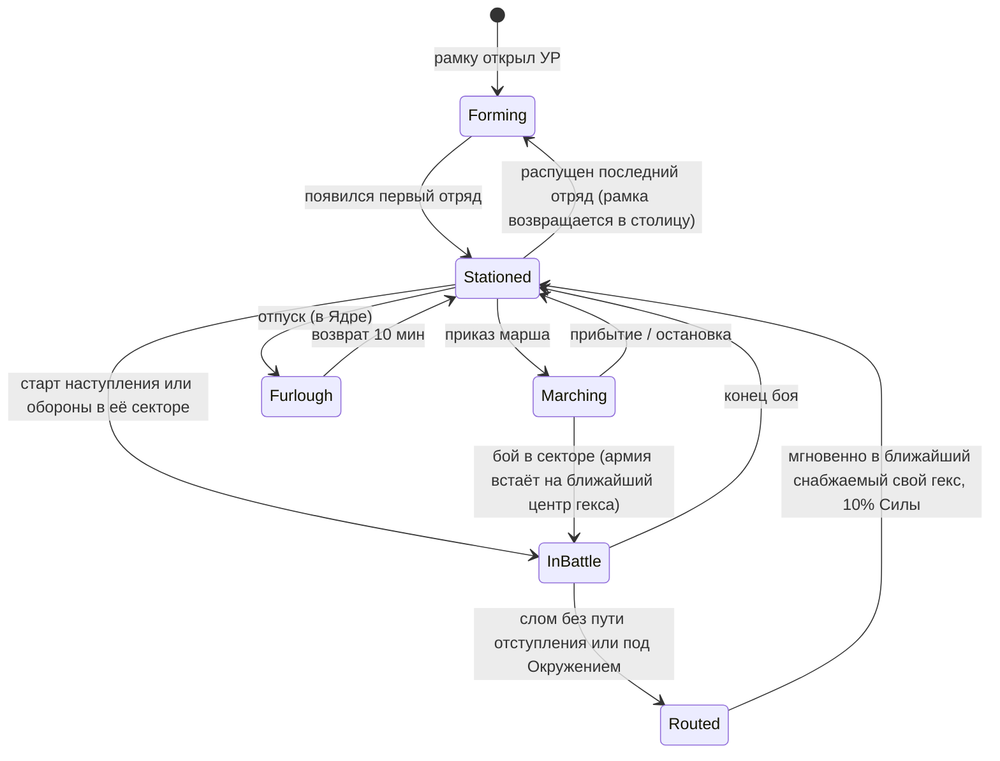
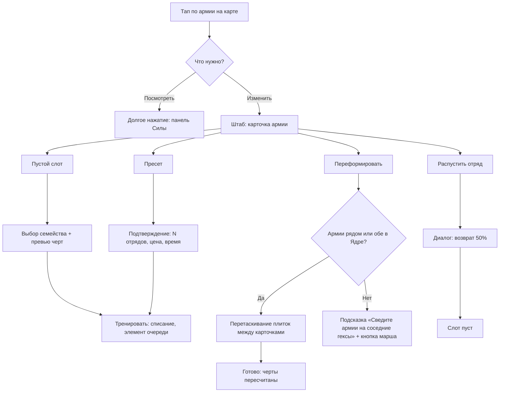
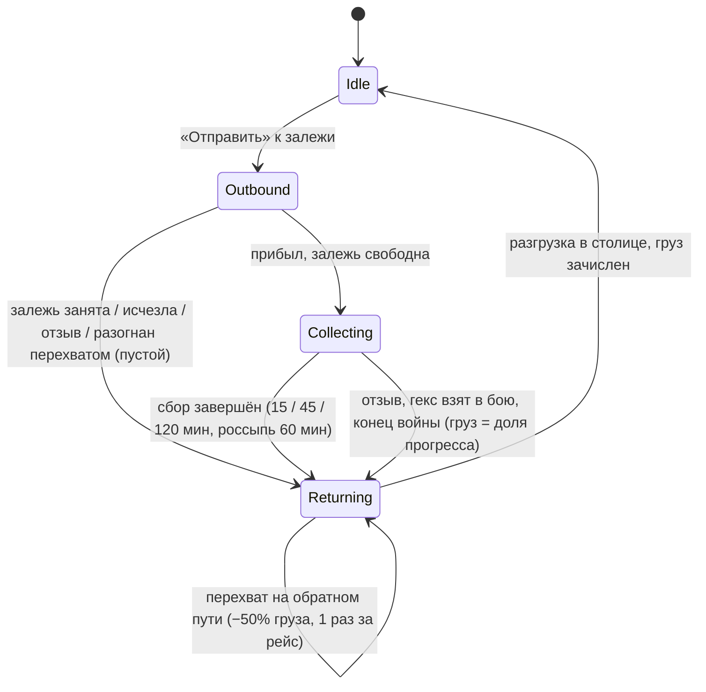

# 04. Юниты и армия

> **Назначение.** Спецификация всего, что касается войск, достаточная для реализации: 4 боевых семейства и черты состава (формулы, примеры армий), Сила отрядов по УР и уровням семейства, тренировка, апкип, армии (лимиты, состояния, формирование и переформирование, готовность, пополнение-лечение, разбитые армии, роспуск, марш, доктрины), небоевые юниты (Обоз, Строитель), эволюция облика всех юнитов по 10 УР для Blender-китов, авиация как карта, ветка «Армия» в Академии, 12 командиров (пассивки по уровням, осколки и золото, коллекция, выход новых, баланс), оборонительные армии-копии Арены, анти-P2W в армии.
> **Опирается на канон:** §2.2 (решения 3, 5, 21, 22), §3.2 (армия, отряд, Сила, Мощь, готовность, разбита, доктрина), §4 (ресурсы), §5.2 (залежи, перехват), §6.1–6.2 (вид и множители по УР), §7 (Казарма, Лазарет, Обозный двор, Военная база, строители), §8 (юниты целиком), §9.4–9.7, §9.11 (энергия, формула боя, модификаторы, снабжение, авто-оборона — только ссылки), §11 (Арена, лиговый стандарт), §12.3 (исследования), §13 (таймеры, ускорения), §14.5 (новый командир каждые 2 недели), §15.2–15.5, §15.9 (реклама, кейсы, анти-P2W), §16.4–16.5 (арт, автотесты).
> **Связанные файлы:** `03_war_combat.md` (формула боя, сложение бонусов, наступление, авто-оборона, правила Арены в бою), `02_map_territory.md` (сетка, якоря спрайтов, залежи, маршруты на карте), `05_economy_buildings.md` (здания, строители и очереди, объём залежей, апкип построек), `06_diplomacy_peace.md` (характеры ИИ), `07_progression_meta.md` (Академия, лиги и сезоны), `08_retention_liveops.md` (события, календарь), `09_monetization.md` (кейсы, «Цель», цены), `10_ui_ux_art.md` (экраны, VFX, арт-пайплайн), `11_balance_numbers.md` (кривые стоимостей и времени), `12_tech_analytics_roadmap.md` (хранение, аналитика).

---

## 1. Зона файла и инварианты

### 1.1. Что здесь и что не здесь

| Здесь (04) | Не здесь (ссылка) |
|---|---|
| семейства, черты состава, Сила отрядов и армий, тренировка, апкип армии | как Мощь превращается в потери, сложение бонусов в столкновении — `03` |
| армии: лимиты, состояния, формирование, готовность, пополнение, роспуск, марш, доктрины (настройка) | поведение армий в авто-обороне и в наступлении — `03` |
| Обоз: жизненный цикл, скорость, груз-множители, перехват, облик | размещение и визуал залежей, их объём — `02`, `05` |
| Строитель: облик и поведение на карте | число строителей, очереди, стоимость построек — `05`, канон §7 |
| облик всех юнитов по УР (описания для Blender-китов) | общий арт-пайплайн, VFX, UI-экраны в деталях — `10` |
| ветка «Армия»: линии, уровни, гейты, структура цены | итоговые кривые стоимостей и времени — `11` |
| командиры: пассивки, осколки, золото, коллекция, шаблон выхода, баланс | цены кейсов, шансы, «Цель» — `09` |
| армии-копии Арены (что копируется и как обрезается) | лиги, кубки, сезоны — `07`; бой на Арене — `03` |

### 1.2. Инварианты (каждый покрыт автотестом)

| # | Инвариант |
|---|---|
| U1 | У армии одно число Силы. Отдельных ATK/HP у отрядов нет (канон §8.1). |
| U2 | Уровень семейства ≤ УР; уровень командира ≤ 2 × УР; бонус командира ≤ +15% к Мощи или эквивалент (канон §8.4, §15.9). |
| U3 | Число армий, слотов и обозов определяется только УР (+1 обоз по подписке). Купить слот, армию или отряд за деньги нельзя. |
| U4 | Армия никогда не уничтожается: разбитая армия возвращается с 10% Силы, отряды и командир остаются (канон §8.1). |
| U5 | Все боевые значения считаются в целочисленной фиксированной точке ×1000 общим модулем `sim` (канон §16.1). Отображение округляется, расчёт — нет. |
| U6 | Внешний вид войск определяется УР государства-владельца, а не уровнем семейства. Уровень семейства меняет только Силу. |
| U7 | Арена не меняет PvE-армию: копии всегда на 100% готовности, потери Арены не переносятся (канон §11). |
| U8 | Все 12 командиров запуска получаются бесплатно (канон); у каждого нового командира есть бесплатный путь в первые 28 дней после выхода (предложение автора). |

---

## 2. Модель данных армии

### 2.1. Сущности

| Сущность | Поля | Комментарий |
|---|---|---|
| `army` | `id`, `index` (1–6), `name` (по умолчанию «1-я армия»), `slots[]` (3–5), `commander_id?`, `doctrine` (`hold` / `counter`), `hex`, `state` (§7.2), `cur_strength_m` (текущая Сила ×1000), `refill` (§9.2), `march?` (§10), `arena_order[]` | Армия — рамка, она существует всегда, пока её открыл УР |
| `squad` | `family` (`unit_infantry` / `unit_assault` / `unit_artillery` / `unit_support`), `paid_cost` {food, metal, oil}, `trained_at` | Отряд не хранит собственную Силу: она вычисляется (§2.2). `paid_cost` нужен для честного роспуска (§8.4) |
| `train_job` | `army_id`, `slot`, `family`, `paid_cost`, `ends_at` | Элемент очереди Казармы; резервирует слот |
| `family_level` | `unit_*` → 1–10 | Глобально на державу, исследуется в Академии (§14) |
| `commander_state` | `cmd_*` → `shards`, `level` (0 = закрыт), `army_id?` | §15 |
| `convoy` | `id`, `state` (§12.1), `deposit_id?`, `path[]`, `cargo`, `trip_flags` | §12.1 |

### 2.2. Формулы Силы

```
# Канон §8.1
Сила_отряда(f) = база(f) × М_силы(УР) × (1 + 0,06 × (ур_семейства(f) − 1))
Макс_Сила_армии = Σ Сила_отряда по заполненным слотам
Готовность      = Тек_Сила / Макс_Сила                       # 0…100%
Сила_армии      = Макс_Сила_армии × Готовность = Тек_Сила    # число на флажке

# Фиксированная точка (U5)
S_m(f) = floor( база(f) × М_силы_m(УР) × (1000 + 60 × (L − 1)) / 1000 )   # М_силы_m = М_силы × 1000
Отображение: round_half_up(S_m / 1000); готовность — floor(%) (49,9% показывается как 49%)
Порог наступления: 2 × Тек_Сила_m ≥ Макс_Сила_m                   # ровно 50% — допуск
```

- **Готовность одна на армию.** Потери и лечение распределяются по отрядам пропорционально их Силе. Поэтому доля семейства в Силе армии (основа черт, §3.2) не зависит от готовности.
- **Бонусы командиров «Сила армии +X%» не увеличивают пул Силы** (флажок и готовность), а входят множителем в Мощь в атаке и в защите (трактовка автора: так «≤ +15% к Мощи» выполняется буквально, а смена командира не меняет готовность; сверить с `03`). «Сила Пехоты +X%» Сержанта Брама реализуется так же: множитель Мощи, пропорциональный доле Пехоты в армии (§15.2).

### 2.3. Что происходит при изменении максимума (предложение автора)

| Событие | Правило |
|---|---|
| Повышение УР, завершение уровня семейства | **Готовность в % сохраняется**, текущая Сила растёт вместе с максимумом. Апгрейд ощущается мгновенно; бесплатное лечение тут копеечное (стоимость пополнения 1 Силы ≈ 1–3 еды, §9.2) |
| Отряд дотренирован в армию | Отряд приходит со 100% своей Силы: `cur += S(new)`, `max += S(new)` |
| Отряд переведён в другую армию | Отряд уносит долю: `S(squad) × готовность_источника` (§8.3) |
| Отряд распущен | `cur −= S(squad) × готовность`, `max −= S(squad)`; готовность остальных не меняется |
| Изменение во время боя | Не применяется до конца боя: `sim` берёт снимок всех значений на старте наступления (детерминизм) |

### 2.4. Псевдокод пересчёта

```ts
function squadStrengthM(f: Family, dl: number, lvl: number): number {
  return Math.floor(BASE[f] * M_SILA_M[dl] * (1000 + 60 * (lvl - 1)) / 1000);
}
function armyMaxM(a: Army, st: State): number {
  return a.slots.filter(Boolean)
    .reduce((s, sq) => s + squadStrengthM(sq.family, st.dl, st.familyLevel[sq.family]), 0);
}
// Вызывается при росте УР или уровня семейства. Приход, уход и перевод отрядов — по таблице §2.3.
function onMaxChanged(a: Army, oldMaxM: number, newMaxM: number) {
  if (oldMaxM === 0) return;                                  // пустая рамка: Силы нет
  a.curM = Math.floor(a.curM * newMaxM / oldMaxM);            // сохраняем готовность в %
}
function onSquadArrived(a: Army, sqM: number) { a.curM += sqM; a.maxM += sqM; }   // новый отряд — 100%
```

---

## 3. Боевые семейства

### 3.1. Сводная таблица

| Семейство | Код | Открытие | Роль | База Силы | Ход в бою | Черта армии (полная при доле Силы ≥ порога) | Тренировка (база) | Апкип |
|---|---|---|---|---|---|---|---|---|
| Пехота | `unit_infantry` | УР1 | держать | 20 | 1,5 с/гекс | «Стойкость» `trait_steadfast` (≥50%): +25% к защите | 40 еды; ×1,0 времени | 1 еда/ч на 10 Силы |
| Штурм | `unit_assault` | УР2 | прорыв | 30 | 1,0 с/гекс при полном «Натиске» | «Натиск» `trait_onslaught` (≥30%): +25% к атаке, ход 1,0 с/гекс | 60 еды + 20 металла (+20 нефти с УР6); ×1,5 | 1 еда/ч + 0,5 нефти/ч с УР6 на 10 Силы |
| Артиллерия | `unit_artillery` | УР3 | осада | 15 | 1,5 с/гекс | «Осада» `trait_siege` (≥20%): бонус укрепления цели ×0,5; армия −20% к защите | 40 еды + 40 металла (+20 нефти с УР6); ×1,5 | как у Штурма |
| Поддержка | `unit_support` | УР4 | выживание | 10 | 1,5 с/гекс | «Полевой госпиталь» `trait_field_hospital` (≥15%): вне столкновения в наступлении +1% Силы/с; пополнение +50% | 50 еды + 10 металла; ×1,25 | 1 еда/ч на 10 Силы |
| Авиация | — | УР6 | удар по площади | — | — | только карта «Авиаудар» (§13.6, `03`) | — | — |

Коды черт `trait_*` — предложение автора (в глоссарии канона кодов черт нет). Коэффициенты времени ×1,0 / 1,5 / 1,5 / 1,25 выведены из канонических 20 / 30 / 30 / 25 с (§5.2).

### 3.2. Как доли состава дают черты

```
доля(f)  = Σ Сила отрядов семейства f / Макс_Сила_армии          # по максимуму, = по текущей (§2.2)
k(f)     = min(1, доля(f) / порог(f))                            # пороги: П 0,50; Ш 0,30; А 0,20; Пд 0,15

Стойкость:  защита армии  += 0,25 × k(П)
Натиск:     атака армии   += 0,25 × k(Ш);  ход_в_бою = round_tick(1,5 − 0,5 × k(Ш)) с/гекс
Осада:      бонус укрепления цели × (1 − 0,5 × k(А));  защита армии −= 0,20 × k(А)
Госпиталь:  вне столкновения в наступлении +1% × k(Пд) от Макс_Силы в секунду (не выше максимума);
            скорость пополнения += 0,5 × k(Пд)  (входит в сумму b, §9.2)
```

- **Черты линейны ниже порога** (канон). Скорость хода тоже линейна: при k(Ш) = 0,5 ход 1,25 → 1,3 с/гекс (округление до тика 0,1 с вверх от середины; предложение автора).
- **Черта действует на свою армию.** В Клине двух армий «Натиск» первой не усиливает вторую (трактовка автора; как суммируются вклады армий в общую Мощь атаки — `03`).
- **Временные армии** («Подкрепление», «Союзный корпус») черт не имеют. «Десант» копирует состав и черты армии-источника, но не командира (предложение автора, сверить с `03`).
- Черты пересчитываются при любом изменении состава вне боя; в бою используется снимок.
- **UI:** под карточкой армии — чипы черт с процентом: «Натиск 100% · Стойкость 73% · Госпиталь 61%». Неактивная черта (k = 0) не показывается. При наведении на слот в редакторе — превью изменения чипов.

### 3.3. Примеры составов (УР8, все семейства ур. 8, 5 слотов)

Сила отряда на УР8 ур. 8: Пехота 125, Штурм 187, Артиллерия 94, Поддержка 62. В таблице только вклад черт; прочие бонусы (укрепление, рельеф, формы, командир) и способ их сложения — `03`. Для сравнения принято: бонусы одного вида складываются, защитник +10%. «R на 1 Силу защиты» = Мощь атаки / (1 + 0,10 + 0,15 × ур. укрепления × (1 − 0,5 × k(А))).

| Состав | Сила | Доли П/Ш/А/Пд | Стойкость | Натиск | Осада | Госпиталь | Мощь атаки | R: укр. 0 | R: укр. 4 | R: укр. 8 | Мощь в обороне (без укр.) | Ход, с/гекс |
|---|---|---|---|---|---|---|---|---|---|---|---|---|
| «Стена» ППППП | 625 | 100/0/0/0 | 100% | — | — | — | 625 | 568 | 368 | 272 | 843 | 1,5 |
| «Бронекулак» ШШШШШ | 937 | 0/100/0/0 | — | 100% | — | — | 1 172 | 1 065 | 689 | 509 | 1 031 | 1,0 |
| «Таран» ШШШШП | 875 | 14/86/0/0 | 29% | 100% | — | — | 1 093 | 994 | 643 | 475 | 1 025 | 1,0 |
| «Осадный кулак» ШШШАА | 750 | 0/75/25/0 | — | 100% | 100% | — | 937 | 852 | 669 | 551 | 675 | 1,0 |
| «Универсал» ШШППА | 719 | 35/52/13/0 | 70% | 100% | 65% | — | 898 | 816 | 597 | 471 | 822 | 1,0 |
| «Живучий» ШШППД | 687 | 36/55/0/9 | 73% | 100% | — | 61% | 859 | 781 | 505 | 374 | 881 | 1,0 |
| «Полный набор» ШШПАД | 656 | 19/57/14/10 | 38% | 100% | 71% | 63% | 820 | 745 | 552 | 438 | 690 | 1,0 |
| «Крепость» ППППА | 594 | 84/0/16/0 | 100% | — | 79% | — | 594 | 540 | 406 | 325 | 708 | 1,5 |
| «Санбат» ПППДД | 500 | 75/0/0/25 | 100% | — | — | 100% | 500 | 454 | 294 | 217 | 675 | 1,5 |

(Обозначения: П — Пехота, Ш — Штурм, А — Артиллерия, Д/Пд — Поддержка.)

**Пример подсчёта «Живучего».** Сила 187×2 + 125×2 + 62 = 687. Доля Пехоты 250/687 = 36,4% → k = 0,73 → Стойкость +18,2%. Доля Штурма 54,5% ≥ 30% → Натиск полный: +25% к атаке, ход 1,0 с. Доля Поддержки 9,1% → k = 0,61 → +0,61% Силы в секунду вне столкновения (за 40 с вне столкновений ≈ +167 Силы, почти как целый отряд Штурма) и +30% к скорости пополнения.

**Ранние составы (3 слота):**

| УР | Состав | Сила | Черты |
|---|---|---|---|
| 1 | ППП | 60 | Стойкость 100% |
| 2 | ШПП (ур. 2) | 39,75 + 26,5 + 26,5 ≈ 93 | Натиск 100% (43%), Стойкость 100% (57%) — обе черты сразу |
| 3 | ШПА (ур. 3) | 52 + 35 + 26 ≈ 113 | Натиск 100% (46%), Стойкость 62% (+15,4%), Осада 100% (23%, армия −20% к защите) |
| 4 | ШШПД (ур. 4, 4 слота) | 67 + 67 + 45 + 22 ≈ 202 | Натиск 100% (67%), Стойкость 44% (22%), Госпиталь 74% (11%) |

### 3.4. Баланс семейств и известная проблема канона

Ось выбора — **Сила на слот против цены за Силу**:

| Семейство | Сила на слот (отн. Пехоты) | Тренировка за 1 Силу (УР1-база) | Нефть с УР6 | Что даёт сверх Силы |
|---|---|---|---|---|
| Пехота | 1,0 | 2,0 еды | нет | Стойкость: дешёвая защита |
| Штурм | 1,5 | 2,0 еды + 0,67 металла | тренировка и апкип | Натиск: атака и скорость |
| Артиллерия | 0,75 | 2,7 еды + 2,7 металла | тренировка и апкип | Осада: против укреплений ур. ≥6 |
| Поддержка | 0,5 | 5,0 еды + 1,0 металла | нет | Госпиталь: реген в бою, темп пополнения |

**Проблема (вынесена в открытые вопросы, К1).** Слоты ограничены жёстче ресурсов, а апкип и пополнение стоят одинаково за 1 Силу. В таких условиях Штурм на слот сильнее Пехоты **и в атаке, и в обороне**: «Бронекулак» в обороне даёт 1 031 Мощи против 843 у «Стены» (таблица §3.3). Канонической роли Пехоты «держать» числа не соответствуют. Артиллерия и Поддержка свою нишу имеют (Осада выигрывает против укреплений ур. 8, Госпиталь окупается регеном).

**Что делаем в рамках канона:** держим канонические числа, а рычаги выносим в remote config (`units.unit_infantry.base_strength`, `traits.trait_steadfast.defense`). Рекомендация автора к владельцу: «Стойкость» +50% вместо +25% (Пехота на слот в обороне 30 = Штурм, при этом дешевле и без нефти) **или** база Пехоты 25 вместо 20. Тогда появляется стратегическое разделение «пехотные армии держат фронт и Рубеж, штурмовые идут в наступление».

### 3.5. Пресеты и составы ИИ

**Пресеты** — одна кнопка в редакторе армии заполняет пустые слоты очередью тренировки (предложение автора). Доступны семейства, открытые на текущем УР; недоступные заменяются Пехотой.

| Пресет | 3 слота | 4 слота | 5 слотов | Для чего |
|---|---|---|---|---|
| «Ударный» | ШШП | ШШШП | ШШШШП | наступление, Прорыв |
| «Универсал» | ШПА | ШШПА | ШШППА | всё понемногу |
| «Осадный» | ШАА | ШШАА | ШШШАА | крепости, укрепления ур. ≥6 |
| «Оборонный» | ППП | ПППА | ПППДД | фронт, авто-оборона, Рубеж |
| «Живучий» | ШПД | ШШПД | ШШППД | длинные войны, котлы |

**Составы армий ИИ по архетипам** (предложение автора; характеры — `06`, размер и Сила армий ИИ — `11`). При меньшем числе слотов берётся префикс строки.

| Архетип | Порядок заполнения 5 слотов | Доктрина |
|---|---|---|
| Волк `ai_wolf` | Ш Ш Ш П Ш | Контратаковать |
| Лис `ai_fox` | Ш П Ш П Д | Держать |
| Черепаха `ai_turtle` | П А П А П | Держать |
| Ворон `ai_raven` | Ш Ш Д Ш П | Контратаковать |
| Сова `ai_owl` | П Ш Д П Ш | Держать |
| Гегемон `ai_hegemon` | как у базового архетипа; армии +20% (канон) | как у базового |

Командиров у ИИ нет (предложение автора): Гегемон получает свои +20%, лидеры ИИ — портреты для дипломатии.

---

## 4. Сила отрядов по УР и уровням семейства

### 4.1. Множитель `М_силы(УР) × (1 + 0,06 × (ур − 1))`

Уровень семейства не выше УР («—» — недоступно).

| УР \ ур. семейства | 1 | 2 | 3 | 4 | 5 | 6 | 7 | 8 | 9 | 10 |
|---|---|---|---|---|---|---|---|---|---|---|
| 1 | 1,000 | — | — | — | — | — | — | — | — | — |
| 2 | 1,250 | 1,325 | — | — | — | — | — | — | — | — |
| 3 | 1,550 | 1,643 | 1,736 | — | — | — | — | — | — | — |
| 4 | 1,900 | 2,014 | 2,128 | 2,242 | — | — | — | — | — | — |
| 5 | 2,350 | 2,491 | 2,632 | 2,773 | 2,914 | — | — | — | — | — |
| 6 | 2,900 | 3,074 | 3,248 | 3,422 | 3,596 | 3,770 | — | — | — | — |
| 7 | 3,600 | 3,816 | 4,032 | 4,248 | 4,464 | 4,680 | 4,896 | — | — | — |
| 8 | 4,400 | 4,664 | 4,928 | 5,192 | 5,456 | 5,720 | 5,984 | 6,248 | — | — |
| 9 | 5,400 | 5,724 | 6,048 | 6,372 | 6,696 | 7,020 | 7,344 | 7,668 | 7,992 | — |
| 10 | 6,600 | 6,996 | 7,392 | 7,788 | 8,184 | 8,580 | 8,976 | 9,372 | 9,768 | 10,164 |

Сила отряда = база × множитель: Пехота 20, Штурм 30, Артиллерия 15, Поддержка 10.

### 4.2. Сила отряда по семействам: ур. 1 / ур. = УР (максимум)

| УР | Пехота | Штурм | Артиллерия | Поддержка |
|---|---|---|---|---|
| 1 | 20 / 20 | — | — | — |
| 2 | 25 / 27 | 38 / 40 | — | — |
| 3 | 31 / 35 | 47 / 52 | 23 / 26 | — |
| 4 | 38 / 45 | 57 / 67 | 29 / 34 | 19 / 22 |
| 5 | 47 / 58 | 71 / 87 | 35 / 44 | 24 / 29 |
| 6 | 58 / 75 | 87 / 113 | 44 / 57 | 29 / 38 |
| 7 | 72 / 98 | 108 / 147 | 54 / 73 | 36 / 49 |
| 8 | 88 / 125 | 132 / 187 | 66 / 94 | 44 / 62 |
| 9 (v1.2) | 108 / 160 | 162 / 240 | 81 / 120 | 54 / 80 |
| 10 (v1.3) | 132 / 203 | 198 / 305 | 99 / 152 | 66 / 102 |

### 4.3. Ориентир: армия «Универсал» и держава целиком

Все семейства на уровне = УР; апкип по канону (§6); стоимость пополнения 0 → 100% по формуле §9.2.

| УР | Армий × слотов | Состав | Сила армии (ур. 1 → макс.) | Все армии (макс.) | Апкип армии, еда/ч (мир / война) | Нефть/ч | Пополнение 0 → 100%, еды | Время 0 → 100% (база) |
|---|---|---|---|---|---|---|---|---|
| 1 | 2×3 | ППП | 60 → 60 | 120 | 6,0 / 9,0 | — | 60 | 20 мин |
| 2 | 2×3 | ШПП | 88 → 93 | 186 | 9,3 / 13,9 | — | 111 | 20 мин |
| 3 | 3×3 | ШПА | 101 → 113 | 339 | 11,3 / 16,9 | — | 160 | 40 мин |
| 4 | 3×4 | ШШПА | 180 → 213 | 639 | 21,3 / 31,9 | — | 359 | 40 мин |
| 5 | 3×4 | ШШПА | 223 → 277 | 830 | 27,7 / 41,5 | — | 542 | 60 мин |
| 6 | 4×4 | ШШПА | 276 → 358 | 1 433 | 35,8 / 53,7 | 14,1 | 803 | 60 мин |
| 7 | 4×5 | ШШППА | 414 → 563 | 2 252 | 56,3 / 84,5 | 18,4 | 1 408 | 90 мин |
| 8 | 5×5 | ШШППА | 506 → 719 | 3 593 | 71,9 / 107,8 | 23,4 | 2 041 | 90 мин |
| 9 | 5×5 | ШШППА | 621 → 919 | 4 595 | 91,9 / 137,9 | 30,0 | 2 723 | 120 мин |
| 10 | 6×5 | ШШППА | 759 → 1 169 | 7 013 | 116,9 / 175,3 | 38,1 | 3 542 | 120 мин |

---

## 5. Тренировка

### 5.1. Стоимость отряда

```
Цена(f, УР) = база_цены(f) × М_произв(УР)          # канон §8.1; округление половины вверх
Нефть: +20 × М_произв(УР) для Штурма и Артиллерии, начиная с УР6
```

Еда / металл / нефть за отряд:

| УР | М_произв | Пехота | Штурм | Артиллерия | Поддержка |
|---|---|---|---|---|---|
| 1 | 1,0 | 40 | — | — | — |
| 2 | 1,5 | 60 | 90 / 30 | — | — |
| 3 | 2,2 | 88 | 132 / 44 | 88 / 88 | — |
| 4 | 3,2 | 128 | 192 / 64 | 128 / 128 | 160 / 32 |
| 5 | 4,6 | 184 | 276 / 92 | 184 / 184 | 230 / 46 |
| 6 | 6,5 | 260 | 390 / 130 / 130 | 260 / 260 / 130 | 325 / 65 |
| 7 | 9 | 360 | 540 / 180 / 180 | 360 / 360 / 180 | 450 / 90 |
| 8 | 12,5 | 500 | 750 / 250 / 250 | 500 / 500 / 250 | 625 / 125 |
| 9 | 16 | 640 | 960 / 320 / 320 | 640 / 640 / 320 | 800 / 160 |
| 10 | 20 | 800 | 1 200 / 400 / 400 | 800 / 800 / 400 | 1 000 / 200 |

Уровень семейства на цену не влияет: апгрейд семейства усиливает и уже обученные отряды (§2.3).

### 5.2. Время тренировки

Канон задаёт время отряда по УР: 20 с, 1 мин, 3, 6, 10, 15, 25, 40, 50, 60 мин. Автор трактует его как время **Пехоты**; остальные семейства умножаются на коэффициент из базовых значений канона (30 / 30 / 25 с против 20 с). Окна канона §13 («25–40 мин» на УР 7–8) соответствуют типичному времени после бонусов Казармы и Заводов.

| УР | Пехота ×1,0 | Штурм ×1,5 | Артиллерия ×1,5 | Поддержка ×1,25 |
|---|---|---|---|---|
| 1 | 20 с | — | — | — |
| 2 | 1 мин | 1 мин 30 с | — | — |
| 3 | 3 мин | 4 мин 30 с | 4 мин 30 с | — |
| 4 | 6 мин | 9 мин | 9 мин | 7 мин 30 с |
| 5 | 10 мин | 15 мин | 15 мин | 12 мин 30 с |
| 6 | 15 мин | 22 мин 30 с | 22 мин 30 с | 18 мин 45 с |
| 7 | 25 мин | 37 мин 30 с | 37 мин 30 с | 31 мин 15 с |
| 8 | 40 мин | 1 ч | 1 ч | 50 мин |
| 9 | 50 мин | 1 ч 15 мин | 1 ч 15 мин | 1 ч 2 мин 30 с |
| 10 | 1 ч | 1 ч 30 мин | 1 ч 30 мин | 1 ч 15 мин |

**Модификаторы** (сложение — предложение автора, эффекты зданий сверить с `05`):

```
t = T_пехоты(УР) × k(f) × max(0,25, (1 − 0,04 × ур_Казармы) × (1 − 0,05 × min(6, N_Заводов)) × (1 − 0,05 × ур_Строевой))
```

- Источники перемножаются, а не складываются: иначе Казарма ур. 16 (−64%) вместе с Заводами (−30%) дала бы отрицательное время.
- Пол **25%** от базы: на УР10 со всеми бонусами Пехота тренируется не быстрее 15 мин.
- **Пример (УР8):** Казарма ур. 12, 4 Завода, Строевая 4: 0,52 × 0,80 × 0,80 = 0,333. Пехота 40 мин → 13 мин 19 с, Штурм 60 мин → 20 мин.

### 5.3. Очередь Казармы

| Правило | Значение |
|---|---|
| Порядок | очередь без лимита длины, отряды тренируются последовательно (канон §7) |
| Списание | ресурсы списываются при постановке в очередь; не хватает — кнопка «Докупить за Райвиты» (курс канона §15.8: 1 ч производства = 12 Райвитов) |
| Слот | элемент очереди резервирует конкретный слот конкретной армии; слот в редакторе показывает «В очереди 3» или кольцо прогресса |
| Отмена | 100% возврат и для ожидающего, и для текущего элемента; потраченное время не возвращается (предложение автора) |
| Ускорение | тренировка — армейский, а не «военный» таймер (список неускоряемых таймеров канона §13.1 её не содержит): бесплатное завершение ≤5 мин (≤10 мин с подпиской), `ad_speedup`, предметы-ускорения, Райвиты. Кнопка «Ускорить всё» считает цену по суммарному остатку очереди |
| Доставка | готовый отряд входит в армию сразу, если армия стоит на снабжаемом гексе и не в бою; иначе статус «Ждёт: нет снабжения» или «Ждёт: идёт бой», и вход происходит автоматически, когда условие выполнено |
| Изменение УР в очереди | цена уже уплачена; Сила отряда считается по текущему УР (§2.3) |
| Тренировка во время войны | разрешена; во время наступления отряд ждёт конца боя |
| Офлайн | очередь обрабатывается лениво (канон §16.2); пуш `push_army_ready` приходит, когда армия становится полной (§9.4) |

---

## 6. Апкип армии

### 6.1. Формулы

```
Апкип_еды(армия)  = 0,1 × Макс_Сила_армии × М_войны × (1 − 0,03 × ур_Бережливости)     # еда/ч
Апкип_нефти(армия) = 0,05 × Σ Макс_Сила отрядов Штурма и Артиллерии × М_войны × (1 − 0,03 × ур_Бережливости)   # нефть/ч, с УР6
М_войны = 1,5, пока у державы есть хотя бы одна активная война (канон §8.1), иначе 1,0
```

- Апкип считается от **максимальной** Силы (трактовка автора): число стабильно и читаемо, его нельзя «сэкономить», держа армию раненой.
- «Бережливость» (−3% × 5, ветка «Экономика», канон §12.3) действует на весь апкип, включая армейский (трактовка автора).
- Апкип армии от М_апкип(УР) не зависит: он растёт вместе с Силой (М_силы ×6,6 и уровни семейств ×1,54). Основной рост доли апкипа дают постройки (канон §6.2).
- **HUD:** в панели еды строка «Армия −539/ч (война ×1,5)» (5 армий «Универсал» на УР8). В карточке армии в мирное время — «Содержание: 72 еды/ч · 23 нефти/ч».

### 6.2. Пустые амбары (предложение автора)

Канон описывает «Казна пуста» только для золота. Для еды и нефти автор вводит не новую сущность, а то же правило «ничего не разрушается»:

| Ресурс ушёл в 0 | Последствие |
|---|---|
| еда | пополнение и тренировка на паузе; Сила армий **не падает**; баннер «Амбары пусты: армии не пополняются» с кнопками «Рынок» и «Собрать всё» |
| нефть | тренировка Штурма и Артиллерии на паузе; апкип нефти не списывается в минус (долга нет), Сила техники не падает; карты техники в руке неактивны (канон §9.9) |

### 6.3. Отпуск армии (предложение автора, фича-флаг `army_furlough`)

Это аналог консервации построек (канон `mothball`) для управления апкипом в мирное время:

- армия в Ядре, вне боя и вне марша переводится в «Отпуск»: апкип 10%, на карте не видна (палатка у столицы);
- в бою, в авто-обороне и на Арене армия в отпуске не участвует;
- возврат из отпуска занимает 10 мин (как расконсервация); ускоряется как армейский таймер;
- пополнение в отпуске не идёт.

---

## 7. Армии: лимиты, состояния, вид на карте

### 7.1. Лимиты и открытие

| УР | 1 | 2 | 3 | 4 | 5 | 6 | 7 | 8 | 9 | 10 |
|---|---|---|---|---|---|---|---|---|---|---|
| Армий × слотов | 2×3 | 2×3 | 3×3 | 3×4 | 3×4 | 4×4 | 4×5 | 5×5 | 5×5 | 6×5 |
| Обозов | 2 | 2 | 3 | 3 | 4 | 4 | 5 | 5 | 6 | 6 |
| Новое семейство | Пехота | Штурм | Артиллерия | Поддержка | — | танки (вид Штурма), нефть техники | — | — | — | — |

- **Новая армия** появляется в столице пустой рамкой с флажком «3-я армия» и подсказкой «Заполните слоты» (вход в редактор). Пустая армия не выходит из столицы и на карте видна только флажком над Резиденцией.
- **Новый слот** (УР4, УР7) появляется во всех армиях сразу пустым, с пульсирующим «+».
- **FTUE:** на старте обе армии укомплектованы бесплатно (3 отряда Пехоты каждая), первые тренировки — уже на УР2 (Штурм).
- Слотов и армий за деньги нет (U3).

### 7.2. Состояния армии



Ортогональные флаги (могут сочетаться с любым состоянием, кроме `Forming` и `Furlough`):

| Флаг | Условие | Эффект и визуал |
|---|---|---|
| `ready` | готовность ≥50% | зелёное кольцо у подставки; армия может идти в наступление |
| `refilling` | готовность <100%, снабжена, не в бою, есть еда | зелёные «листочки» над фигуркой, таймер до 100% |
| `unsupplied` | нет пути снабжения (`03`) | значок разорванной цепи; −5% Силы/ч до 40% (канон §9.7); пополнение не идёт |
| `hold_position` | двойной тап в бою | щит на флажке до конца боя (канон §9.3) |
| `waiting_squad` | готовый отряд ждёт входа | значок «+1» на флажке |

### 7.3. Армия на карте

- **Подставка:** круглый диорамный жетон Ø0,9R (якорь и масштаб — `02` §4.6) с ободком командного цвета. Вокруг ободка дуга готовности: зелёная ≥50%, жёлтая 25–49%, красная <25%.
- **Фигуры:** 1 главная фигура ведущего семейства (наибольшая доля Силы; при равенстве — Штурм > Пехота > Артиллерия > Поддержка) и до 2 фигур сопровождения меньшего масштаба (×0,75) для семейств с долей ≥20%. Порядок: главная в центре, сопровождение позади слева и справа.
- **Флажок:** вымпел командного цвета, белые цифры текущей Силы; над древком — круглый значок командира с рамкой цвета редкости (на дальнем зуме скрыт).
- **Дальний зум** (`02`, LOD): фигуры заменяются иконкой-силуэтом ведущего семейства на 48 px и числом Силы.
- **Туман войны:** чужая армия показывается силуэтом без числа, «?» (канон §3.1).
- **Долгое нажатие:** панель «Сила 653/687 (95%) · Мощь атаки ×1,25 · защиты ×1,18 · Натиск 100%, Стойкость 73%, Госпиталь 61% · Командир: Капитан Лира ур. 9 (+9,2% пополнения) · Доктрина: Держать».

---

## 8. Формирование и переформирование (UX)

### 8.1. Экран «Штаб»

Вход: кнопка «Армия» в нижней панели или тап по своей армии → «Подробнее».

| Зона экрана (сверху вниз) | Содержимое |
|---|---|
| Шапка | «Армии 5/5 · Очередь Казармы: 2 (38 мин) · Апкип −539 еды/ч (война)» |
| Список армий | вертикальные карточки по одной на армию: имя, Сила/макс и полоса готовности, портрет командира, чипы черт, доктрина (переключатель-иконка), где стоит («Медная шахта, фронт с Баронами»), строка слотов (3–5 плиток с иконками семейств и уровнем) |
| Нижняя панель (зона пальца) | «Пополнить все» (мгновенно за Райвиты по сумме), «Казарма» (очередь), «Командиры» (коллекция) |

**Карточка армии (раскрытая):**

```
┌ 2-я армия ─────────────── [✎] ┐
│ Сила 489/687  ▓▓▓▓▓▓▓░░ 71%    │  Пополнение: 14 мин · 562 еды (зарезервировано)
│ [портрет Лиры ур.9]  Доктрина: [🛡 Держать | ⚔ Контратака]
│ Натиск 100% · Стойкость 73% · Госпиталь 61%
│ [Ш8][Ш8][П8][П8][Д8]            │  тап по плитке — меню отряда
│ [Пресет ▾] [Переформировать] [На карте] [Пополнить ▶ реклама 2/3] │
└────────────────────────────────┘
```

**Меню пустого слота:** 4 семейства (недоступные — замок «УР3»), для каждого Сила отряда, цена, время, превью черт после добавления («Натиск 100% → 100%, Осада 0% → 65%»). Кнопки «Тренировать» и «Тренировать ×N» (заполнить все пустые слоты этим семейством).

**Меню заполненного слота:** Сила отряда (с учётом готовности), уровень семейства, «Перевести в…», «Распустить (+50%: 375 еды, 125 металла, 125 нефти)» (отряд Штурма, обученный на УР8).

### 8.2. Потоки



### 8.3. Правила переформирования

| Правило | Значение (предложение автора) |
|---|---|
| Где можно | обе армии стоят (не в марше, не в бою, не в отпуске), обе снабжены и находятся **на соседних гексах или обе в Ядре** |
| Что можно | перевести отряд в свободный слот другой армии; поменять отряды местами; переставить отряды внутри армии (порядок важен только для Арены, §16) |
| Цена и время | бесплатно и мгновенно; во время войны разрешено вне боя |
| Сохранение Силы | отряд уносит `S × готовность_источника`; готовности обеих армий пересчитываются как взвешенные; суммарная текущая Сила сохраняется точно |
| Последний отряд | можно увести; армия-источник становится пустой рамкой и возвращается в столицу (`Forming`), её командир снимается в коллекцию |
| Командир | остаётся со своей армией, пока в ней есть отряды; переназначение — §15.6 |

**Пример.** 1-я армия: макс. 719, готовность 50% (359,5). 2-я: макс. 532, готовность 100%. Отряд Штурма (187) переходит из 1-й во 2-ю с Силой 93,5. Итог: 1-я — 266/532 (50%), 2-я — 625,5/719 (87%).

### 8.4. Роспуск

- **Роспуск отряда** возвращает 50% **фактически уплаченной** цены (`paid_cost`, канон §8.1). Цена по текущему УР не используется, иначе возникает эксплойт «обучил на УР1 — распустил на УР8». Возврат не зависит от готовности (буква канона).
- Возврат зачисляется на склад в пределах вместимости; излишек теряется, диалог об этом предупреждает.
- **Роспуск армии** = роспуск всех отрядов; рамка остаётся (её задаёт УР), командир возвращается в коллекцию.
- Распускать можно в любом снабжаемом гексе вне боя. Во время наступления кнопка скрыта.

---

## 9. Готовность и пополнение

### 9.1. Готовность

- Готовность = Тек_Сила / Макс_Сила (§2.2). **В наступление идут армии с готовностью ≥50%** (канон). На кнопке «Наступление» при отсутствии готовых армий — таймер до 50% ближайшей армии и `ad_army_refill` (канон §15.2).
- Армия с готовностью <50% в секторе наступления остаётся на месте и обороняет свой гекс; приказ атаки на неё не ставится, фигура полупрозрачна (предложение автора, сверить с `03`). Свободное перемещение по своим гексам ей разрешено.
- Готовность не влияет на черты (§3.2) и на апкип (§6.1).

### 9.2. Пополнение (лечение)

```
Цена 1 Силы   = 1 еда × М_произв(УР) / М_силы(УР)                                   # канон §8.1
T_full(УР)    = 20, 20, 40, 40, 60, 60, 90, 90, 120, 120 мин                         # 0 → 100%, канон
V             = K_базы × (1 + b_Лазарет + b_База + b_Резерв + b_Госпиталь + b_Командир),   V ≤ 6
  K_базы      = 3, если армия в радиусе 2 от своей официальной Военной базы, иначе 1    # канон
  b_Лазарет   = 0,05 × ур. Лазарета (действует везде)                                  # канон §7
  b_База      = 0,04 × ур. Военной базы в радиусе 2 (из нескольких — с наибольшим уровнем; только вместе с K_базы)  # канон §7
  b_Резерв    = 0,05 × ур. «Резерва» (0–5)                                             # канон §8.3
  b_Госпиталь = 0,5 × k(Пд)                                                            # черта, §3.2
  b_Командир  = пассивка Капитана Лиры (0,05 → 0,15), если она командует этой армией
Время до 100% = (1 − готовность) × T_full / V
```

- Потолок V ≤ 6 — предложение автора: без него Военная база вместе с Лазаретом ур. 16 даёт ×10, и rewarded-пополнение теряет смысл. Сложение `b` и трактовка «за уровень» как `X × ур` — предложение автора, сверить с `05`.
- Таблица цены 1 Силы в еде: УР1 1,00 · УР2 1,20 · УР3 1,42 · УР4 1,68 · УР5 1,96 · УР6 2,24 · УР7 2,50 · УР8 2,84 · УР9 2,96 · УР10 3,03.

**Автопополнение (предложение автора).** Отдельной кнопки нет: армия лечится сама, когда снабжена, вне боя, не в отпуске и есть еда. Это снимает лишний тап у казуалов.

```ts
function startRefill(a: Army, st: State, now: number) {      // вызывается при каждом событии армии
  settleRefill(a, now);                                     // сначала досчитать прошлый отрезок
  if (!canRefill(a, st)) return;
  const missingM = a.maxM - a.curM;
  const priceM   = Math.ceil(1000 * M_PROD[st.dl] / M_SILA[st.dl]);         // еда ×1000 за 1 Силу
  const affordM  = Math.floor(st.food * 1_000_000 / priceM);                // сколько Силы ×1000 оплатим
  a.refill = { targetM: a.curM + Math.min(missingM, affordM), startM: a.curM, since: now,
               rate: refillRateMperSec(a, st) };                           // V × maxM / T_full
  st.food -= reserveFood(a.refill, priceM);                                 // резерв списывается сразу
  scheduleEvent(a.id, 'refill_done', now + eta(a.refill));
}
// Прерывание (бой, потеря снабжения, отпуск): settleRefill(), неистраченный резерв возвращается на склад.
// Смена скорости (вошла в радиус Базы, вырос Лазарет): settleRefill() → startRefill() с новой V.
```

- Резерв еды не лежит на складе и потому не грабится. Злоупотребить этим нельзя: резерв не больше цены недостающей Силы, и тратится он на лечение.
- Пополнение идёт и во время марша по снабжаемым гексам.
- Нехватка еды: армия лечится до оплаченного уровня, карточка показывает «Не хватает 340 еды».

### 9.3. Лазарет и Военная база

| Источник | Где работает | Эффект | Нюансы |
|---|---|---|---|
| Лазарет `bld_infirmary` | вся держава | +5% скорости за уровень (до 2 × УР уровней) | столичное здание; разграбление его не повреждает (канон §9.14) |
| Военная база `bld_military_base` | гексы в радиусе 2 от базы | ×3 и ещё +4% за уровень базы | только **своя официальная** база; оккупированная вражеская база бонуса не даёт (предложение автора). Повреждённая разграблением база даёт ×1,5 до ремонта (трактовка автора: «−50% выхода» канона §9.14) |
| Несколько баз в радиусе | — | берётся одна, с наибольшим уровнем | ×3 не складываются |

Радиус 2 = гекс базы + 18 гексов вокруг. На карте при выборе армии он подсвечивается мягким зелёным кругом («Зона быстрого пополнения ×3»).

### 9.4. Мгновенное пополнение и уведомления

| Способ | Правило |
|---|---|
| `ad_army_refill` | армия мгновенно до 100%, еда **не списывается** (реклама продаёт время, канон §15.1; цена еды тут ничтожна); 3 в день; в бою недоступно |
| Райвиты | цена по кривой канона §13.1 от оставшегося времени («9 мин → 6 Райвитов»); еда списывается как обычно |
| Предметы-ускорения | применяются к таймеру пополнения как к любому не-военному таймеру |
| Бесплатное завершение | остаток ≤5 мин (≤10 мин с подпиской) — кнопка «Готово» |
| «Пакет реванша» `iap_revenge` | 3 заряда мгновенного пополнения (счётчик на аккаунте, как `ad_army_refill`, без еды) |
| Пуш `push_army_ready` | когда армия дошла до 100% (не чаще 1 пуша на армию в 4 ч; общие лимиты пушей — канон §14.7). Текст: «2-я армия пополнена — фронт ждёт» |

### 9.5. Примеры

**УР4, без базы.** 2-я армия ШШПА, Сила 64/213 (30%). Лазарет ур. 6 (+0,30), Резерв 2 (+0,10), Лира ур. 7 (+0,082). V = 1,48. Время: 0,70 × 40 / 1,48 = **18 мин 54 с**. Цена: 149 Силы × 1,68 = **251 еда**.

**УР8, у Военной базы ур. 10.** «Живучий» ШШППД, 275/687 (40%). Лазарет ур. 12 (+0,60), Резерв 5 (+0,25), Госпиталь k = 0,61 (+0,31), база (+0,40): 3 × 2,56 = 7,67 → потолок **V = 6**. Время: 0,60 × 90 / 6 = **9 мин**. Цена: 412 × 2,84 = **1 171 еда**.

### 9.6. Разбитые армии

| Шаг | Правило |
|---|---|
| Причина | слом без соседнего своего гекса для отступления или слом под Окружением (канон §9.5, `03`) |
| Куда | ближайший по числу шагов **снабжаемый официальный свой** гекс без своей армии; при равенстве — ближе к столице; если подходящего нет — столица (предложение автора) |
| Сила | 10% максимума (канон) |
| Что сохраняется | все отряды, уровни, командир, доктрина (U4) |
| Визуал | фигурка опрокидывается в облачко, белый флажок (канон §1.2), появляется на новом гексе с плашкой «Разбита» на 3 с |
| Котёл | армия, разбитая внутри котла, тоже «эвакуируется» по этому правилу |
| Звёзды | разбитая армия лишает наступление ★★★ (канон §3.2) |
| Монетизация | на карточке разбитой армии только rewarded `ad_army_refill`; платных офферов на этом экране нет (предложение автора) |

### 9.7. Армия без снабжения на стратегической карте

Канон §9.7: −5% Силы в час (не ниже 40%), пополнения нет. Добавления автора: армия в котле окрашивает дугу готовности в серый с цепью; восстановление снабжения сразу запускает автопополнение; пуш о потере снабжения не шлётся (информация появляется в «Пока вас не было»).

---

## 10. Марш по стратегической карте

### 10.1. Скорость и проходимость

| Гекс | Можно встать | Время на гекс | Основание |
|---|---|---|---|
| свой официальный | да | 20 с | канон §8.1 |
| оккупированный тобой | да | 40 с | канон §8.1 |
| союзника | да (проход по союзу, канон §10.7) | 40 с | предложение автора |
| дикий (серый) | да, но без снабжения | 40 с | предложение автора |
| вражеский неоккупированный | нет: берётся только в наступлении | — | канон |
| нейтральный ИИ (нет войны) | нет | — | — |
| вода, горы | нет | — | канон §5.1 |
| переход между своими или союзными портами (≤4 гекса воды) | — | 60 с за гекс воды | предложение автора; морские сектора — v1.2 |

- **На одном гексе не больше одной армии стороны** (канон §3.2). Через гекс со своей армией пройти можно, остановиться нельзя.
- **Зон контроля нет:** соседство с вражеской армией марш не прерывает (предложение автора; перехватываются только обозы).
- Марш — это перемещение, а не таймер: его не ускоряют ни Райвиты, ни реклама, ни бесплатное завершение ≤5 мин (предложение автора). В бою мгновенный перенос даёт только «Марш-бросок».
- Марш возможен при любой готовности (например, отвести раненую армию к Военной базе).

### 10.2. Маршрутизация и UX

1. Тап по армии → тап по целевому гексу (или свайп от армии к гексу на стратегической карте).
2. Предпросмотр: пунктир маршрута (слой `map_layer_paths`, `02`), ETA «3 мин 20 с», значки опасности: «нет снабжения в конце пути», «выступ» (гекс-цель граничит с ≥4 вражескими, канон §9.8).
3. «Марш»: армия идёт по гексам; над ней таймер до прибытия.
4. Повторный тап по идущей армии → «Остановить»: армия встаёт в центре следующего гекса.

Путь — A* по времени на гекс среди допустимых гексов; при равенстве — меньше поворотов. Если гекс на пути стал непроходимым (потерян в контратаке), маршрут перестраивается в момент входа на предыдущий гекс; если пути нет — армия останавливается и шлёт уведомление в ленту.

**Сервер:** марш — цепочка событий `army_march_hex` в ленивой очереди игрока, по одному на гекс (канон §16.2). Позиция между событиями интерполируется клиентом.

### 10.3. Марш, бой и мир

| Ситуация | Правило (предложение автора, сверить с `03`) |
|---|---|
| Начато наступление в секторе, где идёт армия | армия встаёт на ближайший центр гекса (своего или оккупированного) и участвует; в фазе подготовки её можно переставить бесплатно (канон §9.2) |
| Авто-оборона, армия в пути | армия считается стоящей на гексе, в который вошла последним |
| Гекс, на котором стоит армия, ушёл по договору или вернулся владельцу | армия мгновенно отходит в ближайший свой снабжаемый свободный гекс (анимация 1,5 с) |
| Союз разорван, армия на земле бывшего союзника | то же |
| Конец войны, армия стоит на диком гексе | остаётся; действует правило «без снабжения» |
| Колонизация гекса, на котором стоит армия | разрешена; армия остаётся |

---

## 11. Доктрины

| Доктрина | Код | Эффект (канон §3.2) | Когда работает | Иконка на флажке |
|---|---|---|---|---|
| Держать | `hold` | +10% к защите | авто-оборона, оборона Рубежа | щит |
| Контратаковать | `counter` | бьёт соседнего врага при R ≥ 1,5 | авто-оборона, оборона Рубежа | скрещённые стрелы |

- **По умолчанию «Держать»** у всех армий (предложение автора: предсказуемо, не ведёт армию в выступ).
- Переключение — тап по иконке на карточке армии; бесплатно, вне боя, в любое время, в том числе в течение 20 минут после объявления контратаки.
- **Подсказка выбора:** если Натиск 100% и армия стоит рядом с вражеской армией, у которой Мощь ≤ 2/3 её Мощи, рядом с переключателем появляется «Контратака выгодна (R ≈ 1,7)».
- В живом бою доктрина не действует; аналог — двойной тап «Держать позицию» (канон §9.3).
- Доктрины армий-копий Арены настраиваются отдельно (§16). Как именно армия ведёт себя по доктрине в бою — `03`.

---

## 12. Небоевые юниты

### 12.1. Обоз `unit_convoy`

**Число:** по УР (§7.1), +1 по подписке (канон §15.7). Обозы базируются в столице (Обозный двор) и туда же возвращаются с грузом (предложение автора).

**Отправка (UX, как в `01`):** тап по залежи → карточка «Золотая жила M · ~1 350 золота · сбор 45 мин · путь 2:40 · риск: нет» → «Отправить» берёт ближайший свободный обоз; можно сначала тапнуть конкретный обоз в панели обозов, потом залежь. Обоз в пути: тап → «Отозвать» или `ad_convoy_double`.

**Жизненный цикл:**



| Параметр | Правило |
|---|---|
| Залежей за раз | 1 (канон §8.2) |
| Путь | кратчайший по времени: 10 с/гекс по своей официальной земле, не занятой врагом, 20 с/гекс по остальным разрешённым гексам (канон §8.2, `02` §12.4) |
| Скорость | `t_гекс / (1 + 0,03 × ур_Обозного_двора + 0,05 × ур_Логистики)` (канон §7, §12.3; сложение — предложение автора) |
| Груз | `объём_залежи × (1 + 0,10 × ур_Обозного_двора + 0,05 × ур_Логистики) × X2`, где X2 = 2 при `ad_convoy_double`, иначе 1. Объём залежи (30 мин / 1,5 ч / 4 ч валового производства) — `05` |
| Время сбора | 15 / 45 / 120 мин по размеру (канон §5.2); бонусы скорости его **не** сокращают |
| Райвитовая россыпь | 5–15 Райвитов ровно как в залежи: бонусы Двора, Логистики и ×2 рекламы к Райвитам не применяются (предложение автора, защита твёрдой валюты) |
| Зачисление | при разгрузке в столице; если склад полон — до вместимости, излишек теряется; карточка отправки предупреждает заранее («Склад переполнится: −300 золота») |
| Грабёж | груз в пути не грабится (он не на складе) |
| Резервирование | отправка залежь не резервирует: кто первым прибыл, тот и собирает (`02` §12.4) |
| Ускорение | **сбор** — обычный не-военный таймер: бесплатно ≤5 мин, `ad_speedup`, предметы, Райвиты (канон §13.1). **Путь** — перемещение, а не таймер: не ускоряется, как и марш армии (§10.1, предложение автора), иначе пропадают гонка с обозами ИИ и риск перехвата. `ad_convoy_double` удваивает груз, но не время |

**Перехват** (канон §5.2: армия на соседнем гексе забирает 50% груза во время войны):

```
При входе обоза на гекс H (событие convoy_hex):
  E = вражеская армия стороны, с которой идёт война, и dist(E.hex, H) ≤ 1
  если E нет или trip_flags.intercepted → продолжить путь
  если обоз пуст (Outbound) → «разогнан»: разворот домой, рейс потерян
  иначе (груз есть)          → отдать 50% груза стороне E, остаток везти дальше
  trip_flags.intercepted = true          # не больше одного перехвата за рейс (предложение автора)
```

- Перехваченная добыча зачисляется перехватчику сразу, без доставки (предложение автора). Игрок видит «Перехвачен обоз Лиса: +1 240 золота».
- Перехват автоматический, армии игрока для этого не нужна команда.
- **Маршрут:** по умолчанию самый быстрый. Переключатель «Безопасный маршрут» в карточке отправки ищет путь без гексов в радиусе 1 от вражеских армий (если такой путь есть) и показывает разницу ETA «+1:10». Гексы риска на пунктире помечены красным (`02`).
- **«Разослать обозы»** (предложение автора): кнопка в панели обозов отправляет все свободные обозы к ближайшим свободным залежам **без риска**, по убыванию «груз / время рейса». Залежи, к которым уже едет обоз ИИ с меньшим ETA, пропускаются.

**Краевые случаи:**

| Случай | Поведение |
|---|---|
| Обоз собирает залежь на гексе ИИ, война закончилась | сбор прерван, возврат с долей прогресса (`02` §12.7) |
| Обоз в пути, гекс маршрута стал вражеским | перестройка маршрута; если пути нет — обоз ждёт на месте до 30 мин, потом возвращается домой по любому доступному пути |
| Подписка закончилась, обозов больше лимита | рейсы в пути завершаются; лишний обоз исчезает после разгрузки |
| Повышение УР во время рейса | облик меняется сразу (6-секундная церемония перестраивает и обозы) |
| Обоз и армия на одном гексе | можно: обоз — экономический слой, ограничение «одна армия на гекс» на него не действует |

**Облик** — §13.7.

### 12.2. Строитель `unit_builder`

Число строителей, очереди и цены — канон §7 и `05`. Здесь — поведение на карте и облик (§13.8).

| Состояние | Поведение на карте |
|---|---|
| Свободен | стоит у Резиденции: сидит на ящике, пьёт чай (цикл 4 с); пуш `push_builders_idle` — по канону |
| Назначен | анимация «выход» 1,5 с, фигурка появляется на целевом гексе (реального пути нет, предложение автора) |
| Работает | цикл работы по облику (молоток, тачка, сварка, манипуляторы); над гексом кольцо прогресса и таймер |
| Улучшение типа построек на всю державу («Фермы ур. 7») | строитель стоит на «витринном» гексе типа (самая ценная постройка этого типа, ближайшая к столице); на остальных гексах типа — маленький значок крана |
| Готово | салют-хлопок, фигурка возвращается к Резиденции; волна перестройки по всем гексам типа — `10` |
| Временный строитель (подписка, возврат после отсутствия) | тот же облик и значок песочных часов на каске |

Задачи строителя: постройка и улучшение зданий, укреплений и башен. Колонизация строителя не требует (канон §7). Нужен ли он для ремонта повреждённых зданий — решает `05`.

---

## 13. Эволюция облика по УР (описания для Blender-китов)

### 13.1. Общие правила китов фигурок

| Параметр | Правило |
|---|---|
| Стиль | «настольная диорама» (канон §16.4): low-poly, толстые фаски (ширина 4% высоты фигуры, 2 сегмента), тун-шейдинг с 3 ступенями, тонкий тёмный контур (inverted hull 1,5%), ортокамера ~30° |
| Киты | из ~15 китов канона §16.4: `kit_figure_infantry` (пехота, расчёты орудий), `kit_figure_vehicle` (Штурм, техника Поддержки; животные — подмодуль `mount`), `kit_figure_gun` (Артиллерия), `kit_convoy` (обоз; переиспользует `mount` и шасси техники), `kit_builder` (строитель; переиспользует тело пехоты). Плюс `kit_aircraft` для иллюстраций и VFX Авиаудара (предложение автора) |
| Масштаб | рост пехотинца H = 1,0. Лошадь 1,5H в длину, техника до 2,2H, мех Пехоты 2,0H по высоте. Вписывается в подставку Ø0,9R (`02` §4.6) |
| Полигоны | пехота ≤1 200 треугольников, орудие ≤2 000, техника ≤3 000 (бюджет рендера, в рантайме — спрайты) |
| Командный цвет | зоны маски (вершинный цвет R) рендерятся отдельным проходом; PixiJS тонирует их цветом государства: игрок `map_player` #2E6BFF, враг `map_enemy` #E0393E, прочие — `map_state_palette`. Эмиссия (канал G) тоже в командном цвете: свечение сразу говорит, чья армия |
| Скины отрядов | `cos_unit_skin` подменяет базовую палитру и эмблему, но не маску командного цвета и не силуэт (канон §15.5) |
| Кожа | 4 тона, выбор от сида фигуры: #F1C7A5, #D9A27A, #A8714F, #6E4630 |
| Направления | 4 рендера (Ю, ЮВ, СВ, С) + зеркало (ЮЗ, СЗ) = 6 направлений flat-top сетки (`02` §2.1) |
| Анимации (кадры) | idle 4, move 6, attack 6, hit 2, defeat 6 (опрокидывание в облачко + белый флажок, 12+), victory 4 |
| Разрешения | 128 и 256 px на кадр (2 разрешения, канон §16.4). Атласы — по УР, догружаются фоном |
| Силуэт на 48 px (автотест канона §16.5 №6) | Пехота — узкая вертикаль с длинным оружием по диагонали; Штурм — широкая горизонталь (высота ≤0,7 ширины); Артиллерия — длинный ствол вверх-вперёд и колёса или опоры; Поддержка — коробчатый объём с эмблемой «Листок жизни» на ≥25% площади борта |
| Эмблема Поддержки | белый диск #F7F7F2 с зелёным листом-сердцем #3E9B5A. **Красный крест и полумесяц не используются**: это защищённые эмблемы (Женевские конвенции) |

**Базовая палитра материалов (`pal_*`):** лён #E6D8B8, солома #D2B872, дерево #8A5A35, тёмное дерево #5E3B22, кожа #7A4E2D, железо #7D848C, сталь #A9B2BA, бронза #9C7A3C, приглушённая латунь #A88C55, хаки #9A8F5E, олива #5E6B3A, полевой серый #6E7377, песочно-серый #8C8A78, оружейный металл #3E444A, карбон #2B2F33, белый композит #E8ECEF, сплав #C8CED4, обсидиан #1E2226, стекло #9FD8FF (α 0,6), дымно-белый #F2EEE6. Чистый жёлтый и золотой на больших площадях запрещены (их не путать с залежами, канон решение 37).

**Пример параметров ступени (YAML):**

```yaml
# tools/blender/kits/stages/unit_infantry_dl_4.yaml
kit: kit_figure_infantry
unit: unit_infantry
stage: dl_4                      # мушкетёры
height: 1.0
body: {build: slim, posture: upright}
head: {gear: tricorne, color: pal_carbon}
torso: {garment: frock_coat, color: team, trim: pal_smoke_white, crossbelts: pal_smoke_white, buttons: pal_brass_muted}
legs: {garment: breeches, gaiters: pal_smoke_white}
weapon: {type: musket_bayonet, length: 1.2, carry: shoulder, wood: pal_wood, metal: pal_iron}
props: [cartridge_box]
anim_set: infantry_volley        # attack: залп + белое облако
tris_max: 1200
```

### 13.2. Пехота `unit_infantry`

| УР | Модель | Силуэт и пропорции | Материалы и палитра | Ключевые детали | Атака / VFX |
|---|---|---|---|---|---|
| 1 | ополченцы с вилами | сутулая фигура, вилы 1,3H с наклоном 15°; главный опознаватель — широкополая соломенная шляпа | лён, солома, дерево; командный цвет — повязка на рукаве и тряпичный флажок на вилах | заплатки на штанах, верёвочный пояс, лапти | тычок вилами, облачко пыли |
| 2 | копейщики | прямая осанка, копьё 1,6H вертикально, круглый щит Ø0,45H | стёганый гамбезон #C9B48A, кожа, железный наконечник; щит в командном цвете | шлем-шапель с полями, умбон щита, обмотки | выпад копьём |
| 3 | мечники | фигура шире в плечах, каплевидный щит 0,6H, меч 0,6H | кольчуга (шейдер колец по UV, #8E959C), сюрко в командном цвете, сталь | шлем с наносником, белая полоса на щите, ножны на поясе | рубящий удар сверху, искры |
| 4 | мушкетёры | треуголка и мушкет со штыком 1,2H на плече дают длинную диагональ | камзол в командном цвете, дымно-белые перевязи крест-накрест, карбон (шляпа), латунь | латунные пуговицы, гетры, сумка-патронташ | залп: белое облако дыма, вспышка |
| 5 | стрелки с винтовками | кепи с козырьком, скатка шинели через плечо (утолщение силуэта) | шинель хаки, петлицы и воротник в командном цвете, дерево и сталь винтовки | обмотки, подсумки, штык-нож | выстрел с колена, короткая вспышка |
| 6 | пехота в касках | круглая стальная каска, вещмешок за спиной | олива, кожаные ремни разгрузки, оружейный металл | повязка в командном цвете, фляга, сапёрная лопатка | очередь: 3 вспышки |
| 7 | мотопехота | фигура рядом с открытым багги 4×4 длиной 1,6H; силуэт «человек + низкая рама» | бронежилет #4A5240, шлем с очками, рама багги — оружейный металл | антенна багги с флажком в командном цвете, запасное колесо, подсумки | стрельба из-за багги, багги покачивается |
| 8 | штурмовики в броне | широкие плечи (пластины-наплечники), рост 1,1H, карабин булл-пап | матовый композит #5A6068, карбон, узкий визор шлема светится командным цветом | ранец-батарея, наколенники, номер отряда на плече | трассер в командном цвете |
| 9 | экзо-пехота | открытая рама экзоскелета вдоль ног и спины, шлем-купол | белый композит, оружейный металл, светящиеся узлы на суставах | прыжковые сопла на спине, наплечный дисплей, плазменная винтовка | плазменный сгусток, кольцо искр |
| 10 | мехи | двуногий пилотируемый мех 2,0H, ноги «обратного колена», руки-орудия; самый высокий силуэт семейства | сплав со сколами по фаскам, остекление кабины, полосы эмиссии | антенна-рог, номер на бедре, светящийся реактор на спине | двойной залп с рук, отдача корпуса |

### 13.3. Штурм `unit_assault` (с УР2)

| УР | Модель | Силуэт и пропорции | Материалы и палитра | Ключевые детали | Атака / VFX |
|---|---|---|---|---|---|
| 2 | конные наездники | лошадь 1,5H и всадник с пикой; широкая горизонталь с вертикальной пикой | гнедая или вороная лошадь, попона в командном цвете, кожаное седло, шапка с меховой оторочкой | грива в 2 положениях, вымпел на пике | рывок вперёд, удар пикой |
| 3 | рыцари | лошадь в попоне до колен, рыцарь в латах с топхельмом; копьё-лэнс горизонтально вперёд | латы — сталь, попона в командном цвете с белой каймой | белый плюмаж, щит с гербом государства (маска), шпоры | таранный удар копьём, искры |
| 4 | драгуны | всадник без попоны на лошади, каска с гребнем и конским хвостом | мундир в командном цвете, приглушённая латунь каски, кожа | карабин на ремне, палаш, седельные сумки, ботфорты | выстрел с коня, дымок |
| 5 | броневики | колёсный броневик 4×2 длиной 1,8H, цилиндрическая пулемётная башенка | клёпаный корпус #6F7466, резина, спицованные колёса | заклёпки, смотровые щели, полоса в командном цвете по борту, флажок на антенне | очередь из башенки |
| 6 | **танки** | средний гусеничный танк: литая башня с короткой пушкой, 5 катков на борт | олива, оружейный металл, траки — железо | командирский люк с фигуркой, запасные траки, герб государства на башне | выстрел, откат, кольцо дыма |
| 7 | основные боевые танки | низкий клиновидный корпус, длинная пушка с термокожухом | пиксельный камуфляж #6B7360 / #8C9480, блоки динамической защиты | дымовые гранатомёты на башне, антенны, ящики на корме | дульная вспышка, пыль |
| 8 | тяжёлые танки | ×1,2 к УР7 в ширину, огромная угловатая башня, экраны-юбки на гусеницах | оружейный металл, полосы в командном цвете, фары с эмиссией | турельки активной защиты, дульный тормоз, экраны | тяжёлый выстрел, ударная волна у дула |
| 9 | ховер-танки | корпус-«утюг» парит на 0,15H, гусениц нет, обтекаемая башня с рельсовой пушкой | белый композит + оружейный металл, 4 подъёмных сопла с эмиссией | тень-диск под корпусом, плавники-стабилизаторы, пыль от сопел | импульсный выстрел — линия света |
| 10 | гравитанки | тяжёлый парящий корпус над вращающимся гравитационным тором, башня-призма с двумя излучателями | обсидиан с гравировкой граней, гравировка светится командным цветом | шейдер-рябь воздуха под тором, парящие камешки вокруг | гравиимпульс — сферическая волна |

### 13.4. Артиллерия `unit_artillery` (с УР3)

| УР | Модель | Силуэт и пропорции | Материалы и палитра | Ключевые детали | Атака / VFX |
|---|---|---|---|---|---|
| 3 | катапульты | деревянная рама на 4 колёсах, рычаг с ложкой поднят под 60° | дерево, тёмное дерево, верёвки #B59A6A, камень #9A9A92; расчёт 1 фигура в льне | торсионные скрутки, флажок в командном цвете на раме | рычаг взлетает, камень по дуге |
| 4 | пушки | бронзовый ствол на деревянном лафете с двумя большими колёсами со спицами | бронза, дерево, железные обода; расчёт в мундире командного цвета | декоративные кольца ствола, пирамида ядер, банник | большое облако дыма, откат лафета |
| 5 | гаубицы | короткий толстый ствол под 35°, стальной щит, колёса со спицами | полевой серый, железо, дерево колёс; расчёт в кепи | цилиндры противооткатного устройства над стволом, ящики снарядов | навесной выстрел, откат ствола |
| 6 | полевые орудия | длинноствольная пушка со щитом, раздвинутые станины, резиновые колёса | олива, оружейный металл, маскировочная сетка #6B7A4A на щите | дульный тормоз, 2 фигуры расчёта в касках | прямой выстрел, вспышка, пыль от станин |
| 7 | РСЗО | грузовик 6×6 длиной 2,0H с пакетом 4×4 направляющих на поворотной платформе | песочно-серый, оружейный металл, стекло кабины | решётка кабины, опорные домкраты; пакет поднимается под 40° | залп 6 ракет с дымными хвостами по дуге |
| 8 | ракетные комплексы | шасси 8×8, два больших пусковых контейнера, угловатая кабина | оружейный металл #4A5058, полосы в командном цвете | радар-тарелка, выдвижные опоры, светящийся индикатор готовности | контейнер поднимается, старт ракеты со вспышкой |
| 9 | рельсотроны | двойная рельса-ствол 2,2H на поворотной турели, широкое гусеничное шасси | белый композит, катушки вдоль ствола с эмиссией | рёбра радиаторов, кабели, искры на концах рельс | катушки загораются по очереди, прямой луч с искажением |
| 10 | орбитальная батарея | наземная станция: купол с параболической антенной вверх, голокольцо прицела | белый композит, стекло, эмиссия | лазерный целеуказатель, кольцевой голопроектор; спутник только в VFX | луч-запрос вверх → тонкий луч сверху в цель, кольцевая ударная волна (без «грибов», 12+) |

### 13.5. Поддержка `unit_support` (с УР4)

| УР | Модель | Силуэт и пропорции | Материалы и палитра | Ключевые детали | Лечение / VFX |
|---|---|---|---|---|---|
| 4 | лекари с повозкой | двуколка с тентом на дугах, ослик, фигура лекаря в фартуке | тент дымно-белый с эмблемой, дерево, ослик #8F8A84; колёса в командном цвете | бочонок воды, свёрнутые носилки, фонарь | зелёные искорки-листочки над армией |
| 5 | санитарный фургон | ранний автомобиль-фургон с высоким кузовом | кузов #E9E4D8 с эмблемой, полоса в командном цвете, спицованные колёса | запаска сзади, носилки на крыше, фары-«глаза» | то же, плюс мигающий зелёный фонарь |
| 6 | медпункт на грузовике | армейский грузовик с тентом и раскладным навесом сбоку | олива, белые панели с эмблемой | генератор, столик с аптечкой, антенна | навес раскрывается, листочки |
| 7 | ремонтные машины | бронемашина с краном-стрелой и лебёдкой | серо-зелёный, бело-чёрные полосы на стреле (не жёлтые), эмблема на борту | крюк, ящики инструментов, зелёная мигалка | кран поднимается, искры сварки |
| 8 | мед-дроны | наземная станция-контейнер и 3 белых квадрокоптера над армией | белый композит, зелёные огни, эмблема на станции | зарядные площадки, кейсы-аптечки под дронами | дроны кружат над армией, лучики |
| 9 | наноботы-ремонтники | компактный модуль-улей и облако частиц | белый композит с гексагональными сотами, частицы серебристо-зелёные (VFX) | антенны-усики, светящиеся отверстия сот | облако наночастиц обволакивает армию |
| 10 | ремонтные мехи | четырёхногий мех-«паук» 1,6H с краном-манипулятором и сварочной клешнёй | белый композит, оружейный металл, зелёная эмиссия и полосы в командном цвете | катушка кабеля, контейнер запчастей на спине, маячок | луч манипулятора, зелёные гексы-частицы |

### 13.6. Авиация: карта «Авиаудар» по УР

Отдельного юнита-самолёта на карте нет (канон §8.1). Модель авиации используется в иллюстрации карты (рендер модели, канон §16.4) и в VFX розыгрыша: самолёты пролетают через сектор по диагонали за 1,2 с, удар накрывает цель и 6 соседей (механика — `03`). Названия по УР — предложение автора: канон меняет название и иллюстрацию по УР, а механику оставляет прежней.

| УР | Облик | Название карты | Модель | VFX удара |
|---|---|---|---|---|
| 6 | **бипланы** | «Налёт бипланов» | звено из 3 бипланов: деревянный пропеллер, полотняные крылья (лён) с кругами в командном цвете, открытая кабина с пилотом в шлеме и шарфе | сброс бочкообразных бомб, мультяшные облачка «бум» |
| 7 | реактивные штурмовики | «Штурмовой налёт» | пара штурмовиков с прямым крылом, двухкилевым хвостом и подвесами; полевой серый с полосами | ракеты и пушечная очередь по линии |
| 8 | реактивные бомбардировщики | «Бомбовый удар» | один крупный бомбардировщик со стреловидным крылом и 4 двигателями; оружейный металл; большая тень на карте | ковровый сброс по 7 гексам |
| 9 | рой дронов | «Рой дронов» | 12 малых квадрокоптеров и «матка», белые, огни в командном цвете | дроны пикируют, серия вспышек |
| 10 | орбитальный удар | «Орбитальный удар» | спутник-силуэт у края кадра, самолётов нет | 7 тонких лучей с неба, кольца ударной волны, кружащиеся искры |

ПВО (башня ур. ≥6, канон §7) показывается трассерами навстречу самолётам и надписью «ПВО −50%».

### 13.7. Обоз по УР

Груз сверху показывает ресурс: золото — сундучок с монетами, еда — мешки и снопы, металл — слитки на руде, нефть — бочки, Райвиты — синие кристаллы со свечением. Командный цвет — тент или флажок.

| УР | Модель | Силуэт | Материалы и палитра | Ключевые детали |
|---|---|---|---|---|
| 1 | тачка | одноколёсная тачка, её толкает крестьянин | дерево, лён | мешок на тачке, скрип-анимация колеса |
| 2 | телега с осликом | двухколёсная телега, ослик впереди | дерево, ослик #8F8A84 | бочки, верёвки, колокольчик |
| 3 | телега с волами | четырёхколёсная телега с высоким бортом, 2 вола в ярме | дерево, волы #6B4A33 | ярмо, погонщик с хворостиной |
| 4 | фургон | крытый фургон с тентом на дугах, пара лошадей | тент в командном цвете, дерево, гнедые лошади | фонарь, ящик для поклажи сзади |
| 5 | грузовик | ранний грузовик с деревянным кузовом и тентом | полевой серый, дерево, резина | спицованные колёса, круглые фары |
| 6 | тягач с прицепом | армейский тягач и прицеп-платформа | олива, брезент в командном цвете | ящики под брезентом, запаска |
| 7 | фура | седельный тягач с длинным контейнером | контейнер в командном цвете, сталь, хром решётки | дефлектор на кабине, номерной знак |
| 8 | грузовой дрон | октокоптер с подвесным контейнером, летит на высоте 0,6H | белый композит, карбон, огни | тень на земле, вращение винтов |
| 9 | ховер-баржа | парящая платформа с контейнерами | белый композит, эмиссия сопел | тень-диск, пыль, мигающие габариты |
| 10 | телепорт-кран | шагающий кран-портал с грузом в светящейся сфере | сплав, эмиссия; на залежи открывается портал-кольцо | сфера груза пульсирует, кольцо портала на месте сбора |

### 13.8. Строитель по УР

| УР | Модель | Силуэт | Материалы и палитра | Ключевые детали | Рабочий цикл |
|---|---|---|---|---|---|
| 1–2 | мужичок с молотком | коренастый, колпак, киянка на плече | лён, кожаный фартук, дерево | заплатка, гвозди в зубах | стук киянкой, щепки |
| 3–4 | мастер с тачкой | берет, тачка с кирпичами | кожаный фартук, кирпич #A85A3C, дерево | мастерок, отвес на поясе | укладка кирпича, облачко раствора |
| 5–6 | прораб в каске | каска, рулон чертежа под мышкой | белая каска, жилет с полосами в командном цвете, рация | карандаш за ухом, рулетка | указывает рулоном, свисток |
| 7–8 | строитель-экзоскелет | усиленные руки рамы держат стальную балку | оружейный металл, белый композит, визор с эмиссией | сварочная маска на шлеме | подъём балки, искры сварки |
| 9–10 | строитель-робот | гуманоид на одноколёсной базе с 4 манипуляторами | сплав, глаз-лампа в командном цвете | захват, сварка, сканер | 4 руки работают одновременно, голосхема над гексом |

---

## 14. Ветка «Армия» в Академии

Канон §8.3, §12.3: 4 семейства (ур. 1–10, +6% Силы), «Резерв» (+5% пополнения × 5), «Строевая подготовка» (−5% времени тренировки × 5). Коды линий `rs_*` — предложение автора, сверить с `07`.

| Линия | Код | Уровни | Открытие | Эффект за уровень | Ресурсы цены | Гейт уровня L |
|---|---|---|---|---|---|---|
| Пехота | `rs_army_infantry` | 1–10 | УР1, ур. 1 дан сразу | +6% Силы отрядов Пехоты | золото + еда | L ≤ УР и L ≤ ⌈ур. Академии / 2⌉ (канон §7) |
| Штурм | `rs_army_assault` | 1–10 | УР2, ур. 1 при открытии семейства | +6% Силы Штурма | золото + металл; с L6 + нефть | то же |
| Артиллерия | `rs_army_artillery` | 1–10 | УР3, ур. 1 при открытии | +6% Силы Артиллерии | золото + металл; с L6 + нефть | то же |
| Поддержка | `rs_army_support` | 1–10 | УР4, ур. 1 при открытии | +6% Силы Поддержки | золото + еда | то же |
| Резерв | `rs_army_reserve` | 1–5 | УР1 | +5% скорости пополнения (в сумму `b`, §9.2) | золото + еда | то же |
| Строевая подготовка | `rs_army_drill` | 1–5 | УР1 | −5% времени тренировки (множитель, §5.2) | золото + металл | то же |

**Структура цены и времени** (кривые и итоговые числа — `11`):

```
Цена(линия, L) = база_линии × C_иссл(L)     # C_иссл(L) — общая кривая исследований из 11, уже включает М_произв(УР = L)
Доли ресурсов:  Пехота / Поддержка / Резерв — 60% золото, 40% еда
                Штурм / Артиллерия          — 50% золото, 35% металл, 15% нефть с L6 (до L6 — 60/40 без нефти)
                Строевая                    — 60% золото, 40% металл
Время(L) — внутри окон канона §13 «Уровень исследования»
```

| L семейства | 2 | 3 | 4 | 5 | 6 | 7 | 8 | 9 | 10 |
|---|---|---|---|---|---|---|---|---|---|
| Ориентир времени (предложение автора) | 2 мин | 20 мин | 1 ч | 3 ч | 6 ч | 8 ч | 16 ч | 24 ч | 36 ч |

| L «Резерва» и «Строевой» | 1 | 2 | 3 | 4 | 5 |
|---|---|---|---|---|---|
| Ориентир времени (предложение автора) | 1 мин | 10 мин | 30 мин | 2 ч | 4 ч |

- Очередь исследований одна на всю Академию (канон §7), ветка «Армия» конкурирует с «Тактикой» и «Экономикой». Это главный выбор игрока в развитии армии.
- Завершённый уровень сразу усиливает все обученные отряды (§2.3). Уровни не теряются никогда, в том числе при разграблении (канон §9.14).
- Подсказка «Рекомендуем» стоит на семействе с наибольшей суммарной долей Силы во всех армиях.
- Ускорения — как у любого исследования (канон §13.1).

---

## 15. Командиры

### 15.1. Правила

| Правило | Значение |
|---|---|
| Назначение | 1 командир на армию, 1 армия на командира (канон §8.4) |
| Потолок силы | суммарный бонус ≤ +15% к Мощи армии или эквивалент (канон) |
| Уровень | 1–20, но ≤ 2 × УР; на запуске (УР8) потолок 16 |
| Рост пассивки | линейно: `v(L) = v1 + (v20 − v1) × (L − 1) / 19` (канон); в `sim` — ×1000, округление вниз |
| Открытие | осколки: обычный 10, редкий 20, эпический 40, легендарный 80 (канон) |
| Улучшение | осколки + золото (§15.5) |
| Область действия | «армейские» эффекты — на свою армию; «боевые» (энергия, скидки карт, формы, Авиаудар) — на весь бой, если армия командира стоит в секторе на старте наступления (предложение автора) |
| «Сила армии +X%» | множитель Мощи в атаке и защите, не пул Силы (§2.2) |
| ИИ | командиров не имеет (§3.5) |

### 15.2. Пассивки по уровням

| Командир | Код | Редкость | Пассивка | ур. 1 | ур. 5 | ур. 10 | ур. 15 | ур. 16 (потолок запуска) | ур. 20 | Точная трактовка (предложение автора, сверить с `03`) |
|---|---|---|---|---|---|---|---|---|---|---|
| Сержант Брам | `cmd_bram` | обычный | Сила Пехоты | +5,0% | +7,1% | +9,7% | +12,4% | +12,9% | +15,0% | множитель Мощи на долю Пехоты: армия получает `доля(П) × v` |
| Капитан Лира | `cmd_lira` | обычный | пополнение | +5,0% | +7,1% | +9,7% | +12,4% | +12,9% | +15,0% | слагаемое `b_Командир` своей армии (§9.2) |
| Инженер Ольм | `cmd_olm` | обычный | урон по укреплённым гексам | +5,0% | +7,1% | +9,7% | +12,4% | +12,9% | +15,0% | бонус вида «урон» его армии по гексам с укреплением ур. ≥1 |
| Следопыт Вик | `cmd_vik` | обычный | обзор +1; «Разведка» −1 энергии раз за бой; Сила | +0% | +2,1% | +4,7% | +7,4% | +7,9% | +10,0% | обзор от гекса его армии; первая «Разведка» в бою бесплатна (1 → 0), если армия в секторе |
| Генерал Вега | `cmd_vega` | редкий | Клин сильнее | +5,0 п.п. | +6,1 | +7,4 | +8,7 | +8,9 | +10,0 | атака, в которой участвует её армия: Клин +20% + v для всех участников |
| Маршал Корт | `cmd_kort` | редкий | котлы слабеют и сдаются быстрее | ×1,50 | ×1,61 | ×1,74 | ×1,87 | ×1,89 | ×2,00 | для котлов, граничащих с гексом его армии: потеря Силы в котле ×v, таймер сдачи (1 ч / 4 ч) ÷v; если армия подошла позже — остаток таймера ÷v |
| Адмирал Сейр | `cmd_seir` | редкий | «Десант» −1 энергии; Сила у портов | +0% | +2,1% | +4,7% | +7,4% | +7,9% | +10,0% | «Десант» от его армии стоит 3; Сила-бонус, пока армия на гексе Порта или рядом с ним (свой или оккупированный) |
| Полковник Фрей | `cmd_frey` | редкий | защита в своих гексах | +5,0% | +7,1% | +9,7% | +12,4% | +12,9% | +15,0% | бонус защиты её армии на своих официальных гексах (на оккупированных — нет) |
| Ирма Сталь | `cmd_irma` | эпический | «Прорыв» +1 гекс; атака | +0% | +2,1% | +4,7% | +7,4% | +7,9% | +10,0% | «Прорыв» на её армию идёт до 4 гексов; бонус атаки её армии |
| Генерал Хоук | `cmd_hawk` | эпический | урон «Авиаудара» | +5,0% | +7,1% | +9,7% | +12,4% | +12,9% | +15,0% | «Авиаудар» в этом бою наносит 20% × (1 + v) |
| Леди Вэнс | `cmd_vance` | эпический | +1 стартовая энергия; Сила | +0% | +1,7% | +3,8% | +5,9% | +6,3% | +8,0% | +1 энергии на старте, если её армия в секторе (канон §9.4) |
| Император Рай | `cmd_rai` | легендарный | все формы фронта; восполнение энергии | +5,0 п.п. / +5,0% | +6,1 / +6,1% | +7,4 / +7,4% | +8,7 / +8,7% | +8,9 / +8,9% | +10,0 / +10,0% | Клин +20 → +30%, урон Окружения +30 → +40%, гарнизон цели при Коридоре −50 → −60%, штраф Выступа его гекса −15 → −5%; энергия восполняется быстрее, если армия в секторе |

### 15.3. Двенадцать командиров: биография, облик, источник

Облик описан для комбинаторного кита портретов (§15.4). Мир вымышленный, реальные народы, символы и люди не используются.

| Командир | Биография | Облик для кита портретов | Бесплатный источник (канон) |
|---|---|---|---|
| **Сержант Брам** (м) | Мельник с пограничья: в первый день Кремнёвые Бароны сожгли его мельницу. Собрал соседей с вилами и первым пошёл её отбивать. Речей не любит, верит в плотный строй и горячую похлёбку. | 45 лет; широкое квадратное лицо, рыжая окладистая борода, нос картошкой, густые брови, шрам на щеке; суровая полуулыбка. Деталь — деревянная ложка за поясом, амулет-жерновок. Палитра: рыжий #B5562B, лён | FTUE, первая война |
| **Капитан Лира** (ж) | Деревенская лекарка, ставшая капитаном, когда в Долине не осталось офицеров. Устроила первый лазарет в амбаре и вернула в строй больше солдат, чем потеряла. | 30 лет; овальное лицо, тёмная коса, веснушки, косынка; спокойный взгляд. Деталь — сумка с бинтами и эмблемой «Листок жизни». Палитра: каштановый, белый, зелёный #3E9B5A | награда главы I |
| **Инженер Ольм** (м) | Сапёр-самоучка, разбирающий любую стену «по кирпичику». Слабое место забора он находит раньше, чем забор успевают достроить. | 55 лет; худое лицо, залысины, седые бакенбарды, гогглы на лбу; прищур. Деталь — кожаный фартук с инструментами, гаечный ключ. Палитра: кожа #7A4E2D, латунь | Военные ящики, Арена |
| **Следопыт Вик** (м) | Охотник из лесов Вольных Хуторов, видит дым костра за три холма. Водит армии тропами, которых нет на картах. | 22 года; вытянутое лицо, лохматые светлые волосы, капюшон; полуулыбка. Деталь — ворон на плече (по эпохам ворон → дрон, как у карты «Разведка»). Палитра: лесной зелёный #4E6B3A, коричневый | Военные ящики, задания |
| **Генерал Вега** (ж) | Выпускница военной академии Речной Лиги, автор учебника «Острие и древко». Уверена, что армия, бьющая с одной стороны, просто тратит время. | 40 лет; острые скулы, короткие тёмные волосы с седой прядью, тактические очки; приподнятая бровь. Деталь — эполеты, указка-стрела. Палитра: графит, серебро | календарь, день 4 |
| **Маршал Корт** (м) | Старый мастер осад, который никогда не штурмует то, что можно взять голодом. Солдаты зовут его «Маршал Терпение». | 65 лет; массивное лицо, лысина, длинные седые усы; тяжёлые веки. Деталь — шинель с меховым воротником, песочные часы на цепочке. Палитра: олива, бронза | события |
| **Адмирал Сейр** (м) | Капитан речных барж, ставший адмиралом единственного флота Райвона — десантного. Говорит, что вода не граница, а дорога. | 50 лет; обветренное лицо, короткая седая борода, серьга в ухе; прищур на солнце. Деталь — подзорная труба, головной убор по эпохе (треуголка → фуражка). Палитра: морская волна #1F6F8B, белый | пасс, бесплатная ветка |
| **Полковник Фрей** (ж) | Комендант пограничной крепости, которая 20 лет не сдавала ворот. Каждый камень своих стен знает по имени. | 45 лет; широкое лицо, стрижка ёжиком, шрам через бровь; твёрдый подбородок. Деталь — тяжёлые наплечники, значок с башней. Палитра: сталь, тёмно-зелёный #3B5A44 | награда главы II |
| **Ирма Сталь** (ж) | Первой пересадила кавалерию на броневики, и спорить с ней об этом уже некому. Ведёт прорывы сама, в головной машине. | 35 лет; резкие черты, платиновый высокий хвост, очки-консервы на лбу, след машинного масла на щеке. Деталь — кожаная куртка, перчатки с крагами. Палитра: чёрная кожа, сталь, оранжевый акцент #F08A24 | календарь, день 7 |
| **Генерал Хоук** (м) | Ас, который первым поднял биплан над полем боя, когда все смеялись над «летающими телегами». Теперь смеётся он. | 38 лет; тонкие усы, лётный шлем с очками, белый шарф; дерзкая улыбка. Деталь — значок с крыльями, меховой воротник куртки. Палитра: коричневая кожа, белый, небесный #6FA8DC | награда главы III |
| **Леди Вэнс** (ж) | Аристократка-стратег, выигрывающая сражения за чаем ещё до их начала. Её армии выходят на поле с готовым планом и лишним патроном. | 50 лет; элегантная, седые волосы в высокой причёске, жемчужная брошь; лёгкая ирония во взгляде. Деталь — мундир с аксельбантом, шахматный ферзь в руке. Палитра: фиолетовый #8E5BD0, серебро | «Набор новобранца» или осколки (события, Арена) |
| **Император Рай** (м) | Основатель первой державы Райвона, чьё имя носит сама земля. По легенде, он чувствовал фронт, как пульс, и знал, когда ударить, а когда подписать мир. | возраст неопределим (50+); благородная седая борода, обруч-корона с синим райвитом во лбу, глаза с лёгким синим свечением. Деталь — плащ, посох-знамя. Палитра: белый, райвитовый синий #3A8DFF, серебро | награда главы IV; осколки в премиум-пассе и кейсах; 20 осколков в календаре (день 28) |

### 15.4. Кит портретов (bpy)

- **Формат:** бюст в 3/4, рендер 512×512 и 256×256, фон-плита по редкости. Рамки редкостей (предложение автора, сверить с `10`): обычный — серый камень #9AA3AD, редкий — бирюза #1FB5AD, эпический — фиолетовый #8E5BD0, легендарный — медно-оранжевый #F08A24 с искрами.
- **Параметры кита:** форма головы (круг, овал, квадрат, вытянутая), челюсть, нос (кнопка, картошка, орлиный, прямой), брови, разрез глаз, причёска и цвет волос, растительность на лице, возраст (шейдер морщин 0–1), тон кожи, головной убор, мундир, аксессуар, выражение (5 пресетов).
- **Эпохи мундира** (предложение автора, поддерживает сквозную эволюцию): лицо постоянно, мундир и головной убор меняются по УР игрока в 4 вариантах: Э1 (УР1–3, ткань и кожа), Э2 (УР4–5, мундиры и треуголки), Э3 (УР6–7, полевая форма), Э4 (УР8–10, броня и визоры). Итого 12 × 4 = 48 рендеров на запуск плюс 4 на каждого нового командира.
- Те же параметры кит использует для процедурных лидеров ИИ (канон §10.4); у командиров комбинации фиксированы и защищены от совпадения с лидерами.

### 15.5. Открытие и улучшение: осколки и золото

```
Золото(L) = round_to_50( 200 × М_произв(⌈L / 2⌉) × (1 + 0,25 × (L − 1)) )      # одинаково для всех редкостей
Осколки(L, редкость) = ceil( s(L) × m(редкость) ),  m: обычный 1; редкий 1,25; эпический 1,5; легендарный 2
```

Все числа — предложение автора (итог — `11`). `s(L)` — колонка «Обычный». «Нужен УР» = ⌈L / 2⌉ (канон: уровень ≤ 2 × УР).

| Уровень | Нужен УР | Обычный | Редкий | Эпический | Легендарный | Золото |
|---|---|---|---|---|---|---|
| 1 (открытие) | 1 | 10 | 20 | 40 | 80 | — |
| 2 | 1 | 1 | 2 | 2 | 2 | 250 |
| 3 | 2 | 2 | 3 | 3 | 4 | 450 |
| 4 | 2 | 2 | 3 | 3 | 4 | 500 |
| 5 | 3 | 3 | 4 | 5 | 6 | 900 |
| 6 | 3 | 3 | 4 | 5 | 6 | 1 000 |
| 7 | 4 | 4 | 5 | 6 | 8 | 1 600 |
| 8 | 4 | 5 | 7 | 8 | 10 | 1 750 |
| 9 | 5 | 6 | 8 | 9 | 12 | 2 750 |
| 10 | 5 | 7 | 9 | 11 | 14 | 3 000 |
| 11 | 6 | 8 | 10 | 12 | 16 | 4 550 |
| 12 | 6 | 9 | 12 | 14 | 18 | 4 900 |
| 13 | 7 | 10 | 13 | 15 | 20 | 7 200 |
| 14 | 7 | 12 | 15 | 18 | 24 | 7 650 |
| 15 | 8 | 14 | 18 | 21 | 28 | 11 250 |
| 16 | 8 | 16 | 20 | 24 | 32 | 11 900 |
| 17 | 9 | 18 | 23 | 27 | 36 | 16 000 |
| 18 | 9 | 20 | 25 | 30 | 40 | 16 800 |
| 19 | 10 | 23 | 29 | 35 | 46 | 22 000 |
| 20 | 10 | 26 | 33 | 39 | 52 | 23 000 |
| **Итого с открытием до ур. 16** | | **112** | **153** | **196** | **284** | **59 650** |
| **Итого до ур. 20** | | **199** | **263** | **327** | **458** | **137 450** |

- **Смысл кривой.** Ранние уровни почти бесплатны: на УР2–3 у игрока «растут» командиры. Поздние уровни — долгая цель и сток для осколков из кейсов. Золото на УР8 за ур. 16 ≈ 1 ч валового дохода золота.
- **Ожидание F2P** (сверить симулятором `11`): к дню ~50 (УР8) 3–4 основных командира на ур. 9–12, Император Рай на ур. 3–6.
- **Лишние осколки** (предложение автора, новых валют не вводим): если у командира уже есть осколки на все уровни до 20, он исключается из случайных пулов (Военный ящик, Королевский кейс), «Цель» на него поставить нельзя, а в магазине Арены его осколки скрыты. Так осколки не сгорают впустую.
- **Пул Военного ящика** (рекомендация для `09`): только обычные и редкие командиры, ещё не открытые — с весом ×2, чтобы Ольм и Вик открывались за 2–4 недели.
- Повышение уровня мгновенное, без таймера и без строителя. Кнопка «Повысить» на карточке горит, когда хватает осколков и золота, а УР позволяет.
- **Командир-награда уже открыт** (например, Рай открыт осколками до награды главы IV или Вэнс — до покупки «Набора новобранца»): вместо командира выдаётся число осколков, равное цене его открытия (80 / 40), и они идут в уровни (предложение автора). Осколки, накопленные до открытия, после открытия тоже идут в уровни.

### 15.6. Назначение командира (UX)

1. Карточка армии → тап по рамке портрета (пустая рамка — «+»).
2. Выбор из коллекции. Сверху «Рекомендуем для этой армии» с расчётом эффекта на текущий состав и позицию:
   - «Брам: +9,7% Силы Пехоты → +3,5% Мощи армии (Пехоты 36%)»;
   - «Фрей: +9,7% защиты на своих гексах (армия стоит на своём гексе)».
3. Командир, занятый другой армией, помечен её номером. Тап → «Перевести из 2-й армии?». Подтверждение снимает его там.
4. Назначение и снятие бесплатны и мгновенны вне боя. Во время наступления или обороны с участием любой из двух армий кнопка недоступна.

Армии-копии Арены берут командира своей PvE-армии (§16), отдельно назначать не нужно.

### 15.7. Коллекция

**Экран «Командиры»** (вход из Штаба и из профиля):

| Элемент | Содержимое |
|---|---|
| Шапка | «Коллекция 7/12 · Новый: Командир сезона — 2 д 14 ч до конца события» |
| Фильтры | все / открытые / закрытые / по редкости / «можно повысить» |
| Сетка 3 × N | открытый: портрет в эпохе твоего УР, рамка редкости, уровень «ур. 9/16» (16 — потолок по УР), полоса осколков к следующему уровню, значок армии, если назначен. Закрытый: силуэт, полоса «14/20 осколков», строка «Где взять: глава II» (тап ведёт к источнику) |
| Карточка командира | большой портрет, биография, пассивка с таблицей уровней (текущий выделен, будущие серые), кнопка «Повысить: 9 осколков + 4 900 золота», источники осколков, «Назначить», «Поставить Целью» (ведёт в Королевский кейс, `09`) |
| Альбомы | §15.7.1 |

#### 15.7.1. Альбомы (сеты)

Каждый командир входит ровно в 1 альбом. Альбомы дают **только визуальную печать на обложке и страницу лора**: никаких ресурсов, косметики и силы. Причина — запрет «компу-гачи» в Японии (канон §15.4: нельзя награждать за сбор полного набора из случайных выпадений), а осколки части командиров выпадают из кейсов. Правило одно для всех стран: кейсы и коллекция работают везде одинаково (решения владельца 7 и 13).

| Альбом | Командиры | Лор-страница |
|---|---|---|
| «Люди Долины» | Брам, Лира, Ольм, Вик | как маленькое государство выстояло в первые дни |
| «Генеральный штаб» | Вега, Корт, Фрей, Вэнс | четыре школы войны: клин, терпение, стены, план |
| «Сталь, крыло и волна» | Ирма, Хоук, Сейр | рождение брони, авиации и десанта |
| «Основатель» | Рай | легенда о первой державе Райвона |
| «Сезон N» | командиры, вышедшие в сезоне | история сезона |

Прогресс коллекции виден в профиле («Командиры 7/12») и в «Сравнить державы». Достижения «Летописи» за командиров (`07`) засчитывают только тех, кого можно получить детерминированно (глава, календарь, пасс, FTUE, событие): Брам, Лира, Вега, Фрей, Ирма, Хоук, Рай, Сейр. Их 8, поэтому порог такого достижения ≤ 8 (предложение автора).

### 15.8. Новый командир каждые 2 недели (шаблон)

Канон §8.4, §14.5: новый командир выходит каждые 2 недели — сначала в событии, потом в кейсах с «Целью».

| День | Шаг | Детали (предложение автора, кроме отмеченного) |
|---|---|---|
| −7 | Тизер | силуэт в коллекции с таймером, строка в «Сводке недели» |
| 0 | Большое событие пт–пн, 72 ч (канон §14.5) | шаблон события с командиром в наградах: вехи жетонов дают осколки, в магазине события — осколки за жетоны. F2P, выполнивший задания события на ~80%, открывает командира и получает ещё 5–10 осколков сверху |
| 3 | После события | командир появляется в Королевском кейсе и в списке «Цели» (канон) |
| 28 | Магазин Арены | осколки за Медали |
| 56 | Военный ящик | только обычные и редкие: командир попадает в случайный пул |
| 84+ | Повтор | событие-реран для опоздавших (раз в квартал, все командиры прошлого квартала) |

**Ротация редкостей:** редкий → эпический → редкий → эпический…; легендарный раз в 12 недель вместо очередного эпического. Бесплатный путь к легендарному — магазин Арены (канон: ~1 легендарный за 2 месяца активной игры) и вехи события.

**Чек-лист дизайна нового командира:**
1. Ниша, которой нет у 12 стартовых (новый тип эффекта или новая комбинация условий).
2. Эквивалент ≤ +15% Мощи на ур. 20 по симулятору (§15.9); на ур. 1 — не меньше 1/3 от ур. 20.
3. Никакого эффекта, который обходит неускоряемые таймеры (войны, перемирия, ультиматумы, контратаки, щиты).
4. Бесплатный путь в первые 28 дней (U8).
5. Портрет из кита в 4 эпохах, биография 2–3 предложения, строка YAML.

```yaml
# content/commanders.yaml — шаблон
- id: cmd_<name>
  rarity: rare                       # common | rare | epic | legendary
  album: season_<n>
  unlock_shards: 20                  # из канона по редкости
  passive:
    - {effect: <effect_id>, scope: army|battle, v1: 0.05, v20: 0.15, conditions: {...}}
  equivalent_power_l20: 0.12         # из прогона симулятора, ≤ 0.15
  release:
    event: evt_<template>
    start: 2026-12-04T04:00
    case_target_after_days: 3
    arena_shop_after_days: 28
    war_crate_pool_after_days: 56    # только common/rare
  portrait: {head: oval, nose: aquiline, hair: {style: bun, color: '#3A2A20'}, age: 0.4, accessory: compass, palette: ['#1F6F8B', '#E8ECEF']}
  loc: {name: cmd_<name>_name, bio: cmd_<name>_bio}
```

**Примеры концептов следующих командиров** (предложение автора, для пайплайна контента):
- **Квартирмейстер Дорн** (редкий): армия без снабжения теряет Силу на стратегической карте медленнее (−5%/ч → −3,5…−2,5%/ч) и держит пол 50% вместо 40%. Ниша — глубокие рейды и коридоры.
- **Связистка Нэя** (эпический): перезарядка карт после розыгрыша −1 → −2 с, если её армия в секторе. Ниша — темп карт.
- **Фортификатор Гальт** (редкий): гекс, на котором стоит его армия, считается укреплённым на +1 уровень (не выше УР). Ниша — мобильная оборона.

### 15.9. Баланс командиров: почему нет «обязательного»

1. **Потолок одинаков для всех редкостей** (≤ +15%). Редкость означает доступность и многогранность, а не силу.
2. **Каждый эффект ситуативен.** Сильнейший выбор зависит от армии, роли и войны:

| Ситуация | Сильнее всего | Почему |
|---|---|---|
| штурм крепости (укрепления ур. ≥4) | Ольм, Ирма | урон по укреплённым; Прорыв глубже |
| Клин двумя армиями | Вега, Рай | +10 п.п. к Клину у каждого |
| котлы и окружения | Корт, Рай | быстрая сдача; Окружение +10 п.п. |
| оборона, авто-оборона, Рубеж | Фрей, Брам | защита на своих гексах; Пехота |
| длинная война, частые наступления | Лира | темп пополнения |
| побережье, острова | Сейр | Десант дешевле, бонус у портов |
| наступление с авиацией | Хоук | урон Авиаудара |
| любой бой, «универсал» | Вэнс, Вик | безусловная Сила и энергия или обзор |

3. **Армий 3–6, а командир один на армию.** Игроку нужна ширина коллекции, а не один «топ».
4. **Все бесплатны** (канон), а кейсы только ускоряют.
5. **Контроль симулятором** (канон §16.5 №2: 10 000 боёв бот против бота). Для каждого командира на ур. 20 ищется X — прибавка Мощи без командира, дающая тот же винрейт в эталонных сценариях (атака на укреплённый гекс, Клин, оборона, котёл). Требования: X ≤ 15% в каждом сценарии; хотя бы в одном сценарии X ≥ 6%, иначе командир «пустой». Для командиров темпа (Лира, Корт) вместо X меряется прирост наступлений в час и сокращение времени войны.
6. **Мониторинг в живой игре:** если командир стоит более чем в 40% армий одной когорты УР, его пассивка правится через remote config (канон §19.1: все числа стартовые).

**Ориентировочный эквивалент на ур. 20** (предложение автора, уточняется симулятором):

| Командир | Боевой экв. | Темп | Комментарий |
|---|---|---|---|
| Брам | 5–15% (по доле Пехоты) | — | сильнее всего в «Стене» и «Крепости» |
| Лира | ~0% | −13% времени пополнения | темповый |
| Ольм | 10–12% против укреплений | — | в обороне 0% |
| Вик | 11–12% | обзор | универсал |
| Вега | ~8% в Клине | — | |
| Корт | ~0% | котлы сдаются вдвое быстрее | темповый |
| Сейр | 6–11% у моря | — | |
| Фрей | до 15% в обороне | — | в наступлении почти 0% |
| Ирма | 12–13% | — | |
| Хоук | **2–3%** | — | слабее остальных при канонических числах (К3) |
| Вэнс | 12–13% | — | |
| Рай | 12–14% | — | |

---

## 16. Арена: армии-копии

Канон §11: на Рубеже стоят 2 оборонительные армии-копии, в атаке идут копии PvE-армий (состав и командиры), PvE-армия Силу не теряет. Ниже — что копируется и как обрезается. Сколько армий выводится в атаку, их расстановка и бой — `03`; лиги — `07`.

| Что | Копия Арены (предложение автора, кроме отмеченного) |
|---|---|
| Состав | отряды PvE-армии по порядку `arena_order` (первые N слотов, где N — слоты на УР лигового стандарта) |
| Уровни семейств | min(ур. семейства, УР стандарта лиги) (канон: уровни обрезаются) |
| М_силы | М_силы(min(УР игрока, УР стандарта)) |
| Командир | командир PvE-армии, уровень min(L, 2 × УР стандарта) |
| Готовность | всегда 100% (U7) |
| Доктрина | своя у каждой оборонительной копии, по умолчанию «Держать» |
| Семейство, не открытое на УР стандарта (например, Поддержка в Бронзе = УР3) | остаётся в составе с уровнем 1 (ниже не обрезать некуда); вопрос владельцу К5 |
| Связь с PvE | **живая ссылка**: снимок делается в момент атаки на тебя. Поменял состав или командира в PvE — Рубеж обновился сам |
| Армия распущена или пуста | копия-ссылка переходит на сильнейшую другую армию; если армий с отрядами нет — на Рубеже только гарнизоны, укрепления и башни |
| Одна армия в обеих копиях | нельзя, две копии — две разные PvE-армии |
| Отпуск, разбита, без снабжения | на копию не влияет: Арена отделена от PvE |
| Скины | `cos_unit_skin` виден сопернику (косметика для статуса) |

**UX:** в редакторе Рубежа два гнезда «Оборона 1» и «Оборона 2» → выбор PvE-армии → перетаскивание фигурки на гекс своей половины. Рядом бейдж «В лиге Серебро: УР4, 4 слота, командир ≤ ур. 8», а обрезанные значения показаны серым: «Сила 719 → 213».

---

## 17. Анти-P2W в армии

| # | Правило | Где закреплено |
|---|---|---|
| 1 | Армии, слоты и обозы открывает только УР, а УР требует официальной территории. Купить нельзя | канон §6.2, §15.9; U3 |
| 2 | Уровень семейства ≤ УР; исследование требует Академии и времени. Ускорение возможно, пробить потолок нельзя | канон §8.1; §14 |
| 3 | Командир ≤ 2 × УР, бонус ≤ +15%; все 12 бесплатны; у новых бесплатный путь за 28 дней | канон §8.4; U8 |
| 4 | Нет платных семейств, отрядов, «элитных» версий юнитов и статовых скинов: `cos_unit_skin` — только палитра и эмблема | канон §15.5 |
| 5 | Пополнение за рекламу — 3 в день; за Райвиты — по общей кривой ускорений без скидок. Ритм войны (энергия, кап войны, перемирие, контратаки ИИ) не ускоряется ничем | канон §9.15, §13.1 |
| 6 | Арена: лиговый стандарт режет УР-множитель, уровни семейств и командиров, слоты (предложение автора); копии у всех на 100%, так что пополнение в PvP не даёт преимущества | канон §11; §16 |
| 7 | Сложность ИИ не зависит от трат игрока | канон §9.16 |
| 8 | Осколки в платных кейсах подчиняются тем же потолкам; «Цель» ускоряет только выбранного командира | канон §15.4, Q22 |
| 9 | Приёмка симулятором: «кит» проходит главу IV не быстрее ×2,5 относительно F2P без рекламы | канон §15.9 |

---

## 18. Конфиги и аналитика

### 18.1. `content/units.yaml` (фрагмент)

```yaml
families:
  unit_infantry:
    unlock_dl: 1
    base_strength: 20
    move_s_per_hex: 1.5
    trait: {id: trait_steadfast, threshold: 0.50, defense: 0.25}
    train: {food: 40, metal: 0, oil_from_dl6: 0, time_k: 1.0}
    upkeep_per_10: {food: 1.0, oil_from_dl6: 0.0}
  unit_assault:
    unlock_dl: 2
    base_strength: 30
    move_s_per_hex: 1.5
    trait: {id: trait_onslaught, threshold: 0.30, attack: 0.25, move_s_per_hex_full: 1.0}
    train: {food: 60, metal: 20, oil_from_dl6: 20, time_k: 1.5}
    upkeep_per_10: {food: 1.0, oil_from_dl6: 0.5}
  unit_artillery:
    unlock_dl: 3
    base_strength: 15
    move_s_per_hex: 1.5
    trait: {id: trait_siege, threshold: 0.20, fort_bonus_mult: 0.5, self_defense: -0.20}
    train: {food: 40, metal: 40, oil_from_dl6: 20, time_k: 1.5}
    upkeep_per_10: {food: 1.0, oil_from_dl6: 0.5}
  unit_support:
    unlock_dl: 4
    base_strength: 10
    move_s_per_hex: 1.5
    trait: {id: trait_field_hospital, threshold: 0.15, regen_per_s: 0.01, refill_bonus: 0.5}
    train: {food: 50, metal: 10, oil_from_dl6: 0, time_k: 1.25}
    upkeep_per_10: {food: 1.0, oil_from_dl6: 0.0}
family_level: {max: 10, cap: dev_level, strength_per_level: 0.06}
train_time_infantry_s_by_dl: [20, 60, 180, 360, 600, 900, 1500, 2400, 3000, 3600]
train_time_floor: 0.25
refill_full_min_by_dl: [20, 20, 40, 40, 60, 60, 90, 90, 120, 120]
refill_speed_cap: 6.0
limits:
  armies_by_dl:  [2, 2, 3, 3, 3, 4, 4, 5, 5, 6]
  slots_by_dl:   [3, 3, 3, 4, 4, 4, 5, 5, 5, 5]
  convoys_by_dl: [2, 2, 3, 3, 4, 4, 5, 5, 6, 6]
  convoys_subscription_bonus: 1
war_upkeep_mult: 1.5
disband_refund: 0.5            # от paid_cost
routed_strength: 0.10
march_s_per_hex: {own: 20, occupied: 40, allied: 40, wild: 40, sea_between_ports: 60}
convoy: {own_s_per_hex: 10, other_s_per_hex: 20, yard_speed: 0.03, yard_cargo: 0.10, intercept_take: 0.5, intercepts_per_trip: 1}
furlough: {enabled: true, upkeep_mult: 0.10, recall_min: 10}
```

### 18.2. События аналитики (предложение для `12`)

| Событие | Ключевые поля |
|---|---|
| `army_train_enqueue` / `army_train_complete` / `army_train_cancel` | family, dl, cost, time_s, queue_len |
| `army_refill_start` / `army_refill_done` | army_idx, from_pct, eta_s, food, near_base |
| `army_refill_instant` | source (`ad` / `raivite` / `item` / `iap_charge` / `free_5min`), from_pct |
| `army_routed` | army_idx, war_id, sector, commander |
| `army_squad_transfer` / `army_squad_disband` | family, readiness, refund |
| `army_march` | hexes, eta_s, purpose (front / base / capital) |
| `army_doctrine_set` / `army_furlough` | value |
| `commander_unlock` / `commander_level_up` / `commander_assign` | cmd, level, source_of_last_shards |
| `convoy_dispatch` / `convoy_unload` / `convoy_intercepted` | deposit_kind, size, cargo, safe_route, intercepted_by |

---

## 19. Краевые случаи (сводная)

| # | Ситуация | Поведение |
|---|---|---|
| E1 | Повышение УР во время наступления | вид и Сила меняются после боя; церемония УР ждёт конца боя (канон §14.10: в бою ничего не всплывает) |
| E2 | Уровень семейства завершился во время марша | применяется сразу, готовность в % сохраняется |
| E3 | В очереди отряд для армии, которая в котле | отряд ждёт («нет снабжения») и входит, когда снабжение восстановится |
| E4 | Все гексы рядом заняты своими армиями, армия разбита | ближайший свободный снабжаемый официальный гекс любой дальности; гексов всегда больше, чем армий (≥7 против ≤6) |
| E5 | Разграбление, а у армии зарезервирована еда на пополнение | резерв не грабится; пополнение продолжается |
| E6 | Поражение в войне, гекс с армией ушёл ИИ | армия отходит (§10.3); армии не уничтожаются (канон §9.14) |
| E7 | Армия с командиром стала пустой рамкой (роспуск или перевод последнего отряда) | командир снимается в коллекцию (§8.3–8.4); копия Арены переходит на другую армию (§16) |
| E8 | Переназначение командира во время 20-минутного объявления контратаки | разрешено (бой ещё не начался) |
| E9 | Обрыв связи в бою | армии доигрывает серверный автопилот (канон §9.16); снимок Силы тот же |
| E10 | Подписка закончилась, обоз в пути | рейс завершается, затем лишний обоз исчезает (§12.1) |
| E11 | Распущен отряд, склад полон | возврат до вместимости, излишек теряется (предупреждение в диалоге) |
| E12 | Армия в отпуске, объявлена контратака | армия не участвует; в предупреждении «Армия в отпуске — вернуть (10 мин)?» |
| E13 | Еда = 0 во время войны | апкип ×1,5 не уходит в минус; пополнение на паузе; Сила не падает (§6.2) |
| E14 | Отряд Поддержки в армии, Сила которой в бою на максимуме | реген Госпиталя не превышает 100% (§3.2) |
| E15 | Глава открылась, ИИ нового кольца на более высоком УР | его войска сразу видны в облике его УР: это витрина цели (канон §6) |

---

## 20. Открытые вопросы и предложения автора

### 20.1. Вопросы и замечания к канону

| # | Вопрос / проблема | Вариант по умолчанию в этом файле |
|---|---|---|
| К1 | **Штурм сильнее Пехоты на слот и в атаке, и в обороне** (§3.4): «Бронекулак» в обороне 1 031 Мощи против 843 у «Стены». Роль Пехоты «держать» числами канона не поддержана | канонические числа + рычаги в remote config. Рекомендация: «Стойкость» +50% вместо +25% или база Пехоты 25 вместо 20 |
| К2 | Канон §8.1 даёт время тренировки «по УР» одним рядом, но базы семейств — 20 / 30 / 30 / 25 с; окно §13 «25–40 мин» на УР 7–8 конфликтует с коэффициентом ×1,5 у Штурма (60 мин на УР8) | ряд канона — время Пехоты; коэффициенты ×1,0 / 1,5 / 1,5 / 1,25; окно §13 — типичное время после бонусов Казармы и Заводов |
| К3 | Генерал Хоук (эпический) на ур. 20 даёт Авиаудару 20% → 23% урона: эквивалент ~2–3% Мощи, намного слабее остальных | канон; на обсуждение: добавить «Авиаудар: перезарядка −2…−4 с» или «Сила +0…+8%» в пределах ≤ +15% |
| К4 | Канон §9.5: «бонусы складываются по видам, внутри одного вида берётся лучший», но формула и пример канона суммируют защиту укрепления и защитника. Трактовка влияет на ценность черт и командиров | примеры этого файла считают бонусы одного вида сложением; окончательное правило — `03` |
| К5 | Лиговый стандарт обрезает «уровни всего», но про слоты и про семейства, не открытые на УР стандарта, канон молчит | слоты обрезаются до УР стандарта (по `arena_order`), неоткрытые семейства остаются с ур. 1 |
| К6 | Сочетание бонусов зданий: «за уровень» — это `X × ур` или `X × (ур − 1)` (формула производства канона §5.1 использует `ур − 1`)? | для бонусных зданий (Казарма, Лазарет, Обозный двор, база) — `X × ур`; сверить с `05` |
| К7 | Что такое «военный» таймер для `ad_speedup` («любой не-военный таймер»)? Канон §13 перечисляет марш армии и путь обоза среди таймеров, но бесплатное завершение ≤5 мин сделало бы их мгновенными | «военные» — неускоряемые таймеры канона §13.1; тренировка, пополнение и сбор залежи ускоряются; марш армии и путь обоза — перемещения, не ускоряются ничем |

### 20.2. Значения и правила, введённые автором

1. Готовность в % сохраняется при росте максимума (УР, уровень семейства) (§2.3).
2. Бонусы командиров «Сила армии +X%» — множитель Мощи, не пул Силы (§2.2, §15.1).
3. Черта действует на свою армию; скорость Натиска линейна с округлением до тика (§3.2).
4. Временные армии без черт; «Десант» копирует черты без командира (§3.2).
5. Коды черт `trait_*`, линий `rs_army_*` (§3.1, §14).
6. Пресеты составов и составы армий ИИ по архетипам; у ИИ нет командиров (§3.5).
7. Коэффициенты времени тренировки ×1,0 / 1,5 / 1,5 / 1,25; модификаторы перемножаются; пол 25% (§5.2).
8. Отмена тренировки — 100% возврат; доставка отряда только при снабжении и вне боя (§5.3).
9. Апкип от максимальной Силы; «Бережливость» действует на армию (§6.1).
10. «Пустые амбары»: пауза пополнения и тренировки без потери Силы; нефть без долга (§6.2).
11. «Отпуск армии» (фича-флаг): 10% апкипа, возврат 10 мин (§6.3).
12. Вид армии на карте: ведущее семейство, сопровождение при доле ≥20%, дуга готовности (§7.3).
13. Правила переформирования: соседние гексы или Ядро, бесплатно, Сила сохраняется (§8.3).
14. Роспуск от фактически уплаченной цены (§8.4).
15. Армии <50% в секторе только обороняются (§9.1).
16. Автопополнение с резервом еды; потолок скорости V ≤ 6; сложение `b` (§9.2).
17. Оккупированная база бонуса не даёт; повреждённая — ×1,5 (§9.3).
18. `ad_army_refill` не списывает еду; пуш готовности не чаще 1 в 4 ч на армию (§9.4).
19. Разбитая армия уходит в ближайший снабжаемый официальный гекс, при отсутствии — в столицу (§9.6).
20. Марш: союзная и дикая земля 40 с/гекс, переход между портами 60 с за гекс воды, зон контроля нет, марш не ускоряется (§10). Отход армий с гексов, сменивших владельца по договору (§10.3).
21. Доктрина по умолчанию «Держать», подсказка выгодной контратаки (§11).
22. Обоз: база и разгрузка в столице, сложение бонусов, бонусы не действуют на Райвиты, сбор ускоряется, путь — нет, 1 перехват за рейс, пустой обоз «разгоняется», добыча перехвата — сразу, «Безопасный маршрут», «Разослать обозы» (§12.1).
23. Строитель телепортируется к цели с анимацией 1,5 с; «витринный» гекс для улучшений типа (§12.2).
24. Все описания облика, палитра `pal_*`, эмблема «Листок жизни» вместо креста, 6 направлений, наборы анимаций (§13).
25. Названия карты «Авиаудар» по УР (§13.6).
26. Ориентиры времени исследований ветки «Армия» и доли ресурсов (§14).
27. Область действия пассивок «армия/бой» и точные трактовки всех 12 (§15.1–15.2).
28. Биографии и облик 12 командиров; 4 эпохи мундира; цвета рамок редкостей (§15.3–15.4).
29. Таблица осколков и золота ур. 1–20, множители редкостей, правило лишних осколков, замена уже открытого командира-награды осколками, пул Военного ящика (§15.5).
30. Альбомы без наград (из-за запрета компу-гачи); порог достижений за командиров ≤ 8 (§15.7).
31. Шаблон выхода командира (дни −7 / 0 / 3 / 28 / 56 / 84), ротация редкостей, 3 концепта будущих командиров (§15.8).
32. Метод «эквивалента Мощи», коридор X ∈ [6%, 15%], порог мониторинга 40% (§15.9).
33. Армии-копии Арены: живая ссылка, `arena_order`, обрезка слотов (§16).
34. На старте обе армии укомплектованы 3 отрядами Пехоты; новая армия появляется пустой рамкой в столице (§7.1).
35. Переход «Отпуск» и флаги состояний армии (§7.2).
