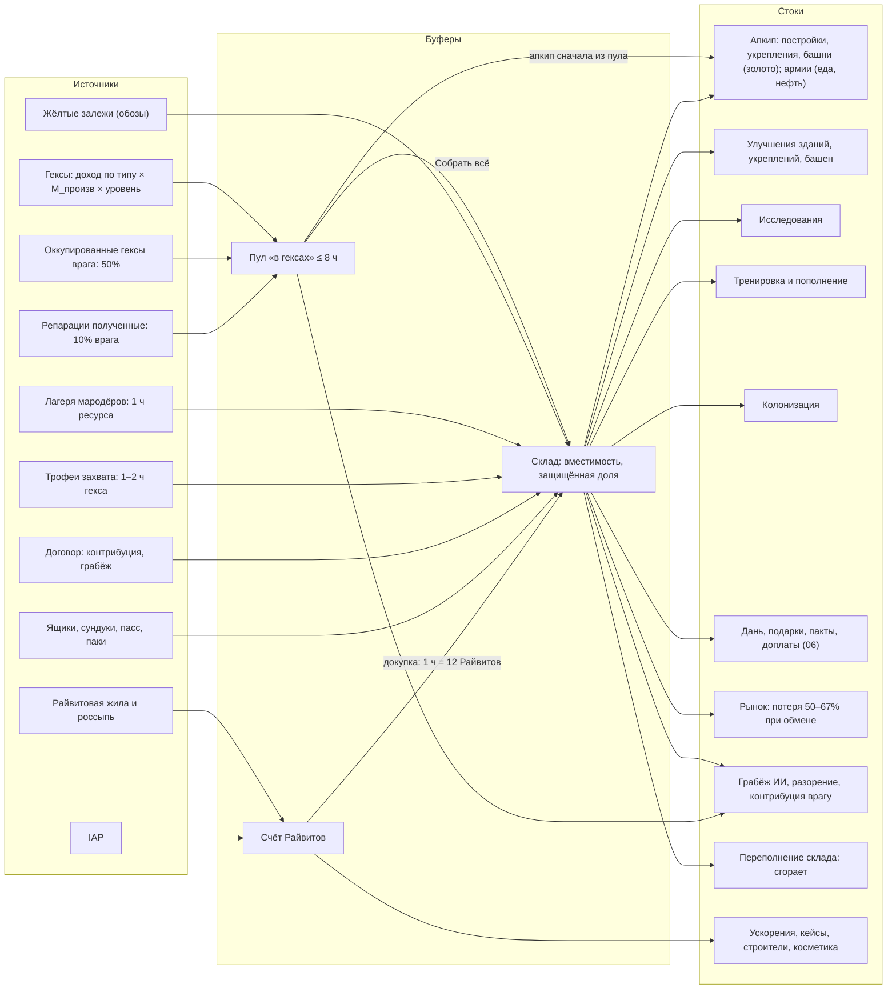
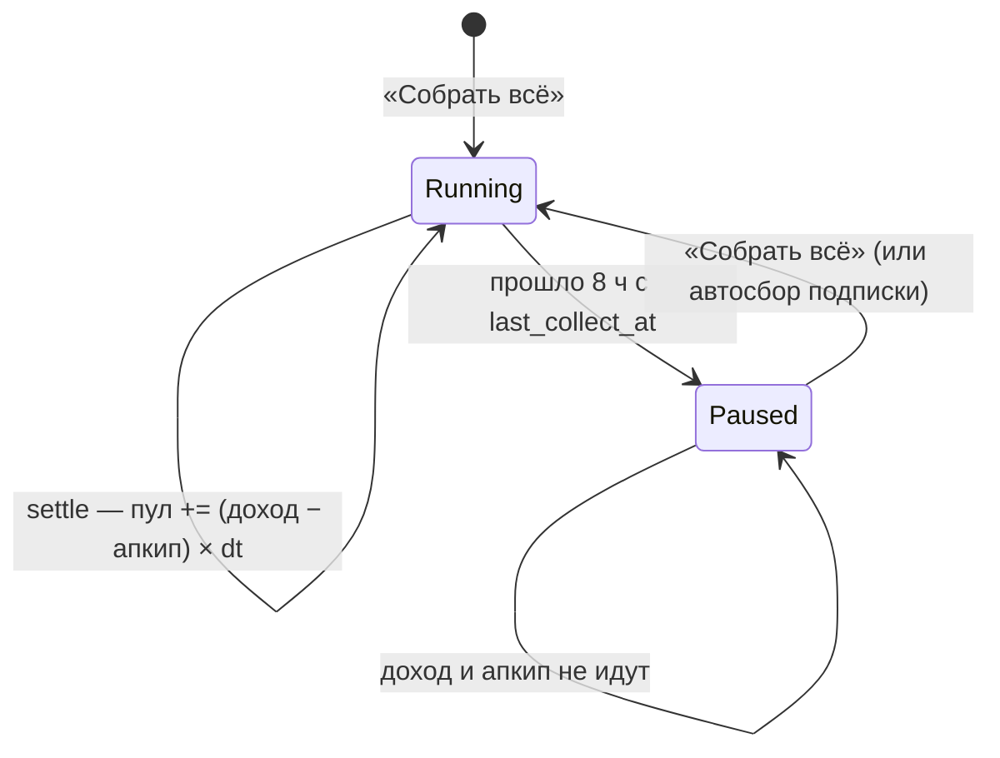
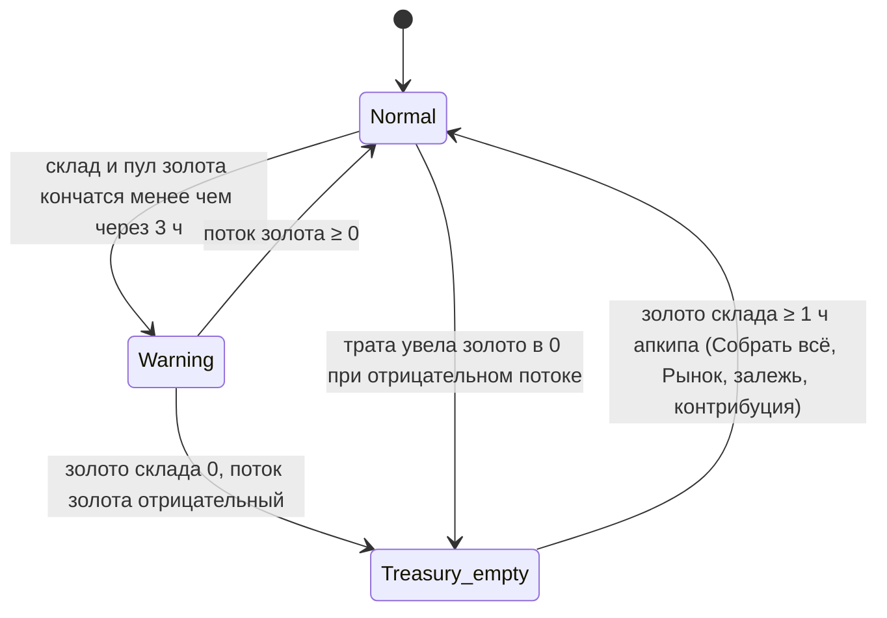
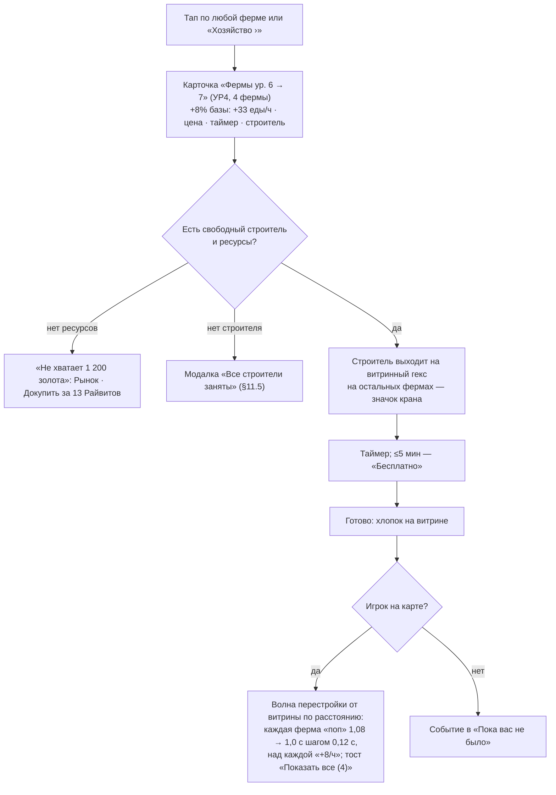

# 05. Экономика и здания

> **Назначение.** Исполняемая спецификация экономики Raivon: ресурсы и валюты (роль, источники, стоки, отображение), модель источников и стоков, доход гексов и накопление до 8 ч, «Собрать всё», склад и защищённая доля, апкип и его списание, «Казна пуста», консервация, все 18 зданий (функция, эффекты по уровням, потолки, структура стоимостей и таймеров, эволюция облика по 10 УР для Blender-китов), укрепления и башни как постройки, строители и очереди, таймеры и ускорения, Рынок, экономика колонизации, залежей, обозов, лагерей мародёров, трофеев, контрибуций и разграбления, упрощённая экономика ИИ, примеры экономики игрока на УР1, УР4, УР8, анти-инфляция и стоки эндгейма.
> **Опирается на канон:** §2.1 (решения владельца 2, 3, 8, 12, 20), §2.2 (журнал, п. 17, 18, 19, 23, 24, 25, 38), §3.4 (глоссарий экономики), §4 (ресурсы и валюты), §5 (типы гексов, залежи), §6.2 (М_произв, М_апкип, открытия), §7 (здания, строители, очереди), §8.1–8.2 (апкип армии, обоз, строитель — как входные данные), §9.10 (укрепления), §9.14 (разграбление), §10.1 (контрибуция, репарации), §12.1 (колонизация), §12.3 (ветка «Экономика»), §13 (таймеры и ускорения), §14.8 (подарки возврата), §15.2 (рекламные плейсменты), §15.7 (подписка), §15.8 (курсы).
> **Связанные файлы:** `02_map_territory.md` (размещение залежей и лагерей, модель гекса, `fence_mask`), `03_war_combat.md` (укрепления и башни в бою, порядок списания при поражении, трофей за захват), `04_units_army.md` (апкип армии, «Пустые амбары», обоз и строитель на карте), `06_diplomacy_peace.md` (выбор уровня грабежа, цены требований, подарки), `07_progression_meta.md` (УР, Академия и исследования, главы), `08_retention_liveops.md` (пуши, события, возврат), `09_monetization.md` (цены IAP, офферы, кейсы), `10_ui_ux_art.md` (пиксели HUD, VFX, арт-пайплайн), `11_balance_numbers.md` (полные кривые стоимостей, таймеров и переходов УР), `12_tech_analytics_roadmap.md` (хранение, аналитика).
> **Граница зоны.** Цены IAP — `09`. Полные кривые — `11` (здесь структура формул, базовые коэффициенты и опорные точки). Боевые эффекты укреплений и башен — `03`. Числа канона цитируются как есть; всё, чего в каноне нет, помечено «(предложение автора)» и собрано в §24.

---

## 1. Зона файла и инварианты

### 1.1. Что здесь и что не здесь

| Здесь (05) | Не здесь (ссылка) |
|---|---|
| сколько ресурса производит гекс, куда он попадает, как и когда списывается апкип | где лежит гекс и как он выглядит на карте — `02` |
| вместимость склада, защищённая доля, правило переполнения | как выбирается уровень грабежа и что думает ИИ — `06` |
| стоимость и время улучшений (структура), строители, ускорения | полные кривые по уровням и цены перехода на УР — `11` |
| укрепление и башня как постройки: цена, апкип, консервация, разбор | бонус защиты, урон башни, ПВО — `03` |
| объём залежи, груз обоза, зачисление трофеев и грабежа | путь обоза, гонка за залежь, визуал — `02`, `04` |
| апкип армии как строка в общем балансе | формула апкипа армии, пополнение — `04` |
| цены в Райвитах за ускорения и докупку | цены в долларах, состав паков — `09` |

### 1.2. Инварианты экономики (каждый покрыт автотестом экономического симулятора, канон §16.5)

| # | Инвариант |
|---|---|
| E1 | Сервер авторитетен по всем ресурсам, таймерам и наградам (канон §16.2). Клиент только показывает прогноз. |
| E2 | В экономике нет долгов: ни один ресурс не уходит ниже 0, неоплаченный апкип не накапливается (предложение автора; развивает канон `treasury_empty` «ничего не разрушается»). |
| E3 | Ничто экономическое не разрушается и не теряет уровень: ни апкип, ни разграбление, ни «Казна пуста» не снижают УР, уровни зданий, укреплений и башен на своих гексах (решение владельца 20). |
| E4 | Райвиты, Медали, Жетоны события, Блёстки и предметы никогда не грабятся и не тратятся на апкип (канон §4). |
| E5 | Твёрдую валюту нельзя получить из мягкой: обмена «ресурсы → Райвиты» нет нигде (предложение автора, анти-инфляция). |
| E6 | Потолок потерь от одного договора — 12 ч валового производства по каждому ресурсу, у всех государств, всегда (решение владельца 20, канон §9.14). |
| E7 | Отсутствие игрока не стоит ему ресурсов сверх лимитов войны: через 8 ч без сбора экономика встаёт на паузу вместе с апкипом (§5.1, предложение автора по канону §14.1 «Честный реалтайм»). |
| E8 | Территорию и УР нельзя купить; уровни зданий ≤ 2 × УР, укреплений и башен ≤ УР (канон §15.9). |
| E9 | Все числа экономики лежат в `content/economy.yaml`, `content/buildings.yaml`, `content/deposits.yaml` и меняются через remote config без обновления клиента (канон §16.3, §19.1). |

### 1.3. Обозначения

| Обозначение | Код в конфиге / сервере | Смысл |
|---|---|---|
| УР | `dev_level` | уровень развития, 1–10 |
| М_произв, М_апкип, М_силы | `dev_levels[n].prod_mult / upkeep_mult / strength_mult` | множители канона §6.2 |
| ур | `level` | уровень постройки (у типа — один на державу) |
| Валовое производство | `gross_rate[r]` | стабильное производство ресурса `r` в час (§4.4) |
| Фактический доход | `actual_rate[r]` | производство с временными модификаторами (§4.3) |
| Пул | `pool[r]` | несобранный доход «в гексах» (§5) |
| Склад | `storage[r]`, `capacity[r]` | запас и вместимость (§6) |
| Апкип | `upkeep_rate[r]` | содержание в час (§7) |

**Хранение на сервере** (предложение автора): все количества ресурсов — целые миллиединицы (×1000), ставки — миллиединицы в час, время — секунды. Округление при зачислении вниз, при списании и в ценах вверх. Игроку показываются целые числа с разделителем тысяч («13 629»), сокращения с 100 000: «247 тыс.», с 10 000 000: «1,5 млн».

---

## 2. Ресурсы и валюты

### 2.1. Роли (развёртка канона §4)

| Ресурс | Код | Роль в одной фразе | Главный источник | Главный сток | Растёт в цене с УР |
|---|---|---|---|---|---|
| Золото | `res_gold` | «деньги державы»: стройка, апкип, колонизация | обычные гексы, Кварталы, Столица | улучшения и **апкип построек и укреплений** | да, М_произв и М_апкип |
| Еда | `res_food` | «топливо армии» | Фермы, Столица | тренировка, пополнение, **апкип армий** | да |
| Металл | `res_metal` | «камень обороны» | Шахты, Заводы, Столица | **укрепления** (главный сток), Штурм, Артиллерия, старшие уровни построек | да |
| Нефть (с УР5) | `res_oil` | «редкий ресурс войны середины игры» | Нефтевышки, нефтяные фонтаны | техника с УР6, карты техники, укрепления ур. ≥8 | да |
| Райвиты | `cur_raivite` | твёрдая валюта: время, удобство, коллекция | IAP; бесплатно ≈45–55 в день | ускорения, кейсы, строители, косметика, докупка | нет |
| Медали | `cur_medals` | валюта Арены | Арена | магазин Арены | нет |
| Жетоны события | `cur_event_tokens` | валюта события, сгорает через 72 ч | задания события | магазин события | нет |
| Блёстки | `cur_glitter` | смягчение дублей косметики | дубли | Мастерская | нет |
| Осколки | `item_shards_<cmd>` | коллекция командиров | кейсы, пасс, события, Арена, главы | командиры (`04`) | нет |
| Ускорения | `item_speedup_5m/15m/1h/3h/8h` | «бутылки времени» | ящики, задания, пасс, паки | любой не-военный таймер (§12) | нет |
| Трофейный чертёж | `item_trophy_blueprint` | ускоритель исследования победителя | разграбление ИИ | −10% оставшегося времени исследования (хранится ≤5) | нет |

### 2.2. Подробности по ресурсам

**Золото.** Единственный ресурс апкипа построек, укреплений и башен. Поэтому именно золото определяет «Казну пуста» (§7.4). Золото — валюта мира: дань ИИ, подарки, пакт о ненападении, доплата за обмен считаются в часах производства золота (`06`). Колонизация оплачивается только золотом.

**Еда.** Не тратится на здания (предложение автора: держим 1 ресурс = 1 смысл). Её единственные стоки — армия (тренировка, пополнение, апкип ×1,5 во время войны, `04`) и обмен на Рынке. В мирное время еда копится, и игрок меняет излишек на Рынке. Это задуманный канал «мир кормит войну».

**Металл.** Главный сток — укрепления и башни (57–67% их цены, §9.17–9.18). В зданиях металл появляется со старших уровней: 25% цены с ур. 9 (§8.4). Металл не тратится на апкип.

**Нефть.** До УР5 скрыта: на HUD её нет, Тёмные озёра на карте подписаны «?» (канон §4). На УР5 озёра превращаются в Нефть (`02` §4.4), HUD получает четвёртую ячейку с анимацией «капля падает в ячейку» (0,8 с). Нефть — единственный ресурс, у которого бывают **нулевые** гексы-источники у игрока (нефть могла не достаться). Поэтому залежи нефти используют пол объёма (§15.1).

**Райвиты.** Не грабятся, не хранятся на складе, лимита нет. Начисляются сразу на счёт. Райвитовая жила копит до 4 в постройке и забирается «Собрать всё» (§15.6).

### 2.3. Отображение (HUD и панель «Казна»)

**HUD (верх экрана, портрет):** слева направо — Золото, Еда, Металл, Нефть (с УР5), Райвиты «+». Каждая ячейка ресурса:

| Элемент | Правило |
|---|---|
| Число | текущий `storage[r]`, анимированный пересчёт при изменении (0,6 с) |
| Полоса | заполнение склада; тёмный сегмент слева с замочком — защищённая доля (§6.2) |
| Цвет полосы | обычный до 89%; янтарный 90–99%; красный пульс при 100% («Склад полон») |
| Долгое нажатие | подсказка «+851/ч · склад 22 420 · защищено 45%» |
| Тап | панель «Казна» на этом ресурсе |
| Знак «−» | красная стрелка вниз у ячейки, если чистый поток ресурса отрицательный (например, еда в войне) |

**Ячейка Райвитов:** число и «+». Тап открывает магазин Райвитов (`09`); в России магазин показывает только бесплатные и рекламные награды (канон §15.11).

**Панель «Казна»** (`ui_treasury_panel`, предложение автора) — по вкладке на ресурс:

```
ЗОЛОТО                                      склад 41 230 / 247 348
Валовое производство          +13 629/ч    (Столица 2 138 · Города 6 977 · Порты 1 607 · Гексы 2 907)
Модификаторы                  −0%          (нет разорения, нет усталости)
Апкип                         −6 460/ч    (столица 489 · гекс-постройки 4 495 · укрепления 1 078 · башни 398)  [Содержание ›]
Чистый поток                  +7 169/ч
В гексах (несобранное)        38 235       ███████░ 5 ч 20 мин из 8 ч          [Собрать всё]
Защищено при грабеже          50% · 20 615   [Склад ур. 14 › ур. 15: 55%]
```

- Строки раскрываются тапом до уровня «тип постройки × число гексов».
- Кнопка «Содержание ›» ведёт в панель апкипа с консервацией (§7.7).
- Цифры — серверные, обновляются при каждом `settle` (§5.2).

---

## 3. Модель экономики

### 3.1. Источники и стоки



### 3.2. Правило маршрутизации

| Поток | Куда попадает | Почему |
|---|---|---|
| Непрерывный доход: гексы, оккупация, полученные репарации | **пул** | один механизм сбора, повод зайти (канон §2.2 п. 24) |
| Разовые зачисления: трофеи, контрибуция, грабёж, залежи, лагеря, перехват, ящики, покупки, Рынок | **склад** сразу | награда должна ощущаться мгновенно |
| Райвиты из любого источника | **счёт Райвитов** сразу | кроме жилы: она копит 2…4 в постройке (канон §5.1) |

(предложение автора)

### 3.3. Целевые пропорции (ориентиры для `11`)

| Метрика | Цель | Источник |
|---|---|---|
| Доля апкипа в валовом доходе | ~10% (УР1) … ~22% (УР8) … ~35% (УР10) | канон §6.2 |
| Доля залежей в притоке ресурсов активного F2P | 20–35% | предложение автора, §15.7 |
| Медианный запас на складе | 6–14 ч чистого дохода | предложение автора, §21 |
| Доля потраченного в улучшения от чистого дохода | 75–90% у активного F2P | предложение автора |
| Сгорело при переполнении | ≤5% притока | предложение автора, метрика `econ_overflow_share` |

Доля апкипа считается в «золотом эквиваленте» 1:1: Σ апкипа всех ресурсов / Σ валового производства всех ресурсов (предложение автора; `11` может ввести веса).

---

## 4. Доход гексов

### 4.1. Формула

```
доход_гекса[r] = база_типа[r] × М_произв(УР) × (1 + 0,08 × (ур_типа − 1)) × (1 + 0,02 × ур_исследования[r])
```

- **База и тип** — канон §5.1. Уровень постройки — уровень типа на всю державу (§8.3).
- **У обычных гексов** (равнина, лес, холмы) постройки нет: множитель уровня = 1 (трактовка автора).
- **Столица** даёт 150 золота + 30 еды + 30 металла × М_произв(УР). Множителя уровня у неё нет: её «уровень» — это Резиденция = УР, и он уже входит в М_произв (трактовка автора, против двойного счёта).
- **Исследования** ветки «Экономика» (канон §12.3): Налоги → золото, Урожай → еда, Металлургия → металл, Нефтедобыча → нефть, +2% за уровень, 10 уровней. Множитель общий для всех гексов ресурса (предложение автора: умножение, а не сложение с уровнем постройки).
- **Райвитовая жила** даёт 2 Райвита каждые 12 ч и не зависит ни от каких множителей (§15.6).

### 4.2. Доход по типам на ур. постройки 1 (база × М_произв)

| Тип | УР1 | УР2 | УР3 | УР4 | УР5 | УР6 | УР7 | УР8 | УР9 | УР10 |
|---|---|---|---|---|---|---|---|---|---|---|
| Обычный гекс, золото | 4 | 6 | 8,8 | 12,8 | 18,4 | 26 | 36 | 50 | 64 | 80 |
| Ферма, еда / Шахта, металл | 30 | 45 | 66 | 96 | 138 | 195 | 270 | 375 | 480 | 600 |
| Город, золото | 40 | 60 | 88 | 128 | 184 | 260 | 360 | 500 | 640 | 800 |
| Порт, золото | 20 | 30 | 44 | 64 | 92 | 130 | 180 | 250 | 320 | 400 |
| Нефть, нефть | — | — | — | — | 115 | 162,5 | 225 | 312,5 | 400 | 500 |
| Завод, металл | — | — | — | — | 46 | 65 | 90 | 125 | 160 | 200 |
| Столица, золото | 150 | 225 | 330 | 480 | 690 | 975 | 1 350 | 1 875 | 2 400 | 3 000 |
| Столица, еда и металл (каждого) | 30 | 45 | 66 | 96 | 138 | 195 | 270 | 375 | 480 | 600 |

Множитель уровня постройки (1 + 0,08 × (ур − 1)): ур. 2 — 1,08; 4 — 1,24; 6 — 1,40; 8 — 1,56; 10 — 1,72; 12 — 1,88; 14 — 2,04; 16 — 2,20; 18 — 2,36; 20 — 2,52.

### 4.3. Модификаторы производства и их сложение

```
сумма[r]       = Σ по своим неоккупированным гексам  доход_гекса[r] × k_гекса
               + Σ по оккупированным мной гексам      0,5 × доход_гекса_по_моей_формуле[r]
actual_rate[r] = сумма[r] × (1 − разорение) × (1 − усталость) × (1 − 0,25 × казна_пуста)
                          × (1 − 0,10 × платит_репарации) × (1 + буст)
k_гекса = 0 (законсервирован) | 0,5 (повреждён) | 1
```

| Модификатор | Величина | Действует на | Канон |
|---|---|---|---|
| Повреждённое здание | −50% выхода гекса | один гекс | §9.14 |
| Консервация | выход 0 | один гекс | §3.4 |
| Разорение | −20 / −30 / −40% на 4 / 6 / 8 ч | все незавоёванные гексы проигравшего | §9.14 |
| Усталость от войны | −5% за 12 ч после 24 ч, максимум −15% | обе стороны | §3.2 |
| Казна пуста | −25% | всё производство | §3.4 |
| Платит репарации | −10% (уходит победителю) | всё производство | §10.1 |
| Подарок возврата | ×2 на 4 ч / 24 ч | всё производство | §14.8 |

- **Сложение — умножением** (предложение автора): итог никогда не уходит ниже 0, порядок не важен. Пример: разорение −40% и усталость −15% дают ×0,6 × 0,85 = ×0,51, а не ×0,45.
- **Разорение второго договора** во время действующего не складывается: берётся больший процент и большая из оставшихся длительностей (предложение автора).
- Модификаторы **не трогают** Райвиты жилы и `gross_rate` (§4.4).

### 4.4. Валовое производство (`gross_rate`)

**Определение** (предложение автора): Σ дохода всех **официальных** гексов державы по формуле §4.1 при текущих УР, уровнях типов и исследованиях. Временные модификаторы §4.3 не учитываются: оккупация (своих гексов врагом и вражеских вами), разорение, повреждения, усталость, «Казна пуста», репарации, бусты. Исключение — консервация: законсервированный гекс в `gross_rate` не входит, это решение игрока, а не временная беда.

Это одно стабильное число на ресурс. Все «часы производства» в игре считаются от него:

| Где используется | Сколько часов | Канон |
|---|---|---|
| Объём залежи S / M / L | 0,5 / 1,5 / 4 ч | §5.2 |
| Награда лагеря мародёров | 1 ч случайного ресурса | §5.1 |
| Трофей за захват гекса | 1 ч (город 2 ч) производства гекса у владельца | §9.2, `03` §5.6 |
| Контрибуция | 4 ч золота врага за пакет | §10.1 |
| Потолок потерь за договор | 12 ч по каждому ресурсу | §9.14 |
| Дань в ультиматуме, пакт о ненападении, подарок, поддержка в войне | 8 / 8 / 1 / 4 ч золота | §9.1, §10.8, §10.5, §10.6 |
| Доплата за обмен территориями | 2 ч золота **ИИ** за единицу ценности | §10.9 |
| Докупка за Райвиты | 1 ч = 12 Райвитов | §15.8 |
| Запас ИИ | ~8 ч | §9.14 |

Почему стабильное: разорение или оккупация не должны уменьшать залежи и награды (это добивало бы проигравшего), а временный ×2 не должен удваивать их.

### 4.5. Оккупация и доход

- **Оккупированный гекс** приносит оккупанту 50% дохода, владелец теряет весь доход этого гекса (канон §5.1).
- **Чья формула** (трактовка автора): оккупант получает 50% от дохода, рассчитанного **по его собственной** формуле (его УР, его уровень этого типа, его исследования). Игрок видит понятное «половина того, что этот гекс давал бы мне».
- Доход оккупации идёт в пул оккупанта (§3.2). У ИИ — сразу на склад (§19).
- **Апкип** постройки на гексе, который сейчас оккупирован врагом, владелец не платит; оккупант тоже не платит (предложение автора). То же для укрепления и башни на таком гексе: они «ни на кого не работают» (`03` К11), апкип 0.
- Оккупированная нефть и завод работают на оккупанта, только если у него УР ≥5.
- Оккупированная Райвитовая жила даёт оккупанту 1 Райвит каждые 12 ч (50%), копится до 2 (предложение автора).

### 4.6. Особые случаи

| Случай | Правило |
|---|---|
| Нефть у игрока с УР <5 | «спящая» вышка: доход 0, апкип 0, тип нельзя улучшать (канон §5.1, `02` §4.1) |
| Завод у игрока с УР <5 | «заколоченная мануфактура»: доход 0, апкип 0, нет бонуса к таймерам (предложение автора по аналогии с нефтью; канон: «открывается на УР5») |
| Тёмное озеро до УР5 | доход 0, ценность 1; на УР5 становится Нефтью (ценность 3), постройка ур. = ваш ур. Нефтевышек (`02` §4.4) |
| Заброшенная ферма или штольня после колонизации | постройка «оживает» с вашим уровнем типа и начинает платить апкип (`02` §4.3) |
| Гекс в котле врага, ещё не сдавшийся | доход и апкип идут как обычно (он ещё ваш и под вашим контролем) |
| Военная база | дохода нет; ценность в снабжении и пополнении (канон §5.1) |

---

## 5. Накопление дохода и «Собрать всё»

### 5.1. Пул и «часы экономики»

Доход копится «в гексах» до 8 ч (канон §2.2 п. 24). Реализация (предложение автора):

- **Пул один на ресурс** (`pool[r]`), а не на каждый гекс. Монетки над гексами — визуальная раскладка пула пропорционально доходу гексов (`10`).
- **Часы экономики.** Доход и апкип начисляются только в окне **8 ч после последнего «Собрать всё»** (`last_collect_at`). Через 8 ч экономика встаёт на паузу: гексы «полны», доход не растёт, апкип тоже не списывается. Так отсутствие никогда не съедает склад (E7), а не собирать доход всё равно невыгодно.
- **Апкип сначала из пула**, потом со склада (`01` В5). Пул растёт на чистый поток `actual_rate − upkeep_rate`. Если чистый поток ресурса отрицательный, пул этого ресурса 0, а разница списывается со склада.
- **Жёсткий потолок пула:** `pool[r] ≤ 8 × gross_rate[r]`. Он важен, только если при прошлом сборе на складе не хватило места и часть осталась в пуле.



### 5.2. Псевдокод `settle()`

Вызывается лениво при любом запросе игрока, событии очереди (стройка, обоз, контратака) и перед любой тратой (канон §16.2).

```ts
function settle(p: Player, now: Sec): void {
  const until = min(now, p.lastCollectAt + 8 * 3600);           // часы экономики
  let t = p.lastSettleAt;
  // интервалы постоянных ставок: границы — конец разорения, усталости, буста, репараций, «Казны пуста»
  for (const [a, b] of splitByRateChanges(p, t, until)) {
    const dt = b - a;
    for (const r of RESOURCES) {
      const net = actualRate(p, r, a) - upkeepRate(p, r, a);    // миллиединицы/ч
      let pool = p.pool[r] + net * dt / 3600;
      if (pool < 0) { p.storage[r] = max(0, p.storage[r] + pool); pool = 0; }   // E2: без долга
      p.pool[r] = min(pool, 8 * grossRate(p, r));
    }
    updateTreasuryEmpty(p, b);                                    // §7.4
  }
  p.lastSettleAt = max(p.lastSettleAt, until);
  if (now >= p.lastCollectAt + 8 * 3600) p.econPaused = true;
  if (p.sub.active) autoCollect(p, now);                          // §5.4
}

function collectAll(p: Player, now: Sec): CollectResult {
  settle(p, now);
  const moved = {}, left = {};
  for (const r of RESOURCES) {
    const free = max(0, p.capacity[r] - p.storage[r]);
    moved[r] = min(p.pool[r], free);
    p.storage[r] += moved[r]; p.pool[r] -= moved[r]; left[r] = p.pool[r];
  }
  p.raivite += p.veinStock; p.veinStock = 0;                    // жила (§15.6)
  p.lastCollectAt = now; p.econPaused = false;
  return { moved, left };
}
```

- Деление на интервалы постоянных ставок делает расчёт точным при любом моменте запроса (детерминизм как у залежей, `02` §12.5).
- Тап по монетке на любом гексе = «Собрать всё» (одно действие, предложение автора).

### 5.3. UX «Собрать всё»

| Элемент | Правило |
|---|---|
| Кнопка | круглая, в правой части зоны большого пальца над нижней панелью; кольцо заполнения 0–8 ч; иконки ресурсов с суммами по долгому нажатию |
| Бейдж | появляется при пуле ≥1 ч чистого дохода; при 8 ч — пульс и подпись «Полно» |
| Анимация | монеты, снопы, слитки и капли летят из видимых гексов в ячейки HUD ≤1,2 с; счётчики HUD докручиваются; звук «дзынь» по гамме, как в церемонии (`10`) |
| Склад полон | часть монет «отскакивает» обратно; тост «Склад полон: в гексах осталось 1 200 золота · Улучшить Склад ›» |
| Пуш | `push_storage_full` «Казна переполнена — соберите доход» при достижении 8 ч (кроме тихих часов, лимиты — `08`) |
| Перед поражением | на экране требований ИИ и при капитуляции — плашка «Несобранный доход грабится полностью. Собрать?» с кнопкой (§18) |

### 5.4. Автосбор, ×2 офлайн-дохода, подарки возврата

- **Автосбор подписки** (канон §15.7): при каждом `settle` пул переносится на склад до вместимости. `last_collect_at` обновляется, только если пул перенесён целиком. При полном складе подписчик тоже упирается в 8 ч (предложение автора).
- **`ad_offline_double`** (экран «Пока вас не было», отсутствие ≥4 ч, 1 раз в день, канон §15.2): удваивает пул, собранный при этом входе. Удвоенная часть зачисляется на склад до вместимости; кнопка заранее пишет «Поместится +8 400 из 11 200» (предложение автора).
- **Подписчик** получает награду rewarded без просмотра (канон §15.7). Так как пул у него переносится автоматически, `ad_offline_double` удваивает доход, перенесённый за время отсутствия (предложение автора).
- **Производство ×2** при возврате после 3+ дней (канон §14.8) — модификатор `бусты` §4.3, на `gross_rate` не влияет.

### 5.5. Краевые случаи сбора

| Случай | Поведение |
|---|---|
| Гекс потерян (оккупирован, отдан) | пул не уменьшается; уменьшается только будущий доход и потолок пула |
| Игрок не заходил 3 дня | экономика стоит 2 дня 16 ч; апкип за это время не списан |
| Чистый поток еды отрицательный (война), игрок офлайн 6 ч | пул еды 0, со склада списано 6 ч дефицита; через 8 ч — пауза |
| Повышение УР во время накопления | новые ставки действуют с момента повышения (граница интервала) |
| Сбор во время боя | разрешён: экономика не связана с боем |
| Склад переполнен из ящика (§6.3) | «Собрать всё» в этот ресурс ничего не переносит, пул сохраняется |

---

## 6. Склад и защищённая доля

### 6.1. Вместимость

`capacity[r] = 5 000 × 1,35^(ур_Склада − 1)` на **каждый** ресурс (канон §4, §7). Нефть получает ту же вместимость с УР5.

| Ур. Склада | Вместимость | Защищено | Ур. | Вместимость | Защищено |
|---|---|---|---|---|---|
| 1 | 5 000 | 40% | 11 | 100 533 | 50% |
| 2 | 6 750 | 40% | 12 | 135 719 | 50% |
| 3 | 9 113 | 40% | 13 | 183 221 | 50% |
| 4 | 12 302 | 40% | 14 | 247 348 | 50% |
| 5 | 16 608 | 45% | 15 | 333 920 | 55% |
| 6 | 22 420 | 45% | 16 | 450 792 | 55% |
| 7 | 30 267 | 45% | 17 | 608 570 | 55% |
| 8 | 40 861 | 45% | 18 | 821 569 | 55% |
| 9 | 55 162 | 45% | 19 | 1 109 118 | 55% |
| 10 | 74 469 | 50% | 20 | 1 497 310 | 60% |

**Ограничение для `11`** (предложение автора): любая разовая цена (улучшение, переход на УР, укрепление) при типичном уровне Склада для этого УР (2 × УР − 2) не превышает 80% вместимости. Иначе игрок упирается в «нельзя накопить», а не в «не хватает».

### 6.2. Защищённая доля

```
доля = таблица_Склада(ур) + 0,02 × ур_«Тайных_погребов» (0–5)          ≤ 70%   (канон §7)
       + 0,15, если на этот грабёж посмотрен ad_hide_treasury             (канон §15.2; итог ≤ 85%)
защищено[r] = floor(min(storage[r], capacity[r]) × доля)
на_виду[r]  = storage[r] − защищено[r]
```

- **Пул не защищён никогда** (канон §9.14: грабится несобранный доход). Поэтому «собери перед поражением» — реальный совет.
- **Сверх вместимости не защищено** (предложение автора): переполненный склад (§6.3) грабится по излишку целиком.
- У ИИ доля всегда 25% (канон §4).

### 6.3. Переполнение и зачисления

| Зачисление | Сверх вместимости | Обоснование |
|---|---|---|
| «Собрать всё» | остаётся в пуле (§5.2) | ничего не теряется |
| Залежь, лагерь, трофей, перехват, контрибуция, грабёж, Рынок | **сгорает**; экран заранее предупреждает «Поместится 18 000 из 21 000» | как в `03` §18.2; стимул улучшать Склад |
| Ящики, сундуки, кейсы, пасс, паки, покупка за Райвиты | зачисляется **сверх** вместимости (склад «переполнен», полоса красная с «+») | платная или подарочная награда не должна сгорать (предложение автора) |

Пока склад ресурса переполнен, «Собрать всё» этот ресурс не переносит, а цены в нём списываются обычным образом.

### 6.4. UX склада

- На полосе HUD защищённая часть темнее и со значком замка. Долгое нажатие: «Защищено 45%: 10 089 из 22 420».
- Карточка Склада показывает следующий уровень: «+7 847 вместимости · защищено 45% → 45%». Каждые 5 уровней — подсветка «Защита +5%».
- Экран «Что сохранено» после поражения (канон §9.14) — §18.6.

---

## 7. Апкип

### 7.1. Формулы

```
апкип_здания        = база × М_апкип(УР) × (1 + 0,08 × (ур_типа − 1)) × n_гексов × (1 − 0,03 × ур_Бережливости)
апкип_укрепления    = 5 × М_апкип(ур_укрепления) × (1 + 0,08 × (ур − 1)) × (1 − 0,03 × ур_Бережливости)     золото/ч
                    + ур, если ур ≥ 8                                     × (1 − 0,03 × ур_Бережливости)     нефть/ч
апкип_башни         = 3 × М_апкип(ур_башни) × (1 + 0,08 × (ур − 1)) × (1 − 0,03 × ур_Бережливости)           золото/ч
апкип_армии         = см. 04 §6.1 (еда; нефть с УР6; ×1,5 во время войны)
законсервировано    = 10% от формулы
```

- Базы — канон §7: Резиденция 0, Казарма 2, Академия 2, Склад 1, Лазарет 2, Обозный двор 1, Посольство 2, Рынок 1, Кварталы 3 за город, Ферма 2, Шахта 2, Порт 2 за гекс, Нефтевышка 3, Завод 5, Военная база 5 за гекс, Райвитовый прииск 0.
- Для укрепления и башни берётся М_апкип **уровня самой постройки**: плетень в тылу остаётся дешёвым и на УР8 (канон §7).
- «Бережливость» (−3% × 5, канон §12.3) действует на весь апкип, включая армию и нефть укреплений (трактовка автора, как в `04` §6.1).
- Апкип золотом — только у построек, укреплений и башен. Еду и нефть потребляет армия; нефть ещё — укрепления ур. ≥8 (канон §3.4, §9.10).

### 7.2. Апкип по уровням

**Апкип здания с базой 1 при максимальном уровне для УР (ур = 2 × УР):**

| УР | 1 | 2 | 3 | 4 | 5 | 6 | 7 | 8 | 9 | 10 |
|---|---|---|---|---|---|---|---|---|---|---|
| М_апкип | 1 | 1,7 | 2,8 | 4,5 | 7 | 11 | 17 | 27 | 43 | 70 |
| Апкип, золото/ч | 1,08 | 2,11 | 3,92 | 7,02 | 12,04 | 20,68 | 34,68 | 59,4 | 101,48 | 176,4 |
| Доход города при Кварталах ур. 2 × УР (40 × М_произв × множитель уровня), для сравнения | 43,2 | 74,4 | 123,2 | 199,7 | 316,5 | 488,8 | 734,4 | 1 100 | 1 510,4 | 2 016 |
| Город: доход / апкип Кварталов (база 3) | 13,3 | 11,8 | 10,5 | 9,5 | 8,8 | 7,9 | 7,1 | 6,2 | 5,0 | 3,8 |

Последняя строка — «Держава эволюционирует и стоит денег» (канон §1.1, столп 5) в одной цифре: соотношение «доход / содержание» города падает с 13,3 на УР1 до 3,8 на УР10, в 3,5 раза.

**Укрепление и башня по своему уровню:**

| Ур. | 1 | 2 | 3 | 4 | 5 | 6 | 7 | 8 | 9 | 10 |
|---|---|---|---|---|---|---|---|---|---|---|
| Укрепление, золото/ч | 5 | 9,18 | 16,24 | 27,9 | 46,2 | 77 | 125,8 | 210,6 | 352,6 | 602 |
| Укрепление, нефть/ч | — | — | — | — | — | — | — | 8 | 9 | 10 |
| Башня, золото/ч | 3 | 5,51 | 9,74 | 16,74 | 27,72 | 46,2 | 75,48 | 126,36 | 211,56 | 361,2 |
| Законсервировано (10%), укрепление | 0,5 | 0,92 | 1,62 | 2,79 | 4,62 | 7,7 | 12,58 | 21,06 + 0,8 нефти | 35,26 + 0,9 | 60,2 + 1 |

Один ультразабор на УР8 стоит ≈1,5% валового золота типичной державы (§20.3). Десять ультразаборов — 15%: «обнести всё» нельзя, это выбор, где держать сильную точку (канон §9.10).

### 7.3. Списание

| Правило | Значение |
|---|---|
| Единица | «в час», начисление непрерывное, расчёт лениво в `settle()` (§5.2) |
| Порядок | сначала из пула ресурса, потом со склада (`01` В5) |
| Защищённая доля | на апкип тратится весь склад, включая защищённую часть (защита работает только против грабежа) |
| Пауза | через 8 ч без сбора апкип не списывается (E7) |
| Оккупированный свой гекс | апкип постройки, укрепления и башни на нём 0 (§4.5) |
| Повреждённое здание | апкип полный (стимул ремонтировать, ремонт дешёвый, §18.3) |
| Во время войны | армия ×1,5 (`04`); апкип построек не меняется |
| Отображение | HUD — чистый поток; панель «Содержание» — разбивка (§7.7) |

### 7.4. «Казна пуста» (`treasury_empty`)

**Вход:** золото на складе = 0 **и** чистый поток золота < 0 (апкип больше дохода, а пул золота пуст).

**Выход** (предложение автора, гистерезис против мигания): золото на складе ≥ 1 ч апкипа золота. Проверяется в каждом `settle()`.



Пул копит доход отдельно от склада, поэтому после консервации или мира золото сначала растёт в пуле, а из «Казны пуста» выводит «Собрать всё». Советник считает экономию с учётом штрафа −25%: если без штрафа поток положительный, а со штрафом отрицательный, он предлагает обмен на Рынке, чтобы перескочить порог.

**Пока действует** (канон §3.4 и трактовка автора):

| Что | Правило |
|---|---|
| Производство | −25% всех ресурсов (§4.3) |
| Неоплаченный апкип | не копится, долгов нет (E2) |
| Разрушения | нет: здания, укрепления, башни работают (E3) |
| Разрешено начинать | улучшения Склада, Рынка, Кварталов, Ферм, Шахт, Портов, Нефтевышек, Заводов, Обозного двора; исследования ветки «Экономика»; колонизацию; обмен на Рынке; тренировку и пополнение (они стоят еды и металла) |
| Запрещено начинать | Резиденцию, Казарму, Академию (кроме «Экономики»), Лазарет, Посольство, Военную базу, укрепления и башни (постройку и улучшение) |
| Уже идущие задачи | продолжаются и завершаются |
| Война | не ограничена |

**UX:**

1. **Прогноз.** Когда при текущем дефиците (золото склада + пул) закончится меньше чем через 3 ч, ячейка золота мигает янтарным, а в панели «Казна» появляется «Казна опустеет через 2 ч 40 мин» с кнопкой «Содержание ›» (предложение автора).
2. **Вход.** Красная плашка под HUD: «Казна пуста: производство −25%». Кнопки: «Собрать всё», «Сократить содержание» (панель §7.7, отсортированная по экономии), «Рынок». Советник предлагает 3 действия с готовыми числами: «Законсервировать 3 тыловых укрепления: +412/ч».
3. **Попытка запрещённой стройки** — карточка «Казна пуста: сейчас доступны только экономические улучшения» и те же 3 совета.
4. **Выход** — зелёный тост «Казна пополнена».

**Пуш** для «Казны пуста» не вводится: список пушей ведёт `08` (вопрос в §24).

### 7.5. Нехватка еды и нефти

Правило «Пустые амбары» — `04` §6.2: еда 0 — пауза пополнения и тренировки, Сила не падает; нефть 0 — тренировка техники на паузе, карты техники неактивны.

Добавление этого файла для укреплений (предложение автора, единый принцип E2 «долгов нет»): при нефти 0 укрепления ур. ≥8 **продолжают работать** (`03` §13: бой не учитывает нефть), нефтяной апкип не списывается и в долг не пишется. Улучшать укрепления до ур. ≥8 нельзя, пока не хватает нефти на цену. Карточка укрепления показывает «Без подпитки: нет нефти».

### 7.6. Консервация (`mothball`)

**Правило канона:** постройка или укрепление не работает и стоит 10% апкипа; расконсервация 10 мин (канон §3.4, §13).

| Объект | Можно? | Что выключается |
|---|---|---|
| Гекс-постройки: Кварталы, Ферма, Шахта, Порт, Нефтевышка, Завод, Военная база (поштучно, по гексам) | да | выход гекса; у Порта и Базы — функция источника снабжения; у Базы — пополнение ×3 и гарнизон ×2; у Завода — его −5% к таймерам |
| Укрепление, Башня | да | бонус защиты, урон и ПВО; укрепление обесцвечено (`02` §4.6) |
| Казарма | только с пустой очередью | тренировка |
| Академия | только без активного исследования | исследования |
| Лазарет, Обозный двор, Рынок | да | их бонусы; Рынок закрыт |
| Посольство | да | бонусы подарков и угрозы, новые союзы; действующие союзы сохраняются |
| Резиденция, Склад, Райвитовый прииск, Столица | нет | — (апкип 0 или функция критична) |

**Правила** (предложения автора, кроме отмеченных):

- Консервация мгновенная, без строителя. Расконсервация — таймер 10 мин (канон), без строителя, ускоряется как обычный таймер (§12): бесплатно последние 5 мин, у подписчика — сразу.
- Нельзя менять состояние объектов на гексах сектора, где идёт бой (`03` §13).
- Законсервированные укрепления и башни не участвуют ни в живой, ни в авто-обороне (`03` §13). Это осознанный риск: объявленный за 20 мин удар ИИ (канон §9.11) оставляет время расконсервировать укрепления в секторе (10 мин). В пуше и на стрелке удара появляется кнопка «Расконсервировать в секторе (3)».
- Законсервированный гекс-объект выпадает из `gross_rate` (§4.4).
- Массовая операция: в панели «Содержание» фильтр «В тылу (≥3 гексов от чужой земли)» → «Законсервировать все».
- Если идёт улучшение законсервированного объекта, оно продолжается; результат вступит в силу после расконсервации.

### 7.7. Панель «Содержание» (`ui_upkeep_panel`, предложение автора)

```
СОДЕРЖАНИЕ                              −6 460 золота/ч · −360 еды/ч · −137 нефти/ч
Сортировка: [по стоимости ▾]   Фильтр: [все | в тылу | у фронта | законсервировано]
Гекс-постройки  ▸ Заводы ×3 (ур. 10)          −634/ч   окупаются таймерами: −15%
                ▸ Военные базы ×3 (ур. 10)    −634/ч   снабжение: 2 базы у фронта
Укрепления      ▸ Ультразабор ×3              −575/ч  +22 нефти/ч
                ▸ ДОТы ×5 (ур. 6)             −350/ч   2 в тылу  [Законсервировать 2: +126/ч]
Башни           ▸ …
Столица         ▸ Лазарет ур. 10              −85/ч
Армия (04)      ▸ 5 армий                     −360 еды/ч  (война ×1,5)
```

- Каждая строка показывает экономию от консервации и последствия («Источник снабжения будет потерян»).
- Советник отмечает кандидатов: тыловые укрепления и башни, базы дальше 4 гексов от чужой земли, Заводы, если строители простаивают.
- Число «Доля апкипа: 22%» с целевым коридором по УР (канон §6.2) и подписью «Норма для УР8».

---

## 8. Здания: общие правила

### 8.1. Классы зданий

| Класс | Здания | Где стоят | Уровень |
|---|---|---|---|
| Столичные | Резиденция, Казарма, Академия, Склад, Лазарет, Обозный двор, Посольство, Рынок | в гексе столицы, вокруг Резиденции | один на державу |
| Гекс-типы | Кварталы, Ферма, Шахта, Порт, Нефтевышка, Завод, Военная база | на всех гексах своего типа | **один на тип для всей державы** |
| Особая | Райвитовый прииск | на Райвитовых жилах | уровней нет |
| Оборонные | Укрепление, Башня | на выбранных гексах | **свой на каждом гексе** |

Итого 18 зданий (канон §12.7).

### 8.2. Потолки уровней

| УР | 1 | 2 | 3 | 4 | 5 | 6 | 7 | 8 | 9 | 10 |
|---|---|---|---|---|---|---|---|---|---|---|
| Здания, кроме Резиденции (2 × УР) | 2 | 4 | 6 | 8 | 10 | 12 | 14 | 16 | 18 | 20 |
| Укрепление, башня (≤ УР) | 1 | 2 | 3 | 4 | 5 | 6 | 7 | 8 | 9 | 10 |
| Башен на державу (≤ 2 × УР) | 2 | 4 | 6 | 8 | 10 | 12 | 14 | 16 | 18 | 20 |

По главам: I — 6, II — 10, III — 14, IV — 16 (запуск), V — 18, VI — 20 (канон §7).

### 8.3. Правило «уровень по типу на всю державу»

Канон §2.2 п. 17: «Кварталы ур. 7» сразу меняют все города. Детали (предложения автора, кроме отмеченных):

| Ситуация | Правило |
|---|---|
| Новый гекс типа (аннексия, колонизация, обмен) | сразу получает ваш уровень типа (канон §7) и облик вашего УР; апкип и доход — с момента перехода |
| У державы 0 гексов типа | уровень сохраняется (E3), но улучшать тип нельзя: кнопка «Нет ни одного порта» |
| Последний гекс типа потерян во время улучшения | улучшение завершается, уровень сохраняется |
| Стоимость улучшения типа | **не зависит** от числа гексов типа; апкип растёт с числом гексов. Расширение делает каждое улучшение выгоднее, а содержание — дороже |
| Одновременные улучшения | один тип — одно улучшение за раз; разные типы — параллельно, по строителю на каждый |
| Повреждённый гекс при улучшении типа | получает новый уровень, но выход −50% до ремонта |
| Тип ещё не открыт (Нефтевышка, Завод до УР5) | гексы «спят»; на УР5 тип появляется на всех своих гексах с ур. 1 бесплатно |

### 8.4. Стоимость: структура

```
цена(B, ур → ур+1) = C_B × М_произв(УР) × 1,22^(ур − 1)          золотой эквивалент
  ур+1 ≤ 8:  100% золото
  ур+1 ≥ 9:  75% золото + 25% металл                                (канон §4: «старшие уровни построек»)
```

- Множитель М_произв(УР) — канон §6.2: стоимость строительства растёт вместе с доходом. Улучшение, начатое до повышения УР, оплачено по старой цене.
- Шаг 1,22 и коэффициенты C_B — предложения автора; полные таблицы — `11`.
- Цена перехода на УР (Резиденция) — только `11`. Ориентир автора: 10–14 ч валового дохода золота и металла на момент гейта.

| Здание | C_B | Здание | C_B |
|---|---|---|---|
| Казарма | 180 | Кварталы | 260 |
| Академия | 220 | Ферма, Шахта | 200 |
| Склад | 160 | Порт | 180 |
| Лазарет | 160 | Нефтевышка | 240 |
| Обозный двор | 140 | Завод | 300 |
| Посольство | 200 | Военная база | 260 |
| Рынок | 140 | Резиденция | `11` |

**Опорные точки для C_B = 100** (улучшение до максимального уровня своего УР; для здания умножить на C_B / 100):

| До ур. (УР) | 2 (1) | 4 (2) | 6 (3) | 8 (4) | 10 (5) | 12 (6) | 14 (7) | 16 (8) | 18 (9) | 20 (10) |
|---|---|---|---|---|---|---|---|---|---|---|
| Цена | 100 | 223 | 487 | 1 055 | 2 258 | 4 748 | 9 785 | 20 228 | 38 537 | 71 698 |

Пример: «Кварталы ур. 16» на УР8 стоят 20 228 × 2,6 ≈ 52 590 (39 444 золота + 13 148 металла), ≈3,9 ч валового золота державы из §20.3. Окупаемость +8% на 6 городах (+274 золота/ч) — около 8 дней. Это задумано: рост дают земля и УР, а не бесконечные +8% (столп 5).

### 8.5. Таймеры

**Здания** (столичные и гекс-типы, предложение автора в рамках диапазонов канона §13):

| До ур. | 2 | 3 | 4 | 5 | 6 | 7 | 8 | 9 | 10 | 11 |
|---|---|---|---|---|---|---|---|---|---|---|
| Таймер | 5 с | 30 с | 2 мин | 5 мин | 15 мин | 20 мин | 45 мин | 1 ч 30 мин | 2 ч 30 мин | 3 ч |
| **До ур.** | **12** | **13** | **14** | **15** | **16** | **17** | **18** | **19** | **20** | |
| Таймер | 4 ч | 5 ч | 8 ч | 12 ч | 16 ч | 18 ч | 24 ч | 30 ч | 36 ч | |

**Укрепление и башня** (по уровню, который строится):

| Ур. | 1 | 2 | 3 | 4 | 5 | 6 | 7 | 8 | 9 | 10 |
|---|---|---|---|---|---|---|---|---|---|---|
| Таймер | 10 с | 1 мин | 10 мин | 20 мин | 1 ч | 2 ч | 4 ч | 8 ч | 12 ч | 16 ч |

**Резиденция:** 1 мин, 15 мин, 1 ч, 3 ч, 8 ч, 12 ч, 24 ч, 36 ч, 48 ч на переход к УР 2…10 (канон §6.2).

- **Заводы:** таймер стройки × (1 − 0,05 × min(6, N)), где N — свои неоккупированные незаконсервированные Заводы; повреждённый считается за 0,5 (канон §5.1; учёт состояний — предложение автора). Действует на здания, укрепления и башни, на исследования и колонизацию не действует.
- **Снимок при старте** (предложение автора): бонус фиксируется в момент начала задачи; изменение числа Заводов на идущие задачи не влияет.
- Таймеры до 5 мин фактически мгновенные (§12.2): ранняя игра «щёлкает».

### 8.6. Конвенция «+X% за уровень»

- **Гекс-типы** (Кварталы, Ферма, Шахта, Порт, Нефтевышка, Завод): по формуле канона §5.1 — `1 + 0,08 × (ур − 1)`, ур. 1 = база.
- **Столичные здания и Военная база**: `X × ур`, бонус есть уже на ур. 1 (как в `04` §9.2, §12.1).

### 8.7. Появление зданий

| Когда | Что появляется (ур. 1, бесплатно, без строителя) |
|---|---|
| Старт | Резиденция (= УР1), Казарма, Академия, Склад, Лазарет, Обозный двор; типы Кварталы, Ферма, Шахта, Порт, Военная база на ур. 1 |
| УР2 | Рынок |
| УР3 | Посольство |
| УР5 | Нефтевышка и Завод — на всех своих гексах этих типов |
| Захват Райвитовой жилы миром | Райвитовый прииск |

Появление сопровождает короткий «поп» здания в столице и плашка «Открыто: Рынок» (предложение автора).

### 8.8. Апгрейд как зрелище на всей карте



- **Витринный гекс** — самая ценная постройка типа, ближайшая к столице (`04` §12.2).
- «Показать все» отъезжает камерой, чтобы в кадр попали все гексы типа (≤3 с), затем возвращает её.
- Если уровень пересёк ступень декора (§10.6), волна добавляет новые этажи и огни: в этом и есть зрелище.
- Повышение УР — отдельная 6-секундная церемония всей державы (канон §6, `07`, `10`).

---

## 9. Каталог 18 зданий

### 9.1. Сводная таблица

| Здание | Код | Где, открытие | Потолок | Апкип (база) | C_B | Консервация | Может быть повреждено |
|---|---|---|---|---|---|---|---|
| Резиденция | `bld_residence` | столица, старт | 10 (= УР) | 0 | `11` | нет | нет |
| Казарма | `bld_barracks` | столица, старт | 2 × УР | 2 | 180 | при пустой очереди | нет |
| Академия | `bld_academy` | столица, старт | 2 × УР | 2 | 220 | без исследования | нет |
| Склад | `bld_warehouse` | столица, старт | 2 × УР | 1 | 160 | нет | нет |
| Лазарет | `bld_infirmary` | столица, старт | 2 × УР | 2 | 160 | да | нет |
| Обозный двор | `bld_convoy_yard` | столица, старт | 2 × УР | 1 | 140 | да | нет |
| Посольство | `bld_embassy` | столица, УР3 | 2 × УР | 2 | 200 | да | нет |
| Рынок | `bld_market` | столица, УР2 | 2 × УР | 1 | 140 | да | нет |
| Кварталы | `bld_quarters` | все города | 2 × УР | 3 за город | 260 | по гексам | да |
| Ферма | `bld_farm` | все фермы | 2 × УР | 2 за гекс | 200 | по гексам | да |
| Шахта | `bld_mine` | все шахты | 2 × УР | 2 за гекс | 200 | по гексам | да |
| Порт | `bld_port` | все порты | 2 × УР | 2 за гекс | 180 | по гексам | да |
| Нефтевышка | `bld_oil_rig` | все нефтегексы, УР5 | 2 × УР | 3 за гекс | 240 | по гексам | да |
| Завод | `bld_factory` | все заводы, УР5 | 2 × УР | 5 за гекс | 300 | по гексам | да |
| Военная база | `bld_military_base` | все базы | 2 × УР | 5 за гекс | 260 | по гексам | да |
| Райвитовый прииск | `bld_raivite_mine` | Райвитовые жилы | — | 0 | — | нет | нет |
| Укрепление | `bld_fort` | любой свой гекс | 10, ≤ УР | 5 × М_апкип(ур) | §9.17 | да | нет |
| Башня | `bld_tower` | обычный свой гекс | 10, ≤ УР | 3 × М_апкип(ур) | §9.18 | да | нет |

Столичные здания, прииск, укрепления и башни разграблением не повреждаются (канон §9.14).

### 9.2. Эффекты по уровням

| Здание | Формула | ур. 1 | ур. 4 | ур. 8 | ур. 12 | ур. 16 | ур. 20 |
|---|---|---|---|---|---|---|---|
| Казарма | время тренировки −4% × ур (общий пол — `04` §5) | −4% | −16% | −32% | −48% | −64% | −80% |
| Академия | время исследования −4% × ур; потолок линии ⌈ур / 2⌉ и ≤ УР | −4% / 1 | −16% / 2 | −32% / 4 | −48% / 6 | −64% / 8 | −80% / 10 |
| Склад | вместимость / защищённая доля (§6) | 5 000 / 40% | 12 302 / 40% | 40 861 / 45% | 135 719 / 50% | 450 792 / 55% | 1 497 310 / 60% |
| Лазарет | скорость пополнения +5% × ур | +5% | +20% | +40% | +60% | +80% | +100% |
| Обозный двор | груз +10% × ур, скорость +3% × ур | +10% / +3% | +40% / +12% | +80% / +24% | +120% / +36% | +160% / +48% | +200% / +60% |
| Посольство | подарки +5% × ур; набор угрозы −2% × ур (≤ −30%) | +5% / −2% | +20% / −8% | +40% / −16% | +60% / −24% | +80% / −30% | +100% / −30% |
| Рынок | курс обмена 3 − (ур − 1) / 19 : 1 | 3,00 | 2,84 | 2,63 | 2,42 | 2,21 | 2,00 |
| Кварталы, Ферма, Шахта, Порт, Нефтевышка, Завод | выход × (1 + 0,08 × (ур − 1)) | ×1,00 | ×1,24 | ×1,56 | ×1,88 | ×2,20 | ×2,52 |
| Военная база | пополнение рядом ×3 и ещё +4% × ур (`04` §9.3) | +4% | +16% | +32% | +48% | +64% | +80% |

### 9.3. Резиденция `bld_residence`

- Уровень Резиденции = УР (канон §6). Улучшение = переход на следующий УР: нужны официальные гексы (10/16/24/32/44/56/80/120/170), ресурсы (`11`), таймер (§8.5) и строитель.
- **Гейт проверяется при старте** (предложение автора): если за время таймера гексов стало меньше порога (поражение), переход всё равно завершается. УР не понижается никогда (E3).
- Во время перехода остальные стройки идут. Отмена — по §11.6.
- Завершение — церемония 6 с (канон §6): все модели державы перестраиваются. Офферов и рекламы в ней нет (канон §14.10).

### 9.4. Казарма `bld_barracks`

- Тренировка отрядов; очередь без лимита, последовательно (канон §7). Правила очереди, отмены, доставки — `04` §5.
- −4% времени за уровень; складывается с Заводами и «Строевой подготовкой» по формуле `04` §5.

### 9.5. Академия `bld_academy`

- 1 очередь исследований (канон §7). Линии и стоимости — `07`, `11`.
- Потолок уровня линии — ⌈ур. Академии / 2⌉ и ≤ УР: Академия на максимуме (2 × УР) всегда открывает линии до УР.
- Трофейный чертёж: −10% оставшегося времени текущего исследования, не больше −50% на одно (канон §3.3). Применяется кнопкой в карточке исследования.

### 9.6. Склад `bld_warehouse`

- Вместимость и защита — §6. Консервации нет: склад нельзя «выключить».
- Советник поднимает Склад в топ рекомендаций, если цена следующего УР или любой открытой цели выше 80% вместимости (§11.4).

### 9.7. Лазарет `bld_infirmary`

- +5% скорости пополнения за уровень, по всей державе (канон §7, `04` §9.3).
- Законсервирован — бонус 0, пополнение идёт с базовой скоростью.

### 9.8. Обозный двор `bld_convoy_yard`

- Груз +10% и скорость +3% за уровень; число обозов задаёт УР (+1 по подписке). Формулы груза и пути — `04` §12.1, объём залежи — §15.
- Бонусы не действуют на Райвитовую россыпь (`04` §12.1).

### 9.9. Посольство `bld_embassy`

- Лимит союзов с ИИ 1 / 2 / 3 на УР 3 / 5 / 7 — по **УР**, не по уровню здания (канон §7).
- Подарки +5% эффекта и набор угрозы −2% за уровень (максимум −30% на ур. 15). Применение — `06`.

### 9.10. Рынок `bld_market`

Курсы, торговец и UX — §13.

### 9.11. Кварталы `bld_quarters`

- Доход городов +8% за уровень (формула §4.1). Главная витрина эволюции: халупы → аркологии (§10.2).
- Апкип 3 за каждый город: двадцать городов на УР8 с Кварталами ур. 16 стоят 3 564 золота/ч.

### 9.12. Ферма, Шахта, Порт `bld_farm`, `bld_mine`, `bld_port`

- +8% выхода за уровень. Порт ещё источник снабжения и точка «Десанта» (дальность 4, `03`). Повреждённый порт снабжение не теряет (предложение автора).

### 9.13. Нефтевышка `bld_oil_rig`

- С УР5 (канон §6.2). +8% нефти за уровень.
- **Энергия в бою:** каждые 3 Нефтевышки дают +1 стартовой энергии, максимум +2 (канон §4). Считаются свои, под своим контролем, незаконсервированные; повреждённая считается (предложение автора: бой не зависит от ремонта).

### 9.14. Завод `bld_factory`

- С УР5. +8% металла за уровень (база 10/ч).
- −5% к таймерам тренировки и строительства за каждый Завод, максимум −30% (6 Заводов); бонус от уровня не зависит (канон §5.1).
- Экономически Завод «в минус» по сырью: на УР8 ур. 16 он даёт 275 металла и стоит 297 золота в час. Его ценность — время (§8.5) и ценность гекса 4.

### 9.15. Военная база `bld_military_base`

- Источник снабжения; пополнение ×3 в радиусе 2; гарнизон ×2; +4% к скорости пополнения за уровень (канон §7).
- Повреждённая база: снабжение работает, пополнение ×1,5 вместо ×3 (`04` §9.3), гарнизон ×1,5 вместо ×2 (предложение автора).
- Законсервированная база не является источником снабжения (§7.6).

### 9.16. Райвитовый прииск `bld_raivite_mine`

- 2 Райвита каждые 12 ч, копится до 4; уровней нет; апкип 0 (канон §7). Подробно — §15.6.

### 9.17. Укрепление `bld_fort` (постройка)

**Размещение** (канон §7, §9.10; уточнения — предложения автора):

- любой **свой официальный** гекс под своим контролем, включая столицу и Ядро; одно укрепление на гекс;
- нельзя: на оккупированном (своём или чужом), в секторе идущего боя, в зоне Демилитаризации (`06`);
- стройка на гексе со свободной залежью переносит залежь (`02` §12.3).

**Цена уровня** (предложение автора): `металл = 100 × М_произв(ур) × 1,5^(ур−1)`, `золото = 50 × …`, `нефть = 10 × …` с ур. 8. **М_произв берётся по уровню укрепления**, а не по УР — по аналогии с апкипом канона §7: плетень стоит одинаково на любом УР.

| Ур. | Металл | Золото | Нефть | Всего металла с нуля | Таймер | Апкип золото/ч (+нефть) | Вид |
|---|---|---|---|---|---|---|---|
| 1 | 100 | 50 | — | 100 | 10 с | 5 | плетень и колья |
| 2 | 225 | 113 | — | 325 | 1 мин | 9,18 | частокол |
| 3 | 495 | 248 | — | 820 | 10 мин | 16,24 | каменная стена с воротами |
| 4 | 1 080 | 540 | — | 1 900 | 20 мин | 27,9 | бастион с пушками |
| 5 | 2 329 | 1 165 | — | 4 229 | 1 ч | 46,2 | бетонные блоки и колючая проволока |
| 6 | 4 936 | 2 468 | — | 9 165 | 2 ч | 77 | ДОТы, ежи, прожекторы |
| 7 | 10 252 | 5 126 | — | 19 417 | 4 ч | 125,8 | стальная стена с турелями |
| 8 | 21 358 | 10 679 | 2 136 | 40 775 | 8 ч | 210,6 (+8) | **ультразабор** |
| 9 | 41 007 | 20 504 | 4 101 | 81 782 | 12 ч | 352,6 (+9) | ультраукрепление |
| 10 | 76 887 | 38 444 | 7 689 | 158 669 | 16 ч | 602 (+10) | энергокупол «Эгида» |

Ультразабор с нуля на УР8 — ≈5,2 ч металла типичной державы (§20.3).

**Операции:**

| Операция | Правило |
|---|---|
| Построить (0 → 1), улучшить (N → N+1) | строитель, цена и таймер по таблице; ур. ≤ УР |
| Консервация | мгновенно, 10% апкипа; расконсервация 10 мин (§7.6) |
| Разбор | мгновенно, без строителя; возвращает 50% **суммы всех уплаченных уровней** (канон §9.10: «50% стоимости»; база — предложение автора) |
| Гекс отдан по договору или обмену | укрепление автоматически разбирается: прежний владелец получает 50% (как разбор), новый получает гекс без укрепления. Симметрично для ИИ (предложение автора, E3) |
| Гекс оккупирован | укрепление стоит, не работает ни на кого (`03` К11), апкип 0; вернулся гекс — работает |
| Демилитаризация | −1 уровень на 48 ч в зоне (`06`); оплаченный уровень не теряется |
| Нет нефти (ур. ≥8) | работает, нефтяной апкип не списывается, улучшение до ур. ≥8 недоступно (§7.5) |

Боевой эффект (+15% к защите за уровень) — `03`.

### 9.18. Башня `bld_tower` (постройка)

**Размещение:** свой официальный **обычный** гекс (равнина, лес, холмы) под своим контролем; не больше 2 × УР башен на державу (канон §7). Укрепление на том же гексе **не мешает** башне (трактовка автора: «другая постройка» в каноне — это экономическая постройка гекса; укрепление идёт по рёбрам, башня — в центре). Гекс с укреплением и башней — «опорный пункт».

**Цена** (предложение автора): `металл = 80 × М_произв(ур) × 1,5^(ур−1)`, `золото = 60 × …`; нефти нет (канон не требует).

| Ур. | 1 | 2 | 3 | 4 | 5 | 6 | 7 | 8 | 9 | 10 |
|---|---|---|---|---|---|---|---|---|---|---|
| Металл | 80 | 180 | 396 | 864 | 1 863 | 3 949 | 8 202 | 17 086 | 32 805 | 61 510 |
| Золото | 60 | 135 | 297 | 648 | 1 398 | 2 962 | 6 151 | 12 815 | 24 604 | 46 133 |
| Апкип, золото/ч | 3 | 5,51 | 9,74 | 16,74 | 27,72 | 46,2 | 75,48 | 126,36 | 211,56 | 361,2 |

Таймеры — как у укрепления (§8.5). Консервация, разбор, отданный и оккупированный гекс — как у укрепления. Урон, ПВО с ур. 6, обзор +1 — `03`.

---

## 10. Эволюция облика по 10 УР (описания для Blender-китов)

### 10.1. Принципы

- **Киты** (канон §16.4, имена — предложение автора): `kit_house` (дом/квартал), `kit_farm`, `kit_mine`, `kit_rig` (вышка), `kit_factory`, `kit_port`, `kit_base`, `kit_residence`, `kit_fort_segment`, `kit_tower`. Столичные здания собираются из модулей `kit_house` и `kit_residence` с «ролевыми» пропсами. Прииск — `kit_mine` с модулем `crystal`. Новых китов этот файл не вводит.
- **Облик гекс-построек и столицы задаёт УР владельца** (канон §6.1), укреплений и башен — их собственный уровень. Уровень постройки внутри УР даёт декор (§10.6).
- **Параметры ступени:** `tier` (1–10), `decor` (0–2), `materials`, `palette`, `height_R` (высота в радиусах гекса R), `props`, `lights`, `anim`.
- **Эпохи материалов:** УР1–2 дерево, солома, тёс; 3–4 камень, черепица, сланец, фахверк; 5 кирпич, клёпаное железо; 6 бетон, сталь; 7 стекло, алюминий; 8 композит, неон; 9 белая керамика, хром, ховер; 10 биостекло, энергия.
- **Цвет державы** — в акцентах: флаги, навесы, неон, энергосетки (цвет владельца, `02` §5). Насыщенный жёлтый (близкий к #FFD21F) в палитрах построек запрещён, чтобы не спорить с контуром залежей (предложение автора, развивает канон §2.2 п. 37).
- **Читаемость на 48–64 px:** у каждого типа один «герой»-силуэт: город — самая высокая башня, ферма — мельница или силос, шахта — копёр, порт — кран, нефть — вышка, завод — труба, база — флагшток и ангар.
- **Высота:** ≤2,5R для гекс-построек, ≤3R для Резиденции (ортокамера ~30°, постройка не должна закрывать армию на гексе выше; предложение автора).

### 10.2. Город (Кварталы) и Резиденция

Город — 3–5 моделей `kit_house` на гексе (`02` §4.1), этажность и огни растут с уровнем Кварталов.

| УР | Город (Кварталы) | Высота | Материалы, палитра | Уникальные детали | Резиденция (столица) |
|---|---|---|---|---|---|
| 1 Хутор | 3 кособокие **халупы** из досок, соломенные крыши, покосившиеся двери | 0,5R | бурые доски, солома, грязь | **бельё на верёвке**, курица, бочка-дождевик | **шалаш старосты**: жерди, шкуры, костёр, шест с флажком державы |
| 2 Деревня | 4 бревенчатые **избы** с резными наличниками, **амбар**, ветряная **мельница** | 0,7R | брёвна, тёс, береста | крылья мельницы вращаются, колодец-журавль, плетень | **изба старосты**: двухскатная, резной конёк, крыльцо, флагшток |
| 3 Княжество | 4–5 двухэтажных **каменных домов**, **терем** с шатровой крышей | 0,9R | белёный камень, тёс, красная черепица | колокольня, лавка с навесом цвета державы, мощёная площадь | **княжий терем**: 3 яруса, луковичная главка, гульбище, знамя |
| 4 Королевство | 3-этажные фахверковые **особняки**, **ратуша с часами** | 1,3R | камень, фахверк, сланец | часы со стрелками (анимация), фонтан, карета | **замок**: донжон, 4 угловые башни, подъёмный мост, штандарт |
| 5 Индустриальная держава | 4-этажные кирпичные **доходные дома**, **фабрика с трубами** | 1,5R | красный кирпич, клёпаное железо, рубероид | дым из 2 труб (частицы), водонапорная башня, трамвайные рельсы | **дворец-ратуша**: кирпич и колонны, часовая башня, электрический шпиль |
| 6 Держава стали | 6–9-этажные бетонные **многоэтажки**, **вокзал** с аркой | 1,8R | серый бетон, сталь, стекло полосами | вокзальные часы, радиомачта, прожекторы на крышах | **правительственный дворец**: бетонная колоннада, купол, флаги на фасаде |
| 7 Технодержава | 12–20-этажные **офисные башни**, **стеклянные фасады** с синим отражением | 2,1R | стекло, алюминий | вертолётная площадка, LED-экран с гербом, эстакада | **башня совета**: стеклянная башня с кольцом-галереей наверху |
| 8 Мегаполис | 3 **небоскрёба** с **неоновыми** гранями цвета державы, воздушный мост | 2,4R | композит, неон | антенны со стробами, голографическая реклама | **небоскрёб-цитадель**: ступенчатый небоскрёб, неоновый герб на 3 гранях |
| 9 Сверхдержава | 2 тонких **небоскрёба-шпиля**, кольцо **монорельса** вокруг гекса | 2,5R | белая керамика, хром | поезд монорельса (анимация 6 с), висячие сады, спиральные ветряки | **шпиль**: игла 3R с парящим кольцом и голо-флагом |
| 10 Ультрадержава | одна **аркология**: стеклянный купол над террасами с зеленью, энергокольцо у основания | 2,5R | биостекло, энергия | парящие платформы, водопад под куполом, мягкое свечение | **аркология-цитадель**: двойной купол, орбитальный луч-маяк (пульс 4 с) |

### 10.3. Гекс-постройки

| УР | Ферма `kit_farm` | Шахта `kit_mine` | Порт `kit_port` | Нефтевышка `kit_rig` | Завод `kit_factory` | Военная база `kit_base` | Райвитовый прииск |
|---|---|---|---|---|---|---|---|
| 1 | **огород с пугалом**, грядки, плетень | **ручная штольня**: вход с подпорками, тачка, кирка | деревянные мостки, лодка-долблёнка | спит: тренога над чёрной лужей | спит: сарай-кузница, заколочен | **лагерь с палатками**, костёр, флаг | **лоток старателя** у ручья, кристаллы в воде |
| 2 | поле пшеницы, ветряная мельница | штольня с деревянной крепью и воротом | **пристань**, рыбацкие лодки, сети | спит: деревянная вышка-качалка без движения | спит: мастерская с горном | палатки, коновязь, частокол | лоток под навесом, сито |
| 3 | амбар, водяная мельница с запрудой | деревянный **копёр** с колесом | каменная пристань, ладья | спит: вышка-качалка, бочки | спит: каменная мануфактура с водяным колесом | каменный **форт** с воротами | промывочный жёлоб, ящики кристаллов |
| 4 | усадьба, «голландки», стога | каменный копёр, паровая лебёдка | **гавань с парусниками**, маяк | спит: вышка-качалка, бочки, навес | спит: мануфактура, заколоченные окна | звёздчатый форт с пушками | деревянная **буровая** |
| 5 | паровой трактор, зернохранилище | стальной копёр, вагонетки, отвалы | **пароходный порт**, паровой кран | **деревянная вышка-качалка** (качается), бочки | **кирпичный цех** с трубой | кирпичные бараки, плац | паровая буровая, дым |
| 6 | силосные башни, комбайн | **карьер с экскаватором** | сухой док, грузовые суда | **стальная вышка**, резервуары | цех с кранами, 2 трубы | **военный городок**, ангар | стальная буровая, прожектор |
| 7 | **агрокомплекс**: теплицы, элеватор | карьер с роторным экскаватором и конвейером | портальные краны | стальная вышка с факелом попутного газа | **конвейерный завод** | городок с вертолётной площадкой | **кристаллический экстрактор** |
| 8 | **вертикальная ферма**: стеклянная башня с ярусами зелени | **роботизированная шахта**: шлюз, автономные буры | **контейнерный терминал** | **нефтекомплекс**: колонны, трубопроводы | конвейерный завод, роботы-манипуляторы | **база с ангарами** и ВПП | неоновый экстрактор |
| 9 | спиральная вертикальная ферма, дроны-опылители | буровые роботы-пауки, магнитный лифт | автоматический терминал, дроны-погрузчики | нефтеплатформа на опорах | **роботизированный комбинат** | ангары ховер-техники | левитирующий экстрактор |
| 10 | биокупол с садами-ярусами | гравитационный экстрактор | гравипорт с парящими баржами | **плазменный экстрактор**: кольца плазмы над скважиной | комбинат-нанофабрика под энергокуполом | база с орбитальным лифтом-маяком | кристалл-шпиль с энергетическим лучом |

Жирным — опорные облики канона §7; остальное — заполнение автора. «Спящие» Нефть и Завод (УР <5) — без дыма, огней и анимации (`02` §4.1). Порт ориентирован причалом к ребру с водой (6 вариантов, `02` §4.1).

### 10.4. Столичные здания

Стоят кольцом вокруг Резиденции в гексе столицы (мини-модели ≈0,35R) и крупно — в карточке здания (предложение автора).

| УР | Казарма | Академия | Склад | Лазарет | Обозный двор | Посольство (с УР3) | Рынок (с УР2) |
|---|---|---|---|---|---|---|---|
| 1 | **сарай с плацем**, чучело для штыка | **изба грамоты**, доска, свитки | **амбар** с мешками | **шатёр знахаря**, пучки трав | **конюшня**-коновязь, тачки | — | — |
| 2 | бревенчатая казарма | изба с колоколом | амбар с сеновалом | изба лекаря | конюшня с телегой | — | **ярмарка**: шатры |
| 3 | **каменные казармы** | **библиотека** с башенкой | **каменный склад** | каменная богадельня | **каретный двор** | **шатёр послов** с гербами | **торговые ряды** |
| 4 | казармы с пушечным двором | библиотека-обсерватория | склад с подъёмником | **госпиталь** (фахверк) | каретный двор с фургонами | **посольский двор**: особняк, флагштоки | ряды и гостиный двор |
| 5 | кирпичные казармы, плац | **университет**, купол | **пакгауз**, рампа | кирпичный госпиталь | **автобаза**, грузовики | посольский двор, кирпич | **биржа**, колонны |
| 6 | **военный городок** | университет с радиомачтой | **бетонный бункер** | госпиталь с санитарными машинами | автобаза с тягачами | **дипмиссия**: колоннада | биржа с табло |
| 7 | городок с тирами | **НИИ**: стекло, антенны | бункер с погрузчиками | **медцентр** | логистический хаб, фуры | дипмиссия, стекло | биржа, стекло, табло |
| 8 | центр с голо-полигоном | НИИ с голо-экранами | **автоматизированный терминал** | медцентр с дрон-площадкой | **дронопорт** | **стеклянный дипцентр** | **цифровая биржа**, голо-графики |
| 9 | **роботизированный центр** | **лаборатория-купол** | терминал с дронами | **клиника-купол** | дронопорт с ховер-баржами | дипцентр со шпилем | биржа-шпиль |
| 10 | центр с мех-ангаром | купол с квантовым кольцом | стазис-хранилище | купол с капсулами регенерации | телепорт-терминал | кольцо с голо-флагами держав | биржа-аркология |

Знак Лазарета — **зелёный листок** («Листок жизни», как у Капитана Лиры в `04`), а не красный крест: эмблема Красного Креста охраняется законом (предложение автора).

### 10.5. Укрепления и башни (по своему уровню)

`kit_fort_segment` рисует сегмент по каждому ребру из `fence_mask` (`02` §4.6): 10 уровней × 6 ориентаций + угловые столбы; при `fence_mask` = 0 — 6 столбов и ворота.

| Ур. | Укрепление: сегмент | Высота | Детали и анимация | Башня `kit_tower` | Детали башни |
|---|---|---|---|---|---|
| 1 | **плетень и колья**: ивовый плетень, заострённые колья наружу | 0,15R | — | **вышка с пращником** | жерди, площадка, фигурка с пращой |
| 2 | **частокол** из заострённых брёвен, помост | 0,25R | факел у ворот | **деревянная вышка лучника** | навес, колчан |
| 3 | **каменная стена с воротами**, зубцы | 0,3R | знамя над воротами | **каменная башня с баллистой** | баллиста поворачивается к цели |
| 4 | **бастион с пушками**: земляной вал, каменные углы | 0,3R | дымок выстрела в бою | **пушечная башня** | 2 пушки, ядра |
| 5 | **бетонные блоки и колючая проволока**, мешки с песком | 0,25R | спираль колючки | **пулемётное гнездо** | мешки, ствол, гильзы |
| 6 | **ДОТы, противотанковые ежи, прожекторы** | 0,3R | лучи прожекторов ночью | **ДОТ с зениткой (ПВО)** | спаренная зенитка, кольцо ПВО при выборе |
| 7 | **стальная стена с турелями** на углах | 0,4R | огни по гребню | **ракетная башня** | пакет ракет, дым пуска |
| 8 | **ультразабор**: композитные панели с энергосеткой цвета державы | 0,45R | пульс сетки 2 с | **лазерная турель** | линза, луч |
| 9 | **ультраукрепление**: силовой щит — стена из шестиугольников над низким цоколем | 0,6R | рябь щита при попадании | **плазменная турель** | плазменный шар в кольцах |
| 10 | **энергокупол «Эгида»**: купол над всем гексом, излучатели по углам | 1,2R (купол) | перелив купола 4 с | **ультра-турель «Молния»** | разряд-молния между остриями |

Законсервированное укрепление или башня обесцвечены на 60%, без огней и анимации (`02` §4.6).

### 10.6. Декор внутри УР

```
decor = 2, если ур_типа = 2 × УР                 (максимум для текущего УР)
        1, если ур_типа ∈ {2 × УР − 1, 2 × УР − 2}
        0, иначе (тип отстаёт от УР)
```

| decor | Что добавляет |
|---|---|
| 0 | базовая модель ступени |
| 1 | +1 этаж или ярус, флаг державы, мелкие пропсы (скамьи, ящики) |
| 2 | ещё +1 этаж, освещение окон ночью, анимированный пропс (вывеска, дрон, флаг на ветру) |

После повышения УР декор падает до 0–1, но сама модель становится на ступень новее. Догнать декор до 2 — видимая цель «на 2 уровня» (предложение автора).

### 10.7. Объём рендера (запуск, УР 1–8)

| Группа | Моделей | Примечание |
|---|---|---|
| Город | 8 ступеней × 3 варианта = 24 | 3–5 домов на гекс из 3 вариантов ступени |
| Резиденция | 8 | + скины столицы из косметики (`09`) |
| Гекс-постройки | 7 типов × 8 = 56 | Порт × 6 ориентаций — это рендеры, не модели |
| Столичные здания | 7 × 4 пары УР (1–2, 3–4, 5–6, 7–8) − 1 = 27 | внутри пары облики §10.4 различаются пропсами (параметры); Посольства нет в паре 1–2 |
| Укрепления, башни | 8 + 8 = 16 | сегмент × 6 ориентаций — рендеры |
| **Итого моделей зданий** | **≈130** | декор §10.6 — параметры той же модели (3 рендера) |

Вместе с фигурками `04` (≈45) это укладывается в канонические ≈190 вариантов моделей (канон §16.4). Общий бюджет ведёт `10`.

---

## 11. Строители и очереди

### 11.1. Число строителей

| Строитель | Как получить (канон §7) | Уточнения (предложения автора) |
|---|---|---|
| 1-й, 2-й | старт | — |
| 3-й | подарок за вход на 2-й день (календарь, день 2) | навсегда |
| 4-й | награда за главу III, **или** 600 Райвитов, **или** «Пакет прораба» (`iap_builder`) | навсегда; что получено первым, то и даёт строителя. Если 4-й уже есть, награда главы III выдаёт 600 Райвитов компенсации |
| 5-й | 1 500 Райвитов | доступен после 4-го |
| 6-й (временный) | пока активна подписка «Державный патент» | значок песочных часов на каске (`04` §12.2) |
| Временный за возврат | 24 ч или 48 ч (канон §14.8) | сверх остальных; одновременно не больше 7 строителей |

### 11.2. Что требует строителя

| Требует строителя | Не требует |
|---|---|
| постройка и улучшение всех зданий, включая Резиденцию; постройка и улучшение укреплений и башен | колонизация (канон §7), исследования, тренировка, пополнение, **ремонт повреждённых зданий** (§18.3), консервация и расконсервация, разбор, Рынок, обозы |

Ремонт без строителя (предложение автора): после поражения игрок не должен выбирать между ремонтом и стройкой. Это развивает утешение канона §9.14.

### 11.3. Очереди

| Очередь | Правило |
|---|---|
| Строитель | 1 задача; **предварительной очереди нет**: новая задача стартует только на свободного строителя (предложение автора, простота) |
| Исследование | 1 очередь в Академии (канон §7) |
| Тренировка | в Казарме, без лимита, последовательно (канон §7, `04` §5) |
| Колонизация | 1 гекс за раз (канон §7) |
| Тип постройки | одно улучшение типа за раз (§8.3) |
| Укрепление и башня | по одному улучшению на гекс; разные гексы — параллельно |

### 11.4. UX занятости и подсказки

**Чип на HUD** (над нижней панелью, слева): «Строители 2/3» = занято / всего.

| Состояние | Вид |
|---|---|
| Все заняты | серый, тонкое кольцо до ближайшего освобождения |
| Есть свободный | зелёный пульс, число свободных |
| Есть временный | песочные часы и остаток («Патент: 12 дн.») |
| ≤5 мин у кого-то | зелёная плашка «Бесплатно» |

**Панель строителей:** строка на строителя — облик по УР (`04` §13.8), задача, таймер, кнопка «Ускорить» или «Бесплатно». Свободный — «Свободен» и 3 карточки советника. Закрытые слоты серые с путём получения: «4-й: глава III · 600 Райвитов · Пакет прораба».

**Советник: алгоритм рекомендаций** (предложение автора):

```ts
function recommend(p: Player): Card[] {
  const c: Card[] = [];
  const nextGoal = max(costOfNextResidence(p), maxOpenCost(p));
  if (nextGoal > 0.8 * p.capacity.gold)                c.push(card('bld_warehouse', 100));
  if (residenceGateMet(p) && canAfford(p, 'residence')) c.push(card('bld_residence', 95));
  for (const h of threatenedHexes(p))   // цель объявленного удара, выступ, узкое место при войне
    c.push(card({ fort: h }, 90 - h.distToFront));
  for (const t of econTypes(p))         // окупаемость = Δдоход в зол. экв. / цена
    c.push(card(t, 50 + 40 * normalize(deltaIncome(p, t) / cost(p, t))));
  c.push(...rotation(p, ['bld_barracks', 'bld_infirmary', 'bld_academy', 'bld_convoy_yard'], 30));
  return topK(c.filter(x => allowed(p, x)), 3);   // allowed учитывает «Казну пуста», потолки, нехватку
}
```

- Простаивающий в сессии строитель ≥2 мин — пузырь на чипе «Строитель отдыхает».
- Пуш `push_builders_idle` — по правилам `08`.
- Метрика «простой строителя» (канон §16.5): доля часов, когда строитель свободен при открытом апгрейде и достаточных ресурсах. Цель — ≤15% у активного F2P (предложение автора).

### 11.5. Модалка «Все строители заняты»

```
ВСЕ СТРОИТЕЛИ ЗАНЯТЫ
Ближайший освободится через 18:40 (Фермы ур. 9)
[Ускорить: 9 Райвитов]  [Реклама: −30 мин (осталось 4)]  [Предметы ›]
──────────
4-й строитель: [600 Райвитов]   «Пакет прораба» [$4,99]     ← только УР3+ (канон §15.3)
Державный патент: +1 строитель и автосбор ›
```

- «Пакет прораба» в модалке считается показом оффера: не больше 1 всплывающего оффера за сессию и не раньше 10 мин после поражения (канон §14.10). Цены и сегментация — `09`.
- Если 4-й уже куплен, строка показывает 5-й за 1 500 Райвитов.
- В России IAP-строки скрыты (канон §15.11), Райвиты и реклама остаются.

### 11.6. Отмена

- Отмена задачи строителя в первые 60 с — возврат 100%; позже — 50% (предложение автора). Потраченное время не возвращается, строитель освобождается.
- Почему не 100% всегда: иначе «стройка-сейф» прячет ресурсы от грабежа перед поражением и отменяется после.

### 11.7. Краевые случаи

| Случай | Поведение |
|---|---|
| Подписка закончилась, 6-й строитель работает | задача завершается, потом строитель уходит |
| Временный строитель за возврат истёк во время задачи | то же |
| Гекс укрепления или башни оккупирован во время улучшения | задача срывается, текущий шаг возвращается на 100%, строитель свободен («Стройка сорвана: гекс захвачен») |
| Гекс отдан по договору во время улучшения | текущий шаг 100%, прежние уровни 50% (§9.17) |
| Повышение УР во время задачи | цена уже уплачена; облик меняется церемонией |
| «Казна пуста» во время неэкономической стройки | стройка продолжается (§7.4) |
| Две задачи на один тип | запрещено (§8.3) |

---

## 12. Таймеры и ускорения

### 12.1. Таймеры зоны

| Таймер | Длительность | Ускоряется |
|---|---|---|
| Улучшение здания | §8.5 | да |
| Укрепление, башня | §8.5 | да |
| Резиденция | 1 мин … 48 ч | да |
| Колонизация | 1 / 5 / 15 / 30 мин (канон §12.1) | да |
| Сбор залежи | 15 / 45 / 120 мин, россыпь 60 мин | да (`04` §12.1) |
| Расконсервация | 10 мин | да |
| Ремонт | 10 мин × (1 − 0,2 × ур_«Ремонта»), ур. 0–3 | да |
| Путь обоза | 20 с/гекс (10 с по своей) | **нет** — перемещение (`04`) |
| Жизнь и респаун залежей, респаун лагерей, жила, обновление торговца | канон §13 | **нет** |

### 12.2. «Последние 5 минут бесплатно»

- Если до конца ускоряемого таймера ≤5 мин (у подписчика ≤10 мин), его можно завершить бесплатно (канон §13.1).
- Пилюля таймера становится зелёной с надписью «Бесплатно». Один тап — готово, с хлопком.
- Если таких таймеров ≥2, в панели строителей появляется «Завершить всё бесплатно».
- Автозавершения нет: тап — часть удовольствия. Офлайн таймер просто доходит до конца.
- Не действует на неускоряемые таймеры (§12.6).

### 12.3. Способы ускорения

| Способ | Правило | Ограничения |
|---|---|---|
| Бесплатно | ≤5 мин (≤10 с подпиской) | — |
| `ad_speedup` | −30 / −45 / −60 мин на УР 1–4 / 5–7 / 8–10 или весь таймер, если он короче | таймеры ≥5 мин, 6 в день, общий кап rewarded 20 (канон §15.2); подписчик — без просмотра в тех же капах |
| Предметы | `item_speedup_5m/15m/1h/3h/8h` на любой не-военный таймер | §12.5 |
| Райвиты | по опорным точкам (§12.4) | — |
| Помощь альянса | −1 мин или −3% (что больше), до 10 на таймер | только когда владелец включит `feature_alliances` (канон §12.6) |
| Постоянные сокращения | Заводы (стройка, тренировка), Казарма, Академия, «Строевая подготовка», «Ремонт» | это не ускорения, а скидки на длительность |

### 12.4. Цена в Райвитах

```ts
const POINTS = [[1,1],[10,6],[60,20],[180,50],[480,100],[1440,240],[2880,420]];  // [мин, Райвиты], канон §13.1
function raivitePrice(minutesLeft: number): number {
  if (minutesLeft <= 1) return 1;
  for (let i = 1; i < POINTS.length; i++) {
    const [a, pa] = POINTS[i-1], [b, pb] = POINTS[i];
    if (minutesLeft <= b) return ceil(pa + (pb - pa) * (minutesLeft - a) / (b - a));
  }
  return 420;
}
```

| Осталось | 10 мин | 30 мин | 1 ч | 2 ч | 3 ч | 5 ч | 8 ч | 12 ч | 16 ч | 24 ч | 36 ч | 48 ч |
|---|---|---|---|---|---|---|---|---|---|---|---|---|
| Райвитов | 6 | 12 | 20 | 35 | 50 | 70 | 100 | 135 | 170 | 240 | 330 | 420 |

- Цена считается от полного остатка, бесплатное окно не вычитается. Если до бесплатного окна осталось <2 мин, кнопка добавляет подсказку «Через 1:40 — бесплатно» (предложение автора, честный UX).
- Подтверждение покупки: при цене ≥100 Райвитов — удержание кнопки 0,6 с; в ЕС рядом с ценой эквивалент в € (канон §15.4).

### 12.5. Предметы-ускорения

- Кнопка «Предметы» открывает список с подобранной комбинацией: жадный алгоритм от крупного к мелкому без перерасхода, затем один предмет, перекрывающий остаток с минимальными потерями. Пример: 2 ч 20 мин → 1 ч + 1 ч + 15 мин + 5 мин.
- Излишек сверх остатка сгорает. Если он больше 50% предмета, показывается предупреждение (предложение автора).
- Предметы нельзя применить к неускоряемым таймерам.

### 12.6. Что нельзя ускорить

- **Канон §13.1:** войны, перемирия, ультиматумы, контратаки, щиты, срок жизни залежей, билеты Арены, тихие часы, Райвитовые жилы.
- **Трактовка автора** (согласовано с `04`): марш армии и путь обоза (перемещения), респаун залежей и лагерей, разорение (только `ad_ruin_halve`), обновление ежедневного торговца, часы экономики (§5.1).

### 12.7. Докупка ресурсов

```
Райвиты = max(1, ceil(12 × недостающее[r] / gross_rate_докупки[r]))        канон §15.8: 1 ч валового = 12 Райвитов
gross_rate_докупки[r] = max(gross_rate[r], пол[r]);  пол: нефть 25 × М_произв(УР), остальные 30 × М_произв(УР)
```

- Кнопка «Докупить и начать» в карточке, где не хватает ресурса: один тап, одна цена за все недостающие ресурсы.
- Докупка зачисляется сверх вместимости (§6.3), но только в объёме недостающего.
- Пример УР4 (§20.2): не хватает 1 200 еды при 671,6/ч → ceil(12 × 1,787) = 22 Райвита.

---

## 13. Рынок

### 13.1. Курсы

Курс «отдаю : получаю» = `3 − (ур − 1) / 19` (канон §7: от 3:1 на ур. 1 до 2:1 на ур. 20; линейность — предложение автора).

| Ур. Рынка | 1 | 2 | 4 | 6 | 8 | 10 | 12 | 14 | 16 | 18 | 20 |
|---|---|---|---|---|---|---|---|---|---|---|---|
| Курс | 3,00 | 2,95 | 2,84 | 2,74 | 2,63 | 2,53 | 2,42 | 2,32 | 2,21 | 2,11 | 2,00 |

### 13.2. Правила обмена

- Любой из ресурсов (золото, еда, металл; нефть с УР5) в любой другой. `получено = floor(отдано / курс)`.
- Получаемое ограничено свободным местом склада: ввод автоматически урезается («Поместится 4 120»).
- Лимита в день нет: потеря 50–67% на обмене сама держит экономику (§21).
- Райвиты, Медали и предметы на Рынке не участвуют. Обмена «ресурсы → Райвиты» нет (E5).
- Рынок работает во время «Казны пуста» и войны; законсервированный Рынок закрыт.

### 13.3. Ежедневный торговец

3 лота за ресурсы, обновление в 04:00 (канон §7, §13). Каждый лот — обмен по курсу лучше Рынка, ограниченный объёмом, 1 покупка в день (предложение автора):

| Лот | Пара | Курс | Объём получаемого |
|---|---|---|---|
| 1 «Нужное» | в ресурс, которого не хватает на ближайшую цель советника (§11.4) | 1,5 : 1 | 2 ч `gross_rate` получаемого |
| 2 «Ходовой» | случайная пара | 1,5 : 1 | 2 ч |
| 3 «Щедрый» | случайная пара | 1,25 : 1 (с шансом 25% — 1 : 1) | 1 ч |

- Пары с нефтью — только с УР5. Пара не повторяется в одном дне.
- Перебросов лотов нет.
- Торговец продаёт **только ресурсы**: предметы и осколки в каноне не имеют Рынка источником (канон §4), поэтому здесь их нет (вопрос в §24).

### 13.4. UX

```
РЫНОК (ур. 8)                                         курс 2,63 : 1
Отдаю:   [Еда ▾]      ◀━━━━━━●━━━━━▶  3 000   (на складе 18 400)
Получаю: [Металл ▾]   1 139                    (свободно 9 200)
[Обменять]
──── Торговец · обновится через 6:12 ────
[Нужное: 1 340 металла за 2 010 еды]  [Ходовой: 1 340 золота за 2 010 металла]  [Щедрый: 670 еды за 670 золота]
```

- Если какой-то ресурс заполнен на ≥90%, Рынок открывается с ним в «Отдаю», а в «Получаю» стоит самый дефицитный для ближайшей цели.
- Тост в HUD при полном складе: «Склад еды полон · Обменять на Рынке ›».

---

## 14. Колонизация: экономика

Картографические правила — `02` §10. Канон §12.1: цена `50 × М_произв(УР) × (1 + 0,15 × k)`, k — гексов, колонизированных в текущей главе; таймер 1 / 5 / 15 / 30 мин; 1 гекс за раз; строитель не нужен.

| УР \ k | 0 | 5 | 10 | 15 | 20 |
|---|---|---|---|---|---|
| 1 | 50 | 88 | 125 | 163 | 200 |
| 2 | 75 | 132 | 188 | 244 | 300 |
| 3 | 111 | 193 | 276 | 358 | 441 |
| 4 | 160 | 280 | 400 | 520 | 640 |
| 5 | 230 | 403 | 575 | 748 | 920 |
| 6 | 325 | 569 | 813 | 1 057 | 1 300 |
| 7 | 450 | 788 | 1 125 | 1 463 | 1 800 |
| 8 | 625 | 1 094 | 1 563 | 2 032 | 2 500 |

- **Исследование «Колонизация»** (−10% × 3, канон §12.3) умножает цену на (1 − 0,1 × ур). Округление вверх.
- **Окупаемость обычного гекса не зависит от УР:** доход 4 × М_произв против цены 50 × М_произв × (1 + 0,15k) — это 12,5 × (1 + 0,15k) ч: 12,5 ч при k = 0, 31 ч при k = 10, 50 ч при k = 20. Апкипа у обычного гекса нет. Главная ценность колонизации — гексы для гейта УР (канон §6.2), ОТ и зона безопасных залежей, а не золото.
- **k** считает только завершённые колонизации текущей главы; отменённые не считаются; новая глава обнуляет k (канон).
- Отмена возвращает 100% (`02` §10.1). Таймер ускоряется (§12).
- Колонизация разрешена в войну и при «Казне пуста» (§7.4). Угрозы не даёт (канон §10.8).
- Заброшенная ферма или штольня после колонизации получает ваш уровень типа и апкип (§4.6).

---

## 15. Жёлтые залежи и обозы: экономика

Размещение, жизненный цикл, доступ и гонка — `02` §12. Груз, путь и перехват на уровне юнита — `04` §12.1. Здесь — сколько ресурса и куда он идёт.

### 15.1. Объём залежи

```
V = часы_размера × max(gross_rate[r], пол[r])          часы: S 0,5 · M 1,5 · L 4 (канон §5.2)
пол[r] = 30 × М_произв(УР) для золота, еды, металла; 25 × М_произв(УР) для нефти   (предложение автора)
```

- `gross_rate` — производство **того, кто собирает** (канон §2.2 п. 23: размер залежи зависит от дохода игрока). Один и тот же жёлтый контур стоит разного для игрока и для ИИ.
- **Снимок** берётся в момент начала сбора (прибытия обоза). Карточка до отправки показывает оценку по текущему `gross_rate`.
- **Пол** нужен в основном для нефти: на УР5 у игрока может не быть ни одной Нефтевышки, а фонтаны уже появляются.

### 15.2. Груз обоза

```
груз = V × остаток_залежи × прогресс_сбора × (1 + 0,10 × ур_Обозного_двора + 0,05 × ур_Логистики)     (04 §12.1)
при разгрузке: зачислено = груз_после_перехвата × X2                   X2 = 2 при ad_convoy_double, иначе 1
```

- **`ad_convoy_double`** (канон §15.2, 3 в день): можно нажать в пути к залежи, на залежи и на обратном пути. Множитель применяется **при разгрузке** к тому, что довезено (предложение автора): перехватчик никогда не забирает «рекламную» половину.
- Зачисление — на склад, излишек сгорает, карточка предупреждает заранее (§6.3, `04` §12.1).
- Груз в пути не грабится (`04`).

**Примеры** (золотая залежь, бонусы по примерам §20):

| | Валовое золото/ч | Множитель груза | S (15 мин) | M (45 мин) | L (2 ч) | L с рекламой |
|---|---|---|---|---|---|---|
| УР1, Двор ур. 1 | 174 | ×1,10 | 96 | 287 | 766 | 1 531 |
| УР4, Двор 4, Логистика 2 | 1 176 | ×1,50 | 882 | 2 647 | 7 058 | 14 116 |
| УР8, Двор 10, Логистика 5 | 13 629 | ×2,25 | 15 332 | 45 997 | 122 658 | 245 317 |

### 15.3. Сбор, прерывание, остаток

- Время сбора 15 / 45 / 120 мин (россыпь 60 мин); бонусы скорости его не сокращают (`04`). Ускоряется как обычный таймер.
- Прерванный сбор (отзыв, захват гекса, конец войны): обоз везёт `прогресс` от груза; у залежи остаётся `остаток −= прогресс` (`02` §12.3).
- **Следующий сборщик** частичной залежи собирает её за `время × остаток` и получает `V × остаток` (предложение автора).

### 15.4. Конкуренция с ИИ

- Обоз ИИ, собравший залежь, зачисляет ИИ `V_ИИ = часы × gross_ИИ` без бонусов Двора (предложение автора; §19).
- Порядок отправки обозов ИИ (Лис первым) — `02` §12.6, `06`.
- Экономический смысл гонки: свободная зона (40% залежей) — это доход, который заберёт тот, кто быстрее. Карточка залежи показывает «Лис прибудет через 6:20 · ваш обоз через 4:10».

### 15.5. Перехват

- Во время войны армия на соседнем гексе забирает 50% груза вражеского обоза (канон §5.2), 1 раз за рейс (`04`).
- **Игрок перехватил обоз ИИ:** получает 50% груза ИИ сразу на склад (до вместимости). Тост «Перехвачен обоз Лиса: +1 240 золота».
- **ИИ перехватил обоз игрока:** игрок теряет 50% довезённого (до множителя рекламы). ИИ получает ту же сумму на склад.

### 15.6. Райвитовая россыпь и Райвитовая жила

| | Россыпь `dep_raivite` | Жила `hex_raivite_vein` + `bld_raivite_mine` |
|---|---|---|
| Сколько | 5–15 Райвитов, равномерно целым числом по серверному PRNG (предложение автора) | 2 каждые 12 ч, копится до 4 (канон §5.1) |
| Где | ≤1 в сутки на карту, дикие земли или земля ИИ (`02` §12.6) | 1 на главу I–IV, +1 в V и VI; только у ИИ на старте (`02` §15.5) |
| Как получить | обоз, сбор 60 мин | присоединить миром; при оккупации — 50% (1 за 12 ч, копится до 2) |
| Бонусы | Двор, Логистика, `ad_convoy_double` **не действуют** (`04`) | никаких множителей, разорения, повреждений |
| Зачисление | на счёт Райвитов при разгрузке | «Собрать всё» переносит накопленное |
| Грабёж | груз Райвитов в пути перехватывается на 50% (это груз, а не склад) | не грабится (Райвиты) |
| Вклад в бесплатный приток | ≈6 в день (канон §4); проверка: шанс появления 70% (`02` §12.6) × среднее 10 × доля выигранных гонок ≈85% | 4 в день с каждой жилы (канон §4) |

### 15.7. Доля залежей в притоке

Оценка для активного игрока (5 сессий, обозы отправляются каждую сессию; средний размер 0,5 × 0,5 + 0,35 × 1,5 + 0,15 × 4 = 1,375 ч производства; размеры — `02` §12.2):

| УР | Обозов | Множитель груза | Рейсов в день | Залежи, зол. экв. в день | Гексы (чистый доход) в день | Доля залежей |
|---|---|---|---|---|---|---|
| 1 | 2 | ×1,10 | 10 | ≈1 600 | ≈7 000 | ≈19% |
| 4 | 3 | ×1,50 | 15 | ≈26 000 | ≈51 000 | ≈34% |
| 8 | 5 | ×2,25 | 25 | ≈600 000 | ≈578 000 | ≈51% |

**Вывод.** С каноническими бонусами Обозного двора (+10% за уровень до +200%) и Логистики (+50%) залежи у активного игрока на УР8 дают около половины притока. Цель автора — 20–35% (§3.3): основной доход должен давать гекс, ради которого ведётся война. Канон не меняется. Рычаги для `11` и владельца — §24 (метрика `econ_deposit_share`).

---

## 16. Лагеря мародёров: награды

Размещение — `02` §13, бой 60 с — `03` §5.7.

| Правило | Значение |
|---|---|
| Награда | 1 ч `gross_rate` случайного ресурса (канон §5.1); с полом §15.1 |
| Какой ресурс | выбирается при появлении лагеря и **показан значком над шатрами** (предложение автора: игрок выбирает цель); золото, еда, металл поровну, с УР5 — нефть 25% |
| Лимит | 3 награды в сутки, сброс в 04:00 (канон §5.1, §13) |
| 4-й и следующие бои | без ресурса, но лагерь уничтожен и гекс можно колонизировать (канон: лагерь блокирует колонизацию) |
| Зачисление | сразу на склад; сверх вместимости сгорает (карточка предупреждает) |
| Поражение в бою | награды нет, лагерь остаётся, попытка не тратит лимит |

Примеры награды: УР1 — 174 золота или 90 еды; УР4 — 1 176 золота или 672 еды; УР8 — 13 629 золота или 2 408 нефти.

---

## 17. Трофеи, контрибуции, репарации: зачисление

| Источник | Сумма | Когда | Куда | Сверх вместимости | `ad_double_trophies` |
|---|---|---|---|---|---|
| Трофей захвата | 1 ч производства гекса у владельца, город 2 ч; 1 раз за войну на гекс (канон §9.2, `03` §5.6) | при входе в гекс | склад | сгорает | нет |
| Победа в авто-обороне | золото за 30 мин дохода (канон §9.11) | итог обороны | склад | сгорает | нет |
| Контрибуция | 4 ч `gross_rate` золота врага за пакет, ≤3 (канон §10.1) | подпись мира | склад | сгорает (конференция предупреждает, `06`) | да |
| Разграбление: ресурсы | §18 | подпись мира | склад | сгорает | да |
| Репарации | 10% фактического производства врага на 24 / 48 ч (канон §10.1) | непрерывно | пул | потолок пула | нет |
| Трофейный сундук | кейс `case_trophy_*` (канон §15.4) | подпись мира | содержимое сверх вместимости (§6.3) | — | нет |
| Перехват обоза | 50% груза | в момент перехвата | склад | сгорает | нет |
| Трофейный чертёж | +1 / +2 / +3 (канон §9.14) | подпись мира | предметы, хранится ≤5 | сгорает (`03` §18.4) | нет |

- **`ad_double_trophies`** (канон §15.2: «×2 ресурсов-трофеев договора, не территории»; 4 в день) — трактовка автора: удваивает **контрибуцию и ресурсы разграбления** этого договора. Удвоенная часть — новые ресурсы (враг больше не теряет), зачисление до вместимости, кнопка заранее пишет «Поместится +12 000 из 18 000».
- Кнопка стоит на экране итогов мира после церемонии (канон §10.3: шаг 5,5–7,0 с). Церемонию она не прерывает.

---

## 18. Разграбление: экономическая часть

Порядок применения договора и функция списания — `03` §18. Выбор уровня игроком и дипломатия — `06`.

### 18.1. Что списывается

| Что | Лёгкое 30% | Среднее 45% | Тяжёлое 60% | Не трогается никогда |
|---|---|---|---|---|
| Ресурсы (каждый) | 30% от (на виду + пул) | 45% | 60% | защищённая доля, Райвиты, предметы, Медали, Жетоны, Блёстки |
| Производство (разорение) | −20% на 4 ч | −30% на 6 ч | −40% на 8 ч | Райвитовая жила |
| Повреждённые здания | 1 | 2 | 3 | столичные здания, прииск, укрепления, башни |
| Технологии | −5% прогресса текущего исследования | −8% | −12% | завершённые уровни |
| Всегда сохраняется | — | — | — | УР, уровни зданий, укреплений и башен на своих гексах, семейства, карты, командиры, армии (решение 20) |

### 18.2. Потолок потерь и контрибуция

- **Потолок 12 ч `gross_rate` по каждому ресурсу действует для всех государств** (канон §9.14, решение 20). В `03` §18.2 потолок записан только для проигравшего-игрока; по канону он общий (§24).
- **Потолок охватывает весь договор** (трактовка автора): контрибуция и ресурсы грабежа вместе. Контрибуция применяется первой, грабёж берёт остаток потолка. Репарации — доля будущего производства, а не запаса, в потолок не входят.
- **Контрибуцию проигравшего** списывает сначала пул, потом весь склад (защищённая доля защищает только от грабежа). Если золота меньше суммы, выплачивается всё, остаток прощается (E2).

**Пример: игрок УР4 (§20.2) проиграл Волку**, ИИ взял 2 пакета контрибуции и грабит 60%. Склад: золото 15 000, еда 10 000; пул: золото 4 000, еда 2 500; Склад ур. 6 (45%).

| Шаг | Золото | Еда |
|---|---|---|
| Потолок 12 ч | 14 115 | 8 059 |
| Контрибуция 2 × 4 ч | −9 410 (пул 4 000 → 0, склад 15 000 → 9 590) | — |
| Защищено после контрибуции | 45% × 9 590 = 4 315 | 45% × 10 000 = 4 500 |
| Грабёж 60% от (на виду + пул) | 60% × 5 275 = −3 165 | 60% × (5 500 + 2 500) = −4 800 |
| Итого потеряно / потолок | 12 575 / 14 115 | 4 800 / 8 059 |
| Осталось на складе | 6 425 (из них защищено 4 315) | 7 700 |

С `ad_hide_treasury` (+15 п.п., доля 60%) грабёж золота: 60% × (9 590 − 5 754) = −2 302.

### 18.3. Ремонт повреждённых зданий

- **Эффект:** −50% выхода гекса до ремонта (канон §3.3). Апкип полный.
- **Цена:** 5% цены последнего улучшения этого типа (до текущего уровня) при текущем М_произв (канон §9.14). Пример УР4: ферма ур. 6 — 200 × 3,2 × 1,22⁴ × 5% = 71 золото; город с Кварталами ур. 6 — 92 золота.
- **Время:** 10 мин × (1 − 0,2 × ур. «Ремонта»), без строителя, параллельно (§11.2); бесплатное окно 5 мин действует, поэтому на «Ремонте» ур. 3 (4 мин) ремонт мгновенный.
- **`ad_repair`** — ремонт всех повреждённых зданий, 2 в день (канон §15.2). «Пакет реванша» тоже ремонтирует всё (`09`).
- Повреждение снимается при переходе гекса другому владельцу. Если гекс оккупирован и возвращён, повреждение остаётся.
- **UX:** дым и трещины на гексе; в отчёте поражения «Повреждено 3 здания · Отремонтировать всё: 234 золота · или реклама».

### 18.4. Разорение

- −20 / −30 / −40% фактического производства на 4 / 6 / 8 ч на всех незавоёванных гексах проигравшего (канон §9.14). На `gross_rate`, залежи и награды не влияет (§4.4).
- `ad_ruin_halve` сокращает остаток вдвое, 1 раз в день (канон §15.2).
- Второе разорение во время первого — максимум процента и длительности (§4.3).
- На HUD — плашка «Разорение −40% · 5:12» с кнопкой рекламы.

### 18.5. Укрепления и башни на отданных гексах

Автоматический разбор с возвратом 50% вложенного прежнему владельцу (§9.17). Пример: отдан гекс с ДОТом ур. 6 — возврат 4 582 металла и 2 292 золота.

### 18.6. Экран «Что сохранено»

По канону §9.14 — часть утешения. Состав (предложение автора):

```
ЧТО СОХРАНЕНО
Склад сберёг:   6 425 золота · 7 700 еды · 6 100 металла       (защищено 45% — Склад ур. 6)
Не тронуто:     УР4 · все постройки и уровни · армии · Ядро · исследования
Последствия:    разорение −40% (8 ч) [Сократить вдвое: реклама] · 3 здания повреждены [Отремонтировать]
Щит восстановления 24 ч · Реванш +15% к атаке против Кремнёвых Баронов (7 дней)
```

Никаких офферов 10 минут (канон §14.10). Совет «Улучшите Склад: защита 45% → 50% на ур. 10» — в конце экрана.

---

## 19. Экономика ИИ-государств

### 19.1. Модель «кошелёк»

Мир каждого игрока — его PvE-экземпляр (канон §16.2), поэтому экономика ИИ не симулируется полностью (предложение автора):

| Элемент | Правило |
|---|---|
| Производство | `gross_ИИ[r]` — по формуле §4.1 от официальных гексов ИИ, с УР ИИ и нормой уровня типов `2 × УР_ИИ − 1`; без исследований |
| Апкип и траты | не моделируются: армии, укрепления и колонизация ИИ берутся по норме из `11` и ничего не стоят |
| Склад | цель `H × gross_ИИ`: Волк 6 ч, Лис 10 ч, остальные 8 ч (в среднем ≈8 ч, канон §9.14) |
| Восстановление | склад растёт со скоростью фактического производства (подконтрольные гексы × разорение × усталость) до цели |
| Сверх цели | залежи, перехваты и дань игрока поднимают склад до 1,25 × цели |
| Пул | нет: доход ИИ сразу на складе (`03` §18.2) |
| Защищённая доля | 25% (канон §4) |
| Потолок потерь | 12 ч `gross_ИИ` по каждому ресурсу за договор (канон §9.14) |
| Повреждённые здания | −50% выхода; ИИ чинит их автоматически по окончании разорения |
| Контрибуция ИИ | платится полностью, даже если склад меньше (склад не уходит ниже 0) |
| Обозы ИИ | груз `V_ИИ` без бонусов (§15.4) |
| Рост | УР ИИ +1 каждые 6 дней до потолка главы (канон §9.16) — производство и склад растут ступенями |

### 19.2. Пример: Речная Лига (Сова, глава II, УР4, 16 гексов)

Состав: столица, город, 2 фермы, 2 шахты, порт, 9 обычных. Норма уровня типов 7 (×1,48).

| | Золото | Еда | Металл |
|---|---|---|---|
| `gross_ИИ`, в час | 879 | 380 | 380 |
| Склад (8 ч) | 7 034 | 3 041 | 3 041 |
| Грабёж 30 / 45 / 60% | 1 582 / 2 374 / 3 165 | 684 / 1 026 / 1 368 | 684 / 1 026 / 1 368 |
| Пакет контрибуции | 3 517 | — | — |

Игрок УР4 (§20.2) получает за средний грабёж ≈2 ч своего золота и за 3 пакета контрибуции ≈9 ч. При 3 пакетах грабёж золота Лиги равен 0: потолок 12 ч исчерпан контрибуцией (§18.2), еда и металл грабятся как обычно. Ценность войны — в первую очередь гексы, а не добыча: это поддерживает столп «Ограниченная война — умная война».

---

## 20. Примеры экономики игрока

Все расчёты по формулам этого файла и канона. Состав и уровни — типичные для этапа (предложение автора), итоговые кривые подбирает `11`.

### 20.1. УР1 — после первого мира (глава I, 10 гексов, официальная ценность 22)

Состав: столица, 2 фермы (своя и «Мельница»), шахта, 6 обычных гексов. Все типы ур. 1, 1 плетень на границе с дикими землями, 2 армии × 3 отряда Пехоты (120 Силы).

| Статья | Золото | Еда | Металл |
|---|---|---|---|
| Столица | 150 | 30 | 30 |
| Фермы, шахта | — | 60 | 30 |
| Обычные гексы | 24 | — | — |
| **Валовое, в час** | **174** | **90** | **60** |
| Апкип столичных зданий (5 × ур. 1) | −8 | — | — |
| Апкип ферм и шахты | −6 | — | — |
| Плетень ур. 1 | −5 | — | — |
| Армия (`04`: 0,1 × 120) | — | −12 | — |
| **Чистый поток** | **+155** | **+78** | **+60** |

Доля апкипа 31 / 324 = **9,6%** (канон ~10%). На старте (7 гексов) — 166 / 60 / 60 валового, доля 8,4%. Склад ур. 1 (5 000) заполняется золотом за 32 ч; пул за 8 ч — 1 240 золота. Стартовый запас — 1 000 золота, 600 еды, 600 металла (предложение автора; уточняет `11`).

### 20.2. УР4 — середина главы II (28 гексов, официальная ценность 55)

Состав: столица, 2 города, 4 фермы, 4 шахты, порт, военная база, 15 обычных. Уровни: Кварталы, Фермы, Шахты 6; Порт, База 4; Казарма 5, Академия 6, Склад 6, Лазарет 4, Обозный двор 4, Рынок 4, Посольство 3. Налоги, Урожай, Металлургия ур. 3 (+6%). Укрепления: 2 × ур. 4, 2 × ур. 2; башня ур. 3. Армии: 3 × (2 Пехоты + Штурм + Поддержка), семейства ур. 3 — 510,7 Силы.

| Статья | Золото | Еда | Металл |
|---|---|---|---|
| Столица (× М_произв 3,2) | 480 | 96 | 96 |
| 2 города (Кварталы 6: ×1,40) | 358,4 | — | — |
| Порт (ур. 4: ×1,24) | 79,4 | — | — |
| 4 фермы / 4 шахты (ур. 6) | — | 537,6 | 537,6 |
| 15 обычных | 192 | — | — |
| Исследования ×1,06 | **1 176,3** | **671,6** | **671,6** |
| Апкип: столица / гекс-постройки | −63,5 / −177,7 | — | — |
| Апкип: укрепления / башня | −74,2 / −9,7 | — | — |
| Армия | — | −51,1 | — |
| **Чистый поток** | **+851** | **+620** | **+672** |

Доля апкипа 376,2 / 2 519,6 = **14,9%** (канон ~14%); в войне (армия ×1,5) — 15,9%. Склад ур. 6 (22 420, защищено 45%) заполняется золотом за 26 ч, пул за 8 ч — 6 810 золота. Залежь L золота — 7 058 (§15.2).

### 20.3. УР8 — глава IV (88 гексов, официальная ценность 164)

Состав: столица, 6 городов, 8 ферм, 8 шахт, 3 порта, 4 нефти, 3 завода, 3 базы, Райвитовая жила, 51 обычный. Уровни: Кварталы 14; Фермы, Шахты 13; Порты 12; Нефтевышки, Заводы, Базы 10; Казарма 12, Академия 14, Склад 14, Лазарет 10, Обозный двор 10, Рынок 10, Посольство 8. Налоги, Урожай, Металлургия 7 (+14%), Нефтедобыча 6 (+12%), Бережливость 3 (−9%), Логистика 5. Укрепления: 3 ультразабора (ур. 8), 5 ДОТов (ур. 6), 6 бастионов (ур. 4); башни: 2 × ур. 8, 4 × ур. 6. Армии: 5 «Универсалов» (`04` §6.1).

| Статья | Золото | Еда | Металл | Нефть |
|---|---|---|---|---|
| Столица (× 12,5) | 1 875 | 375 | 375 | — |
| 6 городов (×2,04) | 6 120 | — | — | — |
| 3 порта (×1,88) | 1 410 | — | — | — |
| 8 ферм / 8 шахт (×1,96) | — | 5 880 | 5 880 | — |
| 3 завода (×1,72) | — | — | 645 | — |
| 4 нефти (×1,72) | — | — | — | 2 150 |
| 51 обычный | 2 550 | — | — | — |
| После исследований | **13 628,7** | **7 130,7** | **7 866** | **2 408** |
| Апкип: столица / гекс-постройки | −488,5 / −4 495,3 | — | — | — |
| Апкип: укрепления / башни | −1 077,6 / −398,1 | — | — | −21,8 |
| Армия (`04`) | — | −360 | — | −115 |
| **Чистый поток** | **+7 169** | **+6 771** | **+7 866** | **+2 271** |

Плюс 4 Райвита в сутки с жилы. Доля апкипа 6 956,4 / 31 033,4 = **22,4%** (канон ~22%); в войне — 23,2%. Склад ур. 14 (247 348, защищено 50%) заполняется золотом за 35 ч; пул за 8 ч — 57 354 золота.

**Стресс-тест «Казны»:** апкип золота — 47% дохода золота. Разорение −40% после проигранной войны и усталость −15% во второй, ещё идущей войне дают 13 629 × 0,6 × 0,85 = 6 951 золота против 6 460 апкипа — ещё плюс. Если сверху репарации −10% (6 256), поток уходит в −204/ч: после опустения пула и склада наступит «Казна пуста». Так ощущается тяжёлое поражение: больно, но ничего не ломается, а выход — консервация тыла и следующий мир.

### 20.4. Сводка

| | УР1 | УР4 | УР8 |
|---|---|---|---|
| Гексов / официальная ценность | 10 / 22 | 28 / 55 | 88 / 164 |
| Валовое, зол. экв. в час | 324 | 2 520 | 31 033 |
| Апкип, зол. экв. в час | 31 | 376 | 6 956 |
| Доля апкипа (цель канона) | 9,6% (~10%) | 14,9% (~14%) | 22,4% (~22%) |
| Апкип золота / доход золота | 11% | 28% | 47% |
| Чистый поток, зол. экв. в час | 293 | 2 143 | 24 077 |
| Склад (ур.) | 5 000 (1) | 22 420 (6) | 247 348 (14) |
| Часов до полного склада золота | 32 | 26 | 35 |

---

## 21. Анти-инфляционные меры и стоки эндгейма

### 21.1. Механизмы

| Механизм | Как сдерживает | Числа |
|---|---|---|
| Апкип растёт быстрее дохода | каждое расширение и уровень дорожают в содержании | М_апкип / М_произв: 1,0 (УР1) → 1,4 (УР4) → 2,2 (УР8) → 3,5 (УР10), канон §6.2 |
| Потолки | склад, пул 8 ч, сгорание при переполнении | §5, §6 |
| Потери на обмене | Рынок 2:1–3:1, нет торговли между игроками | §13 |
| Рост цен | ×1,22 за уровень, ×М_произв за УР; колонизация +15% за гекс главы | §8.4, §14 |
| Оборона стоит денег | апкип укреплений и башен по уровню, нефть с ур. 8 | §7.2 |
| Гейт УР по территории | ресурсы не превращаются в УР без земли | канон §6.2 |
| Внешние стоки | грабёж ИИ, разорение, контрибуции, дань — в пределах потолков | §18 |
| Награды в часах `gross_rate` | награды не обесцениваются и не раздуваются: всегда «столько-то часов» | §4.4 |
| Одностороннее направление валют | ресурсы → Райвиты невозможно (E5) | §1.2 |

### 21.2. Стоки эндгейма (УР8+, главы V–VI)

1. Уровни зданий 17–20: таймеры 18–36 ч, цена ×1,22 за уровень на М_произв 16–20 (до 71 698 × C_B / 100 за уровень).
2. Укрепления и башни ур. 9–10: 82–159 тыс. металла с нуля на укрепление плюс нефть; апкип 353–602 золота/ч.
3. Исследования до ур. 9–10 по 27 линиям (`07`, `11`).
4. Командиры до ур. 17–20 за золото и осколки (`04`).
5. Колонизация новых колец при М_произв 16–20.
6. Апкип до ~35% валового на УР10: держава «голодна», нужны главы V–VI.
7. Престиж «Новая эра» (v2.0) обнуляет территорию и постройки (канон §12.4).

### 21.3. Мониторинг и рычаги (remote config)

| Метрика | Цель | Если вне коридора |
|---|---|---|
| `econ_stock_hours` — медианный запас в часах чистого дохода по УР-когорте | 6–14 ч | >24 ч у ≥30% когорты — цены улучшений +10% (`11`) |
| `econ_upkeep_share` по УР | канон §6.2 ±3 п.п. (`01` P5.2) | правка баз апкипа |
| `econ_treasury_empty_rate` — доля DAU с «Казной пуста» за день | 3–8% | >15% — М_апкип −5% |
| `econ_overflow_share` — сгоревшее при переполнении | ≤5% притока | приоритет Склада в советнике, правка роста вместимости |
| `econ_deposit_share` — доля залежей в притоке | 20–35% | правка `size_hours` (§24) |
| `builder_idle_share` | ≤15% | подсказки, пуш `push_builders_idle` (`08`) |
| Баланс Райвитов F2P на D30 | медиана ≤1 500 | правка стоков и офферов (`09`) |

**Чего не делаем:** аукционов и торговли между игроками, процентов на склад, «банка», обмена ресурсов на Райвиты.

---

## 22. Конфиги (фрагменты)

```yaml
# content/economy.yaml — значения канона; помеченные author — предложения автора
pool:
  cap_hours: 8                         # канон §2.2 п. 24
  pause_after_hours: 8                 # author: E7
  upkeep_from_pool_first: true         # author (01 В5)
production_mods_stacking: multiply     # author
treasury_empty:
  production_penalty: 0.25             # канон §3.4
  exit_gold_upkeep_hours: 1            # author
  warn_hours: 3                        # author
  allowed_start: [bld_warehouse, bld_market, bld_quarters, bld_farm, bld_mine, bld_port,
                  bld_oil_rig, bld_factory, bld_convoy_yard, research_branch_economy,
                  colonization, market_exchange, training, refill]
mothball: { upkeep_share: 0.10, unmothball_sec: 600 }          # канон §3.4, §13
warehouse:
  capacity: { base: 5000, growth: 1.35 }                        # канон §4
  protected_by_level: { 1: 0.40, 5: 0.45, 10: 0.50, 15: 0.55, 20: 0.60 }
  research_step: 0.02
  research_cap: 0.70
  hide_treasury_bonus: 0.15                                     # канон §15.2
  over_capacity_sources: [case, chest, pass, iap_pack, raivite_buy]   # author
plunder:
  loss_cap_hours: 12                   # канон §9.14, все государства
  cap_scope: treaty_total              # author: контрибуция + грабёж
building_cost: { growth: 1.22, metal_from_level: 9, metal_share: 0.25 }   # author
building_timer_sec: { 2: 5, 3: 30, 4: 120, 5: 300, 6: 900, 7: 1200, 8: 2700, 9: 5400, 10: 9000,
                      11: 10800, 12: 14400, 13: 18000, 14: 28800, 15: 43200, 16: 57600,
                      17: 64800, 18: 86400, 19: 108000, 20: 129600 }       # author
cancel: { full_refund_sec: 60, late_refund: 0.50 }             # author
speedup:
  free_window_sec: 300                 # канон §13.1
  free_window_sub_sec: 600
  raivite_points_min: [[1,1],[10,6],[60,20],[180,50],[480,100],[1440,240],[2880,420]]
buy_resources: { raivites_per_gross_hour: 12, floor_base: { res_oil: 25, default: 30 } }
market:
  rate: { lvl1: 3.0, lvl20: 2.0, curve: linear }
  trader: { lots: 3, refresh: "04:00", rates: [1.5, 1.5, 1.25], generous_chance: 0.25, volume_hours: [2, 2, 1] }
colonization: { base: 50, step_k: 0.15, timers_sec: { ch_1: 60, ch_2: 300, ch_3: 900, default: 1800 } }
deposits_economy:
  size_hours: { S: 0.5, M: 1.5, L: 4 }
  floor_base: { res_gold: 30, res_food: 30, res_metal: 30, res_oil: 25 }   # author
  raivite_scatter: { min: 5, max: 15 }
raider_camp: { reward_hours: 1, rewards_per_day: 3 }
ai_economy:
  stock_hours: { ai_wolf: 6, ai_fox: 10, default: 8 }          # author, среднее ≈8 (канон)
  stock_overfill: 1.25
  protected_share: 0.25
  norm_type_level: "2 * dev_level - 1"
```

```yaml
# content/buildings.yaml — фрагмент
bld_quarters:
  class: hex_type
  hex_type: hex_city
  max_level: "2 * dev_level"
  upkeep_base: 3                 # за город, канон §7
  cost_c: 260                    # author
  effect: { kind: hex_output, per_level: 0.08, from_level: 1 }
  mothball: per_hex
  damageable: true
  kit: kit_house
bld_fort:
  class: defense
  max_level: { abs: 10, cap: dev_level }
  upkeep: { gold_base: 5, mult: upkeep_of_own_level, oil_per_level_from: 8 }
  cost: { metal: 100, gold: 50, oil_from_8: 10, mult: prod_of_own_level, growth: 1.5 }   # author
  timer_sec: [10, 60, 600, 1200, 3600, 7200, 14400, 28800, 43200, 57600]               # author
  dismantle_refund: 0.50         # канон §9.10, от суммы уровней — author
  on_ceded: auto_dismantle       # author
  kit: kit_fort_segment
```

Аналитические события (предложение для `12`): `econ_collect_all`, `econ_pause_reached`, `econ_treasury_empty_enter/exit`, `building_upgrade_start/finish/cancel`, `speedup_used {method}`, `market_exchange`, `trader_buy`, `mothball_toggle`, `deposit_credited {size, share_of_gross}`, `overflow_burned`, `plunder_applied {side, level, cap_hit}`, `repair_done {method}`.

---

## 23. Краевые случаи (сводная)

| # | Случай | Поведение |
|---|---|---|
| X1 | Золото 0, чистый поток положительный | «Казны пуста» нет: следующий сбор вернёт золото |
| X2 | Трата уводит золото в 0 при отрицательном потоке | подтверждение «Казны хватит на 40 мин. Продолжить?» |
| X3 | Склад переполнен ящиком, затем грабёж | излишек сверх вместимости не защищён (§6.2) |
| X4 | Контрибуция больше доступного золота | выплачивается всё доступное, остаток прощается (E2) |
| X5 | Экономика на паузе, игрок пополняет армию | пополнение тратит еду со склада как обычно (`04`) |
| X6 | Переход на УР5 | ячейка нефти на HUD, озёра → Нефть, Нефтевышки и Заводы ур. 1, залежи нефти начинают появляться; склад нефти с 0 |
| X7 | Потеряна последняя Нефтевышка | доход нефти 0, нефтяной апкип укреплений не списывается (§7.5) |
| X8 | Аннексирован гекс с повреждённым зданием ИИ | повреждение снимается (§18.3) |
| X9 | Аннексирован гекс во время своего разорения | новый гекс сразу под разорением (оно действует на все ваши незавоёванные гексы) |
| X10 | Оккупирована нефть ИИ при УР игрока <5 | дохода оккупации нет (§4.5) |
| X11 | Обмен на Рынке при полном целевом складе | кнопка неактивна: «Склад металла полон» |
| X12 | Лимит башен 2 × УР достигнут | кнопка «Башен 16 / 16» неактивна; разбор освобождает место |
| X13 | Разбор укрепления во время его улучшения | запрещён: сначала отмена (§11.6) |
| X14 | Ремонт идёт, гекс оккупирован | ремонт отменяется с полным возвратом; повреждение остаётся |
| X15 | Подписка закончилась во время автосбора | сбор становится ручным; часы экономики идут от последнего полного переноса |
| X16 | Две проигранные войны за сутки | у каждого договора свой потолок 12 ч; разорение — максимум, а не сумма |
| X17 | Игрок грабит ИИ, недавно разграбленного другим | добыча считается от фактического склада ИИ; экран показывает реальные числа |
| X18 | Обоз довёз груз при полном складе | излишек сгорает; карточка предупреждала при отправке; метрика `overflow_burned` |
| X19 | Башня на Тёмном озере | нельзя: не обычный гекс; укрепление можно |
| X20 | `ad_offline_double` при почти полном складе | удвоенная часть урезана до свободного места, кнопка заранее показывает «Поместится» |

---

## 24. Открытые вопросы и предложения автора

### 24.1. Противоречия и пробелы канона, найденные при детализации

| # | Место | Проблема | Решение в этом файле |
|---|---|---|---|
| Э1 | §5.1 формула дохода | не определён «уровень постройки» у обычных гексов и столицы, не указано, как входят исследования ветки «Экономика» | обычный гекс и столица без множителя уровня; исследования — отдельный множитель (§4.1) |
| Э2 | §9.14 и `03` §18.2 | канон: потолок 12 ч «для всех»; в `03` он записан только для проигравшего-игрока | по канону — для всех (§18.2); `03` нужно выровнять |
| Э3 | §9.14 потолок 12 ч | не сказано, входит ли контрибуция (3 пакета = 12 ч золота) | потолок на весь договор, контрибуция первой (§18.2) |
| Э4 | §7 Обозный двор, §12.3 Логистика | +10% груза за уровень до +200% и +50% Логистики делают залежи ≈51% притока активного игрока на УР8 (§15.7) | канон не менялся; метрика и рычаги (§24.3, вопрос 1) |
| Э5 | §14.1 «Честный реалтайм» и апкип «в час» | офлайн апкип съедал бы склад при доходе, остановленном на 8 ч | пауза экономики через 8 ч без сбора (§5.1) |
| Э6 | §3.4 «Казна пуста» | нет условия выхода и списка «экономических улучшений»; буквальное «золото ушло в 0» наказывало бы −25% производства обычную трату всего золота при положительном потоке | вход — 0 золота **при отрицательном потоке**; выход — 1 ч апкипа (гистерезис); явный список (§7.4) |
| Э7 | §6.2 «М_произв умножает стоимость строительства» и §7 «апкип укрепления по своему уровню» | неясно, какой множитель брать для цены укрепления | М_произв уровня укрепления (§9.17) |
| Э8 | §7 башня «без другой постройки» | неясно, мешает ли укрепление | не мешает (§9.18) |
| Э9 | §7 и §12.1 4-й строитель | награда главы III при уже купленном 4-м строителе | компенсация 600 Райвитов (§11.1) |
| Э10 | §9.10, `03` §13, `04` §6.2 | `03` ждёт «долг» по нефти укреплений, `04` ввёл «нефть без долга» | единый принцип: долгов нет (E2, §7.5) |
| Э11 | §7 «ежедневный торговец (3 оффера за ресурсы)» | неясно, что продаётся; §4 не называет Рынок источником предметов | только обмен ресурсов по лучшему курсу (§13.3) |
| Э12 | §15.2 `ad_double_trophies` | не определено, что такое «ресурсы-трофеи договора» | контрибуция и ресурсы грабежа (§17) |
| Э13 | §7 «+X% за уровень» | не сказано, есть ли бонус на ур. 1 | две конвенции (§8.6), согласовано с `04` |
| Э14 | решение 20 «уровни укреплений не уменьшаются» | судьба укрепления на гексе, отданном по договору | авторазбор с возвратом 50% (§9.17) |
| Э15 | §5.1 Завод | на высоких УР Завод «в минус» по сырью (УР8: 275 металла против 297 золота апкипа) | оставлено: ценность Завода — таймеры; подсказка в панели «Содержание» |

### 24.2. Значения и правила, введённые в этом файле (предложения автора)

1. **Инварианты** E2 (долгов нет), E5 (нет обмена в Райвиты), E7 (пауза экономики).
2. **Пул:** один на ресурс, апкип сначала из пула, пауза через 8 ч, жёсткий потолок 8 × `gross_rate`; тап по монетке = «Собрать всё»; маршрутизация «потоки → пул, разовые → склад».
3. **`gross_rate`** — стабильное производство без временных модификаторов; модификаторы производства перемножаются; разорение не складывается (максимум).
4. **Оккупация:** 50% по формуле оккупанта; апкип на оккупированном гексе 0 у обеих сторон; жила при оккупации — 1 Райвит за 12 ч, копится до 2.
5. **Спящий Завод** до УР5 по аналогии с нефтью.
6. **Склад:** зачисления сверх вместимости из ящиков, кейсов, пасса, паков, докупки; излишек не защищён; ограничение «цена ≤80% вместимости» для `11`.
7. **Апкип:** «Бережливость» на весь апкип; полный апкип у повреждённых зданий.
8. **«Казна пуста»:** выход при ≥1 ч апкипа золота, прогноз за 3 ч, список разрешённых действий.
9. **Консервация:** кто может, без строителя, кнопка «Расконсервировать в секторе» при объявленном ударе, массовая операция.
10. **Стоимость зданий:** C_B, шаг 1,22, металл 25% с ур. 9; стоимость типа не зависит от числа гексов; апгрейд типа требует ≥1 гекса.
11. **Таймеры** зданий по уровням 2–20, укреплений и башен 1–10; снимок бонуса Заводов при старте.
12. **Появление** зданий бесплатно на ур. 1 при открытии.
13. **Укрепления:** цена 100 / 50 / 10 × М_произв(ур) × 1,5^(ур−1); разбор — 50% суммы уровней; авторазбор на отданном гексе. **Башни:** 80 / 60 × …, совместимы с укреплением.
14. **Облик:** имена китов, распределение 10 ступеней для всех 18 зданий, ограничения высоты, запрет насыщенного жёлтого, зелёный листок Лазарета, декор 0–2, план ≈130 моделей.
15. **Строители:** ремонт без строителя, нет предварительной очереди, отмена 100% / 50%, срыв стройки при оккупации, не больше 7 одновременно, алгоритм советника, метрика простоя ≤15%.
16. **Ускорения:** подсказка «через N — бесплатно», удержание при цене ≥100, подбор предметов, список неускоряемых сверх канона; пол докупки.
17. **Рынок:** линейный курс, без дневного лимита, торговец из 3 лотов 1,5 / 1,5 / 1,25 (25% — 1:1).
18. **Залежи:** пол объёма, снимок при начале сбора, ×2 рекламы при разгрузке, частичная залежь, обозы ИИ без бонусов, россыпь 5–15 равномерно.
19. **Лагеря:** ресурс награды виден заранее; бой после лимита без награды.
20. **Договоры:** трактовка `ad_double_trophies`; потолок на весь договор; контрибуция из всего склада; ремонт — 5% цены последнего улучшения типа.
21. **ИИ:** модель «кошелёк», запас 6 / 10 / 8 ч по архетипам, переполнение до 1,25 × цели, норма уровня `2 × УР − 1`, автоматический ремонт.
22. **Стартовый запас** 1 000 / 600 / 600.
23. **Метрики** и коридоры §21.3.

### 24.3. Вопросы владельцу

1. **Доля залежей (Э4).** С каноническими бонусами Обозного двора залежи дают ≈половину притока на УР8. Варианты: (а) оставить; (б) Двор +5% груза за уровень вместо +10%; (в) объём залежи считать с убывающими часами на старших УР (например, S/M/L 0,4 / 1,2 / 3 ч с УР6). По умолчанию — (а) с мониторингом `econ_deposit_share`.
2. **Пауза экономики (Э5).** Подтверждаете, что через 8 ч без сбора останавливаются и доход, и апкип (отсутствие не стоит ресурсов)?
3. **Потолок 12 ч (Э2, Э3)** действует для ИИ тоже и охватывает контрибуцию вместе с грабежом?
4. **Авторазбор укреплений** на отданном гексе с возвратом 50% (Э14) — принимаете?
5. **Ежедневный торговец (Э11):** только ресурсы или разрешить предметы-ускорения за ресурсы (тогда Рынок нужно добавить в источники ускорений канона §4)?
6. **Пуш «Казна скоро опустеет»:** добавить в список пушей `08` как несрочный или оставить только внутриигровой прогноз?
