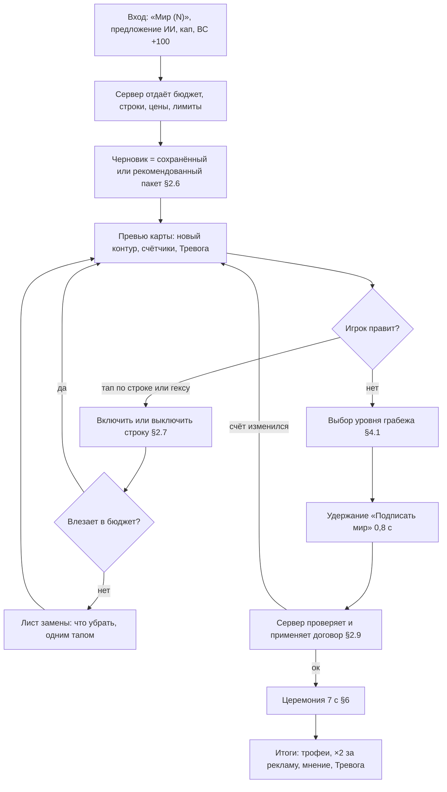
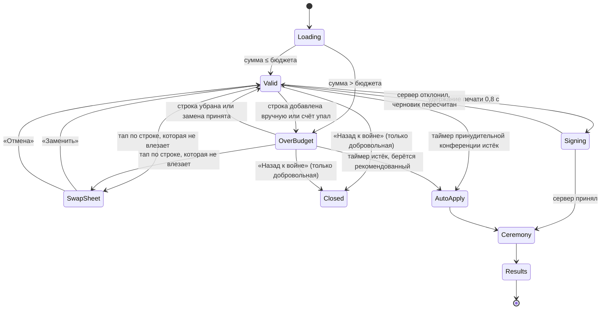
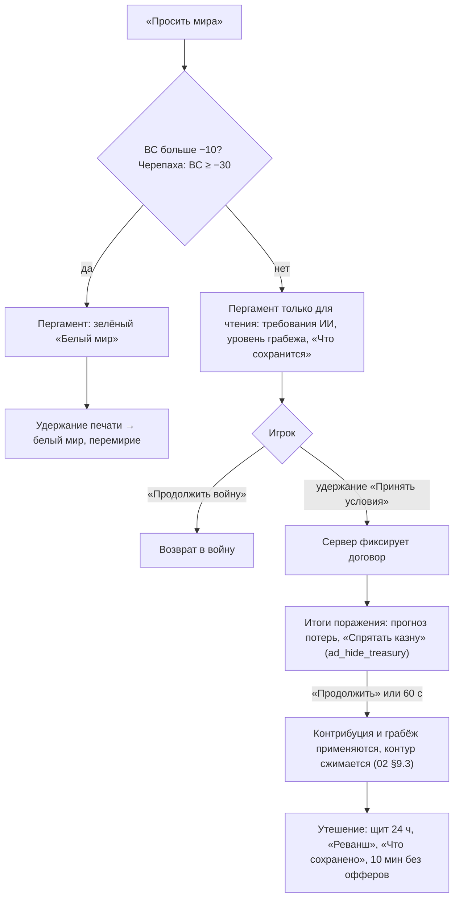
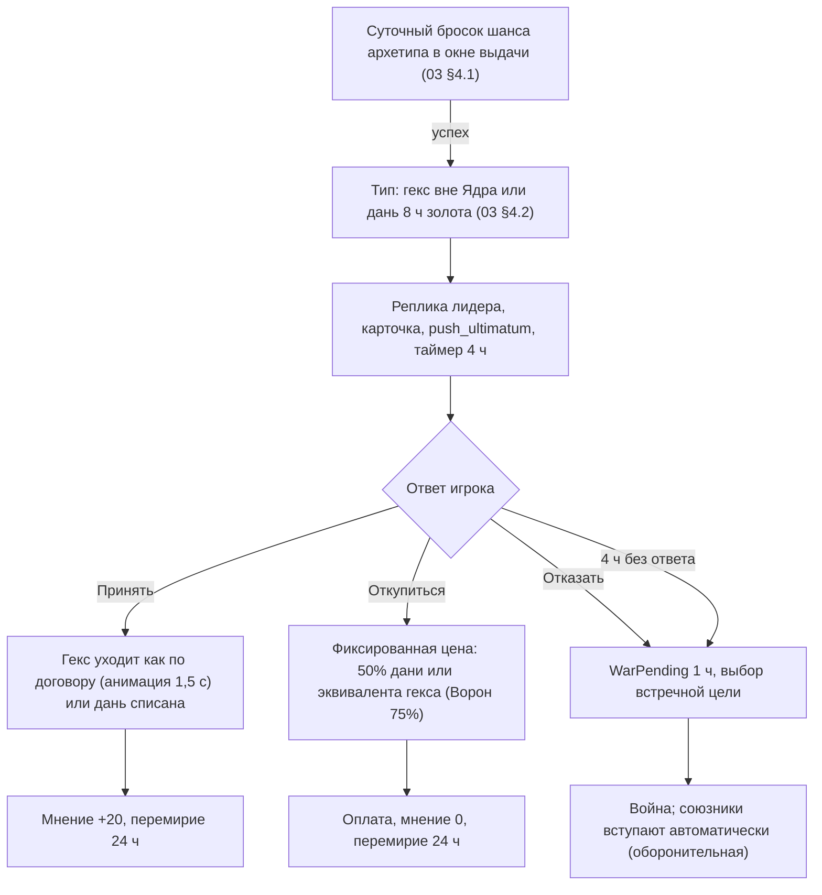
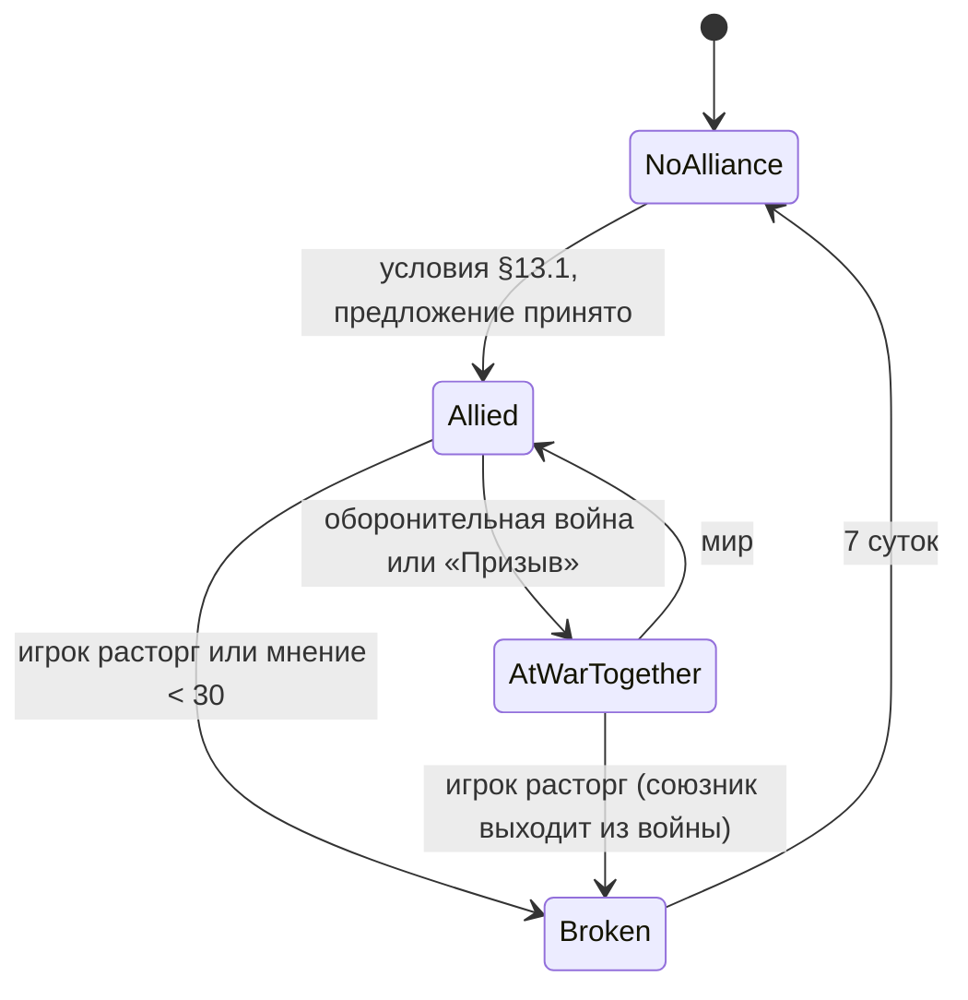
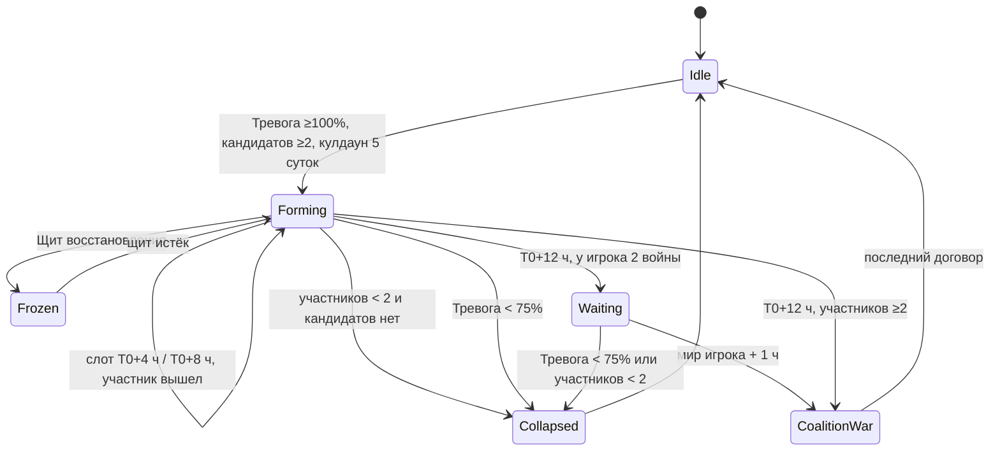

# 06. Дипломатия и мир

> **Назначение.** Исполняемая спецификация всего, что происходит между государствами вне боя. Сюда входят мирная конференция (экран «пергамент» шаг за шагом, цены и округление, алгоритм рекомендованного пакета, перестановка требований тапами, превью карты, подпись), полное меню требований, выбор уровня разграбления и его дипломатические последствия, принятие мира и инициатива ИИ, логика церемонии, перемирие и щиты, полный поток ультиматума, архетипы ИИ и их стратегический скорер, процедурные лидеры и реплики, мнение, 5 дипломатических кнопок, союзы, пакт о ненападении, угроза и коалиции, обмен территориями, войны ИИ против ИИ, дипломатия по главам, три разобранных примера и таблица краевых случаев.
> **Опирается на канон v1.2:** §2.1 (решения 8, 12, 19, 20, 21, 24), §2.2 (п. 9–13, 39), §3.3 (глоссарий мира), §4 (`gross_rate`, склад, пул), §5.1 (ценность гексов), §7 (Посольство, укрепления на отданных гексах), §9.1 (ультиматумы, лимиты войн ИИ), §9.7 (котлы), §9.12–9.16 (ВС, исходы, поражение, разграбление, перемирие, армии и казна ИИ), §10.1–10.10 целиком, §12.1 и §12.3 (главы, исследование «Дипломатия»), §13 (таймеры), §14.7, §14.8 и §14.10 (пуши, возврат, запреты), §15.2 и §15.4 (`ad_double_trophies`, `ad_hide_treasury`, трофейный сундук), §16.3 (utility-скорер в YAML, слоговые генераторы, геральдика), §20 (журнал v1.2: C1, C2, C6, C29, C45, C52, C54–C69, C79, R3, R4, R6, R10–R12).
> **Связанные файлы:** `03_war_combat.md` (ВС, исходы, механика списания при поражении, ультиматумы как вход в войну, ИИ в бою), `02_map_territory.md` (контур, анимации границы, проверки пакета обмена, `pending_reveals`), `05_economy_buildings.md` (склад, доход, апкип, ремонт, разорение как экономический эффект), `07_progression_meta.md` (главы, УР, Академия), `08_retention_liveops.md` (FTUE-миры, пуши), `09_monetization.md` (рекламные плейсменты), `10_ui_ux_art.md` (пиксели пергамента, раскадровка церемонии, VFX и звук), `11_balance_numbers.md` (армии ИИ, кривые), `12_tech_analytics_roadmap.md` (сервер, аналитика).
> **Граница зоны.** Здесь нет формулы боя, снабжения, расчёта ВС и порядка списания ресурсов при грабеже (`03`), отрисовки контура (`02`), пикселей и VFX (`10`). Числа канона цитируются как есть. Всё, чего в каноне нет, помечено «(предложение автора)» и собрано в §21.

---

## 1. Зона файла, инварианты, обозначения

### 1.1. Что здесь и что не здесь

| Здесь (06) | Не здесь |
|---|---|
| цены требований, строки пергамента, округление, рекомендованный пакет | формула ВС, пороги контроля (`03` §16) |
| выбор уровня грабежа, угроза и мнение от грабежа, уровень грабежа ИИ | что и в каком порядке списывается (`03` §18) |
| принятие мира, предложения ИИ, «Просить мира», капитуляция как дипломатия | входы в конференцию как переходы автомата войны (`03` §17.2) |
| ультиматум как дипломатический поток (карточка, реплики, последствия) | шанс ультиматума и выбор требуемого гекса (`03` §4) |
| архетипы ИИ: стратегические решения | архетипы ИИ: решения в бою (`03` §19) |
| логика и порядок событий церемонии | раскадровка, VFX, звук (`10`), анимация контура (`02` §9) |
| союзы, пакт, коалиции, обмен, войны ИИ против ИИ | альянсы игроков (кланы): `07`, фича-флаг `feature_alliances` (решение 24) |

### 1.2. Инварианты дипломатии (каждый покрыт автотестом)

| # | Инвариант | Источник |
|---|---|---|
| D1 | Ядро (столица + 6 соседей) любого государства не входит ни в договор, ни в обмен, ни в ультиматум, ни в передачу союзнику, ни в «возврат земли» | решение 19, канон §10.1 |
| D2 | Принятие мира детерминированно: сумма цен строк ≤ доступного ВС, значит ИИ подписывает. Случайности в принятии нет | канон §2.2 п. 11 |
| D3 | Разграбление очков не стоит. Потолок потерь — 12 ч `gross_rate` по каждому ресурсу за договор (в коалиционной войне — за всю войну), контрибуция и грабёж вместе. Он действует для всех (игрока и ИИ) и включён всегда: remote config меняет только величину. Защищённую долю склада не забирает ничто | решения 12, 20; канон §9.14 |
| D4 | Государство нельзя поглотить целиком. Требований «Поглощение» и «Столица» нет | решение 19 |
| D5 | Перемирие и пакт о ненападении нерушимы для обеих сторон. Таймеры перемирий, пактов, ультиматумов и щитов не ускоряются ничем | канон §9.15, §13.1 |
| D6 | Церемония мира (0–7,0 с), включая её экран наград (шаг 5, 5,5–7,0 с), — защищённое состояние: реклама, офферы, пуши и всплывающие окна заблокированы. Экран итогов мира (`ui_peace_results`, с 7,0 с) в защищённое состояние не входит: interstitial, офферов и пушей на нём нет, разрешён только rewarded `ad_double_trophies` по кнопке игрока. При очереди церемоний экран итогов с активной кнопкой «×2 трофеи» показывается после последней церемонии очереди | канон §1.1, §10.3, §14.10, §20.2 (S8); `10` §3.4 |
| D7 | Договор против игрока: не больше 20% официальной ценности, не больше 1 города, Ядро никогда. В коалиционной войне лимиты считаются на всю войну | канон §9.14, §10.8 |
| D8 | Все случайности дипломатии (броски шансов, выбор пар ИИ против ИИ, тики их войн, реплики) идут от сидированного PRNG мира игрока. Один сид и один лог действий дают один результат | канон §16.1 |
| D9 | Мнение хранится в десятых и ограничено −100…+100. Угроза хранится в десятых и не бывает ниже 0 | предложение автора |
| D10 | Контроль над гексами игрока меняется только в бою и при сдаче его котла (таймер — с первого входа игрока, канон §9.7). Абстрактные войны (союзник, ИИ против ИИ) и союзники врага гексы игрока не трогают; о каждом рейде игрок узнаёт (решение 21, канон §14.7) | решение 21, предложение автора |
| D11 | Договор не уменьшает прогресс: УР, уровни зданий, укреплений, семейств, карт, командиров и завершённые технологии. Укрепление и башня на отданном гексе возвращаются проигравшему деньгами (100% уплаченного) | решение 20, канон §7, §9.14 |

### 1.3. Обозначения и точность

| Обозначение | Смысл |
|---|---|
| ВС | военный счёт по `03` §16.2, хранится в десятых |
| D | официальная ценность врага на начало войны. В коалиционной войне — сумма ОЦ участников на начало войны; она не меняется до конца войны, в том числе после сепаратных миров (канон §10.8, `03` §16.4) |
| ОЦ | официальная ценность государства (сумма ценности официальных гексов) |
| G_ч(S) | `gross_rate` золота государства S в час (канон §4: без временных модификаторов); для контрибуции — снимок на начало войны |
| «десятые» | целые числа ×10: 24,0 очка = 240 |
| round½ | округление до ближайшего целого, половина вверх |

Все дипломатические расчёты выполняются в общем модуле `sim/diplomacy` (целые числа, без float), одинаково на клиенте и сервере. Сервер авторитетен.

---

## 2. Мирная конференция (`peace_conference`)

### 2.1. Входы и режимы

| Режим | Как открывается (`03` §17.2) | Можно закрыть? | Таймер | Кто составляет пакет |
|---|---|---|---|---|
| **Добровольная победа** | «Мир (N)» при ВС > 0; карточка предложения ИИ | да, черновик сохраняется (предложение автора) | нет | игрок, по умолчанию рекомендованный пакет |
| **Принудительная победа** | ВС = +100; кап при ВС ≥ +10 | нет | кап: 10 мин (канон). ВС +100: 10 мин после ухода игрока из приложения (предложение автора) | игрок; по истечении применяется текущий черновик, если он укладывается в ВС, иначе рекомендованный |
| **Просьба о мире** | «Просить мира» при ВС ≤ 0; карточка капитуляции | да | нет (капитуляция действует до 2 ч, `03`) | ИИ (фиксированный пакет) или белый мир |
| **Сепаратный мир** | флаг участника коалиции → «Сепаратный мир» | да | нет | игрок, бюджет — доля ВС участника (§14.6) |
| **Автоприменение** | кап, игрок офлайн | — | — | рекомендованный пакет (канон §9.13) + последний выбранный уровень грабежа (предложение автора); итог приходит пушем `push_peace_offer` (канон §14.8) |

### 2.2. Экран «пергамент»: раскладка (портрет, сверху вниз)

```
┌──────────────────────────────────────┐
│ [флаг игрока]  МИРНЫЙ ДОГОВОР  [флаг]│  шапка: портрет лидера ИИ с живой мимикой
│ Синяя держава — Речная Лига          │  и пузырём реплики (§10)
│ Контроль фронта ███████░░░ 62%       │
├──────────────────────────────────────┤
│        ПРЕВЬЮ КАРТЫ (≈38% высоты)     │  зона войны + 2 гекса, будущий контур
│   ⤢ развернуть     +4 гекса · +1 город│  чернилами, счётчики под картой
├──────────────────────────────────────┤
│ ☑ Город «Медный Двор»  (цель)   5,7  │  список строк-печатей, скролл
│ ☑ Обычные земли ×3              4,3  │  включённые сверху, доступные ниже серым
│ ☑ Контрибуция ×1 (+5 000 зол.)  5,0  │
│ ☑ Репарации 24 ч                5,0  │
│ ☐ Удобная граница «Сухой лог»   2,9  │
│ ☐ Демилитаризация               6,0  │
├──────────────────────────────────────┤
│ Очки: 20,0 / 24,0 · остаток → мнение +4 │ полоса бюджета
│ Разграбление: [Пощадить|▣30%|45%|60%]│ сегменты, под ними последствия (§4)
│ Тревога соседей 22% → 46%            │  с аннексиями пакета и грабежом
├──────────────────────────────────────┤
│ [Белый мир] [Сброс]   ◉ ПОДПИСАТЬ МИР │ зона большого пальца, удержание печати 0,8 с
└──────────────────────────────────────┘
```

Пиксели, шрифты и анимации экрана — `10`. Этот файл задаёт содержание, порядок и правила.

### 2.3. UX-поток шаг за шагом



| Шаг | Что видит игрок | Правило |
|---|---|---|
| 1. Открытие | пергамент разворачивается за 0,4 с, лидер ИИ произносит реплику открытия (§10.3) | бюджет = точный ВС в десятых («Очки: 24,0»); кнопка войны «Мир (24)» показывает его floor (`03` §16.2) |
| 2. Пакет по умолчанию | строки рекомендованного пакета уже отмечены, котлы стоят первой строкой (канон §10.1) | §2.6 |
| 3. Правки | тап по строке включает или выключает её; тап по гексу на превью делает то же для его строки | §2.7 |
| 4. Разграбление | 4 сегмента с прогнозом последствий | §4 |
| 5. Подпись | кнопка зелёная при сумме ≤ бюджета; красная с текстом «Не хватает 3,2», если больше | §2.9 |
| 6. Церемония | 7 с без рекламы, офферов и пушей (защищённое состояние D6) | §6 |
| 7. Итоги | трофеи, кнопка `ad_double_trophies` (единственная реклама экрана, только по нажатию игрока), «Мнение Лиги +4», «Тревога 22% → 46%» (гл. III, порог 50: угроза 11 + 7 за аннексии + 5 за лёгкий грабёж = 23) | §6.3 |

### 2.4. Состояния экрана



**Пока пергамент открыт** (предложение автора):
- Объявленный удар ИИ, чьё время T наступило, ждёт закрытия пергамента до 3 мин (как с наступлением, `03` §24 п. 24). Потом пергамент сворачивается с баннером «Альвария атакует!», черновик сохраняется.
- Тики союзника и войн ИИ против ИИ меняют контроль чужих гексов, а значит, связность и котлы — и ВС вместе с ними (сдача котла ВС не меняет: котёл уже считается оккупацией). Клиент получает `war.score_changed`, пересчитывает цены и бюджет и показывает тост «Счёт изменился: 24,0 → 22,6». Черновик не трогается: если он перестал влезать, экран переходит в `OverBudget`.

### 2.5. Цены и строки: формулы и округление

Цена любой гекс-строки считается целиком, от суммы ценности её гексов, и округляется до десятых **один раз на строку** (канон §10.1, C54). Так воспроизводятся все примеры канона (§9.12, §9.17) и `03` §23.

```
цена_строки (десятые) = round½( 1000 × Σ ценность(h) × множитель / D )
множитель: Аннексия 1, Котёл 1/2, Удобная граница 2, Передача союзнику 1
сумма договора (десятые) = Σ цена_строки
подписать можно ⇔ сумма договора ≤ ВС (десятые)
остаток очков → мнение побеждённого +1 за очко (в десятых один к одному)
```

**Как гексы собираются в строки** («Обычные земли ×N» — канон §10.1; остальное — предложение автора):

| Строка | Состав | Пример |
|---|---|---|
| Котёл | один котёл = одна строка, все его гексы, кроме гексов Ядра; сдавшиеся котлы этой войны — строка «Сдавшийся котёл» по той же цене ×0,5 (канон §10.1) | «Котёл: 3 гекса» 6,7 |
| Именной гекс | каждый выбранный гекс ценностью ≥2 (ферма, шахта, город, порт, нефть, завод, база, жила) отдельно | «Город „Медный Двор“» 5,7 |
| Обычные земли | все выбранные гексы ценностью 1 одной строкой «Обычные земли ×N»; в раскрытом виде видно каждый | «Обычные земли ×3» 4,3 |
| Удобная граница | каждый гекс отдельно (≤2) | «Удобная граница „Сухой лог“» 2,9 |
| Денежные и прочие | фиксированные цены канона | «Контрибуция ×2» 10,0 |

**Сверка с каноном:**

| Пример | Строки | Итог |
|---|---|---|
| §9.12 (гл. III, после роста), D = 70, ВС 24,0 | Обычные ×3: round½(3000/70 = 42,86) = 4,3 · Город: round½(4000/70 = 57,14) = 5,7 · Контрибуция 5 · Репарации 5 | 20,0, остаток 4,0 → мнение +4 |
| §9.17, D = 30, ВС 40,7 | Обычные ×2: 6,7 · Рудник: 6,7 · Котёл ценностью 4: round½(4000/60 = 66,67) = 6,7 · Удобная граница: 6,7 · 5 · 5 | 36,8 |
| `03` §23, D = 40, ВС 47,0 | 7,5 + Обычные ×4: 10,0 + Котёл 12,5 × ½ = 6,3 + Удобная граница 5,0 + 10 + 5 | 43,8 |

Разбиение на строки задаёт система, игрок его не меняет, поэтому выгоды от «дробления» нет. Погрешность — ±0,05 на строку.

### 2.6. Рекомендованный пакет: «самое ценное за доступные очки»

Принцип: **сначала земля, потом всё остальное** (столп «Синий растёт»). Алгоритм трёхфазный, детерминированный, работает на клиенте за <10 мс (бюджет ≤1 000 десятых, строк ≤60).

**Полезность строк** `u` (предложение автора, `peace_demands.yaml`):

| Строка | u | Когда предлагается автоматически |
|---|---|---|
| Котёл | 10 × Σценности + 5 | всегда, фаза A |
| Цель войны (оккупирована) | 10 × ценность + 10 | всегда |
| Именной гекс | 10 × ценность; +3 источник снабжения (порт, база); +5 Райвитовая жила; +2, если убирает выступ игрока или сокращает его границу; −6, если станет эксклавом | всегда |
| Обычные земли ×N | 10 × N, с теми же поправками для каждого гекса | всегда |
| Удобная граница | 10 × ценность + 2; +2, если убирает выступ | фаза C |
| Репарации | 14 | фаза C |
| Контрибуция | 12 / 10 / 8 за 1-й / 2-й / 3-й пакет | фаза C |
| Демилитаризация | 8 | только если у врага в 2 гексах от новой границы ≥2 укреплений ур. ≥3 |
| Продление перемирия | 6 за первые +24 ч | только если у игрока идёт вторая война или Тревога соседей ≥50% |
| Разрыв союза | 20 | только если у врага есть союз с ИИ или Тревога соседей ≥50% |
| Передача союзнику | 0 | никогда, только вручную |
| Остаток очков | 0,5 за очко | — |

```ts
// sim/diplomacy/recommend.ts
function recommend(budget: Tenths, rows: Row[]): Row[] {
  let left = budget; const pick: Row[] = [];
  // A. Котлы — первой строкой (канон §10.1): по убыванию u/цена, пока влезают
  for (const p of rows.filter(r => r.kind === 'pocket').sort(byDensityDesc))
    if (p.price <= left) { pick.push(p); left -= p.price; }
  // B. Земля: рюкзак 0/1 по десятым. «Обычные земли» — групповой предмет: выбирается N из 0..K
  const land = knapsack(rows.filter(r => r.kind === 'annex'), left,
                        { maximize: 'u', tie: ['valueDesc', 'priceAsc', 'idAsc'] });
  pick.push(...land); left -= sum(land.map(r => r.price));
  // C. Наполнители: Удобная граница (только соседняя с выбранной землёй), деньги, условные строки
  const fillers = rows.filter(r => r.kind !== 'pocket' && r.kind !== 'annex' && r.u > 0)
                      .filter(r => r.kind !== 'border_fix' || adjacentToAny(r, pick));
  const rest = knapsack(fillers, left, { maximize: 'u + 0.5 * leftover', limits: LIMITS,
                        tie: ['valueDesc', 'priceAsc', 'idAsc'] });   // при равенстве — больше земли
  return [...pick, ...rest];
}
```

Пакет **предложения мира от ИИ** и пакет **автоприменения** считаются той же функцией. «Золотой вариант» Лиса — та же функция без строк земли (§5.2). Пакет требований ИИ к игроку считается по порядку канона §9.14 (`03` §18.1), а не этой функцией.

### 2.7. Перестановка требований тапами

| Жест | Результат |
|---|---|
| Тап по включённой строке | строка выключается, очки освобождаются, остаток растёт («→ мнение +N»). Зависимые Удобные границы выключаются вместе с ней, тост «Удобная граница „Сухой лог“ снята: нет соседней аннексии» |
| Тап по выключенной строке, которая влезает | строка включается |
| Тап по выключенной строке, которая не влезает | открывается **лист замены** с предложенным набором строк к удалению |
| Тап по гексу на превью | включает или выключает строку этого гекса (для «Обычных земель» — меняет N) |
| Долгое нажатие на строку | карточка: что даёт строка, цена по формуле, ограничения, почему недоступна |
| Долгое нажатие на гекс-строку → «Передать союзнику» | строка переходит в режим `dem_transfer_to_ally` (если есть подходящий союзник, §3.10) |
| «Сброс» | черновик возвращается к рекомендованному пакету |

**Лист замены** (предложение автора). Игрок хочет добавить строку X ценой c_X, а свободно только `free`. Система ищет среди включённых строк набор S, у которого Σцена(S) ≥ c_X − free, и при этом минимальна потерянная полезность Σu(S); при равенстве берётся меньшая переплата, потом меньше строк. Сначала набор ищется только среди наполнителей (деньги, Удобная граница, прочие строки); землю система предлагает убрать, только если наполнителей не хватает. Если c_X больше всего бюджета, строка серая: «Нужно 12,0, всего 9,4».

```
Добавить: Репарации 48 ч ............ 5,0
Свободно 0,8 — уберите 4,2:
  ☑ Удобная граница «Сухой лог» ..... 5,0   (предложено)
  ☐ Контрибуция ×1 .................. 5,0
         [Отмена]        [Заменить]
```

В листе можно перещёлкнуть предложенный набор вручную. «Заменить» активна, когда отмеченного хватает.

### 2.8. Превью карты с новыми границами

| Элемент | Как выглядит (детали — `10`) | Правило |
|---|---|---|
| Будущий контур | толстый контур игрока, нарисованный будущим положением, пунктир в цвете косметики `cos_border_ink`, мягкое мерцание | пересчитывается при каждой правке (`02` §8, ≤1 мс) |
| Гексы пакета | сплошной синий | аннексия, котёл, Удобная граница (значок «+») |
| Невостребованная оккупация | остаётся штриховкой, значок стрелки «вернётся» | вернётся владельцу при подписи |
| Котёл | красный пунктир и подпись «×0,5» | канон §3.1 |
| Ядро врага | замок | не выбирается (D1) |
| Будущий эксклав | белый значок «разрыв» с подсказкой «Эксклав: снабжение только через порт» (жёлтый на карте зарезервирован за залежами, канон §3.1) | предложение автора |
| Счётчики | «+7 гексов · +1 город · Держава 45 → 55 · Карта главы 34% → 42%» (пример канона §10.3: 6 обычных + город 4 = +10 ценности; 31 → 38 гексов из 90) | «Держава» — официальная ценность до и после, а не ОТ (канон §10.3, `03` §16.1) |
| Репарации | прогноз потока по ресурсам с учётом разорения выбранного уровня грабежа | §3.6 |

Превью занимает ~38% высоты, по тапу «⤢» раскрывается на весь экран с пинч-зумом. Камера кадрирует зону войны + 2 гекса (как в церемонии).

### 2.9. Кнопка «Подписать мир» и серверная проверка

1. Кнопка зелёная, если сумма ≤ бюджета, и красная с текстом «Не хватает X», если больше. В режиме просьбы о мире она называется «Принять условия».
2. Удержание 0,8 с — это жест «Печать» из церемонии (канон §10.3). На 0,8 с клиент отправляет `POST /v1/peace/{war_id}/sign {demands[], plunder, draft_hash}` (`12`) и начинает шаг 2 церемонии оптимистично.
3. Сервер в одной транзакции проверяет: война активна; ВС не изменился в меньшую сторону ниже суммы; каждая строка допустима сейчас (гекс оккупирован, котёл существует, лимиты §3.1); лимиты D1 и D7. Потом применяет договор (§3.13).
4. Ответ не пришёл за 1,6 с — шаг 2 церемонии замирает в петле «сургуч застывает» до 5 с. Ошибка или отказ — пергамент разворачивается обратно с тостом «Счёт изменился» и пересчитанным черновиком.

---

## 3. Меню требований: полная спецификация

### 3.1. Сводная таблица

| Требование | Код | Цена (канон §10.1) | Лимит за договор | Кто может требовать |
|---|---|---|---|---|
| Аннексия оккупированного гекса | `dem_annex_hex` | 1,0 × очко | — | игрок; ИИ (порядок канона §9.14) |
| Котёл целиком | `dem_annex_pocket` | 0,5 × сумма очков | каждый котёл целиком | игрок; ИИ (котлы игрока, `03` §18.1) |
| Удобная граница | `dem_border_fix` | 2,0 × очко | ≤2 | только игрок |
| Контрибуция | `dem_contribution` | 5 за пакет | ≤3 пакета | игрок; ИИ |
| Репарации | `dem_reparations` | 5 | 1 | игрок; ИИ |
| Демилитаризация | `dem_demilitarize` | 6 | 1 | только игрок |
| Продление перемирия | `dem_truce_extend` | 4 за +24 ч | ≤ +72 ч | только игрок |
| Разрыв союза | `dem_break_alliance` | 10 | 1 | только игрок |
| Передать гекс союзнику | `dem_transfer_to_ally` | 1,0 × очко | — | только игрок |
| Белый мир | `dem_white_peace` | 0 | исключает все прочие строки | обе стороны |
| Разграбление | `plunder` | бесплатно | 1 уровень | победитель (§4) |

**Общие правила:** Ядро врага не требуется никогда (D1). Невостребованные оккупированные гексы и гексы Ядра возвращаются владельцу. При разгроме (ВС +100) лимиты строк действуют как обычно (канон §9.13, C65): «забрать всё, кроме Ядра» относится к земле.

### 3.2. Аннексия оккупированного гекса (`dem_annex_hex`)

| Поле | Правило |
|---|---|
| Доступно | официальный гекс врага, который в момент подписи под контролем игрока (эффективный контролёр по `03` §16.2), не Ядро, не под контролем союзника |
| Эффект | `owner` → игрок. Экономическая постройка сразу получает уровень типа игрока (канон §7). Укрепление и башня разбираются автоматически с возвратом проигравшему 100% уплаченного; победитель получает трофейное укрепление (башню) ур. min(ур. − 1; свой УР), разбор которого возвращает 0 (канон §7, C52). Залежь и обоз на гексе — `02` §11 |
| Угроза / мнение | угроза +ценность × М_дипл (§14.1); мнение жертвы −2 × ценность (§11) |
| Краевые случаи | оккупированный игроком гекс внутри котла врага — эффективно под врагом, строка недоступна; аннексия создаёт эксклав — разрешено, на превью значок «разрыв» и подсказка про снабжение |
| Пример | Речная Лига, D = 70: Город (4) = round½(4000/70) = 5,7 |

### 3.3. Котёл целиком (`dem_annex_pocket`)

| Поле | Правило |
|---|---|
| Доступно | котёл врага по `03` §10.4 в момент подписи. Берётся только целиком, по одному гексу нельзя |
| Сдавшийся котёл | гексы котлов, сдавшиеся в этой войне и сейчас под контролем игрока, идут строкой «Сдавшийся котёл» с тем же множителем ½ (канон §9.7, §10.1, C55): ожидание сдачи не наказывается удвоением цены |
| Состав цены | только гексы врага. Гексы Ядра врага внутри котла исключаются и возвращаются. Официальные гексы **игрока**, занятые врагом внутри котла, просто возвращаются игроку бесплатно |
| Армии врага внутри | не уничтожаются: переходят в ближайший снабжённый свой гекс (как у игрока, `03` §18.1) |
| Угроза | полная ценность гексов котла (не ×0,5) |
| Пример | §9.17: котёл из 3 гексов ценностью 4 при D = 30 — 6,7 вместо 13,3 |

### 3.4. Удобная граница (`dem_border_fix`)

| Поле | Правило |
|---|---|
| Доступно | официальный гекс врага **под его контролем**, соседний хотя бы с одним гексом из строк Аннексия или Котёл этого же договора. Не город, не столица, не Ядро. Цепочки запрещены: гекс, соседний только с другой Удобной границей, недоступен |
| Лимит | ≤2 за договор |
| Эффект | как у аннексии. Армия врага на гексе переходит в ближайший снабжённый свой гекс |
| Зависимость | при снятии последней соседней аннексии строка снимается автоматически (§2.7) |
| Пример | §9.17: обычный гекс при D = 30 — round½(2000/30) = 6,7 |

### 3.5. Контрибуция (`dem_contribution`)

| Поле | Правило |
|---|---|
| Размер пакета | 4 ч G_ч врага, снимок `gross_rate` на начало войны (канон §4): число в превью не прыгает от оккупаций и усталости |
| Выплата | сразу при подписи. ИИ-проигравший платит полностью из абстрактной казны. Игрок-проигравший платит из пула несобранного золота, затем из незащищённой части склада; защищённая доля не трогается, долга нет (канон §9.14, R12; списание — `03` §18.2) |
| Потолок | контрибуция и грабёж вместе ≤12 ч `gross_rate` по ресурсу у любого проигравшего (§4.3). Три пакета = 12 ч золота, поэтому против ИИ контрибуция всегда влезает в потолок целиком |
| Коалиция | на общем мире каждый участник платит за пакет 4 ч своего G_ч (предложение автора: так не нарушается потолок каждого участника) |
| Переполнение | что не влезло в склад получателя, сгорает (канон §4). Превью предупреждает: «Склад полон: сгорит 1 200 золота» |
| Пример | Лига производит 1 250 золота/ч: пакет = 5 000 («+5 000 золота» из концепта 2) |

### 3.6. Репарации (`dem_reparations`)

| Поле | Правило |
|---|---|
| Эффект | 10% фактического производства врага по **каждому** ресурсу (золото, еда, металл, нефть) каждый час переходит победителю. 24 ч в гл. I–II, 48 ч в гл. III+ (по главе на момент подписи; канон §10.1) |
| Расчёт | от фактического производства плательщика на каждый час: разорение и усталость поток уменьшают (`05` §17). Превью пергамента показывает поток с учётом разорения выбранного уровня грабежа, чтобы выбор «грабёж или репарации» был виден заранее |
| Зачисление | получателю-игроку — в пул несобранного дохода (канон §4, `05` §17) |
| Досрочный конец | если между сторонами начинается новая война (после перемирия) (предложение автора) |
| Потолок | в потолок 12 ч не входит: это поток, а не разовое изъятие (канон §9.14) |
| HUD | чип «Репарации · 47:12» у получателя и у плательщика; тап показывает поток по ресурсам («+140 зол./ч · +90 еды/ч…») |
| Пример | Сарен производит 1 400 / 900 / 700 / 350 в час: без разорения игрок 48 ч получает по 140 / 90 / 70 / 35 в час, всего 6 720 / 4 320 / 3 360 / 1 680. С «Лёгким 30%» (−20% на 4 ч) золота меньше на 140 × 0,2 × 4 = 112 |

### 3.7. Демилитаризация (`dem_demilitarize`)

| Поле | Правило |
|---|---|
| Зона | официальные гексы врага на расстоянии ≤2 от официальной территории игрока **после** договора |
| Эффект | 48 ч враг не строит и не улучшает там укрепления; его укрепления там 48 ч работают на 1 уровень ниже (`03` §13), не ниже 0; сам уровень не уменьшается (решение 20, канон §10.1, R3). Улучшение в процессе ставится на паузу (предложение автора) |
| Новая война в эти 48 ч | −1 действует и в бою |
| Пример | у Ордена Камня (Черепаха: укрепления на 2 уровня выше нормы, на фронте УР − 2 + 2 = 4, канон §9.16; УР ИИ 4) у новой границы 3 укрепления ур. 4: 48 ч они работают как ур. 3, рекомендованный пакет предлагает строку автоматически |

### 3.8. Продление перемирия (`dem_truce_extend`)

Шаговый переключатель «+24 ч / +48 ч / +72 ч» за 4 / 8 / 12 очков. Продлевает перемирие этого договора (§7). Связывает обе стороны: никто не объявляет войну, ИИ не шлёт ультиматумы. Полезно, когда у игрока вторая война или высокая Тревога и тыл нужен спокойным.

### 3.9. Разрыв союза (`dem_break_alliance`)

| Поле | Правило |
|---|---|
| Эффект | враг выходит из своего союза с другим ИИ (§13.6) и 14 суток не заключает новый с тем же ИИ; 7 суток враг не вступает в коалиции против игрока (канон §10.1, C59) |
| Видна строка | если у врага есть союз с ИИ или Тревога соседей ≥50% |
| В коалиционной войне | сепаратный мир и так выводит участника из войны; строка добавляет 7-дневный запрет на следующую коалицию |

### 3.10. Передать гекс союзнику (`dem_transfer_to_ally`)

| Поле | Правило |
|---|---|
| Доступно | гекс из строк Аннексия (не котёл, не Удобная граница); союзник участвует в этой войне или граничит с гексом после договора (предложение автора) |
| Эффект | `owner` → союзник; мнение союзника +20 **за договор**, модификатор `op_land_gift` (канон §10.1, C60) |
| Угроза | 0,5 × ценность (канон §10.1) |
| Мнение жертвы | −2 × ценность, как при аннексии |
| Краевой случай | союз разорван, пока пергамент открыт: строка становится недопустимой, гекс возвращается в Аннексию |
| Анти-эксплойт | переданный гекс 7 суток не участвует в обмене с игроком: иначе передача (угроза ×0,5) и обратный обмен (угроза 0) «отмывали» бы угрозу аннексии (предложение автора) |

### 3.11. Белый мир (`dem_white_peace`)

| Поле | Правило |
|---|---|
| Эффект | все оккупации возвращаются, грабежа нет, трофейного сундука нет, «Реванша» нет; перемирие по главе |
| Мнение | память о войне −25 вместо −50 (канон §10.5) |
| Когда ИИ согласен | ВС > −10: при \|ВС\| < 10 всегда (канон §10.2), при ВС ≥ +10 цена 0 ≤ ВС; Черепаха — при ВС ≥ −30 (канон §10.4, §5.5) |
| Кнопка | всегда видна на пергаменте; недоступная серая: «Бароны не согласятся: нужно ВС больше −10» |

### 3.12. Разграбление (`plunder`)

Выбор уровня, последствия и уровень ИИ — §4. Механика списания — `03` §18.

### 3.13. Порядок применения договора (сервер, одна транзакция)

| # | Шаг | Детали |
|---|---|---|
| 1 | Проверка | §2.9 |
| 2 | Территория | аннексии, котлы, Удобные границы, передачи союзнику; гексы, оккупированные союзником, — ему (§13.4); Ядро и невостребованное — владельцу. Укрепления и башни на отданных гексах — авторазбор со 100% возвратом проигравшему, победителю — трофейные (канон §7) |
| 3 | Армии | все армии на сменивших владельца гексах — в ближайший снабжённый свой гекс |
| 4 | Деньги | контрибуция сразу (списание и потолок — `03` §18.2); репарации — таймер в очередь событий |
| 5 | Разграбление | функция `03` §18 с остатком потолка (§4.3) |
| 6 | Прочее | демилитаризация, перемирие с продлением, разрыв союза |
| 7 | Трофейный сундук | по ВС на момент подписи: до 29 — бронза, 30–59 — серебро, ≥60 — золото (канон §15.4, R10); «Триумф» — золото (§14.7) |
| 8 | Мнение и угроза | жертва, союзники, все остальные через Тревогу |
| 9 | Закрытие войны | цвет врага сразу → геральдический (канон §3.1, C66); снимок границы для Таймлапса (`02`) |
| 10 | Отложенные проверки | порог коалиции проверяется **после** закрытия экрана итогов и всей очереди церемоний (предложение автора), чтобы объявление не врезалось в защищённые состояния |

---

## 4. Разграбление: выбор уровня и дипломатические последствия

### 4.1. Экран выбора (блок пергамента)

4 сегмента: **Пощадить · Лёгкое 30% · Среднее 45% · Тяжёлое 60%**. По умолчанию выбран последний уровень, который игрок выбирал сам (в FTUE он выбирает на Мире 2, канон §14.3) (предложение автора). Под сегментами — прогноз для выбранного уровня. Пример: Сарен (Лис, казна 10 ч, защищено 25%: на виду 7,5 ч производства 1 400 / 900 / 700 / 350 в час), контрибуции в пакете нет:

```
Лёгкое 30%
Добыча: 3 150 зол. · 2 025 еды · 1 575 мет. · 787 нефти · 1 чертёж
Сарен: разорение −20% на 4 ч · 1 здание повреждено
Угроза +5 (грабёж) → Тревога соседей 46% → 56%  ⚠ соседи насторожатся
Мнение Сарена −10
```

У ИИ нет исследований, поэтому технологическая часть грабежа против ИИ — только чертежи победителю (`03` §18.4).

| Предупреждение | Когда |
|---|---|
| оранжевое «Соседи насторожатся» | Тревога после договора пересекает 50% |
| красное «Коалиция! Тревога достигнет 100%» | Тревога после договора ≥100% (с учётом аннексий пакета) |
| «Склад полон: сгорит N» | добыча больше свободного места |
| «Чертежи: сгорит N» | больше 5 `item_trophy_blueprint` |
| «Потолок: золото урезано» | контрибуция и грабёж вместе упёрлись в потолок 12 ч (§4.3) |
| «Разорение уменьшит репарации на N» | в пакете есть репарации и выбран грабёж (§3.6) |

Лицо лидера ИИ в шапке меняется с уровнем: спокойное → встревоженное → злое (`10`). Реплика на выбор — §10.3.

### 4.2. Последствия по уровням

| Уровень | Ресурсы | Угроза победителя | Мнение жертвы (`op_plundered`) | Распад мнения (база) | Прочее (канон §9.14) |
|---|---|---|---|---|---|
| Пощадить | 0% | +0 | +20 (`op_spared`) | 0,2/ч | засчитывается в задание главы «Подпиши мир без грабежа» |
| Лёгкое | 30% | +5 | −10 | 0,15/ч | разорение −20% на 4 ч, 1 здание, +1 чертёж победителю / −5% текущего исследования проигравшего-игрока |
| Среднее | 45% | +10 | −20 | 0,15/ч | −30% на 6 ч, 2 здания, 2 / −8% |
| Тяжёлое | 60% | +15 | −30 | 0,15/ч | −40% на 8 ч, 3 здания, 3 / −12% |

Угроза умножается на М_дипл (§14.1) и видна всем соседям через Тревогу. Распад умножается на «память» архетипа (§11.3): Черепаха помнит грабёж вдвое дольше, Волк — на треть короче.

### 4.3. Потолок потерь за договор

Решение 20 и канон §9.14 (C45, R12): потолок общий для контрибуции и грабежа, одинаковый для игрока и ИИ, включён всегда. Списание по шагам — `03` §18.2:

```
для каждого ресурса r у ЛЮБОГО проигравшего:
  потолок_r = 12 × gross_rate_r проигравшего        // remote config меняет только число 12
  1) контрибуция (только золото) списывается первой
  2) грабёж_r = min(грабёж_r по 03 §18.2; потолок_r − контрибуция_r)
  защищённая доля склада не участвует ни в 1), ни в 2)
репарации в потолок не входят; в коалиционной войне потолок — один на всю войну
```

Пример: три пакета контрибуции (12 ч золота ИИ) обнуляют грабёж золота, но не еды, металла и нефти. Превью показывает это заранее, и игрок может поменять пакет контрибуции на землю.

### 4.4. Как ИИ выбирает уровень

ИИ при победе грабит всегда (канон §9.14). Уровень задаёт архетип, выбор детерминированный:

| Архетип | Волк | Лис | Черепаха | Ворон | Сова |
|---|---|---|---|---|---|
| База | 60% | 30% | 30% | 45% | 30% |
| Гегемон (+15 п.п., не выше 60%; канон §10.4) | 60% (Альвария) | 45% | 45% (Стальной Конклав) | 60% | 45% |

| Уточнение | Правило |
|---|---|
| Серия поражений | со 2-го поражения игрока подряд уровень ИИ на ступень ниже, но не ниже 30% (канон §9.14, C68). Серию прерывает победа или белый мир игрока (предложение автора) |
| Коалиция | один грабёж на весь договор по уровню лидера (предложение автора, §14.8) |
| ИИ против ИИ | грабёж абстрактный: проигравший ослаблен (Сила ×0,8 на 24 ч, §16.4) |
| Реплика | одна строка архетипа на экране итогов поражения (§10.3) |

---

## 5. Принятие мира и инициатива ИИ

### 5.1. Детерминированное принятие

Если сумма строк ≤ доступного ВС, ИИ подписывает **всегда** (D2). Характер ИИ на принятие не влияет: он влияет на то, **когда ИИ сам предлагает мир**, на грабёж, белый мир и сепаратный мир.

### 5.2. ИИ предлагает мир

| Архетип | Предлагает, если (канон §9.13, §10.4; пороги в ВС — `03` §16.2) |
|---|---|
| Волк | ВС ≥ +50 (контроль ≥75%) или война дольше 36 ч при перевесе игрока |
| Лис | ВС ≥ +20 (контроль ≥60%) или война дольше 24 ч при перевесе игрока; к карточке добавляется «Золотой вариант» |
| Черепаха, Ворон, Сова | ВС ≥ +30 (контроль ≥65%) или война дольше 24 ч при перевесе игрока |

- «Перевес игрока» = ВС ≥ +10 (канон §9.13, C61).
- Карточка: портрет, реплика (§10.3), сводка рекомендованного пакета на **текущий** ВС («Медный Двор, 3 гекса и 5 000 золота ваши»), кнопки «Открыть договор» (пергамент с этим пакетом; можно подписать сразу) и «Позже». Действует 2 ч, `push_peace_offer` (срочный). Если предложение возникло в тихие часы, пуш уходит в их конец, а 2 ч считаются от доставки (канон §14.7). Пакет пересчитывается при открытии.
- **«Золотой вариант» Лиса** (канон §10.4) — вторая вкладка карточки: пакет без земли, до 3 пакетов контрибуции и репарации на текущий ВС (не больше 20 очков), остаток — в мнение. Аннексий нет, значит нет и угрозы за землю. Цены строк те же. При ВС < 5 вкладка скрыта: ни одна строка не влезает.
- Новое предложение — не раньше чем через 2 ч после сгорания прежнего (`03` §17.2).

### 5.3. Требование капитуляции

При ВС ≤ −20 (контроль ≤40%) ИИ присылает карточку со своими требованиями: пакет по порядку канона §9.14 на бюджет |ВС|, уровень грабежа архетипа и экран «Что сохранится» (защищённая доля, потолок 12 ч, «Армии не уничтожаются», «УР, уровни построек и исследования не теряются» — решение 20). Кнопки: «Принять» (поражение сейчас, без дальнейших потерь) и «Продолжить войну». Срок и повтор — `03` §17.2. Пуша нет (предложение автора: требование не срочное, игрок увидит его при входе).

### 5.4. «Просить мира» (ВС ≤ 0)



Требования ИИ не редактируются: они детерминированы, и игрок видит, что от него хотят. Окно `ad_hide_treasury` стоит между фиксацией договора и списанием контрибуции и грабежа; +15 п.п. защищённой доли действуют на все потери этого договора (канон §15.2, R12). Если игрок закрыл приложение на этом шаге, контрибуция и грабёж применяются через 60 с без бонуса (предложение автора).

### 5.5. Белый мир по архетипам

| Архетип | Принимает белый мир |
|---|---|
| Волк, Лис, Ворон, Сова | ВС > −10 (канон §10.2) |
| Черепаха | ВС ≥ −30 (канон §10.2, §10.4, C61) |
| Гегемон | как базовый архетип |

### 5.6. Кап войны, отсутствие игрока и разгром

Строки проверяются сверху вниз; отсутствие игрока проверяется первым.

| Ситуация | Что происходит |
|---|---|
| Игрок не заходил 72 ч (кап ещё не истёк) | белый мир сразу, «Регент» (канон §9.11, §14.8) |
| Кап, игрок не заходил последние 24 ч | белый мир при любом ВС (канон §9.11, §9.13) |
| Кап, ВС ≥ +10, игрок онлайн | принудительная конференция на 10 мин, потом текущий черновик или рекомендованный пакет |
| Кап, ВС ≥ +10, игрок офлайн | рекомендованный пакет + последний выбранный уровень грабежа; пуш `push_peace_offer` с итогом, церемония ждёт входа (§6.2, канон §14.8) |
| Кап, \|ВС\| < 10 | белый мир без конференции (канон §9.13) |
| Кап, ВС ≤ −10 | поражение по требованиям ИИ (`03` §18) |
| ВС +100 | принудительная конференция сразу после боя |

---

## 6. Церемония подписания: логика и последовательность

Раскадровка, VFX, звук и тайминги кадров — `10` (канон §10.3: 7 с, печать 0,8 с, чернила ~0,25 с на кольцо, счётчики, награды). Анимация контура — `02` §9.2. Здесь — какие события и в каком порядке.

### 6.1. Последовательность

```mermaid
sequenceDiagram
    participant P as Игрок
    participant C as Клиент
    participant S as Сервер
    P->>C: удержание «Печати» 0,8 с
    C->>S: POST /v1/peace/{war_id}/sign {demands[], plunder, draft_hash}
    C->>C: шаг 2: пергамент сворачивается, камера отъезжает (0,8–1,6 с)
    S->>S: проверка и применение договора одной транзакцией (§3.13)
    S-->>C: treaty_result {гексы по строкам, возвраты, деньги, добыча, сундук, мнение, угроза}
    C->>C: шаг 3: поле чернил, «поп» гексов, перестройка в УР игрока (1,6–4,0 с)
    C->>C: шаг 4: счётчики «+7 гексов · +1 город · Держава 45 → 55» (4,0–5,5 с)
    C->>C: шаг 5: награды влетают в HUD (5,5–7,0 с), кнопки видны, но неактивны
    C->>P: 7,0 с: кнопки активны; экран итогов: «×2 трофеи», мнение, Тревога, реплики соседей
    C->>S: итоги закрыты → отложенные проверки (коалиция, предложения союза)
```

- Ответ сервера не пришёл к 1,6 с: шаг 2 держится в петле до 5 с, затем откат (§2.9).
- Все клиентские события церемонии (`treaty.signed`, `border.morph.start`, `hex.pop` × N, `counters.show`, `rewards.fly`, `results.open`) идут по одной шине и логируются для аналитики (`12`).
- Защищённое состояние D6 действует на шагах 1–5 (0–7,0 с), включая экран наград церемонии (шаг 5, 5,5–7,0 с): никакой рекламы, офферов, пушей и всплывающих окон (канон §14.10). Кнопки «×2 трофеи (реклама)» и «Продолжить» на шаге 5 видны, но активны только с 7,0 с (канон §10.3).
- Экран итогов мира (`ui_peace_results`, с 7,0 с) в защищённое состояние не входит, но на нём нет interstitial, офферов и пушей: единственная реклама — rewarded `ad_double_trophies`, и запускается она только нажатием кнопки игроком (канон §10.3, §14.10; `10` §3.4). Пуши, пришедшие за время церемонии и экрана итогов, откладываются до закрытия итогов. Офферы — не раньше следующей сессии (`01` §1.6.6).
- Очередь церемоний: мир → повышение УР → «Мир расширяется», одна за другой, без рекламы и офферов между ними (канон §12.1). Если за миром в очереди идут другие церемонии, трофеи мира зачисляются сразу, а экран итогов мира с активной кнопкой «×2 трофеи» показывается после последней церемонии очереди; кнопка удваивает уже зачисленное (канон §10.3, §12.1; `01` В12). Отложенная проверка коалиции (§3.13, шаг 10) ждёт закрытия этого экрана итогов.

### 6.2. Варианты

| Вариант | Отличия |
|---|---|
| Победа | полный сценарий; город — «ключи от города»; салют над столицей игрока в каждой победной церемонии, усиленный (5 залпов) при аннексии цели войны и Разгроме (канон §10.3) |
| Победа с «Триумфом» | на шаге 4 плашка «ТРИУМФ», усиленный салют, золотой сундук (§14.7) |
| Передача союзнику | гексы союзника заливаются его цветом на том же поле чернил, над ними значок рукопожатия |
| Белый мир | шаг 3 — только растворение штриховки (0,4 с, `02`), счётчики «Граница сохранена» |
| Поражение | печать ставит игрок («Принять условия»), контур игрока сжимается за 2,0 с (`02` §9.3), приглушённая палитра, без фанфар; вместо наград — «Что сохранено» |
| Сепаратный мир | как победа, но камера кадрирует только землю участника; война с остальными продолжается, кнопка «Мир (N)» пересчитана |
| Договор применён офлайн | церемония встаёт в очередь `pending_reveals` и проигрывается на экране «Пока вас не было» (`02` §9.6, `08`) |
| Повтор | после первого раза церемонию можно ускорить ×3; режим «Меньше анимации» (канон §10.3) |

### 6.3. Экран итогов

| Блок | Содержимое |
|---|---|
| Территория | «+7 гексов · +1 город», миниатюра нового контура |
| Трофеи | контрибуция и добыча грабежа по ресурсам, чертежи, сундук. `ad_double_trophies` удваивает контрибуцию и добычу грабежа, но не территорию и не репарации (канон §15.2, C51) и не сундук; 4 в день; удвоенная часть — новые ресурсы, проигравший больше не теряет (`03` §18.2); что не влезло в склад, сгорает |
| Дипломатия | «Мнение Лиги +4 (остаток очков)», «Тревога соседей 22% → 46%», реплика жертвы, до 2 реплик соседей («Серая Стая следит за вами») |
| Кнопки | «×2 трофеи (реклама)», «Продолжить» — активны с 7,0 с церемонии. Экран итогов в защищённое состояние не входит (D6): реклама на нём только rewarded `ad_double_trophies` по нажатию игрока, interstitial, офферов и пушей нет. При очереди церемоний экран итогов с активной кнопкой показывается после последней церемонии очереди (§6.1) |

---

## 7. Перемирие, пакт и щиты

| Статус | Код | Длительность | На кого | Что запрещает |
|---|---|---|---|---|
| Перемирие | `truce` | 30 мин / 8 ч / 24 ч (гл. I / II / III+) + до 72 ч (`dem_truce_extend`); после принятого ультиматума и откупа — 24 ч | пара сторон | войну и ультиматумы в паре |
| Пакт о ненападении | `non_aggression_pact` | 48 ч | пара игрок — ИИ | войну, ультиматумы, участие этого ИИ в коалиции против игрока |
| Щит восстановления | `recovery_shield` | 24 ч | игрок | объявления войны ИИ, ультиматумы, формирование коалиции (идущее замораживается, канон §9.15) |
| Тихие часы | `quiet_hours` | 8 ч в сутки | игрок | атаки, ультиматумы, пуши; ультиматум выдаётся только с конца тихих часов до их начала − 5 ч (канон §9.1) |
| Отсутствие >24 ч | — | до входа | игрок | новые войны и коалиции |
| Серия поражений | `defeat_streak_relief` (предложение автора, код) | 48 ч после 2-го поражения подряд | игрок | агрессия ИИ −30% (канон §9.14); грабёж ИИ на ступень ниже действует с 2-го поражения подряд, пока серия не прервётся (§4.4) |
| Возвращение 30+ дней | `return_grace` (предложение автора, код) | 3 дня | игрок | агрессия ИИ = 0 (канон §14.8) |
| Новое государство | — | 12 ч после «Мир расширяется» | новые ИИ главы | ультиматумы игроку (канон §12.1); объявить им войну игрок может |
| Перемирие ИИ–ИИ | `ai_truce` (предложение автора) | 24 ч; новая война той же пары — не раньше чем через 5 суток после мира | пара ИИ | войну в паре |

**Правила:**
- Нарушить перемирие и пакт не может никто, включая игрока (D5). Кнопка «Объявить войну» серая: «Перемирие: 5:42:10».
- Таймер перемирия висит на флаге государства (канон §9.15), пакта — значок свитка с таймером.
- Щит снимается, если игрок сам объявляет войну (канон §9.15). Щит не мешает игроку заключать союзы, обмены и пакты.
- Перемирие считается по главе на момент подписи (`03` §2.4).
- Несколько статусов складываются, побеждает самый запрещающий.

---

## 8. Ультиматумы: полный поток

Шанс, условие «сильнее», запреты (в том числе 12 ч без ультиматумов от новых государств главы, канон §12.1), окно выдачи (с конца тихих часов до их начала − 5 ч, по умолчанию 07:00–18:00; канон §9.1, C1) и выбор требуемого гекса — `03` §4.1–4.2. Боевое продолжение — `03` §4.4. Здесь — дипломатический поток целиком.



**Карточка ультиматума** (сверху вниз; пример — Сарен, Лис): портрет и реплика лидера; требование («Рыбный порт» с подсветкой на мини-карте, или «Дань: 14 400 золота» = 8 ч × 1 800); таймер 3:59:12; сравнение сил «Ваши армии 1 400 · Сарен 1 650»; строка союзника («Орден Камня вступит в войну на вашей стороне»); три кнопки с последствиями мелким шрифтом. У Волка кнопок две: «Откупиться» нет.

| Кнопка | Подпись под кнопкой | Правило |
|---|---|---|
| Принять | «Мнение +20 · перемирие 24 ч» | гекс переходит как по договору (`03` §4.3): укрепление на нём возвращается игроку деньгами (100%, канон §7); при нехватке золота на дань кнопка серая с «Собрать всё» |
| Откупиться | «7 200 золота · перемирие 24 ч» (пример для дани 14 400) | одна кнопка с фиксированной ценой, без ползунка: 50% дани или золотого эквивалента гекса (max(8; 4 × ценность) ч золота), у Ворона 75%; у Волка кнопки нет (канон §9.1, R11). Цена фиксируется при выдаче (`03` §4.2) |
| Отказать | «Война через 1 ч» | удержание 0,8 с; дальше `03` §4.4 |

**Дипломатия во время 4 ч** (предложение автора):
- Подарок тому, кто выдвинул ультиматум, разрешён, но ультиматум не отменяет (решения уже приняты, а мнение влияет на следующие).
- Пакт о ненападении с ним недоступен: «Сначала ответьте на ультиматум» (иначе пакт был бы дешёвым откупом без порога).
- Участник формирующейся коалиции ультиматумов не выдвигает.
- Гегемон всегда требует дань (`03` §4.2).
- Принятый ультиматум не меняет угрозу игрока и не даёт «Реванш».

---

## 9. Архетипы ИИ (`ai_archetype`)

### 9.1. Профили

Строки с пометкой «канон» взяты из §9.1, §9.11, §9.13, §9.16, §10.4; «03» и «11» — из `03_war_combat.md` и `11_balance_numbers.md`; остальное — предложения автора.

| Параметр | Волк `ai_wolf` | Лис `ai_fox` | Черепаха `ai_turtle` | Ворон `ai_raven` | Сова `ai_owl` |
|---|---|---|---|---|---|
| Война против игрока, шанс в сутки (канон) | 35%, если сильнее | 10%, если сильнее | 5%, если сильнее | 25%, если игрок уже воюет | 10%, если сильнее |
| Ультиматум «гекс / дань» (03) | 80 / 20 | 30 / 70 | 20 / 80 | 60 / 40 | 40 / 60 |
| Откуп, фиксированная доля дани или эквивалента гекса (канон) | кнопки нет | 50% | 50% | 75% | 50% |
| Сам предлагает мир (канон; «перевес» = ВС ≥ +10) | ВС ≥ +50 или >36 ч при перевесе | ВС ≥ +20 или >24 ч при перевесе; «Золотой вариант» | ВС ≥ +30 или >24 ч при перевесе | ВС ≥ +30 или >24 ч при перевесе | ВС ≥ +30 или >24 ч при перевесе |
| Белый мир (канон) | ВС > −10 | ВС > −10 | ВС ≥ −30 | ВС > −10 | ВС > −10 |
| Грабёж (канон) | 60% | 30% | 30% | 45% | 30% |
| Контратака после наступления (канон) | 3–4 ч | 4–6 ч | 4–6 ч | 3–5 ч | 4–6 ч |
| Армии и укрепления (канон §9.16) | +1 армия; укреплены 15% пограничных гексов, уровень −1 | норма: армии как у игрока того же УР, укреплены 25% | −1 армия; 40%, уровень +2; мало атакует | норма | норма |
| Казна, ч производства; защищено 25% (канон ~8 ч; числа — `05` §19.1, `11` §17.2) | 6 | 10 («богатый», жирная добыча) | 8 | 8 | 8 |
| Рвение в коалицию `w_join` | 1,0 | 0,5 | 0,3 | 2,0 (первым вступает, канон) | 1,5 (собирает, канон) |
| Сам предлагает сепаратный мир при доле ВС ≥ | 30 | 15 | 20 | 10 | 25 |
| Предлагает союз игроку, шанс в сутки | 5% | 10% | 10% | 5% | 20% («шанс союза ×2», канон) |
| Принимает пакт при мнении ≥ | 0 | −25 | −50 | −25 | −25 |
| Предлагает обмены | никогда | раз в 48 ч (канон: «предлагает обмены») | раз в 7 суток | никогда | раз в 7 суток |
| Субсидия врагу игрока, шанс в сутки (§9.4, S7) | 0% | 20% | 10% | 10% | 30% |
| Порог войны ИИ против ИИ θ_war | 0,9 | 1,2 | 1,6 | 1,0 | 1,3 |
| Память (множитель **распада** мнения) | ×1,5 | ×1,25 | ×0,5 | ×1,0 | ×0,75 |
| Базовое мнение `op_base` | −10 | +5 | 0 | −5 | +10 |
| Тон реплик | прямой, угрожающий, уважает силу | вкрадчивый, торговый | неторопливый, оборонительный | язвительный, выжидающий | рассудительный, дипломатичный |

### 9.2. Поведение по архетипам

- **Волк.** Чаще всех выдвигает ультиматумы и почти всегда требует гекс. Откуп не принимает. Бьёт по выступам (`03` §19.3). Мир предлагает только при разгроме или очень долгой войне. Грабит по максимуму, но сам держит тощую казну (6 ч). Союз с игроком заключает, только если игрок не слабее его по армиям. Быстро забывает и обиды, и подарки.
- **Лис.** Воюет редко, богатый: казна 10 ч — жирная добыча. Требует дань, берёт откуп. Мирится раньше всех (контроль игрока ≥60%) и предлагает «Золотой вариант» без земли. Раз в 48 ч ищет выгодный обоим обмен. Первым гонит обозы к залежам (`05`). Охотно субсидирует врагов сильного игрока.
- **Черепаха.** Почти не нападает, укрепления на 2 уровня выше нормы. Соглашается на белый мир, даже выигрывая (до ВС −30). Неохотно вступает в коалиции. Помнит всё вдвое дольше. Лёгкий партнёр для пакта.
- **Ворон.** Нападает на тех, кто уже воюет: шанс 25% проверяется только тогда. Первым вступает в коалицию и первым из неё выходит (сепаратный мир при доле ВС ≥10). В войнах ИИ против ИИ выбирает ослабленных (`f_weak` ×1,2).
- **Сова.** Дипломат: вдвое чаще предлагает союз, ведёт коалицию при отсутствии гегемона, чаще всех субсидирует врагов игрока при высокой Тревоге. Хороший первый союзник: базовое мнение +10.

### 9.3. Гегемон (`ai_hegemon`)

Модификатор поверх архетипа, «босс главы»: Альвария (Волк, гл. III), Стальной Конклав (Черепаха, гл. IV); в гл. V–VI — один процедурный гегемон на главу (предложение автора).

| Эффект | Значение |
|---|---|
| Армии | +20%; лишней армии архетипа нет (канон §9.16); энергия ×1,1 в гл. III+ (канон §9.1) |
| Войны против игрока | +10 п.п. к шансу архетипа (канон) |
| Грабёж | +15 п.п., не выше 60% (канон) |
| Ультиматумы | всегда дань (канон «требует дань», `03` §4.2) |
| Коалиции | если гегемон среди кандидатов, он лидер (канон «ведёт коалиции») |
| Союз с игроком | никогда; пакт — только при мнении ≥0 (предложение автора) |
| Базовое мнение | ещё −10 (предложение автора) |
| Порог войны ИИ против ИИ | θ_war − 0,2 (предложение автора) |
| Значок | корона над флагом |

### 9.4. Стратегический скорер

Стратегические решения ИИ (не боевые: те — `03` §19) принимает utility-скорер с весами архетипа в `ai_archetypes.yaml` (канон §16.3). Запуск: тик мира раз в 6 ч (канон §10.10), суточные броски в сидированную минуту (`03` §4.1) и события (подписан мир, изменилась угроза, игрок вошёл в игру).

| # | Решение | Правило |
|---|---|---|
| S1 | Ультиматум игроку | `03` §4.1–4.2 |
| S2 | Предложить мир | пороги §5.2 |
| S3 | Предложить союз игроку | раз в сутки бросок шанса архетипа, если выполнены условия союза (§13.1) |
| S4 | Предложить обмен | по частоте архетипа: лучший пакет ≤2 гекса на сторону, где оценка ИИ (§15.2) не в минусе, а у игрока сокращается граница на ≥2 ребра или исчезает выступ либо эксклав |
| S5 | Вступить в коалицию и порядок вступления | `E = w_join + max(0; −мнение)/25 + 1 × [прямая граница с игроком]`; кандидаты по убыванию E (§14.3) |
| S6 | Начать войну с другим ИИ | `U_war` ≥ θ_war (ниже) |
| S7 | Субсидировать врага игрока | раз в сутки бросок шанса архетипа (предложение автора), если игрок воюет с X, Тревога ≥50%, мнение ИИ к игроку ≤ −25, ИИ сам не воюет и X не получал субсидию последние 24 ч: армии X +10% на 12 ч (канон §10.8, C67). Видно на экране войны («Субсидия Лиги: +10% до 21:00») и в ленте «Речная Лига поддержала Баронов золотом» |
| S8 | Предложить сепаратный мир | доля ВС участника (§14.6) ≥ порога архетипа; лидер коалиции сепаратный мир не предлагает |
| S9 | Принять пакт, союз, обмен, подарок | детерминированные правила §12–§15 |

**Выбор войны ИИ против ИИ (S6):**

```
U_war(A→B) = Σ w_k(архетип A) × f_k
f_str        = clamp(S_A / S_B − 1; −1; 1)        // S — абстрактная сила, §16.3
f_val        = min(1; Σ ценности 3 лучших гексов B у границы с A / 15)
f_rel        = clamp(−rel(A,B) / 100; 0; 1)      // отношения ИИ–ИИ, §16.2
f_weak       = 1, если B воюет; 0,5, если B проиграл войну за последние 24 ч; иначе 0
f_revenge    = 1, если B забрал гексы A за последние 7 суток
f_player_ally = 1, если B — союзник игрока
```

| Признак | Волк | Лис | Черепаха | Ворон | Сова |
|---|---|---|---|---|---|
| `f_str` | 1,0 | 0,6 | 0,4 | 0,8 | 0,6 |
| `f_val` | 0,8 | 1,2 | 0,3 | 0,6 | 0,6 |
| `f_rel` | 0,6 | 0,4 | 0,6 | 0,6 | 0,8 |
| `f_weak` | 0,4 | 0,3 | 0,1 | 1,2 | 0,4 |
| `f_revenge` | 0,6 | 0,3 | 0,8 | 0,6 | 0,5 |
| `f_player_ally` | −0,5 | −0,8 | −0,8 | −0,4 | −0,6 |
| θ_war | 0,9 | 1,2 | 1,6 | 1,0 | 1,3 |

### 9.5. Конфиг

```yaml
# content/ai_archetypes.yaml — дипломатическая часть; author: true — предложение автора
ai_wolf:
  war_chance_daily: 0.35            # канон §10.4
  ultimatum_mix: { hex: 0.8, tribute: 0.2 }   # 03 §4.2
  buyout_share: null                # канон §9.1: кнопки «Откупиться» нет
  peace_offer: { ws_min: 50, hours_min: 36, ws_advantage: 10 }   # канон §9.13, §10.4
  white_peace_ws_min: -9.9
  plunder: 60
  treasury_hours: 6                 # 05 §19.1, 11 §17.2; норма канона ~8 ч
  coalition_w_join: 1.0             # author
  separate_peace_share_min: 30      # author
  alliance_offer_daily: 0.05        # author
  alliance_requires_player_stronger: true   # author
  nap_opinion_min: 0                # author
  swap_offer_every_h: null
  enemy_subsidy_daily: 0.0          # author
  ai_war: { theta: 0.9, w: { str: 1.0, val: 0.8, rel: 0.6, weak: 0.4, revenge: 0.6, player_ally: -0.5 } }
  memory_decay_mult: 1.5            # author
  base_opinion: -10                 # author
ai_fox:                              # фрагмент: ключи, которыми Лис отличается от Совы
  peace_offer: { ws_min: 20, hours_min: 24, ws_advantage: 10, golden_variant: true }   # канон §10.4
  buyout_share: 0.5
  treasury_hours: 10                # «богатый»: 05 §19.1, 11 §17.2
ai_owl:
  war_chance_daily: 0.10
  ultimatum_mix: { hex: 0.4, tribute: 0.6 }
  buyout_share: 0.5                 # канон §9.1 (Ворон 0.75)
  peace_offer: { ws_min: 30, hours_min: 24, ws_advantage: 10 }
  white_peace_ws_min: -9.9          # Черепаха: -30
  plunder: 30
  treasury_hours: 8
  coalition_w_join: 1.5
  separate_peace_share_min: 25
  alliance_offer_daily: 0.20        # «шанс союза ×2»
  nap_opinion_min: -25
  swap_offer_every_h: 168
  enemy_subsidy_daily: 0.30
  ai_war: { theta: 1.3, w: { str: 0.6, val: 0.6, rel: 0.8, weak: 0.4, revenge: 0.5, player_ally: -0.6 } }
  memory_decay_mult: 0.75
  base_opinion: 10
ai_hegemon:                          # модификатор
  army_mult: 1.2
  war_chance_add: 0.10
  plunder_add: 15
  plunder_cap: 60
  ultimatum_mix: { hex: 0.0, tribute: 1.0 }
  coalition_leader: true
  alliance_allowed: false            # author
  nap_opinion_min: 0                 # author
  base_opinion_add: -10              # author
  ai_war_theta_add: -0.2             # author
```

---

## 10. Процедурные лидеры ИИ и реплики

### 10.1. Генератор лидера

| Компонент | Источник | Правило |
|---|---|---|
| Портрет | комбинаторный Blender-кит портретов (канон §16.4) | 8 форм лица × 6 тонов кожи × 12 причёсок × 8 вариантов бороды (или без) × 5 выражений. Головной убор и одежда — по УР ИИ (10 ступеней §6.1: от шапки старосты до голо-обруча). Аксессуар архетипа: Волк — меховой воротник, Лис — золотая цепь и монокль, Черепаха — наплечник-щит, Ворон — чёрное перо, Сова — очки. Палитра одежды — геральдический цвет государства |
| Имя | слоговой генератор (канон §16.3) | 6 «культур» по биому столицы: северная (Гро-, Бьор-, Тор- / -дек, -вальд, -ульф), речная (Ив-, Ми-, Ве- / -ета, -ося, -дана), степная (Ка-, Сай-, Ар- / -рин, -тай, -ман), горная, морская, пустынная. 2–3 слога, стоп-лист созвучий по 12 языкам. Генератор выдаёт фонемы, каждая локаль рендерит их своей таблицей (кириллица, латиница, кана, хангыль, иероглифы) |
| Пол | PRNG мира | 50/50, влияет на форму титула |
| Титул | по УР ИИ | 1 Староста · 2 Голова · 3 Князь / Княгиня · 4 Король / Королева · 5 Канцлер · 6 Маршал · 7 Председатель · 8 Мэр-директор · 9 Верховный консул · 10 Архонт. Фиксированные государства глав I–IV переопределяют титул навсегда: Бароны — «Барон», Хутора — «Голова», Лига — «Канцлер», Орден — «Магистр», Альвария — «Владычица», Сарен — «Дож», Серая Стая — «Вожак», Стальной Конклав — «Архимастер», Вейлмарк — «Маркграфиня», Республика Озёр — «Консул» |
| Прозвище | архетип | Волк: Клык, Железный · Лис: Хитрый, Златоуст · Черепаха: Терпеливый, Каменный · Ворон: Тёмное Крыло, Чёрное Перо · Сова: Мудрая, Ночная |
| Герб | процедурная геральдика (канон §16.3) | щит, деление, фигура, цвета государства. Фигура-тотем архетипа выпадает с шансом 40% |
| Фиксированные лидеры | канон §10.4 (C79); имена глав I–II задаёт этот файл | лидеры глав I–IV одинаковы во всех сидах. Главы I–II: **Барон Гродек Клык** (Кремнёвые Бароны), **Голова Мирося Златоуст** (Вольные Хутора), **Канцлер Ивета Мудрая** (Речная Лига), **Магистр Торвальд Терпеливый** (Орден Камня). Главы III–IV (канон §10.4): **Владычица Сайрин Железная** (Альвария), **Дож Велиан Хитрый** (Сарен), **Вожак Бьорульф Чёрное Перо** (Серая Стая), **Архимастер Ормдек Каменный** (Стальной Конклав), **Маркграфиня Ведана Тёмное Крыло** (Вейлмарк), **Консул Арман Ночной** (Республика Озёр). Портрет и герб фиксированных лидеров тоже закреплены (свой сид генератора на государство). С главы V лидеры процедурные |

Лидер не меняется за всю игру. Титул и одежда обновляются вместе с УР ИИ. Эмоции `cos_emote` игрока проигрываются как реакция на портрет лидера (канон §15.5): лидер отвечает выражением, механического эффекта нет.

### 10.2. Выражения лица

| Выражение | Когда |
|---|---|
| спокойное | по умолчанию, мнение −24…+24 |
| довольное | мнение ≥ +25; принятый подарок, союз, пощада |
| злое | мнение ≤ −25; война, тяжёлый грабёж, отказ |
| встревоженное | ВС против него ≥ +30, Тревога игрока ≥50% (для соседей), лёгкий или средний грабёж |
| самодовольное | ВС в его пользу ≤ −20, ультиматум, требование капитуляции |

### 10.3. Реплики-шаблоны

Ключ `dipl.<событие>.<архетип>.<n>`, на запуск 2 варианта на пару «событие × архетип» (~30 событий × 5 архетипов × 2 ≈ 300 строк), локализация по глоссарию (канон §16.4). Подстановки: `{leader}`, `{state}`, `{player_state}`, `{hex}`, `{gold}`, `{hours}`. Вариант выбирается PRNG мира без повтора 3 последних. Тон 12+: без оскорблений и насилия.

| Событие | Архетип | Пример (RU) |
|---|---|---|
| Ультиматум (гекс) | Волк | «{hex} будет нашим. Отдашь сам — сохранишь лицо. Нет — заберём». |
| Ультиматум (дань) | Лис | «Добрые соседи делятся. {gold} золота — и мы друзья. Пока что». |
| Ультиматум (дань) | Гегемон | «{state} не просит. {state} напоминает: {gold} золота до заката». |
| Ультиматум принят | Ворон | «Мудро. Слабые всегда понимают быстрее». |
| Откуп принят | Сова | «Половина — тоже аргумент. Запишем это как дружбу». |
| Объявлена война ему | Черепаха | «Мы строили стены сто лет. Посмотрим, сколько строил ты». |
| Объявлена война ему (было мнение ≥0) | Сова | «Вероломство. Соседи это запомнят. {state} — тоже». |
| Предложение мира | Лис | «Зачем нам ссориться? Возьмите {hex} и немного золота — и разойдёмся». |
| Предложение мира | Волк | «Ты силён. Признаю. Назови цену и уходи с моей земли». |
| Требование капитуляции | Волк | «Твой фронт трещит. Подпиши сейчас — потом будет дороже». |
| Открытие конференции | Черепаха | «Говорите. Мы никуда не торопимся». |
| Пощада | Волк | «Пощадил? Странно. Но я это запомню… в хорошем смысле». |
| Пощада | Сова | «Великодушие — редкий товар. Лига оценила». |
| Тяжёлый грабёж | Черепаха | «Вы вынесли даже ворота. Мы отстроим. И не забудем». |
| Средний грабёж | Ворон | «Забирай. Перья отрастают». |
| ИИ победил игрока | Лис | «Ничего личного — только торговля. Подпишем?» |
| Белый мир | Черепаха | «Каждый при своём. Нас это устраивает». |
| Предложение союза | Сова | «Вместе нас никто не тронет. Подумайте, {player_state}». |
| Союз принят | Волк | «Стая растёт. Не подведи». |
| Союз отклонён (игрок слабее) | Волк | «Волки не ходят с овцами. Подрасти — поговорим». |
| Союз расторгнут игроком | Лис | «Жаль. А ведь я уже посчитал, сколько мы заработаем вместе». |
| Призыв союзника принят | Черепаха | «Наши стены — ваши стены. Выступаем». |
| Подарок | Лис | «О, золото! Вы умеете начать разговор». |
| Пакт подписан | Сова | «Сорок восемь часов тишины. Хорошее начало». |
| Обмен предложен | Лис | «У нас ваша шахта, у вас наш хутор. Поменяемся?» |
| Обмен отклонён | Черепаха | «Слишком дёшево за нашу землю». |
| Коалиция формируется | Гегемон | «{player_state} растёт слишком быстро. Пора это исправить». |
| Покидает коалицию | Сова | «Лига выходит из коалиции. Ваш подарок был… убедителен». |
| Сепаратный мир | Ворон | «Союзники? Какие союзники? Давайте договоримся». |
| «Триумф» игрока (соседи) | Ворон | «Коалиция разбита. Ворон умеет выбирать сторону — вашу». |
| Война ИИ против ИИ (лента) | — | «Вейлмарк воюет с Республикой Озёр. Их гарнизоны у вашей границы ослаблены» |

---

## 11. Мнение (`opinion`)

### 11.1. Модель

Мнение ИИ к игроку — сумма модификаторов, ограниченная −100…+100, в десятых. Модификаторы бывают **постоянные** (действуют, пока выполнено условие) и **память** (событие, которое линейно затухает к 0). Каждое событие памяти — отдельный экземпляр.

### 11.2. Все модификаторы

| Модификатор | Код | Значение | Тип | Распад (база, в час) | Источник |
|---|---|---|---|---|---|
| Характер | `op_base` | Волк −10, Лис +5, Черепаха 0, Ворон −5, Сова +10; гегемон ещё −10 | постоянный | — | автор |
| Общая граница | `op_border` | −10 | пока граница есть | — | канон |
| Тревога соседей ≥50% | `op_alarm` | −10 у всех | пока Тревога ≥50% | — | канон |
| Война с ним и память о ней | `op_war_memory` | −50; после белого мира остаток сразу −25 | постоянный, пока война идёт; после мира — память | 0,5 после мира | канон §10.5 |
| Общий враг | `op_common_enemy` | +20 | пока оба воюют с одним государством, затем память | 0,42 (за 48 ч) | канон / автор |
| Подарок | `op_gift` | +10 × (1 + 0,05 × ур. Посольства); одному ИИ не чаще раза в 24 ч | память | 0,25 | канон §10.5 / распад — автор |
| Неистраченные очки мира | `op_peace_leftover` | +1 за очко | память | 0,25 | канон |
| Пощада | `op_spared` | +20 | память | 0,2 | канон |
| Разграбление | `op_plundered` | −10 / −20 / −30 | память | 0,15 | канон |
| Аннексия его гексов | `op_annexed` | −2 × ценность, в сумме не ниже −40 | память | 0,05 | канон / автор |
| Принятый ультиматум | `op_ultimatum_accepted` | +20 | память | 0,25 | канон |
| Поддержка в войне (получатель) | `op_war_support` | +15 | память | 0,25 | канон |
| Поддержка его врага; союзник ИИ поддерживает врага игрока | `op_supported_enemy` | −15 | память | 0,25 | автор; канон §10.7 (союз ИИ–ИИ) |
| Передача гексов союзнику | `op_land_gift` | +20 за договор | память | 0,2 | канон §10.1 / распад — автор |
| Возврат земли | `op_land_returned` | +2 × ценность | память | 0,1 | автор |
| Заключённый обмен | `op_swap` | +5; +2 за единицу переплаты в его пользу, не больше +10 | память | 0,25 | автор |
| Союз | `op_alliance` | +10 | пока союз | — | автор |
| Расторгнутый игроком союз | `op_alliance_broken` | −30 | память | 0,15 | автор |
| Отказ в помощи союзнику | `op_call_refused` | −15 | память | 0,25 | канон §10.7 / распад — автор |
| Призыв в наступательную войну | `op_call_fatigue` | −5 | память | 0,25 | канон §10.7 / распад — автор |

### 11.3. Распад и память архетипа

```ts
// sim/diplomacy/opinion.ts — ленивый расчёт на момент t
function opinion(ai: AiState, t: Ts): Tenths {
  let sum = 0;
  for (const m of ai.modifiers) {
    if (m.kind === 'static') { if (m.active(t)) sum += m.value; continue; }
    const rate = m.decayPerHour * ai.archetype.memoryDecayMult;   // Черепаха ×0,5, Волк ×1,5
    const left = Math.abs(m.value) - rate * hours(t - m.at);
    if (left > 0) sum += Math.sign(m.value) * left;                // истёкшие экземпляры удаляются
  }
  return clamp(round(sum), -1000, 1000);                           // десятые
}
```

Пример: Сова получила подарок +10 (Посольство ур. 0). Распад 0,25 × 0,75 = 0,1875/ч: через 24 ч осталось +5,5, через 53,3 ч — 0. У Волка тот же подарок исчезнет за 26,7 ч.

### 11.4. Отображение и пороги

- Одна из трёх иконок лица (канон §3.3): **враждебное** ≤ −25, **нейтральное** −24…+24, **дружелюбное** ≥ +25 (предложение автора). Значок рукопожатия «готов к союзу» — при мнении ≥50 и выполненных условиях союза.
- Долгое нажатие на лицо открывает разбивку: «−10 общая граница · −10 Тревога · +6,5 подарок (тает 26 ч)…». Это нужно «тактикам» (канон §1.2).

| Порог | Что открывает или закрывает |
|---|---|
| ≥0 | обмен территориями; объявление войны даёт вероломство +5 угрозы (канон) |
| ≤0 | кандидат в коалицию (канон) |
| ≥50 | союз (канон) |
| ≥60 | «Призыв» союзника в наступательную войну (канон) |
| <30 | ИИ расторгает союз (гистерезис, предложение автора) |
| порог архетипа | пакт (§9.1) |

Пороги канона пересекаются в точке 0: при мнении ровно 0 ИИ одновременно кандидат в коалицию и под защитой «вероломства» (объявление войны даст +5 угрозы). Разбивка мнения показывает оба статуса.

---

## 12. Пять дипломатических кнопок и вспомогательные действия

### 12.1. Экран «Дипломатия» и карточка государства

- **Экран «Дипломатия»** (кнопка на HUD карты): сверху шкала «Тревога соседей», ниже список известных государств — флаг, лидер, лицо мнения, статус (война / перемирие 5:42 / пакт 31:10 / союз / коалиция формируется 2/3), архетип (иконка тотема) и УР.
- **Карточка государства** (тап по флагу или гексу): портрет и реплика, УР, ОЦ, армии в обзоре (туман — «?»), лицо мнения, статусы, ряд из 5 кнопок в зоне большого пальца и ниже — вспомогательные действия «Подарок», «Пакт», «Вернуть землю».

### 12.2. Пять кнопок (канон §10.6, концепт 6)

Кнопка всегда видна. Если действие недоступно, она серая и называет первую проваленную проверку (как в `03` §3.1).

| Кнопка | Код | Проверки по порядку → текст отказа | Поток |
|---|---|---|---|
| Объявить войну | `dipl_declare_war` | `03` §3.1 | `03` §3.4; в сводке «Тревога соседей +угроза» и пометка «Вероломство +5», если мнение ≥0 |
| Заключить мир | `dipl_peace` | нет войны → «Вы не воюете»; бой идёт → «После боя» | ВС > 0 → пергамент «Мир (N)»; ВС ≤ 0 → «Просить мира» (§5.4); в коалиции — «Сепаратный мир» с этим участником |
| Предложить союз | `dipl_alliance` | нет Посольства → «Нужно Посольство (УР3)»; лимит → «Союзов 1/1 (УР5: 2)»; война → «Сначала мир»; Тревога ≥50% → «Соседи насторожены»; мнение < 50 → «Мнение 34/50»; гегемон → «Гегемон не заключает союзов»; Волк при перевесе его армий → «Волк уважает только силу» | §13.1 |
| Обмен территориями | `dipl_swap` | гл. I → «Откроется в главе II»; война → «Сначала мир»; мнение < 0 → «Мнение −8/0»; обмен с ним был < 24 ч назад → «Новый обмен через 6:10» | §15 |
| Поддержать в войне | `dipl_support` | он не воюет → «Не воюет»; он воюет с игроком → «Это ваш враг»; он воюет с союзником игрока → «Воюет с вашим союзником» | §12.4 |

### 12.3. Вспомогательные действия

| Действие | Код | Цена | Эффект | Ограничения |
|---|---|---|---|---|
| Подарок | `dipl_gift` | 1 ч валового дохода золота (канон) | `op_gift` +10 × (1 + 0,05 × ур. Посольства) | одному ИИ не чаще раза в 24 ч (канон §10.5, C56); не тому, с кем идёт война |
| Пакт о ненападении | `dipl_nap` | 8 ч валового дохода золота (канон) | 48 ч без войны в паре; ИИ выходит из формирующейся коалиции и не вступает в новые, не шлёт ультиматумы | мнение ≥ порога архетипа; не больше 1 активного пакта у игрока; повтор с тем же ИИ через 72 ч после окончания; не во время войны с ним и не при открытом его ультиматуме (предложение автора) |
| Вернуть землю | `dipl_return_land` | гекс | гекс, когда-то аннексированный у этого ИИ, возвращается ему сразу (анимация 1,5 с и проверки — как у обмена, `02` §11; укрепление разбирается с возвратом 50%); угроза −2 × ценность (канон §10.8); `op_land_returned` +2 × ценность | не Ядро игрока; не во время войны с ним; угроза не ниже 0 |

### 12.4. Поддержать в войне (`war_support`)

| Вариант | Цена | Эффект | Правила |
|---|---|---|---|
| Субсидия | 4 ч валового дохода золота (канон) | армии получателя +10% на 12 ч (в абстрактной войне — S ×1,1); мнение получателя +15 (`op_war_support`); мнение его противника −15 (`op_supported_enemy`, предложение автора); если игрок тоже воюет с этим противником — получатель получает «Общий враг» +20 | 1 субсидия одному получателю в 24 ч (предложение автора) |
| Одолжить армию | армия на 6 ч (канон) | армия уходит с карты (значок на столице получателя), её максимальная Сила прибавляется к S получателя в абстрактной войне; мнение +15 | армия с готовностью ≥80%; не больше 1 одолженной армии; досрочно не отзывается; возвращается в столицу через 6 ч с готовностью −20% (−35%, если получатель проигрывал: q < 0,5); если игрок вступает в оборонительную войну, армия возвращается сразу (предложение автора) |

---

## 13. Союзы (`alliance`)

### 13.1. Заключение

| Условие (канон §10.7) | Значение |
|---|---|
| Мнение | ≥50 |
| Война между сторонами | нет |
| Лимит Посольства | 1 / 2 / 3 союза на УР 3 / 5 / 7 |
| Тревога соседей | <50% (канон: «новых союзов нет») |
| Союз у ИИ | не больше одного — с игроком или с другим ИИ (канон §10.7) |
| Дополнительно (предложение автора) | гегемон не заключает союзов; Волк — только если P_mil игрока ≥ P_mil Волка (`03` §4.1); после разрыва с этим ИИ прошло ≥7 суток |

Принятие **детерминированное**: все условия выполнены → кнопка зелёная → ИИ соглашается. ИИ и сам предлагает союз: раз в сутки бросок шанса архетипа (§9.1), карточка с репликой и кнопками «Принять» / «Отклонить» (отказ без штрафа). Подписание — удержание 0,8 с, на столице союзника значок рукопожатия, по краю его границы белый пунктир `map_ally_marker`.

### 13.2. Обязательства и «Призыв»

| Ситуация | Что делает союзник |
|---|---|
| Оборонительная война игрока (ультиматум, коалиция, война ИИ против игрока) | вступает автоматически в момент старта (канон) |
| Наступательная война игрока | только по «Призыву» при мнении ≥60, «Призыв» стоит `op_call_fatigue` −5 (канон §10.7). Кнопка на экране войны «Призвать союзника»; союзник вступает на ближайшем тике (≤2 ч, предложение автора) |
| Союзник уже воюет с другим ИИ | не вступает: «Союзник занят войной с Орденом Камня» (предложение автора) |
| Союзник атакован другим ИИ | игроку приходит просьба «Союзник просит помощи»: «Поддержать» (§12.4), «Вступить в войну» (объявить войну агрессору по обычным правилам), «Отказать» (`op_call_refused` −15). Принуждения нет (канон §10.7, C63) |

Союзник даёт: проход армий по своей земле и снабжение через неё (канон), карту «Союзный корпус» в руке (канон §9.9), абстрактную войну на своём участке (§13.3). Союзники никогда не входят в коалицию против игрока.

### 13.3. Абстрактная война союзника

Каждые 2 ч (тик ленивой очереди, канон §16.2), если союзник граничит с врагом (предложение автора):

```
ρ = S_союзника / (0,5 × S_врага)          // враг делит силы между игроком и союзником
ρ ≥ 1,5 → союзник оккупирует 2 гекса врага; 1,0 ≤ ρ < 1,5 → 1 гекс; ρ < 1,0 → 0
гекс: официальный гекс врага у границы с союзником, не Ядро; по убыванию ценности, затем cell_id
лимит: ≤6 гексов за войну (предложение автора)
```

- Союзник гексы не теряет: упрощение ради надёжности союза (предложение автора).
- Оккупация союзника в ВС игрока не входит (`03` §16.2).
- Не граничит с врагом — абстрактной войны нет, остаются карта и проход.

### 13.4. Мир с участием союзника

- Гексы, оккупированные союзником, при мире игрока достаются союзнику бесплатно, вне бюджета игрока (канон). Угрозы игроку не дают.
- Союзник выходит из войны вместе с игроком, своего договора не подписывает.
- `dem_transfer_to_ally` позволяет отдать союзнику и гексы игрока (§3.10).
- Если игрок проиграл, гексы, оккупированные союзником, возвращаются врагу.

### 13.5. Разрыв

| Кто | Когда | Последствия |
|---|---|---|
| Игрок | кнопка «Расторгнуть союз» в карточке, удержание 0,8 с, в любой момент | `op_alliance_broken` −30; повтор с этим ИИ через 7 суток; если союзник в войне игрока — выходит из неё, его оккупация возвращается врагу |
| ИИ | мнение < 30 (предложение автора) | уведомление «Сарен расторг союз», без штрафов игроку |
| Договор | `dem_break_alliance` разрывает только союзы ИИ–ИИ: его требует игрок у побеждённого ИИ, сам ИИ таких требований игроку не предъявляет (порядок трат ИИ — канон §9.14) | §3.9 |
| Война | игрок объявляет войну союзнику | невозможно: «Сначала расторгните союз» (`03` §3.1) |



### 13.6. Союзы между ИИ (минимальная модель)

Нужны для `dem_break_alliance` и «Kingmaker» (концепт 6). Канон §10.7 (C59) задаёт рамку, остальное — предложение автора:
- У ИИ не больше одного союза (канон). Союз ИИ–ИИ заключается на тике мира, если rel(A,B) ≥ 60 (§16.2): шанс 25% за тик, при участии Совы ×2.
- Если игрок воюет с A, союзник A по имени Z в войну не вступает, но даёт A +10% Силы армий на всю войну (видно на экране войны: «Союзник Ордена: +10%»), мнение Z к игроку −15 (`op_supported_enemy`) (канон). Z **не** оккупирует гексы игрока (D10).
- В войне ИИ против ИИ союзник присоединяется к обороняющемуся абстрактно: S ×0,5 от своей силы.
- Разрывается при rel < 30 или по `dem_break_alliance`.

---

## 14. Угроза и коалиции

### 14.1. Угроза (`threat`)

```
угроза(t) = max(0; угроза(t0) − 0,5 × часы(t − t0))                  // распад, канон
прирост   = база × М_дипл
М_дипл    = (1 − min(0,30; 0,02 × ур. Посольства)) × (1 − 0,10 × ур. исследования «Дипломатия»)   // 0–3
```

| Событие | База | Множитель М_дипл | Источник |
|---|---|---|---|
| Аннексия по договору (Аннексия, Котёл, Удобная граница) | +ценность гекса (город +4) | да | канон |
| Передача гекса союзнику | +0,5 × ценность | да | автор |
| Разграбление | +5 / +10 / +15 | да | канон |
| Вероломство (война тому, у кого мнение ≥0) | +5 | да | канон |
| Колонизация, обмен, принятый ультиматум, оккупация без мира | 0 | — | канон, `02` |
| Вернуть землю | −2 × ценность | нет | канон |
| Распад | −0,5 в час | нет | канон |

Множители Посольства и исследования перемножаются: максимум 0,7 × 0,7 = 0,49 (предложение автора).

### 14.2. Шкала «Тревога соседей»

`Тревога = угроза / порог`, порог: гл. II — 60, гл. III+ — 50 (канон). В гл. I коалиций нет: угроза копится, шкала скрыта и появляется с главой II с текущим значением, без обнуления (предложение автора).

| Тревога | Состояние | Эффект |
|---|---|---|
| 0–49% | спокойно (зелёная) | — |
| 50–99% | настороженность (оранжевая) | мнение всех ИИ −10 (`op_alarm`), новых союзов нет (действующие сохраняются — предложение автора) |
| ≥100% | коалиция (красная) | формирование коалиции (§14.3); эффекты настороженности сохраняются |

Долгое нажатие на шкалу: «Угроза 46,4 / 50 · −0,5 в час · настороженность спадёт через 43 ч» и список кандидатов в коалицию с причиной («Альвария: мнение −40, общая граница»). Прогноз Тревоги показывают экран объявления войны, пергамент и экран выбора грабежа.

### 14.3. Формирование коалиции

**Проверка запуска** — после закрытия экрана итогов мира, при каждом росте угрозы и на тике мира:
- глава ≥ II, Тревога ≥100%;
- с начала предыдущего формирования прошло ≥5 суток (канон), включая распавшиеся;
- нет Щита восстановления (иначе формирование ждёт), игрок заходил за последние 24 ч;
- кандидатов ≥2.

**Кандидаты** (канон §10.8 + уточнения автора): все ИИ с мнением ≤0, граничащие с игроком или его союзниками; не союзники игрока; без перемирия и пакта с игроком; не воюют с игроком; без запрета `dem_break_alliance`. Если кандидатов больше 4, берутся 4 с наибольшим рвением E (§9.4, S5).

**Расписание** (предложение автора): в T0 вступают 2 кандидата с наибольшим E, третий — в T0+4 ч, четвёртый — в T0+8 ч, если ещё подходят. Баннер «Коалиция формируется: 2/3» (вступили / всего кандидатов, канон §10.8) с таймером до T0+12 ч и пуш `push_coalition_forming` (`08`). Кандидаты, ставшие подходящими во время формирования, вступают в ближайший слот.

**Лидер:** гегемон, иначе Сова, иначе участник с наибольшей ОЦ. Лидер выбирает цель коалиции (`03` §3.2) и планирует удары (`03` §4.5).



**Старт войны в T0+12 ч** (время Щита в 12 ч не входит):
- в тихие часы — их конец + 20 мин (канон §10.8);
- у игрока уже 2 войны — коалиция ждёт первого мира. Пока она ждёт, игрок не может объявить новую войну (кнопка серая: «Коалиция выступит после вашего ближайшего мира»), иначе слот можно было бы держать занятым бесконечно. После мира и закрытия итогов — баннер «Коалиция выступит через 1 ч», затем старт (предложение автора). Кап войны гарантирует, что слот освободится не позже чем через 72 ч;
- игрок не заходил больше 24 ч — формирование распадается: отсутствующему новых войн не объявляют (канон §14.10, предложение автора).

### 14.4. Как сорвать коалицию

Четыре способа канона §10.8 и следствие гистерезиса:

| Способ | Цена | Эффект |
|---|---|---|
| Подарок | 1 ч золота | мнение растёт (§12.3); стало >0 — участник выходит сразу |
| Пакт о ненападении | 8 ч золота | участник выходит сразу и 48 ч не вступает; нужен порог мнения архетипа; у игрока только 1 активный пакт |
| Вернуть землю | гекс | угроза −2 × ценность; мнение +2 × ценность |
| Превентивный удар | война | цель выходит из формирования и воюет с игроком отдельно (одна из 2 войн). Вероломства нет при мнении цели < 0; при мнении ровно 0 — +5 угрозы (канон: вероломство при мнении ≥0) |
| Опустить Тревогу ниже 75% | возвратом земли и временем | формирование распадается (гистерезис, предложение автора). Распад сам по себе за 12 ч даёт −6 угрозы |

### 14.5. Сила коалиции

Канон §10.8 (C58):

```
k   = 1,1 / 1,2 / 1,3 при 2 / 3 / 4 участниках
m_c = clamp(k × P_игрока / Σ P_участников; 0,5; 1,5)     // P — сумма максимальной Силы армий (= P_mil, 03 §4.1)
```

m_c фиксируется на старте войны и умножает Силу армий участников (и их подкреплений), но не гарнизонов (предложение автора). На экране войны: «Коалиция: Сила армий ×0,5» (пример §18.1; числа P — `11` §15.2–15.3). Вышедший участник теряет множитель.

### 14.6. Коалиционная война и сепаратный мир

- Одна война, один ВС. Знаменатель D = Σ ОЦ участников на начало войны и **не меняется до конца войны**, в том числе после сепаратных миров (канон §9.12, §10.8; `03` §16.4). Цены строк всех договоров этой войны считаются с этим D.
- **Доля ВС участника M** (канон §10.8: сепаратный мир тратит только долю участника, Σ долей = ВС):

```
доля_M = Оккупация_M + Цель_M + Столица_M + Бои × D_M / D − Потери_M
Оккупация_M = 100 × Σ ценности гексов M под контролем игрока (и в его котлах) / D
Цель_M      = +10, если цель игрока на земле M и удерживается; −10, если M удерживает цель коалиции
Столица_M   = +20, если столица M оккупирована игроком
Потери_M    = 100 × Σ ценности гексов игрока, оккупированных M / D_игрока
округление: доли всех, кроме лидера, — до десятых; доля лидера = ВС − Σ остальных (03 §16.4)
```

| Доля участника | Сепаратный мир |
|---|---|
| > 0 | пергамент с бюджетом доля_M; требовать можно только гексы M. Контрибуция и репарации — от производства M |
| −10 < доля ≤ 0 (Черепаха: доля ≥ −30) | только белый мир с M |
| ≤ −10 | требования M по порядку канона §9.14 на бюджет \|доля_M\|: это поражение |

- **После сепаратного мира с M** (`03` §16.4): гексы M уходят из Оккупации и Потерь (аннексированы или возвращены), счётчик «Боёв» уменьшается на часть M (Бои × D_M / D), Цель_M и Столица_M исчезают; остаток ВС = ВС − доля_M. Если цель игрока стояла на земле M, игрок выбирает новую из 3 рекомендованных на земле оставшихся (до выбора — первая, канон §9.1). Если цель коалиции отошла M по договору, лидер выбирает новую по канону §9.1. Если вышел лидер, лидером становится следующий по правилу §14.3 (предложение автора).
- **Общий мир** («Мир (N)» со всеми оставшимися участниками, в том числе с последним): бюджет = ВС, требовать можно гексы любого участника. Каждый участник платит за пакет контрибуции 4 ч своего G_ч (§3.5). Грабёж применяется к каждому участнику на выбранном уровне со своим потолком; угроза за грабёж начисляется один раз, мнение — у каждого (предложение автора).

### 14.7. «Триумф»

- Канон §10.8: победа над коалицией даёт «Триумф» — на конференции общего мира положительная компонента «Бои» удваивается (не больше +20), плюс золотой трофейный сундук.
- Условие (предложение автора): общий мир подписан победителем (ВС > 0), и ни один сепаратный договор этой войны не был поражением игрока. Общим миром считается и договор с последним оставшимся участником.
- Строка в бюджете пергамента: «Триумф: Бои ×2 (+5,1)». На экране итогов плашка «ТРИУМФ», усиленный салют, достижение (`07`). Белый мир «Триумф» не даёт.

### 14.8. Поражение от коалиции

- Бюджет |ВС|, порядок канона §9.14 (`03` §18.1).
- Лимиты — **на всю коалиционную войну**, включая сепаратные договоры: ≤20% ОЦ игрока, ≤1 город, Ядро никогда; потолок потерь 12 ч у игрока — один на войну (канон §9.14, §10.8).
- Отданный гекс достаётся участнику, который его оккупировал. Контрибуция и репарации делятся по D_M / D (предложение автора).
- Грабёж один, по уровню лидера; добыча делится по D_M / D (предложение автора).

---

## 15. Обмен территориями (`territory_swap`)

### 15.1. Поток

1. Карточка ИИ → «Обмен территориями». Карта переходит в режим обмена: тап по своему гексу — «Отдаю» (синяя рамка), по его — «Получаю» (рамка его цвета).
2. Нижняя панель показывает оценку ИИ, нужную доплату и выгоду для игрока: «Граница с Сареном: 21 → 15 рёбер · выступов 1 → 0 · эксклавов 1 → 0 · +шахта».
3. «Предложить» — ответ сразу (детерминированно). Принят — анимация 1,5 с (`02` §9.5).

| Правило | Значение |
|---|---|
| Допустимость гексов | `02` §11: гексы Ядра любого государства и гексы с идущей колонизацией не участвуют (канон §10.9, C64); гексы, полученные союзником через `dem_transfer_to_ally`, — 7 суток (§3.10) |
| Размер | до 5 гексов на сторону (предложение автора) |
| Условия | нет войны; мнение ИИ ≥0 (канон); гл. II+; один обмен с этим ИИ в 24 ч (предложение автора) |
| Угроза | 0 (`02` §11) |
| Мнение | `op_swap` +5, +2 за единицу переплаты, не больше +10 |
| Укрепления и башни на гексах | разбираются с возвратом 50% отдающему, гекс приходит пустым (канон §7, `02` §11); трофейных укреплений при обмене нет |

### 15.2. Оценка ИИ и доплата

```
v_отд(h) = ценность(h) × m;   m = 0,5 — эксклав ИИ (нет пути по его земле к столице); 2 — в радиусе 2 от его столицы; иначе 1
v_пол(h) = ценность(h) × m';  m' = 2 — в радиусе 2 от его столицы; 0,5 — станет его эксклавом; иначе 1   // зеркало, автор
V_отд = Σ v_отд,  V_пол = Σ v_пол
ИИ согласен ⇔ мнение ≥ 0 ∧ V_пол + доплата ≥ 0,9 × V_отд          // «≤10% не в его пользу», канон
доплата (ед. ценности) = max(0; 0,9 × V_отд − V_пол), до десятых вверх
золото = доплата × 2 × G_ч(ИИ)                                    // канон: 1 ед. = 2 ч золота ИИ
союзник: 0,8 вместо 0,9 (предложение автора)
```

«Гексы у столицы» — радиус 2 (канон §10.9, C64): радиус 1 — Ядро, оно не обменивается. Доплата идёт только от игрока к ИИ. Переплату ИИ возвращает мнением.

---

## 16. ИИ против ИИ

### 16.1. Выбор пар (тик мира раз в 6 ч, канон)

- Глава ≥ II (предложение автора). Одновременно войн ИИ против ИИ не больше: гл. II — 1, III — 2, IV — 3, V–VI — 4 (предложение автора).
- ИИ перебираются в порядке PRNG мира. Для каждого A, который ни с кем не воюет и не участвует в формировании коалиции, выбирается B = argmax U_war(A→B) среди соседей по официальной границе: без `ai_truce`, не союзник A, не воюет с другим ИИ (с игроком — может: это `f_weak`). Война начинается, если U_war ≥ θ_war (§9.4).

### 16.2. Отношения ИИ–ИИ (предложение автора)

```
rel(A,B) = база_пары − 10 × [общая граница] + память войны (−50, распад 0,5/ч)
         + 20 × [оба воюют с одним государством, включая игрока] + 20 × [союз ИИ–ИИ]
база_пары: +10, если среди пары есть Сова; −10, если есть Волк; +10 для одинаковых архетипов (кроме Волков); −10 с гегемоном
ограничение −100…+100
```

### 16.3. Симуляция (тик 2 ч, ленивая очередь, канон §16.2)

```
// множитель в скобках применяется, только если условие выполнено
S_X = P_mil(X) × 1,1 [субсидия] × 0,8 [ослаблен: проиграл любую войну за 24 ч]
      × 0,6 [одновременно воюет с игроком] × 1,25 [обороняющаяся Черепаха]
      + Σ максимальной Силы одолженных армий + 0,5 × S союзника по ИИ-союзу
q = S_A / (S_A + S_B)
тик: побеждает A, если u < q (u — PRNG мира), иначе B
n = 1 + [|q − 0,5| ≥ 0,1] + [|q − 0,5| ≥ 0,2]          // 1–3 гекса (канон)
победитель тика сначала возвращает свои гексы, затем оккупирует гексы проигравшего у фронта:
не Ядро, по убыванию ценности, затем cell_id
```

Гексы игрока абстрактные войны не трогают никогда (D10). На карте — чужой фронт со штриховкой. Офлайн-тики попадают в `pending_reveals` (`02` §9.6).

### 16.4. Конец войны ИИ против ИИ

- Длительность выбирается на старте: 12 + 2 × floor(u × 19) ч, то есть 12–48 ч с шагом 2 ч (канон). Досрочно — если оккупация одной стороны достигла 25% ОЦ другой или S проигрывающего упала ниже 0,5 × S лидера.
- Победитель — сторона с большей суммой оккупированной ценности (равенство — белый мир). Он аннексирует оккупированное до 20% ОЦ проигравшего, ≤1 город, не Ядро, остальное возвращается.
- Проигравший ослаблен (×0,8 на 24 ч). `ai_truce` 24 ч и 5 суток без войны той же пары.
- Аннексии ИИ угрозу игрока не меняют.

### 16.5. Окно возможностей и вмешательство

- **Окно** (канон): пока A воюет с B, гарнизоны A на гексах в 3+ гексах от фронта A–B получают −30% (предложение автора: так читается «противоположная граница» канона §10.10). На границе A с игроком — значок «−30%», в ленте и на экране «Пока вас не было» — «Бароны воюют с Лигой».
- **Поддержка:** субсидия или армия любой стороне (§12.4).
- **Вступление:** игрок объявляет войну одной из сторон по обычным правилам (`03` §3). Другая сторона получает «Общий враг» +20. Пока A воюет с игроком, его S в войне с B ×0,6. Война игрока и война ИИ против ИИ остаются разными войнами с разными договорами: каждый аннексирует то, что оккупировал сам.

---

## 17. Дипломатия по главам

| Механика | Гл. I «Долина» | Гл. II «Речной край» | Гл. III «Континент» | Гл. IV «Индустриальный пояс» | Гл. V–VI |
|---|---|---|---|---|---|
| Государства ИИ (канон §12.1) | Бароны (Волк), Хутора (Лис) | + Речная Лига (Сова), Орден Камня (Черепаха) | + Альвария (Волк-гегемон), Сарен (Лис), Серая Стая (Ворон) | + Стальной Конклав (Черепаха-гегемон), Вейлмарк (Ворон), Республика Озёр (Сова) | +3 / +4 процедурных, 1 гегемон на главу |
| Конференция и требования | Мир 1 заполнен заранее, Мир 2 — первый выбор (канон §14.3), затем полное меню | полное | полное | полное | полное |
| Выбор грабежа | с Мира 2 | да | да | да | да |
| Ультиматумы ИИ | только скриптовые (Бароны через ~2 ч после FTUE) | да; новые государства — через 12 ч после «Мир расширяется» (канон §12.1) | да, то же | да, то же | да, то же |
| Кнопки | «Объявить войну», «Заключить мир»; остальные под замком «Глава II» | все 5 | все 5 | все 5 | все 5 |
| Подарок, пакт, вернуть землю | — | да | да | да | да |
| Союзы (Посольство УР3, лимит 1 / 2 / 3 на УР 3 / 5 / 7) | — | да, первый союз — крючок D7 | да | да | да |
| Обмен | — | да | да | да | да |
| Войны ИИ против ИИ одновременно | — | 1 | 2 | 3 | 4 |
| Тревога и коалиции | угроза копится, шкала скрыта | порог 60 | порог 50, первая коалиция — крючок D30 | порог 50, войны на 2 фронта | порог 50 |
| Перемирие после мира | 30 мин | 8 ч | 24 ч | 24 ч | 24 ч |
| Кап войны | 2 ч | 24 ч | 72 ч | 72 ч | 72 ч |
| Репарации | 24 ч | 24 ч | 48 ч | 48 ч | 48 ч |

Главы задаёт `07`; здесь — что открыто в дипломатии.

---

## 18. Разобранные примеры

### 18.1. Коалиция против игрока (глава III)

**Исходно.** Игрок УР6, ОЦ 72, золото 1 900 в час, Посольство ур. 5 → М_дипл = 0,9. Порог 50. Угроза 38,0 (Тревога 76%: мнение всех −10). Альвария (ОЦ 80 после роста) и Серая Стая (ОЦ 36) граничат с игроком.

**Повод.** Мир с Сареном: Порт (3) + 2 обычных + Удобная граница (1) = 6 ценности, грабёж «Среднее» (+10). Угроза +16 × 0,9 = +14,4 → 52,4 → **Тревога 105%**. Предупреждение «Коалиция!» было видно на пергаменте до подписи.

**Кандидаты** (остальные ИИ не граничат ни с игроком, ни с его союзниками):

| ИИ | Мнение | Подходит? | Рвение E |
|---|---|---|---|
| Альвария (Волк-гегемон) | −10 −10 (база) −10 (граница) −10 (Тревога) = −40 | да | 1,0 + 40/25 + 1 = 3,6 |
| Серая Стая (Ворон) | −5 −10 −10 = −25 | да | 2,0 + 25/25 + 1 = 4,0 |
| Речная Лига (Сова) | +10 −10 −10 + 6,0 (старый подарок) = −4,0 | да | 1,5 + 0,16 + 1 = 2,66 |
| Сарен (Лис) | — | нет: перемирие 24 ч | — |
| Орден Камня (Черепаха) | 58 | нет: союзник | — |

**T0.** Вступают Стая и Альвария. Лидер — Альвария (гегемон). Баннер «Коалиция формируется: 2/3», Лига — в слоте T0+4 ч.

**T0+1 ч.** Подарок Лиге: 1 900 золота, +10 × (1 + 0,05 × 5) = +12,5 → мнение +8,5 > 0 → Лига больше не кандидат: «2/2». Реплика: «Лига выходит из коалиции. Ваш подарок был… убедителен».

**Развилка.** Пакт со Стаей (её порог −25, мнение −25 — проходит) за 8 × 1 900 = 15 200 золота развалил бы коалицию. Игрок бережёт золото и воюет.

**T0+12 ч.** Угроза 52,4 − 6,0 = 46,4 (93% > 75%, формирование не распалось). Участников 2 → война. D = 80 + 36 = 116 до конца войны. k = 1,1; P — максимальная Сила армий по модели `11` §15.2–15.3 (канон §9.16): игрок УР6 — 1 508 (4 армии), Альвария (Волк-гегемон, УР6) — 1 985 (4 армии), Серая Стая (Ворон на потолке главы, УР6) — 1 438 (4 армии); ΣP = 3 423 → m_c = clamp(1,1 × 1 508 / 3 423 = 0,48; 0,5; 1,5) = **×0,5** (пол). Сила армий коалиции 0,5 × 3 423 ≈ 1 712 — в 1,14 раза больше, чем у игрока: пол m_c — единственный случай, когда коалиция сильнее k × P_игрока (`11` §15.3). Цель игрока — «Чёрная штольня» Стаи.

| Событие | Оккупация | Потери | Бои | Цель | ВС |
|---|---|---|---|---|---|
| Наступление 1 по Стае: 3 обычных + шахта-цель «Чёрная штольня», ★★ | 500/116 = 4,3 | 0 | +2 | +10 | 16,3 |
| Наступление 2: котёл из 3 гексов ценностью 4 (ферма + 2 обычных), ★★★ | 900/116 = 7,8 | 0 | 5 | +10 | 22,8 |
| Удар Альварии, авто-оборона проиграна: потерян обычный гекс игрока | 7,8 | 100/72 = 1,4 | 3 | +10 | 19,4 (контроль 59%: floor 59,7) |

**Доля Стаи** = 7,8 + 10 + 3 × 36/116 (0,93) − 0 = **18,7** ≥ 10 → Ворон сам предлагает сепаратный мир. Доля Альварии (лидер) = 19,4 − 18,7 = 0,7, то есть 3 × 80/116 (2,07) − 1,4.

**Сепаратный мир со Стаей** (D = 116):

| Строка | Расчёт | Цена |
|---|---|---|
| Котёл (4) | round½(4000/232 = 17,2) | 1,7 |
| «Чёрная штольня» (цель, 2) | round½(2000/116 = 17,2) | 1,7 |
| Обычные земли ×3 | round½(3000/116 = 25,9) | 2,6 |
| Удобная граница «Ржаное поле» (ферма, 2) | round½(4000/116 = 34,5) | 3,4 |
| Удобная граница (обычный) | round½(2000/116 = 17,2) | 1,7 |
| Репарации 48 ч | — | 5,0 |
| **Итого** | | **16,1 ≤ 18,7**, остаток 2,6 → мнение Стаи +2,6 |

Фаза C рассматривала и «Продление перемирия» с «Разрывом союза» (Тревога ≥50%), но связка из двух Удобных границ и репараций дала наибольшую полезность (48 + 1,3). Грабёж — «Пощадить» (мнение +20, угроза 0). Угроза +12 × 0,9 = +10,8.

**Против Альварии** (D остаётся 116). Гексы Стаи вышли из счёта, «Бои» уменьшились на часть Стаи: 3 − 0,9 = 2,1. Цель игрока ушла договором, игрок выбрал новую — «Сланцевый карьер» Альварии. ВС = −1,4 + 2,1 = **0,7** (= доля Альварии). Наступление 3 (Нефть «Смоляная скважина» + 2 обычных, ★): Оккупация 500/116 = 4,3, Бои 3,1 → 4,3 − 1,4 + 3,1 = **6,0**. Наступление 4 (карьер-цель, ★★, свой гекс отбит): 700/116 = 6,0 + Бои 5,1 + Цель 10 = **21,1** (контроль 60%).

**Финальная конференция с «Триумфом»** (общий мир с последним участником): Бои 5,1 × 2 = 10,2 → бюджет 6,0 + 10,2 + 10 = **26,2**.

| Строка | Цена |
|---|---|
| «Смоляная скважина» (3): round½(3000/116 = 25,9) | 2,6 |
| «Сланцевый карьер» (цель, 2): round½(2000/116 = 17,2) | 1,7 |
| Обычные земли ×2 | 1,7 |
| Удобная граница ×2 (обычные), по 1,7 | 3,4 |
| Репарации 48 ч | 5,0 |
| Контрибуция ×2 (пакет 4 × 1 500 = 6 000) | 10,0 |
| **Итого** | **24,4**, остаток 1,8 → мнение +1,8 |

Рекомендованный пакет: после земли (6,0) осталось 20,2; связка «2 Удобные границы + репарации + 2 контрибуции» даёт u = 24 + 14 + 22 + 0,9 = 60,9 — больше, чем с «Разрывом союза» (58,9) или «Продлением перемирия» (57,4). Грабёж «Лёгкое 30%» (+5 угрозы, мнение Альварии −10). Угроза +(9 + 5) × 0,9 = +12,6. Золотой сундук, плашка «ТРИУМФ». Итог войны: +21 ценности за ~1,5 суток, коалиция разбита, следующая — не раньше чем через 5 суток после T0.

### 18.2. Вмешательство в войну ИИ против ИИ (глава IV)

**Исходно.** Игрок УР8, ОЦ 120, золото 6 000 в час, Посольство ур. 15 → М_дипл = 0,7. Угроза 12,0. Вейлмарк (Ворон, ОЦ 40, S = 1 500) и Республика Озёр (Сова, ОЦ 34, S = 700) граничат с игроком и друг с другом.

**Тик 06:00.** U_war(Вейлмарк→Озёра): f_str = clamp(1500/700 − 1) = 1,0 → 0,8; f_val = (город 4 + ферма 2 + обычный 1)/15 = 0,47 → 0,28; rel = +10 (Сова) − 10 (граница) = 0 → f_rel 0. **U = 1,08 ≥ θ 1,0** → война, длительность 36 ч. Окно: гарнизоны Вейлмарка на границе с игроком −30%.

**Тик 08:00.** q = 1500/2200 = 0,68; |q − 0,5| = 0,18 → n = 2: Вейлмарк забирает 2 гекса Озёр.

**09:00, сессия игрока:**

| Шаг | Действие | Эффект |
|---|---|---|
| 1 | Субсидия Озёрам: 4 × 6 000 = 24 000 золота | S Озёр 770 на 12 ч; мнение Озёр +15, Вейлмарка −15 |
| 2 | Объявление войны Вейлмарку | мнение Вейлмарка −5 −10 −15 = −30 < 0 → вероломства нет; Озёрам «Общий враг» +20 |
| 3 | Абстрактная война | S Вейлмарка ×0,6 = 900; q = 900/1670 = 0,54 → n = 1: Озёра держатся |
| 4 | Наступление 1: город-цель «Грачёвск» (гарнизон 10 × 4 × 3,6 = 144, окно −30% → 101) + 2 обычных, ★★ | Оккупация 600/40 = 15,0 + Цель 10 + Бои 2 = **27,0** |
| 5 | Наступление 2: «Вороний завод» (4) + «Сизый порт» (3), ★ | 1300/40 = 32,5 + 10 + 3 = **45,5** (контроль 72%) → Вейлмарк предлагает мир |

**Конференция** (D = 40): Город 10,0 + Завод 10,0 + Порт 7,5 + Обычные ×2 5,0 = 32,5. Остаток 13,0. Рекомендованные наполнители: Удобная граница «Сухой лог» (5,0, u 12) + Репарации (5,0, u 14); связка «Репарации + Контрибуция» даёт ту же полезность, при равенстве побеждает земля. Игрок хочет вернуть часть субсидии: тап по «Контрибуция ×1» (5,0) → лист замены предлагает убрать Удобную границу (наполнитель с наименьшей u) → «Заменить». Итог: 32,5 + 5 + 5 = **42,5**, остаток 3,0 → мнение +3. Контрибуция 4 × 1 600 = 6 400 золота.

**Грабёж — решение ради союза:**

| Уровень | Угроза | Тревога | Союз с Озёрами |
|---|---|---|---|
| Среднее 45% | 12,0 + (13 + 10) × 0,7 = 28,1 | 56% | заблокирован («новых союзов нет») |
| **Пощадить** | 12,0 + 13 × 0,7 = 21,1 | 42% | возможен |

Игрок щадит: мнение Вейлмарка +20 (меньше шансов на реванш). Мнение Озёр: +10 − 10 + 15 + 20 (общий враг; после мира игрока это память, она тает ~64 ч у Совы) = +35. Подарок +10 × (1 + 0,05 × 15) = +17,5 → **52,5** → «Предложить союз» зелёная, Сова соглашается.

**Дальше.** Озёра — союзник в оборонительной войне, игроку приходит «Союзник просит помощи». Вступить нельзя (перемирие с Вейлмарком 24 ч), но можно одолжить армию: +420 к S Озёр. Ослабленный Вейлмарк: 1 500 × 0,8 = 1 200 против 700 + 420 = 1 120 → q = 0,52, n = 1. Озёра отбивают город и ферму; к 36-му часу Вейлмарк удерживает только 2 обычных гекса и аннексирует их (в пределах 20% ОЦ Озёр).

### 18.3. Обмен ради удобной границы (глава III)

**Исходно.** Сарен (Лис), мнение +12, золото 1 400 в час. У игрока выступ «Клык» (обычный гекс, граничит с 4 гексами Сарена: −15% к защите) и эксклав «Тихий хутор» (обычный, в 2 гексах от столицы Сарена). У Сарена эксклав внутри земли игрока — шахта «Медянка» (2) — и соседний обычный гекс «Ровное».

**Вариант А — предлагает Лис** (S4: его оценка не в минусе, у игрока исчезают выступ и эксклав):

| Сторона | Гекс | Расчёт оценки ИИ | Оценка |
|---|---|---|---|
| Сарен отдаёт | «Медянка» (2), его эксклав | 2 × 0,5 | 1,0 |
| Сарен отдаёт | «Ровное» (1) | 1 × 1 | 1,0 |
| Сарен получает | «Тихий хутор» (1), радиус 2 от столицы | 1 × 2 | 2,0 |
| Сарен получает | «Клык» (1) | 1 × 1 | 1,0 |

V_отд = 2,0; V_пол = 3,0 ≥ 0,9 × 2,0 = 1,8 → согласен без доплаты. Переплата 1,0 → `op_swap` +5 +2 = **+7**. Игрок: граница с Сареном 21 → 15 рёбер, выступов 1 → 0, эксклавов 1 → 0, +шахта. Угрозы нет.

**Вариант Б — игрок дописывает ферму «Овсяное» (2, обычная оценка):** V_отд = 4,0; нужно 0,9 × 4,0 = 3,6; V_пол = 3,0 → доплата 0,6 ед. = 0,6 × 2 × 1 400 = **1 680 золота**. Панель показывает «Доплатить 1 680 золота», кнопка зелёная. Переплаты нет → `op_swap` +5.

**Почему так:** игрок отдаёт 2 ценности и получает 3 (+ золото в варианте Б) — выгоднее войны: нет угрозы, мнение растёт, граница выпрямлена. Это канонический сценарий «забрать анклав или шахту за 2 обычных гекса» (§10.9).

---

## 19. Краевые случаи

| # | Ситуация | Поведение |
|---|---|---|
| 1 | Пока пергамент открыт, тик союзника или войны ИИ против ИИ изменил котлы, ВС изменился | цены и бюджет пересчитаны, тост «Счёт изменился»; черновик не трогается; не влезает — `OverBudget` |
| 2 | Котёл сдался до подписи | строка «Сдавшийся котёл» ×0,5 (канон §10.1), если гексы сейчас под контролем игрока |
| 3 | В котле гексы Ядра врага | исключены из цены и возвращаются врагу |
| 4 | В котле врага официальные гексы игрока, занятые врагом | возвращаются игроку бесплатно |
| 5 | Снята аннексия-якорь Удобной границы | граница снимается автоматически, тост |
| 6 | Две Удобные границы соседствуют только друг с другом | вторая недоступна: цепочки запрещены |
| 7 | Аннексия создаёт эксклав | разрешено; значок «разрыв»; рекомендованный пакет штрафует (−6 u) |
| 8 | Контрибуция и грабёж превышают 12 ч золота проигравшего | грабёж золота урезается до остатка потолка (§4.3); у игрока-проигравшего контрибуция берётся только из пула и незащищённого склада, долга нет |
| 9 | Трофеи не влезают в склад или чертежей больше 5 | излишек сгорает, превью предупреждает |
| 10 | ВС ровно 0 | «Просить мира» → белый мир |
| 11 | Кап при 0 < ВС < 10 | белый мир без конференции (раньше игрок мог подписать победу сам) |
| 12 | Белый мир при ВС −15 | Черепаха соглашается (≥ −30), остальные — нет, кнопка серая |
| 13 | Мир подписан, пока объявлен удар ИИ | удар отменён (`03` §24 п. 26) |
| 14 | Предложение мира ИИ принято, но ВС упал | пакет пересчитан на текущий ВС; при ВС ≤ 0 карточка исчезает «Предложение снято» |
| 15 | Сервер отклонил подпись (рассинхрон) | пергамент разворачивается, черновик пересчитан |
| 16 | Приложение убито во время церемонии | договор уже применён сервером; церемония проигрывается при входе (`pending_reveals`) |
| 17 | Приложение закрыто на итогах поражения до `ad_hide_treasury` | контрибуция и грабёж применяются через 60 с без бонуса |
| 18 | Союз разорван, пока пергамент открыт | строки «Передать союзнику» становятся аннексиями |
| 19 | Принудительная конференция, игрок ушёл из приложения | через 10 мин применяется черновик, если влезает, иначе рекомендованный |
| 20 | Две войны, ИИ предлагает мир в обеих | две карточки, обе действуют |
| 21 | Участник коалиции получил подарок и мнение стало >0 после вступления | выходит сразу; участников <2 и кандидатов нет — «Коалиция распалась» |
| 22 | Тревога упала ниже 75% во время формирования | формирование распадается, кулдаун 5 суток всё равно идёт |
| 23 | T0+12 ч приходится на тихие часы | война в их конец + 20 мин |
| 24 | В T0+12 ч у игрока уже 2 войны | коалиция ждёт первого мира, новые войны игроку объявлять нельзя; после мира — 1 ч и старт (§14.3) |
| 25 | Поражение игрока во время формирования | Щит восстановления замораживает таймер формирования на 24 ч |
| 26 | Сепаратный мир при доле участника ≤ −10 | поражение в пользу этого участника; лимиты 20% и 1 город — на всю коалиционную войну |
| 27 | Ранее был сепаратный договор-поражение | «Триумфа» нет, даже если финальный мир победный |
| 28 | Ультиматум требует гекс, который игрок за 4 ч отдал обменом | ультиматум превращается в дань 8 ч золота с остатком времени (предложение автора) |
| 29 | Попытка пакта с ИИ, чей ультиматум не отвечен | кнопка серая: «Сначала ответьте на ультиматум» |
| 30 | Союзника атаковал ИИ, с которым у игрока перемирие | «Вступить в войну» недоступна, поддержка доступна |
| 31 | Игрок попадает в оборонительную войну, пока армия одолжена | армия возвращается сразу |
| 32 | Два ИИ в одном тике хотят напасть на одного B | первый в порядке PRNG; B воюет только с одним ИИ одновременно |
| 33 | Новая война между сторонами после перемирия при идущих репарациях | репарации прекращаются |
| 34 | Глава сменилась во время войны | перемирие и длительность репараций — по главе на момент подписи |
| 35 | Обмен затрагивает гекс с собираемой залежью | сбор завершается (`02` §11) |
| 36 | Сумма модификаторов мнения больше 100 | значение 100; разбивка показывает все слагаемые |
| 37 | Возврат земли опустил бы угрозу ниже 0 | угроза = 0, мнение всё равно растёт |
| 38 | Сепаратный мир отдал гекс-цель игрока | игрок один раз выбирает новую цель на земле оставшихся участников (§14.6, `03` §24 п. 21) |
| 39 | Сепаратный мир с лидером коалиции | лидером становится следующий по правилу §14.3; округление долей снова «остаток — лидеру» |
| 40 | Превентивный удар по кандидату с мнением ровно 0 | вероломство +5 угрозы (канон: при мнении ≥0) |
| 41 | Предложение мира ИИ возникло в тихие часы | пуш в их конец, 2 ч считаются от доставки (канон §14.7) |
| 42 | «Золотой вариант» при ВС < 5 | вкладка скрыта: ни одна денежная строка не влезает |
| 43 | Игрок не заходил 72 ч, война идёт | белый мир сразу, без капа («Регент», канон §9.11) |
| 44 | В пакете репарации, выбран грабёж | превью показывает, насколько разорение уменьшит поток (§3.6) |
| 45 | ИИ-проигравший должен 3 пакета контрибуции | платит полностью из абстрактной казны; это ровно 12 ч золота, грабёж золота 0 (§4.3) |
| 46 | Игрок передал союзнику город и сразу предлагает ему обмен на этот город | гекс 7 суток вне обмена (§3.10): угрозу аннексии нельзя «отмыть» |

---

## 20. Конфиги

```yaml
# content/peace_demands.yaml — канон §10.1; author: true — предложение автора
rounding: { per_row: true, mode: half_up, unit: 0.1 }
rows:
  dem_annex_hex:        { price_mult: 1.0, group_value1: true, u: "10*v", u_goal_bonus: 10 }
  dem_annex_pocket:     { price_mult: 0.5, whole_only: true, keep_after_surrender: true, u: "10*v+5" }  # canon C55; author: u
  dem_border_fix:       { price_mult: 2.0, max: 2, adjacency: annexed_in_treaty, no_chain: true,
                          forbid: [hex_city, hex_capital], u: "10*v+2" }
  dem_contribution:     { price: 5, max: 3, package_hours_gold: 4, snapshot: war_start, coalition_payer: each_own_gross, u: [12, 10, 8] }
  dem_reparations:      { price: 5, max: 1, share: 0.10, base: actual_output, hours: { ch1: 24, ch2: 24, ch3plus: 48 }, u: 14 }
  dem_demilitarize:     { price: 6, hours: 48, radius: 2, fort_effective_minus: 1, u: 8, auto_if: "enemy_forts_l3_near>=2" }  # уровень не теряется
  dem_truce_extend:     { price_per_24h: 4, max_hours: 72, u: 6, auto_if: "second_war || alarm>=0.5" }
  dem_break_alliance:   { price: 10, coalition_ban_days: 7, realliance_ban_days: 14, u: 20,
                          visible_if: "enemy_has_ai_ally || alarm>=0.5" }
  dem_transfer_to_ally: { price_mult: 1.0, ally_opinion_per_treaty: 20, threat_mult: 0.5, u: 0 }
  dem_white_peace:      { price: 0, exclusive: true }
leftover_opinion_per_point: 1
leftover_u_per_point: 0.5
loss_cap_hours: 12                # решение 20, канон §9.14: контрибуция + грабёж; всегда включён, меняется только число
```

```yaml
# content/diplomacy.yaml — предложение автора (новый конфиг; значения канона помечены canon)
threat:
  decay_per_h: 0.5                       # canon
  thresholds: { ch2: 60, ch3plus: 50 }   # canon
  alarm_states: [0.5, 1.0]               # canon
  coalition_collapse_below: 0.75
  embassy_cut_per_level: 0.02            # canon, max 0.30
  research_cut_per_level: 0.10           # canon, 3 levels
coalition:
  cooldown_days: 5                       # canon
  forming_hours: 12                      # canon
  members: { min: 2, max: 4 }            # canon
  join_slots_h: [0, 0, 4, 8]
  k_by_members: { 2: 1.1, 3: 1.2, 4: 1.3 }  # canon §10.8
  m_c_clamp: [0.5, 1.5]                   # canon §10.8
  war_loss_limits: { value_share: 0.20, cities: 1, scope: whole_war }   # canon §10.8
  denominator: war_start_total           # canon: D не меняется после сепаратных миров
  share_rounding: rest_to_leader         # 03 §16.4
  wait_for_free_slot: until_first_peace  # author: игрок не объявляет новых войн, пока коалиция ждёт
  start_after_peace_h: 1
  triumph_battles_mult: 2                # canon: положительная компонента «Бои», не больше +20
gifts:  { cost_hours_gold: 1, opinion: 10, embassy_bonus_per_level: 0.05, cooldown_h: 24 }   # canon §10.5
nap:    { cost_hours_gold: 8, hours: 48, max_active: 1, repeat_cooldown_h: 72 }
enemy_subsidy: { alarm_min: 0.5, opinion_max: -25, army_bonus: 0.10, hours: 12, recipient_cooldown_h: 24 }   # canon §10.8
support:{ subsidy_hours_gold: 4, army_bonus: 0.10, hours: 12, opinion: 15, rival_opinion: -15,
          lend_hours: 6, lend_min_readiness: 0.8, lend_loss: [0.20, 0.35] }
alliance: { opinion_min: 50, call_opinion_min: 60, break_below: 30, reforge_days: 7,
            ally_ticks_h: 2, ally_max_hexes_per_war: 6 }
swap:   { ai_tolerance: 0.10, ally_tolerance: 0.20, gold_hours_per_value: 2, max_hexes_side: 5, cooldown_h: 24 }
ai_vs_ai: { tick_h: 6, war_tick_h: 2, duration_h: [12, 48], max_concurrent: { ch2: 1, ch3: 2, ch4: 3, ch5plus: 4 },
            window_garrison: -0.30, window_distance: 3, weakened_mult: 0.8, weakened_h: 24,
            truce_h: 24, pair_cooldown_days: 5, early_end_occupation: 0.25 }
opinion_display: { hostile_max: -25, friendly_min: 25 }
```

---

## 21. Открытые вопросы и предложения автора

### 21.1. Что закрыл канон v1.2

Все 20 противоречий первой версии файла (Д1–Д20) и все 7 вопросов владельцу решены каноном v1.2 и внесены выше: округление на строку (C54), «Сдавшийся котёл» ×0,5 (C55), общий потолок контрибуции и грабежа для всех и защищённая доля без исключений (C45, R12), подарок раз в 24 ч без «+30 в сутки» (C56), мёртвые строки угрозы и срыва коалиции убраны (C57), доля ВС в сепаратном мире, «Триумф», формула m_c, лимиты на всю коалиционную войну (C58), минимальные союзы ИИ–ИИ (C59), передача союзнику — мнение за договор, угроза ×0,5 (C60), Черепаха, Лис и «перевес» (C61), память о войне (C62), обязательства перед союзником (C63), радиус 2 и колонизация в обмене (C64), лимиты строк при разгроме (C65), «Поглощение» и «Столица» в `02` и `03` убраны, цвет — сразу после мира (C66), видимые субсидии (C67), грабёж на ступень ниже после серии поражений (C68), Щит и коалиции (C69), фиксированные лидеры III–IV (C79), демилитаризация без потери уровня (R3), Ядро в абстрактных войнах (R4), счётчик «Держава 45 → 55» (R6), откуп одной кнопкой (R11).

### 21.2. Значения и правила, введённые в этом файле (предложения автора)

1. **Инварианты** D8–D10 (сидированный PRNG дипломатии, точность мнения и угрозы, абстрактные войны не трогают гексы игрока).
2. **Пергамент:** сохранение черновика; таймер принудительной конференции при ВС +100; удар ИИ ждёт пергамент ≤3 мин; пересчёт при `war.score_changed`; лист замены (наполнители предлагаются раньше земли); значок «разрыв» для эксклава; прогноз репараций с учётом разорения; оптимистичный старт церемонии и откат к 5 с.
3. **Рекомендованный пакет:** трёхфазный алгоритм, таблица полезности `u`, условия автопредложения Демилитаризации, Продления перемирия и Разрыва союза; при равенстве — больше земли; разбиение на строки (котёл, именной гекс).
4. **Требования:** репарации прекращаются при новой войне сторон; передача союзнику — условие участия или соседства, переданный гекс 7 суток вне обмена; пауза идущего улучшения при демилитаризации; контрибуция в коалиции — каждый участник платит 4 ч своего золота.
5. **Разграбление:** уровень по умолчанию — последний выбранный; серию поражений прерывает победа или белый мир; один грабёж коалиции по уровню лидера.
6. **Принятие мира:** требование капитуляции без пуша; окно `ad_hide_treasury` 60 с; «Золотой вариант» скрыт при ВС < 5.
7. **Статусы:** коды `defeat_streak_relief`, `return_grace`, `ai_truce`.
8. **Ультиматумы:** подарок не отменяет ультиматум; пакт с выдвинувшим недоступен; участники формирующейся коалиции не выдвигают; гекс, ушедший обменом, превращает ультиматум в дань.
9. **Архетипы:** рвение `w_join`, пороги сепаратного мира, шансы предложить союз, пороги пакта, частота обменов, шансы субсидий врагам игрока (S7), θ_war и веса U_war, память, базовое мнение, казна по архетипам (6 / 10 / 8 ч, как `05` §19.1 и `11` §17.2), правила гегемона (без союзов, пакт при ≥0, −10 мнения, θ −0,2), процедурный гегемон в гл. V–VI.
10. **Лидеры:** состав кита портретов, 6 культур имён, титулы по УР и переопределения, прозвища, фиксированные лидеры глав I–II, выражения лица.
11. **Мнение:** модель «постоянные + память», распады, множители памяти архетипов, модификаторы `op_base`, `op_supported_enemy`, `op_land_returned`, `op_swap`, `op_alliance`, `op_alliance_broken`, пол аннексии −40, пороги иконок ±25, разрыв союза при <30.
12. **Кнопки:** коды `dipl_*`, тексты отказов; 1 активный пакт; повтор пакта через 72 ч; вернуть землю — мнение +2 × ценность; субсидия игрока раз в 24 ч на получателя и −15 у противника; одолженная армия (≥80%, потери 20/35%, возврат при обороне).
13. **Союзы:** доп. условия (гегемон, Волк, 7 суток после разрыва); шанс ИИ предложить союз; «Призыв» на ближайшем тике; союзник, занятый другой войной, не вступает; абстрактная война союзника (ρ, ≤6 гексов, без потерь); заключение союзов ИИ–ИИ (rel ≥60, 25% за тик).
14. **Угроза и коалиции:** перемножение множителей Посольства и исследования; угроза в гл. I копится скрыто; расписание вступления; гистерезис 75%; ожидание слота до первого мира с запретом новых войн; список кандидатов с причинами; округление долей «остаток — лидеру» (`03` §16.4); новая цель после сепаратного мира; условие «Триумфа» (нет сепаратного поражения, общий мир с последним участником); добыча по D_M.
15. **Обмен:** до 5 гексов на сторону; кулдаун 24 ч; зеркальная оценка получаемых гексов; доплата только от игрока; переплата в мнение; союзнику порог 20%.
16. **ИИ против ИИ:** с гл. II; лимит одновременных войн; отношения rel; формула S и тик; ослабление ×0,8; досрочный конец; аннексии до 20% и 1 города; 5 суток без повтора пары; окно — гексы в 3+ от фронта.
17. **Конфиг** `diplomacy.yaml` (новый файл) и ключи `peace_demands.yaml`.

### 21.3. Открытые вопросы

**К владельцу** по дипломатии вопросов нет. Вопросы OQ1–OQ7 — канон §19.3: шесть закрыты решениями 26–32, OQ3 (бюджет вычитки носителями) открыт и дипломатии не касается.

**Уточнения, которые стоит внести в канон v1.3** (в этом файле уже действуют как предложения автора):
1. Казна ИИ по архетипам: Волк 6 ч, Лис 10 ч, прочие 8 ч (`05` §19.1, `11` §17.2) — канон §9.14 говорит «~8 ч», а §10.4 называет Лиса «богатым».
2. Пока сформированная коалиция ждёт свободного слота войны, игрок не объявляет новых войн (§14.3): иначе две вялые войны блокируют коалицию.
3. Общим миром для «Триумфа» считается и договор с последним оставшимся участником коалиции (§14.7).
4. В общем мире с коалицией каждый участник платит за пакет контрибуции 4 ч своего золота (§3.5).
