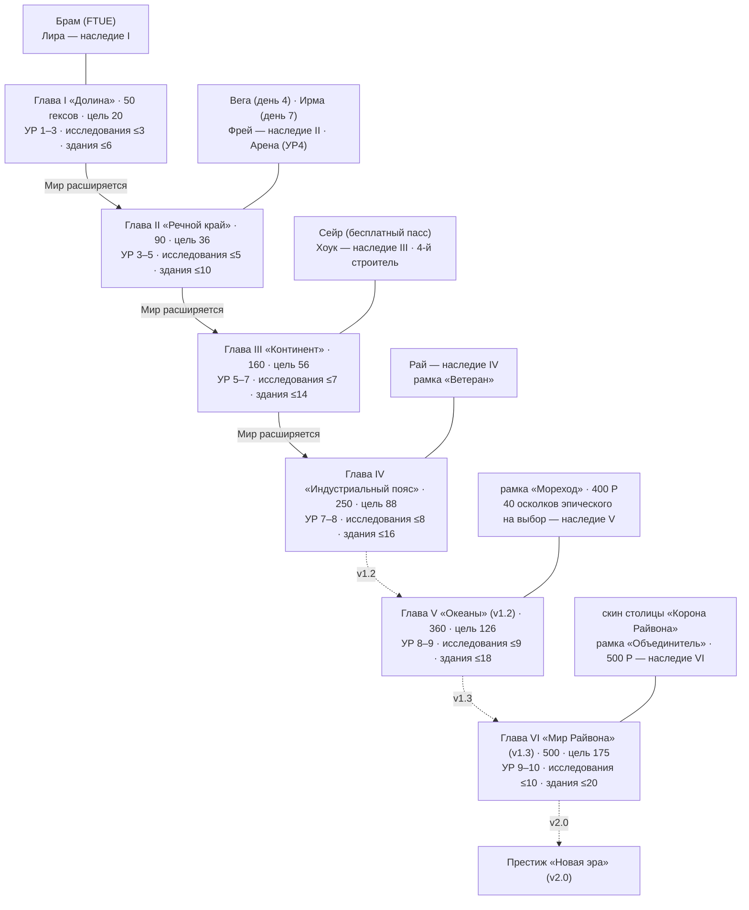
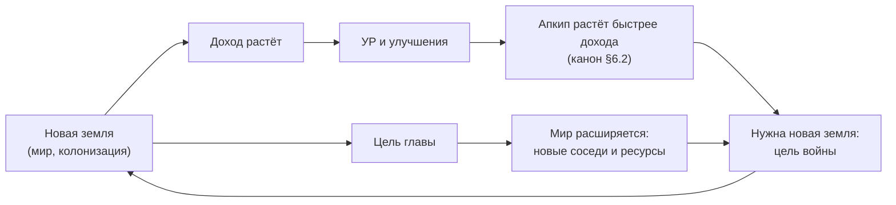
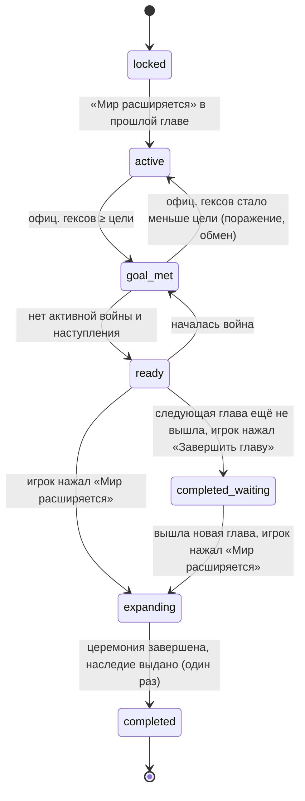
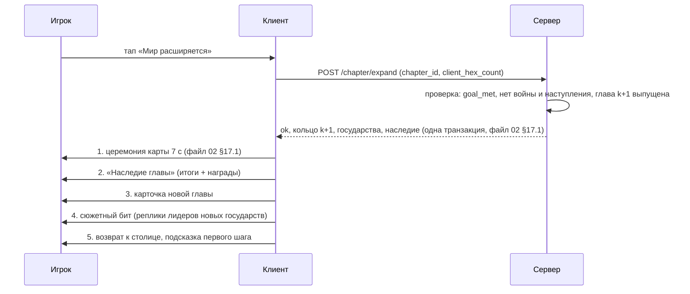
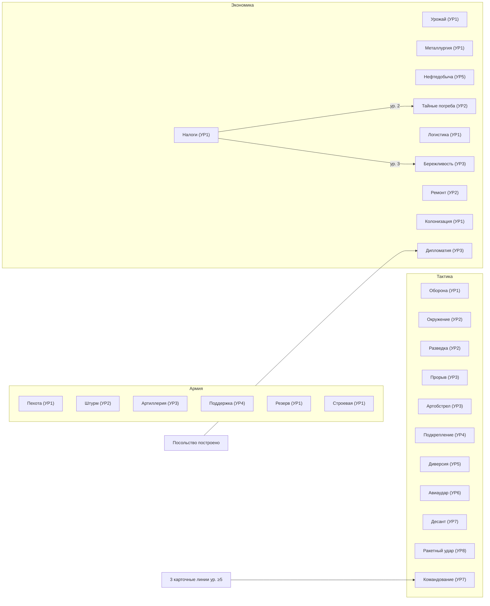
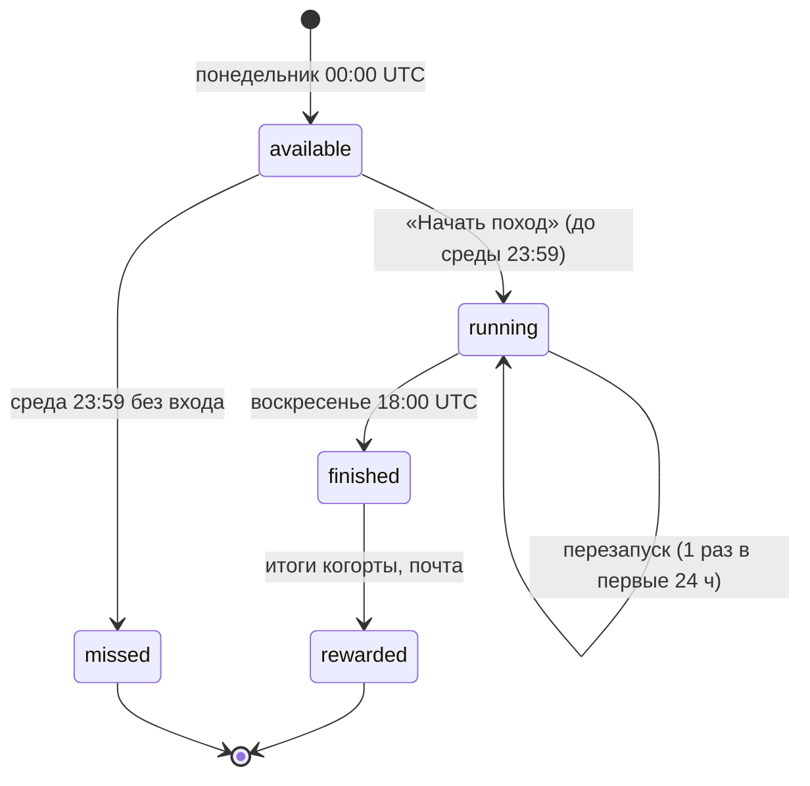
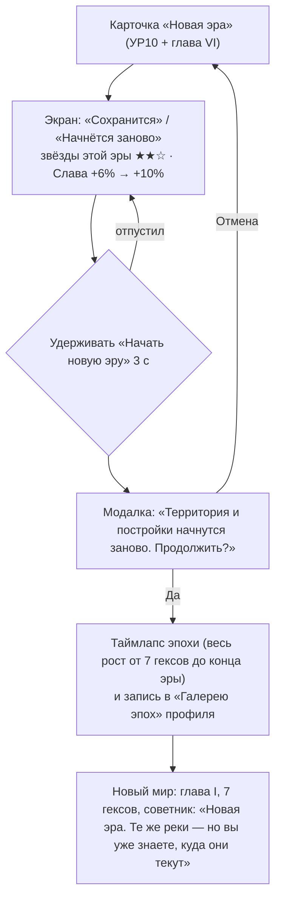

# 7. Прогрессия и мета

> **Назначение.** Исполняемая спецификация долгого прогресса: структура прогрессии, главы I–VI (государства, лидеры, рельеф, цели, задания-звёзды, наследие, сюжет, длительность), церемония «Мир расширяется», уровни развития 1–10 и экран «Дорога державы», церемония повышения УР, полное дерево исследований (3 ветки, 27 линий), «Летопись державы» (40 достижений), мета Арены Рубежей (лиги, кубки, сезоны, калибровка, «Ополчение», награды, магазин), Альянсы (выключены до сигнала владельца), Походы, престиж «Новая эра», кривая прогресса по дням для профилей игрока, стены контента, план контента после запуска и удержание в эндгейме.
> **Опирается на канон v1.2:** §4 (бюджет Райвитов), §6 (УР, потолок по главе), §7 (потолки уровней, строители), §8.4 (командиры), §9.1, §9.15–9.16 (капы войн, перемирия, УР ИИ), §10.4 (лидеры), §10.8 (коалиции), §11 (Арена), §12 (прогрессия), §13 (таймеры), §14.4–14.10 (крючки, циклы, события, пуши, запреты), §15.4–15.6 и §15.9 (кейсы, косметика, пасс, профили и анти-P2W), §16.5 (симулятор), §17 (KPI стены контента); журнал §20: C14, C17, C20, C49, C72–C81, C88, C97, C112, R14. Решения владельца 1, 2, 3, 9, 18, 19, 20, 21, 23, 24.
> **Связанные файлы:** `02_map_territory.md` (кольца, квоты гексов, сиды, карта церемонии «Мир расширяется»), `03_war_combat.md` (боевые правила Арены, война, грабёж технологий), `04_units_army.md` (ветка «Армия», командиры, армии-копии Арены), `05_economy_buildings.md` (Резиденция, Академия, строители, эволюция построек), `06_diplomacy_peace.md` (архетипы, лидеры, угроза, союзы с ИИ), `08_retention_liveops.md` (FTUE, календарь, события, пуши), `09_monetization.md` (паки эпохи и главы, пасс, кейсы), `10_ui_ux_art.md` (пиксели экранов, VFX церемоний), `11_balance_numbers.md` (стоимости УР и исследований, кривые), `12_tech_analytics_roadmap.md` (хранение, аналитика, roadmap).
> **Граница зоны.** Здесь нет боевых правил Арены (`03` §22), правил мира и цен требований (`06`), статов юнитов и пассивок командиров (`04`), цен IAP (`09`), числовых кривых стоимостей (`11`). Числа канона цитируются как есть. Всё, чего в каноне нет, помечено «(предложение автора)» и собрано в §16.2.

---

## 1. Зона файла и инварианты

### 1.1. Что здесь и что не здесь

| Здесь | Не здесь (где) |
|---|---|
| структура прогрессии, гейты, потолки по главам | формулы Силы и потолки семейств в бою — `03`, `04` |
| главы I–VI: состав, цели, звёзды, наследие, сюжет | генерация колец, квоты особых гексов, сиды — `02` §15–17 |
| УР 1–10: условия, открытия, «Дорога державы», церемония УР | модели и описания Blender-китов по УР — `04` §13, `05` §10, `10` |
| дерево исследований: эффекты, максимумы, зависимости | стоимость и время каждого уровня — `11` (ориентиры времени — §6.6) |
| «Летопись державы» | ежедневные «Приказы дня», календарь — `08` |
| Арена: открытие, калибровка, лиги, кубки, сезоны, подбор, «Ополчение», награды, магазин | бой на Рубеже, звёзды, лиговый стандарт в бою — `03` §22; армии-копии — `04` §16 |
| Альянсы, Походы, престиж (спецификации) | серверная реализация — `12` |
| кривая прогресса по дням, план контента, эндгейм | лайв-опс календарь событий — `08` |

### 1.2. Инварианты прогрессии (каждый покрыт автотестом экономического симулятора, канон §16.5)

| # | Инвариант | Источник |
|---|---|---|
| P1 | УР, уровни зданий, укреплений, семейств, карт, линий исследований и командиров никогда не уменьшаются (кроме добровольного престижа, §11) | решение 20, канон §9.14 |
| P2 | Переход на УР N требует официальных гексов ≥ порога §6.2 канона; купить территорию нельзя | канон §2.2 п. 15, §15.9 |
| P3 | УР не выше потолка открытой главы: I — 3, II — 5, III — 7, IV — 8, V — 9, VI — 10 | канон §6.2 (C72) |
| P4 | Уровень любой линии исследований ≤ УР и ≤ ⌈ур. Академии / 2⌉ | канон §7, §12.3 |
| P5 | Цель главы считается только по официальным гексам игрока; оккупация не засчитывается | канон §12.1 |
| P6 | Держава, постройки, армии, исследования, командиры, косметика и валюты переносятся между главами целиком | канон §12.4 |
| P7 | Ни одна награда прогрессии не выдаётся за покупку, просмотр рекламы или сбор полного набора случайных предметов | канон §15.4 (компу-гача), §15.9 |
| P8 | Арена не меняет PvE-карту, склады, армии и прогресс кампании | решение 9, канон §11 |
| P9 | Приёмка темпа до конца главы IV относительно F2P без рекламы, при одинаковом времени игры: F2P с рекламой ×1,15–1,25, «Минноу» ×1,3, «Дельфин» ×1,6, «Кит» не быстрее ×2,5 | канон §15.9 п. 7 |
| P10 | Во время церемоний «Мир расширяется» и повышения УР нет рекламы, офферов и пушей | канон §14.10 п. 1 |
| P11 | Альянсы выключены фича-флагом `feature_alliances` и включаются только по сигналу владельца, без даты в roadmap | решение 24, канон §12.6 |

### 1.3. Коды зоны

Префиксы — канон §3: `chs_` (звёзды глав), `ach_` (достижения), `rs_army_*` / `rs_tac_*` / `rs_eco_*` (линии исследований), `league_` (лиги), `clan_` (альянс игроков; `alliance` занят союзом с ИИ), `prestige_`; коды `arena_militia`, `mode_expedition`, `ui_chronicle`, `completed_waiting` — канон §3.4, §12.5. Конкретные имена ниже — предложение автора.

| Код | Что |
|---|---|
| `chs_2_port`, `ach_peace_25`, `rs_tac_airstrike`, `league_crystal` | примеры: звезда главы, достижение, линия исследования, лига |
| `clan_help`, `clan_donation`, `clan_quest` | помощь, донат отрядов, задания альянса |
| `prestige_new_era`, `prestige_star`, `prestige_glory` | престиж, звезда престижа, «Слава» |

---

## 2. Структура прогрессии

### 2.1. Пять осей прогресса

| Ось | Что растёт | Чем гейтится | Что видно игроку | Купить ускорение можно? |
|---|---|---|---|---|
| **Территория** | официальные гексы, ОТ, доля карты | войны, мир, колонизация, обмен; капы войн и перемирия | синий на карте, «Карта главы 34%» | нет (решения 3, 20; канон §15.9) |
| **Глава** | открытый мир 50 → 500 гексов | цель главы (официальные гексы) | кнопка «Мир расширяется» | нет |
| **УР** | вид всего, множители, открытия | гексы + потолок главы + ресурсы + таймер | «Дорога державы», церемония | только ресурсы и таймер |
| **Глубина державы** | здания (≤ 2 × УР), исследования (≤ УР), укрепления (≤ УР) | УР, ресурсы, строители, очередь Академии | цифры на карточках, декор построек | таймеры и ресурсы |
| **Коллекция и мета** | командиры (≤ 2 × УР), косметика, лига Арены, «Летопись» | источники канона §8.4, сезоны | экран «Командиры», рамки, лига | осколки — да (кейсы), сила — нет (потолки, лиговый стандарт) |

Территория — корневая ось: УР требует гексов, а УР открывает потолки остальных осей. Поэтому деньги ускоряют глубину державы, но не обгоняют территорию (P9).

### 2.2. Схема: главы × УР × исследования × командиры



### 2.3. Потолки по УР (сводка для реализации)

| УР | Глава, где УР доступен | Здания (2 × УР) | Укрепление, башня, семейство, карта, линия исследования | Командир (2 × УР) | Башен (2 × УР) | Армии × слоты | Обозы |
|---|---|---|---|---|---|---|---|
| 1 | I | 2 | 1 | 2 | 2 | 2×3 | 2 |
| 2 | I | 4 | 2 | 4 | 4 | 2×3 | 2 |
| 3 | I | 6 | 3 | 6 | 6 | 3×3 | 3 |
| 4 | II | 8 | 4 | 8 | 8 | 3×4 | 3 |
| 5 | II | 10 | 5 | 10 | 10 | 3×4 | 4 |
| 6 | III | 12 | 6 | 12 | 12 | 4×4 | 4 |
| 7 | III | 14 | 7 | 14 | 14 | 4×5 | 5 |
| 8 | IV | 16 | 8 | 16 | 16 | 5×5 | 5 |
| 9 | V (v1.2) | 18 | 9 | 18 | 18 | 5×5 | 6 |
| 10 | VI (v1.3) | 20 | 10 | 20 | 20 | 6×5 | 6 |

Столбец «Глава, где УР доступен» — правило P3 (канон §6.2). На потолке главы кнопка улучшения Резиденции показывает «УР4 откроется в главе II «Речной край»» вместо цены.

### 2.4. Петля прогресса



---

## 3. Главы

### 3.1. Жизненный цикл главы



| Состояние | Кнопка на HUD (над кнопкой «Война») | Подпись |
|---|---|---|
| `active` | прогресс-кольцо «Глава II: 31/36» | тап открывает карточку главы (цель, звёзды, государства) |
| `goal_met` (идёт война) | кольцо золотое, кнопка серая | «Завершите войну, чтобы открыть новые земли» (канон §12.1, `02` §17.1); колонизация разрешена |
| `ready` | пульсирующая кнопка «Мир расширяется» | — |
| `ready` для последней вышедшей главы | кнопка «Завершить главу» | «Наследие главы IV ждёт вас» |
| `completed_waiting` | бейдж «Глава V скоро» | без даты, пока владелец её не объявил (канон §14.10 п. 4: никаких ложных таймеров) |

Правила:
- Цель проверяется на сервере в момент нажатия. Если между показом кнопки и нажатием гексов стало меньше, сервер отвечает отказом, кнопка возвращается в `active` (предложение автора).
- Переход не автоматический: игрок может остаться в главе сколько угодно и добирать гексы и звёзды. Через 24 ч в состоянии `ready` советник напоминает плашкой на карте один раз (предложение автора).
- Наследие главы выдаётся один раз — в момент перехода в `completed` или `completed_waiting` (канон §12.1). При последующем открытии вышедшей главы из `completed_waiting` наследие не выдаётся повторно, но церемония играется полностью.
- Экран «Завершить главу» — экран наград церемонии, защищённое состояние (канон §14.10 п. 1).

### 3.2. Цель главы: правила подсчёта

```
goal_progress = |official_territory(player)|        # суша, все кольца, включая Ядро
goal_met      = goal_progress ≥ chapter.goal_hexes
map_share     = goal_progress / land_hexes(open_world)   # «Карта главы 34%», показ с точностью 1%
```

| Что засчитывается | Да / нет |
|---|---|
| Гексы, полученные миром (аннексия, котёл, «Удобная граница») | да |
| Колонизация, обмен территориями | да |
| Оккупированные во время войны гексы | **нет** (оккупация ≠ граница, канон §3.1) |
| Гексы старых колец | да: цель — общее число официальных гексов державы |
| Горы, вода | нет (канон §5.1) |

Цель главы — абсолютное число из канона §12.1 (20 / 36 / 56 / 88 / 126 / 175). Процент (40% / 40% / 35% / 35% / 35% / 35%) показывается рядом для наглядности.

### 3.3. Задания-звёзды: общие правила

- 6–8 задач на главу, всего 46 звёзд на I–VI. Прогресс считается **только с момента открытия главы**, звёзды не сгорают (канон §12.1): задачу главы II можно закрыть, находясь в главе IV.
- Звёзды не нужны для перехода в следующую главу — только для наград и для звезды престижа «Летопись эпохи» (§11.3).
- **Награда за звезду** (канон §12.1): 10 Райвитов + по 1 ч `gross_rate` каждого открытого ресурса в главах I–II, по 2 ч в III–IV, по 4 ч в V–VI. **За все звёзды главы** — предмет косметики главы (не продаётся; место в каталоге — §16.1 Q2).
- Награда забирается тапом в карточке главы (всплывающий тост «★ Звезда главы!» + звук).
- Задач, требующих Арены, покупок или рекламы, нет (решение 1: PvP только по желанию; P7).

### 3.4. УР государств ИИ по главам

Канон §9.16 (C74): УР ИИ растёт на 1 каждые 6 дней до потолка главы (I — 2, II — 4, III — 6, IV — 8, V — 9, VI — 10); гегемон стартует на потолке своей главы, остальные — на потолке прошлой главы + 1; потолок ИИ прошлых глав = max(родной; потолок открытой главы − число глав между ними). Реализация:

```
start_dev(state)  = ai_cap(k)          если state — гегемон кольца k
                  = ai_cap(k−1) + 1    иначе (всегда ≤ ai_cap(k)); для k = 1 — 1 (предложение автора)
cap_dev(state, K) = max(ai_cap(k), ai_cap(K) − (K − k))
  # ai_cap — потолок УР ИИ по главе (2/4/6/8/9/10, не путать с потолком игрока P3)
  # k — родная глава государства, K — последняя открытая игроком глава
tick: каждые 6 суток с момента появления (или с момента подъёма потолка) УР += 1, пока < cap_dev
```

| Государство | Родная глава | Старт УР | Потолок, когда открыта глава I / II / III / IV / V / VI |
|---|---|---|---|
| Кремнёвые Бароны, Вольные Хутора | I | 1 | 2 / 3 / 4 / 5 / 5 / 5 |
| Речная Лига, Орден Камня | II | 3 | — / 4 / 5 / 6 / 6 / 6 |
| Альвария (гегемон) | III | 6 | — / — / 6 / 7 / 7 / 7 |
| Сарен, Серая Стая | III | 5 | — / — / 6 / 7 / 7 / 7 |
| Стальной Конклав (гегемон) | IV | 8 | — / — / — / 8 / 8 / 8 |
| Вейлмарк, Республика Озёр | IV | 7 | — / — / — / 8 / 8 / 8 |
| Государства V | V | 9 | — / — / — / — / 9 / 9 |
| Государства VI | VI | 10 | — / — / — / — / — / 10 |

Смысл: внутренний мир слабее внешнего («тыл» спокойнее «фронтира»), но старые соседи не застывают на УР2 навсегда и продолжают эволюционировать на глазах игрока (решение 2). Гегемон стартует на потолке своей главы: игрок встречает Альварию с танками (УР6), когда сам на УР5, — это цель, показанная заранее (канон §6).

### 3.5. Глава I «Долина» (`ch_1`)

| Параметр | Значение |
|---|---|
| Размер | 50 гексов суши (диск ~9 × 9), фиксированный сид `world_ch12` (`02` §17.4) |
| Рельеф | луга (`biome_meadow`); горы 6–10% клеток; 1 озеро; рек и портов нет; 1 Тёмное озеро на диких землях (`02` §15.3) |
| Стартовое положение | игрок 7 гексов в центре, Бароны на севере, Хутора на юге, дикие земли на западе и востоке (`02` §15.6) |
| Цель | **20 официальных гексов (40%)** |
| УР игрока | 1–3 (потолок главы 3) |
| Правила войны | кап 2 ч, перемирие 30 мин, энергия ИИ ×0,6, войны ИИ только скриптовые, коалиций нет (канон §9.1, §10.8) |
| Колонизация | 1 мин на гекс |
| Новое | наступление, мир, оккупация, укрепления, обозы, колонизация, Клин, Окружение |

**Государства ИИ:**

| Государство | Архетип | Старт, гексов | Офиц. ценность | Лидер | Ключевые гексы |
|---|---|---|---|---|---|
| Кремнёвые Бароны | Волк `ai_wolf` | 14 | 37 | **Барон Гродек Клык** (`06` §10.1) | ферма «Мельница» у Ядра игрока, 2 города, военная база, **Райвитовая жила** |
| Вольные Хутора | Лис `ai_fox` | 10 | 24 | **Голова Мирося Златоуст** | шахта «Медная шахта», город |
| Дикие земли | — | 19 | — | — | заброшенная ферма и штольня, Тёмное озеро, 4 лагеря мародёров |

**Задания-звёзды главы I** (награда за все — рамка флага «Хозяин долины», `cos_frame`; имя не совпадает с рамкой главы «Долина» пака главы I, `cos_frame_chapter_1`, `09` §9.8.6):

| Код | Название | Условие |
|---|---|---|
| `chs_1_pocket` | Первый котёл | аннексируй котёл (любого размера) мирным договором |
| `chs_1_perfect` | Безупречный удар | проведи наступление на ★★★ |
| `chs_1_colonize_5` | Первопроходец | колонизируй 5 диких гексов |
| `chs_1_raiders_3` | Гроза мародёров | разбей 3 лагеря мародёров |
| `chs_1_deposits_5` | Жёлтая лихорадка | собери 5 жёлтых залежей |
| `chs_1_mercy` | Великодушие | подпиши победный мир с уровнем «Пощадить» |
| `chs_1_vein` | Синий кристалл | присоедини Райвитовую жилу Кремнёвых Баронов |

Первые две звезды обычно закрываются уже в FTUE (наступление 1 и мир 2 с котлом, канон §14.3; если в мире 2 игрок выбрал золото, «Первый котёл» остаётся на потом) и учат, что звёзды существуют. Последняя — первая «цель войны ради конкретного гекса» (столп 4).

**Наследие:** Капитан Лира + 200 Райвитов (канон).

**Сюжетные биты** (реплики советника и лидеров, ≤140 символов для локализации):

| Триггер | Кто | Текст |
|---|---|---|
| Старт FTUE | Советник | «Бароны сожгли нашу мельницу. Пора показать, чья это долина». |
| Первый мир | Советник | «Граница сдвинулась. Земля, закреплённая миром, — наша навсегда». |
| Скриптовый ультиматум (~2 ч) | Барон Гродек Клык | «Ветряная гряда будет нашей. Отдашь сам — сохранишь лицо. Нет — заберём». |
| Цель главы выполнена | Советник | «Долина признала наш флаг. Но за холмами слышен шум рек и чужих барабанов». |

**Длительность:** 3–5 сессий, F2P без рекламы D0–D1 (канон §12.1; другие профили — §12.3). Войн: 2 в FTUE + 1–2 с Баронами.

### 3.6. Глава II «Речной край» (`ch_2`)

| Параметр | Значение |
|---|---|
| Размер | 90 (+40), кольцо из 2 лопастей, фиксированный сид `world_ch12` |
| Рельеф | луга, на северной лопасти тайга; вода 10–18% (залив и озёра); 2–3 реки по рёбрам (атака через реку −25%); 2 порта; 1 Тёмное озеро; 1 Райвитовая жила |
| Цель | **36 официальных гексов (40%)** |
| УР игрока | 3–5 (потолок главы 5) |
| Правила войны | кап 24 ч, перемирие 8 ч, энергия ИИ ×0,8, контратаки через 4–6 ч, порог коалиции 60 |
| Колонизация | 5 мин |
| Новое | реки, порты, союзы с ИИ, ультиматумы, Арена (УР4), нефть (УР5), коалиции |

**Государства ИИ:**

| Государство | Архетип | Старт, гексов | Старт УР | Лидер | Характер в главе |
|---|---|---|---|---|---|
| Речная Лига | Сова `ai_owl` | 16 | 3 | **Канцлер Ивета Мудрая** (`06` §10.1) | шанс союза ×2; первый естественный союзник; держит один из портов |
| Орден Камня | Черепаха `ai_turtle` | 14 | 3 | **Магистр Торвальд Терпеливый** | укрепления на 2 уровня выше нормы; принимает белый мир по просьбе игрока при ВС ≥ −30 (канон §10.4); Гранитный рудник у границы |

**Задания-звёзды главы II** (за все — элемент герба «Речная лилия», `cos_flag_part`):

| Код | Название | Условие |
|---|---|---|
| `chs_2_port` | Выход к морю | присоедини Порт |
| `chs_2_river` | Форсирование | возьми гекс атакой через реку |
| `chs_2_alliance` | Рукопожатие | заключи союз с государством ИИ |
| `chs_2_defense` | Стена держит | отбей контратаку ИИ (живая или авто-оборона) |
| `chs_2_pocket_4` | Клещи | окружи котёл из 4+ гексов (пример канона §12.1) |
| `chs_2_oil` | Чёрное золото | владей гексом Нефть (присоединённым или пробуждённым Тёмным озером на УР5; пример канона «Присоедини нефть») |
| `chs_2_ultimatum` | Не на тех напали | отклони ультиматум ИИ и выиграй последовавшую войну |
| `chs_2_vein` | Речной кристалл | присоедини Райвитовую жилу кольца II |

**Наследие:** Полковник Фрей + чернила границы «Речные» (канон).

**Сюжетные биты:**

| Триггер | Кто | Текст |
|---|---|---|
| Открытие главы | Канцлер Ивета Мудрая | «Лига приветствует нового соседа. Надеюсь, вы умеете не только воевать». |
| Открытие главы | Магистр Торвальд Терпеливый | «Мы строили стены сто лет. Посмотрим, сколько строили вы». |
| УР4, Арена открыта | Советник | «За туманом есть другие державы. Их правители испытывают друг друга на Рубежах. Хотите попробовать?» |
| УР5, озёра проснулись | Советник | «Тёмные озёра закипели. Это нефть — и теперь за неё будут воевать все». |
| Цель главы | Советник | «Реки наши. За устьем лежит континент, и правит там Альвария». |

**Длительность:** F2P без рекламы D2–D9 (канон §12.1). Войн: 3–4, плюс колонизация ~5 из 10 диких гексов (остальные забирают ИИ).

### 3.7. Глава III «Континент» (`ch_3`)

| Параметр | Значение |
|---|---|
| Размер | 160 (+70), 3 лопасти, цепочка из пула 20 сидов (`02` §17.4) |
| Рельеф | степь на юге, тайга на севере; вода 8–15%; 2–3 реки; 3 порта; 3 Нефти и 2 Завода в 2–5 гексах от границ владельцев (`02` §15.5 F9); 2 военные базы; 1 Райвитовая жила |
| Цель | **56 официальных гексов (35%)** |
| УР игрока | 5–7 (потолок главы 7) |
| Правила войны | кап 72 ч, перемирие 24 ч, энергия ИИ ×1,0 (гегемон ×1,1), контратаки через 3–6 ч, порог коалиции 50 |
| Колонизация | 15 мин |
| Новое | танки и авиация (УР6, дни ~14–20), заводы, нефть как цель войны, гегемон, коалиции на полную силу |

**Государства ИИ:**

| Государство | Архетип | Старт, гексов | Старт УР | Лидер (канон §10.4) | Характер в главе |
|---|---|---|---|---|---|
| Альвария | Волк + Гегемон `ai_wolf` + `ai_hegemon` | 22 | 6 | **Владычица Сайрин Железная** | босс главы: армии +20%, требует дань, ведёт коалиции; танки с первого дня |
| Сарен | Лис `ai_fox` | 15 | 5 | **Дож Велиан Хитрый** | богатый, предлагает обмены, первым гонит обозы к залежам |
| Серая Стая | Ворон `ai_raven` | 15 | 5 | **Вожак Бьорульф Чёрное Перо** | нападает на ослабленных, первым вступает в коалицию Альварии |

Государства и лидеры глав I–IV одинаковы во всех 20 цепочках (канон §10.4, §19.1); портрет, герб и переопределённый титул — `06` §10.1 (`leader_seed` в §14.1).

**Задания-звёзды главы III** (за все — салют мира «Континентальный», `cos_peace_fireworks`):

| Код | Название | Условие |
|---|---|---|
| `chs_3_factory` | Индустриализация | присоедини Завод |
| `chs_3_oil_2` | Нефтяной пояс | владей 2 гексами Нефти одновременно |
| `chs_3_hegemon` | Укротитель волков | подпиши победный мир с Альварией при ВС ≥ 30 |
| `chs_3_capital` | У ворот столицы | оккупируй вражескую столицу во время войны (+20 ВС; при мире она вернётся, канон §3.1) |
| `chs_3_triumph` | Триумф | выиграй коалиционную войну |
| `chs_3_breakthrough` | Стальной клин | возьми 3 гекса одним «Прорывом» |
| `chs_3_swap` | Выгодная сделка | заверши обмен территориями с ИИ |
| `chs_3_vein` | Кристалл континента | присоедини Райвитовую жилу кольца III |

**Наследие:** Генерал Хоук + 4-й строитель; если 4-й уже куплен («Пакет прораба» или 600 Райвитов) — 600 Райвитов (канон §7, §12.1).

**Сюжетные биты:**

| Триггер | Кто | Текст |
|---|---|---|
| Открытие главы | Владычица Сайрин Железная | «Альвария не просит. Альвария напоминает: дань до заката». |
| Открытие главы | Дож Велиан Хитрый | «Торговать выгоднее, чем воевать. Но мы умеем и то и другое». |
| УР6 | Советник | «С конвейера сошли первые танки. Альвария больше не единственная, у кого есть сталь». |
| «Тревога соседей» ≥50% | Вожак Бьорульф Чёрное Перо | «Стая чует, куда дует ветер. Пока — не в вашу сторону». |
| Цель главы | Советник | «Континент склонил знамёна. Дым на горизонте — это заводы Индустриального пояса». |

**Длительность:** F2P без рекламы D9–D25 (канон §12.1). Войн: 4–6, первая коалиция — около середины главы.

### 3.8. Глава IV «Индустриальный пояс» (`ch_4`)

| Параметр | Значение |
|---|---|
| Размер | 250 (+90), 3 лопасти |
| Рельеф | бедленды (рыжие скалы и карьеры); горы 8–12% (перевалы и узкие проходы); вода 8–15%; 3 реки; 4 порта; 4 Нефти, 3 Завода, 3 военные базы; 1 Райвитовая жила |
| Цель | **88 официальных гексов (35%)** — последняя глава запуска |
| УР игрока | 7–8 (потолок главы 8) |
| Правила войны | как в главе III; две войны одновременно — обычная ситуация (канон: не больше 2) |
| Колонизация | 30 мин |
| Новое | ультразабор и небоскрёбы (УР8, дни ~40–50), Десант, Ракетный удар, войны на 2 фронта |

**Государства ИИ:**

| Государство | Архетип | Старт, гексов | Старт УР | Лидер (канон §10.4) | Характер в главе |
|---|---|---|---|---|---|
| Стальной Конклав | Черепаха + Гегемон | 26 | 8 | **Архимастер Ормдек Каменный** | ультразаборы с первого дня (цель «Ультразабор» видна вживую); мало атакует сам, но ведёт коалиции и требует дань |
| Вейлмарк | Ворон | 20 | 7 | **Маркграфиня Ведана Тёмное Крыло** | бьёт, когда игрок воюет на другом фронте |
| Республика Озёр | Сова | 21 | 7 | **Консул Арман Ночной** | ищет союза; собирает коалиции, если «Тревога» высока |

**Задания-звёзды главы IV** (за все — печать мира «Стальной штамп», `cos_peace_seal`):

| Код | Название | Условие |
|---|---|---|
| `chs_4_two_fronts` | Война на два фронта | выиграй 2 войны, которые шли одновременно (обе — победный мир, интервалы войн пересекались) |
| `chs_4_landing` | Высадка | высади «Десант» и удержи гекс высадки до конца наступления |
| `chs_4_missile` | Точный удар | выведи из строя башню «Ракетным ударом» (до конца боя, канон §9.9) |
| `chs_4_conclave` | Сталь против стали | подпиши победный мир со Стальным Конклавом |
| `chs_4_ultrafence` | Ультразабор | построй укрепление ур. 8 |
| `chs_4_pocket_8` | Большой котёл | окружи котёл из 8+ гексов |
| `chs_4_cities_6` | Город небоскрёбов | владей 6 городами одновременно |
| `chs_4_vein` | Кристалл пояса | присоедини Райвитовую жилу кольца IV |

**Наследие:** Император Рай + рамка «Ветеран»; если Рай уже открыт (осколки из премиум-пасса, календаря и кейсов) — 80 его осколков, цена открытия легендарного (канон §8.4, §12.1).

**Сюжетные биты:**

| Триггер | Кто | Текст |
|---|---|---|
| Открытие главы | Архимастер Ормдек Каменный | «Конклав не воюет. Конклав ждёт, пока вы разобьёте лоб о наши стены». |
| Открытие главы | Консул Арман Ночной | «Республика ценит сильных соседей — особенно тех, кто умеет остановиться». |
| УР8 | Советник | «Над столицей поднялся первый небоскрёб. Ультразабор гудит энергосеткой». |
| Цель главы | Советник | «Пояс наш. Дальше — океан, и корабли для него ещё строятся». |

**Длительность:** F2P без рекламы D25–D50 (канон §12.1). Войн: 5–8, из них 1–2 коалиционные. Конец главы IV — первая стена контента запуска (§12.4).

### 3.9. Глава V «Океаны» (`ch_5`, v1.2)

| Параметр | Значение |
|---|---|
| Размер | 360 (+110), 3 лопасти, архипелаги |
| Рельеф | тропики; **вода 30–40%**, горы 4–8%; 2–3 реки; **6 портов**; 4 Нефти, 3 Завода, 3 базы; 1 Райвитовая жила (`02` §15.3–15.4) |
| Цель | **126 официальных гексов (35%)** |
| УР игрока | 8–9 (потолок главы 9) |
| Новое | морские сектора: наступления у побережья, снабжение по морским связям портов (`03` §10.5), «Десант» как основной способ сменить остров; ультраукрепление (УР9); 6 обозов; максимум энергии 11 |

**Государства ИИ (процедурные, канон §19.1):** 3 государства размером 27, 27 и 28 гексов (`02` §15.3), старт УР 9.

| Слот | Архетип | Размер | Правило генерации (предложение автора) |
|---|---|---|---|
| Гегемон | Волк или Ворон (50/50 по сиду цепочки) + Гегемон | 28 | столица на крупнейшем острове, 2 порта |
| Торговец | Лис | 27 | ≥2 порта, Райвитовая жила кольца — у него с шансом 60% |
| Опора | Черепаха или Сова | 27 | столица на материковой лопасти |

**Имена государств** (предложение автора): «форма по архетипу + топоним». Формы: Волк — Каганат, Армада, Легион; Лис — Гавань, Торговый Дом, Компания; Черепаха — Твердыня, Цитадель, Бастион; Ворон — Стая, Братство, Тень; Сова — Содружество, Конфедерация, Республика. Стоп-лист форм и топонимов: «Орда» (событие «Вторжение Орды», канон §14.6), «Союз» (союз с ИИ, `alliance`), «Лига» (лиги Арены), «Коалиция», «Альянс» — иначе в ленте «Пока вас не было» государство не отличить от события или механики (каноническое имя «Речная Лига» главы II стоп-лист не трогает). Топоним выдаёт слоговой генератор `06` §10.1 по культуре биома столицы (у V — «морская»). Лидер — генератор `06` §10.1 без переопределения титула. Пример для `chain_01`: Армада Кайрена (гегемон), Гавань Мивелла, Бастион Тордаля.

**Задания-звёзды главы V** (за все — чернила границы «Прибой», `cos_border_ink`):

| Код | Название | Условие |
|---|---|---|
| `chs_5_ports_3` | Хозяин гаваней | владей 3 портами кольца V одновременно |
| `chs_5_port_pocket` | Отрезанный порт | создай котёл, в котором есть вражеский Порт |
| `chs_5_ultra` | Силовой щит | построй ультраукрепление (ур. 9) |
| `chs_5_hegemon` | Буря над океаном | подпиши победный мир с гегемоном главы V |
| `chs_5_sea_landing` | Морской десант | возьми гекс «Десантом» в 3–4 гексах от своего порта |
| `chs_5_peace_5` | Пять договоров на воде | подпиши 5 победных договоров с государствами кольца V |
| `chs_5_vein` | Кристалл океана | присоедини Райвитовую жилу кольца V |

**Наследие (канон §12.1):** рамка «Мореход» + 400 Райвитов + 40 осколков эпического командира на выбор (из открытых или закрытых).

**Сюжетные биты:** открытие — «Корабли готовы. За горизонтом — острова, где о нас ещё не слышали»; УР9 — «Силовой щит закрыл столицу. Таких укреплений не видел ни один мир Райвона»; цель — «Океан стал нашим внутренним морем. Осталась последняя земля — сердце Райвона».

**Длительность:** F2P без рекламы D50–D80 (канон §12.1) — проектный темп; игрок, ждавший главу у стены, закрывает её цель за 0–10 дней после релиза (§12.4). Войн: 6–9.

### 3.10. Глава VI «Мир Райвона» (`ch_6`, v1.3)

| Параметр | Значение |
|---|---|
| Размер | 500 (+140), 4 лопасти |
| Рельеф | снег и кристаллы, на стыке с V — тайга; горы 8–12%, вода 10–20%; 3–4 реки; 6 портов; 6 Нефти, 4 Завода, 4 базы; 1 Райвитовая жила |
| Цель | **175 официальных гексов (35%)** |
| УР игрока | 9–10 (потолок главы 10) |
| Новое | энергокупол «Эгида» (УР10), 6-я армия; престиж «Новая эра» (v2.0) |

**Государства ИИ (процедурные):** 4 государства по 26 гексов, старт УР 10. Генерация (предложение автора): 1 гегемон (любой архетип, кроме Лиса) + 3 государства разных архетипов, из них не больше одного Волка. Культура топонимов — «северная» и «горная».

**Задания-звёзды главы VI** (за все — узор заливки «Меридианы», `cos_fill_pattern`, синяя гамма):

| Код | Название | Условие |
|---|---|---|
| `chs_6_dome` | Эгида | построй энергокупол (укрепление ур. 10) |
| `chs_6_share_45` | Почти полмира | держи 225 официальных гексов (45% мира) |
| `chs_6_coalition_4` | Один против всех | выиграй коалиционную войну против 4 государств |
| `chs_6_hegemon` | Последний гегемон | подпиши победный мир с гегемоном главы VI |
| `chs_6_alliances_3` | Сеть союзов | держи 3 союза с ИИ одновременно |
| `chs_6_pocket_12` | Великий котёл | окружи котёл из 12 гексов (максимум канона) |
| `chs_6_score_80` | Абсолютная победа | подпиши мир при ВС ≥ 80 |
| `chs_6_vein` | Сердце Райвона | присоедини Райвитовую жилу кольца VI |

**Наследие (канон §12.1):** скин столицы «Корона Райвона» (`cos_capital_skin`) + рамка «Объединитель» + 500 Райвитов.

**Сюжетные биты:** открытие — «Последние облака расходятся. Перед нами весь мир Райвона — и все его правители смотрят на нас»; УР10 — «Над столицей зажёгся купол «Эгида». Отсюда видно каждый гекс мира»; цель — «Мир Райвона называет нас Объединителями. История только начинается» (в v2.0 — переход к «Новой эре»).

**Длительность:** F2P без рекламы D80–D120 (канон §12.1) — проектный темп; игроки у стены закрывают цель в день релиза (§12.4). Войн: 8–12.

### 3.11. Сводка глав

| Глава | Суша (новой) | Новых ИИ | Цель | УР игрока | Потолок УР ИИ | Звёзд | Награды звёзд (Райвиты) | Наследие | F2P без рекламы, D |
|---|---|---|---|---|---|---|---|---|---|
| I | 50 | 2 | 20 | 1–3 | 2 | 7 | 70 | Лира + 200 Р | 0–1 |
| II | 90 (+40) | 2 | 36 | 3–5 | 4 | 8 | 80 | Фрей + чернила «Речные» | 2–9 |
| III | 160 (+70) | 3 | 56 | 5–7 | 6 | 8 | 80 | Хоук + 4-й строитель | 9–25 |
| IV | 250 (+90) | 3 | 88 | 7–8 | 8 | 8 | 80 | Рай + рамка «Ветеран» | 25–50 |
| V | 360 (+110) | 3 | 126 | 8–9 | 9 | 7 | 70 | рамка + 400 Р + 40 осколков | 50–80 |
| VI | 500 (+140) | 4 | 175 | 9–10 | 10 | 8 | 80 | скин столицы + рамка + 500 Р | 80–120 |

---

## 4. Церемония «Мир расширяется» (`world_expansion`)

### 4.1. Поток



| Шаг | Длительность | Содержимое (порядок шагов — канон §12.1; содержимое — предложение автора, кроме отмеченного) |
|---|---|---|
| 1. Карта | 7 с | камера отъезжает, облака расходятся, государства проявляются по очереди, счётчики «Мир: 50 → 90 гексов · +2 государства» (`02` §17.1, канон §12.1) |
| 2. Наследие главы | до тапа | вверху «Итоги главы I»: дни, войн, миров, гексов, звёзд 5/7. Ниже награды наследия влетают картами по одной (0,4 с каждая): командир — портрет на весь экран с репликой («Капитан Лира: «Армия будет сыта — это я вам обещаю»»), косметика — превью на карте, Райвиты — счётчик в HUD. Кнопка «Назначить» у командира |
| 3. Новая глава | до тапа | название и номер, цель «36 гексов (у вас 21)», 3 значка нового («Реки», «Порты», «Союзы»), флаги новых государств с архетипом и УР |
| 4. Сюжетный бит | 2 реплики | портреты лидеров новых государств с репликой из §3.5–3.10, тап — следующая |
| 5. Первый шаг | подсказка | стрелка на ближайший дикий гекс нового кольца или «вкусный» гекс у границы (`02` §15.5 F5) |

Пропуск: после первого раза шаг 1 ускоряется ×3 по тапу, шаги 2–4 пропускаются кнопкой «Пропустить» (награды зачисляются). Режим «Меньше анимации» — шаг 1 заменяется на 1,5 с затемнения с появлением нового мира.

### 4.2. Правила и ограничения

- **Защищённое состояние** (P10): во время шагов 1–4 нет рекламы, офферов и пушей. Уведомление о рейде (решение 21) не теряется: если ИИ объявил удар во время церемонии (война старого соседа после ультиматума), баннер показывается сразу после шага 4 — до удара остаётся ≥15 мин.
- **Пак главы** (`iap_chapter_pack_<N>`, окно 48 ч) — не раньше следующей сессии (канон §12.1, §15.3), с учётом лимита 1 всплывающий оффер за сессию.
- **Новые государства 12 ч не выдвигают ультиматумов** (канон §12.1). Окно не продаётся и не ускоряется.
- **Сохранение звёзд:** незакрытые звёзды прошлой главы остаются в карточке главы с бейджем на кнопке «Главы».
- **Если глава k+1 не выпущена:** кнопка «Завершить главу» выдаёт наследие и итоги (шаги 2 и 5), без шага 1. Состояние `completed_waiting` (§3.1). Когда глава выйдет, кнопка «Мир расширяется» появляется у всех в `completed_waiting`, церемония проигрывается полностью, наследие не дублируется.
- **Офлайн-завершение невозможно:** переход только по тапу игрока.

---
## 5. Уровни развития 1–10 (`dev_level`)

### 5.1. Условия перехода

Переход на УР = улучшение Резиденции (`bld_residence`, `05` §9.3). Нужны четыре условия; гейт проверяется при старте таймера (`05` §9.3), УР не понижается никогда (P1).

| УР | Код | Название | Офиц. гексов | Глава (потолок, P3) | Таймер | Ресурсы: состав (канон §6.2: золото и металл, с УР6 — 15–20% нефти; доли — предложение автора; объём — `11`) | Апкип построек: М_апкип до → после |
|---|---|---|---|---|---|---|---|
| 1 | `dl_1` | Хутор | старт 7 | I | — | — | ×1,0 |
| 2 | `dl_2` | Деревня | 10 | I | 1 мин | золото 70% · металл 30% | ×1,0 → ×1,7 |
| 3 | `dl_3` | Княжество | 16 | I | 15 мин | золото 70% · металл 30% | ×1,7 → ×2,8 |
| 4 | `dl_4` | Королевство | 24 | II | 1 ч | золото 60% · металл 40% | ×2,8 → ×4,5 |
| 5 | `dl_5` | Индустриальная держава | 32 | II | 3 ч | золото 60% · металл 40% | ×4,5 → ×7 |
| 6 | `dl_6` | Держава стали | 44 | III | 8 ч | золото 50% · металл 35% · нефть 15% | ×7 → ×11 |
| 7 | `dl_7` | Технодержава | 56 | III | 12 ч | золото 50% · металл 35% · нефть 15% | ×11 → ×17 |
| 8 | `dl_8` | Мегаполис | 80 | IV | 24 ч | золото 50% · металл 35% · нефть 15% | ×17 → ×27 |
| 9 | `dl_9` | Сверхдержава | 120 | V (v1.2) | 36 ч | золото 45% · металл 35% · нефть 20% | ×27 → ×43 |
| 10 | `dl_10` | Ультрадержава | 170 | VI (v1.3) | 48 ч | золото 45% · металл 35% · нефть 20% | ×43 → ×70 |

- Гексы, название, таймер и множители — канон §6.1–6.2. Ориентир объёма ресурсов из `05` §8.4: 10–14 ч валового дохода золота и металла на момент гейта.
- Нужен свободный строитель (`05` §9.3). Остальные стройки во время перехода идут.
- Таймер ускоряется по общим правилам (канон §13.1); последние 5 минут бесплатны. Ускорение не обходит гейт гексов и потолок главы.
- Столбец «Апкип» показывается на «Дороге державы» до улучшения: игрок заранее видит, что держава подорожает (столп 5). Растёт апкип столичных зданий и гекс-построек; апкип укреплений и башен зависит от их уровня и не меняется. Пример (держава `05` §20.2, УР4): «Апкип построек ×4,5 → ×7: 241 → 375 золота/ч (+134)»; эталоны `11` §6.2: УР4 → УР5 — +137, УР7 → УР8 — +1 717 золота/ч.

### 5.2. Открытия по УР

Канон §6.2 даёт базовый список. Ниже он сведён с открытиями из других разделов канона, чтобы экран «Открыто» и «Дорога державы» брали всё из одного `dev_levels.yaml`.

| УР | Армия и бой | Экономика и здания | Режимы, дипломатия, социалка | Монетизация (триггеры, `09`) |
|---|---|---|---|---|
| 1 | Пехота; карты Атака, Оборона; 2 армии × 3 слота; укрепление и башня ур. 1 | 2 обоза; колонизация; лагеря мародёров; Академия: Пехота, Резерв, Строевая, Оборона, Налоги, Урожай, Металлургия, Логистика, Колонизация | — | — (FTUE без рекламы) |
| 2 | Штурм; Окружение, Разведка | Рынок; Ремонт, Тайные погреба | свободный чат: мировой по языкам и личный с друзьями (решение 18, канон §14.9) | — |
| 3 | Артиллерия; Прорыв, Артобстрел; 3-я армия | 3 обоза; Посольство; Бережливость, Дипломатия | 1 союз с ИИ; Альянсы (когда владелец включит) | «Пакет прораба»; пак эпохи УР3 |
| 4 | Поддержка; Подкрепление, Марш-бросок; 4 слота в армии | — | **Арена Рубежей** (§8) | пак эпохи УР4 |
| 5 | Диверсия | **Нефть** (озёра просыпаются), Нефтевышка, Завод; 4 обоза; Нефтедобыча | 2 союза; Походы (v1.1, §10) | пак эпохи УР5 |
| 6 | **танки** (Штурм), **авиация** (Авиаудар); 5-й слот руки; 4-я армия; техника потребляет нефть; башня ур. 6 = ПВО | — | — | пак эпохи УР6 |
| 7 | Десант; 5 слотов в армии; исследование «Командование» | 5 обозов | 3 союза | пак эпохи УР7 |
| 8 | **ультразабор** (укрепление ур. 8, апкип нефтью); Ракетный удар; 5-я армия | **небоскрёбы** | — | пак эпохи УР8+ |
| 9 | ультраукрепление; максимум энергии 11 | 6 обозов | — | пак эпохи |
| 10 | энергокупол «Эгида»; 6-я армия | — | престиж «Новая эра» (v2.0, §11) | пак эпохи |

### 5.3. Визуальная ступень

Облик каждого УР задан каноном §6.1, модели и описания китов — `04` §13 (войска), `05` §10 (постройки и укрепления), пиксели и VFX — `10`. Для «Дороги державы» каждый УР рендерится одной **диорамой ступени** (предложение автора): гекс-площадка с Резиденцией этого УР, кварталом города, сегментом укрепления ур. = УР, фигурками Пехоты и Штурма (с УР2) и, с УР6, силуэтом авиации над ними. Рендер — тот же headless-пайплайн (канон §16.4): 10 диорам × 2 разрешения.

| УР | Узнаваемая деталь диорамы (силуэт на «Дороге») |
|---|---|
| 1 Хутор | бельё на верёвке у халупы, плетень |
| 2 Деревня | мельница, частокол |
| 3 Княжество | терем, каменная стена с воротами |
| 4 Королевство | ратуша с часами, бастион с пушкой |
| 5 Индустриальная держава | фабричные трубы, колючая проволока |
| 6 Держава стали | танк, биплан, ДОТ с прожектором |
| 7 Технодержава | стеклянная офисная башня, стальная стена с турелями |
| 8 Мегаполис | небоскрёб-цитадель, **ультразабор** с энергосеткой |
| 9 Сверхдержава | шпиль и монорельс, силовой щит |
| 10 Ультрадержава | аркология, энергокупол «Эгида», мех |

### 5.4. Экран «Дорога державы» (`ui_dev_road`)

**Вход:** бейдж «УР 5» в левом верхнем углу HUD; кнопка в карточке Резиденции; тизер в FTUE «Однажды здесь…» (канон §14.3). Доступен с первого дня (канон §14.1).

**Раскладка (портрет, снизу вверх — как дорога в гору):**

```
┌───────────────────────────────────┐
│  ДОРОГА ДЕРЖАВЫ        [×]        │  шапка; справа «Апкип сейчас: 15% дохода»
│                                   │
│   ◇ 10 Ультрадержава  «Скоро»     │  будущие узлы — тёмный силуэт с контуром
│   ◇ 9 Сверхдержава    «Скоро»     │  невыпущенные — бейдж «Скоро», без даты и версии
│   ◆ 8 МЕГАПОЛИС  ← цель-маяк      │  УР8 всегда подсвечен: «Ультразабор и небоскрёбы»
│   ◇ 7 Технодержава                │
│   ◇ 6 Держава стали               │
│   ● 5 ИНДУСТРИАЛЬНАЯ — вы здесь   │  текущий — цветная диорама, крупно
│   ✓ 4 Королевство                 │  пройденные — цветные, мельче
│   ✓ … 1 Хутор                     │
│                                   │
│  [ Следующий: УР6 — 3 из 4 ✓ ]    │  нижняя плашка — следующий УР, CTA
└───────────────────────────────────┘
```

- При открытии экран прокручен так, что текущий и следующий УР — в центре.
- **Узел следующего УР** раскрывается сам. В нём 4 строки условий с галочками:
  1. «Официальные гексы 41/44» и кнопка «Где взять?» (рекомендованная цель войны, ближайший дикий гекс, предложение обмена);
  2. «Глава III ✓» (или «Откроется в главе III «Континент»» с прогрессом главы);
  3. ресурсы с полосами «Золото 182 000 / 240 000» и кнопкой «Докупить» (Райвиты по курсу канона §15.8, только если не хватает ≤30%; предложение автора);
  4. «Таймер 8 ч · свободный строитель ✓».
  CTA «Улучшить Резиденцию» активна, когда выполнены 1–3. Если строители заняты — модалка `05` §11.5.
- **Тап по любому узлу** — карточка УР: карусель диорамы (город, укрепление, войска, авиация), список «Открывается» из §5.2 с иконками, строка апкипа «×7 → ×11».
- **Цель-маяк.** УР8 (на запуске) подсвечен с первого дня: подпись «Ультразабор и небоскрёбы». После УР8 маяк переходит на последний выпущенный УР.
- **Бейдж на HUD** загорается, когда условия 1–3 выполнены и строитель свободен (не чаще 1 раза в сессию, без пуша; предложение автора).

### 5.5. Церемония повышения УР (6 с)

Вторая по силе церемония после мира (канон §12.2).

| Время | Событие (предложение автора, кроме отмеченного) |
|---|---|
| 0,0–0,6 с | HUD уходит, камера наезжает на столицу; низкий гул |
| 0,6–2,2 с | Резиденция окутывается строительными лесами и пылью, из облака поднимается новая модель; удар литавр |
| 2,2–4,6 с | **волна от столицы** (канон §6): кольцо за кольцом гексов (~0,15 с на кольцо, камера плавно отъезжает) постройки, войска, обозы и строители меняют модели на новую ступень; каждый перестроенный гекс делает «поп» 1,05 → 1,0. Укрепления и башни не меняются (у них свой уровень), но на них вспыхивает искра «потолок поднят» |
| 4,6–6,0 с | титул «ИНДУСТРИАЛЬНАЯ ДЕРЖАВА» с номером УР; флаг державы поднимается над Резиденцией |
| после 6 с | экран «Открыто»: карточки из §5.2 (до 6; остальное — «и ещё 3»), у каждой «Показать» (камера к Тёмному озеру, в Казарму, к кнопке Арены). Кнопка «Продолжить» |

**Особые вставки:** на УР5 после волны Тёмные озёра закипают и превращаются в Нефть (+1,5 с, канон §6.2); на УР8 над столицей проходит луч энергосетки по контуру укреплений ур. ≥ 8, если они есть.

**Правила показа:**
- Нет рекламы, офферов и пушей (P10). Пак эпохи (`iap_era_pack_<УР>`, окно 48 ч) показывается не раньше следующей сессии.
- Если таймер завершился офлайн, церемония проигрывается на экране «Пока вас не было»: одна — целиком, несколько событий — по 2–3 с, экран ≤20 с (канон §14.8).
- Если таймер завершился во время наступления или церемонии мира, церемония УР ставится в очередь. **Порядок очереди:** церемония мира → церемония УР → «Мир расширяется» (последняя всегда запускается тапом игрока).
- После первого раза церемонию можно ускорить ×3 тапом; «Меньше анимации» — смена моделей кроссфейдом за 1,5 с.
- Таймлапс державы (`share_timelapse`) отмечает УР-переходы флажком на шкале (предложение автора).

### 5.6. Краевые случаи УР

| Ситуация | Правило |
|---|---|
| После старта таймера держава потеряла гексы ниже порога | переход завершается (`05` §9.3) |
| Игрок на потолке главы и выполнил гексы | кнопка неактивна, подпись «Откроется в главе N»; ресурсы можно копить |
| УР9 и УР10 до релиза v1.2 / v1.3 | узлы видны как «Скоро», условия скрыты, кнопки нет |
| Переход совпал с войной | разрешён; М_силы новых отрядов и гарнизонов пересчитывается сразу (`04` §2.3) |
| Казна пуста (`treasury_empty`) | старт перехода запрещён (канон §7, `05` §7.4); уже идущий переход завершается |
| Ускорение за Райвиты при недостатке гексов | невозможно: гейт гексов проверяется до таймера |
| В `completed_waiting` гексов уже ≥ порога следующего УР (например, 120 к УР9) | узел «Скоро»; после релиза главы и «Мир расширяется» Резиденция доступна сразу. Ресурсы копятся; переполнение склада на УР7+ допустимо (канон §6.2) |

---

## 6. Исследования (Академия, `bld_academy`)

### 6.1. Общие правила

- **3 ветки, 27 линий** (канон §12.3): «Армия» — 6, «Тактика» — 11, «Экономика» — 10.
- **Потолок линии** = min(УР, ⌈ур. Академии / 2⌉, макс. уровень линии) (P4). Академия на максимуме (2 × УР) всегда открывает линии до УР (`05` §9.5).
- **Очередь одна** на всю Академию (канон §7). Выбор, что исследовать, — главное решение «глубины державы».
- **Стоимость** каждого уровня — `11` («C_иссл(L)»; структура цены ветки «Армия» — `04` §14). Время — в окнах канона §13 («Уровень исследования»); Академия −4% времени за уровень (канон §7).
- **Уровень 1** семейства и карты выдаётся бесплатно в момент их открытия по УР (для семейств — `04` §14; для карт — предложение автора). Исследуются уровни 2–10.
- **Трофейные чертежи** (`item_trophy_blueprint`, до 5 на складе): кнопка «Применить чертёж» на текущем исследовании, −10% оставшегося времени, не больше −50% на одно исследование (канон §3.3).
- **Грабёж:** проигравший теряет 5/8/12% прогресса текущего исследования (канон §9.14; механика — `03` §18.4). Завершённые уровни не теряются никогда.
- **Казна пуста:** разрешены только исследования ветки «Экономика» (`05` §7.4).
- **Отмена** исследования — по правилам отмены построек (`05` §11.6).

### 6.2. Ветка «Армия» (6 линий)

Полная спецификация (доли ресурсов, ориентиры времени) — `04` §14. Здесь — для полноты дерева.

| # | Линия | Код | Открытие | Макс. | Эффект за уровень | Эффект на максимуме | Зависимости |
|---|---|---|---|---|---|---|---|
| 1 | Пехота | `rs_army_infantry` | УР1, ур. 1 сразу | 10 | +6% Силы отрядов Пехоты | +54% (ур. 10) | — |
| 2 | Штурм | `rs_army_assault` | УР2, ур. 1 при открытии | 10 | +6% Силы Штурма | +54% | открытие семейства (УР2) |
| 3 | Артиллерия | `rs_army_artillery` | УР3 | 10 | +6% Силы Артиллерии | +54% | открытие семейства (УР3) |
| 4 | Поддержка | `rs_army_support` | УР4 | 10 | +6% Силы Поддержки | +54% | открытие семейства (УР4) |
| 5 | Резерв | `rs_army_reserve` | УР1 | 5 | +5% скорости пополнения | +25% | — |
| 6 | Строевая подготовка | `rs_army_drill` | УР1 | 5 | −5% времени тренировки | −25% | — |

### 6.3. Ветка «Тактика» (11 линий)

Эффект ур. 1 и рост за уровень — канон §9.9; таблица значений по уровням — `03` §12.3. «Атака» и «Марш-бросок» уровней не имеют и линий не образуют (канон §12.3).

| # | Линия | Код | Открытие (= карта) | Макс. | Рост за уровень | Ур. 1 → ур. 8 → ур. 10 | Зависимости |
|---|---|---|---|---|---|---|---|
| 7 | Оборона | `rs_tac_defense` | УР1 | 10 | +5% к защите | +50% → +85% → +95% | — |
| 8 | Окружение | `rs_tac_encircle` | УР2 | 10 | +1 с | 12 → 19 → 21 с | — |
| 9 | Разведка | `rs_tac_recon` | УР2 | 10 | +1 с | 15 → 22 → 24 с | — |
| 10 | Прорыв | `rs_tac_breakthrough` | УР3 | 10 | +3% к атаке | +50% → +71% → +77% | — |
| 11 | Артобстрел | `rs_tac_barrage` | УР3 | 10 | +1 с | 20 → 27 → 29 с | — |
| 12 | Подкрепление | `rs_tac_reinforce` | УР4 | 10 | +1% Силы | 25% → 32% → 34% | — |
| 13 | Диверсия | `rs_tac_sabotage` | УР5 | 10 | +1 с | 25 → 32 → 34 с | — |
| 14 | Авиаудар | `rs_tac_airstrike` | УР6 | 10 | +2% урона | 20% → 34% → 38% | — |
| 15 | Десант | `rs_tac_landing` | УР7 | 10 | +2% Силы копии | 40% → 54% → 58% | — |
| 16 | Ракетный удар | `rs_tac_missile` | УР8 | 10 | +2% урона | 50% → 64% → 68% | — |
| 17 | Командование | `rs_tac_command` | УР7 | 1 | +1 стартовая энергия | +1 | УР7 + 3 любые карточные линии на ур. ≥5 (предложение автора) |

Уровень карты ≤ УР: «Авиаудар» на УР6 — не выше ур. 6, «Ракетный удар» на УР8 — не выше ур. 8 (`03` §12.3). В Арене «Командование» работает, если УР лигового стандарта ≥7 (`03` §22).

### 6.4. Ветка «Экономика» (10 линий)

Эффекты — канон §12.3, способ применения — `05` (указано в столбце).

| # | Линия | Код | Открытие | Макс. | Эффект за уровень | Максимум | Зависимости (предложение автора) | Где применяется |
|---|---|---|---|---|---|---|---|---|
| 18 | Налоги | `rs_eco_taxes` | УР1 | 10 | +2% производства золота | +20% | — | множитель дохода, `05` §4.3 |
| 19 | Урожай | `rs_eco_harvest` | УР1 | 10 | +2% производства еды | +20% | — | то же |
| 20 | Металлургия | `rs_eco_metallurgy` | УР1 | 10 | +2% производства металла | +20% | — | то же |
| 21 | Нефтедобыча | `rs_eco_oil` | УР5 | 10 | +2% производства нефти | +20% | открытие нефти (УР5) | то же |
| 22 | Тайные погреба | `rs_eco_cellars` | УР2 | 5 | +2 п.п. защищённой доли склада | +10 п.п. (итог ≤70%) | Налоги ур. 2 | `05` §6.2 |
| 23 | Логистика обозов | `rs_eco_logistics` | УР1 | 10 | +5% груза и скорости обозов | +50% | — | `04` §12.1 |
| 24 | Бережливость | `rs_eco_thrift` | УР3 | 5 | −3% апкипа (весь апкип, `05` §7.1) | −15% | Налоги ур. 3 | `05` §7.1 |
| 25 | Ремонт | `rs_eco_repair` | УР2 | 3 | −20% времени ремонта | −60% (10 → 4 мин) | — | `05` §18.3 |
| 26 | Колонизация | `rs_eco_colonization` | УР1 | 3 | −10% стоимости колонизации | −30% | — | `05` (цена × (1 − 0,1 × ур)) |
| 27 | Дипломатия | `rs_eco_diplomacy` | УР3 | 3 | −10% набора угрозы | −30% (× Посольство, `06` §14.1) | построено Посольство | `06` §14.1 |

### 6.5. Граф зависимостей



Остальные линии зависят только от УР (открытие семейства, карты, нефти). Дерево намеренно широкое и мелкое: игроку не нужно «качать ненужное ради нужного» (столп 2).

### 6.6. Объём дерева и ориентиры времени

| Ветка | Исследуемых уровней к УР8 | к УР10 |
|---|---|---|
| Армия | 38 (4 × 7 + 5 + 5) | 46 |
| Тактика | 71 (10 × 7 + 1) | 91 |
| Экономика | 59 (4 × 8 + 5 + 8 + 5 + 3 + 3 + 3) | 69 |
| **Итого** | **168** | **206** |

**Ориентир времени уровня L** (предложение автора, согласовано с `04` §14; итог — `11`):

| L | 1* | 2 | 3 | 4 | 5 | 6 | 7 | 8 | 9 | 10 |
|---|---|---|---|---|---|---|---|---|---|---|
| Линии на 10 уровней | 30 с | 2 мин | 20 мин | 1 ч | 3 ч | 6 ч | 8 ч | 16 ч | 24 ч | 36 ч |
| Линии на 5 уровней | 1 мин | 10 мин | 30 мин | 2 ч | 4 ч | — | — | — | — | — |
| Линии на 3 уровня | 5 мин | 15 мин | 30 мин | — | — | — | — | — | — | — |
| «Командование» | 12 ч | — | — | — | — | — | — | — | — | — |

\* ур. 1 платный только у экономических линий и линий «Резерв», «Строевая»; у семейств и карт он бесплатный.

Время уровня L не длиннее верхней границы окна канона §13 («Уровень исследования») для фазы, где L впервые доступен (L ≤ УР): поэтому у 3-уровневых линий (Ремонт, Колонизация, Дипломатия; ур. 3 доступен с УР3) все уровни ≤30 мин. Сумма без скидки Академии до УР8 ≈ 694 ч очереди (481 — семейства и карты, 172 — 10-уровневые линии «Экономики», 27 — 5-уровневые, 2,5 — 3-уровневые, 12 — «Командование»); со скидкой Академии ур. 16 (−64%) ≈ 250 ч. Вывод для `11`: время Академии — не узкое место прогресса до главы IV, узкое место — ресурсы. Это нормально для запуска, а в эндгейме (§13.2) очередь Академии становится одним из стоков ожидания.

### 6.7. Экран Академии (UX)

- 3 вкладки: «Армия», «Тактика», «Экономика». На вкладке — карточки линий сеткой 2 × N, отсортированы «доступно сейчас → ждёт УР → ждёт Академию».
- Карточка: иконка (у карт — иллюстрация текущего УР), «ур. 5/6» (6 — текущий потолок), эффект «сейчас → после», цена, время, кнопка «Исследовать».
- Замок с причиной: «Нужен УР6», «Нужна Академия ур. 12», «Нужны Налоги ур. 3», «Нужно Посольство».
- **«Рекомендуем»** (не больше 2 бейджей): самое используемое семейство (`04` §14), карта, которую игрок разыгрывал чаще всего за 7 дней, и, при апкипе >20% дохода, «Бережливость».
- Плашка очереди вверху: «Идёт: Авиаудар ур. 5 — 3:12:40», кнопки «Чертёж (2)» и ускорений.

### 6.8. Конфиг `content/research.yaml` (фрагмент, предложение автора)

```yaml
research:
  academy_gate: "ceil(academy_level / 2)"     # canon §7
  dev_level_gate: true                        # canon §12.3: level <= dev_level
  lines:
    - id: rs_tac_airstrike
      branch: tactics
      card: card_airstrike
      unlock: { dev_level: 6 }                # canon §9.9
      max_level: 10
      free_level_1: true
      effect: { kind: card_param, param: damage_pct, per_level: 2 }   # canon §9.9
      cost_curve: c_research                  # numbers in 11
    - id: rs_eco_thrift
      branch: economy
      unlock: { dev_level: 3, requires: [{ line: rs_eco_taxes, level: 3 }] }
      max_level: 5
      effect: { kind: upkeep_mult, per_level: -0.03 }                 # canon §12.3
    - id: rs_tac_command
      branch: tactics
      unlock: { dev_level: 7, requires: [{ any_card_lines: 3, level: 5 }] }
      max_level: 1
      effect: { kind: start_energy, value: 1 }                         # canon §12.3
```

---
## 7. «Летопись державы» (`ui_chronicle`, 40 достижений)

### 7.1. Правила

- 40 долгих целей на запуск (канон §12.5). Награда — Райвиты, у ранних целей она больше (канон); у 6 крупных целей — ещё и косметика.
- Счёт ведёт сервер по событиям аналитики (§14.2), **ретроактивно с момента создания аккаунта**: достижения, добавленные в обновлениях, засчитывают уже накопленные счётчики, если сервер их хранил (предложение автора).
- Учитывается только кампания (PvE), кроме двух целей Арены. Походы (v1.1) получат 4 свои цели с наградой косметикой, без Райвитов (Походы Райвитов не дают, канон §4; §13.1).
- **Запрещённые условия** (P7): покупка, открытие кейсов, просмотр рекламы, сбор полного набора случайных предметов (Япония, канон §15.4). Командиры засчитываются только из 8 детерминированных (Брам, Лира, Вега, Фрей, Ирма, Хоук, Рай, Сейр; `04` §15.7.1).
- Достижения не сбрасываются престижем (§11).
- Определения: «победный договор» — мир, где игрок победитель (канон §9.13); «наступление» — PvE-наступление 90 с, бой с мародёрами не считается; «оборона отбита» — живая или авто-оборона с победой.

### 7.2. Список

**Территория и карта (7)**

| # | Код | Название | Условие | Награда | Ожидаемый D (F2P без рекламы) |
|---|---|---|---|---|---|
| 1 | `ach_first_peace` | Первая граница | подпиши первый мирный договор | 25 | 0 (FTUE) |
| 2 | `ach_hexes_25` | Княжество на карте | 25 официальных гексов | 25 | 3 |
| 3 | `ach_hexes_50` | Пятьдесят знамён | 50 официальных гексов | 10 | 20 |
| 4 | `ach_hexes_100` | Сотня | 100 официальных гексов | 20 | 60 |
| 5 | `ach_hexes_200` | Империя | 200 официальных гексов | 30 + рамка «Империя» | 130+ |
| 6 | `ach_half_world` | Полмира | держи ≥50% суши мира, когда в нём ≥160 гексов (глава III+) | 25 + элемент герба «Полмира» | 60–90 (у стены главы IV: 125 из 250) |
| 7 | `ach_colonize_40` | Первопроходцы | колонизируй 40 гексов | 10 | 45 |

**Война (10)**

| # | Код | Название | Условие | Награда | День |
|---|---|---|---|---|---|
| 8 | `ach_offensive_10` | Боевое крещение | 10 наступлений | 20 | 1 |
| 9 | `ach_offensive_100` | Ветеран фронта | 100 наступлений | 10 | 25 |
| 10 | `ach_offensive_500` | Вечный фронт | 500 наступлений | 25 | 110 |
| 11 | `ach_perfect_25` | Безупречно | 25 наступлений на ★★★ | 10 | 15 |
| 12 | `ach_wedge_100` | Мастер клина | 100 атак с формой «Клин» | 10 | 20 |
| 13 | `ach_pocket_50` | Окружи 50 гексов | суммарно 50 гексов в образовавшихся вражеских котлах (пример канона §12.5) | 10 | 45 |
| 14 | `ach_capitals_5` | У стен столиц | оккупируй вражескую столицу в 5 разных войнах | 10 | 70 |
| 15 | `ach_defense_20` | Несокрушимые | отбей 20 атак ИИ на свои гексы (контратаки, «Вторжение Орды») | 10 | 45 |
| 16 | `ach_raiders_50` | Чистые земли | разбей 50 лагерей мародёров | 10 | 25 |
| 17 | `ach_triumph_3` | Против всех | 3 победы над коалицией («Триумф», канон §10.8) | 20 | 70 |

**Мир и дипломатия (8)**

| # | Код | Название | Условие | Награда | День |
|---|---|---|---|---|---|
| 18 | `ach_peace_25` | Подпиши 25 миров | 25 победных договоров (пример канона §12.5) | 10 | 55 |
| 19 | `ach_peace_60` | Миротворец | 60 победных договоров | 30 + печать мира «Оливковая ветвь» | 150+ |
| 20 | `ach_mercy_5` | Великодушный правитель | 5 раз выбери «Пощадить» в победном договоре | 10 | 40 |
| 21 | `ach_blueprints_25` | Трофейный архив | получи 25 трофейных чертежей | 10 | 50 |
| 22 | `ach_first_alliance` | Слово чести | заключи первый союз с ИИ | 20 | 6 |
| 23 | `ach_swap_5` | Картограф | заверши 5 обменов территориями | 10 | 50 |
| 24 | `ach_coalition_broken` | Разделяй и властвуй | сорви коалицию на стадии формирования (`06` §14.4) | 10 | 30 |
| 25 | `ach_rout` | Разгром | доведи ВС до +100 (канон §9.13) | 10 | 35 |

**Развитие и экономика (10)**

| # | Код | Название | Условие | Награда | День |
|---|---|---|---|---|---|
| 26 | `ach_dev_3` | Княжество | УР3 | 20 | 0 |
| 27 | `ach_dev_5` | Индустриальная держава | УР5 | 30 | 7 |
| 28 | `ach_dev_8` | Мегаполис | УР8 | 15 + элемент герба «Небоскрёб» | 45 |
| 29 | `ach_dev_10` | Ультрадержава | УР10 (v1.3) | 40 + рамка «Ультрадержава» | 117 |
| 30 | `ach_deposits_100` | Жёлтая лихорадка | собери 100 залежей | 10 | 20 |
| 31 | `ach_gold_1m` | Золотой миллион | собери 1 000 000 золота суммарно | 10 | 20 |
| 32 | `ach_research_50` | Учёный совет | заверши 50 уровней исследований | 10 | 25 |
| 33 | `ach_research_150` | Академия света | заверши 150 уровней исследований | 20 | 70 |
| 34 | `ach_ultrafence_5` | Ультраграница | держи 5 укреплений ур. ≥8 одновременно | 15 | 60 |
| 35 | `ach_vein_4` | Райвитовый пояс | владей 4 Райвитовыми жилами одновременно | 15 | 50 |

**Командиры (3)**

| # | Код | Название | Условие | Награда | День |
|---|---|---|---|---|---|
| 36 | `ach_cmd_4` | Штаб собран | открой 4 из 8 детерминированных командиров | 25 | 7 |
| 37 | `ach_cmd_8` | Генеральный штаб | открой всех 8 детерминированных командиров | 15 | 50 |
| 38 | `ach_cmd_level_10` | Закалённый | подними любого командира до ур. 10 | 10 | 25 |

**Арена (2)**

| # | Код | Название | Условие | Награда | День |
|---|---|---|---|---|---|
| 39 | `ach_arena_gold` | Золотой рубеж | достигни лиги Золото | 10 | 15 |
| 40 | `ach_arena_legend` | Легенда Рубежей | достигни лиги Легенда | 30 + рамка «Легенда Рубежей» | долгая |

### 7.3. Сумма и темп наград

| Период (F2P без рекламы) | Достижений | Райвитов | В день |
|---|---|---|---|
| Дни 0–10 | 7 | 165 | ~16 |
| Дни 10–50 | 21 | 225 | ~6 |
| Дни 50+ (включая v1.2–v1.3) | 12 | 275 | ~3 |
| **Итого** | **40** | **665** + 6 предметов косметики | — |

Канон §4 закладывает ~6 Райвитов в день от «Летописи» и звёзд глав вместе в середине игры, рычаг — `chronicle_reward_mult` (1,0), сверка — `11`. Сверка `11` §18.1 по таблицам этого файла: в дни 28–59 «Летопись» 4,8 + звёзды глав 2,9 ≈ 7,7 в день, а весь бесплатный приток F2P 46,5 — внутри коридора канона 45–55. Ранняя игра выше (дни 0–6: 16,5 + 18,6), как разрешает канон §12.5.

### 7.4. UX

- Вход: профиль → «Летопись державы» (книга); бейдж, когда есть награда.
- 6 глав книги = 6 категорий. Строка: иконка, название, полоса прогресса «37/50», награда, кнопка «Забрать».
- При выполнении — тост сверху «Летопись: Мастер клина» (1,5 с, без звука в бою; в бою и в церемониях тост откладывается).
- Профиль и «Сравнить державы» показывают «Летопись 23/40» и 3 последних достижения.

---

## 8. Арена Рубежей: мета (`mode_arena`)

Боевые правила, звёзды и лиговый стандарт в бою — `03` §22; армии-копии и редактор Рубежа — `04` §16. Здесь — открытие, лиги, кубки, подбор, сезоны, награды и магазин.

### 8.1. Открытие и калибровка

| Шаг | Правило |
|---|---|
| Открытие | УР4, дни 3–4 (канон §11). Карточка «Арена Рубежей» на экране «Открыто» после церемонии УР4 |
| Первый вход | экран «Ваш Рубеж»: игрок выбирает 1 из 6 шаблонов рельефа и правит расстановку перетаскиванием (канон §11); стартовая авто-расстановка — укрепления вокруг Штаба и на подходах, башни за ними (предложение автора); 2 оборонительные армии — две сильнейшие PvE-армии (`03` §22). Подсказка «В Арене все приведены к лиговому стандарту: Бронза = УР3» |
| Калибровка | 5 боёв (канон). Соперники — Рубежи с кубками 0–400 и УР ±1, «Ополчение» по правилу §8.5. Кубки не теряются. Рубеж игрока не атакуют, пока калибровка не пройдена (предложение автора) |
| Итог калибровки | `cups = min(450, 30 × ★ за 5 боёв)`: 15★ = 450 (Серебро), 8★ = 240 (Бронза). Предложение автора |
| Билеты | 5 при открытии (полный запас), дальше по канону: +1 каждые 2 ч, максимум 5, +1 за `ad_arena_ticket` (2 в день). Билеты не продаются |

### 8.2. Лиги

| Лига | Код | Кубки от | Лиговый стандарт: запуск → v1.2 → v1.3 | Укреплений / башен на Рубеже | Доля игроков на конец сезона (цель) |
|---|---|---|---|---|---|
| Бронза | `league_bronze` | 0 | УР3 | 4 / 2 | 15% |
| Серебро | `league_silver` | 400 | УР4 | 5 / 2 | 25% |
| Золото | `league_gold` | 800 | УР5 | 6 / 3 | 25% |
| Кристалл | `league_crystal` | 1 200 | УР6 | 7 / 3 | 15% |
| Мастер | `league_master` | 1 600 | УР7 | 8 / 4 | 10% |
| Чемпион | `league_champion` | 2 000 | УР8 → 8 → 8 | 10 / 5 | 6% |
| Титан | `league_titan` | 2 400 | УР8 → 9 → 9 | 11 / 5 | 3% |
| Легенда | `league_legend` | 2 800 | УР8 → 9 → 10 | 12 / 6 | 1% |

- Кубки, стандарт запуска и крайние значения 4/2 и 12/6 — канон §11. Промежуточные числа укреплений и башен, стандарт после v1.2–v1.3 и целевые доли — предложение автора.
- Лига меняется сразу при пересечении порога вверх или вниз; полов (защиты от вылета) нет. Награда сезона идёт по пику (§8.6), поэтому вылет в конце сезона не отнимает награду.
- Целевые доли держатся настройкой формулы кубков через remote config (`11`).

### 8.3. Кубки

```
diff = cups_defender − cups_attacker
adj  = clamp(round(diff / 25), −8, +10)
base = { 1★: 14, 2★: 22, 3★: 30 }

атака с ≥1★:  gain = clamp(base[stars] + adj, 10, 40);  attacker += gain   # канон: +10…+40
              defender −= clamp(round(gain / 2), 5, 20)                     # канон: −5…−20
атака с 0★:   attacker −= clamp(10 − adj, 5, 15)                   # канон: −5…−15 (под флагом)
              defender += 0   (Медали +5 по канону)
«Ополчение»:  attacker += round(0,75 × gain)                       # канон: ×0,75
              при 0★ потерь нет                                    # предложение автора
cups = max(0, cups)
```

Канон §11 задаёт диапазоны и множитель; база 14 / 22 / 30, шаг 25 кубков и ограничения поправки — предложение автора.

| Пример (равные кубки) | Атакующий | Защитник |
|---|---|---|
| ★ | +14 | −7 |
| ★★ | +22 | −11 |
| ★★★ | +30 | −15 |
| ★★★ против соперника на 250 кубков выше | +40 | −20 |
| ★ против соперника на 200 кубков ниже | +10 | −5 |
| 0★ при равных кубках | −10 | 0 |

Потеря кубков за атаку без звёзд гасит инфляцию: без неё каждый успешный бой добавляет в систему gain − round(gain / 2) = +5…+20 кубков. Правило под флагом (канон §11; `attack_loss_on_fail` в §8.10).

### 8.4. Подбор

```
pool = Рубежи, где:
  |cups − my_cups| ≤ R(t),  |УР − my_УР| ≤ U
  владелец заходил ≤ 14 дней назад
  Рубеж не атакован последние 60 мин и атакован < 8 раз за 24 ч       # канон §11
  не тот же соперник, что последние 24 ч (кроме «Ответного рейда»)
R(t): ±100 (0–3 с) → ±200 (3–6 с) → ±400 (6–15 с);  U = ±1 всегда (канон §11)
Бронза и Серебро: через 3 с без соперника → «Ополчение» (канон)
Остальные лиги: через 15 с → «Соперник не найден», билет не списан
```

- Билет списывается при нажатии «В бой!»; выход из подготовки до этого — без списания.
- «Другой соперник» — 2 бесплатные замены на один билет (предложение автора).
- **Защита Рубежа** (канон §11): потери кубков от проигранных оборон за 24 ч не больше 60; после этого Рубеж ещё можно атаковать (атакующий получает кубки и Медали как обычно), но защитник кубков не теряет.

### 8.5. «Ополчение»-боты (`arena_militia`)

| Параметр | Правило |
|---|---|
| Когда | только Бронза и Серебро, если соперник не найден за 3 с (канон) |
| Рубеж | 1 из 6 шаблонов рельефа; укрепления и башни по числу лиги, уровни = стандарт лиги; расстановка тем же эвристическим автоматом, что «авто-расстановка» игрока |
| Армии | 2 армии состава «Универсал» (`04` §3.3) по стандарту лиги, без командиров; Сила и укрепления ×0,9 (`03` §22) |
| Вид | серый флаг, имя «Ополчение {топоним}», бейдж «Ополчение» в карточке соперника (канон: с пометкой) |
| Награды | Медали полные; кубки ×0,75; при 0★ кубки не теряются; в журнал обороны не попадает |
| Контроль | доля боёв с «Ополчением» ≤30% в Бронзе и ≤15% в Серебре за сутки; превышение — алерт в аналитике (`12`) |

### 8.6. Сезоны

- 28 дней, синхронно с «Военным пропуском» (канон). Границы сезона глобальные: понедельник 00:00 UTC (предложение автора). Таймер сезона на экране Арены показывает реальную дату конца.
- **Мягкий сброс** (канон): кубки выше 1 600 уменьшаются на 50% излишка: `cups' = 1 600 + 0,5 × (cups − 1 600)`. Пример: 2 900 (Легенда) → 2 250 (Чемпион, до Титана 150 кубков); 1 700 → 1 650 (Мастер остаётся).
- **Награда сезона — по пиковой лиге сезона** (канон §11, под флагом): снимает стресс «удержаться в последний день». Приходит в почту при первом входе после конца сезона.
- Новые шаблоны рельефа Рубежа и правила «Турнира Рубежей» (`evt_arena_tournament`, канон §14.6) вводятся с границей сезона.

### 8.7. Награды Арены

**За бой** (канон §11): Медали 10 / 20 / 30 за ★ / ★★ / ★★★, полные за первые 5 атак в день, дальше ×0,2; успешная оборона +5. Сундук Арены (`case_arena_chest`) каждые 3 победы.

**Недельный сундук** (воскресенье, канон §14.5): 1 сундук Арены за ≥5 побед за неделю, 2 — за ≥15, 3 — за ≥30 (предложение автора).

**Награда сезона по пиковой лиге** (канон §11: Медали, осколки, рамка; числа — предложение автора):

| Лига | Медали | Осколки (командир на выбор) | Рамка и прочее |
|---|---|---|---|
| Бронза | 150 | — | рамка «Бронза S{n}» |
| Серебро | 300 | 10 обычного | рамка «Серебро S{n}» |
| Золото | 500 | 10 редкого | рамка «Золото S{n}» |
| Кристалл | 750 | 15 редкого | рамка «Кристалл S{n}» |
| Мастер | 1 000 | 10 эпического | рамка «Мастер S{n}» |
| Чемпион | 1 300 | 20 эпического | анимированная рамка «Чемпион S{n}» |
| Титан | 1 600 | 10 легендарного | анимированная рамка «Титан S{n}» |
| Легенда | 2 000 | 20 легендарного | рамка «Легенда S{n}» (топ-100 — с номером места) + эмоция сезона (`cos_emote`) |

**Доход активного игрока Золота** (ориентир для `11`): 5 атак × ~20 + ~2 атаки × 4 + ~2 обороны × 5 ≈ 118 Медалей в день ≈ 3 300 за сезон + 500 сезонных ≈ 3 800.

### 8.8. Магазин Арены (за Медали)

| Товар | Цена, Медали | Лимит | Комментарий |
|---|---|---|---|
| Осколок легендарного командира (Рай; новые легендарные — после выхода в кейсы) | 60 | 10 в неделю | 80 осколков за 8 недель = **~1 легендарный командир за 2 месяца** (канон §11) |
| Осколок эпического (Ирма, Хоук, Вэнс, новые) | 30 | 20 в неделю | — |
| Осколок редкого (Вега, Корт, Сейр, Фрей, новые) | 15 | 30 в неделю | — |
| Осколок обычного (Брам, Лира, Ольм, Вик) | 6 | 50 в неделю | — |
| Военный ящик | 150 | 2 в день | — |
| Сундук Арены | 300 | 1 в день | — |
| Эмоция (`cos_emote`) | 1 500 | — | PvP-косметика (канон) |
| Рамка «Рубеж» (`cos_frame`) | 800 | — | «баннеры» оформлены рамками (канон C97) |
| Сезонный PvP-предмет (рамка или эмоция сезона) | 2 500 | 1 за сезон | уходит из магазина с концом сезона, через 2 сезона — в Мастерскую за Блёстки (предложение автора, по аналогии с Кейсом коллекции, канон §15.4) |

Ассортимент осколков ротируется ежедневно: 4 слота (1 легендарный, 1 эпический, 1 редкий, 1 обычный) + слот «Командир сезона» в первые 2 недели после его выхода в кейсы (предложение автора).

### 8.9. Прочее

- **Ответный рейд** (канон): 1 бесплатная атака без билета на атаковавшего в течение 24 ч; кубки по обычной формуле; кнопка в журнале обороны.
- **Журнал обороны** (канон): реплеи атак на Рубеж; формат реплея — `03` §21.3.
- **Дружеский бой** (канон §11, MVP): атака на Рубеж друга без билета, кубков и Медалей, ≤5 в день; в калибровку, недельный сундук и «Летопись» не идёт.
- **Рейтинги:** мировой топ-200 Легенды, рейтинг друзей, рейтинг языкового канала (предложение автора).
- **Арена и PvE** не связаны (P8): Арена не тратит готовность, ресурсы и нефть PvE-армий.

### 8.10. Конфиг `content/arena.yaml` (фрагмент, предложение автора)

```yaml
arena:
  unlock_dev_level: 4                  # canon §11
  calibration: { fights: 5, cups_per_star: 30, cups_cap: 450 }
  tickets: { max: 5, regen_h: 2, ad_per_day: 2 }          # canon
  leagues:
    - { id: league_bronze,   from: 0,    standard: 3, forts: 4,  towers: 2 }   # canon: 0, УР3, 4/2
    - { id: league_silver,   from: 400,  standard: 4, forts: 5,  towers: 2 }
    - { id: league_gold,     from: 800,  standard: 5, forts: 6,  towers: 3 }
    - { id: league_crystal,  from: 1200, standard: 6, forts: 7,  towers: 3 }
    - { id: league_master,   from: 1600, standard: 7, forts: 8,  towers: 4 }
    - { id: league_champion, from: 2000, standard: 8, forts: 10, towers: 5 }
    - { id: league_titan,    from: 2400, standard: 8, forts: 11, towers: 5 }
    - { id: league_legend,   from: 2800, standard: 8, forts: 12, towers: 6 }   # canon: 2800, УР8, 12/6
  cups:
    base_by_stars: [14, 22, 30]
    diff_step: 25
    adj_clamp: [-8, 10]
    gain_clamp: [10, 40]               # canon
    defender_loss_clamp: [5, 20]       # canon
    attack_loss_on_fail: { enabled: true, clamp: [5, 15] }      # canon §11, flag
    militia_mult: 0.75                 # canon
    defense_loss_cap_24h: 60           # canon
    fort_attack_limits: { cooldown_min: 60, max_24h: 8 }        # canon
  season: { days: 28, soft_reset_above: 1600, soft_reset_keep: 0.5, reward_by: peak }   # canon; reward_by — flag
  medals: { per_star: [10, 20, 30], full_attacks_per_day: 5, tail_mult: 0.2, defense_win: 5 }   # canon
  friendly: { per_day: 5, cups: false, medals: false, ticket: false }                   # canon §11
```

---
## 9. Альянсы (спроектированы; включаются только по сигналу владельца)

### 9.1. Статус

- Решение владельца 24, канон §12.6: альянсы спроектированы, но **выключены фича-флагом `feature_alliances`** и включаются только командой владельца, **без даты в roadmap**. Ни один план контента, крючок удержания или прогноз KPI в этом файле на альянсы не опирается.
- Пока флаг выключен, в клиенте нет ни кнопки, ни упоминаний; серверные эндпоинты отвечают 404. Код может лежать в сборках заранее; включение — remote config без обновления клиента.
- Порядок включения после сигнала (предложение автора): 10% DAU на 3 дня → 100%. Если флаг выключат обратно, данные альянсов сохраняются, UI скрывается, корпусы соратников сгорают, награды заданий текущей недели выдаются досрочно.
- **Коды:** `clan_*` (канон §3; `alliance` — союз с ИИ). В интерфейсе: «Альянс», «Соратники».

### 9.2. Модель

| Поле | Правило |
|---|---|
| Название | 3–20 символов, фильтр мата и ссылок (канон §14.9), уникально в пределах языка |
| Тег | 2–4 символа, латиница, кириллица или цифры; показывается у ника `[ТЕГ]` |
| Герб | конструктор герба (канон §15.5: базовые элементы бесплатны; премиум-элементы игрока доступны главе альянса) |
| Язык | один из 12 языков (канон §12.7) |
| Тип | открытый / по заявке / закрытый (только приглашения) |
| Требования | минимальный УР (3–10), минимальная лига Арены (опционально) |
| Описание | до 200 символов, тот же фильтр |
| Размер | до 30 игроков (канон) |

### 9.3. Создание, вступление, выход

- Вступить и создать можно с УР3 (канон). Создание стоит 2 000 × М_произв(УР) золота (предложение автора: заметно, но не за Райвиты). Игрок младше 13 по возрастному экрану может вступить, но не создаёт альянс и не пишет название и описание (пользовательский текст, канон §14.9; предложение автора).
- Открытый альянс — вступление сразу; по заявке — заявка живёт 48 ч, принимают Глава и Заместители; приглашение — из профиля игрока или из чата.
- **Выход и исключение:** после выхода — 24 ч до вступления в любой альянс; исключённый может вернуться в тот же альянс через 24 ч (предложение автора, против «прыжков» за сундуками заданий).
- Очки заданий текущей недели остаются альянсу; личный сундук недели получает только тот, кто состоит в альянсе в момент подсчёта.

### 9.4. Роли

| Действие | Глава (1) | Заместитель (≤3) | Ветеран (≤8) | Боец |
|---|---|---|---|---|
| Принять заявку, пригласить | ✓ | ✓ | ✓ | — |
| Исключить | ✓ (кого угодно) | ✓ (Ветеранов, Бойцов) | — | — |
| Повысить, понизить | ✓ | до Ветерана | — | — |
| Изменить название, тип, требования | ✓ (название — раз в 7 дней) | тип и требования | — | — |
| Закрепить сообщение в чате | ✓ | ✓ | — | — |
| Расформировать | ✓ (если в альянсе ≤1 игрока) | — | — | — |

**Передача лидерства:** Глава может передать роль сам. Если он не заходил 14 дней, роль автоматически переходит к Заместителю с наибольшими очками заданий за 4 недели, затем к Ветерану, затем к Бойцу (предложение автора).

### 9.5. Помощь (`clan_help`)

- Канон §12.6, §13.1: нажатие соратника сокращает таймер на 3% оставшегося времени, но не меньше 1 мин; до 10 помощей на таймер.
- Какие таймеры (предложение автора): стройка и улучшение зданий, укреплений и башен, исследования, колонизация, ремонт. Не помогают: тренировка, пополнение и сбор залежи (короткие, ими управляет сам игрок) и всё, что канон §13.1 не ускоряет никогда (война, перемирие, ультиматум, контратака, щит, перемещения, билеты, жилы).
- Запрос создаётся автоматически при старте таймера ≥5 мин (переключатель «Просить помощь автоматически», по умолчанию включён) и висит в ленте альянса до 10 помощей или конца таймера.
- Кнопка «Помочь всем» в ленте закрывает все доступные запросы одним тапом.
- Помогающий получает 1 очко задания за помощь, засчитывается до 30 помощей в сутки (предложение автора). Ресурсов за помощь нет, чтобы не было ферм помощи.

### 9.6. Донат отрядов (`clan_donation`, «Корпус соратников»)

- Канон: просьба раз в 30 мин; подаренные отряды приходят как вариант «Союзного корпуса» с ником дарителя.
- **Вместимость просьбы** (предложение автора): 2 отряда (УР3–5), 3 (УР6–7), 4 (УР8+).
- **Даритель** выбирает семейство и тренирует отряд специально для подарка: платит стоимость тренировки своего УР, время тренировки 0. Свою армию он не ослабляет. Лимит — 20 подаренных отрядов в сутки. Награда — 2 очка задания за отряд.
- **Сила подаренного отряда** = база × М_силы(min(УР дарителя, УР получателя)) × (1 + 0,06 × (min(ур. семейства дарителя, УР получателя) − 1)). Старший соратник не «протаскивает» младшего выше его потолков (канон §15.9 п. 2).
- **Корпус соратников** хранит подаренные отряды до первого использования или 24 ч.
- **В бою:** если корпус не пуст, в руке появляется карта «Союзный корпус» с подписью «Корпус: Ник1, Ник2» сверх слотов. Энергия 3, 30 с, 1 раз за наступление (как `card_allied_corps`, канон §9.9). Сила = сумма отрядов, но не больше 50% средней армии сектора (предложение автора). В одном наступлении работает только один «Союзный корпус»: от союзника-ИИ или от соратников (выбор в подготовке). Корпус расходуется целиком.
- Где работает: PvE-наступления и живая оборона. В Арене и Походах — нет (лиговый стандарт и стандарт похода).

### 9.7. Альянсовые задания (`clan_quest`)

Канон: 5 ступеней сундука. Неделя — с понедельника 00:00 UTC (предложение автора).

| Действие | Очки |
|---|---|
| Наступление ★ / ★★ / ★★★ | 1 / 2 / 3 |
| Победный мир | 5 |
| Котёл образован | 3 |
| Залежь собрана, лагерь мародёров разбит | 1 |
| Помощь соратнику (≤30 в сутки) | 1 |
| Подаренный отряд | 2 |
| Победа на Арене | 2 |

```
порог(k) = база(k) × max(10, active_7d) / 30        # active_7d — соратники, заходившие за 7 дней
база     = [150, 400, 800, 1 300, 2 000]
личный минимум для сундука = 40 очков за неделю
```

| Ступень | Награда каждому, кто набрал личный минимум (предложение автора) |
|---|---|
| 1 | Военный ящик |
| 2 | ресурсы: по 4 ч валового производства |
| 3 | Военный ящик + ускорение 1 ч |
| 4 | 10 осколков случайного редкого командира |
| 5 | 2 Военных ящика + ускорение 3 ч |

Награды выдаются кумулятивно по достигнутой ступени в понедельник. Райвитов задания альянса не дают (канон §4).

### 9.8. Чат, рейтинги, модерация

- Альянсовый чат — свободный текст, та же модерация, что у мирового: фильтр, автомодерация, жалобы, блокировка, мут (решение 18, канон §12.6, §14.9); игрокам младше 13 по возрастному экрану — готовые фразы. Системные сообщения: запросы помощи, подарки отрядов, ступени заданий, вступления. Закреплённое сообщение — одно.
- Рейтинги альянсов (предложение автора): «Держава альянса» = сумма ОТ соратников; «Рубеж альянса» = сумма кубков 20 лучших. По миру и по языку.
- Жалоба на название или герб альянса скрывает его у пожаловавшегося сразу; 3 жалобы за 24 ч — автоматическое переименование в «Альянс #ID» и уведомление Главе.

### 9.9. Войны альянсов (v2.0, эскиз)

Канон §12.6 и §12.7: в v2.0 — и только если альянсы к тому времени включены по сигналу владельца. PvE-миры у каждого свои, поэтому война альянсов — асинхронная, на Рубежах (предложение автора):
- подбор двух альянсов по сумме кубков 15 лучших; война 48 ч: 24 ч подготовки (Рубежи замораживаются), 24 ч боёв;
- каждый участник — 2 атаки по Рубежам соперника; звёзды суммируются; лиговый стандарт войны — медиана стандартов участников;
- награда — сундук войны альянсов всем участникам победителя и утешительный — проигравшим; на PvE не влияет (P8).

---

## 10. Походы (`mode_expedition`, v1.1)

### 10.1. Суть

Еженедельная процедурная карта на 120 гексов. Игрок начинает заново крошечным государством и за неделю старается покрасить как можно большую долю карты. Рейтинг — по доле синего (канон §12.7). Переносятся командиры, исследования и косметика, Сила нормализуется по шкале похода (канон §12.4). Это «покраска карты» без давления на основную державу: мост для игроков у стены контента (§12.4, §13). **Райвитов Походы не дают — ни внутри, ни наградами** (канон §4, §12.7).

### 10.2. Доступ и расписание

| Параметр | Значение |
|---|---|
| Открытие | УР5 (канон §12.7) |
| Неделя | по UTC (канон): понедельник 00:00 → воскресенье 18:00; итоги и награды — до понедельника 00:00 (предложение автора) |
| Вход | до среды 23:59 UTC; позже вход закрыт до следующей недели (предложение автора) |
| Попыток | 1 в неделю; перезапуск — 1 раз в первые 24 ч после входа (предложение автора) |
| Когорта рейтинга | до 50 игроков (минимум 20, без ботов) одной категории и одного дня входа — как у событий (канон §14.6); если за день вошло меньше 20, когорта добирается игроками соседнего дня (предложение автора) |

### 10.3. Карта

- Генератор `02` §17.5: диск на 120 гексов суши без колец, 4–5 государств ИИ, своя еженедельная цепочка сидов. **Карта недели одна у всех** игроков категории: можно делиться тактикой.
- Состав: 1 гегемон, остальные архетипы — случайно без повторов; дикие земли ~25%; Райвитовых жил и россыпей нет.
- УР всех ИИ = стандарт похода, потолок не растёт.

### 10.4. Стандарт похода (нормализация)

| Категория | УР игрока | Стандарт похода |
|---|---|---|
| Малый поход | 5–6 | УР5 |
| Большой поход | 7 | УР7 |
| Великий поход | 8+ | УР8 (с v1.2 — УР9 для УР9+, с v1.3 — УР10 для УР10) |

Правила нормализации — как лиговый стандарт Арены (`03` §22): М_силы(стандарт); уровни семейств, карт и линий исследований ≤ стандарта; командиры ≤ 2 × стандарт; карты, открываемые выше стандарта, недоступны; армии × слоты и максимум энергии — по УР стандарта.

### 10.5. Старт и экономика похода

| Что | Правило (предложение автора) |
|---|---|
| Территория | 7 гексов (Ядро) в случайной стартовой позиции, честной по `02` §15.5 |
| Здания | все типы на уровне 2 × стандарт, без улучшений; Академии в походе нет |
| Армии | копии первых N армий кампании (N — по стандарту), готовность 100%, командиры как в кампании; в походе армии теряют Силу и пополняются едой похода, можно тренировать новые отряды |
| Строители | 3 у всех (купленные строители кампании не переносятся — честность рейтинга) |
| Ресурсы | отдельный кошелёк похода (те же золото, еда, металл, нефть — не новые валюты); старт — 4 ч производства стартовой державы; остаток после похода сгорает |
| Укрепления и башни | строятся до уровня стандарта |
| Таймеры | кап войны 12 ч, перемирие 2 ч, колонизация 5 мин, контратаки ИИ через 2–4 ч после наступления (с тихими часами), ультиматумы не чаще 1 в 24 ч, порог коалиции 50 |
| Правила боя и мира | те же, что в кампании (`03`, `06`); Ядро неприкосновенно у всех, потолок потерь 12 ч — для игрока и ИИ, прогресс кампании поход не трогает (решения 19, 20); отсутствие >24 ч — новых войн нет (канон §14.10 п. 5) |

### 10.6. Счёт и награды

```
share = official_hexes / 120                    # доля синего
место в когорте: share ↓, затем ОТ ↓, затем время достижения share ↑
```

Награды (предложение автора; Райвитов нет, канон §4):

| Веха доли (личная) | Награда в кампанию |
|---|---|
| 15% | Военный ящик |
| 25% | ресурсы: по 4 ч валового производства кампании |
| 35% | 2 Военных ящика |
| 50% | 20 осколков редкого командира на выбор |

| Место в когорте (из N ≤ 50) | Награда |
|---|---|
| 1 | 20 осколков эпического командира на выбор + элемент герба «Знамя похода» недели (`cos_flag_part`) |
| 2–3 | 10 осколков эпического на выбор |
| топ-20% (без 1–3) | 15 осколков редкого на выбор |
| топ-50% | 2 Военных ящика |
| остальные | Военный ящик |

Места считаются долями когорты, чтобы когорта из 20 не давала меньше наград, чем из 50. Ориентир для `11`: типичный участник (веха 35%, верхняя половина когорты) — 5 Военных ящиков и 4 ч ресурсов в неделю.

### 10.7. Монетизация в походе

- Канон §12.7: без Райвитов, ускорений и IAP внутри похода; rewarded — в общих дневных капах (§15.2). Разрешены (предложение автора): `ad_army_refill`, `ad_start_energy`, `ad_convoy_double`, `ad_double_trophies` (в кошелёк похода); `ad_speedup` в походе нет — это ускорение. Подписчик получает их без просмотра (решение 23).
- Рейтинг идёт по доле синего, и деньги не должны её покупать (канон §15.9). Interstitial — по общим правилам.

### 10.8. Состояния и UX



- Вход: кнопка «Поход» на экране режимов (рядом с Ареной). Переключение «Держава ↔ Поход» — одна кнопка в HUD, поход рисуется другим биомом и с рамкой «Поход недели».
- Пуши похода — несрочные, в общем лимите 5 в сутки (канон §14.7). Уведомление о рейде в походе (предупреждение и итог) обязательно и вне лимита, баннер при входе — всегда, как в кампании (решение 21).
- После недели — «Таймлапс похода» для шеринга (как `share_timelapse`).
- Сервер: отдельный PvE-экземпляр на игрока и неделю, та же ленивая симуляция (канон §16.2). Удаляется через 14 дней после конца недели; хранятся итог и снимки контура для таймлапса.

---

## 11. Престиж «Новая эра» (`prestige_new_era`, v2.0)

### 11.1. Доступ

- Выходит в v2.0 (канон §12.7). Условия: УР10 и глава VI завершена (канон §6.2: «престиж (v2.0)» на УР10).
- **Только добровольно** (канон §12.4). Игра никогда не подталкивает к нему офферами и не ставит таймеров. Отказ ничего не стоит: кампания продолжается бесконечно.
- Нельзя начать во время войны и в первые 24 ч после поражения (предложение автора: решение принимают на холодную голову).

### 11.2. Что переносится и что начинается заново

| Переносится | Источник |
|---|---|
| Командиры (уровни сохраняются; действующий уровень ≤ 2 × УР) | канон §12.4 |
| Косметика | канон |
| Исследования ветки «Тактика» (уровни сохраняются; действующий уровень ≤ УР, гейт Академии для перенесённых уровней не действует) | канон; гейт — предложение автора |
| «Слава» (+2% производства за звезду престижа, максимум +20%) | канон |
| Всё аккаунтное: Райвиты, Медали, Блёстки, предметы (осколки, ускорения, трофейные чертежи), купленные строители (4-й, 5-й), подписка, лига и кубки Арены, «Летопись» | канон §12.4 (C76) |
| Жетоны события, прогресс пасса, Рубеж, друзья, альянс | предложение автора: тоже аккаунтное |

| Начинается заново | Как |
|---|---|
| Территория | новый мир; держава снова 7 гексов (канон: «территория и постройки обнуляются») |
| Постройки | все типы ур. 1, Резиденция = УР1 |
| Исследования «Армия» и «Экономика» | 0 (семейства ур. 1) |
| Армии | распускаются без возврата, лимиты по УР1 |
| Ресурсы на складе | стартовый набор державы |
| Главы и звёзды глав | с главы I; звёзды глав можно получить снова |

### 11.3. Звёзды престижа и «Слава»

| Звезда за эру (канон §12.4: 3 за эру) | Условие на момент престижа (предложение автора) |
|---|---|
| ★ «Объединитель» | эра завершена: УР10 и глава VI (выдаётся всегда) |
| ★ «Полмира» | ≥250 официальных гексов (50% мира из 500) |
| ★ «Летопись эпохи» | ≥40 из 46 звёзд глав получены в этой эре |

```
prestige_stars = min(10, Σ звёзд за все эры)       # не больше 3 за эру
glory_mult     = 1 + 0,02 × prestige_stars          # канон: +2% за звезду, максимум +20%
применяется к:  валовому производству всех ресурсов кампании (доход гексов и столицы)
не применяется: в Арене, Походах, к залежам, трофеям и грабежу
```

Максимум «Славы» — после 4 эр (3 + 3 + 3 + 1) при идеальной игре, обычно — после 5–7 эр.

### 11.4. Мир новой эры

- **Главы I–II:** тот же фиксированный мир `world_ch12`, зеркально отражённый по вертикальной оси, без FTUE-сценария (скриптовые войны заменяет обычный ИИ). Лидеры те же: игрок «встречает старых знакомых» (предложение автора).
- **Главы III–VI:** новая цепочка из пула, которой у игрока ещё не было.
- **Темп:** цель — эра 2 занимает ~70% времени эры 1 за счёт «Славы», командиров и «Тактики». Гейты гексов остаются, поэтому ускорение ограничено (приёмка в симуляторе, канон §16.5).
- **Повторное наследие глав — ×0,5** (канон §12.4). Раскладка: уже открытый командир → половина цены открытия осколками (Лира 5, Фрей 10, Хоук 20, Рай 40; наследие V — 20 осколков эпического на выбор); Райвиты наследия — 100 / 200 / 250 (I / V / VI); 4-й строитель уже есть → 300 Райвитов; косметика, которая уже есть, → Блёстки по правилу дублей (канон §15.4). Звёзды глав в новой эре дают 5 Райвитов вместо 10, ресурсы — полностью (предложение автора).
- **Паки эпохи и главы** — один раз на аккаунт, в новой эре не повторяются (канон §12.4, §15.3).

### 11.5. Поток подтверждения



### 11.6. Арена и Походы после престижа

- **Арена** использует «Архив державы» (предложение автора): снимок армий, уровней семейств, карт и командиров на момент престижа. Пока УР новой эры ниже min(УР архива, стандарт лиги), копии на Рубеже и в атаке строятся из архива, а подбор (±1 УР, §8.4) идёт по УР архива. Иначе престиж обнулял бы игрока в PvP, а это не его цель.
- **Походы** — по текущему УР новой эры (категория определяется заново).

---
## 12. Кривая прогресса по дням

### 12.1. Профили

| Профиль (канон §15.9) | Игра в день | Реклама | Траты | Темп относительно базы | Профиль симулятора (канон §16.5) |
|---|---|---|---|---|---|
| **F2P без рекламы** | 5 сессий, ~30 мин (канон §14.2, §17) | нет | нет | ×1 — **база = дни канона §12.1** | F2P |
| **F2P с рекламой** | то же | ~6 rewarded в день | нет | ×1,15–1,25, в расчёте ×1,2 | F2P + реклама |
| «Минноу» (справочно) | то же | как F2P с рекламой | «Паёк» + «Набор новобранца» ≈ $5/мес | ×1,3 | «Минноу» |
| **«Дельфин»** | то же | без просмотра (подписка, решение 23) | пасс + подписка ≈ $16/мес | ×1,6 | «Дельфин» |
| «Кит» (справочно) | то же | — | $200+/мес | не быстрее ×2,5 | «Кит» |

**Дни.** Здесь дни — индексы D: D0 — день установки («день 1» по шапке канона; в `01` §1.8 — «День 1 (D0)»). Дни глав в каноне §12.1 начинаются с 0 и читаются так же; это темп F2P без рекламы (C80). Таблица §12.2 — **проектный темп** при условии, что весь контент уже вышел; реальная когорта запуска упирается в даты релизов (§12.4).

### 12.2. Таблица: D → глава · УР · официальных гексов · командиров открыто

| D | F2P без рекламы | F2P с рекламой | «Дельфин» |
|---|---|---|---|
| 0 | I · 3 · 18 · 1 | I · 3 · 18 · 1 | I · 3 · 19 · 1 |
| 1 | II · 3 · 21 · 2 | II · 3 · 22 · 2 | II · 3 · 23 · 3 |
| 3 | II · 4 · 25 · 3 | II · 4 · 26 · 3 | II · 4 · 28 · 4 |
| 5 | II · 4 · 29 · 3 | II · 4 · 31 · 3 | II · 5 · 34 · 4 |
| 7 | II · 5 · 33 · 4 | II · 5 · 35 · 4 | III · 5 · 38 · 6 |
| 10 | III · 5 · 38 · 5 | III · 5 · 40 · 5 | III · 5 · 44 · 6 |
| 14 | III · 5 · 43 · 5 | III · 6 · 46 · 6 | III · 6 · 52 · 7 |
| 20 | III · 6 · 50 · 6 | III · 6 · 55 · 6 | IV · 7 · 63 · 8 |
| 25 | IV · 7 · 56 · 7 | IV · 7 · 61 · 7 | IV · 7 · 74 · 8 |
| 30 | IV · 7 · 62 · 7 | IV · 7 · 67 · 7 | IV · 8 · 86 · 9 |
| 40 | IV · 7 · 75 · 8 | IV · 8 · 85 · 8 | V · 8 · 105 · 10 |
| 50 | IV ✓ · 8 · 88 · 9 | V · 8 · 99 · 9 | VI · 9 · 126 · 11 |
| 60 | V · 8 · 101 · 9 | V · 8 · 114 · 10 | VI · 9 · 145 · 11 |
| 70 | V · 8 · 113 · 10 | VI · 9 · 128 · 10 | VI · 9 · 165 · 12 |
| 80 | VI · 9 · 126 · 10 | VI · 9 · 140 · 11 | VI ✓ · 10 · 180 · 12+ |
| 100 | VI · 9 · 150 · 11 | VI ✓ · 10 · 175 · 12 | эндгейм · 10 · 200 · 12+ |
| 120 | VI ✓ · 10 · 175 · 12 | эндгейм · 10 · 190 · 12+ | эндгейм · 10 · 215 · 12+ |

Командиры: детерминированные (Брам — FTUE, Лира — гл. I, Вега — день 4 календаря = D3, Ирма — день 7 = D6, Фрей — гл. II, Сейр — бесплатный пасс, Хоук — гл. III, Рай — гл. IV) + ожидаемые из ящиков, Арены и событий (Ольм, Вик, Корт, командиры сезона). «Дельфин» быстрее получает Вэнс («Набор новобранца»), Сейра (премиум-пасс закрывается быстрее) и осколки из ключей Королевского кейса (подписка). «12+» — все 12 командиров запуска плюс новые (канон §8.4: каждые 2 недели).

Сверка с `01` §1.8: Лукас (F2P с рекламой, ~39 мин в D0) закрывает главу I уже в D0, главу II с УР5 — в D6, на день раньше проектного темпа (D7–8); в D29 — глава IV, УР7, 66 → 73 гекса, 7 командиров (таблица: D30 — 67 гексов, 7 командиров).

### 12.3. Вехи в днях (D)

| Веха | F2P без рекламы | F2P с рекламой | «Минноу» | «Дельфин» | «Кит» (≤ ×2,5) |
|---|---|---|---|---|---|
| Конец главы I | 0–1 | 0–1 | 0–1 | 0–1 | 0 |
| УР4 (Арена) | 3 | 2–3 | 2 | 2 | 1–2 |
| УР5 (нефть) | 7 | 6 | 5 | 4–5 | 3 |
| Конец главы II | 9 | 7–8 | 7 | 6 | 4 |
| УР6 (танки, авиация; канон: дни 14–20) | 17 | 14 | 13 | 11 | 7 |
| УР7 = конец главы III | 25 | 21 | 19 | 16 | 10 |
| УР8 (ультразабор, небоскрёбы; канон: дни 40–50) | 45 | 37–38 | 35 | 28 | 18 |
| Конец главы IV (контент запуска) | 50 | 42 | 38–39 | 31 | 20 |
| УР9 | 75 | 62–63 | 58 | 47 | 30 |
| Конец главы V | 80 | 67 | 61–62 | 50 | 32 |
| УР10 | 117 | 97–98 | 90 | 73 | 47 |
| Конец главы VI | 120 | 100 | 92 | 75 | 48 |

Проверка P9: 50 / 41,7 = ×1,2 (коридор канона 1,15–1,25), 50 / 38,5 = ×1,3, 50 / 31,25 = ×1,6, 50 / 20 = ×2,5 — потолок «Кита».

### 12.4. Когорта запуска, стены контента и даты релизов

| Релиз | День от запуска (канон §12.7) |
|---|---|
| Запуск: главы I–IV, УР 1–8 | 0 |
| v1.1: Походы | 42–56 (недели 6–8) |
| v1.2: глава V, УР9 | 70–84 (недели 10–12) |
| v1.3: глава VI, УР10 | ~120–150 (5-й месяц) |
| v2.0: престиж; Войны альянсов, если альянсы включены | 180+ (7-й месяц и позже) |

**Модель запаса гексов** (предложение автора; цель главы — только число гексов, условия доли нового кольца нет, канон §12.1, C78): у стены игрок продолжает брать гексы в темпе главы IV — F2P ≈1,3 в день (32 гекса за D25–D50), профили ×1,2 / ×1,6, не больше ~180 вне Ядер ИИ мира IV (250 − 10 × 7). После релиза — в темпе главы V (≈1,3 в день × профиль), не больше ~269 вне Ядер мира V (360 − 13 × 7).

| Профиль (установил в день запуска) | Стена 1: конец гл. IV | Ждёт гл. V | Гексов к релизу v1.2 | Конец гл. V | Стена 2: ждёт гл. VI | Гексов к релизу v1.3 |
|---|---|---|---|---|---|---|
| F2P без рекламы | D50 | 20–34 дня | ~114–132 | D80–84 | 36–70 дней | ≥175 |
| F2P с рекламой | D42 | 28–42 дня | ~132–153 | в день релиза (D70–84) | 36–80 дней | ≥175 |
| «Дельфин» | D31 | 39–53 дня | ~167–180 | в день релиза | 36–80 дней | ≥175 |

Выводы:
1. **Стена 1** (конец главы IV) — D31–50. Походы (v1.1, D42–56) выходят, когда до стены доходят F2P. «Дельфин» ждёт дольше всех (39–53 дня): ему эндгейм нужен раньше (§13.2).
2. **Запас гексов** закрывает новые главы сразу: к релизу v1.2 у F2P ~114–132 гекса, у остальных профилей ≥126. Цель главы V выполняется в день релиза (F2P — за ≤10 дней), гейт УР9 (120 гексов) — сразу или в первые ~5 дней. Для игрока у стены глава V длится дни, а не 30 дней проектного темпа. Это канон (награда за эндгейм), но планировать нужно по этой модели, а не по §12.3.
3. **Стена 2** (v1.2 → v1.3) — 36–80 дней, длиннее первой. К релизу v1.3 у всех ≥175 гексов: глава VI и гейт УР10 (170) тоже закрываются в день релиза, и **стена 3** до v2.0 (D180+) длится ещё ≥30 дней. Петли §13.2 должны держать игрока у стены ~2 месяца подряд.
4. **Правило канона §12.7:** если доля DAU в `completed_waiting` больше 25% 7 дней подряд (KPI §17 — ≤25%), глава V поднимается в приоритете разработки. Распространить правило на главу VI и престиж — открытый вопрос §16.1 Q1.

---

## 13. Контент после запуска и эндгейм

### 13.1. План контента

| Когда | Что выходит | Зачем |
|---|---|---|
| Каждые 2 недели | новый командир: событие → Королевский кейс с «Целью» (канон §8.4, `04` §15.8) | коллекция, повод вернуться |
| Еженедельно | малое событие вт–чт (48 ч), большое пт–пн (72 ч) (канон §14.5) | пики активности |
| Ежемесячно | новый шаблон события через remote config; сезон пасса и Арены (28 дней); Кейс коллекции; сезонный PvP-предмет | мета-петля |
| **v1.1** (недели 6–8) | **Походы** (§10); +4 цели «Летописи» для Походов с косметикой без Райвитов (предложение автора: «Поход на 50%», «10 походов», «Первое место когорты», «Поход без поражений»); 2 новых шаблона рельефа Рубежа | эндгейм для стены 1 |
| **v1.2** (недели 10–12; выше в приоритете, если >25% DAU в `completed_waiting` 7 дней подряд, канон §12.7) | **глава V «Океаны»**, УР9, ультраукрепление, морские сектора; стандарт Титана и Легенды → УР9; Великий поход → УР9 | контент + PvP-потолок |
| **v1.3** (~5-й месяц) | **глава VI «Мир Райвона»**, УР10, энергокупол; Легенда → УР10 | завершение кампании |
| **v2.0** (7-й месяц+) | **престиж «Новая эра»**; Войны альянсов — только если альянсы к тому времени включены | бесконечная кампания |

Альянсы (§9) в плане контента не стоят: они включаются только по сигналу владельца, без даты (решение 24), и петли §13.2 рассчитаны без них.

### 13.2. Как эндгейм держит игрока до новых глав

| Петля | Период | Что делает игрок у стены (пример — стена 1, глава IV) | Что его тянет |
|---|---|---|---|
| Добор карты | сессия | войны за оставшиеся гексы мира (до ~180 вне Ядер), колонизация последних диких | «Карта главы 35% → 60%», «Сотня», «Полмира», запас гексов к УР9 и цели следующей главы (§12.4) |
| Живой мир | 6 ч – 5 суток | ИИ дорастают до потолков §3.4 (Конклав 8, Альвария 7, Бароны 5), ультиматумы (≤1 в 48 ч), коалиции (≤1 в 5 суток), войны ИИ против ИИ (оценка раз в 6 ч), реванши | мир не «пройден»: угроза растёт вместе с державой |
| Апкип-давление | сутки | при доле апкипа ~22% на УР8 (канон §6.2) каждый новый ультразабор — решение «где держать» | стратегия консервации и выбора фронтов |
| Глубина державы | 1–3 дня | 18 типов зданий до ур. 16, дерево до 168 уровней, укрепления ур. 8 на фронтах | длинные таймеры «на ночь» (канон §14.1) |
| Коллекция | 2 недели | командиры до ур. 16, новый командир каждые 2 недели | «Командиры 10/14» |
| Арена | день / сезон | 5+ атак в день, путь к Легенде | лига, рамки сезона, магазин Арены |
| Походы (v1.1) | неделя | новая карта 120 гексов с нуля | «покраска» без риска, когорта, ящики и осколки, «Знамя похода» |
| События и пасс | 2–4 дня / 28 дней | шаблоны событий, «Приказы дня», пасс | жетоны, косметика, осколки |
| «Летопись» | недели | длинные цели: «Вечный фронт», «Миротворец», «Империя» | косметика за длинные цели |
| Тизер главы | неделя до релиза | событие-предвестник | новая земля |

**Тизер следующей главы** (канон §12.1: облака с силуэтами, событие-предвестник за 7 дней; детали — предложение автора):
- В `completed_waiting` у края мира висят облака с силуэтами (для V — паруса на горизонте; внутриигровой Blender-рендер, канон §16.4). Тап — карточка «Глава V «Океаны» — в разработке» с тремя иконками нового и строкой «Ваш запас: 118/120 гексов к УР9». Даты нет, пока владелец её не объявил.
- За 7 дней до релиза — событие «Разведка океанов» (рескин `evt_gold_rush`: залежи ×2 на прибрежных гексах) и сюжетная реплика советника «Корабелы просят ещё неделю. Флот почти готов».
- В день релиза — несрочный пуш `push_event` «Мир расширяется: Океаны открыты» (в общем лимите, канон §14.7).

### 13.3. Метрики эндгейма (для `12`, предложение автора)

| Метрика | Цель | Действие при провале |
|---|---|---|
| Доля DAU в `completed_waiting` (KPI канона §17) | ≤25% | >25% 7 дней подряд — следующая глава выше в приоритете (канон §12.7 для главы V); добавить шаблон события |
| Недельное удержание игроков у стены | ≥85% неделя к неделе | усилить Походы и события, проверить награды Арены |
| Сессий в день у стены | ≥4 (минимум канона §17) | пересмотреть ежедневные петли |
| Доля игроков у стены, участвующих в Походах (после v1.1) | ≥50% | награды Походов, пуши |
| Время от релиза главы V до её открытия у игроков в `completed_waiting` | медиана ≤2 дней | баннер «Мир расширяется» при входе |

---

## 14. Конфиги и аналитика

### 14.1. `content/chapters.yaml` (фрагмент, предложение автора)

```yaml
chapter_goal_ring_min: 0                   # canon §12.1: no "share of new ring" condition
repeat_legacy_mult: 0.5                    # canon §12.4: legacy in a new era (prestige)
chapters:
  - id: ch_3
    name_key: chapter.ch_3.name            # «Континент»
    release: mvp                           # canon §12.1
    land_total: 160                        # canon
    goal_hexes: 56                         # canon (35%)
    dev_cap: 7                             # P3, canon §6.2
    ai_dev_cap: 6                          # canon §9.16
    war_time_cap_h: 72                     # canon §9.1
    truce_h: 24
    colonization_min: 15                   # canon §12.1
    coalition_threshold: 50                # canon §10.8
    states:
      - { id: alvaria,    archetype: ai_wolf,  hegemon: true, size: 22, start_dev: 6, leader_seed: 0x0301 }
      - { id: saren,      archetype: ai_fox,   size: 15, start_dev: 5, leader_seed: 0x0302 }
      - { id: grey_flock, archetype: ai_raven, size: 15, start_dev: 5, leader_seed: 0x0303 }
    stars:
      - { id: chs_3_factory,   check: { annex_hex_type: hex_factory, count: 1 } }
      - { id: chs_3_hegemon,   check: { peace_win_vs: alvaria, min_war_score: 30 } }
      - { id: chs_3_triumph,   check: { coalition_war_won: 1 } }
    star_reward: { raivite: 10, resources_hours: 2 }
    all_stars_reward: { cosmetic: cos_peace_fireworks.continental }
    legacy: [ { commander: cmd_hawk }, { builder_slot: 4, fallback_raivite: 600 } ]   # canon §7, §12.1
    story: [ story.ch_3.open.alvaria, story.ch_3.open.saren, story.ch_3.dev6, story.ch_3.alarm, story.ch_3.goal ]
```

### 14.2. События аналитики (предложение для `12`)

| Событие | Параметры |
|---|---|
| `chapter_goal_met` / `chapter_goal_lost` | chapter_id, official_hexes, days_since_install |
| `chapter_expand` | from, to, stars, wars_in_chapter, days_in_chapter, waited_days (из `completed_waiting`) |
| `chapter_star_complete` / `chapter_star_claim` | star_id, chapter_id |
| `dev_level_start` / `dev_level_complete` | level, official_hexes, paid_speedup_raivite, ad_speedups |
| `dev_road_open` | source (hud, residence, ftue), current_level |
| `research_start` / `research_complete` / `blueprint_use` | line_id, level, duration_s, speedup_source |
| `achievement_unlock` / `achievement_claim` | ach_id, days_since_install |
| `arena_calibration_done` | stars_total, cups |
| `arena_attack` | stars, cups_delta, opponent_kind (player / militia / revenge), league, ticket_source |
| `arena_league_change` | from, to, season |
| `arena_season_reward` | peak_league, season |
| `arena_shop_buy` | item_id, medals |
| `clan_*` | create, join, leave, kick, help_given, donation, quest_tier (только при `feature_alliances`) |
| `expedition_start` / `expedition_end` | week, bracket, share, rank_in_cohort, restarts |
| `prestige_view` / `prestige_confirm` | era, stars_gained, glory_total |
| `content_wall_enter` | chapter_id, days_since_install, payer_segment |

---

## 15. Краевые случаи

| # | Ситуация | Правило |
|---|---|---|
| E1 | Цель главы выполнена во время войны | кнопка серая до мира (канон §12.1, `02` §17.1); звёзды, УР и колонизация работают |
| E2 | После выполнения цели игрок проиграл войну, гексов < цели | состояние `active`, кнопка исчезает; наследие не выдано |
| E3 | Игрок нажал «Мир расширяется» с двух устройств | сервер идемпотентен по `chapter_id`, второй запрос получает «уже открыто» |
| E4 | Звезда закрыта в чужом кольце (котёл 4+ в кольце I во время главы II) | засчитывается: условие глобальное, прогресс — с открытия главы |
| E5 | «Присоедини жилу Баронов», но жилу уже присоединил союзник по `dem_transfer_to_ally` | не засчитывается до тех пор, пока жила не станет официальной у игрока |
| E6 | Гекс задания-звезды отдан обменом, а затем возвращён | засчитывается в момент, когда условие истинно; повторно не выдаётся |
| E7 | Игрок на потолке УР главы с полными ресурсами | ресурсы копятся до склада; «Дорога державы» подсказывает, сколько гексов до цели главы |
| E8 | Таймер УР завершился во время Мира | очередь церемоний §5.5: мир → УР → «Мир расширяется» |
| E9 | Линия исследования в очереди, а УР ещё не поднят (Академия выше) | старт запрещён: потолок = min(УР, ⌈Академия / 2⌉) |
| E10 | Грабёж во время исследования | −5/8/12% прогресса текущего уровня (канон §9.14); уровни не теряются |
| E11 | Достижение «Генеральный штаб», но Рай открыт осколками из кейса | засчитывается: условие — «открыт», а не «получен из источника»; список из 8 детерминированных гарантирует достижимость без кейсов |
| E12 | Калибровка Арены прервана (вышел после 3 боёв) | калибровка продолжается со следующего боя; Рубеж не атакуют до её конца |
| E13 | Игрок упал из Мастера в Кристалл за час до конца сезона | награда по пику — Мастер (§8.6) |
| E14 | Мягкий сброс опустил игрока ниже порога лиги | лига пересчитывается сразу; рамка прошлого сезона остаётся навсегда |
| E15 | Соперник Арены изменил армии во время атаки на него | снимок Рубежа делается в момент старта атаки (`04` §16) |
| E16 | Альянсы выключили обратно | данные сохраняются, корпусы соратников сгорают, задания недели выдаются досрочно (§9.1) |
| E17 | Подарок отрядов игроку старше дарителя | Сила по min(УР) обоих (§9.6) |
| E18 | Поход: игрок перешёл в категорию выше посреди недели (получил УР8) | категория фиксируется при входе на всю неделю |
| E19 | Поход не закончен, а игрок не заходил 7 дней | итог по состоянию на воскресенье 18:00 UTC; ИИ не объявляют новых войн отсутствующему >24 ч (канон §14.10 п. 5) |
| E20 | Престиж при активной подписке | подписка и её строитель сохраняются (аккаунт), временный строитель работает в новой эре |
| E21 | Престиж при незакрытой награде «Летописи» | награды выдаются автоматически до сброса |
| E22 | Глава V вышла, а у игрока уже ≥126 гексов | цель выполнена сразу (канон §12.1: условия доли кольца нет, `chapter_goal_ring_min` = 0): «Мир расширяется» в главу V, затем сразу «Завершить главу» с наследием V; пак главы — со следующей сессии |
| E23 | Глава вышла, а у игрока в `completed_waiting` идёт война | «Мир расширяется» серая до мира (как E1); баннер о новой главе при каждом входе, без пуша сверх одного `push_event` в день релиза |
| E24 | Альянсы выключены (`feature_alliances` = off) | ни одна звезда, цель «Летописи», крючок или награда прогрессии не требует альянса; `chs_2_alliance` и `chs_6_alliances_3` — союзы с ИИ (`alliance`), не альянсы игроков |
| E25 | Престиж у игрока в альянсе (если альянсы включены) | членство и роль сохраняются (аккаунтное, §11.2); Сила подаренных отрядов считается по УР новой эры (§9.6) |

---

## 16. Открытые вопросы и предложения автора

Вопросы и пробелы прошлой версии файла закрыты каноном v1.2 (журнал §20: C14, C49, C72–C81, C97) и в тексте помечены ссылками на канон. Вопросы владельцу OQ1–OQ7 — канон §19.3 (открыт только OQ3, вне зоны файла).

### 16.1. Открытые вопросы

| # | Вопрос | Кому | Вариант по умолчанию (действует до ответа) |
|---|---|---|---|
| Q1 | Стена 2 (v1.2 → v1.3) — 36–80 дней, длиннее первой: запас гексов закрывает главы V и VI в день релиза (§12.4). Распространить правило канона §12.7 («>25% DAU в `completed_waiting` 7 дней подряд → глава выше в приоритете») на главу VI и престиж v2.0? | владелец, `12` | да, то же правило и тот же KPI ≤25% (канон §17) |
| Q2 | Косметика наград прогрессии — 4 предмета за звёзды глав I–IV, 6 предметов «Летописи», рамки сезонов Арены, сезонный PvP-предмет и рамка «Рубеж» магазина Арены — не входит в каталог 49 позиций `09` §9.11.2. Считать её отдельной библиотекой «не продаётся» (как 40 премиум-элементов герба) или включить в 49? | `09` | отдельная библиотека вне 49 позиций; линтер палитры канона §15.5 обязателен |

### 16.2. Предложения автора (значения и правила, введённые в этом файле)

- Конкретные коды: имена звёзд `chs_*`, достижений `ach_*`, линий `rs_tac_*` / `rs_eco_*`, лиг `league_*`; `clan_help`, `clan_donation`, `clan_quest`; `prestige_new_era`, `prestige_star`, `prestige_glory`.
- Старт УР ИИ главы I = 1 (§3.4).
- Шаблоны процедурных государств V–VI, правило имён «форма по архетипу + топоним» со стоп-листом («Орда», «Союз», «Лига», «Коалиция», «Альянс»).
- 46 заданий-звёзд глав (§3.5–3.10) и их косметика; рамка «Хозяин долины» вместо «Долина» (не совпадает с рамкой главы «Долина» пака главы I, `09` §9.8.6).
- Церемония «Мир расширяется»: содержимое шагов 2–5, баннер рейда после шага 4, напоминание через 24 ч в `ready`, серверная проверка цели в момент нажатия.
- Доли ресурсов перехода на УР, показ роста апкипа на «Дороге державы», диорамы ступеней, раскладка экрана, бейдж готовности, тайминги церемонии УР.
- Дерево исследований: зависимости экономических линий, условие «Командования», бесплатный ур. 1 карт, ориентиры времени по уровню L (§6.6).
- 40 достижений с наградами (сумма 665 Райвитов и 6 предметов — канон §12.5); 4 цели Походов в v1.1 с косметикой.
- Арена: формула кубков (база 14 / 22 / 30, шаг 25), калибровка (30 кубков за звезду, максимум 450), промежуточные укрепления и башни по лигам, стандарт после v1.2–v1.3, окна подбора, без потерь при 0★ против «Ополчения», числа наград сезона, недельный сундук, цены и лимиты магазина, рейтинги.
- Альянсы: модель, роли, стоимость создания, ограничения для младше 13, кулдаун 24 ч, список таймеров помощи, донат отрядов (вместимость, Сила по min(УР), кап 50% средней армии), задания (очки, пороги, награды без Райвитов), порядок включения после сигнала, эскиз Войн альянсов.
- Походы: расписание, категории и стандарты, стартовый набор, таймеры, счёт, вехи и награды по долям когорты без Райвитов, rewarded без `ad_speedup`.
- Престиж: условия трёх звёзд за эру, «Архив державы» для Арены, зеркальный мир I–II, раскладка повторного наследия ×0,5, звёзды глав новой эры по 5 Райвитов.
- Модель запаса гексов и стен контента (§12.4), метрики эндгейма, детали тизера главы.
