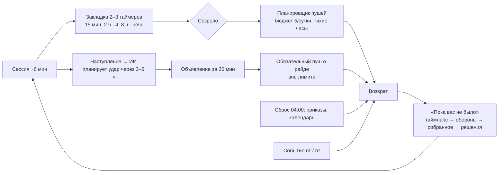
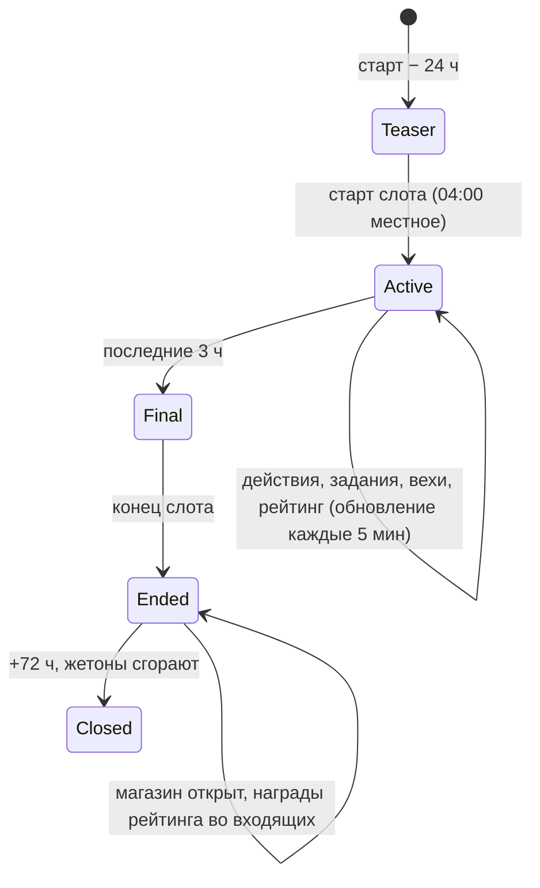

# 8. Удержание и лайв-опс

> **Назначение.** Исполняемая спецификация удержания Raivon: почему игрок возвращается (8 драйверов), FTUE по шагам с аналитикой и fallback, первые 7 дней по сессиям, крючки D1–D90, «Приказы дня» (пул 30 шаблонов), недельные задания, календарь входа на 28 дней, Военный ящик и бесплатные награды, 5 шаблонов событий с YAML, лайв-опс календарь 12 недель, сезонные рескины, полный каталог пушей и планировщик, «Пока вас не было» и возврат, предиктор оттока, социалка, жёсткие запреты, план A/B-тестов, метрики и дашборды.
> **Опирается на канон:** §1.1 (столпы), §2.1 (решения 1–25, особенно 4, 5, 7, 13, 16, 18, 20, 21, 24), §2.2 (п. 4, 24, 25, 28, 30, 32, 33), §3 (глоссарий: `quiet_hours`, `share_timelapse`, `ui_while_away`, `ui_dev_road`), §4 (валюты, жетоны события), §8.4 (командиры), §9.11 (контратаки, лимиты), §9.14 (утешение), §12.1 (главы), §13 (таймеры, ежедневный сброс 04:00), §14 целиком, §15.2–15.7 (плейсменты, кейсы, пасс, подписка), §16.2–16.3 (сервер, remote config), §17 (KPI).
> **Связанные файлы:** `01_vision_core_loop.md` (архетипы сессий, суточный ритм, порядок экрана «Пока вас не было», вопросы В1–В11), `02_map_territory.md` (закрепления FTUE §15.6, снимки границы, анимации), `03_war_combat.md` (наступление, авто-оборона, удары ИИ), `04_units_army.md` (командиры, шаблон нового командира §15.8), `05_economy_buildings.md` (пул дохода, «Собрать всё», временные строители), `06_diplomacy_peace.md` (конференция, ультиматум), `07_progression_meta.md` (главы, УР, Арена, лиги), `09_monetization.md` (цены офферов, паки событий, пасс, кривая уровней пасса), `10_ui_ux_art.md` (экраны, VFX), `11_balance_numbers.md` (масштаб наград по УР), `12_tech_analytics_roadmap.md` (схема аналитики, A/B-платформа).

---

## 8.1. Зона файла, инварианты, обозначения

### 8.1.1. Что здесь и что не здесь

| Здесь | Не здесь (граница) |
|---|---|
| сценарий FTUE, тексты подсказок, аналитические шаги, fallback | правила боя, войны и мира (`03`, `06`) — только их сценарная настройка в FTUE |
| ежедневные, недельные, календарные награды; Военный ящик как источник удержания | шансы и гарант кейсов, цены, паки (`09`) |
| события: механика, жетоны, вехи, когорты, магазин события | содержимое и цена паков события (`09`) |
| пуши: каталог, тексты, планировщик, лимиты | транспорт FCM/APNs, хранение токенов (`12`) |
| возврат, предиктор оттока, интервенции | персональная лестница офферов (`09`) |
| социалка: друзья, сравнение, рейтинги, Таймлапс, рефералы | модерация чата целиком (канон §14.9), лиги Арены (`07`) |
| метрики удержания, дашборды, гипотезы A/B | A/B-движок и схема событий (`12`) |

### 8.1.2. Инварианты удержания (каждый — автотест или серверная проверка)

| # | Инвариант | Источник |
|---|---|---|
| R1 | Отсутствие не наказывается сильнее лимитов §9.11; никакая награда не сгорает из-за пропуска дня, кроме жетонов события через 72 ч после конца | канон §14.1, §4 |
| R2 | Каждая сессия ≥3 мин заканчивается 2–3 открытыми таймерами разной длины (15 мин – 2 ч, 4–8 ч, «на ночь») | канон §14.1 |
| R3 | В защищённых состояниях (бой, церемония мира, церемония УР, FTUE, «Мир расширяется») нет рекламы, офферов, пушей и всплывающих окон удержания | канон §14.10, `01` В7 |
| R4 | Не больше 5 пушей в игровые сутки, из них не больше 3 несрочных; интервал ≥60 мин для несрочных; в тихие часы пушей нет; рейды вне лимита и включены по умолчанию | канон §14.7 |
| R5 | Календарь входа никогда не сбрасывается: пропуск ставит серию на паузу | канон §14.5 |
| R6 | Всё содержимое удержания (задания, календарь, события, пуши) задаётся YAML в `content/` и меняется через remote config без обновления клиента | канон §16.3 |
| R7 | Награды удержания одинаковы во всех странах; в России скрыты только платные SKU (решение 16), бесплатные и рекламные награды те же | решения 7, 13, 16 |
| R8 | Бесплатный приток Райвитов в середине игры остаётся в коридоре 45–55 в день (§8.9.3) | канон §4, §15.8 |

### 8.1.3. Обозначения

- **D0** — день установки (= «день 1» в `01`); **Dn** — n-й игровой день после установки. Игровые сутки начинаются в 04:00 по местному времени (канон §13).
- **День календаря** — номер дня входа в календаре (считает дни с заходом, а не дни с установки).
- **ОП** — опыт пасса. Все значения ОП в этом файле рассчитаны на допущение «1 уровень пасса = 1 000 ОП». Если `09` задаст другую цену уровня, ОП из этого файла масштабируются пропорционально (в YAML хранится доля уровня, `pass_level_share`).
- **«Ресурсы N ч»** — N часов валового производства игрока по каждому ресурсу (канон §4, §15.8: 1 ч = 12 Райвитов). Масштаб по УР — автоматически.
- Пометка **(ПА)** = предложение автора.

---

## 8.2. Модель удержания: почему игрок возвращается

### 8.2.1. Восемь драйверов

| # | Драйвер | Механики (канон) | Временной крючок | Индикатор (метрика) | Ограничитель |
|---|---|---|---|---|---|
| Д1 | **«Синий растёт»** — видимый прирост своей земли | церемония мира (§10.3), колонизация 1,5 с, «Мир расширяется», доля карты главы в %, Таймлапс | цель войны и цель главы всегда видны | доля сессий ≥3 мин с шагом синего ≥85% (`01` P1.1) | дикие земли кончаются → нужна война; перемирия |
| Д2 | **«Обещание эволюции»** — держава меняет облик | 10 УР (§6), «Дорога державы», силуэты ультразабора и небоскрёбов, соседи ИИ со старшим УР | следующий УР всегда на 1–5 дней впереди | дни до УР4/5/6/8 против плана §12.1 (±20%) | гейт территории (§6.2) |
| Д3 | **«Созревание»** — назначенные встречи | 2–3 открытых таймера, доход 8 ч, Военный ящик 6 ч, билеты 2 ч, обозы 15–120 мин, жилы 12 ч | 15 мин – 2 ч / 4–8 ч / ночь | ≥80% сессий заканчиваются ≥2 таймерами (ПА) | максимум 48 ч; последние 5 мин бесплатно |
| Д4 | **«Честная угроза и реванш»** — мир живёт, но предупреждает | контратаки с объявлением за 20 мин, ультиматум 4 ч, предложение мира 2 ч, коалиция 12 ч, «Реванш», «Ответный удар» | 3–6 ч после наступления | доля живых оборон ≥25% от объявленных; открываемость срочных пушей ≥35% (ПА) | лимиты §9.11, тихие часы, Ядро, 24 ч без входа — без новых войн |
| Д5 | **«Ритуалы»** — короткие ежедневные дела | «Приказы дня», календарь входа, недельные задания, «Сводка недели», «Собрать всё» | сброс 04:00, понедельник | все 3 приказа закрывают ≥45% DAU; календарь забирают ≥85% DAU (ПА) | мягкая серия, никакого сброса |
| Д6 | **«Коллекция»** — командиры и косметика | 12 командиров + новый каждые 2 недели, альбомы, ~45 предметов косметики | ключевые дни календаря, вехи событий | 5–7 командиров к D30 (§14.4) | все командиры бесплатны, бонус ≤ +15% |
| Д7 | **«Событийность и сезоны»** — у недели и месяца свой сюжет | малое событие вт–чт, большое пт–пн, пасс и Арена 28 дней, Кейс коллекции, новые главы обновлениями | вторник, пятница, конец сезона | участие в событиях ≥60% WAU (ПА) | события не меняют честность PvE |
| Д8 | **«Социальное зеркало»** — сравнение и показ | друзья, «Сравнить державы», рейтинги по ОТ, Таймлапс с реферальным кодом, Арена, свободный чат | «Сводка недели», ответный рейд Арены 24 ч | друзей на DAU ≥1,5; шеринг ≥5% WAU (ПА) | PvP только по желанию; альянсы — по сигналу владельца |

### 8.2.2. Петля возврата



### 8.2.3. Правила, общие для всех драйверов

1. **Одна новая механика за сессию** в первые 7 дней после FTUE (`01` §1.13.2 п. 4). Порядок открытий — §8.4.
2. **Повод входа — содержательный.** Пуш или крючок всегда называет конкретную вещь: гекс, армию, залежь, командира. Пустых «Мы скучаем» нет (§8.13).
3. **Пропуск не наказывается**, приход вознаграждается: доход ждёт 8 ч, ящики копятся до 2, билеты до 5, календарь на паузе.
4. **Длинная цель всегда на экране.** На HUD закреплена лента «Дальше» (ПА `01`): цель главы «14/20 гексов» или ближайший УР «Королевство — 21/24 гекса».

---

## 8.3. FTUE: первые 10 минут по шагам

### 8.3.1. Принципы

- **Без текста там, где хватает жеста.** Текст — только существительные-метки (≤3 слова) и одна фраза-смысл «Оккупировано — граница закрепится миром» (канон §14.3). Вся подача — рука-призрак, пульсация, иконки, мимика Сержанта Брама.
- **Одно действие на экран.** Пока шаг не выполнен, остальные элементы HUD притушены (альфа 40%) и не принимают тапы.
- **Ни рекламы, ни офферов, ни пушей, ни чата** (канон §14.3, §14.10). Rewarded появляется после 10-й минуты, interstitial — с 3-го дня.
- **Карта и сценарий фиксированы:** закрепления `02` §15.6 (`ftue_mill`, `ftue_border_a/b`, `ftue_copper_mine`, `ftue_pocket_1/2`, `ftue_extra`, `ftue_first_deposit`, `ftue_fence_hex`, `ftue_raider_spawn`).
- **Тест «30 секунд без текста»** (канон §1.1, §16.5): от тапа «В бой!» (F03) до первого захвата (F05) ≤30 с без единой строки текста в кадре. Блокер релиза.

### 8.3.2. Лестница помощи (одинакова для всех шагов)

| Уровень | Когда | Что происходит | Поле `assist` в аналитике |
|---|---|---|---|
| 0 | сразу | цель пульсирует, остальное притушено | 0 |
| 1 | бездействие 6 с или 1 ошибочный жест | рука-призрак показывает жест (цикл 1,5 с) | 1 |
| 2 | бездействие 12 с или 2 ошибки | камера центрируется на цели, зона попадания ×1,5, стрелка-след жеста; Брам указывает рукой | 2 |
| 3 | бездействие 20 с или 3 ошибки | упрощённый ввод: тап по цели засчитывается как свайп или удержание; для неинтерактивных шагов — авто-выполнение с рукой-призраком | 3 |

Цель: ≥90% игроков проходят ключевые шаги (F04, F06, F11, F17, F20, F28) на уровне помощи ≤1.

### 8.3.3. Сценарий по шагам

Аналитика: каждое выполнение шага шлёт `ftue_step {step, t_ms (от старта), dt_ms (длительность шага), attempts, assist}`; таблица даёт только имя `step`.

| Шаг | Время | Что видит | Что делает | Текст / подсказка | `step` | Критерий успеха | Fallback |
|---|---|---|---|---|---|---|---|
| **A. Загрузка** | | | | | | | |
| F01 | 0:00–0:10 | заставка с логотипом и полосой загрузки; гостевой аккаунт создаётся молча, язык — по локали устройства | ничего | — | `f01_boot` | карта на экране ≤15 с (p90, Android 2 ГБ) | нет сети → экран «Нет связи · Повторить» (только онлайн, решение 4); >15 с → анимированная диорама с флагом вместо полосы |
| F02 | 0:10–0:15 | наезд камеры: синяя держава из 7 гексов, на севере красные Бароны, на `ftue_mill` дымит сожжённая мельница; Брам у границы машет вилами | ничего (5 с) | облачко Брама с иконкой горящей мельницы | `f02_reveal` | — | — |
| **B. Наступление 1 (60 с, сценарий)** | | | | | | | |
| F03 | 0:15–0:20 | сектор у Мельницы уже выбран, фаза подготовки, большая кнопка в зоне большого пальца | тап «В бой!» | «В бой!» (кнопка) | `f03_battle_tap` | тап ≤10 с | лестница помощи; уровень 3 — автостарт через 20 с |
| F04 | 0:20–0:35 | таймер 60 с; полоса энергии 5/10; карта «Атака» с цифрой 2 мерцает; рука-призрак ведёт от армии 1 к `ftue_border_a` | свайп армия → гекс | иконка «2⚡» | `f04_first_swipe` | верный свайп ≤15 с, ≥95% на помощи ≤1 | тап вместо свайпа → уровень 1; на уровне 3 тап по гексу = приказ |
| F05 | 0:35–0:45 | столкновение (R ≈ 1,6, зелёные мечи), гекс переходит под штриховку с флажком | смотрит | над гексом всплывает «Оккупировано» | `f05_first_capture` | первый захват ≤30 с от F03 | — |
| F06 | 0:45–1:00 | две армии соседствуют с Мельницей; рука-призрак тащит карту «Атака» на Мельницу; при наведении значок «Клин +20%» | перетаскивает карту на Мельницу | «Клин +20%» (значок) | `f06_wedge` `{wedge: bool}` | перетаскивание ≤15 с | свайп одной армией засчитывается (сценарий даёт R ≥1,1), Клин подсвечивается на следующей цели |
| F07 | 1:00–1:12 | Мельница взята (★★), Брам вбегает на гекс, портрет с рамкой «Сержант Брам» и значком «+5% пехоте» влетает в слот армии | смотрит | «Сержант Брам» | `f07_bram` | — | — |
| F08 | 1:12–1:20 | `ftue_border_b` пульсирует слабее, без руки-призрака | атакует сам (свайп или карта) | — | `f08_free_attack` | захват до 0:55 таймера боя | если не взят к 0:55, защитник сценарно отступает и гекс засчитывается в конце боя |
| F09 | 1:20–1:30 | конец боя (все 3 цели взяты → досрочно); итог ★★★; толстый контур пульсирует на месте | «Продолжить» | **«Оккупировано — граница закрепится миром»** | `f09_battle_result` `{stars}` | ≥99% доходят | — |
| **C. Мир 1 (заполнен заранее)** | | | | | | | |
| F10 | 1:30–1:40 | вверху кнопка «Мир (24)» пульсирует; шкала «Контроль фронта 62%» (ВС 23,8: оккупация 10,8 + цель 10 + ★★★ 3); лидер Баронов поднимает белый флаг | тап «Мир» | — | `f10_peace_open` | ≤8 с | лестница помощи |
| F11 | 1:40–1:55 | пергамент: 3 гекса (Мельница и 2 гекса) = 10,8 ≤ 23,8, кнопка зелёная; печать с кольцом заполнения | удерживает печать 0,8 с | «Удерживай» | `f11_seal_hold` `{attempts}` | удержание ≤10 с | 2 коротких тапа → кольцо показывает заполнение; 3-й тап засчитывается как удержание |
| F12 | 1:55–2:02 | церемония 7 с (канон §10.3): контур перетекает чернилами, «поп» гексов по гамме; «+3 гекса · Держава 18 → 22 · Карта главы 14% → 20%» | смотрит; пропуска нет | счётчики | `f12_ceremony` | ≥99,5% досматривают | — |
| F13 | 2:02–2:30 | награды влетают в HUD (золото, еда), кнопки ×2 нет (FTUE); остаток 13 очков → «мнение +13» | «Продолжить» | — | `f13_peace1_done` | **≥92% от F01** (канон) | — |
| **D. Владение** | | | | | | | |
| F14 | 2:30–2:55 | поле названия заполнено сгенерированным именем (слоговой генератор), кнопка кубика | правит или оставляет | «Название державы» | `f14_name` `{custom}` | подтверждение ≤25 с | «Дальше» без правки оставляет имя; мат и ссылки → «Выберите другое название» (серверный фильтр §14.9) |
| F15 | 2:55–3:15 | конструктор флага: 3 ряда (форма, поле, эмблема), по 6 бесплатных вариантов | 3 тапа | — | `f15_flag` `{randomized}` | ≤20 с | кнопка «Случайный»; пропуск = случайный флаг |
| F16 | 3:15–3:30 | нейтральный экран «Год рождения» (барабан, без значения по умолчанию); затем EU — UMP CMP, iOS — предзапрос ATT (после первого мира, канон §15.2) | выбирает год, отвечает на согласия | «Год рождения» | `f16_age` `{bucket: <13, 13–15, 16–17, 18+}`, `f16_consent` `{gdpr, att}` | ≤15 с | закрытие согласий = неперсонализированная реклама; <13 → только готовые фразы в чате и неперсонализированная реклама (канон §14.9, §15.2) |
| **E. Эволюция** | | | | | | | |
| F17 | 3:30–3:45 | Резиденция светится стрелкой; карточка «Деревня» с силуэтом изб | тап Резиденции → «Улучшить» | — | `f17_res_upgrade` | ≤10 с | лестница помощи |
| F18 | 3:45–3:55 | таймер 1:00 и зелёная кнопка «Бесплатно» (последние 5 мин любого таймера бесплатны, §13.1) | тап «Бесплатно» | «Бесплатно» | `f18_free_speedup` | ≤10 с | не нажал — таймер идёт, игрок ведётся на F20, церемония сыграет по завершении |
| F19 | 3:55–4:03 | церемония УР2 (6 с): волна от столицы, халупы → избы, ополченцы → копейщики; затем 2 с тизер: над столицей силуэт небоскрёбов, иконка «Дорога державы» влетает в HUD | смотрит | «Однажды здесь…» | `f19_dl2` | — | — |
| F20 | 4:03–4:25 | жёлтый пульсирующий контур на `ftue_first_deposit` «Золотая жила»; иконка обоза пульсирует | тап обоза → тап залежи | — | `f20_convoy_sent` | ≤12 с | лестница помощи |
| F21 | 4:25–5:00 | обоз идёт 15 с, кольцо сбора 30 с; параллельно начинается F22 | — | — | `f21_deposit_done` | — | — |
| **F. Оборона** | | | | | | | |
| F22 | 4:40–4:55 | на `ftue_fence_hex` значок молотка | тап гекса → «Укрепление» → «Строить» (10 с) | «Плетень» | `f22_fort_build` | ≤12 с | лестница помощи |
| F23 | 4:55–5:15 | строитель вбивает колья; на `ftue_raider_spawn` собираются серые мародёры, над ними реальный отсчёт 15 с | ждёт | — | `f23_raid_seen` | — | — |
| F24 | 5:15–6:00 | налёт: мародёры бьются о плетень и опрокидываются в облачко; «Отбито!» +золото | смотрит | «Отбито!» | `f24_raid_repelled` | 100% (сценарий) | — |
| **G. Война 2 за Медную шахту** | | | | | | | |
| F25 | 6:00–6:15 | лидер Вольных Хуторов дразнит; на `ftue_copper_mine` флажок цели; кнопка «Объявить войну», цель выбрана | тап «Объявить войну» | «Цель: Медная шахта» | `f25_war2_declare` | ≤10 с | лестница помощи |
| F26 | 6:15–6:30 | Хутора краснеют (`map_enemy`); в руку влетает новая карта «Окружение» (3⚡) | тап «В бой!» | «Новая карта» | `f26_new_card` | ≤10 с | автостарт на уровне 3 |
| F27 | 6:30–7:05 | бой 60 с; шахта и `ftue_extra` берутся свайпами или Клином (рука только при бездействии 8 с) | атакует | — | `f27_mine_taken` | шахта взята ≤35 с | сценарный перевес R ≥1,5 на шахте |
| F28 | 7:05–7:35 | энергия ≥3; рука-призрак тащит «Окружение» на `ftue_pocket_1`; при наведении красный пунктир «Котёл: 2» | перетаскивает карту | «Котёл: 2» | `f28_encircle` | ≤15 с | на уровне 3 карта разыгрывается сама с рукой-призраком |
| F29 | 7:35–8:30 | конец боя; котёл сдаётся ускоренно (10 с вместо 1 ч, только FTUE): белые флаги над 2 гексами; шкала растёт до ~67% | смотрит, «Продолжить» | «Котёл сдался» | `f29_pocket` | — | — |
| **H. Мир 2 — первый выбор** | | | | | | | |
| F30 | 8:30–8:55 | пергамент с двумя крупными карточками: **А «Земля»** — шахта + котёл + 1 гекс (16,7 очка, выбрана по умолчанию); **Б «Золото»** — 3 пакета контрибуции + репарации (20 очков); ВС ≈33,8 | выбирает | «Земля» / «Золото» | `f30_peace2_choice` `{A|B}` | ≤20 с | бездействие 15 с → пульс «Земля»; «Подписать» работает с выбором по умолчанию |
| F31 | 8:55–9:10 | 2 сегмента «Пощадить» / «Разграбить 30%»; под «Разграбить» превью добычи и три лица соседей хмурятся («Соседи запомнят»); значок угрозы | выбирает | «Соседи запомнят» | `f31_plunder` `{spare|30}` | ≤15 с | предвыбора нет (выбор обучает); бездействие → рука по очереди указывает на оба |
| F32 | 9:10–9:30 | печать и церемония (вторую можно ускорить ×3 тапом): «+4 гекса · Глава I: 14/20» | удерживает печать | — | `f32_peace2_done` | ≥98% от F30 | как F11 |
| **I. Крючки** | | | | | | | |
| F33 | 9:30–9:40 | карточка Брама: «Сообщить, когда враг готовит удар?» [Да] [Позже]; «Да» → системный запрос (iOS; Android 13+ POST_NOTIFICATIONS) | отвечает | канон §14.3 | `f33_push_pre` `{yes|later}`, `f33_push_os` `{granted}` | ≥55% разрешили (канон) | «Позже» → системный запрос не показывается (бережём одноразовый запрос iOS), повтор по §8.13.6 |
| F34 | 9:40–9:52 | рука-призрак: «Кварталы ур. 2» (15 мин) → строитель; обоз → малая залежь (≈20 мин с дорогой) | 2 действия | — | `f34_timers_set` `{n}` | 2 таймера заложены | на уровне 3 таймеры закладываются автоматически |
| F35 | 9:52–10:00 | итог: «Глава I: 14/20» (при выборе Б — «10/20»), список открытых таймеров: стройка 15 мин, обоз 20 мин, «Военный ящик через 1 ч»; силуэт Баронов с биноклем («что-то замышляют») | «Играть» | «Глава I: 14/20» | `ftue_complete` `{duration_s, choice, plunder, push}` | **≥85% от F01** (канон) | — |

После F35 включаются: rewarded-плейсменты, чат (УР2, канон §14.9), «Приказы дня» (со 2-й сессии, §8.4), первый Военный ящик через 1 ч, скриптовый ультиматум Баронов через ~2 ч (§8.4.2).

### 8.3.4. Контрольные точки и восстановление

| Ситуация | Поведение |
|---|---|
| Приложение свёрнуто или убито | возобновление с последней контрольной точки: F09, F13, F16, F21, F24, F29, F32, F35. Бой FTUE при сворачивании дольше 60 с доигрывает серверный автопилот (канон §9.16), результат сценарно победный |
| Обрыв сети | оверлей «Переподключение…»; бой продолжается локально до 60 с (канон §2.2 п. 40) |
| Переустановка / привязанный аккаунт уже прошёл FTUE | FTUE не повторяется; новый гостевой аккаунт на том же устройстве — кнопка «Войти в существующий аккаунт» на F01 (Game Center, Play Games, Sign in with Apple) |
| Повторный заход гостя, бросившего FTUE | старт с контрольной точки; если прошло >24 ч — короткое напоминание жеста (рука-призрак 3 с) |
| «Меньше анимации» (доступность) | церемонии 2 с, рука-призрак статичная стрелка |
| Слабое устройство (<30 fps) | частицы церемонии ½, тени выкл.; тайминги шагов не меняются |

### 8.3.5. Воронка FTUE: бюджет потерь

| Отрезок | Шаги | Допустимая потеря | Накопленно доходят |
|---|---|---|---|
| Загрузка | F01–F02 | 3,0% | 97,0% |
| Наступление 1 | F03–F09 | 2,0% | 95,0% |
| Мир 1 | F10–F13 | 1,0% | 94,0% (цель канона ≥92%) |
| Владение | F14–F16 | 1,5% | 92,5% |
| Эволюция и обоз | F17–F21 | 1,5% | 91,0% |
| Оборона | F22–F24 | 1,0% | 90,0% |
| Война 2 | F25–F29 | 2,0% | 88,0% |
| Мир 2 и крючки | F30–F35 | 2,0% | 86,0% (цель канона ≥85%) |

Шаг, потерявший больше бюджета на 2 когортах подряд, получает задачу на правку (дашборд §8.19.3).

---

## 8.4. Первые 7 дней (D0–D7) по сессиям

### 8.4.1. Лестница открытий (не больше одной новой механики за сессию)

| Сессия / день | Новая механика (одна) | Почему здесь |
|---|---|---|
| D0 · S1 | FTUE: наступление, мир, оккупация, УР, обоз, укрепление, окружение | канон §14.3 |
| D0 · S2 | дикие земли: лагерь мародёров → колонизация | путь роста без войны, сразу после FTUE |
| D0 · S3 | ультиматум (скриптовый) | первая инициатива ИИ, учит «Отказать / Откупиться / Принять» |
| D0 · S4 | живая оборона (скриптовая контратака) и «Мир расширяется» | первая угроза — всегда отбита (канон §9.11) |
| D0 · S5 | «Приказы дня» и «Дорога державы» | ритуал и длинная цель перед ночью |
| D1 | реки и порты (глава II), 3-й строитель | новая земля |
| D2 | Арена Рубежей (УР4) | отдельный режим, по желанию |
| D3 | Посольство и союз | дипломатия главы II |
| D4 | событие (первое участие) | лайв-опс |
| D5 | «Тревога соседей» становится видимой | порог коалиции 60 |
| D6 | нефть и Завод (УР5) | новая цель войны |
| D7 | недельные задания и «Сводка недели» (если понедельник — раньше) | недельный ритм |

Если игрок идёт быстрее (например, УР4 на D1), механика открывается по факту, но **показ подсказки** откладывается до следующей сессии, где ещё не было новой механики. Очередь подсказок — `ftue_hint_queue` в профиле (ПА).

### 8.4.2. D0 — день установки

| Сессия | Когда | Содержание | Крючки | Таймеры на выходе |
|---|---|---|---|---|
| S1 FTUE | 0:00–0:12 | §8.3 | «Глава I: 14/20», силуэт небоскрёбов | стройка 15 мин, обоз ~20 мин, ящик 1 ч, ультиматум ~2 ч |
| S2 «Хозяйственная» | +30–60 мин | календарь, день 1; лагерь мародёров (бой 60 с) открывает дикий гекс; колонизация ×2 по 1 мин; 16 гексов → Резиденция УР3 (15 мин; `ad_speedup` уже доступна); 3-я армия, 3-й обоз. Единственный всплывающий оффер — «Набор новобранца» (канон §15.3, окно 72 ч) **после** церемонии УР3 и не раньше 3-й минуты сессии (ПА) | Военный ящик; «Глава I: 16/20» | тренировка ~9 мин, обоз на залежь M, исследование 30 с – 30 мин |
| S3 «Пожарная» | ~2 ч после FTUE | скриптовый ультиматум Баронов (`push_ultimatum`): обычный пограничный гекс вне Ядра или «дань 8 ч золота». Волк откуп не принимает (канон §9.1); советник подсвечивает «Отказать» с прогнозом сил «Ваши армии сильнее». Отказ → война через 1 ч; встречная цель из 3 рекомендованных (`01` В3) | таймер «Война через 1 ч» | армии маршем к границе (20 с/гекс) |
| S4 «Военная» | +1 ч | наступления против Баронов. **Скриптовая контратака:** после первого наступления этой войны Бароны объявляют удар (стрелка сразу, удар через 20 мин, пуш через 5 мин после стрелки). Если игрок в игре — живая оборона с подсказкой «Оборона на атакуемый гекс»; если нет — авто-оборона. Исход гарантированно победный (флаг `first_strike_won`, канон §9.11). Мир (рекомендованный пакет), 20/20 → «Мир расширяется» 50 → 90; наследие главы I: Капитан Лира + 200 Райвитов | новые соседи Речная Лига и Орден Камня; «Тёмное озеро» на краю | перемирие 30 мин, пополнение 40 мин |
| S5 «Ночная закладка» | вечер | «Приказы дня» (первый набор: «Соберите доход 3 раза», «Присоедините 1 дикий гекс», «Проведите 2 наступления»); «Дорога державы» с силуэтом ультразабора; залежь L «на ночь» (120 мин) | календарь завтра: **3-й строитель** | залежь L 2 ч, исследование, стройка 15–30 мин |

**Правила скриптов D0 (ПА):**
- Ультиматум выдаётся через 2 ч ± 15 мин после `ftue_complete`, но только в окне [конец тихих часов; начало тихих часов − 5 ч] (по умолчанию 07:00–18:00, `03` §4). Вне окна — в начале следующего окна.
- Если игрок сам объявил войну Баронам раньше ультиматума, ультиматум отменяется, скриптовая контратака переносится в эту войну.
- Если мир подписан до объявленного удара, удар отменяется (`01` В6). Тогда флаг `first_strike_won` переходит на первую контратаку главы II.
- Если к концу D0 игрок не закрыл главу I, советник в первой сессии D1 показывает 3 гекса с зелёным прогнозом у Хуторов или Баронов (перемирие 30 мин к тому времени истекло).

### 8.4.3. D1–D7

| День (календарь входа) | Типичные сессии | Что открывается | Крючки | Таймеры на выходе дня |
|---|---|---|---|---|
| **D1** (день 2) | 5–6: смотр, военная, хозяйственная, ночная | **3-й строитель** (календарь); глава II «Речной край»: реки (атака через реку −25%), порты; колонизация 5 мин; первые настоящие удары ИИ (4–6 ч после наступления) | «Набор новобранца» ещё 48 ч; цель «Королевство — 24 гекса»; ящики каждые 6 ч | стройка 1–2 ч, исследование 1 ч, залежь L |
| **D2** (день 3) | 5 | УР4 (24 гекса, Резиденция 1 ч) → **Арена Рубежей**, 5 калибровочных боёв; 4-й слот армии, Поддержка; карты Подкрепление и Марш-бросок. Interstitial для неплатящих начинаются с этого дня (3-й день, канон §15.2); «Державный патент» доступен (канон §15.3) | календарь: 30 Райвитов; билеты Арены копятся до 5 | УР4 1 ч, билеты, стройка 2 ч |
| **D3** (день 4) | 5 | **Генерал Вега** (календарь, +Клин); Посольство (УР3) — первый союз при мнении ≥50 | Вега даёт повод для Клина в следующей войне; союзник — карта «Союзный корпус» | исследование 2–3 ч |
| **D4** (день 5) | 4–5 | первое событие, в которое попадает новичок (вт–чт «Золотая лихорадка» или пт–пн большое, §8.10.1); лига Арены после калибровки | вехи события, магазин события | залежи M/L (событие удваивает их число) |
| **D5** (день 6) | 4–5 | «Тревога соседей» видна (порог гл. II = 60); первый подарок соседу | риск коалиции — повод думать о мире и подарках | стройка 3 ч |
| **D6** (день 7) | 5 | **Ирма Сталь** (календарь, «Прорыв» +1 гекс); УР5 (32 гекса, 3 ч): Тёмные озёра → нефть, Нефтевышка, Завод, 4-й обоз | пак эпохи УР5 (48 ч, показ в начале следующей сессии, `01` §1.6.6) | УР5 3 ч → ночная церемония или утро |
| **D7** (день 8) | 5 | пасс ~12 из 40 (канон §14.4); цель главы II 36 гексов близко (дни 7–9) → «Мир расширяется» 90 → 160; недельные задания идут с понедельника | глава III: гегемон Альвария, танки на УР6 на «Дороге державы» | Нефтевышки, исследование 4 ч, залежь L |

**Если игрок пропустил день:** календарь стоит на паузе, Военные ящики копятся до 2, доход ждёт 8 ч, удары ИИ — в пределах лимитов, новых войн при отсутствии >24 ч нет. Ничего из ключевых наград D1–D7 не теряется: они просто сдвигаются на следующий день входа.

---

## 8.5. Крючки D1 / D3 / D7 / D14 / D30 / D60 / D90

Цели D1, D7, D30, D90 — канон §17; D3, D14, D60 — интерполяция степенной кривой между ними (ПА).

| Горизонт | Цель (минимум) | Главные крючки | Что гарантированно ждёт игрока именно в этот день | Риск оттока и контрмера |
|---|---|---|---|---|
| **D1** | 40% (32%) | скриптовый ультиматум и глава I за 3–5 сессий; «Мир расширяется»; ночная залежь L; своё название и флаг | **3-й строитель** (календарь, день 2) | не закрыл главу I → советник с 3 зелёными целями в первой сессии D1 |
| **D3** | 24% (19%) | Арена на УР4 (D2–D3), калибровка; Генерал Вега (день 4); первый союз; первые настоящие контратаки и живая оборона | Вега | первое поражение → утешение §9.14, «Реванш», Щит 24 ч; без офферов 10 мин |
| **D7** | 16% (12%) | Ирма Сталь (день 7); УР5 и нефть; первое событие выходных; пасс ~12/40; «Тревога соседей»; глава II близка к концу | Ирма; недельный сундук | «стена апкипа» на УР4–5 → панель «Содержание» и консервация (`05` §7.7) |
| **D14** | 11% (8%) | глава III «Континент», гегемон Альвария; УР6 на горизонте (дни 14–20); новый командир события (раз в 2 недели); середина сезона | календарь день 14: **300 Райвитов** | плато «нет цели» → советник показывает Райвитовую жилу или нефть у соседа как цель войны |
| **D30** | 7% (5%) | УР6: танки, авиация, многоэтажки; первая коалиция; конец сезона пасса и Арены (день 28) и старт нового; 5–7 командиров; «Ультразабор» (УР8) как цель | день 28: **20 осколков Императора Рая**; начало календаря второго цикла | конец сезона → немедленный старт сезона N+1 и Кейс коллекции; награды сезона сохраняются |
| **D60** | 4% (3%) | глава IV «Индустриальный пояс», УР8 (дни 40–50): **ультразабор и небоскрёбы**; войны на 2 фронта; 3-й сезон; Походы (v1.1, недели 6–8 после запуска); 8–10 командиров | церемония УР8 — самый большой визуальный скачок запуска | контент запуска пройден → Походы, события, Арена «Мастер+», тизер главы V |
| **D90** | 3% (2%) | глава V «Океаны» и УР9 (v1.2, недели 10–12 после запуска); событие-реран командиров квартала (`04` §15.8); коллекция косметики; «Летопись державы» | новый кольцевой мир +110 гексов | длинные таймеры → «Паёк» и подписка как комфорт (`09`), но без давления; ре-онбординг вернувшихся |

**Правило крючков (ПА):** у каждого горизонта есть минимум одна **детерминированная** награда, которую нельзя пропустить из-за невезения (календарь, наследие главы, церемония), и минимум одна **социальная** (сравнение, рейтинг, Таймлапс).

---

## 8.6. «Приказы дня»

### 8.6.1. Правила

| Параметр | Значение |
|---|---|
| Число заданий | 3 в сутки из пула 30 шаблонов (канон §14.5) |
| Открытие | со 2-й сессии D0 (после FTUE), первый набор фиксирован (§8.4.2) |
| Сброс | 04:00 по местному времени; набор выдаётся лениво при первом запросе после сброса |
| Награда за задание | ОП: лёгкое 150, среднее 200, тяжёлое 250 (ПА, ≈0,15–0,25 уровня) |
| Награда за все три | **Военный ящик + 10 Райвитов** (канон) |
| Замена | 1 бесплатная замена в сутки на любое невыполненное задание (ПА); реклама и Райвиты замену не покупают |
| Слоты | A — экономика (лёгкое), B — карта и война (среднее), C — разнообразие (любое, по профилю игрока) |
| Персонализация | шаблон не повторяется в слоте 3 суток; слот C берёт веса из поведения за 7 дней (Арена у тех, кто играет Арену; колонизация у тех, кто не воюет) |
| Выполнимость | генератор проверяет условия «доступно, если» на момент выдачи; задание, ставшее невыполнимым (кончились дикие гексы, все соседи в перемирии до сброса), заменяется автоматически без траты бесплатной замены |
| Прогресс | считается сервером по игровым событиям; засчитывается и во время офлайна (обоз разгрузился, котёл сдался) |
| Отображение | чип на HUD «Приказы 1/3»; список в 1 тап; выполненное задание даёт ОП сразу (летит в полосу пасса) |
| Подписка | без отличий (ПА: ежедневные ритуалы одинаковы для всех) |

### 8.6.2. Генератор (псевдокод)

```ts
// server/retention/dailyOrders.ts
function rollDailyOrders(p: Player, day: GameDay): Order[] {
  const pool = ORDERS.filter(o => o.available(p) && !recentlyUsed(p, o.id, 3));
  const a = weightedPick(pool.filter(o => o.slot === 'A'), w => w.base, p.seed(day, 'A'));
  const b = weightedPick(pool.filter(o => o.slot === 'B' && o.id !== a.id), w => w.base, p.seed(day, 'B'));
  const c = weightedPick(pool.filter(o => ![a.id, b.id].includes(o.id)),
                         w => w.base * profileWeight(p, w.tags), p.seed(day, 'C'));
  return [a, b, c].map(o => o.instantiate(p));       // цели масштабируются по УР (поле scale)
}
function onInfeasible(p: Player, order: Order): void { // проверка раз в сессию и при событии мира
  if (!order.available(p) && !order.done) replaceOrder(p, order, { free: true });
}
```

### 8.6.3. Пул 30 шаблонов

Цели в скобках — для УР 1–3 / 4–6 / 7–8, если они масштабируются.

| # | Код | Текст (RU) | Условие засчитывания | Доступно, если | Слот | Сложн. | ОП |
|---|---|---|---|---|---|---|---|
| 1 | `order_collect_3` | Соберите доход 3 раза | 3 «Собрать всё» с паузой ≥30 мин между ними | всегда | A | лёгк. | 150 |
| 2 | `order_deposits` | Соберите залежи: 3 (4 / 5) | разгрузки обозов | всегда | A | лёгк. | 150 |
| 3 | `order_deposit_big` | Соберите залежь M или L | разгрузка залежи размера M/L | всегда | B | средн. | 200 |
| 4 | `order_raider_camp` | Разбейте лагерь мародёров | победа в бою 60 с | есть доступный лагерь | A | лёгк. | 150 |
| 5 | `order_colonize` | Присоедините дикий гекс | завершённая колонизация | есть дикий гекс у границы | A | лёгк. | 150 |
| 6 | `order_upgrades_2` | Начните 2 улучшения | 2 старта задач строителей | свободен строитель | A | лёгк. | 150 |
| 7 | `order_fort` | Улучшите укрепление | старт улучшения `bld_fort` | всегда | A | лёгк. | 150 |
| 8 | `order_research` | Начните исследование | старт исследования | очередь Академии свободна или освободится до сброса | A | лёгк. | 150 |
| 9 | `order_train` | Обучите отряды: 3 (4 / 5) | завершённые тренировки | всегда | A | лёгк. | 150 |
| 10 | `order_offensives_2` | Проведите 2 наступления | 2 завершённых PvE-наступления с ≥1 приказом атаки | идёт война или можно объявить | B | средн. | 200 |
| 11 | `order_stars_2` | Получите ★★ в наступлении | итог ★★ или ★★★ | как №10 | B | средн. | 200 |
| 12 | `order_stars_3` | Получите ★★★ в наступлении | итог ★★★ | как №10 | C | тяж. | 250 |
| 13 | `order_capture` | Захватите гексы: 4 (6 / 8) | оккупации в наступлениях | как №10 | B | средн. | 200 |
| 14 | `order_wedge_2` | Атакуйте Клином 2 раза | 2 столкновения с `form_wedge` | как №10 | B | средн. | 200 |
| 15 | `order_pocket` | Окружите котёл | образован котёл любого размера | УР2, как №10 | C | тяж. | 250 |
| 16 | `order_cards` | Разыграйте карты: 5 (6 / 8) | розыгрыши карт, кроме «Атаки» | как №10 | B | средн. | 200 |
| 17 | `order_peace_win` | Подпишите победный мир | мир при ВС > 0 | идёт война | C | тяж. | 250 |
| 18 | `order_annex_value` | Присоедините миром гексы ценностью 5+ | сумма ценности аннексированного за сутки ≥5 | идёт война | C | тяж. | 250 |
| 19 | `order_building_hex` | Захватите гекс с постройкой | оккупация фермы, шахты, города, порта, нефти, завода или базы | как №10 | B | средн. | 200 |
| 20 | `order_crates_2` | Откройте 2 Военных ящика | 2 открытия `case_war_crate` | всегда | A | лёгк. | 150 |
| 21 | `order_refill` | Пополните армию до 100% | любая армия достигла 100% (время, реклама, предмет) | есть армия <100% | A | лёгк. | 150 |
| 22 | `order_market` | Обменяйте ресурсы на Рынке | 1 обмен | УР2 | A | лёгк. | 150 |
| 23 | `order_gift` | Сделайте подарок соседу | подарок ИИ | глава II+, перезарядка подарка готова | A | лёгк. | 150 |
| 24 | `order_arena_2` | Атакуйте на Арене 2 раза | 2 атаки | УР4, калибровка пройдена | C | средн. | 200 |
| 25 | `order_arena_stars` | Наберите на Арене 4 звезды | сумма звёзд за сутки | как №24 | C | средн. | 200 |
| 26 | `order_intercept` | Перехватите вражеский обоз | перехват (канон §5.2) | идёт война, вражеский обоз в пути | C | тяж. | 250 |
| 27 | `order_type_upgrade` | Улучшите постройки одного типа | старт улучшения Кварталов, Ферм, Шахт, Портов, Нефтевышек, Заводов или Баз | свободен строитель | A | лёгк. | 150 |
| 28 | `order_commander_up` | Повысьте командира | повышение уровня | хватает осколков и золота | A | лёгк. | 150 |
| 29 | `order_oil` | Соберите нефтяные фонтаны: 2 | разгрузка `dep_oil` | УР5 | B | средн. | 200 |
| 30 | `order_three_armies` | Проведите наступление 3 армиями | ≥3 армии в секторе на старте | УР3, как №10 | B | средн. | 200 |

**Ожидания (ПА):** все 3 задания закрывают ≥45% DAU; среднее время на набор — 15–25 мин суммарной игры за сутки (укладывается в 25–35 мин дня, канон §15.6).

---

## 8.7. Недельные задания и «Сводка недели»

### 8.7.1. Семь заданий недели

Сброс в понедельник 04:00 (канон §14.5). Набор фиксирован, цели масштабируются по УР (УР 1–3 / 4–6 / 7–8). Выполненное засчитывается сразу, сундук недели — по двум ступеням.

| # | Код | Задание | Цель | ОП (ПА) | Замена, если невыполнимо |
|---|---|---|---|---|---|
| W1 | `weekly_peace` | Подпишите победные миры | 1 / 2 / 2 | 500 | — (миров всегда хватает: ИИ-соседи и коалиции) |
| W2 | `weekly_capture` | Захватите гексы в наступлениях | 15 / 30 / 40 | 500 | — |
| W3 | `weekly_orders` | Закройте все «Приказы дня» | 5 дней из 7 | 600 | — |
| W4 | `weekly_deposits` | Соберите залежи | 15 / 20 / 25 | 400 | — |
| W5 | `weekly_builds` | Завершите улучшения и исследования | 8 / 12 / 12 | 400 | — |
| W6 | `weekly_forms` | Окружите котлы или атакуйте Клином | 2 котла или 8 Клиньев | 500 | — |
| W7 | `weekly_event` | Заработайте жетоны события | 500 / 800 / 1 000 | 500 | недели без событий нет (§8.11); до УР3: «Разбейте 5 лагерей мародёров или присоедините 5 гексов» |

### 8.7.2. Сундук недели

| Ступень | Условие | Содержимое (ПА) |
|---|---|---|
| 1 | 4 из 7 заданий | 2 Военных ящика + 2 ускорения 1 ч |
| 2 | 7 из 7 | Ресурсы 8 ч + ускорение 3 ч + 10 осколков командира на выбор из двух (обычный или редкий, из тех, что игрок ещё не довёл до ур. 20) + 1 Военный ящик |

Райвитов в сундуке нет: бюджет §8.9.3 уже закрыт приказами, календарём и пассом.

### 8.7.3. «Сводка недели»

- **Когда:** первый вход после понедельничного сброса, после экрана «Пока вас не было» (если он есть), до любых офферов. 8 с, пропуск тапом, хранится в профиле.
- **Что внутри:** таймлапс «неделю назад → сейчас» по снимкам границы (`02` §18.3); 3 числа «+N гексов · M миров · K котлов»; лучший момент недели (самый ценный аннексированный гекс); изменение в рейтинге друзей; новые командиры; кнопка «Поделиться» (Таймлапс §8.16.4).
- **Если гексов не прибавилось:** вместо таймлапса — карточка цели «До главы III: 6 гексов» и 3 рекомендованные цели войны.

---

## 8.8. Календарь входа (28 дней)

### 8.8.1. Правила

- **Мягкая серия** (канон §14.5): день календаря засчитывается при первом заходе в игровые сутки; пропуск ставит календарь на паузу, сброса нет.
- **Забор награды:** экран календаря открывается автоматически в первой сессии суток, после «Пока вас не было», вне защищённых состояний. Награда забирается тапом; если не забрана, она ждёт (повторно день не засчитывается).
- **`ad_daily_double`** (канон §15.2, 1 в сутки): ×2 для ресурсов, ускорений, ящиков, Райвитов и осколков. На ключевых днях (уникальные строитель, командир, косметика, 300 Райвитов) кнопки ×2 нет (ПА). Подписчик получает ×2 без просмотра (канон §15.7).
- **Россия:** календарь тот же; ×2 через рекламу работает (решение 16).

### 8.8.2. Цикл 1 «Новобранец» (полная таблица)

| День | Награда | ×2 | Комментарий |
|---|---|---|---|
| 1 | Ресурсы 2 ч + 1 Военный ящик | да | день установки, после FTUE |
| 2 | **3-й строитель (навсегда)** | нет | канон §7, §14.5 |
| 3 | 30 Райвитов | да | |
| 4 | **Генерал Вега** (20 осколков = открытие) | нет | канон §8.4 |
| 5 | 2 ускорения 1 ч | да | |
| 6 | 2 Военных ящика | да | |
| 7 | **Ирма Сталь** (40 осколков = открытие) | нет | канон §8.4 |
| 8 | Ресурсы 4 ч | да | |
| 9 | 40 Райвитов | да | |
| 10 | Ускорение 3 ч | да | |
| 11 | 10 осколков Генерала Веги | да | ур. Веги растёт |
| 12 | Премиум-элемент флага (`cos_flag_part`) | нет | |
| 13 | Ресурсы 6 ч | да | |
| 14 | **300 Райвитов** | нет | канон §14.5 |
| 15 | 3 Военных ящика | да | |
| 16 | 2 ускорения 3 ч | да | |
| 17 | 10 осколков Ирмы Сталь | да | |
| 18 | Ресурсы 8 ч | да | |
| 19 | 50 Райвитов | да | |
| 20 | Рамка флага «Новобранец» (`cos_frame`) | нет | |
| 21 | **Эпические чернила границы «Пламя»** (`cos_border_ink`) | нет | канон §14.5 (конкретный предмет — ПА) |
| 22 | Ускорение 8 ч | да | |
| 23 | 3 Военных ящика | да | |
| 24 | 60 Райвитов | да | |
| 25 | Ресурсы 12 ч | да | |
| 26 | 15 осколков командира на выбор (обычный или редкий) | да | |
| 27 | Эмоция (`cos_emote`) | нет | |
| 28 | **20 осколков Императора Рая** | нет | канон §14.5 |

Итого за цикл 1: 480 Райвитов (+180 с ×2), 9 Военных ящиков (+9), 2 командира, 50 осколков, 4 предмета косметики, строитель.

### 8.8.3. Цикл 2+ «Державный календарь» (повторяется)

После дня 28 цикла 1 сразу стартует повторяющийся цикл. Его средний приток ≈6 Райвитов в день — это строка «календарь (~6)» канона §4.

| День цикла | Награда | ×2 |
|---|---|---|
| 1, 8, 15, 22 | Ресурсы 4 ч | да |
| 2, 9, 16, 23 | Военный ящик | да |
| 3, 10, 17, 24 | 20 Райвитов | да |
| 4, 11, 18, 25 | Ускорение 1 ч | да |
| 5, 12, 19, 26 | 5 осколков командира «Цели» из бесплатного пула (обычный или редкий) | да |
| 6, 13, 20, 27 | Ускорение 3 ч | да |
| 7, 14, 21 | 10 Райвитов + Военный ящик | да |
| 28 | Предмет косметики сезона: редкая рамка или эмоция (каждый цикл новая) | нет |

Итого за цикл: 4 × 20 + 3 × 10 = 110 Райвитов (≈3,9 в день; с ×2 — ≈7,9). При доле дней с ×2 около 50% (реклама или подписка) среднее ≈6 (§8.9.3).

### 8.8.4. Краевые случаи

| Случай | Поведение |
|---|---|
| Игрок зашёл в 03:59 и в 04:01 | две разные игровые сутки → два дня календаря |
| Смена часового пояса | сброс по поясу, сохранённому на сервере; смена пояса применяется не чаще 1 раза в 72 ч (защита от «прокрутки» дней, ПА) |
| Командир уже открыт (например, Вега из ящиков) | осколки зачисляются как улучшение; уникальность не теряется |
| До дня 2 игрок уже получил строителя иным путём (Пакет прораба на УР3 в D0) | календарь всё равно добавляет постоянного строителя: «что получено первым, то и даёт строителя» (`05` §11.1). Если постоянных уже 5 — 600 Райвитов компенсации (ПА) |
| Отсутствие 30+ дней посреди цикла 1 | календарь продолжает с того же дня (мягкая серия) |

---

## 8.9. Военный ящик и бесплатные награды

### 8.9.1. Военный ящик (`case_war_crate`)

| Параметр | Значение |
|---|---|
| Таймер | каждые 6 ч, хранится до 2 (канон §13). При 2 хранимых таймер стоит. В FTUE первый ящик через 1 ч после `ftue_complete` |
| Другие источники | все 3 «Приказа дня», `ad_free_crate` (2 в сутки), подписка, календарь, недельный сундук, магазин события, возврат. Ящики из этих источников идут в инвентарь без лимита, а не в слоты таймера (ПА) |
| Содержимое | канон §15.4: 75% ресурсы 2–8 ч; 18% ускорения 30 мин – 2 ч; 6,5% 5–10 осколков случайного командира; 0,5% косметика; гарант косметики не позже 60-го открытия. Пул командиров — `cases.yaml` (`09`, `04` §15.8) |
| UX | слот на HUD с кольцом таймера; открытие 2 с (крышка, вспышка редкости по цвету); «Открыть все» при ≥3 в инвентаре; счётчик гаранта «Косметика не позже чем через 23» на экране ящика; «i» с шансами до открытия (канон §15.4) |
| Защищённые состояния | ящик не открывается и не предлагается в бою и церемониях; слот виден, но не пульсирует |
| Ожидаемый приток | 4 (таймер при входе 2+ раза в сутки) + 1 (приказы) + 2 (реклама) ≈ 7 в сутки у активного F2P; ≈4 у казуала (ПА) |

### 8.9.2. Каталог бесплатных наград

| Источник | Ритм | Что даёт | Драйвер |
|---|---|---|---|
| Военный ящик | 6 ч, хранится 2 | ресурсы, ускорения, осколки, косметика | Д3 |
| «Приказы дня» | сутки | ОП; за все три — ящик + 10 Райвитов | Д5 |
| Недельные задания | неделя | ОП, сундук недели | Д5 |
| Календарь | день входа | §8.8 | Д5, Д6 |
| Трофейный сундук | победный мир | бронза / серебро / золото по ВС (канон §15.4) | Д1 |
| Наследие и задания главы | глава | командир, Райвиты, косметика (канон §12.1) | Д1, Д6 |
| Лагеря мародёров | до 3 в сутки, респаун 4 ч | 1 ч производства | Д3 |
| Райвитовая жила | 12 ч, копится до 4 | 2 Райвита | Д1, Д3 |
| Райвитовая россыпь | ≤1 в сутки на карту | 5–15 Райвитов | Д4 |
| Бесплатная ветка пасса | сезон 28 дней | ресурсы, ящики, 300 Райвитов, осколки Адмирала Сейра, редкая косметика | Д7 |
| Арена | билеты 2 ч | Медали, сундук Арены каждые 3 победы, сундук недели (вс) | Д7, Д8 |
| События | 2 в неделю | жетоны → вехи и магазин (§8.10) | Д7 |
| «Летопись державы» | долгие цели | Райвиты (больше в начале) | Д2 |
| Социалка | неделя / разово | 20 Райвитов за шеринг раз в неделю, 100 за реферала (канон §14.9) | Д8 |

### 8.9.3. Сверка бесплатного притока Райвитов (середина игры, активный F2P)

| Источник | Райвитов в день | Основание |
|---|---|---|
| «Приказы дня» | 10 | канон §4 |
| Календарь (цикл 2+) | ~6 | §8.8.3, с учётом доли ×2 |
| Достижения | ~4 | канон §4 |
| Райвитовые жилы | 4 с жилы (1–4 жилы к гл. IV) | канон §5.1 |
| Россыпи | ~6 | канон §4 |
| Бесплатный пасс | ~11 | 300 / 28 |
| Арена | ~4 | канон §4 |
| **Итого** | **≈45–55** | коридор канона §15.8 |

События, недельный сундук и рейтинги событий **не дают Райвитов** (ПА), иначе коридор ломается. Шеринг (≈3 в день) и рефералы — разовые и в коридор не входят. Цикл 1 календаря (480 за 28 дней) идёт поверх коридора намеренно: это ранняя игра, где канон допускает больший приток (§12.5).

---

## 8.10. События

### 8.10.1. Общая модель

| Параметр | Значение |
|---|---|
| Слоты | **малое** вт 04:00 → чт 04:00 (48 ч), **большое** пт 04:00 → пн 04:00 (72 ч) (канон §14.5). Старт по местному времени игрока (ПА): у каждого полный вечер пятницы. Конец фиксируется в UTC при входе в событие и не сдвигается сменой пояса |
| Шаблоны на запуск | 5 (канон §14.6). Малый слот занимает `evt_gold_rush` (единственный 48-часовой шаблон) с вариантами по ресурсу; большой — ротация 4 остальных и новых шаблонов (§8.11) |
| Доступ | УР3+ и не раньше D1 (ПА: D0 отдан FTUE и главе I). `evt_arena_tournament` — УР4 и пройденная калибровка; остальные получают `fallback_template` с теми же вехами |
| Вход | первое открытие экрана события или первый заработанный жетон. Вход разрешён до последних 6 ч события |
| Жетоны | `cur_event_tokens`: (1) за действия по правилам шаблона, (2) за 8 заданий события (канон §4: «задания события»). Сгорают через 72 ч после конца (канон §4); магазин открыт всё это время |
| Задания события | 8 на событие: большое — 3 × 100, 3 × 150, 2 × 225 = 1 200 жетонов; малое — 3 × 75, 3 × 100, 2 × 150 = 825 |
| Вехи | лестница по **всем** заработанным жетонам (включая паки) |
| Рейтинг | когорта 50 игроков близкого УР и даты старта (канон §14.6). Метрика — жетоны, заработанные **игрой** (действия + задания), без жетонов из паков и магазина (ПА: паки не покупают место) |
| Паки события | ускоряют жетоны (канон §4); состав и цена — `09`. Ограничения: не влияют на рейтинг, не дают силы сверх того, что есть в вехах |
| Защищённые состояния | баннеры события, тосты жетонов и экран вех не показываются в бою и церемониях; жетоны за бой начисляются на экране итогов |



### 8.10.2. Когорты, вехи, рейтинг, магазин (общие для всех шаблонов)

**Формирование когорты (ПА):**
```ts
// server/events/cohorts.ts
function assignCohort(p: Player, ev: EventInstance): CohortId {
  const band = devBand(p.devLevel);                 // 1–3 | 4–5 | 6–7 | 8 (с v1.2: 9–10)
  const open = findOpenCohort(ev.id, band, { maxSize: 50, maxAgeH: 6 });
  return open ?? createCohort(ev.id, band);          // когорта закрывается при 50 или через 6 ч
}
// В закрытии события: когорты < 20 игроков сливаются с соседней по band/времени.
// Ботов и «призраков» в рейтингах событий нет; награды по рангу при размере < 50 — по перцентилю (ранг × 50 / размер).
```

**Лестница вех.**

| Веха | Большое (72 ч), жетонов | Награда (большое, с командиром события) | Малое (48 ч), жетонов | Награда (малое) |
|---|---|---|---|---|
| 1 | 150 | Ресурсы 2 ч | 100 | Ресурсы 2 ч |
| 2 | 350 | 5 осколков командира события | 250 | Военный ящик |
| 3 | 600 | Военный ящик | 450 | Ускорение 1 ч |
| 4 | 900 | 5 (эпический: 10) осколков | 700 | 5 осколков «Цели» |
| 5 | 1 250 | 2 ускорения 1 ч | 1 000 | Ресурсы 4 ч |
| 6 | 1 650 | 5 (эпический: 10) осколков | 1 350 | 2 Военных ящика |
| 7 | 2 100 | Ресурсы 6 ч | 1 750 | Ускорение 3 ч |
| 8 | 2 600 | 5 (эпический: 15) осколков → **командир открыт** (20 / 40) | 2 200 | 10 осколков «Цели» + Военный ящик |
| 9 | 3 150 | 2 Военных ящика + ускорение 3 ч | — | — |
| 10 | 3 750 | 5 осколков + косметика события | — | — |

- Ожидаемый заработок вовлечённого F2P (~30 мин в день): большое ≈2 700–3 000, малое ≈1 600–1 700 (ПА; сверяется ботом-симулятором `11`). Выполнивший ~80% открывает командира на вехе 8 и добирает 5–10 осколков вехой 10 или магазином (`04` §15.8).
- В больших событиях без нового командира вехи 2/4/6/8/10 дают осколки «Цели» (обычный или редкий из бесплатного пула, 5/5/5/10/5).
- «Осколки „Цели"» — осколки командира, которого игрок выбрал в списке закрытых или не доведённых до ур. 20 (ПА: тот же список, что «Цель» Королевского кейса, но только обычные и редкие).

**Награды рейтинга (большое; малое — вдвое меньше по количеству, без рамки).**

| Ранг в когорте | Награда |
|---|---|
| 1 | уникальная рамка события (`cos_frame`) + 10 осколков (командир события или «Цель») + 3 Военных ящика |
| 2–3 | 8 осколков + 2 Военных ящика |
| 4–10 | 5 осколков + 2 Военных ящика |
| 11–25 | Военный ящик + ускорение 1 ч |
| 26–50 | ускорение 1 ч |

**Магазин события** (за жетоны; открыт во время события и 72 ч после).

| Товар | Цена | Лимит |
|---|---|---|
| Осколок командира события | 60 | 10 (только большие события с командиром) |
| Осколок «Цели» | 80 | 10 |
| Военный ящик | 200 | 3 |
| Ускорение 1 ч | 120 | 5 |
| Ресурсы 4 ч (ресурс на выбор) | 150 | 3 |
| Косметика события (узор, эмоция или скин отряда сезона) | 1 200 | 1 |

### 8.10.3. «Золотая лихорадка» `evt_gold_rush` (48 ч, малый слот)

**Механика.** Число активных залежей ×2 (⌈гексов карты / 8⌉ × 2), лимит Райвитовых россыпей 2 в сутки вместо 1 (канон §14.6). Распределение 40/40/20 и срок жизни 12 ч не меняются. ИИ-Лисы высылают обозы к залежам первыми, как обычно (конкуренция сохраняется). Вариант (`focus_resource`: gold / food / metal / oil с УР5) даёт ×1,5 жетонов за залежи этого ресурса; варианты чередуются неделя к неделе.

| Действие | Жетоны |
|---|---|
| Залежь S / M / L разгружена | 10 / 25 / 60 |
| Райвитовая россыпь | 50 |
| Перехват вражеского обоза (война) | 30 |

`ad_convoy_double` удваивает груз, но не жетоны (ПА: реклама не покупает место в рейтинге).

**Задания:** «Соберите 5 залежей» (75), «Отправьте все обозы одновременно» (75), «Улучшите Обозный двор» (75), «Соберите 3 залежи L» (100), «Соберите Райвитовую россыпь» (100), «Соберите залежи на диких землях: 4» (100), «Соберите 20 залежей» (150), «Перехватите обоз или соберите залежь на вражеской земле» (150).

**Краевые случаи.** Залежи сверх обычной нормы, не занятые обозом к концу события, исчезают; уже собираемые дособираются. Перехват ИИ у игрока жетоны не отнимает.

### 8.10.4. «Неделя котлов» `evt_pocket_week` (72 ч, большой слот)

**Механика.** Гексы в котлах, окружённых **игроком**, засчитываются в ВС с весом 1,5 вместо 1,0 (канон §14.6 «ВС за котлы ×1,5»; ПА: только котлы игрока, котлы ИИ на земле игрока — как обычно). Цена котла в требованиях не меняется (×0,5, канон §10.1), поэтому окружение становится заметно выгоднее лобового продвижения. Сроки сдачи гарнизонов прежние (1 ч / 4 ч). Синергия: Маршал Корт, карты «Окружение» и «Диверсия».

| Действие | Жетоны |
|---|---|
| Котёл образован: 1 гекс / 2–3 / 4–7 / 8–12 | 40 / 80 / 150 / 250 |
| Гарнизоны котла сдались | +40 |
| Гекс котла аннексирован миром (`dem_annex_pocket`) | +20 за гекс |
| Звезда наступления | 15 |

Лимиты: засчитывается не больше 6 котлов за войну; повторное образование котла на тех же гексах засчитывается один раз.

**Задания:** «Сыграйте карту „Окружение" 3 раза» (100), «Проведите 3 наступления» (100), «Атакуйте Клином 4 раза» (100), «Образуйте котёл из 4+ гексов» (150), «Дождитесь сдачи котла» (150), «Аннексируйте котёл миром» (150), «Образуйте 5 котлов» (225), «Подпишите мир, где котёл — первая строка» (225).

### 8.10.5. «Вторжение Орды» `evt_horde_invasion` (72 ч, большой слот)

**Механика (канон §14.6, детали — ПА).**
- **Орда** — событийная фракция чёрного цвета, не государство: не воюет по правилам войны, не влияет на ВС, перемирия, угрозу и лимит «не больше 2 войн».
- **Волны каждые 4 ч** от старта события (до 18 слотов). Слоты в тихих часах пропускаются. Если игрок не заходил >24 ч, волны останавливаются до его входа (канон §14.10 п. 5 по духу).
- **Объявление за 20 мин:** чёрно-красная стрелка к пограничному гексу (не Ядро; гекс, граничащий с дикими, нейтральными или чужими землями).
- **Удар считается как авто-оборона** (`03` §15: доктрины, энергия ×0,7, рука по авто-правилам). Если игрок в игре, он может взять оборону на себя (живая оборона 90 с) за +20 жетонов при успехе.
- **Сила Орды:** 0,6 × средняя максимальная Сила армий игрока × (1 + 0,1 × (t − 1)), где t — номер волны, но не больше ×1,6 (числа — `11`).
- **Потерь земли и ресурсов нет.** Проигранная волна — это «Орда прорвалась»: меньше жетонов, армия на гексе теряет Силу по симуляции, но не больше 20% максимума за волну. Поэтому волны не считаются рейдом по решению 21 и не шлют обязательных пушей.
- **«Ответный удар» (60 с)** — после каждой волны за границей стоит Стан Орды (2–3 гекса-оверлея поверх диких или чужих гексов, владелец не меняется). Он ждёт до следующей волны. Бой 60 с по правилам наступления (`03`), нужна армия с готовностью ≥50%, `ad_start_energy` разрешена (PvE). Звёзды: ★ — 1 гекс стана, ★★ — гекс со знаменем, ★★★ — весь стан без разбитых армий. Код боя `evt_horde_strikeback` (не путать с бафом `counter_strike_buff`).

| Действие | Жетоны |
|---|---|
| Волна отбита / прорвалась | 80 / 30 |
| Живая оборона отбита (бонус) | +20 |
| «Ответный удар» ★ / ★★ / ★★★ | 60 / 100 / 160 |

**Задания:** «Отбейте 2 волны» (100), «Нанесите „Ответный удар"» (100), «Поставьте укрепление на пограничном гексе» (100), «Отбейте волну живой обороной» (150), «Получите ★★ в „Ответном ударе"» (150), «Отбейте 5 волн» (150), «Получите ★★★ в „Ответном ударе" 2 раза» (225), «Разбейте 6 станов» (225).

### 8.10.6. «Блицкриг» `evt_blitz` (72 ч, большой слот)

**Механика (канон: наступления по 60 с, энергия ×1,5, жетоны за скорость мира).**
- PvE-наступления и живые обороны длятся 60 с: одна волна подкреплений ИИ на 30-й секунде (`03` §5.3), финальный рывок — последние 20 с.
- Энергия ×1,5 для **обеих сторон** (ПА: темп выше, честность PvE прежняя): база старта 5 → 7, восполнение +1 за 2 с, финальный рывок +1 за 1 с. Модификаторы старта (Нефтевышки, Леди Вэнс, `ad_start_energy`) прибавляются к 7 без умножения. Максимум энергии не меняется. Арена и авто-оборона не затронуты.
- **Жетоны за мир:** `(100 + 4 × ВС на момент подписания) × k`, где k — скорость: ≤30 мин от объявления ×2,0; ≤2 ч ×1,5; ≤8 ч ×1,2; дольше ×1,0. Засчитывается мир при ВС ≥15 по войне, объявленной во время события (игроком или ИИ); не больше 4 миров за событие.

| Действие | Жетоны |
|---|---|
| Звезда наступления | 15 |
| Победный мир | по формуле (пример: ВС 30 за 1 ч 40 мин → (100 + 120) × 1,5 = 330) |

**Задания:** «Проведите 4 наступления» (100), «Получите ★★★» (100), «Разыграйте 10 карт» (100), «Подпишите мир быстрее 2 ч» (150), «Захватите 8 гексов» (150), «Захватите гекс-цель Прорывом» (150), «Подпишите мир быстрее 30 мин» (225), «Подпишите 3 победных мира» (225).

### 8.10.7. «Турнир Рубежей» `evt_arena_tournament` (72 ч, большой слот)

**Механика.** Арена на 72 ч получает одно особое правило из пула (канон §14.6); правило действует на атаку и на оборону (авто-рука Рубежа его соблюдает). Кубки, Медали и билеты работают как обычно, **билеты не продаются** (канон §11). Доступ: УР4 и пройденная калибровка; остальным — `fallback_template` (по умолчанию `evt_pocket_week`) с теми же вехами и командиром.

| Код правила | Название | Эффект |
|---|---|---|
| `rule_cards_max3` | Лёгкая рука | в руке только карты стоимостью ≤3 (канон-пример) |
| `rule_long_rush` | Долгий рывок | финальный рывок 40 с вместо 20 |
| `rule_start8` | Полный запас | стартовая энергия 8 у обеих сторон |
| `rule_no_towers` | Тихие стены | башни не стреляют |
| `rule_fog` | Туман войны | Сила защитников скрыта до первого столкновения |

| Действие | Жетоны |
|---|---|
| Атака ★ / ★★ / ★★★ | 25 / 50 / 90 |
| Успешная оборона Рубежа | 15 (засчитывается до 5 в сутки) |

**Задания:** «Атакуйте 3 раза» (100), «Поправьте Рубеж» (100), «Посмотрите реплей обороны» (100), «Получите ★★» (150), «Наберите 10 звёзд» (150), «Отбейте 2 атаки на Рубеж» (150), «Получите ★★★ 3 раза» (225), «Выиграйте 8 атак» (225).

### 8.10.8. YAML шаблона

Полная схема на примере «Недели котлов»; у остальных шаблонов отличаются блоки `modifiers`, `tokens.sources` и `tasks`.

```yaml
# content/events/evt_pocket_week.yaml
id: evt_pocket_week
schema: event/v1
slot: big                          # small: вт 04:00 + 48 ч; big: пт 04:00 + 72 ч
duration_h: 72
start_local: "FRI 04:00"
teaser_h: 24
final_phase_h: 3
late_join_cutoff_h: 6
eligibility:
  min_dev_level: 3
  min_days_since_install: 1
  requires: []                     # для турнира: [arena_calibrated]
fallback_template: null
commander_release: null            # или {cmd: cmd_dorn, rarity: rare} — меняет вехи 2/4/6/8/10
modifiers:
  pocket_war_score_weight: 1.5     # канон §14.6; только котлы игрока
tokens:
  currency: cur_event_tokens
  burn_after_end_h: 72             # канон §4
  sources:
    - {on: pocket_formed, size: [1, 1],  amount: 40}
    - {on: pocket_formed, size: [2, 3],  amount: 80}
    - {on: pocket_formed, size: [4, 7],  amount: 150}
    - {on: pocket_formed, size: [8, 12], amount: 250}
    - {on: pocket_surrendered, amount: 40}
    - {on: pocket_annexed, per_hex: 20}
    - {on: offensive_star, per_star: 15}
  caps: {pockets_per_war: 6, same_hexes_once: true}
tasks:
  - {id: t1, text: evt_pw_t1, goal: {play_card: card_encircle, n: 3}, tokens: 100}
  - {id: t2, text: evt_pw_t2, goal: {offensives: 3}, tokens: 100}
  - {id: t3, text: evt_pw_t3, goal: {form_wedge: 4}, tokens: 100}
  - {id: t4, text: evt_pw_t4, goal: {pocket_formed_min_size: 4}, tokens: 150}
  - {id: t5, text: evt_pw_t5, goal: {pocket_surrendered: 1}, tokens: 150}
  - {id: t6, text: evt_pw_t6, goal: {pocket_annexed: 1}, tokens: 150}
  - {id: t7, text: evt_pw_t7, goal: {pockets_formed: 5}, tokens: 225}
  - {id: t8, text: evt_pw_t8, goal: {peace_with_pocket_first: 1}, tokens: 225}
milestones: &big_ladder
  - {at: 150,  reward: {resources_h: 2}}
  - {at: 350,  reward: {shards: target, n: 5}}
  - {at: 600,  reward: {case: case_war_crate, n: 1}}
  - {at: 900,  reward: {shards: target, n: 5}}
  - {at: 1250, reward: {speedup: item_speedup_1h, n: 2}}
  - {at: 1650, reward: {shards: target, n: 5}}
  - {at: 2100, reward: {resources_h: 6}}
  - {at: 2600, reward: {shards: target, n: 10}}
  - {at: 3150, reward: [{case: case_war_crate, n: 2}, {speedup: item_speedup_3h, n: 1}]}
  - {at: 3750, reward: [{shards: target, n: 5}, {cosmetic: cos_fill_pattern_pocket_s1}]}
leaderboard:
  cohort_size: 50
  cohort_min: 20
  cohort_key: [dev_band, entry_window_6h]
  metric: tokens_earned_gameplay   # без паков и магазина
  refresh_s: 300
  rewards:
    - {ranks: [1, 1],   reward: [{cosmetic: cos_frame_pocket_s1}, {shards: event_or_target, n: 10}, {case: case_war_crate, n: 3}]}
    - {ranks: [2, 3],   reward: [{shards: event_or_target, n: 8}, {case: case_war_crate, n: 2}]}
    - {ranks: [4, 10],  reward: [{shards: event_or_target, n: 5}, {case: case_war_crate, n: 2}]}
    - {ranks: [11, 25], reward: [{case: case_war_crate, n: 1}, {speedup: item_speedup_1h, n: 1}]}
    - {ranks: [26, 50], reward: [{speedup: item_speedup_1h, n: 1}]}
shop:
  - {item: shards_event,  price: 60,   limit: 10, only_if: commander_release}
  - {item: shards_target, price: 80,   limit: 10}
  - {item: case_war_crate, price: 200, limit: 3}
  - {item: item_speedup_1h, price: 120, limit: 5}
  - {item: resources_4h,  price: 150,  limit: 3}
  - {item: cos_emote_pocket_s1, price: 1200, limit: 1}
packs: {sku_ref: "09: iap_event_pack", counts_for_leaderboard: false}
pushes:
  start: {type: push_event, text: push_event_pocket_week}
  ending: {type: push_event_ending, within_pct_of_milestone: 20}
reskin: null                       # §8.12
loc: {title: evt_pocket_week_title, rules: evt_pocket_week_rules}
```

Отличия остальных шаблонов (фрагменты):

```yaml
# evt_gold_rush.yaml
slot: small
duration_h: 48
modifiers: {deposit_count_mult: 2, raivite_placer_daily_cap: 2, focus_resource: metal, focus_token_mult: 1.5}
tokens: {sources: [{on: deposit_unloaded, size: S, amount: 10}, {on: deposit_unloaded, size: M, amount: 25},
                   {on: deposit_unloaded, size: L, amount: 60}, {on: raivite_placer, amount: 50},
                   {on: convoy_intercept, amount: 30}], ad_double_affects_tokens: false}

# evt_horde_invasion.yaml
modifiers: {wave_interval_h: 4, announce_min: 20, skip_quiet_hours: true, stop_if_absent_h: 24,
            horde_strength: {base: 0.6, per_wave: 0.1, cap: 1.6}, max_loss_per_wave: 0.2,
            camp_hexes: [2, 3], strikeback_duration_s: 60, live_defense_allowed: true}
tokens: {sources: [{on: wave_held, amount: 80}, {on: wave_failed, amount: 30}, {on: wave_live_held_bonus, amount: 20},
                   {on: strikeback_stars, by_stars: [60, 100, 160]}]}

# evt_blitz.yaml
modifiers: {offensive_duration_s: 60, reinforcement_waves_s: [30], final_rush_s: 20,
            energy: {start_base: 7, regen_s: 2.0, rush_regen_s: 1.0, sides: both}}
tokens: {sources: [{on: offensive_star, per_star: 15},
                   {on: peace_won, formula: "(100 + 4*ws) * speed_k", min_ws: 15, max_count: 4,
                    speed_k: [{le_min: 30, k: 2.0}, {le_min: 120, k: 1.5}, {le_min: 480, k: 1.2}, {k: 1.0}],
                    only_wars_declared_during_event: true}]}

# evt_arena_tournament.yaml
eligibility: {min_dev_level: 4, requires: [arena_calibrated]}
fallback_template: evt_pocket_week
modifiers: {arena_rule: rule_cards_max3, applies_to: [attack, defense]}
tokens: {sources: [{on: arena_attack_stars, by_stars: [25, 50, 90]}, {on: arena_defense_won, amount: 15, daily_cap: 5}]}
```

---

## 8.11. Лайв-опс календарь: первые 12 недель после запуска

**Договорённости (ПА):** неделя 1 начинается в понедельник старта раскатки 10% (канон §2.1 решение 17: 10% → 100% за 7 дней). Сезоны пасса и Арены синхронны по 28 дней (канон §11, §15.6): С1 — недели 1–4, С2 — 5–8, С3 — 9–12. Новый командир каждые 2 недели в большом событии, через 3 дня — в Королевском кейсе с «Целью» (канон §8.4, `04` §15.8). Ротация редкостей: редкий → эпический → …, легендарный раз в 12 недель вместо эпического (`04` §15.8). Обновления в сторах — раз в 2–4 недели (канон §19.1); новые шаблоны событий — раз в месяц через remote config (канон §12.7).

| Нед. | Сезон | Малое вт–чт (48 ч) | Большое пт–пн (72 ч) | Новый командир | Обновление / конфиг | Кейс коллекции, косметика | Заметки |
|---|---|---|---|---|---|---|---|
| 1 | С1 «Первые рубежи», дни 1–7 | Лихорадка: золото | Неделя котлов | — | v1.0, раскатка 10% → 100%; окно хотфиксов | Кейс коллекции С1 (8 предметов) | почти все игроки в D0–D6: события открываются с D1 и УР3 |
| 2 | С1 | Лихорадка: еда | Вторжение Орды | **Квартирмейстер Дорн** (редкий, `04`) | v1.0.1: хотфиксы; правка FTUE по воронке §8.3.5 (конфиг) | — | старт первых A/B (§8.18: Т1, Т2, Т9) |
| 3 | С1 | Лихорадка: металл | Блицкриг | — | v1.0.2: QoL по закрытому тесту и 2 неделям живых данных | — | первый замер D14 когорты недели 1 |
| 4 | С1, финал | Лихорадка: золото | Турнир Рубежей «Лёгкая рука» (фолбэк — Неделя котлов) | **Связистка Нэя** (эпический, `04`) | v1.0.3 — только если шаблону №6 нужен клиент (за неделю до него, правило 2) | — | вс — конец С1 и награды лиг; пн — старт С2 |
| 5 | С2 «Сталь и пар» | Лихорадка: нефть (УР <5 — металл) | **Новый шаблон №6** «Гонка колонистов» | — | только remote config | Кейс коллекции С2 | косметика С1 из Кейса коллекции уходит в Ателье через 2 сезона (канон §15.4) |
| 6 | С2 | Лихорадка: еда | Неделя котлов | **Фортификатор Гальт** (редкий, `04`) | — | — | |
| 7 | С2 | Лихорадка: металл | Вторжение Орды | — | **v1.1: Походы** (канон §12.7, недели 6–8) | баннер Похода | альянсы остаются выключены до сигнала владельца (решение 24) |
| 8 | С2, финал | Лихорадка: золото | Турнир Рубежей «Долгий рывок» | эпический №4 (ПА: «Канонир Тесса», ниша — осада; дизайн `04`) | — | — | |
| 9 | С3 «Небоскрёбы» | Лихорадка: нефть | **Новый шаблон №7** «Мастер мира» | — | только remote config | Кейс коллекции С3 | первые игроки недели 1 подходят к УР8 (дни 40–50) |
| 10 | С3 | Лихорадка: еда | Блицкриг | редкий №5 (ПА: «Егерь Мирон», ниша — лес и холмы) | v1.1.1 | — | тизер главы V на «Дороге державы» |
| 11 | С3 | Лихорадка: металл | Неделя котлов | — | **v1.2: глава V «Океаны», УР9** (канон §12.7, недели 10–12) | пак главы V (`09`) | ре-онбординг «Что нового» для вернувшихся |
| 12 | С3, финал | Лихорадка: золото | Турнир Рубежей «Полный запас» | **легендарный** №6 (ПА: «Королева Аурель», ниша — коалиционные войны) | — | — | неделя 13: событие-реран командиров квартала (`04` §15.8) |

**Новые шаблоны (концепт, ПА; полная спецификация — по форме §8.10.8 перед выпуском):**
- **«Гонка колонистов»** `evt_colonist_race` (72 ч, большой слот): жетоны за колонизацию (40 за гекс), разбитые лагеря мародёров (60; респаун лагерей 2 ч вместо 4 на время события), залежи на диких землях (20). Если диких гексов у игрока нет — жетоны за `dem_border_fix` и обмены. Путь для «Казуалов» и мирных игроков (канон §1.2).
- **«Мастер мира»** `evt_peace_master` (72 ч, большой слот): жетоны за разнообразие договора — +50 за каждый **новый** тип требования в договоре (аннексия, котёл, граница, контрибуция, репарации, демилитаризация, продление перемирия), +100 за «Пощадить», ×1,5 за мир при ВС ≤40 (короткая точная война). Усиливает столп 3 «Ограниченная война».

**Правила календаря (ПА):**
1. В одну неделю — не больше одного нового командира и не больше одного обновления клиента.
2. Неделя релиза обновления не совпадает с новым шаблоном события (риск двойного бага).
3. Турнир Рубежей — в финальной неделе сезона (подогревает лиги), но не чаще раза в 4 недели.
4. Один шаблон не повторяется в большом слоте чаще раза в 3 недели.
5. Расписание хранится в `content/liveops/schedule.yaml`; ИИ-агент генерирует его на квартал вперёд и проверяет правила 1–4 в CI.

---

## 8.12. Сезонные рескины

Рескин — оверлей поверх шаблона события (канон §14.6): меняются имена, палитра декора, иконка жетона, музыкальная петля, слой декора карты и 1–2 сезонных предмета косметики в магазине события. **Механика и числа не меняются.**

| Рескин (ПА) | Окно | Шаблон | Что меняется | Сезонная косметика |
|---|---|---|---|---|
| «Ночь фонарей» | ≈24 окт – 3 ноя | Вторжение Орды → «Тыквенная Орда» | армии Орды в масках-тыквах, фонари на гексах столицы, жетон-тыква | чернила границы «Фонарь» |
| «Зимний фестиваль» | ≈18 дек – 8 янв | Золотая лихорадка → «Подарочная лихорадка» | залежи-подарки (жёлтый контур сохраняется), снежный шейдер биомов, жетон-снежинка | салют мира «Снежинки» |
| «Праздник фонарей» (Лунный Новый год) | по лунному календарю, ≈2 недели | Блицкриг | фейерверки на итогах наступления, бумажные фонарики | печать мира «Фонарь-дракон» |
| «Весенний сев» | ≈20 мар – 10 апр | Золотая лихорадка (еда) | цветущие деревья, жетон-росток | узор заливки «Лепестки» (синяя гамма) |
| «Летние манёвры» | ≈15 июл – 15 авг | Турнир Рубежей | флаги-вымпелы на Рубежах, жетон-кубок | эмоция «Салют» |

**Правила рескинов:**
- 12+, без религиозной символики, реальных флагов и идеологий (`01` §1.1.4); праздники названы нейтрально.
- Цветовые инварианты карты (канон §3.1, §2.2 п. 37): синий — только игрок, красный — только текущий враг, жёлтый пульсирующий контур — только свободная залежь. Декор не использует ни один из этих сигналов; узоры заливки — только в синей гамме.
- Декор — параметры Blender-китов и шейдеров PixiJS, ассеты догружаются фоном (первый бандл ≤60 МБ, канон §16.1).
- Оверлей в YAML: `reskin: {id, palette, token_icon, music_loop, map_decor_layer, loc_overrides, shop_cosmetics}`; скриншот-тест читаемости (канон §16.5 №6) — блокер выкладки.
- Рескин не продлевает событие и не меняет слот.
