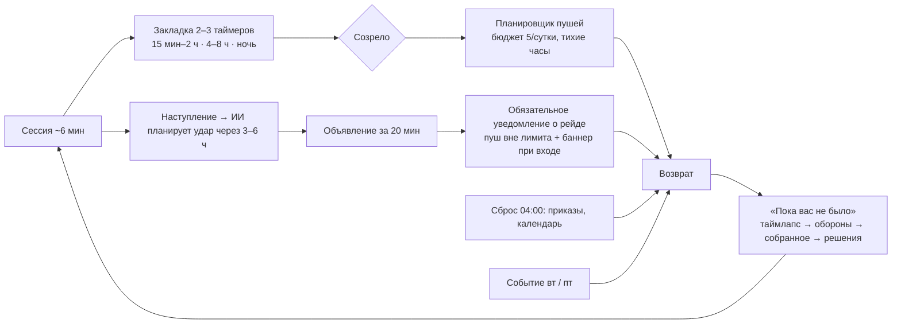
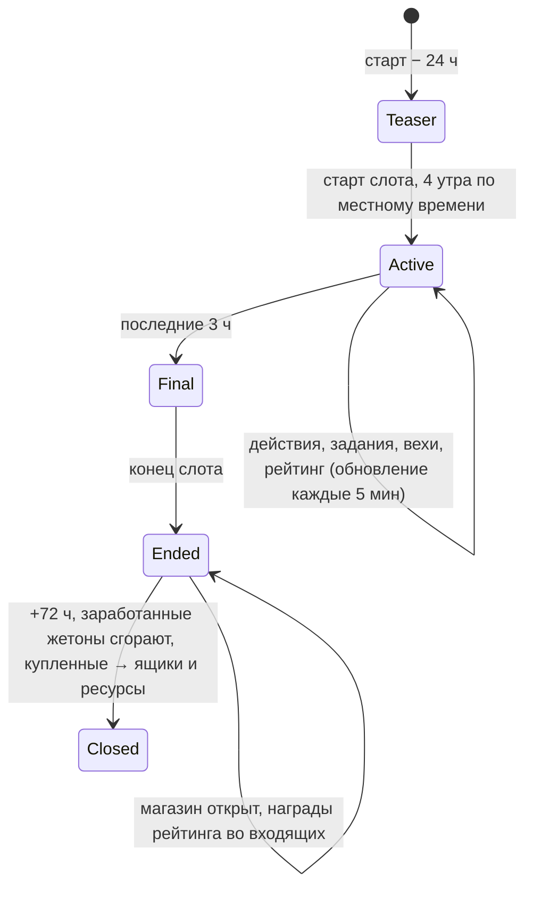
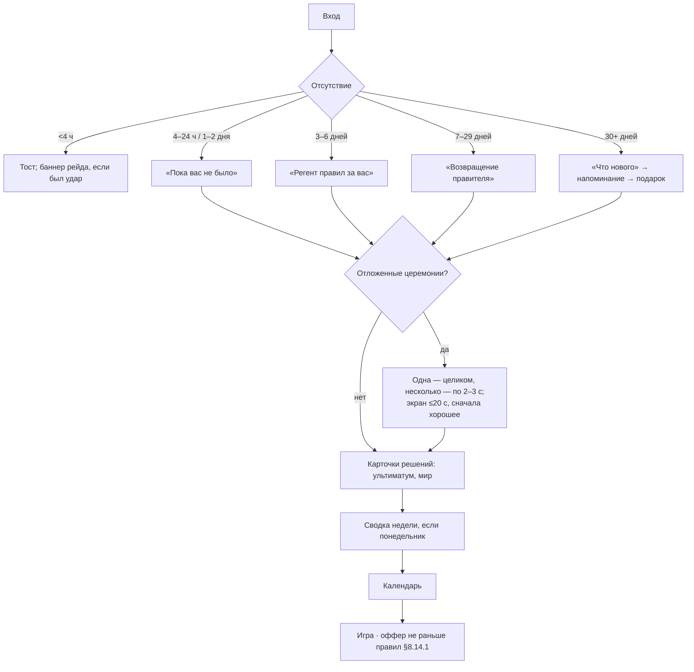

# 08. Удержание и лайв-опс

> **Назначение.** Исполняемая спецификация удержания Raivon: почему игрок возвращается (8 драйверов), FTUE по шагам с аналитикой и fallback, первые 7 дней по сессиям, крючки D1–D90, «Приказы дня» (пул 30 шаблонов), недельные задания, календарь входа на 28 дней, Военный ящик и бесплатные награды, 5 шаблонов событий с YAML, лайв-опс календарь 12 недель, сезонные рескины, полный каталог пушей и планировщик, «Пока вас не было» и возврат, предиктор оттока, социалка, жёсткие запреты, план A/B-тестов, метрики и дашборды.
> **Опирается на канон v1.2:** §1.1 (столпы), §2.1 (решения 1–32, особенно 4, 5, 7, 13, 16, 17, 18, 21, 24, 26, 30), §2.2 (п. 4, 24, 25, 28, 30, 32, 33), §3 (глоссарий: `quiet_hours`, `share_timelapse`, `ui_while_away`, `ui_dev_road`), §4 (валюты, жетоны события, пауза экономики E7), §8.4 (командиры), §9.11 (контратаки, лимиты), §9.14 (утешение), §12.1 (главы, `completed_waiting`), §13 (таймеры, ежедневный сброс 04:00), §14 целиком, §15.2–15.7, §15.11 (плейсменты, кейсы, пасс, подписка, Россия), §16.2–16.4 (сервер, аналитика, remote config, арт), §17 (KPI), §20 (журнал v1.2: C1, C5, C8, C77, C82–C89, C99, C115, C119).
> **Связанные файлы:** `01_vision_core_loop.md` (архетипы сессий, суточный ритм, порядок экрана «Пока вас не было», лента «Дальше», вопросы В12–В14), `02_map_territory.md` (закрепления FTUE §15.6, снимки границы, анимации), `03_war_combat.md` (наступление, авто-оборона, удары ИИ), `04_units_army.md` (командиры, шаблон нового командира §15.8), `05_economy_buildings.md` (пул дохода, «Собрать всё», временные строители), `06_diplomacy_peace.md` (конференция, ультиматум), `07_progression_meta.md` (главы, УР, Арена, лиги), `09_monetization.md` (цены офферов, паки событий, пасс, кривая уровней пасса), `10_ui_ux_art.md` (экраны, VFX), `11_balance_numbers.md` (масштаб наград по УР), `12_tech_analytics_roadmap.md` (схема аналитики, A/B-платформа).

---

## 8.1. Зона файла, инварианты, обозначения

### 8.1.1. Что здесь и что не здесь

| Здесь | Не здесь (граница) |
|---|---|
| сценарий FTUE, тексты подсказок, аналитические шаги, fallback | правила боя, войны и мира (`03`, `06`) — только их сценарная настройка в FTUE |
| ежедневные, недельные, календарные награды; Военный ящик как источник удержания | шансы и гарант кейсов, цены, паки (`09`) |
| события: механика, жетоны, вехи, когорты, магазин события | содержимое и цена паков события (`09`) |
| пуши: каталог, тексты, планировщик, лимиты | транспорт FCM/APNs, хранение токенов (`12`) |
| возврат, предиктор оттока, интервенции | персональная лестница офферов (`09`) |
| социалка: друзья, сравнение, рейтинги, Таймлапс, рефералы, чат как инструмент удержания | модерация чата целиком (канон §14.9, `12`), лиги Арены (`07`) |
| метрики удержания, дашборды, гипотезы A/B | A/B-движок и схема событий (`12`) |

### 8.1.2. Инварианты удержания (каждый — автотест или серверная проверка)

| # | Инвариант | Источник |
|---|---|---|
| R1 | Отсутствие не наказывается сильнее лимитов §9.11; через 8 ч без сбора экономика на паузе. Заработанное не сгорает; исключения — только канонические: ежедневные начисления «Пайка» и «Патента», заработанные жетоны события (72 ч после конца), срок жизни залежей, переполнение склада | канон §4 (E7), §14.1 |
| R2 | Каждая сессия ≥3 мин заканчивается 2–3 открытыми таймерами разной длины (15 мин – 2 ч, 4–8 ч, «на ночь») | канон §14.1 |
| R3 | В защищённых состояниях (бой, церемония мира, церемония УР, «Мир расширяется», их экраны наград, FTUE) нет рекламы, офферов, пушей и всплывающих окон удержания | канон §14.10 |
| R4 | Не больше 5 пушей в игровые сутки, из них не больше 3 несрочных; интервал ≥60 мин для несрочных; в тихие часы пушей нет. Уведомление о рейде вне лимита, включено по умолчанию, выключается только через подтверждение; баннер о рейде при входе — всегда | канон §14.7, решение 21 |
| R5 | Календарь входа никогда не сбрасывается: пропуск ставит серию на паузу | канон §14.5 |
| R6 | Всё содержимое удержания (задания, календарь, события, пуши) задаётся YAML в `content/` и меняется через remote config без обновления клиента | канон §16.3 |
| R7 | Награды удержания и кейсы одинаковы во всех странах; в России скрыты только покупки за реальные деньги (IAP), всё бесплатное, рекламное и за Райвиты — как везде | решения 7, 13, 16; канон §15.11 |
| R8 | Бесплатный приток Райвитов в середине игры остаётся в коридоре 45–55 в день (§8.9.3) | канон §4, §15.8 |

### 8.1.3. Обозначения

- **D0** — день установки (= «день 1»); **Dn** — n-й игровой день после установки, поэтому «с 3-го дня» = с D2 (шапка канона). Игровые сутки начинаются в 04:00 по местному времени (канон §13).
- **День календаря** — номер дня входа в календаре (считает дни с заходом, а не дни с установки).
- **ОП** — опыт пасса; 1 уровень = 1 000 ОП (канон §15.6), в YAML хранится доля уровня (`pass_level_share`).
- **«Ресурсы N ч»** — N часов валового производства игрока по каждому ресурсу (канон §4, §15.8: 1 ч = 12 Райвитов). Масштаб по УР — автоматически.
- Пометка **(ПА)** = предложение автора.

---

## 8.2. Модель удержания: почему игрок возвращается

### 8.2.1. Восемь драйверов

| # | Драйвер | Механики (канон) | Временной крючок | Индикатор (метрика) | Ограничитель |
|---|---|---|---|---|---|
| Д1 | **«Синий растёт»** — видимый прирост своей земли | церемония мира (§10.3), колонизация 1,5 с, «Мир расширяется», доля карты главы в %, Таймлапс | цель войны и цель главы всегда видны | доля сессий ≥3 мин с шагом синего ≥85% (`01` P1.1) | дикие земли кончаются → нужна война; перемирия |
| Д2 | **«Обещание эволюции»** — держава меняет облик | 10 УР (§6), «Дорога державы», силуэты ультразабора и небоскрёбов, соседи ИИ со старшим УР | следующий УР всегда на 1–5 дней впереди | дни до УР4/5/6/8 против плана §12.1 (±20%) | гейт территории (§6.2) |
| Д3 | **«Созревание»** — назначенные встречи | 2–3 открытых таймера, доход 8 ч, Военный ящик 6 ч, билеты 2 ч, обозы 15–120 мин, жилы 12 ч | 15 мин – 2 ч / 4–8 ч / ночь | ≥80% сессий заканчиваются ≥2 таймерами (ПА) | максимум 48 ч; последние 5 мин не-военного таймера бесплатно |
| Д4 | **«Честная угроза и реванш»** — мир живёт, но предупреждает | контратаки с объявлением за 20 мин, ультиматум 4 ч, предложение мира 2 ч, коалиция 12 ч, «Реванш», «Ответный удар» | 3–6 ч после наступления | доля живых оборон ≥25% от объявленных; открываемость срочных пушей ≥35% (ПА) | лимиты §9.11, тихие часы, Ядро, 24 ч без входа — без новых войн |
| Д5 | **«Ритуалы»** — короткие ежедневные дела | «Приказы дня», календарь входа, недельные задания, «Сводка недели», «Собрать всё» | сброс 04:00, понедельник | все 3 приказа закрывают ≥45% DAU; календарь забирают ≥85% DAU (ПА) | мягкая серия, никакого сброса |
| Д6 | **«Коллекция»** — командиры и косметика | 12 командиров + новый каждые 2 недели, альбомы (печать и лор, без наград), 49 позиций косметики | ключевые дни календаря, вехи событий | 5–7 командиров к D30 (§14.4) | все командиры бесплатны, бонус ≤ +15% |
| Д7 | **«Событийность и сезоны»** — у недели и месяца свой сюжет | малое событие вт–чт, большое пт–пн, пасс и Арена 28 дней, Кейс коллекции, новые главы обновлениями | вторник, пятница, конец сезона | участие в событиях ≥60% WAU (ПА) | события не меняют честность PvE |
| Д8 | **«Социальное зеркало»** — сравнение и показ | друзья, «Сравнить державы», рейтинги по ОТ, Таймлапс с реферальным кодом, Арена, свободный текстовый чат (мировой по языкам + личные с друзьями, решение 18) | «Сводка недели», ответный рейд Арены 24 ч | друзей на DAU ≥1,5; шеринг ≥5% WAU (ПА) | PvP только по желанию; альянсы — по сигналу владельца |

### 8.2.2. Петля возврата



### 8.2.3. Правила, общие для всех драйверов

1. **Одна новая механика за сессию** в первые 7 дней после FTUE (`01` §1.13.2 п. 4). Порядок открытий — §8.4.
2. **Повод входа — содержательный.** Пуш или крючок всегда называет конкретную вещь: гекс, армию, залежь, командира. Пустых «Мы скучаем» нет (§8.13).
3. **Пропуск не наказывается**, приход вознаграждается: доход ждёт 8 ч, потом экономика на паузе (канон §4, E7), ящики копятся до 2, билеты до 5, календарь на паузе, ключевые награды сдвигаются на следующий день входа.
4. **Длинная цель всегда на экране.** На HUD закреплён чип прогресса главы «Глава I: 14/20» с ближайшим УР «Королевство — 21/24 гекса» (канон §14.1 «Видимая цель»); короткие крючки — лента «Дальше» с 3 ближайшими таймерами (`01` §1.6.3).

---

## 8.3. FTUE: первые 10 минут по шагам

### 8.3.1. Принципы

- **Без текста там, где хватает жеста.** Текст — только существительные-метки (≤3 слова) и одна фраза-смысл «Оккупировано — граница закрепится миром» (канон §14.3). Вся подача — рука-призрак, пульсация, иконки, мимика Сержанта Брама.
- **Одно действие на экран.** Пока шаг не выполнен, остальные элементы HUD притушены (альфа 40%) и не принимают тапы.
- **Ни рекламы, ни офферов, ни пушей, ни чата** (канон §14.3, §14.10). Rewarded появляется после 10-й минуты, interstitial — с 3-го дня (D2).
- **Карта и сценарий фиксированы:** закрепления `02` §15.6 (`ftue_mill`, `ftue_border_a/b`, `ftue_copper_mine`, `ftue_pocket_1/2`, `ftue_extra`, `ftue_first_deposit`, `ftue_fence_hex`, `ftue_raider_spawn`).
- **Тест «30 секунд без текста»** (канон §1.1, §16.5): от тапа «В бой!» (F03) до первого захвата (F05) ≤30 с без текстовых подсказок в кадре (надпись кнопки «В бой!» в тесте заменяется иконкой мечей). Блокер релиза.

### 8.3.2. Лестница помощи (одинакова для всех шагов)

| Уровень | Когда | Что происходит | Поле `assist` в аналитике |
|---|---|---|---|
| 0 | сразу | цель пульсирует, остальное притушено | 0 |
| 1 | бездействие 6 с или 1 ошибочный жест | рука-призрак показывает жест (цикл 1,5 с) | 1 |
| 2 | бездействие 12 с или 2 ошибки | камера центрируется на цели, зона попадания ×1,5, стрелка-след жеста; Брам указывает рукой | 2 |
| 3 | бездействие 20 с или 3 ошибки | упрощённый ввод: тап по цели засчитывается как свайп или удержание; для неинтерактивных шагов — авто-выполнение с рукой-призраком | 3 |

Цель: ≥90% игроков проходят ключевые шаги (F04, F06, F11, F17, F20, F28) на уровне помощи ≤1.

### 8.3.3. Сценарий по шагам

Аналитика: каждое выполнение шага шлёт `ftue_step {step, t_ms (от старта), dt_ms (длительность шага), attempts, assist}`; таблица даёт только имя `step`.

| Шаг | Время | Что видит | Что делает | Текст / подсказка | `step` | Критерий успеха | Fallback |
|---|---|---|---|---|---|---|---|
| **A. Загрузка** | | | | | | | |
| F01 | 0:00–0:10 | заставка с логотипом и полосой загрузки; гостевой аккаунт создаётся молча, язык — по локали устройства | ничего | — | `f01_boot` | карта на экране ≤15 с (p90, Android 2 ГБ) | нет сети → экран «Нет связи · Повторить» (только онлайн, решение 4); >15 с → анимированная диорама с флагом вместо полосы |
| F02 | 0:10–0:15 | наезд камеры: синяя держава из 7 гексов, на севере красные Бароны, на `ftue_mill` дымит сожжённая мельница; Брам у границы машет вилами | ничего (5 с) | облачко Брама с иконкой горящей мельницы | `f02_reveal` | — | — |
| **B. Наступление 1 (60 с, сценарий)** | | | | | | | |
| F03 | 0:15–0:20 | сектор у Мельницы уже выбран, фаза подготовки, большая кнопка в зоне большого пальца | тап «В бой!» | «В бой!» (кнопка) | `f03_battle_tap` | тап ≤10 с | лестница помощи; уровень 3 — автостарт через 20 с |
| F04 | 0:20–0:35 | таймер 60 с; полоса энергии 5/10; карта «Атака» с цифрой 2 мерцает; рука-призрак ведёт от армии 1 к `ftue_border_a` | свайп армия → гекс | иконка «2⚡» | `f04_first_swipe` | верный свайп ≤15 с, ≥95% на помощи ≤1 | тап вместо свайпа → уровень 1; на уровне 3 тап по гексу = приказ |
| F05 | 0:35–0:45 | столкновение (прогноз F ≈ 1,6, зелёные мечи), гекс переходит под штриховку с флажком | смотрит | над гексом всплывает «Оккупировано» | `f05_first_capture` | первый захват ≤30 с от F03 | — |
| F06 | 0:45–1:00 | две армии соседствуют с Мельницей; рука-призрак тащит карту «Атака» на Мельницу; при наведении значок «Клин +20%» | перетаскивает карту на Мельницу | «Клин +20%» (значок) | `f06_wedge` `{wedge: bool}` | перетаскивание ≤15 с | свайп одной армией засчитывается (сценарий даёт F ≥1,1: мечи жёлтые, но атака побеждает), Клин подсвечивается на следующей цели |
| F07 | 1:00–1:12 | Мельница взята (★★), Брам вбегает на гекс, портрет с рамкой «Сержант Брам» и значком «+5% пехоте» влетает в слот армии | смотрит | «Сержант Брам» | `f07_bram` | — | — |
| F08 | 1:12–1:20 | `ftue_border_b` пульсирует слабее, без руки-призрака | атакует сам (свайп или карта) | — | `f08_free_attack` | захват до 0:55 таймера боя | если не взят к 0:55, защитник сценарно отступает и гекс засчитывается в конце боя |
| F09 | 1:20–1:30 | конец боя (все 3 цели взяты → досрочно); итог ★★★; толстый контур пульсирует на месте | «Продолжить» | **«Оккупировано — граница закрепится миром»** | `f09_battle_result` `{stars}` | ≥99% доходят | — |
| **C. Мир 1 (заполнен заранее)** | | | | | | | |
| F10 | 1:30–1:40 | вверху кнопка «Мир (24)» пульсирует; шкала «Контроль фронта 62%» (ВС 23,8: оккупация 10,8 + цель 10 + ★★★ 3); лидер Баронов поднимает белый флаг | тап «Мир» | — | `f10_peace_open` | ≤8 с | лестница помощи |
| F11 | 1:40–1:55 | пергамент: 3 гекса (Мельница и 2 гекса) = 10,8 ≤ 23,8, кнопка зелёная; печать с кольцом заполнения | удерживает печать 0,8 с | «Удерживай» | `f11_seal_hold` `{attempts}` | удержание ≤10 с | 2 коротких тапа → кольцо показывает заполнение; 3-й тап засчитывается как удержание |
| F12 | 1:55–2:02 | церемония 7 с (канон §10.3): контур перетекает чернилами, «поп» гексов по гамме; «+3 гекса · Держава 18 → 22 · Карта главы 14% → 20%» | смотрит; пропуска нет | счётчики | `f12_ceremony` | ≥99,5% досматривают | — |
| F13 | 2:02–2:30 | награды влетают в HUD (золото, еда), кнопки ×2 нет (FTUE); остаток 13 очков → «мнение +13» | «Продолжить» | — | `f13_peace1_done` | **≥92% от F01** (канон) | — |
| **D. Владение** | | | | | | | |
| F14 | 2:30–2:55 | поле названия заполнено сгенерированным именем (слоговой генератор), кнопка кубика | правит или оставляет | «Название державы» | `f14_name` `{custom}` | подтверждение ≤25 с | «Дальше» без правки оставляет имя; мат и ссылки → «Выберите другое название» (серверный фильтр §14.9) |
| F15 | 2:55–3:15 | конструктор флага: 3 ряда (форма, поле, эмблема), по 6 бесплатных вариантов | 3 тапа | — | `f15_flag` `{randomized}` | ≤20 с | кнопка «Случайный»; пропуск = случайный флаг |
| F16 | 3:15–3:30 | нейтральный экран «Год рождения» (барабан, без значения по умолчанию); затем EU — UMP CMP, iOS — предзапрос ATT (после первого мира, канон §15.2) | выбирает год, отвечает на согласия | «Год рождения» | `f16_age` `{band: u13 / 13_15 / 16_17 / 18p}`, `f16_consent` `{gdpr, att}` | ≤15 с | закрытие согласий = неперсонализированная реклама; `u13` → в чате только готовые фразы, реклама только AdMob с child-directed тегами, MAX не инициализируется (канон §14.9, §15.2) |
| **E. Эволюция** | | | | | | | |
| F17 | 3:30–3:45 | Резиденция светится стрелкой; карточка «Деревня» с силуэтом изб | тап Резиденции → «Улучшить» | — | `f17_res_upgrade` | ≤10 с | лестница помощи |
| F18 | 3:45–3:55 | таймер 1:00 и зелёная кнопка «Бесплатно» (последние 5 мин любого не-военного таймера бесплатны, канон §13.1) | тап «Бесплатно» | «Бесплатно» | `f18_free_speedup` | ≤10 с | не нажал — таймер идёт, игрок ведётся на F20, церемония сыграет по завершении |
| F19 | 3:55–4:03 | церемония УР2 (6 с): волна от столицы, халупы → избы, ополченцы → копейщики; затем 2 с тизер: над столицей силуэт небоскрёбов, иконка «Дорога державы» влетает в HUD | смотрит | «Однажды здесь…» | `f19_dl2` | — | — |
| F20 | 4:03–4:25 | жёлтый пульсирующий контур на `ftue_first_deposit` «Золотая жила»; иконка обоза пульсирует | тап обоза → тап залежи | — | `f20_convoy_sent` | ≤12 с | лестница помощи |
| F21 | 4:25–5:00 | обоз идёт 15 с, кольцо сбора 30 с; параллельно начинается F22 | — | — | `f21_deposit_done` | — | — |
| **F. Оборона** | | | | | | | |
| F22 | 4:40–4:55 | на `ftue_fence_hex` значок молотка | тап гекса → «Укрепление» → «Строить» (10 с) | «Плетень» | `f22_fort_build` | ≤12 с | лестница помощи |
| F23 | 4:55–5:15 | строитель вбивает колья; на `ftue_raider_spawn` собираются серые мародёры, над ними реальный отсчёт 15 с | ждёт | — | `f23_raid_seen` | — | — |
| F24 | 5:15–6:00 | налёт: мародёры бьются о плетень и опрокидываются в облачко; «Отбито!» +золото | смотрит | «Отбито!» | `f24_raid_repelled` | 100% (сценарий) | — |
| **G. Война 2 за Медную шахту** | | | | | | | |
| F25 | 6:00–6:15 | лидер Вольных Хуторов дразнит; на `ftue_copper_mine` флажок цели; кнопка «Объявить войну», цель выбрана | тап «Объявить войну» | «Цель: Медная шахта» | `f25_war2_declare` | ≤10 с | лестница помощи |
| F26 | 6:15–6:30 | Хутора краснеют (`map_enemy`); в руку влетает новая карта «Окружение» (3⚡) | тап «В бой!» | «Новая карта» | `f26_new_card` | ≤10 с | автостарт на уровне 3 |
| F27 | 6:30–7:05 | бой 60 с; шахта и `ftue_extra` берутся свайпами или Клином (рука только при бездействии 8 с) | атакует | — | `f27_mine_taken` | шахта взята ≤35 с | сценарный перевес F ≥1,5 на шахте |
| F28 | 7:05–7:35 | энергия ≥3; рука-призрак тащит «Окружение» на `ftue_pocket_1`; при наведении красный пунктир «Котёл: 2» | перетаскивает карту | «Котёл: 2» | `f28_encircle` | ≤15 с | на уровне 3 карта разыгрывается сама с рукой-призраком |
| F29 | 7:35–8:30 | конец боя; котёл сдаётся ускоренно (10 с вместо 1 ч, только FTUE): белые флаги над 2 гексами; шкала растёт до ~67% | смотрит, «Продолжить» | «Котёл сдался» | `f29_pocket` | — | — |
| **H. Мир 2 — первый выбор** | | | | | | | |
| F30 | 8:30–8:55 | пергамент с двумя крупными карточками: **А «Земля»** — шахта + котёл + 1 гекс (16,7 очка, выбрана по умолчанию); **Б «Золото»** — 3 пакета контрибуции + репарации (20 очков); ВС ≈33,8 | выбирает | «Земля» / «Золото» | `f30_peace2_choice` `{A / B}` | ≤20 с | бездействие 15 с → пульс «Земля»; «Подписать» работает с выбором по умолчанию |
| F31 | 8:55–9:10 | 2 сегмента «Пощадить» / «Разграбить 30%»; под «Разграбить» превью добычи и три лица соседей хмурятся («Соседи запомнят»); значок угрозы | выбирает | «Соседи запомнят» | `f31_plunder` `{spare / 30}` | ≤15 с | предвыбора нет (выбор обучает); бездействие → рука по очереди указывает на оба |
| F32 | 9:10–9:30 | печать и церемония (вторую можно ускорить ×3 тапом): «+4 гекса · Глава I: 14/20» | удерживает печать | — | `f32_peace2_done` | ≥98% от F30 | как F11 |
| **I. Крючки** | | | | | | | |
| F33 | 9:30–9:40 | карточка Брама: «Сообщить, когда враг готовит удар?» [Да] [Позже]; «Да» → системный запрос (iOS; Android 13+ POST_NOTIFICATIONS) | отвечает | канон §14.3 | `f33_push_pre` `{yes / later}`, `f33_push_os` `{granted}` | ≥55% разрешили (канон) | «Позже» → системный запрос не показывается (бережём одноразовый запрос iOS), повтор по §8.13.6 |
| F34 | 9:40–9:52 | рука-призрак: «Кварталы ур. 2» (15 мин) → строитель; обоз → малая залежь (≈20 мин с дорогой) | 2 действия | — | `f34_timers_set` `{n}` | 2 таймера заложены | на уровне 3 таймеры закладываются автоматически |
| F35 | 9:52–10:00 | итог: «Глава I: 14/20» (при выборе Б — «10/20»), список открытых таймеров: стройка 15 мин, обоз 20 мин, «Военный ящик через 1 ч»; силуэт Баронов с биноклем («что-то замышляют») | «Играть» | «Глава I: 14/20» | `ftue_complete` `{duration_s, choice, plunder, push}` | **≥85% от F01** (канон) | — |

После F35 включаются: rewarded-плейсменты, свободный чат (УР2, не раньше 10-й минуты, канон §14.9), первый Военный ящик через 1 ч, скриптовый ультиматум Баронов через ~2 ч (§8.4.2). «Приказы дня» открываются позже (§8.6.1).

Числа FTUE сверены с закреплениями `02` §15.6: официальная ценность игрока 18, Баронов 37, Хуторов 24. Мир 1: Мельница (ферма, 2) + 2 обычных = 4 ценности = 10,8 очка (5,4 + 5,4 после округления по строкам), ВС = 10,8 + 10 (цель) + 3 (★★★) = 23,8, контроль 61,9% ≈ 62%; «Держава 18 → 22», доля карты 7 → 10 из 50 гексов = 14% → 20%. Мир 2: оккупация шахта 2 + `ftue_extra` 1 + котёл 2 = 5 ценности = 20,8 очка, ВС = 20,8 + 10 + 3 = 33,8 (контроль ≈67%); пакет «Земля» = шахта 8,3 + котёл 2 × 4,17 × 0,5 = 4,2 + обычный 4,2 = 16,7.

### 8.3.4. Контрольные точки и восстановление

| Ситуация | Поведение |
|---|---|
| Приложение свёрнуто или убито | возобновление с последней контрольной точки: F09, F13, F16, F21, F24, F29, F32, F35. Бой FTUE при сворачивании дольше 60 с доигрывает серверный автопилот (канон §9.16), результат сценарно победный |
| Обрыв сети | оверлей «Переподключение…»; бой продолжается локально до 60 с (канон §2.2 п. 40) |
| Переустановка / привязанный аккаунт уже прошёл FTUE | FTUE не повторяется; новый гостевой аккаунт на том же устройстве — кнопка «Войти в существующий аккаунт» на F01 (Game Center, Play Games, Sign in with Apple; непривязанный гость — одноразовым кодом из 12 символов, действует 24 ч, канон §15.10) |
| Повторный заход гостя, бросившего FTUE | старт с контрольной точки; если прошло >24 ч — короткое напоминание жеста (рука-призрак 3 с) |
| «Меньше анимации» (доступность) | церемонии 2 с, рука-призрак статичная стрелка |
| Слабое устройство (<30 fps) | частицы церемонии ½, тени выкл.; тайминги шагов не меняются |

### 8.3.5. Воронка FTUE: бюджет потерь

| Отрезок | Шаги | Допустимая потеря | Накопленно доходят |
|---|---|---|---|
| Загрузка | F01–F02 | 3,0% | 97,0% |
| Наступление 1 | F03–F09 | 2,0% | 95,0% |
| Мир 1 | F10–F13 | 1,0% | 94,0% (цель канона ≥92%) |
| Владение | F14–F16 | 1,5% | 92,5% |
| Эволюция и обоз | F17–F21 | 1,5% | 91,0% |
| Оборона | F22–F24 | 1,0% | 90,0% |
| Война 2 | F25–F29 | 2,0% | 88,0% |
| Мир 2 и крючки | F30–F35 | 2,0% | 86,0% (цель канона ≥85%) |

Шаг, потерявший больше бюджета на 2 когортах подряд, получает задачу на правку (дашборд §8.19.3).

---

## 8.4. Первые 7 дней (D0–D7) по сессиям

### 8.4.1. Лестница открытий (не больше одной новой механики за сессию)

| Сессия / день | Новая механика (одна) | Почему здесь |
|---|---|---|
| D0 · S1 | FTUE: наступление, мир, оккупация, УР, обоз, укрепление, окружение | канон §14.3 |
| D0 · S2 | дикие земли: лагерь мародёров → колонизация | путь роста без войны, сразу после FTUE |
| D0 · S3 | ультиматум (скриптовый) | первая инициатива ИИ, учит «Принять / Отказать» (у Волка кнопки «Откупиться» нет, канон §9.1) |
| D0 · S4 | живая оборона (скриптовая контратака); «Мир расширяется» — церемония, а не механика | первая угроза — всегда отбита (канон §9.11) |
| D0 · S5 | «Приказы дня» и «Дорога державы» | ритуал и длинная цель перед ночью |
| D1 | реки и порты (глава II), 3-й строитель | новая земля |
| D2 | Арена Рубежей (УР4) | отдельный режим, по желанию |
| D3 | Посольство и союз | дипломатия главы II |
| D4 | событие (первое участие) | лайв-опс |
| D5 | недельные задания (текущая неделя, сколько бы дней ни осталось); «Тревога соседей» становится видимой | недельный ритм; порог коалиции 60 |
| D6 | нефть и Завод (УР5) | новая цель войны |
| D1–D7 | «Сводка недели» — в первый понедельник начиная с D1 | итог первой недели |

Если игрок идёт быстрее (например, УР4 на D1), механика открывается по факту, но **показ подсказки** откладывается до следующей сессии, где ещё не было новой механики. Очередь подсказок — `ftue_hint_queue` в профиле (ПА).

### 8.4.2. D0 — день установки

| Сессия | Когда | Содержание | Крючки | Таймеры на выходе |
|---|---|---|---|---|
| S1 FTUE | 0:00–0:12 | §8.3 | «Глава I: 14/20», силуэт небоскрёбов | стройка 15 мин, обоз ~20 мин, ящик 1 ч, ультиматум ~2 ч |
| S2 «Хозяйственная» | +30–60 мин | календарь, день 1; лагерь мародёров (бой 60 с) открывает дикий гекс; колонизация ×2 по 1 мин; 16 гексов → Резиденция УР3 (15 мин; `ad_speedup` уже доступна); 3-я армия, 3-й обоз. Всплывающий оффер сессии (единственный, канон §14.10 п. 3) — «Набор новобранца» (канон §15.3, окно 72 ч) **после** церемонии УР3 и не раньше 3-й минуты сессии (ПА) | Военный ящик; «Глава I: 16/20» | тренировка ~9 мин, обоз на залежь M, исследование 30 с – 30 мин |
| S3 «Пожарная» | ~2 ч после FTUE | скриптовый ультиматум Баронов (`push_ultimatum`): обычный пограничный гекс вне Ядра или «дань 8 ч золота». У Волка кнопки «Откупиться» нет (канон §9.1); советник подсвечивает «Отказать» с прогнозом сил «Ваши армии сильнее». Отказ или 4 ч без ответа → война через 1 ч; встречная цель из 3 рекомендованных (канон §9.1) | таймер «Война через 1 ч» | армии маршем к границе (20 с/гекс) |
| S4 «Военная» | +1 ч | война с Баронами начинается. **Скриптовая контратака** объявляется при её старте — по общему правилу первого удара в войне, начатой ИИ (канон §9.11; в главе I удары только скриптовые, §9.1): стрелка сразу, удар через 20 мин, пуш за 15 мин. Игрок в игре — живая оборона с подсказкой «Оборона на атакуемый гекс»; офлайн — авто-оборона и обязательный `push_defense_result`. Исход гарантированно победный (флаг `first_strike_won`). Затем наступления, мир (рекомендованный пакет), 20/20 → «Мир расширяется» 50 → 90; наследие главы I: Капитан Лира + 200 Райвитов | новые соседи Речная Лига и Орден Камня (12 ч без ультиматумов, канон §12.1); «Тёмное озеро» на краю | перемирие 30 мин, пополнение 40 мин |
| S5 «Ночная закладка» | вечер | в начале сессии — всплывающий оффер «Пак главы I» (первая сессия после «Мир расширяется», канон §15.3; `09` §9.8.6); «Приказы дня» (первый набор: «Соберите доход 3 раза», «Присоедините 1 дикий гекс», «Проведите 2 наступления»); «Дорога державы» с силуэтом ультразабора; залежь L «на ночь» (120 мин) | календарь завтра: **3-й строитель** | залежь L 2 ч, исследование, стройка 15–30 мин |

**Правила скриптов D0 (ПА):**
- Ультиматум выдаётся через 2 ч ± 15 мин после `ftue_complete`, но только в окне [конец тихих часов; начало тихих часов − 5 ч] (по умолчанию 07:00–18:00, канон §9.1). Вне окна — в начале следующего окна; при отсутствии игрока >24 ч не выдаётся до его входа (канон §14.10 п. 5).
- Если игрок сам объявил войну Баронам раньше ультиматума, ультиматум отменяется. Война начата игроком, поэтому правило первого удара при старте к ней не относится, и скриптовая контратака объявляется после первого наступления этой войны (по общему правилу «удар после наступления игрока», канон §9.11).
- «Принять» (уступка гекса, перемирие 24 ч) — война с Баронами откладывается: советник ведёт к Хуторам и колонизации, скриптовая контратака переносится в следующую войну главы I.
- Если мир подписан до объявленного удара, удар отменяется (канон §9.11). Тогда флаг `first_strike_won` переходит на первую контратаку главы II.
- В D0 — не больше двух всплывающих офферов из 3 допустимых каноном (§14.10 п. 3; так же в `01` §1.8.1 и `09` §9.8.6): «Набор новобранца» после церемонии УР3 (S2) и «Пак главы I» в первой сессии после «Мир расширяется» (обычно S5). В одной сессии они не показываются (не больше 1 всплывающего оффера за сессию); если глава I закрыта в той же сессии, что и показ Набора, пак главы I ждёт следующей сессии, в том числе D1. Пак эпохи УР3 в D0 не показывается всплывающим и ждёт D1 (ПА; окно 48 ч от первого показа, не позже 7 дней после повышения, канон §15.3).
- Если к концу D0 игрок не закрыл главу I, советник в первой сессии D1 показывает 3 гекса с зелёным прогнозом у Хуторов или Баронов (перемирие 30 мин к тому времени истекло).

### 8.4.3. D1–D7

| День (календарь входа) | Типичные сессии | Что открывается | Крючки | Таймеры на выходе дня |
|---|---|---|---|---|
| **D1** (день 2) | 5–6: смотр, военная, хозяйственная, ночная | **3-й строитель** (календарь); глава II «Речной край»: реки (атака через реку −25%), порты; колонизация 5 мин; первые настоящие удары ИИ (4–6 ч после наступления) | «Набор новобранца» ещё 48 ч; цель «Королевство — 24 гекса»; ящики каждые 6 ч | стройка 1–2 ч, исследование 1 ч, залежь L |
| **D2** (день 3) | 5 | УР4 (24 гекса, Резиденция 1 ч) → **Арена Рубежей**, 5 калибровочных боёв; 4-й слот армии, Поддержка; карты Подкрепление и Марш-бросок. Interstitial для неплатящих начинаются с этого дня («с 3-го дня» = D2, канон §15.2); «Державный патент» доступен (канон §15.3) | календарь: 30 Райвитов; билеты Арены копятся до 5 | УР4 1 ч, билеты, стройка 2 ч |
| **D3** (день 4) | 5 | **Генерал Вега** (календарь, +Клин); Посольство (УР3) — первый союз при мнении ≥50 | Вега даёт повод для Клина в следующей войне; союзник — карта «Союзный корпус» | исследование 2–3 ч |
| **D4** (день 5) | 4–5 | первое событие (доступ с D3, по дню недели выпадает на D3–D6: малое вт–чт или большое пт–пн, §8.10.1); лига Арены после калибровки | вехи события, магазин события | залежи M/L (событие удваивает их число) |
| **D5** (день 6) | 4–5 | недельные задания (§8.7); «Тревога соседей» видна (порог гл. II = 60); первый подарок соседу | риск коалиции — повод думать о мире и подарках; сундук недели | стройка 3 ч |
| **D6** (день 7) | 5 | **Ирма Сталь** (календарь, «Прорыв» +1 гекс); УР5 (32 гекса, 3 ч): Тёмные озёра → нефть, Нефтевышка, Завод, 4-й обоз | пак эпохи УР5 (48 ч от первого показа, не раньше следующей сессии, канон §15.3) | УР5 3 ч → ночная церемония или утро |
| **D7** (день 8) | 5 | пасс ~12 из 40 (канон §14.4); цель главы II 36 гексов близко (дни 7–9) → «Мир расширяется» 90 → 160; первая «Сводка недели» — в ближайший понедельник | глава III: гегемон Альвария, танки на УР6 на «Дороге державы» | Нефтевышки, исследование 4 ч, залежь L |

**Если игрок пропустил день:** календарь стоит на паузе, Военные ящики копятся до 2, доход ждёт 8 ч, затем экономика на паузе, удары ИИ — только в уже идущих войнах и в лимитах §9.11 (каждый — с обязательным уведомлением), новых войн и ультиматумов при отсутствии >24 ч нет. Ключевые награды D1–D7 привязаны к дням входа, а не к датам, поэтому не теряются, а сдвигаются на следующий вход.

---

## 8.5. Крючки D1 / D3 / D7 / D14 / D30 / D60 / D90

Цели D1, D7, D30, D90 — канон §17; D3, D14, D60 — интерполяция степенной кривой между ними (ПА).

| Горизонт | Цель (минимум) | Главные крючки | Что гарантированно ждёт игрока именно в этот день | Риск оттока и контрмера |
|---|---|---|---|---|
| **D1** | 40% (32%) | скриптовый ультиматум и глава I за 3–5 сессий; «Мир расширяется»; ночная залежь L; своё название и флаг | **3-й строитель** (календарь, день 2) | не закрыл главу I → советник с 3 зелёными целями в первой сессии D1 |
| **D3** | 24% (18%) | Арена на УР4 (D2–D3), калибровка; Генерал Вега (день 4); первый союз; первые настоящие контратаки и живая оборона | Вега | первое поражение → утешение §9.14, «Реванш», Щит 24 ч; без офферов 10 мин |
| **D7** | 16% (12%) | Ирма Сталь (день 7); УР5 и нефть; первое событие выходных; пасс ~12/40; «Тревога соседей»; глава II близка к концу | Ирма; недельный сундук | «стена апкипа» на УР4–5 → панель «Содержание» и консервация (`05` §7.7) |
| **D14** | 11% (8%) | глава III «Континент», гегемон Альвария; УР6 на горизонте (дни 14–20); новый командир события (раз в 2 недели); середина сезона | календарь день 14: **300 Райвитов** | плато «нет цели» → советник показывает Райвитовую жилу или нефть у соседа как цель войны |
| **D30** | 7% (5%) | УР6: танки, авиация, многоэтажки; первая коалиция; конец сезона пасса и Арены (день 28) и старт нового; 5–7 командиров; «Ультразабор» (УР8) как цель | день 28: **20 осколков Императора Рая**; начало календаря второго цикла | конец сезона → немедленный старт сезона N+1 и Кейс коллекции; награды сезона сохраняются |
| **D60** | 4% (3%) | глава IV «Индустриальный пояс», УР8 (дни 40–50): **ультразабор и небоскрёбы**; войны на 2 фронта; 3-й сезон; Походы (v1.1, недели 6–8 после запуска, с УР5); 8–10 командиров | церемония УР8 — самый большой визуальный скачок запуска | стена контента (`completed_waiting`, канон §12.1): кнопка «Завершить главу» выдаёт наследие IV, тизер главы V и событие-предвестник за 7 дней до выхода; держат Походы, события, Арена «Мастер+». KPI — ≤25% DAU у стены (канон §17) |
| **D90** | 3% (2%) | глава V «Океаны» и УР9 (v1.2, недели 10–12 после запуска); событие-реран командиров квартала (`04` §15.8); коллекция косметики; «Летопись державы» | новый кольцевой мир +110 гексов; наследие главы V — рамка «Мореход», 400 Райвитов, 40 осколков эпического командира на выбор (канон §12.1) | длинные таймеры → «Паёк» и подписка как комфорт (`09`), но без давления; ре-онбординг вернувшихся |

**Правила крючков (ПА):**
- У каждого горизонта есть минимум одна **детерминированная** награда, которую нельзя пропустить из-за невезения (календарь, наследие главы, церемония), и минимум одна **социальная** (сравнение, рейтинг, Таймлапс).
- Крючок тянет обещанием, а не угрозой потери: награды календаря и наследия привязаны к дням входа и целям, а не к датам; единственные «сроки» — канонические (окна офферов, конец события и сезона), и о них не шлют пушей с ложной срочностью (§8.13.1).

---

## 8.6. «Приказы дня»

### 8.6.1. Правила

| Параметр | Значение |
|---|---|
| Число заданий | 3 в сутки из пула 30 шаблонов (канон §14.5) |
| Открытие | в первой сессии после «Мир расширяется» (конец главы I) или в первой сессии D1 — что раньше; первый набор фиксирован (§8.4.2) |
| Сброс | 04:00 по местному времени; набор выдаётся лениво при первом запросе после сброса |
| Награда за задание | ОП: лёгкое 150, среднее 200, тяжёлое 250 (ПА, ≈0,15–0,25 уровня) |
| Награда за все три | **Военный ящик + 10 Райвитов** (канон) |
| Замена | 1 бесплатная замена в сутки на любое невыполненное задание (ПА); реклама и Райвиты замену не покупают |
| Слоты | A — экономика (лёгкое), B — карта и война (среднее), C — разнообразие (любое, по профилю игрока) |
| Персонализация | шаблон не повторяется в слоте 3 суток; слот C берёт веса из поведения за 7 дней (Арена у тех, кто играет Арену; колонизация у тех, кто не воюет) |
| Выполнимость | генератор проверяет условия «доступно, если» на момент выдачи; задание, ставшее невыполнимым (кончились дикие гексы, все соседи в перемирии до сброса), заменяется автоматически без траты бесплатной замены |
| Прогресс | считается сервером по игровым событиям; засчитывается и во время офлайна (обоз разгрузился, котёл сдался) |
| Отображение | чип на HUD «Приказы 1/3»; список в 1 тап; выполненное задание даёт ОП сразу (летит в полосу пасса) |
| Подписка | без отличий (ПА: ежедневные ритуалы одинаковы для всех); при автосборе подписки `order_collect_3` засчитывает 3 входа с паузой ≥30 мин |

### 8.6.2. Генератор (псевдокод)

```ts
// server/retention/dailyOrders.ts
function rollDailyOrders(p: Player, day: GameDay): Order[] {
  const pool = ORDERS.filter(o => o.available(p) && !recentlyUsed(p, o.id, 3));
  const a = weightedPick(pool.filter(o => o.slot === 'A'), w => w.base, p.seed(day, 'A'));
  const b = weightedPick(pool.filter(o => o.slot === 'B' && o.id !== a.id), w => w.base, p.seed(day, 'B'));
  const c = weightedPick(pool.filter(o => ![a.id, b.id].includes(o.id)),
                         w => w.base * profileWeight(p, w.tags), p.seed(day, 'C'));
  return [a, b, c].map(o => o.instantiate(p));       // цели масштабируются по УР (поле scale)
}
function onInfeasible(p: Player, order: Order): void { // проверка раз в сессию и при событии мира
  if (!order.available(p) && !order.done) replaceOrder(p, order, { free: true });
}
```

### 8.6.3. Пул 30 шаблонов

Цели в скобках — для УР 1–3 / 4–6 / 7–8, если они масштабируются.

| # | Код | Текст (RU) | Условие засчитывания | Доступно, если | Слот | Сложн. | ОП |
|---|---|---|---|---|---|---|---|
| 1 | `order_collect_3` | Соберите доход 3 раза | 3 «Собрать всё» с паузой ≥30 мин между ними | всегда | A | лёгк. | 150 |
| 2 | `order_deposits` | Соберите залежи: 3 (4 / 5) | разгрузки обозов | всегда | A | лёгк. | 150 |
| 3 | `order_deposit_big` | Соберите залежь M или L | разгрузка залежи размера M/L | всегда | B | средн. | 200 |
| 4 | `order_raider_camp` | Разбейте лагерь мародёров | победа в бою 60 с | есть доступный лагерь | A | лёгк. | 150 |
| 5 | `order_colonize` | Присоедините дикий гекс | завершённая колонизация | есть дикий гекс у границы | A | лёгк. | 150 |
| 6 | `order_upgrades_2` | Начните 2 улучшения | 2 старта задач строителей | свободен строитель | A | лёгк. | 150 |
| 7 | `order_fort` | Улучшите укрепление | старт улучшения `bld_fort` | всегда | A | лёгк. | 150 |
| 8 | `order_research` | Начните исследование | старт исследования | очередь Академии свободна или освободится до сброса | A | лёгк. | 150 |
| 9 | `order_train` | Обучите отряды: 3 (4 / 5) | завершённые тренировки | всегда | A | лёгк. | 150 |
| 10 | `order_offensives_2` | Проведите 2 наступления | 2 завершённых PvE-наступления с ≥1 приказом атаки | идёт война или можно объявить | B | средн. | 200 |
| 11 | `order_stars_2` | Получите ★★ в наступлении | итог ★★ или ★★★ | как №10 | B | средн. | 200 |
| 12 | `order_stars_3` | Получите ★★★ в наступлении | итог ★★★ | как №10 | C | тяж. | 250 |
| 13 | `order_capture` | Захватите гексы: 4 (6 / 8) | оккупации в наступлениях | как №10 | B | средн. | 200 |
| 14 | `order_wedge_2` | Атакуйте Клином 2 раза | 2 столкновения с `form_wedge` | как №10 | B | средн. | 200 |
| 15 | `order_pocket` | Окружите котёл | образован котёл любого размера | УР2, как №10 | C | тяж. | 250 |
| 16 | `order_cards` | Разыграйте карты: 5 (6 / 8) | розыгрыши карт, кроме «Атаки» | как №10 | B | средн. | 200 |
| 17 | `order_peace_win` | Подпишите победный мир | мир при ВС > 0 | идёт война | C | тяж. | 250 |
| 18 | `order_annex_value` | Присоедините миром гексы ценностью 5+ | сумма ценности аннексированного за сутки ≥5 | идёт война | C | тяж. | 250 |
| 19 | `order_building_hex` | Захватите гекс с постройкой | оккупация фермы, шахты, города, порта, нефти, завода или базы | как №10 | B | средн. | 200 |
| 20 | `order_crates_2` | Откройте 2 Военных ящика | 2 открытия `case_war_crate` | всегда | A | лёгк. | 150 |
| 21 | `order_refill` | Пополните армию до 100% | любая армия достигла 100% (время, реклама, предмет) | есть армия <100% | A | лёгк. | 150 |
| 22 | `order_market` | Обменяйте ресурсы на Рынке | 1 обмен | УР2 | A | лёгк. | 150 |
| 23 | `order_gift` | Сделайте подарок соседу | подарок ИИ | глава II+, перезарядка подарка готова | A | лёгк. | 150 |
| 24 | `order_arena_2` | Атакуйте на Арене 2 раза | 2 атаки | УР4, калибровка пройдена | C | средн. | 200 |
| 25 | `order_arena_stars` | Наберите на Арене 4 звезды | сумма звёзд за сутки | как №24 | C | средн. | 200 |
| 26 | `order_intercept` | Перехватите вражеский обоз | перехват (канон §5.2) | идёт война, вражеский обоз в пути | C | тяж. | 250 |
| 27 | `order_type_upgrade` | Улучшите постройки одного типа | старт улучшения Кварталов, Ферм, Шахт, Портов, Нефтевышек, Заводов или Баз | свободен строитель | A | лёгк. | 150 |
| 28 | `order_commander_up` | Повысьте командира | повышение уровня | хватает осколков и золота | A | лёгк. | 150 |
| 29 | `order_oil` | Соберите нефтяные фонтаны: 2 | разгрузка `dep_oil` | УР5 | B | средн. | 200 |
| 30 | `order_three_armies` | Проведите наступление 3 армиями | ≥3 армии в секторе на старте | УР3, как №10 | B | средн. | 200 |

**Ожидания (ПА):** все 3 задания закрывают ≥45% DAU; среднее время на набор — 15–25 мин суммарной игры за сутки (укладывается в 25–35 мин дня, канон §15.6).

---

## 8.7. Недельные задания и «Сводка недели»

### 8.7.1. Семь заданий недели

Сброс в понедельник 04:00 (канон §14.5). Открываются на D5 (текущая неделя, сколько бы дней ни осталось, §8.4.1). Набор фиксирован, цели масштабируются по УР (УР 1–3 / 4–6 / 7–8). Выполненное засчитывается сразу, сундук недели — по двум ступеням.

| # | Код | Задание | Цель | ОП (ПА) | Замена, если невыполнимо |
|---|---|---|---|---|---|
| W1 | `weekly_peace` | Подпишите победные миры | 1 / 2 / 2 | 500 | — (миров всегда хватает: ИИ-соседи и коалиции) |
| W2 | `weekly_capture` | Захватите гексы в наступлениях | 15 / 30 / 40 | 500 | — |
| W3 | `weekly_orders` | Закройте все «Приказы дня» | 4 дня из 7 | 600 | — |
| W4 | `weekly_deposits` | Соберите залежи | 15 / 20 / 25 | 400 | — |
| W5 | `weekly_builds` | Завершите улучшения и исследования | 8 / 12 / 12 | 400 | — |
| W6 | `weekly_forms` | Окружите котлы или атакуйте Клином | 2 котла или 8 Клиньев | 500 | — |
| W7 | `weekly_event` | Заработайте жетоны события | 500 / 800 / 1 000 | 500 | недели без событий нет (§8.11); пока события недоступны (до D3, §8.10.1): «Разбейте 5 лагерей мародёров или присоедините 5 гексов» |

### 8.7.2. Сундук недели

| Ступень | Условие | Содержимое (ПА) |
|---|---|---|
| 1 | 4 из 7 заданий | 2 Военных ящика + 2 ускорения 1 ч |
| 2 | 6 из 7 | Ресурсы 8 ч + ускорение 3 ч + 10 осколков командира на выбор из двух (обычный или редкий, из тех, что игрок ещё не довёл до ур. 20) + 1 Военный ящик |

Высшая ступень прощает одно невыполненное задание и не требует ежедневного входа: W3 закрывается за 4 дня из 7 (ПА, принцип «пропуск не наказывается»). Райвитов в сундуке нет: бюджет §8.9.3 уже закрыт приказами, календарём и пассом.

### 8.7.3. «Сводка недели»

- **Когда:** первый вход после понедельничного сброса, после экрана «Пока вас не было» (если он есть), до любых офферов. 8 с, пропуск тапом, хранится в профиле.
- **Что внутри:** таймлапс «неделю назад → сейчас» по снимкам границы (`02` §18.3); 3 числа «+N гексов · M миров · K котлов»; лучший момент недели (самый ценный аннексированный гекс); изменение в рейтинге друзей; новые командиры и тизер командира ближайшего события (`04` §15.8, день −7); кнопка «Поделиться» (Таймлапс §8.16.4).
- **Если гексов не прибавилось:** вместо таймлапса — карточка цели «До главы III: 6 гексов» и 3 рекомендованные цели войны.

---

## 8.8. Календарь входа (28 дней)

### 8.8.1. Правила

- **Мягкая серия** (канон §14.5): день календаря засчитывается при первом заходе в игровые сутки; пропуск ставит календарь на паузу, сброса нет.
- **Забор награды:** экран календаря открывается автоматически в первой сессии суток, после «Пока вас не было», вне защищённых состояний. Награда забирается тапом; если не забрана, она ждёт (повторно день не засчитывается).
- **`ad_daily_double`** (канон §15.2, 1 в сутки): ×2 для ресурсов, ускорений, ящиков, Райвитов и осколков. На ключевых днях (строитель, командир, косметика, 300 Райвитов, осколки Рая) кнопки ×2 нет (канон §14.5). Подписчик получает ×2 без просмотра (канон §15.7).
- **Россия:** календарь тот же; ×2 через рекламу работает, как везде (решение 16).
- **Нет ролика (no-fill):** награда дня забирается без ×2, попытка не тратит кап; кнопка ×2 остаётся до конца игровых суток (правила отказа загрузки — `09` §9.3.2). Правило одинаково во всех странах.

### 8.8.2. Цикл 1 «Новобранец» (полная таблица)

| День | Награда | ×2 | Комментарий |
|---|---|---|---|
| 1 | Ресурсы 2 ч + 1 Военный ящик | да | день установки, после FTUE |
| 2 | **3-й строитель (навсегда)** | нет | канон §7, §14.5 |
| 3 | 30 Райвитов | да | |
| 4 | **Генерал Вега** (20 осколков = открытие) | нет | канон §8.4 |
| 5 | 2 ускорения 1 ч | да | |
| 6 | 2 Военных ящика | да | |
| 7 | **Ирма Сталь** (40 осколков = открытие) | нет | канон §8.4 |
| 8 | Ресурсы 4 ч | да | |
| 9 | 40 Райвитов | да | |
| 10 | Ускорение 3 ч | да | |
| 11 | 10 осколков Генерала Веги | да | ур. Веги растёт |
| 12 | Премиум-элемент флага (`cos_flag_part`) | нет | |
| 13 | Ресурсы 6 ч | да | |
| 14 | **300 Райвитов** | нет | канон §14.5 |
| 15 | 3 Военных ящика | да | |
| 16 | 2 ускорения 3 ч | да | |
| 17 | 10 осколков Ирмы Сталь | да | |
| 18 | Ресурсы 8 ч | да | |
| 19 | 50 Райвитов | да | |
| 20 | Рамка флага «Новобранец» (`cos_frame`) | нет | |
| 21 | **Эпические чернила границы «Пламя»** (`cos_border_ink`) | нет | канон §14.5 (конкретный предмет — ПА) |
| 22 | Ускорение 8 ч | да | |
| 23 | 3 Военных ящика | да | |
| 24 | 60 Райвитов | да | |
| 25 | Ресурсы 12 ч | да | |
| 26 | 15 осколков командира на выбор (обычный или редкий) | да | |
| 27 | Эмоция (`cos_emote`) | нет | |
| 28 | **20 осколков Императора Рая** | нет | канон §14.5 |

Итого за цикл 1: 480 Райвитов (+180 с ×2), 9 Военных ящиков (+9), 2 командира, 55 осколков сверх открытий (+35 с ×2: осколки Рая — ключевой день), 4 предмета косметики, строитель.

### 8.8.3. Цикл 2+ «Державный календарь» (повторяется)

После дня 28 цикла 1 сразу стартует повторяющийся цикл: 110 Райвитов за 28 дней, ≈6 в день — строка «календарь (~6)» канона §4 и §14.5.

| День цикла | Награда | ×2 |
|---|---|---|
| 1, 8, 15, 22 | Ресурсы 4 ч | да |
| 2, 9, 16, 23 | Военный ящик | да |
| 3, 10, 17, 24 | 20 Райвитов | да |
| 4, 11, 18, 25 | Ускорение 1 ч | да |
| 5, 12, 19, 26 | 5 осколков командира «Цели» из бесплатного пула (обычный или редкий) | да |
| 6, 13, 20, 27 | Ускорение 3 ч | да |
| 7, 14, 21 | 10 Райвитов + Военный ящик | да |
| 28 | Предмет косметики сезона: редкая рамка или эмоция (каждый цикл новая) | нет |

Итого за цикл: 4 × 20 + 3 × 10 = 110 Райвитов (≈3,9 в день; с ×2 — ≈7,9). При доле дней с ×2 около 50% (реклама или подписка) среднее ≈6 (§8.9.3).

### 8.8.4. Краевые случаи

| Случай | Поведение |
|---|---|
| Игрок зашёл в 03:59 и в 04:01 | две разные игровые сутки → два дня календаря |
| Смена часового пояса | сброс по поясу, сохранённому на сервере; смена пояса вступает в силу не чаще раза в 7 суток (канон §13, защита от «прокрутки» дней) |
| Командир уже открыт (например, Вега из ящиков) | командир-награда заменяется осколками по цене открытия (канон §8.4) |
| До дня 2 игрок купил «Пакет прораба» (УР3 в D0) | пакет — это 4-й строитель (канон §7, `05` §11.1), день 2 по-прежнему даёт 3-й; потолок 5 постоянных не превышается |
| Отсутствие 30+ дней посреди цикла 1 | календарь продолжает с того же дня (мягкая серия) |

---

## 8.9. Военный ящик и бесплатные награды

### 8.9.1. Военный ящик (`case_war_crate`)

| Параметр | Значение |
|---|---|
| Таймер | каждые 6 ч, хранится до 2 (канон §13). При 2 хранимых таймер стоит. В FTUE первый ящик через 1 ч после `ftue_complete` |
| Другие источники | все 3 «Приказа дня», `ad_free_crate` (2 в сутки; подписчику — без просмотра), календарь, недельный сундук, магазин события, возврат. Ящики из этих источников идут в инвентарь без лимита, а не в слоты таймера (канон §13) |
| Страны | одинаково везде, включая Россию: бесплатные источники и rewarded те же (решения 7, 13, 16) |
| Содержимое | канон §15.4: 75% ресурсы 2–8 ч; 18% ускорения 30 мин – 2 ч; 6,5% 5–10 осколков случайного командира; 0,5% косметика; гарант косметики не позже 60-го открытия. Пул командиров — `cases.yaml` (`09`, `04` §15.8) |
| UX | слот на HUD с кольцом таймера; открытие 2 с (крышка, вспышка редкости по цвету); «Открыть все» при ≥3 в инвентаре; счётчик гаранта «Косметика не позже чем через 23» на экране ящика; «i» с шансами до открытия (канон §15.4) |
| Защищённые состояния | ящик не открывается и не предлагается в бою и церемониях; слот виден, но не пульсирует |
| Ожидаемый приток | 4 (таймер при входе 2+ раза в сутки) + 1 (приказы) + 2 (реклама) ≈ 7 в сутки у активного F2P; ≈4 у казуала (ПА) |

### 8.9.2. Каталог бесплатных наград

| Источник | Ритм | Что даёт | Драйвер |
|---|---|---|---|
| Военный ящик | 6 ч, хранится 2 | ресурсы, ускорения, осколки, косметика | Д3 |
| «Приказы дня» | сутки | ОП; за все три — ящик + 10 Райвитов | Д5 |
| Недельные задания | неделя | ОП, сундук недели | Д5 |
| Календарь | день входа | §8.8 | Д5, Д6 |
| Трофейный сундук | победный мир | бронза / серебро / золото по ВС (канон §15.4) | Д1 |
| Наследие и задания главы | глава | командир, Райвиты, косметика (канон §12.1) | Д1, Д6 |
| Лагеря мародёров | до 3 в сутки, респаун 4 ч | 1 ч производства | Д3 |
| Райвитовая жила | 12 ч, копится до 4 | 2 Райвита | Д1, Д3 |
| Райвитовая россыпь | ≤1 в сутки на карту | 5–15 Райвитов | Д4 |
| Бесплатная ветка пасса | сезон 28 дней | ресурсы, ящики, 300 Райвитов, осколки Адмирала Сейра, редкая косметика | Д7 |
| Арена | билеты 2 ч | Медали, сундук Арены каждые 3 победы, сундук недели (вс) | Д7, Д8 |
| События | 2 в неделю | жетоны → вехи и магазин (§8.10) | Д7 |
| «Летопись державы» | долгие цели | Райвиты (больше в начале) | Д2 |
| Социалка | неделя / разово | 20 Райвитов за шеринг раз в неделю, 100 за реферала (канон §14.9) | Д8 |

### 8.9.3. Сверка бесплатного притока Райвитов (середина игры, активный F2P)

| Источник | Райвитов в день | Основание |
|---|---|---|
| «Приказы дня» | 10 | канон §4 |
| Календарь (цикл 2+) | ~6 | §8.8.3, с учётом доли ×2 |
| «Летопись» и звёзды глав | ~6 | канон §4 |
| Райвитовые жилы | 4 с жилы: 1–2 жилы в середине игры | канон §4, §5.1 |
| Россыпи | ~6 | канон §4 |
| Бесплатный пасс | ~11 | 300 / 28 = 10,7 |
| Арена | ~4 | канон §4 |
| **Итого** | **≈47–51** (1–2 жилы) | коридор 45–55, канон §4 |

При 3–4 жилах поздней игры итог ≈55–59 — канон допускает «до ~60» (§4). События, их рейтинги, Походы и задания альянса Райвитов **не дают** (канон §4, §14.6); недельный сундук — тоже (ПА). Шеринг (≈2,9 в день) и рефералы — разовые и в коридор не входят. Цикл 1 календаря (480 за 28 дней) идёт поверх коридора намеренно: ранняя игра выше за счёт разовых наград (канон §4).

---

## 8.10. События

### 8.10.1. Общая модель

| Параметр | Значение |
|---|---|
| Слоты | **малое** вт 04:00 → чт 04:00 (48 ч), **большое** пт 04:00 → пн 04:00 (72 ч) (канон §14.5). Старт по местному времени игрока (канон §14.6): у каждого полный вечер пятницы. Конец фиксируется в UTC при входе в событие и не сдвигается сменой пояса |
| Шаблоны на запуск | 5 (канон §14.6). Длительность — параметр слота: любой шаблон идёт в малом (48 ч) или большом (72 ч) слоте. В малом слоте — задания по сетке 75 / 100 / 150 и лестница 8 вех, в большом — 100 / 150 / 225 и 10 вех; пороги вех для каждого шаблона подбирает бот-симулятор `11` |
| Новый командир | только в большом слоте и только в шаблоне без порога УР, то есть не в Турнире Рубежей (канон §14.6, `04` §15.8) |
| Доступ | с D3, без порога УР (ПА: D0–D2 отданы FTUE, главам I–II и Арене; правило «одна новая механика за сессию»). Порог есть только у `evt_arena_tournament` — УР4 и пройденная калибровка; остальные получают `fallback_template` с теми же вехами |
| Вход | первое открытие экрана события или первый заработанный жетон. Вход разрешён до последних 6 ч события (канон §14.6) |
| Жетоны | `cur_event_tokens`: (1) за действия по правилам шаблона, (2) за 8 заданий события (канон §4: «задания события»). Заработанные сгорают через 72 ч после конца, магазин открыт всё это время; **купленные** при закрытии магазина автоматически конвертируются в Военные ящики и ресурсы (канон §4, Apple 3.1.1; курс — `09` §9.8.9) |
| Задания события | 8 на событие: большое — 3 × 100, 3 × 150, 2 × 225 = 1 200 жетонов; малое — 3 × 75, 3 × 100, 2 × 150 = 825 |
| Вехи | лестница по **всем** жетонам события (заработанным и купленным) |
| Рейтинг | когорта до 50 игроков по полосам УР и дате старта, минимум 20, без ботов (канон §14.6). Метрика — только жетоны, заработанные **игрой** (действия + задания), без паков и магазина (канон §14.6, §15.9 п. 8) |
| Паки события | `iap_event_pack_small` $2,99 / `iap_event_pack_big` $4,99, по 1 на событие (канон §15.3; состав — `09` §9.8.9). Не влияют на рейтинг, не дают силы сверх того, что есть в вехах; в России скрыты |
| Райвиты | события и их рейтинги Райвитов не дают (канон §4, §14.6) |
| Защищённые состояния | баннеры события, тосты жетонов и экран вех не показываются в бою и церемониях; жетоны за бой начисляются на экране итогов |



### 8.10.2. Когорты, вехи, рейтинг, магазин (общие для всех шаблонов)

**Формирование когорты** (правила — канон §14.6, алгоритм — ПА):
```ts
// server/events/cohorts.ts
function assignCohort(p: Player, ev: EventInstance): CohortId {
  const band = devBand(p.devLevel);                 // 1–3 | 4–5 | 6–7 | 8 (с v1.2: 9–10)
  const open = findOpenCohort(ev.id, band, { maxSize: 50, maxAgeH: 6 });
  return open ?? createCohort(ev.id, band);          // когорта закрывается при 50 или через 6 ч
}
// В закрытии события: когорты < 20 игроков сливаются с соседней по band/времени.
// Ботов и «призраков» в рейтингах событий нет; награды по рангу при размере < 50 — по перцентилю (ранг × 50 / размер).
```

**Лестница вех.**

| Веха | Большое (72 ч), жетонов | Награда (большое, с командиром события) | Малое (48 ч), жетонов | Награда (малое) |
|---|---|---|---|---|
| 1 | 150 | Ресурсы 2 ч | 100 | Ресурсы 2 ч |
| 2 | 350 | 5 осколков командира события | 250 | Военный ящик |
| 3 | 600 | Военный ящик | 450 | Ускорение 1 ч |
| 4 | 900 | 5 (эпический: 10) осколков | 700 | 5 осколков «Цели» |
| 5 | 1 250 | 2 ускорения 1 ч | 1 000 | Ресурсы 4 ч |
| 6 | 1 650 | 5 (эпический: 10) осколков | 1 350 | 2 Военных ящика |
| 7 | 2 100 | Ресурсы 6 ч | 1 750 | Ускорение 3 ч |
| 8 | 2 600 | 5 (эпический: 15) осколков → **командир открыт** (20 / 40) | 2 200 | 10 осколков «Цели» + Военный ящик |
| 9 | 3 150 | 2 Военных ящика + ускорение 3 ч | — | — |
| 10 | 3 750 | 5 осколков + косметика события | — | — |

- Ожидаемый заработок вовлечённого F2P (~30 мин в день): большое ≈2 700–3 000, малое ≈1 600–1 700 (ПА; сверяется ботом-симулятором `11`). Выполнивший ~80% открывает командира на вехе 8 и добирает 5–10 осколков вехой 10 или магазином (`04` §15.8).
- В больших событиях без нового командира вехи 2/4/6/8/10 дают осколки «Цели» (обычный или редкий из бесплатного пула, 5/5/5/10/5).
- «Осколки „Цели"» — осколки командира, которого игрок выбрал в списке закрытых или не доведённых до ур. 20 (ПА: тот же список, что «Цель» Королевского кейса, но только обычные и редкие).

**Награды рейтинга (большое; малое — вдвое меньше по количеству, без рамки).**

| Ранг в когорте | Награда |
|---|---|
| 1 | уникальная рамка события (`cos_frame`) + 10 осколков (командир события или «Цель») + 3 Военных ящика |
| 2–3 | 8 осколков + 2 Военных ящика |
| 4–10 | 5 осколков + 2 Военных ящика |
| 11–25 | Военный ящик + ускорение 1 ч |
| 26–50 | ускорение 1 ч |

**Магазин события** (за жетоны; открыт во время события и 72 ч после).

| Товар | Цена | Лимит |
|---|---|---|
| Осколок командира события | 60 | 10 (только большие события с командиром) |
| Осколок «Цели» | 80 | 10 |
| Военный ящик | 200 | 3 |
| Ускорение 1 ч | 120 | 5 |
| Ресурсы 4 ч (ресурс на выбор) | 150 | 3 |
| Косметика события (узор, эмоция или скин отряда сезона) | 1 200 | 1 |

### 8.10.3. «Золотая лихорадка» `evt_gold_rush` (по умолчанию 48 ч)

**Механика.** Число активных залежей ×2 (⌈гексов карты / 8⌉ × 2), лимит Райвитовых россыпей 2 в сутки вместо 1 (канон §14.6; россыпь — объект карты, а не награда события). Распределение 40/40/20 и срок жизни 12 ч не меняются. ИИ-Лисы высылают обозы к залежам первыми, как обычно (конкуренция сохраняется). Вариант (`focus_resource`: gold / food / metal / oil с УР5) даёт ×1,5 жетонов за залежи этого ресурса; варианты чередуются неделя к неделе.

| Действие | Жетоны |
|---|---|
| Залежь S / M / L разгружена | 10 / 25 / 60 |
| Райвитовая россыпь | 50 |
| Перехват вражеского обоза (война) | 30 |

`ad_convoy_double` удваивает груз, но не жетоны (ПА: реклама не покупает место в рейтинге).

**Задания:** «Соберите 5 залежей» (75), «Отправьте все обозы одновременно» (75), «Улучшите Обозный двор» (75), «Соберите 3 залежи L» (100), «Соберите Райвитовую россыпь» (100), «Соберите залежи на диких землях: 4» (100), «Соберите 20 залежей» (150), «Перехватите обоз или соберите залежь на вражеской земле» (150).

**Краевые случаи.** Залежи сверх обычной нормы, не занятые обозом к концу события, исчезают; уже собираемые дособираются. Перехват ИИ у игрока жетоны не отнимает.

### 8.10.4. «Неделя котлов» `evt_pocket_week` (по умолчанию 72 ч)

**Механика.** Гексы в котлах, окружённых **игроком**, засчитываются в ВС с весом 1,5 вместо 1,0 (канон §14.6: ВС игрока за вражеские котлы ×1,5; котлы ИИ на земле игрока — как обычно). Цена котла в требованиях не меняется (×0,5, канон §10.1), поэтому окружение становится заметно выгоднее лобового продвижения. Сроки сдачи гарнизонов прежние (1 ч / 4 ч). Синергия: Маршал Корт, карты «Окружение» и «Диверсия».

| Действие | Жетоны |
|---|---|
| Котёл образован: 1 гекс / 2–3 / 4–7 / 8–12 | 40 / 80 / 150 / 250 |
| Гарнизоны котла сдались | +40 |
| Гекс котла аннексирован миром (`dem_annex_pocket`) | +20 за гекс |
| Звезда наступления | 15 |

Лимиты: засчитывается не больше 6 котлов за войну; повторное образование котла на тех же гексах засчитывается один раз.

**Задания:** «Сыграйте карту „Окружение" 3 раза» (100), «Проведите 3 наступления» (100), «Атакуйте Клином 4 раза» (100), «Образуйте котёл из 4+ гексов» (150), «Дождитесь сдачи котла» (150), «Аннексируйте котёл миром» (150), «Образуйте 5 котлов» (225), «Подпишите мир, где котёл — первая строка» (225).

### 8.10.5. «Вторжение Орды» `evt_horde_invasion` (по умолчанию 72 ч)

**Механика (канон §14.6, детали — ПА).**
- **Орда** — событийная фракция чёрного цвета, не государство: не воюет по правилам войны, не влияет на ВС, перемирия, угрозу и лимит «не больше 2 войн».
- **Волны каждые 4 ч** от старта события (до 18 слотов в большом слоте, 12 в малом). Волны в тихие часы не идут (канон §14.6): такой слот пропускается. Если игрок не заходил >24 ч, волны останавливаются до его входа (по духу канона §14.10 п. 5).
- **Объявление за 20 мин:** чёрно-красная стрелка к пограничному гексу (не Ядро; гекс, граничащий с дикими, нейтральными или чужими землями).
- **Удар считается как авто-оборона** (`03` §15: доктрины, энергия ×0,7, рука по авто-правилам). Если игрок в игре, он может взять оборону на себя (живая оборона 90 с) за +20 жетонов при успехе.
- **Сила Орды:** 0,6 × min(1 + 0,1 × (t − 1); 1,6) × средняя максимальная Сила армий игрока, где t — номер волны. Потолок ×1,6 ограничивает **рост**, а не всё произведение: волна 1 — 0,6×, волна 4 — 0,78×, с 7-й волны — 0,96× до конца события, то есть поздняя волна чуть слабее средней армии игрока и отбивается обороной с укреплением (числа по УР — `11` §10.4).
- **Гексы и ресурсы Орда не отнимает** (канон §14.6). Проигранная волна — «Орда прорвалась»: меньше жетонов, армии сектора теряют не больше 20% Силы. Поэтому волна — не рейд по решению 21 и обязательных пушей не шлёт; итоги волн показываются в «Пока вас не было».
- **«Погоня за Ордой» (60 с, `evt_horde_strikeback`)** — после каждой волны за границей стоит Стан Орды (2–3 гекса-оверлея поверх диких или чужих гексов, владелец не меняется). Он ждёт до следующей волны. Бой 60 с по правилам наступления (`03`), нужна армия с готовностью ≥50%, `ad_start_energy` разрешена (PvE). Звёзды: ★ — 1 гекс стана, ★★ — гекс со знаменем, ★★★ — весь стан без разбитых армий. Имя не совпадает с бафом «Ответный удар» (`counter_strike_buff`).

| Действие | Жетоны |
|---|---|
| Волна отбита / прорвалась | 80 / 30 |
| Живая оборона отбита (бонус) | +20 |
| «Погоня за Ордой» ★ / ★★ / ★★★ | 60 / 100 / 160 |

**Задания:** «Отбейте 2 волны» (100), «Догоните Орду» (100), «Поставьте укрепление на пограничном гексе» (100), «Отбейте волну живой обороной» (150), «Получите ★★ в „Погоне за Ордой"» (150), «Отбейте 5 волн» (150), «Получите ★★★ в „Погоне за Ордой" 2 раза» (225), «Разбейте 6 станов» (225).

### 8.10.6. «Блицкриг» `evt_blitz` (по умолчанию 72 ч)

**Механика (канон: наступления по 60 с, энергия ×1,5, жетоны за скорость мира).**
- PvE-наступления и живые обороны длятся 60 с: одна волна подкреплений ИИ на 30-й секунде (`03` §5.3), финальный рывок — последние 20 с.
- Энергия ×1,5 для **обеих сторон** (канон §14.6): база старта 5 → floor(7,5) = 7, восполнение +1 за 2 с, финальный рывок +1 за 1 с. Модификаторы старта (Нефтевышки, Леди Вэнс, `ad_start_energy`) прибавляются к 7 без умножения (ПА). Старт ИИ = floor(5 × множитель главы × 1,5): 4 / 6 / 7 в главах I / II / III+ (гегемон 8). Максимум энергии не меняется. Арена и авто-оборона не затронуты.
- **Жетоны за мир:** `(100 + 4 × ВС на момент подписания) × k`, где k — скорость: ≤30 мин от объявления ×2,0; ≤2 ч ×1,5; ≤8 ч ×1,2; дольше ×1,0. Засчитывается мир при ВС ≥15 по войне, объявленной во время события (игроком или ИИ); не больше 4 миров за событие.

| Действие | Жетоны |
|---|---|
| Звезда наступления | 15 |
| Победный мир | по формуле (пример: ВС 30 за 1 ч 40 мин → (100 + 120) × 1,5 = 330) |

**Задания:** «Проведите 4 наступления» (100), «Получите ★★★» (100), «Разыграйте 10 карт» (100), «Подпишите мир быстрее 2 ч» (150), «Захватите 8 гексов» (150), «Захватите гекс-цель Прорывом» (150), «Подпишите мир быстрее 30 мин» (225), «Подпишите 3 победных мира» (225).

### 8.10.7. «Турнир Рубежей» `evt_arena_tournament` (по умолчанию 72 ч; в календаре — малый слот, 48 ч)

**Механика.** Арена на время события получает одно особое правило из пула (канон §14.6); правило действует на атаку и на оборону (авто-рука Рубежа его соблюдает). Кубки, Медали и билеты работают как обычно, **билеты не продаются** (канон §11). Доступ: УР4 и пройденная калибровка; остальным — `fallback_template` с теми же вехами. Нового командира Турнир не несёт (канон §14.6), поэтому в календаре он стоит в **малом слоте** финальной недели сезона, а большой слот той недели отдан командиру (§8.11); фолбэк по умолчанию — `evt_gold_rush`.

| Код правила | Название | Эффект |
|---|---|---|
| `rule_cards_max3` | Лёгкая рука | в руке только карты стоимостью ≤3 (канон-пример) |
| `rule_long_rush` | Долгий рывок | финальный рывок 40 с вместо 20 |
| `rule_start8` | Полный запас | стартовая энергия 8 у обеих сторон |
| `rule_no_towers` | Тихие стены | башни не стреляют |
| `rule_blind` | Слепой штурм | Сила защитников скрыта до первого столкновения (название не совпадает с `fog_of_war`) |

| Действие | Жетоны |
|---|---|
| Атака ★ / ★★ / ★★★ | 25 / 50 / 90 |
| Успешная оборона Рубежа | 15 (засчитывается до 5 в сутки) |

**Задания** (большой слот; в малом — по сетке 75 / 100 / 150 и с целями ×⅔): «Атакуйте 3 раза» (100), «Поправьте Рубеж» (100), «Посмотрите реплей обороны» (100), «Получите ★★» (150), «Наберите 10 звёзд» (150), «Отбейте 2 атаки на Рубеж» (150), «Получите ★★★ 3 раза» (225), «Выиграйте 8 атак» (225).

### 8.10.8. YAML шаблона

Полная схема на примере «Недели котлов»; у остальных шаблонов отличаются блоки `modifiers`, `tokens.sources` и `tasks`.

```yaml
# content/events/evt_pocket_week.yaml
id: evt_pocket_week
schema: event/v1
slot: big                          # значение по умолчанию; слот задаёт расписание §8.11 (канон §14.6)
duration_h: 72                     # small: вт 04:00 + 48 ч (сетка заданий 75/100/150, 8 вех); big: пт 04:00 + 72 ч
start_local: "FRI 04:00"
teaser_h: 24
final_phase_h: 3
late_join_cutoff_h: 6
eligibility:
  min_dev_level: null              # без порога УР; порог только у турнира (4)
  min_days_since_install: 3
  requires: []                     # для турнира: [arena_calibrated]
fallback_template: null
commander_release: null            # или {cmd: cmd_dorn, rarity: rare} — только big и не турнир; меняет вехи 2/4/6/8/10
modifiers:
  pocket_war_score_weight: 1.5     # канон §14.6; только котлы игрока
tokens:
  currency: cur_event_tokens
  burn_after_end_h: 72             # заработанные, канон §4
  purchased_on_close: convert      # купленные → Военные ящики и ресурсы (канон §4, `09` §9.8.9)
  sources:
    - {on: pocket_formed, size: [1, 1],  amount: 40}
    - {on: pocket_formed, size: [2, 3],  amount: 80}
    - {on: pocket_formed, size: [4, 7],  amount: 150}
    - {on: pocket_formed, size: [8, 12], amount: 250}
    - {on: pocket_surrendered, amount: 40}
    - {on: pocket_annexed, per_hex: 20}
    - {on: offensive_star, per_star: 15}
  caps: {pockets_per_war: 6, same_hexes_once: true}
tasks:
  - {id: t1, text: evt_pw_t1, goal: {play_card: card_encircle, n: 3}, tokens: 100}
  - {id: t2, text: evt_pw_t2, goal: {offensives: 3}, tokens: 100}
  - {id: t3, text: evt_pw_t3, goal: {form_wedge: 4}, tokens: 100}
  - {id: t4, text: evt_pw_t4, goal: {pocket_formed_min_size: 4}, tokens: 150}
  - {id: t5, text: evt_pw_t5, goal: {pocket_surrendered: 1}, tokens: 150}
  - {id: t6, text: evt_pw_t6, goal: {pocket_annexed: 1}, tokens: 150}
  - {id: t7, text: evt_pw_t7, goal: {pockets_formed: 5}, tokens: 225}
  - {id: t8, text: evt_pw_t8, goal: {peace_with_pocket_first: 1}, tokens: 225}
milestones: &big_ladder
  - {at: 150,  reward: {resources_h: 2}}
  - {at: 350,  reward: {shards: target, n: 5}}
  - {at: 600,  reward: {case: case_war_crate, n: 1}}
  - {at: 900,  reward: {shards: target, n: 5}}
  - {at: 1250, reward: {speedup: item_speedup_1h, n: 2}}
  - {at: 1650, reward: {shards: target, n: 5}}
  - {at: 2100, reward: {resources_h: 6}}
  - {at: 2600, reward: {shards: target, n: 10}}
  - {at: 3150, reward: [{case: case_war_crate, n: 2}, {speedup: item_speedup_3h, n: 1}]}
  - {at: 3750, reward: [{shards: target, n: 5}, {cosmetic: cos_fill_pattern_pocket_s1}]}
leaderboard:
  cohort_size: 50
  cohort_min: 20
  cohort_key: [dev_band, entry_window_6h]
  metric: tokens_earned_gameplay   # без паков и магазина (канон §14.6)
  bots: false
  refresh_s: 300
  rewards:
    - {ranks: [1, 1],   reward: [{cosmetic: cos_frame_pocket_s1}, {shards: event_or_target, n: 10}, {case: case_war_crate, n: 3}]}
    - {ranks: [2, 3],   reward: [{shards: event_or_target, n: 8}, {case: case_war_crate, n: 2}]}
    - {ranks: [4, 10],  reward: [{shards: event_or_target, n: 5}, {case: case_war_crate, n: 2}]}
    - {ranks: [11, 25], reward: [{case: case_war_crate, n: 1}, {speedup: item_speedup_1h, n: 1}]}
    - {ranks: [26, 50], reward: [{speedup: item_speedup_1h, n: 1}]}
shop:
  - {item: shards_event,  price: 60,   limit: 10, only_if: commander_release}
  - {item: shards_target, price: 80,   limit: 10}
  - {item: case_war_crate, price: 200, limit: 3}
  - {item: item_speedup_1h, price: 120, limit: 5}
  - {item: resources_4h,  price: 150,  limit: 3}
  - {item: cos_emote_pocket_s1, price: 1200, limit: 1}
packs: {skus: [iap_event_pack_small, iap_event_pack_big], counts_for_leaderboard: false}   # канон §15.3, состав — `09`
pushes:
  start: {type: push_event, text: push_event_pocket_week}
  ending: {type: push_event_ending, within_pct_of_milestone: 20}
reskin: null                       # §8.12
loc: {title: evt_pocket_week_title, rules: evt_pocket_week_rules}
```

Отличия остальных шаблонов (фрагменты):

```yaml
# evt_gold_rush.yaml
slot: small
duration_h: 48
modifiers: {deposit_count_mult: 2, raivite_placer_daily_cap: 2, focus_resource: metal, focus_token_mult: 1.5}
tokens: {sources: [{on: deposit_unloaded, size: S, amount: 10}, {on: deposit_unloaded, size: M, amount: 25},
                   {on: deposit_unloaded, size: L, amount: 60}, {on: raivite_placer, amount: 50},
                   {on: convoy_intercept, amount: 30}], ad_double_affects_tokens: false}

# evt_horde_invasion.yaml
modifiers: {wave_interval_h: 4, announce_min: 20, skip_quiet_hours: true, stop_if_absent_h: 24,
            horde_strength: {base: 0.6, per_wave: 0.1, growth_cap: 1.6},   # base × min(1 + per_wave × (t − 1); growth_cap) → потолок 0,96× с 7-й волны
            max_loss_per_wave: 0.2,
            camp_hexes: [2, 3], strikeback_duration_s: 60, live_defense_allowed: true}
tokens: {sources: [{on: wave_held, amount: 80}, {on: wave_failed, amount: 30}, {on: wave_live_held_bonus, amount: 20},
                   {on: strikeback_stars, by_stars: [60, 100, 160]}]}   # strikeback = «Погоня за Ордой»

# evt_blitz.yaml
modifiers: {offensive_duration_s: 60, reinforcement_waves_s: [30], final_rush_s: 20,
            energy: {start_base: 7, regen_s: 2.0, rush_regen_s: 1.0, sides: both}}
tokens: {sources: [{on: offensive_star, per_star: 15},
                   {on: peace_won, formula: "(100 + 4*ws) * speed_k", min_ws: 15, max_count: 4,
                    speed_k: [{le_min: 30, k: 2.0}, {le_min: 120, k: 1.5}, {le_min: 480, k: 1.2}, {k: 1.0}],
                    only_wars_declared_during_event: true}]}

# evt_arena_tournament.yaml
slot: small                        # финальная неделя сезона; большой слот той недели — под командира
duration_h: 48
eligibility: {min_dev_level: 4, requires: [arena_calibrated]}
fallback_template: evt_gold_rush
commander_release: null            # запрещено (канон §14.6)
modifiers: {arena_rule: rule_cards_max3, applies_to: [attack, defense]}
tokens: {sources: [{on: arena_attack_stars, by_stars: [25, 50, 90]}, {on: arena_defense_won, amount: 15, daily_cap: 5}]}
```

---

## 8.11. Лайв-опс календарь: первые 12 недель после запуска

**Договорённости (ПА):** неделя 1 начинается в понедельник старта раскатки (решение 17: 10% → 100% за 7 дней; ступени 10 / 25 / 50 / 75 / 100% задаются объёмом UA, канон §18). Сезоны пасса и Арены синхронны по 28 дней (канон §11, §15.6): С1 — недели 1–4, С2 — 5–8, С3 — 9–12. Новый командир каждые 2 недели в большом событии (не в Турнире), через 3 дня — в Королевском кейсе с «Целью» (канон §8.4, §14.6, `04` §15.8). Ротация редкостей: редкий → эпический → …, легендарный раз в 12 недель вместо эпического (`04` §15.8). Обновления в сторах — раз в 2–4 недели (канон §19.1); новые шаблоны событий — раз в месяц через remote config (канон §12.7).

**Закрытый тест (3–4 недели до запуска, решение 17).** Каждый из 5 шаблонов событий проходит минимум раз в обоих слотах; проверяются слияние малых когорт (минимум 20), планировщик пушей и доставка рейдов, календарь и Военный ящик. К запуску прогресс тестеров сбрасывается, реальные покупки переносятся, тестерам — рамка «Первопроходец» (решение 31).

| Нед. | Сезон | Малое вт–чт (48 ч) | Большое пт–пн (72 ч) | Новый командир (в большом событии) | Обновление / конфиг | Кейс коллекции, косметика | Заметки |
|---|---|---|---|---|---|---|---|
| 1 | С1 «Первые рубежи» | Лихорадка: золото | Неделя котлов | — | v1.0, раскатка 10% → 100%; окно хотфиксов | Кейс коллекции С1 (8 предметов) | почти все игроки в D0–D6: события открываются с D3 (§8.10.1) |
| 2 | С1 | Лихорадка: еда | Вторжение Орды | **Квартирмейстер Дорн** (редкий, `04` §15.8) | v1.0.1: хотфиксы; правка FTUE по воронке §8.3.5 (конфиг) | — | старт первых A/B (§8.18: Т1, Т2, Т9) |
| 3 | С1 | Лихорадка: металл | Блицкриг | — | v1.0.2: QoL по закрытому тесту и 2 неделям живых данных | — | первый замер D14 когорты недели 1 |
| 4 | С1, финал | **Турнир Рубежей** «Лёгкая рука» (фолбэк — Лихорадка) | Неделя котлов | **Связистка Нэя** (эпический, `04` §15.8) | v1.0.3 — только если шаблону №6 нужен клиент (правило 2) | — | вс — конец С1, награды по пиковой лиге; пн — старт С2 |
| 5 | С2 «Сталь и пар» | Лихорадка: нефть (УР <5 — металл) | **Новый шаблон №6** «Гонка колонистов» | — | только remote config | Кейс коллекции С2 | «Дельфины» недели 1 (×1,6) подходят к стене главы IV (день ~31): «Завершить главу», тизер главы V (`completed_waiting`) |
| 6 | С2 | Лихорадка: еда | Вторжение Орды | **Фортификатор Гальт** (редкий, `04` §15.8) | — | — | |
| 7 | С2 | Лихорадка: металл | Блицкриг | — | **v1.1: Походы** (канон §12.7, недели 6–8; флаг `feature_expeditions`) | баннер Похода | F2P недели 1 подходят к УР8 (дни 40–50); альянсы выключены до сигнала владельца (решение 24) |
| 8 | С2, финал | **Турнир Рубежей** «Долгий рывок» | Неделя котлов | эпический №4 (ПА: «Канонир Тесса», ниша — осада; дизайн `04`) | — | — | F2P недели 1 у стены главы IV (день ~50); KPI — ≤25% DAU в `completed_waiting` (канон §17) |
| 9 | С3 «Небоскрёбы» | Блицкриг (48 ч) | **Новый шаблон №7** «Мастер мира» | — | только remote config | Кейс коллекции С3 | косметика С1 из Кейса коллекции уходит в Ателье через 2 сезона (канон §15.4) |
| 10 | С3 | Лихорадка: еда | Вторжение Орды в рескине «Предвестник» (§8.12) | редкий №5 (ПА: «Егерь Мирон», ниша — лес и холмы) | v1.1.1 | — | событие-предвестник и тизер главы V на «Дороге державы» за 7 дней до выхода (канон §12.1) |
| 11 | С3 | Лихорадка: металл | Блицкриг | — | **v1.2: глава V «Океаны», УР9** (канон §12.7, недели 10–12; раньше, если в `completed_waiting` >25% DAU 7 дней подряд) | пак главы V (`09`) | ре-онбординг «Что нового» для вернувшихся |
| 12 | С3, финал | **Турнир Рубежей** «Полный запас» | Неделя котлов | **легендарный** №6 (ПА: «Королева Аурель», ниша — коалиционные войны) | — | — | неделя 13: событие-реран командиров квартала (`04` §15.8) |

**Новые шаблоны (концепт, ПА; полная спецификация — по форме §8.10.8 перед выпуском):**
- **«Гонка колонистов»** `evt_colonist_race` (72 ч, большой слот): жетоны за колонизацию (40 за гекс), разбитые лагеря мародёров (60; респаун лагерей 2 ч вместо 4 на время события), залежи на диких землях (20). Если диких гексов у игрока нет — жетоны за `dem_border_fix` и обмены. Путь для «Казуалов» и мирных игроков (канон §1.2).
- **«Мастер мира»** `evt_peace_master` (72 ч, большой слот): жетоны за разнообразие договора — +50 за каждый **новый** тип требования в договоре (аннексия, котёл, граница, контрибуция, репарации, демилитаризация, продление перемирия), +100 за «Пощадить», ×1,5 за мир при ВС ≤40 (короткая точная война). Усиливает столп 3 «Ограниченная война».

**Правила календаря (ПА):**
1. В одну неделю — не больше одного нового командира и не больше одного обновления клиента.
2. Неделя релиза обновления не совпадает с новым шаблоном события (риск двойного бага).
3. Турнир Рубежей — в малом слоте финальной недели сезона (подогревает лиги), не чаще раза в 4 недели; большой слот этой недели свободен для командира.
4. Один шаблон не повторяется в большом слоте чаще раза в 3 недели.
5. Новый командир — только в большом слоте и не в Турнире (канон §14.6).
6. Расписание хранится в `content/liveops/schedule.yaml`; ИИ-агент генерирует его на квартал вперёд и проверяет правила 1–5 в CI.

---

## 8.12. Сезонные рескины

Рескин — оверлей поверх шаблона события (канон §14.6): меняются имена, палитра декора, иконка жетона, музыкальная петля, слой декора карты и 1–2 сезонных предмета косметики в магазине события. **Механика и числа не меняются.**

Темы и месяцы — канон §14.6; окна, шаблоны и косметика — ПА.

| Рескин | Окно | Шаблон | Что меняется | Сезонная косметика |
|---|---|---|---|---|
| «Ночь фонарей» | октябрь (≈20–31 окт) | Вторжение Орды → «Тыквенная Орда» | армии Орды в масках-тыквах, фонари на гексах столицы, жетон-тыква | чернила границы «Фонарь» (синие с тёплыми бликами, линтер §15.5) |
| «Зимний фестиваль» | декабрь–январь (≈18 дек – 8 янв) | Золотая лихорадка → «Подарочная лихорадка» | залежи-подарки (жёлтый контур сохраняется), снежный шейдер биомов, жетон-снежинка | салют мира «Снежинки» |
| «Лунный праздник» | январь–февраль, по лунному календарю, ≈2 недели | Блицкриг | фейерверки на итогах наступления, бумажные фонарики | печать мира «Фонарь-дракон» |
| «Весенний сев» | апрель (≈5–25 апр) | Золотая лихорадка (еда) | цветущие деревья, жетон-росток | узор заливки «Лепестки» (синяя гамма) |
| «Летние манёвры» | июль (≈10–31 июл) | Турнир Рубежей | флаги-вымпелы на Рубежах, жетон-кубок | эмоция «Салют» |
| «Предвестник» (не сезонный) | 7 дней до выхода новой главы | любой большой шаблон | тучи и силуэты нового кольца на краю карты, жетон-компас | — |

**Правила рескинов:**
- 12+, без религиозной и национальной символики, реальных флагов и идеологий (канон §1.2, §14.6); праздники названы нейтрально.
- Цветовые инварианты карты (канон §3.1, §2.2 п. 37): синий — только игрок, красный — только текущий враг, жёлтый пульсирующий контур — только свободная залежь. Декор не использует ни один из этих сигналов; узоры заливки — только в синей гамме.
- Внутриигровой декор — параметры Blender-китов и шейдеров PixiJS, ассеты догружаются фоном (первый бандл ≤60 МБ, канон §16.1). Карточки событий для сторов (App Store In-App Events, промо-контент Google Play) — ключевой арт: ChatGPT по промптам ИИ-агента (решение 25, канон §16.4).
- Оверлей в YAML: `reskin: {id, palette, token_icon, music_loop, map_decor_layer, loc_overrides, shop_cosmetics}`; скриншот-тест читаемости (канон §16.5 №6) — блокер выкладки.
- Рескин не продлевает событие и не меняет слот.

---

## 8.13. Пуши

### 8.13.1. Правила

| Правило | Значение | Источник |
|---|---|---|
| Суточный бюджет | ≤5 за игровые сутки (04:00–04:00), из них ≤3 несрочных | канон §14.7 |
| Интервал | ≥60 мин между несрочными; срочные — без интервала | канон §14.7 |
| Тихие часы | ни одного пуша. Удар ИИ, ультиматум и старт коалиции в тихие часы не возникают (удар и старт коалиции переносятся на их конец + 20 мин). Срочный пуш, выпавший на тихие часы, уходит в их конец (срок предложения мира — от доставки); несрочный отменяется. Если после тихих часов повод ещё актуален (склад полон, ящики ждут), планировщик может создать новый несрочный пуш в окно привычки | канон §3.2, §9.1, §10.8, §14.7; последнее — ПА |
| Рейд | `push_counterattack_warning` и `push_defense_result` вне бюджета, включены по умолчанию. Выключить можно только через диалог «Вы не узнаете о готовящемся ударе». Баннер о рейде и итог в «Пока вас не было» показываются при входе **всегда** — даже если пуш доставлен, выключен в игре или запрещён в системе | решение 21, канон §14.7 |
| Отключение по типам | каждый тип — отдельный переключатель (рейд — с подтверждением); группы «Война», «Хозяйство», «События», «Друзья» | канон §14.7 |
| Игрок в игре | в момент отправки пуш не шлётся, вместо него баннер в игре; приложение закрыто <10 мин назад — несрочные подавляются (P0 и P1 уходят) | ПА |
| Склейка | несколько ожидающих несрочных → один пуш с текстом самого приоритетного и хвостом «и ещё 2» (считается как 1) | ПА |
| FTUE и защищённые состояния | до `ftue_complete` пушей нет; баннеры в игре не показываются в бою и церемониях — ждут их конца | канон §14.10 |
| Отсутствие >24 ч | новых войн и ультиматумов нет, поэтому остаются рейды и предложения мира в уже идущих войнах, итог мира по капу или «Регента» (`push_peace_offer`) и лестница возврата §8.13.5 | канон §9.11, §14.8, §14.10 п. 5 |
| Чат | сообщения чата пушей не порождают; непрочитанные личные — точка на иконке чата (ПА: бюджет пушей — для игры) | ПА |
| Запреты содержания | нет цен и офферов, нет ложной срочности, нет давления виной («держава скучает»), нет настоящего имени игрока | канон §14.10 п. 4; ПА |

### 8.13.2. Классы приоритета

| Класс | Типы | В бюджете 5 | В лимите 3 несрочных | Интервал 60 мин | Тихие часы |
|---|---|---|---|---|---|
| P0 Рейд | `push_counterattack_warning`, `push_defense_result` | нет | нет | нет | не возникает (удар перенесён) |
| P1 Срочное решение | `push_ultimatum`, `push_peace_offer` | да | нет | нет | в конец тихих часов |
| P2 Важное | `push_coalition_forming`, `push_war_cap_soon`, `push_army_ready` (только во время войны) | да | да | да | отменяется |
| P3 Обычное | `push_builders_idle`, `push_storage_full`, `push_deposit_rich`, `push_event` | да | да | да | отменяется |
| P4 Низкое | `push_crates_full`, `push_arena_tickets`, `push_calendar_key`, `push_event_ending`, `push_season_ending`, `push_friend`, `push_return` | да | да | да | отменяется |

Бюджет 5 никогда не превышается (канон). Так как несрочных ≤3, под P1 всегда остаётся ≥2 места; ультиматум бывает не чаще войны ИИ раз в 48 ч, поэтому третий P1 за сутки — редкость. Если он всё же упирается в бюджет, карточка решения с таймером ждёт на карте и показывается баннером при входе (ПА). P2–P4 при конфликте вытесняют друг друга по классу, внутри класса — по времени.

### 8.13.3. Планировщик (псевдокод)

```ts
// server/push/scheduler.ts — задачи pg-boss, без Redis (канон §16.2)
function requestPush(p: Player, n: PushIntent): void {
  if (!p.ftueComplete) return;
  if (n.cls === 'P0') queueLoginNotice(p, n);          // баннер и «Пока вас не было» — всегда (решение 21)
  if (!typeEnabled(p, n.type)) return;                 // P0 выключается только через подтверждение
  let t = n.at;
  if (inQuietHours(p.quietHoursEffective, t)) {         // то же поле, что у планировщика ударов (`03` §15.1)
    if (n.cls === 'P0' || n.cls === 'P1') t = quietEnd(p, t);  // P0 сюда не попадает: удар уже перенесён
    else return log('push_suppressed', { reason: 'quiet' });     // несрочный отменяется (канон §14.7)
  }
  if (n.cls >= 'P3') t = habitWindow(p, t, { maxDelayH: 3, notInQuiet: true });   // §8.13.6
  scheduleJob('push_send', { pid: p.id, n }, t);       // онлайн проверяется в момент отправки
}
function onSend(p: Player, n: PushIntent, now: Ts): void {
  if (!n.stillRelevant(p, now)) return log('push_suppressed', { reason: 'stale' });
  if (p.online) { inAppBanner(p, n); return log('push_suppressed', { reason: 'online' }); }
  if (n.cls === 'P0') return send(p, n);               // вне бюджета
  if (n.cls >= 'P2' && now - p.lastSessionEnd < 10 * MIN) return log('push_suppressed', { reason: 'recent' });
  const day = pushDay(p, now);                          // счётчики игровых суток (`push_daily`, `12`)
  if (n.cls === 'P1') {
    if (day.total >= 5) { queueLoginNotice(p, n); return log('push_suppressed', { reason: 'budget' }); }
    return send(p, n, day);                             // send() увеличивает day.total
  }
  if (day.total >= 5 || day.nonUrgent >= 3) return log('push_suppressed', { reason: 'budget' });
  if (now - day.lastNonUrgentAt < 60 * MIN) return reschedule(p, n, day.lastNonUrgentAt + 60 * MIN);
  if (typeCapReached(p, n.type, day)) return log('push_suppressed', { reason: 'type_cap' });
  const merged = mergePending(p, n, now);               // склейка ожидающих несрочных
  send(p, merged, day); day.nonUrgent++; day.lastNonUrgentAt = now;
}
```

`reschedule` не переносит пуш в тихие часы: такой несрочный отменяется. Доставка P0 проверяется дашбордом §8.19.3 (`push_p0_banner`).

### 8.13.4. Каталог

Заголовок пуша — название державы игрока `{state_name}`; ниже — тело. Тексты ≤60 символов (RU/EN), локализация по глоссарию (канон §16.4).

| Код | Класс | Триггер | Текст RU | Текст EN | Лимит типа | Тихие часы | Переменные |
|---|---|---|---|---|---|---|---|
| `push_counterattack_warning` | P0 | за 15 мин до удара ИИ (канон §9.11) | «{ai_state} готовят удар по {hex_name} через 15 мин» | "{ai_state} will strike {hex_name} in 15 min" | все удары | не возникает: удар переносится на конец тихих часов + 20 мин, пуш — за 15 мин до нового времени | ai_state, hex_name |
| `push_defense_result` | P0 | итог авто-обороны | победа: «Оборона выстояла! +{gold} золота»; потеря: «{hex_name} потерян. Ответный удар: +10% на 3 ч» (2 гекса: «Потеряно гексов: 2. Ответный удар: +10% на 3 ч») | "Defense held! +{gold} gold" / "{hex_name} lost. Counter-strike: +10% for 3 h" | все итоги | не возникает | gold, hex_name |
| `push_ultimatum` | P1 | ультиматум ИИ (окно 07:00–18:00, канон §9.1) | «{ai_state} требует {hex_name}. 4 ч на ответ» / «{ai_state} требует дань. 4 ч на ответ» | "{ai_state} demands {hex_name}. 4 h to answer" / "{ai_state} demands tribute. 4 h to answer" | 1 / сутки | не выдаётся | ai_state, hex_name |
| `push_peace_offer` | P1 | ИИ предлагает мир (канон §9.13); итог мира по капу или белый мир «Регента», случившиеся без игрока (канон §14.8) | «{ai_state} просит мира: {summary}. Действует 2 ч»; итог: «Война с {ai_state} окончена: {summary}» | "{ai_state} sues for peace: {summary}. Valid for 2 h" / "War with {ai_state} is over: {summary}" | 2 / сутки | в конец тихих часов, срок — от доставки (канон §14.7) | ai_state, summary («шахта и 4 гекса ваши») |
| `push_coalition_forming` | P2 | старт формирования коалиции (12 ч, канон §10.8) | «Соседи сговариваются: коалиция {k}/{m}. У вас 12 ч» | "Neighbors are plotting: coalition {k}/{m}. You have 12 h" | 1 / коалиция | не возникает: старт переносится на конец + 20 мин (канон §10.8) | k, m |
| `push_war_cap_soon` | P2 | за 1 ч до капа войны, если игрок не заходил ≥2 ч (ПА) | «Война с {ai_state}: через 1 ч мир по счёту {ws}» | "War with {ai_state}: peace at score {ws} in 1 h" | 1 / война | отменяется | ai_state, ws |
| `push_army_ready` | P2 | армия 100% во время войны, игрок не в игре ≥30 мин | «{army_n}-я армия пополнена — фронт ждёт» | "Army {army_n} is at full strength — the front awaits" | 2 / сутки | отменяется; утром — новый, если армия ещё ждёт | army_n |
| `push_builders_idle` | P3 | все строители свободны ≥30 мин после выхода | «Строители отдыхают — {n} улучшения ждут» | "Builders are idle — {n} upgrades are waiting" | 1 / сутки | отменяется; утром — новый, если повод актуален | n |
| `push_storage_full` | P3 | пул дохода достиг 8 ч, экономика встала на паузу (канон §4, `05` §5.3) | «Казна переполнена — соберите доход» | "The treasury is full — collect your income" | 1 / сутки | отменяется; утром — новый (за ночь пул как раз полон) | — |
| `push_deposit_rich` | P3 | Райвитовая россыпь или залежь L в ≤2 гексах от границы | «Райвитовая россыпь у границы! {ai_state} уже выслал обоз» | "Raivite deposit at your border! {ai_state} has sent a convoy" | 1 / сутки | отменяется | ai_state |
| `push_event` | P3 | первое окно привычки после старта события, для допущенных, игравших за 3 дня | «{event_name} началась» (+ «Новый командир: {cmd}», если есть) | "{event_name} has begun" (+ "New commander: {cmd}") | 1 / событие | старт в 04:00 обычно внутри тихих часов, поэтому пуш — только в окно привычки | event_name, cmd |
| `push_crates_full` | P4 | 2 Военных ящика в слотах ≥2 ч | «2 Военных ящика ждут» | "2 War Crates are waiting" | 1 / сутки | отменяется; утром — новый | — |
| `push_arena_tickets` | P4 | 5/5 билетов, игрок атаковал на Арене за 7 дней | «Билеты Арены: 5/5 — Рубежи ждут» | "Arena tickets: 5/5 — rivals await" | 1 / сутки | отменяется; утром — новый | — |
| `push_calendar_key` | P4 | следующая награда календаря — ключевая (дни 2, 4, 7, 14, 21, 28), а входа в эти сутки ещё не было, к окну привычки | «Сегодня в календаре: {reward}» | "Today's login reward: {reward}" | 1 / сутки | отменяется | reward («3-й строитель», «Ирма Сталь») |
| `push_event_ending` | P4 | последние 3 ч события, до следующей вехи ≤20% | «{event_name}: до вехи {n} жетонов, осталось 3 ч» | "{event_name}: {n} tokens to the next milestone, 3 h left" | 1 / событие | отменяется | event_name, n |
| `push_season_ending` | P4 | 24 ч до конца сезона, до следующего уровня пасса ≤20% ОП (незабранные награды и так придут во «Входящие», `09`) | «Сезон кончается через 24 ч: до {lvl}-го уровня пропуска {xp} ОП» | "Season ends in 24 h: {xp} XP to pass level {lvl}" | 1 / сезон | отменяется | lvl, xp |
| `push_friend` | P4 | друг обогнал игрока в рейтинге друзей или вошёл по его коду | «{friend} присоединил {n} гексов и обогнал вас» / «{friend} принял ваше приглашение» | "{friend} annexed {n} hexes and passed you" / "{friend} accepted your invite" | 1 / неделя | отменяется; утром — новый | friend, n |
| `push_return` | P4 | лестница возврата §8.13.5 | см. §8.13.5 | см. §8.13.5 | по лестнице | окно привычки | по поводу |

`push_coalition_forming`, `push_war_cap_soon`, `push_crates_full`, `push_arena_tickets`, `push_calendar_key`, `push_event_ending`, `push_season_ending`, `push_friend` — новые типы (ПА) в дополнение к 10 каноническим (§14.7); все — несрочные, в общем бюджете. `push_war_cap_soon` и `push_peace_offer` по капу дают игроку шанс выбрать требования самому (канон §9.13: при онлайне 10 мин на выбор).

### 8.13.5. Лестница возврата (`push_return`)

| Шаг | Когда (от конца последней сессии) | Повод (первый доступный по порядку) | Пример RU / EN |
|---|---|---|---|
| L1 | следующее окно привычки, но ≥20 ч | готовая церемония или итог войны → ключевая награда календаря → событие с командиром → залежи у границы | «3 жёлтые залежи у вашей границы» / "3 yellow deposits at your border" |
| L2 | 3 дня | то же | «Генерал Вега ждёт в календаре» / "General Vega is waiting in your login rewards" |
| L3 | 7 дней | событие «Возвращение правителя» (§8.14) | «Совет держит трон: ×2 производство при возвращении» / "Your council holds the throne: ×2 production on return" |
| L4 | 14 дней | новое с момента ухода (командир, событие, глава) | «Новый командир: Квартирмейстер Дорн» / "New commander: Quartermaster Dorn" |
| L5 | 30 дней | «Что нового» и подарок ре-онбординга | «Райвон изменился: 300 Райвитов ждут правителя» / "Raivon has changed: 300 Raivites await their ruler" |
| дальше | раз в 30 дней до 90-го дня, только при выходе главы или крупного обновления; после 90 дней — тишина | — | — |

Один шаг — один пуш; шаг пропускается, если повода нет (пустых текстов нет). Лестница сбрасывается при любом входе. Пуши лестницы — несрочные (P4): в тихие часы не уходят, в бюджете суток.

### 8.13.6. Разрешение и отправка

- **Предзапрос** — FTUE F33 (канон §14.3). «Позже» → системный запрос не показывается.
- **Повторные запросы:** не больше 2, не чаще раза в 72 ч (канон §14.7), только в момент ценности (ПА): (1) первый баннер о готовящемся ударе или ультиматуме в игре — «Сообщать о рейдах заранее?»; (2) первое событие с командиром. Потом — только в настройках.
- **Запрещено в системе (iOS «Не разрешать»)** — в баннере рейда ссылка «Открыть настройки», не чаще раза в 7 дней.
- **Окно привычки:** час с наибольшим числом стартов сессий за 14 дней (нужно ≥5 сессий; до этого — 08:00, 13:00, 19:00 местного). P3–P4 откладываются в ближайшее окно не дольше чем на 3 ч, если повод ещё актуален; иначе отменяются.
- **Тихие часы** настраиваются в «Настройки → Уведомления»: 8 ч подряд (канон §3.2), старт с шагом 30 мин (ПА); по умолчанию 23:00–07:00. Смена вступает в силу через 24 ч и не сдвигает уже запланированный удар (правило `03` §15.1, поле профиля `quietHoursEffective`: иначе тихими часами можно было бы откладывать удары бесконечно). Планировщик пушей читает то же поле: до вступления смены в силу пуши подчиняются прежним тихим часам, поэтому P0 о запланированном ударе не попадает в «новые» тихие часы. В настройках под переключателем — подпись «Новые тихие часы — с {время}».
- **Выключение рейда** в настройках: диалог «Вы не узнаете о готовящемся ударе» с кнопками «Оставить» (по умолчанию) и «Выключить»; включить обратно — одним тапом. Баннер при входе остаётся (канон §14.7).
- **Метрики пушей** (§8.19): отправлено / подавлено (причина) / открыто по типам, отписки по типам, удаления в течение 24 ч после пуша, доля P0, дошедших только баннером.

---

## 8.14. «Пока вас не было» и механики возврата

### 8.14.1. Ступени по длительности отсутствия

Отсутствие = время от конца последней сессии до входа (канон §14.8). Порядок экрана — `01` §1.7.7 (таймлапс → обороны и рейды → собранное → решения), визуал — `10`. Шаг «обороны и рейды» показывается всегда, если за отсутствие был хоть один удар (решение 21).

| Отсутствие | Что видит игрок | Подарок | Офферы (цены — `09`) | Поведение мира во время отсутствия | Повтор подарка |
|---|---|---|---|---|---|
| <4 ч | тост «Пока вас не было: +3 200 золота, армия готова»; без отдельного экрана, но если был удар ИИ — баннер рейда с итогом и реплеем (решение 21) | — | по общим правилам | обычное | — |
| 4–24 ч | «Пока вас не было»: таймлапс изменений (если были), итоги оборон с реплеем ×2, собранное, карточки решений | `ad_offline_double` (1 в сутки, канон §15.2) | по общим правилам | удары ИИ в пределах лимитов §9.11; через 8 ч без сбора экономика на паузе | раз в сутки |
| 1–2 дня | то же + строка «Новых войн вам не объявляли» | `ad_offline_double` (канон §14.8) | по общим правилам | новых войн и ультиматумов нет (>24 ч); удары только в уже идущих войнах, ≤2 авто-боя за весь офлайн-период | раз в сутки |
| 3–6 дней | **«Регент правил за вас»** (§8.14.2) | производство ×2 на 4 ч + временный строитель на 24 ч (канон) | не в первой сессии возврата (ПА) | войны, кап которых истёк при отсутствии ≥24 ч, закрыты белым миром; на 72-м часу отсутствия все идущие войны закрываются белым миром, не дожидаясь капа (канон §9.11, §14.8) | не чаще раза в 14 дней (канон); иначе ступень 1–2 дня |
| 7–29 дней | событие **«Возвращение правителя»** (§8.14.3) | производство ×2 на 24 ч + временный строитель на 48 ч + 3 Военных ящика (канон) | Комбэк-пак (канон, раз в 30 дней) — во второй сессии возврата или после 3 мин первой, вне защищённых состояний (ПА) | как выше: войн нет, экономика на паузе | не чаще раза в 30 дней (канон) |
| 30+ дней | **ре-онбординг «Что нового»** (§8.14.4), 3 дня без агрессии ИИ | 20 осколков эпического командира + 300 Райвитов (канон) | Комбэк-пак, если не был за 30 дней | как выше; после входа 3 дня без войн и ультиматумов ИИ (канон §14.8) | не чаще раза в 90 дней (канон) |

Подарки ступеней не суммируются: выдаётся только высшая ступень. В России Комбэк-пак скрыт (решение 16), бесплатные подарки те же.

### 8.14.2. «Регент правил за вас» (3–6 дней)

Сводка вместо длинного таймлапса. Сначала хорошее (`01` §1.7.7):

```
РЕГЕНТ ПРАВИЛ ЗА ВАС · 4 дня
✓ Казна сохранена: 12 400 золота на складе (доход в гексах ждал 8 ч)
✓ Обороны: 2 (отбита 1) · Ядро в безопасности
✓ Война с Орденом Камня закрыта белым миром (72 ч без входа)
• Соседи: Бароны воюют с Лигой — окно возможностей (−30% гарнизонов у их дальней границы)
[Принять дела]  → подарок: производство ×2 на 4 ч · строитель на 24 ч
```

- **Регент ничего не строит и не тратит** (канон §14.8). Это вывеска для того, что уже гарантирует канон: экономика встала на паузу через 8 ч (канон §4, E7), авто-оборона по доктринам, белый мир на 72-м часу отсутствия.
- **Советник после экрана** предлагает 3 дела с готовыми кнопками: «Собрать всё», «Занять строителей (2 улучшения)», «Цель войны: Гранитный рудник (зелёный прогноз)».
- **Временный строитель:** сверх остальных, не больше 7 строителей одновременно (`05` §11.1). Если таймер строителя истёк, а задача не закончена, он доводит её до конца и уходит (ПА).

### 8.14.3. «Возвращение правителя» (7–29 дней)

Личное событие на 3 суток (ПА), не занимает слоты §8.10 и не имеет рейтинга.

| Шаг | Задание | Награда |
|---|---|---|
| 1 | «Примите дела» (экран возврата) | производство ×2 на 24 ч, строитель на 48 ч (канон) |
| 2 | «Соберите доход» | Военный ящик (1-й из 3 канонических) |
| 3 | «Начните 2 улучшения» | ускорение 1 ч |
| 4 | «Проведите наступление» | Военный ящик (2-й) |
| 5 | «Подпишите мир или присоедините гекс» | ресурсы 4 ч |
| 6 | «Закройте все „Приказы дня"» | Военный ящик (3-й) + рамка «Вернувшийся правитель» |

Задания выбираются из выполнимых (как «Приказы дня»); если войны нет и объявить некому — замена на «Разбейте лагерь мародёров».

### 8.14.4. Ре-онбординг (30+ дней)

1. **«Что нового»** — 3–5 карточек по 1 тапу: новые главы, командиры, шаблоны событий, изменения правил с момента последнего входа (из `content/changelog.yaml`, только видимое игроку).
2. **Напоминание управления** (по желанию, 60 с): бой с лагерем мародёров с рукой-призраком на первом свайпе и первой карте.
3. **Подарок** (канон): 20 осколков эпического командира — на выбор из эпических (на запуске Ирма Сталь, Генерал Хоук, Леди Вэнс, плюс вышедшие позже; командиры, которым хватает осколков до ур. 20, в список не входят; ПА), и 300 Райвитов.
4. **3 дня без агрессии ИИ** (канон §14.8): таймер на флаге державы «Мирные дни: 2 д 14 ч».
5. **Чип прогресса главы и лента «Дальше»** пересчитываются: ближайший УР, цель главы, текущее событие, ближайшие таймеры.

### 8.14.5. Поток возврата



### 8.14.6. Краевые случаи возврата

| Случай | Поведение |
|---|---|
| Во время отсутствия ИИ оккупировал 2 гекса, войне не вышел кап | P0-пуши о ударе и итоге уже ушли (или были выключены); при входе — баннер рейда, гексы в обороне со штриховкой врага и кнопкой «Ответный удар» (+10% на 3 ч с нажатия, `03` §15.6); при капе — по §9.13 |
| Своя земля попала в котёл за время отсутствия | таймер сдачи стартует только с этого входа (канон §9.7): карточка «Окружены: N — сдача через 1 ч» и кнопка к сектору |
| Кап истёк, игрок вошёл за 23 ч до этого | не «отсутствие 24 ч»: применяется рекомендованный пакет (победа, поражение или белый мир по ВС), отложенная церемония или экран поражения (`01` §1.9.1); итог пришёл пушем `push_peace_offer` (канон §14.8) |
| Сезон пасса кончился | незабранные награды пасса автоматически приходят во «Входящие» (`09`) |
| Подписка истекла за время отсутствия | временный строитель подписки ушёл после текущей задачи (`05`); подарок возврата это не компенсирует |
| Возврат после сноса приложения (новое устройство) | вход через привязку (Game Center, Play Games, Sign in with Apple — и на Android, канон §15.10); непривязанного гостя переносит только одноразовый код со старого устройства (12 символов, 24 ч). Поэтому до привязки на F14 и при каждой «Сводке недели» — мягкая плашка «Привяжите аккаунт, чтобы не потерять державу» (ПА) |
| Отсутствие пришлось на конец события | карточка «Магазин события открыт ещё N ч»; купленные жетоны после закрытия магазина уже конвертированы (§8.10.1) — строка во «Входящих» |

---

## 8.15. Предиктор оттока и интервенции

### 8.15.1. Версия 1: правила (с запуска)

Счёт риска 0–100 пересчитывается при конце сессии и при ежедневном сбросе (SQL на воркере, без отдельной ML-инфраструктуры — бюджет $100/мес, решение 14).

| Сигнал | Порог | Вес | Код причины |
|---|---|---|---|
| Нет входа дольше обычного | ≥1,5 × медианы интервала между сессиями за 14 дней и ≥12 ч | 20 | `gap` |
| Частота падает | сессий за 3 дня <50% среднего за предыдущие 7 | 20 | `freq_drop` |
| Сессии короче | медиана длины за 3 дня <60% базовой | 10 | `len_drop` |
| Простой строителей | все строители свободны ≥12 ч к моменту выхода | 10 | `idle_builders` |
| Доход не собирается | экономика на паузе (8 ч) на 2 из 3 последних входов | 5 | `econ_paused` |
| Поражение | проигранная война за 48 ч (2 подряд — 20 вместо 10) | 10 / 20 | `defeat` |
| Нет роста | 0 новых официальных гексов за 72 ч при невыполненной цели главы | 15 | `no_growth` |
| «Стена апкипа» | «Казна пуста» ≥6 ч за сутки | 10 | `upkeep_wall` |
| Отписка | выключены пуши (в игре или в системе) за 7 дней | 10 | `push_off` |
| Отказы от офферов | сработала пауза 48 ч после 3 отказов подряд | 5 | `offer_fatigue` |
| Рекламная усталость (неплатящие) | ≥4 interstitial в последний день и `len_drop` | 5 | `ad_fatigue` |
| D0 без главы I | глава I не закрыта к концу D0 | 10 | `ch1_open` |

**Уровни риска:** 0–29 низкий, 30–59 средний, ≥60 высокий. Причины хранятся вместе со счётом (`churn_score {score, tier, reasons[]}`).

### 8.15.2. Интервенции по причинам

| Причина | Интервенция | Канал | Ограничение |
|---|---|---|---|
| `defeat` | утешение §9.14; при 2 поражениях подряд агрессия ИИ −30% на 48 ч и советник с лёгкой целью (канон); напоминание о «Реванше» (+15%, 7 суток) | экран, советник | никаких офферов 10 мин после поражения |
| `no_growth` | советник показывает 3 цели войны с зелёным прогнозом и самую ценную (жила, нефть, город); при отсутствии войн — дикие гексы и лагеря | советник, лента «Дальше» | сложность ИИ не меняется (канон §9.16, §15.9 п. 6) |
| `idle_builders` | «Очередь одним тапом»: 2 рекомендованных улучшения с ценами на первом экране | баннер при входе | 1 раз в сутки |
| `upkeep_wall` | панель «Содержание» с готовым планом консервации (`05` §7.7); подсказка «Контрибуция в следующем мире» | советник | — |
| `econ_paused` | `push_storage_full` в окно привычки; в настройках подсказка про тихие часы | пуш | бюджет §8.13 |
| `gap`, `freq_drop` | перенос несрочных пушей в окно привычки; повод из лестницы возврата | пуш | бюджет §8.13 |
| `len_drop`, `ad_fatigue` | пауза interstitial на 48 ч для неплатящих среднего и высокого риска (ПА) | реклама | rewarded не трогаем |
| `push_off` | только баннеры в игре; рейды — баннером всегда | игра | без повторных запросов сверх §8.13.6 |
| `offer_fatigue` | пауза офферов (канон: 48 ч) продлевается до 96 ч при высоком риске (ПА) | офферы (`09`) | — |
| `ch1_open` | первая сессия D1 начинается с готовой войны: советник выделяет цель и сектор | советник | — |

**Общие ограничения:** не больше 1 интервенции за сессию и 2 за сутки; ничего в защищённых состояниях; интервенции никогда не дают силы, ресурсов или скидок сверх существующих систем (ПА: не учим игроков «уходить ради подарка»). Холдаут — 10% каждого уровня риска без интервенций для замера эффекта (D+3 и D+7 возврата).

### 8.15.3. Версия 2: модель (после 6–8 недель данных)

- Логистическая регрессия на тех же сигналах плюс сегмент (§1.2 канона по поведению), УР, глава, доля платящих покупок; цель — «нет входа следующие 3 игровых суток».
- Обучение раз в неделю офлайн на воркере (TypeScript, без GPU), коэффициенты в `content/churn_model.yaml`, применение — SQL-выражением. Приёмка: AUC ≥0,75 на отложенной неделе, иначе остаётся версия 1.
- Интервенции и холдаут прежние; меняется только ранжирование.

---

## 8.16. Социалка

### 8.16.1. Друзья

| Параметр | Значение |
|---|---|
| Добавление | код друга (8 символов, в профиле), импорт из Game Center / Play Games (с согласия), принятие заявки (канон §14.9) |
| Лимит | 100 друзей (канон §14.9) |
| Что видно | флаг, название, УР, глава и доля её карты, ОТ, лига Арены, «Командиры 7/12» |
| Личные сообщения | только между друзьями, свободный текст с модерацией (канон §14.9); для `u13` — только готовые фразы |
| Лента друзей (ПА) | события друзей: мир подписан (+N гексов), новый УР, новая глава, легендарная косметика. Реакция — эмоцией (`cos_emote`, бесплатные базовые 3) |
| Блокировка | блокировка игрока убирает его из друзей, ленты и чата (канон §14.9) |

### 8.16.2. «Сравнить державы»

Экран двух колонок (игрок / друг): контуры держав рядом в одном масштабе, ОТ, официальных гексов, УР с силуэтом, глава и доля карты, миров подписано, котлов окружено, командиры x/12, лига Арены, лучший мир (самый ценный аннексированный гекс). Кнопки: «Таймлапс друга» (его ролик), «Атаковать Рубеж» (если у обоих Арена — дружеский бой без билета, кубков и Медалей, ≤5 в день, канон §11).

### 8.16.3. Рейтинги

| Рейтинг | Метрика | Обновление | Награда |
|---|---|---|---|
| Друзья | ОТ (канон §14.9) | при каждом мире | — (статус) |
| Мир | ОТ по суточному снимку (канон §14.9) в 00:00 UTC (ПА: у игроков разные сбросы 04:00; войны не дёргают таблицу) | раз в сутки | рамка «Топ-100 мира» на сезон (ПА) |
| Рост недели (ПА) | прирост официальной ценности за неделю, когорта по УР | понедельник | появление в «Сводке недели» |
| Арена | кубки и лиги | `07` | `07` |
| События | когорты по 50 | §8.10.2 | §8.10.2 |

У ИИ-миров разные сиды с главы III (канон §12.1), поэтому мировой рейтинг по ОТ дополняется фильтром «моя глава».

### 8.16.4. Таймлапс державы (`share_timelapse`)

- **Источник:** снимки официальной границы при каждом мире, обмене, открытии главы и раз в сутки при колонизации (`02` §18.3); переходы по `02` §9.6.
- **Ролик:** 9:16, 10–15 с (канон §3.4): первый гекс → сейчас, счётчики «Держава 18 → 88», флаг, название, косметика чернил. Рендер на устройстве (PixiJS + запись кадра), сервер не нагружается.
- **Водяной знак и реферальный код** в последнем кадре (канон §14.9).
- **Где предлагается:** после церемонии «Мир расширяется» и повышения УР — кнопка «Поделиться» на экране итогов (не во время церемонии); в «Сводке недели»; в профиле.
- **Награда:** 20 Райвитов за шеринг раз в неделю (канон) — засчитывается по системному колбэку шеринга (ПА: без проверки, что ролик кто-то увидел).

### 8.16.5. Рефералы

| Правило | Значение |
|---|---|
| Награда | 100 Райвитов обоим, когда новичок дошёл до УР4 (канон §14.9) |
| Когда | новичок ввёл код в первые 7 дней после установки (ПА: защита от фермы аккаунтов) |
| Лимит пригласившего | 10 засчитанных рефералов в месяц (канон §14.9) |
| Антифрод | один код на устройство; совпадение отпечатка устройства с пригласившим → не засчитывается |
| Друзья | реферал автоматически становится другом |
| Пуш | `push_friend` «{friend} принял ваше приглашение» |

### 8.16.6. Чат и альянсы

Свободный текстовый чат (решение 18): мировой по 12 языковым каналам и личные сообщения друзьям; модерация — фильтр, автомодерация, жалобы, блокировка, мут (канон §14.9, здесь не дублируется). Правила удержания поверх канона (ПА):

| Правило | Значение |
|---|---|
| Открытие | после FTUE (УР2), не раньше 10-й минуты (канон §14.9); канал по умолчанию — язык интерфейса, переключается в 1 тап |
| Новичкам | первые 3 дня в мировом канале закреплена карточка «Советы новичкам» (ссылки на «Дорогу державы», календарь, событие) |
| Защищённые состояния | в бою, церемониях и FTUE чат не открывается и не всплывает; новые сообщения — только счётчик на иконке после выхода из состояния |
| Пуши | сообщения чата пушей не порождают (§8.13.1) |
| Награды | ни одно задание, приказ, веха события или подарок не требует писать в чат (не поощряем спам; аварийное выключение чата флагом `feature_chat` не ломает удержание, `12`) |
| Мут и блокировка | влияют только на чат: прогресс, награды и рейтинги не затрагивают |
| `u13` | только готовые фразы, мировой канал и личные — по канону §14.9 |
| Метрики | жалобы и автомуты на 1 000 сообщений, доля DAU, писавших в чат, D7 писавших и не писавших (дашборд 7, §8.19.3) |

**Альянсы** спроектированы, но выключены флагом `feature_alliances` до сигнала владельца (решение 24) и в этом плане удержания не учитываются.

---

## 8.17. Жёсткие запреты

Развёртка канона §14.10 до проверяемых правил. Каждый запрет — это guard в коде и автотест в CI (канон §16.5); нарушение — блокер релиза.

### 8.17.1. Канонические запреты

| # | Запрет (канон §14.10) | Точная формулировка для кода | Guard | Автотест |
|---|---|---|---|---|
| 1 | Никакой рекламы, офферов и пушей во время боя, церемоний мира, «Мир расширяется» и повышения УР (включая их экраны наград) и FTUE | множество `PROTECTED = {battle, live_defense, arena_battle, horde_strikeback, peace_ceremony, dl_ceremony, world_expansion, ftue}` вместе с экранами наград; пока состояние активно, клиент блокирует вызовы рекламного SDK, всплывающие окна офферов и баннеры удержания; сервер не шлёт пуши, пока игрок онлайн | `ProtectedStateGuard` на клиенте, `online`-проверка в планировщике | сценарий пытается вызвать каждый плейсмент и оффер в каждом состоянии — показано 0 (`01` P1.2) |
| 2 | Никаких офферов 10 мин после поражения | `offer_block_until = defeat_at + 10 мин` на сервере; Пакет реванша — со следующей сессии и не раньше 10 мин (канон §15.3) | серверный фильтр офферов | бот проигрывает войну, сразу запрашивает офферы 600 с — пусто |
| 3 | ≤1 всплывающего оффера за сессию и ≤3 в сутки; после 3 отказов подряд — пауза 48 ч | счётчики `popup_session`, `popup_day`, `decline_streak`; пауза хранится на сервере | серверный фильтр офферов | симуляция 30 сессий с отказами |
| 4 | Никаких ложных таймеров и наград за оценку приложения | каждый таймер в UI ссылается на серверный `expires_at`; запрос оценки — только системный (SKStoreReviewController / Play In-App Review), после 3-го победного мира и не раньше D2, без наград, вне `PROTECTED` | линтер контента: у таймера должен быть источник; `review_prompt` без поля `reward` | проверка схемы YAML; скриншот-тест экранов с таймерами |
| 5 | Отсутствие >24 ч — новых войн нет | `last_seen_at + 24 ч < now` → ИИ не объявляет войну и не выдаёт ультиматум (канон §9.1) | планировщик войн `03` | симуляция 7 дней отсутствия — 0 новых войн |
| 6 | Ядро неприкосновенно | ни договор, ни живая или авто-оборона, ни событие не меняют владельца или контролёра гексов Ядра игрока; ИИ и Орда не выбирают их целью (канон §9.11) | `sim` и сервер мира | фаззинг 10 000 офлайн-сценариев |

### 8.17.2. Производные запреты (из канона и этого файла)

| # | Запрет | Источник |
|---|---|---|
| 7 | Ни одного пуша в тихие часы | канон §14.7 |
| 8 | Уведомление о рейде доходит всегда: баннер и итог при входе — в любом случае, пуш — если не выключен через подтверждение | решение 21, канон §14.7 |
| 9 | Календарь никогда не сбрасывает серию | канон §14.5 |
| 10 | Реклама: rewarded не раньше 10-й минуты, interstitial не раньше 3-го дня (D2), ≤5 в сутки, только неплатящим | канон §14.3, §15.2 |
| 11 | В текстах пушей и подсказок нет цен, давления виной и ложных угроз («держава под угрозой», когда удара нет) | канон §14.10 п. 4; ПА |
| 12 | В рейтингах событий нет ботов; купленные жетоны не влияют на место | канон §14.6, §15.9 п. 8 |
| 13 | Подарки возврата не превышают канон и имеют кулдауны (14 / 30 / 90 дней) | канон §14.8 |
| 14 | Отсутствие не стоит ресурсов сверх лимитов: экономика на паузе через 8 ч, Регент ничего не тратит | канон §4 (E7), §14.8 |
| 15 | `u13`: только готовые фразы в чате; реклама только AdMob с child-directed тегами (MAX не инициализируется) | канон §14.9, §15.2 |
| 16 | Награды удержания одинаковы во всех странах; кейсы и Военный ящик работают везде одинаково, в России — тоже | решения 7, 13, 16 |
| 17 | События и интервенции не меняют сложность PvE и не подкручивают её под платящих | канон §9.16, §15.9 п. 6 |
| 18 | Награды удержания не привязаны к чату | ПА (§8.16.6) |

---

## 8.18. План A/B-тестов удержания

### 8.18.1. Правила

- Контроль — всегда значение канона; вариант, отличный от канона, после победы раскатывается только после правки канона владельцем.
- Не тестируются: запреты §8.17, правила против pay-to-win (канон §15.9), наличие и работа кейсов (решения 7, 13). Гео-различия — только капы rewarded и частота офферов (канон §15.1).
- Разбиение — случайное по `player_id`; тесты FTUE — только на новых установках. Не больше 3 одновременных тестов на одном этапе воронки.
- α = 0,05 (двусторонний), мощность 0,8. Защитная метрика с правилом остановки: D1 или D7 варианта ниже контроля больше чем на 2 п.п. при достигнутой выборке → тест останавливается.
- Размер выборки на группу для долей: `n = 7,85 × [p₁(1 − p₁) + p₂(1 − p₂)] / MDE²`; для средних: `n = 15,7 × σ² / MDE²`.

### 8.18.2. Гипотезы

| # | Гипотеза | A (контроль) | B | Главная метрика | База | MDE (абс.) | n на группу | Защитные метрики |
|---|---|---|---|---|---|---|---|---|
| Т1 | Короче первое наступление — больше подписей первого мира | 60 с (канон) | 45 с | подписали мир 1 | 92% | 1,5 п.п. | ≈4 700 | FTUE 10 мин, D1 |
| Т2 | Предзапрос пушей в момент угрозы конвертирует лучше | F33, 9:30 FTUE (канон) | при первом объявленном ударе (S4) | разрешили пуши к D1 | 55% | 3 п.п. | ≈4 300 | D7 |
| Т3 | Ранний скриптовый ультиматум удерживает D0-сессии | ~2 ч (канон) | ~1 ч | D1 | 40% | 2 п.п. | ≈9 500 | сессий в D0 |
| Т4 | Длина наступления влияет на удержание | 90 с | 120 с (канон §2.2 п. 2) | D7 | 16% | 1,5 п.п. | ≈9 700 | наступлений в день |
| Т5 | Позднее автонаступление учит лучше | после 3 ручных (канон) | после 5 | D7 | 16% | 1,5 п.п. | ≈9 700 | наступлений в день, доля ★★★ |
| Т6 | Адаптивные «Приказы дня» закрывают чаще | фиксированные цели по УР | цели по истории игрока (±30%) | закрыли все 3 (доля DAU) | 45% | 3 п.п. | ≈4 300 | D14 |
| Т7 | Превью следующей ключевой награды календаря тянет вход | без превью | «Через 2 дня: Ирма Сталь» | D3 | 24% | 2 п.п. | ≈7 300 | D7 |
| Т8 | Короткий экран возврата не хуже полного | таймлапс 5–8 с | сводка 3 с + «Показать» | длина первой сессии после возврата | 6 мин, σ 4 | 0,3 мин | ≈2 800 | D+7 возврата |
| Т9 | Окно привычки повышает открытие пушей без отписок | отправка сразу | окно привычки (§8.13.6) | открываемость P3–P4 | 8% | 1 п.п. | ≈12 200 | отписки, D7 |
| Т10 | Длиннее буст возврата 3–6 дней — лучше повторное удержание | ×2 на 4 ч (канон) | ×2 на 8 ч | вернувшиеся с сессией через 7 дней | 25% | 3 п.п. | ≈3 400 | баланс Райвитов |
| Т11 | Частые мелкие вехи событий — выше участие | 10 вех (§8.10.2) | 8 вех крупнее | доля WAU с ≥1 вехой | 60% | 3 п.п. | ≈4 100 | D14, жетонов на игрока |
| Т12 | Кнопка «Поделиться» первой в «Сводке недели» | таймлапс, потом кнопка | кнопка на первом кадре | доля WAU с шерингом | 5% | 1 п.п. | ≈8 200 | длина сводки |
| Т13 | Мягче условие реферала — выше K-фактор | УР4 | УР3 | доля WAU с ≥1 засчитанным рефералом за 28 дней | 3% | 1 п.п. | ≈5 300 | доля фрода |
| Т14 | Лента «Дальше» на HUD повышает частоту сессий | без ленты | с лентой | сессий в день (D1–D7) | 5, σ 3 | 0,2 | ≈3 500 | длина сессии |
| Т15 | Интервенции предиктора возвращают рискованных | холдаут 10% | интервенции §8.15.2 | возврат за 7 дней (средний+высокий риск) | 30% | 3 п.п. | ≈3 800 | отписки от пушей |

Постоянный тест канона: холдаут 5% неплатящих без interstitial (канон §15.2); при падении D7 больше чем на 1 п.п. interstitial выключаются.

---

## 8.19. Метрики удержания и дашборды

### 8.19.1. KPI

| Метрика | Цель запуска | Минимум | Источник |
|---|---|---|---|
| D1 / D7 / D30 / D90 | 40% / 16% / 7% / 3% | 32% / 12% / 5% / 2% | канон §17 |
| D3 / D14 / D60 | 24% / 11% / 4% | 18% / 8% / 3% | ПА (степенная интерполяция между точками канона) |
| FTUE: мир 1 / 10 мин / пуши | ≥92% / ≥85% / ≥55% | 85% / 75% / 40% | канон §17 |
| Сессий в день (D7+) / медиана сессии / время в день | 5 / 6 мин / 30 мин | 4 / 4 мин / 20 мин | канон §17 |
| DAU/MAU | 20% | 17% | канон §17 |
| Доля DAU у стены контента (`completed_waiting`) | ≤25% | — | канон §17 |
| Все 3 «Приказа дня» (доля DAU) | ≥45% | 30% | ПА |
| Забор календаря (доля DAU) | ≥85% | 70% | ПА |
| Участие в событиях (≥1 жетон, доля WAU допущенных) | ≥60% | 40% | ПА |
| Сессий ≥3 мин с шагом синего | ≥85% | 75% | `01` P1.1 |
| Сессий, закончившихся ≥2 таймерами | ≥80% | 65% | ПА |
| Открываемость: P0 / P1 / P3–P4 | ≥35% / ≥30% / ≥8% | — | ПА |
| Рейды, о которых игрок узнал (пуш или баннер при входе) | 100% | 100% | решение 21 |
| Отписки от пушей за неделю | ≤2% активных | 4% | ПА |
| Друзей на DAU / шеринг (доля WAU) / K-фактор | ≥1,5 / ≥5% / ≥0,05 | — | ПА |

**Определения (ПА):** Dn — доля установивших в игровые сутки X, у кого была сессия в сутки X + n (граница 04:00 местного; параллельно считается классический Dn по 24-часовым окнам для сравнения с рынком). Сессия — приложение на переднем плане ≥10 с; пауза >5 мин начинает новую сессию. Шаг синего — колонизация, оккупация, аннексия или старт марша к фронту.

### 8.19.2. Аналитические события (предложение для `12`)

| Событие | Параметры |
|---|---|
| `ftue_step`, `ftue_complete` | step, t_ms, dt_ms, attempts, assist; choice, plunder, push |
| `session_start`, `session_end` | absence_h, return_tier; len_s, timers_open, blue_step |
| `daily_order_assigned`, `daily_order_done`, `daily_order_replaced`, `daily_orders_all_done` | order_id, slot, difficulty, free |
| `weekly_task_done`, `weekly_chest_claimed` | task_id, stage |
| `calendar_claimed` | cycle, day, doubled, method (ad / sub) |
| `crate_opened` | source, rarity, pity_count |
| `event_entered`, `event_tokens`, `event_milestone`, `event_shop_buy`, `event_rank_final` | evt, cohort_id, source, amount, idx, item, rank, cohort_size |
| `push_scheduled`, `push_sent`, `push_suppressed`, `push_opened`, `push_permission` | type, cls, reason (budget / stale / quiet / type_cap / online / recent), stage, result |
| `push_p0_banner`, `raid_push_optout` | type, delay_min, push_state (allowed / disabled_in_game / denied_by_os); confirmed (выключение рейда через диалог) — имена и поля по реестру `12` |
| `while_away_view`, `return_gift_claimed` | absence_h, tier, skipped_at |
| `churn_score`, `intervention_fired` | score, tier, reasons[], holdout; type |
| `friend_added`, `compare_view`, `leaderboard_view`, `timelapse_generated`, `timelapse_shared`, `referral_code_entered`, `referral_granted` | method, board, channel, code_owner |
| `chat_message_sent`, `chat_report`, `chat_block`, `chat_automute` | схема — `12` (без текста сообщений) |

### 8.19.3. Дашборды

| Дашборд | Что на нём | Алерт (ПА) |
|---|---|---|
| 1. Когорты удержания | треугольник Dn по дням установки; разрезы: платформа, гео-тир (T1/T2/T3), язык, источник установки | D1 когорты < 32% два дня подряд; D7 < 12% |
| 2. Воронка FTUE | 35 шагов F01–F35: доля дошедших, медиана dt, доля assist ≥2; сравнение с бюджетом §8.3.5 | шаг потерял больше бюджета на 2 когортах; p90 загрузки > 15 с |
| 3. Ежедневный ритм | сессий в день, длина, время в день, наступлений в день, шаг синего, таймеры на выходе, «Приказы» и календарь | время в день < 20 мин (минимум канона) |
| 4. Пуши | по типам: отправлено / подавлено (причины) / открыто / отписки; распределение по часам; доля рейдов, дошедших только баннером; доля выключивших рейд | отписки > 2% за неделю; вход после рейда без показанного баннера > 0 (инцидент P1) |
| 5. Лайв-опс | участие по шаблонам, распределение вех, ранги, жетоны на игрока, магазин, сгоревшие жетоны; сравнение с предыдущим запуском шаблона | участие < 40% WAU допущенных |
| 6. Возврат и отток | доля по ступеням отсутствия, подарки, D+7 вернувшихся; распределение риска и причин; эффект интервенций против холдаута; доля DAU в `completed_waiting` | высокий риск > 25% DAU; эффект интервенций ≤ 0 две недели; `completed_waiting` > 25% DAU 7 дней подряд → следующая глава выше в приоритете (канон §12.7) |
| 7. Социалка и чат | друзья на DAU, шеринги, рефералы, K-фактор, фрод рефералов; чат: доля писавших, жалобы и автомуты на 1 000 сообщений | фрод > 10% заявок; жалобы > 20 на 1 000 сообщений в канале |

Источник правды — собственный конвейер (PostgreSQL → Parquet в R2 → DuckDB → дашборды Evidence, хранение 13 месяцев); в Firebase Analytics уходит только подмножество событий (канон §16.2). Алерты — Telegram-бот владельцу (решение 30): нарушение решения 21 и запретов §8.17 — критический инцидент (P1), остальные алерты — в ежедневную сводку метрик.

---

## 8.20. Открытые вопросы и предложения автора

### 8.20.1. Открытые вопросы

Вопросы к владельцу OQ1–OQ7 — канон §19.3; из них открыт только OQ3 (вычитка носителями). Для этого файла он значит одно: тексты пушей, приказов, событий и календаря на языках, кроме RU и EN, готовятся LLM-переводом с обратным переводом и автопроверкой длины (≤60 символов у пушей, канон §16.4).

Все вопросы прошлой версии файла закрыты каноном v1.2: У1 — C77; У2, У5–У8, У10, У15 — C83; У3 — C84; У4 — C82; У9 — C1; У11 — C87; У12 — C85; У13, У14 — C86; восемь вопросов владельцу (рейды, Орда, малый слот, Райвиты в событиях, дружеский бой, рескины, кулдауны возврата, рефералы) — C77, C83, C84, C86, C88.

Оставшиеся уточнения (до решения действует вариант этого файла):

| # | Вопрос | Вариант по умолчанию | Кому решать |
|---|---|---|---|
| У16 | Канон §14.6: «новый командир — только в событии без порога УР». Считать ли общий доступ к событиям порогом | доступ к событиям — с D3 без порога УР; порог есть только у Турнира (УР4), поэтому Турнир стоит в малом слоте, а командир — в большом (§8.10.1, §8.11) | канон, `04` |
| У17 | 8 новых типов пушей (§8.13.4) вне списка канона §14.7 | все несрочные (P2–P4), в общем бюджете 5 / 3; внести в §14.7 при следующей правке канона | канон, `12` |

### 8.20.2. Значения и правила, введённые в этом файле

1. Инварианты удержания R1–R8 (§8.1.2) как набор автотестов.
2. Восемь драйверов с индикаторами и порогами (§8.2.1); очередь подсказок `ftue_hint_queue`; чип прогресса главы на HUD.
3. FTUE: 35 шагов F01–F35 с событием `ftue_step`, лестница помощи 0–3 (6 / 12 / 20 с), контрольные точки, бюджет потерь воронки (94% к миру 1, 86% к 10-й минуте), пакеты мира 2 «Земля» (16,7) / «Золото» (20), текст «Соседи запомнят».
4. Скрипты D0: ультиматум через 2 ч ± 15 мин в окне 07:00–18:00; скриптовая контратака при старте войны, начатой ультиматумом (в войне, объявленной игроком, — после первого наступления); флаг `first_strike_won`; ветка «Принять»; в D0 не больше двух всплывающих офферов («Набор новобранца» и пак главы I в разных сессиях), пак эпохи УР3 — с D1.
5. Цели D3 24%, D14 11%, D60 4% (минимум 18 / 8 / 3%).
6. «Приказы дня»: открытие после «Мир расширяется» или в D1, ОП 150 / 200 / 250, 1 бесплатная замена, слоты A/B/C, автозамена невыполнимых, коды `order_*` (30 шаблонов).
7. Недельные задания W1–W7 (открытие на D5, ОП 400–600; W3 — 4 дня из 7) и сундук недели в 2 ступени (4 / 6 из 7), без Райвитов; «Сводка недели» в первый понедельник начиная с D1.
8. Календарь: полная таблица цикла 1 («Пламя» на день 21) и состав цикла 2+; поведение при no-fill.
9. Военный ящик: оценка ≈7 ящиков в сутки у активного F2P.
10. События: доступ с D3 без порога УР, 8 заданий (1 200 / 825 жетонов), лестницы вех 10 / 8, награды рейтинга, магазин с ценами, когорты 6-часовыми окнами, Турнир в малом слоте финальной недели сезона.
11. Значения жетонов всех 5 шаблонов; Орда (сила 0,6 × min(1 + 0,1 × (t − 1); 1,6) — потолок 0,96× средней армии с 7-й волны, стан 2–3 гекса, живая оборона +20); Блицкриг: модификаторы старта сверх 7, старт ИИ floor(5 × множитель × 1,5), формула жетонов за мир; Турнир: 5 особых правил `rule_*`.
12. Новые шаблоны «Гонка колонистов» и «Мастер мира» (концепт); концепт-командиры недель 8, 10, 12 (Тесса, Мирон, Аурель — имена и ниши, дизайн `04`).
13. Лайв-опс календарь 12 недель и 6 правил расписания; проверка шаблонов на закрытом тесте; рескин «Предвестник»; окна и косметика 5 сезонных рескинов.
14. Пуши: классы P0–P4, планировщик (онлайн проверяется в момент отправки; P0 всегда ставит баннер при входе; P1 не превышает бюджет 5), склейка, «окно привычки», повтор несрочного после тихих часов по актуальному поводу, 8 новых типов, лестница возврата L1–L5, шаг настройки тихих часов 30 мин, диалог выключения рейда.
15. Возврат: личное событие «Возвращение правителя» на 3 суток (6 шагов), рамка «Вернувшийся правитель», выбор эпического командира в ре-онбординге, краевые случаи (котёл офлайн, конец события, перенос гостя).
16. Предиктор оттока: 12 сигналов с весами, уровни 30 / 60, интервенции по причинам, холдаут 10%, версия 2 с порогом AUC ≥0,75.
17. Социалка и чат: лента друзей с эмоциями, рейтинг «Рост недели», снимок мирового рейтинга в 00:00 UTC, рамка «Топ-100 мира», антифрод рефералов, правила чата для удержания (карточка новичкам, без пушей и наград за чат).
18. Производные запреты 7–18 (§8.17.2).
19. 15 гипотез A/B с выборками; определения метрик (граница суток 04:00, сессия ≥10 с, пауза 5 мин), 7 дашбордов с алертами.
