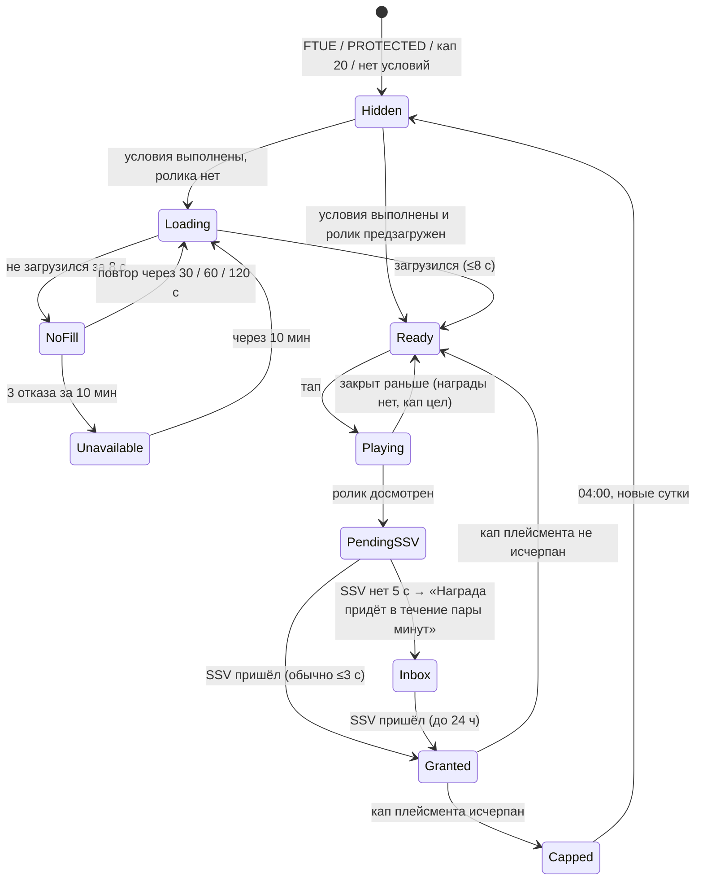
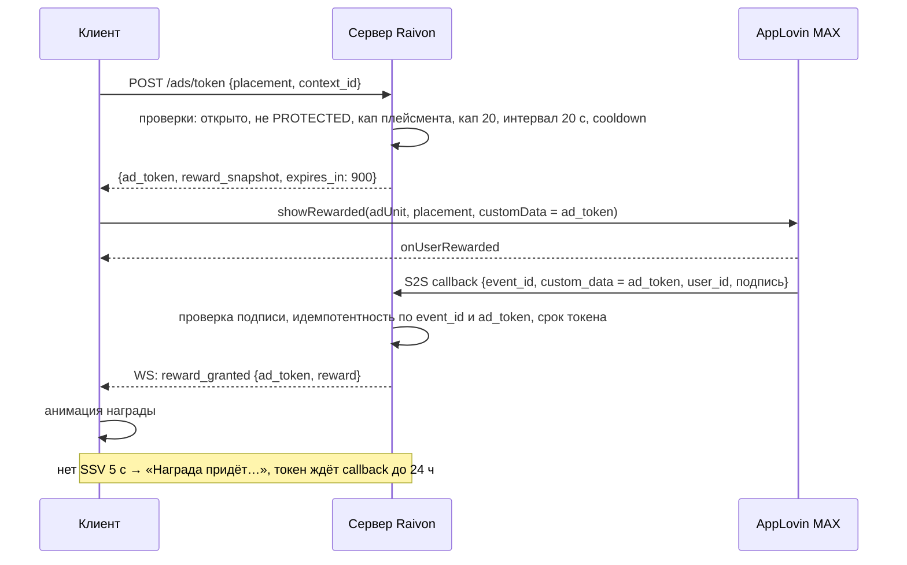
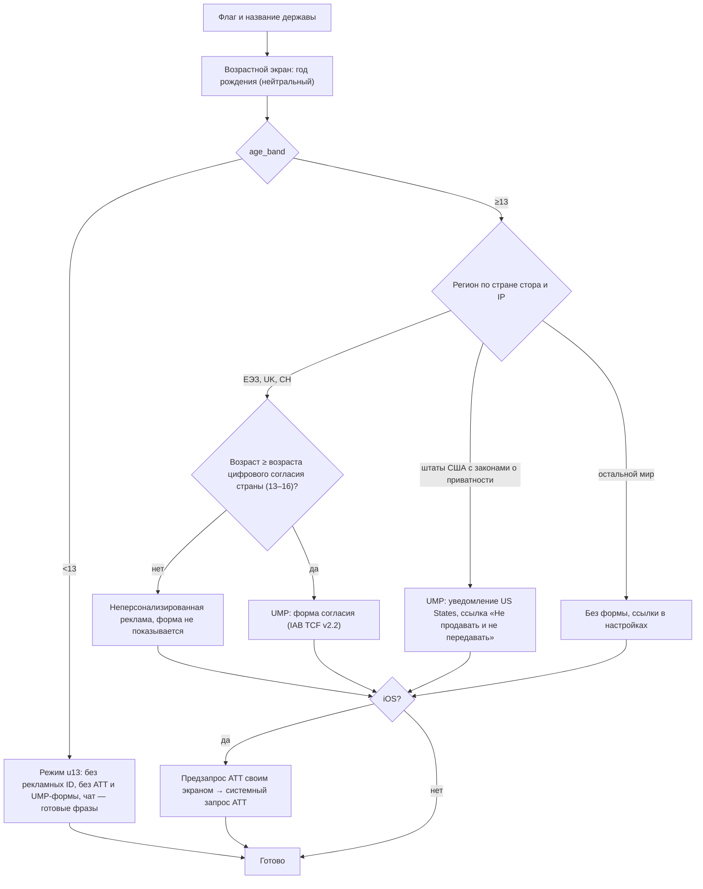
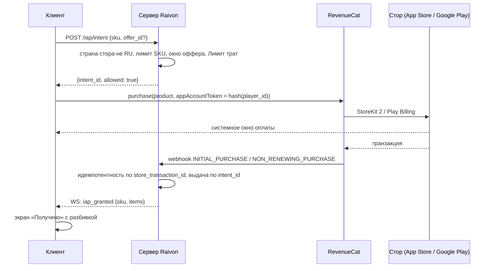
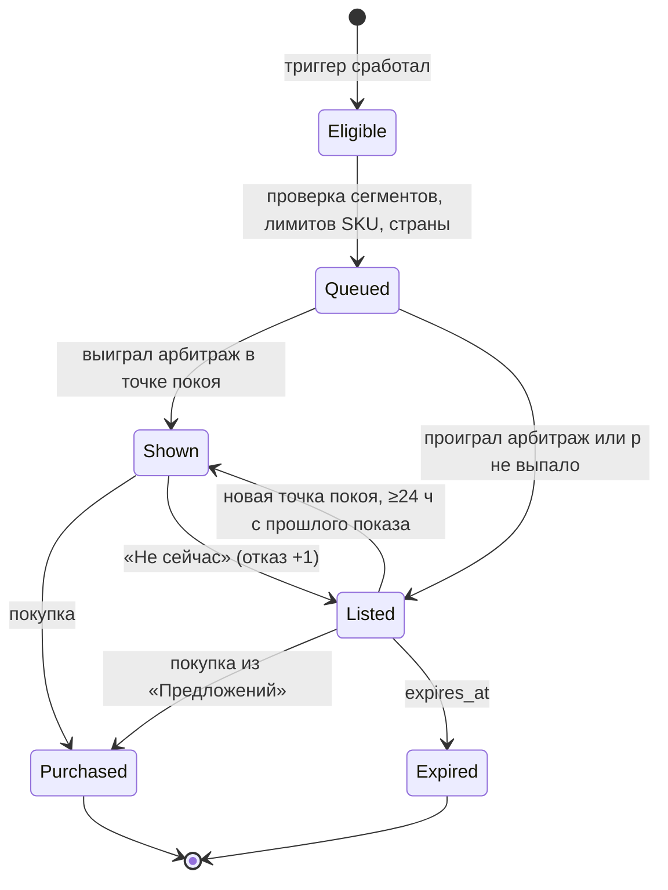
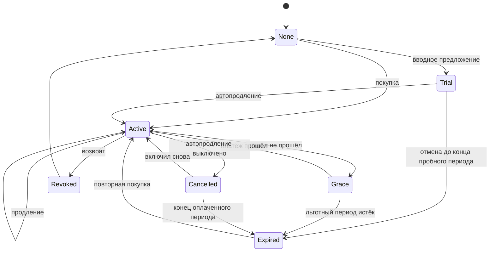

# 9. Монетизация

> **Назначение.** Полная спецификация монетизации «Raivon: Territory Wars», по которой можно сразу писать `content/ads.yaml`, `iap_catalog.yaml`, `offers.yaml`, `cases.yaml`, `cosmetics.yaml`, `pass.yaml` и серверную логику наград. Здесь описаны: модель 50/50 и контроль коридора, 12 rewarded-плейсментов и interstitial, медиация и согласия, курс и ценность Райвитов, весь каталог SKU, движок офферов, кейсы с таблицами шансов и математикой гаранта, косметика, Военный пропуск, подписка, анти-P2W приёмка, политики сторов, прогноз выручки, метрики и A/B-тесты.
> **Опирается на канон:** §2.1 (решения 5, 7, 13, 15, 16, 22, 23), §2.2 (п. 19, 20, 22, 28–32), §4 (валюты), §5.1 (Райвитовая жила), §7 (строители), §8.4 (командиры и осколки), §9.14 (утешение после поражения), §10.3 (церемония), §11 (Арена: билеты не продаются), §13.1 (ускорения), §14.3–14.10 (FTUE, крючки, пуши, возврат, запреты), **§15 целиком**, §16.2–16.5 (RevenueCat, MAX, SSV, автотесты), §17 (KPI и проверка 50/50).
> **Связанные файлы:** `01_vision_core_loop.md` (карта касаний монетизации, защищённые состояния, В7), `03_war_combat.md` (наступление, `ad_start_energy`, авто-оборона), `04_units_army.md` (командиры, кривая осколков, пул Военного ящика, «Пакет реванша» как заряды пополнения), `05_economy_buildings.md` (цены ускорений и докупки в Райвитах, зачисление сверх вместимости, трактовка `ad_double_trophies` и `ad_offline_double`), `06_diplomacy_peace.md` (итоги мира и поражения, окно `ad_hide_treasury`), `07_progression_meta.md` (сезоны Арены, профили темпа), `08_retention_liveops.md` (календарь, «Приказы дня», ОП, события, Военный ящик как источник удержания, предиктор оттока), `10_ui_ux_art.md` (пиксели экранов, VFX открытия кейса), `11_balance_numbers.md` (кривые наград по УР), `12_tech_analytics_roadmap.md` (RevenueCat, MAX, схема событий, A/B-платформа).

---

## 9.1. Зона файла, инварианты, обозначения

### 9.1.1. Что здесь и что не здесь

| Здесь | Не здесь (граница) |
|---|---|
| модель 50/50, рычаги remote config, контроллер коридора | экономические формулы наград: размер залежи, пул дохода, грабёж (`05`, `03`) |
| 12 rewarded-плейсментов: UX, капы, cooldown, отказ загрузки, SSV | правила боя и наступления, где стоит `ad_start_energy` (`03`) |
| interstitial, медиация, eCPM, согласия (ATT, UMP, возрастной экран, подход для <13) | транспорт и хранение согласий, SDK-интеграция по шагам (`12`) |
| каталог SKU, цены по tier'ам, «выгода ×N», офферы, паки, кейсы, косметика, пасс, подписка | календарь входа, «Приказы дня», вехи событий, магазин жетонов (`08`) |
| курс Райвитов и ценник ценности | цены ускорений и докупки в Райвитах (`05` §12, канон §13.1) |
| политики сторов, раскрытие шансов, возвраты | модерация чата (канон §14.9), удаление аккаунта как функция (`12`) |
| прогноз выручки, метрики монетизации, A/B монетизации | метрики удержания и A/B удержания (`08` §8.18–8.19) |

### 9.1.2. Инварианты монетизации

Каждый инвариант — серверная проверка, линтер контента или автотест. Нарушение любого из них блокирует релиз.

| # | Инвариант | Источник | Как проверяется |
|---|---|---|---|
| M1 | Кейсы, лутбоксы, паки, визуалы и косметика есть **во всех странах и работают одинаково**, включая платное открытие. Гео-замен, отключений, возрастных отключений нет | решения 7, 13 | линтер: в `cases.yaml` и разделах кейсов `iap_catalog.yaml` запрещены ключи `geo`, `country`, `age`; единственное гео-различие каталога — локальная цена и `ru_payments_disabled` |
| M2 | Раскрытие шансов, гарант и история открытий — **только дополнения** к кейсам. Шансы серверного RNG и экрана «i» берутся из одного `cases.yaml` | канон §15.4 | автотест 1 млн открытий на кейс (§9.10.11) |
| M3 | В защищённых состояниях нет рекламы, офферов, пушей и всплывающих окон: `PROTECTED = {battle, live_defense, arena_battle, horde_strikeback, peace_ceremony, dl_ceremony, world_expansion, ftue}` | канон §14.10, `01` В7, `08` §8.17 | state-guard тест: каждый плейсмент и оффер вызывается в каждом состоянии, показано 0 |
| M4 | Никаких офферов 10 мин после поражения. Пакет реванша — не раньше следующей сессии и не раньше 10 мин | канон §9.14, §14.10 | серверный фильтр `offer_block_until` |
| M5 | Не больше 1 всплывающего оффера за сессию и 3 в сутки; после 3 отказов подряд — пауза 48 ч | канон §14.10 | счётчики на сервере, симуляция 30 сессий |
| M6 | Никаких ложных таймеров: таймер оффера = серверный `expires_at`. Истёкший оффер не возвращается с тем же содержимым и новым таймером раньше чем через 14 дней (предложение автора) | канон §14.10 п. 4 | линтер `offers.yaml` + журнал показов |
| M7 | Награда rewarded выдаётся **только** после серверного подтверждения просмотра (SSV) или мгновенно подписчику в тех же капах | канон §15.2, §15.7 | интеграционный тест: клиентский колбэк без SSV не начисляет ничего |
| M8 | Не продаются ни за деньги, ни за Райвиты: территория, УР, ускорение таймеров войны, перемирия, ультиматума, контратаки, щита; билеты Арены; Медали; место в рейтингах | канон §11, §13.1, §15.9 | линтер каталога по списку запрещённых типов наград (§9.14.1) |
| M9 | Россия (страна стора RU): все IAP скрыты, магазин показывает только бесплатное и рекламное; кейсы за Райвиты и из бесплатных источников работают | решение 16, канон §15.11 | тест витрины с `storefront=RU` |
| M10 | Interstitial — только неплатящим, с 3-го календарного дня после установки (D2 в нотации `08`), ≤5 в день, интервал ≥4 мин активной игры, баннеров нет | канон §15.2 | серверный счётчик + клиентский гард |
| M11 | Мягкий общий кап rewarded — 20 в день (контроллер коридора двигает его по гео шагами ±10%, §9.2.5) | канон §15.1–15.2 | серверный счётчик |
| M12 | Метка «выгода ×N» считается формулой §9.7.3 из `iap_catalog.yaml`, а не вписывается руками | предложение автора | автотест каталога |
| M13 | Если игрок задал «Лимит трат», сервер проверяет его **до** вызова платёжного окна стора | канон §15.4 | интеграционный тест |
| M14 | Игрокам младше 13 лет по возрастному экрану — только неперсонализированная реклама, без рекламных идентификаторов | канон §15.2 | тест флагов SDK по `age_band` (§9.6.6) |
| M15 | Приёмка анти-P2W в headless-симуляции проходит на каждом изменении `iap_catalog`, `offers`, `cases`, `pass` | канон §15.9 п. 7 | ночной прогон симулятора `tools/` (§9.14.2) |

### 9.1.3. Обозначения

- **Р** — Райвиты (`cur_raivite`). **Р-экв** — ценность в Райвит-эквиваленте по ценнику §9.7.2.
- **k** — число активных ресурсов: 3 до УР5 (золото, еда, металл), 4 с УР5 (плюс нефть).
- **«Ресурсы N ч»** — N часов валового производства игрока **по каждому** активному ресурсу (как в `08` §8.1.3). Ценность: `N × 12 × k` Р-экв (канон §15.8). **«Золото N ч»** — только золото: `N × 12` Р-экв.
- **T1 / T2 / T3** — гео-тиры канона §1.2. **RU** — страна стора Россия (тир T2, платежи отключены).
- **Неплатящий** — ни одной покупки за всё время. **Платящий** — хотя бы одна покупка.
- **Сессия, игровые сутки** — как в `08` §8.19.1 (сброс суток в 04:00 по местному времени).
- Пометка **(ПА)** — предложение автора: значение или правило, которого нет в каноне.

---

## 9.2. Модель 50/50

### 9.2.1. Философия

Реклама и покупки продают **разное**, поэтому не каннибализируют друг друга.

| Канал | Что продаёт | Ощущение игрока | Пример |
|---|---|---|---|
| Rewarded | время и удвоения малыми порциями (3–8% дневного прогресса за просмотр, канон §15.1) | «посмотрел ролик — сэкономил полчаса» | `ad_speedup` −45 мин, `ad_convoy_double` |
| Interstitial | ничего; это плата неплатящего вниманием в естественных паузах | «пауза между боями» | после итогов наступления |
| IAP: постоянство | навсегда меняет темп или удобство | «один раз купил — пользуюсь всегда» | 4-й строитель, «Без рекламы» |
| IAP: комфорт | регулярная выгода | «каждый день забираю» | «Паёк державы», «Державный патент» |
| IAP: коллекция | командиры, косметика, кейсы | «собираю» | Королевский кейс, Кейс коллекции |
| IAP: статус | видимая другим косметика церемонии и столицы | «моя граница выглядит лучше» | Северное сияние, скин столицы |

Ключевой принцип: **рекламный зритель и покупатель — один и тот же человек в разные моменты**. Rewarded приучает к ценности времени, покупка снимает потолок rewarded. Поэтому подписка даёт награды rewarded без просмотра (решение 23), а «Без рекламы» убирает только interstitial, а не rewarded.

### 9.2.2. Что не продаётся никогда

| Не продаётся | Почему | Где закреплено |
|---|---|---|
| Официальная территория, гексы, УР | главный анти-P2W якорь: УР требует гексов | канон §2.2 п. 15, §15.9 п. 1 |
| Ускорение войны, перемирия, ультиматума, контратаки, щита, разорения (кроме `ad_ruin_halve`), срока жизни залежей, билетов, тихих часов, жил | честность реалтайма и PvE-баланса | канон §9.15, §13.1, `05` §12.6 |
| Билеты Арены, Медали, кубки | PvP только мастерством в лиговом стандарте | канон §11 |
| Место в рейтинге события | жетоны из паков не идут в рейтинг | `08` §8.10.1 |
| Уровни сверх потолков УР | потолки уровней | канон §15.9 п. 2 |
| Подкрутка сложности | сложность фиксирована | канон §9.16, §15.9 п. 6 |
| Уровни пасса за Райвиты | «Элитный пропуск» даёт +15 уровней один раз; поштучной продажи нет (ПА) | §9.12.5 |

### 9.2.3. Метрика доли и коридор

```
ad_rev_week   = выручка рекламы за неделю (выплата медиации паблишеру, как её отдаёт MAX; комиссии сети уже вычтены)
iap_gross_week = сумма цен покупок без НДС/налога продаж, до комиссии стора (то, что стор называет «продажи»)
ad_share      = ad_rev_week / (ad_rev_week + iap_gross_week)        ← главная метрика коридора
ad_share_net  = ad_rev_week / (ad_rev_week + iap_gross_week × (1 − комиссия)) ← справочная
```

- **Коридор:** 45% ≤ `ad_share` ≤ 55% (канон §15.1). Считается по неделе понедельник 04:00 UTC → понедельник 04:00 UTC, по всему миру.
- Главная метрика берёт IAP **до комиссии**, как проверка канона §17 ($0,040 gross). На чистой выручке доля рекламы при той же игре выше примерно на 3–4 п.п. (при комиссии 15%: 0,038 / (0,038 + 0,034) ≈ 53%). Какую из двух держать в коридоре — вопрос владельцу (§9.19.3, вопрос 1); до ответа — gross (ПА).
- Возвраты вычитаются из недели, в которую прошла покупка (пересчёт задним числом до 30 дней).
- Россия входит в знаменатель: IAP там 0, это сдвигает долю к рекламе на ~1–2 п.п. (оценка ПА при доле RU ~5% DAU).

### 9.2.4. Рычаги remote config

Гео-различия разрешены **только** в двух рычагах (канон §15.1; `08` §8.18.1): капы rewarded и частота офферов. Цены локализуются отдельно (§9.8.2) и рычагом не являются.

| Рычаг | Код | База T1 / T2 / T3 (ПА) | Диапазон | Шаг | На что действует |
|---|---|---|---|---|---|
| Множитель капов rewarded | `rewarded_cap_mult[tier]` | 0,9 / 1,0 / 1,1 | 0,8–1,3 | 0,1 | мягкий кап 20 и капы плейсментов ≥3 в день: `cap = max(1, round(cap_base × mult))`. Капы 1 и 2 не меняются |
| Множитель частоты офферов | `offer_freq_mult[tier]` | 1,1 / 1,0 / 0,9 | 0,6–1,2 | 0,1 | вероятность показать всплывающий оффер в подходящей сессии: `p = min(1, 0,6 × mult)`. Жёсткие лимиты канона (1 за сессию, 3 в сутки, пауза 48 ч) не меняются никогда |

Пример: в T3 при множителе 1,1 мягкий кап = 22, `ad_speedup` = 7, `ad_double_trophies` = 4 (round(4,4)), `ad_army_refill` = 3 (round(3,3)). В T1 при 0,9: мягкий кап 18, `ad_speedup` 5, остальные без изменений.

### 9.2.5. Контроллер коридора

Раз в неделю (понедельник 06:00 UTC, задача pg-boss) контроллер смотрит прошлую неделю и сдвигает рычаги на один шаг. Он работает **глобально**: шаг применяется ко всем тирам, а разная база тиров сохраняет дифференциацию «в T3 капы выше и офферов меньше, в T1 наоборот».

```ts
// server/monetization/corridorController.ts (ПА)
function weeklyCorridorStep(week: WeekStats, cfg: Levers): Levers {
  if (week.dau < 3000 || week.iapGross + week.adRev < 2000) return cfg;  // мало данных — не трогаем
  if (week.d7Cohort < KPI.d7Min) return freeze(cfg, 'retention_guard'); // D7 ниже минимума канона (12%) — сначала удержание
  const s = week.adRev / (week.adRev + week.iapGross);
  const next = clone(cfg);
  if (s < 0.45) {            // рекламы мало: больше rewarded, меньше давления офферами
    for (const t of TIERS) { next.capMult[t] = clamp(cfg.capMult[t] + 0.1, 0.8, 1.3);
                             next.offerMult[t] = clamp(cfg.offerMult[t] - 0.1, 0.6, 1.2); }
  } else if (s > 0.55) {     // рекламы много: меньше rewarded, больше офферов
    for (const t of TIERS) { next.capMult[t] = clamp(cfg.capMult[t] - 0.1, 0.8, 1.3);
                             next.offerMult[t] = clamp(cfg.offerMult[t] + 0.1, 0.6, 1.2); }
  } else if (Math.abs(s - 0.50) < 0.02) {
    return driftToBase(cfg, 0.1);   // в центре коридора медленно возвращаемся к базе
  }
  if (maxDeviationFromBase(next) > 0.3) return freeze(cfg, 'manual_review');   // ±30% от базы — только вручную
  return logAndPublish(next);       // новая версия remote config + письмо владельцу
}
```

Правила контроллера (ПА):
- Изменение публикуется новой версией remote config; клиенты подхватывают его при следующем запросе конфига. Капы текущих суток у игрока не уменьшаются задним числом.
- Если идёт A/B-тест, затрагивающий капы или офферы, контроллер не трогает рычаги в тестовых когортах.
- Два шага подряд в одну сторону без возврата в коридор → алерт «коридор не держится рычагами» (вопрос к составу каталога, а не к капам).

### 9.2.6. YAML рычагов

```yaml
# content/monetization_levers.yaml
corridor: {metric: ad_share_gross, min: 0.45, max: 0.55, center_band: 0.02, review_at_dev: 0.30}
levers:
  rewarded_cap_mult: {T1: 0.9, T2: 1.0, T3: 1.1, range: [0.8, 1.3], step: 0.1}
  offer_freq_mult:   {T1: 1.1, T2: 1.0, T3: 0.9, range: [0.6, 1.2], step: 0.1}
offer_popup_base_p: 0.6
hard_limits:            # канон §14.10, контроллер их не трогает
  popup_per_session: 1
  popup_per_day: 3
  decline_streak_pause: {declines: 3, hours: 48}
  no_offers_after_defeat_min: 10
rewarded_soft_cap_base: 20
geo_tiers:
  T1: [US, CA, GB, DE, FR, JP, KR, AU]
  T2: [BR, MX, TR, PL, ES, IT, RU, KZ, UA, BY, UZ, AZ, AM, GE, KG, MD, TJ]   # «СНГ» канона §1.2 и соседние рынки
  T3: [IN, ID, PH, VN, EG]
  default: T2           # страны вне списков (ПА); пересматривается по фактическому eCPM раз в месяц
```

---

## 9.3. Rewarded-реклама

### 9.3.1. Общие правила

| Правило | Значение |
|---|---|
| Открытие | после `ftue_complete` и не раньше 10 мин с первого запуска (канон §14.3) |
| Мягкий общий кап | 20 просмотров за игровые сутки × `rewarded_cap_mult[tier]`; после него **все** rewarded-кнопки скрываются до 04:00 (канон §15.2) |
| Капы плейсментов | §9.3.3; считаются только **завершённые** просмотры. Закрыл ролик раньше времени — награды нет, кап не тратится (ПА) |
| Глобальный интервал | ≥20 с между завершением одного ролика и стартом следующего (ПА: защита от ботов и «цепочек» роликов) |
| Подтверждение | награда только по SSV (§9.3.6). Награда фиксируется **при выдаче токена** до показа (снимок по текущему УР и состоянию), а не после |
| Масштаб по УР | награды в часах производства и минутах масштабируются автоматически; фиксированные числа даны в §9.3.3 |
| Защищённые состояния | кнопки не рендерятся, SDK не вызывается (инвариант M3). `ad_start_energy` живёт в фазе подготовки, она **не** защищённая: бой начинается только по «В бой!» |
| Подписчик | вместо «▶ Смотреть» кнопка «Получить» с гербом Патента; награда мгновенно, **в тех же капах** и в мягком капе 20 (канон §15.7, решение 23). Показа рекламы нет, в рекламную выручку не идёт |
| Россия | rewarded работают через медиацию с сетями, доступными в RU (§9.5.4); награды те же |
| Младше 13 лет | rewarded доступны, реклама только неперсонализированная (§9.6.3) |
| Офлайн | игра только онлайн; без связи кнопки не показываются |
| Нет в FTUE | первые 10 мин рекламы нет совсем (канон §14.3) |

### 9.3.2. Состояния кнопки и отказ загрузки



| Состояние | Что видит игрок | Текст (RU) |
|---|---|---|
| Ready | зелёная кнопка с иконкой ▶, награда крупно, остаток капа мелко | «▶ −45 мин · 4/6» |
| Loading | та же кнопка со спиннером, тап доступен; при тапе ждём до 8 с | «Загружаем ролик…» |
| NoFill | серая кнопка, рядом — альтернатива за Райвиты или предмет, если она есть у плейсмента | «Ролик пока недоступен» |
| Unavailable | серая кнопка без спиннера с реальным таймером повтора | «Нет роликов · 9:41» |
| PendingSSV | полоса «Проверяем…» до 5 с | «Проверяем просмотр…» |
| Inbox | тост и запись во «Входящих» | «Награда придёт в течение пары минут» |
| Capped (плейсмент) | серая кнопка с реальным временем сброса | «Завтра в 04:00» |
| Hidden (кап 20) | кнопок нет; в профиле строка «Ролики на сегодня закончились» | — |

**Правила отказа загрузки (ПА):**
- Отказ не тратит кап и не блокирует действие: у каждого плейсмента есть путь без рекламы (Райвиты, предмет, время).
- Предзагрузка: держим 1 готовый rewarded-ролик всегда, когда на экране может появиться rewarded-кнопка. Повтор с экспоненциальной задержкой 30 / 60 / 120 с.
- Плейсменты с окном («Спрятать казну», «×2 трофеи», «×2 офлайн-доход») при отказе загрузки получают продление окна один раз (§9.3.4).
- **Добросовестная выдача:** если клиент сообщил о досмотре, устройство прошло проверку целостности (Play Integrity / App Attest), а SSV не пришёл за 10 мин, награда выдаётся один раз в сутки «на доверии». Второй такой случай в сутки ждёт SSV (ПА).

### 9.3.3. Сводная таблица 12 плейсментов

Капы — база канона §15.2 (до множителя гео). Награда по УР — из канона; ценность в Р-экв — §9.3.5.

| # | Плейсмент | Код | Где кнопка | Текст кнопки | Награда по УР | Кап/сутки | Cooldown (ПА) | Альтернатива без рекламы |
|---|---|---|---|---|---|---|---|---|
| 1 | ×2 трофеи | `ad_double_trophies` | экран итогов мира, шаг 5,5–7,0 с церемонии (канон §10.3) | «▶ ×2 трофеи» + «Поместится +12 000 из 18 000» | ×2 контрибуции и ресурсов разграбления договора; не территория, не репарации, не сундук (`05` §17) | 4 | 1 раз на договор | нет |
| 2 | Ускорить | `ad_speedup` | любой не-военный таймер ≥5 мин: панель строителей, карточка постройки, Академия, Казарма, пополнение армии, колонизация | «▶ −30 мин» / «▶ −45 мин» / «▶ −60 мин» | −30 мин (УР 1–4), −45 (5–7), −60 (8–10) или весь таймер, если он короче | 6 | ≤3 раза на один таймер | Райвиты по кривой §13.1, предметы |
| 3 | Пополнить армию | `ad_army_refill` | карточка армии; кнопка «Наступление», когда ни одна армия не готова (`01` §1.6.7) | «▶ Пополнить до 100%» | армия мгновенно до 100%, еда не списывается (`04` §9.4) | 3 | нет | Райвиты, предметы, ожидание |
| 4 | Стартовая энергия | `ad_start_energy` | экран подготовки PvE-наступления, справа от полосы энергии | «▶ +3 энергии на старт» | +3 стартовой энергии (только PvE-наступление; не Арена, не оборона) | 3 | 1 раз на наступление | нет |
| 5 | Двойной груз | `ad_convoy_double` | карточка обоза в пути, на залежи и на обратном пути | «▶ ×2 груз» | ×2 к довезённому грузу при разгрузке (`05` §15.2); не действует на Райвитовую россыпь | 3 | 1 раз на поездку | нет |
| 6 | Военный ящик | `ad_free_crate` | магазин → «Кейсы» → карточка Военного ящика | «▶ Бесплатный ящик · 2/2» | +1 `case_war_crate` в инвентарь | 2 | 60 мин между двумя | нет |
| 7 | ×2 офлайн-доход | `ad_offline_double` | экран «Пока вас не было» при отсутствии ≥4 ч | «▶ ×2 доход за отсутствие» + «Поместится +8 400 из 11 200» | ×2 к пулу, собранному при этом входе (`05` §5.4) | 1 | 1 раз на возврат | нет |
| 8 | Ремонт | `ad_repair` | итоги поражения, карточка повреждённой постройки, плашка «Повреждено: 2» на HUD | «▶ Отремонтировать всё (2)» | ремонт всех повреждённых зданий сразу | 2 | нет | 5% стоимости уровня типа и 10 мин на здание (канон §9.14) |
| 9 | Снять разорение | `ad_ruin_halve` | «Что сохранено», плашка «Разорение −30% · 4:12:05» на HUD | «▶ Сократить вдвое» | −50% оставшейся длительности разорения | 1 | нет | ждать |
| 10 | Спрятать казну | `ad_hide_treasury` | итоги поражения, до применения грабежа (окно 60 с, `06` §5.4) | «▶ Спрятать казну: +15% защиты» | защищённая доля +15 п.п. на этот грабёж (итог ≤85%, `05`) | 1 | 1 раз на поражение | нет |
| 11 | Билет Арены | `ad_arena_ticket` | экран Арены, рядом со счётчиком билетов, только при билетах <5 | «▶ +1 билет» | +1 билет | 2 | 30 мин между двумя | ждать (+1 за 2 ч) |
| 12 | ×2 награда дня | `ad_daily_double` | календарь входа, после забора награды дня (кроме ключевых дней, `08` §8.8.1) | «▶ ×2 награда дня» | ×2 к награде дня календаря | 1 | 1 раз в сутки | нет |

Сумма капов — 29 в сутки при мягком капе 20: игрок выбирает, на что тратить «рекламный бюджет дня», и самые ценные плейсменты не простаивают.

### 9.3.4. UX-потоки плейсментов

Общий шаблон: условие → кнопка → тап → ролик → «Проверяем…» → анимация награды в точке действия → обновлённый счётчик. Ниже — особенности каждого.

**1. `ad_double_trophies`.** Церемония мира не прерывается: кнопка появляется на шаге 5,5–7,0 с, когда церемония уже закончилась. На кнопке — прогноз «Поместится +12 000 из 18 000» (`05`). Тап → ролик → трофеи «влетают» второй волной. Если ролик не загрузился, кнопка «×2 трофеи» переезжает во «Входящие» как карточка «Итоги войны с Орденом» и живёт там 10 мин с реальным таймером (ПА). Повторный договор в те же сутки — новая кнопка, пока не исчерпан кап 4.

**2. `ad_speedup`.** Кнопка стоит в строке таймера рядом с «Ускорить: N Р» и «Предметы ›» (`05` §12). Таймер <5 мин — кнопки нет (бесплатное завершение). Если остаток меньше награды, текст меняется на «▶ Завершить». После ролика полоса таймера «отматывается» за 0,6 с. На один таймер — не больше 3 роликов, чтобы 48-часовая Резиденция не закрывалась рекламой целиком.

**3. `ad_army_refill`.** Кнопка видна, если армия <100%, не в бою и снабжена. Армия без снабжения: кнопка серая с подписью «Нет снабжения» (канон §9.7). В фазе подготовки наступления кнопка тоже доступна: подготовка не защищённое состояние. Анимация: флажок Силы «дозаправляется» до максимума.

**4. `ad_start_energy`.** Кнопка на экране подготовки до «В бой!». После ролика полоса энергии показывает «5 + 3». Если старт не прошёл (сеть), бонус переносится на следующий старт PvE-наступления в течение 30 мин (`03` §24, случай 37). В бою, на Арене и в обороне кнопки нет.

**5. `ad_convoy_double`.** Тап по обозу на карте → карточка с грузом «Металл 2 400» и кнопкой «▶ ×2 груз». После ролика на обозе появляется значок «×2», груз удваивается при разгрузке. Перехват врагом забирает 50% груза **до** удвоения (`05`). На Райвитовую россыпь кнопка не выводится.

**6. `ad_free_crate`.** Карточка Военного ящика в магазине: «Бесплатный ящик · 2/2». После ролика ящик падает в инвентарь и сразу открывается (2 с). Второй ролик доступен через 60 мин с реальным таймером, чтобы оба ящика не уходили в первой сессии дня. Ящик из ролика идёт в инвентарь, а не в слот таймера (`08` §8.9.1).

**7. `ad_offline_double`.** На экране «Пока вас не было» под суммой «Собрать всё». Отсутствие <4 ч — кнопки нет. Если ролик не загрузился, кнопка остаётся на тосте сбора 10 мин (ПА). Подписчик получает удвоение автоматически при входе, в том же капе 1 (`05` §5.4).

**8. `ad_repair`.** После поражения с повреждениями: строка «Повреждено: 2 постройки (−50% выхода)» и кнопка. Ремонтирует **все** повреждённые сразу. Кап 2: на случай двух поражений за сутки (две войны одновременно).

**9. `ad_ruin_halve`.** Плашка разорения на HUD с реальным таймером. Тап → «▶ Сократить вдвое». Разорение ничем другим не ускоряется (канон §13.1 и `05` §12.6).

**10. `ad_hide_treasury`.** Экран итогов поражения показывает прогноз потерь «Грабёж: −30 000 золота» и кнопку с пересчётом «С казной: −21 000». Окно 60 с (`06`). Если ролик не загрузился, окно продлевается один раз на 60 с (ПА). Закрыл приложение — грабёж применяется без бонуса (`06`). Офферов здесь нет (M4).

**11. `ad_arena_ticket`.** Только при билетах <5 и только вне боя. Кнопка рядом с «Билеты 3/5 · +1 через 1:12». Билеты не продаются ни за что, кроме этого ролика (канон §11).

**12. `ad_daily_double`.** После тапа «Забрать» на календаре. Ключевые дни (строитель, командир, уникальная косметика, 300 Райвитов) без кнопки (`08` §8.8.1). Удваивает ресурсы, ускорения, ящики, Райвиты и осколки дня.

### 9.3.5. Ценность просмотра и проверка «3–8% дневного прогресса»

В каноне нет формулы «дневного прогресса». Рабочее определение (ПА): **дневной доход F2P** = валовое производство за 24 ч по всем ресурсам = `24 × 12 × k` Р-экв (864 Р-экв при k = 3; 1 152 при k = 4). Ценность просмотра = прирост в Р-экв по ценнику §9.7.2.

| Плейсмент | Ценность просмотра (Р-экв, УР4, k = 3) | Доля дневного дохода | Просмотров у типичного зрителя в день (ПА) |
|---|---|---|---|
| `ad_speedup` −30 мин | 12 (на УР8 −60 мин — 20) | 1,4% (1,7%) | 1,8 |
| `ad_army_refill` 40 мин | ~20 (время 15 + еда ~5) | 2,3% | 0,9 |
| `ad_start_energy` | вне шкалы (исход боя) | — | 0,8 |
| `ad_convoy_double` M / L | 18 / 48 | 2,1% / 5,6% | 0,8 |
| `ad_free_crate` | ~45 (EV ящика с учётом гаранта, §9.10.2) | 5,2% | 0,8 |
| `ad_double_trophies` | 60–150 | 7–17% | 0,4 |
| `ad_offline_double` (6 ч) | ~216 | 25% | 0,2 |
| `ad_daily_double` | ~20 | 2,3% | 0,3 |
| `ad_arena_ticket` | вне шкалы | — | 0,25 |
| `ad_repair`, `ad_ruin_halve`, `ad_hide_treasury` | 30–120, ситуативно | 3–14% | 0,05 |

- **Средняя ценность просмотра** (взвешенная по просмотрам с ценностью): ≈34 Р-экв ≈ **4% дневного дохода** — внутри коридора канона 3–8%.
- **Сумма за день** у типичного зрителя (6,3 просмотра, канон §17): ≈180 Р-экв ≈ **20% дневного дохода**. Это сходится с приёмкой канона «F2P с рекламой ×1,15–1,25 быстрее» (§9.14.2).
- Ускорения по ценности дают меньше 3%, но решают «узкое место» (свободный строитель сейчас). Удвоения офлайн-дохода и трофеев дают больше 8%, но бывают раз в сутки и привязаны к событию (возврат, мир).

### 9.3.6. SSV: поток подтверждения



- `ad_token` одноразовый, привязан к `player_id`, плейсменту, контексту (id таймера, армии, договора) и снимку награды. Срок — 15 мин на показ; callback принимается до 24 ч.
- Сервер считает просмотр в капе по факту SSV, а не по выдаче токена. Токены, не дошедшие до SSV, не тратят кап.
- Если контекст исчез до SSV (таймер закончился, армия пополнилась сама), награда конвертируется: ускорение — в предмет `item_speedup_*` ближайшего меньшего номинала, пополнение — в ускорение пополнения на следующий раз (ПА: ролик никогда не пропадает впустую).
- Подписчик: тот же `POST /ads/token` возвращает `{instant: true}`, сервер начисляет сразу, кап тратится так же.
- Античит: >30 токенов в сутки, токены с разных устройств одного аккаунта одновременно, SSV без клиентского показа — флаг аккаунта и ручная проверка (детали — `12`).

---

## 9.4. Interstitial

### 9.4.1. Правила

| Правило | Значение | Источник |
|---|---|---|
| Кому | только неплатящим: для interstitial это «без покупок за последние 30 дней» (так канон сочетает «только неплатящим» и «покупка отключает на 30 дней»), без «Без рекламы» и без активного Патента | канон §15.2 |
| С какого дня | с 3-го календарного дня после установки (D2 в нотации `08`, «день 3» в нотации `01`) | канон §15.2, `08` У12 |
| Где | только в естественных паузах: «Продолжить» после итогов наступления; закрытие отчёта обороны | канон §15.2 |
| Интервал | ≥4 мин активной игры (приложение на переднем плане) с прошлого interstitial **и** с начала сессии (ПА: не встречать игрока роликом) | канон §15.2 |
| Дневной лимит | ≤5 | канон §15.2 |
| Rewarded отменяет | досмотренный rewarded за последние 5 мин отменяет ближайший interstitial | канон §15.2 |
| Покупка | любая покупка отключает interstitial на 30 дней; «Без рекламы» — навсегда; Патент — на время подписки | канон §15.2 |
| Не после поражения | не показывается на закрытии отчёта **проигранной** обороны и в первые 10 мин после проигранной войны (ПА: проигрыш + ролик = двойное наказание) | канон §9.14 (дух утешения) |
| Пропуск | ролик можно закрыть через 5 с там, где сеть это поддерживает; длинные (>30 с) неподскипываемые креативы отключаются в настройках сетей, где такая настройка есть (ПА) | — |
| Холдаут | 5% неплатящих без interstitial навсегда | канон §15.2 |
| Аварийное выключение | если D7 основной группы ниже холдаута больше чем на 1 п.п. — interstitial выключаются глобально | канон §15.2 |
| Баннеры | нет | канон §15.2 |

### 9.4.2. Плейсменты interstitial

| Плейсмент | Код (ПА) | Момент | Ожидаемая доля показов |
|---|---|---|---|
| После итогов наступления | `ad_int_offensive_result` | тап «Продолжить» на экране итогов наступления (★, ВС, трофеи) → ролик → карта | ~80% |
| Закрытие отчёта обороны | `ad_int_defense_report` | закрытие отчёта **выигранной** обороны (живой или авто) | ~20% |

Арена после боя — кандидат на третий плейсмент `ad_int_arena_result`, выключен до решения владельца (§9.19.3, вопрос 8).

### 9.4.3. Алгоритм

```ts
// client/ads/interstitialGate.ts + серверный счётчик (ПА)
function shouldShowInterstitial(p: Player, at: InterstitialPoint, now: Instant): boolean {
  if (cfg.interstitial.killSwitch) return false;
  if (p.holdoutNoInterstitial) return false;                    // 5% неплатящих
  if (p.hasNoAds || p.subActive) return false;
  if (p.lastPurchaseAt && now - p.lastPurchaseAt < days(30)) return false;
  if (p.calendarDaysSinceInstall < 2) return false;             // день 1 и 2 — без interstitial
  if (PROTECTED.has(p.state)) return false;
  if (at === 'defense_report' && !p.lastDefenseWon) return false;
  if (p.lastDefeatAt && now - p.lastDefeatAt < minutes(10)) return false;
  if (p.interstitialToday >= 5) return false;
  if (p.activeSecondsSince(p.lastInterstitialAt ?? p.sessionStartAt) < 240) return false;
  if (p.lastRewardedCompletedAt && now - p.lastRewardedCompletedAt < minutes(5)) return false;
  return adsSdk.isInterstitialReady();                          // не готов — пропускаем без ожидания
}
```

- Не загрузился — пропуск без ожидания и без повтора в этой точке.
- После 10-го показанного interstitial (за всё время) включается триггер оффера «Без рекламы» (§9.9.2).
- KPI: ≤1,2 interstitial на DAU (канон §17).

### 9.4.4. Холдаут и аварийное выключение

- Холдаут назначается при установке: `hash(player_id) mod 100 < 5` и сохраняется навсегда, даже после первой покупки.
- Сравнение раз в неделю: D7 когорты основной группы против холдаута, только неплатящие, окно 4 недели. Если `D7_main < D7_holdout − 1 п.п.` и разница значима (двусторонний тест долей, α = 0,05), сервер ставит `killSwitch = true` и пишет владельцу. Включить обратно — только вручную после разбора.
- Параллельно считается вклад interstitial в ARPDAU: если он меньше 5% общей рекламной выручки, interstitial тоже стоит выключить (вопрос к владельцу, автоматического правила нет).

---

## 9.5. Медиация и eCPM

### 9.5.1. Стек

| Компонент | Решение |
|---|---|
| Медиация | AppLovin MAX с биддингом (канон §15.2, §16.2). Плата за медиацию у MAX нулевая |
| Резерв | Google AdMob (канон §15.2): резервный путь, если MAX недоступен, и основной путь для игроков младше 13 лет (§9.6.3) |
| Россия | сети, работающие в RU, основная резервная — Yandex Mobile Ads (канон §15.11; адаптер MAX или прямая интеграция, решает `12`) |
| Интеграция в Capacitor | собственный Capacitor-плагин (ПА: `@raivon/capacitor-max`) поверх нативных SDK MAX для iOS и Android; JS-мост отдаёт `showRewarded(placement, customData)`, `showInterstitial(placement)`, события загрузки и показа. Код — `12` |
| Ad units | по одному rewarded и одному interstitial unit на платформу; плейсмент передаётся строкой `placement` для отчётности |
| Обязательные файлы | `app-ads.txt` на сайте разработчика; SKAdNetwork ID всех сетей в `Info.plist`; Privacy Manifest SDK; декларации Data Safety и App Privacy |

**Сети в биддинге MAX (ПА, финальный состав — по Mediation Debugger и тестам eCPM):**

| Сеть | Режим | Зачем |
|---|---|---|
| AppLovin Exchange | биддинг (нативно) | основа спроса, все тиры |
| Google bidding / AdMob | биддинг | глубокий спрос T2–T3, неперсонализированная реклама |
| Unity Ads | биддинг | игровой спрос |
| ironSource Ads | биддинг | игровой спрос |
| Meta Audience Network | биддинг | T1–T2 |
| Mintegral | биддинг | T2–T3, Азия |
| Pangle | биддинг | T3, Азия |
| Liftoff Monetize (Vungle) | биддинг | rewarded T1 |
| Moloco | биддинг | T1–T2 |
| InMobi | биддинг | T3 (IN, ID) |
| DT Exchange | биддинг | заполнение |
| Yandex Mobile Ads | по возможности биддинг | только RU и СНГ |

### 9.5.2. Настройки показа (ПА)

- Предзагрузка: 1 rewarded в памяти всегда, когда на экране возможна rewarded-кнопка; 1 interstitial — после 3 мин активной игры у тех, кому он положен.
- Ценовых полов нет на старте (чистый биддинг). Пол для interstitial T1 — $3 после 4 недель данных, если доля показов ниже $3 больше 20% (меньше роликов — меньше раздражения при той же выручке).
- Частотные капы сетей для rewarded выключены (кап держит наш сервер); для interstitial — 5 в сутки на стороне MAX как страховка.
- Блок-лист категорий креативов: азартные игры, знакомства, алкоголь, политика, «взрослые» приложения — для всех; для 13–17 дополнительно рейтинг контента `T` (Teen) у сетей, где он задаётся.
- Звук креативов — по системной громкости, без принудительного включения.

### 9.5.3. Допущения eCPM

Откалиброваны так, чтобы средневзвешенное по гео-миксу DAU 25/35/40 совпадало с проверкой канона §17 (rewarded $8,5, interstitial $5).

| Тир | Доля DAU | Доля iOS в DAU тира (ПА) | Rewarded iOS / Android | Rewarded средний | Interstitial iOS / Android | Interstitial средний | Fill rewarded (ПА) |
|---|---|---|---|---|---|---|---|
| T1 | 25% | 45% | $26 / $18 | **$21** | $15 / $10 | **$12** | ≥98% |
| T2 | 35% | 20% | $9 / $6 | **$6,5** | $6 / $3,5 | **$4** | ≥95% |
| T3 | 40% | 10% | $4 / $2,3 | **$2,5** | $2,5 / $1,4 | **$1,5** | ≥92% |
| Мир | 100% | 25% | — | **$8,5** | — | **$5** | — |

- Проверка: 0,25 × 21 + 0,35 × 6,5 + 0,40 × 2,5 = $8,53; 0,25 × 12 + 0,35 × 4 + 0,40 × 1,5 = $5,0.
- Сезонность: декабрь +30–40% к eCPM T1, январь −20–30% (ориентир рынка; модель прогноза §9.16 её не учитывает).
- RU: rewarded ~$3, interstitial ~$1,5 (ПА, внутри средней T2).

### 9.5.4. Россия

- Игра в RU работает только на рекламе (решение 16). Страна определяется по стране стора (Apple storefront, страна Google Play), а не по IP: игрок с зарубежным аккаунтом стора видит обычный каталог, а игрок с российским — только бесплатное и рекламное.
- Rewarded и interstitial в RU работают по общим правилам. Кейсы открываются за заработанные Райвиты и из бесплатных источников (§9.10.1).

---

## 9.6. Согласия и приватность

### 9.6.1. Поток согласий

Согласия собираются в FTUE на шаге 2:30–3:30 (канон §14.3), после названия державы и флага, до первой рекламы (она возможна только после 10-й минуты).



### 9.6.2. Возрастной экран и возрастные полосы

- **Экран:** «Когда вы родились?» с барабаном лет. Значение по умолчанию не предвыбрано, барабан стоит на пустом «— — — —», подсказок о «правильном» возрасте нет (нейтральный возрастной экран).
- Повторный ввод заблокирован на 30 дней после первого (ПА); изменить возраст можно через поддержку.
- Возраст хранится как `age_band` и год рождения; точная дата не собирается.

| `age_band` | Реклама | ATT / UMP | Чат | Покупки и кейсы | Прочее |
|---|---|---|---|---|---|
| `u13` | только неперсонализированная, через AdMob с child-directed тегами (§9.6.3) | не показываются | только готовые фразы (канон §14.9) | как у всех: кейсы и SKU одинаковы (решения 7, 13); согласие на оплату — родительский контроль стора (Ask to Buy, Family Link) | аналитика без рекламных ID, без атрибуционных SDK |
| `13_15` | персонализация только при согласии и при возрасте ≥ цифрового согласия страны (ЕЭЗ); рейтинг креативов `T` | показываются по региону | свободный | как у всех | при первой попытке покупки — карточка «Задать лимит трат?» (можно пропустить, ПА) |
| `16_17` | как `13_15` | как `13_15` | свободный | как у всех | карточка лимита трат — как `13_15` |
| `18p` | по согласию | по региону | свободный | как у всех | — |

Ни одна полоса не меняет состав, шансы, цены или доступность кейсов, паков и косметики (инвариант M1). Возрастные полосы влияют только на рекламу, данные и чат.

### 9.6.3. Подход для младше 13 лет (COPPA-подход)

- Игра ориентирована на 13+ и не участвует в Google Families (канон §15.10). Ребёнок, честно указавший возраст младше 13, получает режим `u13`.
- **Идентификаторы:** IDFA и GAID не запрашиваются и не передаются, ATT не показывается, атрибуционные SDK для этого игрока не инициализируются. Firebase Analytics работает с отключённым сбором рекламного ID; хранится только внутренний псевдонимный `player_id` для работы игры (исключение «внутренние операции»).
- **Реклама:** по текущей политике AppLovin детские пользователи не поддерживаются (проверить при интеграции, `12`), поэтому для `u13` MAX не инициализируется, а rewarded и interstitial идут через Google AdMob с `tagForChildDirectedTreatment = true`, `maxAdContentRating = G`, без персонализации. Если AdMob не отдал ролик, rewarded-кнопка в состоянии NoFill с альтернативой без рекламы.
- **Социалка:** свободного чата нет (канон §14.9), рефералы и шеринг доступны без передачи данных третьим лицам.
- **Покупки:** решения владельца 7 и 13 не допускают возрастных отключений. Согласие родителя на платёж обеспечивает стор (Ask to Buy, Family Link).

### 9.6.4. ATT (iOS)

- **Когда:** после первого мира (канон §15.2) — на шаге 2:30–3:30 FTUE, сразу после возрастного экрана и формы UMP, если она нужна.
- **Предзапрос** (свой экран, не похожий на системный): иллюстрация советника, текст «Разрешите показывать рекламу, подходящую вам. Это не меняет количество роликов и награды за них». Кнопки «Продолжить» → системный запрос и «Не сейчас» → повтор предзапроса один раз на 3-й календарный день, затем больше никогда (ПА).
- Награды за согласие нет и быть не может (Apple 5.1.2). Отказ ничего не отнимает в игре.

### 9.6.5. UMP, GDPR и законы штатов США

- **ЕЭЗ, Великобритания, Швейцария:** форма UMP (сертифицированная CMP Google, IAB TCF v2.2) с кнопками «Согласиться», «Не соглашаться», «Настроить» одного веса. Можно использовать встроенный поток MAX «Terms and Privacy Policy Flow», который сам вызывает UMP и ATT (ПА, решает `12`).
- **Возраст цифрового согласия** (13–16 по стране ЕЭЗ) хранится таблицей в конфиге; ниже порога форма не показывается, реклама только неперсонализированная.
- **США:** UMP-сообщение для штатов с законами о приватности (CCPA/CPRA и аналоги), строка «Не продавать и не передавать мои данные» в настройках → флаг `doNotSell` в MAX и сетях.
- **Настройки → Конфиденциальность:** «Изменить согласие» (форма UMP), «Не продавать и не передавать» (США), статус ATT со ссылкой в настройки iOS, возрастная полоса (только чтение), политика конфиденциальности, удаление аккаунта (`12`).

### 9.6.6. Флаги SDK по состояниям

| Состояние | MAX | AdMob | ATT | Атрибуция | Firebase ad ID |
|---|---|---|---|---|---|
| `u13` | не инициализируется | child-directed, рейтинг G, NPA | нет | нет | выключен |
| ЕЭЗ, согласие дано | TCF-строка с согласием | по TCF | iOS — по ответу | по согласию | по согласию |
| ЕЭЗ, отказ или ниже возраста согласия | TCF-строка без согласия → NPA | NPA | iOS — по ответу (трекинг всё равно не используется) | нет | выключен |
| США, «Не продавать» | `doNotSell = true` | RDP (ограниченная обработка) | по ответу | ограничено | ограничено |
| Прочие | по умолчанию | по умолчанию | по ответу | да | да |

---

## 9.7. Райвиты: курс и ценность

### 9.7.1. Курс покупки

| SKU | Цена (USD) | Райвитов | Р за $1 | Бонус к номиналу S | Первая покупка ×2 | Р за $1 при первой покупке |
|---|---|---|---|---|---|---|
| `iap_raivite_s` | $0,99 | 80 | 80,8 | — | 160 | 161,6 |
| `iap_raivite_m` | $4,99 | 500 | 100,2 | +24% | 1 000 | 200,4 |
| `iap_raivite_l` | $9,99 | 1 100 | 110,1 | +36% | 2 200 | 220,2 |
| `iap_raivite_xl` | $19,99 | 2 400 | 120,1 | +49% | 4 800 | 240,1 |
| `iap_raivite_xxl` | $49,99 | 6 500 | 130,0 | +61% | 13 000 | 260,1 |
| `iap_raivite_xxxl` | $99,99 | 14 000 | 140,0 | +73% | 28 000 | 280,0 |

Диапазон канона «80–140 Райвитов за $1» (§15.8) соблюдён. Бонус первой покупки ×2 действует **для каждого номинала один раз** на аккаунт (канон §15.3), не сгорает и не требует окна.

### 9.7.2. Ценник ценности (Р-экв)

Опорный курс для расчёта ценности — **100 Р = $1** (номинал M, самая частая первая покупка; ПА). Ценник служит для меток «выгода ×N», для генератора офферов и для экономического симулятора.

| Что | Ценность | Основание |
|---|---|---|
| 1 ч одного ресурса | 12 Р-экв | канон §15.8 |
| «Ресурсы N ч» | `N × 12 × k` | §9.1.3 |
| Ускорение 5 мин / 15 мин / 30 мин / 1 ч / 2 ч / 3 ч / 4 ч / 8 ч / 12 ч / 24 ч | 4 / 8 / 12 / 20 / 35 / 50 / 60 / 100 / 135 / 240 | кривая канона §13.1 с линейной интерполяцией и округлением вверх |
| Осколок командира: обычный / редкий / эпический / легендарный | 4 / 8 / 15 / 30 | ПА: открытие эпического (40 осколков) ≈ 600, легендарного (80) ≈ 2 400 |
| Командир целиком (эпический / легендарный) | 600 / 2 400 | из строки выше |
| Военный ящик | 45 | EV по §9.10.2 с учётом гаранта косметики |
| Ключ / открытие Королевского кейса | 160 | канон §15.4 |
| 4-й / 5-й строитель | 600 / 1 500 | канон §7 |
| Косметика: редкая / эпическая / легендарная | по цене в Ателье; без цены — 400 / 700 / 1 100 | §9.11 |
| Рамка / эмоция / элемент герба | 150 / 200 / 100 | §9.11 |
| Жетон события | 0,43 | ПА: сумма наград лестницы вех большого события (`08` §8.10.2) ≈ 1 620 Р-экв / 3 750 жетонов |
| Сервисы без Р-экв | «Без рекламы», автосбор, мгновенные rewarded | в «выгоду» не входят |

### 9.7.3. Формула «выгода ×N»

```
ценность(SKU) = Σ по позициям: количество × ценник(позиция, УР игрока на момент показа)
выгода(SKU)   = ценность(SKU) / (цена_USD(SKU) × 100)
метка         = floor(выгода × 2) / 2         → «выгода ×4», «×3,5»; округление вниз до 0,5
```

Правила отображения (ПА):
- Метка показывается, только если выгода ≥ ×1,5. Ниже — карточка без метки (например, «Пакет реванша», «Без рекламы»).
- Райвитовые пакеты показывают не «×N», а «+24%» и т.п. к номиналу S, и плашку «×2 первая покупка», пока она доступна.
- Ценность считается по **текущему** УР игрока (k, кривые); в карточке оффера по кнопке «Что внутри» видна разбивка по позициям в Р-экв.
- Метка никогда не сравнивает с «зачёркнутой» несуществующей ценой.

### 9.7.4. Баланс притока и стока

| Профиль | Приток Р в месяц | Типичные стоки |
|---|---|---|
| F2P, середина игры | 45–55 в день ≈ 1 500 (канон §4, `08` §8.9.3) | ускорения на Резиденции и Академии, Королевский кейс раз в ~3 дня, 4-й строитель за ~12 дней |
| «Паёк» ($4,99) | +2 100 | то же быстрее, 5-й строитель |
| Пасс + Патент ($15,98) | +1 200 (пасс) + 1 200 (Патент: 40 × 30) | кейсы с «Целью», косметика |
| «Дельфин» (~$50 в месяц) | +5 000–8 000 | кейсы ×10, Кейс коллекции целиком (2 500), Ателье |
| «Кит» ($200+ в месяц) | +25 000 и больше | ускорения всего, кейсы, вся косметика |

Защита от инфляции: обмена «ресурсы → Райвиты» нет нигде (`05` E5). Медиана баланса F2P на D30 ≤1 500 Р (`05`), иначе правятся стоки и офферы.

---

## 9.8. IAP-каталог

### 9.8.1. Полный каталог SKU

Цены — базовые USD (канон §15.3); локальные — §9.8.2. Р-экв и выгода — по §9.7 на УР, указанном в скобках. Все покупки — через StoreKit 2 и Google Play Billing при посредничестве RevenueCat (канон §15.10).

| # | SKU | Код | Тип в сторе (ПА) | Цена | Содержимое | Р-экв | Выгода | Триггер / окно | Лимит |
|---|---|---|---|---|---|---|---|---|---|
| 1–6 | Райвиты S–XXXL | `iap_raivite_s/m/l/xl/xxl/xxxl` | consumable | $0,99 / 4,99 / 9,99 / 19,99 / 49,99 / 99,99 | 80 / 500 / 1 100 / 2 400 / 6 500 / 14 000 Р; первая покупка каждого номинала ×2 | = Р | +24…+73% к S | магазин, всегда | — |
| 7 | Набор новобранца | `iap_starter` | consumable, лимит на сервере | $1,99 | 250 Р; Ресурсы 8 ч; Леди Вэнс (эпический командир); рамка флага «Первый указ» | 1 288 (УР2–3) | ×6 | со 2-й сессии, окно 72 ч | 1 |
| 8 | Пакет прораба | `iap_builder` | non-consumable | $4,99 | 4-й строитель навсегда + 300 Р | 900 | ×1,5 | УР3+, когда все строители заняты (≥2 мин подряд, ПА) | 1 |
| 9 | Без рекламы | `iap_no_ads` | non-consumable | $4,99 | interstitial отключены навсегда; 200 Р; рамка «Меценат» | сервис + 350 | без метки | после 10-го interstitial | 1 |
| 10 | Паёк державы | `iap_ration` | consumable (30 дней) | $4,99 | 300 Р сразу + 60 Р в день 30 дней (2 100 всего), нужен ежедневный вход | 2 100 | ×4 | всегда в магазине; карточка после 2-й покупки Райвитов (ПА) | повторяемо; новый — после окончания текущего |
| 11 | Военный пропуск | `iap_pass` | consumable, сезонное право на сервере | $7,99 | премиум-ветка сезона (§9.12) | ~6 000–6 900 (УР3–5) | ×7,5–8,5 | сезон 28 дней | 1 за сезон |
| 12 | Элитный пропуск | `iap_pass_elite` | consumable | $14,99 | пасс + 15 уровней сразу + анимированные чернила границы сезона | ~7 500 | ×5 | сезон | 1 за сезон |
| 12a | Улучшение до Элитного | `iap_pass_upgrade` | consumable | $6,99 | разница Элитного и премиум: +15 уровней и анимированные чернила (ПА) | ~1 100 + уровни | — | купившим `iap_pass` в этом сезоне | 1 за сезон |
| 13 | Державный патент | `iap_sub_patent` | auto-renewable, группа `patent` | $7,99 / мес | §9.13 | 1 840 + сервисы | ×2 + сервисы | с 3-го календарного дня | — |
| 14 | Пробный патент | `iap_sub_trial` | вводное предложение (intro offer) подписки `iap_sub_patent` | $1,99 / 7 дней, далее $7,99 / мес | то же | — | — | после 3-го rewarded за день, с 3-го календарного дня | 1 (правило вводных предложений стора) |
| 15 | Пак эпохи | `iap_era_pack_<УР>` | consumable | УР3 $2,99; УР4–5 $4,99; УР6 $9,99; УР7 $14,99; УР8+ $19,99 | §9.8.5 | 1 200–6 100 | ×3–4 | 48 ч после повышения УР, показ со следующей сессии | 1 на УР |
| 16 | Пак главы | `iap_chapter_pack_<N>` | consumable | $4,99 (I–II), $9,99 (III–IV), $19,99 (V–VI) | §9.8.6 | 2 000–5 900 | ×2,5–4 | 48 ч после «Мир расширяется», показ со следующей сессии | 1 на главу |
| 17 | Пакет реванша | `iap_revenge` | consumable | $2,99 | ремонт всех зданий, снятие разорения, 3 заряда мгновенного пополнения армии, 100 Р | ~320 | без метки | 24 ч после проигранной войны; не раньше следующей сессии и не раньше 10 мин | 1 в сутки |
| 18 | Комбэк-пак | `iap_comeback` | consumable | $1,99 | Ресурсы 24 ч; ускорения 4 ч (3 ч + 1 ч); 5 Военных ящиков | 1 130–1 420 | ×5,5 | возврат после 7+ дней (`08` §8.14.3) | 1 в 30 дней |
| 19 | Пак события | `iap_event_pack_small` / `iap_event_pack_big` | consumable | $2,99 / $4,99 | §9.8.9 | 770 / 1 400 | ×2,5 | активное событие | по 1 каждого типа на событие |
| 20 | Персональный оффер | `iap_offer_r1` … `iap_offer_r4` | consumable, состав на сервере | $1,99 / 4,99 / 9,99 / 19,99 | §9.9.5 | 1 000 / 2 000 / 3 500 / 6 000 | ×5 / ×4 / ×3,5 / ×3 | лестница §9.9.4 | 1 активный |
| 21 | Косметика напрямую | `iap_cos_<id>` | non-consumable | $7,99–9,99 (скины столицы); $2,99–4,99 — резерв под сезонные сеты Ателье | §9.11 | — | — | Ателье | 1 на предмет |

- **Россия:** все строки каталога скрыты (решение 16). Вместо магазина Райвитов — экран «Бесплатно и за ролики»: Военный ящик за рекламу, календарь, «Приказы дня», Райвитовые жилы.
- **Покупки и interstitial:** любая строка каталога отключает interstitial на 30 дней (канон §15.2).
- **Покупки и Лимит трат:** проверяются до платёжного окна (§9.10.10).

### 9.8.2. Локальные цены

Локальная цена = USD × курс × коэффициент паритета покупательной способности (ППС) × налог, привязанная к ближайшей ценовой точке стора (канон §15.3: «локальные цены по паритету»). Таблица ниже — пример при допущениях о курсах на момент расчёта; итоговые цены собирает скрипт `tools/pricing` из актуальных сеток Apple (ценовые точки по стране) и Google Play (шаблоны цен) перед каждой публикацией (ПА).

| Страна | Валюта | ППС | $0,99 | $4,99 | $9,99 | $19,99 | $99,99 |
|---|---|---|---|---|---|---|---|
| США | $ | 1,0 | 0,99 | 4,99 | 9,99 | 19,99 | 99,99 |
| Германия, Франция | € | 1,0 | 0,99 | 5,49 | 10,99 | 21,99 | 109,99 |
| Великобритания | £ | 1,0 | 0,99 | 4,99 | 9,99 | 18,99 | 94,99 |
| Япония | ¥ | 1,0 | 160 | 800 | 1 600 | 3 300 | 16 500 |
| Корея | ₩ | 1,0 | 1 500 | 7 500 | 15 000 | 30 000 | 150 000 |
| Австралия | A$ | 1,0 | 1,49 | 8,49 | 16,49 | 33,49 | 169,99 |
| Испания, Италия | € | 0,9 | 0,99 | 4,99 | 9,99 | 19,99 | 99,99 |
| Польша | zł | 0,75 | 3,99 | 18,99 | 36,99 | 73,99 | 369,99 |
| Бразилия | R$ | 0,6 | 3,90 | 16,90 | 32,90 | 65,90 | 329,90 |
| Мексика | MX$ | 0,65 | 15 | 69 | 139 | 269 | 1 349 |
| Турция | ₺ | 0,45 | 20,99 | 107,99 | 215,99 | 429,99 | 2 149,99 |
| Индия | ₹ | 0,4 | 39 | 199 | 399 | 799 | 3 999 |
| Индонезия | Rp | 0,45 | 8 000 | 40 000 | 80 000 | 160 000 | 799 000 |
| Филиппины | ₱ | 0,5 | 29 | 159 | 319 | 639 | 3 199 |
| Вьетнам | ₫ | 0,45 | 12 000 | 62 000 | 124 000 | 249 000 | 1 239 000 |
| Египет | E£ | 0,35 | 19 | 99 | 199 | 389 | 1 949 |

Допущения (ПА): курсы EUR 0,92, GBP 0,79, JPY 150, KRW 1 380, AUD 1,52, PLN 4,0, BRL 5,5, MXN 18, TRY 40, INR 85, IDR 16 000, PHP 57, VND 25 000, EGP 49 за $1; налоги включены там, где стор показывает цену с налогом. ППС: T1 1,0; ES/IT 0,9; PL 0,75; MX 0,65; BR 0,6; PH 0,5; TR, ID, VN 0,45; IN 0,4; EG 0,35; прочие страны — по шаблону Google/Apple без поправки. Количество Райвитов и содержимое SKU одинаковы во всех странах — меняется только цена.

### 9.8.3. Райвиты: витрина

- Вкладка «Райвиты»: 6 карточек сеткой 2 × 3, сверху «Паёк державы» отдельной широкой карточкой (ПА).
- На каждой карточке: число Райвитов, иллюстрация кристаллов (растёт с номиналом), цена в локальной валюте из StoreKit/Play Billing (не из нашего конфига), плашки «+24%» и «×2 первая покупка».
- Первая покупка номинала ×2 начисляется одной суммой: «1 000 Р (500 + 500 бонус)».
- Ячейка Райвитов на HUD («+») ведёт сюда (`05` §3).

### 9.8.4. Набор новобранца, Пакет прораба, Без рекламы, Паёк

**Набор новобранца `iap_starter` ($1,99).**
- Показ: всплывающая карточка в начале 2-й сессии после экранов «Пока вас не было» и календаря (`08` §8.4.2), окно 72 ч с реальным таймером; после закрытия — карточка в «Предложениях» и чип на HUD до конца окна.
- Если Леди Вэнс уже открыта (осколки событий или Арены), вместо неё 40 её осколков на уровни (`04` §15.5).
- Окно истекло — набор больше не появляется (M6). Исключение: игрок не зашёл ни разу за 72 ч окна — окно стартует заново при первом входе, один раз (ПА: оффер, которого игрок не видел, не считается показанным).

**Пакет прораба `iap_builder` ($4,99).** Триггер: УР3+, все строители заняты ≥2 мин подряд и игрок открыл панель строителей. Карточка в панели строителей: «4-й строитель: 600 Р · Пакет прораба $4,99» (`05` §11). Если 4-й строитель получен иначе (глава III, 600 Р), SKU исчезает.

**Без рекламы `iap_no_ads` ($4,99).** Триггер — после 10-го показанного interstitial: карточка на экране, куда игрок вернулся после ролика. Описание честное: «Отключает ролики между боями навсегда. Ролики за награды остаются по желанию». Для подписчиков и купивших не показывается.

**Паёк державы `iap_ration` ($4,99 / 30 дней).** 300 Р сразу, затем 60 Р в сутки при входе (карточка «Паёк: день 12/30 · Забрать 60»). Пропущенный день сгорает (канон §15.3: «нужен ежедневный вход»), срок не продлевается. Новый Паёк покупается только после окончания текущего. Это не подписка: автопродления нет, за 3 дня до конца — напоминание в карточке (не пуш, не всплывашка).

### 9.8.5. Паки эпохи

Окно 48 ч после повышения УР (канон §15.3); всплывающий показ — в начале следующей сессии, а не после церемонии (`01` §1.6.6, `07` §5.5). Состав по канону: косметический сет нового УР (чернила границы + рамка), ресурсы ≈12 ч, ускорения 8 ч, осколки. Райвиты и рост числа осколков с ценой — ПА: без них ценность пака не растёт с ценой (часы ресурсов и ускорений стоят одинаково на любом УР, §9.19.1 У2).

| Код | УР | Цена | Сет эпохи (чернила + рамка) | Ресурсы | Ускорения | Осколки (ПА) | Райвиты (ПА) | Р-экв | Выгода |
|---|---|---|---|---|---|---|---|---|---|
| `iap_era_pack_3` | 3 Княжество | $2,99 | «Каменная летопись» | 12 ч | 8 ч (1 × 8 ч) | 10 редкого на выбор | 100 | 1 212 | ×4 |
| `iap_era_pack_4` | 4 Королевство | $4,99 | «Королевская лазурь» | 12 ч | 8 ч | 20 редкого на выбор | 810 | 2 002 | ×4 |
| `iap_era_pack_5` | 5 Индустриальная держава | $4,99 | «Дым и сталь» | 12 ч (k = 4) | 8 ч | 20 редкого на выбор | 670 | 2 006 | ×4 |
| `iap_era_pack_6` | 6 Держава стали | $9,99 | «Броневая сталь» | 12 ч | 8 ч | 20 эпического на выбор | 2 000 | 3 576 | ×3,5 |
| `iap_era_pack_7` | 7 Технодержава | $14,99 | «Хром» | 12 ч | 8 ч | 30 эпического на выбор | 3 000 | 4 826 | ×3 |
| `iap_era_pack_8` | 8 Мегаполис | $19,99 | «Энергосетка» (анимированная) | 12 ч | 8 ч | 20 Императора Рая | 4 000 | 6 076 | ×3 |
| `iap_era_pack_9` / `_10` | 9 / 10 (v1.2 / v1.3) | $19,99 | «Силовой щит» / «Эгида» | 12 ч | 8 ч | 20 легендарного | 4 000 | ~6 100 | ×3 |

- «На выбор» — экран выбора после покупки из командиров этой редкости, которые не доведены до ур. 20 (`04` §15.5, правило «лишних осколков»).
- Если игрок пропустил окно, сет эпохи позже доступен в Мастерской за Блёстки (§9.10.9), остальное содержимое — нет.
- Если повышение УР случилось, пока предыдущий пак эпохи ещё в окне, старый пак сразу закрывается, новый открывается с полным окном (ПА: два пака эпохи одновременно не висят).

### 9.8.6. Паки главы

Окно 48 ч после «Мир расширяется» (канон §15.3), показ со следующей сессии (`07` §4.2). Состав по канону: ресурсы, осколки, баннер главы. Баннер главы — элемент герба (`cos_flag_part`, полотнище флага с символом главы, ПА). Райвиты — ПА, как у паков эпохи.

| Код | Глава | Цена | Ресурсы | Осколки (ПА) | Баннер | Райвиты (ПА) | Р-экв | Выгода |
|---|---|---|---|---|---|---|---|---|
| `iap_chapter_pack_1` | I Долина | $4,99 | 24 ч | 20 редкого + 10 эпического на выбор | «Долина» (колосья) | 680 | 2 004 | ×4 |
| `iap_chapter_pack_2` | II Речной край | $4,99 | 24 ч | 20 редкого + 10 эпического | «Речной край» (волна) | 680 | 2 004 | ×4 |
| `iap_chapter_pack_3` | III Континент | $9,99 | 24 ч (k = 4) | 30 эпического | «Континент» (компас) | 1 800 | 3 552 | ×3,5 |
| `iap_chapter_pack_4` | IV Индустриальный пояс | $9,99 | 24 ч | 30 эпического | «Пояс» (шестерня) | 1 800 | 3 552 | ×3,5 |
| `iap_chapter_pack_5` | V Океаны (v1.2) | $19,99 | 24 ч | 20 легендарного | «Океаны» (якорь) | 4 000 | 5 902 | ×2,5 |
| `iap_chapter_pack_6` | VI Мир Райвона (v1.3) | $19,99 | 24 ч | 20 легендарного | «Мир Райвона» (кристалл) | 4 000 | 5 902 | ×2,5 |

Пак главы I открывается обычно в D0–D1, когда активен и Набор новобранца. Оба не показываются всплывающими в одной сессии (M5); порядок решает арбитраж §9.9.3.

### 9.8.7. Пакет реванша `iap_revenge` ($2,99)

- **Окно:** 24 ч после проигранной войны (канон §15.3). Всплывающий показ — в начале **следующей** сессии и не раньше 10 мин после поражения (M4). В текущей сессии после поражения его нет даже в «Предложениях» до истечения 10 мин.
- **Содержимое (канон):** ремонт всех повреждённых зданий; снятие разорения целиком; 3 заряда мгновенного пополнения армии (счётчик на аккаунте, без еды, `04` §9.4; не сгорают); 100 Р.
- **Подача:** «Отстройтесь и верните своё: Реванш +15% против победителя, если объявить войну в течение 7 суток» (канон §3.2, `revenge_buff`; таймер — реальный остаток этих 7 суток). Метки «выгода» нет (ценность ~×1,1, §9.7.3). Если на момент показа нечего ремонтировать и разорение уже кончилось, пакет не показывается (ПА: не продаём пустое).
- **Лимит:** 1 в сутки.

### 9.8.8. Комбэк-пак `iap_comeback` ($1,99)

- Возврат после 7+ дней отсутствия (`08` §8.14.3): во второй сессии возврата или после 3 мин первой, вне защищённых состояний; раз в 30 дней (канон §14.8, §15.3). Окно 72 ч (ПА).
- Содержимое (канон): Ресурсы 24 ч, ускорения 4 ч (3 ч + 1 ч), 5 Военных ящиков. Выгода ×5,5 (k = 3) — ×7 (k = 4).
- В России скрыт; бесплатные подарки возврата те же (`08`).

### 9.8.9. Пак события `iap_event_pack`

Канон §4: «жетоны ускоряются паками события»; `08` §8.10.1 и У11 передают состав сюда.

| Код | Слот события | Цена | Жетоны | Прочее | Р-экв | Выгода | Лимит |
|---|---|---|---|---|---|---|---|
| `iap_event_pack_small` | малое (48 ч) и большое | $2,99 | 600 | Ресурсы 4 ч, 1 Военный ящик, 300 Р | ~770 | ×2,5 | 1 на событие |
| `iap_event_pack_big` | только большое (72 ч) | $4,99 | 1 000 | Ресурсы 8 ч, ускорение 3 ч, 2 Военных ящика, 500 Р | ~1 400 | ×2,5 | 1 на событие |

- Жетоны из пака идут в лестницу вех, но **не** в рейтинг когорты (`08`: `counts_for_leaderboard: false`).
- Показ: чип на экране события с первой сессии события; всплывающий — когда игроку до следующей вехи с командиром не хватает ≤20% жетонов, не раньше чем через 24 ч после старта события (ПА: сначала игра, потом пак).
- Пак доступен в магазине события и 72 ч после конца события, пока открыт магазин жетонов.
- **Купленные жетоны не сгорают** (Apple 3.1.1: купленная валюта не истекает; ПА): сервер ведёт их отдельным счётчиком; при тратах сначала списываются заработанные жетоны. При закрытии магазина неистраченные купленные жетоны автоматически обмениваются на Военные ящики (200 жетонов = 1 ящик), остаток меньше 200 — на ресурсы по курсу магазина (150 жетонов = Ресурсы 4 ч, округление вверх), с письмом во «Входящих». Заработанные жетоны сгорают по канону §4.

### 9.8.10. Поток покупки, восстановление, возвраты



| Ситуация | Поведение |
|---|---|
| Отложенная покупка (Ask to Buy, ожидающий платёж) | «Покупка ждёт подтверждения»; окно оффера для этого игрока держится до 48 ч; выдача по вебхуку |
| Клиент упал после оплаты | выдача по вебхуку при следующем входе; экран «Получено» в начале сессии |
| Повторный вебхук | идемпотентность по `store_transaction_id`: второй раз ничего не выдаётся |
| «Восстановить покупки» (Настройки) | `RevenueCat.restorePurchases()` → сервер сверяет non-consumable (`iap_builder`, `iap_no_ads`, `iap_cos_*`) и подписку; права живут на сервере и приходят с аккаунтом на любое устройство (вход через Game Center, Play Games, Sign in with Apple) |
| Цена в карточке | всегда из `StoreKit.Product.displayPrice` / `ProductDetails.formattedPrice`, никогда не из нашего конфига |
| Валидация | только серверная, через RevenueCat; клиентская квитанция без вебхука ничего не выдаёт |

**Возвраты (ПА):**
- Apple (`REFUND`, `REVOKE` в App Store Server Notifications V2) и Google (Voided Purchases API, RTDN) приходят через RevenueCat.
- Отзывается то, что ещё можно отозвать: строитель (после завершения его текущей задачи), «Без рекламы», премиум-ветка пасса (уже забранные награды остаются, будущие закрыты), подписка, косметика `iap_cos_*`.
- Райвиты списываются в полном размере выданного. Если баланса не хватает, он уходит в минус, траты Райвитов блокируются до выхода в плюс, бесплатный приток гасит долг (вопрос владельцу, §9.19.3).
- 2 возврата за 90 дней → покупки в игре недоступны 30 дней, пометка аккаунта для проверки.
- На `CONSUMPTION_REQUEST` Apple сервер отвечает данными о потреблении (выдано, потрачено) через RevenueCat в течение 12 ч.

---

## 9.9. Движок офферов

Движок решает, **какой** оффер, **кому** и **когда** показать. Он работает на сервере (`server/offers/`), конфиг — `content/offers.yaml`, версии и A/B-когорты — через remote config (канон §16.3).

### 9.9.1. Сегменты

| Измерение | Значения | Как считается |
|---|---|---|
| `payer` | `nonpayer` (0 покупок), `lapsed` (платил, 0 за 30 дней), `minnow` (<$10 за 30 дней), `dolphin` ($10–99,99), `whale` (≥$100) | сумма gross за скользящие 30 дней |
| `geo_tier` | T1, T2, T3; `ru` — офферы с оплатой выключены | страна стора |
| `dev_band` | 1–3, 4–5, 6–7, 8 (с v1.2: 9–10) | УР |
| `tenure` | D0–2, D3–13, D14–29, D30+ | дни с установки |
| `ad_engagement` | `none` (0 rewarded за 7 дней), `light` (<3 в день), `regular` (3–8), `heavy` (>8) | среднее за 7 дней |
| `churn_risk` | `low`, `mid`, `high` | предиктор оттока `08` §8.15 |
| `bottleneck` | `builders` (все заняты >60% времени сессий), `resources` (≥2 отказа «не хватает» за сутки), `army` (наступления упираются в готовность), `collection` (открывал кейсы или смотрел командиров ≥3 раз за неделю), `none` | телеметрия за 3 суток (ПА) |
| `spend_limit` | задан / не задан, остаток недели | настройки игрока |

### 9.9.2. Каталог триггеров

Приоритет — базовый вес в арбитраже (§9.9.3). Все окна — реальные серверные `expires_at` (M6).

| Триггер | Код | Оффер | Условие | Окно | Приоритет | Поверхности |
|---|---|---|---|---|---|---|
| Новобранец | `trg_starter` | `iap_starter` | начало 2-й сессии | 72 ч | 70 | всплывающий, «Предложения», чип HUD |
| Эпоха | `trg_era` | `iap_era_pack_<УР>` | повышение УР ≥3; показ со следующей сессии | 48 ч | 90 | всплывающий, «Дорога державы», «Предложения» |
| Глава | `trg_chapter` | `iap_chapter_pack_<N>` | «Мир расширяется»; показ со следующей сессии | 48 ч | 85 | всплывающий, «Предложения» |
| Реванш | `trg_revenge` | `iap_revenge` | проиграна война; следующая сессия; ≥10 мин после поражения; есть что ремонтировать или разорение | 24 ч | 95 | всплывающий, «Предложения» |
| Возврат | `trg_comeback` | `iap_comeback` | отсутствие ≥7 дней; 2-я сессия возврата или 3-я минута первой | 72 ч | 80 | всплывающий, «Предложения» |
| Пробный патент | `trg_sub_trial` | `iap_sub_trial` | 3-й rewarded за игровые сутки, ≥3-й календарный день, интро-предложение доступно | до 04:00 | 60 | карточка на экране награды 3-го ролика (считается всплывающим) |
| Прораб | `trg_builder` | `iap_builder` | УР3+, все строители заняты ≥2 мин, открыта панель строителей | пока условие | 50 | карточка в панели строителей (не всплывающая) |
| Без рекламы | `trg_no_ads` | `iap_no_ads` | 10-й interstitial за всё время | 7 дней на всплывающий, потом магазин | 55 | всплывающий после ролика |
| Событие | `trg_event_pack` | `iap_event_pack_*` | ≥24 ч с начала события, до вехи с командиром ≤20% жетонов | до конца магазина события | 65 | всплывающий, экран события |
| Пасс | `trg_pass` | `iap_pass`, `iap_pass_elite` | первый вход в сезоне; уровень пасса 10; за 7 дней до конца при уровне ≥25 | до конца сезона | 45 | всплывающий (≤2 за сезон), экран пасса |
| Паёк | `trg_ration` | `iap_ration` | вторая покупка Райвитов за 30 дней | 7 дней на карточку | 40 | карточка в магазине (не всплывающая) |
| Персональная лестница | `trg_ladder` | `iap_offer_r1…r4` | §9.9.4 | 72 ч | 35 | всплывающий, «Предложения» |

**Не-всплывающие поверхности** (вкладка «Предложения», чипы HUD с реальным таймером, карточки в панели строителей и на экране пасса) не входят в лимит 1 / 3 и не прерывают игру.

### 9.9.3. Частотные ограничения и арбитраж

**Жёсткие правила (канон и ПА):**

| Правило | Значение |
|---|---|
| Всплывающих за сессию / сутки | 1 / 3 (канон §14.10) |
| Пауза после 3 отказов подряд | 48 ч (канон); 96 ч при `churn_risk = high` (`08` §8.15.2) |
| После поражения | 10 мин без офферов (канон); Пакет реванша — со следующей сессии |
| Защищённые состояния | никогда (M3) |
| Первая сессия | без офферов (FTUE и всё до конца сессии 1) |
| Момент показа | только в «точке покоя»: игрок вернулся на карту, прошли экраны возврата, календаря, «Сводки недели»; не раньше 60 с с начала сессии (ПА) |
| Один и тот же оффер всплывающим | не чаще раза в 24 ч; после отказа живёт в «Предложениях» до конца окна |
| Отказ | закрытие крестиком или «Не сейчас»; покупка или открытие «Что внутри» сбрасывают серию отказов |
| Лимит трат исчерпан | всплывающие офферы с оплатой не показываются до конца недели лимита |
| Россия | офферы с оплатой выключены целиком |

**Арбитраж:** в точке покоя движок собирает подходящие триггеры и считает

```
score = priority × relevance × urgency × geo
relevance = 1,0 базово; ×1,3 если оффер закрывает текущий bottleneck; ×0,7 если игрок дважды отказывался от этого типа
urgency   = 1 + 0,5 × (1 − остаток_окна / длина_окна)        // ближе к концу окна — выше
geo       = offer_freq_mult[tier]                              // рычаг §9.2.4
показ, если random() < offer_popup_base_p × geo И лимиты не исчерпаны; иначе — только «Предложения»
```



### 9.9.4. Персональная лестница

Канон §15.3: $1,99 → $4,99 → $9,99 → $19,99, следующая ступень — после покупки предыдущей.

| Правило | Значение |
|---|---|
| Вход | ступень 1 ($1,99) — после окончания окна Набора новобранца (куплен или нет) и с D3 |
| Подъём | купил ступень → следующая не раньше чем через 72 ч (ПА) |
| Вершина | после $19,99 — повтор $19,99 раз в 7 дней; для `whale` ступень $49,99 не вводится (ПА: лестница канона заканчивается на $19,99) |
| Застой | не покупал 21 день текущую ступень → ступень на одну ниже (ПА, не ниже $1,99) |
| Активных | 1 персональный оффер одновременно, окно 72 ч, затем пауза 48 ч |
| Старт для `dolphin`, вернувшегося `lapsed` | с последней купленной ступени |
| Гео | лестница одинакова во всех тирах; по гео различается только частота показа (`offer_freq_mult`, §9.2.4) |

### 9.9.5. Состав персональных офферов

Состав собирается генератором из шаблонов под `bottleneck` так, чтобы ценность попала в цель ступени ±10% (ПА).

| Шаблон | Bottleneck | Состав (пример для ступени $4,99, цель ≈2 000 Р-экв, УР5) |
|---|---|---|
| `tpl_builders` | builders | ускорения 8 ч + 3 ч + 3 ч (200), Ресурсы 6 ч (288), 2 Военных ящика (90), 1 400 Р → ≈1 980 |
| `tpl_resources` | resources | Ресурсы 24 ч (1 152), Металл 12 ч (144), 700 Р → ≈2 000 |
| `tpl_army` | army | 3 заряда мгновенного пополнения (60), Еда 12 ч (144), ускорения 3 ч × 2 (100), 1 700 Р → ≈2 000 |
| `tpl_collection` | collection | 2 ключа Королевского кейса (320), 20 осколков «Цели» (эпический, 300), 1 400 Р → ≈2 020 |
| `tpl_default` | none | Ресурсы 12 ч (576), 4 Военных ящика (180), ускорение 8 ч (100), 1 150 Р → ≈2 000 |

- Цели ступеней: $1,99 → 1 000 Р-экв (×5); $4,99 → 2 000 (×4); $9,99 → 3 500 (×3,5); $19,99 → 6 000 (×3).
- В персональных офферах нет косметики Кейса коллекции и пасса, нет запрещённого §9.2.2.
- Одинаковый шаблон не повторяется два раза подряд у одного игрока.

### 9.9.6. YAML-пример

```yaml
# content/offers.yaml (фрагмент)
version: 14
popup:
  base_p: 0.6
  per_session: 1
  per_day: 3
  decline_pause: {streak: 3, hours: 48, hours_high_churn: 96}
  rest_point: {min_session_s: 60, after: [while_away, calendar, weekly_summary]}
  same_offer_min_gap_h: 24
triggers:
  - id: trg_era
    offer: iap_era_pack_{dev_level}
    when: {event: dev_level_up, min_level: 3}
    show_from: next_session
    window_h: 48
    priority: 90
    surfaces: [popup, dev_road, offers_tab]
    close_previous: iap_era_pack_*
  - id: trg_revenge
    offer: iap_revenge
    when: {event: war_lost}
    show_from: next_session
    min_delay_min: 10
    window_h: 24
    priority: 95
    require_any: [damaged_buildings > 0, ruin_active]
    limit: {per_day: 1}
  - id: trg_sub_trial
    offer: iap_sub_trial
    when: {event: rewarded_completed, nth_today: 3}
    require: [calendar_day >= 3, intro_eligible, not sub_active]
    window_until: daily_reset
    priority: 60
    surfaces: [reward_card]          # считается всплывающим
  - id: trg_ladder
    offer: iap_offer_r{rung}
    when: {schedule: rest_point}
    require: [tenure_days >= 3, starter_window_closed, no_active_personal_offer]
    rung_rules: {up_after_purchase_h: 72, down_after_idle_d: 21, top_repeat_d: 7}
    templates_by_bottleneck: {builders: tpl_builders, resources: tpl_resources, army: tpl_army,
                              collection: tpl_collection, none: tpl_default}
    value_targets: {r1: 1000, r2: 2000, r3: 3500, r4: 6000, tolerance: 0.10}
    window_h: 72
    cooldown_after_h: 48
    priority: 35
segments:
  heavy_ad: {ad_engagement: [heavy]}
  high_risk: {churn_risk: [high]}
geo_overrides: {}                     # гео-различия — только offer_freq_mult (§9.2.4)
blocked: {storefront: [RU]}           # решение 16: оплаты нет
```

### 9.9.7. Псевдокод выбора

```ts
// server/offers/engine.ts (ПА)
function pickPopup(p: Player, now: Instant): Offer | null {
  if (p.storefront === 'RU' || PROTECTED.has(p.state) || p.sessionIndex === 1) return null;
  if (now < p.offerBlockUntil) return null;                       // 10 мин после поражения
  if (p.popupsThisSession >= 1 || p.popupsToday >= 3) return null;
  if (now < p.declinePauseUntil) return null;
  if (p.spendLimit && p.spendLimit.remaining <= 0) return null;
  if (!p.atRestPoint(now)) return null;
  const cands = activeOffers(p, now)
    .filter(o => o.surfaces.includes('popup') && now - (o.lastShownAt ?? 0) >= hours(24))
    .filter(o => skuLimitOk(p, o.sku) && withinSpendLimit(p, o.priceUsd));
  if (!cands.length) return null;
  const best = maxBy(cands, o => o.priority * relevance(p, o) * urgency(o, now) * levers.offerMult[p.geoTier]);
  if (rng(p, now).next() >= Math.min(1, cfg.popup.base_p * levers.offerMult[p.geoTier])) return null;
  return markShown(p, best, now);
}
```

---

## 9.10. Кейсы и лутбоксы

### 9.10.1. Принципы

1. **Одинаково во всех странах, включая платное открытие** (решения 7, 13). Никаких гео-замен, отключений, возрастных ограничений, «прямой покупки вместо кейса».
2. **Раскрытие шансов, гарант и история 100 открытий — дополнения** (канон §15.4), обязательные для всех кейсов, включая бесплатные.
3. **Один источник шансов:** `content/cases.yaml`. Серверный RNG и экран «i» читают одни и те же числа; эффективные шансы считаются тем же кодом, что и в автотесте (§9.10.11).
4. **Россия:** Военный ящик (таймер, задания, реклама), трофейные сундуки, Сундук Арены — как везде. Королевский кейс и Кейс коллекции открываются за Райвиты, заработанные в игре. Недоступна только покупка Райвитов (решение 16, канон §2.1 п. 16).
5. **Без «почти выпало»:** анимация никогда не показывает более редкую вспышку, чем реальный результат; нет барабанов и звуков игрового автомата (§9.10.8).
6. **Серверный RNG:** xoshiro128** с сидом `hash(player_id, case_id, open_index, server_secret)`; результат определяется на сервере до анимации.

### 9.10.2. Военный ящик `case_war_crate`

Источники (канон §15.4): каждые 6 ч (хранится 2), все 3 «Приказа дня», `ad_free_crate` (2 в день), подписка (через мгновенный `ad_free_crate` без просмотра, §9.13.1), плюс календарь, сундук недели, магазин события, возврат (`08` §8.9.1). Один бросок по таблице.

| Ячейка | Предмет | Базовый шанс | Эффективный шанс с гарантом |
|---|---|---|---|
| Обычное (75%) | Золото 2 ч | 14% | 13,80% |
| | Еда 2 ч | 12% | 11,83% |
| | Металл 2 ч | 12% | 11,83% |
| | Золото 4 ч | 9% | 8,87% |
| | Еда 4 ч | 7% | 6,90% |
| | Металл 4 ч | 7% | 6,90% |
| | Нефть 4 ч (до УР5 — Золото 4 ч) | 4% | 3,94% |
| | Ресурсы 2 ч (все) | 6% | 5,91% |
| | Золото 8 ч | 2% | 1,97% |
| | Металл 8 ч | 2% | 1,97% |
| Редкое (18%) | 2 × ускорение 15 мин | 6% | 5,91% |
| | Ускорение 1 ч | 8% | 7,89% |
| | 2 × ускорение 1 ч | 4% | 3,94% |
| Эпическое (6,5%) | 5 осколков случайного командира | 4% | 3,94% |
| | 10 осколков случайного командира | 2,5% | 2,46% |
| Легендарное (0,5%) | предмет косметики из пула ящика | 0,5% | 1,925% |
| **Итого** | | **100%** | **100%** |

- **Пул осколков** (`04` §15.5): обычные и редкие командиры (на запуске 8: Брам, Лира, Ольм, Вик, Вега, Корт, Сейр, Фрей); ещё не открытые — вес ×2; командиры с осколками на все уровни до 20 исключены. Новые командиры попадают в пул через 56 дней после выхода, только обычные и редкие (`04` §15.8).
- **Пул косметики** (6 редких предметов, по 1/6): чернила «Медь», узоры «Соты» и «Паркет», эмоции «Хохот» и «Белый флаг», скин отряда «Песчаные лисы». Дубль → 20 Блёсток.
- **Гарант:** косметика не позже 60-го открытия без неё (канон). Шанс не выпасть за 59 открытий — 0,995^59 = 74,4%, поэтому большинство игроков получают косметику именно гарантом. Ожидание — 51,95 открытия; эффективный шанс — 1/51,95 = **1,925%**; остальные ячейки пропорционально уменьшаются (×0,98568). Счётчик «Косметика не позже чем через 23» на экране ящика.
- **EV ящика** ≈ 40 Р-экв без гаранта, ≈45 с гарантом (k = 3–4).
- Трофейные сундуки и Сундук Арены делят с Военным ящиком счётчик гаранта косметики (ПА).

### 9.10.3. Трофейные сундуки и Сундук Арены

| Сундук | Код | Как получить | Содержимое | Гарант |
|---|---|---|---|---|
| Бронзовый | `case_trophy_bronze` | победный мир при ВС 10–29 | 1 бросок таблицы Военного ящика, ресурсы ×2 | общий с ящиком |
| Серебряный | `case_trophy_silver` | ВС 30–59 | 1 бросок, ресурсы ×3 | общий с ящиком |
| Золотой | `case_trophy_gold` | ВС ≥60; «Триумф» над коалицией (канон §10.8) | 1 бросок, ресурсы ×5 **+ 5 осколков эпического командира (100%)**; «Цель» Королевского кейса действует на эти осколки (50%) | эпические осколки всегда (канон) |
| Арены | `case_arena_chest` | каждые 3 победы на Арене | 1 бросок, ресурсы ×2 | общий с ящиком |

- «Ресурсы ×N» умножает только ячейки ресурсов; ускорения, осколки и косметика не умножаются (ПА).
- Победный мир при ВС 1–9 (игрок подписал мир с малым перевесом, канон §9.13) сундука не даёт, как и по канону: сундук награждает убедительную победу.

### 9.10.4. Королевский кейс `case_royal`

Цена: 160 Р; ×10 — 1 440 Р; 1 ключ в неделю по подписке (канон §15.4). Ключ = одно открытие, идёт в счётчики гаранта как обычное.

| Ячейка | Предмет | Базовый шанс | Эффективный шанс | Подробно |
|---|---|---|---|---|
| Обычное (62%) | Ресурсы 8 ч (все) | 20% | 18,66% | k по УР |
| | Ускорение 1 ч | 20% | 18,66% | `item_speedup_1h` |
| | 10 осколков обычного командира | 22% | 20,52% | Брам, Лира, Ольм, Вик поровну (без доведённых до ур. 20) |
| Редкое (28%) | Ускорения 4 ч (3 ч + 1 ч) | 10% | 9,33% | предмета на 4 ч нет, канон §4: выдаются `item_speedup_3h` + `item_speedup_1h` |
| | 10 осколков редкого командира | 12% | 11,19% | Вега, Корт, Сейр, Фрей и новые редкие поровну |
| | Редкая косметика | 6% | 5,60% | пул 6 предметов, по 1,00% / 0,93% |
| Эпическое (8,5%) | 10 осколков эпического командира | 5,5% | 8,09% | Ирма Сталь, Генерал Хоук, Леди Вэнс и новые эпические; «Цель» |
| | Эпическая косметика | 3% | 4,42% | пул 8 предметов, по 0,375% / 0,55% |
| Легендарное (1,5%) | 20 осколков легендарного командира | 0,9% | 2,12% | Император Рай и новые легендарные; «Цель» |
| | Легендарная косметика | 0,6% | 1,41% | пул 5 предметов, по 0,12% / 0,28% |
| **Итого** | | **100%** | **100%** | |

**Пулы косметики Королевского кейса:**

| Пул | Предметы |
|---|---|
| Редкий (6) | чернила «Золотая нить», печать «Сургуч», салют «Конфетти», узор «Паркет», эмоция «Отдать честь», скин отряда «Песчаные лисы» |
| Эпический (8) | чернила «Неон», печати «Золотой штамп» и «Драконья лапа», салюты «Фейерверк» и «Лепестки», узоры «Мозаика» и «Карбон», скин отряда «Алая гвардия» |
| Легендарный (5) | скины столицы «Город-сад», «Стимпанк», «Пустынный оазис»; печать «Голограмма»; салют «Молнии» |

- Осколки командиров в платном кейсе — решение 22; потолки уровня командира ≤ 2 × УР и бонус ≤ +15% не меняются (канон §8.4).
- Новый командир попадает в Королевский кейс и в список «Цели» через 3 дня после события своего выхода (`04` §15.8).
- **EV:** ≈152 Р-экв по базовым шансам, ≈175 (k = 3) — 193 (k = 4) по эффективным; цена 160. Кейс «окупается» в Р-экв в среднем, но не гарантирует конкретный предмет.

### 9.10.5. Математика гаранта Королевского кейса

**Правила (канон):**
- **Эпическое+ каждые 10 открытий:** счётчик `since_epic` считает открытия без эпического или легендарного; на 10-м открытии без них результат принудительно эпический или легендарный. Принудительный бросок выбирает легендарное с вероятностью `p_leg(n) / (p_leg(n) + 8,5%)`, иначе эпическое (ПА: «эпическое+» значит «эпическое или лучше»).
- **×10 гарантирует эпическое+:** следует из счётчика: в 10 подряд открытиях счётчик обязательно сработает, если редкость не выпала сама.
- **Легендарное:** счётчик `since_leg`; мягкий гарант с 40-го открытия (+6 п.п. за открытие), жёсткий на 50-м.

```
p_leg(n) = 1,5%                    при n ≤ 39
p_leg(n) = 1,5% + 6% × (n − 39)    при 40 ≤ n ≤ 49
p_leg(50) = 100%
При росте p_leg эпическое держит 8,5%, а обычное и редкое делят остаток в пропорции 62 : 28.
```

| Открытие n (с последнего легендарного) | 1–39 | 40 | 41 | 42 | 43 | 44 | 45 | 46 | 47 | 48 | 49 | 50 |
|---|---|---|---|---|---|---|---|---|---|---|---|---|
| Шанс легендарного | 1,5% | 7,5% | 13,5% | 19,5% | 25,5% | 31,5% | 37,5% | 43,5% | 49,5% | 55,5% | 61,5% | 100% |

**Результаты расчёта** (стационарная цепь Маркова по состояниям `(since_leg, since_epic)` и Монте-Карло на 300 000 игроков; `tools/case_math.py`):

| Показатель | Значение |
|---|---|
| Эффективный шанс легендарного | **3,53%** (база 1,5%) |
| Эффективный шанс эпического | **12,51%** (база 8,5%) |
| Эффективный шанс редкого / обычного | 26,12% / 57,84% |
| Ожидание открытий до легендарного | **28,3** |
| Медиана / 90-й перцентиль | 31 / 45 открытий |
| Доля игроков, получивших легендарное до мягкого гаранта (≤39) | 59,4% |
| Доля, дошедших до жёсткого гаранта (50-е открытие) | 0,3% |
| Средняя стоимость легендарного | 28,3 × 160 ≈ 4 530 Р (×10: ≈4 080 Р) ≈ $41–45 по курсу §9.7.2 |
| Худший случай | 50 открытий = 8 000 Р (≈$57 по курсу XXXL, ≈$80 по курсу M) |

Эффективный шанс легендарного в 2,4 раза выше базового, потому что каждое принудительное «эпическое+» с вероятностью 15% становится легендарным. На экране «i» видны **оба** числа (§9.10.8).

### 9.10.6. «Цель»

- **Что:** игрок выбирает одного эпического или легендарного командира. **50%** выпадений осколков **той же редкости** идут в выбранного командира, остальные 50% — случайно по пулу редкости (может снова выпасть он же) (канон §15.4).
- **Где действует:** Королевский кейс и эпические осколки Золотого трофейного сундука (ПА).
- **Ограничения:** только командиры, вышедшие в кейс (через 3 дня после события), не доведённые до ур. 20. Если цель довели до 20, «Цель» снимается, игрок получает уведомление «Выберите новую цель».
- **Смена:** бесплатно и в любой момент, действует со следующего открытия; счётчики гаранта не сбрасываются.
- **Пример:** «Цель» — Ирма Сталь (эпический, пул из 3 эпических). Шанс получить её осколки за открытие = 8,09% × (0,5 + 0,5 / 3) = 5,39%, по 10 осколков → 0,54 осколка Ирмы за открытие.
- **UI:** слот «Цель» над кнопками кейса: портрет, «Ирма Сталь · 23/40 до открытия».

### 9.10.7. Кейс коллекции `case_collection`

Сезонный кейс на 28 дней (синхронно с пассом). Набор из 8 предметов косметики, каждое открытие даёт **новый** предмет из оставшихся, повторов нет (канон §15.4).

| Открытие | Цена | Накопительно | Шанс центрального легендарного на этом открытии (если ещё не выпал) | Вероятность иметь легендарное после открытия |
|---|---|---|---|---|
| 1 | 100 | 100 | 1/8 = 12,5% | 12,5% |
| 2 | 150 | 250 | 1/7 = 14,3% | 25,0% |
| 3 | 200 | 450 | 1/6 = 16,7% | 37,5% |
| 4 | 250 | 700 | 1/5 = 20,0% | 50,0% |
| 5 | 300 | 1 000 | 1/4 = 25,0% | 62,5% |
| 6 | 400 | 1 400 | 1/3 = 33,3% | 75,0% |
| 7 | 500 | 1 900 | 1/2 = 50,0% | 87,5% |
| 8 | 600 | 2 500 | 1/1 = 100% | 100% |

- Механика: равновероятный выбор среди оставшихся. Безусловная вероятность, что легендарное придёт на k-м открытии, — 1/8 для любого k. Ожидание — 4,5 открытия, средняя стоимость легендарного — **1 037,5 Р**, максимум — 2 500 Р.
- **Без награды за полный набор** (запрет «компу-гачи» в Японии, канон §15.4). Сбор всех 8 даёт только сами 8 предметов.
- Только за Райвиты; в России — за заработанные Райвиты.
- После конца сезона кейс закрывается. Через 2 сезона его предметы переходят в Ателье по фиксированной цене (легендарный — 2 500 Р, эпический — 800, редкий — 400; ПА для эпического и редкого) и в Мастерскую за Блёстки.

**Набор сезона 1 «Ледяной рубеж»:**

| Предмет | Категория | Редкость |
|---|---|---|
| **Ледяная цитадель** (центральный) | скин столицы | легендарная |
| Лёд | чернила границы | эпическая |
| Иней | узор заливки | эпическая |
| Снегопад | салют мира | эпическая |
| Снежные егеря | скин отряда (Пехота) | редкая |
| Ледяная руна | печать мира | редкая |
| Ледяная | рамка | редкая |
| Снеговик | эмоция | редкая |

### 9.10.8. Экран открытия

**Раскладка экрана кейса (портрет, сверху вниз):**
1. Название кейса, кнопка «i» (шансы), кнопка «История».
2. Арт кейса (Blender-рендер), под ним слот «Цель» (только Королевский).
3. Счётчики гаранта: «Эпическое+ через 4 · Легендарное через 23 · Мягкий гарант с 40-го» (Королевский), «Косметика не позже чем через 23» (ящик), «Осталось 5 из 8» (коллекция).
4. Кнопки: «Открыть · 160 Р» и «×10 · 1 440 Р» (Королевский); «Открыть · 250 Р» (коллекция, цена текущего открытия); в ЕЭЗ под ценой — «≈ 1,76 €».
5. Ключи подписки: «Ключ ×1 — открыть бесплатно» над кнопками.

**Анимация (одно открытие, 2,6 с; тап в любом месте — сразу результат):**

| Время | Что происходит |
|---|---|
| 0,0–0,4 с | кейс вздрагивает, лёгкая вибрация |
| 0,4–1,2 с | свечение щелей цветом **реальной** редкости результата (серый, синий, фиолетовый, оранжево-золотой; финальные цвета — `10`). Свечение не меняется по ходу и не «перескакивает» |
| 1,2–1,8 с | крышка открывается, вспышка |
| 1,8–2,6 с | карточка предмета переворачивается: название, редкость, превью косметики на карте; дубль — «Дубль → +80 Блёсток» |

- **×10:** 10 карточек сеткой 2 × 5 переворачиваются по очереди (0,15 с каждая) в порядке выпадения; кнопка «Показать все».
- **«Меньше анимации»** (доступность): результат за 0,5 с без тряски и вспышек.
- **Звук:** нейтральный «щелчок замка» и аккорд редкости; никаких барабанов, монетных каскадов, звуков автомата.
- **После результата:** «Ещё раз», «×10», «Готово»; счётчики гаранта обновляются с анимацией. Повторная покупка требует нового тапа; при цене ≥100 Р — удержание кнопки 0,6 с (`05` §12.4).

**Окно «i» (до покупки, канон §15.4):**
- Вкладка «Редкости»: таблица базовых и эффективных шансов по ячейкам.
- Вкладка «Предметы»: каждый предмет со своим базовым и эффективным шансом; для пулов — список предметов и шанс каждого («Стимпанк: 0,12% / 0,28%»); пометка «у вас уже есть → дубль даст 300 Блёсток».
- Вкладка «Гарант»: текст правил §9.10.5 простыми словами и личные счётчики.
- Вкладка «Цель» (Королевский): правило 50% и шанс получить осколки выбранного командира за открытие.
- Источник чисел — тот же `cases.yaml`, что у сервера (M2).

**История 100 открытий:**
- Список последних 100 открытий по всем кейсам: дата и время, кейс, способ (Райвиты, ключ, бесплатно, реклама), результат, редкость, счётчики гаранта до и после.
- Фильтр по кейсу; хранится на сервере, доступна с любого устройства аккаунта.
- Для поддержки и споров сервер хранит полный журнал открытий 2 года (ПА; требование раскрытия механики в Корее).

### 9.10.9. Блёстки и Мастерская

| Параметр | Значение |
|---|---|
| Источник Блёсток | только дубли косметики из кейсов и ящиков: редкая 20, эпическая 80, легендарная 300 (канон §4) |
| Мастерская | вкладка Ателье; цены: редкая 150, эпическая 400, легендарная 1 000 Блёсток (канон §4) |
| Что продаётся | «внесезонные» предметы (ПА): все предметы пулов Военного ящика и Королевского кейса; предметы пасса и Кейса коллекции через 2 сезона после их сезона; косметика событий через 2 сезона; сеты эпохи после окна своего пака |
| Что не продаётся никогда | награды наследия глав («Речные», «Ветеран»), «Меценат», «Новобранец», «Первый указ», рамки лиг Арены (`07`), рамки месяцев Патента |
| Дубли в Кейсе коллекции | невозможны (нет повторов) |
| Пример | 4 дубля легендарной косметики (1 200 Блёсток) → любой внесезонный легендарный предмет |

### 9.10.10. Лимит трат

Опция по канону §15.4: недельный потолок покупок, который задаёт сам игрок. Это **дополнение**, а не ограничение кейсов: кейсы и SKU не меняются.

| Параметр | Значение (ПА, кроме отмеченного) |
|---|---|
| Где | Настройки → «Покупки» → «Лимит трат в неделю»; ссылка с экрана подтверждения покупки |
| Варианты | «Без лимита» (по умолчанию для всех, канон), эквиваленты $5 / $10 / $25 / $50 / $100 в местной валюте, «Свой» |
| Окно | скользящие 7 суток по gross-цене покупок |
| Уменьшение | действует сразу |
| Увеличение или снятие | через 72 ч («период охлаждения»), с таймером в настройках |
| Проверка | сервером до платёжного окна (M13): «Лимит трат: осталось 3,40 € на этой неделе. Изменить лимит?» |
| Что не ограничивает | траты Райвитов внутри игры (это не деньги) и подписку, оформленную до лимита |
| Прозрачность | строка «Траты за 30 дней: 23,96 €» в профиле покупок |
| 13–17 лет | при первой попытке покупки — карточка «Задать лимит трат?» с выбором и кнопкой «Не сейчас» (по умолчанию лимита нет) |

### 9.10.11. `cases.yaml` и автотест

```yaml
# content/cases.yaml (фрагмент)
case_royal:
  price: {raivite: 160, x10: 1440}
  sub_key_per_week: 1
  tiers:
    common:    {p: 0.62,  items: [{id: res_all_8h, w: 20}, {id: item_speedup_1h, w: 20}, {id: shards_common_10, w: 22}]}
    rare:      {p: 0.28,  items: [{id: speedup_bundle_4h, w: 10, grant: [item_speedup_3h, item_speedup_1h]},
                                  {id: shards_rare_10, w: 12}, {id: cos_pool_royal_rare, w: 6}]}
    epic:      {p: 0.085, items: [{id: shards_epic_10, w: 5.5, target: true}, {id: cos_pool_royal_epic, w: 3}]}
    legendary: {p: 0.015, items: [{id: shards_legendary_20, w: 0.9, target: true}, {id: cos_pool_royal_legendary, w: 0.6}]}
  pity:
    epic_plus: {every: 10, forced_draw: proportional}      # эпическое или легендарное по p_leg(n)
    legendary: {soft_from: 40, soft_step: 0.06, hard_at: 50}
  target: {share: 0.5, rarities: [epic, legendary]}
  pools:
    cos_pool_royal_rare:      [cos_border_ink_gold_thread, cos_peace_seal_wax, cos_peace_fireworks_confetti,
                               cos_fill_pattern_parquet, cos_emote_salute, cos_unit_skin_sand_foxes]
    cos_pool_royal_epic:      [cos_border_ink_neon, cos_peace_seal_gold_stamp, cos_peace_seal_dragon_paw,
                               cos_peace_fireworks_classic, cos_peace_fireworks_petals, cos_fill_pattern_mosaic,
                               cos_fill_pattern_carbon, cos_unit_skin_scarlet_guard]
    cos_pool_royal_legendary: [cos_capital_skin_garden_city, cos_capital_skin_steampunk, cos_capital_skin_desert_oasis,
                               cos_peace_seal_hologram, cos_peace_fireworks_lightning]
  duplicates: {to: cur_glitter, rare: 20, epic: 80, legendary: 300}
case_war_crate:
  tiers:
    common:    {p: 0.75,  items: [{id: gold_2h, w: 14}, {id: food_2h, w: 12}, {id: metal_2h, w: 12}, {id: gold_4h, w: 9},
                                  {id: food_4h, w: 7}, {id: metal_4h, w: 7}, {id: oil_4h, w: 4, fallback_below_dl5: gold_4h},
                                  {id: res_all_2h, w: 6}, {id: gold_8h, w: 2}, {id: metal_8h, w: 2}]}
    rare:      {p: 0.18,  items: [{id: item_speedup_15m, n: 2, w: 6}, {id: item_speedup_1h, w: 8}, {id: item_speedup_1h, n: 2, w: 4}]}
    epic:      {p: 0.065, items: [{id: shards_crate_pool_5, w: 4}, {id: shards_crate_pool_10, w: 2.5}]}
    legendary: {p: 0.005, items: [{id: cos_pool_crate, w: 0.5}]}
  pity: {legendary: {hard_at: 60}}
  shard_pool: {rarities: [common, rare], unopened_weight: 2, exclude_maxed: true}
```

**Автотест** (канон §16.5 п. 5): на каждый кейс 1 млн открытий серверным RNG с реальными счётчиками гаранта. Проверки: (1) наблюдаемые частоты по ячейкам и предметам против эффективных шансов, посчитанных той же функцией, что выводит экран «i», — критерий хи-квадрат, p > 0,001; (2) ни одна серия не превышает жёсткий гарант; (3) ×10 всегда содержит эпическое+; (4) Кейс коллекции никогда не повторяет предмет и закрывает набор ровно за 8 открытий; (5) строки «i» на всех 12 языках совпадают с числами YAML.

---

## 9.11. Косметика

### 9.11.1. Правила

- **Только вид, никакой силы.** Косметика не меняет числа боя, экономики и дипломатии.
- **Читаемость карты важнее красоты** (канон §3.1, §2.2 п. 37). Линтер `cosmetics.yaml` в CI (ПА):
  - узоры заливки — только в синей гамме (канон §15.5);
  - чернила границы сохраняют затемнённое синее тело контура не меньше 60% ширины; эффекты — синие, бирюзовые, белые, фиолетовые, латунные;
  - запрещены доминирующий оттенок жёлтого контура залежей (`map_deposit_outline` #FFD21F, ±20° тона при насыщенности >50%) и пульсация с периодом 1–2 с (у залежей — 1,5 с);
  - запрещён доминирующий оттенок красного противника (`map_enemy` #E0393E, ±15°) в чернилах и заливке;
  - скины отрядов не трогают флажок с числом Силы и кольцо владельца: они всегда цвета игрока; силуэты семейств не меняются (тест 48 px, канон §16.5 п. 6);
  - косметика церемонии укладывается в 7 с канона §10.3 и уважает режим «Меньше анимации».
- **Реализация** (канон §16.4): почти всё — параметрические шейдеры PixiJS, новый предмет — строка YAML. Скины столицы — варианты Blender-кита Резиденции: 4 скина × 8 УР = 32 рендера на запуск.
- **Примерка:** кнопка «Примерить» показывает предмет на своей карте или на повторе своей последней церемонии мира до покупки.

### 9.11.2. Каталог на запуск

49 позиций: 43 предмета и 6 сетов эпохи (чернила + рамка одним шейдером «Эпоха» с разными палитрами). Сет эпохи — это два предмета канонических категорий: `cos_border_ink_era_<УР>` и `cos_frame_era_<УР>`; `cos_set_era_<УР>` — только id набора в каталоге. Отдельной библиотекой — 40 премиум-элементов герба (50–150 Р, канон §15.5) и 4 баннера глав из паков глав.

| № | Код | Название | Категория | Редкость | Цена | Источник | Как выглядит |
|---|---|---|---|---|---|---|---|
| 1 | `cos_border_ink_copper` | Медь | чернила | редкая | 300 Р | Ателье; пул Военного ящика | синее тело контура, светлая обводка — медь с зеленоватой патиной в изгибах, тёплый блик |
| 2 | `cos_border_ink_gold_thread` | Золотая нить | чернила | редкая | 400 Р | Ателье; Королевский (редкий пул) | синее тело контура, вместо светлой обводки — тонкая латунная нить с бликом раз в 4 с |
| 3 | `cos_border_ink_river` | Речные | чернила | редкая | — | наследие главы II (канон §12.1) | голубые блики бегут вдоль границы, как течение |
| 4 | `cos_border_ink_flame` | Пламя | чернила | эпическая | 700 Р | календарь, день 21 (`08` §8.8.2); Ателье с 3-го сезона | синее газовое пламя по внешнему краю, flow-шум |
| 5 | `cos_border_ink_ice` | Лёд | чернила | эпическая | — | Кейс коллекции S1 | на изгибах нарастают кристаллы льда, обводка в инее |
| 6 | `cos_border_ink_neon` | Неон | чернила | эпическая | 800 Р | Ателье; Королевский (эпический пул) | двойная неоновая трубка синий + бирюзовый, мягкое свечение |
| 7 | `cos_border_ink_aurora` | Северное сияние | чернила (анимированные) | легендарная | — | Элитный пропуск S1 | ленты сияния синий → бирюзовый → фиолетовый переливаются вдоль контура |
| 8 | `cos_border_ink_s1_banner` | Боевое знамя | чернила | эпическая | — | премиум-пропуск S1, ур. 40 | синяя лента со стежками, флажки на углах границы |
| 9 | `cos_set_era_3` | Каменная летопись | сет эпохи | редкая | — | `iap_era_pack_3` | серо-синий резной камень; рамка из каменных блоков |
| 10 | `cos_set_era_4` | Королевская лазурь | сет эпохи | редкая | — | `iap_era_pack_4` | лазурь с тонким латунным кантом и лилиями; рамка-картуш |
| 11 | `cos_set_era_5` | Дым и сталь | сет эпохи | эпическая | — | `iap_era_pack_5` | клёпаная сталь, дымок над изгибами; рамка-шестерня |
| 12 | `cos_set_era_6` | Броневая сталь | сет эпохи | эпическая | — | `iap_era_pack_6` | бронеплиты с насечкой; рамка с траками |
| 13 | `cos_set_era_7` | Хром | сет эпохи | эпическая | — | `iap_era_pack_7` | полированный хром с бегущим бликом; стеклянная рамка |
| 14 | `cos_set_era_8` | Энергосетка | сет эпохи (анимированный) | легендарная | — | `iap_era_pack_8` | голубой энергопульс ультразабора по контуру; голографическая рамка |
| 15 | `cos_peace_seal_wax` | Сургуч | печать | редкая | 600 Р | Ателье; Королевский (редкий) | тёмно-красный сургуч с оттиском герба игрока, капли при ударе |
| 16 | `cos_peace_seal_gold_stamp` | Золотой штамп | печать | эпическая | 900 Р | Ателье; Королевский (эпический) | массивный штамп, звонкий удар, искры |
| 17 | `cos_peace_seal_dragon_paw` | Драконья лапа | печать | эпическая | 1 000 Р | Королевский (эпический); Мастерская | когтистая лапа впечатывает печать, по пергаменту трещины |
| 18 | `cos_peace_seal_hologram` | Голограмма | печать | легендарная | 1 200 Р | Ателье; Королевский (легендарный) | голографический герб разворачивается над пергаментом и впечатывается лучом |
| 19 | `cos_peace_seal_ice_rune` | Ледяная руна | печать | редкая | — | Кейс коллекции S1 | ледяная руна, иней расходится по пергаменту |
| 20 | `cos_peace_fireworks_confetti` | Конфетти | салют | редкая | 600 Р | Ателье; Королевский (редкий) | синие и белые конфетти над новыми гексами |
| 21 | `cos_peace_fireworks_classic` | Фейерверк | салют | эпическая | 800 Р | Ателье; Королевский (эпический) | залпы над столицей и каждым новым городом |
| 22 | `cos_peace_fireworks_petals` | Лепестки | салют | эпическая | 800 Р | Королевский (эпический); Мастерская | вихрь лепестков по линии новой границы |
| 23 | `cos_peace_fireworks_lightning` | Молнии | салют | легендарная | 1 000 Р | Ателье; Королевский (легендарный) | синие молнии бьют в каждый новый гекс в такт нотам гаммы |
| 24 | `cos_peace_fireworks_snowfall` | Снегопад | салют | эпическая | — | Кейс коллекции S1 | снежинки ложатся на новые гексы и тают в синий |
| 25 | `cos_fill_pattern_parquet` | Паркет | узор | редкая | 400 Р | Ателье; пул ящика; Королевский (редкий) | «ёлочка» тёмного и светлого синего |
| 26 | `cos_fill_pattern_honeycomb` | Соты | узор | редкая | 400 Р | Ателье; пул ящика | тонкие шестиугольные соты внутри гексов |
| 27 | `cos_fill_pattern_mosaic` | Мозаика | узор | эпическая | 600 Р | Ателье; Королевский (эпический) | смальта оттенков синего с бликами |
| 28 | `cos_fill_pattern_carbon` | Карбон | узор | эпическая | 600 Р | Ателье; Королевский (эпический) | плетение углеволокна, блик при сдвиге камеры |
| 29 | `cos_fill_pattern_frost` | Иней | узор | эпическая | — | Кейс коллекции S1 | морозные узоры по синему |
| 30 | `cos_capital_skin_ice_citadel` | Ледяная цитадель | скин столицы | легендарная | — | Кейс коллекции S1 (центральный); через 2 сезона Ателье 2 500 Р | Резиденция из голубого льда на всех УР: от ледяной избы до ледяного шпиля |
| 31 | `cos_capital_skin_garden_city` | Город-сад | скин столицы | легендарная | $7,99 | `iap_cos_capital_skin_garden_city`; Королевский (легендарный) | Резиденция в висячих садах и фонтанах |
| 32 | `cos_capital_skin_steampunk` | Стимпанк | скин столицы | легендарная | $9,99 | `iap_cos_capital_skin_steampunk`; Королевский | латунь, трубы, шестерни, дирижабль у шпиля |
| 33 | `cos_capital_skin_desert_oasis` | Пустынный оазис | скин столицы | легендарная | $7,99 | `iap_cos_capital_skin_desert_oasis`; Королевский | песчаник, пальмы, бирюзовый бассейн |
| 34 | `cos_frame_patron` | Меценат | рамка | редкая | — | `iap_no_ads` | синий бархат с позолоченными уголками |
| 35 | `cos_frame_veteran` | Ветеран | рамка | эпическая | — | наследие главы IV | лавровый венок и скрещённые мечи |
| 36 | `cos_frame_recruit` | Новобранец | рамка | редкая | — | календарь, день 20 | простая рамка с нашивкой |
| 37 | `cos_frame_first_decree` | Первый указ | рамка | редкая | — | `iap_starter` | свиток с восковой печатью |
| 38 | `cos_frame_season_1` | Сезон I | рамка | редкая | — | премиум-пропуск S1, ур. 1 | рамка с эмблемой сезона |
| 39 | `cos_frame_patent_month` | Патент месяца | рамка (анимированная) | эпическая | — | подписка, новая каждый месяц | герб Патента, месяц и мерцание; заработанные остаются навсегда |
| 40 | `cos_frame_ice` | Ледяная | рамка | редкая | — | Кейс коллекции S1 | рамка изо льда с сосульками |
| 41 | `cos_unit_skin_snow_jaegers` | Снежные егеря | скин отряда (Пехота) | редкая | — | Кейс коллекции S1 | белые плащи, синие шарфы, эмблема снежинки на всех УР |
| 42 | `cos_unit_skin_scarlet_guard` | Алая гвардия | скин отряда (Штурм) | эпическая | 500 Р | Ателье; Королевский (эпический) | тёмно-малиновая форма и броня с белой эмблемой; флажок и кольцо — синие |
| 43 | `cos_unit_skin_sand_foxes` | Песчаные лисы | скин отряда (Артиллерия) | редкая | 400 Р | Ателье; пул ящика; Королевский (редкий) | песочный камуфляж, эмблема лисы на щитах и броне |
| 44 | `cos_emote_salute` | Отдать честь | эмоция | редкая | 100 Р | Ателье; Королевский (редкий); календарь, день 27 | правитель отдаёт честь |
| 45 | `cos_emote_white_flag` | Белый флаг | эмоция | редкая | 150 Р | Ателье; пул ящика | машет белым флагом |
| 46 | `cos_emote_laugh` | Хохот | эмоция | редкая | 200 Р | Ателье; пул ящика | хохочет, держась за живот |
| 47 | `cos_emote_applause` | Аплодисменты | эмоция | редкая | — | бесплатный пропуск S1, ур. 25 | аплодирует |
| 48 | `cos_emote_card_up_sleeve` | Карта в рукаве | эмоция | эпическая | — | премиум-пропуск S1, ур. 20 | достаёт карту войны из рукава и подмигивает |
| 49 | `cos_emote_snowman` | Снеговик | эмоция | редкая | — | Кейс коллекции S1 | лепит снеговика в короне |

Итого по редкостям: легендарных 8, эпических 19, редких 22. Каналы (с пересечениями): Ателье за Райвиты — 21 позиция; за деньги — 3 скина столицы; Военный ящик и Королевский кейс — 23; Кейс коллекции — 8; пасс — 5; паки эпохи — 6; другие покупки («Первый указ», «Меценат», «Патент месяца») — 3; бесплатные награды глав и календаря — 4 (плюс «Отдать честь» на день 27 календаря).

### 9.11.3. Ателье

- Вкладки по категориям, сверху ряд «Рекомендуем» из 6 предметов, меняется раз в неделю (понедельник 04:00) (ПА).
- Все предметы Ателье доступны постоянно; «исчезающих» предметов и фальшивых таймеров нет (M6). Распродажи — только с реальными датами (например, −20% на 72 ч большого события) (ПА).
- Мастерская (Блёстки) — вкладка Ателье (§9.10.9).
- У каждой карточки: превью, «Примерить», цена в Райвитах (в ЕЭЗ — эквивалент в €), источник для недоступных за Райвиты («Только в Кейсе коллекции S1», «Награда главы II»).

---

## 9.12. Военный пропуск

### 9.12.1. Параметры

| Параметр | Значение |
|---|---|
| Сезон | 28 дней, синхронно с сезоном Арены (канон §11, §15.6; даты сезона — `07`) |
| Уровней | 40 |
| Цена уровня | 1 000 ОП, одинаково для всех уровней (ПА; совпадает с допущением `08` §8.1.3) |
| Бесплатная ветка | ресурсы, Военные ящики, 300 Р, осколки Адмирала Сейра, 1 редкая косметика (канон) |
| Премиум `iap_pass` ($7,99) | дополнительно 1 200 Р, 30 осколков Императора Рая, 3 косметики (включая чернила сезона), ресурсы, 12 ч ускорений (канон) |
| Элитный `iap_pass_elite` ($14,99) | премиум + 15 уровней сразу + анимированные чернила границы сезона (канон) |
| Закрытие | при 25–35 мин игры в день (канон §15.6) |
| Апгрейд | купившему премиум предлагается Элитный за разницу $7 (`iap_pass_upgrade`, $6,99 — ближайшая ценовая точка, ПА) |

### 9.12.2. Опыт пропуска (ОП)

| Источник | ОП | Лимит | Основание |
|---|---|---|---|
| «Приказ дня» лёгкий / средний / тяжёлый | 150 / 200 / 250 | 3 в сутки | `08` §8.6 |
| Недельное задание W1–W7 | 400–600 (3 400 за неделю) | 7 в неделю | `08` §8.7 |
| PvE-наступление с ≥1 приказом атаки | 40; итог ★★ — 55; ★★★ — 70 | полные ОП за первые 8 в сутки, дальше по 10 | ПА |
| Живая оборона отбита | 50 | — | ПА |
| Победный мир подписан | 80 | 3 в сутки | ПА |
| Атака на Арене | 25 + 5 за каждую звезду | первые 5 атак в сутки (как полные Медали, канон §11) | ПА |
| Жетоны события, заработанные игрой | 1 ОП за 10 жетонов | — | ПА |
| Разбит лагерь мародёров | 15 | 3 в сутки (лимит лагерей, канон §5.1) | ПА |
| Колонизация гекса | 10 | 5 в сутки | ПА |
| Реклама, покупки, Райвиты | **0** | — | ПА: уровни пасса не продаются и не смотрятся |

### 9.12.3. Темп по профилям

| Профиль игры в день | Приказы | Недельные | Наступления | Мир | Оборона | Арена | События | Лагеря и колонизация | **ОП в день** | 40 уровней за | Уровней за 28 дней |
|---|---|---|---|---|---|---|---|---|---|---|---|
| ~15 мин (казуал) | 352 | 243 | 104 | 40 | 5 | 35 | 17 | 20 | **≈820** | 49 дней | ≈23 (Элитный: ≈38) |
| ~25 мин | 522 | 413 | 220 | 80 | 15 | 88 | 64 | 40 | **≈1 440** | 27,8 дня | 40 |
| ~35 мин | 550 | 486 | 339 | 120 | 25 | 140 | 70 | 65 | **≈1 800** | 22,3 дня | 40 + 10 сверхуровней |

Допущения (ПА): 25 мин — 95% дней со всеми тремя приказами, 85% недельных, 4 наступления (½ на ★★, ¼ на ★★★), 1 мир, 2,5 атаки Арены, ~4 450 жетонов событий в неделю (`08` §8.10.2). Сверяется ботом-симулятором `11`.

### 9.12.4. Таблица 40 уровней (сезон 1)

| Ур. | ОП (накоп.) | Бесплатная ветка | Премиум-ветка |
|---|---|---|---|
| 1 | 1 000 | Ресурсы 2 ч | Рамка «Сезон I» (редкая) |
| 2 | 2 000 | Военный ящик | Ресурсы 3 ч |
| 3 | 3 000 | Ресурсы 2 ч | 150 Р |
| 4 | 4 000 | 50 Р | Ресурсы 3 ч |
| 5 | 5 000 | Ресурсы 2 ч | 5 осколков Императора Рая |
| 6 | 6 000 | Военный ящик | Ускорение 3 ч |
| 7 | 7 000 | Ресурсы 2 ч | Ресурсы 3 ч |
| 8 | 8 000 | 10 осколков Адмирала Сейра | 150 Р |
| 9 | 9 000 | Ресурсы 2 ч | Ресурсы 3 ч |
| 10 | 10 000 | 50 Р | Ресурсы 3 ч |
| 11 | 11 000 | Ресурсы 2 ч | 5 осколков Императора Рая |
| 12 | 12 000 | Ресурсы 2 ч | Ресурсы 3 ч |
| 13 | 13 000 | Военный ящик | 150 Р |
| 14 | 14 000 | Ресурсы 3 ч | Ресурсы 3 ч |
| 15 | 15 000 | Ресурсы 3 ч | Ускорение 3 ч |
| 16 | 16 000 | 50 Р | 5 осколков Императора Рая |
| 17 | 17 000 | Ресурсы 3 ч | Ресурсы 3 ч |
| 18 | 18 000 | Военный ящик | 150 Р |
| 19 | 19 000 | Ресурсы 3 ч | Ресурсы 3 ч |
| 20 | 20 000 | 10 осколков Адмирала Сейра (Сейр открыт: 20/20) | Эмоция «Карта в рукаве» (эпическая) |
| 21 | 21 000 | Ресурсы 3 ч | 5 осколков Императора Рая |
| 22 | 22 000 | 50 Р | Ресурсы 4 ч |
| 23 | 23 000 | Военный ящик | 150 Р |
| 24 | 24 000 | Ресурсы 3 ч | Ресурсы 4 ч |
| 25 | 25 000 | Эмоция «Аплодисменты» (редкая) | Ресурсы 4 ч |
| 26 | 26 000 | Ресурсы 3 ч | Ускорение 3 ч |
| 27 | 27 000 | Военный ящик | Ресурсы 4 ч |
| 28 | 28 000 | 50 Р | 150 Р |
| 29 | 29 000 | Ресурсы 3 ч | Ресурсы 4 ч |
| 30 | 30 000 | Ресурсы 4 ч | 5 осколков Императора Рая |
| 31 | 31 000 | Военный ящик | Ресурсы 4 ч |
| 32 | 32 000 | 10 осколков Адмирала Сейра | Ресурсы 4 ч |
| 33 | 33 000 | Ресурсы 4 ч | 150 Р |
| 34 | 34 000 | 50 Р | Ресурсы 4 ч |
| 35 | 35 000 | Ресурсы 4 ч | 5 осколков Императора Рая |
| 36 | 36 000 | Военный ящик | Ресурсы 6 ч |
| 37 | 37 000 | Ресурсы 4 ч | Ускорение 3 ч |
| 38 | 38 000 | Ресурсы 4 ч | 150 Р |
| 39 | 39 000 | Военный ящик | Ресурсы 6 ч |
| 40 | 40 000 | 2 Военных ящика | Чернила «Боевое знамя» (эпическая, чернила сезона) |

**Итоги веток:**

| Ветка | Райвиты | Осколки | Косметика | Ящики | Ресурсы | Ускорения |
|---|---|---|---|---|---|---|
| Бесплатная | 300 (6 × 50) | 30 Адмирала Сейра (открытие 20 + 10 на уровни) | 1 редкая (эмоция) | 11 | 58 ч (7 × 2 + 8 × 3 + 5 × 4) | — |
| Премиум (сверх бесплатной) | 1 200 (8 × 150) | 30 Императора Рая (6 × 5) | 3: рамка, эмоция, чернила сезона | — | 71 ч (9 × 3 + 8 × 4 + 2 × 6) | 12 ч (4 × 3 ч) |
| Элитный (сверх премиум) | — | — | анимированные чернила «Северное сияние» сразу при покупке | — | — | +15 уровней сразу |

- **Сейр в следующих сезонах:** бесплатная ветка каждого сезона даёт 30 осколков бесплатного командира сезона; в сезоне 1 это Адмирал Сейр (канон §8.4). Если у игрока Сейр уже доведён до ур. 20, его осколки заменяются осколками «Цели» из бесплатного пула (ПА, как `08`).
- **Рай** открыт обычно наградой главы IV (канон §12.1); премиум-осколки идут в уровни, до открытия — копятся (`04` §15.5).

### 9.12.5. Правила сезона

| Правило | Значение (ПА, кроме отмеченного) |
|---|---|
| Покупка в середине сезона | все награды премиум-ветки за уже достигнутые уровни выдаются сразу |
| Покупка в последние 3 дня | разрешена; экран честно пишет «Сезон кончается через 2 дня. Сейчас вы получите награды за уровни 1–23» |
| Сверхуровни | после 40-го каждые 2 000 ОП — «Сундук сверхуровня» = 1 Военный ящик, до 10 за сезон, обеим веткам |
| Конец сезона | незабранные награды автоматически приходят во «Входящие»; ОП не переносятся |
| Уровни за Райвиты или деньги | не продаются (кроме +15 Элитного) |
| Россия | бесплатная ветка — как везде; премиум и Элитный скрыты (решение 16) |
| Подписчик | без отличий по ОП (ПА: пасс и Патент — разные продукты) |

### 9.12.6. Ценность

| Продукт | Р-экв (k = 3,5) | Цена | Выгода |
|---|---|---|---|
| Бесплатная ветка | ≈3 700 (300 Р + Сейр 240 + эмоция 200 + 11 ящиков ≈ 500 + ресурсы ≈2 440) | — | — |
| Премиум (сверх бесплатной) | ≈6 400 (1 200 Р + Рай 900 + косметика 1 150 + ускорения 200 + ресурсы ≈2 980) | $7,99 | ×7,5–8,5 |
| Элитный (сверх бесплатной) | ≈7 500 (премиум + «Северное сияние» 1 100) | $14,99 | ×5 |

---

## 9.13. Подписка «Державный патент»

### 9.13.1. Льготы и реализация

| Льгота (канон §15.7) | Реализация (ПА, кроме канона) |
|---|---|
| Interstitial отключены | пока `sub_active` (включая льготный период стора) |
| Rewarded-награды мгновенно, без просмотра, в тех же капах | кнопка «Получить» с гербом Патента; кап плейсмента и мягкий кап 20 тратятся так же (решение 23) |
| +1 временный строитель | +1 строитель сверх постоянных (в каноне §7 — «6-й, временный»: при 5 постоянных он шестой). При окончании подписки начатая задача доделывается, новые задачи ему не ставятся |
| +1 обоз | при окончании подписки обоз в пути завершает поездку и исчезает |
| Автосбор дохода | `05` §5.4 |
| Бесплатное завершение таймеров ≤10 мин | вместо ≤5 мин (канон §13.1) |
| 40 Р в день | карточка «Патент: забрать 40 Р» в первой сессии суток; незабранный день сгорает (канон: «забирать ежедневно») |
| 1 ключ Королевского кейса в неделю | начисляется в понедельник 04:00, если подписка активна в этот момент; ключи не сгорают |
| Анимированная рамка месяца | `cos_frame_patent_month`: за каждый календарный месяц с активной подпиской; полученные остаются навсегда |

### 9.13.2. Пробный патент

- В сторах это **вводное предложение** (intro offer) подписки `iap_sub_patent`: «7 дней за $1,99, затем $7,99 в месяц» (Apple: pay up front; Google: вводная цена первого периода). Код `iap_sub_trial` остаётся идентификатором оффера в `offers.yaml` (ПА).
- Право на вводное предложение — один раз на подписочную группу (Apple ID / аккаунт Google). Сервер не показывает оффер тем, у кого его нет (флаг `intro_eligible` от RevenueCat).
- Триггер: после 3-го rewarded за игровые сутки, с 3-го календарного дня (§9.9.2). Карточка на экране награды 3-го ролика: «Получайте награды роликов сразу — 7 дней за $1,99».

### 9.13.3. Состояния подписки



- **Grace** (льготный период Apple Billing Grace Period / Google grace period): льготы работают (ПА).
- **Expired:** льготы выключаются на следующем запросе к серверу; накопленное (Райвиты, ключи, рамки) остаётся.
- **Revoked:** льготы снимаются сразу; правила возврата — §9.8.10.

### 9.13.4. Экран оформления и Apple 3.1.2

| Элемент экрана | Требование |
|---|---|
| Название и срок | «Державный патент — подписка на 1 месяц» |
| Цена | цена продления крупнее всех остальных цифр; локальная цена из StoreKit/Play Billing |
| Пробный период | «7 дней за $1,99, затем $7,99 в месяц» — одной строкой рядом с кнопкой, без слова «бесплатно» |
| Состав | список 9 льгот §9.13.1 с иконками |
| Автопродление | «Подписка продлевается автоматически, пока вы её не отмените. Отменить можно в настройках App Store / Google Play не позднее чем за 24 ч до конца периода» |
| Ссылки | Условия использования (EULA) и Политика конфиденциальности — на экране, кликабельны |
| Управление | «Управление подпиской» в Настройках → системный экран (`showManageSubscriptions` / диплинк в Google Play) |
| Восстановить покупки | на этом экране и в Настройках |
| Закрытие | крестик виден сразу, без задержки; без предвыбранных опций и уловок |
| Ценность | подписка даёт постоянную ценность каждый день (Apple 3.1.2(a)), срок ≥7 дней ✓ |

### 9.13.5. Каннибализация рекламы

| Зритель T1 | Rewarded в день | Выручка рекламы в месяц | Патент |
|---|---|---|---|
| Типичный (канон §17: 6,3 на смотрящего) | 6,3 | 6,3 × 30 × $21 / 1 000 ≈ **$4,0** (+ interstitial до $1,8 при 5 в день) | $7,99 > $5,8 — не каннибализирует (канон §15.7) |
| Активный | 12 | ≈ $7,6 + $1,8 | ≈ паритет |
| Максимальный (мягкий кап 20 × 0,9 = 18) | 18 | ≈ $11,3 + $1,8 | **каннибализирует**: $13,1 > $7,99 (до комиссии стора) |

Канонический тезис «подписка дороже рекламной выручки самого активного зрителя (~$4,5)» верен для типичного зрителя, но не для верхних ~10% зрителей T1. Варианты — вопрос владельцу (§9.19.3, вопрос 4); по умолчанию триггер канона не меняется.

---

## 9.14. Против pay-to-win

### 9.14.1. Правила и линтер каталога

Семь правил канона §15.9 плюс проверяемые следствия:

| # | Правило | Проверка |
|---|---|---|
| 1 | УР требует официальной территории; её нельзя купить | линтер: тип награды `hex`, `territory`, `dev_level` запрещён во всех SKU, офферах, кейсах, пассе |
| 2 | Уровни семейств, карт, укреплений, башен ≤ УР; зданий и командиров ≤ 2 × УР | серверная проверка при каждом повышении; осколки сверх потолка копятся, но не применяются |
| 3 | Таймеры войны, перемирий, ультиматумов, щитов не ускоряются | линтер: предмет-ускорение имеет флаг `military: false`; сервер отклоняет ускорение военного таймера |
| 4 | Бонус командира ≤ +15%; все командиры добываются бесплатно | `04` §15.9; у каждого командира есть бесплатный источник в каталоге (тест) |
| 5 | PvP — лиговый стандарт; билеты Арены не продаются | линтер: `arena_ticket` запрещён в SKU и кейсах; единственный платный путь — `ad_arena_ticket` (2 в день) |
| 6 | Сложность PvE фиксирована | ИИ не читает поля `payer`, `spend_*` (статический анализ импорта `server/ai/`) |
| 7 | Приёмка симуляцией | §9.14.2 |
| 8 | (ПА) Места в рейтингах событий не покупаются | жетоны паков помечены `counts_for_leaderboard: false` |
| 9 | (ПА) Разрыв Мощи при равном УР | лучшая армия «кита» ≤ 1,25 × лучшая армия F2P того же УР (командиры и уровни семейств — единственный источник разницы) |

**Запрещённые типы наград** (линтер `iap_catalog.yaml`, `offers.yaml`, `cases.yaml`, `pass.yaml`): `hex`, `territory`, `dev_level`, `war_timer_speedup`, `truce_skip`, `shield`, `arena_ticket`, `cur_medals`, `trophies`, `leaderboard_points`, `ai_difficulty`.

### 9.14.2. Приёмка в headless-симуляции

Метрика канона: время до конца главы IV относительно F2P без рекламы. Прогон — экономический симулятор `tools/` (канон §16.5 п. 3), 90 дней, 200 сидов на профиль.

| Профиль симулятора | Поведение | Траты | Допуск канона | Как тратит Райвиты (ПА) |
|---|---|---|---|---|
| F2P без рекламы | 5 сессий × 6 мин | 0 | ×1 (база) | 4-й строитель → ускорения Резиденции и Академии → докупка дефицитного ресурса |
| F2P с рекламой | то же + ~6 rewarded в день | 0 | ×1,15–1,25 быстрее | как выше |
| «Паёк» | с рекламой + `iap_ration` каждый месяц | $4,99 в месяц | ×1,3 | + 5-й строитель |
| Пасс + Патент | rewarded без просмотра | $15,98 в месяц (≈$16) | ×1,6 | + Королевские кейсы ключами с «Целью» |
| Кит | rewarded без просмотра, все паки эпохи и главы, лестница офферов до $19,99, Райвиты XXXL | $200+ в месяц | **не быстрее ×2,5** | ускоряет всё ускоряемое; кейсы ×10 |

**Критерии прохождения:**
1. Каждый профиль попадает в свой допуск по медиане 200 сидов; у кита — 95-й перцентиль тоже не быстрее ×2,5.
2. Разрыв Мощи при равном УР ≤ 1,25 (правило 9).
3. Кит упирается в территорию: доля времени, когда следующий УР заблокирован гексами, а не ресурсами, у кита ≥60% (доказательство, что ограничитель — война, а не деньги).
4. F2P на D30 имеет медиану баланса ≤1 500 Р (`05`).

Почему кит не быстрее ×2,5: УР требует официальных гексов (УР8 — 80), а гексы приходят только миром, колонизацией и обменом; войны ограничены капами, перемириями и лимитом 2 одновременных войн, которые не ускоряются ничем (канон §9.15, §13.1).

---

## 9.15. Политики сторов и регуляторика

### 9.15.1. Чек-лист Apple App Store

| # | Требование | Где у нас | Статус по дизайну |
|---|---|---|---|
| A1 | **3.1.1** Цифровые товары только через In-App Purchase | все SKU через StoreKit 2 + RevenueCat (канон §15.10); внешних ссылок на оплату нет | ✓ |
| A2 | **3.1.1** Лутбоксы: шансы каждого типа предметов раскрыты **до покупки** | окно «i» на каждом кейсе до кнопки покупки (§9.10.8) | ✓ |
| A3 | **3.1.1** Восстановление покупок для non-consumable и подписок | «Восстановить покупки» в Настройках и на экране Патента (§9.8.10) | ✓ |
| A4 | **3.1.1** Купленная внутриигровая валюта не истекает | Райвиты без срока. Жетоны события сгорают через 72 ч после конца события (канон §4), поэтому **купленные** жетоны из паков события не сгорают, а конвертируются (§9.8.9) | ✓ при правиле конвертации |
| A5 | **3.1.2** Подписка: постоянная ценность, срок ≥7 дней, ясные условия до оформления | Патент: ежедневные льготы, месяц, экран §9.13.4 | ✓ |
| A6 | **3.1.2** Вводное предложение отображается с ценой после пробного периода | «7 дней за $1,99, затем $7,99 в месяц» | ✓ |
| A7 | **3.2.2** Нет наград за оценку; запрос оценки только системный | `08` §8.17 (SKStoreReviewController, без наград) | ✓ |
| A8 | **5.1.1** Политика конфиденциальности, удаление аккаунта в приложении | Настройки → Конфиденциальность (`12`) | на `12` |
| A9 | **5.1.2** ATT для трекинга; без стимулов за согласие | §9.6.4 | ✓ |
| A10 | Privacy Manifest и «этикетки приватности» с учётом MAX и сетей | `12` | на `12` |
| A11 | Возрастная анкета честно: платные случайные предметы → рейтинг выше 12+ принят | решение 15, канон §15.10 | ✓ |
| A12 | Цены — из StoreKit (`displayPrice`), не захардкожены | §9.8.10 | ✓ |
| A13 | Обработка `REFUND`, `REVOKE`, `CONSUMPTION_REQUEST` | §9.8.10 | ✓ |

### 9.15.2. Чек-лист Google Play

| # | Требование | Где у нас | Статус |
|---|---|---|---|
| G1 | Политика платежей: цифровые товары через Google Play Billing (актуальная версия библиотеки) | RevenueCat поверх Play Billing | ✓ |
| G2 | Лутбоксы: шансы раскрыты заранее и рядом с покупкой | окно «i» (§9.10.8) | ✓ |
| G3 | Политика подписок: ясные условия, пробный период, лёгкая отмена | §9.13.4; диплинк в центр подписок Google Play | ✓ |
| G4 | Целевая аудитория 13+, вне Families Policy | канон §15.10 | ✓ |
| G5 | Декларация «Содержит рекламу», форма Data Safety с MAX и сетями | `12` | на `12` |
| G6 | Real-money gambling — не применимо: призов с денежной ценностью и вывода нет | кейсы дают только внутриигровые предметы | ✓ |
| G7 | Политика обманчивого поведения: нет ложных таймеров и скрытых условий | M6, §9.9.3 | ✓ |
| G8 | Voided Purchases API, RTDN | §9.8.10 | ✓ |
| G9 | Play Integrity для защиты наград и покупок | §9.3.2, `12` | на `12` |
| G10 | Анкета IARC честно | канон §15.10 | ✓ |

### 9.15.3. Раскрытие шансов и требования рынков

Кейсы во всех странах одинаковы (решения 7, 13). Требования рынков выполняются **только дополнениями**, общими для всех.

| Рынок | Требование | Как выполнено (для всех стран сразу) |
|---|---|---|
| Южная Корея | закон о раскрытии вероятностей платных случайных предметов (действует с марта 2024): шансы каждого предмета, механика гаранта, раскрытие в игре и в рекламе | окно «i» по предметам с базовыми и эффективными шансами и правилами гаранта; журнал открытий 2 года; ссылка на шансы в рекламных креативах для KR (маркетинг владельца) |
| Япония | запрет «компу-гачи»; рекомендации JOGA о раскрытии и о разумной стоимости редкого предмета | Кейс коллекции без награды за полный набор (канон); шансы; жёсткий гарант 50 открытий ≈ 8 000 Р (≈ ¥8 500–15 000) |
| ЕС | принципы CPC по внутриигровым валютам (2024): цена в реальной валюте, ясные условия | рядом с ценой в Райвитах — эквивалент в € по курсу номинала M (канон §15.4); Лимит трат; разбивка ценности |
| Великобритания | отраслевые принципы по лутбоксам: шансы, родительский контроль | шансы; лимит трат; родительский контроль стора |
| Австралия | платные лутбоксы → классификация не ниже M (с 2024) | рейтинг выше 12+ принят (решение 15) |
| Бельгия, Нидерланды | регуляторы трактовали платные лутбоксы как азартные игры (Бельгия) | **риск принят владельцем** (Q14); изменений нет |
| Бразилия | по имеющимся данным, закон о цифровой защите детей 2025 г. ограничивает лутбоксы в играх, доступных несовершеннолетним | **риск принят владельцем** (Q14); изменений нет; нужна проверка юристом (§9.19.3, вопрос 7) |
| Китай | — | не дистрибутируем (решение 16) |
| Россия | платежи стора недоступны | IAP скрыты, кейсы за заработанные Райвиты работают (решение 16) |
| США | практика FTC против случайных покупок детьми и «тёмных паттернов» | системное окно оплаты на каждую покупку; удержание 0,6 с для трат ≥100 Р; без предвыбранных опций; отмена подписки в 2 тапа |

### 9.15.4. Возвраты и споры

- Возвраты решает стор; игра не обещает возвраты и не отговаривает от них.
- Политика отзыва — §9.8.10. Журнал открытий кейсов и журнал выдачи покупок хранятся 2 года для поддержки.
- В Настройках — «Связаться с поддержкой» (почта и форма в игре) с автоматическим вложением `player_id`, версии клиента и последних 20 транзакций.

---

## 9.16. Прогноз выручки

### 9.16.1. Модель на 1 DAU

Допущения: гео-микс DAU 25/35/40 (канон §1.2), eCPM §9.5.3, rewarded 3,8 и interstitial 1,2 на DAU одинаково во всех тирах (ПА), IAP по тирам (ПА) с итогом канона «0,4% платящих в день × средний чек $10 = $0,040».

| Тир | Доля DAU | Rewarded/DAU × eCPM | Interstitial/DAU × eCPM | Реклама на DAU | IAP gross на DAU | Итого на DAU | Доля рекламы |
|---|---|---|---|---|---|---|---|
| T1 | 25% | 3,8 × $21 = $0,0798 | 1,2 × $12 = $0,0144 | $0,0942 | $0,106 | $0,200 | 47% |
| T2 | 35% | 3,8 × $6,5 = $0,0247 | 1,2 × $4 = $0,0048 | $0,0295 | $0,030 | $0,060 | 50% |
| T3 | 40% | 3,8 × $2,5 = $0,0095 | 1,2 × $1,5 = $0,0018 | $0,0113 | $0,008 | $0,019 | 59% |
| **Мир** | 100% | $0,0324 | $0,0060 | **$0,0384** | **$0,0402** | **$0,0786** | **49%** |

Совпадает с проверкой канона §17: реклама ≈$0,038, IAP ≈$0,040, итого ≈$0,078, 49/51. На 1 DAU в месяц (30,4 дня): реклама $1,17, IAP $1,22, итого **$2,39**.

### 9.16.2. Сценарии DAU (в месяц, ARPDAU запуска)

| DAU | Реклама | IAP gross | Итого gross | Итого при комиссии 15% | Итого при комиссии 30% | Реалистичная комиссия (ПА) | **Итого реалистично** | Инфраструктура (оценка) |
|---|---|---|---|---|---|---|---|---|
| 10 000 | $11 552 | $12 160 | $23 712 | $21 888 | $20 064 | 15% | **$21 888** | ≤$100 (~670 CCU) |
| 50 000 | $57 760 | $60 800 | $118 560 | $109 440 | $100 320 | 15% | **$109 440** | $150–300 (~3,3 тыс. CCU) |
| 150 000 | $173 280 | $182 400 | $355 680 | $328 320 | $300 960 | ~22% | **$315 550** | $300–700 (~10 тыс. CCU) |
| 500 000 | $577 600 | $608 000 | $1 185 600 | $1 094 400 | $1 003 200 | ~26% | **$1 027 500** | $1 000–2 000 (~33 тыс. CCU) |

- **Комиссия сторов:** Google — 15% с первого $1 млн выручки за год и 30% сверх; подписки — 15%. Apple — 15% по Small Business Program, пока выручка за прошлый календарный год меньше $1 млн, иначе 30% (подписки после первого года — 15%). Реалистичная комиссия посчитана при доле выручки iOS/Android 50/50 и доле подписки 15% IAP (канон §15.1): пока выручка каждого стора меньше ~$1 млн в год (при 50/50 это до ~$2 млн IAP в год, DAU ≤ ~135 тыс.) — 15%, на 150 тыс. DAU — ~22%, на 500 тыс. — ~26%.
- **Реклама** приходит от MAX уже за вычетом доли сетей; плата за медиацию 0.
- **Прочее:** RevenueCat — процент от отслеживаемой выручки выше бесплатного порога (по тарифу на момент запуска, ~1%); НДС и налоги продаж в gross не входят (их удерживает стор). Затраты на привлечение игроков в модель не входят.
- **Инфраструктура** — по оценке `open_questions.md` (дешёвый хостинг, CCU ≈ DAU / 15).

### 9.16.3. Чувствительность

| ARPDAU (канон §17) | На 1 000 DAU в месяц | 10 000 | 50 000 | 150 000 | 500 000 |
|---|---|---|---|---|---|
| Минимум $0,06 | $1 824 | $18 240 | $91 200 | $273 600 | $912 000 |
| Запуск $0,078 | $2 371 | $23 712 | $118 560 | $355 680 | $1 185 600 |
| 3-й месяц $0,11 | $3 344 | $33 440 | $167 200 | $501 600 | $1 672 000 |

(gross, до комиссии сторов)

**Сценарий «KPI пасса и подписки достигнуты».** Если премиум-пасс покупают 2,5% MAU, а подписку держат 0,8% MAU (канон §17) при DAU/MAU 20%, только они дают ≈$1,15 + $0,32 = $1,47 на DAU в месяц — больше всей IAP-модели ($1,22). Значит, либо эти KPI — верхняя цель (тогда при прочих категориях на уровне модели IAP ARPDAU ≈$0,07, доля рекламы ≈35% — ниже коридора, и контроллер поднимет капы rewarded), либо их стоит пересчитать: при структуре IAP канона (пасс 25%, подписка 15%) согласованные значения — ≈0,7% MAU для пасса и ≈0,5% MAU для подписки (§9.19.1 У7).

### 9.16.4. Структура IAP

| Категория (канон §15.1) | Доля IAP | SKU | Правило атрибуции (ПА) |
|---|---|---|---|
| Пасс | 25% | `iap_pass`, `iap_pass_elite`, `iap_pass_upgrade` | по SKU |
| Офферы и паки | 25% | стартовый, прораб, паки эпохи и главы, реванш, комбэк, события, персональные | по SKU |
| Райвиты | 20% | `iap_raivite_*`, `iap_ration`, `iap_no_ads` | по SKU, минус доля, переносимая в косметику |
| Подписка | 15% | `iap_sub_patent` (вкл. вводное) | по SKU |
| Прямая косметика | 15% | `iap_cos_*` + Райвиты, потраченные в Ателье и на Кейс коллекции | доля купленных Райвитов, потраченных на косметику, переносится из «Райвитов» |

---

## 9.17. Метрики и дашборды

### 9.17.1. KPI монетизации

| Метрика | Запуск | 3-й месяц | Минимум | Источник |
|---|---|---|---|---|
| ARPDAU gross | $0,08 | $0,11 | $0,06 | канон §17 |
| Доля реклама / IAP | 50/50 (45–55) | 50/50 | 40/60 | канон §17 |
| Rewarded на DAU (смотрят ~60% DAU, ~6,3 на смотрящего) | 3,8 | 4,0 | 2,5 | канон §17 |
| Interstitial на DAU | ≤1,2 | ≤1,4 | — | канон §17 |
| Конверсия в платящих к D30 | 2,5% | 3,0% | 1,8% | канон §17 |
| Платящих в день | 0,4% DAU | 0,5% DAU | 0,3% | канон §17 |
| ARPPU в месяц | $18 | $22 | $15 | канон §17 |
| Подписка / премиум-пасс | 0,8% / 2,5% MAU (см. §9.16.3) | 1,2% / 3,5% | — | канон §17 |
| Fill rewarded T1 / T2 / T3 | ≥98% / 95% / 92% | — | 90% | ПА |
| Доля SSV, пришедших за ≤5 с / вообще | ≥95% / ≥99,5% | — | 99% | ПА |
| Медианный день первой покупки | D3 | D2 | D7 | ПА |
| Конверсия Набора новобранца (из увидевших) | ≥4% | ≥5% | 2,5% | ПА |
| Вводное предложение Патента: взяли / продлили в платный месяц | ≥3% увидевших / ≥45% | — | 2% / 35% | ПА |
| Удержание подписки на 2-м платном месяце | ≥70% | ≥75% | 60% | ПА |
| Премиум-покупатели, дошедшие до 40-го уровня | ≥60% | — | 45% | ПА |
| Возвраты, % gross IAP | ≤2% | ≤1,5% | 3% | ПА |
| Конверсия всплывающих офферов | ≥2% показов | ≥3% | 1% | ПА |
| Доля DAU в паузе офферов (3 отказа) | ≤10% | ≤8% | 15% | ПА |
| Медиана баланса Райвитов F2P на D30 | ≤1 500 | — | — | `05` |

### 9.17.2. Аналитические события (предложение для `12`)

| Событие | Параметры |
|---|---|
| `ad_token_issued`, `ad_show_start`, `ad_show_fail`, `ad_closed_early`, `ad_ssv_received`, `ad_reward_granted`, `ad_reward_sub_claim`, `ad_goodwill_grant` | placement, tier, network, ecpm, latency_ms, reason, cap_left, soft_cap_left |
| `interstitial_shown`, `interstitial_skipped` | placement, reason (payer / holdout / interval / day_cap / not_ready / defeat), active_s_since_last |
| `store_open`, `iap_intent`, `iap_started`, `iap_granted`, `iap_pending`, `iap_failed`, `iap_refund`, `iap_restore` | sku, offer_id, price_usd, local_price, currency, storefront, first_of_sku, intent_id, txn_id |
| `offer_eligible`, `offer_shown`, `offer_listed`, `offer_declined`, `offer_purchased`, `offer_expired` | trigger, sku, rung, template, score, surface, decline_streak |
| `case_open`, `pity_triggered`, `target_set`, `collection_open` | case, source (raivite / key / free / ad), result_item, tier, since_epic, since_leg, x10, target |
| `glitter_earned`, `workshop_buy`, `atelier_buy`, `cos_preview` | item, rarity, amount, price |
| `pass_xp`, `pass_level`, `pass_purchase`, `pass_claim`, `pass_overlevel_chest` | source, amount, level, track, days_into_season |
| `sub_state` | from, to, trial, store, grace |
| `raivite_earn`, `raivite_spend` | source / sink, amount, balance_after, paid_share |
| `spend_limit_set`, `spend_limit_block` | amount, currency, cooldown_until |
| `consent_state` | age_band, ump (consent / no_consent / not_required), att (authorized / denied / not_asked), us_dns |
| `corridor_step` | week, ad_share, cap_mult, offer_mult, action |

### 9.17.3. Дашборды и алерты

| Дашборд | Что на нём | Алерт (ПА) |
|---|---|---|
| 1. Выручка и 50/50 | ARPDAU (реклама, IAP), доля рекламы по неделям и тирам, коридор, состояние рычагов, комиссии | доля вне 45–55% две недели подряд; ARPDAU < $0,06 7 дней |
| 2. Реклама | показы, fill, eCPM по сетям / тирам / плейсментам, просмотры на DAU, доля смотрящих, кап 20 (доля упёршихся), SSV-задержка и потери, NoFill по плейсментам | fill T1 < 90%; eCPM −25% неделя к неделе; SSV-потери > 1% |
| 3. Interstitial и холдаут | показы на DAU, причины пропуска, D7 основной группы против холдаута | D7 основной < холдаута − 1 п.п. (аварийное выключение) |
| 4. Воронка IAP | визиты магазина → намерение → покупка по SKU; первая покупка по дням; Россия отдельно (0 IAP) | конверсия SKU −30% к среднему за 4 недели |
| 5. Офферы | eligible → shown → purchase по триггерам, ступени лестницы, отказы, паузы, шаблоны | доля DAU в паузе > 15% |
| 6. Кейсы | открытия по источникам, наблюдаемые частоты против эффективных шансов, гаранты, «Цель», Блёстки | расхождение частот, p < 0,001 — немедленный алерт и остановка платного открытия до разбора (ПА) |
| 7. Пасс и Патент | покупки по дням сезона, распределение уровней, доход по веткам, вводное предложение → платный, отток, grace | премиум-покупатели на 40-м < 45% в конце сезона |
| 8. Экономика Райвитов | приток и сток по источникам, баланс по сегментам, доля платных Райвитов в стоках | медиана F2P D30 > 1 500 |
| 9. Соответствие | возвраты, споры, лимиты трат, доля `u13`, согласия ATT/UMP, отказы проверки целостности | возвраты > 3% gross |
| 10. Анти-P2W | результаты ночной симуляции по профилям, разрыв Мощи | любой профиль вне допуска — блок публикации конфига |

---

## 9.18. План A/B-тестов монетизации

### 9.18.1. Правила

- Контроль — значение канона. Победивший вариант, отличный от канона, раскатывается только после правки канона владельцем (как `08` §8.18.1).
- **Не тестируются:** наличие, состав и работа кейсов; шансы и гарант (все игроки видят одни и те же шансы); защищённые состояния; жёсткие лимиты офферов; правила против P2W. Гео-различия — только рычаги §9.2.4.
- Ценовые тесты — через отдельные product ID (`iap_starter_b` и т.п.), а не сменой цены существующего SKU.
- Разбиение по `player_id`; не больше 3 одновременных тестов монетизации на игрока; минимальная длительность — 14 дней (два недельных цикла).
- α = 0,05 (двусторонний), мощность 0,8. Доли: `n = 7,85 × [p₁(1 − p₁) + p₂(1 − p₂)] / MDE²`. Средние: `n = 15,7 × σ² / MDE²`; денежные метрики винзоризуются на 99,5-м перцентиле, дисперсия снижается CUPED по тратам до теста.
- Защитные метрики с остановкой: D1 или D7 варианта ниже контроля на 2 п.п. (как `08`); возвраты +1 п.п.; доля DAU в паузе офферов +5 п.п.

### 9.18.2. Гипотезы

| # | Гипотеза | A (контроль) | B | Главная метрика | База | MDE | n на группу | Защитные метрики |
|---|---|---|---|---|---|---|---|---|
| М1 | Дороже и богаче стартовый набор даёт больше выручки на игрока | $1,99 (канон) | $2,99, содержимое ×1,5 | ARPU за 14 дней у увидевших | σ $1,2 | $0,05 | ≈9 000 | конверсия первой покупки, D7 |
| М2 | Длиннее окно стартового набора — выше конверсия | 72 ч (канон) | 96 ч | конверсия набора (увидевшие) | 4% | 1 п.п. | ≈6 700 | ARPU 14 |
| М3 | Плашка «×2 первая покупка» на всех номиналах повышает первую покупку | только на M | на всех 6 | первая покупка к D7 | 1,5% | 0,3 п.п. | ≈28 300 | средний чек |
| М4 | В T3 выше мягкий кап — больше рекламы без потери удержания | множитель 1,1 (кап 22) | 1,3 (кап 26) | rewarded на DAU | σ 5 | 0,2 | ≈9 800 | D7, IAP ARPDAU |
| М5 | Реже interstitial — та же рекламная выручка за счёт удержания | ≥4 мин (канон) | ≥6 мин | рекламный ARPDAU неплатящих | σ $0,06 | $0,002 | ≈14 100 | D7, сессий в день |
| М6 | Вводное предложение Патента лучше после 5-го ролика | после 3-го (канон) | после 5-го | взяли вводное (увидевшие) | 3% | 1 п.п. | ≈5 300 | рекламный ARPDAU |
| М7 | Элитный с +20 уровнями продаёт больше Элитных | +15 (канон) | +20 | доля Элитного среди покупателей пасса | 30% | 5 п.п. | ≈1 400 покупателей | выручка пасса |
| М8 | Пак эпохи без всплывающего окна не теряет выручку | всплывающий в следующей сессии | только «Дорога державы» и «Предложения» | конверсия пака эпохи | 3% | 0,8 п.п. | ≈8 100 | конверсия других офферов |
| М9 | Старт лестницы с $4,99 выгоднее для купивших Набор новобранца | $1,99 (канон) | $4,99 | ARPU 14 у вошедших в лестницу | σ $1,2 | $0,05 | ≈9 000 | доля отказов |
| М10 | Подача ценности «+300%» понятнее, чем «выгода ×4» | «выгода ×4» | «+300% ценности» | конверсия офферов | 5% | 1 п.п. | ≈8 200 | возвраты |
| М11 | Дешевле Комбэк-пак — больше вернувшихся платят | $1,99 (канон) | $0,99, содержимое ×0,5 | ARPU 30 вернувшихся | σ $1,2 | $0,05 | ≈9 000 | D+7 вернувшихся |
| М12 | Кнопка с наградой вместо «Смотреть ролик» повышает долю смотрящих | «▶ Смотреть ролик» | «▶ −45 мин» | доля DAU с ≥1 rewarded | 60% | 2 п.п. | ≈9 300 | — |
| М13 | Облегчённые первые 10 уровней пасса повышают покупку премиума | 1 000 ОП на уровень | 600 ОП для ур. 1–10, ~1 133 для ур. 11–40 | покупка премиума среди дошедших до ур. 10 | 6% | 1 п.п. | ≈9 500 | доля дошедших до 40 |
| М14 | «Паёк» сверху витрины продаётся лучше | отдельная широкая карточка сверху | в сетке среди Райвитов | конверсия Пайка (визиты магазина) | 1% | 0,3 п.п. | ≈19 800 | продажи Райвитов |
| М15 | Ниже базовая вероятность всплывающего оффера не снижает выручку | p = 0,6 | p = 0,4 | ARPU 14 | σ $1,2 | $0,05 | ≈9 000 | D7, паузы офферов |
| М16 | Подача ×10 через гарант повышает долю ×10 | «×10 · 1 440 Р (−10%)» | «×10 · 1 440 Р · эпическое+ гарантировано» | доля ×10 среди открывающих | 30% | 5 п.п. | ≈1 400 открывающих | возвраты |
| М17 | Пак события в момент «почти веха» продаётся лучше, чем на старте | порог «≤20% до вехи» (§9.8.9) | всплывающий в первой сессии события | конверсия пака (участники) | 2% | 0,5 п.п. | ≈13 800 | участие в событии |

Постоянные тесты канона: холдаут 5% без interstitial (§9.4.4); контроллер коридора не трогает рычаги в тестовых когортах (§9.2.5).

---

## 9.19. Открытые вопросы и предложения автора

### 9.19.1. Противоречия и пробелы канона

| # | Место канона | Проблема | Решение в этом файле | Кому решать |
|---|---|---|---|---|
| У1 | §15.4 «ускорение 4 ч» в Королевском кейсе | предмета на 4 ч нет (§4: 5 мин, 15 мин, 1 ч, 3 ч, 8 ч) | выдаётся набор 3 ч + 1 ч | — |
| У2 | §15.3 Пак эпохи: «ресурсы ≈12 ч, ускорения 8 ч, осколки» при цене $2,99 → $19,99 | часы ресурсов и ускорений стоят одинаково на любом УР (§15.8, §13.1), поэтому ценность пака не растёт с ценой: на УР8 выгода была бы ×0,3 | добавлены Райвиты и больше осколков (ПА), выгода ×3–4 (§9.8.5); то же для паков главы | владелец |
| У3 | §15.7 и §2.2 п. 31 «самый активный rewarded-зритель T1 ≈ $4–4,5 в месяц» | при мягком капе 20 и eCPM T1 $21 максимальный зритель даёт ≈$11–13 в месяц | расчёт §9.13.5; триггер вводного предложения не меняется | владелец |
| У4 | §15.1 «3–8% дневного прогресса за просмотр» | метрика не определена | определение §9.3.5; среднее ≈4%, ускорения ~1,5–2%, удвоения 7–25% | `11` |
| У5 | §15.3 Пакет реванша | при каноническом составе ценность ≈×1,1, метки «выгода» нет | показываем как «пакет восстановления» без метки | владелец |
| У6 | §15.1 и §17: доля 50/50 | не сказано, gross или net; проверка §17 считает IAP gross | главная метрика — gross, справочная — net (+3–4 п.п. к рекламе) | владелец |
| У7 | §17 «подписка / премиум-пасс 0,8% / 2,5% MAU» | при DAU/MAU 20% пасс 2,5% MAU один даёт ≈95% IAP ARPDAU канона ($0,040), что противоречит структуре §15.1 (пасс 25%, подписка 15%) | прогноз §9.16 держится ARPDAU канона; согласованные значения ≈0,7% / 0,5% MAU | владелец, `12` |
| У8 | §15.3 `iap_sub_trial` отдельным SKU | в сторах это вводное предложение той же подписки, не отдельный продукт | `iap_sub_trial` — id оффера в `offers.yaml` (§9.13.2) | `12` |
| У9 | §15.3 «баннер главы» | категории «баннер» нет в §15.5 | баннер главы = элемент герба `cos_flag_part` | `10` |
| У10 | §15.3 сет эпохи «чернила + рамка» на каждый УР и «~45 предметов» §15.5 | 6 сетов (12 частей) не помещаются в ~45 без сокращения других категорий | каталог 49 позиций, сеты — палитры одного шейдера (§9.11.2) | владелец |
| У11 | §15.5 «Золотая нить», «Пламя»; §2.2 п. 37 | золотые и огненные чернила спорят с жёлтым контуром залежей и красным противника | линтер §9.11.1; «Пламя» — синее, «Золотая нить» — только тонкая обводка | `10` |
| У12 | §15.2 «Медиация AppLovin MAX… для <13 неперсонализированная» | по политике AppLovin детские пользователи не поддерживаются (проверить) | для `u13` — AdMob с child-directed тегами, MAX не инициализируется (§9.6.3) | `12` |
| У13 | §15.4 трофейные сундуки: гарант «по уровню ВС» | не определено, что гарантирует серебро | бронза/серебро — без доп. гаранта, золото — 5 эпических осколков всегда (§9.10.3) | — |
| У14 | §4 «жетоны ускоряются паками события»; §15.3 | SKU пака события нет (как `08` У11) | `iap_event_pack_small` / `_big` (§9.8.9) | — |
| У15 | `08` R1 «никакая награда не сгорает из-за пропуска дня» | канон §15.7 (40 Р Патента «забирать ежедневно») и §15.3 (Паёк «нужен ежедневный вход») подразумевают сгорание | действует канон: незабранный день Пайка и Патента сгорает | `08` |
| У16 | §15.4 «эпическое+ каждые 10» и мягкий гарант легендарного | взаимодействие не описано | принудительное эпическое+ выбирает легендарное пропорционально (15% при базе); эффективный шанс легендарного 3,53% (§9.10.5) | — |
| У17 | §15.2 «interstitial с 3-го дня» | `01` и `08` по-разному нумеруют дни | 3-й календарный день = D2 в нотации `08` (как `08` У12) | — |
| У18 | §4 «жетоны события сгорают через 72 ч» и §4 «ускоряются паками события» | купленные за деньги жетоны, которые сгорают, нарушают Apple 3.1.1 (купленная валюта не истекает) | купленные жетоны учитываются отдельно и при закрытии магазина конвертируются в ящики и ресурсы (§9.8.9); заработанные сгорают по канону | владелец, `08` |
| У19 | §15.4 источник Военного ящика «подписка» и §15.7 (в льготах ящиков нет) | непонятно, как подписка даёт ящики | через мгновенный `ad_free_crate` без просмотра (решение 23) | — |

### 9.19.2. Значения и правила, введённые в этом файле

1. Инварианты M1–M15 и их проверки (§9.1.2).
2. Метрика доли (gross), неделя по UTC, базы рычагов T1/T2/T3 0,9/1,0/1,1 и 1,1/1,0/0,9, диапазоны, шаг 0,1, контроллер с заморозками, `offer_popup_base_p = 0,6`, список стран по тирам, тир по умолчанию T2 (§9.2).
3. Rewarded: закрытый раньше ролик не тратит кап; интервал 20 с; cooldown плейсментов (≤3 на таймер, 60 мин между ящиками, 30 мин между билетами); продление окон при отказе загрузки; добросовестная выдача 1 раз в сутки; конвертация награды при исчезнувшем контексте; `ad_token` 15 мин / callback 24 ч (§9.3).
4. Interstitial: интервал и от начала сессии; не после проигранной обороны и 10 мин после поражения; плейсменты `ad_int_offensive_result`, `ad_int_defense_report`; правила холдаута (§9.4).
5. Состав сетей биддинга, Capacitor-плагин, пол interstitial T1 $3 через 4 недели, блок-лист категорий, eCPM по тирам и платформам (§9.5).
6. Возрастные полосы, блок повторного ввода возраста 30 дней, режим `u13`, повтор предзапроса ATT один раз, таблица флагов SDK (§9.6).
7. Опорный курс 100 Р = $1, ценник осколков 4/8/15/30, Военный ящик 45, жетон 0,43; формула и правила метки «выгода ×N» (§9.7).
8. Типы продуктов в сторах; состав паков эпохи и главы с Райвитами и осколками; паки события и конвертация купленных жетонов; `iap_pass_upgrade` $6,99; персональные офферы `iap_offer_r1…r4`; локальные цены по ППС; правила Набора новобранца, Пайка, Пакета реванша, Комбэк-пака (окно 72 ч); поток покупки, отложенные покупки, возвраты с отрицательным балансом и блокировкой (§9.8).
9. Движок офферов: сегменты, 12 триггеров с приоритетами, точка покоя, арбитраж, правила лестницы (72 ч, 21 день, вершина $19,99 раз в 7 дней), шаблоны составов (§9.9).
10. Таблицы предметов Военного ящика и Королевского кейса, пулы косметики, общий счётчик гаранта сундуков, «Цель» для Золотого сундука, пропорциональное «эпическое+», набор S1 «Ледяной рубеж», цены коллекции в Ателье (эпический 800, редкий 400), раскладка и анимация экрана открытия, журнал 2 года, состав Мастерской, параметры Лимита трат (72 ч охлаждения, карточка для 13–17) (§9.10).
11. Каталог 49 позиций косметики с кодами, линтер читаемости, правила Ателье (§9.11).
12. Пасс: 1 000 ОП на уровень, источники ОП и лимиты, таблица 40 уровней, сверхуровни, правила сезона (§9.12).
13. Патент: реализация льгот, grace, ключ по понедельникам, рамки навсегда, вводное предложение (§9.13).
14. Анти-P2W: правила 8–9, список запрещённых типов наград, политики трат ботов, критерии приёмки (§9.14).
15. Модель выручки по тирам, сценарии с реалистичной комиссией, атрибуция косметики, KPI, события, дашборды, 17 гипотез A/B (§9.16–9.18).

### 9.19.3. Вопросы владельцу

1. **Доля 50/50 (У6):** держим коридор по gross (как проверка канона §17) или по чистой выручке после комиссии сторов?
2. **Паки эпохи и главы (У2):** разрешаете добавить Райвиты и больше осколков, чтобы выгода дорогих паков была ×3–4? Без этого паки $9,99–19,99 почти ничего не стоят.
3. **Пакет реванша (У5):** оставить канонический состав без метки «выгода» или добавить 1 ключ Королевского кейса (выгода ≈×1,6)?
4. **Каннибализация (У3):** исключить из триггера вводного предложения Патента самых активных зрителей (≥12 rewarded в день в среднем за 7 дней, одинаково во всех тирах) или оставить триггер канона?
5. **Возвраты:** допускаем отрицательный баланс Райвитов после возврата уже потраченной покупки (траты блокируются до выхода в плюс)?
6. **KPI пасса и подписки (У7):** 2,5% / 0,8% MAU — это верхняя цель или их пересчитать до ≈0,7% / 0,5% MAU?
7. **Бразилия и Бельгия:** риск по лутбоксам принят (Q14). Подтверждаете, что изменений нет, и нужна ли консультация юриста по закону Бразилии 2025 г. до запуска?
8. **Третий плейсмент interstitial:** «Продолжить» после боя на Арене — включать?
9. **Окна паков эпохи и главы:** 48 ч от события (канон) или от первого показа, но не позже 7 дней после события?
10. **Мастерская:** продавать сеты эпохи за Блёстки после окна пака?
11. **Лимит трат:** период охлаждения 72 ч на увеличение лимита — подходит?
12. **Младше 13 (У12):** реклама для `u13` через AdMob с child-directed тегами, без MAX — согласны?
13. **Купленные жетоны (У18):** подтверждаете конвертацию неистраченных купленных жетонов в ящики и ресурсы при закрытии магазина события (требование Apple 3.1.1), при том что заработанные жетоны сгорают по канону?
