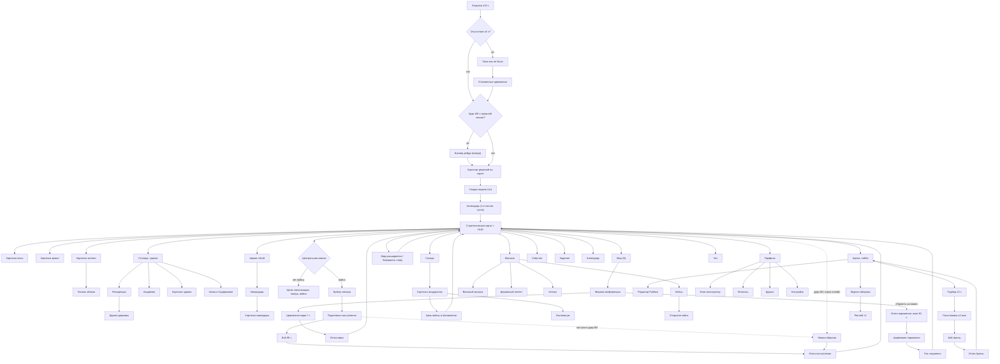
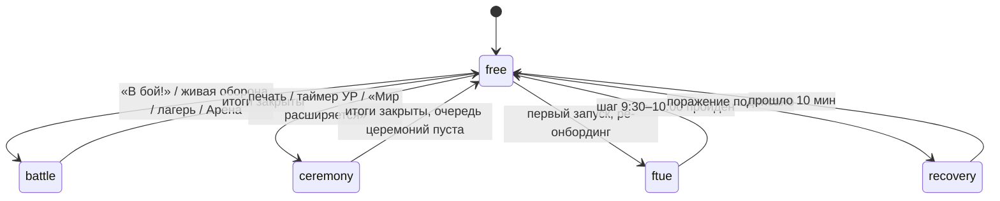
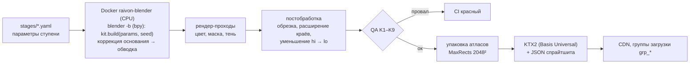
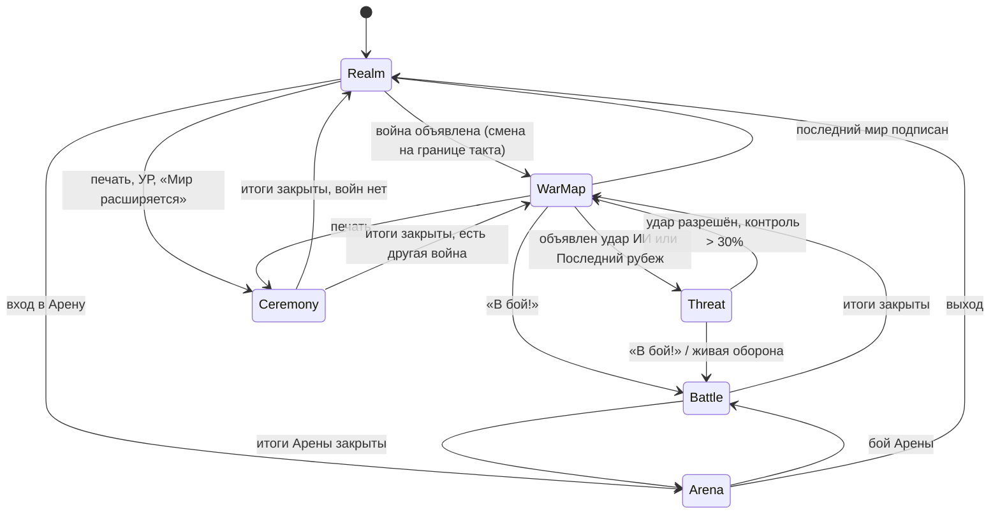

# 10. UI/UX и арт

> **Назначение.** Исполняемая спецификация интерфейса и визуально-звукового слоя Raivon: принципы вертикального UI под один палец, карта экранов и раскладка каждого экрана в pt, жесты и их конфликты, тактильная отдача, звук и анимации обратной связи, иконография и типографика для 12 языков, покадровая раскадровка церемонии мира и других церемоний, арт-дирекшн «настольная диорама», пайплайн графики в Blender (bpy, headless), VFX, звук и музыка, доступность, локализация UI, бюджеты производительности.
> **Опирается на канон v1.2:** §1.1 (столпы), §2.1 (решения 10, 16, 18, 21, 25, 27, 28, 32), §3.1 (цвета карты), §6.1 (визуальная эволюция), §9.2–9.4 (наступление, управление одним пальцем, энергия), §9.13–9.14 (Последний рубеж, поражение), §10.3 (церемония), §12.1 (очередь церемоний), §14.3, §14.7–14.10 (FTUE, пуши, возврат, чат, запреты), §15.2–15.11 (плейсменты, кейсы, косметика, пасс, подписка, подтверждение трат, сторы, Россия), §16.1 и §16.4–16.5 (стек, арт, автотесты), §20 (журнал v1.2: C5, C6, C12, C13, C19, C20, C22, C47, C75, C82, C84, C98, C103–C109, C118, C120, R6).
> **Связанные файлы:** `01_vision_core_loop.md` (порядок экрана возврата), `02_map_territory.md` (палитра, слои карты, поле чернил, камера, LOD), `03_war_combat.md` (правила боя, жесты, автомат ввода), `04_units_army.md` (Штаб, командиры, киты фигурок), `05_economy_buildings.md` (HUD-ресурсы, Казна, киты построек), `06_diplomacy_peace.md` (содержание пергамента, логика церемонии), `07_progression_meta.md` (Дорога державы, церемонии УР и главы, Академия, Арена), `08_retention_liveops.md` (FTUE, задания, календарь, события, возврат), `09_monetization.md` (цены, офферы, кейсы), `11_balance_numbers.md`, `12_tech_analytics_roadmap.md`.

---

## 1. Зона файла, инварианты, обозначения

### 1.1. Что здесь и что не здесь

| Здесь | Не здесь (где) |
|---|---|
| раскладка экранов в pt, компоненты, состояния, переходы, очередь показа | содержание пергамента и правила требований (`06`), условия УР (`07`), цены (`09`) |
| жесты, пороги распознавания, конфликты карты и боя | правила приказов и допустимость целей (`03` §6) |
| тактильная отдача, звук, музыка, VFX, UI-анимации | механика чернил и геометрия контура (`02` §8–9) |
| раскадровка церемоний (кадры, камера, звук, вибрация, тайминги) | серверный порядок применения договора (`06` §3.13) |
| арт-дирекшн, Blender-пайплайн, атласы, именование, QA графики, бюджет ассетов | описание облика каждой ступени (`04` §13, `05` §10) |
| типографика, иконки, локализация UI, доступность | тексты сторов (`01` §1.12), пуши (`08`) |
| бюджеты кадра, памяти, draw calls, бандла клиента в целом | бюджеты слоёв карты (`02` §20) — здесь только сводятся |

### 1.2. Инварианты (каждый покрыт автотестом из §11.9 или §16)

| # | Инвариант | Проверка |
|---|---|---|
| U1 | Основное действие каждого экрана находится в нижних 35% высоты (зона большого пальца, канон §9.3) | скриншот-тест: bbox CTA ∩ нижние 35% ≠ ∅ на 5 эталонных экранах устройств |
| U2 | Зона касания любого интерактивного элемента ≥44 × 44 pt, расстояние между соседними ≥8 pt | обход дерева UI на всех экранах |
| U3 | В бою, церемониях мира и УР, «Мир расширяется» (включая их экраны наград) и FTUE нет рекламы, офферов, пушей, тостов магазина (канон §14.10); на экране итогов мира — только rewarded по кнопке игрока, активной с 7,0 с (канон §10.3) | шина событий: запрет `offer.*`, `ad.*` в защищённых состояниях §3.4; серверная проверка (канон §16.2) |
| U4 | Жёлтый и золотой не используются как заливка государств и не появляются в палитрах моделей на крупных площадях (канон §2.2 п. 37) | палитровый тест кадров и спрайтов §11.9 K4 |
| U5 | Ни один текст CTA и чисел не обрезается многоточием ни в одном из 12 языков | скриншот-тест локализации §15.5 |
| U6 | Цвет никогда не единственный носитель смысла: прогноз, редкость, статус войны продублированы формой или значком | ручной чек-лист + симуляция дальтонизма §14.1 |
| U7 | Новичок без текста захватывает первый гекс ≤30 с от «В бой!» и видит рост границы (мир 1) до 3-й минуты (канон §1.1, §16.5 п. 4, C82) | headless-сценарий FTUE, блокер релиза |
| U8 | Силуэты семейств и типов построек различимы на 48 px (канон §16.5 п. 6) | классификатор силуэтов §11.9 K3 |
| U9 | Никаких мерцаний с частотой >3 Гц на площади >10% экрана | анализ кадров церемоний и VFX §14.6 |
| U10 | Один и тот же лог боя рисуется одинаково: клиентская анимация не влияет на исход (`sim` не читает время кадра) | детерминизм канона §16.5 п. 1 |

### 1.3. Обозначения

- **pt** — логическая точка раскладки (CSS px в WebView; все размеры UI канона — в pt, C105). **px** — физический тексель текстуры. **DPR** — плотность экрана (2 или 3). **R** — внешний радиус гекса (в бою R = R_г канона §9.3, `02` §2.5). **F** — прогноз исхода (канон §3.2: F = √W; мечи зелёные при F ≥ 1,3, жёлтые при 0,9–1,3, красные при < 0,9).
- Эталонный экран раскладки — **390 × 844 pt** (iPhone 13–16), safe area сверху 47 pt, снизу 34 pt. Все y-координаты ниже даны для него. На планшетах W — ширина центральной колонки 520 pt (решение 32, канон §16.1).
- Новые префиксы кодов (предложение автора, в духе канона §3): `ui_` экраны (канон §3) и UI-события аналитики, `sfx_` звуки, `mus_` музыка, `vfx_` эффекты, `hap_` тактильные паттерны, `kit_` Blender-киты, `pal_` цвета материалов моделей (введён в `04`), `col_ui_` цветовые токены интерфейса (§9.4; `ui_` за цветами не закрепляется), `grp_` группы загрузки ассетов. Канонические `ui_dev_road`, `ui_while_away` сохранены.
- **«Штаб»** без уточнения — экран армий `ui_army` (`04` §8.1, вкладка «Армия»). Объект Арены всегда пишется полностью: «Штаб рубежа» (`arena_hq`, канон §11).
- «ПА» в таблицах — предложение автора.

---

## 2. Принципы UI

### 2.1. Десять правил

| # | Правило | Как применяется (проверяемо) |
|---|---|---|
| 1 | **Портрет, всегда** | ориентация заблокирована; от 16:9 до 21:9 (канон §16.1); планшеты — центральная колонка 520 pt (решение 32, канон §16.1), по бокам стол-диорама (ПА) |
| 2 | **Один палец** | любое действие доступно одним большим пальцем правой руки, включая зум карты (двойной тап и двойной тап со сдвигом, §5.1); второй палец в бою игнорируется (`03` §6.5); режим левши зеркалит плавающие колонки (§2.4) |
| 3 | **Зона большого пальца** | нижние 35% — «действовать», середина — «смотреть», верх — «читать». Частые действия внизу, редкие и информационные вверху |
| 4 | **Минимум текста** | на экране в покое ≤12 слов, кроме чисел и имён; у кнопки иконка + ≤2 слова; объяснения — по «i» и долгому нажатию. В первые 3 мин FTUE — только числа и однословные подписи |
| 5 | **Один жест — одно действие** | жест не меняет смысл в зависимости от скорости; где жест совпадает между картой и боем, конфликт снят правилом §5.3 |
| 6 | **Прогноз до решения** | любой приказ, трата и требование показывают итог до подтверждения: мечи и «×1,4» (`03` §6.4), «Склад переполнится», будущий контур на пергаменте |
| 7 | **Карта — главный экран** | всё, что можно показать на карте, показывается на ней: решения ИИ — закреплённые карточки, а не модальные окна (`01` §1.7.7) |
| 8 | **Необратимое — удержанием** | объявление войны и печать мира — удержание 0,8 с (канон §10.3, `03` §3.4), «Отступить» — 0,5 с (`03` §5.5); трата ≥100 Райвитов — удержание кнопки 0,5 с (канон §15.8); в режиме «Подтверждение двумя тапами» все удержания заменяет второй тап (§14.3) |
| 9 | **Честность** | реальные таймеры, шансы кейсов до покупки, никаких ложных «осталось 2 шт.» (канон §14.10 п. 4); анимация открытия кейса не изображает «почти выпавшую» легендарку (ПА) |
| 10 | **Зрелище защищено** | церемонии нельзя прервать рекламой, офферами и пушами (канон §1.1 столп 1); после первого раза — «×3» и «Меньше анимации» |

### 2.2. Сетка, отступы, касания

| Параметр | Значение (ПА) |
|---|---|
| Базовая сетка | 8 pt; внутренние отступы 4 pt |
| Боковые поля экрана | 16 pt (12 pt на экранах ≤360 pt) |
| Минимальная зона касания | 44 × 44 pt (визуал может быть меньше, хит-бокс — нет) |
| Высота строк списка | 52 pt (с иконкой 40 pt), 64 pt (с двумя строками текста) |
| Кнопки | основная 52 pt, вторичная 44 pt, иконка-кнопка 44 pt, круглая CTA 76 pt |
| Скругления | панели 16 pt, кнопки 12 pt, чипы — полная высота |
| Нижние листы | высоты 40% / 70% / 92% экрана, ручка 36 × 5 pt |
| Закрытие без тянущегося пальца | лист — свайп вниз с любого места, когда содержимое прокручено в начало, или тап по затемнению; полноэкранный экран — «‹ Назад» 44 pt слева в нижнем ряду действий экрана (не в верхнем углу), свайп от левого края и системная «Назад» Android (§5.4) |
| Модальные окна | ширина ≤ 342 pt, только для подтверждений и юридических экранов; кнопки — в нижней половине окна |

### 2.3. Классы экранов

| Класс | Пример | Что меняется (ПА) |
|---|---|---|
| Компактный 16:9 | 375 × 667 (iPhone SE), 360 × 640 | боковые колонки HUD — 3 кнопки и «…», статус-полоса сливается с верхней, рука в бою — карты 56 × 80 pt, окно боя ≈9 × 9 (`02` §2.5) |
| Стандарт 19,5:9 | 390 × 844, 393 × 852 | эталон |
| Вытянутый 20:9–21:9 | 360 × 800, 412 × 915 | лишняя высота уходит карте и окну боя; кнопки не растягиваются |
| Уже 21:9 (обложка складного, 344 × 882) | <360 pt ширины | раскладка компактного класса, поля 12 pt; R_г считается по ширине (≈23,4 pt), лишняя высота — карте (ПА) |
| Большой | 430 × 932 | шрифт без изменений, поля 20 pt |
| Планшет / складной развёрнутый | ≥600 pt ширины | колонка 520 pt по центру (решение 32); вся игра, включая церемонии и бой, живёт внутри колонки, боковые поля — стол-диорама без интерактива; при сгибе — пересчёт раскладки без перезагрузки сцены |
| Окно ОС <600 pt высоты (мультиоконность) | — | заглушка «Разверните окно», игра на паузе только вне боя; в бою — правила обрыва связи (канон §9.16) |

### 2.4. Режим левши (ПА)

Переключатель в настройках доступности. Зеркалятся только плавающие колонки и ряд большого пальца карты («Собрать всё» уходит влево, индикаторы простоя — вправо), кнопка «Отступить» в бою переходит вправо. Нижняя панель навигации, рука карт и шкала контроля не зеркалятся: их порядок — часть обучения.

---

## 3. Карта экранов

### 3.1. Граф навигации



### 3.2. Реестр экранов

| Код (ПА, кроме канонических) | Экран | Тип | Вход | Содержание задаёт |
|---|---|---|---|---|
| `ui_map_hud` | стратегическая карта и HUD | основной | старт, «Назад» отовсюду | `02`, здесь §4.1 |
| `ui_hex_card` / `ui_army_card` / `ui_deposit_card` | карточки объектов | лист 40% | тап по объекту | `02`, `04`, `05` |
| `ui_goals` | «Цели» | лист 70% | центральная кнопка вне войны | здесь §4.1 |
| `ui_offense_prep` / `ui_battle` / `ui_offense_results` | подготовка, бой, итоги | полноэкранные | «Наступление» → сектор | `03` §5–6 |
| `peace_conference` | пергамент | полноэкранный | «Мир (N)», предложение ИИ, кап | `06` §2 |
| `ui_peace_ceremony` / `ui_peace_results` | церемония, итоги | полноэкранные | подпись | `06` §6, здесь §7 |
| `ui_defeat_losses` / `ui_defeat_saved` | итоги поражения (окно `ad_hide_treasury`), «Что сохранено» | лист 70% / полноэкранный | «Принять условия» | `06` §5.4, здесь §4.6, §7.5 |
| `ui_raid_banner` | баннер рейда: объявленный удар или итог обороны | закреплённый баннер на карте | вход в сессию, объявление удара | `08` §8.14.1, здесь §4.1 |
| `ui_age_gate` | возрастной экран | полноэкранный | FTUE 2:30–3:30, повтор через 30 дней | канон §14.3, §15.2, здесь §4.23 |
| `ui_capital` / `ui_building_card` / `ui_residence` | Столица, карточка здания, Резиденция | полноэкранный / лист 92% | вкладка «Столица» | `05`, `07` |
| `ui_dev_road` | Дорога державы | полноэкранный | бейдж УР, Резиденция | `07` §5.4 |
| `ui_academy` | Академия | полноэкранный | Столица | `07` §6.7 |
| `ui_army` / `ui_commanders` | Штаб (экран армий), Командиры | полноэкранные | вкладка «Армия» | `04` §8, §15 |
| `ui_convoy_panel` | обозы | лист 70% | индикатор обозов | `04` §12.1 |
| `ui_neighbors` / `ui_state_card` / `ui_ultimatum` | дипломатия | полноэкранный / лист / модальная карточка | вкладка «Соседи» | `06` §8, §12 |
| `ui_shop` / `ui_cases` / `ui_case_open` / `ui_atelier` | магазин | полноэкранные | вкладка «Магазин», «+» у Райвитов | `09` |
| `ui_pass` / `ui_subscription` | пасс, подписка | полноэкранные | HUD, магазин | `09` |
| `ui_arena_lobby` / `ui_arena_editor` / `ui_arena_log` | Арена | полноэкранные | кнопка Арены (УР4) | `03` §22, `04` §16, `07` §8 |
| `ui_event` / `ui_tasks` / `ui_calendar` / `ui_weekly_summary` | лайв-опс | полноэкранные | HUD | `08` |
| `ui_while_away` | Пока вас не было | полноэкранный | вход после ≥4 ч | `01` §1.7.7, `08` §8.14 |
| `ui_settings` / `ui_profile` / `ui_flag_editor` / `ui_chronicle` / `ui_friends` / `ui_chat` | мета | полноэкранные | аватар, профиль | здесь, `07` §7, `08` §8.16 |
| `ui_treasury_panel` / `ui_upkeep_panel` | Казна, Содержание | лист 92% | тап по ресурсу | `05` §2.3, §7.7 |
| `ui_dl_ceremony` / `ui_world_expansion` | церемонии | полноэкранные | завершение таймера, кнопка главы | `07` §4–5, здесь §8 |

### 3.3. Слои UI

| z | Слой | Содержимое | Технология (стек — канон §16.1; распределение по слоям — ПА) |
|---|---|---|---|
| 0 | сцена | карта, бой, церемонии | PixiJS v8 (WebGL2) |
| 1 | HUD | верхняя полоса, статус, колонки, ряд пальца, навигация | PixiJS (числа — MSDF BitmapText) |
| 2 | листы и полноэкранные меню | все `ui_*`, кроме HUD | DOM-оверлей на Preact поверх канваса: верстка текста 12 языков, переносы CJK, ввод чата, доступность для экранных чтецов |
| 3 | модальные окна | подтверждения, юридические экраны, ультиматум | DOM |
| 4 | церемонии | перекрывают слои 1–3, HUD скрыт | PixiJS |
| 5 | тосты | 1 одновременно, очередь | DOM |
| 6 | системные | нет связи, обновление, заглушка окна | DOM |

DOM-оверлей не рисуется поверх сцены во время боя и церемоний (экономия композитинга): в эти моменты весь интерфейс — в PixiJS.

### 3.4. Защищённые состояния и очередь показа

**Реестр состояний клиента — единственный источник кодов** (канон §9.14, §14.10, §15.2). Он задаёт значения для множества `PROTECTED` (`08` §8.17.1, `09` M3 и серверная проверка рекламы и офферов `PROTECTED.has(p.state)`), для поля `client_state` и сообщения `presence {client_state}` (`12`). Клиент передаёт серверу оба поля: класс `client_state` и код `state_kind`. Сервер дополнительно проверяет их по своим данным: идёт ли бой, есть ли неподтверждённая церемония, когда было поражение (`12`, T12). `PROTECTED` — это коды с «да» в столбце «Защищённое»: `{offensive, live_defense, raid_camp, arena_attack, peace_ceremony, dl_ceremony, world_expansion, ftue}`. В `p.state` проверки `09` передаётся `state_kind`.

| Класс `client_state` | Код `state_kind` | Что покрывает (от — до) | Защищённое |
|---|---|---|---|
| `battle` | `offensive` | бой наступления от «В бой!» до закрытия итогов боя; сюда входят «Погоня за Ордой» (вид боя `offensive` с событием `evt_horde_strikeback`), бои событий, ответный удар после обороны | да |
| `battle` | `live_defense` | живая оборона до закрытия отчёта | да |
| `battle` | `raid_camp` | бой с лагерем мародёров до закрытия итогов | да |
| `battle` | `arena_attack` | бой Арены, включая ответный рейд и дружеский бой, до закрытия итогов | да |
| `ceremony` | `peace_ceremony` | церемония мира 0–7,0 с, от начала удержания печати, включая экран наград (5,5–7,0 с, канон §14.10 п. 1); отложенная церемония на «Пока вас не было» имеет тот же код | да |
| `ceremony` | `dl_ceremony` | церемония УР и экран «Открыто» (`07` §5.5) | да |
| `ceremony` | `world_expansion` | «Мир расширяется» или «Завершить главу» с экранами наследия и новой главы (`07` §4.1–4.2) | да |
| `ceremony` | `peace_results` | экран итогов мира `ui_peace_results` с 7,0 с до закрытия; при очереди церемоний показывается после последней из них | нет (ограниченное, канон §14.10 п. 1) |
| `ftue` | `ftue` | первый запуск до шага 9:30–10:00 и ре-онбординг после 30+ дней | да |
| `recovery` | `defeat_recovery` | 10 мин от подписи поражения: окно `ui_defeat_losses`, церемония поражения (§7.5), «Что сохранено» | нет (ограниченное, канон §9.14, §14.10 п. 2) |
| `free` | `free` | всё остальное, в том числе подготовка наступления (там живёт `ad_start_energy`, `09`), просмотр реплеев (`arena_defense_replay`) и автооборона без игрока (`auto_defense` клиентского состояния не имеет) | нет |

Коды `08` §8.17.1 и `09` M3 сводятся к реестру так: `battle` → `offensive`; `arena_battle` → `arena_attack` (вид боя `03` §21.3); `horde_strikeback` → `offensive` с `evt_horde_strikeback`. Код `raid_camp` в прежнем наборе отсутствовал и теперь входит в `PROTECTED`. В `12` значения `client_state` записаны с заглавной буквы (Free / Battle / Ceremony / FTUE / Recovery): это те же пять классов.



| Код | Реклама | Офферы | Пуши в приложении | Тосты | Отложенное |
|---|---|---|---|---|---|
| `free` | по правилам канона §15.2 | ≤1 всплывающий за сессию, ≤3 в сутки | баннером | да | показывается здесь |
| `offensive`, `live_defense`, `raid_camp`, `arena_attack` | нет | нет | нет (кроме перехода в оборону, `03` §5.2) | только боевые микротосты у гекса | после итогов |
| `peace_ceremony`, `dl_ceremony`, `world_expansion` | нет | нет | нет | нет | после очереди церемоний |
| `peace_results` | только rewarded `ad_double_trophies` по кнопке игрока (канон §15.2); interstitial нет | нет | нет | нет | после закрытия экрана итогов |
| `ftue` | нет | нет | нет | только обучающие | после FTUE |
| `defeat_recovery` | rewarded `ad_hide_treasury` (до списания потерь, окно 60 с, `06` §5.4), `ad_repair`, `ad_ruin_halve`; interstitial нет (канон §15.2) | **нет 10 мин** (канон §9.14, §14.10 п. 2) | да | да | — |

**Очередь при входе в сессию** (развёртка `08` §8.14.5): загрузка → «Пока вас не было» при отсутствии ≥4 ч (внутри — отложенные церемонии: одна целиком, несколько по 2–3 с, экран ≤20 с, канон §14.8) → **баннер рейда** → закреплённые карточки решений → «Сводка недели» (понедельник) → календарь (первая сессия суток) → `free`. Баннер рейда показывается **всегда**, если с прошлой сессии ИИ объявил удар или прошла оборона: и при отсутствии <4 ч, и при пушах, выключенных в игре или запрещённых в системе (решение 21, канон §14.7). Если итог обороны уже открыт на шаге 2 «Пока вас не было», баннер остаётся только для удара, который ещё впереди. **Очередь церемоний** внутри сессии: мир → УР → «Мир расширяется», без рекламы и офферов между ними; последнюю игрок запускает тапом (канон §12.1). Если за миром в очереди идёт другая церемония, трофеи мира зачисляются сразу, а экран итогов мира (`peace_results`) с активной кнопкой «×2 трофеи» показывается после последней церемонии очереди; кнопка удваивает уже зачисленное (канон §10.3 п. 6, §12.1). Удар ИИ, объявленный во время церемонии, показывается баннером сразу после неё: до удара остаётся ≥15 мин (`07` §4.2).

---

## 4. Экраны: раскладка сверху вниз

Все высоты — для 390 × 844 pt; на других классах — §2.3.

### 4.1. Стратегическая карта и HUD (`ui_map_hud`)

```
┌──────────────────────────────────────────┐ y 0–47 safe area
│[Флаг|УР5] З 247K Е 88K М 61K Н 12K Р1240+│ y 47–95  верхняя полоса (48), 5 ячеек
│ [Глава II ▓▓▓░ 21/36]  [Держава 64]      │ y 95–131 статус-полоса (36)
│ [Задания]                       [Арена]  │ y 139–355 боковые колонки
│ [Календ.]                      [Событие] │          (≤4 кнопки по 48)
│ [Почта ]                         [Пасс]  │
│                                [Оффер]   │
│                                          │
│            КАРТА-ДИОРАМА                 │
│                                          │
│ [Стр 1/3]            [Столица] [ Фронт ] │ y 618–662 ряд пальца, верх (44)
│ [Обоз 2/4]                    ( Собрать )│ y 674–734 ряд пальца, низ (60)
├──────────────────────────────────────────┤
│ Столица  Армия  ( ◉ CTA )  Соседи Магазин│ y 746–810 навигация (64), CTA 76 Ø
└──────────────────────────────────────────┘ y 810–844 safe area
```

| Зона | Размер | Содержимое и правила |
|---|---|---|
| Верхняя полоса | 48 pt | слева аватар 44 pt: флаг державы и бейдж УР («УР5» — вход в `ui_dev_road`, `07` §5.4; тап по флагу — профиль). Справа 4–5 ячеек ресурсов по 56–62 pt: иконка 20 pt + число компактным форматом (≤5 знаков: «247K», «1,25M») + тонкая полоса склада 2 pt под числом (правила цвета полосы и долгого нажатия — `05` §2.3). Нефть появляется на УР5 с анимацией «капли». Прогноз «Казна пуста» в пределах 3 ч — значок и таймер у ячейки золота, тап — `ui_upkeep_panel` (канон §7, C47: в игре, без пуша). Райвиты — последней ячейкой с «+» (вход в магазин; в России «+» ведёт во вкладку «Бесплатно», канон §15.11) |
| Статус-полоса, мир | 36 pt | чип главы «Глава II · 21/36» с полосой (тап — карточка главы и звёзды), чип «Держава 64» (ОТ, вне войны = официальная ценность, `03` §16.1), чип «Тревога 56%» — только при ≥50% (настороженность, канон §10.8). Цель главы выполнена — чип становится кнопкой «Мир расширяется» (во время войны — с замком и подписью «После мира», канон §12.1, C20); в `completed_waiting` — «Завершить главу», после неё чип «Глава IV ✓ · скоро V» (`07` §4.2) |
| Статус-полоса, война | 36 pt | 1–2 чипа войны по 171 pt: флаг врага 24 pt, мини-шкала контроля 64 × 8 pt с «62%», кнопка «Мир (24)» 64 × 28 pt, таймер капа. Тап по чипу — камера к фронту этой войны. «Мир (N)» светится и получает значок советника, когда ВС покрывает цель войны и рекомендованный пакет (`01` §1.2.3) |
| Баннер рейда (`ui_raid_banner`) | 64 pt, ширина 358 pt | сразу под статус-полосой (y 135–199), над закреплёнными карточками; боковые колонки, пока он виден, сдвигаются вниз на 72 pt. Красная кромка, `hap_raid_banner`. До удара: «Бароны готовят удар по Медной шахте · 12:40» и «К обороне» (камера к цели). После: «Оборона выстояла · +350 золота» или «Потеряно 2 гекса», «Реплей ×2», «Ответный удар» (`03` §15.6). Не сворачивается, пока итог не открыт. Если пуши запрещены в системе — строка «Открыть настройки», не чаще раза в 7 дней (`08` §8.13.6) |
| Закреплённые карточки | 44 pt каждая, ≤2, ширина ≤246 pt | под статус-полосой по центру, между боковыми колонками: ультиматум, предложение мира, требование капитуляции, «Коалиция формируется 2/3», «Выберите цель войны» (встречная цель в войне, начатой ИИ: 3 рекомендации, до выбора действует первая, канон §9.1). Флаг, 1 строка, таймер, «›». Свайп влево сворачивает в значок «Почта» на 30 мин |
| Боковые колонки | 48 pt кнопки, шаг 56 | левая: «Задания» (бейдж 1/3), «Календарь», «Почта» (входящие решения и награды рейтингов). Правая: «Арена» (замок «УР4» до открытия, бейдж билетов), «Событие» (таймер), «Пасс» (уровень), «Оффер» (≤1, только с реальным окном). Пустые слоты не резервируются; >4 — пятая кнопка «…». Кнопка «Альянс» появляется в левой колонке только при включённом `feature_alliances` (по сигналу владельца, канон §12.6) |
| Ряд большого пальца | 44 + 60 pt (y 618–734) | справа внизу круглая «Собрать всё» 60 pt (кольцо 0–8 ч, `05` §5.3), над ней две кнопки камеры по 44 pt «Столица» и «Фронт» (`02` §19.3). Слева индикаторы простоя 44 pt: «Строители 1/3» и «Обозы 2/4» — появляются, только если кто-то свободен (`01` §1.6.3); тап — подсказка с готовыми действиями. Весь ряд лежит в зоне пальца (y ≥ 549) |
| Навигация | 64 pt + safe | 4 вкладки по 64 pt: «Столица» (иконка — Резиденция текущего УР, эволюционирует вместе с державой), «Армия», «Соседи», «Магазин». В центре круглая CTA 76 pt, поднята на 20 pt |
| CTA | 76 pt | **вне войны** — «Цели» (`ui_goals`); **в войне** — «Наступление» с пульсом кольца 1,2 с (канон §9.2); при объявленном ударе ИИ — «Оборона 12:40» красным; при нехватке готовых армий — серая «Наступление» с таймером ближайшей готовности |
| Индикаторы у края | 32 pt | стрелки к событиям вне кадра (`02` §19.3): контратака красная с таймером, готовая армия зелёная, залежь — значок в белом круге |

**Лист «Цели» (`ui_goals`, ПА).** Три карточки советника по 96 pt, отсортированные по ценности: «Колонизировать: Тихий луг · 450 зол · 5 мин», «Лагерь мародёров: 1 ч металла», «Цель войны: Гранитный рудник · прогноз зелёный». Тап — камера к объекту и его карточка. Это вход для казуалов: игрок никогда не стоит перед пустой картой.

**Карточки объектов** (лист 40%, 300–340 pt):

| Карточка | Сверху вниз |
|---|---|
| Гекс | шапка: тип, имя, щиток ценности, владелец/контролёр (флаги); строка дохода «+40 зол/ч» и уровень постройки типа; укрепление «ур. 4 · апкип 31/ч», башня, гарнизон; ряд действий 52 pt: «Укрепить», «Башня», «Колонизировать», «Цель войны», «Марш сюда» — только применимые, ≤4 |
| Армия | Сила/макс и дуга готовности, портрет командира, чипы черт, доктрина; действия: «Марш», «Пополнить» (с `ad_army_refill` 3/день), «Штаб ›». Полная панель Силы — долгое нажатие (`04` §7.3) |
| Залежь | тип, размер S/M/L, оценка груза, время сбора, путь, риск перехвата, переключатель «Безопасный маршрут»; «Отправить» (`04` §12.1) |

### 4.2. Подготовка наступления (`ui_offense_prep`)

Камера наезжает на сектор за 0,6 с (`02` §19.3). Раскладка совпадает с боем (§4.3), чтобы при «В бой!» ничего не прыгало.

| Зона | y | Содержимое |
|---|---|---|
| Шапка | 47–111 | слева «Мир (24)» (активна: уводит на пергамент, подготовка закрывается); по центру «Подготовка» и имя сектора; справа цели звёзд «★ гекс · ★★ Медная шахта · ★★★ без разбитых» мелкими значками |
| Сектор | 111–632 | диаметр гекса ≥49 pt (`02` §2.5); армии перетаскиваются на свои гексы сектора (пунктир допустимых); флажок наступления на цели; долгое нажатие на вражеский гекс — прогноз «Атаки» всеми соседними (`03` §5.2) |
| Энергия | 632–660 | «Старт: 5» и сегменты будущей стартовой энергии; справа чип «▶ +3» (`ad_start_energy`, 3/день; подписчику — «+3 мгновенно», канон §15.7) |
| Рука | 660–756 | «Атака» закреплена слева, 4 (с УР6 — 5) слота; тап по слоту — лист выбора из открытых карт с уровнем и ценой в нефти у карт техники (`03` §5.2) |
| Действия | 756–810 | «Назад» 88 × 44 слева; «В бой!» 200 × 52 справа (без сети неактивна); после 3 ручных наступлений — переключатель «Авто»; «Быстрый итог» появляется только при Мощи игрока ≥2× вражеской (канон §9.2) |

### 4.3. Экран боя (`ui_battle`): наступление, живая оборона, Арена

```
┌──────────────────────────────────────────┐ y 0–47
│ [Мир 24]  ▓▓▓▓▓▓▓░░░ 62%  [Авто ×2]      │ y 47–83  шкала контроля (36)
│ ★☆☆                1:12                  │ y 83–111 таймер и звёзды (28)
│                                          │
│          СЕКТОР радиуса 4                │ y 111–632 (521)
│          диаметр гекса 2R_г ≈49–59 pt    │
│                                          │
│ 7 ▮▮▮▮▮▮▮▯▯▯                    [×2]     │ y 632–660 энергия (28)
│ ┌Атака┐┌Обор┐┌Окр.┐┌Прор┐┌Артб┐          │ y 668–756 рука (карты 64×88)
│ └ 2  ┘└ 2  ┘└ 3  ┘└ 3  ┘└ 3  ┘          │
│ [Отступить ◔]                            │ y 764–804 удержание 0,5 с
└──────────────────────────────────────────┘ y 810–844
```

Высоты совпадают с допущением `02` §2.5 (64 + 28 + 150 pt), поэтому формула канона R_г = clamp(min((W − 16) / 14; H_сектора / 15,59); 22; 34) pt (§9.3, C12) верна: на эталоне W-ветка даёт 26,7 pt (диаметр 53 pt), H-ветка — 33,4 pt, видно ≈9 × 11 гексов.

| Элемент | Правила (ПА, кроме отмеченного) |
|---|---|
| Шкала «Контроль фронта» | 180 × 14 pt, синий слева, красный справа, проценты по краям 15 pt; риска 50% и риска 30% (порог Последнего рубежа). Изменение катится 400 мс. Во время войны с коалицией — один знаменатель (канон §9.12) |
| «Мир (N)» | 92 × 36 pt, живое превью N (floor ВС, `03` §16.2); в бою неактивна (`03` §6.1), тап — микротост «После боя» |
| Таймер | 20 pt, табличные цифры. Последние 20 с (Финальный рывок) — голубой с подписью «Рывок ×2»; последние 10 с — красный, пульс 1 раз в секунду (1 Гц, §14.6) |
| Звёзды | 3 значка 20 pt: пустые контуры, заполняются при выполнении с «вылетом» 300 мс |
| Энергия | число 20 pt слева; 10 сегментов (11 с УР9) по ~27 × 14 pt с зазором 3 pt; текущий сегмент заливается линейно за 3 с (1,5 с в рывке) ярким передним краем; при нехватке на свайп — мигание 2 × 120 мс (`03` §6.5) |
| Карта в руке | 64 × 88 pt (6 карт с УР6 — 56 × 80): иллюстрация ступени УР (§11.10), камень цены энергии 22 pt в левом верхнем углу, уголок категории (меч — атака, щит — оборона, глаз — разведка, стрелка — манёвр, взрыв — удар), «ур. 5» 11 pt. Состояния: готова (приподнята на 2 pt, однократный пульс 600 мс, когда энергии стало хватать), не хватает энергии (насыщенность −70%, цена красная), перезарядка 10 с (радиальная тень 60% и секунды 17 pt), нет нефти (серая с каплей весь бой) |
| Перетаскивание карты | карта поднимается и уменьшается до 40 pt; прицел рисуется на 40 pt выше пальца (`03` §6.2); допустимые гексы подсвечены белым контуром 2 pt, недопустимые под пальцем — красным |
| Дотяжка прицела (ПА) | центр сектора лежит на 44% высоты экрана (y ≈372), цели в радиусе 2 от него достаются пальцем без перехвата. Диск сектора на эталоне занимает 15,59 × 26,7 ≈ 416 pt по высоте (y ≈164–580), ряды окна выше и ниже неинтерактивны (`02` §2.5). Для верхних рядов диска смещение прицела растёт линейно с 40 pt на середине до 72 pt у верхнего края диска: верхний гекс (центр y ≈187) берётся пальцем на y ≈255, а не на 227 |
| Прогноз | на целевом гексе мечи 28 pt (зелёные при F ≥ 1,3, жёлтые при 0,9–1,3, красные при < 0,9, канон §3.2, C22) с формой-дублем для дальтоников (§14.1), «×1,4» 15 pt, значки форм «Клин +20%» |
| «Отступить» | 112 × 40 pt, кольцо удержания 0,5 с (`03` §5.5) |
| Живая оборона | шапка с красной полосой «ОБОРОНА» 12 pt над шкалой; карта ИИ подсвечена у края, откуда идёт удар |
| Арена | вместо шкалы контроля — шкала «Ценность Рубежа» с рисками звёзд: 50% / «Штаб рубежа» (`arena_hq`) / 100%; нет «Мир (N)», нет рекламной энергии (канон §11) |
| Последний рубеж | шкала пульсирует красным (1 Гц), виньетка по краям 8% красного, плашка «ВЫ НА ГРАНИ ПОРАЖЕНИЯ!» 2 с при включении (канон §9.13), звуковой слой и «сердце» в вибрации (§6.1) |
| Обрыв связи | плашка над рукой «Связь потеряна · бой идёт 0:42» (канон §9.16); через 60 с — «Бой доигрывает автопилот» |

**Боевые микротосты:** у гекса, 1,2 с, 13 pt: «Цель изменилась», «Только соседний гекс», «−4». Обычные тосты в бою запрещены (§3.4).

### 4.4. Итоги наступления (`ui_offense_results`)

Лист 70% поверх замершего сектора: три звезды по 56 pt (появление 300 мс каждая, звук по ступеням), «Взято 3 гекса · ВС 0 → 11» (наступление 1 примера канона §9.17: 3 обычных гекса Ордена Камня ценностью 30 дают 10,0 + ★ 1), трофеи построек по ресурсам, потери по армиям (полоса Силы до и после), опыт пасса. Кнопки: «Мир (11)» (вторичная) и «Продолжить» (основная; после неё допустим interstitial `ad_int_offensive_result` по канону §15.2). Без захвата — пустые звёзды и «−1 к боям» серым.

### 4.5. Мирная конференция (`peace_conference`)

Содержание, порядок строк и состояния — `06` §2.2–2.4. Пиксели:

| Зона | Высота | Компоненты |
|---|---|---|
| Шапка | 104 pt | флаги сторон 40 pt; «МИРНЫЙ ДОГОВОР» 20 pt; портрет лидера ИИ 64 pt с пузырём реплики ≤60 знаков (выражение лица — `06` §10.2); шкала контроля 160 × 10 pt |
| Превью карты | 38% полезной высоты (≈290 pt), при прокрутке строк сворачивается до 120 pt | рамка-пергамент, будущий контур пунктиром в чернилах игрока с мерцанием 2 с (`06` §2.8), счётчики под картой 15 pt, «⤢» 44 pt. Гексы Ядра врага — со значком щита и подписью по долгому нажатию «Ядро не отдаётся по договору» (решение 19); оккупированные гексы Ядра показаны возвращающимися. Без сворачивания на эталоне видно 2 строки требований, со свёрнутым превью — 5 (ПА) |
| Строки требований | 52 pt каждая, скролл | слева печать-флажок 28 pt (вкл. — сургуч цвета косметики печати, выкл. — пустой круг), название 15 pt, справа цена 17 pt полужирным; недоступные — 50% непрозрачности с причиной по долгому нажатию |
| Бюджет | 44 pt | полоса заполнения очков: зелёная ≤ бюджета, красная сверх; «20,0 / 24,0 · остаток → мнение +4» |
| Разграбление | 48 + 20 pt | сегментированный переключатель на 4 позиции; строка последствий под ним меняется с выбором (`06` §4.1) |
| Тревога | 24 pt | «Тревога соседей 22% → 42%» |
| Действия | 96 pt | «Белый мир» и «Сброс» по 44 pt слева; справа печать 80 pt с кольцом удержания 0,8 с и подписью «Подписать мир»; при перерасходе — красная с «Не хватает 3,2» (`06` §2.3) |

Пергамент разворачивается за 400 мс (сверху вниз, звук бумаги). Тост «Счёт изменился: 24,0 → 22,6» — внутри пергамента над полосой бюджета (`06` §2.4).

### 4.6. Итоги мира и «Что сохранено»

- **Итоги победы** (`ui_peace_results`, лист 70%): блоки `06` §6.3; трофейный сундук открывается тапом с анимацией §4.14; кнопки «×2 трофеи (реклама)» (кап 4, канон §15.2; подписчику — «×2 мгновенно») и «Продолжить», обе активны с 7,0 с церемонии. Состояние экрана — `peace_results` (§3.4). **Очередь церемоний:** если за миром идёт церемония УР или «Мир расширяется» (канон §12.1), трофеи мира зачисляются сразу, этот лист с активной «×2 трофеи» открывается после последней церемонии очереди, а кнопка удваивает уже зачисленное (канон §10.3 п. 6).
- **Итоги поражения** (`ui_defeat_losses`, лист 70%, сразу после печати, до анимации контура; поток `06` §5.4): прогноз потерь одной строкой на ресурс «Контрибуция и грабёж: −30 000 золота», кнопка «▶ Спрятать казну: −21 000» (`ad_hide_treasury`, +15 п.п. защищённой доли на все потери договора, канон §15.2, R12), кольцо окна 60 с и «Продолжить». Не загрузился ролик — окно продлевается один раз (`09`). Приложение закрыто — потери применяются через 60 с без бонуса (`06`).
- **Что сохранено** (`ui_defeat_saved`, после церемонии поражения §7.5): приглушённая палитра (насыщенность −40%), без фанфар. Сверху «Ядро в безопасности». Блоки: «Что сохранено» (первой строкой — сбережённое складом «Склад сберёг 50 000 золота», затем «УР, уровни построек и исследования не теряются», решение 20), «Что потеряно» (гексы, ресурсы, разорение с таймером, повреждённые здания), «Щит восстановления 24:00:00», «Реванш +15% · 7 дней». Rewarded-кнопки `ad_repair` и `ad_ruin_halve`. Никаких офферов и interstitial 10 мин (§3.4). Кнопка «Продолжить».

### 4.7. Резиденция и «Дорога державы» (`ui_residence`, `ui_dev_road`)

**Карточка Резиденции** (лист 92%): сверху диорама текущей ступени (рендер 1024 px, §11.10) с медленным покачиванием камеры ±2° (выключается «Меньше анимации»), «УР5 · Индустриальная держава», строка апкипа «×7 → ×11». Ниже 4 строки условий следующего УР (`07` §5.4), CTA «Улучшить Резиденцию» в зоне пальца, вторичная «Дорога державы ›».

**Дорога державы** — раскладка `07` §5.4 (снизу вверх, как дорога в гору). Пиксели (ПА): узел текущего УР — диорама 220 pt; пройденные — 96 pt цветные; будущие — 132 pt тёмный силуэт с контуром 2 pt цвета игрока; невыпущенные (УР9–10) — силуэт и бейдж «Скоро», без дат и номеров версий (`07` §5.6). Маяк УР8 — луч света над узлом с медленной пульсацией 3 с и подписью «Ультразабор и небоскрёбы». Нижняя плашка 72 pt со следующим УР и CTA. Тап по узлу — карусель диорамы (город, укрепление, войска, авиация) свайпом влево-вправо.

### 4.8. Здания (`ui_capital`, `ui_building_card`)

| Зона | Содержимое (ПА) |
|---|---|
| Шапка 120 pt | мини-диорама столицы (Резиденция и кольцо столичных зданий, `05` §10.4), «Строители 2/3» с таймерами занятых |
| «Столица» | сетка 2 × 4 карточек 167 × 120 pt: Резиденция, Казарма, Академия, Склад, Лазарет, Обозный двор, Посольство (замок «УР3»), Рынок (замок «УР2»). На карточке: рендер здания ступени, «ур. 9/10», полоса таймера, если строится, зелёная стрелка «можно улучшить» |
| «Хозяйство» | строки 64 pt: Кварталы, Ферма, Шахта, Порт, Нефтевышка, Завод, Военная база — «ур. 7/10 · 12 гексов · +1 240 еды/ч» |
| «Оборона» | сводка укреплений и башен по уровням, «Апкип обороны 1 476 зол/ч», кнопка «Содержание ›» (`05` §7.7) |

**Карточка здания** (лист 92%): рендер 512 px (hi), «Ферма ур. 6 → 7», эффект «сейчас → после», цена с полосами наличия, таймер, строитель; CTA «Улучшить»; рядом «Ускорить» со способами (бесплатно ≤5 мин, с подпиской ≤10 мин; `ad_speedup` 6/день; предметы; Райвиты — порядок `05` §12.3). Нехватка ресурсов — строка «Не хватает 1 200 золота» с «Рынок» и «Докупить за 13 Рв» (`05` §8.8).

### 4.9. Академия (`ui_academy`)

Раскладка `07` §6.7. Пиксели: плашка очереди 64 pt вверху (идущее исследование, таймер, «Чертёж (2)», ускорения); 3 вкладки 44 pt; сетка 2 × N карточек 167 × 148 pt (иконка 48 pt или иллюстрация карты текущей ступени, «ур. 5/6», «сейчас → после», цена, время). Замки — серая карточка с причиной 13 pt. Бейджи «Рекомендуем» — зелёная лента в углу, ≤2 на экране.

### 4.10. Армии и командиры (`ui_army`, `ui_commanders`)

Содержание — `04` §8.1 и §15.7. Пиксели: шапка 56 pt; карточка армии свёрнутая 96 pt / раскрытая 248 pt; плитки слотов 52 × 52 pt (иконка семейства 32 pt и уровень); портрет командира 56 pt в рамке редкости; переключатель доктрины — сегмент 2 × 44 pt. Нижняя панель 64 pt: «Пополнить все», «Казарма», «Командиры». Сетка командиров 3 × N, ячейка 112 × 148 pt; закрытый — силуэт с полосой осколков. **Рамки редкости** (принимаю предложение `04` §15.4 и дублирую формой для дальтоников): обычный — серый камень #9AA3AD, квадратная рамка; редкий — бирюза #1FB5AD, скошенные углы; эпический — фиолетовый #8E5BD0, рамка-шестиугольник; легендарный — медно-оранжевый #F08A24, рамка с четырьмя лучами и искрами.

### 4.11. Обозы и залежи (`ui_convoy_panel`)

Лист 70%. Сверху «Обозы 2/4 · Обозный двор ур. 6». Строки 64 pt на обоз: модель обоза ступени УР 40 pt, состояние («В пути к Рудной жиле M · 1:40», «Сбор 32:10 / 45:00», «Свободен»), груз с иконкой, действия «Отозвать» и `ad_convoy_double` («×2 груз», 3/день). Внизу «Разослать обозы» 52 pt (`04` §12.1). На карте во время рейса — пунктир маршрута (`02` слой 13), гексы риска перехвата красными точками, над обозом таймер 13 pt; на залежи — кольцо прогресса и пунктир цвета сборщика (канон §5.2).

### 4.12. Дипломатия (`ui_neighbors`, `ui_state_card`, `ui_ultimatum`)

| Зона | Содержимое |
|---|---|
| Шапка 88 pt | шкала «Тревога соседей» 0–100% с рисками 50% и 100% (спокойно / настороженность / коалиция, канон §10.8); статус коалиции «Формируется 2/3 · 08:14» |
| Список | строки 64 pt: флаг, имя, значок архетипа (волк, лис, черепаха, ворон, сова; у гегемона корона-обод), бейдж УР, лицо мнения (одна из трёх иконок, канон §3.3), чип статуса («Война», «Перемирие 6:12», «Союз», «Пакт 31 ч»). Порядок: в войне → соседи → остальные |
| Карточка государства (лист 70%) | портрет лидера 96 pt с выражением (`06` §10.2), титул и УР, мнение числом по долгому нажатию; 5 кнопок концепта 6 сеткой 2 × 3 по 52 pt (шестая ячейка — «Подарок»); причины недоступности серым под кнопкой |
| Ультиматум (модальная карточка) | лидер с самодовольным выражением, требование (гекс подсвечен на мини-карте 160 pt или сумма дани), таймер 4 ч (реальный), кнопки во всю ширину в нижней половине: «Принять», «Откупиться: 1 200 золота» (фиксированная цена на кнопке, без ползунка; у Волка кнопки нет — остаются две, канон §9.1, R11), «Отказать» — с последствием одной строкой под каждой (`06` §8) |

Объявление войны — поток `03` §3.4: экран «Цель войны» (3 рекомендации на карте с щитками ценности), сводка, удержание «Объявить» 0,8 с с кольцом и барабаном; в момент объявления заливка врага перекрашивается в красный за 0,6 с (`02` §5.2). В войне, начатой ИИ (отказ от ультиматума, коалиция), тот же экран открывается из закреплённой карточки «Выберите цель войны» (§4.1).

### 4.13. Магазин (`ui_shop`)

| Зона | Содержимое (ПА; цены и составы — `09`) |
|---|---|
| Шапка | верхняя полоса ресурсов остаётся (видно, на что тратишь) |
| Вкладки-чипы 40 pt | «Предложения», «Кейсы», «Райвиты», «Ателье», «Ресурсы», «Бесплатно» |
| Россия (канон §15.11, R1) | скрыто только то, что продаётся за реальные деньги: вкладки «Предложения» и «Райвиты», промо пасса и подписки. «Бесплатно» идёт первой и открывается по умолчанию; «Кейсы» (Военный ящик, Королевский кейс и Кейс коллекции за заработанные Райвиты, шансы и гарант), «Ателье» и «Ресурсы» работают как везде |
| «Предложения» | одна главная карточка 200 pt (персональная лестница офферов или пак эпохи / главы в своём реальном окне 48 ч), ниже промо пасса и подписки по 96 pt. Таймер показывается только у реальных окон (канон §14.10 п. 4); метка «выгода ×N» — только от ×1,5 (канон §15.3) |
| «Кейсы» | 3 карточки по 180 pt: Военный ящик (бесплатный таймер 6 ч, «хранится 1/2», rewarded 2/день), Королевский кейс (цена, «×10», счётчик гаранта «Эпическое через 7 · Легендарное через 23», портрет «Цели»), Кейс коллекции (сетка 8 предметов с галочками, цена следующего открытия). На каждой «i» (шансы до покупки) и «История». В ЕС под ценой в Райвитах — эквивалент в € (канон §15.4) |
| «Райвиты» | сетка 2 × 3 номиналов (лента «×2 первая покупка» у неиспользованных), «Паёк державы»; внизу «Восстановить покупки» и юридические ссылки |
| «Ателье» | категории косметики (§7.3) с живым превью: чернила и узор применяются к контуру игрока на мини-карте 200 pt, печать и салют — по кнопке «Посмотреть» (сокращённая церемония 2,3 с); «Мастерская» за Блёстки |
| «Ресурсы» | докупка ресурсов за Райвиты (`05` §12.7) и вход на Рынок |
| «Бесплатно» | доступные rewarded-плейсменты с остатком капа, ежедневные бесплатные награды |
| Лимит трат | если игрок задал «Лимит трат» — плашка «Осталось на неделю: $12,00» над покупками (канон §15.4) |

Покупка — системный лист StoreKit 2 / Google Play Billing. Трата ≥100 Райвитов внутри игры — удержание той же кнопки 0,5 с с кольцом и ценой на кнопке («1 440 Рв»), без отдельного окна (канон §15.8, C109); в режиме «Подтверждение двумя тапами» — второй тап. Отпускание раньше — отмена, кольцо стекает за 150 мс.

### 4.14. Кейсы и открытие (`ui_case_open`)

**Экран шансов** (по «i»): таблица по редкостям и по предметам, базовые и эффективные шансы с учётом гаранта, текущий счётчик гаранта — **до покупки** (канон §15.4). Данные берутся из того же `cases.yaml`, что и серверный RNG.

**Последовательность открытия** (ПА):

| Время | Одиночное открытие | Вибрация / звук |
|---|---|---|
| 0–400 мс | кейс-модель (рендер `kit_props`) опускается на стол-диораму, крышка подрагивает | light / `sfx_case_open_rarity`, фаза «тряска» |
| 400–1 200 мс | щель крышки светится **цветом фактической высшей редкости** этого открытия (честный сигнал без «почти»); на 1 000 мс крышка отлетает | medium / та же фаза, нарастание |
| 1 200–2 000 мс | луч цвета редкости, предмет вылетает картой рубашкой вверх | по редкости (§6.1) / `sfx_case_open_rarity`, фаза «раскрытие» |
| 2 000–2 600 мс | переворот карты 300 мс, имя и количество; дубль косметики → анимация превращения в Блёстки «+80» | success / `sfx_ui_open` (переворот) |
| после | счётчик гаранта обновляется с анимацией; кнопки «Ещё раз (160)», «Готово», «История» | — |

- **×10:** 10 карт сеткой 2 × 5 переворачиваются по одной с шагом 250 мс, редчайшие — последними; «Пропустить» переворачивает все сразу. Итоговая сводка по редкостям.
- **Пропуск** доступен с 1 000 мс любого открытия (сразу к итогу).
- **Трофейный сундук, Сундук Арены и Военный ящик** используют ту же сцену, но короче (1,6 с). У трофейных сундуков счётчик гаранта общий с Военным ящиком (канон §15.4) и после открытия обновляется так же.
- **Кнопка «Ещё раз (160)»** подчиняется тому же удержанию 0,5 с, что и первая покупка (канон §15.8).
- Анимация никогда не показывает предмет, который не выпал (запрет «почти»), и не крутит барабан с проскакивающей легендаркой.

### 4.15. Военный пропуск (`ui_pass`)

| Зона | Содержимое |
|---|---|
| Герой 200 pt | превью анимированных чернил сезона на контуре мини-державы игрока, название сезона, «12 д 4 ч» |
| Уровень | «Уровень 12/40», полоса опыта 280 × 12 pt «340 / 1 000», откуда опыт — по «i» (канон §15.6) |
| Покупка | две кнопки «Премиум $7,99» и «Элитный $14,99» (локальные цены); после покупки блок исчезает |
| Дорожка | вертикальный скролл: строка уровня 88 pt — слева награда бесплатной ветки, по центру номер уровня, справа премиум-награда (замок, если не куплено). Текущий уровень по центру при открытии |
| Низ | закреплённая «Забрать всё (5)» 52 pt |

В России премиум-ветка скрыта, бесплатная работает (канон §15.11).

### 4.16. Подписка «Державный патент» (`ui_subscription`)

Сверху иллюстрация: Резиденция текущего УР с патентом-свитком. Ниже 8 строк преимуществ по канону §15.7 с иконками 32 pt (без рекламы между боями, награды за рекламу мгновенно, +1 строитель и +1 обоз, автосбор, бесплатные таймеры ≤10 мин, 40 Райвитов в день, ключ Королевского кейса в неделю, анимированная рамка месяца). Блок цены по требованиям Apple 3.1.2: название, срок, цена за период, автопродление, как отменить; ссылки «Условия» и «Конфиденциальность». Кнопки «Оформить» 52 pt и «Восстановить покупки». Пробный патент (`iap_sub_trial` — вводное предложение `iap_sub_patent`, канон §15.3) показывается только в своём окне (`09`). Для активного подписчика экран показывает дату продления и «Управлять подпиской» (ссылка в настройки стора). У подписчика rewarded-кнопки по всей игре имеют вид «Мгновенно» с иконкой патента вместо «▶». В России экран и промо подписки скрыты: платежи там отключены (канон §15.11).

### 4.17. Арена и редактор Рубежа (`ui_arena_lobby`, `ui_arena_editor`, `ui_arena_log`)

**Лобби:**

| Зона | Содержимое |
|---|---|
| Шапка 112 pt | значок лиги 64 pt, кубки, «Сезон: 9 д», «Лиговый стандарт: УР4» |
| Рубеж | мини-диорама своего Рубежа 220 pt, кнопка «Редактировать» |
| Журнал обороны | 3 последние атаки на тебя: ник, звёзды, ±кубки, «Реплей ×2», «Ответный рейд» (бесплатно 24 ч, канон §11) |
| Низ (зона пальца) | «Атаковать» 200 × 52 pt с ценой «1 билет»; билеты «3/5 · +1 через 1:12», чип «▶ +1 билет» (2/день); «Магазин Арены», прогресс сундука «2/3 победы» |

Подбор — экран 3 с: два флага, «Ищем соперника…», затем карточка соперника (лига, кубки, УР); «Ополчение» помечено значком и подписью (канон §11). Расстановка армий — без таймера, не дольше 2 мин (`03` §22).

**Редактор Рубежа:**

| Зона | Содержимое |
|---|---|
| Шапка 72 pt | бейдж стандарта «Серебро: УР4 · 4 слота · укрепления ≤ ур. 4» и лимиты «Укрепления 3/5 · Башни 1/2» (канон §11: от 4/2 в Бронзе до 12/6 в Легенде; промежуточные — `07` §8.2) |
| Поле | 37 гексов (радиус 3) с R = 34 pt — 7 колонок на ширине 374 pt; своя половина 19 гексов подсвечена, Штаб рубежа в центре своей половины. Перетаскивание укреплений и башен из лотка на гекс; повторный тап по постройке — уровень (≤ стандарта), «Убрать» |
| Лоток 120 pt | «Укрепление ×3», «Башня ×2», гнёзда «Оборона 1» и «Оборона 2» (выбор PvE-армии, обрезанные значения серым, `04` §16), оборонительная рука 4 карты с чипами авто-правил, доктрины |
| Низ | «Проверить» (пробный бой ботом-атакующим по стандарту лиги, без наград), «Сохранить» 52 pt, «Сбросить» |

Шаблон рельефа (1 из 6) игрок выбирает сам (канон §11, C75) — карусель в шапке поля; смена шаблона сбрасывает расстановку с подтверждением.

### 4.18. События (`ui_event`)

Шапка 180 pt: рендер-диорама события и название, реальный таймер, баланс жетонов. Вкладки 44 pt: «Вехи» (лестница `08` §8.10.2 вертикально, текущая веха по центру), «Задания» (8 карточек 72 pt с прогрессом), «Рейтинг» (когорта до 50 игроков, своя строка закреплена внизу), «Магазин» (товары за жетоны с лимитами). «i» — правила шаблона. Во время тизера (−24 ч) — экран-превью с таймером старта.

### 4.19. Задания (`ui_tasks`)

Вкладки: «Приказы дня» (3 карточки 96 pt: слот A/B/C, прогресс, «Заменить» 1 раз в сутки, сундук за все три — Военный ящик и 10 Райвитов, канон §14.5), «Неделя» (7 строк 64 pt и сундук 2 ступеней, `08` §8.7), «Глава» (6–8 звёзд главы с наградами), ссылка «Летопись ›». Выполненное задание: галочка и опыт пасса «летит» в иконку пасса на HUD (`08` §8.6.1).

### 4.20. Календарь (`ui_calendar`)

Сетка 7 × 4 ячейки по 48 pt: забранные — с галочкой и приглушены, сегодняшняя — крупнее (56 pt) и светится, ключевые дни (2, 4, 7, 14, 21, 28) — рамка с лучами и превью награды (строитель, Генерал Вега, Ирма Сталь, 300 Райвитов, эпические чернила, осколки Императора Рая, канон §14.5). Под сеткой: «Забрать» 52 pt и «×2 (реклама)» (кроме ключевых дней, `08` §8.8.1), строка «Пропуск не сбрасывает серию».

### 4.21. «Пока вас не было» (`ui_while_away`)

Порядок — `01` §1.7.7, ступени — `08` §8.14.1. Весь экран ≤20 с, любой шаг пропускается тапом.

| Шаг | Раскладка |
|---|---|
| 1. Таймлапс 5–8 с | полный экран карты, HUD скрыт; внизу полоса 44 pt «Пока вас не было · 9 ч» и шкала времени с метками событий; изменения контура и штриховки идут механизмом чернил в ускоренном темпе (`02` §9.6); отложенные церемонии по 2–3 с, сначала хорошее |
| 2. Обороны | карточка 160 pt: «Отбито 1 из 2», мини-реплей ×2 по тапу, потерянные гексы с «Ответный удар», «Что сохранено» |
| 3. Собранное | иконки ресурсов, обозов, ящиков с числами (числа докручиваются 600 мс); кнопка `ad_offline_double` при отсутствии ≥4 ч |
| 4. Решения | ультиматумы и предложения мира становятся закреплёнными карточками на карте (§4.1) |

Варианты «Регент правил за вас» и «Возвращение правителя» используют тот же каркас с текстовым списком вместо таймлапса (`08` §8.14.2–8.14.3).

### 4.22. Настройки (`ui_settings`)

| Раздел | Пункты |
|---|---|
| Звук | Музыка, Эффекты (ползунки 0–100%), «Звук в фоне» выкл. |
| Вибрация | Выкл. / Слабая / Обычная (§6.1) |
| Уведомления | по типам канона §14.7; уведомление о рейде (`push_counterattack_warning`, `push_defense_result`) выключается только через диалог «Вы не узнаете о готовящемся ударе», баннер при входе остаётся всегда (решение 21); тихие часы (по умолчанию 23:00–07:00, канон §3.2) |
| Язык | 12 языков (§15.1), смена без перезапуска |
| Доступность | «Узоры государств» (`02` §5.3), «Меньше анимации», размер шрифта 100/115/130%, режим левши, «Тап-тап» вместо свайпа (`03` §6.2), «Подтверждение двумя тапами» вместо удержания |
| Графика | Качество: Авто / Экономия / Высокое; лимит 30/60 fps; «Экономия батареи»; «Смена дня и ночи» (канон §16.4, §10.3) |
| Аккаунт | привязка Game Center / Google Play Games / Sign in with Apple (на обеих платформах — для переезда iOS ↔ Android), одноразовый код переноса гостя (12 символов, 24 ч), код друга; **удаление аккаунта** с 14 днями на отмену (канон §15.10; Apple 5.1.1(v)) |
| Покупки | «Восстановить покупки», «Лимит трат» (канон §15.4), история последних 100 открытий кейсов. «Восстановить покупки» есть и в России: это не платёж, а перенос ранее купленного |
| Чат | список заблокированных, мут каналов, скрытые по жалобе сообщения; фильтр мата и ссылок включён всегда и не выключается (канон §14.9) |
| Конфиденциальность | согласия на рекламу (UMP/ATT), политика, условия |
| Поддержка | контакт для обращений (канон §14.9), ID игрока с копированием, версия |

### 4.23. Профиль и флаг-конструктор (`ui_profile`, `ui_flag_editor`)

**Профиль:** флаг 120 pt в рамке (`cos_frame`), название державы, УР, «Держава 64», «Карта главы 42%», лига Арены, «Командиры 7/12», «Летопись 23/40» и 3 последних достижения (`07` §7.4). Кнопки: «Таймлапс» (ролик 9:16, шеринг, канон §14.9), «Сравнить державы», «Друзья», «Настройки».

**Флаг-конструктор.** Флаг = деление поля + 2 цвета поля + эмблема + цвет эмблемы + рамка.

| Параметр | Варианты (ПА) |
|---|---|
| Деление поля | 12 базовых: сплошное, 2 горизонтали, 2 вертикали, 3 полосы, косая, крест, сальтир, клин, кайма, четверти, шеврон, круг в центре |
| Цвета поля | 16 цветов геральдической палитры; чистый жёлтый и золотой **только для эмблемы**, не для поля (флаг на карте не должен читаться как жёлтая метка, канон §2.2 п. 37) |
| Эмблема | 24 базовые бесплатно + 40 премиум-элементов `cos_flag_part` (канон §15.5) |
| Рамка | `cos_frame` (лиги, пасс, события, Меценат) |

**FTUE: 3 тапа** (канон §14.3): экран показывает 6 готовых флагов-пресетов (сид от ID); тап 1 — выбрать деление, тап 2 — эмблему, тап 3 — цветовую схему из 6 пресетов. Кнопка «Случайно» (кубик) и «Готово». Полный конструктор открывается позже из профиля. Флаг рендерится в текстуру на клиенте из векторных частей (SVG → растр), отдельных рендеров не требует.

**Возрастной экран** (`ui_age_gate`, FTUE 2:30–3:30, канон §14.3): нейтральный — барабан года рождения без предвыбора и без подсказки, какой возраст «нужен»; кнопка «Готово» в зоне пальца. Результат даёт полосу `u13` / `13_15` / `16_17` / `18p` (канон §15.2); повторный ввод — через 30 дней. Для `u13` чат — только готовые фразы (§4.24).

### 4.24. Чат и друзья (`ui_chat`, `ui_friends`)

Свободный текстовый чат (решение 18, канон §14.9) открывается после FTUE (УР2), не раньше 10-й минуты: свёрнутый пузырь над рядом пальца слева (последнее сообщение 1 строкой) и лист 92% — вкладки языковых каналов мирового чата и личных сообщений друзей, поле ввода внизу (системная клавиатура, DOM; лист поднимается над клавиатурой), лимит «1 сообщение в 5 с» с кольцом на кнопке отправки. Долгое нажатие на сообщение — «Пожаловаться» (сообщение сразу скрывается у пожаловавшегося) и «Заблокировать». Автомут (3 жалобы от разных игроков за 1 ч) показывается автору плашкой с таймером над полем ввода. В бою, церемониях и FTUE пузырь скрыт, новые сообщения — только счётчиком после выхода (`08` §8.16.6). Для `u13` поле ввода заменено набором готовых фраз. Друзья (до 100) — список с флагами, УР и ОТ, «Сравнить державы», «Дружеский бой» (≤5 в день, без билета, кубков и Медалей, канон §11), «Пригласить» (код и реферал, `08` §8.16).

---

## 5. Жесты

### 5.1. Стратегическая карта

Базовые жесты камеры — `02` §19.3. Действия с объектами (ПА, кроме отмеченного):

| Жест | Порог распознавания | Действие |
|---|---|---|
| Перетаскивание одним пальцем по карте | сдвиг ≥8 pt | панорама с инерцией (`02`) |
| Тап по объекту | касание <250 мс, сдвиг <8 pt | выбор и карточка (§4.1) |
| Долгое нажатие | ≥400 мс без сдвига >10 pt (как в бою, `03` §6.2) | подсказка-информация без выбора |
| Тап по своей армии → тап по гексу | — | маршрут с предпросмотром ETA, «Марш» (`04` §10.2) |
| Свайп от **выбранной** армии к гексу | армия уже выделена тапом; сдвиг ≥0,6R от её гекса | рисует маршрут (как тап-тап) |
| Тап по залежи | — | карточка залежи, «Отправить» (`04` §12.1) |
| Пинч / двойной тап / тап двумя пальцами | `02` §19.3 | зум |
| Двойной тап с удержанием и вертикальным сдвигом (ПА) | второе касание ≤300 мс после первого, сдвиг ≥8 pt; второе касание на выбранной армии — это маршрут, а не зум | плавный зум одним пальцем вокруг точки касания: вверх — отдалить, вниз — приблизить; так один большой палец закрывает и пинч, и «тап двумя пальцами» |
| Тап на отдалении (ПА) | R < 18 pt (LOD «Карта» и «Атлас», `02` §19.2) | гекс-тап не выбирает гекс, а приближает к уровню «Держава» вокруг точки; объекты (армия, залежь, столица) ловятся в радиусе 22 pt от касания, ближайший побеждает |

### 5.2. Бой

Жесты, пороги и автомат ввода — `03` §6.2–6.3. Дополнения UI: камера неподвижна (канон §9.3); **пинч в бою выключен** («необязателен» по канону) — вместо лупы долгое нажатие показывает увеличенную карточку гекса; двойной тап по пустому месту ничего не делает.

### 5.3. Конфликты карты и боя и их разрешение

| Конфликт | Карта | Бой | Правило |
|---|---|---|---|
| Перетаскивание, начатое на своей армии | панорама (армия не выбрана) или маршрут (армия выбрана) | приказ сразу, выбор не нужен | на карте приоритет у камеры: случайный «приказ» на карте дороже, чем лишний тап; в бою камеры нет, поэтому палец на армии = приказ |
| Перетаскивание с пустого места | панорама | ничего (камера неподвижна) | — |
| Двойной тап | зум ×1,6 | «Держать позицию» по армии | в бою зум не нужен; на карте «Держать» задаётся доктриной в карточке армии |
| Долгое нажатие | информация | информация (бой не на паузе) | одинаково, 400 мс |
| Тап двумя пальцами | отдалить | игнор | второй палец в бою игнорируется (`03` §6.5) |
| Пинч | зум | выключен | — |
| Свайп вниз от верха листа | закрыть лист | листов в бою нет | — |
| Удержание кнопки | «Объявить» 0,8 с, печать 0,8 с | «Отступить» 0,5 с | кольцо прогресса всегда видно; отпускание до конца — отмена с откатом кольца 150 мс |

**Переходы режимов.** При входе в подготовку все незавершённые жесты карты отменяются; первые 200 мс после наезда камеры ввод игнорируется (защита от «хвоста» тапа, ПА).

### 5.4. Системные жесты ОС

- **Android (жестовая навигация):** «назад» от левого и правого края. В бою и на поле редактора Рубежа клиент запрашивает исключение левого и правого края по высоте сектора (системное ограничение — 200 dp на край). Свайп «домой» снизу исключить нельзя, поэтому интерактивные элементы держатся ≥16 pt над нижней safe area.
- **iOS:** в бою нижний край откладывается (`preferredScreenEdgesDeferringSystemGestures`): первый свайп показывает индикатор, второй — уходит домой.
- **Аппаратная «Назад» Android:** закрывает лист → модальное окно → экран; на карте — диалог «Выйти из игры?». В бою и церемониях — игнор.
- **Сворачивание в бою:** считается обрывом связи (`03` §6.5).

---

## 6. Обратная связь

### 6.1. Тактильная отдача

Реализация: стандартные примитивы плагина Haptics в Capacitor (impact light/medium/heavy, notification success/warning/error, selection) и собственный маленький плагин `raivon-haptics` для паттернов (iOS Core Haptics, Android `VibrationEffect.createWaveform` с амплитудами; без контроля амплитуды — только длительности) (ПА).

| Код | Событие | iOS | Android | Ограничение |
|---|---|---|---|---|
| `hap_card_lift` | карта поднята | impact light | 10 мс, амп. 80 | — |
| `hap_order_commit` | приказ принят | impact medium | 20 мс, 150 | — |
| `hap_order_invalid` | недопустимая цель, нет энергии | notification warning | 20–60–20 мс, 120 | — |
| `hap_hex_captured` | взят гекс | impact medium | 25 мс, 170 | ≥150 мс между событиями |
| `hap_enemy_break` | слом защитника | impact heavy | 35 мс, 230 | ≥150 мс |
| `hap_own_routed` | своя армия разбита | notification error | 40–80–40 мс, 200 | — |
| `hap_star` | звезда наступления | notification success | 30–60–30 мс, 160 | — |
| `hap_final_rush` | старт рывка | 3 × heavy через 120 мс | 3 × 30 мс, 220 | раз за бой |
| `hap_last_stand` | включение Последнего рубежа | «сердце»: 2 удара (heavy, medium) каждые 1,2 с, 3 раза | 40/30 мс, 220/150 | раз за войну на включение |
| `hap_seal_hold` | удержание печати 0–800 мс | непрерывный, интенсивность 0,4 → 1,0, резкость 0,3 → 0,6 | волна 8 × 100 мс, амп. 90 → 255 | — |
| `hap_seal_stamp` | удар печати (800 мс) | impact heavy | 45 мс, 255 | — |
| `hap_ink_pop` | «поп» гекса в церемонии | impact light | 8 мс, 70 | ≥80 мс, при >16 гексах — на кольцо |
| `hap_counter_tick` | счётчики | selection | 5 мс, 60 | ≤10 в секунду |
| `hap_reward_land` | награда влетела в HUD | impact light, в конце success | 10 мс, 90 | ≤8 за экран |
| `hap_dl_strike` | удар литавр в церемонии УР | impact heavy | 40 мс, 240 | — |
| `hap_case_reveal` | раскрытие кейса | обычн. light, редк. medium, эпич. heavy, легенд. 3 × heavy + success | 15/25/35/3 × 35 мс | — |
| `hap_war_declared` | объявление войны | impact heavy | 40 мс, 230 | — |
| `hap_defeat` | подпись поражения | impact soft | 300 мс, 60 | — |
| `hap_raid_banner` | баннер объявленного удара ИИ | notification warning | 20–60–20 мс | — |

- «Слабая» умножает интенсивность и амплитуду на 0,6; «Выкл.» отключает всё. Системная настройка тактильной отдачи iOS соблюдается автоматически, на Android клиент проверяет свою настройку.
- Общий лимит: не больше 12 тактильных событий в секунду, приоритет у более сильных (ПА).

### 6.2. Звук как обратная связь

Каждое действие игрока имеет звук ≤150 мс от касания; каждое событие мира, требующее внимания, — звук и визуальный дубль. Ноты «попов» церемонии, «дзынь» сбора дохода и счётчики используют **одну мажорную гамму** от одной тоники: у игры есть «звук роста синего» (ПА). Каталог и микс — §13.

### 6.3. Стандарты UI-анимаций

| Анимация | Длительность | Кривая (ПА) |
|---|---|---|
| Нажатие кнопки | 80 мс | масштаб 0,96, easeOutQuad |
| Открытие листа | 220 мс | easeOutCubic снизу; закрытие 180 мс |
| Модальное окно | 180 мс | прозрачность + масштаб 0,96 → 1 |
| Смена полноэкранного экрана | 250 мс | сдвиг 24 pt + прозрачность |
| Тост | 200 / 2 500 / 200 мс | въезд сверху |
| Прокрутка числа | 600 мс (`05` §2.3) | easeOutCubic, табличные цифры |
| «Поп» объекта | 1,08 → 1,0 за 200 мс (`02` §9.1) | easeOutQuad |
| Полёт награды в HUD | 500 мс | дуга Безье, easeInOutSine, след частиц |
| Подъём карты из руки | 90 мс | easeOutBack 1,2 |
| Камера (церемонии, наезд) | 600–800 мс | easeInOutSine |

«Меньше анимации» заменяет движения перекрёстным затуханием 150–500 мс, отключает тряску, параллакс и частицы (§14.2).

### 6.4. Всплывающие числа и тосты

- Над гексом: «−4» / «+4» (ОТ) 17 pt полужирным, белая обводка 2 pt, цвет стороны, подъём 24 pt за 900 мс (`03` §16.1).
- Над HUD: «+1 240» у ячейки ресурса 13 pt, 700 мс.
- Тосты: 1 одновременно, очередь до 3, старые сбрасываются; в защищённых состояниях — откладываются (§3.4).

---

## 7. Раскадровка подписания мира (7 с, канон §10.3)

### 7.1. Принципы

- Тайминги шагов — канон §10.3; механика чернил и поведение карты — `02` §9.1–9.2; порядок событий клиента и сервера — `06` §6.1. Здесь — что видит, слышит и чувствует игрок в каждом кадре.
- Кадр = 16,7 мс (60 fps); на 30 fps все события привязаны ко времени, а не к номеру кадра.
- Ассеты церемонии (печать, звуки, частицы, шейдер чернил с косметикой игрока) **предзагружаются при открытии пергамента**: в церемонии нет ни одной загрузки.
- Музыка не прерывается, а приглушается: церемония звучит поверх темы державы.
- Защищённое состояние `peace_ceremony` (§3.4) — с начала удержания печати до 7,0 с, включая экран наград 5,5–7,0 с; экран итогов с 7,0 с — ограниченное состояние `peace_results` (канон §14.10 п. 1, `06` §6.1). HUD скрыт с 1,2 до 5,5 с.

### 7.2. Кадр за кадром

| # | Время, мс (кадр) | Камера | Карта и контур | UI | VFX | Звук | Вибрация | Слот косметики |
|---|---|---|---|---|---|---|---|---|
| 1 | 0 (f0) | статична, кадр пергамента | в этом кадре строится поле чернил (≤25 мс, `02` §9.2) | палец на печати; кольцо удержания стартует | печать опускается на 6 pt, её тень сжимается | `sfx_seal_hold`: скрип сургуча + восходящий тон | `hap_seal_hold` старт, 0,4 | печать |
| 2 | 0–800 (f0–f48) | статична | статична | кольцо 0 → 100% линейно; виньетка пергамента 0 → 10%; на 600 мс печать раскаляется (свечение по краю) | с 400 мс искры у кромки печати | тон растёт на 7 полутонов | 0,4 → 1,0 линейно | печать |
| 3 | 800 (f48) | микротряска пергамента 3 pt за 100 мс | — | **удар печати**: сургучная клякса-декаль расплющивается за 120 мс; отправляется `POST peace` (`06` §6.1) | брызги сургуча 8–12 частиц | `sfx_seal_stamp`: глухой удар 80–120 Гц + шлепок | `hap_seal_stamp` heavy | печать |
| 4 | 800–1 200 (f48–f72) | старт отъезда: easeInOutSine 800 мс до кадра «зона войны + 2 гекса»; если для этого нужно R < 10 pt — крупнейший кластер аннексии при R = 10 pt (`02` §19.3) | — | пергамент сворачивается снизу вверх в свиток | — | `sfx_parchment_roll`; музыка −12 дБ за 300 мс | — | — |
| 5 | 1 200–1 600 (f72–f96) | отъезд продолжается | штриховка неистребованных оккупаций тает (`02` §9.2) | свиток уменьшается и улетает за верх экрана; HUD скрыт | лёгкая пыль-пергамент | мягкий «вдох» (пэд) | — | — |
| 6 | 1 600 (f96) | кадр зафиксирован | старые сегменты контура, смотрящие на домен, **отрываются** за 150 мс: приподнимаются на 2 pt и становятся фронтом чернил | — | мокрый блик на кромке | `sfx_ink_flow` (петля «мокрой кисти»), тихий надрыв бумаги | `hap_ink_pop` ×1 | чернила |
| 7 | 1 600–3 800 (f96–f228) | медленный наезд +2% (кроме «Меньше анимации») | **чернила текут** волнами от точек соприкосновения, 250 мс на кольцо (быстрее, если иначе не успеть к 3 800 мс, `02` §9.1); за фронтом тёмная кромка 0,3R; штриховка растворяется в сплошной синий, в нём проявляется узор заливки | — | частицы на мокром фронте по параметрам чернил, ≤150 одновременно | петля чернил; панорама звука следует за центром фронта | — | чернила, узор заливки |
| 8 | t_pop каждого гекса | — | «поп» 1,08 → 1,0 за 200 мс; облачко перестройки 300 мс — постройка становится твоего УР; флаг меняется за 200 мс | — | `vfx_rebuild_puff` | `sfx_hex_pop_note`: следующая ступень мажорной гаммы; при >16 гексах — нота на кольцо (`02`) | `hap_ink_pop` (≥80 мс между) | — |
| 9 | t_pop города | — | — | — | **«ключи от города»** (канон): связка латунных ключей (#A88C55) вылетает из города и по дуге за 600 мс уходит к столице игрока | `sfx_keys_city` (звон) | impact medium | — |
| 10 | 3 800–4 000 (f228–f240) | — | новый статический контур проявляется за 200 мс; блик «чернила высохли» пробегает по контуру за 300 мс | — | — | последняя нота — тоника октавой выше, на неё ложится аккорд `sfx_fanfare_peace` | success | чернила |
| 11 | 4 000 (f240) | статична | красный врага «остывает» до цвета слота за 600 мс (`02` §5.2 п. 8) | панель счётчиков въезжает снизу за 250 мс | — | — | — | — |
| 12 | 4 000–5 500 (f240–f330) | — | — | три строки катятся по 900 мс со сдвигом 200 мс (последняя останавливается на 5 300 мс): «+7 гексов · +1 город», «Держава 45 → 55» (официальная ценность до и после: 6 обычных + город 4 = +10, канон §10.3, C6, R6), «Карта главы 34% → 42%» (31 → 38 из 90 гексов) | цифры подпрыгивают на 1,1 в момент остановки | `sfx_counter_tick` (≤12/с, тон растёт) | `hap_counter_tick` (≤10/с) | — |
| 13 | 4 200 (f252) | — | — | — | **салют** над столицей игрока: 3 залпа через 300 мс, усиленный — 5 залпов (4 200–5 400 мс) при аннексии цели войны, Разгроме и «Триумфе» (канон §10.3, §7.4) | `sfx_fireworks` по пресету | light на залп | салют |
| 14 | 5 500 (f330) | — | — | верхняя полоса HUD въезжает за 200 мс; иконки наград по дуге из центра аннексии в ячейки HUD (500 мс, шаг 120 мс); трофейный сундук — в нижний слот | след частиц | `sfx_ui_reward_coin` по гамме | `hap_reward_land` | — |
| 15 | 6 600–7 000 (f396–f420) | — | — | кнопки «×2 трофеи (реклама)» и «Продолжить» проявляются за 400 мс, **активны с 7 000 мс** — реклама не может стартовать внутри церемонии (канон §14.10 п. 1). Если очередь церемоний продолжается (§3.4), проявляется только «Продолжить»: трофеи уже зачислены, «×2 трофеи» ждёт листа итогов после последней церемонии очереди (канон §10.3 п. 6, §12.1) | — | музыка возвращается к 0 дБ за 1 с | — | — |
| 16 | 7 000 (f420) | — | — | конец церемонии, лист итогов (`06` §6.3), состояние `peace_results`; при продолжении очереди — переход к следующей церемонии, лист итогов откроется после последней | — | — | — | — |

**Краевые случаи раскадровки:**

| Ситуация | Поведение |
|---|---|
| Отпускание печати до 800 мс | кольцо стекает за 150 мс, тон обрывается мягким «фух», вибрация гаснет, запрос не отправляется |
| Ответ сервера не пришёл к 1 600 мс | шаг 5 держится петлёй (свиток кружит под верхним краем) до 5 с, затем откат с тостом «Нет связи — договор не подписан» (`06` §6.1). Запрос подписи идемпотентен (ключ — `draft_hash`): если договор применился, а ответ потерялся, церемония проигрывается при восстановлении связи как отложенная (канон §14.8) |
| Приложение свёрнуто или звонок после 800 мс | время церемонии замирает; при возврате она продолжается с начала текущего шага (не раньше шага 6 — чернила, главный момент). Приложение выгружено — церемония проигрывается целиком при следующем входе на «Пока вас не было» (канон §14.8) |
| Обрыв связи после ответа сервера | церемония доигрывается локально: всё нужное уже в `treaty_result` и предзагружено |
| Домен >40 гексов (Разгром, коалиция) | поле чернил ≤40 мс (`02` §20); волны ускоряются, чтобы фронт успел к 3 800 мс; «попы» и ноты — по кольцам |
| Слабое устройство не успевает построить поле за 25 мс | эта церемония идёт в варианте «Меньше анимации» (§16.1), режим игрока не меняется |

### 7.3. Косметические слоты (канон §10.3, §15.5)

| Слот | Код | Где в раскадровке | Параметры (ПА) |
|---|---|---|---|
| Чернила границы | `cos_border_ink` | шаги 6–7, 10; постоянно — контур на карте | цвета градиента, масштаб и скорость flow-шума, свечение кромки, частицы мокрого фронта (спрайт, частота на R, жизнь), флаг анимации |
| Печать | `cos_peace_seal` | шаги 1–3 | спрайт печати (рендер `kit_props`), декаль, цвет и число брызг, вариант звука удара, сила `hap_seal_stamp` |
| Салют | `cos_peace_fireworks` | шаг 13 | пресет частиц, частиц на залп, палитра, звук; число залпов не параметр предмета — 3 или 5 по канону §10.3 |
| Узор заливки | `cos_fill_pattern` | шаг 7 (проявление); постоянно — вся территория | семейство узора (не из зарезервированных, `02` §5.3), тон 200–240°, масштаб в R, прозрачность |

```yaml
# content/cosmetics.yaml (фрагмент; правила — канон §15.5, `02` §5.3–5.4)
- id: cos_border_ink_neon
  category: cos_border_ink
  shader: ink_flow
  params: { colors: ["#2E6BFF", "#7AF0FF"], flow_scale: 2.4, flow_speed: 0.6, edge_glow: 0.8,
            wet_particles: { sprite: spark_small, rate_per_R: 6, life_s: 0.5 },
            animated: true, pulse_period_s: null }   # пульсация с периодом 1–2 с запрещена линтером
- id: cos_peace_seal_dragon_paw
  category: cos_peace_seal
  sprite_set: prop__cos_peace_seal_dragon_paw
  decal: decal_dragon_paw
  splash: { sprite: wax_drop, count: 10, color: "#7A1F2B" }
  sfx: sfx_seal_stamp.heavy        # «код.вариант» (§13.2)
- id: cos_peace_fireworks_petals
  category: cos_peace_fireworks
  particles: { preset: petals, per_volley: 60, palette: ["#F7B6C8", "#FFFFFF"] }   # залпы 3 / 5 через 300 мс — по канону
  sfx: sfx_fireworks.soft
- id: cos_fill_pattern_honeycomb
  category: cos_fill_pattern
  pattern_family: hexmesh
  hue_range: [200, 240]
  params: { scale_R: 0.25, alpha: 0.18 }
```

**Линтер палитры косметики** (канон §15.5, §16.5 п. 6, C98) проверяет каждую строку YAML до сборки: у чернил границы ≥60% тела контура в синей гамме, доминирующие жёлтый и красный запрещены (жёлтый = залежь, красный = враг), пульсация с циклом 1–2 с запрещена (её цикл у залежи 1,5 с); «Золотая нить» — золото только нитью по синему, «Пламя» — синее; узор заливки — только в синей гамме. Анимированные чернила дополнительно проходят анализ вспышек §14.6.

### 7.4. Варианты

| Вариант | Отличия от §7.2 |
|---|---|
| Город в договоре | шаг 9, «ключи от города» на каждый город |
| **Салют** | в каждой победной церемонии над столицей игрока, 3 залпа; при аннексии цели войны, «Разгроме» (ВС +100) и «Триумфе» — 5 залпов (канон §10.3, C104). Столица вне кадра (камера держит зону войны, `02` §19.3): разрывы — над центром крупнейшего кластера аннексии (точку отдаёт карта, `02` §9.2), а трассы ракет входят в кадр со стороны столицы — салют виден всегда и «идёт» из столицы (ПА) |
| «Триумф» | на шаге 12 плашка «ТРИУМФ» 32 pt, золотой трофейный сундук в шаге 14 (`06` §6.2) |
| Мир без земли (контрибуция, репарации, «Золотой вариант» Лиса) | шаги 6–10 заменены растворением штриховки за 400 мс и полётом монет из столицы врага к столице игрока (600 мс); счётчики «+5 000 золота · Репарации 48 ч» вместо гексов; салют есть (это победа) |
| Передача союзнику | гексы союзника заливаются его цветом на том же поле чернил, без нот, со значком рукопожатия (`02` §9.2) |
| Белый мир | шаги 6–10 заменены растворением штриховки за 400 мс; счётчики «Граница сохранена»; без салюта и нот |
| Сепаратный мир | камера кадрирует только землю участника; после итогов — «Мир (N)» с пересчитанным ВС |
| Ускорение ×3 | начиная со второй церемонии мира (канон §10.3). **Удержание печати не ускоряется:** 0–800 мс — подтверждение, а не анимация (канон §10.3), поэтому «все тайминги» `02` §9.2 — это фазы после удара печати. С 800 мс внизу справа (в зоне пальца, над «Продолжить») виден чип «×3»; тап по нему в момент t_x делит оставшиеся фазы на 3: длительность церемонии = t_x + (7,0 с − t_x) / 3, при тапе на 800 мс — 0,8 + 6,2 / 3 ≈ **2,87 с**. Ноты только у последнего «попа» (`02` §9.2); «×2 трофеи» и «Продолжить» становятся активны в конце ускоренной церемонии (отметка 7,0 с её шкалы) |
| «Подтверждение двумя тапами» | первый тап по печати — кольцо заполняется за 150 мс, печать светится, подпись «Ещё раз» (3 с); второй тап — сразу кадр 3 (удар); дальше тайминги без изменений |
| «Меньше анимации» | шаги 4–10 заменены перекрёстным затуханием заливки и контура за 500 мс (`02`), камера переключается без движения, счётчики появляются без прокрутки, без тряски и частиц; вибрация только `hap_seal_stamp` и success |

### 7.5. Поражение: раскадровка (печать 0,8 с + окно потерь + анимация 3,2 с)

Порядок — `06` §5.4: печать → итоги поражения с окном `ad_hide_treasury` → применение потерь и сжатие контура → «Что сохранено».

| Время, мс | Событие | Звук | Вибрация |
|---|---|---|---|
| 0–800 | игрок удерживает «Принять условия» (печать без косметики игрока: серый сургуч ИИ) | глухой тон вниз | `hap_seal_hold` вдвое слабее |
| 800 | удар печати ИИ; пергамент сворачивается в лист `ui_defeat_losses` (§4.6) | низкий удар | `hap_defeat` |
| окно ≤60 с | прогноз потерь, «▶ Спрятать казну», «Продолжить»; rewarded здесь допустим — это не защищённое состояние (`defeat_recovery`, §3.4) | музыка −18 дБ | — |
| 0–800 после окна | камера к отданным гексам + 1 гекс; палитра −40% насыщенности | — | — |
| 800–2 800 | синий контур игрока отступает за 2,0 с перед чернилами победителя (`02` §9.3), без «попов» | одна нисходящая нота в конце | — |
| 2 800–3 200 | Ядро подсвечивается щитом: «Ядро в безопасности» | мягкий аккорд | light |
| после | экран «Что сохранено» (§4.6) | — | — |

Поражение, применённое без игрока (кап при ВС ≤ −10), проигрывается на «Пока вас не было» за 2–3 с; окна потерь в нём нет, если сервер уже применил потери (ПА; механика — `06` §5.6).

---

## 8. Другие церемонии и анимации карты

### 8.1. Повышение УР (6 с)

Тайминги и правила показа — `07` §5.5. Слой арта и звука (ПА):

| Время, мс | Камера | Что происходит | VFX | Звук | Вибрация |
|---|---|---|---|---|---|
| 0–600 | наезд на столицу до R = 32 pt, easeInOutSine | HUD уходит | — | низкий гул нарастает | — |
| 600 | — | удар: Резиденцию окутывают леса | `vfx_dl_dust` (пыль, 40 частиц) | литавры | `hap_dl_strike` |
| 600–2 200 | лёгкий облёт ±4° | леса стучат, из облака поднимается модель нового УР (снизу вверх маской за 600 мс) | леса — спрайты модуля `scaffold` кита Резиденции | стук молотков, свист подъёма на 2 000 мс | light на 2 000 мс |
| 2 200–4 600 | плавный отъезд до вписывания державы, не мельче R = 14 pt | **волна от столицы**: кольцо за кольцом (~150 мс на кольцо, `07`) постройки, войска, обозы, строители меняют модель с «попом» 1,05 → 1,0 | `vfx_dl_wave`: кольцо-ударная волна цвета игрока по земле; на укреплениях и башнях искра «потолок поднят» | арпеджио вверх, нота на кольцо | light на кольцо (≤8/с) |
| 4 600–6 000 | статична | титул «ИНДУСТРИАЛЬНАЯ ДЕРЖАВА» 32 pt и номер УР; флаг поднимается над Резиденцией | блик по титулу 400 мс | хоровой аккорд, хлопок полотна | success на 4 600 мс |
| после 6 000 | — | экран «Открыто» (`07` §5.5) | — | — | — |

Особые вставки `07`: на УР5 нефтяные фонтаны на озёрах (`vfx_oil_gush`, 1,2 с, `02` §4.4); на УР8 — луч энергосетки по контуру ультразаборов. «Меньше анимации» — кроссфейд моделей 1,5 с (`07`).

### 8.2. «Мир расширяется» (7 с)

Тайминги — `02` §17.1, поток — `07` §4.1. Кнопка недоступна, пока идёт война (замок «После мира», канон §12.1); если следующая глава не вышла — «Завершить главу» без шага карты (`07` §4.2). Слой арта и звука (ПА): облака неоткрытых глав — шейдер объёмного шума (`02` слой 16) с порогом, расходящимся от края старого мира; звук ветра нарастает с 1,0 с; каждое новое государство при проявлении — короткий сигнал рога (высота по порядку появления) и light-вибрация; на счётчиках 4,5–6,0 с — те же тики, что в церемонии мира. Мягкая вибрация impact soft на 1,0 с (облака «трогаются»). «Меньше анимации» — затемнение 1,5 с и появление нового мира (`07`).

### 8.3. Захват гекса в бою

| Фаза | Длительность | Визуал | Звук / вибрация |
|---|---|---|---|
| Столкновение | ~3–8 с по F (канон §9.5: F ≈ 1 — ~8 с, F = 2 — ~3 с) | на общем ребре клубы пыли и вспышки эпохи (`vfx_clash_*`, §12.2); полоса Силы над обеими армиями 32 × 4 pt | петля боя эпохи, громкость по суммарной Мощи |
| Слом защитника | 300 мс | щит гарнизона над гексом раскалывается (`vfx_break_shatter`); фигурки защитников опрокидываются в облачко и уходят с белым флажком (канон §1.2, 12+) | `sfx_break` / `hap_enemy_break` |
| Вход | 1 500 мс (Коридор 750 мс) | армия скользит по дуге к центру; при пересечении ребра штриховка цвета атакующего заметает гекс от ребра входа за 250 мс (`vfx_hatch_sweep`) | шаги / моторы эпохи |
| Флажок | 250 мс | флажок оккупанта «втыкается» (`02` §7.2) | `sfx_hex_capture` / `hap_hex_captured` |
| Счёт | 900 мс | «+4» над гексом, шкала контроля докручивается; при взятии цели — звезда летит к индикатору | нота успеха / `hap_star` |

### 8.4. Оккупация, отбитие, потеря

- **Отбитие своего гекса:** чужая штриховка выметается в обратную сторону за 250 мс, флажок врага падает, синий «поп» 1,05.
- **Потеря гекса:** красная штриховка заметает гекс, «−4» красным, HUD «Держава 88 → 84» (`03` §16.1), `sfx_hex_lost`.
- **Ядро** в бою и на карте помечено тонким внутренним ободом-щитом α 0,3 (ПА): игрок всегда видит, что нельзя потерять.

### 8.5. Котёл: образование и сдача

| Событие | Визуал | Звук / вибрация |
|---|---|---|
| Котёл замкнулся | красный пунктир обегает группу за 600 мс (штрихи «бегут» навстречу и смыкаются), подпись «Котёл: 5» вылетает с отскоком, полуштриховка α 0 → 0,35 за 400 мс (`02` §7.4) | `sfx_pocket_close` (лязг клещей) / 2 × medium |
| Свои окружены | тот же пунктир, подпись «Окружены: 3» с отсчётом сдачи (стартует с первого входа игрока после образования котла, канон §9.7, C19); пока армия внутри — отсчёт на паузе с иконкой армии; значок «без снабжения» у армий | тревожный аккорд / warning |
| Сдача гарнизонов | белые флажки появляются на гексах по одному (шаг 100 мс), полуштриховка → полная за 300 мс, пунктир гаснет | лёгкие «хлопки» флажков / light |

### 8.6. Прочие анимации карты

| Событие | Анимация | Источник таймингов |
|---|---|---|
| Колонизация | колышки по углам, чернила от общих рёбер, «поп» — 1,5 с | `02` §9.4 |
| Обмен территориями | два встречных домена чернил, 1,5 с | `02` §9.5 |
| Апгрейд типа построек | волна «попов» от витринного гекса с шагом 0,12 с и «+8/ч» над каждым | `05` §8.8 |
| Стройка на гексе | строитель ступени УР с молотком у постройки, леса поверх модели, таймер 13 pt | ПА |
| Объявленный удар ИИ | красная стрелка от гекса ИИ к цели, пульс 2 с, отсчёт 20:00 над остриём; вне кадра — индикатор у края | `02` §19.3, канон §9.11 |
| Подкрепления ИИ в бою | красная стрелка у входа за 5 с | канон §9.2 |
| Повреждённое здание | серый дымок, насыщенность модели −50%, значок гаечного ключа | ПА |
| Разорение | гексы проигравшего без анимаций огней, лёгкая серая вуаль α 0,15 до конца разорения | ПА |
| Перемирие, щит | значок щита с таймером на флаге государства (канон §9.15) | — |

---

## 9. Иконография и типографика

### 9.1. Иконки (~150 на запуск, канон §16.4)

**Два вида** (ПА):
1. **Предметные** — рендеры моделей из китов (ресурсы, здания, юниты, кейсы, типы гексов, лиги): студийный пресет `icon_studio` (вид 3/4, обводка 3%, мягкая тень, рендер 256 px → 128/64/48 px).
2. **Пиктограммы** — SVG в репозитории (`content/ui/icons/*.svg`), сетка 24 pt, линия 2,5 pt со скруглёнными концами, заливка у активного состояния; собираются в MSDF-атлас (msdfgen) и чётко масштабируются от 16 до 64 pt.

| Группа | Кол-во | Вид |
|---|---|---|
| Ресурсы и валюты: золото, еда, металл, нефть, Райвиты, Медали, Жетоны, Блёстки, осколки, ускорения 5 мин – 8 ч | 14 | предметные |
| Здания (18, канон §12.7) | 18 | предметные, облик текущего УР |
| Семейства, обоз, строитель | 6 | предметные, облик текущего УР |
| Карты войны (малые) | 13 | пиктограммы |
| Формы фронта: Клин, Окружение, Коридор, Выступ | 4 | пиктограммы |
| Статусы: без снабжения, котёл, окружены, узкое место, ключ к котлу, усталость, Последний рубеж, Реванш, Ответный удар, щит восстановления, перемирие, разорение, повреждено, консервация, «Держать», «Контратаковать» | 16 | пиктограммы |
| Дипломатия: 5 кнопок, подарок, пакт, союз, коалиция, 3 лица мнения, 5 архетипов, гегемон | 18 | пиктограммы |
| Кейсы и сундуки: Военный ящик, Королевский, Коллекция, 3 трофейных, Арены, недели | 8 | предметные |
| Типы гексов (легенды, щитки) | 13 | пиктограммы |
| Лиги Арены | 8 | предметные |
| Навигация и система: закрыть, назад, «i», настройки, чат, жалоба, друзья, профиль, поделиться, таймлапс, реплей, ×2, авто, замок, таймер, строитель, обоз, собрать, столица, фронт, почта, календарь, задания, событие, пасс, Арена, магазин, плюс, галочка, предупреждение, rewarded «▶», патент, язык, звук, вибрация | 35 | пиктограммы |
| **Итого** | **153** | |

**Размеры:** 16 pt — в тексте; 24 pt — кнопки; 20 pt — ресурсы HUD; 32 pt — строки списков; 48 pt — навигация, карточки, проверка силуэта; 64 pt — заголовки экранов. **Бейджи:** красный круг `col_ui_danger_bg` #C62F33 ≥16 pt с белым числом 11 pt полужирным; на вкладке не больше одного бейджа; числовой бейдж только у действия, которое можно выполнить сейчас.

### 9.2. Шрифты (12 языков, канон §12.7)

| Языки | Заголовки | Основной текст | Цифры | Лицензия |
|---|---|---|---|---|
| EN, ES, PT-BR, FR, DE, IT, RU, TR, ID | Rubik 700/800 | Nunito 600/800 | Rubik 700, MSDF с фиксированной шириной цифр | SIL OFL |
| JA | M PLUS Rounded 1c 800 | Noto Sans JP 500/700 | Rubik | SIL OFL |
| KO | Noto Sans KR 800 | Noto Sans KR 500/700 | Rubik | SIL OFL |
| ZH-Hant | Noto Sans TC 800 | Noto Sans TC 500/700 | Rubik | SIL OFL |

- **Сабсеты.** Все игровые строки известны из `localization/*.yaml`, поэтому шрифты урезаются до использованных символов при сборке (fontTools). CI падает, если в строке есть символ без глифа. Ориентир: латиница и кириллица ~80 КБ на начертание, CJK-сабсеты 0,6–1,3 МБ на начертание, всего ~8 МБ (ПА).
- **Свободный текст** (чат, ники, названия держав) рисуется системным шрифтом устройства: свободный ввод может содержать любой символ, который не попал в сабсет.
- **Числа** HUD, таймеров, флажков Силы и счётчиков церемоний — MSDF-шрифт Rubik: табличные цифры не «прыгают» при прокрутке, текст масштабируется без размытия.

### 9.3. Типографическая шкала

| Стиль | Размер / интерлиньяж, pt | Начертание | Где | Минимум для CJK |
|---|---|---|---|---|
| Display XL | 32 / 38 | Rubik 800 | титулы церемоний («ТРИУМФ», «ИНДУСТРИАЛЬНАЯ ДЕРЖАВА») | 30 |
| Display L | 24 / 30 | Rubik 800 | заголовки экранов | 24 |
| Title | 20 / 26 | Rubik 700 | заголовки листов, таймер боя | 20 |
| Body L | 17 / 22 | Nunito 800 | цены, ключевые строки, всплывающие «−4» | 17 |
| Body | 15 / 20 | Nunito 700 | основной текст, строки списков | 15 |
| Caption | 13 / 17 | Nunito 600 | подписи, таймеры на карте, микротосты | 13 |
| Micro | 11 / 14 | Nunito 800 | только бейджи и «ур. 5» на карте | 12 |
| Число флажка Силы | 14 | Rubik 700, белая обводка 2 pt | армии на карте и в бою | — |

**Капс** — только Display и короткие плашки; в CJK капса нет, в турецком верхний регистр строится с локалью `tr` (İ/ı) (§15.3).

### 9.4. Цвета интерфейса (токены, ПА)

Токены интерфейса носят префикс `col_ui_` (§1.3): канон §3 закрепляет `ui_` за экранами, цвета карты — `map_`, материалы моделей — `pal_` (`04`). Префикс `col_ui_` предлагается добавить в список префиксов канона §3.

| Токен | Цвет | Назначение |
|---|---|---|
| `col_ui_paper` / `col_ui_paper_dark` | #F6F0E3 / #E9DFC9 | фон панелей и листов («бумага стола») |
| `col_ui_ink` / `col_ui_ink_muted` | #2B2A28 / #6B655A | текст (контраст на `col_ui_paper` 12,6:1 / 5,1:1) |
| `col_ui_wood` | #8A5A35 | рамки, ручки листов (совпадает с `pal_wood`, `04`) |
| `col_ui_cta` | #1E7F3A | основные кнопки, «Подписать мир» в норме (белый текст 5,1:1) |
| `col_ui_danger` / `col_ui_danger_bg` | #E0393E / #C62F33 | линии, рамки и значки ошибок (совпадает с `map_enemy`) / фон кнопок и бейджей с белым текстом (5,5:1) |
| `col_ui_player` | #2E6BFF | синий игрока в UI (совпадает с `map_player`; белый текст 4,5:1) |
| `col_ui_energy` | #58D2FF | энергия, Финальный рывок |
| `col_ui_warning` | #F2A71B | янтарные предупреждения **только в панелях**, никогда на карте |
| `col_ui_disabled` | #B9B2A3 | неактивное (совпадает с `map_wild`) |
| `col_ui_scrim` | #1B1F2A α 0,6 | затемнение под модальными окнами |
| Прогноз | #2FA84F / #F5B82E / #E0393E | мечи F ≥ 1,3 / 0,9–1,3 / < 0,9 (канон §3.2) |

---

## 10. Арт-дирекшн «настольная диорама»

### 10.1. Суть

Держава игрока — **игрушечная диорама на столе стратега**: крашеные деревянные и пластиковые фигурки, крупные фаски, мягкий тёплый свет лампы, карта как раскрашенная доска. Это делает войну мультяшной (12+), а эволюцию — коллекционной: каждая ступень УР — новый «набор фигурок».

| Да | Нет |
|---|---|
| low-poly с толстыми фасками, 3 ступени тона, тонкая тёмная обводка | реализм, PBR-блеск, грязь, кровь, руины с жертвами |
| крупный читаемый силуэт, один «герой» у каждой постройки (`05` §10.1) | мелкая детализация, которая сливается на 48 px |
| приглушённая земля, насыщенные цвета государств и акценты | кислотный неон на больших площадях (кроме УР8+ акцентами) |
| поражённые фигурки опрокидываются в облачко с белым флажком (канон §1.2) | ядерные грибы, огонь по городам, жертвы |
| юмор в деталях: бельё на верёвке, курица у халупы (`05` §10.2) | гротеск, который ломает «серьёзную» церемонию мира |

### 10.2. Камера и проекция

- **Поле — строго сверху**, гекс — правильный шестиугольник. **Модели** — ортокамера с наклоном **30° от вертикали** (канон §16.4, C13; `02` §2.6).
- **Коррекция основания** (канон §16.4): перед рендером модель растягивается по оси глубины в 1 / cos 30° = **1,1547** раза. Наклонённая камера сжимает глубину на cos 30°, и основание выходит в истинном масштабе, а высоты видны с коэффициентом sin 30° = 0,5; контактная тень ложится ровно в гекс. Растяжение «запекается» в вершины до построения обводки (§11.6).
- **Следствие для высот и холстов:** высота спрайта на экране = глубина следа + 0,5 × высота модели. Небоскрёб 2,4R (`05` §10.2) поднимается на 1,2R над основанием и не перекрывает армию на гексе выше; соотношение «халупа 0,5R → небоскрёб 2,4R» сохраняется, поэтому эволюция читается.

### 10.3. Свет

| Параметр | Значение (направление света, 3 тун-ступени и смена дня и ночи — канон §16.4; числа — ПА) |
|---|---|
| Ключевой свет | солнце, тёплый #FFF1D6, высота 55°, приходит **из левого верхнего угла экрана** (тени вправо-вниз — так же, как тени UI) |
| Мягкость | угловой размер солнца 6° |
| Заполнение | цвет мира #A9C2E8, сила 0,6 |
| Тун-ступени | 3 ступени: тень 0,55, полутон 0,80, свет 1,00 от альбедо; тень с холодным сдвигом (#3A4A7A, 25%) (стиль `04` §13.1) |
| Обводка | инвертированная оболочка 1,5% высоты объекта, #1E2226 |
| Контактная тень | отдельный проход «ловушка теней», мягкий эллипс под основанием, рисуется слоем ниже объектов с умножением |
| **Смена дня и ночи** (канон §16.4, C108) | по местному времени, с переключателем в настройках: «вечер» 19:00–22:00 — тёплый тон +8%; «ночь» 22:00–06:00 — синий тон, яркость земли −15%, включаются окна и прожекторы из эмиссионного канала маски (декор 2 и укрепления ур. 6, `05` §10.5–10.6), отдельных ночных рендеров нет. Заливки государств, контуры и UI ночью **не меняются** — читаемость первична. В режиме «Экономия» выключена (§16.1) |

### 10.4. Палитра мира

- **Цвета государств и карты** — только из `02` §5.1 (синий, красный, 6 слотов, серый, жёлтый контур залежи).
- **Материалы моделей** — базовая палитра `pal_*` из `04` §13.1; новые материалы ступеней (кирпич, бетон, неон) добавляются в `tools/blender/palettes/pal.yaml` с проверкой запрета жёлтого на крупных площадях (§11.9 K4).
- **Земля** приглушена (насыщенность ≤40%), чтобы заливки α 0,55 и модели читались поверх. Ориентиры биомов (ПА):

| Биом (`02` §4.2) | Равнина | Лес | Холмы | Мелководье / глубина | Площадка |
|---|---|---|---|---|---|
| `biome_meadow` | #9CC27A | #4F8A4B | #B3BE84 | #8ACFDF / #3E8FB5 | #CDB894 |
| `biome_steppe` | #C8C08A | #7A8F55 | #C9AE7E | #8ACFDF / #3E8FB5 | #D6C49A |
| `biome_taiga` | #8FAE86 | #3C6B4E | #9AA88C | #7FBFD6 / #356F96 | #BDB197 |
| `biome_badlands` | #C99A6E | #7E7046 | #B97A52 | #86C6CF / #3B7FA0 | #D1A97E |
| `biome_tropic` | #A8CF7C | #3F8F55 | #B8C47D | #7FE0E0 / #2A9EC0 | #E4D3A1 |
| `biome_snow` | #E4ECEF | #6E8F84 | #CCD8DC | #9AD3E6 / #4A86A8 | #D8D6CF |

### 10.5. Читаемость на 48 px

1. **Силуэт прежде деталей:** правила силуэтов семейств — `04` §13.1, «герои» построек — `05` §10.1.
2. **Не больше 3 тональных значений** на объекте плюс командный цвет.
3. **Командный цвет** — ≥15% непрозрачной площади фигурки и ≥8% постройки (флаги, навесы, неон), чтобы принадлежность читалась без флажка (ПА).
4. **Ни одной детали тоньше 2 px** в разрешении 48 px — иначе она исчезает при уменьшении.
5. **Разница яркости объекта и земли** — ≥25% по средней яркости силуэта (ПА; тест §11.9 K3).
6. **Ступени УР различаются силуэтом**, а не только материалом: у каждой — 2–3 уникальные детали (канон §16.4), видимые на 48 px.

### 10.6. Эталонные кадры (описания для агента и ревью)

| # | Кадр | Что должно быть видно |
|---|---|---|
| E1 | «Утро Хутора», глава I, 0:00 FTUE | 7 синих гексов на лугу; кособокие халупы с бельём; плетень и колья на пограничных рёбрах; ополченцы с вилами на жетоне с синей каймой; у границы красные Кремнёвые Бароны (с ними уже идёт война, канон §14.3) и сожжённая пограничная мельница с дымком |
| E2 | «Фронт Речного края», глава II, война | река по ребру с бликом; синяя штриховка на красной земле Ордена; рваная светящаяся линия фронта с мечами; каменная стена с воротами на изгибе; зелёное кольцо сектора у готовой армии |
| E3 | «Индустриальный пояс», УР5–6 | рыжие бедленды; кирпичные фабрики с двумя дымящими трубами; бетонные блоки с колючей проволокой; танки на жетонах; нефтевышка-качалка качается |
| E4 | «Мегаполис у ультразабора», УР8 | 3 небоскрёба с неоновыми гранями синего цвета игрока; ультразабор — композитные панели с энергосеткой, пульс 2 с; ночью окна горят |
| E5 | «Чернила», кадр 2 800 мс церемонии | мокрый фронт синих чернил прошёл половину домена, за ним сплошная синева с узором, впереди тает штриховка; два гекса в середине «попа»; камера на всю зону войны + 2 гекса |
| E6 | «Портрет командира» | бюст 3/4 на плите цвета редкости; мундир эпохи текущего УР (`04` §15.4); тёплый ключевой свет слева |

Эталоны — PNG в `tools/blender/qa/golden/` с подписью версии; любой рендер, отличающийся от эталона больше порога, требует явного обновления эталона в коммите (§11.9).

---

## 11. Пайплайн графики в Blender (решения владельца 10 и 25)

### 11.1. Поток



Весь путь — код в репозитории: изменение одного YAML пересобирает только затронутые спрайты (кеш по хешу, §11.11). Инфраструктура (образ, раннеры, бакет кеша) — `12` §14.

### 11.2. Структура

```
tools/blender/
  VERSION                  # зафиксированная LTS-версия Blender (ПА: 4.5 LTS)
  run.py                   # точка входа: blender -b --factory-startup -noaudio -P run.py -- <args>;
                           # один процесс рендерит всю пару «кит × ступень» (все варианты, направления, кадры):
                           # запуск Blender и компиляция шейдеров Eevee на CPU платятся один раз, а не на спрайт
  core/
    scene.py               # сброс сцены, единицы (1 BU = 1 R), управление цветом
    camera.py              # орто-риг: 30° от вертикали, коррекция основания 1,1547
    lights.py              # ключевой свет, заполнение, ловушка теней
    materials.py           # тун-материал (3 ступени), командная маска, эмиссия, палитра pal_*
    geom.py                # примитивы с фасками, след гекса, обводка (inverted hull)
    modules/               # переиспользуемые модули: roof_*, walls, window_grid, chimney,
                           # flag, crenellation, scaffold, wheels, tracks, hover_pads, neon_strip
    rng.py                 # сидированный xoshiro128** (как в sim): случайность только от сида
    render.py              # проходы и выход, выбор движка
    export.py              # PNG + метаданные (якорь, bbox, кадры)
  kits/<kit>/
    kit.py                 # build(params, seed) -> Collection
    schema.json            # JSON Schema параметров
    stages/dl_1.yaml … dl_10.yaml (или lv_1 … lv_10 у укреплений и башен)
  palettes/pal.yaml
  atlas/pack.py            # упаковка и KTX2
  qa/{golden/, test_kits.py, silhouettes.py}
```

### 11.3. Анатомия кита

- **Интерфейс:** `build(params: dict, seed: int) -> bpy.types.Collection`. Параметры валидируются JSON Schema до запуска Blender. Никаких `random` без сида, никаких зависимостей от времени. Объекты создаются через `bpy.data` и `bmesh` без `bpy.ops` (операторам нужен контекст окна, которого в `-b` нет).
- **Модули** (общие для китов): `footprint` (след в долях R), `body` (объём и этажи), `roof`, `openings` (окна, двери, ворота; эмиссия окон для ночи), `props` (по списку), `team_zones` (вершинный цвет R = командный цвет, G = эмиссия), `anim` (ключи анимации для фигурок и пропсов). Фаски строятся в меше (`bmesh.ops.bevel`), а не модификатором.
- **Порядок в `run.py`:** `kit.build` → `render.footprint_correction` → `geom.outline` → проходы рендера. Обводку кит не строит: после растяжения ×1,1547 она стала бы толще по глубине.
- **Пример кита:**

```python
# tools/blender/kits/kit_house/kit.py
from core import geom, materials as M, modules as mod, rng

def build(p: dict, seed: int):
    r = rng.Xoshiro(seed)
    col = geom.collection(f"kit_house:{p['stage']}:{seed}")
    fp = geom.footprint(p["footprint"], jitter=p.get("jitter", 0.0), r=r)
    floors = p["floors"] + p.get("decor_floors", 0)
    body = mod.walls(col, fp, floors, p["floor_h_R"], M.toon(p["wall"]), bevel=p["bevel"])
    mod.roof(col, body, kind=p["roof"]["kind"], pitch=p["roof"].get("pitch", 0), mat=M.toon(p["roof"]["mat"]))
    mod.openings(col, body, grid=p["windows"], door=p.get("door"), lit=p.get("lights", 0.0))
    for prop in p.get("props", []):
        mod.prop(col, prop, r)
    mod.team_zones(col, p["team_zones"])
    return col          # обводку добавляет run.py после коррекции основания
```

### 11.4. Каталог китов

15 китов канона §16.4 (имена — `04` §13.1 и `05` §10.1) и вспомогательные (ПА):

| Кит | Что строит | Ключевые параметры | Выход |
|---|---|---|---|
| `kit_house` | дом и квартал города; модули для столичных зданий | след, этажи, высота этажа, материалы стен и крыши, тип крыши, сетка окон, вывески, неон | 3 варианта на ступень × 3 декора |
| `kit_farm` | ферма | тип поля, мельница / силос / теплица / башня-ферма, техника | 8 ступеней × 3 декора |
| `kit_mine` | шахта; прииск (модуль `crystal`) | вход, копёр, карьер, конвейер, роботы; цвет кристаллов | то же |
| `kit_rig` | нефтевышка | качалка, вышка, резервуары, факел, плазменные кольца; «спящий» режим до УР5 | то же |
| `kit_factory` | завод | цеха, трубы (число, дым), краны, роботы; «спящий» режим | то же |
| `kit_port` | порт | причал, суда, краны; ориентация к воде | × 6 ориентаций |
| `kit_base` | военная база | палатки / форт / ангары / ВПП, флагшток | 8 × 3 |
| `kit_residence` | Резиденция; модуль `scaffold` для церемонии | ярусы, купол, шпиль, герб; скины столицы (`cos_capital_skin`) | 8 + скины |
| `kit_fort_segment` | сегмент укрепления по ребру | уровень 1–10: материал, высота, зубцы, турели, энергосетка; угловой столб, ворота | 6 рёбер + столб + ворота на уровень |
| `kit_tower` | башня | основание, оружие (праща … «Молния»), поворотная голова | 6 направлений головы |
| `kit_figure_infantry` | пехота, расчёты орудий | телосложение, головной убор, одежда, оружие, пропсы (пример — `04` §13.1) | 4 направления × 28 кадров |
| `kit_figure_vehicle` | Штурм, техника Поддержки; модуль `mount` (животные) | шасси, колёса / гусеницы / ховер, башня, броня | то же |
| `kit_figure_gun` | Артиллерия | лафет, ствол, расчёт, колёса / опоры | то же |
| `kit_convoy` | обоз | переиспользует `mount` и шасси; груз | 4 направления × 8 кадров |
| `kit_builder` | строитель | тело пехоты, инструмент, экзоскелет / робот | 4 направления × 10 кадров |
| `kit_aircraft` (вспом., `04`) | авиация для карт и VFX | биплан, штурмовик, бомбардировщик, дроны | 2 направления × 4 кадра |
| `kit_portrait` (вспом.) | командиры и лидеры ИИ | параметры лица и мундира по эпохам (`04` §15.4), 5 выражений (`06` §10.2) | 512 и 256 px |
| `kit_terrain` (вспом.) | тайлы рельефа | биом, тип тайла, деревья, скалы, вариант | 6 × 7 × 4 варианта, камера строго сверху |
| `kit_props` (вспом.) | залежи, лагерь мародёров, кейсы и сундуки, печати мира, флагшток, белый флажок | тип, размер S/M/L, материал | разное |
| `kit_card_scene` (вспом.) | иллюстрации карт войны | сборка сцены из других китов + камера 3/4 + фон-плита | 2 размера |

### 11.5. Ступени УР параметрами

Ступень = YAML с наследованием (`extends`) от предыдущей: меняются материалы, палитра, этажность и 2–3 уникальные детали (канон §16.4). Декор внутри УР (`05` §10.6) — те же параметры с добавками.

```yaml
# tools/blender/kits/kit_house/stages/dl_5.yaml
extends: dl_4
stage: dl_5                         # Индустриальная держава
height_R: 1.5
floors: 4
floor_h_R: 0.3
wall: pal_red_brick                 # новый материал (ПА), проходит палитровый тест K4
roof: { kind: flat_parapet, mat: pal_roofing_felt }
windows: { cols: 3, rows_per_floor: 1, frame: pal_iron }
props:
  - chimney_pair: { smoke: true }   # уникальная деталь 1
  - water_tower                     # уникальная деталь 2
  - tram_rails                      # уникальная деталь 3
team_zones: [awning, flag]
decor:
  1: { decor_floors: 1, props_add: [flag_pole] }
  2: { decor_floors: 2, lights: 0.6, props_add: [shop_sign] }
variants: 3                         # 3 сида на ступень (`05` §10.7)
```

### 11.6. Настройки рендера

| Параметр | Значение (ПА, кроме отмеченного) |
|---|---|
| Канонический рендер | **CPU в одном Docker-образе** (канон §16.4, C106; образ — `12` §14.1): Eevee на программном OpenGL Mesa llvmpipe (Eevee Next требует OpenGL 4.3, llvmpipe даёт 4.5). Версии Blender и Mesa закреплены в образе. Все спрайты для атласов рендерятся только здесь, поэтому инкрементальная и полная сборка дают одни пиксели; GPU-рендер (например, Metal на MacBook владельца) — только черновые превью |
| Контекст без дисплея | EGL (`--gpu-backend opengl`, `LIBGL_ALWAYS_SOFTWARE=1`, `GALLIUM_DRIVER=llvmpipe`, `LP_NUM_THREADS=4`). Если сборка Blender не поднимает EGL-контекст в фоне — тот же запуск под `xvfb-run`: растеризатор тот же, пиксели те же. Проверяется смоук-рендером при сборке образа |
| Запасной движок | Cycles CPU (64 сэмпла, фиксированный сид, без денойзера): тун-ступени собираются в компоновщике (Color Ramp по проходу Diffuse Light × Diffuse Color), потому что узел Shader to RGB в Cycles не работает. Допуск расхождения с Eevee — SSIM ≥0,97 |
| Запуск | `blender -b --factory-startup -noaudio -t 4 -P tools/blender/run.py -- --kit kit_house --stage dl_5 --tier hi` (все варианты, декоры и направления ступени за один процесс) |
| Камера | `ORTHO`, поворот X = 30° (камера смотрит вдоль +Y и вниз, ось глубины — Y), стоит на луче от центра гекса (0, 0, 0); масштаб орто = большая сторона холста в R (подгонка сенсора Auto); `shift_y` опускает центр гекса к якорю основания холста |
| Управление цветом | вид `Standard`, без «look», экспозиция 0, гамма 1, sRGB — цвета `pal_*` воспроизводятся точно (AgX и Filmic сдвигают оттенки) |
| Фон | прозрачная плёнка, PNG RGBA 8 бит, прямая альфа |
| Сглаживание | Eevee 32 сэмпла TAA; рендер hi в 2× и уменьшение Lanczos — суперсэмплинг |
| Проходы | **цвет** (тун со светом) и **маска** (R — командный цвет, G — эмиссия, B — резерв) — один рендер с двумя слоями вида: у слоя `mask` переопределение материала (`ViewLayer.material_override`) — эмиссия атрибута `team`, выходы пишет узел File Output компоновщика. **Тень** (1 канал) — второй рендер: у модели `visible_camera = False`, тень ловит белая плоскость с Shader to RGB (в Eevee нет shadow catcher Cycles) |
| Плотность | постройки и рельеф: lo 48 px на R, hi 96 px на R (рельеф 96 / 192 px на ширину гекса, `02` §20); фигурки — 128 / 256 px на кадр (`04` §13.1); портреты 256 / 512 px (`04` §15.4) |
| Холсты построек | ширина 1,5R (масштаб спрайта `02` §4.6), высота = глубина следа + 0,5 × высота модели (§10.2): 2,6R (Резиденция 3,0R) → lo 72 × 125, hi 144 × 250 px |
| Детерминизм | фиксированные образ (версии Blender и Mesa), сиды, число потоков, порядок объектов; повторный рендер даёт те же пиксели в пределах допуска K1 |

```python
# tools/blender/core/render.py (фрагмент)
import bpy, math
from mathutils import Matrix

TILT = math.radians(30.0)                        # от вертикали (канон §16.4)

def setup(scene, canvas_w_R: float, canvas_h_R: float, anchor_y_R: float, px_per_R: int, supersample: int = 2):
    items = {e.identifier for e in bpy.types.RenderSettings.bl_rna.properties["engine"].enum_items}
    scene.render.engine = "BLENDER_EEVEE_NEXT" if "BLENDER_EEVEE_NEXT" in items else "BLENDER_EEVEE"  # 4.2–4.5 / 5.x
    scene.render.film_transparent = True
    scene.render.resolution_x = round(canvas_w_R * px_per_R * supersample)
    scene.render.resolution_y = round(canvas_h_R * px_per_R * supersample)
    scene.render.image_settings.file_format = "PNG"
    scene.render.image_settings.color_mode = "RGBA"
    scene.view_settings.view_transform = "Standard"
    scene.view_settings.look = "None"
    cam = scene.camera
    cam.data.type = "ORTHO"
    cam.data.ortho_scale = max(canvas_w_R, canvas_h_R)
    cam.rotation_euler = (TILT, 0.0, 0.0)        # взгляд (0; sin30; −cos30): вдоль +Y и вниз
    cam.location = (0.0, -10.0 * math.sin(TILT), 10.0 * math.cos(TILT))  # на луче от центра гекса
    cam.data.shift_y = (canvas_h_R / 2 - anchor_y_R) / cam.data.ortho_scale  # центр гекса — на якоре

def footprint_correction(col):
    """Растянуть модель по глубине (Y) в 1/cos 30° = 1,1547 вокруг центра гекса и запечь в вершины,
    чтобы обводка (inverted hull), построенная после, имела одинаковую толщину на экране."""
    bpy.context.view_layer.update()              # актуальные matrix_world у дочерних объектов
    S = Matrix.Diagonal((1.0, 1.0 / math.cos(TILT), 1.0, 1.0))
    meshes = [o for o in col.all_objects if o.type == "MESH"]
    world = {o.name: S @ o.matrix_world for o in meshes}   # сначала все матрицы, потом правка
    for o in meshes:
        if o.data.users > 1:
            o.data = o.data.copy()               # общий меш не растягиваем дважды
        o.parent = None
        o.data.transform(world[o.name])
        o.matrix_world = Matrix.Identity(4)
```

### 11.7. Постобработка и атласы

1. **Обрезка** прозрачных полей с сохранением якоря (смещение основания в метаданных).
2. **Расширение краёв** на 2 px цветом крайних пикселей (против тёмной каймы при фильтрации).
3. **Упаковка** MaxRects (лучшее соответствие короткой стороны), страница 2 048 × 2 048, отступ 2 px, без поворотов (маска и цвет должны совпадать по UV).
4. **Группы загрузки** `grp_*`: по ступени УР (`grp_dl_5_units`, `grp_dl_5_bld`), по уровню укреплений, по биому, UI, VFX, карты по полосам УР, портреты по главам. В памяти только группы ступеней, которые есть на карте (`02` §20: ≤6 атласов).
5. **Сжатие:** KTX2 с Basis Universal — UASTC + RDO для hi, ETC1S для lo и масок; на устройстве транскодируется в ASTC или ETC2, без поддержки — в RGBA8. Мип-уровни у рельефа и построек, без мипов у UI.
6. **Маска** — отдельная страница той же раскладки в половинном разрешении; шейдер батча PixiJS читает два сэмплера и тонирует зону R цветом владельца (`04` §13.1).
7. **Выход** — JSON спрайтшита PixiJS (кадры, якоря, анимации) и манифест группы с хешами.

### 11.8. Именование ассетов

```
<класс>__<код>__<ступень>[__v<N>][__d<0-2>][__<направление>][__<анимация>_<кадр>]@<lo|hi>
класс      ∈ bld | unit | fort | tower | terr | card | cmd | leader | prop | icon | vfx | ui | cos
код        — код из глоссария канона (snake_case): bld_quarters, unit_assault, card_airstrike, biome_meadow
ступень    ∈ dl_1 … dl_10 (облик по УР) | lv_1 … lv_10 (укрепления и башни) | any
направление∈ s | se | ne | n (фигурки; sw и nw — зеркало в рантайме) | e0 … e5 (рёбра) | o0 … o5 (порт)
```

Примеры: `bld__bld_quarters__dl_5__v2__d1@hi`, `unit__unit_assault__dl_6__se__move_03@lo`, `fort__bld_fort__lv_8__e3@hi`, `terr__biome_meadow__forest__v3@lo`, `card__card_airstrike__dl_7@hi`, `prop__cos_peace_seal_dragon_paw__any@hi`. Регулярное выражение проверяется в CI; файл, не прошедший проверку, не попадает в атлас.

### 11.9. Проверка качества (скриншот-тесты)

| # | Тест | Порог (ПА) |
|---|---|---|
| K1 | Детерминизм: повторный рендер того же YAML | ≤0,5% пикселей с ΔE2000 > 2 |
| K2 | Эталон: SSIM с утверждённым PNG в `qa/golden/` | ≥0,985, иначе явное обновление эталона в коммите |
| K3 | Силуэт на 48 px (канон §16.5 п. 6): альфа уменьшается до 48 px, признаки (соотношение сторон, заполненность, моменты Ху) → классификатор ближайшего соседа по семействам и типам построек | 100% верной классификации на всех ступенях; разница средней яркости с землёй ≥25% |
| K4 | Палитра: доля пикселей с тоном 40–60° и насыщенностью >50% | ≤3% непрозрачной площади (жёлтый зарезервирован, канон §2.2 п. 37) |
| K5 | Габариты: основание внутри следа гекса, высота ≤2,5R (Резиденция ≤3R, `05` §10.1), якорь в допуске 1 px | 100% |
| K6 | Полигоны | пехота ≤1 200, орудие ≤2 000, техника ≤3 000 треугольников (`04` §13.1); дом ≤2 500, Резиденция ≤6 000 (ПА) |
| K7 | Командный цвет | ≥15% площади фигурки, ≥8% постройки (§10.5) |
| K8 | Ступени различимы: попарный SSIM силуэтов соседних ступеней одного кита на 48 px | ≤0,90 (ступени не одинаковые) |
| K9 | Время рендера на спрайт | среднее ≤30 с, максимум ≤60 с в каноническом CPU-образе при 4 потоках (бюджет §11.11, `12` §14.2) |

**Скриншот-тесты клиента** (headless Chromium, 5 эталонных размеров экрана): контраст текста ≥4,5:1 (крупный ≥3:1); переполнение строк в 12 языках (§15.5); узоры дальтоников и пороги ΔE (`02` §5.3); зона пальца (U1); защищённые состояния (U3); тест «30 секунд без текста» (канон §16.5 п. 4).

### 11.10. Бюджет ассетов на запуск (УР 1–8, главы I–IV)

| Группа | Основа | Единиц | Спрайтов / кадров | hi, МБ (KTX2) | lo, МБ |
|---|---|---|---|---|---|
| Рельеф | 6 биомов × 7 типов × 4 варианта | 168 тайлов | 168 | 3,2 | 0,8 |
| Постройки: город, Резиденция, гекс-постройки, столичные | ≈114 моделей (`05` §10.7 без укреплений и башен) | ≈114 | ≈440 (декор × 3, порт × 6 ориентаций, столичные мини + карточка) | 5,3 | 1,4 |
| Укрепления и башни | 8 + 8 моделей | 16 | 64 сегмента + 48 голов башен | 1,4 | 0,4 |
| Фигурки: 26 семейств-ступеней (Пехота 8, Штурм 7, Артиллерия 6, Поддержка 5), обоз 8, строитель 4, авиация 3, мародёры и Орда 2 | ≈45 моделей (`04`) | ≈45 | ≈3 600 кадров | 57 | 14 |
| Иллюстрации карт | 12 карт + «Союзный корпус», ступени по полосам УР (§12.3) | 32 | 64 (большая и малая) | 7,9 | 2,0 |
| Портреты | 12 командиров × 4 эпохи (`04` §15.4) + 10 лидеров I–IV × 4 эпохи × 5 выражений | 248 | 296 | 15,8 | 4,0 |
| Диорамы «Дороги державы» | 10 УР (`07` §5.3) | 10 | 20 | 5,8 | 1,4 |
| Скины столицы | 4 скина × 8 УР (канон §16.4: 32 рендера Резиденции) × 3 декора | 96 | 96 | 1,2 | 0,3 |
| Печати мира и пропсы | 4 печати, 5 залежей, лагерь, 8 кейсов и сундуков | ~18 моделей | ~60 | 1,5 | 0,4 |
| VFX | §12.2 | ~40 | ~40 листов и флипбуков | 4,0 | 1,5 |
| UI | 153 иконки, 9-слайс панели, MSDF-атлас | — | — | 3,0 | 1,5 |
| **Итого графика** | **≈193 модели сцены** (114 + 16 + 45 + 18 — как канон §16.4) + портреты и диорамы | | ≈4 900 | **≈106** | **≈28** |
| Аудио | 40 SFX, 4 петли (§13.5) | — | — | 9,5 (общее) | — |
| Экраны загрузки (ChatGPT, решение 25) | 1 на главу | 4 | 4 | 1,6 | — |

Устройство скачивает только свой уровень: hi при DPR ≥3 и RAM ≥4 ГБ, иначе lo (ПА). Состав первого бандла — §16.2.

### 11.11. Время рендера и CI

Рендерится только hi; lo получается уменьшением hi при постобработке (§11.1), поэтому счёт идёт по ≈4 900 спрайтам hi (≈3 600 кадров фигурок, ≈440 построек, 168 тайлов, 112 сегментов и голов, 296 портретов, 96 скинов, 64 карты, ~60 пропсов, 20 диорам, ~40 VFX).

| Режим | Когда | Объём и время (ориентир, уточняется на прототипе) |
|---|---|---|
| Инкремент | PR меняет кит, ступень или палитру | только промахи кеша: один кит — 30–300 спрайтов × ~30 с CPU ≈ 15 мин – 2,5 ч одним процессом, в матрице до 4 джобов — до ~40 мин |
| Ночной QA | каждую ночь | K2–K8 по закешированным спрайтам + K1 на случайных 2% (повторный рендер) |
| Полная пересборка | смена образа (Blender, Mesa), `core/` или настроек рендера | ≈4 900 × ~30 с ≈ 41 ч CPU-процессов; 4 процесса по 4 потока на эфемерном 16-vCPU сервере ≈ 10 ч (`12` §14.2) |

Кеш по хешу `sha256(kit.py + stage.yaml + core/** + VERSION + настройки рендера + дайджест образа)`, хранилище — `12` §14.3.

### 11.12. Ключевой арт сторов и экраны загрузки (решение 25)

**Кто что делает** (канон §16.4, C103): в ChatGPT (подписка владельца) — ключевой арт сторов, концепт иконки, фон и рамки скриншот-обложек, промо-карточки событий для сторов (App Store In-App Events, промо-контент Google Play, `08`) и экраны загрузки. **Финальная иконка** — Blender-рендер по концепту из ChatGPT. Внутриигровой арт и кадры геймплея — только Blender и сама игра.

**Поток** (ПА):
1. **Бриф** — агент кладёт `assets/store/briefs/<id>.yaml`: промпт на английском, 2–4 референса (Blender-рендеры эталонов E1–E6 и нужных ступеней УР), палитра (`map_player` #2E6BFF — держава игрока; красный — только враг; без жёлтых и золотых заливок государств), композиция с безопасной зоной, формат генерации и запреты: кровь, огонь по городам, реальные страны, флаги, лица, бренды и символика (канон §1.2, §16.4), Красный Крест, любой текст и логотипы в картинке.
2. **Генерация** — владелец делает 4–8 вариантов, выбирает 1–2 и кладёт в `assets/store/raw/` с файлом происхождения: промпт, дата, модель, список референсов, хеш файла.
3. **Обработка** — код агента, детерминированно: локальный апскейл ×2 (Real-ESRGAN, BSD-3), обрезка под формат по безопасной зоне, наложение логотипа и подписей векторно (SVG → PNG) для каждой из 12 локалей шрифтами §9.2. Текст в картинку не вшивается, поэтому перевод не требует новой генерации.
4. **Проверка** — автоматически: размеры, формат, отсутствие альфы у iOS-иконки, доля насыщенного жёлтого ≤3% (как K4); вручную владелец: запреты брифа и соответствие игре (только объекты канона §6.1, без обещаний того, чего в игре нет).

**Форматы** (ориентиры; перед загрузкой сверяются с актуальными требованиями сторов):

| Артефакт | Генерация в ChatGPT | Итог | Безопасная зона |
|---|---|---|---|
| Экран загрузки (1 на главу, 4 на запуск) | портрет 2:3 (1024 × 1536) | 1170 × 2532 WebP ≈400 КБ: ×2, обрезка ширины до 9:19,5 | главный объект — в центральных 60% ширины и в полосе 16:9 по высоте (на 16:9 экран режется сверху и снизу); логотип, полоса загрузки и подсказка — слой UI, не картинка; на планшете — картинка в колонке 520 pt, по бокам размытое продолжение |
| Feature graphic Google Play | альбом 3:2 (1536 × 1024) | 1024 × 500: обрезка высоты до 2,05:1 | главный объект — в центральных 70% высоты |
| Скриншот-обложки | фон и рамка, 2:3 | iPhone 6,9" 1320 × 2868; iPad 13" 2064 × 2752 (обязательны: игра поддерживает планшеты, решение 32); Google Play — телефон 9:16 и планшеты 7" / 10" | внутри рамки — **реальный кадр игры** из «фоторежима»: скриншоты показывают приложение в работе (Apple 2.3.3) |
| Иконка | концепт 1:1 (1024 × 1024) | Blender-рендер: iOS 1024 × 1024 PNG без альфы; Google Play 512 × 512; адаптивная иконка Android — передний план и фон 108 × 108 dp, всё значимое в круге 66 dp, монохромный слой для тематических иконок | силуэт читается на 48 px (как K3) на светлых и тёмных обоях |

**Скриншоты геймплея** — реальные кадры: сценарий «фоторежима» в headless-клиенте (`12`) рендерит заданные сцены (церемония мира на кадре 2 800 мс, фронт, «Дорога державы») в разрешениях сторов для 12 локалей.

---

## 12. VFX

### 12.1. Принципы и бюджеты

- **Шейдер прежде частиц:** пульсы, свечение, штриховка, облака, чернила — юниформы шейдеров (`02` §20); частицы — только для коротких всплесков.
- **Эпоха в эффекте:** у боевых эффектов и карт есть варианты по полосам УР — эффект «стареет и молодеет» вместе с державой, как фигурки.
- **Бюджет** (ПА): ≤600 частиц на экране (слабые устройства ≤250), один эмиттер ≤150, ≤5 draw calls на весь слой VFX (частицы одного атласа в одном ParticleContainer), флипбуки ≤16 кадров 128 px.
- **12+:** взрывы — клубы мультяшного дыма и искры, без огня по постройкам и обломков с фигурками.

### 12.2. Каталог эффектов

| Код | Триггер | Длит. | Техника | Варианты по УР |
|---|---|---|---|---|
| `vfx_clash_*` | столкновение | пока идёт | флипбуки пыли и вспышек у ребра, 20–40 частиц | `ancient` (УР1–3: пыль, искры клинков), `powder` (4: дым мушкетов и пушек), `industrial` (5–6: дульные вспышки, трассеры), `modern` (7–8: трассеры, ракетный дым), `future` (9–10: лучи, плазма) |
| `vfx_break_shatter` | слом защитника | 300 мс | осколки щита гарнизона, 16 частиц | — |
| `vfx_topple_cloud` | поражённые фигурки | 600 мс | облачко + белый флажок (канон §1.2) | — |
| `vfx_routed` | армия разбита | 800 мс | облачко, жетон гаснет; появление в тыловом гексе с красным кольцом | — |
| `vfx_hatch_sweep` | вход в гекс | 250 мс | маска штриховки от ребра входа (шейдер) | — |
| `vfx_flag_plant` | флажок оккупанта | 250 мс | «втыкание» и колебание полотна | — |
| `vfx_order_arrow` | приказ свайпом или картой | пока тянется | изогнутая стрелка 6 pt цвета игрока, мечи прогноза на конце | — |
| `vfx_energy_segment` | +1 энергия | 150 мс | вспышка сегмента | — |
| `vfx_final_rush` | последние 20 с боя (канон §9.4) | до конца | свечение рамки экрана 1 Гц, ускоренный блеск полосы энергии | — |
| `vfx_last_stand` | контроль ≤30% | пока действует | красная виньетка 8%, пульс 1 Гц | — |
| `vfx_reinf_arrow` | подкрепления ИИ | 5 с | красная стрелка у края сектора | — |
| `vfx_pocket_close` | котёл замкнулся | 600 мс | бег пунктира навстречу (шейдер `02` §7.4) | — |
| `vfx_ink_front` | церемония, колонизация, обмен | ≤2,2 с | поле чернил (`02` §9.1) + частицы косметики | косметика `cos_border_ink` |
| `vfx_hex_pop` / `vfx_rebuild_puff` | «поп», перестройка | 200 / 300 мс | масштаб; облачко 12 частиц | — |
| `vfx_seal_press` / `vfx_wax_splash` | печать | 0–920 мс | спрайт печати, декаль, брызги | косметика `cos_peace_seal` |
| `vfx_keys_city` | город в договоре | 600 мс | спрайт ключей по дуге + искры | — |
| `vfx_fireworks_*` | салют | 3 залпа через 300 мс (усиленный — 5) | частицы, ≤60 на залп | косметика `cos_peace_fireworks` |
| `vfx_dl_dust` / `vfx_dl_wave` | церемония УР | 1,6 с / 2,4 с | пыль; кольцо-волна по земле цвета игрока | — |
| `vfx_clouds_part` | «Мир расширяется» | 2,5 с | порог шума облаков (`02` слой 16) | — |
| `vfx_oil_gush` | УР5: озёра → нефть | 1,2 с | фонтан-флипбук | — |
| `vfx_collect_fly` | «Собрать всё», награды | ≤1,2 с | иконки ресурсов по дугам (`05` §5.3) | — |
| `vfx_build_scaffold` | стройка на гексе | пока идёт | леса поверх модели, строитель с молотком | облик строителя по УР |
| `vfx_upgrade_wave` | апгрейд типа | 0,12 с на гекс | «попы» по расстоянию (`05` §8.8) | — |
| `vfx_colonize_stakes` | колонизация | 200 мс | колышки по углам (`02` §9.4) | — |
| `vfx_counter_arrow` | объявленный удар ИИ | 20 мин | красная стрелка с отсчётом, пульс 2 с | — |
| `vfx_deposit_pulse` | залежь | постоянно | жёлтый контур, пульс 1,5 с (канон §3.1, шейдер `02`) | — |
| `vfx_ruin_smoke` | повреждённое здание | до ремонта | 2 струйки дыма по 6 частиц | — |
| `vfx_case_beam_*` | открытие кейса | 800 мс | луч и искры цвета редкости | 4 редкости |
| `vfx_card_*` | розыгрыш карты | 0,6–2,0 с | §12.3 | по полосам УР |

### 12.3. Карты войны по УР

Иллюстрации и эффекты карт меняются по УР, механика нет (канон §9.9). Полосы ступеней на запуск (ПА; названия видов — канон §9.9):

| Карта | Полосы вида (УР) | Иллюстраций на запуск | Эффект на поле |
|---|---|---|---|
| Атака | вилы (1–2), штыки (3–8), экзо-пехота (9–10) | 2 | шевроны клина от армий к цели, 600 мс |
| Оборона | щиты (1–4), мешки с песком (5), бетон (6–8), силовой купол (9–10) | 3 | купол или вал по эпохе над гексом на 15 с |
| Окружение | стрелы-клещи (все) | 1 | сходящиеся стрелы вокруг цели, затем красный пунктир на 12 с |
| Разведка | ворон (2–3), воздушный шар (4–5), самолёт (6–7), дрон (8–10) | 4 | пролёт над сектором, туман рассеивается волной |
| Прорыв | кавалерийский (3–5), танковый (6–8), ховер (9–10) | 2 | след рывка по прямой, пыль или выхлоп |
| Артобстрел | катапульты (3), пушки (4), гаубицы (5–6), РСЗО (7–8), рельсотроны (9–10) | 4 | 3 попадания по линии с шагом 150 мс; снаряды по эпохе |
| Подкрепление | телега с ополчением (4), поезд (5), грузовики (6–7), вертолёт (8–10) | 4 | прибытие транспорта на гекс, высадка армии |
| Марш-бросок | конь (4–5), мотоцикл (6–8), ховер (9–10) | 2 | смазанный след переноса, 300 мс |
| Диверсия | подкоп (5), взрывники (6–7), кибератака (8–10) | 3 | искра фитиля и хлопок или «глитч» цифровых квадратов; гекс серый 25 с |
| Авиаудар | бипланы (6), штурмовики (7), реактивные (8), рой дронов (9), орбитальный удар (10) | 3 | пролёт `kit_aircraft` и 7 хлопков по гексам; ПВО — разрывы зенитного огня, урон вдвое (канон) |
| Десант | лодки (7), парашюты (8), вертолёты (9), телепорт-капсулы (10) | 2 | высадка на пустой гекс, временная армия с полупрозрачным ободом |
| Ракетный удар | ракета (8), баллистическая ракета (9), рельсотрон (10) | 1 | дуга ракеты 800 мс и крупный мультяшный взрыв-облако; башня рассыпается в кубики |
| Союзный корпус | одна иллюстрация, тонируется цветом союзника | 1 | прибытие армии цвета союзника |
| **Итого** | | **32** | |

---

## 13. Звук и музыка

### 13.1. Источники и инструменты

- **Только CC0 и процедурный синтез** (канон §16.4): библиотеки CC0 (Kenney Audio, CC0-фильтр Freesound, OpenGameArt CC0) для записанных звуков (бумага, ткань, толпа, животные, моторы); остальное синтезируется кодом в `tools/audio/synth/*.py` (Python + numpy: FM-колокольчики нот, щелчки UI, подъёмы, хлопки, удары, «лазеры»).
- **Музыка** пишется агентом как партитура MIDI в репозитории и рендерится headless (sfizz или FluidSynth) на инструментах VCSL (Versilian Community Sample Library, CC0) (ПА).
- **Конвейер:** WAV → нормализация громкости (pyloudnorm) → AAC в `.m4a` (воспроизводится и в WKWebView, и в Android WebView). Каждый файл получает запись происхождения (источник, лицензия CC0 или «синтез», хеш скрипта).

### 13.2. Каталог SFX (40 кодов; варианты внутри кода не считаются отдельно)

| Группа | Коды |
|---|---|
| UI (8) | `sfx_ui_tap`, `sfx_ui_open`, `sfx_ui_close`, `sfx_ui_error`, `sfx_ui_toggle`, `sfx_ui_reward_coin` (8 высот по гамме), `sfx_ui_purchase`, `sfx_ui_notify` |
| Карта и экономика (8) | `sfx_build_start`, `sfx_build_complete`, `sfx_collect_all`, `sfx_convoy_depart` (3 эпохи: колёса, мотор, гул), `sfx_colonize_stakes`, `sfx_march_order`, `sfx_war_declare` (барабан), `sfx_oil_gush` |
| Бой (12) | `sfx_battle_start` (рог + барабаны), `sfx_order_commit`, `sfx_clash_loop` (5 эпох по §12.2), `sfx_hex_capture`, `sfx_hex_lost`, `sfx_break`, `sfx_routed`, `sfx_card_play`, `sfx_card_impact` (артобстрел, авиаудар, ракета: 3 × эпохи), `sfx_reinf_warn`, `sfx_pocket_close`, `sfx_final_rush` (подъём) |
| Церемонии (8) | `sfx_seal_hold`, `sfx_seal_stamp` (варианты печатей), `sfx_parchment_roll`, `sfx_ink_flow` (петля), `sfx_hex_pop_note` (15 высот мажорной гаммы), `sfx_counter_tick`, `sfx_fanfare_peace`, `sfx_fireworks` (4 пресета) |
| Прочее (4) | `sfx_keys_city`, `sfx_dl_stinger` (литавры, хор), `sfx_case_open_rarity` (4 редкости), `sfx_defeat_sting` |

**Окружение** (входит в бюджет петель SFX): шум биома (ветер, птицы) −14 дБ на зуме «Держава» и ближе, затихает на «Мире».

### 13.3. Музыка: 4 петли и адаптивная музыка войны

| Код | Где | Темп, размер | Форма (ПА) | Воспроизведение |
|---|---|---|---|---|
| `mus_realm` | мирная карта, меню | 96 BPM, 4/4 | 64 такта; тёплый фолк-оркестр (щипковые, флейта, струнные) | потоковое (один файл) |
| `mus_war_map` | карта во время войны | 96 BPM | 32 такта (80 с) в двух стем-миксах одной петли (слои — стемы внутри петель, канон §16.4): «напряжение» и «угроза» (объявлен удар ИИ, Последний рубеж); перекрёстное затухание 1 такт | потоковое (два синхронных файла) |
| `mus_battle` | наступление, оборона, бой Арены | 120 BPM, 4/4: такт = 2 с, бой 90 с = 45 тактов | Интро 1 такт; A — петля 16 тактов из стемов L1 (основа, стерео), L2 (ударные, моно), L3 (напряжение, моно); B — «Финальный рывок» 10 тактов из тех же трёх слоёв с удвоенными хай-хэтами; финалы «победа» / «поражение» по 2 такта | декодированные стемы, синхронизация по часам WebAudio |
| `mus_arena` | лобби и редактор Арены | 110 BPM | 32 такта (≈70 с), электро-оркестровый тембр, отличный от кампании | потоковое (один файл) |



**Правила боя** (ПА): музыка привязана к таймеру. Интро стартует на «В бой!»; секция B начинается на такте (длительность − 20 с) / 2 с + 1 — такт 36 при 90 с и такт 21 при 60 с (Блицкриг, FTUE) — ровно на старте Финального рывка (канон §9.4). Стем L3 входит, когда своя армия в столкновении с F < 0,9 или включён Последний рубеж, и выходит через 4 такта спокойствия. Бой Арены использует ту же `mus_battle`, тембр Арены задаёт `mus_arena` в лобби: отдельные стемы Арены не помещаются в бюджет памяти слабого профиля (§13.5). Стрелки подкреплений (25 с и 55 с) — короткий медный сигнал на ближайшую долю. Финал выбирается по исходу на последнем такте. В церемониях музыка не сменяется, а приглушается на −12 дБ (§7.2).

### 13.4. Микс

| Шина | Номинал | Примечание (ПА) |
|---|---|---|
| Музыка | −6 дБ | приглушается церемониями (−12 дБ) и поражением (−18 дБ) |
| Эффекты | 0 дБ | ≤12 голосов, вытеснение по приоритету; у частых звуков интервал ≥60 мс |
| UI | −4 дБ | — |
| Окружение | −14 дБ | — |
| Церемония | 0 дБ | — |

Цель громкости — −16 LUFS интегрально, пик −1 dBTP. Во время рекламы весь звук игры заглушён. Аудиоконтекст разблокируется первым касанием (требование iOS) — в FTUE это первый тап по карте.

### 13.5. Форматы и бюджет

**На диске** (AAC в `.m4a`): SFX — моно, 96 кбит/с, ≈1,5 МБ; потоковая музыка — стерео 128 кбит/с (16 КБ/с): `mus_realm` 64 такта × 2,5 с = 160 с ≈ 2,6 МБ, `mus_war_map` 2 × 80 с ≈ 2,6 МБ, `mus_arena` ≈70 с ≈ 1,1 МБ; стемы `mus_battle` (L1 стерео 128 кбит/с, L2–L3 моно 64 кбит/с; интро 2 с, A 32 с, B 20 с, финалы 2 × 4 с) ≈1,8 МБ. **Итого ≈9,5 МБ**, из них в первом бандле ≈8,5 МБ (без `mus_arena`).

**В памяти** (WebAudio хранит декодированное как float32, 4 байта на отсчёт; `AudioContext` создаётся с заданной частотой, и `decodeAudioData` декодирует сразу в неё). Стемы B декодируются в фоне во время A; интро выгружается после такта 1. Пик — A + B + финалы. На слабом профиле все стемы декодируются в моно, звуки с вариантами высоты (ноты «попов», монеты) — один сэмпл с `playbackRate` по полутонам.

| Профиль | Частота | Пик `mus_battle` | SFX (~60 канало-секунд) | Итого | Бюджет §16.1 |
|---|---|---|---|---|---|
| Средний | 32 кГц | (32 + 20) с × 4 канала (L1 стерео + L2 + L3) + 8 с × 2 = 224 канало-с ≈ 28,7 МБ | ≈7,7 МБ | ≈36 МБ | ≤48 МБ |
| Слабый | 24 кГц | (32 + 20) с × 3 моно + 8 с × 1 = 164 канало-с ≈ 15,7 МБ | ≈5,8 МБ | ≈22 МБ | ≤28 МБ |

---

## 14. Доступность

### 14.1. Дальтонизм

- **Карта:** «Узоры государств» — паттерн у каждого слота, сплошная заливка у игрока, крестики у врага (`02` §5.3). Предлагается на экране доступности при первом запуске (после FTUE, не в нём).
- **Прогноз** дублируется формой мечей (ПА): F ≥ 1,3 — скрещённые мечи с шевроном вверх; 0,9–1,3 — мечи с волной «≈»; < 0,9 — сломанный меч.
- **Редкость** — форма рамки (§4.10), не только цвет.
- **Шкала контроля** — проценты числами по обоим краям; Последний рубеж — ещё и плашка и пульс.
- **Кнопка «Подписать мир»** при перерасходе — красная **и** с текстом «Не хватает 3,2» (`06` §2.3).
- Проверка — симуляция протанопии, дейтеранопии и тританопии на скриншот-тестах (пороги `02` §5.3).

### 14.2. «Меньше анимации»

| Что | Замена |
|---|---|
| Церемония мира | кроссфейд 0,5 с (`02` §9.2) |
| Церемония УР | кроссфейд моделей 1,5 с (`07` §5.5) |
| «Мир расширяется» | затемнение 1,5 с (`07` §4.1) |
| Тряска экрана, параллакс, покачивание диорам | выключены |
| Полёт наград, прокрутка чисел | мгновенная смена с подсветкой 300 мс |
| Частицы | только статичная вспышка-значок |
| Пульс CTA и стрелок | заменён постоянной подсветкой |

Системная настройка «Уменьшить движение» (iOS, Android) включает режим при первом запуске автоматически.

### 14.3. Текст и управление

- **Размер шрифта** 100 / 115 / 130%: растут Body, Caption и Micro; кнопки растут по высоте до 60 pt, списки переходят в одну колонку; HUD-числа и рука в бою не растут (место ограничено). Системный масштаб текста WebView отключён, чтобы раскладка не ломалась, — вместо него этот ползунок (ПА).
- **Тап-тап** вместо свайпа в бою (`03` §6.2) и на карте.
- **«Подтверждение двумя тапами»** вместо удержания 0,8 с и 0,5 с: первый тап «взводит» кнопку на 3 с (кольцо заполнено, подпись «Ещё раз»), второй — подтверждает (ПА).
- **Режим левши** (§2.4).
- **Экранные чтецы:** меню и листы на DOM получают ARIA-подписи; поле боя и церемонии экранным чтецом не озвучиваются — честное ограничение реалтайм-игры, о нём сказано в описании стора.

### 14.4. Звук и вибрация

Каждый звуковой сигнал важного события имеет визуальный дубль (стрелка, плашка, бейдж). Вибрация — 3 уровня (§6.1). Игра полностью проходима без звука.

### 14.5. Когнитивная нагрузка

Не больше одной новой механики за сессию (`08` §8.4.1); значки и цвета не меняют смысл между экранами; «i» и долгое нажатие объясняют любое число.

### 14.6. Фоточувствительность

Никаких вспышек >3 Гц на площади >10% экрана (WCAG 2.3.1): пульс таймера 1 Гц, Последний рубеж 1 Гц, мерцание фронта ±15% с периодом 2 с (`02` §7.3), пульс залежей 1,5 с. Косметика «Молнии» (салют) и «Северное сияние» (чернила) проходят тот же анализ кадров в CI; пульсация чернил с циклом 1–2 с запрещена линтером палитры (§7.3).

---

## 15. Локализация UI

### 15.1. Языки и правила

12 языков канона: EN, ES, PT-BR, FR, DE, IT, RU, TR, ID, JA, KO, ZH-Hant. Перевод — LLM по глоссарию с обратным переводом для проверки и автопроверкой длины строк по скриншотам (канон §16.4); вычитки носителями нет (решение 28 без ответа, OQ3 открыт — канон §19.3). Исходный язык строк — EN (канон §16.4), RU пишется параллельно как второй эталон (ПА). Строки, у которых обратный перевод расходится с исходником по смыслу, и все тексты CTA и юридических экранов в JA, KO, ZH-Hant помечаются `review: native` — их первыми отдадут носителям, если владелец выделит бюджет по OQ3 (ПА).

| Правило | Реализация (ПА) |
|---|---|
| Глоссарий | `localization/glossary.yaml`: закреплённые переводы терминов канона (Райвиты → Raivites, Военный счёт, Ультразабор, названия государств I–IV и командиров); LLM-перевод проверяется на использование глоссария |
| Плейсхолдеры | ICU MessageFormat: `{hexes, plural, one {# гекс} few {# гекса} many {# гексов} other {# гекса}}`; CI проверяет, что плейсхолдеры сохранены |
| Род и число | имена государств хранят метаданные рода и числа для RU, DE, FR, ES, IT, PT («Бароны готовят удар» / «Лига готовит удар») |
| Числа | `Intl.NumberFormat` с компактной записью по локали (в JA и ZH — «1,2万»), разделители по локали |
| Время | «2 ч 14 мин» из локализованных единиц; таймеры ≥1 ч — без секунд, <1 ч — «мм:сс» |
| Переносы | CJK — `Intl.Segmenter` и правила кинсоку (в JA строка не начинается с 、。); KO — по пробелам |
| Регистр | капс только `toLocaleUpperCase(lang)`; турецкий İ/ı; в CJK капса нет |

### 15.2. Бюджет длины строк

| Язык | Длина относительно EN (ориентир) | Особенности |
|---|---|---|
| DE | +35% | составные слова, мягкие переносы `&shy;` разрешены в заголовках |
| RU | +30% | — |
| FR, ES, PT-BR, TR, ID | +25…30% | — |
| IT | +20% | — |
| JA, ZH-Hant | −30…−50% знаков, но знак ≈1,8–2× шире латинского | минимальный кегль больше (§9.3) |
| KO | −20% знаков, знак ≈1,6× шире | — |

- У каждой строки в YAML есть `max_width_pt` (ширина контейнера на эталоне) и необязательная `short`-форма.
- **Порядок подгонки:** автоуменьшение кегля до 85% → `short`-форма → перенос на 2 строки (только не-CTA) → провал теста.
- **Многоточие запрещено** у CTA, цен, чисел и таймеров (U5); разрешено у имён государств и игроков (до 24 и 16 знаков) с полным именем по долгому нажатию.

### 15.3. Псевдолокализация

Локаль `qps`: +40% длины, диакритика, скобки «⟦…⟧» вокруг строки. Прогоняется в CI на всех экранах: видно и непереведённое, и обрезанное.

### 15.4. Что не локализуется

Коды, ID, ник игрока, свободный текст чата (системный шрифт). Названия процедурных государств с главы V генерируются слоговым генератором своим для каждого алфавита (латиница, кириллица, кана, хангыль, ханьцзы) (ПА).

### 15.5. Проверка

Скриншот-тест: 12 языков × 5 размеров экрана × все экраны реестра §3.2 (≈3 000 кадров, ночной прогон). Движок раскладки сам сообщает о переполнении контейнера, поэтому OCR не нужен; кадры с переполнением собираются в отчёт и отправляются на повторный перевод с ограничением длины.

### 15.6. Тексты в арте

В рендерах и иллюстрациях текста нет: вывески, табло и LED-экраны (`05` §10.2) показывают герб державы или пиктограммы. Перевод не требует перерендера.

---

## 16. Бюджеты производительности

### 16.1. Кадр, память, draw calls

Цели канона §16.1: 60 fps, минимум 30 fps на Android с 2 ГБ RAM. Бюджеты слоёв карты — `02` §20, здесь они сведены с UI, VFX и звуком (ПА). Профили измеряются так (решение 27, канон §16.5 п. 7): средний — устройства Firebase Test Lab (класс iPhone 11, Android 4 ГБ); слабый — эмулятор Android с профилем 2 ГБ в CI и Firebase Test Lab; iPhone 18 Pro Max и Samsung S25 Ultra владельца — ручная приёмка. На экранах 120 Гц кадр ограничен 60 fps (батарея).

| Метрика | Средний (Test Lab: iPhone 11, Android 4 ГБ) | Слабый (Android 2 ГБ: эмулятор CI, Test Lab) |
|---|---|---|
| FPS карта / бой / церемонии | 60 (p95 кадра ≤16,7 мс) | ≥30 (p95 ≤33 мс), без провалов >50 мс в церемониях |
| Логика карты на кадр | ≤4 мс (`02`) | ≤8 мс |
| `sim` боя, тик 10 Гц | ≤1 мс на тик | ≤2 мс |
| UI-слой на кадр | ≤2 мс | ≤4 мс |
| Draw calls всего | ≤60: карта ≤40 (`02`), UI ≤15, VFX ≤5 | то же |
| Спрайтов в кадре | ≤1 500 карта (`02`) + ≤300 UI | то же |
| Частиц | ≤600 | ≤250 |
| Текстуры GPU | ≤128 МБ: карта ≤96 (`02`), UI ≤20, VFX ≤8, шрифты ≤4 | ≤88 МБ: карта ≤64, UI ≤14, VFX ≤6, шрифты ≤4 |
| Куча JS | ≤160 МБ | ≤120 МБ |
| Декодированное аудио | ≤48 МБ | ≤28 МБ |
| Процесс целиком | ≤600 МБ | ≤420 МБ |
| Холодный старт до карты | ≤8 с | ≤15 с (канон §14.3) |
| «В бой!» → первый тик (с ответом сервера) | ≤0,8 с | ≤1,5 с |
| Открытие листа или экрана | ≤150 мс | ≤300 мс |
| Поле чернил | ≤25 мс (`02`) | ≤25 мс, иначе «Меньше анимации» для этой церемонии |
| Батарея | ≤8% за 30 мин игры | ≤12% |

**Режим «Экономия»** включается автоматически на 2 ГБ RAM или при p95 кадра >33 мс 10 с подряд (`02` §20 п. 6): атлас lo, без `water_fx`, свечение фронта в один проход, частицы ×0,4, 30 fps, смена дня и ночи выключена.

### 16.2. Первый бандл (≤60 МБ, канон §16.1)

| Компонент | МБ (ПА) |
|---|---|
| Нативная оболочка Capacitor и WebView-обвязка | ~9 |
| JS (PixiJS, клиент, `sim`) и YAML-контент | ~4 |
| Шрифты 12 языков (сабсеты) | ~8 |
| UI: иконки, панели, MSDF | ~4 |
| Рельеф `biome_meadow` (lo + hi) | ~1 |
| Постройки, укрепления, башни УР1–3 (lo) и УР1–2 (hi) | ~2 |
| Фигурки, обоз, строитель УР1–3 (lo) и УР1–2 (hi) | ~9 |
| Карты войны УР1–3, портреты главы I (Брам, Лира, 2 лидера × 5 выражений) | ~2 |
| VFX базовые и церемонии | ~3 |
| Аудио: SFX, `mus_realm`, `mus_war_map`, `mus_battle` (§13.5) | ~8,5 |
| Экран загрузки главы I | ~0,5 |
| **Итого** | **~51** (резерв ~9 МБ) |

**Догрузка** (ПА): группы `grp_*` качаются фоном с CDN, когда игрок достигает 80% условий следующего УР или открывает главу; при Wi-Fi — с запасом на 2 ступени вперёд. Если группа ступени ИИ ещё не скачана, модель рисуется ближайшей скачанной ступенью ниже: игра никогда не ждёт загрузки. Полный объём уровня hi ≈106 МБ графики, lo ≈28 МБ (§11.10).

### 16.3. Перф-тест в CI

Сцены `02` §20 п. 7 плюс: бой 90 с с 6 армиями игрока, 8 армиями ИИ, Авиаударом и Ракетным ударом; церемония мира на 24 гекса с косметикой «Северное сияние»; открытие Королевского кейса ×10; «Пока вас не было» с тремя отложенными церемониями. Устройства — профили §16.1 (эмулятор 2 ГБ в CI на каждом билде, Firebase Test Lab ночью). Провал любого бюджета §16.1 блокирует релиз.

---

## 17. Аналитика UI (предложение для `12`)

| Событие | Поля |
|---|---|
| `ui_screen_view` | `screen` (код §3.2), `from`, `dwell_ms` |
| `ui_cta_tap` | `screen`, `cta`, `client_state`, `state_kind` (реестр §3.4) |
| `ceremony_complete` | `kind` (peace, dl, world, defeat), `duration_ms`, `skipped_x3`, `reduced_motion`, `cosmetics` |
| `gesture_error` | `kind` (`03` §6.5), `screen` |
| `a11y_setting` | `setting`, `value` |
| `loc_overflow` | `lang`, `key`, `screen` (только отладочные сборки) |
| `perf_sample` | `fps_p50`, `fps_p95`, `mem_mb`, `tier` (lo/hi), `economy_mode` — раз в 60 с, выборка 5% |
| `asset_group_load` | `group`, `bytes`, `ms`, `network` |
| `case_open_view` | `case`, `skipped`, `odds_viewed_before` |
| `push_p0_banner` | `type` (`push_counterattack_warning` — предупреждение об ударе / `push_defense_result` — итог обороны), `delay_min`, `push_state` (allowed / disabled_in_game / denied_by_os) — имя и поля по реестру `12` §10.4.7; баннер о рейде показан при входе (решение 21), для инцидента «вход после рейда без баннера» (`08` §8.19.3) |

---

## 18. Открытые вопросы и предложения автора

### 18.1. Статус прежних замечаний и вопросов

Все 12 замечаний раздела к прежней версии канона и вопросы В1–В6 закрыты каноном v1.2 и решениями владельца; файл приведён к ним:

| Было | Чем закрыто | Где в файле |
|---|---|---|
| ключевой арт «в Blender», иконка (В4) | решение 25, C103, C108: ключевой арт и экраны загрузки — ChatGPT, иконка — Blender-рендер по концепту ChatGPT | §11.12 |
| повод салюта «столица» (В1), кнопки «×2 трофеи» до 7,0 с | C104 | §7.2, §7.4 |
| счётчик «Держава 31 → 38» | C6, R6: «Держава 45 → 55» | §7.2 |
| окно боя «~7 × 11», формула гекса | C12 | §4.3 |
| камера «~30°», коррекция основания | C13 | §10.2, §11.6 |
| headless Eevee, детерминизм пикселей | C106: канонический CPU-рендер в Docker | §11.6, §11.11 |
| слои музыки, оркестровки по эпохам (В3) | C107: стемы внутри 4 петель; оркестровки — не на запуске | §13.3 |
| «Мир расширяется» вне защищённых состояний | C5 | §3.4 |
| золотые и огненные чернила | C98: линтер ≥60% синего | §7.3 |
| «px» в WebView | C105: все размеры в pt | §1.3 |
| скины столицы вне бюджета моделей | C107 | §11.10 |
| смена дня и ночи (В2) | C108 | §10.3 |
| шаблон рельефа Рубежа (В5) | C75: выбирает игрок | §4.17 |
| планшеты (В6) | решение 32: колонка 520 pt | §2.1, §2.3 |

### 18.2. Открытые вопросы

Своих вопросов к владельцу у раздела нет. Общие вопросы — канон §19.3: из OQ1–OQ7 открыт только **OQ3** (бюджет на вычитку носителями); он касается этого файла через качество строк JA, KO, ZH-Hant (§15.1), до ответа действует LLM-перевод с обратным переводом.

### 18.3. Значения и правила, введённые в этом файле (предложения автора)

1. **Раскладка:** эталон 390 × 844 pt; HUD 48 + 36 pt, боковые колонки ≤4 × 48 pt, ряд пальца 44 + 60 pt, навигация 64 pt + CTA 76 pt; бой 64 / 521 / 28 / 150 pt; карты руки 64 × 88 (56 × 80 при 6 картах); пергамент 104 pt / превью 38% со сворачиванием до 120 pt / строки 52 pt / печать 80 pt; редактор Рубежа R = 34 pt; экраны уже 21:9 — компактный класс.
2. **Один палец:** закрытие листов и экранов без верхнего угла; зум одним пальцем (двойной тап со сдвигом); тап на отдалении приближает, объекты ловятся в радиусе 22 pt; дотяжка прицела карты до 72 pt у верхнего края диска; на карте свайп-маршрут только от выбранной армии; пинч в бою выключен; 200 мс игнора ввода после наезда камеры; исключения системных жестов.
3. **Навигация и состояния:** 4 вкладки + контекстная CTA («Цели» / «Наступление» / «Оборона»); лист «Цели»; закреплённые карточки ≤2 (включая выбор встречной цели); баннер рейда `ui_raid_banner`; единый реестр состояний клиента (5 классов `client_state`, 11 кодов `state_kind`, множество `PROTECTED` для `08`, `09`, `12`) и очередь показа при входе.
4. **Тактильная отдача:** 19 паттернов `hap_*`, 3 уровня, лимит 12 событий/с, плагин `raivon-haptics`; стандарты анимаций §6.3.
5. **Церемония мира:** 16 ключевых кадров; краевые случаи (отпускание печати, петля ожидания сервера, идемпотентная подпись, сворачивание приложения, большой домен, слабое устройство); салют вне кадра; варианты «Мир без земли» и «Подтверждение двумя тапами»; чип «×3» в зоне пальца.
6. **Поражение:** печать → `ui_defeat_losses` (окно `ad_hide_treasury`) → сжатие контура 2,0 с → «Ядро в безопасности» → «Что сохранено».
7. **Церемонии УР и главы:** звук, вибрация и VFX поверх таймингов `07` и `02`.
8. **Типографика и цвет:** Rubik, Nunito, M PLUS Rounded 1c, Noto Sans JP/KR/TC (OFL), сабсеты, шкала 32/24/20/17/15/13/11 pt, минимумы CJK; токены цветов UI `col_ui_*` с проверенным контрастом; рамки редкости с формой.
9. **Иконки:** 153, два вида (предметные из китов, пиктограммы SVG → MSDF).
10. **Арт:** свет 55°, тун-ступени 0,55 / 0,80 / 1,00; палитры 6 биомов; правила читаемости (командный цвет ≥15% / ≥8%, детали ≥2 px, яркость ≥25%); эталонные кадры E1–E6.
11. **Пайплайн Blender:** структура `tools/blender`, `build(params, seed)` без `bpy.ops`, один процесс на «кит × ступень», порядок «сборка → коррекция основания (запечённая) → обводка», 5 вспомогательных китов, YAML ступеней с `extends`, EGL или `xvfb-run` на llvmpipe, вид `Standard`, маска через переопределение материала слоя, тень вторым рендером, холсты построек, KTX2/Basis, маска в половинном разрешении, именование, QA K1–K9, бюджет ассетов (≈4 900 спрайтов hi, ≈106 / ≈28 МБ).
12. **Ключевой арт:** бриф → генерация владельцем → апскейл и обрезка кодом → проверка; таблица форматов с безопасными зонами; обязательные скриншоты iPad; обложки с реальным кадром игры.
13. **VFX:** каталог §12.2, полосы УР иллюстраций карт (32 на запуск), бюджет частиц.
14. **Звук:** 40 кодов SFX, 4 петли, музыка боя привязана к таймеру (секция B = Финальный рывок), бой Арены на `mus_battle`, шины и −16 LUFS, источники CC0; расчёт аудио на диске (≈9,5 МБ) и в памяти (≈36 / ≈22 МБ).
15. **Доступность:** форма мечей прогноза, «Подтверждение двумя тапами», режим левши, размер шрифта 100/115/130%, фоточувствительность.
16. **Локализация:** ICU MessageFormat, метаданные рода, бюджеты длины, порядок подгонки, `qps`, пометка `review: native`, слоговые генераторы по алфавитам.
17. **Производительность:** сводные бюджеты §16.1, первый бандл ~51 МБ, правила догрузки, перф-сцены, кадр 60 fps на 120 Гц.
18. **Флаг и возраст:** 12 делений, 16 цветов, 24 бесплатные эмблемы, жёлтый и золотой только в эмблеме, 3 тапа FTUE; нейтральный возрастной экран.
