# 12. Техника, аналитика и roadmap

> **Назначение.** Исполняемая техническая спецификация «Raivon: Territory Wars». По ней ИИ-агент поднимает репозиторий, пишет код и выкладывает игру. Здесь описаны: стек и почему он выбран под разработку ИИ-агентом, монорепозиторий и правила кода, детерминированная симуляция `sim`, клиент (PixiJS v8 + Capacitor), сервер (Fastify, PostgreSQL 16, pg-boss, WebSocket, ленивая симуляция мира), авторитетность сервера и античит, аккаунты и сохранения, онлайн-only и переподключение, remote config и A/B, таксономия аналитики, дашборды, краш-репорты и мониторинг, CI/CD, Blender-пайплайн в CI, пайплайн локализации, хостинг за $100/мес и пороги масштабирования, безопасность и приватность, roadmap по этапам и реестр рисков.
> **Опирается на канон:** §2.1 (решения 4, 6, 7, 10, 11, 13, 14, 16, 17, 18, 21, 24, 25), §2.2 (п. 35, 40), §9.11, §9.16, §12.7, §14.3, §14.7, §14.9, §15.2, §15.4, §15.10, §15.11, **§16 целиком**, §17, §18 (вехи roadmap), §19.1.
> **Связанные файлы:** `02_map_territory.md` (модель гекса §3, слои рендера §6, контур §8, поле чернил §9, формат данных §18, перф §20), `03_war_combat.md` (фиксированная точка §1.3, порядок тика §8.3, протокол боя и обрыв §21, запись боя §21.3), `07_progression_meta.md` (Альянсы, Походы, престиж: спецификации), `08_retention_liveops.md` (планировщик пушей §8.13, A/B-правила §8.18, дашборды удержания §8.19), `09_monetization.md` (SSV §9.3.6, медиация §9.5, согласия §9.6, поток покупки §9.8.10, чек-листы сторов §9.15, дашборды §9.17), `10_ui_ux_art.md` (слои UI §3.3, Blender-пайплайн §11, локализация UI §15, перф-бюджеты §16).
> **Граница зоны.** Геймдизайн-правил здесь нет. Формула боя и порядок тика описаны в `03`, алгоритмы контура и чернил в `02`, тексты пушей в `08`, продуктовые правила рекламы, покупок и согласий в `09`, арт внутри Blender в `10`. Этот файл отвечает на вопросы «как реализовать», «где хранить», «как проверить» и «как выложить». Числа канона цитируются без изменений. Всё, чего в каноне нет, помечено «(ПА)» (предложение автора) и собрано в §20.

---

## 1. Зона файла, инварианты, обозначения

### 1.1. Что здесь и что не здесь

| Здесь | Не здесь (где) |
|---|---|
| стек, версии, структура репозитория, правила кода | правила боя, экономики, мира (`03`–`07`) |
| реализация `sim`: фиксированная точка, PRNG, тик, лог ввода, тесты детерминизма | что считает тик и в каком порядке (`03` §8) |
| клиентская архитектура, сцены, реализация слоёв карты и шейдеров, ассеты, плагины | пиксели экранов, VFX, звук (`10`), геометрия контура и поля чернил (`02` §8–9) |
| серверная архитектура, схема БД, очереди, API, WebSocket | содержание событий мира (`02`, `03`, `06`) |
| античит, валидация чеков и SSV как механизм | продуктовые правила наград и капов (`09`) |
| аккаунты, сохранения, онлайн-only, remote config, A/B-движок | гипотезы A/B (`08` §8.18, `09` §9.18) |
| таксономия событий, транспорт и хранилище аналитики, дашборды как код | KPI-цели (канон §17) и состав бизнес-дашбордов (`08` §8.19, `09` §9.17) |
| CI/CD, Blender в CI, локализация как пайплайн | параметры китов и рендера (`10` §11), правила подгонки строк (`10` §15) |
| хостинг, бэкапы, мониторинг, масштабирование, безопасность, приватность, roadmap, риски | — |

### 1.2. Технические инварианты (каждый проверяется автоматически)

| # | Инвариант | Проверка |
|---|---|---|
| T1 | Один лог ввода с тем же сидом, `sim_version` и `config_hash` даёт один и тот же `final_hash` на Node, Chromium, Android WebView и iOS WKWebView (канон §16.5 п. 1) | ночной корпус §4.7 |
| T2 | Сервер авторитетен (канон §16.2). Ресурсы, валюты, предметы, гексы и награды меняются только серверной командой, после пересчёта боя, по вебхуку RevenueCat или по SSV | контрактные тесты API; линтер: запись в `wallet_ledger` и `players` только из `server/src/domain/*` |
| T3 | Каждое изменение Райвитов, Медалей, Жетонов, Блёсток и предметов пишется в append-only `wallet_ledger`. Баланс равен сумме журнала | ночная сверка, расхождение даёт алерт P1 |
| T4 | Все мутирующие запросы идемпотентны по `Idempotency-Key` | интеграционный тест «повтор ×3» на каждом маршруте |
| T5 | Секреты не попадают в клиент и в git | secret scanning в CI, отдельные окружения GitHub |
| T6 | Кейсы одинаковы для всех: ни один путь кода не меняет состав, шансы, цены или доступность кейсов, паков и косметики по стране, возрасту, когорте или эксперименту (решения 7, 13). Шансы сервера и экрана берутся из одного `cases.yaml` (канон §15.4) | линтер конфигов §9.4 + тест 1 млн открытий |
| T7 | Ядро не переходит к ИИ ни по договору, ни в авто-обороне (решение 19, `03` W2) | серверная валидация договора и итога боя + property-тест |
| T8 | Онлайн-only: клиент не меняет состояние без ответа сервера. Исключение — локальный бой, который сервер потом пересчитывает | e2e-тест «сеть отключена» |
| T9 | Публикуется только конфиг, прошедший JSON Schema, линтеры и ночной симулятор. Откат занимает ≤5 мин | CI конфигов §9.6 |
| T10 | Удаление аккаунта доступно из приложения и с веб-страницы. Полное удаление происходит не позже чем через 30 дней | e2e-тест §17.5 |
| T11 | Уведомление о рейде (решение 21) доходит в 100% случаев: P0-пушем или баннером при следующем входе | алерт «P0 не доставлен» (`08` §8.19.3) |
| T12 | Защищённые состояния (канон §14.10): сервер не выдаёт рекламный токен и оффер во время боя, церемонии, FTUE и первых 10 мин после поражения | серверная проверка, не только UI; тест |
| T13 | `feature_alliances` выключен, пока его не включит владелец (решение 24). Флаг меняется только командой с подписью владельца | §9.5 |
| T14 | Прогноз стоимости инфраструктуры ≤$100/мес, пока пиковый онлайн ниже ~2 тыс. CCU (решение 14) | дашборд стоимости, алерт на 80% бюджета |

### 1.3. Обозначения

- **CCU** — пиковый одновременный онлайн. **DAU ≈ 15 × CCU** (допущение журнала вопросов, `open_questions.md`).
- **p50/p95/p99** — перцентили. **RPS** — запросов в секунду. **RPO/RTO** — допустимая потеря данных и время восстановления.
- **C / S** — событие шлёт клиент или сервер. **FB / OWN** — приёмник аналитики: Firebase Analytics или собственный конвейер (§10.1).
- **ПА** — предложение автора.
- Версии библиотек указаны как минимальные мажорные. Точная версия фиксируется в `pnpm-lock.yaml` при старте работ и обновляется по правилам §3.3.

---

## 2. Стек и обоснование

### 2.1. Модель разработки

Игру делает ИИ-агент (решение 6). Он работает в Linux-контейнере через CLI: читает и пишет файлы, запускает тесты, сборки и скрипты. У владельца есть MacBook для iOS (решение 11). Отсюда требования к стеку:

1. **Всё — текст и код.** Ни сцен в бинарных редакторах, ни ручной вёрстки в GUI. Контент живёт в YAML, графика генерируется Python-скриптами для Blender, UI собирается в коде.
2. **Всё запускается без экрана.** Клиент работает в headless Chromium, поэтому агент «видит» игру через скриншот-тесты и логи.
3. **Один язык** на клиенте, сервере и в симуляции (TypeScript). Общий модуль `sim` исключает расхождение правил между клиентом и сервером.
4. **Строгие типы и быстрые тесты** вместо QA-команды. Юнит-тесты прогоняются за ≤2 мин, полный PR-CI укладывается в ≤15 мин (ПА).
5. **Воспроизводимость.** Lock-файлы, закреплённые версии инструментов (`.tool-versions`) и Docker-образы для Blender и сборки Android.

| Задача | Где выполняется | Кто |
|---|---|---|
| Код, тесты, симуляции, YAML-контент, сборка web-бандла и Android AAB, деплой сервера | контейнер агента, GitHub Actions, эфемерные серверы Hetzner | агент |
| Рендер графики в Blender | Docker-образ `raivon-blender` (CPU) в CI или на эфемерном сервере (§14) | агент |
| Сборка и подпись iOS | macOS-раннер GitHub Actions; запасной путь — MacBook владельца как self-hosted runner или Xcode (§13.5) | агент запускает, владелец — запасной путь |
| Тесты на реальных телефонах | телефоны владельца (TestFlight, внутренний трек Google Play) по чек-листу агента; эмуляторы в CI | владелец + агент |
| Аккаунты сторов, рекламы, платежей, юридические документы, налоги, ответы ревью | — | владелец (агент готовит тексты и ответы) |
| Ключевой арт и экраны загрузки | ChatGPT по промптам агента | владелец (решение 25) |

### 2.2. Выбранный стек

| Слой | Решение | Почему | Отвергнуто |
|---|---|---|---|
| Язык | TypeScript ≥5.9, `strict`, ES2022 | один язык везде (канон §2.2 п. 35); типы как «перила» для агента | Rust/WASM для `sim`: два языка и сложнее отладка; C# (Unity) |
| Рантайм сервера | Node.js 24 LTS | LTS-ветка, встроенный `node:test` не нужен, используем Vitest | Bun, Deno: меньше зрелости в проде |
| Монорепо | pnpm workspaces + Turborepo (ПА) | строгая изоляция зависимостей, кеш задач в CI | Nx: тяжелее; Lerna |
| Рендер | PixiJS v8 (WebGL2) | канон §16.1; 2D-батчинг, свои шейдеры, KTX2 | Phaser: лишний игровой фреймворк; Three.js: 3D не нужен |
| DOM-интерфейс | Preact + `@preact/signals` (ПА) | листы и меню — DOM-оверлей (`10` §3.3): текст 12 языков, CJK, доступность; 4 КБ | React: тяжелее; чистый DOM: больше кода |
| Сборка клиента | Vite | быстрый dev-сервер, ESM, шейдеры как raw-импорт | webpack |
| Мобильная оболочка | Capacitor (актуальная мажорная версия на старте работ, ПА: 8.x) | канон §16.1; нативные плагины, один веб-код | Cordova (устарел), React Native (не WebGL-канва) |
| HTTP-сервер | Fastify 5 + `@fastify/websocket` | канон §16.1; JSON Schema встроен, быстрый | Express, NestJS (магия декораторов) |
| Схемы и валидация | TypeBox → JSON Schema; Ajv для YAML-контента | одна схема даёт тип TS, валидатор и документацию API | Zod (нет нативного JSON Schema в Fastify) |
| БД | PostgreSQL 16 | канон §16.1; JSONB, партиции, `SKIP LOCKED`, LISTEN/NOTIFY | MongoDB; Redis на старте (канон: без Redis) |
| SQL-доступ | Kysely (типизированный построитель запросов) + его мигратор (ПА) | явный SQL без ORM-магии, легко читать агенту | Prisma (генератор, тяжёлый движок), TypeORM |
| Очереди | pg-boss ≥10 | канон §16.1; живёт в той же PostgreSQL | BullMQ (нужен Redis), Kafka |
| Тесты | Vitest, fast-check (property-based), Playwright (headless Chromium), testcontainers (PostgreSQL), k6 (нагрузка) | всё запускается из CLI | Jest (медленнее с ESM) |
| Логи и метрики | pino (JSON), prom-client, OpenTelemetry по мере надобности | стандарт, дёшево | — |
| Аутентификация | JWT (EdDSA) через `jose` + ротация refresh-токенов | без внешнего IdP | Firebase Auth (лишняя зависимость в серверной авторизации) |
| Деплой | Docker Compose на VPS + Caddy (обратный прокси) (ПА) | простая сине-зелёная выкладка, без Kubernetes | Kubernetes: дорого и сложно на старте |
| Сервисы | RevenueCat, AppLovin MAX, Firebase (Analytics, Crashlytics, FCM, App Check), Cloudflare | канон §16.2; бесплатны или берут процент с выручки | собственная валидация чеков StoreKit/Play |

**Почему не Unity и не Godot** (канон §2.2 п. 35). Их сцены и префабы — бинарные или полубинарные форматы визуальных редакторов, а сборка и отладка завязаны на GUI. Агенту пришлось бы работать вслепую. Веб-стек целиком текстовый и запускается headless. Кроме того, клиент и сервер получают один и тот же код `sim`.

### 2.3. Версии и совместимость

| Версия | Формат | Кто задаёт | Правило совместимости |
|---|---|---|---|
| `app_version` | semver `x.y.z` + номер сборки | CI при релизе | сервер отдаёт `min_app_version` и `recommended_app_version` в `GET /v1/bootstrap`. Ниже минимальной — блокирующий экран «Обновите игру» со ссылкой в стор, ниже рекомендованной — мягкий баннер раз в сутки |
| `protocol_version` | целое | `server/protocol` | сервер одновременно поддерживает N и N−1 |
| `sim_version` | semver | `sim/package.json` | сервер держит 3 последние версии `sim` для перепроверки (§4.6). Клиент с более старой получает force update |
| `config_version` + `config_hash` | монотонное целое + sha256 канонического JSON | публикация конфига (§9.2) | внутри мажорной версии схемы изменения только добавляющие. Ломающее изменение схемы требует поднять `min_app_version` |
| `schema_v` | целое | `content/schema` | клиент объявляет максимальную поддерживаемую `schema_v`. Сервер не публикует конфиг выше неё для этого клиента |

---

## 3. Монорепозиторий

### 3.1. Дерево каталогов

Пять пакетов канона §16.1 лежат в корне. Типы протокола REST и WebSocket вынесены в подпакет `server/protocol` (`@raivon/protocol`), который клиент импортирует без серверного рантайма (ПА). Так не появляется шестой корневой пакет.

```
raivon/
├─ package.json  pnpm-workspace.yaml  turbo.json  tsconfig.base.json
├─ .tool-versions            # node 24, pnpm 10, jdk 21, blender 4.5 LTS (10 §11.2)
├─ CLAUDE.md                 # правила для агента: ссылки на этот раздел, команды, Definition of Done
├─ docs/                     # бриф, GDD, adr/NNNN-*.md (решения архитектуры), runbooks/
├─ sim/                      # @raivon/sim — чистый TS, ноль runtime-зависимостей
│  ├─ src/core/              # fx.ts, idiv.ts, rng.ts (xoshiro128**), hash.ts (FNV-1a 32), codec/ (varint, лог боя)
│  ├─ src/hex/               # координаты, соседи, расстояния, BFS (примитивы 02 §2.4)
│  ├─ src/battle/            # tick.ts (03 §8.3), clash.ts, forms.ts, cards/, ai/, autoplay.ts, forecast.ts
│  ├─ src/war/               # war_score.ts, supply.ts, pockets.ts, peace_cost.ts, defeat.ts
│  ├─ src/econ/              # доход, апкип, колонизация, таймеры, ускорения — целочисленно
│  ├─ src/world/             # типы событий мира, порядок обработки, чистые обработчики (§6.2)
│  ├─ golden/                # корпус логов боёв и эталонные хэши (§4.7)
│  └─ test/                  # юнит, property-based, golden
├─ content/                  # @raivon/content
│  ├─ data/*.yaml            # конфиги канона §16.3: dev_levels, hexes, buildings, units, cards, commanders,
│  │                         # ai_archetypes, chapters, economy, deposits, peace_demands, ads, iap_catalog,
│  │                         # offers, cases, cosmetics, pushes, combat, mapgen, map_render, monetization_levers
│  ├─ data/events/*.yaml     # шаблоны событий (08 §8.10.8)
│  ├─ data/localization/     # <lang>.yaml (12 языков) + glossary.yaml
│  ├─ data/remote/           # flags.yaml, segments.yaml, experiments/*.yaml
│  ├─ analytics/events.yaml  # реестр событий аналитики (§10)
│  ├─ schema/                # JSON Schema на каждый файл
│  ├─ lint/                  # анти-P2W, кейсы, палитра, ссылки на коды, запрещённые A/B
│  └─ build/                 # компилятор: bundle.json, типы TS, config_hash
├─ client/                   # @raivon/client
│  ├─ src/app/               # boot, роутер сцен, store (signals), net/ (REST, WS, ретраи)
│  ├─ src/scenes/            # boot, loading, world, battle, ceremony, arena, expedition (v1.1)
│  ├─ src/map/               # слои 02 §6: chunks/, border/, ink/, hatch/, front/, fog/, objects/, labels/
│  ├─ src/ui/                # Preact-оверлей: листы, модалки, тосты, системные экраны
│  ├─ src/assets/            # менеджер групп grp_*, KTX2, дисковый кеш
│  ├─ src/platform/          # интерфейсы мостов к плагинам + web-заглушки для тестов
│  ├─ shaders/               # *.vert, *.frag (GLSL ES 3.00)
│  ├─ plugins/               # свои Capacitor-плагины (§5.8)
│  ├─ android/  ios/         # нативные проекты Capacitor (в git)
│  └─ e2e/                   # Playwright: FTUE, «30 секунд», скриншот-тесты, перф-сцены
├─ server/                   # @raivon/server
│  ├─ protocol/              # @raivon/protocol: TypeBox-схемы REST/WS, коды ошибок
│  ├─ src/api/               # маршруты Fastify по доменам (§6.6)
│  ├─ src/domain/            # команды: economy, army, war, peace, diplomacy, arena, shop, ads, cases, social, account
│  ├─ src/world/             # advanceWorld, пробуждения (§6.2)
│  ├─ src/jobs/              # обработчики pg-boss (§6.4)
│  ├─ src/db/                # Kysely, миграции, репозитории, роутер шардов (§16.6)
│  ├─ src/ws/                # шлюз WebSocket + LISTEN/NOTIFY
│  ├─ src/integrations/      # revenuecat, applovin, admob, yandex, fcm, apple, google_games, app_check
│  ├─ src/anticheat/         # правила и скоринг (§7.6)
│  ├─ sims/                  # собранные предыдущие версии sim (§4.6)
│  └─ test/                  # интеграционные тесты на testcontainers
├─ tools/                    # @raivon/tools
│  ├─ mapgen/                # генератор и валидатор карт (02 §15–16)
│  ├─ blender/               # 10 §11.2
│  ├─ bots/                  # бой бот-против-бота, экономический симулятор 5 профилей (канон §16.5)
│  ├─ ftue-headless/         # FTUE-сценарий и тест «30 секунд»
│  ├─ loadtest/              # k6-сценарии (§16.7)
│  ├─ admin/                 # CLI raivon-admin: конфиги, флаги, античит-ревью, поддержка, удаление
│  └─ dashboards/            # SQL для DuckDB + страницы Evidence (§11)
├─ infra/                    # compose.yaml, Caddyfile, postgres/, cloud-init, alerts/, runbooks
└─ .github/workflows/        # §13
```

### 3.2. Пакеты и зависимости

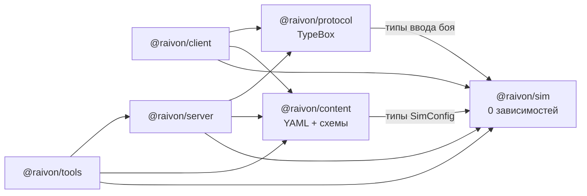

| Пакет | Можно импортировать | Нельзя |
|---|---|---|
| `sim` | только себя | DOM, Node API, PixiJS, любые npm-пакеты, `content` в рантайме (конфиг приходит параметром) |
| `content` | типы `sim` | рантайм клиента и сервера |
| `protocol` | типы `sim`, TypeBox | Fastify, Kysely |
| `client` | `sim`, `content` (bundle), `protocol`, PixiJS, Preact, Capacitor | `server` (кроме `protocol`), Node API |
| `server` | `sim`, `content`, `protocol`, серверные библиотеки | PixiJS, DOM, Capacitor |
| `tools` | всё | — (в прод не попадает) |

Правило проверяется `dependency-cruiser` в CI (ПА). Нарушение = красный CI.

### 3.3. Правила кода

| Область | Правило |
|---|---|
| Общее | `strict: true`, `noUncheckedIndexedAccess`, без `any` (только `unknown` + сужение), без default-экспортов, один модуль ≤400 строк (иначе дробить), имена файлов `snake_case.ts` для доменных модулей, `PascalCase` для классов. Коды канона (`hex_city`, `card_airstrike`) используются как строковые литеральные типы, сгенерированные из `content/schema` |
| `sim` | ESLint-правила `raivon/sim-*` (ПА): запрет `Math.random`, `Date`, `performance`, `setTimeout`; запрет оператора `/` (только `idiv`); запрет десятичных литералов (`0.15` → `150` промилле); запрет `Math.pow/sqrt/sin/cos/exp/log` (есть целочисленные `isqrt`, таблицы); запрет `for…in`, `Array.prototype.sort` без компаратора с тай-брейком по `id`; запрет побитовых операций вне `core/rng.ts`, `core/hash.ts`, `core/codec/`; запрет `async`; без исключений в горячем цикле (ошибка ввода = отклонённый ввод) |
| Клиент | рендер не владеет состоянием: состояние в store, сцены подписываются; никаких мутаций игры без ответа сервера (T8); всё время берётся из `serverNow()` (§8.5) |
| Сервер | каждая команда = одна транзакция (§6.7); валидация входа TypeBox-схемой на маршруте; ошибки — коды из `protocol/errors.ts`; никакого состояния в памяти процесса, кроме кешей с TTL |
| Тесты | у каждого модуля `sim` есть юнит-тест и, где есть инвариант, property-тест; у каждого маршрута — интеграционный тест на настоящей PostgreSQL; покрытие строк `sim` ≥90%, `server/src/domain` ≥80% (ПА) |
| Зависимости | новая npm-зависимость — только через ADR в `docs/adr/` с обоснованием, лицензией (MIT/BSD/Apache/ISC/OFL) и размером. Обновления раз в 2 недели пакетом Renovate (ПА) |
| Git | trunk-based: одна задача = одна ветка = один PR; Conventional Commits; PR не мержится без зелёного CI; `main` защищён |
| Документация | изменение поведения, описанного в GDD, = правка GDD в том же PR или задача в `open_questions.md`. Архитектурные решения фиксируются в `docs/adr/` |

### 3.4. Контент-пайплайн

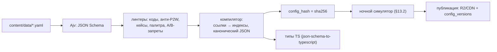

- Компилятор превращает ссылки по кодам (`unlock: card_airstrike`) в проверенные индексы. Неизвестный код = ошибка сборки.
- Канонический JSON строится с отсортированными ключами, без пробелов и с целыми числами в единицах `sim` (промилле, ×1000). Хэш от него одинаков на любой машине.
- Конфиг попадает в клиент двумя путями: встроенная копия в бандле для первого запуска и актуальная версия с CDN (§9.2).

---

## 4. Детерминированная симуляция (`sim`)

### 4.1. Что входит в `sim`

| Модуль | Где исполняется | Зачем детерминизм |
|---|---|---|
| `battle/*` — бой 90 с, ИИ в бою, автоигрок, прогноз | клиент (бой, прогноз), сервер (пересчёт, авто-оборона, «Быстрый итог», автопилот после обрыва) | сервер пересчитывает бой по логу (канон §16.2) |
| `war/*` — ВС, снабжение, котлы, цены требований, применение поражения | сервер (авторитетно), клиент (живое превью «Мир (N)») | превью на клиенте совпадает с итогом сервера |
| `econ/*` — доход, апкип, колонизация, стоимости и таймеры | сервер (авторитетно), клиент (таймеры, прогнозы на экранах) | цифры на экране не расходятся с сервером |
| `world/*` — события мира и их обработчики | сервер (`advanceWorld`), тесты | одна и та же цепочка событий при любом разбиении на шаги (§6.2) |
| `hex/*` — сетка | везде | — |

### 4.2. Фиксированная точка ×1000

Единицы хранения заданы в `03` §1.3: Сила ×1000, множители в промилле, 1 энергия = 3000 ед., ВС ×10, тик 100 мс. Реализация:

```ts
// sim/src/core/fx.ts
export type Fx = number & { readonly __fx: unique symbol };   // целое: значение × 1000
export const FX_ONE = 1000 as Fx;

/** Целочисленное деление с округлением вниз и коррекцией ±1 (03 §1.3). */
export function idiv(a: number, b: number): number {
  let q = Math.floor(a / b);
  if ((q + 1) * b <= a) q += 1;          // double ошибся вниз у границы целого
  else if (q * b > a) q -= 1;            // double ошибся вверх
  return q;
}
export const fxMul = (a: Fx, b: Fx): Fx => idiv(a * b, 1000) as Fx;   // a·b ≤ 2^53 (см. границы)
export const fxDiv = (a: Fx, b: Fx): Fx => idiv(a * 1000, b) as Fx;
export const pct = (a: Fx, permille: number): Fx => idiv(a * permille, 1000) as Fx;

/** Целый квадратный корень (для √W прогноза, 03 К2). */
export function isqrt(n: number): number {
  if (n < 2) return n;
  let x = Math.floor(Math.sqrt(n));       // приближение; результат исправляется до точного
  while (x * x > n) x -= 1;
  while ((x + 1) * (x + 1) <= n) x += 1;
  return x;
}
```

**Почему `Math.sqrt` допустим в `isqrt`.** Результат приближения сразу исправляется целочисленными сравнениями до точного значения, поэтому разница движков на выходе не видна. Это единственное разрешённое исключение в линтере (ПА).

**Границы.** Наибольшая Сила армии на УР10 ≈ 5 отрядов × 30 × 6,6 × 1,54 ≈ 1 525 → 1,5·10⁶ в единицах ×1000. Наибольший множитель ≈ ×3 → 3·10³. Произведение ≈ 4,6·10⁹, а безопасная граница 2⁵³ ≈ 9·10¹⁵: запас шесть порядков. В отладочных сборках `fxMul` проверяет `Number.isSafeInteger`. Fuzz-тест подаёт максимальные значения всех конфигов и проверяет, что ни одно промежуточное значение не выходит за 2⁵⁰ (ПА).

**Округление.** Везде вниз (`03` §1.3). ВС и очки гекса считаются в десятых «половина вверх» отдельной функцией `roundHalfUpTenths`.

### 4.3. PRNG xoshiro128**

```ts
// sim/src/core/rng.ts — один и тот же код в sim и в Blender-скриптах (10 §11.2, порт на Python)
const rotl = (x: number, k: number) => ((x << k) | (x >>> (32 - k))) >>> 0;

export class Rng {
  private s = new Uint32Array(4);
  constructor(seedLo: number, seedHi: number) {        // 64-битный сид двумя uint32
    let z = (seedLo ^ Math.imul(seedHi, 0x9e3779b9)) >>> 0;
    for (let i = 0; i < 4; i++) {                       // splitmix32 для заполнения состояния
      z = (z + 0x9e3779b9) >>> 0;
      let t = z ^ (z >>> 16); t = Math.imul(t, 0x21f0aaad);
      t ^= t >>> 15; t = Math.imul(t, 0x735a2d97); t ^= t >>> 15;
      this.s[i] = t >>> 0;
    }
    if ((this.s[0] | this.s[1] | this.s[2] | this.s[3]) === 0) this.s[0] = 1;
  }
  nextU32(): number {
    const s = this.s;
    const r = Math.imul(rotl(Math.imul(s[1], 5) >>> 0, 7), 9) >>> 0;
    const t = (s[1] << 9) >>> 0;
    s[2] ^= s[0]; s[3] ^= s[1]; s[1] ^= s[2]; s[0] ^= s[3];
    s[2] ^= t; s[3] = rotl(s[3], 11);
    return r;
  }
  /** Равномерное целое [0, n), без смещения (отбраковка). */
  int(n: number): number {
    const limit = 0x100000000 - (0x100000000 % n);
    let x: number;
    do { x = this.nextU32(); } while (x >= limit);
    return x % n;
  }
  chancePpm(ppm: number): boolean { return this.int(1_000_000) < ppm; }   // доли миллиона
}

/** Независимый поток для подсистемы: сид боя + метка. */
export const fork = (seedLo: number, seedHi: number, label: string) =>
  new Rng(seedLo ^ fnv1a32(label), seedHi);
```

- **Потоки.** У каждой подсистемы свой поток: `ai_side_<n>`, `waves`, `autoplay`, `tiebreak`. Тогда новый вызов RNG в одной подсистеме не сдвигает результаты другой, и старые golden-логи переживают несвязанные правки (ПА).
- **Сид боя** генерирует сервер криптостойким генератором (`crypto.randomBytes(8)`) в `battle_start` (`03` §21.1). Клиент узнаёт его только при старте.
- **Кейсы** крутятся на сервере `crypto.randomInt`, а не xoshiro: так результат нельзя предсказать по утёкшему сиду. Функция выбора `rollCase(table, pity, rng)` принимает RNG параметром. Тест 1 млн открытий (канон §15.4) подставляет в неё сидированный `Rng`.
- **Тестовые векторы.** `sim/test/rng.vectors.json` хранит первые 1 000 выходов для 5 сидов. Тест сверяет TS и Python-порт Blender.

### 4.4. Тик 100 мс и время

- Бой — это 900 тиков (90 с). Тик выполняет `tick(b)` по порядку `03` §8.3. Всё время внутри `sim` считается в тиках, о реальных часах `sim` не знает.
- **Клиентский цикл.** Рендер идёт с частотой 60 fps, накопитель реального времени выполняет ровно столько тиков, сколько прошло по 100 мс. Положения армий интерполируются между двумя последними тиками с коэффициентом `α = накоплено / 100 мс`. Интерполяция только визуальная, в состояние она не попадает.
- **Догонка.** Если кадр задержался, за один кадр выполняется не больше 5 тиков (ПА). Остаток переносится на следующие кадры: так сборщик мусора не вызывает «спираль смерти».
- **Сворачивание приложения** ставит бой на паузу (`App.addListener('pause')`). Суммарная пауза до 60 с за бой допустима (`03` §21.2). Сервер видит её по реальному времени между порциями.
- **Защита от замедления (ПА).** В PvE-бою ускорять симуляцию бессмысленно, а замедление даёт человеку лишнее время на реакцию. Поэтому сервер требует: `реальная длительность боя ≤ 90 с + пауза ≤60 с + 10 с запаса`. Если порции приходят медленнее, после 60 с без новых тиков сервер переводит бой в автопилот (канон §9.16, `03` §21.2).

### 4.5. Сериализация лога ввода

Лог хранится в бинарном формате `RVB1`, у которого есть JSON-форма для отладки. Канон задаёт ≤200 событий за 90 с, ~2 КБ (§16.2). Бинарный формат укладывается в ≈1,2–1,5 КБ.

| Поле | Тип | Байт | Комментарий |
|---|---|---|---|
| `magic` | `"RVB1"` | 4 | версия формата в имени |
| `kind` | u8 | 1 | 0 `offensive`, 1 `live_defense`, 2 `auto_defense`, 3 `raid_camp`, 4 `arena_attack`, 5 `arena_defense_replay` (`03` §21.3) |
| `sim_version` | u32 | 4 | major·10⁶ + minor·10³ + patch |
| `config_hash` | 8 байт | 8 | первые 8 байт sha256 |
| `seed` | 2 × u32 | 8 | — |
| `snapshot_hash` | u32 | 4 | FNV-1a стартового снимка сектора |
| `battle_id` | UUIDv7 | 16 | — |
| `n_inputs` | varint | 1–2 | — |
| записи ввода | см. ниже | ~5 каждая | отсортированы по (tick, seq) |
| `n_checkpoints` + хэши | varint + u32 × N | ~73 | каждые 50 тиков (`03` §8.3 шаг 14) |
| `final_hash` | u32 | 4 | — |

**Запись ввода:** `Δtick` (varint от предыдущей записи) · `op` (u8: 4 бита тип + 4 бита флаги) · аргументы по типу.

| `op` | Тип | Аргументы |
|---|---|---|
| 1 | `move` (армия → свой гекс) | `army` u8, `cell` varint |
| 2 | `attack_swipe` (одна армия → цель) | `army` u8, `cell` varint |
| 3 | `card` | `card` u8 (индекс в `cards.yaml`), `cell` varint, `aux` u8 (ось «Артобстрела», армия «Прорыва» или «Марш-броска») |
| 4 | `hold_toggle` | `army` u8 |
| 5 | `recall` («Отозвать») | `army` u8 |
| 6 | `retreat_all` («Отступить», удержание 0,5 с) | — |
| 7 | `take_control` (выход из автобоя, `03` §20) | — |
| 8 | `doctrine_counter` (живая оборона) | `army` u8, `cell` varint |

- `cell` — это `cell_id` из модели `02` §18.3: на карте главы VI <1 024, то есть 2 байта varint.
- Ввод применяется на тике `t + 1` от момента жеста (`03` §6.3). Клиент пишет его в лог именно с этим тиком.
- **Хэш состояния:** FNV-1a 32 по каноническому байтовому потоку: армии по `id` (`hex`, `S`, `state`), гексы сектора по `cell_id` (`controller`, `garrison`, эффекты), энергия и перезарядки сторон. Коллизия 1 на 4·10⁹ для обнаружения рассинхрона достаточна (ПА).
- **Порции.** Клиент шлёт `POST /v1/battles/{id}/chunks` каждые 5 с (50 тиков): `{from_tick, to_tick, inputs_bin, checkpoints[]}`. Порция идемпотентна по `(battle_id, from_tick)`, сервер отвечает `ack(to_tick)`. Недоставленные порции клиент досылает после переподключения.

### 4.6. Версионирование `sim` на сервере

- Каждый релиз `sim` собирается в отдельный бандл `server/sims/sim-<version>.mjs`. Сервер загружает версию лениво по `sim_version` из `battle_start`.
- Держим 3 последние версии (ПА). Во время раскатки клиента старые и новые клиенты играют одновременно, и каждого перепроверяет его собственная версия правил.
- **Конфиг боя** закрепляется в `battle_start`: сервер возвращает `config_hash`, а пересчёт берёт конфиг именно с этим хэшем из `config_versions` (LRU-кеш в памяти, 16 версий).
- **Hotfix правила боя** = новая `sim_version` + force update старых клиентов только если ошибка даёт выгоду игроку. Иначе старые версии доживают естественно (ПА).

### 4.7. Кросс-платформенные тесты детерминизма

**Корпус** `sim/golden/` (ПА): ≥500 логов. 300 записаны ботами (все 12 карт, все формы, котлы, волны, Последний рубеж, автопилот), 150 — ручные краевые случаи из `03` §24, ≥50 — реальные логи закрытого теста с рассинхроном. К каждому логу приложены `snapshot`, `config_hash` и эталонный `final_hash` с чекпойнтами.

| Платформа | Движок JS | Где запускается | Когда |
|---|---|---|---|
| Node 24 | V8 | GitHub Actions (Linux) | каждый PR |
| Chromium headless | V8 | Playwright в GitHub Actions | каждый PR |
| WebKit (Playwright) | JavaScriptCore | GitHub Actions (Linux, WebKit-сборка Playwright) | каждый PR — ранний сигнал по JSC (ПА) |
| Android WebView | V8 (Chrome WebView) | эмулятор x86_64 API 30 и API 35 в GitHub Actions; раз в неделю Firebase Test Lab на 2 физических устройствах (бесплатная квота, проверить) | ночью |
| iOS WKWebView | JavaScriptCore | симулятор iOS на macOS-раннере; перед релизом — iPhone владельца через TestFlight-сборку с экраном самотеста | ночью / перед релизом |

**Экран самотеста** (скрытое меню, 7 тапов по версии в настройках, ПА) прогоняет корпус на устройстве и показывает «500/500 OK» или первый расходящийся лог. Владельцу хватает одного тапа и скриншота.

**Property-тест.** fast-check генерирует случайные допустимые логи (до 200 вводов) и сравнивает хэши Node и Chromium/WebKit через Playwright (1 000 логов на PR, 50 000 ночью).

**Известные ловушки и защита:**

| Ловушка | Защита |
|---|---|
| Ошибка double в делении у границы целого | `idiv` с коррекцией |
| `Math.sqrt/pow/sin` расходятся в последнем бите между движками | запрет в линтере, кроме исправляемого `isqrt` |
| Нестабильная сортировка | ES2019 гарантирует стабильность, но компаратор обязан иметь тай-брейк по `id` |
| Порядок обхода `Map`/`Set` | порядок вставки детерминирован; в горячих местах используются массивы по `id` |
| Переполнение int32 в побитовых операциях | побитовые операции разрешены только в `rng`, `hash`, `codec` |
| Локаль и `Intl` | запрещены в `sim` |
| Различие версий конфига | `config_hash` в логе и закрепление на старте |

### 4.8. Бюджеты производительности `sim`

| Метрика | Цель | Источник |
|---|---|---|
| Тик боя на клиенте | ≤1 мс (средний), ≤2 мс (Android 2 ГБ) | `10` §16.1 |
| Пересчёт боя на сервере | <5 мс CPU на 900 тиков | канон §16.2 |
| Авто-оборона (без рендера) | <5 мс | то же |
| Пересчёт снабжения и котлов (BFS) на главе VI | ≤0,5 мс | `02` §14.1 (порядок величины) |
| Аллокации в тике | 0 новых объектов в горячем цикле (пулы, typed arrays) | ПА |

Бенчмарк `pnpm bench:sim` запускается в CI. Регрессия больше 20% относительно `main` блокирует PR (ПА).

---

## 5. Клиент

### 5.1. Архитектура

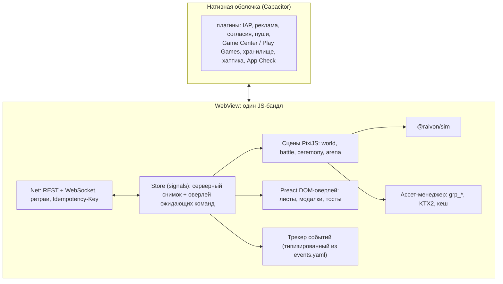

- **Store.** Хранит последний подтверждённый сервером снимок и очередь отправленных, но ещё не подтверждённых команд. UI показывает команду как «в процессе» (спиннер на кнопке ≤300 мс, дальше «ждём сервер»). Предсказание результата разрешено только для чистых функций `sim/econ` (например, новый таймер), откат выполняется при ответе с ошибкой (ПА).
- **Сцены** — это слои одной карты. Отдельного экрана боя нет (канон §1.4 USP 1): бой включает режим сектора на той же сцене мира.

### 5.2. Сцены и переходы

| Сцена | Что | Вход / выход |
|---|---|---|
| `boot` | нативный сплэш, проверка версии, авторизация, загрузка снимка | старт → `loading` или `force_update` |
| `loading` | экран загрузки главы, прогресс групп ассетов первого бандла | → `world` |
| `world` | стратегическая карта, 20 слоёв `02` §6 | основная |
| `battle` | режим сектора поверх `world`: камера наезжает, HUD боя, `sim` активен | «В бой!» → итоги → `world` |
| `ceremony` | церемонии мира, УР, «Мир расширяется», поражения; HUD скрыт | очередь церемоний (`07` E8) |
| `arena` | редактор Рубежа (37 гексов) и атака на Арене; та же карта-движок, другой мир | вкладка режимов |
| `expedition` | v1.1, другой экземпляр мира (`07` §10) | кнопка «Поход» |

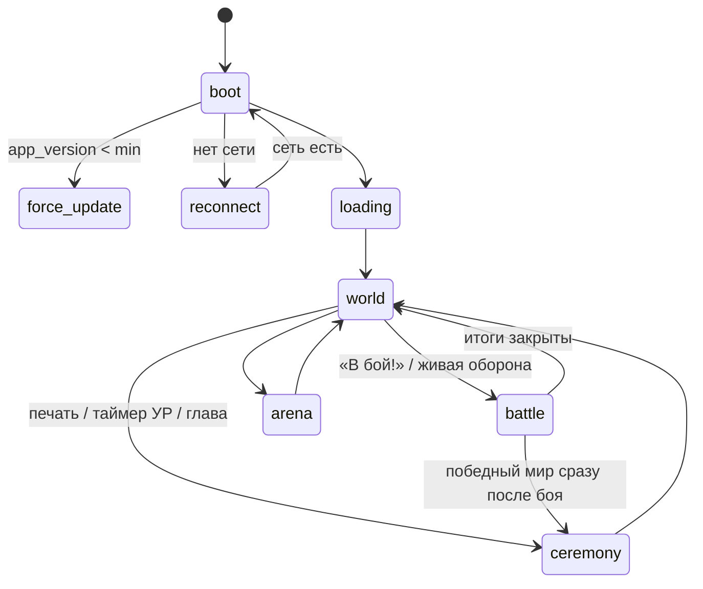

Защищённые состояния `Battle`, `Ceremony`, `FTUE`, `Recovery` (`10` §3.4) клиент передаёт серверу полем `client_state` в каждом запросе. Сервер дополнительно проверяет их сам по своим данным: идёт ли бой, есть ли неподтверждённая церемония, когда было поражение (T12).

### 5.3. Слои карты в PixiJS v8

Состав и порядок 20 слоёв задаёт `02` §6. Реализация:

| Приём | API PixiJS v8 | Слои |
|---|---|---|
| Чанки 8 × 8 гексов, запечённые в текстуру | `RenderTexture` + `renderer.render({container, target})`; грязные чанки пересобираются не больше 2 за кадр (ПА) | 2, 4, 5, 6, 7 |
| Живые меши | `Mesh` со своей `Geometry` и `Shader` (`GlProgram` + `UniformGroup`) | 8, 9, 10, 11, 15 |
| Шейдерные анимации | юниформы `uTime`, без перестройки геометрии | 3, 10, 12, 16 |
| Объекты | `Sprite` из атласов, пулы, сортировка по y один раз при изменении | 14 |
| Текст | `BitmapText` (MSDF) | 17 |
| Порядок отрисовки | `Container` на слой, `zIndex` слоя фиксирован; объекты сортируются только внутри слоя 14 | все |

- Рендерер: `Application.init({ preference: 'webgl', antialias: false, resolution: min(devicePixelRatio, 2), autoDensity: true, powerPreference: 'high-performance' })`. На слабых устройствах (`10` §16.1, режим «Экономия») разрешение ограничено 1,5 (ПА).
- **Минимальные требования:** WebGL2. Без WebGL2 клиент показывает «Устройство не поддерживается» и шлёт `device_unsupported`. Ожидаемая доля таких устройств <1%, порог проверяется на закрытом тесте (ПА).
- **Потеря контекста WebGL** (`webglcontextlost`) — штатная ситуация на Android. Клиент перезагружает текстуры текущих групп из дискового кеша, пересобирает чанки и меши и продолжает работу. Бой на это время ставится на паузу (входит в лимит 60 с). Событие `webgl_context_lost` уходит в аналитику.

### 5.4. Рендер гексов

- Заливка, паттерн и сетка запекаются в чанк одним проходом: инстансный меш гексов (6 треугольников на гекс) с атрибутами `cell_id`, `fill_rgb`, `pattern_id`, `grid_alpha`. Текстура чанка содержит готовую картинку, поэтому на кадр приходится один спрайт на чанк. На главе VI при среднем зуме видно ≤12 чанков (ПА).
- Рельеф рисуется спрайтами тайлов из атласа биома (`10` §11.10) и тоже запекается в чанк.
- Штриховка оккупации — живой меш с шейдером: диагональные полосы считаются в мировых координатах (`fract(dot(vWorld, dir) * freq)`), поэтому полосы непрерывны через границы гексов.
- Пикинг (какой гекс под пальцем) считается аналитически: формула «пиксель → гекс» из `02` §2.4 плюс обратная проекция камеры. Геометрическое попадание по мешам не используется.

### 5.5. Толстый контур официальной границы

Алгоритм — `02` §8: извлечение контуров, отступ, скругление, лента с UV. Реализация в `client/src/map/border/`:

| Шаг | Модуль | Бюджет |
|---|---|---|
| `extractLoops(state)` | `loops.ts` | <0,2 мс на 175 гексов |
| отступ на `d / sin(θ/2)` и скругление дугами | `offset.ts` | <0,3 мс |
| лента: 2 вершины на точку, UV.x вдоль, UV.y поперёк | `ribbon.ts` → `Geometry` | <0,3 мс |
| фрагментный шейдер полосы, обводки и тени | `shaders/border.frag` | 1 draw call на государство |

```glsl
// client/shaders/border.frag (GLSL ES 3.00) — стиль по 02 §8.3
precision mediump float;
in vec2 vUV;            // x — длина вдоль контура (мировые единицы), y — 0 внутри … 1 снаружи
in vec2 vWorld;
uniform vec3 uColor;    // заливка × 0,6
uniform float uTime;
uniform int uInkMode;   // 0 — стандарт; 1+ — чернила cos_border_ink (параметры из cosmetics.yaml)
uniform vec4 uInkA, uInkB;   // палитра чернил
uniform vec4 uInkParams;     // x: скорость flow, y: масштаб шума, z: яркость частиц, w: градиент
out vec4 outColor;
void main() {
  float aa = fwidth(vUV.y);
  vec3 band = uColor * mix(0.9, 1.05, vUV.y);
  if (uInkMode > 0) band = inkShade(vUV, vWorld, uTime, uInkA, uInkB, uInkParams);  // параметрическая косметика
  float rim = smoothstep(1.0 - 2.0 * aa, 1.0 - aa, vUV.y);      // внешняя светлая обводка 1 px
  vec3 c = mix(band, vec3(1.0), rim * 0.7);
  outColor = vec4(c, 1.0);
}
```

- **Косметика чернил** (`cos_border_ink`) — это строка YAML с параметрами `inkShade` (канон §16.4: «новый предмет = строка YAML»). Новые типы анимации требуют новой ветки шейдера, то есть обновления клиента. Новые палитры и скорости обходятся без него (ПА).
- Контур перестраивается только при смене `owner` (`02` §8.4). Смена контроля его не трогает.

### 5.6. Анимация расширения границы

Механизм поля чернил — `02` §9.1. Инженерная часть:

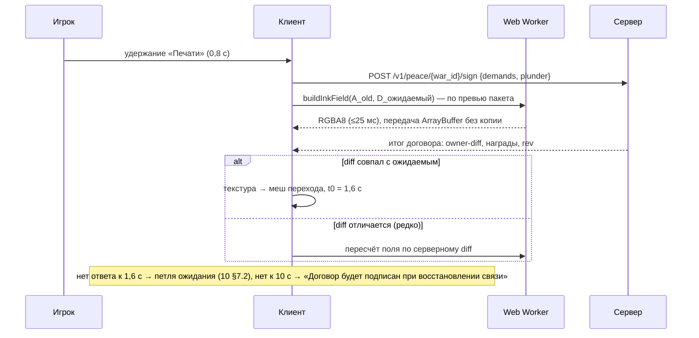

- Поле строится в Web Worker, пока игрок держит печать. Главный поток не блокируется, а 0,8 с с запасом покрывают бюджет 25 мс.
- Ожидаемый домен D известен из пакета требований, поэтому поле обычно готово до ответа сервера. Если сервер вернул другой diff (оккупация изменилась за секунду до подписи), поле пересчитывается.
- Текстура поля — `Texture.from(buffer)` в формате RGBA8, кодирование каналов по `02` §9.1. Шейдер перехода получает `uFront = v × (t − t0)`.
- В режиме «Меньше анимации» поле не строится: заливка и контур перекрёстно затухают за 0,5 с (`02` §9.2).
- Колонизация и обмен используют то же поле на 1–2 гекса (<1 мс), прямо в главном потоке.

### 5.7. Ассет-менеджер и атласы

| Аспект | Правило |
|---|---|
| Группы | `grp_*` из `10` §11.7: по ступени УР, уровню укреплений, биому, UI, VFX, картам, портретам |
| Манифест | `assets/manifest-<content_hash>.json`: группы → файлы с sha256, размер, тир `lo`/`hi`. Манифест — часть конфига, его версия привязана к `config_version` |
| Адреса | `https://cdn.<домен>/a/<sha256>.<ext>`: неизменяемые файлы, `Cache-Control: public, max-age=31536000, immutable` |
| Первый бандл | ≤60 МБ (канон §16.1, состав в `10` §16.2), лежит в APK/IPA |
| Догрузка | фоном по правилам `10` §16.2. Параллельно ≤3 загрузки, на мобильной сети только текущая и следующая ступень, на Wi-Fi — на 2 ступени вперёд |
| Дисковый кеш | `Filesystem` (Capacitor) в `Directory.Data/assets/`. LRU с лимитом 400 МБ (ПА); группы текущего УР и УР ИИ на карте не вытесняются |
| Сжатие | KTX2 (Basis Universal). Транскодер — встроенный загрузчик KTX2 PixiJS v8 с WASM-транскодером в воркере; цель — ASTC, иначе ETC2, иначе RGBA8 (`10` §11.7) |
| Память GPU | бюджеты `10` §16.1. В памяти не больше 6 атласов ступеней (`02` §20). Выгрузка через `texture.destroy(true)` |
| Целостность | sha256 файла проверяется после загрузки. Несовпадение — повтор, затем откат на ступень ниже (`10` §16.2: «игра никогда не ждёт») |
| Тир | `hi` при DPR ≥3 и RAM ≥4 ГБ, иначе `lo` (`10` §11.10) |

### 5.8. Capacitor-плагины

| Назначение | Плагин | Примечания |
|---|---|---|
| IAP | `@revenuecat/purchases-capacitor` | `Purchases.logIn(player_id)`: app user id = `player_id`; цены из `StoreProduct.priceString` (`09` §9.8.10); `restorePurchases()` |
| Реклама (MAX) | свой `@raivon/capacitor-max` (`09` §9.5.1) поверх нативных SDK AppLovin MAX | мост: `init(sdkKey, consentFlags)`, `loadRewarded`, `showRewarded(placement, customData = ad_token)`, `showInterstitial(placement)`, события `loaded/failed/displayed/hidden/rewarded/revenuePaid`. Адаптеры сетей по `09` §9.5.1 подключаются Gradle/CocoaPods-зависимостями |
| Реклама `u13` | тот же плагин, ветка AdMob (Google Mobile Ads SDK) с `tagForChildDirectedTreatment` и рейтингом G (`09` §9.6.3) | MAX для `u13` не инициализируется |
| Реклама RU | Yandex Mobile Ads через адаптер медиации MAX, если он есть и работает; иначе прямая интеграция Yandex SDK внутри того же плагина с тем же JS-интерфейсом (ПА, ответ на `09` §9.5.1) | выбор сети по стране стора (`09` §9.5.4) |
| Согласия | свой `@raivon/capacitor-consent`: Google UMP SDK (IAB TCF v2.2, US States) + `ATTrackingManager` (ПА) | встроенный поток MAX «Terms and Privacy Policy Flow» не используем: нужны свой предзапрос ATT и ветка `u13` без MAX (ответ на `09` §9.6.5) |
| Пуши | `@capacitor-firebase/messaging` | FCM-токен на обеих платформах; на iOS FCM доставляет через APNs-ключ (.p8). Сервер шлёт только через FCM HTTP v1, транспорт один |
| Game Center / Play Games / Sign in with Apple | свой `@raivon/capacitor-identity` (ПА) | iOS: `GKLocalPlayer.authenticateHandler` + `fetchItems(forIdentityVerificationSignature:)`; Android: Play Games Services v2 `requestServerSideAccess`; Sign in with Apple — `ASAuthorizationController`. Серверная проверка — §8.1 |
| Безопасное хранилище | свой мини-плагин в `capacitor-identity`: Keychain / Android Keystore (ПА) | refresh-токен и `device_id`. Несекретные настройки — `@capacitor/preferences` |
| Хаптика | свой `raivon-haptics` (`10` §18.2 п. 5): Core Haptics и `VibrationEffect.createWaveform` | 19 паттернов `hap_*`, лимит 12 событий/с; запасной путь — `@capacitor/haptics` |
| Целостность | `@capacitor-firebase/app-check` (Play Integrity / App Attest) | токен в заголовке `X-App-Check` (§7.7) |
| Аналитика и краши | `@capacitor-firebase/analytics`, `@capacitor-firebase/crashlytics` | §10, §12 |
| Шеринг Таймлапса | `@capacitor/share` + свой `@raivon/capacitor-video-encoder` (ПА): кадры PixiJS → H.264 720 × 1280, 30 fps через AVAssetWriter / MediaCodec | рендер на устройстве (`08` §8.16.4) |
| Системное | `@capacitor/app` (жизненный цикл, диплинки), `@capacitor/network`, `@capacitor/device`, `@capacitor/splash-screen`, `@capacitor/status-bar`, `@capacitor/filesystem` | — |
| Оценка приложения | `SKStoreReviewController` / Play In-App Review внутри `capacitor-identity` | без наград (канон §14.10 п. 4) |

**Правила плагинов.** Каждый плагин имеет web-заглушку в `client/src/platform/` для Playwright-тестов. Свои плагины тонкие (≤500 строк нативного кода на платформу, ПА), их публичный JS-интерфейс описан TypeScript-типами. Версии нативных SDK закреплены и обновляются отдельным PR с прогоном e2e на эмуляторах.

### 5.9. Сетевой слой клиента

- **REST** по HTTPS (HTTP/2 через Cloudflare), JSON, сжатие gzip/br. Заголовки: `Authorization: Bearer <access>`, `Idempotency-Key` (UUIDv7) на каждой мутации, `X-Client: <app_version>/<sim_version>/<config_version>`, `X-App-Check`.
- **WebSocket** — один на сессию, для событий сервера (§6.5). Команды клиент шлёт только по REST: так проще ретраи и идемпотентность.
- **Ретраи.** Мутация повторяется с тем же `Idempotency-Key` при сетевой ошибке и 5xx: 3 попытки с задержкой 0,5 / 1 / 2 с ± 20% джиттера. На 4xx повторов нет.
- **Пакетирование.** Аналитика уходит пачками раз в 30 с или по 50 событий, а при сворачивании приложения — немедленно (§10.7).

---

## 6. Сервер

### 6.1. Архитектура

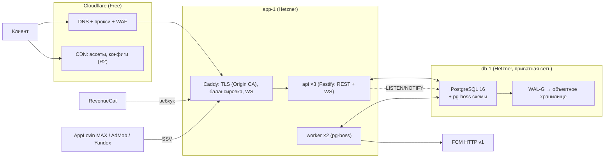

- **Один кодбейс, три роли** по переменной `RAIVON_ROLE`: `api` (HTTP + WS, без фоновых задач), `worker` (обработчики pg-boss), `scheduler` (расписания pg-boss, ровно один экземпляр с advisory lock). На старте `scheduler` живёт внутри одного из `worker`.
- **Stateless API** (канон §16.2): в памяти процесса только кеши с TTL (конфиги по хэшу, версии `sim`, история каналов чата). Любой экземпляр обслуживает любой запрос.
- **Без Redis на старте** (канон §16.1). Межпроцессная доставка событий в WebSocket идёт через `LISTEN/NOTIFY`, очереди — через pg-boss, лимиты — через счётчики в памяти и PostgreSQL (§7.5).

### 6.2. Ленивая симуляция мира по событиям

Мир каждого игрока — его собственный PvE-экземпляр (канон §16.2, §19.1). Непрерывной симуляции нет. У игрока есть упорядоченная очередь событий `world_events`, и мир «догоняется» до текущего момента при каждом обращении.

```ts
// server/src/world/advance.ts
async function withPlayer<T>(pid: PlayerId, fn: (ctx: Ctx) => Promise<T>): Promise<T> {
  return db.forPlayer(pid).transaction(async (tx) => {
    const p = await tx.lockPlayer(pid);                 // SELECT … FOR UPDATE: команды игрока строго последовательны
    const ctx = await loadCtx(tx, p);                   // player_state, world, активные войны, wallet
    advanceWorld(ctx, serverNow());                     // догнать мир
    const r = await fn(ctx);                            // команда игрока поверх актуального мира
    await persist(tx, ctx);                             // только изменённые колонки; rev++
    return r;
  });
}

function advanceWorld(ctx: Ctx, now: Ts): void {
  let n = 0;
  for (;;) {
    const e = ctx.events.peekDue(now);                  // минимум по (due_at, seq)
    if (!e) break;
    ctx.econ.accrueUntil(e.due_at);                     // доход и апкип в закрытой форме до момента события
    ctx.events.pop();
    applyWorldEvent(ctx, e);                            // чистая функция из sim/world: может породить новые события
    if (++n > MAX_EVENTS_PER_ADVANCE) { ctx.flagCatchUp(); break; }   // 20 000 (ПА); остаток догонит worker
  }
  ctx.econ.accrueUntil(now);
  ctx.player.world_time = now;
  ctx.player.next_wake_at = ctx.events.nextWakeAt();    // ближайшее событие с needs_wake = true
}
```

**Правила:**

| Правило | Значение |
|---|---|
| Порядок | строго по `(due_at, seq)`. `seq` монотонен внутри игрока, поэтому одновременные события обрабатываются одинаково при любом разбиении на шаги |
| Детерминизм | обработчики — чистые функции `sim/world`. Случайность — `Rng` с сидом `hash(world_seed, event.seq)` |
| Экономика между событиями | закрытая форма: доход копится в гексах до 8 ч (канон §2.2 п. 24), апкип списывается почасово. Отсутствие в 30 дней не требует 720 почасовых шагов: пул упирается в 8 ч, апкип считается суммой |
| Длинные цепочки | войны ИИ против ИИ (тик раз в 2 ч), колонизации ИИ (1 гекс / 3 ч), спавн залежей (ленивый от сида, канон §5.2) порождают ограниченное число событий. 30 дней отсутствия ≈ 360 тиков ИИ×ИИ + ~240 колонизаций ≈ <1 000 событий, <50 мс |
| Отсутствие >24 ч | новых войн против игрока нет (канон §14.10 п. 5). Истёкший кап войны закрывается по правилам §9.13 канона |
| Пробуждения | `scheduler` раз в 30 с выбирает `players WHERE next_wake_at <= now() + 30 s` и ставит задачи `world.wake` с `singletonKey = player_id`. Точность пробуждения — 30 с (ПА); для пуша за 15 мин до удара её достаточно |
| Что требует пробуждения | объявление удара ИИ и пуш P0 (канон §9.11), сам удар (авто-оборона, если игрок офлайн), ультиматум, предложение мира, истечение капа войны, запланированный P2–P4-пуш (`08` §8.13.3) |
| Свойство-инвариант | `advance(t0 → t2) ≡ advance(t0 → t1) → advance(t1 → t2)` для любых t1. Property-тест на 10 000 случайных историй (ПА) |
| Идемпотентность | событие удаляется в той же транзакции, где применено; повтор задачи `world.wake` без событий ничего не делает |

**Авто-оборона офлайн.** Задача `world.wake` в момент удара открывает транзакцию игрока. Если игрок онлайн (живая сессия WS не старше 60 с), он получает сообщение `defense_start` и 30 с подготовки (`03` §15.4). Если офлайн, сервер прогоняет детерминированный бой `auto_defense` тем же `sim` (<5 мс), применяет итог в лимитах канона §9.11 и ставит пуш `push_defense_result`.

### 6.3. Схема PostgreSQL 16

Таблицы делятся на **глобальные** (каталог аккаунтов, чат, Арена, конфиги) и **игровые** (всё с `player_id`, шардируются в будущем по §16.6). Первичные ключи — UUIDv7: монотонные по времени, поэтому B-tree не фрагментируется.

**Глобальные таблицы:**

```sql
CREATE TABLE accounts (
  account_id     uuid PRIMARY KEY,
  player_id      uuid NOT NULL UNIQUE,          -- отдельный ключ шардирования
  shard_id       smallint NOT NULL DEFAULT 0,
  status         text NOT NULL DEFAULT 'active', -- active | deletion_pending | deleted | banned
  age_band       text,                          -- u13 | 13_15 | 16_17 | 18p (09 §9.6.2)
  birth_year     smallint,
  age_set_at     timestamptz,
  store_country  char(2),                       -- страна стора (09 §9.5.4)
  geo_tier       char(2),                       -- T1 | T2 | T3
  locale         text NOT NULL DEFAULT 'en',
  tz             text NOT NULL,                 -- IANA, для сброса в 04:00 (канон §19.1)
  tz_changed_at  timestamptz,
  consent        jsonb NOT NULL DEFAULT '{}',   -- TCF-строка, ATT, us_dns, версия формы
  is_test        boolean NOT NULL DEFAULT false,
  created_at     timestamptz NOT NULL DEFAULT now(),
  deletion_requested_at timestamptz,
  last_seen_at   timestamptz
);
CREATE TABLE account_links (
  provider     text NOT NULL,                   -- device | game_center | play_games | apple
  provider_uid text NOT NULL,                   -- device_id | teamPlayerID | playerId | sub
  account_id   uuid NOT NULL REFERENCES accounts,
  linked_at    timestamptz NOT NULL DEFAULT now(),
  PRIMARY KEY (provider, provider_uid)
);
CREATE TABLE devices (
  device_id    uuid PRIMARY KEY,
  account_id   uuid NOT NULL REFERENCES accounts,
  platform     text NOT NULL,                   -- ios | android
  model text, os_version text, app_version text, ram_mb int, device_class text,   -- lo | hi
  push_token   text, push_enabled boolean NOT NULL DEFAULT false,
  first_seen_at timestamptz NOT NULL DEFAULT now(), last_seen_at timestamptz
);
CREATE TABLE refresh_tokens (
  token_hash bytea PRIMARY KEY,                 -- sha256 токена
  account_id uuid NOT NULL, device_id uuid NOT NULL,
  family_id  uuid NOT NULL,                     -- предъявлен уже ротированный токен → отзыв всей семьи
  expires_at timestamptz NOT NULL, revoked_at timestamptz
);
```

**Игровые таблицы:**

```sql
CREATE TABLE players (
  player_id      uuid PRIMARY KEY,
  rev            bigint NOT NULL DEFAULT 0,     -- версия снимка для клиента (дельты WS)
  state_name     text NOT NULL, flag jsonb NOT NULL,
  dev_level      smallint NOT NULL DEFAULT 1,
  chapter        smallint NOT NULL DEFAULT 1,
  official_hexes smallint NOT NULL, official_value int NOT NULL, territory_points int NOT NULL,
  ftue_step      text, ftue_done_at timestamptz,
  quiet_start_min smallint NOT NULL DEFAULT 1380,  -- 23:00 (канон §3.2), длина 480 мин
  payer_segment  text NOT NULL DEFAULT 'non_payer',
  flags          jsonb NOT NULL DEFAULT '{}',    -- антифрод, тестовый, режимы
  world_time     timestamptz NOT NULL,           -- до какого момента продвинут мир
  next_wake_at   timestamptz,
  last_active_at timestamptz NOT NULL,
  created_at     timestamptz NOT NULL DEFAULT now()
);
CREATE INDEX players_wake ON players (next_wake_at) WHERE next_wake_at IS NOT NULL;

-- Домены — отдельные колонки: при UPDATE неизменённые TOAST-значения не переписываются.
CREATE TABLE player_state (
  player_id  uuid PRIMARY KEY REFERENCES players,
  economy    jsonb NOT NULL,  -- ресурсы, склад, уровни построек по типам, пулы дохода, апкип, консервация
  builders   jsonb NOT NULL,  -- слоты, задачи и таймеры
  army       jsonb NOT NULL,  -- армии, отряды, готовность, доктрины, очередь тренировки
  research   jsonb NOT NULL,  -- линии, очередь, трофейные чертежи
  collection jsonb NOT NULL,  -- командиры (уровни), экипированная косметика
  progress   jsonb NOT NULL,  -- главы, звёзды, достижения, календарь, задания дня и недели
  meta       jsonb NOT NULL   -- пасс сезона, дневные счётчики рекламы и офферов, гаранты кейсов, Лимит трат
);

CREATE TABLE worlds (
  player_id      uuid NOT NULL REFERENCES players,
  mode           text NOT NULL DEFAULT 'mode_campaign',   -- | mode_expedition (v1.1)
  map_ids        text[] NOT NULL,
  opened_chapter smallint NOT NULL,
  hex_state      bytea NOT NULL,     -- упакованные массивы 02 §18.3, формат RVW1 (ниже)
  states         jsonb NOT NULL,     -- рантайм ИИ: УР, мнение, угроза, армии, союзы, перемирия
  deposits jsonb NOT NULL, camps jsonb NOT NULL, colonizations jsonb NOT NULL,
  border_snapshots bytea NOT NULL,   -- ≤500 снимков по ~88 байт (02 §18.3)
  rev            bigint NOT NULL DEFAULT 0,
  PRIMARY KEY (player_id, mode)
);
ALTER TABLE worlds ALTER COLUMN hex_state SET COMPRESSION lz4;

CREATE TABLE world_events (
  player_id  uuid NOT NULL,
  seq        bigint NOT NULL,
  due_at     timestamptz NOT NULL,
  kind       text NOT NULL,          -- build_done, research_done, train_done, refill_done, convoy_arrive,
                                     -- colonize_done, deposit_spawn, deposit_expire, ai_strike_announce,
                                     -- ai_strike, ultimatum_deadline, war_cap, truce_end, ai_ai_tick,
                                     -- ai_colonize, coalition_step, pocket_surrender, push_due …
  payload    jsonb NOT NULL,
  needs_wake boolean NOT NULL,
  PRIMARY KEY (player_id, seq)
);
CREATE INDEX world_events_due ON world_events (player_id, due_at, seq);

CREATE TABLE wars (
  war_id uuid PRIMARY KEY, player_id uuid NOT NULL,
  state  text NOT NULL,                       -- состояния автомата 03 §2.1
  started_at timestamptz NOT NULL, cap_at timestamptz NOT NULL, closed_at timestamptz,
  outcome text, data jsonb NOT NULL           -- модель 03 §2.3
);
CREATE INDEX wars_active ON wars (player_id) WHERE closed_at IS NULL;

CREATE TABLE battles (
  battle_id uuid NOT NULL, player_id uuid NOT NULL, war_id uuid,
  kind text NOT NULL,                         -- 03 §21.3
  seed bigint NOT NULL, sim_version text NOT NULL, config_hash bytea NOT NULL, snapshot jsonb NOT NULL,
  status text NOT NULL,                       -- started | streaming | verifying | verified | autopilot | voided
  started_at timestamptz NOT NULL, last_chunk_at timestamptz, ended_at timestamptz,
  input_log bytea,                            -- RVB1; обнуляется через 30 дней (03 §21.3)
  client_final_hash int, server_final_hash int, first_desync_tick int,
  autopilot_from_tick int, result jsonb, rewards_granted boolean NOT NULL DEFAULT false,
  PRIMARY KEY (battle_id, started_at)
) PARTITION BY RANGE (started_at);            -- месячные партиции
```

**Экономика и монетизация:**

```sql
CREATE TABLE wallets (
  player_id uuid PRIMARY KEY,
  raivite bigint NOT NULL DEFAULT 0 , raivite_paid bigint NOT NULL DEFAULT 0,   -- платная часть для возвратов и аналитики
  medals bigint NOT NULL DEFAULT 0, glitter bigint NOT NULL DEFAULT 0,
  event_tokens jsonb NOT NULL DEFAULT '{}'    -- {evt_id: {earned, bought}} (09 У18)
);
CREATE TABLE wallet_ledger (
  player_id uuid NOT NULL, id bigint GENERATED ALWAYS AS IDENTITY,
  currency  text NOT NULL,                    -- cur_raivite | cur_medals | cur_glitter | cur_event_tokens:<evt> | item_*
  delta bigint NOT NULL, balance_after bigint NOT NULL, paid_part bigint NOT NULL DEFAULT 0,
  reason text NOT NULL,                       -- iap:<sku> | ad:<placement> | case:<case> | speedup | support | refund …
  ref_id text, created_at timestamptz NOT NULL DEFAULT now(),
  PRIMARY KEY (player_id, id)
);
CREATE TABLE inventory (player_id uuid, item_code text, qty int NOT NULL CHECK (qty >= 0), PRIMARY KEY (player_id, item_code));
CREATE TABLE entitlements (
  player_id uuid, kind text,                  -- builder_4 | builder_5 | no_ads | sub_patent | pass_<season> | pass_elite_<season> | cos_<id>
  source text NOT NULL, starts_at timestamptz NOT NULL, expires_at timestamptz, revoked_at timestamptz,
  PRIMARY KEY (player_id, kind)
);
CREATE TABLE iap_intents (intent_id uuid PRIMARY KEY, player_id uuid NOT NULL, sku text NOT NULL, offer_id text,
  status text NOT NULL, created_at timestamptz NOT NULL, expires_at timestamptz NOT NULL);
CREATE TABLE purchases (
  purchase_id uuid PRIMARY KEY, player_id uuid NOT NULL, store text NOT NULL, product_id text NOT NULL,
  store_transaction_id text NOT NULL UNIQUE, rc_event_id text UNIQUE, intent_id uuid,
  status text NOT NULL,                       -- granted | pending | refunded | revoked
  price_micros bigint, currency char(3), storefront char(2),
  granted_at timestamptz, refunded_at timestamptz, raw jsonb NOT NULL
);
CREATE TABLE ad_tokens (
  ad_token uuid PRIMARY KEY, player_id uuid NOT NULL, device_id uuid NOT NULL,
  placement text NOT NULL, context_id text, reward_snapshot jsonb NOT NULL,
  issued_at timestamptz NOT NULL, expires_at timestamptz NOT NULL,   -- 15 мин на показ (09 §9.3.6)
  ssv_event_id text UNIQUE, network text, rewarded_at timestamptz, instant_sub boolean NOT NULL DEFAULT false
);
CREATE TABLE case_opens (
  player_id uuid NOT NULL, id bigint GENERATED ALWAYS AS IDENTITY,
  case_code text NOT NULL, source text NOT NULL, x10_batch uuid,
  result_item text NOT NULL, rarity text NOT NULL, pity_before jsonb NOT NULL, config_hash bytea NOT NULL,
  created_at timestamptz NOT NULL DEFAULT now(),
  PRIMARY KEY (player_id, id)                 -- хранится 2 года (09 §9.15.4)
);
```

**Остальные таблицы** (поля сокращены):

| Таблица | Ключ | Основные поля | Хранение |
|---|---|---|---|
| `arena_forts` (глоб.) | `player_id` | `league`, `cups`, `dev_level`, `layout jsonb`, `defense_armies jsonb` (копии), `hand`, `updated_at` | бессрочно |
| `arena_battles` (глоб.) | `battle_id` | `attacker_id`, `defender_id`, `stars`, `cups_delta`, `opponent_kind` (player / militia / revenge), ссылка на лог | 30 дней (журнал обороны) |
| `arena_seasons` | `season_id` | даты, итоговые лиги, выданные награды | бессрочно |
| `friends` | `(player_id, friend_id)` | `source` (code / game_center / play_games / referral), `created_at` | — |
| `referrals` | `invitee_id` | `inviter_id`, `code`, `device_fingerprint`, `granted_at` | — |
| `chat_messages` (глоб.) | `(channel, id)` | `sender_id`, `text`, `lang`, `moderation` (ok / filtered / hidden / automuted), `created_at` | дневные партиции, 30 дней (ПА) |
| `chat_reports`, `chat_blocks`, `chat_mutes` | — | кто, на кого, причина, срок | 180 дней (ПА) |
| `event_cohorts` | `(evt_instance, cohort_id)` | 50 игроков близкого УР и даты старта (канон §14.6), очки | 30 дней после события |
| `leaderboard_snapshots` | `(board, period)` | топ-100 и границы перцентилей | 90 дней |
| `push_daily` | `(player_id, game_day)` | `total`, `non_urgent`, `last_non_urgent_at`, `by_type jsonb` (`08` §8.13.3) | 7 дней |
| `idempotency_keys` | `(player_id, key)` | `request_hash`, `response jsonb`, `created_at` | 24 ч |
| `ws_outbox` | `id` | `player_id`, `msg jsonb`, `created_at` | 10 мин |
| `config_versions` | `config_version` | `hash`, `bundle` (сжатый), `schema_v`, `status`, `rollout jsonb`, `author` | бессрочно |
| `experiments` | `exp_id` | `layer`, `variants jsonb`, `allocation`, `status`, `starts_at`, `ends_at`, `guardrails` | бессрочно |
| `flag_audit`, `admin_audit` | `id` | кто, что, было/стало, подпись | 2 года |
| `anticheat_flags` | `id` | `player_id`, `rule`, `score`, `details`, `status` (open / cleared / actioned) | 1 год |
| `deletion_requests` | `account_id` | `requested_at`, `source` (app / web), `execute_after`, `status` | 2 года (только факт и дата) |
| `analytics_events` | `(day, id)` | конверт §10.2 + `params jsonb` | дневные партиции, 3 дня (потом Parquet) |
| `client_errors` | `(day, id)` | `fingerprint`, `stack`, `build`, `device_class`, `count` | 14 дней |
| `alliances*` | — | спроектированы в `07` §12.6 и канон §12.6; миграции создаются при разработке фичи, флаг `feature_alliances` выключен | — |

**Формат `RVW1` для `hex_state`:** заголовок (`magic` 4 байта, `version` u8, `n_cells` u16), затем подряд массивы по `cell_id`: `owner` u8, `controller` u8, `type` u8, `fort` u8 (биты 0–3 уровень, бит 4 консервация), `tower` u8, `flags` u8, `garrison` u32 LE (×1000). Итого 10 байт на клетку, ~7 КБ на мир главы VI до сжатия lz4. Клиент получает тот же буфер в снимке (base64) и применяет дельты `hex_delta` (`02` §18.3).

**Объём на игрока** (ПА): `player_state` 8–20 КБ, `worlds` 10–15 КБ, события 1–3 КБ, логи боёв ≈1,5 КБ × бои за 30 дней. При 100 тыс. аккаунтов и 15 тыс. DAU: ≈5 ГБ состояния + ≈4 ГБ логов боёв + журналы. Диска 160 ГБ хватает с запасом в 5–10 раз.

### 6.4. Очереди pg-boss

| Очередь | Кто ставит | Обработчик | Параллелизм | Повторы | Цель по задержке |
|---|---|---|---|---|---|
| `world.wake` | `scheduler` (свип раз в 30 с) | `advanceWorld` + действия (авто-оборона, пуши) | 8 | 3, экспонента | ≤60 с от `due_at` |
| `battle.verify` | API, если пересчёт вынесен из запроса (§7.2) | пересчёт по логу, выдача наград, WS | 4 | 5 | p99 ≤2 с |
| `battle.autopilot` | свип «нет порций >60 с» | доигрывание автопилотом (`03` §21.2) | 4 | 5 | ≤10 с |
| `push.send` | планировщик пушей (`08` §8.13.3) | FCM HTTP v1 | 16 | 3 (не для P0 после 5 мин) | P0 ≤60 с |
| `iap.webhook` | маршрут `/hooks/revenuecat` | выдача или отзыв по событию RevenueCat | 4 | 10 | ≤10 с |
| `ads.ssv` | маршруты `/hooks/*/ssv` | проверка, выдача, WS `reward_granted` | 8 | 5 | ≤2 с (`09`: «SSV ≤5 с» ≥95%) |
| `analytics.flush` | API (буфер) | `COPY` в `analytics_events` | 2 | 3 | ≤10 с |
| `analytics.export` | `scheduler`, 00:30 UTC | партиция дня → Parquet в R2 (DuckDB) | 1 | 3 | — |
| `kpi.compute` | `scheduler`, ежечасно | агрегаты, алерты (§11) | 1 | 2 | — |
| `chat.moderate` | API при сообщении | модель токсичности (§17.7) | 4 | 2 | ≤1 с |
| `liveops.lifecycle` | `scheduler` | старт и конец событий, когорты, награды, сезоны Арены и пасса | 1 | 5 | ≤1 мин |
| `leaderboard.refresh` | `scheduler`, каждые 5 мин | снимки топов | 1 | 2 | — |
| `account.delete` | API / веб-форма | удаление по §17.5 | 1 | 10 | ≤30 дней |
| `account.export` | API | DSAR-экспорт (§17.2) | 1 | 5 | ≤72 ч |
| `maintenance.partitions` | `scheduler`, ежедневно | создание и удаление партиций, обнуление `input_log` старше 30 дней | 1 | 3 | — |
| `backup.verify` | `scheduler`, еженедельно | восстановление на эфемерный сервер (§16.3) | 1 | 1 | — |
| `anticheat.scan` | `scheduler`, ежечасно | правила §7.6 | 1 | 2 | — |

Архив выполненных задач pg-boss хранится 3 дня, потом удаляется (ПА).

### 6.5. WebSocket

- **Подключение:** `wss://api.<домен>/v1/ws?token=<access>`. Одно соединение на устройство. Повторное подключение того же аккаунта с другого устройства закрывает старое сообщением `kick {reason: 'other_device'}` (§8.1).
- **Пульс:** клиент шлёт `ping` раз в 25 с, сервер закрывает соединение после 60 с тишины.
- **Доставка между процессами.** Worker пишет сообщение в `ws_outbox` и делает `NOTIFY ws, '<player_id>:<id>'`. Каждый экземпляр API слушает канал, проверяет, держит ли он соединение этого игрока, и отправляет сообщение. В `NOTIFY` идут только идентификаторы: лимит полезной нагрузки — 8 000 байт.
- **Порядок и пропуски.** У каждого сообщения есть `rev`. Если клиент увидел разрыв в `rev`, он запрашивает `GET /v1/world/delta?since_rev=` или полный снимок.

| Сообщение (сервер → клиент) | Когда |
|---|---|
| `hex_delta {rev, cells[]}` | изменились гексы (колонизация ИИ, удар, договор) (`02` §18.3) |
| `state_patch {rev, domain, patch}` | изменились ресурсы, таймеры, армии (JSON Patch по домену) |
| `war_update {war_id, ws, events[]}` | живой ВС, объявление удара, предложение мира |
| `defense_start {war_id, sector, starts_in_s}` | удар ИИ, игрок онлайн (живая оборона) |
| `battle_result {battle_id, verified_result}` | итог после пересчёта или автопилота |
| `reward_granted {ad_token, reward}` | SSV подтверждён (`09` §9.3.6) |
| `iap_granted {sku, items}` / `iap_revoked` | вебхук RevenueCat (`09` §9.8.10) |
| `chat_msg {channel, msg}` / `chat_hide {id}` | чат, модерация |
| `banner {kind, payload}` | баннер в приложении вместо пуша (`08` §8.13.3), включая P0 |
| `config_changed {config_version}` | опубликован конфиг; клиент применяет его вне защищённых состояний |
| `force_update` / `maintenance {until}` / `reconnect {after_ms}` | версии, обслуживание, сине-зелёный деплой |

| Сообщение (клиент → сервер) | Когда |
|---|---|
| `ping` | раз в 25 с |
| `subscribe {channels[]}` / `unsubscribe` | каналы чата, лидерборды события |
| `presence {client_state}` | смена защищённого состояния (Battle, Ceremony, FTUE, Recovery) |

### 6.6. API-эндпоинты

Все пути начинаются с `/v1`, кроме вебхуков и служебных. Классы лимитов описаны в §7.5. «И» — обязателен `Idempotency-Key`.

| Группа | Метод и путь | Назначение | И | Лимит |
|---|---|---|---|---|
| Служебные | `GET /healthz`, `GET /readyz`, `GET /metrics` (только приватная сеть) | живость, готовность, метрики | — | — |
| Старт | `GET /v1/bootstrap` | версии, манифест конфига и ассетов, флаги, время сервера, обслуживание | — | A |
| Аккаунт | `POST /v1/auth/guest` | создать или восстановить гостя по `device_id` → токены | И | A |
| | `POST /v1/auth/refresh` | ротация refresh-токена | — | A |
| | `POST /v1/auth/provider` | вход через Game Center / Play Games / Sign in with Apple на новом устройстве | И | A |
| | `POST /v1/auth/link` | привязать провайдера к текущему аккаунту | И | A |
| | `POST /v1/auth/link/resolve` | выбор при конфликте привязки (§8.1) | И | A |
| | `POST /v1/auth/transfer-code`, `POST /v1/auth/transfer-code/redeem` | одноразовый код переноса для гостя (§8.3) | И | A |
| | `POST /v1/auth/logout` | отзыв refresh-токена | И | M |
| | `PUT /v1/account/age`, `PUT /v1/account/consent` | возрастной экран, согласия (`09` §9.6) | И | M |
| | `PUT /v1/account/settings` | язык, часовой пояс, тихие часы, типы пушей | И | M |
| | `PUT /v1/devices/push-token` | FCM-токен, разрешение пушей | И | M |
| | `POST /v1/account/delete`, `POST /v1/account/delete/cancel` | удаление аккаунта (§17.5) | И | A |
| | `POST /v1/account/export` | запрос копии данных (GDPR) | И | A |
| Снимок | `GET /v1/snapshot` | полный снимок: профиль, состояние, мир (`RVW1`), войны, кошелёк | — | R |
| | `GET /v1/world/delta?since_rev=` | дельты после разрыва | — | R |
| Профиль и FTUE | `PUT /v1/profile/state-name`, `PUT /v1/profile/flag` | название державы, флаг | И | M |
| | `POST /v1/ftue/step` | шаг FTUE (контрольные точки `08` §8.3.4) | И | M |
| Экономика | `POST /v1/economy/collect-all` | «Собрать всё» | И | M |
| | `POST /v1/residence/upgrade` | переход на УР | И | M |
| | `POST /v1/buildings/{bld}/upgrade`, `POST /v1/buildings/{bld}/cancel` | улучшение здания по типу | И | M |
| | `POST /v1/hexes/{cell}/fort` `{action: build/upgrade/mothball/unmothball/dismantle}` | укрепление на гексе | И | M |
| | `POST /v1/hexes/{cell}/tower` `{action}` | башня | И | M |
| | `POST /v1/timers/{timer_id}/speedup` `{method: free/item/raivite}` | ускорение (канон §13.1) | И | M |
| | `POST /v1/colonize`, `POST /v1/colonize/cancel` | колонизация | И | M |
| | `POST /v1/convoys/dispatch`, `POST /v1/convoys/{id}/recall` | обозы и залежи | И | M |
| | `POST /v1/market/exchange`, `POST /v1/market/trader/{offer}/buy` | Рынок | И | M |
| | `POST /v1/repair` | ремонт повреждённых зданий | И | M |
| Исследования | `POST /v1/research/{line}/start`, `POST /v1/research/blueprint` | Академия, трофейный чертёж | И | M |
| Армия | `POST /v1/army/train`, `POST /v1/army/train/cancel` | тренировка отрядов | И | M |
| | `POST /v1/armies/{idx}/refill` | пополнение | И | M |
| | `POST /v1/armies/{idx}/march` | марш по стратегической карте | И | M |
| | `PUT /v1/armies/{idx}/doctrine`, `PUT /v1/armies/{idx}/commander` | доктрина, командир | И | M |
| | `POST /v1/armies/squads/transfer`, `POST /v1/armies/squads/disband` | отряды | И | M |
| | `POST /v1/commanders/{cmd}/level-up` | уровень командира | И | M |
| Война | `POST /v1/wars` | объявить войну с целью | И | M |
| | `POST /v1/ultimatums/{id}/answer` `{accept/buyoff/refuse}` | ответ на ультиматум | И | M |
| Бой | `POST /v1/battles` `{kind, war_id?, sector, hand, mode: manual/auto/quick, ad_token?}` | `battle_start` (`03` §21.1): сид, снимок, `config_hash`, списание нефти | И | B |
| | `POST /v1/battles/{id}/chunks` | порция лога каждые 5 с | И | B |
| | `POST /v1/battles/{id}/end` | конец, клиентский хэш → пересчёт → итог | И | B |
| | `GET /v1/battles/{id}/replay` | реплей (лог + снимок) для журнала обороны | — | R |
| Мир и дипломатия | `GET /v1/wars/{id}/conference` | рекомендованный пакет, цены требований | — | R |
| | `POST /v1/peace/{war_id}/sign` `{demands[], plunder}` | подписать мир (детерминированное принятие) | И | M |
| | `POST /v1/peace/{war_id}/accept-offer`, `POST /v1/peace/{war_id}/capitulate` | предложение ИИ, капитуляция | И | M |
| | `POST /v1/diplomacy/{state}/{action}` (`gift`, `alliance`, `call`, `nap`, `support`) | 5 дипломатических действий | И | M |
| | `POST /v1/diplomacy/{state}/swap` | предложить обмен территориями | И | M |
| | `POST /v1/chapters/expand` | «Мир расширяется» (идемпотентно по `chapter_id`, `07` E3) | И | M |
| Арена | `GET /v1/arena/fort`, `PUT /v1/arena/fort` | Рубеж: чтение и сохранение расстановки | И | M |
| | `POST /v1/arena/match` | подбор соперника или «Ополчения» (≤3 с) | И | B |
| | `GET /v1/arena/defense-log`, `POST /v1/arena/revenge/{attack_id}` | журнал обороны, ответный рейд | И | R/B |
| | `POST /v1/arena/shop/{item}/buy`, `GET /v1/arena/leaderboard` | магазин Арены, рейтинг | И | M/R |
| Магазин | `GET /v1/shop` | каталог по стране стора (в RU без IAP, канон §15.11) | — | R |
| | `POST /v1/iap/intent` | намерение покупки (`09` §9.8.10) | И | M |
| | `POST /v1/iap/sync` | после `restorePurchases()` — сверка прав с RevenueCat | И | M |
| | `GET /v1/offers/active`, `POST /v1/offers/{id}/decline` | офферы (`09` §9.9) | И | R/M |
| Реклама | `POST /v1/ads/token` | токен показа или мгновенная награда подписчика (`09` §9.3.6) | И | M |
| | `GET /v1/ads/token/{t}` | статус, если WS недоступен | — | R |
| | `POST /v1/ads/interstitial/eligible` | можно ли показать interstitial сейчас (`09` §9.4.3) | — | R |
| Кейсы и косметика | `POST /v1/cases/{case}/open` `{count: 1/10, source}` | открыть кейс (серверный RNG) | И | M |
| | `PUT /v1/cases/case_royal/target` | «Цель» Королевского кейса | И | M |
| | `GET /v1/cases/history` | 100 последних открытий (канон §15.4) | — | R |
| | `GET /v1/cases/{case}/odds` | шансы базовые и эффективные с учётом гаранта игрока | — | R |
| | `POST /v1/workshop/{item}/buy`, `POST /v1/atelier/{item}/buy`, `PUT /v1/cosmetics/equip` | Мастерская, Ателье, экипировка | И | M |
| Пасс и подписка | `POST /v1/pass/claim`, `POST /v1/sub/daily-claim`, `POST /v1/ration/daily-claim` | награды пасса, Патента, Пайка | И | M |
| | `PUT /v1/spend-limit` | Лимит трат | И | M |
| Лайв-опс | `GET /v1/liveops` | «Приказы дня», календарь, неделя, события, ящики | — | R |
| | `POST /v1/daily-orders/{id}/claim`, `POST /v1/daily-orders/{id}/replace` | задания дня | И | M |
| | `POST /v1/calendar/claim`, `POST /v1/weekly/{task}/claim`, `POST /v1/weekly/chest` | календарь, неделя | И | M |
| | `POST /v1/events/{evt}/enter`, `POST /v1/events/{evt}/shop/{item}/buy`, `GET /v1/events/{evt}/cohort` | события и когорты | И | M/R |
| | `POST /v1/return-gift/claim` | подарок возврата (канон §14.8) | И | M |
| Социалка | `GET /v1/friends`, `POST /v1/friends`, `DELETE /v1/friends/{id}` | друзья (код, Game Center, Play Games) | И | M |
| | `GET /v1/leaderboards/{board}` | рейтинги друзей и мира по ОТ | — | R |
| | `POST /v1/referral/redeem`, `POST /v1/share/timelapse` | реферальный код, награда за шеринг | И | M |
| Чат | `GET /v1/chat/{channel}/history`, `POST /v1/chat/{channel}/messages` | мировой канал по языку, ЛС друзьям | И | C |
| | `POST /v1/chat/report`, `POST /v1/chat/block`, `DELETE /v1/chat/block/{id}` | жалоба, блокировка | И | M |
| Телеметрия | `POST /v1/analytics/batch` | пачка событий (≤50, ≤64 КБ, gzip) | — | T |
| | `POST /v1/telemetry/errors` | JS-ошибки со стеком | — | T |
| Вебхуки | `POST /hooks/revenuecat` | события покупок (заголовок авторизации) | — | H |
| | `GET /hooks/applovin/ssv`, `GET /hooks/admob/ssv`, `GET /hooks/yandex/ssv` | серверное подтверждение просмотра | — | H |
| Админка | `POST /admin/config/publish`, `POST /admin/config/rollback` | конфиги (§9.6) | И | — |
| (Cloudflare Access + admin JWT) | `PUT /admin/flags/{flag}` | флаги и kill-switch | И | — |
| | `GET /admin/players/{id}`, `POST /admin/players/{id}/grant`, `POST /admin/players/{id}/restrict` | поддержка, компенсации (`reason = support`), ограничения | И | — |
| | `GET /admin/anticheat/queue`, `POST /admin/anticheat/{flag}/resolve` | разбор флагов античита | И | — |

**Ответ любой мутации:** `{ok, rev, patch[], events[], server_time}`. Клиент применяет `patch` к снимку и сверяет `rev`. **Коды ошибок** (`protocol/errors.ts`): `E_VALIDATION`, `E_STATE` (действие недопустимо сейчас, например «Не больше 2 войн»), `E_RESOURCES`, `E_CAP` (кап рекламы или офферов), `E_PROTECTED` (защищённое состояние), `E_RATE`, `E_VERSION` (нужно обновление), `E_AUTH`, `E_CONFLICT` (повтор `Idempotency-Key` с другим телом), `E_MAINTENANCE`, `E_INTERNAL`.

### 6.7. Транзакции и согласованность

1. **Одна команда — одна транзакция** на строке игрока (`SELECT … FOR UPDATE`, §6.2). Команды одного игрока выполняются строго последовательно, команды разных игроков — параллельно.
2. **Идемпотентность.** Перед выполнением команда ищет `(player_id, Idempotency-Key)` в `idempotency_keys`. Если запись есть, возвращается сохранённый ответ (при другом хэше тела — `E_CONFLICT`). Запись создаётся в той же транзакции.
3. **Валюты** меняются только через `ledger.apply(tx, player, currency, delta, reason, ref)`. Функция обновляет `wallets` и пишет `wallet_ledger` атомарно. Отрицательный баланс Райвитов запрещён `CHECK`, кроме транзакции возврата (`09` §9.8.10, вопрос владельцу 5 в `09`).
4. **Внешние события** (вебхук, SSV) берут ту же блокировку игрока через задачу очереди. Дубли отсекаются уникальными индексами (`store_transaction_id`, `ssv_event_id`).
5. **Уровень изоляции** — `READ COMMITTED` плюс явная блокировка строки игрока. Глобальные сущности (Арена, чат) не держат блокировку игрока дольше одной короткой транзакции.
6. **Таймаут запроса** 5 с, таймаут транзакции 3 с (`statement_timeout`, `idle_in_transaction_session_timeout`) (ПА).

---

## 7. Авторитетность и античит

### 7.1. Модель угроз

| Угроза | Вектор | Защита |
|---|---|---|
| Подделка ресурсов и валют | изменённый клиент шлёт «мне положено» | клиент не сообщает результатов экономики: сервер считает всё сам (T2) |
| Подделка итога боя | клиент шлёт выгодный `result` | сервер пересчитывает бой по сиду и логу и выдаёт только свой итог (§7.2) |
| Бот или макрос в бою | идеальный ввод | в PvE риск низкий; ИИ-автобой и так доступен. Детект нечеловеческого темпа (§7.6) только для Арены |
| Замедление времени боя | больше времени на реакцию | ограничение реальной длительности (§4.4) |
| Подделка покупок | поддельные квитанции | только серверная валидация через вебхук RevenueCat (`09` §9.8.10) |
| Награда за рекламу без просмотра | вызов выдачи без ролика | только SSV, токен одноразовый (§7.4) |
| Перебор кейсов | предсказание RNG | CSPRNG на сервере, результат фиксируется до анимации |
| Манипуляции часами устройства | ускорение таймеров, двойной сброс дня | всё время серверное. Смена часового пояса влияет на сброс в 04:00 не чаще раза в 7 дней (ПА) |
| Разведка через трафик | сила врага в тумане | сервер не отдаёт Силу вне обзора (`02` §14.1) |
| Фермы аккаунтов | рефералы, договорные бои на Арене | отпечаток устройства, лимиты (`08` §8.16.5), граф атак Арены (§7.6) |
| Возвратный фрод | покупка → трата → возврат | отзыв и минусовой баланс (`09` §9.8.10), 2 возврата за 90 дней → блок покупок на 30 дней |
| DDoS и перебор API | — | Cloudflare WAF и правила лимитов, лимиты по игроку |
| Захват аккаунта | кража refresh-токена | ротация с семьями токенов, привязка к `device_id`, Keychain / Keystore |

### 7.2. Перепроверка боёв по логу

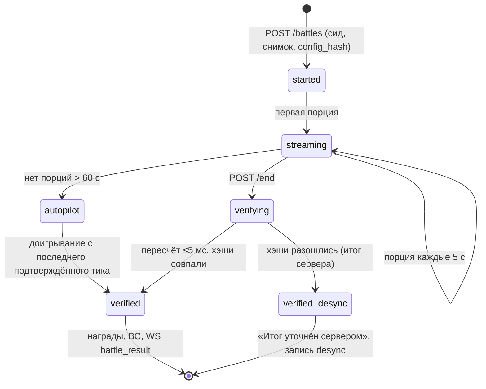

- **Где считать.** По умолчанию пересчёт идёт прямо в обработчике `POST /end` (<5 мс CPU, канон §16.2): игрок получает итог в том же ответе. Переключатель `battle_verify_mode: inline | queue` (§9.5) выносит пересчёт в очередь `battle.verify` при перегрузке API (p95 цикла событий >50 мс) или для долгих боёв. Тогда итог приходит по WS ≤2 с.
- **Что проверяется:** версия `sim` поддерживается; `config_hash` совпадает с выданным при старте; лог парсится; тики монотонны; каждый ввод допустим в момент применения (недопустимый молча отбрасывается так же, как это сделал бы честный клиент, `03` §21.2); реальная длительность в пределах §4.4.
- **Рассинхрон.** Итог сервера авторитетен. В `battles` пишутся `first_desync_tick` и оба хэша. ≥3 рассинхрона за 24 ч дают флаг античита `desync_repeat` (`03` §21.2). Рассинхрон из-за бага `sim` выявляется по кластеру: много игроков, одна `sim_version` и одно устройство. Такой кластер даёт алерт разработке, а не флаги игрокам (ПА).
- **Автоигрок и «Быстрый итог»** считаются на сервере тем же `sim` по запросу `mode: quick`. Клиент получает итог и реплей.
- **Арена.** Атака перепроверяется так же. Снимок обороны соперника фиксируется в `battle_start`, поэтому изменение его Рубежа во время боя ни на что не влияет.

### 7.3. Валидация покупок

| Шаг | Проверка |
|---|---|
| Вебхук RevenueCat | заголовок `Authorization` со статическим секретом из настроек RevenueCat; доступ только с IP RevenueCat (список из их документации) или по секрету; HTTPS |
| Идемпотентность | `rc_event_id` уникален; `store_transaction_id` уникален |
| Подтверждение | для подписок и non-consumable сервер дополнительно запрашивает REST API RevenueCat `GET /subscribers/{app_user_id}` и сверяет права (ПА) |
| Привязка к игроку | `app_user_id = player_id` (RevenueCat `logIn`). Покупка без активного `intent_id` всё равно выдаётся (клиент мог упасть), но помечается `orphan` для аналитики |
| Страна | покупка с витрины RU невозможна (IAP скрыты, канон §15.11). Если она пришла, выдаётся и попадает в алерт (сторы — источник правды о платеже) |
| Возвраты | события `CANCELLATION` с причиной возврата и `EXPIRATION` обрабатываются по `09` §9.8.10 |
| Сверка | ночью: число покупок в `purchases` против отчёта RevenueCat за сутки. Расхождение больше 0,5% даёт алерт (ПА) |

### 7.4. SSV рекламы

Поток — `09` §9.3.6. Инженерные детали:

- **AppLovin MAX** присылает S2S-колбэк GET-запросом с макросами: событие, `custom_data` (= `ad_token`), идентификатор пользователя, плейсмент, сеть, токен события. Сервер проверяет подпись токена события по секретному ключу S2S по схеме из документации MAX (хэш от идентификатора события и ключа). Точная схема фиксируется в коде интеграции и покрывается тестом с эталонными колбэками (ПА: проверить при подключении).
- **AdMob** (`u13`) подписывает SSV ECDSA. Публичные ключи берутся с сервера ключей Google и кешируются на 24 ч.
- **Yandex** (RU): колбэк серверного подтверждения с подписью по секрету приложения (проверить по документации при интеграции).
- **Общие правила:** токен одноразовый, срок показа 15 мин, колбэк принимается до 24 ч (`09`). Кап считается по SSV. Без валидной подписи — 403 и счётчик `ssv_bad_signature`. Повтор `event_id` — 200 без повторной выдачи.
- **Подписчик** (решение 23) получает награду сразу в ответе `POST /v1/ads/token` (`instant: true`), кап тратится так же.

### 7.5. Ограничения частоты

| Класс | Ключ | Лимит (ПА, кроме отмеченного) | Где | При превышении |
|---|---|---|---|---|
| A — аутентификация | IP + `device_id` | 10/мин, 100/ч | Cloudflare Rate Limiting (IP) + API | 429, рост задержки |
| R — чтение | `player_id` | 120/мин | API (in-memory token bucket) | 429 |
| M — мутации | `player_id` | 90/мин, всплеск 20 | API | 429 + счётчик для §7.6 |
| B — бой | `player_id` | старт боя 6/мин; порции 30/мин | API | 429 |
| C — чат | `player_id` | 1 сообщение / 5 с (канон §14.9) | PostgreSQL (`last_msg_at` в строке игрока чата) | отказ «Слишком часто» |
| T — телеметрия | `device_id` | 10/мин, ≤64 КБ | API | молчаливый сброс |
| H — вебхуки | IP провайдера / подпись | 600/мин | API | 429 |
| Реклама | `player_id` | токенов ≤30/сутки (`09` §9.3.6), интервал 20 с | PostgreSQL | `E_CAP` + флаг |

Ограничение в памяти процесса при N экземплярах API приблизительное: каждый экземпляр держит `limit / N`, балансировщик распределяет клиентов равномерно. Это достаточно для защиты от злоупотреблений. Точные лимиты, влияющие на экономику (капы рекламы, офферов, чата), считаются в PostgreSQL.

### 7.6. Детект аномалий

| Правило | Признак | Порог (ПА, кроме отмеченного) | Действие |
|---|---|---|---|
| `desync_repeat` | рассинхроны боёв | ≥3 за 24 ч (`03` §21.2) | флаг, ручная проверка |
| `ad_token_flood` | токенов рекламы | >30 в сутки (`09` §9.3.6) | флаг, выдача только по SSV (как всегда) |
| `ad_multi_device` | токены с двух устройств одного аккаунта одновременно | ≥2 в окне 2 мин | флаг |
| `ssv_without_show` | SSV есть, клиентского события показа нет | >3 за сутки | флаг (вероятная подделка колбэка) |
| `inhuman_input` | Арена: интервал между вводами <80 мс у ≥30% вводов или ровный шаг ±5 мс | 3 боя подряд | флаг, только для Арены |
| `win_rate_impossible` | победы при прогнозе R <0,7 | >40% за 20 боёв (при норме <5%) | флаг, сверка с рассинхронами |
| `arena_win_trading` | пары аккаунтов атакуют друг друга с проигрышем обороны без расстановки | ≥5 взаимных атак за 7 дней | обнуление кубков сделки, флаг |
| `referral_farm` | рефералы с одного отпечатка или подсети | `08` §8.16.5 | без награды |
| `refund_abuse` | возвраты | 2 за 90 дней (`09` §9.8.10) | блок покупок на 30 дней |
| `economy_outlier` | ресурсы за сутки выше модели симулятора | >3σ по когорте УР | флаг (обычно баг; алерт разработке) |
| `tz_hopping` | смена часового пояса | >1 раза за 7 дней | новая зона вступает в силу со следующих 7 суток |
| `device_attestation_fail` | App Check не прошёл | >20% запросов за сутки | флаг; при жёстком режиме — отказ в наградах |

**Скоринг и действия.** Каждое правило добавляет баллы к `anticheat_score`. Порог 50 ставит игрока в очередь ручной проверки (`raivon-admin anticheat queue`), порог 100 ограничивает Арену и выдачу наград рекламы до проверки (ПА). Баны — только после ручного решения владельца. Агент готовит сводку: логи, реплеи, ledger.

### 7.7. Целостность клиента

- **Firebase App Check** (Play Integrity на Android, App Attest на iOS) выдаёт токен, который клиент шлёт в `X-App-Check`. Сервер проверяет его Firebase Admin SDK.
- **Режим на запуске — «наблюдение»** (ПА): непрошедшие запросы считаются, но не отклоняются. Ложные отказы на старых устройствах и эмуляторах не должны ломать игру. После 4 недель статистики включается жёсткий режим для наград рекламы, кейсов и Арены, если доля ложных отказов <0,5%.
- **Root и jailbreak не блокируются** (ПА): сервер авторитетен, поэтому изменённый клиент ничего не получит, а блокировка отнимет игру у честных игроков с кастомными прошивками.

### 7.8. Минимизация данных клиента

- Сервер отдаёт Силу, состав и командиров вражеских армий только в обзоре (`02` §14.1). Вне обзора приходит `null`, и клиент рисует «?».
- Динамическое состояние неоткрытых колец не отдаётся (`02` §14.2).
- Планы ИИ (время и цель удара) приходят только после объявления (за 20 мин, канон §9.11).
- Таблицы выпадения кейсов отдаются полностью, это требование раскрытия шансов (канон §15.4). Сид и состояние RNG сервера не отдаются никогда.

---

## 8. Аккаунты, сохранения, онлайн-only

### 8.1. Модель аккаунта

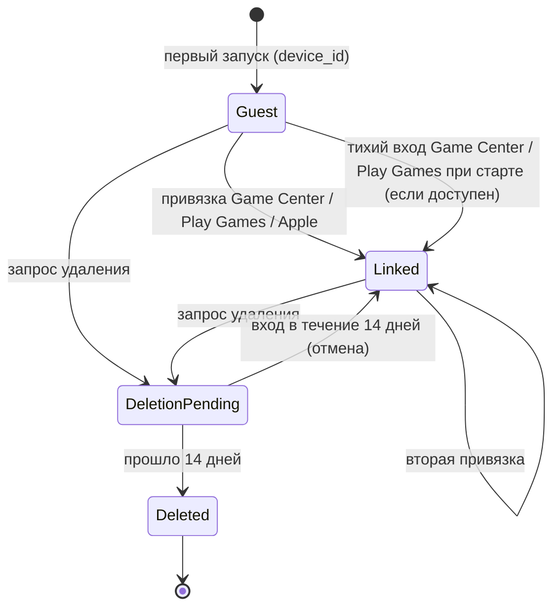

- **Гость** (канон §15.10, §14.3) создаётся мгновенно: клиент генерирует `device_id` (UUIDv4), кладёт его в Keychain / Keystore и вызывает `POST /v1/auth/guest`. Загрузка до карты ≤15 с (канон §14.3), авторизация занимает ≤300 мс.
- **Тихий вход.** Если на устройстве уже есть вход в Game Center или Play Games, клиент при первом запуске получает подтверждение личности и сразу привязывает аккаунт. Окон и вопросов нет. Это защищает от потери прогресса при переустановке (ПА).
- **Ручная привязка** предлагается: после главы I («Сохраните державу»), перед первой покупкой и в настройках. Варианты: Game Center (iOS), Play Games (Android), Sign in with Apple (обе платформы).

| Провайдер | Что присылает клиент | Что проверяет сервер | `provider_uid` |
|---|---|---|---|
| Game Center | `teamPlayerID`, `publicKeyURL`, подпись, соль, метка времени | загружает сертификат по `publicKeyURL` (только домен Apple), проверяет подпись над `teamPlayerID + bundleID + timestamp + salt`, метку не старше 5 мин | `teamPlayerID` |
| Play Games Services v2 | одноразовый server auth code | обменивает код на токен Google OAuth, запрашивает Games API `players/me` | `playerId` |
| Sign in with Apple | identity token (JWT) | подпись по JWKS Apple, `aud` = bundle id, `iss`, срок, `nonce` | `sub` |

**Конфликт привязки.** Провайдер уже привязан к другому аккаунту B. Тогда сервер возвращает `E_CONFLICT` с карточками обоих аккаунтов («Держава А: УР5, глава II, 34 гекса» против «Держава Б: УР2, глава I»). Игрок выбирает, какой оставить на этом устройстве (`POST /v1/auth/link/resolve`). Невыбранный аккаунт не удаляется: он остаётся доступен со своими привязками. Слияния двух держав нет (ПА).

**Несколько устройств.** Аккаунт можно открыть на любом устройстве, но активна одна игровая сессия. Новое подключение WS закрывает старое (`kick: other_device`), старое устройство показывает «Игра открыта на другом устройстве — Продолжить здесь».

**Токены.** Access JWT (EdDSA, 15 мин) содержит `sub = player_id`, `dev = device_id`, `shard` и `age_band`. Refresh-токен действует 60 дней и ротируется при каждом использовании. Повтор уже ротированного токена отзывает всю семью токенов (кража).

### 8.2. Сохранения

- **Единственное сохранение — на сервере.** Каждая подтверждённая команда — это и есть сохранение. Кнопки «Сохранить» нет.
- **Клиентский кеш** — последний снимок в `Filesystem`. Он нужен только для быстрого первого кадра и сразу заменяется ответом `GET /v1/snapshot`. Изменить кеш ради выгоды бессмысленно (T2).
- **Бэкапы БД** — §16.3. Восстановление прогресса конкретного игрока делается по `wallet_ledger` и журналам или из бэкапа на эфемерный сервер с переносом одной строки (runbook `restore-player.md`, ПА).

### 8.3. Перенос на новое устройство

| Ситуация | Как |
|---|---|
| Аккаунт привязан | войти тем же провайдером на новом устройстве: держава загружается целиком |
| Гость, старое устройство на руках | «Настройки → Перенос» → одноразовый код (12 знаков, срок 24 ч, ПА) → ввести на новом устройстве. После переноса старое устройство становится гостем с новой пустой державой |
| Гость, старое устройство потеряно | «Связаться с поддержкой» → `player_id` (виден в настройках и в письмах поддержки) + доказательство: идентификатор покупки из чека стора или название державы с датой создания и УР. Решение принимает владелец по сводке агента (ПА) |
| iOS ↔ Android | работает через Sign in with Apple (на Android — веб-поток Apple, ПА) или код переноса |

### 8.4. Восстановление покупок

- Права (`entitlements`) живут на сервере и приходят с аккаунтом на любое устройство.
- Кнопка «Восстановить покупки» (Настройки, экран Патента) вызывает `Purchases.restorePurchases()`. RevenueCat переносит покупки стор-аккаунта на текущий `app_user_id`, затем `POST /v1/iap/sync` сверяет права (`09` §9.8.10).
- **Перенос покупок между аккаунтами игры** (один стор-аккаунт, две державы): RevenueCat настраивается в режиме «Transfer to new App User ID» (ПА, проверить название настройки). Право non-consumable переходит к аккаунту, который восстановил покупку последним. Купленные Райвиты не переносятся: они уже выданы конкретной державе.

### 8.5. Онлайн-only и переподключение

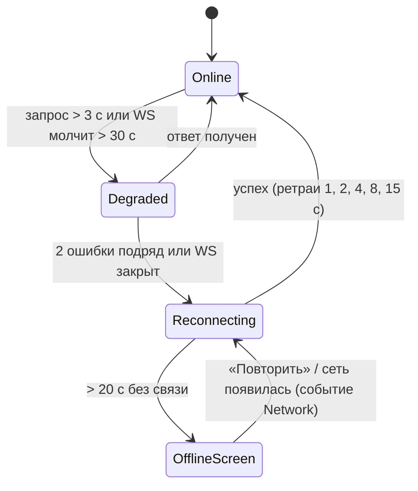

| Состояние | Что видит игрок | Что делает клиент |
|---|---|---|
| `Online` | обычная игра | — |
| `Degraded` | маленький значок сети в HUD; кнопки команд со спиннером | ждёт; новые команды ставит в очередь (≤5) |
| `Reconnecting` | плашка «Восстанавливаем связь…» поверх HUD, карта видна и листается | переподключает WS; после успеха досылает очередь команд с теми же `Idempotency-Key` и запрашивает дельты |
| `OfflineScreen` | полноэкранная заглушка «Нет связи с сервером» с кнопкой «Повторить» (слой 6, `10` §3.3) | таймеры продолжают идти на сервере |
| В бою | бой продолжается локально до 60 с (канон §9.16) | копит порции, досылает их после восстановления. Если связи нет дольше 60 с, сервер доигрывает автопилотом, клиент после возврата показывает итог и реплей (`03` §21.2) |
| Во время церемонии мира | церемония проигрывается до конца, если ответ сервера уже пришёл; иначе петля ожидания (§5.6) | — |

**Время.** Клиент держит смещение `server_offset = server_time − local_time`, обновляет его при каждом ответе (медиана последних 5) и показывает все таймеры от серверных меток. Часы устройства на игру не влияют.

**Сине-зелёный деплой** незаметен: сервер шлёт `reconnect {after_ms: random(0..30 000)}`, клиенты переподключаются к новой версии вразброс. Бои в процессе не страдают: порции принимает любой экземпляр.

---

## 9. Remote config и A/B

### 9.1. Слои конфигурации

Канон §16.3: все конфиги отдаются через собственный remote config с версиями и A/B-когортами. Итоговое значение собирается в таком порядке (каждый следующий слой перекрывает предыдущий):

```
1. базовый бандл content (config_version)
2. рычаги по тирам и гео (09 §9.2.4: капы rewarded, частота офферов)
3. сегмент (платящий, УР, возраст, когорта установки…)
4. вариант эксперимента
5. аварийный оверрайд (kill-switch)
```

- **Сервер** собирает итоговый конфиг игрока при `bootstrap` и при `config_changed` и кеширует его на 10 мин. Серверные правила (капы, цены, офферы) всегда берутся из итогового конфига игрока.
- **Клиент** получает базовый бандл с CDN (`/c/<config_hash>.json.br`, неизменяемый файл) и небольшой персональный оверлей в `bootstrap` (≤4 КБ: варианты, флаги, рычаги).
- **Применение на клиенте** — только вне защищённых состояний. Бой закреплён на `config_hash` своего старта (§4.6).

### 9.2. Версии и публикация

| Шаг | Что происходит |
|---|---|
| 1. PR с изменением YAML | CI: схема, линтеры, ночной симулятор на изменённом конфиге (быстрая версия на PR: 7 дней × 5 профилей, 1 000 боёв) |
| 2. Мерж в `main` | сборка бандла → `config_version + 1`, `config_hash` → запись в `config_versions` со статусом `staged` |
| 3. Публикация | `raivon-admin config publish <ver> --rollout 10` → бандл в R2 → `rollout = 10%` (по хэшу `player_id`) |
| 4. Наблюдение 2 ч (ПА) | автоматические стопы: доля ошибок API +50%, краши клиента +30%, рассинхрон боёв >0,5%, доля рекламы или IAP вне ±20% от вчера → автоматический откат |
| 5. Раскатка | 10% → 50% → 100% |
| Откат | `raivon-admin config rollback` — предыдущая версия активна за ≤5 мин (T9): WS `config_changed` + TTL кешей |

Изменения конфигов, влияющие на деньги и честность (цены, шансы кейсов, капы рекламы, анти-P2W), требуют подтверждения владельца в PR (метка `owner-approved`, ПА). Агент готовит PR с диффом и результатом симуляции.

### 9.3. Когорты и сегменты

`content/data/remote/segments.yaml` описывает сегменты как правила над атрибутами игрока:

| Атрибут | Значения |
|---|---|
| `install_day` | дата установки (локальная) |
| `platform` | ios / android |
| `geo_tier` | T1 / T2 / T3 (`09` §9.2) |
| `store_country` | ISO-код |
| `payer_segment` | non_payer / minnow / dolphin / whale / subscriber (`09` §9.9.1) |
| `dev_level`, `chapter` | 1–10, 1–6 |
| `age_band` | u13 / 13_15 / 16_17 / 18p |
| `language` | 12 языков |
| `days_active_7` | 0–7 |
| `churn_risk` | low / mid / high (`08` §8.15) |

Сегмент вычисляется сервером при `bootstrap` и при смене атрибутов. Клиент правил сегментации не видит.

### 9.4. A/B-движок

```ts
// server/src/remote/experiments.ts
function variantOf(exp: Experiment, pid: PlayerId): VariantId | null {
  if (!exp.active || !matches(exp.audience, attrs(pid))) return null;
  const layerBucket = fnv1a32(exp.layer + ':' + pid) % 10_000;     // слои взаимоисключающи внутри себя
  if (layerBucket < exp.layerRange.from || layerBucket >= exp.layerRange.to) return null;
  const b = fnv1a32(exp.salt + ':' + pid) % 10_000;
  return pickByWeights(exp.variants, b);                             // веса в базисных пунктах
}
```

- **Слои:** `ftue`, `retention`, `monetization`, `ads`, `ui`. Внутри слоя игрок участвует не больше чем в одном тесте. Ограничения «≤3 одновременных теста на этапе воронки» (`08` §8.18.1) и «≤3 теста монетизации на игрока» (`09` §9.18.1) проверяются при публикации эксперимента.
- **Экспозиция.** Событие `exp_exposure` уходит в момент, когда игрок впервые увидел разницу (экран, оффер, ролик), а не при назначении.
- **Холдауты:** постоянный 5% неплатящих без interstitial (канон §15.2) — отдельный слой `holdout_interstitial`. Глобальный холдаут лайв-опс интервенций 10% (`08` Т15).
- **Анализ** — SQL в `tools/dashboards/experiments/` (DuckDB поверх Parquet): доли, средние, CUPED по тратам до теста, винзоризация 99,5% (`09` §9.18.1). Правила остановки: D1 или D7 варианта ниже контроля больше чем на 2 п.п. при набранной выборке (`08` §8.18.1). Отчёт агент генерирует автоматически раз в сутки.
- **Запрещено тестировать** (`08` §8.18.1, `09` §9.18.1). Линтер `content/lint/ab_forbidden.ts` отклоняет эксперимент, если его оверрайд касается: наличия, состава, шансов, гаранта и цен кейсов (`cases.*`); доступности кейсов, паков и косметики; защищённых состояний; жёстких лимитов офферов и пушей; правил анти-P2W (потолки УР, билеты Арены, бонус командира); уведомления о рейде (P0). Ценовые тесты делаются только отдельными product ID (`09` §9.18.1).

```yaml
# content/data/remote/experiments/exp_offensive_120s.yaml — тест канона §2.2 п. 2
id: exp_offensive_120s
layer: retention
status: draft                      # draft → running → stopped → concluded
audience: { install_day_gte: 2026-12-01, chapter_gte: 2 }
layer_range: { from: 0, to: 2000 } # 20% слоя
salt: 7f3a1c
variants:
  - { id: control, weight: 5000 }  # канон: 90 с
  - { id: v120, weight: 5000, override: { combat.offensive_duration_ticks: 1200 } }
primary_metric: offensives_per_dau
guardrails: [d1, d7, session_len_median]
min_days: 14
```

### 9.5. Флаги и kill-switch

| Флаг | По умолчанию | Кто меняет | Назначение |
|---|---|---|---|
| `feature_alliances` | `false` | **только владелец** (подписанная команда, T13) | Альянсы (решение 24) |
| `feature_expeditions` | `false` до v1.1 | агент по roadmap | Походы |
| `feature_chat` | `true` | агент / владелец | аварийное выключение чата целиком или по каналу (`chat_channel_<lang>`) |
| `ads_interstitial_enabled` | `true` | автоматически по правилу холдаута (канон §15.2: D7 −1 п.п.) | interstitial |
| `ads_network_<код>` | `true` | агент | выключить сеть-нарушителя в медиации |
| `offers_popup_enabled` | `true` | агент | всплывающие офферы |
| `push_noncritical_enabled` | `true` | агент | P2–P4. **P0 этим флагом не выключается** (решение 21) |
| `battle_verify_mode` | `inline` | автоматически / агент | §7.2 |
| `app_check_enforce` | `false` | агент | §7.7 |
| `maintenance` | `false` | агент / владелец | режим обслуживания с сообщением и временем |
| `min_app_version`, `min_sim_version` | — | агент при релизе | force update |
| `liveops_event_<id>` | по календарю | агент | досрочно закрыть сломанное событие с компенсацией |

**У кейсов kill-switch нет** (решения 7 и 13: кейсы работают одинаково везде и всегда, включая платное открытие). Если найдена ошибка в шансах (дашборд кейсов, `09` §9.17.3), конфиг откатывается на предыдущую корректную версию `cases.yaml` (≤5 мин, T9). Серверный RNG и экран «i» берут шансы из одного файла, поэтому откат сразу исправляет оба. Пострадавшим игрокам выдаётся компенсация через `admin grant`. Вопрос о допустимости глобальной технической паузы платного открытия — §20.3, вопрос 2.

### 9.6. Безопасность конфигов

- Манифест конфига подписан Ed25519 (ключ публикации в GitHub Environment `production`). Клиент проверяет подпись встроенным публичным ключом, поэтому подменённый CDN-ответ не применяется (ПА).
- Публикация и откат идут только через `raivon-admin` с аудитом в `flag_audit`. Прямых правок в БД нет.
- Флаг `feature_alliances` и изменения денежных конфигов требуют подписи ключом владельца (аппаратный ключ или `ssh-keygen -Y sign` с его машины, ПА). Агент не хранит этот ключ.

---

## 10. Аналитика

### 10.1. Архитектура: одна таксономия, два приёмника

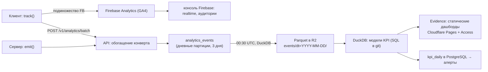

- **Почему не только Firebase.** У стандартного свойства GA4 дневной экспорт в BigQuery ограничен ~1 млн событий в сутки. При 15 тыс. DAU и ~200 событиях на игрока это 3 млн. Кроме того, у GA4 действуют лимиты: 500 имён событий на приложение, 25 параметров на событие, значения до 100 символов. Поэтому **источник правды — собственный конвейер** (OWN), а Firebase получает ≈40 ключевых событий для realtime-контроля и аудиторий (ПА).
- **Серверные события** (экономика, бои, покупки, SSV, кейсы) шлёт только сервер, по факту транзакции. Клиентским утверждениям о деньгах и наградах аналитика не верит.
- **Стоимость:** Parquet ≈60–100 МБ в сутки при 15 тыс. DAU → ~3 ГБ в месяц в R2 (10 ГБ бесплатно), DuckDB и Evidence бесплатны. Конвейер укладывается в бюджет §16.1.

### 10.2. Конверт события

| Поле | Тип | Кто заполняет | Примечание |
|---|---|---|---|
| `event` | string | C/S | имя из реестра |
| `event_id` | UUIDv7 | C/S | дедупликация |
| `ts_client`, `ts_server` | timestamp | C, API | `ts_server` — момент приёма; анализ по `ts_server`, порядок внутри сессии по `seq` |
| `seq` | int | C | счётчик событий устройства |
| `player_id`, `device_id` | UUID | API | из токена; без рекламных ID |
| `session_id` | UUID | C | сессия: передний план ≥10 с, пауза >5 мин начинает новую (`08` §8.19.1) |
| `platform`, `app_version`, `sim_version`, `config_version` | — | C | — |
| `store_country`, `geo_tier`, `language`, `tz` | — | API | — |
| `dev_level`, `chapter`, `days_since_install`, `payer_segment`, `age_band` | — | API | снимок на момент события |
| `exp` | map | API | активные варианты `{exp_id: variant}` |
| `client_state` | enum | C | Free / Battle / Ceremony / FTUE / Recovery (`10` §3.4) |
| `params` | object | C/S | параметры события, ≤25 ключей, имена `snake_case` |

### 10.3. Правила

1. **Реестр** `content/analytics/events.yaml` — единственный источник имён и параметров. Из него генерируются типизированные `track.<event>(params)` для клиента и `emit.<event>(params)` для сервера. Незарегистрированное событие не компилируется. В реестре указаны: владелец (файл GDD), источник C/S, приёмник FB/OWN, частота, выборка.
2. **Имена:** `snake_case`, домен первым словом (`ftue_`, `econ_`, `battle_`, `iap_`…). Имена, предложенные соседними файлами, сохранены. Дубли объединены, исходные имена указаны в таблицах как синонимы.
3. **Никаких персональных данных в параметрах**: ни текста чата, ни названия державы, ни e-mail. Для `u13` и при отказе от согласий рекламные ID не собираются (`09` §9.6.6).
4. **Высокочастотное агрегируется.** Розыгрыши карт и сдвиги камеры не шлются по одному: они сворачиваются в `battle_end` и `map_zoom_dwell`.
5. **Выборка** для технических событий (`perf_sample` 5%, `net_request_failed` 10%) задаётся в реестре и может меняться remote config.

### 10.4. Таксономия событий

Обозначения: **C/S** — источник; **FB** — дублируется в Firebase. Все события идут в OWN.

**10.4.1. Техника, сессии, аккаунт**

| Событие | Параметры | Когда шлётся | Ист. |
|---|---|---|---|
| `app_first_open` | `install_referrer`, `store_country`, `device_class`, `ram_mb` | первый запуск после установки | C, FB |
| `app_start` | `cold`, `native_ms`, `webview_ms`, `bundle_ms`, `auth_ms`, `snapshot_ms`, `first_frame_ms` | старт до первого кадра карты | C |
| `session_start` / `session_end` | `absence_h`, `return_tier` / `len_s`, `timers_open`, `blue_step` (`08`) | начало и конец сессии | C, FB |
| `asset_group_load` | `group`, `bytes`, `ms`, `network`, `from_cache` (`10`) | группа ассетов загружена | C |
| `perf_sample` | `fps_p50`, `fps_p95`, `mem_mb`, `tier`, `economy_mode` (`10`) | раз в 60 с, выборка 5% | C |
| `webgl_context_lost` | `scene`, `restore_ms` | потеря контекста | C |
| `device_unsupported` | `reason` (no_webgl2, low_ram) | экран «Не поддерживается» | C |
| `net_reconnect` | `reason`, `offline_ms`, `in_battle`, `outcome` | выход из `Reconnecting` | C |
| `net_request_failed` | `route_class`, `http`, `code`, `retries` | ошибка после ретраев, выборка 10% | C |
| `force_update_shown` | `current`, `required`, `soft` | экран или баннер обновления | C |
| `config_applied` | `config_version`, `source` (cdn / cache / embedded), `ms` | конфиг применён | C |
| `exp_exposure` | `exp_id`, `variant`, `surface` | первый показ отличия варианта | C/S |
| `auth_link` | `provider`, `result` (linked / conflict / resolved_keep_current / resolved_switch), `silent` | привязка аккаунта | S |
| `account_transfer` | `method` (provider / code / support) | перенос на устройство | S |
| `account_delete_request` / `account_delete_cancel` / `account_deleted` | `source` (app / web), `days_since_install` | удаление аккаунта | S |
| `consent_state` | `age_band`, `ump`, `att`, `us_dns` (`09`) | после потока согласий и при изменении | C |
| `age_gate_submit` | `age_band`, `attempt` | возрастной экран (год рождения не передаётся) | S |
| `ui_screen_view` | `screen`, `from`, `dwell_ms` (`10`) | уход с экрана | C |
| `ui_cta_tap` | `screen`, `cta`, `state` (`10`) | нажатие на основную кнопку | C |
| `gesture_error` | `kind`, `screen` (`10`) | ошибка жеста (`03` §6.5) | C |
| `a11y_setting` | `setting`, `value` (`10`) | смена настройки доступности | C |
| `loc_overflow` | `lang`, `key`, `screen` (`10`) | переполнение строки (только отладочные сборки) | C |
| `ceremony_complete` | `kind` (peace / dl / world / defeat), `duration_ms`, `skipped_x3`, `reduced_motion`, `cosmetics` (`10`; синоним `ceremony_skip_x3` из `02`) | конец церемонии | C, FB |

**10.4.2. FTUE**

| Событие | Параметры | Когда шлётся | Ист. |
|---|---|---|---|
| `ftue_step` | `step`, `t_ms`, `dt_ms`, `attempts`, `assist` (`08`) | завершён шаг из 36 (`08` §8.3) | C, FB |
| `ftue_first_capture` | `t_from_battle_start_ms` | первый захват гекса (живая проверка столпа 2 «30 секунд») | C, FB |
| `ftue_complete` | `choice`, `plunder`, `push` (`08`) | шаг 9:30–10:00 пройден | C, FB |
| `state_named` | `flag_parts`, `name_len` | название и флаг выбраны (текст не передаётся) | C |

**10.4.3. Экономика, здания, армия**

| Событие | Параметры | Когда шлётся | Ист. |
|---|---|---|---|
| `econ_collect_all` | `hours_accum`, `gold`, `food`, `metal`, `oil`, `overflow`, `auto` | «Собрать всё» или автосбор подписки | S |
| `econ_pause_reached` | `resource`, `hours` (`05`) | пул дохода в гексах дошёл до 8 ч | S |
| `econ_treasury_empty_enter` / `_exit` | `upkeep_share`, `duration_min` (`05`) | вход и выход из «Казна пуста» | S |
| `econ_daily_snapshot` | ресурсы, валовой доход/ч, доля апкипа, баланс Райвитов, простой строителей (мин) | ежедневный сброс 04:00 (ПА) | S |
| `building_upgrade_start` / `_finish` / `_cancel` | `bld`, `hex?`, `from`, `to`, `cost`, `duration_s`, `builder_slot` (`05`) | улучшение здания, укрепления, башни | S |
| `dev_level_start` / `dev_level_complete` | `level`, `official_hexes`, `paid_speedup_raivite`, `ad_speedups` (`07`) | Резиденция: старт и завершение | S, FB |
| `speedup_used` | `method` (free / ad / item / raivite / alliance), `timer_kind`, `saved_s`, `raivite` (`05`) | любое ускорение | S |
| `market_exchange` / `trader_buy` | `from`, `to`, `amount`, `rate` / `offer` (`05`) | Рынок | S |
| `mothball_toggle` | `target`, `on` (`05`) | консервация | S |
| `repair_done` | `method` (gold / ad / revenge_pack), `buildings` (`05`) | ремонт | S |
| `plunder_applied` | `side` (victim / winner), `level`, `cap_hit`, `res_lost[]` (`05`) | применено разграбление | S |
| `overflow_burned` | `resource`, `amount` (`05`) | излишек сверх склада сгорел | S |
| `colonization_start` / `_complete` / `_cancel` | `cell_type`, `k`, `cost`, `duration_s` (`02`) | колонизация | S |
| `convoy_dispatch` | `deposit_kind`, `size`, `zone` (own / wild / enemy), `distance`, `rival` (`04` + `02 deposit_dispatch`) | обоз выслан | S |
| `convoy_unload` | `deposit_kind`, `cargo`, `share_of_gross` (`04` + `05 deposit_credited`) | груз зачислен | S |
| `convoy_intercepted` / `deposit_lost_race` | `by`, `cargo_lost` / `deposit_kind`, `winner` (`04`, `02`) | перехват; ИИ забрал залежь первым | S |
| `deposit_spawn_starved` | `zone`, `chapter` (`02`) | не нашлось допустимого места для залежи | S |
| `research_start` / `research_complete` / `blueprint_use` | `line_id`, `level`, `duration_s`, `speedup_source` (`07`) | Академия | S |
| `army_train_enqueue` / `_complete` / `_cancel` | `family`, `dl`, `cost`, `time_s`, `queue_len` (`04`) | тренировка | S |
| `army_refill_start` / `army_refill_done` / `army_refill_instant` | `army_idx`, `from_pct`, `eta_s`, `source` (`04`) | пополнение | S |
| `army_routed` | `army_idx`, `war_id`, `sector`, `commander` (`04`) | армия разбита | S |
| `army_march` / `army_doctrine_set` / `army_squad_transfer` / `army_squad_disband` | по `04` §18.2 | действия с армией | S |
| `commander_unlock` / `commander_level_up` / `commander_assign` | `cmd`, `level`, `source_of_last_shards` (`04`) | командиры | S |

**10.4.4. Война, бой, мир**

| Событие | Параметры | Когда шлётся | Ист. |
|---|---|---|---|
| `war_declared` | `war_id`, `initiator` (player / ai_ultimatum / coalition), `enemy_archetype`, `goal_type`, `goal_value`, `chapter` | старт войны | S, FB |
| `ultimatum_received` / `ultimatum_answered` | `demand` (hex / tribute), `answer` (accept / buyoff / refuse / timeout), `response_min` | ультиматум ИИ | S |
| `battle_start` | `battle_id`, `kind`, `mode` (manual / auto / quick), `war_id`, `armies`, `might_ratio`, `hand[]`, `start_energy`, `ad_start_energy`, `oil_spent` | `POST /battles` принят | S |
| `battle_end` | `battle_id`, `result`, `stars`, `captured`, `lost`, `routed`, `energy_by_card{}`, `forms{}`, `forecast_r_at_commit[]`, `retreat`, `autopilot_from_tick`, `take_control_tick`, `desync`, `verify_ms` | итог после пересчёта | S, FB |
| `battle_desync` | `battle_id`, `first_tick`, `sim_version`, `client_build`, `device_model` | хэши разошлись | S |
| `counterattack_announced` / `counterattack_resolved` | `war_id`, `target_type`, `player_online` / `mode` (live / auto), `result`, `hexes_lost` | удар ИИ: объявление и итог | S |
| `pocket_formed` / `pocket_surrendered` | `side`, `size`, `value` | котёл | S |
| `last_stand_enter` | `war_id`, `control_pct` | Последний рубеж | S |
| `peace_conference_open` | `source` (player / ai_offer / cap / capitulation / rout), `war_score` | открыт пергамент | C |
| `peace_signed` | `war_id`, `outcome` (win / white / defeat / rout), `war_score`, `demands[]`, `hexes`, `cities`, `plunder`, `duration_h`, `offensives`, `leftover_to_opinion` | договор применён | S, FB |
| `peace_offer_received` / `peace_offer_expired` | `war_id`, `control_pct` | предложение мира от ИИ | S |
| `defeat_applied` | `value_lost_pct`, `hexes_lost`, `plunder_level`, `cap_hit`, `protected_share`, `hide_treasury` | поражение игрока применено | S |
| `coalition_forming` / `coalition_war_end` | `members`, `threat` / `outcome`, `separate_peaces` | коалиция | S |
| `diplo_action` | `action` (gift / alliance / call / nap / swap / support), `target_archetype`, `accepted` | 5 дипломатических кнопок | S |
| `threat_band_change` | `from`, `to` (calm / alert / coalition) | шкала «Тревога соседей» сменила зону | S |

**10.4.5. Мир, прогрессия, Арена**

| Событие | Параметры | Когда шлётся | Ист. |
|---|---|---|---|
| `map_zoom_dwell` | `{level: seconds}` за сессию (`02`) | конец сессии | C |
| `chapter_goal_met` / `chapter_goal_lost` | `chapter_id`, `official_hexes`, `days_since_install` (`07`) | цель главы | S |
| `chapter_expand` | `from`, `to`, `stars`, `wars_in_chapter`, `days_in_chapter`, `waited_days` (`07`; синоним `world_expansion_open` из `02`) | «Мир расширяется» | S, FB |
| `chapter_star_complete` / `chapter_star_claim` | `star_id`, `chapter_id` (`07`) | звёзды главы | S |
| `dev_road_open` | `source`, `current_level` (`07`) | экран «Дорога державы» | C |
| `achievement_unlock` / `achievement_claim` | `ach_id`, `days_since_install` (`07`) | «Летопись» | S |
| `content_wall_enter` | `chapter_id`, `days_since_install`, `payer_segment` (`07`) | игрок упёрся в конец доступного контента | S |
| `arena_calibration_done` | `stars_total`, `cups` (`07`) | 5 калибровочных боёв | S |
| `arena_match_found` | `opponent_kind` (player / militia / revenge), `wait_ms`, `cups_diff` | подбор | S |
| `arena_attack` | `stars`, `cups_delta`, `opponent_kind`, `league`, `ticket_source` (`07`) | итог атаки | S, FB |
| `arena_defense_result` | `stars_conceded`, `cups_delta`, `attacker_league` | на Рубеж игрока напали | S |
| `arena_fort_edit` | `forts`, `towers`, `template` | Рубеж сохранён | S |
| `arena_league_change` / `arena_season_reward` / `arena_shop_buy` | по `07` §14.2 | лиги, сезон, магазин | S |
| `expedition_start` / `expedition_end` | `week`, `bracket`, `share`, `rank_in_cohort`, `restarts` (`07`, v1.1) | Походы | S |
| `prestige_view` / `prestige_confirm` | `era`, `stars_gained`, `glory_total` (`07`, v2.0) | престиж | S |
| `clan_*` | `create`, `join`, `leave`, `kick`, `help_given`, `donation`, `quest_tier` (`07`) | только при `feature_alliances = true` | S |

**10.4.6. Монетизация, реклама, кейсы**

| Событие | Параметры | Когда шлётся | Ист. |
|---|---|---|---|
| `store_open` | `surface`, `tab` | открыт магазин | C |
| `iap_intent` / `iap_started` / `iap_granted` / `iap_pending` / `iap_failed` / `iap_refund` / `iap_restore` | `sku`, `offer_id`, `price_usd`, `local_price`, `currency`, `storefront`, `first_of_sku`, `intent_id`, `txn_id` (`09`) | этапы покупки; `iap_granted` и `iap_refund` — по вебхуку | C/S, FB (`iap_granted` как `purchase`) |
| `offer_eligible` / `offer_shown` / `offer_listed` / `offer_declined` / `offer_purchased` / `offer_expired` | `trigger`, `sku`, `rung`, `template`, `score`, `surface`, `decline_streak` (`09`) | движок офферов | S/C |
| `spend_limit_set` / `spend_limit_block` | `amount`, `currency`, `cooldown_until` (`09`) | Лимит трат | S |
| `raivite_earn` / `raivite_spend` | `source` / `sink`, `amount`, `balance_after`, `paid_share` (`09`) | каждое движение Райвитов (зеркало `wallet_ledger`) | S |
| `corridor_step` | `week`, `ad_share`, `cap_mult`, `offer_mult`, `action` (`09`) | шаг контроллера 50/50 | S |
| `sub_state` | `from`, `to`, `trial`, `store`, `grace` (`09`) | смена состояния подписки | S, FB |
| `pass_level` / `pass_purchase` / `pass_claim` / `pass_overlevel_chest` | `level`, `track`, `days_into_season` (`09`) | пасс | S |
| `pass_xp_daily` | `{source: amount}` | агрегат опыта пасса за сутки (вместо `pass_xp` на каждое начисление, ПА) | S |
| `ad_token_issued` / `ad_show_start` / `ad_show_fail` / `ad_closed_early` / `ad_ssv_received` / `ad_reward_granted` / `ad_reward_sub_claim` / `ad_goodwill_grant` | `placement`, `tier`, `network`, `latency_ms`, `reason`, `cap_left`, `soft_cap_left` (`09`) | этапы rewarded | C/S |
| `ad_impression_revenue` | `format` (rewarded / interstitial), `placement`, `network`, `revenue_usd`, `precision` (`onAdRevenuePaid` MAX) | каждый показ рекламы (ПА: нужно для ARPDAU рекламы) | C, FB (`ad_impression`) |
| `interstitial_shown` / `interstitial_skipped` | `placement`, `reason`, `active_s_since_last` (`09`) | interstitial | C/S |
| `case_open` | `case`, `source` (raivite / key / free / ad), `result_item`, `rarity`, `since_epic`, `since_leg`, `x10`, `target` (`09`; синоним `crate_opened` из `08`) | открытие кейса на сервере | S, FB |
| `case_open_view` | `case`, `skipped`, `odds_viewed_before` (`10`) | экран раскрытия закрыт | C |
| `case_odds_view` | `case` | открыто окно «i» | C |
| `pity_triggered` / `target_set` / `collection_open` | `case`, `kind`, `cmd` (`09`) | гарант, «Цель», коллекция | S |
| `glitter_earned` / `workshop_buy` / `atelier_buy` / `cos_preview` / `cos_equip` | `item`, `rarity`, `amount`, `price` (`09`) | косметика | S/C |

**10.4.7. Удержание, лайв-опс, пуши, социалка**

| Событие | Параметры | Когда шлётся | Ист. |
|---|---|---|---|
| `daily_order_assigned` / `daily_order_done` / `daily_order_replaced` / `daily_orders_all_done` | `order_id`, `slot`, `difficulty`, `free` (`08`) | «Приказы дня» | S |
| `weekly_task_done` / `weekly_chest_claimed` | `task_id`, `stage` (`08`) | неделя | S |
| `calendar_claimed` | `cycle`, `day`, `doubled`, `method` (`08`) | календарь входа | S, FB |
| `event_entered` / `event_tokens` / `event_milestone` / `event_shop_buy` / `event_rank_final` | `evt`, `cohort_id`, `source`, `amount`, `idx`, `item`, `rank`, `cohort_size` (`08`) | события | S |
| `while_away_view` / `return_gift_claimed` | `absence_h`, `tier`, `skipped_at` (`08`) | возврат | C/S |
| `churn_score` / `intervention_fired` | `score`, `tier`, `reasons[]`, `holdout` / `type` (`08`) | предиктор оттока | S |
| `push_scheduled` / `push_sent` / `push_suppressed` / `push_opened` | `type`, `cls`, `reason` (`08`) | планировщик пушей | S/C |
| `push_permission` | `stage`, `result` (`08`) | запрос разрешения | C, FB |
| `push_p0_banner` | `type`, `delay_min` | P0 доставлен баннером при входе (T11) | C |
| `friend_added` / `compare_view` / `leaderboard_view` | `method`, `board` (`08`) | друзья, рейтинги | S/C |
| `timelapse_generated` / `timelapse_shared` | `duration_s`, `snapshots`, `channel` (`08`) | Таймлапс | C, FB (`share`) |
| `referral_code_entered` / `referral_granted` | `code_owner` (хэш) (`08`) | рефералы | S |
| `chat_message_sent` | `channel_lang`, `len`, `filtered` | сообщение принято (без текста) | S |
| `chat_report` / `chat_block` / `chat_automute` / `chat_moderation` | `reason`, `action`, `model_score` | модерация (канон §14.9) | S |
| `anticheat_flag` | `rule`, `score`, `action` | сработало правило §7.6 | S |

Итого в реестре ≈200 имён событий (семейства развёрнуты), из них ≈40 дублируются в Firebase. Среднее число событий на DAU — ≈150–250 (ПА, проверяется на закрытом тесте).

### 10.5. Пользовательские свойства (Firebase и OWN)

`dev_level`, `chapter`, `payer_segment`, `geo_tier`, `age_band`, `language`, `install_cohort_week`, `sub_active`, `pass_premium`, `arena_league`, `push_enabled`, `consent_ads` — 12 из 25 допустимых в GA4.

### 10.6. Качество данных

- **Дедупликация** по `event_id` при экспорте в Parquet.
- **Опоздавшие события** (до 72 ч после события, например после офлайна) попадают в партицию по `ts_server`. Модели KPI пересчитывают последние 3 дня.
- **Валидация:** API отбрасывает событие, если оно не прошло схему реестра, и увеличивает счётчик `analytics_invalid{event}`. Доля невалидных >0,1% даёт алерт.
- **Тестовые аккаунты** (`accounts.is_test`, сборки `debug`, устройства владельца) исключаются из KPI.
- **Сверка источников:** `iap_granted` (OWN) против отчёта RevenueCat; `ad_impression_revenue` против отчёта MAX за сутки. Расхождение >3% даёт алерт.

### 10.7. Транспорт на клиенте

- Очередь событий хранится в памяти и зеркалится в `Filesystem` (≤2 000 событий, ПА), чтобы не терять события при падении.
- Отправка — раз в 30 с, или при 50 событиях, или при сворачивании приложения. Пачка ≤64 КБ, gzip.
- При ошибке пачка остаётся в очереди. Самые старые технические события вытесняются первыми, денежные и серверные клиент не шлёт вовсе.

---

## 11. Дашборды и KPI

### 11.1. KPI

Целевые значения — канон §17 (retention D1/D7/D30/D90, сессии, ARPDAU, доля 50/50, конверсия, FTUE и т. д.). Дополнительные KPI — `08` §8.19.1 и `09` §9.17.1. Здесь задаются **однозначные определения** для SQL-моделей `tools/dashboards/models/`:

| KPI | Определение (ПА, согласовано с `08` §8.19.1) |
|---|---|
| Dn | доля установивших в игровые сутки X (граница 04:00 местного), у кого был `session_start` в сутки X + n. Параллельно считается Dn по 24-часовым окнам для сравнения с рынком |
| DAU / MAU | уникальные `player_id` с `session_start` за сутки / за 28 дней (без `is_test`) |
| Сессия, длина, сессий в день | по `session_start` / `session_end` (`08`) |
| ARPDAU gross | (Σ `iap_granted.price_usd` − Σ `iap_refund` + Σ `ad_impression_revenue.revenue_usd`) / DAU |
| Доля рекламы | реклама / (реклама + IAP gross) по неделе UTC (`09` §9.2.3) |
| Rewarded на DAU | Σ `ad_reward_granted` (без `ad_reward_sub_claim`) / DAU |
| Конверсия к D30 | доля когорты установки с ≥1 `iap_granted` за 30 суток |
| FTUE | `peace_signed` в FTUE / `app_first_open`; `ftue_complete` / `app_first_open`; `push_permission.result = granted` / дошедшие до шага |
| Наступлений в день | `battle_start.kind = offensive` / DAU |

```sql
-- tools/dashboards/models/retention_dn.sql (DuckDB, Parquet в R2)
WITH installs AS (
  SELECT player_id, min(game_day) AS d0 FROM events WHERE event = 'app_first_open' AND NOT is_test GROUP BY 1
), active AS (
  SELECT DISTINCT player_id, game_day FROM events WHERE event = 'session_start'
)
SELECT d0, count(*) AS installs,
       avg((EXISTS (SELECT 1 FROM active a WHERE a.player_id = i.player_id AND a.game_day = i.d0 + 1))::int) AS d1,
       avg((EXISTS (SELECT 1 FROM active a WHERE a.player_id = i.player_id AND a.game_day = i.d0 + 7))::int) AS d7
FROM installs i GROUP BY d0 ORDER BY d0;
```

### 11.2. Дашборды как код

Все дашборды — страницы Evidence (Markdown + SQL) в `tools/dashboards/pages/`. Сборка идёт ночью и каждый час в неделю запуска, деплой — на Cloudflare Pages за Cloudflare Access (вход владельца по e-mail, бесплатно до 50 пользователей). Агент меняет дашборд обычным PR (ПА).

| # | Дашборд | Содержание | Владелец содержания |
|---|---|---|---|
| B1–B7 | Удержание: когорты, воронка FTUE, ритм, пуши, лайв-опс, возврат и отток, социалка | `08` §8.19.3 | `08` |
| M1–M10 | Монетизация: выручка и 50/50, реклама, interstitial и холдаут, IAP, офферы, кейсы, пасс и Патент, Райвиты, соответствие, анти-P2W | `09` §9.17.3 | `09` |
| G1 | Прогрессия: время до УР и глав, стена контента, метрики эндгейма | `07` §13.3 | `07` |
| G2 | Баланс войны: винрейт карт и командиров, распределение R при приказе, звёзды, исходы войн, доля поражений (≤25%, канон §16.5 п. 3) | `03`, `11` | здесь |
| T1 | Операции: RPS, p95/p99 по маршрутам, ошибки, очереди pg-boss (глубина, задержка), WS-соединения, нагрузка БД | Grafana | здесь |
| T2 | Здоровье клиента: crash-free, ANR, JS-ошибки по отпечаткам, старт, FPS, потери контекста WebGL, по версиям и устройствам | Crashlytics + OWN | здесь |
| T3 | Бои и `sim`: доля рассинхронов по `sim_version` и устройствам, время пересчёта, доля автопилота, обрывы | OWN | здесь |
| T4 | Античит: флаги по правилам, очередь проверки, App Check | OWN | здесь |
| T5 | Стоимость: расходы по сервисам против бюджета $100, прогноз месяца, стоимость на DAU | счета + метрики | здесь |
| T6 | Война запуска: всё самое важное на одном экране в дни раскатки (§18.6) | сводный | здесь |

### 11.3. Алерты

| Уровень | Пример | Канал | Реакция |
|---|---|---|---|
| P0 | API недоступен >2 мин; ошибок >5%; БД недоступна; P0-пуш не доставлен; расхождение шансов кейсов p < 0,001 | Telegram-бот владельцу + звонок через приложение мониторинга (ПА) + GitHub issue с меткой `incident` | автодействия (откат конфига, kill-switch), runbook, агент разбирает issue |
| P1 | p95 API >400 мс 10 мин; очередь `world.wake` отстаёт >5 мин; crash-free <99%; доля рекламы вне 45–55% две недели (`09`) | Telegram + issue | в течение рабочего дня |
| P2 | метрики дашбордов ниже минимума канона §17 | ежедневная сводка | анализ в планировании |

Ежедневная сводка (08:00 по времени владельца, ПА): DAU, установки, D1/D7 свежих когорт, выручка по каналам, доля 50/50, crash-free, инциденты, стоимость. Агент шлёт её в Telegram и пишет в `docs/ops/daily/` в виде Markdown.

---

## 12. Краш-репорты и перф-мониторинг

### 12.1. Клиент

| Что | Инструмент | Детали |
|---|---|---|
| Нативные падения, ANR (Android) | Firebase Crashlytics | dSYM загружаются из CI (iOS), mapping-файлы R8 (Android) |
| Падение процесса WebView (Android `onRenderProcessGone`) | свой обработчик в `MainActivity` (ПА) | WebView пересоздаётся, игра перезапускается с экрана загрузки, событие в Crashlytics как non-fatal |
| JS-ошибки | `window.onerror`, `unhandledrejection`, ошибки PixiJS → `POST /v1/telemetry/errors` | стек минифицированного бандла. Source maps не уходят в клиент: они лежат в приватном бакете R2 по `app_version`. Ночная задача символизирует стеки библиотекой `source-map`, группирует их по отпечатку (тип + 3 верхних кадра) и открывает GitHub issue на новые отпечатки с ≥20 пользователями |
| Перф | `perf_sample`, `app_start`, `asset_group_load` (§10.4.1) | разрезы по `device_model`, `tier`, `app_version` |
| Android vitals | Play Console | ориентиры Google по «плохому поведению»: сбои, заметные пользователю, ≥1,09%, ANR ≥0,47% (проверить актуальные пороги) |
| Метрики стора iOS | App Store Connect (Xcode Organizer) | падения, зависания, энергопотребление |

**Ворота релиза** (ПА): crash-free сессий ≥99,5% и ANR <0,47% на внутреннем и закрытом треке за 48 ч. Для раскатки обновления в проде: crash-free не хуже предыдущей версии больше чем на 0,2 п.п. Иначе раскатка ставится на паузу (Google Play позволяет остановить поэтапную раскатку, iOS — приостановить поэтапный выпуск).

### 12.2. Сервер

| Слой | Инструмент | Что |
|---|---|---|
| Метрики | `prom-client` в каждом процессе → Grafana Alloy-агент → Grafana Cloud Free (лимиты бесплатного тарифа: ~10 тыс. серий, 14 дней хранения — проверить) | RPS, латентность по маршрутам, ошибки, цикл событий Node (`eventLoopUtilization`), глубина и возраст очередей pg-boss, WS-соединения, время пересчёта боя, SSV-задержка |
| БД | `postgres_exporter` | соединения, TPS, кеш-попадания, блокировки, автовакуум, размер таблиц, задержка WAL-архивации |
| Хосты | `node_exporter` | CPU, RAM, диск, сеть |
| Логи | pino JSON → journald → Alloy → Grafana Loki (Free) | `request_id`, `player_id`, маршрут, длительность, код ошибки. Без персональных данных и без текста чата |
| Внешняя доступность | бесплатный внешний мониторинг (UptimeRobot или Better Stack) по `GET /healthz` через Cloudflare, интервал 1 мин | — |
| Трассировка | OpenTelemetry — по необходимости после 5 тыс. CCU | — |

**SLO** (ПА):

| SLO | Цель |
|---|---|
| Доступность API (успешные ответы без 5xx, по месяцу) | ≥99,5% |
| p95 латентности мутаций / чтений | ≤200 / ≤120 мс на сервере (без RTT) |
| p99 пересчёта боя в запросе | ≤50 мс |
| Доставка P0-пуша от `due_at` | ≤60 с для 99% |
| Отставание `world.wake` | ≤60 с p99 |
| RPO / RTO | ≤5 мин / ≤2 ч (§16.3) |

---

## 13. CI/CD

### 13.1. Конвейер

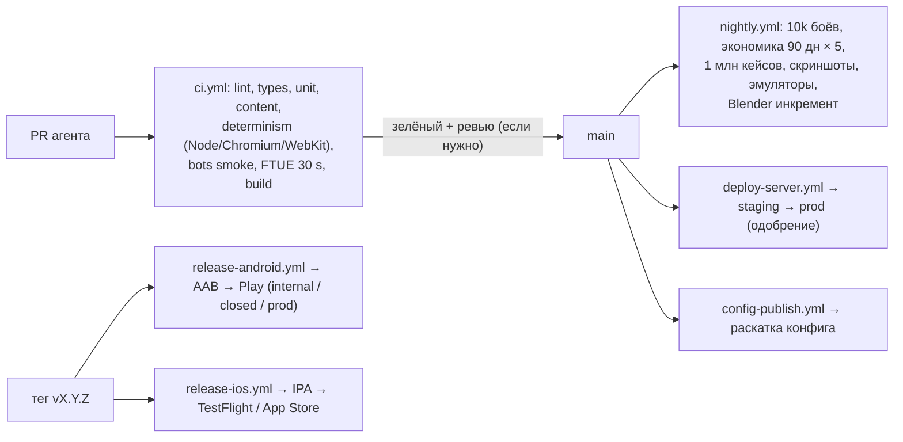

### 13.2. Workflow GitHub Actions

| Workflow | Триггер | Шаги | Время (ПА) | Блокирует |
|---|---|---|---|---|
| `ci.yml` | каждый PR | `pnpm install --frozen-lockfile` (кеш); ESLint, Prettier, `tsc -b`; `dependency-cruiser`; Vitest всех пакетов; валидация и линтеры контента; детерминизм на корпусе (Node + Playwright Chromium + WebKit); property-тест 1 000 логов; 500 боёв бот-против-бота (smoke); экономика 7 дней × 5 профилей (smoke); headless FTUE и тест «30 секунд» (канон §16.5 п. 4); интеграционные тесты сервера (testcontainers PostgreSQL 16); сборка web-бандла и проверка размера (≤60 МБ первого бандла); `pnpm bench:sim` | ≤15 мин | мерж |
| `nightly.yml` | 02:00 UTC | 10 000 боёв бот-против-бота с коридорами винрейта; экономический симулятор 90 дней × 5 профилей с анти-P2W приёмкой (канон §15.9 п. 7); 1 млн открытий кейсов против `cases.yaml` (канон §15.4); корпус детерминизма на Android-эмуляторах (API 30, 35) и симуляторе iOS; скриншот-тесты 12 языков × 5 экранов (`10` §15.5); перф-сцены (`10` §16.3) в Chromium с троттлингом CPU; Blender-инкремент и QA K1–K9 (`10` §11.9) | 1–3 ч на эфемерном сервере (§13.4) | публикацию конфига и релиз, если упало |
| `deploy-server.yml` | мерж в `main` (staging), ручной запуск с одобрением (prod) | сборка Docker-образа → GHCR; миграции expand (только добавляющие); сине-зелёная выкладка по SSH: поднять `green`, health-check, переключить Caddy, `reconnect` клиентам, через 10 мин остановить `blue`; contract-миграции — отдельным релизом | ~6 мин | — |
| `config-publish.yml` | мерж изменений `content/` | сборка бандла, подпись, загрузка в R2, `staged` → раскатка по §9.2 | ~3 мин | — |
| `release-android.yml` | тег `v*` или ручной запуск | Docker-образ сборки (JDK 21, Android SDK cmdline-tools, Gradle-кеш); `vite build` → `npx cap sync android` → `./gradlew bundleRelease` (R8); подпись **ключом загрузки** (Play App Signing хранит ключ приложения); загрузка mapping в Crashlytics; публикация в трек через Google Play Developer API (сервисный аккаунт, fastlane `supply`) | ~20 мин | — |
| `release-ios.yml` | тег `v*` или ручной запуск | macOS-раннер (Xcode из `.tool-versions`); `npx cap sync ios`; `xcodebuild archive` с автоматической подписью через ключ App Store Connect API (`-allowProvisioningUpdates` + `-authenticationKey*`); экспорт IPA; загрузка dSYM в Crashlytics; загрузка в TestFlight (fastlane `pilot`) | ~25 мин | — |
| `blender-full.yml` | ручной запуск или изменение `tools/blender/core/` / `VERSION` | §14.2 | 2–10 ч | — |
| `restore-drill.yml` | раз в неделю | §16.3 | ~40 мин | алерт |

### 13.3. Ветки, версии, релизы

- **Trunk-based:** короткие ветки агента → PR → `main`. Релиз — тег `vX.Y.Z` на `main`. Hotfix — ветка `release/X.Y` от тега с черри-пиком.
- **Номер сборки** = `GITHUB_RUN_NUMBER` (монотонный и для iOS, и для Android).
- **Ритм обновлений** — раз в 2–4 недели (канон §19.1). Между ними правки идут конфигом без обновления клиента.
- **Скорость исправлений:** конфиг — минуты; сервер — до часа; клиент — 1–3 дня с ревью сторов (ускоренное ревью Apple только для критических багов).
- **Поэтапная раскатка обновлений:** Google Play — staged rollout 10% → 25% → 50% → 100% (ПА: шаг раз в 24 ч при зелёных воротах §12.1); iOS — поэтапный выпуск на 7 дней (1 → 2 → 5 → 10 → 20 → 50 → 100%, только для автообновлений). Про первую публикацию см. §18.6.

### 13.4. Где выполняется тяжёлое

| Задача | Где | Почему |
|---|---|---|
| PR-CI | GitHub-hosted Linux, 4 vCPU | быстрый старт, кеш |
| Ночные симуляции, корпус на эмуляторах, скриншоты | эфемерный сервер Hetzner (выделенные 8–16 vCPU, почасовая оплата) создаётся из workflow через `hcloud`, работает 1–3 ч и удаляется (ПА) | ≈$0,2–0,6 за ночь вместо тысяч минут Actions |
| Android-эмулятор | GitHub-hosted Linux с KVM (`reactivecircus/android-emulator-runner`) | KVM доступен на стандартных Linux-раннерах |
| iOS-сборка и симулятор | GitHub-hosted macOS; запасной путь — MacBook владельца как self-hosted runner с меткой `raivon-mac` (только `workflow_dispatch` из `main`, только приватный репозиторий) | минуты macOS в Actions дороже Linux (на бесплатной квоте приватного репозитория — с множителем), поэтому iOS собирается только по тегам и ночью (≤1 раз в сутки, ПА) |

**Ориентир стоимости CI** (ПА, тарифы GitHub меняются, сверить при настройке): PR-CI ~60 PR в месяц × 15 мин = 900 мин Linux; iOS ~20 сборок × 25 мин macOS; эфемерные серверы ~$10 в месяц. При исчерпании бесплатной квоты Linux-минуты стоят порядка $0,006–0,008 за минуту. Итого CI ≈$10–20 в месяц, учтено в §16.1.

### 13.5. Подпись и секреты

| Секрет | Где хранится | Доступ |
|---|---|---|
| Android upload key (`.jks`) + пароли | GitHub Environment `release` | workflow релиза Android; копия у владельца офлайн |
| Сервисный аккаунт Google Play (JSON) | Environment `release` | публикация в треки |
| Ключ App Store Connect API (`.p8`, Key ID, Issuer ID) | Environment `release` | подпись и TestFlight |
| APNs-ключ (`.p8`) | только в консоли Firebase | FCM |
| RevenueCat: API-ключ сервера, секрет вебхука | Environment `production` + `.env` на сервере (systemd credentials) | сервер |
| AppLovin MAX: SDK key (в клиенте, публичный), ключ S2S (секрет) | ключ S2S — `production` | сервер |
| Firebase Admin (сервисный аккаунт) | `production` | App Check, FCM |
| PostgreSQL, R2, Hetzner API, Cloudflare API | `production` | деплой, бэкапы |
| Ключ подписи конфигов (Ed25519) | `production`, публичная часть в клиенте | `config-publish` |
| Ключ владельца для флагов и денежных конфигов | у владельца, вне GitHub | подпись команд (§9.6) |

Окружение `production` требует ручного одобрения владельцем для деплоя сервера и публикации в стор (required reviewers, ПА). Staging выкладывается автоматически. В репозитории включены secret scanning и push protection.

---

## 14. Пайплайн Blender в CI

Что и как рендерится (киты, ступени, настройки Eevee и Cycles, постобработка, атласы KTX2, именование, QA K1–K9) — `10` §11. Здесь — инфраструктура.

### 14.1. Каноническое окружение

- **Docker-образ** `ghcr.io/<org>/raivon-blender:<blender_version>-<rev>`: Blender LTS (версия из `tools/blender/VERSION`), Mesa (EGL, llvmpipe), Python-зависимости упаковщика (MaxRects, Basis Universal `basisu`), шрифты. Образ собирается workflow `blender-image.yml` при смене версии.
- **Канонический рендерер — CPU в этом образе** (ПА): Eevee через EGL на llvmpipe, запасной — Cycles CPU (`10` §11.6). Все спрайты, которые попадают в игру, рендерятся в одном и том же окружении, поэтому инкрементальные и полные прогоны дают совместимые пиксели. GPU-рендер (например, Metal на MacBook) разрешён только для черновых превью, не для атласов.
- **Детерминизм** (`10` §11.6 K1): фиксированные версия, сиды, число потоков (`-t 4`), порядок объектов. Допуск K1 покрывает различия JIT llvmpipe между моделями CPU.

### 14.2. Инкрементальная и полная сборка

| Режим | Когда | Где | Объём и время (ПА) |
|---|---|---|---|
| Инкремент | PR меняет `kits/<kit>/**`, `palettes/`, `stages/*.yaml` | GitHub-hosted Linux, матрица до 4 джобов | один кит ≈30–300 спрайтов × ~20–30 с на CPU ≈ 10–40 мин |
| Ночной QA | каждую ночь | эфемерный сервер (§13.4) | только изменённое + K1–K9 по затронутым китам |
| Полная пересборка | смена версии Blender, `core/`, настроек рендера | эфемерный Hetzner на 16 выделенных vCPU, 4 процесса Blender параллельно | ≈5 000 спрайтов hi (`10` §11.11) × ~30 с / 4 ≈ 10 ч ≈ $3–6 за прогон |

### 14.3. Кеш

- **Ключ** спрайта: `sha256(kit.py + stage.yaml + core/** + VERSION + render settings + образ)` (`10` §11.11).
- **Хранилище:** приватный бакет R2 `raivon-art-cache/<key>/{color,mask,shadow}.png` + метаданные. Workflow сначала спрашивает кеш, рендерит только промахи и дозаписывает результат.
- **Атласы** собираются из кеша детерминированно (стабильная сортировка по имени ассета) и публикуются в CDN по хэшу содержимого (`/a/<sha256>.ktx2`). Манифест групп `grp_*` входит в конфиг (§5.7), поэтому новые атласы раскатываются и откатываются вместе с `config_version`.
- **В git** лежат только исходники (`kit.py`, YAML) и эталоны QA `qa/golden/` в разрешении `lo` (≈10–20 МБ, ПА). Сгенерированные атласы в git не хранятся.

### 14.4. Проверки в PR

Изменённые спрайты прикладываются к PR как артефакт: контактный лист PNG «было / стало» на 48 px и в полном размере. Агент видит результат картинкой, а владелец может посмотреть его в браузере. K1–K9 — блокирующие проверки.

---

## 15. Локализация (пайплайн)

Правила текстов (плейсхолдеры ICU, род и число, переносы CJK, бюджеты длины, псевдолокаль `qps`, скриншот-тест) — `10` §15. 12 языков MVP — канон §12.7. Здесь — конвейер.

### 15.1. Файлы

```
content/data/localization/
  glossary.yaml          # термины канона по языкам (Райвиты → Raivites, Ультразабор…), запреты
  en.yaml  ru.yaml       # исходники: EN — основной, RU — второй эталон (10 §15.1)
  es.yaml pt-BR.yaml fr.yaml de.yaml it.yaml tr.yaml id.yaml ja.yaml ko.yaml zh-Hant.yaml
  _meta.yaml             # для каждого ключа: context, screen, max_width_pt, short, source_hash
store/<lang>/            # тексты стор-листингов (fastlane metadata)
legal/<lang>/            # политика конфиденциальности и условия (EN — юридически значимый)
```

### 15.2. Конвейер

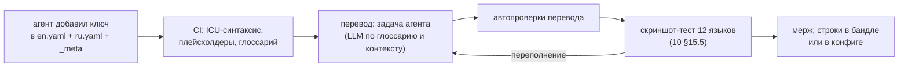

| Шаг | Детали |
|---|---|
| Хэш исходника | у каждого ключа есть `source_hash` EN. При изменении EN перевод помечается устаревшим, и CI требует обновить его до релиза (до этого в игре показывается EN) |
| Перевод | агент переводит пачками по экранам с контекстом: скриншот, `max_width_pt`, глоссарий, род и число имён (канон §16.4: «LLM по глоссарию»). Отдельного платного API не требуется: это работа агента в сессии (ПА) |
| Автопроверки | плейсхолдеры и plural-формы совпадают с EN; термины глоссария использованы; нет запрещённых слов; длина ≤ бюджета `10` §15.2; нет латиницы там, где её быть не должно (JA/KO/ZH, кроме кодов) |
| Обратный перевод | для JA, KO, ZH-Hant, TR и ID — выборочный обратный перевод на EN и сравнение смысла второй моделью (ПА) |
| Носители | перед закрытым тестом — выборочная вычитка носителями JA, KO, ZH-Hant (≈1 500 строк на язык, вопрос 6 в §20.3). На закрытом тесте игроки могут пожаловаться на строку: долгое нажатие в режиме отладки перевода |
| Доставка | строки UI лежат в бандле. Тексты событий, офферов и пушей приходят в конфиге, поэтому исправление опечатки не требует обновления клиента |
| Серверные строки | пуши формирует сервер по `locale` игрока из тех же YAML (`08` §8.13.4) |
| Сторы | листинги на 12 языках, скриншоты рендерятся фоторежимом headless-клиента на каждом языке (`10` §11.12) |
| Юридические тексты | EN-оригинал утверждает владелец (юрист по желанию). Переводы делает агент с пометкой «при расхождении действует английская версия» |

---

## 16. Хостинг $100/мес и масштабирование

### 16.1. Стартовая конфигурация (~1–2 тыс. CCU, решение 14)

| Статья | Конфигурация | $/мес (ориентир, ПА; цены на дату заказа сверить) |
|---|---|---|
| `app-1` | Hetzner Cloud CCX23: 4 выделенных vCPU, 16 ГБ RAM, 160 ГБ NVMe; Германия (FSN1/NBG1). Caddy, `api` ×3 (по 1,5 ГБ кучи), `worker` ×2, `scheduler`, агент метрик | ≈30 |
| `db-1` | Hetzner Cloud CCX23 + опция бэкапов Hetzner (+20%); PostgreSQL 16, WAL-G | ≈36 |
| Сеть | приватная сеть Hetzner, Cloud Firewall (443 только с IP Cloudflare; SSH по ключу с allowlist; БД — только приватная сеть), 2 × IPv4 | ≈1–2 |
| Cloudflare Free | DNS, прокси, CDN, WAF (базовые правила), 1 правило ограничения частоты, Pages, Access (≤50 пользователей) | 0 |
| Cloudflare R2 | ассеты и конфиги (без платы за исходящий трафик), Parquet аналитики, бэкапы БД, кеш Blender: ~50–100 ГБ | ≈1–3 |
| Мониторинг | Grafana Cloud Free, внешний аптайм-монитор (бесплатный тариф), Telegram-бот | 0 |
| Firebase | Analytics, Crashlytics, FCM, App Check (бесплатные лимиты) | 0 |
| Домен | — | ≈1 |
| CI и эфемерные серверы | §13.4, §14.2, §16.3 | ≈10–20 |
| **Итого** | | **≈80–95**, резерв $5–20 |

- **Не входят в $100** (процент с выручки или разовые сборы, `open_questions.md`): RevenueCat (бесплатно до порога ежемесячной выручки, дальше процент), комиссии сторов, Apple Developer $99/год, Google Play $25 один раз.
- **Регион — Германия** (ПА): требования GDPR для ЕС-игроков проще; RTT до США ~90–110 мс, до Индии ~130–150 мс, до Юго-Восточной Азии и Бразилии ~180–250 мс. Для этой игры это приемлемо: бой считается локально, порции уходят раз в 5 с, а экономические команды не чувствительны к задержке.
- **PostgreSQL** (ПА): `shared_buffers = 4GB`, `effective_cache_size = 11GB`, `work_mem = 16MB`, `maintenance_work_mem = 1GB`, `max_connections = 100` (пулы: `api` 3 × 15, `worker` 2 × 10), `wal_compression = lz4`, `checkpoint_timeout = 15min`, `random_page_cost = 1.1`, `archive_timeout = 60s`, автовакуум агрессивнее для `world_events`, `players`, `ad_tokens`.

**Оценка нагрузки на 2 тыс. CCU** (ПА): ~1 запрос на онлайн-игрока раз в 7 с → ~300 RPS в пике × ~3 мс CPU ≈ 1 ядро из 4; ~400 TPS в БД; 2 тыс. WS; пересчёт боёв ~5/с × 5 мс = 25 мс CPU в секунду; аналитика ~200 событий/с пачками `COPY`. Запас стартовой конфигурации — ×2. Это проверяется нагрузочным тестом §16.7 до запуска.

### 16.2. Масштабирование горизонтальное, без переписывания

Канон §16.2: stateless API за балансировщиком, отдельные воркеры боёв, реплики чтения PostgreSQL, шардирование по `player_id`. Код с первого дня пишется под это: все игровые запросы идут через `db.forPlayer(player_id)`, глобальные таблицы — через `db.global()` (§16.6).

| Пиковый онлайн | Узкое место | Что добавляем | Инфраструктура, $/мес (ПА; согласовано с `open_questions.md`) |
|---|---|---|---|
| ≤2 тыс. | — | старт §16.1 | ≈80–95 |
| 2–5 тыс. | CPU `app-1`, соединения БД | `app-2` + Hetzner Load Balancer; `db-1` → 8 vCPU / 32 ГБ; PgBouncer (transaction pooling) | ≈150–250 |
| 5–10 тыс. | запись в БД, очереди | отдельные `worker-1/2` (бои, `world.wake`, пуши); реплика `db-2` для лидербордов, истории чата, экспорта аналитики и дашбордов | ≈300–600 |
| 10–25 тыс. | доставка WS через `NOTIFY`, чат, лимиты | впервые Valkey/Redis (pub/sub WS, лимиты, присутствие); `api` ×4–6; первичная БД на выделенном сервере (≥64 ГБ RAM, NVMe RAID1) + реплика | ≈700–1 200 |
| 25–50 тыс. | одна первичная БД | шардирование игроков на 2–4 первичных PostgreSQL (§16.6), глобальная БД отдельно; `api` ×8–12 | ≈1 500–3 000 |
| 50–100 тыс. | задержка дальних регионов, объём | 4–8 шардов с репликами; региональные шарды для новых игроков (США, Сингапур) с API рядом с ними | ≈3 000–6 000 |

**Правило перехода** (ПА): ресурс (CPU, RAM, соединения, IOPS, отставание очереди) держится выше 70% в пиковый час 3 дня подряд → готовим следующую ступень; выше 85% → включаем немедленно. Серверы Hetzner Cloud оплачиваются почасово, поэтому временные узлы на пик (выходные, событие, фичеринг) стоят копейки. Бюджет растёт вместе с выручкой (решение 14), а дашборд T5 показывает стоимость на DAU.

### 16.3. Бэкапы и восстановление

| Что | Как | Хранение |
|---|---|---|
| WAL | непрерывная архивация WAL-G в R2 (шифрование ключом из GitHub `production` + офлайн-копия у владельца), `archive_timeout = 60s` | 14 дней (PITR) |
| Базовые бэкапы | ежедневно 03:00 UTC, полный раз в неделю, дельты в остальные дни | 14 дней ежедневных + 8 недельных (ПА) |
| Снимки серверов | опция бэкапов Hetzner (ежедневные снимки диска) | 7 дней |
| Конфиги, атласы | неизменяемые объекты R2 по хэшу + `config_versions` в БД | бессрочно |
| Код и инфраструктура | git (GitHub) + `infra/` (cloud-init, compose) | — |

**RPO ≤5 мин, RTO ≤2 ч** (ПА). **Учение по восстановлению** (`restore-drill.yml`, раз в неделю): поднять эфемерный сервер → восстановить последний базовый бэкап и WAL до «сейчас − 5 мин» → проверить целостность (число строк ключевых таблиц, сверка `wallet_ledger` с `wallets`, выборочные снимки игроков проходят `advanceWorld`) → записать фактическое RTO в метрики → удалить сервер. Провал даёт алерт P1.

| Авария | Действие | Время |
|---|---|---|
| Упал `app-1` | новый сервер из cloud-init + compose (образ из GHCR), DNS / LB на него | ≤30 мин |
| Упал `db-1` | восстановление из WAL-G на новый сервер (до появления реплики), затем переключение строки подключения | ≤2 ч |
| Недоступна локация Hetzner | восстановление в другой локации Hetzner (или у другого провайдера) из R2 | ≤4 ч |
| Недоступен R2 / CDN | клиент работает на кешированных ассетах и встроенном конфиге; новые загрузки ждут | — |
| Ошибочная миграция или массовая порча данных | PITR на эфемерный сервер до момента ошибки → точечный перенос данных | 2–6 ч |

### 16.4. Шардирование по `player_id`

- **Каталог** `accounts.shard_id` лежит в глобальной БД и кешируется в API (TTL 10 мин). На старте все игроки на шарде 0, который физически совпадает с глобальной БД.
- **Игровые таблицы** имеют `player_id` первой колонкой ключа. Игровой код не делает соединений между разными игроками: это проверяет тест-линтер запросов (ПА).
- **Межигровые функции** работают только с глобальной БД: `arena_forts` и `arena_battles`, чат, друзья, рефералы, когорты событий, снимки лидербордов. Данные шарда попадают туда асинхронно (снимок Рубежа, ОТ для рейтинга).
- **Новые игроки** распределяются на наименее загруженный шард. Перенос игрока между шардами: блокировка аккаунта на секунды → копирование строк → смена `shard_id` → снятие блокировки. Инструмент `raivon-admin shard move`.
- Так шардирование становится конфигурацией и миграцией данных, а не переписыванием кода (решение 14).

### 16.5. Нагрузочные тесты

- **k6** (`tools/loadtest/`), сценарии ботов: вход и снимок; экономический цикл (сбор, стройка, ускорение); бой (старт, 18 порций, конец); чат; подбор на Арене; покупка в песочнице (заглушка вебхука).
- **Цель перед закрытым тестом и запуском:** 2 500 одновременных ботов на копии стартовой конфигурации; p95 мутаций <200 мс, ошибок <0,5%, CPU БД <70%, отставание `world.wake` <60 с.
- Генераторы нагрузки — эфемерные серверы в двух регионах (ПА). Повторять тест после крупных изменений сервера и перед каждой ступенью масштабирования.

---

## 17. Безопасность и приватность

### 17.1. Инвентаризация данных

| Категория | Примеры | Зачем | Где | Срок | Передаётся |
|---|---|---|---|---|---|
| Идентификаторы игры | `player_id`, `device_id` | работа игры | PostgreSQL | до удаления аккаунта | — |
| Идентификаторы провайдеров | `teamPlayerID`, Play Games `playerId`, Apple `sub` | вход и привязка | `account_links` | до удаления | — |
| Возраст | `age_band`, год рождения | режим `u13`, реклама, чат (`09` §9.6.2) | `accounts` | до удаления | — |
| Согласия | TCF-строка, ATT, «Не продавать» | реклама | `accounts.consent` | до удаления | рекламным SDK — флагами |
| Игровое состояние | держава, бои, логи боёв | работа игры | PostgreSQL | до удаления; логи боёв 30 дней | — |
| Покупки | транзакции сторов | выдача, возвраты, учёт | `purchases` | 2 года, затем обезличивание (ПА; налоговые сроки уточнить) | RevenueCat, сторы |
| Реклама | рекламные ID (IDFA/GAID — только при согласии и не для `u13`) | показ и атрибуция | SDK сетей (у нас не хранятся) | — | AppLovin MAX и сети, AdMob, Yandex |
| Аналитика | события §10 | улучшение игры, баланс, античит | PostgreSQL (3 дня), Parquet в R2, Firebase | 13 месяцев (ПА) | Google (Firebase) |
| Диагностика | краши, JS-ошибки, модель устройства | стабильность | Crashlytics, `client_errors` | 90 / 14 дней | Google |
| Чат | текст сообщений, жалобы | общение, модерация (канон §14.9) | `chat_messages` | 30 дней, жалобы 180 дней (ПА) | — |
| Пуш-токены | FCM-токен | уведомления | `devices` | до удаления или отзыва | Google (FCM), Apple (APNs) |
| Логи сервера | IP (через Cloudflare), `request_id` | безопасность | Loki | 14 дней | Grafana Labs |

### 17.2. GDPR и аналогичные законы

- **Роли.** Владелец — контролёр данных. Обработчики: Hetzner (хостинг, ЕС), Cloudflare, Google (Firebase), RevenueCat, AppLovin и сети медиации, Grafana Labs. С каждым нужно соглашение об обработке данных (DPA). У перечисленных сервисов есть стандартные DPA, их принимает владелец. Передача за пределы ЕС оформляется по EU-US Data Privacy Framework или стандартным договорным положениям (SCC) у каждого обработчика.
- **Правовые основания:** исполнение договора (игра, аккаунт, покупки, античит в части защиты наград); согласие (персонализированная реклама — UMP/TCF, `09` §9.6.5); законный интерес (продуктовая аналитика, безопасность) с возможностью возражения: переключатель «Не участвовать в аналитике улучшений» в настройках отключает необязательные клиентские события (ПА).
- **Права субъекта:** доступ и переносимость (`POST /v1/account/export` → JSON-архив по ссылке в игре в течение ≤30 дней, ПА: ≤72 ч автоматически); исправление (название державы, возраст через поддержку); удаление (§17.5); возражение (переключатель аналитики, «Изменить согласие»).
- **Представитель в ЕС и Великобритании** (ст. 27 GDPR, UK GDPR) нужен, если у владельца нет учреждения в ЕС/UK (вопрос 3 в §20.3).
- **Документы:** политика конфиденциальности и условия использования (`legal/`, EN + 11 переводов), реестр обработки `docs/legal/ropa.md`, runbook утечки данных (уведомление регулятора ≤72 ч). Ссылки — в настройках, на экране согласий и в листингах сторов.
- **США:** CCPA/CPRA и законы штатов — UMP-сообщение и «Не продавать и не передавать» (`09` §9.6.5) → флаг `doNotSell` в MAX и сетях.

### 17.3. Возраст: COPPA-подход и возрастной экран

- Игра для аудитории 13+ (канон §15.10), рейтинг сторов 16+ принят (решение 15). Нейтральный возрастной экран — `09` §9.6.2. Режим `u13` — `09` §9.6.3. Технически он означает:
  - рекламные ID не запрашиваются; ATT и UMP не показываются; MAX не инициализируется; реклама AdMob идёт с child-directed тегами (`tagForChildDirectedTreatment = true`, рейтинг G);
  - Firebase Analytics работает с `setAnalyticsCollectionEnabled(true)`, но без рекламного ID (`allow_ad_personalization_signals = false`); атрибуционные SDK не инициализируются;
  - свободного чата нет, только готовые фразы (канон §14.9); ЛС выключены;
  - кейсы, паки и цены те же (решения 7, 13). Согласие на платёж даёт родительский контроль стора.
- **Законы США о проверке возраста в сторах** (законы штатов вида App Store Accountability Act, вступающие в силу в 2025–2026 гг.; статус проверить на дату запуска). Если закон действует в штате игрока, клиент запрашивает возрастной сигнал стора (Apple Declared Age Range API, Google Play Age Signals API) и берёт **более строгую** из двух полос: заявленную в игре или полученную от стора (ПА). Состав кейсов от этого не меняется (решения 7, 13). Меняются только реклама, данные и чат, как у `u13` и `13_15`.

### 17.4. ATT и декларации сторов

| Требование | Реализация |
|---|---|
| ATT (iOS) | `NSUserTrackingUsageDescription` в `Info.plist` на 12 языках; предзапрос и момент показа — `09` §9.6.4; без наград за согласие |
| SKAdNetwork | `SKAdNetworkItems` в `Info.plist`: список ID сетей из актуального списка AppLovin, обновляется скриптом при обновлении SDK |
| Privacy Manifest | `PrivacyInfo.xcprivacy` приложения (причины для API из списка «required reason»: UserDefaults, время файлов, время загрузки системы, место на диске) + манифесты SDK. CI собирает агрегированный отчёт Xcode и сверяет его с «этикетками приватности» |
| App Privacy (App Store) | идентификаторы (ID пользователя, ID устройства), покупки, данные использования, диагностика, прочий пользовательский контент (чат). Отслеживание — только рекламный ID при ATT = разрешено |
| Data safety (Google Play) | те же категории; шифрование при передаче — да; удаление — да, ссылка на веб-форму (§17.5); «Содержит рекламу» — да |
| `app-ads.txt` | в корне домена разработчика (Cloudflare Pages), список из MAX и сетей; проверка доступности в мониторинге |
| Целевая аудитория Google Play | 13+, вне Families Policy (канон §15.10) |
| Анкеты рейтинга | IARC и Apple честно (решение 15). Агент готовит ответы, владелец отправляет |

### 17.5. Удаление аккаунта (Apple 5.1.1(v), Google Play)

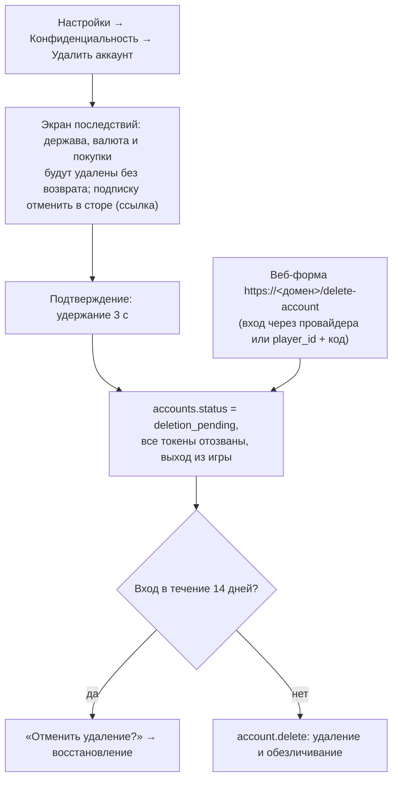

- **Срок.** Окно отмены 14 дней (ПА), затем удаление. Окно и срок явно показываются игроку на экране последствий. Если ревью Apple сочтёт окно лишним, переключатель `deletion_grace_days` ставится в 0, и удаление идёт сразу (ПА).
- **Что удаляется:** `accounts` (кроме записи-надгробия: `account_id`, дата, без персональных данных), `account_links`, `devices`, `player_state`, `worlds`, `world_events`, `wars`, `battles`, кошелёк, инвентарь, друзья, сообщения чата, флаги античита, записи в Арене и лидербордах.
- **Что обезличивается и хранится:** `purchases`, `wallet_ledger` (платная часть) и `case_opens` — нужны для бухгалтерии, споров и возвратов. `player_id` в них заменяется случайным идентификатором надгробия (ПА, сроки хранения уточнить по налоговым требованиям страны владельца).
- **Внешние системы:** RevenueCat — удаление подписчика через API; Firebase Analytics — User Deletion API по `user_id`; Crashlytics — истечение срока хранения (90 дней); Parquet аналитики — ежемесячная компакция удаляет строки удалённых `player_id`; рекламные партнёры — по их процедурам, где есть API.
- **Бэкапы** истекают сами (≤8 недель, §16.3). При любом восстановлении из бэкапа сначала повторно применяется список надгробий (`deletion_requests`).
- **Подписка** не отменяется нами технически. Экран прямо говорит отменить её в сторе и даёт диплинк.

### 17.6. Безопасность инфраструктуры и кода

| Мера | Реализация |
|---|---|
| Транспорт | только HTTPS/WSS; Cloudflare «Full (strict)» с Origin CA на Caddy; HSTS |
| Сеть | БД без публичного адреса; Cloud Firewall: 443 только с IP Cloudflare, SSH только по ключам с allowlist адресов CI и владельца; fail2ban |
| Доступ | SSH-ключи агента в CI с ограниченными правами (пользователь `deploy`, только `docker compose`); у владельца — аварийный root-ключ; 2FA на всех аккаунтах сервисов (владелец) |
| Роли БД | `app_rw` (без DDL), `migrator` (DDL, только в деплое), `analytics_ro` (реплика / экспорт), `backup` |
| Секреты | GitHub Environments + systemd credentials на серверах; ротация раз в 180 дней и немедленно при утечке (ПА) |
| Зависимости | Renovate, `pnpm audit` в CI (high → красный), фиксированные версии, лицензионный аудит |
| Код | ESLint security-правила, Semgrep OSS в CI (ПА), запрет `eval` и динамических импортов по строкам из сети |
| Админка | только через Cloudflare Access (e-mail владельца) + отдельный admin JWT; все действия пишутся в `admin_audit` |
| Инциденты | runbooks в `infra/runbooks/`: утечка ключа, компрометация аккаунта стора, DDoS, порча данных, утечка персональных данных (72 ч) |

### 17.7. Чат: техническая модерация

Правила — канон §14.9 (языковые каналы, 1 сообщение в 5 с, автомут при 3 жалобах от разных игроков за 1 ч, блокировка, мут каналов, `u13` — только фразы). Реализация:

1. **Клиентский фильтр** — словари мата по 12 языкам и регулярные выражения ссылок, телефонов и e-mail. Мгновенная обратная связь «Сообщение не отправлено».
2. **Серверный фильтр** — те же словари плюс нормализация (лит-спик, разделители, гомоглифы). Отфильтрованное слово заменяется звёздочками.
3. **Автоматическая модерация** — многоязычная модель токсичности (класс XLM-R, экспорт в ONNX, CPU в `worker`, ~20–40 мс на сообщение) (ПА). Порог «скрыть» — сообщение видит только автор; порог «подозрение» — помечается для выборочной проверки. Запасной путь — внешний бесплатный API модерации текста (вопрос 11 в §20.3).
4. **Жалоба** скрывает сообщение у пожаловавшегося сразу. 3 жалобы от разных игроков за 1 ч → автомут на 24 ч (канон) → очередь проверки.
5. **Контакт для обращений** — в настройках (Apple 1.2, Google UGC). Серьёзные случаи (угрозы, вред себе) агент поднимает владельцу как P1.
